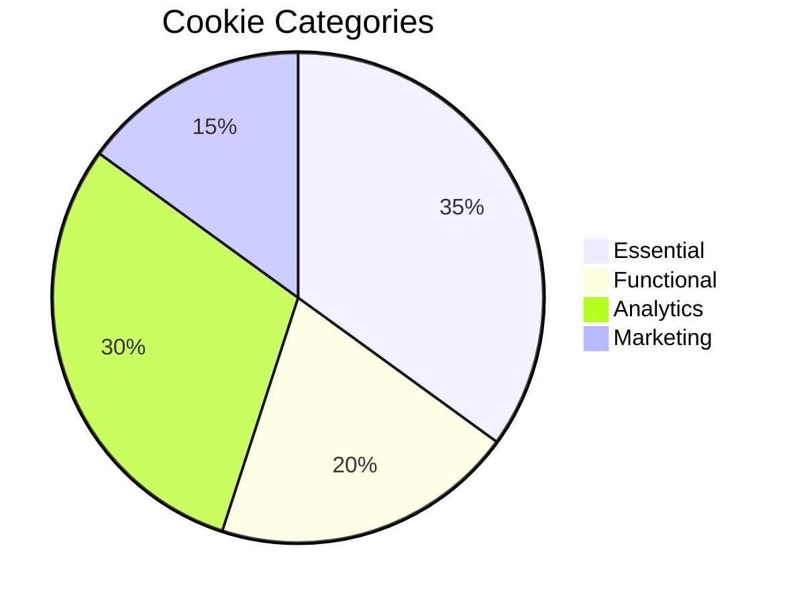

# Cookie Policy

**Last Updated:** July 2026

## What Are Cookies

Cookies are small text files stored on your device by your web browser when you visit a website. They help the website function properly, improve your experience, and provide analytics information.

## Cookies We Use

### Essential Cookies

These cookies are necessary for the website to function and cannot be switched off.

| Cookie               | Purpose                                    | Duration | Provider  |
| -------------------- | ------------------------------------------ | -------- | --------- |
| `admin_access_token` | Session authentication for admin dashboard | Session  | Portfolio |
| `refresh_token`      | Token refresh for authenticated sessions   | 7 days   | Portfolio |
| `csrf-token`         | Cross-site request forgery protection      | Session  | Portfolio |
| `_csrf`              | CSRF token cookie                          | Session  | Portfolio |

### Analytics Cookies

We use PostHog to understand how visitors interact with our website.

| Cookie         | Purpose                                                | Duration  | Provider |
| -------------- | ------------------------------------------------------ | --------- | -------- |
| `ph_*`         | Product analytics (page views, sessions, interactions) | 26 months | PostHog  |
| `ph_*_posthog` | Session identification and user attribution            | 1 year    | PostHog  |

### Preference Cookies

These cookies remember your settings and preferences.

| Cookie           | Purpose                                | Duration | Provider  |
| ---------------- | -------------------------------------- | -------- | --------- |
| `theme`          | Stores your light/dark mode preference | 1 year   | Portfolio |
| `cookie-consent` | Records your cookie consent choice     | 1 year   | Portfolio |

## Third-Party Cookies

We may use services that set their own cookies:

| Service | Purpose                                 | More Information                               |
| ------- | --------------------------------------- | ---------------------------------------------- |
| Vercel  | Hosting and performance analytics       | [Vercel Privacy](https://vercel.com/privacy)   |
| PostHog | Product analytics                       | [PostHog Privacy](https://posthog.com/privacy) |
| Sentry  | Error monitoring (minimal, no tracking) | [Sentry Privacy](https://sentry.com/privacy)   |

## How to Manage Cookies

### Browser Controls

Most browsers allow you to control cookies through their settings:

- **Google Chrome:** Settings Privacy and security Cookies and other site data
- **Mozilla Firefox:** Options Privacy & Security Cookies and Site Data
- **Safari:** Preferences Privacy Manage Website Data
- **Microsoft Edge:** Settings Cookies and site permissions

You can also use your browser's incognito or private browsing mode to limit cookie persistence.

### Cookie Consent Banner

On your first visit, we display a cookie consent banner that allows you to:

- Accept all cookies
- Decline non-essential cookies (essential cookies will still be set)
- Customize your preferences

You can change your preferences at any time by clicking the cookie settings link in the website footer.

## Consequences of Disabling Cookies

- **Essential cookies disabled:** The admin dashboard and authenticated features may not function
- **Analytics cookies disabled:** Core site functionality is unaffected
- **Preference cookies disabled:** Theme preferences will reset each session

## Do Not Track Signals

Our website does not currently respond to "Do Not Track" (DNT) signals. We will update this policy if we implement DNT support in the future.

---

## Cookie Categories Overview

## Updates to This Policy

We may update this Cookie Policy from time to time. Changes will be posted here with an updated "Last Updated" date.

## Contact

For questions about our use of cookies:

- **Email:** [privacy@portfolio.dev](mailto:privacy@portfolio.dev)
- **Privacy Policy:** [privacy-policy.md](privacy-policy.md)

## Cross-References

- [../MASTER-INDEX.md](../MASTER-INDEX.md) — Documentation master index
- [../26-reference/CROSS-REFERENCE-INDEX.md](../26-reference/CROSS-REFERENCE-INDEX.md) — Cross-reference system
