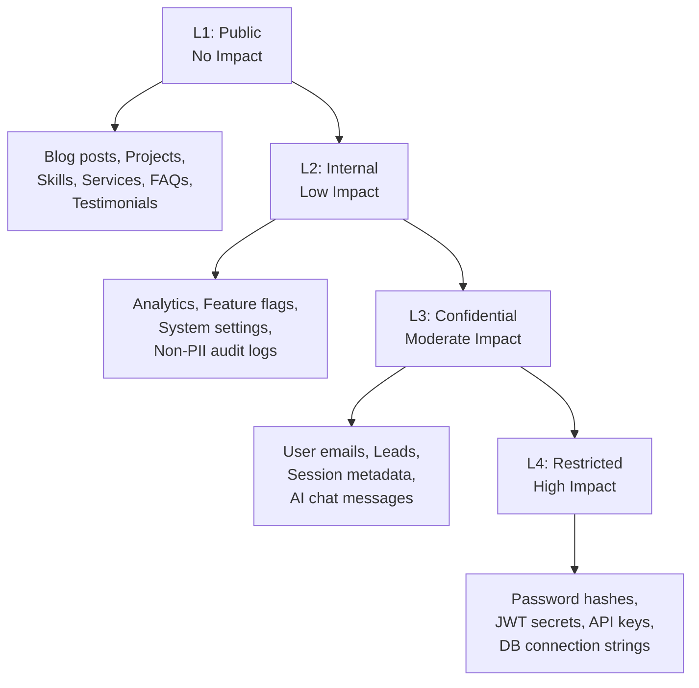

# Data Classification Policy

> **Document:** `data-classification.md` | **Version:** 1.0 | **Last Updated:** July 2026
> **Status:** ✅ Active | **Standard:** NIST 800-60, ISO/IEC 27001:2022
> **Owner:** Data Protection Officer | **Review Cadence:** Annual
> **Classification:** L3-Confidential

---

## 1. Purpose and Scope

This Data Classification Policy establishes a standardized framework for classifying all data processed, stored, or transmitted by the Portfolio platform. It defines classification levels, handling requirements, and responsibilities in alignment with NIST 800-60 (Volume I & II) guidelines for mapping types of information and information systems to security categories, and ISO/IEC 27001:2022 Annex A controls for information classification (A.5.12, A.5.13, A.8.2).

**Scope:** All data created, collected, processed, stored, or transmitted by the Portfolio platform — including data in the production database (Supabase/PostgreSQL), Redis cache, application logs (Pino), error monitoring (Sentry), analytics (PostHog), email queue (BullMQ/Resend), AI service (OpenAI/Anthropic), and any ephemeral or backup storage.

---

## 2. Classification Framework

### 2.1 Classification Levels

The platform uses a four-tier classification system aligned with NIST FIPS 199 (potential impact) and NIST 800-60 (information type mapping):

| Level  | Label        | FIPS 199 Impact | Definition                                                                                                                                                                                                                                | Examples                                                                                                                                                                                          |
| ------ | ------------ | --------------- | ----------------------------------------------------------------------------------------------------------------------------------------------------------------------------------------------------------------------------------------- | ------------------------------------------------------------------------------------------------------------------------------------------------------------------------------------------------- |
| **L1** | Public       | No impact       | Information that may be freely disclosed without any harm to individuals, the platform, or its operators. No access restrictions.                                                                                                         | Portfolio project descriptions, blog posts, public API response schemas, published media, testimonials, service descriptions                                                                      |
| **L2** | Internal     | Low impact      | Information whose disclosure would cause limited or minor adverse effects. Authorized internal use only; not for public distribution.                                                                                                     | Aggregated analytics, feature flags, non-sensitive system configuration, internal documentation, deployment status metrics, audit logs (non-PII)                                                  |
| **L3** | Confidential | Moderate impact | Information whose disclosure would cause moderate harm to individuals (privacy), business operations, or reputation. Requires controlled access with encryption and logging.                                                              | User email addresses, lead/contact form data, user roles/permissions, admin account details, session metadata, error stack traces containing PII, notification preferences                        |
| **L4** | Restricted   | High impact     | Information whose disclosure would cause severe or catastrophic harm. Subject to the highest level of security controls including encryption at rest and in transit, strict access control, rotation policies, and detailed audit trails. | Password hashes (bcrypt), JWT signing secrets, API keys (third-party service credentials), refresh tokens, database connection strings, encryption keys, SMTP credentials, OAuth provider secrets |

### 2.1a Data Classification Hierarchy



### 2.2 Impact Assessment Criteria

Per NIST 800-60, classification is determined by assessing the potential impact of a **confidentiality breach** (unauthorized disclosure) across three objectives:

| Objective           | L1 — Public | L2 — Internal     | L3 — Confidential  | L4 — Restricted    |
| ------------------- | ----------------- | ----------------------- | ------------------------ | ------------------------ |
| **Confidentiality** | No harm           | Limited adverse effects | Moderate adverse effects | Severe/catastrophic harm |
| **Integrity**       | No harm           | Limited adverse effects | Moderate adverse effects | Severe/catastrophic harm |
| **Availability**    | No harm           | Limited adverse effects | Moderate adverse effects | Severe/catastrophic harm |

---

## 3. Data Inventory by Classification

### 3.1 Master Data Register

| Model / Data Set                                                              | Classification                                                            | Rationale                                            | Primary Storage                                    | Specific Controls                                                                                                                                            |
| ----------------------------------------------------------------------------- | ------------------------------------------------------------------------- | ---------------------------------------------------- | -------------------------------------------------- | ------------------------------------------------------------------------------------------------------------------------------------------------------------ |
| **User** (email, password hash, role, OAuth ID)                               | **L3-Confidential** (email, role) / **L4-Restricted** (password hash)     | PII + authentication credentials                     | Supabase `User` table                              | bcrypt password hashing (cost factor 12), RBAC, audit logging for role changes, MFA enforcement for admin                                                    |
| **Session** (JWT access token, refresh token, IP, user agent)                 | **L3-Confidential** (metadata) / **L4-Restricted** (tokens)               | Authentication tokens enable account access          | Redis (ephemeral with TTL)                         | JWT signed with HS256, refresh tokens hashed in Redis, 15-min access token TTL, 7-day refresh token TTL, rotation on use                                     |
| **Lead** (name, email, phone, company, message)                               | **L3-Confidential**                                                       | PII collected via contact form with consent          | Supabase `Lead` table                              | TLS 1.3 in transit, AES-256 at rest, 90-day retention auto-purge, RBAC (admin-only access), consent record retained                                          |
| **Analytics Event** (page views, events, session, device info, anonymized IP) | **L2-Internal**                                                           | Pseudonymized, non-identifiable usage data           | PostHog                                            | IP anonymization on ingestion, data retention capped at 90 days, aggregated reporting only, no export of raw event streams                                   |
| **Blog Post** (title, content, metadata, author)                              | **L1-Public**                                                             | Published content intended for public consumption    | Supabase `BlogPost` table                          | No access restrictions; public API endpoints. Integrity protected via RBAC (only editors/authors may modify)                                                 |
| **Project / Section / Skill / Experience / Service / FAQ** (content data)     | **L1-Public**                                                             | Published portfolio content                          | Supabase respective tables                         | Public read access; write access restricted to editors/admin via RBAC                                                                                        |
| **API Key** (hashed key value, permissions, name)                             | **L4-Restricted**                                                         | System-to-system credential                          | Supabase `ApiKey` table                            | Hashed with SHA-256 before storage, prefix stored in plain for identification, granular permissions per key, rotation reminders at 90 days, full audit trail |
| **System Settings** (site config, feature flags, thresholds)                  | **L2-Internal**                                                           | Internal operational configuration                   | Supabase `SystemSetting` table                     | Admin-only CRUD, audit logged on all mutations, no PII                                                                                                       |
| **Achievement / Press Feature / Guest Appearance / Reading List**             | **L1-Public**                                                             | Public portfolio metadata                            | Supabase respective tables                         | Public read access; admin/editor write access                                                                                                                |
| **AI Chat Message** (conversation text, timestamps)                           | **L3-Confidential**                                                       | User-generated content with consent-based processing | Transient (not stored persistently beyond 30 days) | Consent recorded before processing, no training use, external processor (OpenAI/Anthropic) under DPA + zero-retention API, auto-delete after 30 days         |
| **Error Log** (stack trace, request context, user ID)                         | **L2-Internal** (default) / **L3-Confidential** (if PII present)          | Error diagnostic data                                | Sentry                                             | PII scrubbing before dispatch (Sentry before-send filter), retention capped at 90 days, access restricted to engineering team                                |
| **Email Notification** (email address, template data, delivery status)        | **L3-Confidential**                                                       | Email addresses are PII                              | Resend + BullMQ queue                              | TLS delivery, queue-based async sending, no persistent storage of email content after delivery, delivery logs anonymized after 90 days                       |
| **Audit Log** (actor, action, resource, timestamp, IP)                        | **L2-Internal**                                                           | Non-PII operational audit trail                      | Supabase `AuditLog` table                          | Append-only, immutable after write, 1-year retention, admin-only query access                                                                                |
| **Media / Uploaded Images**                                                   | **L3-Confidential** (if containing PII) / **L1-Public** (published media) | User-uploaded content                                | Supabase Storage                                   | Access control per bucket (public vs. private), URL signing for private assets, virus scanning on upload, EXIF data stripping                                |

### 3.2 Data in Transit Classification

All data moving across network boundaries inherits the classification of its most sensitive payload. Regardless of classification level, **all data in transit must use TLS 1.3** (minimum TLS 1.2 for legacy compatibility where unavoidable).

---

## 4. Handling Requirements by Level

### 4.1 Control Matrix

| Control                          | L1 — Public   | L2 — Internal                    | L3 — Confidential                              | L4 — Restricted                                  |
| -------------------------------- | ------------------- | -------------------------------------- | ---------------------------------------------------- | ------------------------------------------------------ |
| **Encryption at rest**           | Not required        | Recommended (inherited from platform)  | Required (AES-256)                                   | Required (AES-256)                                     |
| **Encryption in transit**        | TLS 1.3 recommended | TLS 1.3 required                       | TLS 1.3 required                                     | TLS 1.3 required with HSTS                             |
| **Access control**               | None                | Role-based (authenticated users)       | Role-based + least privilege (specific roles/groups) | Role-based + explicit approval + break-glass procedure |
| **Authentication required**      | No                  | Recommended for write                  | Required                                             | Required + MFA                                         |
| **Logging / Audit trail**        | Not required        | Recommended (for mutations)            | Required on all access and mutations                 | Required on all access, mutations, and failed attempts |
| **Data retention**               | Unlimited           | Defined per use case                   | Strictly enforced schedule                           | Minimum necessary; periodic review                     |
| **Data minimization**            | N/A                 | N/A                                    | Collect only what is necessary                       | Collect only what is strictly necessary                |
| **Sharing / Disclosure**         | Unlimited           | Internal only (vetted recipients)      | Need-to-know + written approval                      | Need-to-know + explicit approval + documented          |
| **Destruction**                  | Not required        | Shredding / secure delete for physical | Secure wipe / cryptographic erase                    | Cryptographic erase + certificate of destruction       |
| **Backup encryption**            | Not required        | Recommended                            | Required                                             | Required                                               |
| **Pseudonymization**             | N/A                 | Recommended                            | Required where feasible                              | Not applicable (high sensitivity)                      |
| **Data classification marking**  | Not required        | Recommended in metadata                | Required in metadata                                 | Required in metadata + prominent marking               |
| **Breach notification required** | No                  | If aggregated with higher-class data   | Yes                                                  | Yes (immediate)                                        |

### 4.2 Labeling and Marking

| Level | Label        | Metadata Tag                   | Storage Bucket                                     |
| ----- | ------------ | ------------------------------ | -------------------------------------------------- |
| L1    | PUBLIC       | `classification: public`       | Default (no restriction)                           |
| L2    | INTERNAL     | `classification: internal`     | RBAC-protected                                     |
| L3    | CONFIDENTIAL | `classification: confidential` | RBAC-protected + encrypted column                  |
| L4    | RESTRICTED   | `classification: restricted`   | RBAC-protected + encrypted column + separate vault |

Data classification labels are stored as metadata on each database record where feasible. For granular data fields within a record (e.g., a User record with both L3 and L4 fields), the classification of the **most restrictive field** governs the record as a whole.

### 4.3 Handling Rules by Storage Medium

| Medium                        | L1                     | L2                              | L3                                                                    | L4                                                           |
| ----------------------------- | ---------------------- | ------------------------------- | --------------------------------------------------------------------- | ------------------------------------------------------------ |
| **Database (Supabase)**       | Public table (RLS off) | RLS enabled, authenticated read | RLS + row-level restrictions + column encryption for sensitive fields | RLS + row-level + column encryption + restricted access role |
| **Redis Cache**               | Cache publicly         | Cache with basic auth           | Do not cache unless encrypted                                         | Do not cache                                                 |
| **Logs (Pino)**               | Log freely             | Log with context                | Redact or hash before logging                                         | Never log                                                    |
| **Error Monitoring (Sentry)** | Include                | Include (no PII)                | Strip before sending; or fingerprint hashing                          | Never send to external monitoring                            |
| **Analytics (PostHog)**       | Track                  | Track (anonymized)              | Exclude from analytics                                                | Exclude from analytics                                       |
| **Backups**                   | No special handling    | Encrypted                       | Encrypted + access controlled                                         | Encrypted + access controlled + separate rotation            |

---

## 5. Data Lifecycle Management

| Phase           | L1              | L2                            | L3                                       | L4                                                         |
| --------------- | --------------- | ----------------------------- | ---------------------------------------- | ---------------------------------------------------------- |
| **Collection**  | No restrictions | Purpose-defined collection    | Explicit consent or legal basis required | Strict necessity only; documented approval                 |
| **Storage**     | Default         | Secured by platform defaults  | Encrypted + access-controlled            | Encrypted + vault + rotation                               |
| **Usage**       | Unrestricted    | Authorized internal use       | Need-to-know basis                       | Strict need-to-know + documented                           |
| **Archival**    | Not needed      | Compressed, access-controlled | Encrypted archive, access-controlled     | Encrypted archive + offline storage + strict access        |
| **Destruction** | Not needed      | Secure deletion               | Cryptographic erasure                    | Cryptographic erasure + certificate of destruction + audit |

---

## 6. Classification Responsibilities

### 6.1 Role Assignments

| Role                              | Responsibility                                                                                                                                                               |
| --------------------------------- | ---------------------------------------------------------------------------------------------------------------------------------------------------------------------------- |
| **Data Owner**                    | Classifies data at creation; reviews classification annually; approves access requests for their data domain                                                                 |
| **Data Steward**                  | Implements classification labels in systems; ensures data quality; monitors compliance with handling requirements                                                            |
| **Engineering**                   | Implements technical controls per classification (encryption, access control, logging, retention enforcement); conducts code reviews for proper handling                     |
| **Security Team**                 | Audits classification compliance annually; reviews classification of new data types; investigates classification-related incidents                                           |
| **Data Protection Officer (DPO)** | Oversees classification framework; reviews classification decisions for sensitive data (L3/L4); approves classification policy changes; liaises with supervisory authorities |
| **All Personnel**                 | Handles data according to its classification level; reports suspected classification errors or data handling violations                                                      |

### 6.2 Classification Decision Flow

```
New data entity created
    ↓
Data Owner assesses: What is the confidentiality impact if disclosed?
    ↓
Apply FIPS 199 potential impact:
  - No impact  → L1 (Public)
  - Limited    → L2 (Internal)
  - Moderate   → L3 (Confidential)
  - Severe     → L4 (Restricted)
    ↓
Document classification decision + rationale in data register
    ↓
Engineering implements technical controls per handling matrix
    ↓
Security reviews classification annually or on material change
```

### 6.3 Reclassification

Data may be reclassified (up or down) by the Data Owner with DPO approval. Triggers for reclassification include:

- Change in applicable law or regulation
- Change in data use or processing purpose
- Data aggregation creating new sensitivity
- De-identification or pseudonymization of previously identifiable data
- Expiration of embargo period (e.g., unpublished feature details)

Reclassification is documented with: previous classification, new classification, rationale, date, and approving authority.

---

## 7. Data Sharing and Disclosure

| Classification              | Internal Sharing                           | External Sharing                                                         | Public Disclosure |
| --------------------------- | ------------------------------------------ | ------------------------------------------------------------------------ | ----------------- |
| **L1 — Public**       | Unlimited                                  | Unlimited                                                                | Yes               |
| **L2 — Internal**     | Any employee/contractor                    | With NDA/DPA                                                             | No                |
| **L3 — Confidential** | Need-to-know + written approval            | With DPA + written agreement, data processing agreement required         | No                |
| **L4 — Restricted**   | Need-to-know + explicit approval + logging | Only if absolutely required, with DPA + security assessment + encryption | No                |

---

## 8. Non-Compliance

### 8.1 Policy Violations

Failure to properly classify data, or mishandling data in a manner inconsistent with its classification level, constitutes a policy violation. Violations are addressed according to severity:

| Severity     | Criteria                              | Response                                                                              |
| ------------ | ------------------------------------- | ------------------------------------------------------------------------------------- |
| **Critical** | L4 data exposed or improperly handled | Immediate incident response; root cause analysis; mandatory retraining; policy review |
| **High**     | L3 data exposed or improperly handled | Root cause analysis; corrective action plan; retraining                               |
| **Medium**   | L2 data exposed or improperly handled | Process review; awareness reminder                                                    |
| **Low**      | L1 data misclassified as higher level | Reclassification; documentation update                                                |

### 8.2 Reporting

Suspected classification errors or data handling violations must be reported to the DPO (dpo@portfolio.dev) within 24 hours of discovery.

---

## 9. Related Documents

| Document               | Location                                   | Relationship                                |
| ---------------------- | ------------------------------------------ | ------------------------------------------- |
| GDPR Compliance        | `docs/compliance/gdpr.md`                  | Data processing register, lawful bases      |
| Data Governance Policy | `docs/11-security/43-DATA-GOVERNANCE.md`   | Governance framework, roles, accountability |
| Security Architecture  | `docs/11-security/SecurityArchitecture.md` | Technical security controls implementation  |
| Audit Logging          | `docs/11-security/AuditLogging.md`         | Audit trail requirements and retention      |
| Secrets Management     | `docs/11-security/SecretsManagement.md`    | L4 handling for secrets and credentials     |
| Privacy Policy         | `docs/compliance/privacy-policy.md`        | Public-facing data use disclosures          |
| Compliance Register    | `docs/11-security/16-COMPLIANCE.md`        | Full compliance register and obligations    |

---

## 10. Review and Maintenance

| Activity                               | Frequency                        | Owner            |
| -------------------------------------- | -------------------------------- | ---------------- |
| Classification framework review        | Annually                         | DPO              |
| Data register audit (all new entities) | Per release                      | Data Steward     |
| Control effectiveness review           | Quarterly                        | Security Team    |
| Reclassification processing            | As needed                        | Data Owner + DPO |
| Policy update                          | Annually or on regulatory change | DPO              |

---

## 11. Change Log

| Version | Date      | Author | Changes                                                  |
| ------- | --------- | ------ | -------------------------------------------------------- |
| 1.0     | July 2026 | DPO    | Initial data classification policy (NIST 800-60 aligned) |

## Cross-References

- [../MASTER-INDEX.md](../MASTER-INDEX.md) — Documentation master index
- [../26-reference/CROSS-REFERENCE-INDEX.md](../26-reference/CROSS-REFERENCE-INDEX.md) — Cross-reference system
