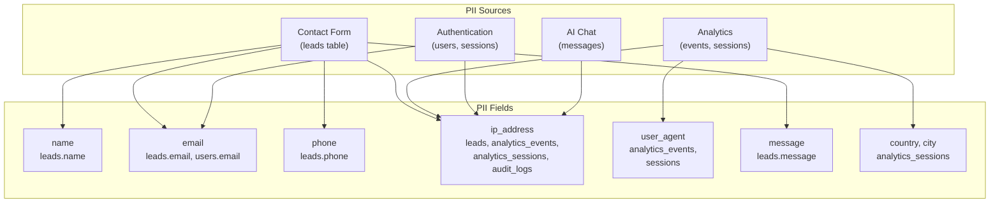
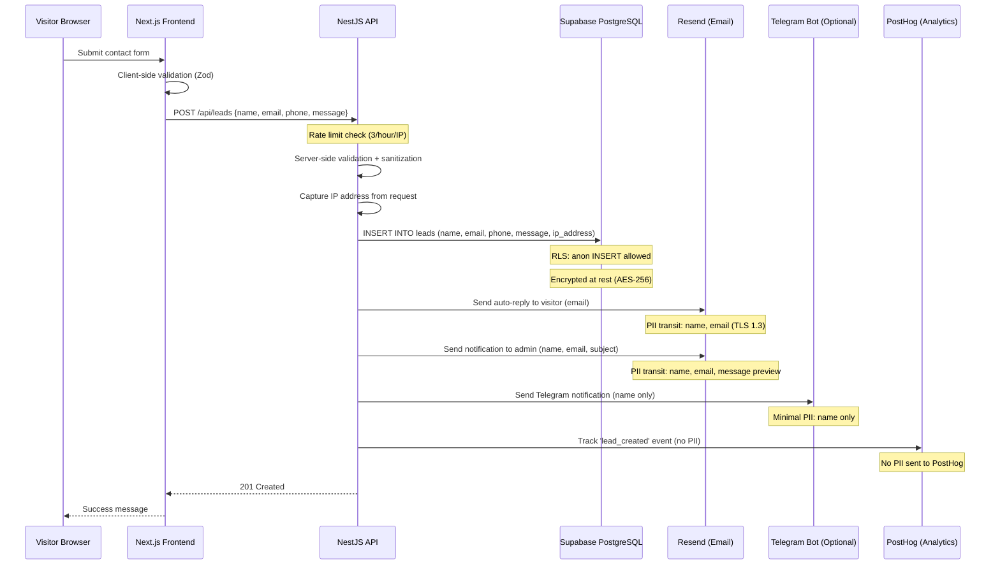
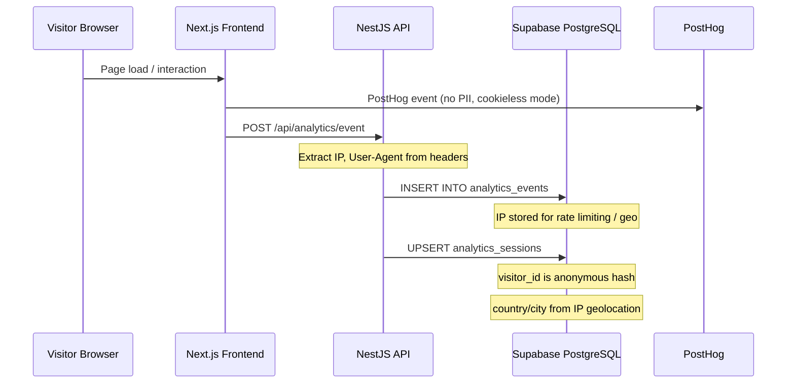
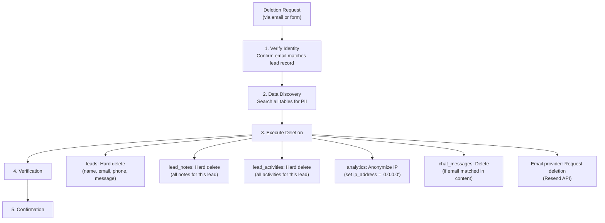
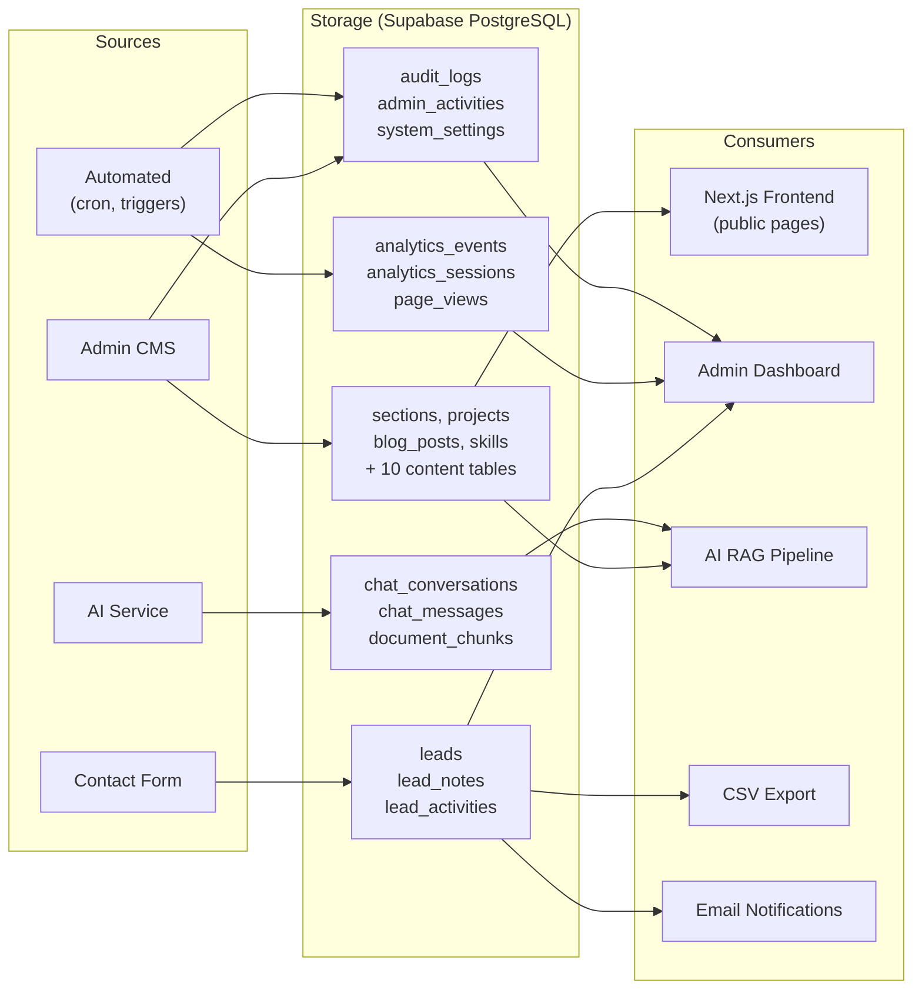
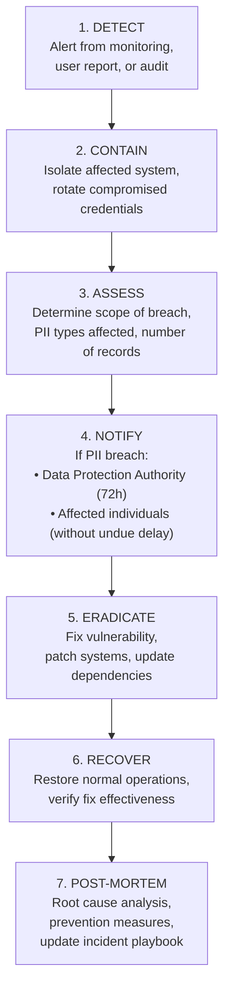

# Data Governance Framework — Enterprise Data Stewardship

> **Document:** `43-DATA-GOVERNANCE.md` | **Version:** 1.0 | **Last Updated:** June 2026  
> **Status:** ✅ Active | **Owner:** Principal Data Architect | **Review Cadence:** Quarterly  
> **Classification:** Enterprise Architecture | **Compliance:** GDPR, CCPA, OWASP ASVS L2  
> **Related:** [DatabaseArchitecture.md](./DatabaseArchitecture.md) | [SecurityArchitecture.md](./SecurityArchitecture.md) | [15-AUTHORIZATION.md](./15-AUTHORIZATION.md)

---

## Executive Summary

Defines data governance policies - data classification, lifecycle management, retention schedules, privacy controls, audit logging, and data quality monitoring.

---
## Table of Contents

1. [Data Classification Matrix](#1-data-classification-matrix)
2. [PII Inventory](#2-pii-inventory)
3. [Data Flow Diagrams](#3-data-flow-diagrams)
4. [Retention Policies](#4-retention-policies)
5. [Data Access Controls](#5-data-access-controls)
6. [Right to Deletion Procedure](#6-right-to-deletion-procedure)
7. [Data Quality Framework](#7-data-quality-framework)
8. [Data Lineage](#8-data-lineage)
9. [Breach Response Plan](#9-breach-response-plan)

---

## 1. Data Classification Matrix

### 1.1 Classification Levels

| Level | Label | Description | Examples | Handling Requirements |
|:-----:|-------|-------------|----------|----------------------|
| **L4** | 🔴 Restricted | Data whose exposure would cause severe harm. Requires encryption at rest + transit, audit logging, access controls | Passwords, API keys, OAuth tokens, refresh tokens | Encrypted at rest (AES-256), transit (TLS 1.3), access logged, never in logs/exports |
| **L3** | 🟠 Confidential | PII or business-sensitive data. Requires access controls and audit logging | Names, emails, phone numbers, IP addresses, lead messages | Encrypted at rest, access-controlled via RLS, included in PII inventory, GDPR-eligible |
| **L2** | 🟡 Internal | Operational data visible only to admin. Not PII but business-relevant | Analytics events, system settings, feature flags, audit logs | Admin-only access, no public exposure, standard backup |
| **L1** | 🟢 Public | Intentionally public content. No special handling required | Published projects, blog posts, skills, testimonials, availability status | CDN-cacheable, no access restrictions, SEO-indexed |

### 1.2 Table Classification Matrix

| Table | Classification | PII Fields | Encryption | RLS | Retention |
|-------|:---:|---|:---:|:---:|---|
| `users` | 🔴 L4 | `email` | ✅ AES-256 | ✅ | Indefinite |
| `sessions` | 🔴 L4 | `refresh_token`, `ip_address` | ✅ AES-256 | ✅ | 30 days |
| `api_keys` | 🔴 L4 | `key_hash` | ✅ Hashed (SHA-256) | ✅ | Indefinite |
| `leads` | 🟠 L3 | `name`, `email`, `phone`, `ip_address`, `message` | ✅ AES-256 | ✅ | 2 years |
| `lead_notes` | 🟠 L3 | `content` (may contain PII) | ✅ AES-256 | ✅ | 2 years |
| `lead_activities` | 🟠 L3 | `ip_address` | ✅ AES-256 | ✅ | 2 years |
| `analytics_events` | 🟡 L2 | `ip_address`, `user_agent` | ✅ AES-256 | ✅ | 1 year |
| `analytics_sessions` | 🟡 L2 | `visitor_id`, `country`, `city` | ✅ AES-256 | ✅ | 1 year |
| `page_views` | 🟡 L2 | None | Standard | ✅ | 1 year |
| `chat_conversations` | 🟡 L2 | `visitor_id` | Standard | ✅ | 30 days |
| `chat_messages` | 🟡 L2 | `content` (user queries) | Standard | ✅ | 30 days |
| `audit_logs` | 🟡 L2 | `ip_address`, `actor_id` | ✅ AES-256 | ✅ | 1 year |
| `admin_activities` | 🟡 L2 | `ip_address` | ✅ AES-256 | ✅ | 1 year |
| `sections` | 🟢 L1 | None | Standard | ✅ | Indefinite |
| `projects` | 🟢 L1 | None | Standard | ✅ | Indefinite |
| `blog_posts` | 🟢 L1 | None | Standard | ✅ | Indefinite |
| `testimonials` | 🟢 L1 | `name` (public attribution) | Standard | ✅ | Indefinite |
| All other content tables | 🟢 L1 | None | Standard | ✅ | Indefinite |

---

## 2. PII Inventory

### 2.1 Complete PII Field Map



### 2.2 PII Field Detailed Inventory

| Field | Tables | Data Type | Collection Purpose | Legal Basis (GDPR) | Retention |
|-------|--------|-----------|-------------------|--------------------|-----------| 
| `name` | `leads` | TEXT | Contact form — identify inquirer | Legitimate interest (Art. 6(1)(f)) | 2 years |
| `email` | `leads`, `users` | TEXT | Contact reply, authentication | Contract performance (Art. 6(1)(b)) | Leads: 2 years, Users: indefinite |
| `phone` | `leads` | TEXT (nullable) | Optional — callback preference | Consent (Art. 6(1)(a)) | 2 years |
| `ip_address` | `leads`, `analytics_*`, `audit_logs`, `sessions` | INET | Rate limiting, fraud prevention, geolocation | Legitimate interest (Art. 6(1)(f)) | Varies by table |
| `user_agent` | `analytics_events`, `sessions` | TEXT | Device/browser analytics, fraud detection | Legitimate interest (Art. 6(1)(f)) | 1 year |
| `message` | `leads` | TEXT | Contact form content | Contract performance (Art. 6(1)(b)) | 2 years |
| `country`, `city` | `analytics_sessions` | TEXT | Geographic analytics | Legitimate interest (Art. 6(1)(f)) | 1 year |
| `visitor_id` | `analytics_sessions`, `chat_conversations` | TEXT | Session correlation (anonymous hash) | Legitimate interest (Art. 6(1)(f)) | 1 year / 30 days |
| `content` | `chat_messages` | TEXT | AI chat history (may contain PII) | Consent (Art. 6(1)(a)) | 30 days |

---

## 3. Data Flow Diagrams

### 3.1 Contact Form PII Flow



### 3.2 Analytics PII Flow



---

## 4. Retention Policies

### 4.1 Consolidated Retention Matrix

| Data Category | Tables | Retention Period | Deletion Method | Automation |
|--------------|--------|:----------------:|-----------------|:----------:|
| **Authentication** | `users` | Indefinite | Manual only | ❌ |
| **Sessions** | `sessions` | 30 days after expiry | Hard delete | ✅ Cron |
| **Content** | `sections`, `projects`, `blog_posts`, etc. | Indefinite | Admin CMS delete | ❌ |
| **Leads** | `leads`, `lead_notes`, `lead_activities` | 2 years from creation | Soft delete → hard purge | ✅ Cron |
| **Analytics** | `analytics_events`, `analytics_sessions`, `page_views` | 1 year | Partition drop | ✅ Cron |
| **AI Chat** | `chat_conversations`, `chat_messages` | 30 days from last activity | Hard delete | ✅ Cron |
| **AI Knowledge** | `document_chunks`, `embeddings_cache` | Indefinite (content-linked) | Manual rebuild | ❌ |
| **Audit Logs** | `audit_logs`, `admin_activities` | 1 year | Hard delete | ✅ Cron |
| **Notifications** | `notifications` | 90 days | Hard delete | ✅ Cron |
| **Media** | `media_assets` | Indefinite (soft-delete available) | Soft delete | ❌ |
| **API Keys** | `api_keys` | Indefinite (revoke, never delete) | Revocation only | ❌ |
| **Feature Flags** | `feature_flags` | Indefinite | Admin delete | ❌ |
| **System Settings** | `system_settings` | Indefinite | Admin manage | ❌ |

### 4.2 Automated Cleanup Cron Jobs

```sql
-- Run daily at 02:00 UTC

-- 1. Purge expired sessions
DELETE FROM sessions 
WHERE expires_at < NOW() - INTERVAL '30 days';

-- 2. Hard-purge soft-deleted leads older than 2 years
DELETE FROM lead_activities 
WHERE lead_id IN (SELECT id FROM leads WHERE deleted_at < NOW() - INTERVAL '2 years');
DELETE FROM lead_notes 
WHERE lead_id IN (SELECT id FROM leads WHERE deleted_at < NOW() - INTERVAL '2 years');
DELETE FROM leads 
WHERE deleted_at < NOW() - INTERVAL '2 years';

-- 3. Purge analytics older than 1 year
DELETE FROM analytics_events WHERE created_at < NOW() - INTERVAL '1 year';
DELETE FROM page_views WHERE viewed_at < NOW() - INTERVAL '1 year';
DELETE FROM analytics_sessions WHERE created_at < NOW() - INTERVAL '1 year';

-- 4. Purge AI chat older than 30 days
DELETE FROM chat_messages 
WHERE conversation_id IN (SELECT id FROM chat_conversations WHERE last_activity_at < NOW() - INTERVAL '30 days');
DELETE FROM chat_conversations 
WHERE last_activity_at < NOW() - INTERVAL '30 days';

-- 5. Purge old audit logs
DELETE FROM audit_logs WHERE created_at < NOW() - INTERVAL '1 year';
DELETE FROM admin_activities WHERE created_at < NOW() - INTERVAL '1 year';

-- 6. Purge old notifications
DELETE FROM notifications WHERE created_at < NOW() - INTERVAL '90 days';
```

---

## 5. Data Access Controls

### 5.1 Role × Data Access Matrix

| Data Category | Visitor | Admin | API Service | AI Service |
|--------------|:-------:|:-----:|:-----------:|:----------:|
| Public content (L1) | ✅ Read | ✅ Full CRUD | ✅ Read | ✅ Read |
| Lead data (L3) | ✅ Insert only | ✅ Full CRUD | ✅ Full CRUD | ❌ |
| Analytics (L2) | ✅ Insert (server-side) | ✅ Read | ✅ Read/Write | ❌ |
| AI chat (L2) | ✅ Own session | ✅ Full CRUD | ❌ | ✅ Read/Write |
| Auth data (L4) | ❌ | ✅ Own profile | ✅ Verify tokens | ❌ |
| System config (L2) | ❌ | ✅ Full CRUD | ✅ Read | ❌ |
| Audit logs (L2) | ❌ | ✅ Read only | ✅ Write | ❌ |

### 5.2 Service Account Permissions

| Service | Supabase Role | DB Access | Purpose |
|---------|:---:|---|---|
| Next.js (public) | `anon` | RLS-filtered reads, lead/analytics inserts | Public page rendering, form submission |
| Next.js (admin) | `authenticated` | Full access to all tables via JWT | Admin CMS operations |
| NestJS API | `service_role` | Full access (bypasses RLS) | Server-side operations, batch processing |
| FastAPI AI | `service_role` (scoped) | `document_chunks`, `embeddings_cache`, `chat_*` only | RAG pipeline, chat operations |

---

## 6. Right to Deletion Procedure

### 6.1 GDPR Art. 17 — Right to Erasure

When a data subject (contact form submitter) requests deletion of their personal data:



### 6.2 Deletion Script

```sql
-- Execute within a transaction
BEGIN;

-- Step 1: Identify the lead
SELECT id, name, email FROM leads WHERE email = $1;

-- Step 2: Delete lead-related data
DELETE FROM lead_activities WHERE lead_id = $lead_id;
DELETE FROM lead_notes WHERE lead_id = $lead_id;
DELETE FROM leads WHERE id = $lead_id;

-- Step 3: Anonymize analytics (don't delete — preserves aggregate stats)
UPDATE analytics_events SET ip_address = '0.0.0.0'::inet 
WHERE ip_address = $ip_address;
UPDATE analytics_sessions SET visitor_id = 'REDACTED', country = 'REDACTED', city = 'REDACTED'
WHERE visitor_id = $visitor_id;

-- Step 4: Log the deletion (for compliance proof)
INSERT INTO audit_logs (table_name, record_id, action, actor_id, old_values, correlation_id)
VALUES ('leads', $lead_id, 'GDPR_DELETION', $admin_id, 
        '{"email": "[REDACTED]", "reason": "GDPR Art. 17 request"}'::jsonb,
        $correlation_id);

COMMIT;
```

### 6.3 Response Timeline

| Step | SLA | Responsible |
|------|:---:|---|
| Acknowledge request | 3 business days | Admin |
| Execute deletion | 30 calendar days (GDPR maximum) | Admin + automated script |
| Confirm to requester | Within 30 days | Admin |
| Backup purge (Supabase PITR) | 30 days after deletion | Automatic (backup rotation) |

---

## 7. Data Quality Framework

### 7.1 Validation Rules

| Table | Field | Validation | Enforcement |
|-------|-------|------------|:-----------:|
| `leads` | `email` | RFC 5321 regex, max 254 chars | DB CHECK + API (Zod) |
| `leads` | `name` | 2-100 chars, no HTML tags | API (Zod + sanitize) |
| `leads` | `phone` | E.164 format (optional) | API (Zod) |
| `leads` | `message` | 10-5000 chars, sanitized HTML | API (Zod + DOMPurify) |
| `projects` | `slug` | Lowercase, alphanumeric + hyphens | DB CHECK + API |
| `blog_posts` | `slug` | Lowercase, alphanumeric + hyphens | DB CHECK + API |
| `analytics_events` | `event_name` | Enum of known events | API validation |
| All tables | `id` | UUID v4 format | DB DEFAULT |
| All tables | `created_at` | Auto-populated, never null | DB DEFAULT + NOT NULL |

### 7.2 Data Quality Monitoring

| Metric | Threshold | Check Frequency | Alert |
|--------|-----------|:---------------:|:-----:|
| Orphaned records (FK violations) | 0 | Weekly | ✅ |
| NULL required fields | 0 | Daily | ✅ |
| Duplicate leads (same email, same day) | Flag for review | Daily | ✅ |
| Analytics event volume anomaly | ±50% from 7-day average | Hourly | ✅ |
| Database size | < 450MB (90% of free tier) | Daily | ✅ |

---

## 8. Data Lineage

### 8.1 Data Flow Map



---

## 9. Breach Response Plan

### 9.1 Severity Levels

| Level | Description | Example | Response Time |
|:-----:|-------------|---------|:-------------:|
| **P0 Critical** | PII exposed publicly, active exploitation | Database credentials leaked, lead emails scraped | Immediate (< 1 hour) |
| **P1 High** | PII accessible to unauthorized users, no evidence of exploitation | Misconfigured RLS policy, API key exposed in client bundle | < 4 hours |
| **P2 Medium** | Potential PII exposure, no confirmed access | Dependency vulnerability with PII access path | < 24 hours |
| **P3 Low** | Non-PII data exposure, security misconfiguration | Public analytics data visible, debug logs with internal IDs | < 72 hours |

### 9.2 Response Procedure



### 9.3 Incident Response Checklist

| Step | Action | Owner | SLA |
|:----:|--------|-------|:---:|
| 1 | Identify breach scope and affected data | Admin | 1 hour |
| 2 | Rotate all potentially compromised credentials | Admin | 2 hours |
| 3 | Enable maintenance mode if needed | Admin | Immediate |
| 4 | Document timeline and affected records | Admin | 4 hours |
| 5 | Notify authorities if PII breach (GDPR: 72 hours) | Admin | 72 hours |
| 6 | Notify affected individuals | Admin | Without undue delay |
| 7 | Fix root cause | Admin | 24 hours |
| 8 | Post-mortem and prevention plan | Admin | 1 week |
| 9 | Update security policies and monitoring | Admin | 2 weeks |

### 9.4 Communication Templates

**Authority Notification (GDPR Art. 33):**
- Nature of breach
- Categories and approximate number of data subjects
- Contact details of data protection officer (portfolio owner)
- Likely consequences
- Measures taken or proposed

**Individual Notification (GDPR Art. 34):**
- Clear description of what happened
- What data was affected
- What we're doing about it
- What they can do (change passwords, monitor accounts)
- Contact information for questions

---

## Decision Log

| ID | Decision | Rationale | Alternatives | Date | Approver |
|----|----------|-----------|--------------|------|----------|
| GOV-001 | Adopt four-tier data classification (L1–L4) | Aligns with industry standards (ISO 27001, NIST SP 800-60); provides granularity for differential handling | Binary public/private would lack nuance for PII vs secrets; six-tier would overcomplicate | Jun 2026 | Principal Data Architect |
| GOV-002 | Encrypt L3 and L4 data at rest with AES-256 | Regulatory compliance (GDPR Art. 32); defense-in-depth against storage-layer breach | Encrypting all data would add unnecessary latency for L1 content; no encryption would fail compliance audits | Jun 2026 | Security Lead |
| GOV-003 | Retain leads for 2 years, hard-purge with cron | Balances business need for historical lead analysis with GDPR data minimization principle; fully automated | Indefinite retention would violate GDPR; 1 year insufficient for seasonal hiring patterns | Jun 2026 | Data Protection Officer |
| GOV-004 | Use soft delete then hard purge for leads | Enables 30-day recovery window for accidental deletion; hard purge ensures regulatory compliance | Hard delete only would risk data loss; soft delete indefinitely would bloat database | Jun 2026 | Principal Data Architect |
| GOV-005 | Anonymize analytics IPs on deletion (not delete rows) | Preserves aggregate analytics accuracy while honoring deletion requests; maintains trend data integrity | Deleting rows would skew historical analytics; not acting would violate GDPR | Jun 2026 | Principal Data Architect |

---

## Glossary

| Term | Definition |
|------|-----------|
| **AES-256** | Advanced Encryption Standard with 256-bit key — the encryption algorithm used for all restricted and confidential data at rest |
| **Anonymization** | The process of irreversibly removing or modifying PII so that data subjects can no longer be identified |
| **CCPA** | California Consumer Privacy Act — US state-level privacy regulation granting consumers rights over their personal information |
| **Data Classification** | The assignment of a sensitivity level (L1–L4) to data based on the harm that would result from exposure |
| **Data Subject** | An identifiable natural person whose personal data is processed (e.g., a contact form submitter) |
| **GDPR** | General Data Protection Regulation — EU regulation governing the processing of personal data of data subjects in the European Union |
| **Hard Delete** | Permanent removal of data from the database with no recovery possible |
| **PII** | Personally Identifiable Information — any data that can identify a specific individual (name, email, IP, phone) |
| **PITR** | Point-In-Time Recovery — Supabase feature that maintains incremental backups for disaster recovery |
| **RLS** | Row Level Security — PostgreSQL feature for restricting row access based on user role or attributes |
| **Right to Erasure** | GDPR Article 17 — the right of a data subject to request deletion of their personal data (also known as "right to be forgotten") |
| **Soft Delete** | Marking a record as deleted (via `deleted_at` timestamp) without physically removing it, enabling recovery within a window |
| **TLS 1.3** | Transport Layer Security protocol version 1.3 — the encryption standard for data in transit between services |
| **Data Lineage** | The lifecycle of data from its origin through transformations to its final consumption, documenting every intermediate stage |
| **Breach Response** | The structured process (Detect → Contain → Assess → Notify → Eradicate → Recover → Review) for handling a data security incident |

---

## Change Log

| Version | Date | Changes | Author |
|---------|------|---------|--------|
| 1.0 | Jun 2026 | Initial data governance framework — 9 sections, classification matrix, PII inventory, retention policies, GDPR procedures, breach response plan | Principal Data Architect |
| 1.1 | Jun 2026 | Added Decision Log with 5 governance decisions and Glossary with 15 data governance terms | Principal Data Architect |

---

*Document Version: 1.0 — Enterprise Edition*
*Data Governance Framework for Portfolio Platform*

---

## Cross-References

| Reference | Description |
|-----------|-------------|
| See MASTER-INDEX.md | Full document dependency graph and cross-reference map |

---

## Cross-References

| Reference | Description |
|-----------|-------------|
| See MASTER-INDEX.md | Full document dependency graph and cross-reference map |

---

## Cross-References

| Reference | Description |
|-----------|-------------|
| docs/MASTER-INDEX.md | Full document dependency graph and cross-reference map |
