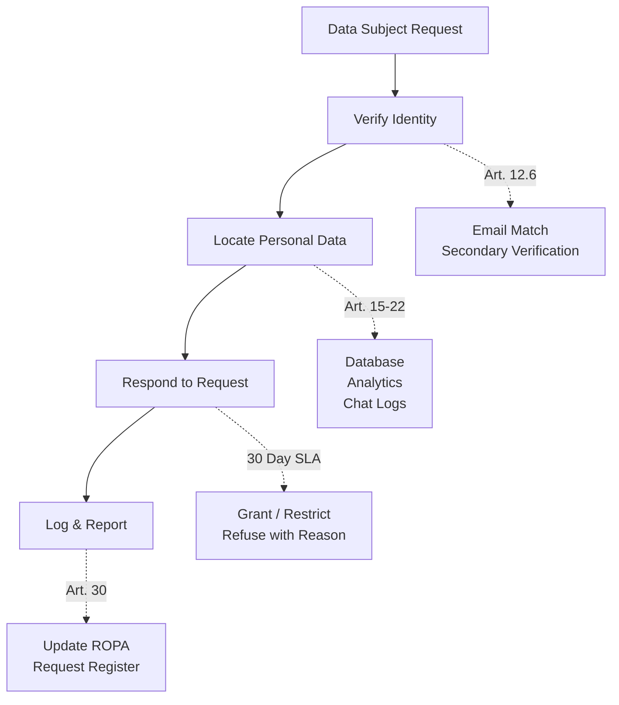

# GDPR Compliance Documentation

> **Document:** `gdpr.md` | **Version:** 1.0 | **Last Updated:** July 2026
> **Status:** ✅ Active | **Standard:** Regulation (EU) 2016/679
> **Owner:** Data Protection Officer | **Review Cadence:** Quarterly
> **Classification:** L3-Confidential

## Overview

This document governs GDPR compliance for the Portfolio platform — a full-stack monorepo (Next.js 14 frontend, NestJS REST API, FastAPI AI service, Supabase PostgreSQL database) that serves as both a public portfolio and an admin dashboard. The platform processes personal data across four functional areas: public content delivery, lead generation via contact forms, authenticated admin operations, and AI-powered chat assistance.

The platform is designed with **privacy-by-design and privacy-by-default** principles (per Article 25 of the GDPR), minimizing data collection to what is strictly necessary for each processing purpose and implementing technical controls — encryption at rest and in transit, access controls, pseudonymization, automated retention enforcement, and audit logging — to safeguard personal data throughout its lifecycle.

**GDPR Reference:** This document fulfills the accountability obligations under Articles 5, 13, 14, 30, 32, and 35 of the GDPR.

---

## 1. Data Controller Information

| Field | Detail |
|-------|--------|
| **Controller** | Developer (Individual / Sole Trader) |
| **Contact Email** | privacy@portfolio.dev |
| **Data Protection Officer** | dpo@portfolio.dev |
| **Representative (EU)** | Not applicable (controller established outside EU — Article 27 representative not currently appointed) |
| **Supervisory Authority** | To be determined based on data subject location |

---

## 2. Personal Data Inventory

### 2.1 Data Collection Map

| Data Category | Data Elements | Purpose | Legal Basis (Art. 6) | Retention | Source |
|---------------|---------------|---------|----------------------|-----------|--------|
| **Contact Info** | name, email, phone (optional), company (optional), message content | Respond to inquiries from leads | **Consent (Art. 6(1)(a))** via explicit form checkbox | 90 days post-lead | Contact form submission |
| **Authentication** | email, bcrypt password hash, OAuth provider ID (Google/GitHub), role | User login and identity management | **Contract (Art. 6(1)(b))** — service provision | Until account deletion | Registration/OAuth flow |
| **Analytics** | page views, events, session duration, referral source, browser/device info, IP (anonymized) | Site improvement, usage analysis | **Legitimate interest (Art. 6(1)(f))** — pseudonymized, non-intrusive | 90 days (aggregated) | PostHog (client-side) |
| **AI Chat Messages** | conversation content, timestamps | AI assistant response generation | **Consent (Art. 6(1)(a))** via chat interface consent prompt | 30 days | AI chat widget |
| **Media** | uploaded images, avatars (if applicable) | Content delivery, profile display | **Contract (Art. 6(1)(b))** — service provision | Until deletion request | Admin upload |
| **Session Tokens** | JWT access token, Redis-backed refresh token, IP, user agent | Session management, authentication continuity | **Contract (Art. 6(1)(b))** — essential for service | Access token: 15 min; Refresh token: 7 days | Login flow |
| **Error Logs** | stack traces, request context, user ID (if authenticated) | Error monitoring and debugging | **Legitimate interest (Art. 6(1)(f))** — system stability | 90 days | Sentry |
| **Email Notifications** | email address, notification preferences | Transactional email delivery | **Contract (Art. 6(1)(b))** or **Consent (Art. 6(1)(a))** | Until unsubscription or account deletion | BullMQ queue + Resend |

### 2.2 Special Category Data

The platform does **not** intentionally process any special category data (Article 9 GDPR — racial/ethnic origin, political opinions, religious beliefs, trade union membership, genetic/biometric data, health, sex life, or sexual orientation). Users are explicitly prohibited from submitting such data via contact forms or chat messages. Any inadvertent collection would be deleted immediately upon discovery.

### 2.3 Data Volume Estimates

| Data Set | Estimated Records | Growth Rate |
|----------|------------------|-------------|
| Leads / Contact submissions | < 1,000/year | Low |
| Admin users | < 10 | Static |
| Analytics events | ~10,000/month | Medium |
| AI chat sessions | < 100/month | Low |

---

## 3. Data Processing Activities

### 3.1 Processing Activity Register

| Activity ID | Processing Activity | Purpose | Data Categories | Recipients | Retention | Technical Safeguards |
|-------------|-------------------|---------|----------------|------------|-----------|---------------------|
| PA-001 | Lead inquiry handling | Respond to contact form submissions | Contact Info | Supabase (storage), Resend (notification) | 90 days | TLS 1.3 in transit, AES-256 at rest, RBAC access |
| PA-002 | User authentication & session management | Secure login and role-based access | Authentication, Session Tokens | Supabase Auth, Redis | Variable per token type | bcrypt hashing, JWT signing, Redis TTL |
| PA-003 | Usage analytics collection | Understand site performance and user behavior | Analytics | PostHog (US/EU cloud) | 90 days | IP anonymization, data minimization, opt-out cookie |
| PA-004 | AI chat processing | Provide conversational AI assistant | Chat Messages | OpenAI API, Anthropic API | 30 days | No training use, message encryption in transit, prompt isolation |
| PA-005 | Error monitoring | Detect and debug application errors | Error Logs | Sentry (US cloud) | 90 days | Error scrubbing (PII removal before dispatch) |
| PA-006 | Email notification delivery | Send transactional and system emails | Email Notifications | Resend API | Until unsubscribe | TLS, queue-based delivery (BullMQ), no logging of content |

### 3.2 Automated Decision-Making

The platform does **not** engage in automated decision-making (Article 22 GDPR) that produces legal effects or similarly significant impacts. AI chat responses are conversational only and do not constitute automated profiling or decisions.

---

## 4. Data Subject Rights

The platform provides mechanisms to exercise all rights under Articles 15–22 of the GDPR. Requests are processed within **30 calendar days** (Article 12(3)), extendable by 60 days for complex requests.

| Right | Article | Implementation | SLA |
|-------|---------|---------------|-----|
| **Right to Access** | Art. 15 | Data export endpoint (`GET /api/portfolio/gdpr/export`) returns JSON of all personal data | 30 days |
| **Right to Rectification** | Art. 16 | Profile edit in admin dashboard; contact form rectification via support email | 15 days |
| **Right to Erasure** | Art. 17 | Account deletion API + lead deletion request (anonymization fallback where deletion conflicts with other obligations) | 30 days |
| **Right to Restrict Processing** | Art. 18 | Flag set on user/lead record preventing further processing (preserves data for legal claims) | 15 days |
| **Right to Data Portability** | Art. 20 | Structured, machine-readable export (JSON/CSV) via GDPR export endpoint | 30 days |
| **Right to Object** | Art. 21 | Opt-out mechanism for analytics (cookie consent banner); objection to legitimate interest processing reviewed by DPO | 30 days |
| **Right to Withdraw Consent** | Art. 7(3) | Consent withdrawal toggle in privacy preferences; does not affect lawfulness of prior processing | Immediate |

### 4.1 Request Handling Procedure

1. Data subject submits request via email (privacy@portfolio.dev) or in-app GDPR export
2. Identity verification is performed (Article 12(6)) — match on email address + secondary verification if available
3. Request is logged in the GDPR requests register
4. Processing team (DPO + engineering) fulfills request within SLA
5. Response is delivered in writing (email), including explanation of actions taken or reasons for refusal
6. Refusals are accompanied by right to lodge a complaint with a supervisory authority (Article 12(4))

### 4.2 Exemptions and Limitations

- **Article 17(3)(e):** Erasure may be refused where processing is necessary for the establishment, exercise, or defence of legal claims
- **Article 23:** Rights may be restricted where necessary to protect the rights and freedoms of others

---

## 5. Consent Management

### 5.1 Consent Collection Points

| Interface | Data Use | Consent Mechanism | Granularity | Withdrawal Method |
|-----------|----------|------------------|-------------|-------------------|
| Contact form | Name, email, message | Explicit checkbox (opt-in, unchecked by default) | Per-purpose | Email request or contact form re-submission with withdrawal flag |
| Cookie banner | Analytics cookies | Cookie consent banner (opt-in for non-essential) | Per-category | Cookie preferences panel |
| AI chat | Chat message content | First-message consent prompt in chat widget | Per-session | Close chat session |
| Account registration | Email, password | Implicit by completing registration (contractual necessity) | Account-wide | Account deletion |

### 5.2 Consent Records

Consent is recorded with the following metadata per Article 7(1):
- **Timestamp** of consent
- **Means** of consent (checkbox click, banner acceptance, form submission)
- **Purpose** consented to
- **Version** of the privacy policy at time of consent
- **Session identifier** (correlated to cookie consent ID)

Consent records are stored in the database indefinitely (or until consent is withdrawn) to provide an audit trail.

### 5.3 Consent Withdrawal

Withdrawal is as easy as giving consent (Article 7(3)). Withdrawal mechanisms are clearly presented alongside each consent collection point. Processing based on consent that occurred prior to withdrawal remains lawful.

---

## 6. Data Breach Notification

### 6.1 Breach Response Procedure (Article 33–34)

The platform implements a three-tier incident response framework aligned with the Security Architecture's Incident Response plan:

| Phase | Action | Owner | Timeline |
|-------|--------|-------|----------|
| **Detection** | Automated (Sentry alert, anomaly detection) or manual (user report, admin observation) | Engineering / Monitoring | Immediate |
| **Triage** | Determine breach scope: data categories affected, number of records, root cause | Security Lead | < 1 hour |
| **Containment** | Revoke compromised credentials, rotate secrets, apply WAF rules, isolate affected services | DevOps / Security | < 2 hours |
| **Investigation** | Audit log analysis, forensic review, impacted data subject identification | Security + DPO | < 24 hours |
| **Notification to SA** | Notify supervisory authority of breach details, likely consequences, and remedial measures | DPO | **Within 72 hours** (Art. 33(1)) |
| **Notification to data subjects** | Communicate breach in clear language, recommend protective measures | DPO | Without undue delay (Art. 34) |
| **Remediation** | Deploy security patches, update policies, conduct post-mortem | Engineering | < 7 days |

### 6.2 Notification Templates

**To Supervisory Authority (Art. 33):**
- Description of the nature of the breach
- Categories and approximate number of data subjects and records concerned
- Name and contact details of the DPO
- Likely consequences of the breach
- Measures taken or proposed to address the breach

**To Data Subjects (Art. 34):**
- Description of the breach in plain language
- Nature of the personal data involved
- Recommendations for mitigating potential adverse effects
- Contact information for the DPO

### 6.3 Breach Log

All breaches, regardless of severity, are logged in the security incident register with: date, nature, affected data categories, root cause, remediation actions, and notification status.

---

## 7. Cross-Border Data Transfers

### 7.1 Transfer Register (Article 44–49)

| Provider | Data Type | Jurisdiction | Transfer Mechanism | Adequacy Decision |
|----------|-----------|-------------|-------------------|-------------------|
| Supabase (Database, Auth, Storage) | Contact Info, Authentication, Media | US (multi-region: us-east-1, EU option) | Standard Contractual Clauses (SCCs) 2021 | No adequacy — SCCs in place |
| Vercel (Hosting, Edge) | Request metadata, session tokens | US (multi-region) | SCCs | No adequacy — SCCs in place |
| PostHog (Analytics) | Analytics events | US (US cloud) / EU (EU cloud option) | SCCs + data processing agreement | No adequacy — SCCs in place |
| Sentry (Error Monitoring) | Error Logs | US | SCCs | No adequacy — SCCs in place |
| OpenAI (AI Processing) | Chat Messages | US | SCCs | No adequacy — SCCs in place |
| Anthropic (AI Processing) | Chat Messages | US | SCCs | No adequacy — SCCs in place |
| Resend (Email) | Email Notifications | US (multi-region) | SCCs | No adequacy — SCCs in place |
| Redis (Cache/Sessions) | Session Tokens | Same as hosting region | N/A (in-memory, ephemeral) | N/A |

### 7.2 Supplementary Measures

Where SCCs alone are insufficient (per Schrems II), the platform implements:
- **Technical measures:** End-to-end encryption for data in transit (TLS 1.3), encryption at rest (AES-256), data minimization
- **Organizational measures:** Strict access controls, data processing agreements with all sub-processors, quarterly review of transfer mechanisms

---

## 8. Third-Party Processors (Article 28)

### 8.1 Processor Register

| Processor | Service | Data Accessed | DPA in Place? | Sub-processors? |
|-----------|---------|---------------|---------------|-----------------|
| **Vercel Inc.** | Hosting, CDN, Edge Functions | IP address, request headers, session cookies | Yes | AWS, Google Cloud |
| **Supabase Inc.** | PostgreSQL database, Authentication, Storage | All personal data stored in database | Yes | AWS, Cloudflare, Fly.io |
| **PostHog Inc.** | Product analytics | Analytics events, device info, anonymized IP | Yes | AWS, Google Cloud |
| **Sentry (Functional Software Inc.)** | Error and performance monitoring | Error stack traces, request metadata | Yes | AWS, GCP, Azure |
| **OpenAI LLC** | AI chat response generation | Chat message content (zero-retention API) | Yes | Azure (compute) |
| **Anthropic PBC** | AI chat response generation | Chat message content (zero-retention API) | Yes | Google Cloud, AWS |
| **Resend Inc.** | Transactional email delivery | Email address, email content | Yes | AWS |
| **Redis Labs (via ioredis)** | In-memory cache, session store, BullMQ queue | Session tokens, job data | Yes | Cloud provider of hosting |

### 8.2 Processor Assessment Criteria

Each processor is assessed on:
- **Data processing agreement** (Article 28(3)): Scope, duration, purpose, data categories, data subject rights, assistance obligations
- **Security measures** (Article 32): Encryption, access controls, certifications (SOC 2, ISO 27001)
- **Sub-processor management**: Authorization, notification of changes, objection rights
- **Data transfer compliance**: SCCs or adequacy decisions for cross-border processing
- **Breach notification**: Contractual obligation to notify without undue delay

---

## 9. Data Protection Impact Assessment (Article 35)

### 9.1 DPIA Summary

A DPIA was conducted to identify and mitigate data protection risks associated with the platform's processing activities. The assessment concluded that processing is **low risk** for data subjects given the limited data categories, small data volume, and implemented safeguards.

| Assessment Factor | Finding | Mitigation |
|-------------------|---------|------------|
| **Systematic profiling** | None — no automated profiling or scoring | Not applicable |
| **Large-scale processing** | Low volume (< 1,000 leads/year, < 10 admin users) | Not applicable |
| **Special category data** | Not processed | Prohibition in ToS + automated detection fallback |
| **Data of vulnerable persons** | Not targeted (platform is 16+, no child data) | Age-gating consideration |
| **Cross-border transfers** | EU → US transfers via SCCs | SCCs 2021 + supplementary measures |
| **New technologies** | AI chat assistant | Zero-retention API calls, no training use, consent obtained |

### 9.2 Risk Register

| Risk ID | Risk Description | Likelihood | Impact | Residual Risk | Controls |
|---------|-----------------|------------|--------|---------------|----------|
| DPIA-R01 | Unauthorized access to personal data via compromised credentials | Low | High | Low | MFA, password policy, rate limiting, lockout |
| DPIA-R02 | Data leakage through third-party processor breach | Low | Medium | Low | DPA with all processors, encryption, data minimization |
| DPIA-R03 | AI chat data used for model training | Very Low | Medium | Very Low | Zero-retention API, explicit prohibition in contract |
| DPIA-R04 | Insufficient consent for analytics processing | Low | Low | Low | Granular cookie consent, opt-out mechanism |
| DPIA-R05 | Data retention beyond stated period | Low | Low | Low | Automated retention enforcement via scheduled jobs |

---

## 10. Record of Processing Activities (Article 30)

### 10.1 ROPA

The full Record of Processing Activities is maintained as a living document, cross-referenced with:

| Related Document | Location | Relevance |
|-----------------|----------|-----------|
| **Data Dictionary** | `docs/compliance/data-dictionary.md` | Defines all data fields, types, and constraints |
| **Data Classification Policy** | `docs/security/data-classification.md` | Classifies data by sensitivity (L1–L4) |
| **Security Architecture** | `docs/security/SecurityArchitecture.md` | Technical and organizational security measures |
| **Privacy Policy** | `docs/compliance/privacy-policy.md` | Public-facing privacy notice (Art. 13/14) |
| **Cookie Policy** | `docs/compliance/cookie-policy.md` | Cookie-specific disclosures and consent |
| **Data Governance Policy** | `docs/security/43-DATA-GOVERNANCE.md` | Governance framework, roles, and responsibilities |

### 10.2 Review Cadence

| Review Type | Frequency | Owner |
|-------------|-----------|-------|
| Full ROPA audit | Quarterly | DPO |
| Processor DPA review | Annually | DPO + Legal |
| DPIA review | Annually or on processing change | DPO |
| Consent mechanism audit | Quarterly | Engineering + DPO |
| Retention schedule enforcement | Monthly | Engineering |

---

## 11. Technical and Organizational Measures (Article 32)

### 11.1 Technical Measures

| Category | Measures |
|----------|----------|
| **Encryption in transit** | TLS 1.3 (minimum), HSTS enabled, secure cipher suites |
| **Encryption at rest** | AES-256 database-level encryption (Supabase), encrypted Redis sessions |
| **Access control** | JWT authentication, RBAC (admin/editor/viewer), API key authentication |
| **Pseudonymization** | IP anonymization in analytics, event IDs decoupled from user identity |
| **Logging and monitoring** | Audit log of all admin mutations, Sentry error monitoring, structured logging (Pino) |
| **Backup** | Supabase automated backups (point-in-time recovery), retention policies |
| **Network security** | Helmet headers, CSP, CORS (restricted origin), rate limiting, WAF (Vercel Edge) |
| **Vulnerability management** | Dependabot, npm audit, weekly dependency scanning |

### 11.2 Organizational Measures

| Category | Measures |
|----------|----------|
| **Data protection training** | Privacy and security awareness for developers |
| **Access management** | Least-privilege principle, role-based access reviews |
| **Incident response** | Written IR plan, 72-hour breach notification SLA |
| **Vendor management** | DPA assessment before onboarding, quarterly processor review |
| **Change management** | Code review, staging environment, QA gates before production |

---

## 12. Compliance Checklist

| Requirement | Status | Evidence |
|-------------|--------|----------|
| Data Protection Officer appointed | ✅ | dpo@portfolio.dev |
| Privacy Policy published | ✅ | `docs/compliance/privacy-policy.md` |
| Cookie Policy published | ✅ | `docs/compliance/cookie-policy.md` |
| GDPR documentation published | ✅ | This document |
| Consent mechanisms implemented | ✅ | Cookie banner, contact form checkbox, chat consent |
| Data Subject Rights procedures defined | ✅ | Section 4 of this document |
| Data retention schedules enforced | ✅ | Automated jobs + documented schedules |
| Data Processing Agreements with processors | ✅ | Section 8 register |
| SCCs in place for cross-border transfers | ✅ | Section 7 register |
| DPIA completed | ✅ | Section 9 summary |
| ROPA maintained | ✅ | Section 10 |
| Breach notification procedure documented | ✅ | Section 6 |
| Encryption in transit (TLS 1.3) | ✅ | Security Architecture §26 |
| Encryption at rest (AES-256) | ✅ | Supabase + Redis encryption |
| Audit logging for admin mutations | ✅ | `docs/security/AuditLogging.md` |
| Data minimization enforced | ✅ | Contact form collects minimum fields |
| Privacy by design in AI chat | ✅ | Zero-retention API, no training, consent prompt |

---

---

## GDPR Rights Workflow

## 13. Change Log

| Version | Date | Author | Changes |
|---------|------|--------|---------|
| 1.0 | July 2026 | DPO | Initial GDPR compliance documentation |
