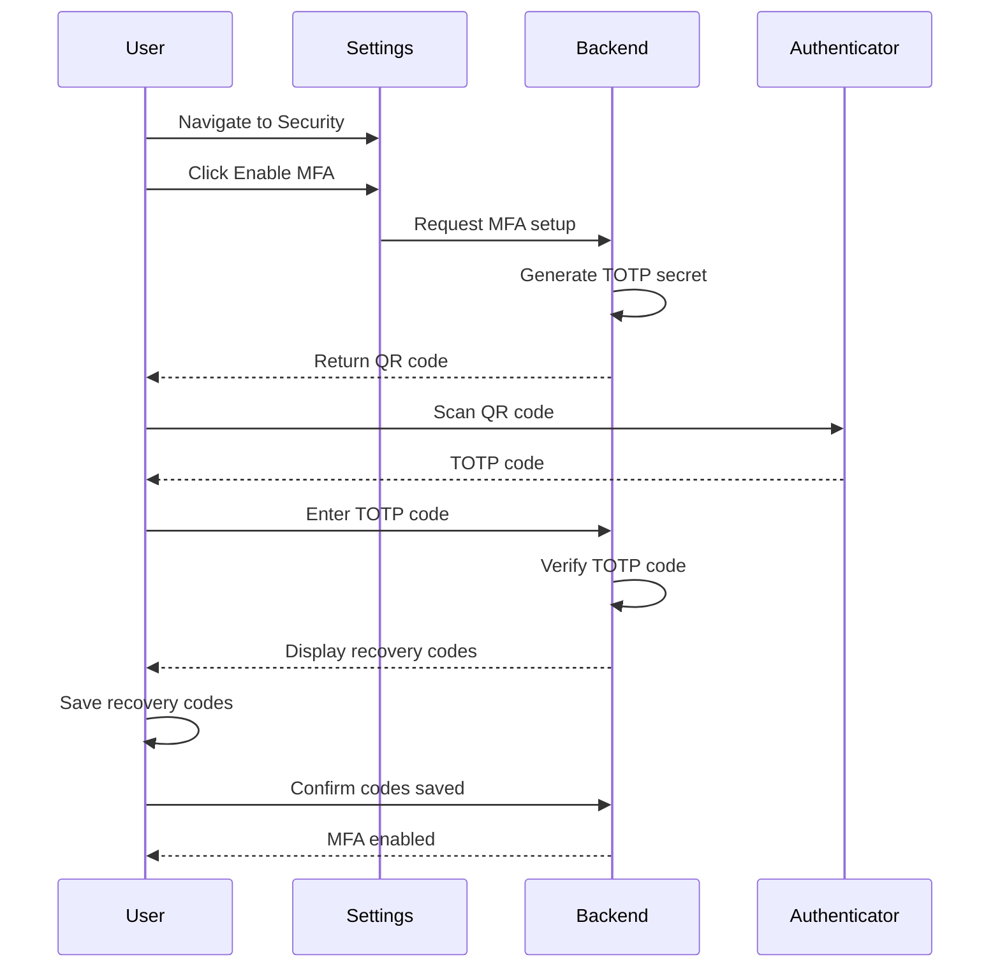
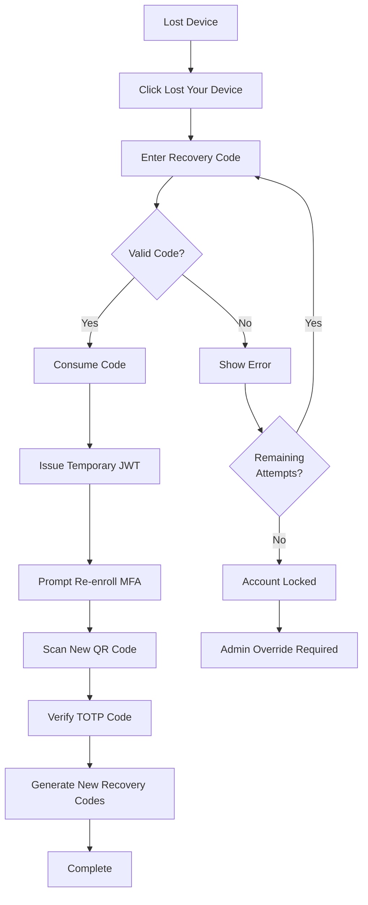

# MFA Rollout Plan — TOTP-Based Multi-Factor Authentication

> **Document:** `mfa-rollout-plan.md` | **Version:** 1.0 | **Last Updated:** July 2026
> **Status:** 📋 Planned | **Standard:** NIST SP 800-63B (AAL2) | **Owner:** Staff DevOps
> **Review Cadence:** Monthly during rollout | **Classification:** L3-Confidential

---

## 1. Overview & Goals

### 1.1 Purpose

Implement **TOTP-based Multi-Factor Authentication (MFA)** for all admin accounts on the Portfolio platform. This addresses the highest-priority gap identified in the threat model (ThreatModel.md §3.1 — Spoofing) and the SecurityArchitecture.md §5.5 control inventory, which currently lists MFA as "Planned."

### 1.2 Goals

| Goal                               | Metric                                 | Target  |
| ---------------------------------- | -------------------------------------- | ------- |
| Eliminate credential-stuffing risk | Admin accounts with MFA enabled        | 100%    |
| Reduce phishing impact             | Accounts compromised via password-only | 0       |
| Meet OWASP ASVS V2.6.1             | MFA implemented for admin              | ✅ |
| Meet NIST SP 800-63B AAL2          | TOTP-based MFA                         | ✅ |
| User friction minimized            | Enrollment completion rate             | > 90%   |

### 1.3 Success Criteria

| Criterion                      | Target              | Measurement                    |
| ------------------------------ | ------------------- | ------------------------------ |
| Admin MFA enrollment rate      | 100% within 6 weeks | Database enrollment records    |
| Recovery code usage rate       | < 5% of logins      | Recovery code consumption logs |
| Support tickets related to MFA | < 3 per month       | Support ticket tracker         |
| Login success rate (with MFA)  | > 99%               | Auth logs                      |
| Time to enroll (new admin)     | < 2 minutes         | UX timing measurement          |

---

## 2. Threat Model — What MFA Protects Against

### 2.1 Threat Coverage

| Threat                                                                            | MFA Mitigation                              | Current Risk (No MFA) | Residual Risk (With MFA) |
| --------------------------------------------------------------------------------- | ------------------------------------------- | --------------------- | ------------------------ |
| **Credential Stuffing** — Attacker uses breached passwords from other sites | TOTP code required even with valid password | 🔴 High         | 🟢 Low             |
| **Phishing** — Attacker tricks admin into revealing password                | TOTP code is time-limited and site-specific | 🔴 High         | 🟢 Low             |
| **Brute Force** — Automated password guessing                               | Password + TOTP required                    | 🟡 Medium       | 🟢 Low             |
| **Session Token Theft** — XSS or MITM steals JWT                            | MFA challenge on new device/session         | 🟡 Medium       | 🟢 Low             |
| **Keylogging** — Password captured via malware                              | TOTP code changes every 30s                 | 🟡 Medium       | 🟢 Low             |
| **SIM Swap** — Phone-based MFA bypass                                       | TOTP (not SMS) prevents SIM swap            | 🟡 Medium       | 🟢 Low             |

### 1.2 Mapped Threats from ThreatModel.md

| Threat Model Reference                                  | Threat                                | MFA Mitigation                              |
| ------------------------------------------------------- | ------------------------------------- | ------------------------------------------- |
| §3.1 Spoofing — Identity theft via JWT forgery | Attacker forges or steals JWT         | MFA challenge on new device/session         |
| §3.1 Spoofing — OAuth token interception       | OAuth token stolen                    | TOTP required even with valid OAuth         |
| §3.3 Attack Tree 1.2.2 — Credential stuffing   | Breached passwords used               | TOTP required in addition to password       |
| §3.3 Attack Tree 1.1 — Phishing                | Admin tricked into revealing password | TOTP code is time-limited and site-specific |

### 1.2 Design Principles

| Principle             | Application to MFA                                                |
| --------------------- | ----------------------------------------------------------------- |
| **Defense in depth**  | MFA adds a second authentication factor beyond password           |
| **Fail closed**       | MFA challenge failure denies access; no fallback to password-only |
| **Least privilege**   | MFA required proportional to role (admin > editor > viewer)       |
| **Secure by default** | MFA opt-in available immediately; mandatory for admin by Phase 3  |

---

## 2. Threat Model — What MFA Protects Against

### 2.1 Attack Vectors Neutralized by MFA

| Attack Vector                                                                | Pre-MFA Risk        | Post-MFA Risk | Mechanism                                      |
| ---------------------------------------------------------------------------- | ------------------- | ------------- | ---------------------------------------------- |
| **Credential Stuffing** — 10B+ breached passwords tested against login | 🔴 High       | 🟢 Low  | Password alone insufficient; TOTP required     |
| **Phishing** — Fake login page captures credentials                    | 🔴 High       | 🟢 Low  | TOTP code is time-bound (30s) and origin-bound |
| **Keylogging** — Malware captures keystrokes                           | 🟡 Medium     | 🟢 Low  | TOTP code expires before attacker can use it   |
| **Session Token Theft** — XSS/MITM steals JWT                          | 🟡 Medium     | 🟢 Low  | MFA re-challenge on new device/session         |
| **Brute Force** — Automated password guessing                          | 🟡 Medium     | 🟢 Low  | Password + TOTP doubles attack difficulty      |
| **SIM Swap** — Phone number takeover                                   | N/A (TOTP, not SMS) | 🟢 Low  | TOTP is device-bound, not phone-bound          |

### 1.3 Alignment with Existing Security Architecture

This plan implements the MFA control identified as "Planned" in SecurityArchitecture.md §5.5 (Authentication Security Controls) and addresses the Spoofing threat in ThreatModel.md §3.1. It also fulfills OWASP ASVS V2.6 (MFA requirements) and NIST SP 800-63B AAL2.

---

## 2. Implementation Approach

### 2.1 Technology Selection: TOTP

| Factor                 | TOTP (Selected)                | SMS OTP                    | Push Notification | Hardware Token         |
| ---------------------- | ------------------------------ | -------------------------- | ----------------- | ---------------------- |
| **Security**           | 🟢 High                  | 🟡 Medium (SIM swap) | 🟢 High     | 🟢 Very High     |
| **Cost**               | 🟢 Free                  | 🟡 Per-message cost  | 🟢 Free     | 🔴 Hardware cost |
| **User Experience**    | 🟡 Medium (app required) | 🟢 Easy              | 🟢 Easy     | 🟡 Carry token   |
| **Standard**           | RFC 6238                       | NIST deprecated            | Proprietary       | FIDO2/WebAuthn         |
| **Offline capable**    | ✅ Yes                    | ❌ No                   | ❌ No          | ✅ Yes            |
| **Phishing resistant** | 🟡 Partial               | 🔴 Low               | 🟡 Partial  | 🟢 High          |

**Decision:** TOTP via authenticator app (Google Authenticator, Authy, 1Password, etc.) — best balance of security, cost, and user experience.

### 2.2 Recovery Codes

Each user receives **10 one-time recovery codes** upon MFA enrollment. Recovery codes are:

- Generated using `crypto.randomBytes(5).toString('hex')` (10-char hex, 40 bits of entropy)
- Stored as SHA-256 hashes in the database
- Displayed exactly once during enrollment
- Individually consumed (one code = one use)
- Regenerated on request (invalidates all previous codes)

### 2.3 Backup Methods

| Method                 | Priority  | Use Case           | Security Level      |
| ---------------------- | --------- | ------------------ | ------------------- |
| TOTP Authenticator App | Primary   | Standard login     | 🟢 High       |
| Recovery Codes (10)    | Secondary | Lost device        | 🟡 Medium     |
| Admin Override         | Emergency | Support escalation | 🔴 Audit-only |

---

## 3. Auth Flow Changes

### 3.1 Current Flow (Password → JWT)

```
User → POST /auth/login → Validate password → Issue JWT → Access granted
```

### 3.2 Target Flow (Password → TOTP Challenge → JWT)

```
User → POST /auth/login → Validate password → Check MFA enabled?
  ├── No MFA → Issue JWT → Access granted
  └── MFA enabled → Return mfa_required token (signed, 5min TTL)
                      ↓
                    User → POST /auth/mfa/verify → Validate TOTP → Issue JWT → Access granted
                      ↓ (or)
                    User → POST /auth/mfa/recovery → Validate recovery code → Issue JWT → Access granted
```

### 3.3 MFA Challenge Token

```typescript
// MFA challenge token (short-lived, single-use)
{
  sub: 'uuid-of-user',
  purpose: 'mfa_challenge',
  iat: 1718467200,
  exp: 1718467500,  // 5-minute TTL
  jti: 'unique-token-id',
  type: 'mfa_challenge'
}
```

---

## 4. Rollout Phases

### 4.1 Phase 1 — Opt-In (Week 1)

| Aspect             | Detail                                                      |
| ------------------ | ----------------------------------------------------------- |
| **Duration**       | 2 weeks                                                     |
| **Audience**       | All users (admin, editor, viewer)                           |
| **Enforcement**    | Optional — users can enable MFA in settings           |
| **Communication**  | Email notification to all users announcing MFA availability |
| **Support**        | Help desk trained on MFA enrollment flow                    |
| **Success Metric** | 30% voluntary enrollment                                    |

**Activities:**

- Deploy MFA backend (TOTP secret table, verify endpoint, recovery codes)
- Deploy enrollment UI in admin settings
- Send announcement email with setup guide
- Monitor enrollment rate and support tickets

### 4.2 Phase 2 — Required for Admin (Week 3)

| Aspect             | Detail                                                |
| ------------------ | ----------------------------------------------------- |
| **Duration**       | 3 weeks                                               |
| **Audience**       | Admin role: **required**. Editor/viewer: **optional** |
| **Enforcement**    | Admin users cannot access admin dashboard without MFA |
| **Grace period**   | 7 days from notification to enroll                    |
| **Communication**  | Direct email to admin users with deadline             |
| **Success Metric** | 100% admin enrollment                                 |

**Activities:**

- Enforce MFA check in auth middleware for admin role
- Add grace period countdown banner in admin dashboard
- Monitor admin users who haven't enrolled
- Send reminder emails at T-7, T-3, T-1 days

### 4.3 Phase 3 — Required for All (Week 6)

| Aspect             | Detail                                              |
| ------------------ | --------------------------------------------------- |
| **Duration**       | Ongoing                                             |
| **Audience**       | All users with admin access (admin, editor, viewer) |
| **Enforcement**    | MFA required for all authenticated sessions         |
| **Communication**  | Final notice to all users                           |
| **Success Metric** | 100% enrollment across all roles                    |

**Activities:**

- Remove MFA opt-out option
- Enforce MFA check globally for all authenticated routes
- Archive Phase 1/Phase 2 migration data
- Begin monitoring for MFA-related support issues

---

## 5. User Experience

### 5.1 Enrollment Flow

```
1. Admin navigates to Settings → Security → Enable MFA
2. Backend generates TOTP secret + QR code
3. User scans QR code with authenticator app
4. User enters TOTP code to verify setup
5. Backend verifies code, enables MFA for user
6. User is shown 10 recovery codes (one-time display)
7. User confirms recovery codes saved → Enrollment complete
```

### 5.1a MFA Enrollment Flow



### 5.2 Login Flow (with MFA)

```
1. User enters email + password
2. Backend validates credentials
3. Backend checks: user has MFA enabled?
   ├── No → Issue JWT directly
   └── Yes → Return mfa_challenge_token (5min TTL)
4. User enters TOTP code from authenticator app
5. Backend verifies TOTP code
6. Backend issues JWT access + refresh tokens
7. User redirected to admin dashboard
```

### 5.3 Recovery Flow

```
1. User clicks "Lost your device?" on MFA challenge screen
2. User enters one of 10 recovery codes
3. Backend hashes code, compares against stored hashes
4. If valid → consume code, issue JWT, prompt to re-enroll MFA
5. If invalid → show error, remaining attempts: 9
6. After 10 failed recovery attempts → account locked, admin override required
```

### 5.3a Recovery Flow



### 5.4 Device Management

Users can manage MFA devices from Settings → Security:

- View enrolled devices (name, enrolled date, last used)
- Remove device (requires current TOTP or recovery code)
- Rename device
- Regenerate recovery codes (invalidates previous codes)

---

## 6. Backend Changes

### 6.1 New Database Table: `mfa_secrets`

```sql
CREATE TABLE mfa_secrets (
  id UUID PRIMARY KEY DEFAULT gen_random_uuid(),
  user_id UUID NOT NULL REFERENCES users(id) ON DELETE CASCADE,
  secret TEXT NOT NULL,                    -- Encrypted TOTP secret
  algorithm TEXT NOT NULL DEFAULT 'SHA1',  -- TOTP algorithm
  digits INTEGER NOT NULL DEFAULT 6,       -- TOTP digits
  period INTEGER NOT NULL DEFAULT 30,      -- TOTP period in seconds
  is_enabled BOOLEAN NOT NULL DEFAULT false,
  is_primary BOOLEAN NOT NULL DEFAULT true,
  device_name TEXT,
  last_used_at TIMESTAMPTZ,
  created_at TIMESTAMPTZ NOT NULL DEFAULT NOW(),
  updated_at TIMESTAMPTZ NOT NULL DEFAULT NOW(),
  UNIQUE(user_id)
);

CREATE TABLE mfa_recovery_codes (
  id UUID PRIMARY KEY DEFAULT gen_random_uuid(),
  user_id UUID NOT NULL REFERENCES users(id) ON DELETE CASCADE,
  code_hash TEXT NOT NULL,          -- SHA-256 hash of recovery code
  is_used BOOLEAN NOT NULL DEFAULT false,
  used_at TIMESTAMPTZ,
  created_at TIMESTAMPTZ NOT NULL DEFAULT NOW(),
  UNIQUE(user_id, code_hash)
);

CREATE INDEX idx_mfa_secrets_user_id ON mfa_secrets(user_id);
CREATE INDEX idx_mfa_recovery_codes_user_id ON mfa_recovery_codes(user_id);
```

### 6.2 Middleware Changes

A new `MfaGuard` middleware checks whether the user has completed MFA challenge:

```typescript
@Injectable()
export class MfaGuard implements CanActivate {
  constructor(private readonly mfaService: MfaService) {}

  async canActivate(context: ExecutionContext): Promise<boolean> {
    const request = context.switchToHttp().getRequest();
    const user = request.user;

    // Skip MFA check for auth endpoints
    if (request.url.startsWith('/api/auth/mfa')) return true;

    // Check if user has MFA enabled
    const mfaSecret = await this.mfaService.findByUserId(user.sub);
    if (!mfaSecret?.is_enabled) return true;

    // Check if session has MFA verified flag
    if (request.mfaVerified) return true;

    throw new UnauthorizedException({
      code: 'MFA_REQUIRED',
      message: 'MFA verification required. Please complete MFA challenge.',
      statusCode: 401,
    });
  }
}
```

### 6.3 AuthService Changes

```typescript
// New methods in AuthService
async setupMfa(userId: string): Promise<{ secret: string; qrCodeUrl: string; recoveryCodes: string[] }> {
  // 1. Generate TOTP secret
  const secret = speakeasy.generateSecret({ length: 20, name: `Portfolio:${userId}` });

  // 2. Store encrypted secret
  await this.prisma.mfaSecret.upsert({
    where: { userId },
    create: { userId, secret: this.encrypt(secret.base32), isEnabled: false },
    update: { secret: this.encrypt(secret.base32), isEnabled: false },
  });

  // 3. Generate 10 recovery codes
  const recoveryCodes: string[] = [];
  const recoveryHashes: { codeHash: string }[] = [];
  for (let i = 0; i < 10; i++) {
    const code = crypto.randomBytes(5).toString('hex');
    recoveryCodes.push(code);
    recoveryHashes.push({ codeHash: hashToken(code) });
  }

  // 4. Store hashed recovery codes
  await this.prisma.mfaRecoveryCode.deleteMany({ where: { userId } });
  await this.prisma.mfaRecoveryCode.createMany({
    data: recoveryHashes.map(h => ({ userId, codeHash: h.codeHash })),
  });

  return {
    secret: secret.base32,
    qrCodeUrl: secret.otpauth_url,
    recoveryCodes,
  };
}
```

---

## 7. API Changes

### 7.1 New Endpoints

| Method | Endpoint                                  | Auth                | Rate Limit | Description                           |
| ------ | ----------------------------------------- | ------------------- | ---------- | ------------------------------------- |
| `POST` | `/api/auth/mfa/setup`                     | JWT                 | 3/15min    | Generate TOTP secret + recovery codes |
| `POST` | `/api/auth/mfa/verify`                    | MFA Challenge Token | 10/15min   | Verify TOTP code, issue JWT           |
| `POST` | `/api/auth/mfa/recovery`                  | MFA Challenge Token | 5/15min    | Verify recovery code, issue JWT       |
| `POST` | `/api/auth/mfa/disable`                   | JWT + TOTP          | 3/15min    | Disable MFA (requires current TOTP)   |
| `GET`  | `/api/auth/mfa/status`                    | JWT                 | 10/15min   | Get MFA enrollment status             |
| `POST` | `/api/auth/mfa/recovery-codes/regenerate` | JWT + TOTP          | 1/24h      | Regenerate recovery codes             |

### 7.2 API Contracts

**POST /api/auth/mfa/setup**

```json
// Request: (no body, authenticated)
// Response 200:
{
  "data": {
    "secret": "JBSWY3DPEHPK3PXP",
    "qr_code_url": "otpauth://totp/Portfolio:admin@example.com?secret=...&issuer=Portfolio",
    "recovery_codes": ["a1b2c3d4e5", "f6g7h8i9j0", ...]  // 10 codes
  }
}
```

**POST /api/auth/mfa/verify**

```json
// Request:
{
  "mfa_token": "mfa_challenge_jwt...",
  "totp_code": "123456"
}
// Response 200:
{
  "data": {
    "access_token": "jwt...",
    "refresh_token": "uuid...",
    "expires_in": 900,
    "token_type": "Bearer"
  }
}
// Response 401:
{
  "error": {
    "code": "MFA_INVALID_CODE",
    "message": "Invalid TOTP code. Please try again.",
    "statusCode": 401
  }
}
```

**POST /api/auth/mfa/recovery**

```json
// Request:
{
  "mfa_token": "mfa_challenge_jwt...",
  "recovery_code": "a1b2c3d4e5"
}
// Response 200: (same as verify)
// Response 401:
{
  "error": {
    "code": "MFA_INVALID_RECOVERY_CODE",
    "message": "Invalid recovery code. 9 attempts remaining.",
    "statusCode": 401
  }
}
```

---

## 8. Recovery Process

### 8.1 Recovery Code Lifecycle

| Stage            | Description                                                |
| ---------------- | ---------------------------------------------------------- |
| **Generation**   | 10 codes generated at enrollment, stored as SHA-256 hashes |
| **Display**      | Shown once on enrollment screen; user must save them       |
| **Usage**        | One code consumed per recovery login                       |
| **Exhaustion**   | After 10 codes used, user must contact admin for override  |
| **Regeneration** | User can regenerate codes (invalidates all previous)       |

### 8.2 Admin Override

| Step | Action                                                             | Audit Trail                                 |
| ---- | ------------------------------------------------------------------ | ------------------------------------------- |
| 1    | User contacts support (cannot access MFA)                          | Support ticket created                      |
| 2    | Support verifies identity (email + security questions)             | Identity verification logged                |
| 3    | Admin initiates override in admin panel                            | `audit_logs` entry: `MFA_OVERRIDE`          |
| 4    | User's MFA is disabled, forced to re-enroll                        | `mfa_secrets` updated, `is_enabled = false` |
| 5    | User logs in with password only, immediately prompted to re-enroll | Session flagged `mfa_pending`               |
| 6    | All override actions logged with admin ID, timestamp, reason       | Immutable audit trail                       |

---

## 9. Testing Strategy

### 9.1 Unit Tests

| Test                       | Description                                                     | Coverage                |
| -------------------------- | --------------------------------------------------------------- | ----------------------- |
| TOTP generation            | Verify `speakeasy.generateSecret()` produces valid secrets      | 100% of setup paths     |
| TOTP verification          | Verify valid codes pass, expired codes fail, wrong codes fail   | 100% of verify paths    |
| Recovery code generation   | Verify 10 codes generated, no duplicates                        | 100% of setup paths     |
| Recovery code verification | Verify valid code passes, consumed code fails, wrong code fails | 100% of recovery paths  |
| Recovery code exhaustion   | Verify all 10 codes consumed → account locked            | Edge case               |
| MFA challenge token        | Verify 5-min TTL, single-use enforcement                        | 100% of challenge paths |
| Secret encryption          | Verify TOTP secret encrypted at rest                            | 100%                    |

### 9.2 Integration Tests

| Test                     | Description                                                          |
| ------------------------ | -------------------------------------------------------------------- |
| Enrollment flow e2e      | Setup → verify → login with MFA → logout        |
| Recovery flow e2e        | Login → recovery code → new JWT → re-enroll     |
| MFA bypass attempt       | Try to access admin without MFA challenge → 401               |
| Invalid TOTP             | Wrong code → 401, retry allowed                               |
| Expired challenge token  | Wait 5min → use expired token → 401                    |
| Recovery code exhaustion | Use all 10 codes → 11th attempt fails → account locked |

### 9.3 E2E Tests

```typescript
// MFA enrollment e2e test
describe('MFA Enrollment Flow', () => {
  it('should enroll, verify, and login with MFA', async () => {
    // 1. Login without MFA
    const loginRes = await request(app)
      .post('/api/auth/login')
      .send({ email: 'admin@test.com', password: 'Password123!' });
    expect(loginRes.status).toBe(200);
    const accessToken = loginRes.body.data.access_token;

    // 2. Setup MFA
    const setupRes = await request(app)
      .post('/api/auth/mfa/setup')
      .set('Authorization', `Bearer ${accessToken}`);
    expect(setupRes.status).toBe(200);
    expect(setupRes.body.data.recovery_codes).toHaveLength(10);

    // 3. Generate valid TOTP code
    const totpCode = speakeasy.totp({
      secret: setupRes.body.data.secret,
      encoding: 'base32',
    });

    // 4. Verify TOTP code
    const verifyRes = await request(app)
      .post('/api/auth/mfa/verify')
      .send({ totp_code: totpCode, mfa_token: mfaChallengeToken });
    expect(verifyRes.status).toBe(200);
    expect(verifyRes.body.data.access_token).toBeDefined();
  });
});
```

### 9.3 Security Tests

| Test                  | Expected Result                                          |
| --------------------- | -------------------------------------------------------- |
| TOTP replay attack    | Same code used twice within 30s window → rejected |
| Clock drift tolerance | Codes valid within ±1 interval (30s)                  |
| Recovery code replay  | Same code used twice → rejected                   |
| Brute force TOTP      | 10 rapid attempts → rate limited                  |
| MFA bypass via API    | Direct admin endpoint access without MFA → 401    |

---

## 10. Rollback Plan

### 10.1 Rollback Triggers

| Trigger                                 | Severity          | Action                              |
| --------------------------------------- | ----------------- | ----------------------------------- |
| > 5% of users unable to login           | 🔴 Critical | Immediate rollback to password-only |
| > 10 support tickets/day related to MFA | 🟡 High     | Rollback within 24h                 |
| TOTP verification bug (false negatives) | 🔴 Critical | Immediate rollback                  |
| Recovery code generation bug            | 🟡 High     | Rollback within 24h                 |
| Performance degradation > 20%           | 🟡 High     | Rollback within 24h                 |

### 10.2 Rollback Steps

| Step | Action                                     | Duration | Verification                                      |
| ---- | ------------------------------------------ | -------- | ------------------------------------------------- |
| 1    | Disable MfaGuard middleware                | 5 min    | All admin endpoints accessible with password only |
| 2    | Set `mfa_required` feature flag to `false` | 2 min    | Feature flag dashboard                            |
| 3    | Remove MFA challenge from login flow       | 10 min   | Login flow returns JWT directly                   |
| 4    | Notify users of MFA requirement suspension | 15 min   | Email sent to all admin users                     |
| 5    | Keep MFA secrets table (no data loss)      | —  | Data preserved for re-enablement                  |
| 6    | Monitor login success rate                 | 24h      | Return to baseline                                |

### 10.3 Rollback Communication

| Audience      | Channel     | Message                                                                                          |
| ------------- | ----------- | ------------------------------------------------------------------------------------------------ |
| Admin users   | Email       | "MFA requirement temporarily suspended due to technical issue. Your MFA settings are preserved." |
| Internal team | Slack       | "MFA rollback initiated. Root cause analysis in progress. ETA for fix: [TBD]."                   |
| Stakeholders  | Status page | "MFA feature temporarily disabled. No data loss. ETA for re-enablement: [TBD]."                  |

---

## 11. Appendix

### 11.1 Dependencies

| Dependency         | Version | Purpose                           |
| ------------------ | ------- | --------------------------------- |
| `speakeasy`        | ^2.0.0  | TOTP generation and verification  |
| `qrcode`           | ^1.5.3  | QR code generation for enrollment |
| `@types/speakeasy` | ^2.0.0  | TypeScript types                  |

### 11.2 Environment Variables

| Variable                   | Description                                       | Required |
| -------------------------- | ------------------------------------------------- | -------- |
| `MFA_TOTP_PERIOD`          | TOTP time step (default: 30)                      | No       |
| `MFA_TOTP_DIGITS`          | TOTP code length (default: 6)                     | No       |
| `MFA_TOTP_ALGORITHM`       | TOTP hash algorithm (default: SHA1)               | No       |
| `MFA_CHALLENGE_TTL`        | MFA challenge token TTL in seconds (default: 300) | No       |
| `MFA_RECOVERY_CODES_COUNT` | Number of recovery codes (default: 10)            | No       |

### 11.3 Prisma Schema Addition

```prisma
model MfaSecret {
  id         String   @id @default(uuid())
  userId     String   @unique
  user       User     @relation(fields: [userId], references: [id], onDelete: Cascade)
  secret     String
  algorithm  String   @default("SHA1")
  digits     Int      @default(6)
  period     Int      @default(30)
  isEnabled  Boolean  @default(false)
  isPrimary  Boolean  @default(true)
  deviceName String?
  lastUsedAt DateTime?
  createdAt  DateTime @default(now())
  updatedAt  DateTime @updatedAt
}

model MfaRecoveryCode {
  id        String   @id @default(uuid())
  userId    String
  user      User     @relation(fields: [userId], references: [id], onDelete: Cascade)
  codeHash  String
  isUsed    Boolean  @default(false)
  usedAt    DateTime?
  createdAt DateTime @default(now())

  @@unique([userId, codeHash])
  @@index([userId])
}
```

---

## 12. Change Log

| Version | Date      | Author        | Changes                  |
| ------- | --------- | ------------- | ------------------------ |
| 1.0     | July 2026 | Security Team | Initial MFA rollout plan |

## Cross-References

- [../MASTER-INDEX.md](../MASTER-INDEX.md) — Documentation master index
- [../26-reference/CROSS-REFERENCE-INDEX.md](../26-reference/CROSS-REFERENCE-INDEX.md) — Cross-reference system
