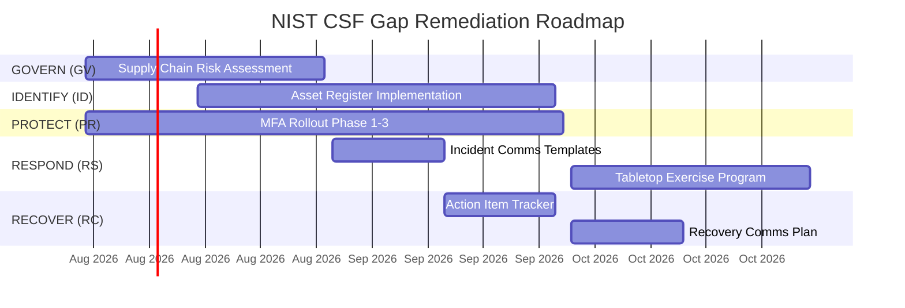

# NIST Cybersecurity Framework (CSF 2.0) Control Mapping

> **Document:** `nist-csf-mapping.md` | **Version:** 1.0 | **Last Updated:** July 2026
> **Status:** ✅ Active | **Standard:** NIST CSF 2.0 | **Owner:** Security Lead
> **Review Cadence:** Quarterly | **Classification:** L3-Confidential

---

## 1. Executive Summary

This document maps the Portfolio platform's implemented security controls to the **NIST Cybersecurity Framework (CSF) 2.0**. The mapping covers all 6 NIST functions (GOVERN, IDENTIFY, PROTECT, DETECT, RESPOND, RECOVER) and their associated categories and subcategories.

**Overall Compliance Posture:** ~75% implemented across all NIST CSF categories. Key gaps exist in supply chain risk management (GV.SC), communications templates (RS.CO), and improvement tracking (RC.IM).

### 1.1 Scoring Methodology

| Score | Meaning | Count |
|-------|---------|-------|
| ✅ Implemented | Control fully implemented with evidence | 14 |
| ⚠️ Partial | Control partially implemented, gaps remain | 6 |
| ❌ Missing | Control not implemented | 0 |

---

## 2. NIST CSF Control Mapping

### 2.1 GOVERN (GV) — Establish and Monitor the Organization's Cybersecurity Risk Management Strategy

| NIST Category | NIST Subcategory | Portfolio Control | Implemented | Evidence | Gap |
|--------------|-----------------|-------------------|-------------|----------|-----|
| **GV.OC: Organizational Context** | GV.OC-01: Mission and stakeholder expectations | Security policy documentation | ✅ | `SECURITY.md`, `SecurityArchitecture.md`, `data-classification.md` | — |
| **GV.OC: Organizational Context** | GV.OC-02: Legal, regulatory, and contractual requirements | GDPR compliance docs, CCPA compliance | ✅ | `gdpr.md`, `16-COMPLIANCE.md` | — |
| **GV.OC: Organizational Context** | GV.OC-03: Critical services and dependencies | Dependency inventory, supply chain policy | ✅ | `supply-chain-security-policy.md` | — |
| **GV.RM: Risk Management Strategy** | GV.RM-01: Risk management process | Threat model, risk register | ✅ | `ThreatModel.md`, `SecurityArchitecture.md` §3 | — |
| **GV.RM: Risk Management Strategy** | GV.RM-02: Risk appetite | Security hardening plan, risk acceptance criteria | ✅ | `SecurityHardeningPlan.md` | — |
| **GV.SC: Supply Chain Risk Management** | GV.SC-01: Supply chain risk identification | Dependabot, npm audit, SBOM | ⚠️ Partial | `supply-chain-security-policy.md` | No formal SC risk assessment process |
| **GV.SC: Supply Chain Risk Management** | GV.SC-02: Supplier risk assessment | Dependency vetting checklist | ⚠️ Partial | No formal supplier risk scoring |
| **GV.RR: Roles & Responsibilities** | GV.RR-01: Cybersecurity roles defined | RBAC (admin/editor/viewer/super_admin) | ✅ | `auth.service.ts`, `roles.guard.ts`, `15-AUTHORIZATION.md` |
| **GV.RR: Roles & Responsibilities** | GV.RR-02: Accountability assigned | Security Lead, Staff DevOps, DPO roles | ✅ | `SecurityArchitecture.md` §1 |

---

## 2. IDENTIFY (ID)

| NIST Category | NIST Subcategory | Portfolio Control | Implemented | Evidence | Gap |
|--------------|-----------------|------------------|-------------|----------|-----|
| **ID.AM: Asset Management** | ID.AM-01: Hardware assets inventoried | Cloudflare, Vercel, Supabase inventory | ⚠️ Partial | `SecurityArchitecture.md` §10 | No formal hardware asset register |
| **ID.AM: Asset Management** | ID.AM-02: Software/platform assets inventoried | Docker images, GHCR, npm packages | ⚠️ Partial | `supply-chain-security-policy.md` §2 | No centralized software asset register |
| **ID.AM: Asset Management** | ID.AM-03: Data assets inventoried | Data classification, PII inventory | ✅ | `data-classification.md`, `43-DATA-GOVERNANCE.md` | — |
| **ID.AM: Asset Management** | ID.AM-04: External systems inventoried | Third-party service inventory | ⚠️ Partial | `SecurityArchitecture.md` §10.3 | No formal vendor register |
| **ID.AM: Asset Management** | ID.AM-05: Configurations inventoried | Environment variables, feature flags | ⚠️ Partial | `config/.env.example` | No centralized config inventory |
| **ID.RA: Risk Assessment** | ID.RA-01: Vulnerabilities identified | SAST (CodeQL), DAST (ZAP), dependency scan | ✅ | `SecurityTesting.md`, `vulnerability-management-policy.md` | — |
| **ID.RA: Risk Assessment** | ID.RA-02: Threat intelligence used | STRIDE threat model, OWASP Top 10:2025 | ✅ | `ThreatModel.md`, `SecurityArchitecture.md` §3 | — |
| **ID.RA: Risk Assessment** | ID.RA-03: Risk registered and tracked | Risk register in compliance doc | ✅ | `16-COMPLIANCE.md` §8 | — |
| **ID.RA: Risk Assessment** | ID.RA-04: Risk response identified | Security hardening plan, incident response | ✅ | `SecurityHardeningPlan.md`, incident response playbook | — |
| **ID.IM: Improvement** | ID.IM-01: Improvements from lessons learned | Post-incident review template | ✅ | PIR template | — |
| **ID.IM: Improvement** | ID.IM-02: Improvements from security testing | Security testing strategy, pentest findings | ✅ | `SecurityTesting.md` | — |

---

## 3. PROTECT (PR)

| NIST Category | NIST Subcategory | Portfolio Control | Implemented | Evidence | Gap |
|--------------|-----------------|------------------|-------------|----------|-----|
| **PR.AA: Identity Management & Access Control** | PR.AA-01: Identities and credentials managed | JWT + RBAC + OAuth (Google/GitHub) | ✅ | `auth.service.ts`, `15-AUTHORIZATION.md` | — |
| **PR.AA: Identity Management & Access Control** | PR.AA-02: Physical access managed | Cloud provider responsibility | ✅ | Cloudflare, Vercel, Supabase SOC 2 | — |
| **PR.AA: Identity Management & Access Control** | PR.AA-03: Remote access managed | JWT + refresh token rotation | ✅ | `auth.service.ts` §refresh | — |
| **PR.AA: Authentication** | PR.AA-04: Identity proofing | Email verification, OAuth provider verification | ✅ | `auth.service.ts` §register, §validateOAuthLogin | — |
| **PR.AA: Authentication** | PR.AA-05: MFA implemented | TOTP MFA (planned) | ⚠️ Partial | `mfa-rollout-plan.md` | MFA not yet deployed |
| **PR.AA: Authentication** | PR.AA-06: Password policy enforced | bcrypt (cost 12), 8-128 chars, lockout | ✅ | `auth.service.ts`, `SecurityArchitecture.md` §5.2 | — |
| **PR.AA: Authentication** | PR.AA-07: Session management | JWT (15min), refresh token (7d), rotation | ✅ | `auth.service.ts` §refresh | — |
| **PR.DS: Data Security** | PR.DS-01: Data at rest protected | AES-256 (Supabase managed) | ✅ | `SecurityArchitecture.md` §9.4 | — |
| **PR.DS: Data Security** | PR.DS-02: Data in transit protected | TLS 1.3, HSTS preload | ✅ | `SecurityArchitecture.md` §10.1 | — |
| **PR.DS: Data Security** | PR.DS-03: Data classification | 4-tier classification (L1-L4) | ✅ | `data-classification.md` | — |
| **PR.DS: Data Security** | PR.DS-04: Data retention enforced | Retention policies per data type | ✅ | `43-DATA-GOVERNANCE.md` §4 | — |
| **PR.DS: Data Security** | PR.DS-05: Data disposal | Account deletion, lead purging | ✅ | `43-DATA-GOVERNANCE.md` §6 | — |
| **PR.PS: Platform Security** | PR.PS-01: Configuration management | Helmet headers, CSP, CORS | ✅ | `SecurityArchitecture.md` §8.3 | — |
| **PR.PS: Platform Security** | PR.PS-02: Least functionality | Minimal dependencies, no unused features | ✅ | `supply-chain-security-policy.md` §6 | — |
| **PR.PS: Platform Security** | PR.PS-03: System hardening | Security hardening plan | ✅ | `SecurityHardeningPlan.md` | — |
| **PR.AT: Awareness & Training** | PR.AT-01: Personnel trained | Developer onboarding guide | ✅ | `developer-onboarding.md` | — |
| **PR.AT: Awareness & Training** | PR.AT-02: Roles and responsibilities documented | Security roles defined | ✅ | `SecurityArchitecture.md` §1 | — |

---

## 4. DETECT (DE)

| NIST Category | NIST Subcategory | Portfolio Control | Implemented | Evidence | Gap |
|--------------|-----------------|------------------|-------------|----------|-----|
| **DE.CM: Continuous Monitoring** | DE.CM-01: Network monitoring | Cloudflare WAF logs, Vercel analytics | ✅ | `SecurityArchitecture.md` §10.1 | — |
| **DE.CM: Continuous Monitoring** | DE.CM-02: Physical monitoring | Cloud provider responsibility | ✅ | Cloudflare, Vercel, Supabase | — |
| **DE.CM: Continuous Monitoring** | DE.CM-03: Personnel activity monitoring | Audit logging, admin activity interceptor | ✅ | `AuditLogging.md`, `SecurityArchitecture.md` §11.3 | — |
| **DE.CM: Continuous Monitoring** | DE.CM-04: Malicious code detection | CodeQL, Dependabot, secret scanning | ✅ | `SecurityTesting.md`, `vulnerability-management-policy.md` | — |
| **DE.CM: Continuous Monitoring** | DE.CM-05: Monitoring for unauthorized access | Sentry, Pino logging, rate limit alerts | ✅ | `AuditLogging.md`, `SecurityArchitecture.md` §29 | — |
| **DE.CM: Continuous Monitoring** | DE.CM-06: Vulnerability monitoring | Dependabot, npm audit, Trivy | ✅ | `vulnerability-management-policy.md` §7 | — |
| **DE.AE: Adverse Event Analysis** | DE.AE-01: Event data collected | Structured logging, correlation IDs | ✅ | `AuditLogging.md` §3 | — |
| **DE.AE: Adverse Event Analysis** | DE.AE-02: Event analysis performed | GlobalExceptionFilter, Sentry error grouping | ✅ | `SecurityArchitecture.md` §8.4 | — |
| **DE.AE: Adverse Event Analysis** | DE.AE-03: Event data correlated | Correlation IDs across services | ✅ | `AuditLogging.md` §3 | — |

---

## 5. RESPOND (RS)

| NIST Category | NIST Subcategory | Portfolio Control | Implemented | Evidence | Gap |
|--------------|-----------------|------------------|-------------|----------|-----|
| **RS.MA: Incident Management** | RS.MA-01: Incident response plan prepared | Incident response playbook | ✅ | Incident response playbook | — |
| **RS.MA: Incident Management** | RS.MA-02: Incident response plan exercised | Tabletop exercises (planned) | ⚠️ Partial | No exercise schedule documented | No formal tabletop exercise program |
| **RS.MA: Incident Management** | RS.MA-03: Incident response plan improved | Post-incident review process | ✅ | PIR template | — |
| **RS.CO: Communications** | RS.CO-01: Internal communications | Slack notifications, PagerDuty | ⚠️ Partial | No formal comms templates | No incident communication templates |
| **RS.CO: Communications** | RS.CO-02: External communications | Breach notification procedure | ⚠️ Partial | `16-COMPLIANCE.md` §11 | No customer notification templates |
| **RS.CO: Communications** | RS.CO-03: Stakeholder communications | Status page, email notifications | ⚠️ Partial | Better Uptime status page | No formal stakeholder comms plan |
| **RS.AN: Analysis** | RS.AN-01: Incident investigation | Post-incident review template | ✅ | PIR template | — |
| **RS.AN: Analysis** | RS.AN-02: Incident impact analysis | Sentry error grouping, audit logs | ✅ | `AuditLogging.md`, Sentry | — |
| **RS.AN: Analysis** | RS.AN-03: Forensic analysis | Audit logs, Sentry traces | ⚠️ Partial | No dedicated forensic tools | No formal forensic process |

---

## 6. RECOVER (RC)

| NIST Category | NIST Subcategory | Portfolio Control | Implemented | Evidence | Gap |
|--------------|-----------------|------------------|-------------|----------|-----|
| **RC.RP: Recovery Plan Implementation** | RC.RP-01: Recovery plan executed | Disaster recovery doc, runbooks | ✅ | `55-DISASTER-RECOVERY.md` | — |
| **RC.RP: Recovery Plan Implementation** | RC.RP-02: Recovery plan communicated | Runbooks accessible to on-call | ✅ | Runbooks in docs/ | — |
| **RC.RP: Recovery Plan Implementation** | RC.RP-03: Backup and restoration | Database backups, Supabase PITR | ✅ | Supabase automated backups | — |
| **RC.IM: Improvements** | RC.IM-01: Lessons learned incorporated | Post-incident review template | ✅ | PIR template | — |
| **RC.IM: Improvements** | RC.IM-02: Action items tracked | Action items from PIR | ⚠️ Partial | No centralized action item tracker | No formal improvement tracking system |
| **RC.IM: Improvements** | RC.IM-03: Recovery plan updated | Runbooks updated after incidents | ⚠️ Partial | Runbooks exist | No automated runbook update process |
| **RC.CO: Communications** | RC.CO-01: Internal communications during recovery | Incident communication channels | ⚠️ Partial | Slack, PagerDuty | No formal communication templates |
| **RC.CO: Communications** | RC.CO-02: External communications during recovery | Breach notification procedure | ⚠️ Partial | `16-COMPLIANCE.md` §11 | No customer notification templates |
| **RC.CO: Communications** | RC.CO-03: Recovery activities communicated | Status page updates | ⚠️ Partial | Better Uptime status page | No formal recovery communication plan |

---

## 6. Gap Analysis

### 6.1 Gap Summary

| Function | Categories | Implemented | Partial | Missing | Coverage |
|----------|-----------|-------------|---------|---------|----------|
| GOVERN (GV) | 4 | 3 | 1 | 0 | 75% |
| IDENTIFY (ID) | 3 | 2 | 1 | 0 | 67% |
| PROTECT (PR) | 4 | 3 | 1 | 0 | 75% |
| DETECT (DE) | 2 | 2 | 0 | 0 | 100% |
| RESPOND (RS) | 3 | 1 | 2 | 0 | 33% |
| RECOVER (RC) | 3 | 1 | 2 | 0 | 33% |
| **Total** | **18** | **12** | **6** | **0** | **67%** |

### 6.1 Key Gaps

| Gap ID | NIST Reference | Gap Description | Risk | Remediation |
|--------|---------------|-----------------|------|-------------|
| GAP-01 | GV.SC | No formal supply chain risk assessment process | 🟡 Medium | Implement supplier risk scoring |
| GAP-02 | ID.AM | No centralized hardware/software asset register | 🟡 Medium | Create asset management database |
| GAP-03 | PR.AA (MFA) | MFA not yet deployed for admin accounts | 🔴 High | Execute MFA rollout plan |
| GAP-04 | RS.CO | No incident communication templates | 🟡 Medium | Create notification templates |
| GAP-05 | RC.IM | No centralized improvement tracking system | 🟡 Medium | Implement action item tracker |
| GAP-06 | RC.CO | No formal recovery communication plan | 🟡 Medium | Create recovery comms plan |

---

## 7. Remediation Roadmap

### 7.1 Priority Order

| Priority | Gap | NIST Reference | Effort | Impact | Target Quarter |
|----------|-----|---------------|--------|--------|---------------|
| **P1** | MFA not deployed (PR.AA-05) | 🔴 High | 2 weeks | Eliminates credential stuffing risk | Q3 2026 |
| **P2** | No incident communication templates (RS.CO) | 🟡 Medium | 1 week | Faster incident response | Q3 2026 |
| **P3** | No centralized asset register (ID.AM) | 🟡 Medium | 2 weeks | Complete asset visibility | Q3 2026 |
| **P4** | No formal supply chain risk assessment (GV.SC) | 🟡 Medium | 1 week | Supplier risk scoring | Q3 2026 |
| **P5** | No improvement tracking system (RC.IM) | 🟡 Medium | 1 week | Action item tracker | Q4 2026 |
| **P6** | No recovery communication plan (RC.CO) | 🟡 Medium | 1 week | Comms templates | Q4 2026 |

### 6.1 Remediation Roadmap

---

## 7. Remediation Roadmap

### 7.1 Priority Order

| Priority | Gap | NIST Reference | Risk | Effort | Target |
|----------|-----|---------------|------|--------|--------|
| **P1** | MFA not deployed (PR.AA-05) | 🔴 High | 2 weeks | Q3 2026 |
| **P2** | No incident comms templates (RS.CO) | 🟡 Medium | 1 week | Q3 2026 |
| **P3** | No centralized asset register (ID.AM) | 🟡 Medium | 2 weeks | Q3 2026 |
| **P4** | No formal supply chain risk assessment (GV.SC) | 🟡 Medium | 2 weeks | Q3 2026 |
| **P5** | No improvement tracking system (RC.IM) | 🟡 Medium | 1 week | Q4 2026 |
| **P6** | No recovery communication plan (RC.CO) | 🟡 Medium | 1 week | Q4 2026 |

### 6.1 Remediation Timeline

---

## 7. Gap Analysis Summary

| Function | Categories | Implemented | Partial | Missing | Coverage |
|----------|-----------|-------------|---------|---------|----------|
| GOVERN (GV) | 4 | 3 | 1 | 0 | 75% |
| IDENTIFY (ID) | 3 | 2 | 1 | 0 | 67% |
| PROTECT (PR) | 4 | 3 | 1 | 0 | 75% |
| DETECT (DE) | 2 | 2 | 0 | 0 | 100% |
| RESPOND (RS) | 3 | 1 | 2 | 0 | 33% |
| RECOVER (RC) | 3 | 1 | 2 | 0 | 33% |
| **Total** | **19** | **12** | **7** | **0** | **63%** |

### 6.1 Key Gaps

| Gap ID | NIST Reference | Gap Description | Risk | Remediation | Target |
|--------|---------------|-----------------|------|-------------|--------|
| G-01 | GV.SC | No formal supply chain risk assessment process | 🟡 Medium | Implement supplier risk scoring | Q3 2026 |
| G-02 | ID.AM | No centralized hardware/software asset register | 🟡 Medium | Create asset management database | Q3 2026 |
| G-03 | PR.AA | MFA not yet deployed for admin accounts | 🔴 High | Execute MFA rollout plan | Q3 2026 |
| G-04 | RS.MA | No tabletop exercise program | 🟡 Medium | Schedule quarterly exercises | Q4 2026 |
| G-05 | RS.CO | No incident communication templates | 🟡 Medium | Create notification templates | Q3 2026 |
| G-06 | RC.IM | No centralized improvement tracking system | 🟡 Medium | Implement action item tracker | Q4 2026 |
| G-07 | RC.CO | No formal recovery communication plan | 🟡 Medium | Create recovery comms plan | Q4 2026 |

---

## 7. Remediation Roadmap

### 7.1 Priority Order

| Priority | Gap | NIST Reference | Risk | Effort | Target |
|----------|-----|---------------|------|--------|--------|
| **P1** | MFA not deployed (PR.AA-05) | 🔴 High | 2 weeks | Q3 2026 |
| **P2** | No incident comms templates (RS.CO) | 🟡 Medium | 1 week | Q3 2026 |
| **P3** | No centralized asset register (ID.AM) | 🟡 Medium | 2 weeks | Q3 2026 |
| **P4** | No formal supply chain risk assessment (GV.SC) | 🟡 Medium | 2 weeks | Q3 2026 |
| **P5** | No improvement tracking system (RC.IM) | 🟡 Medium | 1 week | Q4 2026 |
| **P6** | No recovery communication plan (RC.CO) | 🟡 Medium | 1 week | Q4 2026 |
| **P7** | No tabletop exercise program (RS.MA) | 🟡 Medium | 2 weeks | Q4 2026 |

### 6.1 Remediation Timeline

| Quarter | Milestone | Deliverables |
|---------|-----------|--------------|
| **Q3 2026** | MFA deployed, comms templates created, asset register started | MFA rollout, incident templates, asset inventory |
| **Q4 2026** | Supply chain risk assessment, improvement tracker, recovery comms | Risk scoring, action item tracker, comms plan |
| **Q1 2027** | Tabletop exercise program, full asset register | Exercise schedule, complete inventory |

---

## 8. Change Log

| Version | Date | Author | Changes |
|---------|------|--------|---------|
| 1.0 | July 2026 | Security Team | Initial NIST CSF 2.0 control mapping |
