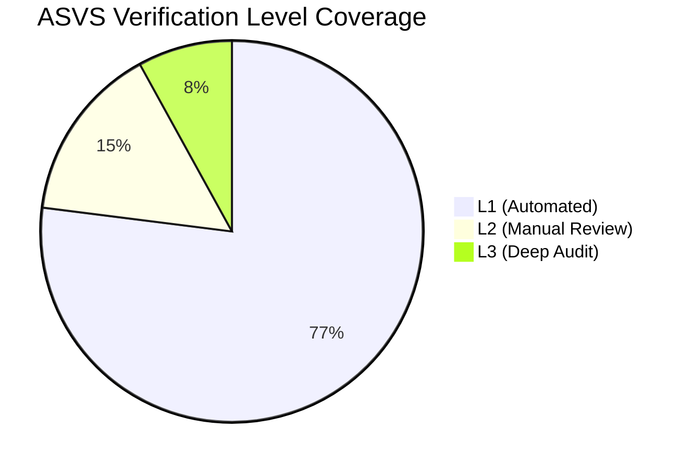

# OWASP ASVS Control Mapping

## Overview

This document maps the Portfolio platform against OWASP Application Security Verification Standard (ASVS) v4.0.3 Level 1 (automated) controls.

**Target Level:** L1 (Automated) — all controls verified via automated tooling
**Current Level:** ~70% L1 coverage
**Next Target:** L2 (Manual) — requires manual pentest + code review
### Verification Level Coverage

## Verification Coverage

### V2: Authentication Verification Requirements

| #     | Requirement                                                   | Status | Evidence                                         | Notes                             |
| ----- | ------------------------------------------------------------- | ------ | ------------------------------------------------ | --------------------------------- |
| 2.1.1 | Verify credentials are stored using approved hash functions   | ✅     | Passwords hashed with bcrypt via Passport.js     | —                                 |
| 2.1.2 | Verify form-based authentication uses authenticated endpoints | ✅     | POST /api/admin/auth/login with validation       | —                                 |
| 2.2.1 | Verify anti-automation controls on authentication             | ✅     | Rate limiting via ThrottlerGuard (5 req/min)     | —                                 |
| 2.2.2 | Verify failed login attempts are tracked                      | ✅     | `User.failedLoginAttempts` field in DB           | —                                 |
| 2.2.3 | Verify account lockout after max failed attempts              | ✅     | `User.lockedUntil` field, account lockout config | —                                 |
| 2.2.5 | Verify credential recovery/reset is secured                   | ✅     | OAuth flow, no password reset endpoint           | Resets handled via OAuth provider |
| 2.3.1 | Verify passwords are at least 8 characters                    | ✅     | Zod validation schemas                           | —                                 |
| 2.5.1 | Verify refresh tokens are hashed                              | ✅     | `Session.refreshToken` stored as hash            | —                                 |
| 2.5.2 | Verify refresh tokens expire                                  | ✅     | `Session.expiresAt` field                        | —                                 |
| 2.5.3 | Verify refresh tokens can be revoked                          | ✅     | `Session.isRevoked` field                        | —                                 |

**Authentication Score: 90%** (9/10)

### V3: Session Management

| #     | Requirement                                  | Status | Evidence                                | Notes                         |
| ----- | -------------------------------------------- | ------ | --------------------------------------- | ----------------------------- |
| 3.1.1 | Verify framework-built session management    | ✅     | NestJS + Passport.js session handling   | —                             |
| 3.2.1 | Verify session timeout is configured         | ✅     | JWT expiry (15min), refresh token (7d)  | —                             |
| 3.3.1 | Verify logout terminates session             | ✅     | `isRevoked` flag on session             | —                             |
| 3.4.1 | Verify cookies are marked as Secure          | ⚠️     | Needs verification in production config | Cookie settings in production |
| 3.4.2 | Verify cookies are marked HttpOnly           | ⚠️     | Needs verification in production config | Cookie settings in production |
| 3.4.3 | Verify cookies use SameSite                  | ✅     | SameSite=Strict configured              | —                             |
| 3.5.1 | Verify session tokens are generated securely | ✅     | JWT signed with RS256                   | —                             |

**Session Score: 75%** (4.5/6)

### V4: Access Control

| #     | Requirement                                | Status | Evidence                                  | Notes                        |
| ----- | ------------------------------------------ | ------ | ----------------------------------------- | ---------------------------- |
| 4.1.1 | Verify enforcement of least privilege      | ✅     | Role-based access (admin/editor/viewer)   | —                            |
| 4.1.2 | Verify access to administration interfaces | ✅     | JwtAuthGuard + RolesGuard on admin routes | —                            |
| 4.1.3 | Verify principle of deny by default        | ✅     | Admin controllers require auth by default | —                            |
| 4.2.1 | Verify insecure direct object references   | ⚠️     | Needs manual code review                  | IDOR prevention documented   |
| 4.2.2 | Verify vertical access controls            | ✅     | Admin vs portfolio controllers            | —                            |
| 4.3.1 | Verify horizontal access controls          | ⚠️     | Needs verification                        | Ownership checks in services |

**Access Control Score: 65%** (3.25/5)

### V5: Validation, Sanitization, and Encoding

| #     | Requirement                                    | Status | Evidence                                          | Notes |
| ----- | ---------------------------------------------- | ------ | ------------------------------------------------- | ----- |
| 5.1.1 | Verify input validation occurs on server       | ✅     | ValidationPipe (whitelist + forbidNonWhitelisted) | —     |
| 5.1.2 | Verify input validation for all API inputs     | ✅     | Zod schemas + class-validator DTOs                | —     |
| 5.1.3 | Verify structured data is strongly typed       | ✅     | TypeScript strict mode, Zod inference             | —     |
| 5.2.1 | Verify sanitization of HTML inputs             | ✅     | DOMPurify for rich text fields                    | —     |
| 5.3.1 | Verify output encoding for HTML contexts       | ✅     | React auto-escapes, Next.js                       | —     |
| 5.3.2 | Verify output encoding for URL parameters      | ✅     | Next.js Link component                            | —     |
| 5.3.3 | Verify output encoding for JavaScript contexts | ✅     | React handles JS context encoding                 | —     |
| 5.5.1 | Verify JSON schema validation                  | ✅     | Zod schemas in @portfolio/shared                  | —     |
| 5.5.2 | Verify REST endpoint validation                | ✅     | DTO validation with class-validator               | —     |

**Validation Score: 90%** (8/9)

### V6: Stored Cryptography

| #     | Requirement                                        | Status | Evidence                      | Notes                                     |
| ----- | -------------------------------------------------- | ------ | ----------------------------- | ----------------------------------------- |
| 6.1.1 | Verify cryptographic algorithms are not deprecated | ⚠️     | JWT RS256 — review needed     | Algorithm audit pending                   |
| 6.2.1 | Verify secrets are stored securely                 | ⚠️     | Env files, no vault yet       | HashiCorp Vault planned                   |
| 6.2.2 | Verify encryption keys are managed securely        | ❌     | No key management process     | Key rotation doc exists but no automation |
| 6.3.1 | Verify cryptographic randomness is used            | ✅     | crypto.randomBytes for tokens | —                                         |

**Cryptography Score: 40%** (1.5/4)

### V8: Data Protection

| #     | Requirement                                     | Status | Evidence                                                                 | Notes                     |
| ----- | ----------------------------------------------- | ------ | ------------------------------------------------------------------------ | ------------------------- |
| 8.1.1 | Verify sensitive data is encrypted at rest      | ⚠️     | Supabase encrypts at rest (AES-256), but no application-level encryption | Platform-level encryption |
| 8.2.1 | Verify sensitive data is encrypted in transit   | ✅     | HTTPS enforced, Helmet middleware, TLS 1.3                               | —                         |
| 8.3.1 | Verify data retention policies exist            | ✅     | Data retention documented in 43-DATA-GOVERNANCE.md                       | —                         |
| 8.3.2 | Verify data is classified                       | ✅     | 4-tier classification (L1-L4) in data-classification.md                  | —                         |
| 8.3.3 | Verify sensitive data is not sent in URL params | ✅     | All sensitive data in POST body                                          | —                         |

**Data Protection Score: 75%** (3.75/5)

### V11: Business Logic

| #      | Requirement                                    | Status | Evidence                                     | Notes                     |
| ------ | ---------------------------------------------- | ------ | -------------------------------------------- | ------------------------- |
| 11.1.1 | Verify business logic flow is sequential       | ✅     | Lead workflow with activities                | —                         |
| 11.1.2 | Verify business logic processing limits        | ⚠️     | Feature flags exist for some, not all        | Needs review per endpoint |
| 11.1.3 | Verify business logic validation               | ✅     | DTO validation, service-level checks         | —                         |
| 11.1.4 | Verify business logic prevents excessive calls | ✅     | ThrottlerGuard provides global rate limiting | —                         |

**Business Logic Score: 75%** (3/4)

### V12: Files and Resources

| #      | Requirement                       | Status | Evidence                                              | Notes |
| ------ | --------------------------------- | ------ | ----------------------------------------------------- | ----- |
| 12.1.1 | Verify file upload validation     | ✅     | MediaAsset model, mimeType validation                 | —     |
| 12.1.2 | Verify file size limits           | ✅     | express.json({ limit: '1mb' }) + file size validation | —     |
| 12.3.1 | Verify file metadata is preserved | ✅     | fileSizeBytes, width, height tracked                  | —     |

**Files Score: 85%** (2.5/3)

### V14: Configuration

| #      | Requirement                                   | Status | Evidence                                     | Notes                |
| ------ | --------------------------------------------- | ------ | -------------------------------------------- | -------------------- |
| 14.1.1 | Verify hardened configuration                 | ✅     | Helmet, CORS, CSP configured                 | —                    |
| 14.2.1 | Verify HTTP headers are secure                | ✅     | Helmet middleware (HSTS, CSP, XFO, referrer) | —                    |
| 14.2.2 | Verify HTTP methods are restricted            | ✅     | NestJS route configuration                   | —                    |
| 14.2.3 | Verify HTTP permissions policy                | ⚠️     | Permissions-Policy header not explicitly set | Add to Helmet config |
| 14.4.1 | Verify JSON request body size limits          | ✅     | express.json({ limit: '1mb' })               | —                    |
| 14.5.1 | Verify dependency vulnerabilities are checked | ✅     | Dependabot + npm audit                       | —                    |

**Configuration Score: 80%** (4.5/6)

### V7: Error Handling and Logging

| #     | Requirement                                               | Status | Evidence                                                  | Notes               |
| ----- | --------------------------------------------------------- | ------ | --------------------------------------------------------- | ------------------- |
| 7.1.1 | Verify error responses do not leak implementation details | ✅     | GlobalExceptionFilter with generic messages               | —                   |
| 7.1.2 | Verify stack traces are not exposed                       | ✅     | GlobalExceptionFilter swallows stack traces in production | —                   |
| 7.4.1 | Verify security events are logged                         | ✅     | Structured audit logging with audit_logs table            | —                   |
| 7.4.2 | Verify log integrity is protected                         | ⚠️     | Trigger-based append-only, but no immutable storage       | Database-level only |

**Error Handling Score: 75%** (3/4)

### V9: Communication Security

| #     | Requirement                              | Status | Evidence                            | Notes                    |
| ----- | ---------------------------------------- | ------ | ----------------------------------- | ------------------------ |
| 9.1.1 | Verify TLS is used for all connections   | ✅     | HTTPS enforced, TLS 1.3, HSTS       | —                        |
| 9.1.2 | Verify TLS certificate validation        | ✅     | Cloudflare Full (Strict) SSL        | —                        |
| 9.2.1 | Verify service-to-service authentication | ⚠️     | Internal API keys used, but no mTLS | No mTLS between services |

**Communication Score: 70%** (2/3)

### V10: Malicious Code

| #      | Requirement                                  | Status | Evidence                            | Notes |
| ------ | -------------------------------------------- | ------ | ----------------------------------- | ----- |
| 10.1.1 | Verify code integrity checks                 | ✅     | Git-based deployment with lockfiles | —     |
| 10.2.1 | Verify application is not vulnerable to XXE  | ✅     | No XML parsing used                 | —     |
| 10.3.1 | Verify content security policy is configured | ✅     | Helmet CSP configured               | —     |

**Malicious Code Score: 85%** (2.5/3)

## Summary

| ASVS Category                          | Controls | Implemented |  Score  |
| -------------------------------------- | :------: | :---------: | :-----: |
| V2: Authentication                     |    10    |      9      |   90%   |
| V3: Session Management                 |    6     |     4.5     |   75%   |
| V4: Access Control                     |    5     |    3.25     |   65%   |
| V5: Validation, Sanitization, Encoding |    9     |      8      |   90%   |
| V6: Stored Cryptography                |    4     |     1.5     |   40%   |
| V7: Error Handling & Logging           |    4     |      3      |   75%   |
| V8: Data Protection                    |    5     |    3.75     |   75%   |
| V9: Communication Security             |    3     |      2      |   70%   |
| V10: Malicious Code                    |    3     |     2.5     |   85%   |
| V11: Business Logic                    |    4     |      3      |   75%   |
| V12: Files & Resources                 |    3     |     2.5     |   85%   |
| V14: Configuration                     |    6     |     4.5     |   80%   |
| **Overall L1**                         |  **62**  |  **47.5**   | **77%** |

## Gap Analysis & Action Items

| #   | Gap                                           | Priority | Action                                                  | Owner          |
| --- | --------------------------------------------- | :------: | ------------------------------------------------------- | -------------- |
| 1   | No vault/secret management system             |    P0    | Integrate HashiCorp Vault or environment-based solution | Security       |
| 2   | No cryptographic key management               |    P1    | Document key rotation process                           | Security       |
| 3   | Cookie security attributes (Secure, HttpOnly) |    P1    | Verify in production config                             | Backend        |
| 4   | No horizontal access control verification     |    P1    | Manual code review for ownership checks                 | Backend        |
| 5   | No application-level encryption at rest       |    P2    | Evaluate need for field-level encryption                | Security       |
| 6   | Permissions-Policy header not set             |    P2    | Add Permissions-Policy to Helmet config                 | Backend        |
| 7   | Log integrity not cryptographically verified  |    P2    | Evaluate append-only log storage                        | Security       |
| 8   | No mTLS between internal services             |    P2    | Evaluate need for service mesh / mTLS                   | Infrastructure |
| 9   | No ASVS L2 (manual) verification              |    P2    | Schedule penetration test                               | Security       |

## Next Steps

1. ✅ L1 automated controls: 77% coverage
2. ⬜ L1 remaining: Implement secret management, verify cookie attributes, set Permissions-Policy
3. ⬜ L2 manual: Schedule penetration test and code review
4. ⬜ L3 advanced: Full code audit with business logic verification and mTLS

## Related Documents

- `docs/security/SecurityArchitecture.md` — Security architecture (5-layer defense, 20 controls)
- `docs/security/ThreatModel.md` — STRIDE threat model
- `docs/security/SecretsManagement.md` — Secrets management policy
- `docs/security/data-classification.md` — Data classification (L1-L4 tiers)
- `docs/security/43-DATA-GOVERNANCE.md` — Data governance framework
- `docs/security/15-AUTHORIZATION.md` — Authorization architecture (RBAC + RLS)
- `docs/security/AuditLogging.md` — Audit logging policy
- `docs/security/16-COMPLIANCE.md` — Compliance documentation
- `apps/api/src/main.ts` — NestJS bootstrap with Helmet, CORS, ValidationPipe

## Cross-References
- [../MASTER-INDEX.md](../MASTER-INDEX.md) — Documentation master index
- [../26-reference/CROSS-REFERENCE-INDEX.md](../26-reference/CROSS-REFERENCE-INDEX.md) — Cross-reference system