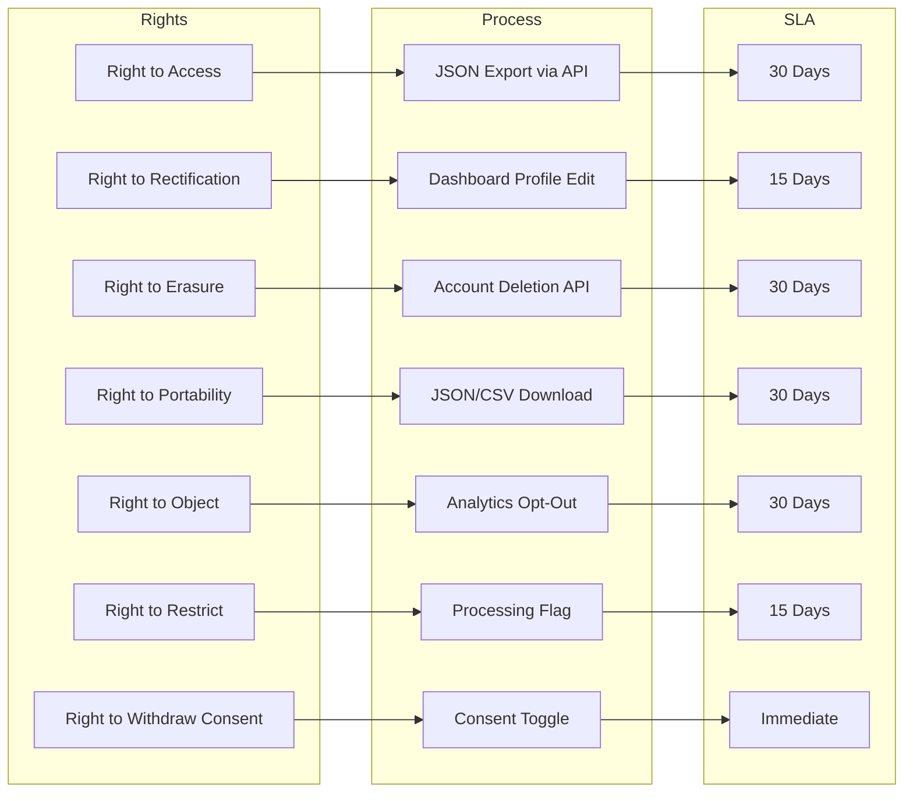

# Privacy Policy

**Last Updated:** July 2026

## Introduction

This Privacy Policy explains how Portfolio ("we", "us", or "our") collects, uses, discloses, and safeguards your personal information when you visit our website or use our services.

We are committed to protecting your privacy and complying with applicable data protection laws, including the General Data Protection Regulation (GDPR) and the California Consumer Privacy Act (CCPA).

## Information We Collect

### Personal Information You Provide

- **Name and email address** when you fill out the contact form or subscribe to updates
- **Message content** when you send inquiries via the contact form
- **Account information** (if granted admin access) including username, email, and role assignment

### Information Collected Automatically

- **Usage analytics:** Page views, interactions, session duration, and referral sources via PostHog
- **Device information:** Browser type, operating system, screen resolution, and IP address
- **Cookies and similar tracking technologies** (see our [Cookie Policy](cookie-policy.md))

### AI Chat Data

When you interact with the AI chat assistant, your messages are processed to generate responses. Messages may be sent to third-party AI providers (OpenAI, Anthropic) for processing. We do not use your chat data for model training.

## How We Use Your Information

| Purpose                         | Legal Basis                        |
| ------------------------------- | ---------------------------------- |
| Display portfolio content       | Legitimate interest (core service) |
| Respond to contact inquiries    | Consent                            |
| Improve website experience      | Legitimate interest                |
| Analytics and usage monitoring  | Consent (via cookie banner)        |
| AI chat assistant functionality | Consent                            |
| Security and abuse prevention   | Legitimate interest                |

## Data Retention

| Data Type                | Retention Period                          |
| ------------------------ | ----------------------------------------- |
| Contact form submissions | 2 years                                   |
| Analytics data           | 26 months (aggregated)                    |
| Admin account data       | Duration of employment + 90 days          |
| AI chat logs             | 30 days                                   |
| Cookie data              | Per cookie expiration (see Cookie Policy) |

## Your Rights

Depending on your jurisdiction, you may have the following rights:

- **Right to Access** Request a copy of your personal data
- **Right to Rectification** Correct inaccurate data
- **Right to Erasure** Request deletion of your data
- **Right to Restrict Processing** Limit how we use your data
- **Right to Data Portability** Receive your data in a structured format
- **Right to Object** Object to processing based on legitimate interest
- **Right to Withdraw Consent** Withdraw consent at any time

To exercise any of these rights, contact us at [privacy@portfolio.dev](mailto:privacy@portfolio.dev). We will respond within 30 days.

## Third-Party Services

| Service   | Purpose                | Data Shared                    | Privacy Policy                                         |
| --------- | ---------------------- | ------------------------------ | ------------------------------------------------------ |
| Vercel    | Hosting and deployment | IP address, request metadata   | [vercel.com/privacy](https://vercel.com/privacy)       |
| Supabase  | Database and storage   | User data, content data        | [supabase.com/privacy](https://supabase.com/privacy)   |
| PostHog   | Product analytics      | Usage events, device info      | [posthog.com/privacy](https://posthog.com/privacy)     |
| Sentry    | Error monitoring       | Error stack traces, IP address | [sentry.com/privacy](https://sentry.com/privacy)       |
| Resend    | Transactional emails   | Email address, message content | [resend.com/privacy](https://resend.com/privacy)       |
| OpenAI    | AI chat processing     | Chat message content           | [openai.com/privacy](https://openai.com/privacy)       |
| Anthropic | AI chat processing     | Chat message content           | [anthropic.com/privacy](https://anthropic.com/privacy) |

## Cookie Usage

We use essential and analytics cookies. For detailed information, see our [Cookie Policy](cookie-policy.md).

## Data Security

We implement appropriate technical and organizational measures to protect your personal data, including:

- Encryption in transit (TLS 1.3)
- Encryption at rest (database-level encryption)
- Access controls and authentication (JWT, role-based access)
- Regular security audits and dependency scanning

## International Data Transfers

Your data may be processed in countries where our service providers are located. We ensure appropriate safeguards are in place through Standard Contractual Clauses or equivalent mechanisms.

## Children's Privacy

Our services are not directed to individuals under the age of 16. We do not knowingly collect personal information from children.

## Changes to This Policy

We may update this Privacy Policy from time to time. Material changes will be notified via the website or email. The "Last Updated" date at the top of this policy indicates when it was last revised.

## Contact

For privacy-related inquiries:

- **Email:** [privacy@portfolio.dev](mailto:privacy@portfolio.dev)
- **Data Protection Officer:** [dpo@portfolio.dev](mailto:dpo@portfolio.dev)
- **Address:** 123 Innovation Drive, Suite 400, San Francisco, CA 94105, United States

---

## Data Subject Rights Overview

## Cross-References
- [../MASTER-INDEX.md](../MASTER-INDEX.md) — Documentation master index
- [../26-reference/CROSS-REFERENCE-INDEX.md](../26-reference/CROSS-REFERENCE-INDEX.md) — Cross-reference system