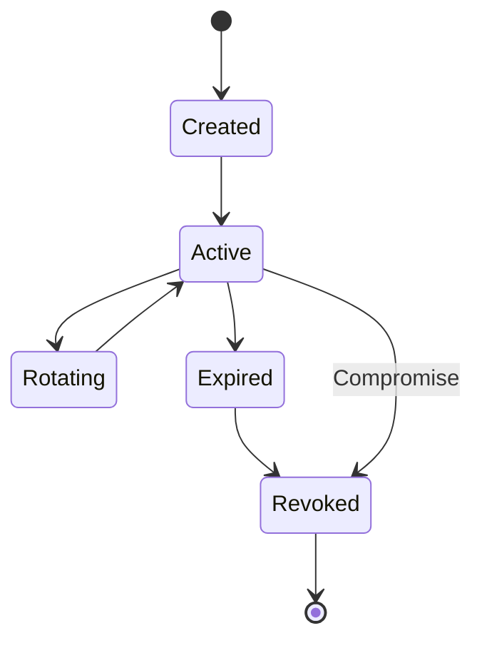

# Secrets Management Policy

## 1. Principles
Managing cryptographic keys, API tokens, and database credentials securely is paramount to the security of the Ultimate Portfolio project.
- **Zero Hardcoding:** Secrets MUST NEVER be hardcoded in source code, configuration files, or Dockerfiles.
- **Least Privilege:** Applications and users should only have access to the secrets they absolutely need.
- **Environment Isolation:** Development, Staging, and Production environments must use entirely separate sets of secrets.
- **Auditability:** All access to secrets must be logged.

## 2. Classification of Secrets
The system utilizes several types of secrets:
- **Database Credentials:** Supabase Connection Strings, PostgreSQL passwords.
- **Cryptographic Keys:** JWT Secret Keys used by NestJS for signing authentication tokens.
- **Third-Party API Keys:** OpenAI API keys for the FastAPI service, LangChain tracing keys.
- **Infrastructure Secrets:** CI/CD deployment tokens, Cloud provider credentials.

## 3. Secret Storage and Injection

### 3.1 Local Development
- Secrets are stored in a `.env.local` or `.env` file.
- **Rule:** The `.env` file MUST be strictly included in `.gitignore`.
- An `.env.example` file should be maintained in the repository containing dummy values (e.g., `JWT_SECRET=your_secret_here`) to guide developers.

### 3.2 Production & Staging Environments
- Secrets are managed using an enterprise-grade Secrets Manager (e.g., AWS Secrets Manager, Google Secret Manager, HashiCorp Vault, or Vercel Secrets for the frontend).
- **Injection:** Compute services (NestJS, FastAPI) retrieve secrets at runtime via the Secrets Manager API or secure environment variable injection provided by the deployment platform.
- **CI/CD Pipelines:** GitHub Actions / GitLab CI must use encrypted repository secrets. Avoid echoing secrets in build logs.

## 4. Secret Lifecycle

### 4.1 Generation
- Secrets should be generated using cryptographically secure random number generators.
- Passwords and keys must meet length and complexity requirements (e.g., JWT secrets must be at least 256 bits / 32 characters long).

### 4.2 Rotation
- **Routine Rotation:** API keys and JWT secrets should be rotated every 90 to 180 days.
- **Emergency Rotation:** If a secret is suspected to be compromised (e.g., leaked on GitHub), it must be rotated *immediately* following the Incident Response playbooks.

### 4.3 Revocation
- When a service or integration is deprecated, its associated secrets must be permanently revoked and deleted from the Secrets Manager.

## 5. Auditing and Enforcement
- **Pre-commit Checks:** Developers must use tools like `git-secrets`, `trufflehog`, or `talisman` as pre-commit hooks to prevent accidental commits of secrets.
- **Repository Scanning:** The central Git repository (e.g., GitHub Advanced Security) must have secret scanning enabled to detect and alert on any leaked secrets in the commit history.
- **Access Logs:** The Secrets Manager must be configured to log every instance of a secret being accessed or modified, generating alerts for unauthorized access attempts.

---

## Secrets Lifecycle

## Cross-References
- [../MASTER-INDEX.md](../MASTER-INDEX.md) — Documentation master index
- [../26-reference/CROSS-REFERENCE-INDEX.md](../26-reference/CROSS-REFERENCE-INDEX.md) — Cross-reference system