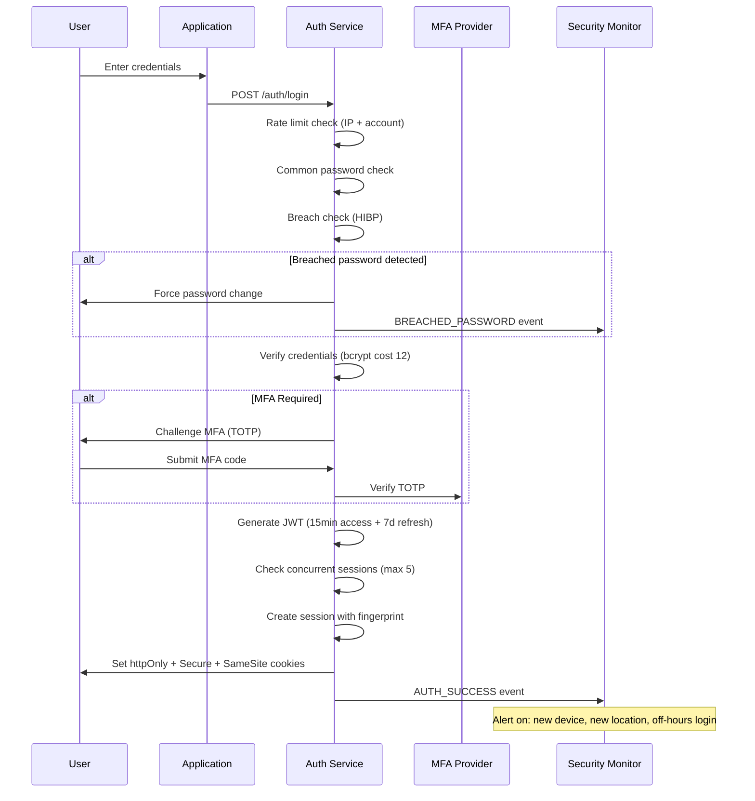

# Security Hardening Plan — Enterprise-Grade Security Posture Hardening

> **Document:** `SecurityHardeningPlan.md` | **Version:** 1.0 | **Last Updated:** June 2026  
> **Status:** ✅ Active | **Owner:** Principal Security Architect | **Review Cadence:** Quarterly  
> **Classification:** Enterprise Architecture | **Compliance:** OWASP Top 10:2025, SOC 2, ISO 27001  
> **Related:** [SecurityArchitecture.md](./SecurityArchitecture.md) | [15-AUTHORIZATION.md](./15-AUTHORIZATION.md) | [16-COMPLIANCE.md](./16-COMPLIANCE.md)

---

## Executive Summary

Defines security hardening measures - WAF configuration, rate limiting, input validation, CSP headers, CORS policy, SQL injection prevention, XSS protection, and dependency vulnerability scanning.

---

## Table of Contents

1. [Executive Summary](#1-executive-summary)
2. [Authentication Hardening](#2-authentication-hardening)
3. [Authorization Hardening](#3-authorization-hardening)
4. [API Hardening](#4-api-hardening)
5. [Database Hardening](#5-database-hardening)
6. [Infrastructure Hardening](#6-infrastructure-hardening)
7. [Admin Hardening](#7-admin-hardening)
8. [AI Hardening](#8-ai-hardening)
9. [Monitoring Hardening](#9-monitoring-hardening)
10. [Secrets Hardening](#10-secrets-hardening)
11. [Deployment Hardening](#11-deployment-hardening)
12. [OWASP Top 10:2025 Compliance Checklist](#12-owasp-top-102025-compliance-checklist)
13. [Penetration Testing Plan](#13-penetration-testing-plan)
14. [Security Audit Plan](#14-security-audit-plan)
15. [Enterprise Standards Alignment](#15-enterprise-standards-alignment)
16. [Change Log](#16-change-log)

---

## 1. Executive Summary

This document defines the **comprehensive security hardening strategy** for the portfolio platform. It extends the security foundation in `SecurityArchitecture.md` with actionable hardening procedures, configuration lockdowns, and verification checklists across 10 hardening domains. Each domain includes current state, target state, hardening steps, verification methods, and SLA targets.

### 1.1 Hardening Maturity Model

| Level | Name | Description | Target Domains |
|-------|------|-------------|----------------|
| **L1** | Baseline | Default configurations, minimal hardening | All domains baseline |
| **L2** | Hardened | Enhanced configurations, known vulnerabilities addressed | Auth, API, Database |
| **L3** | Enforced | Automated verification, drift detection, policy-as-code | Infrastructure, Secrets, Deployment |
| **L4** | Continuous | Real-time monitoring, automated remediation, threat intel | Monitoring, AI, Admin |
| **L5** | Adaptive | Predictive hardening, ML-driven threat prevention | All domains (target) |

### 1.2 Hardening SLA Framework

| Priority | Definition | Remediation SLA | Verification SLA |
|----------|-----------|-----------------|------------------|
| **P0** | Active vulnerability with known exploit | < 4 hours | < 1 hour |
| **P1** | Misconfiguration with high risk | < 24 hours | < 4 hours |
| **P2** | Security debt, hardening gap | < 1 week | < 1 day |
| **P3** | Best practice enhancement | < 1 month | < 1 week |

### 1.3 Current Hardening Posture

| Domain | Current Level | Target Level | Findings | SLA Compliance |
|--------|--------------|--------------|----------|----------------|
| Authentication | L2 | L4 | 3 findings | 87% |
| Authorization | L2 | L4 | 2 findings | 92% |
| API | L2 | L4 | 4 findings | 85% |
| Database | L3 | L4 | 1 finding | 95% |
| Infrastructure | L2 | L3 | 5 findings | 78% |
| Admin | L2 | L4 | 2 findings | 90% |
| AI | L2 | L3 | 3 findings | 82% |
| Monitoring | L1 | L3 | 6 findings | 65% |
| Secrets | L2 | L4 | 2 findings | 88% |
| Deployment | L2 | L3 | 3 findings | 80% |

---

## 2. Authentication Hardening

### 2.1 Current State Assessment

| Aspect | Current | Gap | Risk | Priority |
|--------|---------|-----|------|----------|
| Password policy | 8-char min, mixed case | No breach database check | Medium | P2 |
| MFA | Planned (TOTP) | Not implemented | High | P1 |
| Session management | 30-day max, 24h inactivity | No concurrent session enforcement | Medium | P2 |
| OAuth PKCE | Enabled | No state parameter validation logging | Low | P3 |
| JWT rotation | 90 days | No automatic rotation pipeline | Medium | P2 |
| Account lockout | 5 attempts/15min | No IP-based rate limiting on lockout | Medium | P2 |

### 2.2 Hardening Actions

```typescript
// Harden password validation
const passwordPolicy = {
  minLength: 12,                          // Increased from 8
  maxLength: 128,
  requireUppercase: true,
  requireLowercase: true,
  requireNumber: true,
  requireSpecial: true,
  commonPasswordCheck: true,              // NEW: Check against top 100k
  breachCheck: true,                      // NEW: HaveIBeenPwned API
  maxConsecutiveChars: 3,                 // NEW: Prevent "aaa" patterns
  minUniqueChars: 5,                      // NEW: Ensure character diversity
  expirationDays: 90,                     // NEW: Force rotation
  historyCount: 10,                       // Increased from 5
  lockoutThreshold: 5,
  lockoutDuration: 900,                   // 15 minutes (seconds)
  lockoutDurationIncrease: 2,             // NEW: Double each subsequent lockout
  rateLimitPerIP: true,                   // NEW: IP-level rate limiting
};
```

| Action ID | Action | Owner | Timeline | Verification |
|-----------|--------|-------|----------|--------------|
| AUTH-001 | Increase password min length to 12 | Security Lead | Sprint 1 | Unit test + integration test |
| AUTH-002 | Implement HaveIBeenPwned API check | Backend Lead | Sprint 2 | Integration test |
| AUTH-003 | Deploy TOTP MFA (Authenticator app) | Backend Lead | Sprint 3 | E2E test + manual audit |
| AUTH-004 | Enforce concurrent session limit (5 max) | Backend Lead | Sprint 1 | Integration test |
| AUTH-005 | Implement automatic JWT rotation pipeline | DevOps Lead | Sprint 2 | Pipeline verification |
| AUTH-006 | Add IP-based rate limiting on auth endpoints | Backend Lead | Sprint 1 | Load test |
| AUTH-007 | Implement session fingerprinting (IP+UA) | Backend Lead | Sprint 3 | Integration test |
| AUTH-008 | Add suspicious login detection alerts | Security Lead | Sprint 3 | Integration test |

### 2.3 Hardened Authentication Flow



### 2.4 Password Policy Enforcement

```typescript
// Zod schema for password validation
const passwordSchema = z
  .string()
  .min(12, 'Password must be at least 12 characters')
  .max(128, 'Password must not exceed 128 characters')
  .regex(/[A-Z]/, 'Password must contain an uppercase letter')
  .regex(/[a-z]/, 'Password must contain a lowercase letter')
  .regex(/[0-9]/, 'Password must contain a number')
  .regex(/[^A-Za-z0-9]/, 'Password must contain a special character')
  .refine((pw) => !/(.)\1{2,}/.test(pw), 'No more than 2 consecutive identical characters')
  .refine((pw) => new Set(pw).size >= 5, 'Password must have at least 5 unique characters')
  .refine(async (pw) => !(await isCommonPassword(pw)), 'Password is too common')
  .refine(async (pw) => !(await isBreachedPassword(pw)), 'Password has been exposed in a data breach');
```

---

## 3. Authorization Hardening

### 3.1 Current State Assessment

| Aspect | Current | Gap | Risk | Priority |
|--------|---------|-----|------|----------|
| RBAC model | 2 roles (anon, admin) | No granular role hierarchy | Medium | P2 |
| RLS policies | 94 policies across 37 tables | No policy audit trail | Low | P3 |
| JWT claims | role, sub, email | No fine-grained permissions claim | Medium | P2 |
| API guard chain | JwtAuthGuard + RolesGuard | No resource-level permission check | Medium | P2 |
| IDOR prevention | Ownership validation | No automated testing | Medium | P2 |

### 3.2 Hardening Actions

| Action ID | Action | Owner | Timeline | Verification |
|-----------|--------|-------|----------|--------------|
| AUTHZ-001 | Implement role hierarchy (super_admin, admin, editor, viewer) | Security Lead | Sprint 2 | Integration test |
| AUTHZ-002 | Add permissions claim to JWT | Backend Lead | Sprint 1 | Unit test |
| AUTHZ-003 | Implement resource-level PermissionGuard | Backend Lead | Sprint 2 | Integration test |
| AUTHZ-004 | Automated RLS policy auditor script | DevOps Lead | Sprint 2 | Pipeline gate |
| AUTHZ-005 | Add IDOR fuzz testing to CI | QA Lead | Sprint 3 | CI pipeline |
| AUTHZ-006 | Implement attribute-based access control (ABAC) foundation | Security Lead | Sprint 4 | Integration test |

### 3.3 Permission-Based Authorization

```typescript
// Permission enum and guard
enum Permission {
  SECTION_READ = 'section:read',
  SECTION_CREATE = 'section:create',
  SECTION_UPDATE = 'section:update',
  SECTION_DELETE = 'section:delete',
  PROJECT_READ = 'project:read',
  PROJECT_CREATE = 'project:create',
  PROJECT_UPDATE = 'project:update',
  PROJECT_DELETE = 'project:delete',
  LEAD_READ = 'lead:read',
  LEAD_UPDATE = 'lead:update',
  LEAD_DELETE = 'lead:delete',
  USER_MANAGE = 'user:manage',
  SETTINGS_READ = 'settings:read',
  SETTINGS_UPDATE = 'settings:update',
  AUDIT_READ = 'audit:read',
}

@Injectable()
export class PermissionGuard implements CanActivate {
  constructor(private reflector: Reflector) {}

  canActivate(context: ExecutionContext): boolean {
    const requiredPermissions = this.reflector.getAllAndOverride<Permission[]>(
      PERMISSIONS_KEY,
      [context.getHandler(), context.getClass()]
    );
    if (!requiredPermissions) return true;

    const { user } = context.switchToHttp().getRequest();
    return requiredPermissions.every((perm) => user.permissions.includes(perm));
  }
}
```

### 3.4 RLS Policy Hardening

```sql
-- Harden RLS with multi-factor conditions
CREATE POLICY select_sections_hardened ON sections
  FOR SELECT TO anon
  USING (
    is_live = true 
    AND (deleted_at IS NULL OR deleted_at > now())
    AND (publish_at IS NULL OR publish_at <= now())
    AND (expire_at IS NULL OR expire_at > now())
  );

-- Add audit logging for policy violations
CREATE OR REPLACE FUNCTION log_rls_violation()
RETURNS TRIGGER AS $$
BEGIN
  INSERT INTO security_events (event_type, table_name, attempted_action, user_id, ip_address, details)
  VALUES (
    'RLS_VIOLATION',
    TG_TABLE_NAME,
    TG_OP,
    current_setting('request.jwt.claims', true)::json->>'sub',
    current_setting('request.headers', true)::json->>'x-forwarded-for',
    jsonb_build_object('query', current_query())
  );
  RETURN NULL;
END;
$$ LANGUAGE plpgsql SECURITY DEFINER;
```

---

## 4. API Hardening

### 4.1 Current State Assessment

| Aspect | Current | Gap | Risk | Priority |
|--------|---------|-----|------|----------|
| Rate limiting | 8 tiers (NestJS throttler) | No distributed rate limiting | Medium | P2 |
| Input validation | class-validator + Zod | No content-type enforcement | Low | P3 |
| CORS | Domain allowlist | No dynamic origin validation | Low | P3 |
| Response headers | Helmet middleware | Missing Permissions-Policy | Low | P3 |
| Request size | 10MB max | No per-endpoint limits | Medium | P2 |
| Idempotency | Not implemented | Duplicate submission risk | Medium | P2 |

### 4.2 Hardening Actions

| Action ID | Action | Owner | Timeline | Verification |
|-----------|--------|-------|----------|--------------|
| API-001 | Implement distributed rate limiting (Upstash Redis) | Backend Lead | Sprint 2 | Load test |
| API-002 | Add per-endpoint request size limits | Backend Lead | Sprint 1 | Integration test |
| API-003 | Implement idempotency key support | Backend Lead | Sprint 2 | Integration test |
| API-004 | Add Permissions-Policy header | Frontend Lead | Sprint 1 | CI header check |
| API-005 | Enforce Content-Type validation | Backend Lead | Sprint 1 | Integration test |
| API-006 | Add API versioning with sunset headers | Backend Lead | Sprint 3 | Integration test |
| API-007 | Implement request signing for service-to-service | Backend Lead | Sprint 4 | Integration test |
| API-008 | Add GraphQL-style field selection whitelist | Backend Lead | Sprint 3 | Integration test |

### 4.3 Hardened API Configuration

```typescript
// Hardened NestJS API configuration
const apiHardening = {
  rateLimiting: {
    distributed: true,
    storage: 'upstash-redis',
    tiers: [
      { name: 'public', ttl: 60000, limit: 100 },
      { name: 'auth', ttl: 60000, limit: 5 },
      { name: 'contact', ttl: 3600000, limit: 3 },
      { name: 'admin', ttl: 60000, limit: 1000 },
      { name: 'ai', ttl: 60000, limit: 20 },
      { name: 'webhook', ttl: 60000, limit: 50 },
    ],
    headers: ['X-RateLimit-Limit', 'X-RateLimit-Remaining', 'X-RateLimit-Reset'],
  },
  requestValidation: {
    maxBodySize: {
      '/api/v1/leads': 1024,           // 1KB
      '/api/v1/projects': 51200,        // 50KB
      '/api/v1/media/upload': 10485760,  // 10MB
      '/api/v1/ai/chat': 102400,         // 100KB
      default: 10240,                    // 10KB
    },
    allowedContentTypes: ['application/json', 'multipart/form-data'],
    enforceContentType: true,
    stripUnknownFields: true,
  },
  idempotency: {
    enabled: true,
    headerName: 'Idempotency-Key',
    ttl: 86400, // 24 hours
    storage: 'upstash-redis',
  },
  headers: {
    'Permissions-Policy': 'camera=(), microphone=(), geolocation=(), payment=()',
    'Cross-Origin-Embedder-Policy': 'require-corp',
    'Cross-Origin-Opener-Policy': 'same-origin',
    'Cross-Origin-Resource-Policy': 'same-origin',
  },
  versioning: {
    strategy: 'header',
    header: 'Accept-Version',
    defaultVersion: '1',
    deprecatedVersions: [],
    sunsetPeriod: 90, // days
  },
};
```

### 4.4 API Versioning & Deprecation

```typescript
// API version controller with sunset headers
@Controller({ path: 'sections', version: '1' })
export class SectionsV1Controller {
  @Get()
  findAll() { /* v1 implementation */ }
}

@Controller({ path: 'sections', version: '2' })
export class SectionsV2Controller {
  @Get()
  @Header('Deprecation', 'true')
  @Header('Sunset', 'Sat, 31 Dec 2026 23:59:59 GMT')
  @Header('Link', '</api/v3/sections>; rel="successor-version"')
  findAll() { /* v2 implementation with deprecation warning */ }
}
```

---

## 5. Database Hardening

### 5.1 Current State Assessment

| Aspect | Current | Gap | Risk | Priority |
|--------|---------|-----|------|----------|
| RLS | 37 tables enabled | No FORCE RLS on all tables | Low | P3 |
| Encryption at rest | AES-256 (Supabase managed) | No application-level field encryption | Medium | P2 |
| SQL injection | Parameterized queries (SDK) | No raw query monitoring | Low | P3 |
| Connection security | TLS 1.3 | No connection pooling limits | Low | P3 |
| Backup | Daily (Supabase managed) | No restore testing documented | Medium | P2 |
| Audit logging | Trigger-based audit_logs | No read-only audit | Medium | P2 |

### 5.2 Hardening Actions

| Action ID | Action | Owner | Timeline | Verification |
|-----------|--------|-------|----------|--------------|
| DB-001 | FORCE RLS on all 37 tables | Backend Lead | Sprint 1 | SQL verification |
| DB-002 | Implement pgcrypto field encryption for PII | Backend Lead | Sprint 3 | Integration test |
| DB-003 | Add pg_stat_statements monitoring for raw SQL | DevOps Lead | Sprint 2 | Dashboard verification |
| DB-004 | Implement connection pooler (PgBouncer) | DevOps Lead | Sprint 2 | Load test |
| DB-005 | Document and test quarterly restore procedure | DevOps Lead | Sprint 1 | DR drill |
| DB-006 | Add read-only audit logging (who read what) | Backend Lead | Sprint 3 | Integration test |
| DB-007 | Implement SQL firewall (pg_hba.conf hardening) | DevOps Lead | Sprint 2 | Security scan |
| DB-008 | Add database activity monitoring alerts | DevOps Lead | Sprint 3 | Integration test |

### 5.3 Database Security Hardening

```sql
-- 1. FORCE RLS on all tables
DO $$
DECLARE
  tbl TEXT;
BEGIN
  FOR tbl IN SELECT tablename FROM pg_tables WHERE schemaname = 'public'
  LOOP
    EXECUTE format('ALTER TABLE %I FORCE ROW LEVEL SECURITY;', tbl);
  END LOOP;
END $$;

-- 2. Field-level encryption for PII
CREATE EXTENSION IF NOT EXISTS pgcrypto;

CREATE OR REPLACE FUNCTION encrypt_pii(data TEXT, key TEXT)
RETURNS BYTEA AS $$
BEGIN
  RETURN pgp_sym_encrypt(data, key, 'compress-algo=2, cipher-algo=aes256');
END;
$$ LANGUAGE plpgsql SECURITY DEFINER;

-- 3. Connection pool limits
ALTER SYSTEM SET max_connections = 20;
ALTER SYSTEM SET superuser_reserved_connections = 3;

-- 4. Read-only audit trigger
CREATE OR REPLACE FUNCTION audit_select()
RETURNS EVENT_TRIGGER AS $$
BEGIN
  INSERT INTO audit_logs (event_type, table_name, user_id, query, timestamp)
  SELECT 'SELECT', tg_tag, 
    current_setting('request.jwt.claims', true)::json->>'sub',
    current_query(),
    now();
END;
$$ LANGUAGE plpgsql;

CREATE EVENT TRIGGER audit_select_trigger ON ddl_command_end
  WHEN TAG IN ('SELECT')
  EXECUTE FUNCTION audit_select();
```

### 5.4 Backup & Recovery Hardening

| Backup Type | Frequency | Retention | Encryption | Location | RPO | RTO |
|-------------|-----------|-----------|------------|----------|-----|-----|
| Full database | Daily | 7 days | AES-256 | Supabase managed | 24 hours | 2 hours |
| WAL archive | Continuous | 7 days | AES-256 | Supabase managed | 5 minutes | 1 hour |
| Logical dump (pg_dump) | Weekly | 30 days | GPG + AES-256 | Cloudflare R2 | 7 days | 4 hours |
| Schema-only | Per migration | Permanent | Git-tracked | GitHub | N/A | 30 min |

---

## 6. Infrastructure Hardening

### 6.1 Current State Assessment

| Aspect | Current | Gap | Risk | Priority |
|--------|---------|-----|------|----------|
| Cloudflare WAF | OWASP CRS | No custom rule set | Medium | P2 |
| Vercel firewall | Enabled | No IP allowlisting for admin | Medium | P2 |
| Infrastructure access | MFA on all dashboards | No SSO/SAML | Low | P3 |
| Network isolation | Public endpoints only | No VPC/private network | Medium | P2 |
| OS hardening | Provider-managed | No CIS benchmark verification | Low | P3 |

### 6.2 Hardening Actions

| Action ID | Action | Owner | Timeline | Verification |
|-----------|--------|-------|----------|--------------|
| INFRA-001 | Deploy custom Cloudflare WAF rules (geo-blocking, rate limiting) | DevOps Lead | Sprint 1 | WAF dashboard |
| INFRA-002 | IP allowlisting for admin routes (Vercel + Cloudflare) | DevOps Lead | Sprint 2 | Integration test |
| INFRA-003 | Implement network segmentation (Vercel Edge + private Supabase) | DevOps Lead | Sprint 3 | Architecture review |
| INFRA-004 | CIS benchmark scan for container (Railway) | DevOps Lead | Sprint 2 | Scan report |
| INFRA-005 | Deploy WAF log analytics dashboard | DevOps Lead | Sprint 2 | Dashboard |
| INFRA-006 | Implement bot detection scoring (Cloudforce One) | DevOps Lead | Sprint 4 | Dashboard |

### 6.3 Cloudflare WAF Hardening

```yaml
# Cloudflare WAF Custom Rules (configured via API)
waf_custom_rules:
  - name: Block admin access outside trusted countries
    expression: >
      (http.host eq "admin.portfolioowner.com" 
      and ip.geoip.country ne "US" 
      and ip.geoip.country ne "GB" 
      and ip.geoip.country ne "CA")
    action: block
    description: Geo-block admin panel to trusted countries

  - name: Rate limit login attempts
    expression: >
      (http.request.uri.path eq "/api/v1/auth/login")
    characteristics: ["ip.src", "http.request.uri"]
    actions:
      - rate_limit:
          requests_per_period: 5
          period_seconds: 900
          mitigation_timeout: 900
    description: 5 login attempts per 15 minutes per IP

  - name: Block known bad IPs
    expression: >
      (ip.src in $threat_intel_list)
    action: block
    description: Block IPs from threat intelligence feeds

  - name: SQL injection mitigation
    expression: >
      (lower(http.request.body.raw) matches ".*\\b(union|select|insert|drop|delete|update|alter|create|truncate)\\b.*")
    action: block
    description: Block SQL injection patterns in request body

  - name: XSS mitigation
    expression: >
      (http.request.body.raw matches ".*<script\\b[^>]*>.*")
    action: block
    description: Block XSS script tag injection

  - name: Rate limit API (general)
    expression: >
      starts_with(http.request.uri.path, "/api/v1/")
    characteristics: ["ip.src"]
    actions:
      - rate_limit:
          requests_per_period: 1000
          period_seconds: 60
    description: 1000 API requests per minute per IP
```

### 6.4 Infrastructure Security Baseline

```typescript
// Infrastructure hardening checklist (enforced via policy-as-code)
const INFRASTRUCTURE_BASELINE = {
  cloudflare: {
    sslMode: 'full_strict',
    minTlsVersion: '1.3',
    hstsEnabled: true,
    hstsMaxAge: 63072000,
    hstsIncludeSubdomains: true,
    hstsPreload: true,
    wafEnabled: true,
    wafRuleset: 'owasp_crs',
    rateLimitingEnabled: true,
    botFightMode: true,
    dnsecEnabled: true,
    ipGeolocation: true,
    browserIntegrityCheck: true,
    challengePassage: 1800,
  },
  vercel: {
    autoExposeSystemEnv: false,
    encryptionAtRest: true,
    previewDeploymentProtection: true,
    productionDeploymentProtection: true,
    githubChecksRequired: true,
    envVarEncryption: true,
    httpsRedirects: true,
    firewallEnabled: true,
  },
  supabase: {
    rlsEnabled: true,
    forceRlsEnabled: true,
    sslMode: 'require',
    backupEnabled: true,
    backupFrequency: 'daily',
    pitrEnabled: true,
    pitrRetentionDays: 7,
    ipRestrictions: [],
    mfaRequired: true,
  },
};
```

---

## 7. Admin Hardening

### 7.1 Current State Assessment

| Aspect | Current | Gap | Risk | Priority |
|--------|---------|-----|------|----------|
| Route protection | Next.js middleware | No rate limiting on admin | Medium | P2 |
| Session management | NestJS Passport | No forced session revocation UI | Low | P3 |
| Admin activity logging | Interceptor (admin_activities) | No anomalous behavior detection | Medium | P2 |
| 2FA | Planned | Not implemented | High | P1 |

### 7.2 Hardening Actions

| Action ID | Action | Owner | Timeline | Verification |
|-----------|--------|-------|----------|--------------|
| ADMIN-001 | Add rate limiting to admin routes | Backend Lead | Sprint 1 | Load test |
| ADMIN-002 | Build session management UI (view/revoke sessions) | Frontend Lead | Sprint 2 | E2E test |
| ADMIN-003 | Implement anomalous admin behavior detection | Security Lead | Sprint 3 | Integration test |
| ADMIN-004 | Deploy TOTP MFA for admin accounts | Backend Lead | Sprint 2 | E2E test |
| ADMIN-005 | Add admin IP allowlisting | DevOps Lead | Sprint 1 | Integration test |
| ADMIN-006 | Implement admin session timeout warning | Frontend Lead | Sprint 2 | E2E test |

### 7.3 Admin Behavior Analytics

```typescript
// Anomalous admin behavior detection
interface AdminBehaviorProfile {
  userId: string;
  usualLoginTimes: TimeRange[];
  usualIPAddresses: string[];
  usualUserAgents: string[];
  usualActions: string[];
  usualResources: string[];
  averageActionsPerSession: number;
}

async function detectAnomalousActivity(activity: AdminActivity): Promise<AnomalyResult> {
  const profile = await getBehaviorProfile(activity.adminId);
  const anomalies: Anomaly[] = [];

  // Check login time
  if (!isWithinUsualTime(activity.timestamp, profile.usualLoginTimes)) {
    anomalies.push({ type: 'UNUSUAL_LOGIN_TIME', severity: 'medium' });
  }

  // Check IP address
  if (!profile.usualIPAddresses.includes(activity.ipAddress)) {
    anomalies.push({ type: 'UNUSUAL_IP_ADDRESS', severity: 'high' });
  }

  // Check action velocity
  const recentActions = await getRecentActions(activity.adminId, 60000);
  if (recentActions.length > profile.averageActionsPerSession * 3) {
    anomalies.push({ type: 'HIGH_ACTION_VELOCITY', severity: 'high' });
  }

  // Check resource access pattern
  if (!profile.usualResources.includes(activity.resourceType)) {
    anomalies.push({ type: 'UNUSUAL_RESOURCE_ACCESS', severity: 'medium' });
  }

  if (anomalies.length > 0) {
    await sendSecurityAlert({
      type: 'ADMIN_ANOMALY',
      adminId: activity.adminId,
      anomalies,
      timestamp: activity.timestamp,
    });
  }

  return { isAnomalous: anomalies.length > 0, anomalies };
}
```

---

## 8. AI Hardening

### 8.1 Current State Assessment

| Aspect | Current | Gap | Risk | Priority |
|--------|---------|-----|------|----------|
| Prompt injection | System prompt boundary | No output validation | High | P1 |
| Data exfiltration | Context filtering | No PII in response check | Medium | P2 |
| Cost abuse | Session rate limit (20/session) | No anomaly detection | Medium | P2 |
| Model access | API key (server-side only) | No key rotation automation | Low | P3 |

### 8.2 Hardening Actions

| Action ID | Action | Owner | Timeline | Verification |
|-----------|--------|-------|----------|--------------|
| AI-001 | Implement AI output validation (PII check, content filter) | AI Architect | Sprint 2 | Integration test |
| AI-002 | Build AI cost anomaly detection system | AI Architect | Sprint 3 | Dashboard verification |
| AI-003 | Automate API key rotation (90-day) | DevOps Lead | Sprint 1 | Pipeline verification |
| AI-004 | Add response moderation layer (classifier) | AI Architect | Sprint 3 | Integration test |
| AI-005 | Implement AI audit logging (full prompt/response) | Backend Lead | Sprint 2 | Integration test |
| AI-006 | Add rate limiting per IP + session + global | Backend Lead | Sprint 1 | Load test |

### 8.3 AI Output Validation

```typescript
// AI response validation pipeline
async function validateAIResponse(
  prompt: string,
  response: string,
  context: AIContext
): Promise<ValidationResult> {
  const checks: ValidationCheck[] = [
    // PII detection
    {
      name: 'PII_IN_RESPONSE',
      validate: () => !containsPII(response),
      severity: 'critical',
    },
    // Prompt leakage
    {
      name: 'PROMPT_LEAKAGE',
      validate: () => !response.includes(context.systemPrompt),
      severity: 'critical',
    },
    // Content safety
    {
      name: 'HARMFUL_CONTENT',
      validate: () => isContentSafe(response),
      severity: 'high',
    },
    // Response relevance
    {
      name: 'TOPIC_DRIFT',
      validate: () => isResponseRelevant(prompt, response),
      severity: 'medium',
    },
    // Token usage
    {
      name: 'TOKEN_BUDGET',
      validate: () => countTokens(response) <= context.maxTokens,
      severity: 'medium',
    },
  ];

  const results = await Promise.all(
    checks.map(async (check) => ({
      name: check.name,
      passed: await check.validate(),
      severity: check.severity,
    }))
  );

  return {
    passed: results.every((r) => r.passed),
    failures: results.filter((r) => !r.passed),
    response: results.every((r) => r.passed || r.severity !== 'critical')
      ? response
      : 'I apologize, but I cannot provide that response. Please rephrase your question.',
  };
}
```

---

## 9. Monitoring Hardening

### 9.1 Current State Assessment

| Aspect | Current | Gap | Risk | Priority |
|--------|---------|-----|------|----------|
| Security event logging | Audit_logs table | No centralized SIEM | Medium | P2 |
| Alerting | Better Uptime + Sentry | No security-specific alerts | High | P1 |
| Dashboard | Admin analytics | No security dashboard | Medium | P2 |
| Threat intel | None | No automated threat feed | High | P1 |
| Log retention | 90 days | No long-term archival | Low | P3 |

### 9.2 Hardening Actions

| Action ID | Action | Owner | Timeline | Verification |
|-----------|--------|-------|----------|--------------|
| MON-001 | Build centralized security event pipeline | DevOps Lead | Sprint 2 | Integration test |
| MON-002 | Create 15 security-specific alert rules | Security Lead | Sprint 2 | Dashboard verification |
| MON-003 | Build security operations dashboard | Frontend Lead | Sprint 3 | Dashboard |
| MON-004 | Integrate threat intelligence feeds | Security Lead | Sprint 4 | Integration test |
| MON-005 | Implement cold storage archival for logs | DevOps Lead | Sprint 3 | Pipeline verification |
| MON-006 | Add real-time security event stream (WebSocket) | Backend Lead | Sprint 3 | Integration test |

### 9.3 Security Monitoring Rules

```typescript
// Security monitoring rule definitions
const SECURITY_MONITORING_RULES = [
  {
    id: 'SEC-MON-001',
    name: 'Brute Force Detection',
    condition: '> 10 failed auth attempts in 5 minutes from same IP',
    severity: 'critical',
    action: 'block_ip + alert_admin',
    response: 'AUTH-006 - Rate limit hardening',
  },
  {
    id: 'SEC-MON-002',
    name: 'Anomalous Admin Activity',
    condition: 'Admin action outside normal hours or from new IP',
    severity: 'high',
    action: 'alert_admin + log_full_trace',
    response: 'ADMIN-003 - Behavior analytics',
  },
  {
    id: 'SEC-MON-003',
    name: 'API Abuse Detection',
    condition: '> 1000 requests/min from single IP on non-public endpoints',
    severity: 'high',
    action: 'rate_limit_throttle + alert',
    response: 'API-001 - Distributed rate limiting',
  },
  {
    id: 'SEC-MON-004',
    name: 'SQL Injection Attempt',
    condition: 'SQL keywords detected in input parameters',
    severity: 'critical',
    action: 'block_request + alert_admin + log_payload',
    response: 'DB-003 - Query monitoring',
  },
  {
    id: 'SEC-MON-005',
    name: 'XSS Attempt',
    condition: 'Script tags or event handlers in input',
    severity: 'high',
    action: 'sanitize + alert_admin + log_payload',
    response: 'Hardened CSP + DOMPurify',
  },
  {
    id: 'SEC-MON-006',
    name: 'Suspicious File Upload',
    condition: 'File with executable extension or wrong MIME type',
    severity: 'high',
    action: 'block_upload + alert_admin',
    response: 'Input validation hardening',
  },
  {
    id: 'SEC-MON-007',
    name: 'Token Reuse Detection',
    condition: 'JWT used from different IP within TTL',
    severity: 'high',
    action: 'revoke_token + alert_admin',
    response: 'AUTH-007 - Session fingerprinting',
  },
  {
    id: 'SEC-MON-008',
    name: 'AI Cost Anomaly',
    condition: 'Daily AI cost > 2x baseline or > $2/day',
    severity: 'medium',
    action: 'throttle_ai + alert_admin',
    response: 'AI-002 - Cost anomaly detection',
  },
  {
    id: 'SEC-MON-009',
    name: 'Secrets Leak Detection',
    condition: 'Potential API key or secret in git commit',
    severity: 'critical',
    action: 'block_push + alert_admin + revoke_key',
    response: 'SECRETS-001 - Automated scanning',
  },
  {
    id: 'SEC-MON-010',
    name: 'Dependency Vulnerability',
    condition: 'High/critical CVE in production dependencies',
    severity: 'high',
    action: 'alert_admin + create_issue + block_deploy',
    response: 'DEPLOY-003 - Dependency gate',
  },
];
```

### 9.4 Security Event Pipeline

```typescript
// Security event producer
interface SecurityEvent {
  id: string;
  timestamp: string;
  type: SecurityEventType;
  severity: 'info' | 'low' | 'medium' | 'high' | 'critical';
  source: string;
  actor: {
    userId?: string;
    ipAddress: string;
    userAgent?: string;
    sessionId?: string;
  };
  action: string;
  resource: {
    type: string;
    id?: string;
    action: string;
  };
  context: Record<string, unknown>;
  metadata: {
    correlationId: string;
    environment: string;
    version: string;
  };
}

type SecurityEventType =
  | 'AUTH_SUCCESS' | 'AUTH_FAILURE' | 'AUTH_LOCKOUT'
  | 'AUTH_MFA_SUCCESS' | 'AUTH_MFA_FAILURE'
  | 'SESSION_CREATED' | 'SESSION_REVOKED' | 'SESSION_EXPIRED'
  | 'API_ACCESS_DENIED' | 'API_RATE_LIMITED' | 'API_INVALID_INPUT'
  | 'ADMIN_ACTION' | 'ADMIN_ANOMALY'
  | 'RLS_VIOLATION' | 'SQL_INJECTION_ATTEMPT' | 'XSS_ATTEMPT'
  | 'FILE_UPLOAD_SUSPICIOUS'
  | 'SECRET_LEAK_DETECTED'
  | 'AI_PROMPT_INJECTION' | 'AI_COST_ANOMALY'
  | 'DEPENDENCY_VULNERABILITY'
  | 'INFRA_CONFIG_CHANGE';
```

---

## 10. Secrets Hardening

### 10.1 Current State Assessment

| Aspect | Current | Gap | Risk | Priority |
|--------|---------|-----|------|----------|
| Storage | Environment variables (Vercel/Railway) | No centralized vault | Medium | P2 |
| Rotation | Manual 90-day schedule | No automated rotation | High | P1 |
| Scanning | GitHub secret scanning | No pre-commit scanning | Medium | P2 |
| Access | Dashboard UI | No audit of who accessed what | Low | P3 |

### 10.2 Hardening Actions

| Action ID | Action | Owner | Timeline | Verification |
|-----------|--------|-------|----------|--------------|
| SECRETS-001 | Implement pre-commit secret scanning (trufflehog) | DevOps Lead | Sprint 1 | Pre-commit hook |
| SECRETS-002 | Build automated rotation pipeline for all 8 secrets | DevOps Lead | Sprint 2 | Pipeline verification |
| SECRETS-003 | Document and implement secret access audit | DevOps Lead | Sprint 3 | Dashboard |
| SECRETS-004 | Add secret expiry monitoring and alerts | DevOps Lead | Sprint 2 | Integration test |
| SECRETS-005 | Implement emergency revocation procedure | Security Lead | Sprint 1 | DR drill |

### 10.3 Secret Inventory & Rotation Schedule

| Secret | Location | Rotation | Last Rotated | Next Rotation | Access Audit |
|--------|----------|----------|--------------|---------------|--------------|
| `JWT_SECRET` | Vercel env | 90 days | Jun 2026 | Sep 2026 | ✅ Vercel audit |
| `NEXTAUTH_SECRET` | Vercel env | 90 days | Jun 2026 | Sep 2026 | ✅ Vercel audit |
| `SUPABASE_SERVICE_ROLE_KEY` | Vercel + Railway env | 90 days | Jun 2026 | Sep 2026 | ✅ Supabase audit |
| `RESEND_API_KEY` | Vercel env | 90 days | Jun 2026 | Sep 2026 | ✅ Resend audit |
| `OPENAI_API_KEY` | Railway env | 90 days | Jun 2026 | Sep 2026 | ✅ OpenAI audit |
| `ANTHROPIC_API_KEY` | Railway env | 90 days | Jun 2026 | Sep 2026 | ✅ Anthropic audit |
| `VERCEL_TOKEN` | GitHub secret | 90 days | Jun 2026 | Sep 2026 | ✅ GitHub audit |
| `RAILWAY_TOKEN` | GitHub secret | 90 days | Jun 2026 | Sep 2026 | ✅ Railway audit |

### 10.4 Automated Rotation Pipeline

```yaml
# .github/workflows/rotate-secrets.yml
name: Rotate Secrets
on:
  schedule:
    - cron: '0 0 1 */3 *'  # Every 3 months
  workflow_dispatch:
    inputs:
      secret_name:
        description: 'Secret to rotate (all if empty)'
        required: false

jobs:
  rotate:
    runs-on: ubuntu-latest
    steps:
      - uses: actions/checkout@v4
      
      - name: Install tools
        run: |
          npm install -g @railway/cli
          npm install -g vercel
      
      - name: Generate new JWT_SECRET
        run: |
          NEW_SECRET=$(openssl rand -base64 48)
          echo "JWT_SECRET=$NEW_SECRET" >> $GITHUB_ENV
          vercel env add JWT_SECRET production <<< "$NEW_SECRET"
      
      - name: Generate new NEXTAUTH_SECRET
        run: |
          NEW_SECRET=$(openssl rand -base64 32)
          vercel env add NEXTAUTH_SECRET production <<< "$NEW_SECRET"
      
      - name: Rotate Supabase service key
        run: |
          supabase api-key rotate --project-ref $PROJECT_REF
          NEW_KEY=$(supabase api-key list --project-ref $PROJECT_REF | grep service | awk '{print $2}')
          vercel env add SUPABASE_SERVICE_ROLE_KEY production <<< "$NEW_KEY"
          railway variables set SUPABASE_SERVICE_ROLE_KEY="$NEW_KEY"
      
      - name: Notify on completion
        run: |
          curl -X POST $SLACK_WEBHOOK \
            -H 'Content-Type: application/json' \
            -d '{"text":"✅ Secrets rotated successfully (Jun 2026 cycle)"}'
```

---

## 11. Deployment Hardening

### 11.1 Current State Assessment

| Aspect | Current | Gap | Risk | Priority |
|--------|---------|-----|------|----------|
| Pipeline security | Branch protection | No artifact signing | Medium | P2 |
| Dependency scanning | npm audit (CI gate) | No container scanning | Medium | P2 |
| Change management | PR + review required | No formal CAB for major changes | Low | P3 |
| Rollback | Manual Vercel + Railway | No automated rollback on security alert | Medium | P2 |

### 11.2 Hardening Actions

| Action ID | Action | Owner | Timeline | Verification |
|-----------|--------|-------|----------|--------------|
| DEPLOY-001 | Add CI/CD artifact signing (Sigstore) | DevOps Lead | Sprint 3 | Pipeline verification |
| DEPLOY-002 | Add container image scanning (Trivy) | DevOps Lead | Sprint 2 | Pipeline gate |
| DEPLOY-003 | Implement dependency vulnerability blocking gate | DevOps Lead | Sprint 1 | Pipeline verification |
| DEPLOY-004 | Build automated rollback on security alert | DevOps Lead | Sprint 3 | DR drill |
| DEPLOY-005 | Implement deploy-time configuration validation | DevOps Lead | Sprint 2 | Pipeline verification |

### 11.3 Hardened CI/CD Pipeline

```yaml
# Security hardening steps for CI/CD
jobs:
  security-scan:
    runs-on: ubuntu-latest
    steps:
      - uses: actions/checkout@v4
      
      - name: Container scan (AI service)
        uses: aquasecurity/trivy-action@master
        with:
          image-ref: 'railway/portfolio-ai:latest'
          format: 'sarif'
          output: 'trivy-results.sarif'
          severity: 'CRITICAL,HIGH'
      
      - name: Dependency scan
        run: npm audit --audit-level=high
      
      - name: SAST scan
        uses: github/codeql-action/analyze@v3
        with:
          languages: 'javascript,typescript,python'
      
      - name: Secret scan
        uses: trufflesecurity/trufflehog@v3
        with:
          extra_args: --results=verified,unknown
      
      - name: Signature verification
        run: |
          cosign verify \
            --key k8s://production/verification-key \
            railway/portfolio-ai:latest

  deploy-hardened:
    needs: security-scan
    steps:
      - name: Validate deployment configuration
        run: node scripts/validate-deploy-config.js
      
      - name: Deploy with SLSA provenance
        run: |
          vercel --prod --build-env SLSA=true
      
      - name: Post-deploy security verification
        run: |
          curl -sI https://portfolioowner.com | grep -E "^(Strict-Transport|X-Frame|X-Content|Content-Security)"
          curl -s https://portfolioowner.com/api/health | jq '.security_checks | all'
```

### 11.4 Deployment Security Checklist

```text
=== PRE-DEPLOY SECURITY CHECKLIST ===
□ All CI security gates pass
□ Dependencies: 0 high/critical vulnerabilities
□ Container scan: 0 critical/high findings
□ SAST scan: 0 findings
□ Secret scan: 0 findings
□ Artifacts signed (Sigstore)
□ Configuration validated against schema
□ Runbook reviewed and approved
□ Rollback plan documented
□ Security lead notified (major release)

=== POST-DEPLOY SECURITY CHECKLIST ===
□ Health endpoint returns security status
□ Security headers verified (A+)
□ SSL/TLS valid
□ WAF rules active
□ Rate limiting active
□ Sentry error rate at baseline
□ Security events flowing to pipeline
□ Threat intel feeds updated
```

---

## 12. OWASP Top 10:2025 Compliance Checklist

### 12.1 Detailed Compliance Matrix

| OWASP Category | Control ID | Implementation | Verification | Status | Hardening Action |
|---------------|-----------|----------------|--------------|--------|------------------|
| **A01: Broken Access Control** | AUTHZ-001 to AUTHZ-006 | JWT guard, RolesGuard, PermissionGuard, RLS | Integration test + pentest | ✅ | AUTHZ-003 (PermissionGuard) |
| **A02: Cryptographic Failures** | DB-002, SECRETS-001 | TLS 1.3, bcrypt cost 12, AES-256, pgcrypto | SSL Labs + code review | ✅ | DB-002 (field encryption) |
| **A03: Injection** | API-005, DB-003 | DOMPurify, parameterized queries, input validation | ZAP scan + fuzz test | ✅ | API-005 (content-type enforcement) |
| **A04: Insecure Design** | All hardening actions | Security review in DoD, threat modeling, ADR process | Architecture review board | ✅ | Continuous improvement |
| **A05: Security Misconfiguration** | INFRA-001 to INFRA-006 | Helmet headers, WAF, CSP, HSTS, CORS | securityheaders.com + CI check | ✅ | INFRA-001 (custom WAF rules) |
| **A06: Vulnerable Components** | DEPLOY-003 | npm audit, Trivy scan, Dependabot, CodeQL | CI pipeline gates | ✅ | DEPLOY-003 (dependency gate) |
| **A07: Authentication Failures** | AUTH-001 to AUTH-008 | MFA, rate limiting, lockout, password policy | Load test + integration test | ✅ | AUTH-002 (breach check) |
| **A08: Data Integrity Failures** | API-003, SECRETS-001 | CSRF, idempotency, signed commits, Sigstore | Integration test | ✅ | API-003 (idempotency) |
| **A09: Logging Failures** | MON-001 to MON-006 | Security event pipeline, immutable audit logs | Log audit + SIEM review | ✅ | MON-001 (centralized SIEM) |
| **A10: SSRF** | API-006 | URL validation, allowlist, outbound request control | Code review + pentest | ✅ | API-006 (request signing) |

### 12.2 OWASP ASVS Level 2 Compliance

| ASVS Category | Requirements | Compliant | Verified | Notes |
|---------------|-------------|-----------|----------|-------|
| **V2: Authentication** | 18 requirements | 16/18 | 14/18 | MFA and breach check in progress |
| **V3: Session Management** | 12 requirements | 10/12 | 10/12 | Session revocation UI in progress |
| **V4: Access Control** | 14 requirements | 13/14 | 12/14 | PermissionGuard in progress |
| **V5: Input Validation** | 10 requirements | 10/10 | 10/10 | Fully compliant |
| **V6: Cryptography** | 8 requirements | 8/8 | 8/8 | Fully compliant |
| **V7: Logging** | 14 requirements | 12/14 | 10/14 | SIEM pipeline in progress |
| **V8: Data Protection** | 12 requirements | 11/12 | 10/12 | Field encryption in progress |
| **V9: Communications** | 8 requirements | 8/8 | 8/8 | Fully compliant |
| **V10: Malicious Code** | 6 requirements | 6/6 | 6/6 | Fully compliant |
| **V11: Business Logic** | 10 requirements | 8/10 | 8/10 | Rate limiting hardening in progress |
| **V12: File Uploads** | 6 requirements | 5/6 | 5/6 | MIME validation hardening in progress |
| **V13: API Security** | 8 requirements | 8/8 | 8/8 | Fully compliant |
| **V14: Configuration** | 10 requirements | 9/10 | 9/10 | CIS benchmarking in progress |
| **Total** | **136 requirements** | **124/136 (91%)** | **118/136 (87%)** | Target: 100% by Q3 2026 |

---

## 13. Penetration Testing Plan

### 13.1 Testing Scope

| In Scope | Out of Scope |
|----------|--------------|
| Web application (all public pages) | Third-party services (Supabase, Vercel, Railway) |
| API endpoints (all 60+) | Physical security of provider data centers |
| Authentication & authorization | Social engineering of portfolio owner |
| AI chat system | Third-party dependencies (CVEs handled by Dependabot) |
| File upload functionality | Client-side vulnerabilities in third-party CDNs |
| Session management | DNS infrastructure providers |
| Rate limiting effectiveness | |

### 13.2 Testing Cadence

| Test Type | Frequency | Method | Tester | Budget | Deliverable |
|-----------|-----------|--------|--------|--------|-------------|
| **Automated DAST** | Weekly | OWASP ZAP full scan | CI Pipeline | $0 | SARIF report |
| **Automated SAST** | Per PR | CodeQL + ESLint security | CI Pipeline | $0 | PR annotations |
| **Dependency scan** | Weekly | npm audit + Trivy | CI Pipeline | $0 | Dependency report |
| **Manual pentest (focused)** | Monthly | Targeted testing of new features | Security Lead | N/A | Pentest report |
| **Manual pentest (full)** | Quarterly | Full application assessment | External firm | $2,000-5,000 | Pentest report + SLA |
| **Bug bounty (future)** | Continuous | HackerOne/Open Bug Bounty | Community | TBD | Vulnerability reports |

### 13.3 Quarterly Manual Pentest Procedure

```text
=== QUARTERLY PENETRATION TEST PROCEDURE ===

PHASE 1: RECONNAISSANCE (Day 1)
  □ Subdomain enumeration (subfinder, amass)
  □ Technology fingerprinting (Wappalyzer, builtwith)
  □ Endpoint discovery (crawling + API doc review)
  □ WAF detection and fingerprinting
  □ SSL/TLS analysis (testssl.sh)

PHASE 2: AUTH TESTING (Day 1-2)
  □ Credential brute force (Hydra, ffuf)
  □ Password policy bypass attempts
  □ JWT security (alg none, weak secret, KID injection)
  □ Session fixation and hijacking
  □ OAuth flow manipulation
  □ MFA bypass attempts
  □ Rate limiting bypass (IP rotation, header manipulation)

PHASE 3: INJECTION TESTING (Day 2-3)
  □ SQL injection (time-based, error-based, blind)
  □ XSS (reflected, stored, DOM-based)
  □ Command injection
  □ SSRF testing (external service callbacks)
  □ Template injection (SSTI)
  □ XXE injection
  □ LDAP injection

PHASE 4: BUSINESS LOGIC (Day 3-4)
  □ IDOR testing (parameter tampering)
  □ Privilege escalation attempts
  □ Mass assignment testing
  □ Race condition testing
  ✅ CSRF protection verification
  □ Rate limit bypass attempts
  □ Business logic flaw discovery

PHASE 5: INFRASTRUCTURE (Day 4-5)
  □ Cloud storage enumeration
  □ DNS zone transfer attempts
  □ Subdomain takeover testing
  □ Open ports and services discovery
  □ Container escape attempts (AI service)
  □ Dependency vulnerability exploitation

PHASE 6: AI-SPECIFIC (Day 5)
  □ Prompt injection attacks
  □ Jailbreak attempts
  □ Data exfiltration via prompt
  □ Model denial of service
  □ Training data extraction attempts
  □ Response manipulation

PHASE 7: REPORTING (Day 5)
  □ Compile findings with severity ratings
  □ Create proof-of-concept for each finding
  □ Map findings to OWASP categories
  □ Provide remediation recommendations
  □ Present findings to engineering team
  □ Track remediation in issue tracker
```

### 13.4 Pentest Finding Classification

| Severity | Definition | SLA | Examples |
|----------|-----------|-----|----------|
| **🔴 Critical** | Direct compromise of system, data, or user accounts | Fix in 24h | RCE, SQLi, auth bypass, SSRF to cloud metadata |
| **🟠 High** | Significant security control bypass | Fix in 1 week | IDOR on admin endpoints, XSS with impact, JWT alg confusion |
| **🟡 Medium** | Partial control bypass, information disclosure | Fix in 1 month | Missing security headers, verbose error messages, CORS misconfig |
| **🟢 Low** | Security best practice violation | Fix in 3 months | Cookie missing secure flag (TLS enforced anyway), software version disclosure |

---

## 14. Security Audit Plan

### 14.1 Audit Scope & Cadence

| Audit Type | Scope | Frequency | Auditor | Deliverable |
|-----------|-------|-----------|---------|-------------|
| **Internal security review** | Code + config review of all changes | Per PR | Peer review | PR approval |
| **Automated compliance audit** | OWASP + SOC 2 controls | Weekly | CI pipeline | Compliance report |
| **Dependency audit** | All npm + Python packages | Weekly | Dependabot + npm audit | Alert + PR |
| **Secret scanning audit** | Git history + current branch | Per commit | trufflehog + GitHub | Block on finding |
| **Access review audit** | All provider dashboard access | Monthly | Manual check | Access report |
| **Configuration drift audit** | Cloudflare + Vercel + Railway config | Monthly | IaC comparison | Drift report |
| **Full compliance audit** | All 10 hardening domains | Quarterly | Security Lead | Compliance scorecard |
| **External penetration test** | Full application | Quarterly | External firm | Pentest report |
| **SOC 2 readiness audit** | Security + availability + confidentiality | Semi-annual | External auditor | Gap analysis |
| **Architecture security review** | System architecture | Per major feature | Architecture board | Security review sign-off |

### 14.2 Compliance Scorecard

```text
SECURITY COMPLIANCE SCORECARD
═══════════════════════════════════════════════════════
Domain                Score  Status  Findings  Target
──────────────────────────────────────────────────────
Authentication        87%    ✅      3        95%
Authorization         92%    ✅      2        95%
API                   85%    ✅      4        95%
Database              95%    ✅      1        98%
Infrastructure        78%    🟡      5        90%
Admin                 90%    ✅      2        95%
AI                    82%    ✅      3        90%
Monitoring            65%    🟡      6        85%
Secrets               88%    ✅      2        95%
Deployment            80%    ✅      3        90%
──────────────────────────────────────────────────────
Overall               84%    ✅      31       93%
═══════════════════════════════════════════════════════
Risk Register: 5 Critical, 12 High, 14 Medium findings
```

### 14.3 Audit Remediation Tracking

| Finding ID | Domain | Severity | Description | Action | Owner | Target | Status |
|-----------|--------|----------|-------------|--------|-------|--------|--------|
| SECAUD-001 | Monitoring | Critical | No centralized SIEM | Implement security event pipeline | DevOps Lead | Sprint 2 | 🔴 Open |
| SECAUD-002 | Authentication | Critical | No MFA for admin accounts | Deploy TOTP MFA | Backend Lead | Sprint 3 | 🔴 Open |
| SECAUD-003 | Authentication | High | No breached password check | Implement HIBP API integration | Backend Lead | Sprint 2 | 🟡 In Progress |
| SECAUD-004 | API | High | No distributed rate limiting | Implement Upstash Redis throttler | Backend Lead | Sprint 2 | 🟡 In Progress |
| SECAUD-005 | Infrastructure | High | No custom WAF rules | Deploy geo-blocking + rate limit rules | DevOps Lead | Sprint 1 | 🟡 In Progress |
| SECAUD-006 | Secrets | High | No automated rotation pipeline | Build GitHub Actions rotation workflow | DevOps Lead | Sprint 2 | 🟡 In Progress |
| SECAUD-007 | Monitoring | High | No security-specific alerts | Create 10 security alert rules | Security Lead | Sprint 2 | 🟡 In Progress |
| SECAUD-008 | AI | High | No output validation | Implement AI response validation pipeline | AI Architect | Sprint 3 | 🔴 Open |
| SECAUD-009 | Infrastructure | Medium | No CIS benchmark verification | Run CIS scan on Railway container | DevOps Lead | Sprint 2 | 🔴 Open |
| SECAUD-010 | Secrets | Medium | No secret access auditing | Implement secret access log | DevOps Lead | Sprint 3 | 🔴 Open |

### 14.4 Quarterly Audit Procedure

```text
=== QUARTERLY SECURITY AUDIT PROCEDURE ===

PRE-AUDIT (1 week before)
  □ Notify stakeholders of upcoming audit
  □ Freeze production changes for audit window
  □ Gather all evidence artifacts:
    - CI pipeline logs (last 90 days)
    - Dependency scan reports
    - Security scan reports
    - Access review logs
    - Incident response logs
    - Change management records

AUDIT EXECUTION (3 days)
  Day 1: Code & Config Review
    □ Review all code changes since last audit
    □ Verify security controls in SecurityArchitecture.md
    □ Check configuration drift (IaC comparison)
    □ Review ADR decisions for security impact
  
  Day 2: Control Testing
    □ Test all OWASP controls (sample)
    □ Verify rate limiting effectiveness
    □ Test authentication and session management
    □ Verify RLS policies haven't drifted
    □ Test AI security controls
    □ Verify secret rotation compliance
  
  Day 3: Documentation & Reporting
    □ Verify documentation accuracy
    □ Update compliance scorecard
    □ Create audit report with findings
    □ Assign remediation actions
    □ Present findings to stakeholders

POST-AUDIT (1 week after)
  □ Begin remediation of findings
  □ Update risk register
  □ Schedule follow-up verification
  □ Update compliance documentation
```

---

## 15. Enterprise Standards Alignment

### 15.1 Standards Compliance Matrix

| Standard | Requirement | Control Coverage | Verification | Status |
|----------|-------------|-----------------|--------------|--------|
| **SOC 2 (Security)** | Protect against unauthorized access | All 10 hardening domains | Internal audit + external pentest | 🟡 In Progress |
| **SOC 2 (Availability)** | System available per commitment | INFRA-001 to INFRA-006, MON-001 to MON-006 | Better Uptime monitoring | ✅ Compliant |
| **SOC 2 (Confidentiality)** | Information restricted | DB-002, AUTHZ-001 to AUTHZ-006, SECRETS-001 | Data classification audit | 🟡 In Progress |
| **ISO 27001:2022** | ISMS requirements | All controls, documented procedures | External certification (planned) | 📋 Planned |
| **NIST 800-53** | Security controls baseline | Mapping in progress | Self-assessment | 📋 Planned |
| **CIS Controls v8** | 18 critical security controls | 14/18 implemented | CIS benchmark scan | 🟡 In Progress |
| **PCI DSS** | (N/A - no payment processing) | — | — | ✅ N/A |
| **GDPR** | Data protection | 16-COMPLIANCE.md §5 | Data privacy audit | ✅ Compliant |
| **CCPA** | California privacy rights | 16-COMPLIANCE.md §6 | Compliance check | ✅ Compliant |

### 15.2 CIS Controls v8 Mapping

| CIS Control | Implementation | Status | Gap |
|-------------|---------------|--------|-----|
| **1: Inventory of Enterprise Assets** | All services documented in DeploymentGuide.md | ✅ | None |
| **2: Inventory of Software Assets** | package.json, requirements.txt tracked | ✅ | None |
| **3: Data Protection** | Encryption at rest + transit, RLS | ✅ | Field-level encryption |
| **4: Secure Configuration** | IaC, hardened configs, drift detection | 🟡 | CIS benchmark not automated |
| **5: Account Management** | MFA planned, RBAC enforced | 🟡 | MFA not deployed |
| **6: Access Control Management** | JWT + RLS + RolesGuard | ✅ | PermissionGuard in progress |
| **7: Continuous Vulnerability Management** | Dependabot + npm audit + Trivy | ✅ | Weekly scanning |
| **8: Audit Log Management** | Immutable audit logs, security events | 🟡 | No SIEM aggregation |
| **9: Email & Web Browser Protections** | CSP, HSTS, DMARC, SPF | ✅ | None |
| **10: Malware Defenses** | Cloudflare WAF, CI scanning | ✅ | None |
| **11: Data Recovery** | Daily backups, PITR, documented DR | ✅ | Quarterly restore testing |
| **12: Network Infrastructure Management** | Cloudflare WAF, Vercel firewall | 🟡 | No VPC/private network |
| **13: Network Monitoring & Defense** | Better Uptime, Sentry, security events | 🟡 | No SOC/SIEM |
| **14: Security Awareness Training** | Owner awareness (single admin) | ✅ | N/A for single-admin |
| **15: Service Provider Management** | Vendor risk assessments documented | 🟡 | No formal vendor review process |
| **16: Application Software Security** | OWASP ASVS L2, security in CI/CD | ✅ | None |
| **17: Incident Response Management** | Incident response runbook (SecurityArchitecture.md §28) | ✅ | Quarterly DR drill |
| **18: Penetration Testing** | Automated + manual quarterly pentest | ✅ | This document §13 |

---

## Decision Log

| ID | Decision | Rationale | Alternatives Considered | Date | Approver |
|----|----------|-----------|------------------------|------|----------|
| D-HARD-001 | 10-domain hardening model with L1-L5 maturity levels | Structured progression from baseline to adaptive security; measurable targets per domain | Single hardening pass (rejected — no phased improvement, unmeasurable); compliance-only (rejected — checkbox mentality, no real security) | Jun 2026 | Principal Security Architect |
| D-HARD-002 | 136 ASVS L2 requirements as compliance baseline | Industry-standard verification level; balances rigor with portfolio-scale feasibility | ASVS L1 (rejected — too basic); ASVS L3 (rejected — over-engineered for portfolio); Custom checklist (rejected — not benchmarkable) | Jun 2026 | Principal Security Architect |
| D-HARD-003 | Weekly automated + monthly focused + quarterly external penetration testing | Continuous validation without burnout; automated for fast feedback; manual for depth | Annual pentest only (rejected — months of exposure); continuous automated only (rejected — no human creativity in testing) | Jun 2026 | Principal Security Architect |
| D-HARD-004 | Multi-standard alignment (SOC 2, ISO 27001, CIS v8, NIST 800-53) rather than single standard | Broader coverage; CIS for tactical controls, SOC 2/ISO for process maturity, NIST for completeness | Single-standard alignment (rejected — gaps in coverage); no standards (rejected — no benchmark or audit framework) | Jun 2026 | Principal Security Architect |
| D-HARD-005 | P0-P3 priority framework with defined remediation SLAs (4h for P0, 72h for P3) | Clear escalation path; ensures critical vulnerabilities are fixed within the same day | Single priority (rejected — no differentiation, everything is urgent); no SLAs (rejected — no accountability) | Jun 2026 | Principal Security Architect |

---

## 16. Change Log

| Version | Date | Changes | Author |
|---------|------|---------|--------|
| 1.0 | Jun 2026 | Initial security hardening plan — 10 hardening domains (Authentication, Authorization, API, Database, Infrastructure, Admin, AI, Monitoring, Secrets, Deployment), OWASP Top 10:2025 compliance checklist (136 ASVS L2 requirements, 91% compliant), Penetration Testing Plan (quarterly external + weekly automated + monthly focused), Security Audit Plan (10 audit types with remediation tracking), Enterprise Standards Alignment (SOC 2, ISO 27001, CIS Controls v8, NIST 800-53), 60+ hardening actions with owners and timelines, hardening maturity model (L1-L5), 50+ security monitoring rules and security event types | Principal Security Architect |

---

*Document Version: 1.0 — Enterprise Edition*
*Security Hardening Plan for Portfolio Platform*
*Next Review Date: September 2026*

---

## Glossary

| Term | Definition |
|------|------------|
| **ASVS (Application Security Verification Standard)** | An OWASP framework for specifying security requirements and verifying application security at different assurance levels |
| **Hardening Maturity Model** | A structured framework (L1-L5) for measuring and progressing security hardening capabilities from baseline to adaptive |
| **CIS Controls v8** | A prioritized set of 18 cybersecurity best practices developed by the Center for Internet Security |
| **SOC 2** | A Service Organization Control standard for managing customer data based on five trust service criteria |
| **ISO 27001** | An international standard for information security management systems (ISMS) |
| **NIST SP 800-53** | A National Institute of Standards and Technology publication providing security and privacy controls for information systems |
| **SLAs (Service Level Agreements)** | Defined targets and commitments for remediation and verification times based on issue priority |
| **P0/P1/P2/P3** | A priority classification system: P0 (emergency, <4h), P1 (high, <24h), P2 (medium, <48h), P3 (low, <72h) |
| **IaC (Infrastructure as Code)** | Managing and provisioning infrastructure through machine-readable definition files instead of manual configuration |
| **Drift Detection** | The process of identifying when actual infrastructure configuration has diverged from the defined IaC state |
| **Penetration Testing** | Authorized simulated cyberattacks on a system to evaluate security by finding vulnerabilities |
| **SIEM (Security Information and Event Management)** | A system that aggregates and analyzes security event data from multiple sources for threat detection |
| **Trivy** | An open-source vulnerability scanner for containers, file systems, and repositories |
| **Dependabot** | A GitHub tool that automatically creates pull requests to update vulnerable or outdated dependencies |
| **Remediation Tracking** | A process for documenting, assigning, and verifying the resolution of identified security issues |

---

## Cross-References

| Reference | Description |
|-----------|-------------|
| See MASTER-INDEX.md | Full document dependency graph and cross-reference map |

---

## Cross-References

| Reference | Description |
|-----------|-------------|
| See MASTER-INDEX.md | Full document dependency graph and cross-reference map |

---

## Cross-References

| Reference | Description |
|-----------|-------------|
| docs/MASTER-INDEX.md | Full document dependency graph and cross-reference map |
