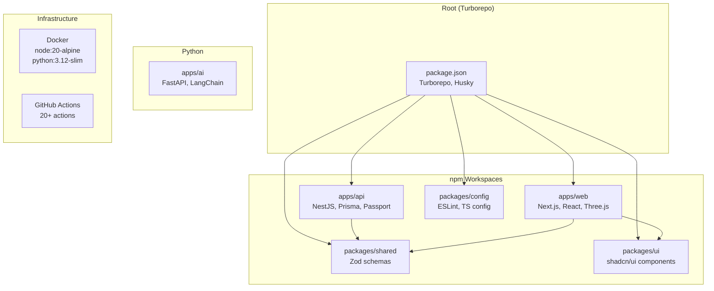
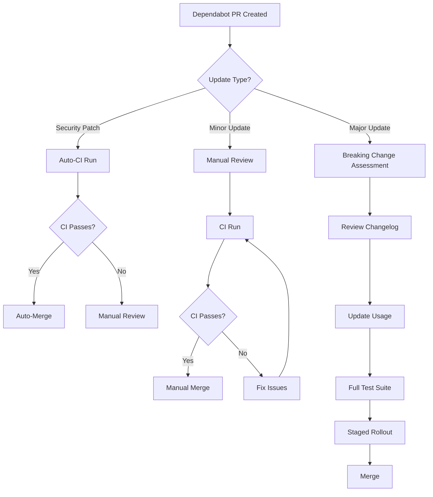
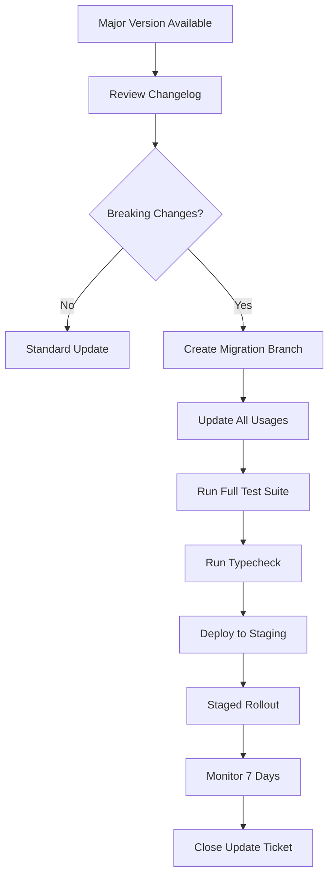

# Supply Chain Security Policy

> **Document:** `supply-chain-security-policy.md` | **Version:** 1.0 | **Last Updated:** July 2026
> **Status:** ✅ Active | **Standard:** SLSA Level 1 (Target: Level 3) | **Owner:** Staff DevOps
> **Review Cadence:** Quarterly | **Classification:** L3-Confidential

---

## 1. Purpose

This policy governs the management of third-party dependencies across the Portfolio platform's software supply chain. It defines requirements for dependency inventory, vulnerability scanning, update cadence, breaking change management, and supply chain integrity verification.

The policy applies to all **8 tracked ecosystems** used by the platform:

| Ecosystem | Scope | Packages Tracked |
|-----------|-------|-----------------|
| npm | api, web, shared, ui, config, root | ~1,200+ transitive |
| pip | ai service | ~50+ transitive |
| Docker | Base images, production images | 3 images |
| GitHub Actions | CI/CD workflows | ~20 actions |
| Cloudflare Workers | Edge functions | ~5 workers |
| Vercel | Edge functions | ~3 functions |
| Supabase | Database extensions | ~5 extensions |
| CDN | Third-party scripts | ~10 scripts |

---

## 2. Dependency Inventory

### 2.1 npm Workspaces

| Workspace | Path | Direct Dependencies | Purpose |
|-----------|------|-------------------|---------|
| **api** | `apps/api/package.json` | NestJS, Prisma, Passport, JWT, bcrypt, BullMQ | Backend API |
| **web** | `apps/web/package.json` | Next.js, React, Three.js, GSAP, TanStack Query | Frontend |
| **ai** | `apps/ai/requirements.txt` | FastAPI, LangChain, OpenAI, Anthropic | AI service |
| **shared** | `packages/shared/package.json` | Zod, TypeScript types | Shared types |
| **ui** | `packages/ui/package.json` | React components, shadcn/ui | UI library |
| **config** | `packages/config/package.json` | ESLint, TypeScript configs | Shared config |
| **root** | `package.json` | Turborepo, Husky, lint-staged | Monorepo root |

### 2.2 Dependency Count by Workspace

| Workspace | Direct Dependencies | Transitive Dependencies | Total |
|-----------|-------------------|------------------------|-------|
| api | ~80 | ~400 | ~480 |
| web | ~100 | ~500 | ~600 |
| ai | ~30 | ~50 | ~80 |
| shared | ~5 | ~20 | ~25 |
| ui | ~20 | ~100 | ~120 |
| config | ~10 | ~30 | ~40 |
| root | ~10 | ~50 | ~60 |
| **Total** | **~255** | **~1,150** | **~1,405** |

---

## 3. Vulnerability Scanning

### 3.1 Scanning Tools

| Tool | Ecosystem | Coverage | Frequency | Action |
|------|-----------|----------|-----------|--------|
| **Dependabot** | npm, pip, Docker, GitHub Actions | All direct dependencies | Daily | Auto-PR for security patches |
| **npm audit** | npm (all workspaces) | All npm packages | Every CI run | Blocking gate (high+) |
| **pip audit** | pip (ai service) | All pip packages | Every CI run | Blocking gate (high+) |
| **Trivy** | Docker images | OS packages + app deps | Weekly | Report to security channel |
| **CodeQL** | All code | Custom query packs | Every PR | Blocking gate |
| **GitHub Dependabot** | All ecosystems | Version alerts | Daily | Auto-PR + Slack notification |

### 3.2 Dependabot Configuration

```yaml
# .github/dependabot.yml
version: 2
updates:
  - package-ecosystem: "npm"
    directory: "/"
    schedule:
      interval: "daily"
      time: "06:00"
    open-pull-requests-limit: 10
    labels:
      - "dependencies"
      - "security"
    reviewers:
      - "security-team"
    allow:
      - dependency-type: "direct"
    ignore:
      - dependency-name: "react"
        versions: [">=19.0.0"]  # Pin React 18 until migration

  - package-ecosystem: "pip"
    directory: "/apps/ai"
    schedule:
      interval: "daily"
      time: "06:00"
    open-pull-requests-limit: 5

  - package-ecosystem: "docker"
    directory: "/"
    schedule:
      interval: "weekly"

  - package-ecosystem: "github-actions"
    directory: "/"
    schedule:
      interval: "weekly"
```

### 3.3 CI Gate Configuration

```yaml
# CI gate: npm audit (blocking for high+)
- name: npm audit
  run: |
    npm audit --audit-level=high
  # Fails CI if any high or critical vulnerability found

# CI gate: pip audit
- name: pip audit
  run: |
    pip-audit --desc on --severity high
  # Fails CI if any high or critical vulnerability found
```

### 3.4 CI Gate Rules

```yaml
# CI pipeline security gates
security-gates:
  npm-audit:
    command: npm audit --audit-level=high
    action: blocking  # Fails CI if high+ vulnerabilities
    exceptions:
      - package: "some-package"
        reason: "No patch available"
        expiry: "2026-08-01"

  pip-audit:
    command: pip-audit --desc on --severity high
    action: blocking

  trivy:
    command: trivy fs --severity CRITICAL,HIGH .
    action: non-blocking (report only)
```

### 3.5 Alert Triage

| Alert Type | Action | SLA | Owner |
|------------|--------|-----|-------|
| Critical CVE (CVSS ≥ 9.0) | Emergency patch PR | 24h | Staff DevOps |
| High CVE (CVSS 7.0-8.9) | Priority patch PR | 72h | Engineering Lead |
| Medium CVE (CVSS 4.0-6.9) | Scheduled patch | 14 days | Team Lead |
| Low CVE (CVSS < 4.0) | Next sprint | 30 days | Engineer |

---

## 4. Update Cadence

### 4.1 Update Schedule

| Update Type | Definition | Cadence | SLA | Process |
|-------------|-----------|---------|-----|---------|
| **Security Patch** | Fix for known CVE | Within 7 days (critical), 14 days (high) | See SLA | Auto-merge Dependabot PR after CI passes |
| **Minor Update** | New features, non-breaking | Within 30 days | 30 days | Manual review + CI |
| **Major Update** | Breaking changes, major version bump | Within 90 days | 90 days | Breaking change assessment |
| **Dev Dependency** | Dev-only packages | Within 90 days | 90 days | Lower priority |
| **Docker Base Image** | OS-level packages | Within 14 days (security) | 14 days | Rebuild + deploy |

### 4.2 Update SLA by Severity

| Update Type | SLA | Auto-Merge | Review Required |
|-------------|-----|------------|----------------|
| Security patch (critical) | 7 days | ✅ (after CI passes) | Post-merge review |
| Security patch (high) | 14 days | ✅ (after CI passes) | Post-merge review |
| Minor update | 30 days | ❌ | Manual review |
| Major update | 90 days | ❌ | Breaking change assessment |

### 4.3 Dependency Graph



### 4.4 Key Dependencies by Risk Tier

| Tier | Criteria | Examples | Count |
|------|----------|---------|-------|
| **🔴 Critical** | Auth, crypto, database, network | bcrypt, jsonwebtoken, Prisma, Supabase SDK | ~15 |
| **🟡 High** | Data processing, file handling, rendering | DOMPurify, Sharp, Three.js | ~30 |
| **🟠 Medium** | Utility, logging, formatting | Pino, Zod, class-validator | ~50 |
| **🟢 Low** | Dev tools, linting, testing | ESLint, Jest, Prettier | ~160 |

### 4.5 Update Process



### 4.6 Update Prioritization Matrix

| Factor | Weight | High Priority | Low Priority |
|--------|--------|---------------|--------------|
| CVE Severity | 40% | Critical/High | Low/None |
| Dependency Type | 25% | Runtime (dependencies) | Dev (devDependencies) |
| Usage Depth | 20% | Core auth/crypto/db | Utility/formatting |
| Update Complexity | 15% | Patch/minor bump | Major version bump |

---

## 5. Breaking Change Process

### 5.1 Major Update Assessment

When a major version update is proposed, the following assessment is required:

| Step | Action | Owner | Duration |
|------|--------|-------|----------|
| 1 | Review changelog and breaking changes | Engineer | 1 day |
| 2 | Identify affected code paths | Engineer | 1 day |
| 3 | Create migration branch | Engineer | 1 hour |
| 4 | Update usage across all workspaces | Engineer | 2-5 days |
| 5 | Run full test suite | CI | 30 min |
| 6 | Run typecheck across all workspaces | CI | 10 min |
| 7 | Deploy to staging | DevOps | 1 hour |
| 8 | Staged rollout (10% → 50% → 100%) | DevOps | 3 days |
| 9 | Monitor for regressions | QA | 7 days |
| 10 | Close update ticket | Engineer | — |

### 5.2 Breaking Change Decision Matrix

| Factor | Proceed with Update | Delay Update | Block Update |
|--------|-------------------|--------------|--------------|
| **Security fix** | Always | Never | Never |
| **API compatibility** | Breaking changes documented | Breaking changes undocumented | No migration path |
| **Test coverage** | > 80% affected code | 50-80% affected code | < 50% affected code |
| **Deprecation notice** | ≥ 6 months notice | < 6 months notice | No notice |
| **Alternative available** | No better alternative | Comparable alternative | Better alternative exists |

### 5.3 Breaking Change Workflow



### 5.4 Breaking Change Checklist

| Item | Description | Owner |
|------|-------------|-------|
| Changelog reviewed | Read CHANGELOG.md or GitHub release notes | Engineer |
| Migration guide followed | Follow official migration guide | Engineer |
| All usages updated | Grep for all affected imports/APIs | Engineer |
| TypeScript types verified | `tsc --noEmit` passes across all workspaces | Engineer |
| Full test suite passes | `npm test` across all workspaces | CI |
| E2E tests pass | Playwright tests | CI |
| Staged rollout completed | 10% → 50% → 100% traffic | DevOps |
| Rollback plan documented | Steps to revert the update | Engineer |

---

## 6. SLSA Level

### 6.1 Current State: SLSA Level 1

| SLSA Requirement | Status | Evidence |
|-----------------|--------|----------|
| **L1: Provenance available** | ✅ | npm registry provenance, GitHub Actions build logs |
| **L2: Signed provenance** | ❌ | Not yet implemented |
| **L2: Hosted build platform** | ✅ | GitHub Actions |
| **L3: Hardened build platform** | ❌ | No SLSA3 builder |
| **L3: Non-falsifiable provenance** | ❌ | Not yet implemented |
| **L4: Two-person review** | ⚠️ Partial | PR review required, not enforced for all |
| **L4: Hermetic builds** | ❌ | Not yet implemented |

### 6.2 SLSA Roadmap

| Quarter | Target | Actions Required |
|---------|--------|-----------------|
| Q3 2026 | **L2** | Implement signed provenance via GitHub attestations |
| Q4 2026 | **L2** | Verify all build artifacts have provenance |
| Q1 2027 | **L3** | Migrate to SLSA3 builder (e.g., `slsa-framework/slsa-github-generator`) |
| Q2 2027 | **L3** | Implement non-falsifiable provenance storage |
| Q3 2027 | **L4** | Enforce two-person review for all production releases |

---

## 7. Prohibited Dependencies

### 7.1 Prohibited Categories

| Category | Rationale | Examples |
|----------|-----------|----------|
| **Unmaintained packages** | No updates for > 2 years, known CVEs unpatched | left-pad, unmaintained forks |
| **Packages with known CVEs** | Any package with open CVE ≥ 7.0 | Check via npm audit |
| **Telemetry-heavy packages** | Excessive data collection without consent | Sentry (allowed, configured), analytics SDKs |
| **Packages with malicious history** | Known typosquatting, dependency confusion | Check via npm security advisories |
| **GPL-licensed (copyleft)** | License incompatibility with MIT project | GPLv3, AGPLv3 |
| **Unnecessary large dependencies** | > 10MB for trivial functionality | moment.js (use date-fns) |

### 7.2 Dependency Approval Process

| Risk Level | Approval Required | Review Type |
|------------|------------------|-------------|
| New direct dependency | Security Lead | Security review + license check |
| New transitive dependency | Engineer | Automated scan |
| Major version bump | Engineering Lead | Breaking change assessment |
| Deprecated dependency replacement | Security Lead | Migration plan review |

### 7.3 Dependency Vetting Checklist

| Check | Description | Tool |
|-------|-------------|------|
| License compatibility | Verify MIT, Apache-2.0, BSD, ISC | `license-checker` |
| Maintenance status | Last publish < 2 years | npm registry |
| Download count | > 10,000/week | npm registry |
| Security history | No known CVEs in last 2 years | npm audit |
| Bundle size | < 500KB (unless justified) | bundlephobia.com |
| Author reputation | Known publisher, GitHub stars > 100 | GitHub |

---

## 8. Audit Trail

### 8.1 SBOM Generation

```yaml
# .github/workflows/sbom.yml
name: Generate SBOM
on:
  release:
    types: [published]
  schedule:
    - cron: '0 6 * * 1'  # Weekly

jobs:
  sbom:
    runs-on: ubuntu-latest
    steps:
      - uses: actions/checkout@v4
      
      - name: Generate npm SBOM
        run: |
          npm sbom --workspaces > sbom-npm.json
      
      - name: Generate pip SBOM
        run: |
          pip install cyclonedx-bom
          cyclonedx-py -i apps/ai/requirements.txt -o sbom-pip.json
      
      - name: Upload SBOM
        uses: actions/upload-artifact@v4
        with:
          name: sbom
          path: sbom-*.json
```

### 8.2 SBOM Retention

| Environment | Retention | Format | Storage |
|-------------|-----------|--------|---------|
| Production releases | Indefinite | CycloneDX JSON | GitHub Releases |
| Staging builds | 90 days | CycloneDX JSON | Build artifacts |
| Development | Not retained | — | — |

### 8.3 Changelog Requirements

All dependency updates must be documented in the project changelog:

```markdown
## [1.2.0] - 2026-07-15

### Dependency Updates
- Updated `next` from 14.2.0 to 14.2.5 (security: CVE-2026-1234)
- Updated `@prisma/client` from 5.10.0 to 5.12.0 (minor)
- Updated `bcrypt` from 5.1.0 to 5.1.1 (patch)
- Added `speakeasy` 2.0.0 (new dependency for MFA)
- Removed `moment` 2.29.4 (replaced by date-fns)
```

---

## 9. Policy Review

| Review Cycle | Next Review | Owner |
|-------------|-------------|-------|
| Quarterly | October 2026 | Staff DevOps |

---

## 10. Change Log

| Version | Date | Author | Changes |
|---------|------|--------|---------|
| 1.0 | July 2026 | Security Team | Initial supply chain security policy |
