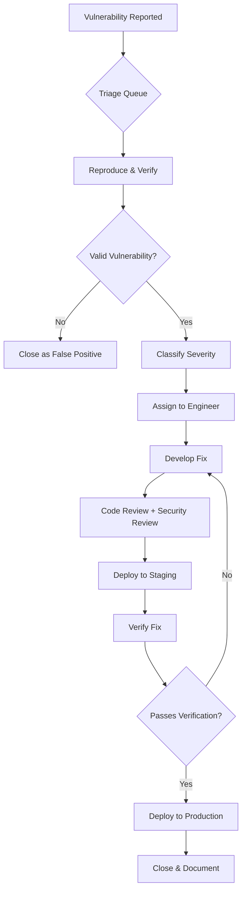

# Vulnerability Management Policy

> **Document:** `vulnerability-management-policy.md` | **Version:** 1.0 | **Last Updated:** July 2026
> **Status:** ✅ Active | **Standard:** NIST SP 800-53 (RA-5, SI-2) | **Owner:** Security Lead
> **Review Cadence:** Quarterly | **Classification:** L3-Confidential

---

## 1. Purpose & Scope

### 1.1 Purpose

This policy establishes a standardized process for identifying, classifying, prioritizing, remediating, and verifying security vulnerabilities across the Portfolio platform. It ensures that vulnerabilities are addressed within defined SLAs and that the platform maintains a strong security posture.

### 1.2 Scope

| Domain | In Scope | Examples |
|--------|----------|----------|
| **Application Code** | ✅ | TypeScript (Next.js, NestJS), Python (FastAPI) |
| **Dependencies** | ✅ | npm packages, pip packages, Docker images |
| **Infrastructure** | ✅ | Cloudflare, Vercel, Supabase, Railway |
| **AI Models** | ✅ | OpenAI GPT-4, Anthropic Claude, LangChain |
| **CI/CD Pipeline** | ✅ | GitHub Actions, Dependabot, CodeQL |
| **Third-Party Services** | ✅ | Resend, Sentry, PostHog |
| **Physical Security** | ❌ | Cloud provider responsibility |

### 1.1 Out of Scope

| Area | Reason | Handled By |
|------|--------|------------|
| Physical infrastructure | Cloud provider responsibility | Cloudflare, Vercel, Supabase |
| End-user devices | Outside platform control | User responsibility |
| Third-party SaaS security | Vendor responsibility | Vendor SOC 2 reports |

---

## 2. Vulnerability Classification

### 2.1 Severity Levels

| Severity | Definition | Examples | Fix SLA | Verification |
|----------|-----------|----------|---------|-------------|
| **🔴 Critical** | Remote code execution, direct data breach, auth bypass | RCE, SQL injection, JWT secret leak, privilege escalation | **24 hours** | Immediate patch + security advisory |
| **🟡 High** | Significant data exposure, limited access bypass | XSS (stored), CSRF on admin endpoints, IDOR, SSRF | **72 hours** | Patch + regression test |
| **🟠 Medium** | Information disclosure, rate limiting gaps | Verbose error messages, missing rate limits, missing security headers | **2 weeks** | Scheduled patch |
| **🟢 Low** | Minor hardening gaps, best practice violations | Missing HSTS preload, verbose logging, non-critical headers | **30 days** | Next sprint |

### 2.1 Severity Decision Matrix

| Exploitability | Impact: Low | Impact: Medium | Impact: High | Impact: Critical |
|---------------|-------------|----------------|-------------|------------------|
| **Easy** (public exploit) | 🟡 Medium | 🟡 High | 🔴 Critical | 🔴 Critical |
| **Moderate** (custom exploit) | 🟢 Low | 🟡 Medium | 🟡 High | 🔴 Critical |
| **Difficult** (theoretical) | 🟢 Low | 🟢 Low | 🟡 Medium | 🟡 High |

---

## 3. Reporting

### 3.1 Internal Discovery

| Source | Tool | Frequency | Action |
|--------|------|-----------|--------|
| **SAST** | CodeQL (GitHub Advanced Security) | Every PR | Block PR if critical/high findings |
| **Dependency scan** | npm audit | Every CI run | Block PR if critical/high CVEs |
| **Docker scan** | Trivy | Weekly | Report to security channel |
| **Secret scan** | GitHub secret scanning | Continuous | Alert on commit |
| **Manual pentest** | OWASP ZAP + manual review | Quarterly | Full report |
| **Code review** | Peer review with security checklist | Every PR | Blocking gate |

### 3.2 External Reporting

| Channel | Method | SLA | Contact |
|---------|--------|-----|---------|
| **SECURITY.md** | Email to security@portfolio.dev | 24h acknowledgment | security@portfolio.dev |
| **GitHub Advisory** | Private vulnerability disclosure | 48h acknowledgment | GitHub Security Advisories |
| **Bug Bounty** | Not currently active | N/A | N/A |

### 3.3 Disclosure Timeline

| Day | Action | Responsible |
|-----|--------|-------------|
| **Day 0** | Vulnerability reported | Reporter |
| **Day 0-1** | Acknowledge receipt, triage severity | Security Lead |
| **Day 1-2** | Reproduce and classify | Security Engineer |
| **Day 2-7** | Develop and test fix | Engineering Team |
| **Day 7-14** | Deploy fix to production | DevOps |
| **Day 14** | Public disclosure (if coordinated) | Security Lead |

---

## 4. Triage Process

### 4.1 Triage Workflow



### 4.1 Triage Roles & Responsibilities

| Role | Responsibility | Assigned To |
|------|---------------|-------------|
| **Triage Lead** | Initial assessment, severity classification | Security Lead |
| **Remediation Engineer** | Develop and test fix | Engineering Team (rotating) |
| **Code Reviewer** | Security review of fix | Senior Engineer |
| **Verification Lead** | Verify fix in staging | QA Lead |
| **Deployment Engineer** | Deploy fix to production | Staff DevOps |
| **Communications Lead** | Internal/external notifications | Security Lead |

---

## 5. Remediation SLA

| Severity | Fix Time | Deploy Time | Total SLA | Reporting |
|----------|----------|-------------|-----------|-----------|
| **🔴 Critical** | 12 hours | 12 hours | **24 hours** | Update every 4 hours |
| **🟡 High** | 48 hours | 24 hours | **72 hours** | Update daily |
| **🟠 Medium** | 10 days | 4 days | **14 days** | Update weekly |
| **🟢 Low** | 20 days | 10 days | **30 days** | Update at sprint review |

### 5.1 SLA Clock

| Factor | Rule |
|--------|------|
| **Start** | Vulnerability confirmed and classified |
| **Pause** | If fix requires third-party patch (waiting on vendor) |
| **Extension** | Up to 50% with documented business justification and Security Lead approval |
| **Weekends/Holidays** | Count toward SLA for Critical/High; paused for Medium/Low |

---

## 6. Exception Process

### 6.1 Risk Acceptance

When a vulnerability cannot be remediated within SLA, an exception may be granted:

| Step | Action | Owner | Timeline |
|------|--------|-------|----------|
| 1 | Document business justification | Engineering Lead | 1 day |
| 2 | Assess compensating controls | Security Lead | 2 days |
| 3 | Define risk acceptance criteria | Security Lead | 2 days |
| 4 | Approve exception | CISO / Security Lead | 1 day |
| 5 | Set re-review date | Security Lead | Per exception |
| 6 | Monitor compensating controls | Engineering | Ongoing |

### 6.1 Exception Template

```json
{
  "exception_id": "VULN-EX-001",
  "vulnerability_id": "VULN-2026-001",
  "severity": "Medium",
  "justification": "Fix requires upstream dependency update not yet released",
  "compensating_controls": [
    "WAF rule blocks exploit path",
    "Rate limiting reduces attack surface",
    "Manual monitoring in place"
  ],
  "risk_acceptance": "Accepted by Security Lead",
  "re_review_date": "2026-08-15",
  "approved_by": "Security Lead",
  "approved_date": "2026-07-15"
}
```

### 6.2 Exception Review Cadence

| Severity | Re-review Frequency | Max Extension |
|----------|---------------------|---------------|
| 🔴 Critical | Every 7 days | 30 days |
| 🟡 High | Every 14 days | 60 days |
| 🟠 Medium | Every 30 days | 90 days |
| 🟢 Low | Every 90 days | 180 days |

---

## 7. Tooling

### 7.1 Vulnerability Scanning Tools

| Tool | Type | Scope | Frequency | Integration |
|------|------|-------|-----------|-------------|
| **CodeQL** | SAST | TypeScript, Python, JavaScript | Every PR (CI) | GitHub Advanced Security |
| **npm audit** | Dependency | npm packages (api, web, shared, ui, config) | Every CI run | CI gate (blocking) |
| **pip audit** | Dependency | Python packages (ai service) | Every CI run | CI gate (blocking) |
| **Dependabot** | Dependency | npm, pip, Docker, GitHub Actions | Daily | Auto-PR for patches |
| **Trivy** | Container | Docker images | Weekly | CI scan |
| **GitHub Secret Scanning** | Secrets | All repository content | Continuous | Alert on push |
| **OWASP ZAP** | DAST | Preview deployments | Weekly | Full scan report |

### 7.1 CI Integration

```yaml
# .github/workflows/security-scan.yml
name: Security Scan
on:
  pull_request:
    branches: [main, develop]
  schedule:
    - cron: '0 6 * * 1'  # Weekly Monday scan

jobs:
  codeql:
    runs-on: ubuntu-latest
    steps:
      - uses: actions/checkout@v4
      - uses: github/codeql-action/init@v3
        with:
          languages: javascript, typescript, python
      - uses: github/codeql-action/analyze@v3

  npm-audit:
    runs-on: ubuntu-latest
    steps:
      - uses: actions/checkout@v4
      - uses: actions/setup-node@v4
      - run: npm audit --audit-level=high
        continue-on-error: false  # Blocking gate

  trivy-scan:
    runs-on: ubuntu-latest
    steps:
      - uses: actions/checkout@v4
      - name: Run Trivy
        uses: aquasecurity/trivy-action@master
        with:
          scan-type: 'fs'
          scan-ref: '.'
          format: 'sarif'
          output: 'trivy-results.sarif'
          severity: 'CRITICAL,HIGH'
```

---

## 8. Metrics & Reporting

### 8.1 Key Metrics

| Metric | Definition | Target | Measurement |
|--------|-----------|--------|-------------|
| **Mean Time to Remediate (MTTR)** | Average time from discovery to fix deployment | Critical: < 24h, High: < 72h | Automated from GitHub issues |
| **Vulnerability Backlog** | Open vulnerabilities by severity | Critical: 0, High: < 3 | Weekly dashboard |
| **Closure Rate** | Vulnerabilities closed per week | > 90% within SLA | Monthly report |
| **Scan Coverage** | % of codebase covered by SAST | > 95% | CodeQL coverage report |
| **Dependency Freshness** | % of deps within 1 minor version of latest | > 80% | npm audit report |
| **Time to Triage** | Time from report to classification | < 4 hours (Critical) | Automated from GitHub |

### 8.1 Reporting Cadence

| Report | Audience | Frequency | Content |
|--------|----------|-----------|---------|
| **Security Dashboard** | Engineering Team | Real-time | Open vulnerabilities, SLA status |
| **Weekly Security Report** | Security Lead | Weekly | New findings, closed items, SLA breaches |
| **Monthly Executive Summary** | Stakeholders | Monthly | Trends, MTTR, risk posture |
| **Quarterly Security Review** | All teams | Quarterly | Full vulnerability landscape, roadmap |

### 8.2 Dashboard

The vulnerability management dashboard (hosted in GitHub Projects) tracks:

- Open vulnerabilities by severity (bar chart)
- MTTR trend (line chart, 30-day rolling)
- SLA compliance rate (percentage by severity)
- Vulnerability backlog by age (stacked bar)
- Top 10 most affected dependencies
- Exception requests and approvals

---

## 9. Policy Review

| Review Cycle | Next Review | Owner |
|-------------|-------------|-------|
| Quarterly | October 2026 | Security Lead |

---

## 10. Change Log

| Version | Date | Author | Changes |
|---------|------|--------|---------|
| 1.0 | July 2026 | Security Team | Initial vulnerability management policy |

## Cross-References
- [../MASTER-INDEX.md](../MASTER-INDEX.md) — Documentation master index
- [../26-reference/CROSS-REFERENCE-INDEX.md](../26-reference/CROSS-REFERENCE-INDEX.md) — Cross-reference system