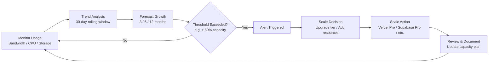

# Capacity Planning

## Current Infrastructure

| Resource       | Provider        | Current Spec                         | Utilization | Headroom |
| -------------- | --------------- | ------------------------------------ | ----------- | -------- |
| Web hosting    | Vercel Hobby    | 100GB bandwidth, 60 builds/mo        | TBD         | TBD      |
| API hosting    | Vercel Hobby    | Serverless functions                 | TBD         | TBD      |
| Database       | Supabase Free   | 500MB DB, 5GB bandwidth, 2GB storage | TBD         | TBD      |
| Cache/Queue    | Upstash (Redis) | 10MB (free)                          | TBD         | TBD      |
| AI Service     | Railway         | $5 credit/mo                         | TBD         | TBD      |
| Email          | Resend Free     | 100 emails/day                       | TBD         | TBD      |
| Analytics      | PostHog Free    | 1M events/mo                         | TBD         | TBD      |
| Error tracking | Sentry Free     | 5K events/mo                         | TBD         | TBD      |

## Growth Projections

### Traffic Estimates (Monthly)

| Month      | Visitors | API Requests | AI Requests | DB Storage |
| ---------- | -------- | ------------ | ----------- | ---------- |
| Launch     | 500      | 50,000       | 1,000       | 100MB      |
| +3 months  | 2,000    | 200,000      | 5,000       | 250MB      |
| +6 months  | 5,000    | 500,000      | 15,000      | 500MB      |
| +12 months | 20,000   | 2,000,000    | 50,000      | 1GB        |

### Scaling Triggers

| Resource         | Trigger    | Action          | New Provider/Plan |
| ---------------- | ---------- | --------------- | ----------------- |
| Vercel bandwidth | > 100GB/mo | Upgrade to Pro  | $20/mo            |
| Supabase DB      | > 500MB    | Upgrade to Pro  | $25/mo            |
| Resend emails    | > 100/day  | Upgrade to Pro  | $15/mo            |
| Sentry events    | > 5K/mo    | Upgrade to Team | $26/mo            |

## Cost Projections

| Tier               | Monthly Cost | Annual Cost | Features                                         |
| ------------------ | ------------ | ----------- | ------------------------------------------------ |
| Hobby/Free         | $0           | $0          | Current                                          |
| Pro (all services) | ~$100        | $1,200      | Unlimited bandwidth, larger DB, priority support |
| Team/Scale         | ~$500        | $6,000      | Team features, advanced analytics                |

## Optimization Recommendations

### Immediate (No Cost)

- Implement CDN caching for static assets
- Optimize database queries (already indexed)
- Enable aggressive ISR caching (60s revalidation)
- Compress images and assets

### Short-term (< $50/mo)

- Upgrade to Vercel Pro for bandwidth
- Add application-level caching (Redis)
- Implement query result caching

### Long-term ($500+/mo)

- Dedicated database instance
- Multi-region deployment
- Load-balanced API servers

## Monitoring

- Set up cost alerts on all services
- Monthly capacity review
- Quarterly budget planning
- Weekly headroom check

---

## Diagram

### Capacity Planning Flow

## Cross-References

- [../MASTER-INDEX.md](../MASTER-INDEX.md) — Documentation master index
- [../26-reference/CROSS-REFERENCE-INDEX.md](../26-reference/CROSS-REFERENCE-INDEX.md) — Cross-reference system
