# CI/CD Implementation Guide

> **Document:** `CI-CD-IMPLEMENTATION-GUIDE.md` | **Version:** 1.0 | **Last Updated:** July 2026
> **Status:** Active | **Owner:** Principal DevOps Engineer | **Review Cadence:** Quarterly
> **Related:** `.github/workflows/ci.yml`, `.github/workflows/pr.yml`, `turbo.json`, `docs/operations/25-CICD.md`

---

## 1. Pipeline Architecture Overview

```mermaid
graph TB
    subgraph "Trigger"
        PUSH["git push (main)"]
        PR["Pull Request (any)"]
        TAG["Tag push (v*)"]
    end

    subgraph "Quality Gates"
        LINT["🔍 Lint (ESLint)<br/>api + web"]
        TC["📐 TypeCheck (tsc)<br/>api + web"]
        TEST["🧪 Test<br/>Jest (api) / Vitest (web)"]
        BUILD["🏗️ Build (Turbo)<br/>All workspaces"]
        PRISMA["🗄️ Prisma Validate<br/>Schema + migrations"]
    end

    subgraph "Security"
        NPM_AUDIT["npm audit<br/>Dependency check"]
        DOCKER_SCAN["Trivy scan<br/>Container images"]
        CODEQL["CodeQL<br/>SAST analysis"]
    end

    subgraph "Deploy"
        DOCKER_API["Docker: Push API image<br/>ghcr.io"]
        DOCKER_WEB["Docker: Push Web image<br/>ghcr.io"]
        SUPABASE["Supabase migration<br/>db push"]
    end

    subgraph "Verify"
        HEALTH["Health checks<br/>All endpoints"]
        SMOKE["Smoke tests<br/>Critical paths"]
    end

    PUSH --> LINT & TC & TEST & BUILD & PRISMA
    PR --> LINT & TC & TEST & BUILD & PRISMA
    TAG --> LINT & TC & TEST & BUILD & PRISMA

    LINT & TC & TEST & BUILD & PRISMA --> NPM_AUDIT & CODEQL
    NPM_AUDIT & CODEQL --> DOCKER_SCAN

    DOCKER_SCAN --> DOCKER_API & DOCKER_WEB
    DOCKER_SCAN --> SUPABASE

    DOCKER_API & DOCKER_WEB & SUPABASE --> HEALTH & SMOKE
```



### 1.1 Pipeline Timing

| Stage | Duration | Parallelism | Depends On |
|-------|----------|-------------|------------|
| Lint | 20s | api + web (parallel matrix) | — |
| TypeCheck | 45s | api + web (parallel matrix) | — |
| Test | 2min | api + web (parallel matrix) | — |
| Build | 3min | api + web (parallel matrix) | — |
| Prisma Validate | 30s | single job | — |
| npm audit / CodeQL | 1min | sequential after quality | Quality gates pass |
| Docker build + push | 2min | api + web (parallel) | Quality + Security pass |
| Health checks | 30s | parallel | Deploy complete |
| **Total (cold)** | **~10min** | | |
| **Total (warm)** | **~3min** | | |

---

## 2. Local CI Setup

### 2.1 Running CI Locally with Act

Act runs GitHub Actions workflows locally using Docker:

```bash
# Install act (Windows)
winget install nektos.act
# OR
choco install act-cli

# Run the full PR workflow
act pull_request --workflows .github/workflows/pr.yml

# Run a specific job
act pull_request --job lint --workflows .github/workflows/pr.yml

# Run with secrets file (create .secrets with key=value pairs)
act pull_request --secret-file .secrets
```

### 2.2 Local Quality Gate Script

For a quick local check before pushing:

```bash
# Run all quality gates locally
npm run lint          # ESLint on all workspaces
npm run typecheck     # tsc --noEmit on all workspaces
npm run build         # Turbo build
npm run test          # Run all tests (Jest + Vitest)
```

Equivalent to what CI runs:

```powershell
# PowerShell one-liner matching ci.yml quality gate
npm run lint --workspace=apps/api; if ($?) { npm run lint --workspace=apps/web }
npm run typecheck --workspace=apps/api; if ($?) { npm run typecheck --workspace=apps/web }
npm run test --workspace=apps/api; if ($?) { npm run test --workspace=apps/web }
npm run build --workspace=apps/api; if ($?) { npm run build --workspace=apps/web }
```

---

## 3. Pipeline Stages — Detailed

### 3.1 Lint (ESLint)

**Files:** `apps/api/.eslintrc.js`, `apps/web/.eslintrc.json`

| Workspace | Config | Rules | Fail Conditions |
|-----------|--------|-------|-----------------|
| `apps/api` | TypeScript + NestJS preset | `@typescript-eslint/*`, `sonarjs/*` | Any error |
| `apps/web` | Next.js + TypeScript preset | `@next/next/*`, `react/*` | Any error |

**CI command:** `npm run lint --workspace=${{ matrix.workspace }}`

```yaml
# From pr.yml
- run: npm run lint --workspace=${{ matrix.workspace }}
```

### 3.2 TypeCheck (TypeScript)

**CI command:** `npm run typecheck --workspace=${{ matrix.workspace }}`

Runs `tsc --noEmit` for each workspace using its `tsconfig.json`. Shared packages in `packages/` are resolved via TypeScript project references.

| Workspace | tsconfig | Composite |
|-----------|----------|-----------|
| `apps/api` | `tsconfig.json` | Yes |
| `apps/web` | `tsconfig.json` | Yes |
| `packages/shared` | `tsconfig.json` | Yes |
| `packages/ui` | `tsconfig.json` | Yes |
| `packages/config` | `tsconfig.json` | Yes |

### 3.3 Test

| Workspace | Framework | Config | DB Requirement |
|-----------|-----------|--------|----------------|
| `apps/api` | Jest (Jest 29) | `jest.config.ts` | PostgreSQL (service container) |
| `apps/web` | Vitest | `vitest.config.ts` | None (mocked) |

**PostgreSQL service container** (`pr.yml`):

```yaml
services:
  postgres:
    image: postgres:16-alpine
    env:
      POSTGRES_USER: postgres
      POSTGRES_PASSWORD: dummy_password
      POSTGRES_DB: portfolio_test
    options: >-
      --health-cmd pg_isready
      --health-interval 10s
      --health-timeout 5s
      --health-retries 5
    ports:
      - 5432:5432
```

The web tests currently allow failure (`continue-on-error: true` in CI) as they are still being stabilized.

### 3.4 Build (Turborepo)

**CI command:** `npm run build --workspace=${{ matrix.workspace }}`

Turborepo task graph from `turbo.json`:

```json
{
  "tasks": {
    "build": {
      "dependsOn": ["^build"],
      "outputs": [".next/**", "!.next/cache/**", "dist/**"]
    }
  }
}
```

Build order: `packages/shared` → `packages/ui` → `apps/api` + `apps/web`

**Remote caching** is configured via `TURBO_TEAM` and `TURBO_TOKEN` GitHub secrets. This allows CI to skip unchanged workspace builds.

### 3.5 Prisma Validation + Migration Check

**CI job:** `prisma-validate` (ci.yml), `prisma` (pr.yml)

```yaml
- run: npm run prisma:validate --workspace=apps/api
- run: npm run prisma:generate --workspace=apps/api
- run: npm run prisma:migrate:deploy --workspace=apps/api
  continue-on-error: true  # Preview only; actual migration on push to main
```

This validates:
1. Schema syntax is valid (`prisma:validate`)
2. Client generation succeeds against custom output path `apps/api/generated/prisma`
3. Migration files are deployable (`prisma:migrate:deploy`)

### 3.6 Docker Build (Multi-Stage)

**Web Dockerfile** (`apps/web/Dockerfile`):

```
Builder stage:   npm ci → npm run build → .next/standalone
Runner stage:    alpine, non-root user (nextjs), HEALTHCHECK
```

**API Dockerfile** (`apps/api/Dockerfile`):

```
Builder stage:   npm ci → prisma generate → npm run build
Runner stage:    alpine, non-root user (nestjs), HEALTHCHECK on /api/health/liveness
```

**CI (ci.yml):**
```yaml
docker-api:
  # Pushes: ghcr.io/portfolio/portfolio/api:latest + :${{ github.sha }}
  # Trigger: main branch or v* tag

docker-web:
  # Pushes: ghcr.io/portfolio/portfolio/web:latest + :${{ github.sha }}
  # Trigger: main branch or v* tag
```

Uses GitHub Container Registry (`ghcr.io`) with Docker BuildKit cache (`type=gha,mode=max`) for layer caching.

### 3.7 Security Scan

| Scan | Tool | Runs On | Fail Conditions | Job |
|------|------|---------|-----------------|-----|
| npm audit | npm | Every CI run | High/critical CVEs | quality |
| Trivy | aquasecurity/trivy-action | Docker build | Critical CVEs in image | docker-* |
| CodeQL | github/codeql-action | PRs + main | Any error/high severity | separate workflow |
| Secret scanning | GitHub Advanced Security | Push to any branch | On by default for public repos | auto |

### 3.8 Deploy (Production)

Deploy handles two paths:

**Vercel (Frontend + API):** Handled by Vercel GitHub integration — `push` to `main` auto-deploys. Preview deployments auto-create for each PR.

**Docker Images (ghcr.io):** Built and pushed in the `docker-api` and `docker-web` jobs. Images tagged with `latest` and commit SHA.

**Database Migrations:** `supabase db push` runs as a separate step on push to `main`. Must be backward-compatible per migration rules.

---

## 4. All Workflows

| Workflow | File | Trigger | Jobs | Timeout |
|----------|------|---------|------|---------|
| **CI** | `ci.yml` | Push main/master/develop + v* tags + manual | `quality` (matrix), `prisma-validate`, `docker-api`, `docker-web` | 30min |
| **PR** | `pr.yml` | PR to main/master/develop | `lint` (matrix), `test` (matrix + postgres), `build` (matrix), `prisma` (postgres) | 20min |
| **Security** | (planned) `security-scan.yml` | Weekly cron + PR label `security-review` | `codeql`, `trivy`, `npm-audit`, `zap-scan` | 60min |
| **Deploy** | (planned) `deploy.yml` | Push main (workflow_dispatch) | `quality-check`, `docker-build`, `supabase-migrate`, `vercel-deploy`, `smoke-test`, `notify` | 20min |
| **Dependabot** | GitHub-native | Auto on dependency changes | Auto-merge for patch/minor, human review for major | n/a |

---

## 5. Quality Gates Configuration

### 5.1 Branch Protection Rules

Applied to `main` branch in GitHub repository settings:

| Rule | Setting |
|------|---------|
| Require PR before merging | ✅ |
| Required approvals | 1 |
| Dismiss stale reviews | ✅ |
| Require status checks | `lint`, `test`, `build`, `prisma` |
| Require branches up-to-date | ✅ |
| Include administrators | ✅ |
| Allow force pushes | ❌ |
| Allow deletions | ❌ |

### 5.2 Pass/Fail Conditions

| Gate | Pass | Fail | Block Merge? |
|------|------|------|-------------|
| Lint | No ESLint errors | Any error or warning | ✅ |
| TypeCheck | Clean `tsc --noEmit` | Any type error | ✅ |
| Test | All tests pass | Any test failure (api) | ✅ (api) |
| Build | Exit code 0 | Build error | ✅ |
| Prisma Validate | Exit code 0 | Schema/migration error | ✅ |
| npm audit | No high/critical | High or critical found | ✅ |
| Docker build | Image pushed | Build failure | ❌ (main only) |
| Health check | 200 response | Non-200 response | ❌ (post-deploy) |

---

## 6. Environment Variable Management

### 6.1 CI Environment Secrets

Set via `gh secret set` or GitHub UI → Settings → Secrets and variables → Actions:

```bash
# All secrets required for CI
gh secret set TURBO_TEAM              # Turborepo remote cache team
gh secret set TURBO_TOKEN             # Turborepo remote cache token
gh secret set SENTRY_DSN              # Error reporting (build-time)
gh secret set SUPABASE_ACCESS_TOKEN   # Supabase migration (prod deploy)
```

### 6.2 Secrets Per Environment

| Environment | Source | Variables Set |
|-------------|--------|--------------|
| CI (GitHub Actions) | `secrets.*` | 4 vars (turbo, sentry, supabase) |
| Vercel Production | Vercel Dashboard | 13 prod secrets |
| Vercel Preview | Vercel Dashboard (inherits prod, can override) | Subset for dev |
| Railway Production | Railway Dashboard | ~6 vars (DB, AI keys) |
| Local Dev | `config/.env` | All 13 with local dev values |

---

## 7. Troubleshooting Common CI Failures

### 7.1 npm ci Fails

```text
Error: The lockfile would have been modified by this install
```
**Fix:** Regenerate `package-lock.json` locally: `npm install` and commit the updated lockfile.

### 7.2 Turbo Cache Mismatch

```text
remote cache miss: inputs changed
```
**Fix:** If cache frequently misses on unchanged files, check `turbo.json` `globalDependencies` — ensure `**/.env.*local` is listed to avoid cache invalidation from local env changes.

### 7.3 Prisma Client Generation Fails

```text
Error: Schema parsing - Field "id" is required
```
**Fix:** Ensure `npm run prisma:generate` runs after schema changes. The CI job runs `prisma:validate` first, then `prisma:generate`. Check the custom output path in `prisma/schema.prisma` matches `apps/api/generated/prisma`.

### 7.4 Postgres Service Container Not Ready

```text
Error: connect ECONNREFUSED 127.0.0.1:5432
```
**Fix:** Verify the service container health check has sufficient timeout:
```yaml
--health-retries 5
--health-interval 10s
```
If tests start before PG is ready, the health check configuration needs adjustment.

### 7.5 Docker Build Context Too Large

```text
Error: context exceeds 500MB limit
```
**Fix:** Ensure `.dockerignore` excludes `node_modules`, `.git`, `.next`, `dist` at minimum. Current Dockerfiles copy only what's needed.

---

## 8. Dependabot Configuration Reference

### 8.1 Current Configuration

Create `.github/dependabot.yml`:

```yaml
version: 2
updates:
  - package-ecosystem: "npm"
    directory: "/"
    schedule:
      interval: "weekly"
      day: "monday"
    open-pull-requests-limit: 10
    labels:
      - "dependencies"
      - "automated"
    versioning-strategy: increase
    ignore:
      - dependency-name: "@types/node"
        versions: [">=23.0.0"]

  - package-ecosystem: "github-actions"
    directory: "/"
    schedule:
      interval: "monthly"
    labels:
      - "github-actions"
      - "automated"

  - package-ecosystem: "docker"
    directory: "/apps/api"
    schedule:
      interval: "monthly"

  - package-ecosystem: "docker"
    directory: "/apps/web"
    schedule:
      interval: "monthly"
```

### 8.2 Auto-Merge Rules (via GitHub merge queue)

| Update Type | Auto-Merge | Requires | Notify |
|-------------|------------|----------|--------|
| Patch deps | ✅ | CI passes | PR comment |
| Minor deps | ✅ | CI passes + 1 approval | PR comment |
| Major deps | ❌ | Human review | #devops slack |
| Security advisory | ✅ (high/critical) | CI passes | #security-alerts |
| GitHub Actions | ✅ | CI passes | PR comment |
| Docker base images | ❌ | Human review | #devops |

## Cross-References
- [../MASTER-INDEX.md](../MASTER-INDEX.md) — Documentation master index
- [../26-reference/CROSS-REFERENCE-INDEX.md](../26-reference/CROSS-REFERENCE-INDEX.md) — Cross-reference system