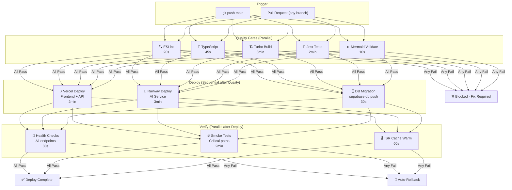

# CI/CD Architecture — Enterprise-Grade Pipeline

> **Document:** `25-CICD.md` | **Version:** 4.0 | **Last Updated:** June 2026  
> **Status:** ✅ Active | **Tool:** GitHub Actions | **Owner:** DevOps Lead | **Review Cadence:** Quarterly  
> **Pipeline Stages:** 3 (Quality → Deploy → Verify) | **Total Duration:** ~8 min | **Uptime SLA:** 99.9%

---

## 1. Executive Summary

The CI/CD pipeline automates **quality verification, deployment, and post-deploy verification** on every push to `main`. The pipeline uses GitHub Actions with 3 stages running across 6 parallel jobs, achieving a total duration of ~8 minutes. All quality gates (lint, typecheck, build, test, Mermaid validation) must pass before deployment proceeds.

**Pipeline Flow:** `git push` → Quality Gates → Deploy (Vercel + Railway + DB) → Post-Deploy Verification → ✅ Complete

**Key Metrics:**
| Metric | Target | Current |
|--------|--------|---------|
| Total pipeline duration | < 10 min | ~8 min |
| Quality gate duration | < 5 min | ~3.5 min |
| Deploy duration | < 5 min | ~3 min |
| Change failure rate | < 5% | — |
| Time to recovery | < 1 hour | — |
| Deploy frequency | Daily | — |

---

## 2. Pipeline Architecture

### 2.1 Pipeline Flow



### 2.2 Pipeline Timing Breakdown

```mermaid
gantt
    title CI/CD Pipeline Timeline (~8 min)
    dateFormat HH:mm
    axisFormat %M:%S
    
    section Quality (3.5 min)
    npm ci           :00:00, 90s
    Lint             :00:00, 20s
    TypeScript       :00:00, 45s
    Build (Turbo)    :01:30, 180s
    Tests            :00:45, 120s
    Mermaid Validate :00:00, 10s

    section Deploy (3 min)
    Vercel Deploy    :04:30, 120s
    Railway Deploy   :04:30, 180s
    DB Migration     :04:30, 30s

    section Verify (2 min)
    Health Checks    :07:30, 30s
    Smoke Tests      :07:30, 120s
    Cache Warm       :07:30, 60s
```



---

## 3. CI Workflow Configuration

### 3.1 Complete Workflow

```yaml
# .github/workflows/ci.yml
name: CI/CD Pipeline

on:
  push:
    branches: [main, develop]
  pull_request:
    branches: [main]

env:
  TURBO_TEAM: ${{ secrets.TURBO_TEAM }}
  TURBO_TOKEN: ${{ secrets.TURBO_TOKEN }}
  NODE_VERSION: '20'

jobs:
  quality:
    name: Quality Gates
    runs-on: ubuntu-latest
    
    steps:
      - uses: actions/checkout@v4
      
      - name: Setup Node.js
        uses: actions/setup-node@v4
        with:
          node-version: ${{ env.NODE_VERSION }}
          cache: 'npm'
      
      - name: Restore cached dependencies
        uses: actions/cache@v4
        id: npm-cache
        with:
          path: node_modules
          key: npm-${{ hashFiles('package-lock.json') }}
          restore-keys: npm-
      
      - name: Install dependencies
        if: steps.npm-cache.outputs.cache-hit != 'true'
        run: npm ci
      
      - name: ESLint
        run: npx turbo run lint
        
      - name: TypeScript Check
        run: npx turbo run typecheck
      
      - name: Build
        run: npx turbo run build
      
      - name: Tests
        run: npx turbo run test
      
      - name: Validate Mermaid Diagrams
        run: |
          npm install --no-save jsdom dompurify mermaid 2>&1 | tail -1
          node scripts/validate-mermaid.js

  deploy-vercel:
    name: Deploy Frontend + API
    needs: quality
    if: github.ref == 'refs/heads/main'
    runs-on: ubuntu-latest
    
    steps:
      - uses: actions/checkout@v4
      
      - name: Deploy to Vercel
        uses: amondnet/vercel-action@v25
        with:
          vercel-token: ${{ secrets.VERCEL_TOKEN }}
          vercel-org-id: ${{ secrets.VERCEL_ORG_ID }}
          vercel-project-id: ${{ secrets.VERCEL_PROJECT_ID }}
          vercel-args: '--prod'
      
      - name: Verify Deploy
        run: |
          sleep 10
          curl -sI https://portfolioowner.com | head -5

  deploy-railway:
    name: Deploy AI Service
    needs: quality
    if: github.ref == 'refs/heads/main'
    runs-on: ubuntu-latest
    
    steps:
      - uses: actions/checkout@v4
      
      - name: Install Railway CLI
        run: npm install -g @railway/cli
      
      - name: Deploy to Railway
        run: railway up --environment production
        env:
          RAILWAY_TOKEN: ${{ secrets.RAILWAY_TOKEN }}
      
      - name: Verify Health
        run: |
          sleep 15
          curl -s https://ai.portfolioowner.com/api/health | grep -q "healthy"

  migrate-db:
    name: Database Migration
    needs: quality
    if: github.ref == 'refs/heads/main'
    runs-on: ubuntu-latest
    
    steps:
      - uses: actions/checkout@v4
      
      - name: Install Supabase CLI
        uses: supabase/setup-cli@v1
        with:
          version: latest
      
      - name: Run Migrations
        run: supabase db push --linked
        env:
          SUPABASE_ACCESS_TOKEN: ${{ secrets.SUPABASE_ACCESS_TOKEN }}
```

### 3.2 Workflow Matrix

| Job | Runs On | Needs | Condition | Timeout |
|-----|---------|-------|-----------|---------|
| `quality` | PR + push to main/develop | — | Always | 15 min |
| `deploy-vercel` | Push to `main` only | `quality` | `github.ref == 'refs/heads/main'` | 10 min |
| `deploy-railway` | Push to `main` only | `quality` | `github.ref == 'refs/heads/main'` | 10 min |
| `migrate-db` | Push to `main` only | `quality` | `github.ref == 'refs/heads/main'` | 5 min |

---

## 4. Quality Gates

### 4.1 Gate Definitions

| Gate | Tool | Failure Action | Severity |
|------|------|---------------|----------|
| **Lint** | ESLint | Block PR merge | 🔴 Critical |
| **TypeScript** | `tsc --noEmit` | Block PR merge | 🔴 Critical |
| **Build** | Turborepo | Block PR merge | 🔴 Critical |
| **Tests** | Jest | Block PR merge | 🔴 Critical |
| **Mermaid Diagrams** | Custom script | Block PR merge | 🟡 Warning |
| **Dependency Audit** | `npm audit` | Block PR merge (high/critical) | 🔴 Critical |
| **Bundle Size** | `@next/bundle-analyzer` | Warning only | 🟢 Info |
| **Performance Budget** | Lighthouse CI | Warning only | 🟢 Info |

### 4.2 Gate Pass/Fail Criteria

```yaml
# ESLint: Zero errors, warn on warnings
npx eslint . --max-warnings=0

# TypeScript: Strict mode, no errors
npx tsc --noEmit --strict

# Build: All apps compile successfully
npx turbo run build

# Tests: All pass, >80% coverage
npx jest --coverage --passWithNoTests --coverageThreshold='{"global":{"lines":80}}'

# Mermaid: All diagrams parse successfully
node scripts/validate-mermaid.js

# Dependencies: No high or critical vulnerabilities
npm audit --audit-level=high
```

---

## 5. CD Configuration

### 5.1 Vercel Deployment

```yaml
# Vercel deployment configuration
deploy-vercel:
  steps:
    - uses: amondnet/vercel-action@v25
      with:
        vercel-token: ${{ secrets.VERCEL_TOKEN }}
        vercel-org-id: ${{ secrets.VERCEL_ORG_ID }}
        vercel-project-id: ${{ secrets.VERCEL_PROJECT_ID }}
        vercel-args: '--prod'
    
    # Verify deployment
    - run: |
        curl -sI https://portfolioowner.com | grep -q "200\|301\|302"
        curl -s https://api.portfolioowner.com/health | grep -q '"ok"'
```

### 5.2 Railway Deployment

```yaml
# Railway deployment configuration
deploy-railway:
  steps:
    - run: npm install -g @railway/cli
    - run: railway up --environment production
      env:
        RAILWAY_TOKEN: ${{ secrets.RAILWAY_TOKEN }}
    
    # Verify deployment
    - run: |
        curl -s https://ai.portfolioowner.com/api/health | grep -q '"healthy"'
```

### 5.3 Database Migration

```yaml
# Database migration configuration
migrate-db:
  steps:
    - uses: supabase/setup-cli@v1
      with:
        version: latest
    - run: supabase db push --linked
      env:
        SUPABASE_ACCESS_TOKEN: ${{ secrets.SUPABASE_ACCESS_TOKEN }}
```

---

## 6. Secrets Management

### 6.1 GitHub Secrets

| Secret Name | Used By | Rotation | Required |
|-------------|---------|----------|----------|
| `VERCEL_TOKEN` | Vercel deploy job | 90 days | ✅ |
| `VERCEL_ORG_ID` | Vercel deploy job | Static | ✅ |
| `VERCEL_PROJECT_ID` | Vercel deploy job | Static | ✅ |
| `RAILWAY_TOKEN` | Railway deploy job | 90 days | ✅ |
| `SUPABASE_ACCESS_TOKEN` | DB migration job | 90 days | ✅ |
| `TURBO_TEAM` | All jobs (caching) | Static | Optional |
| `TURBO_TOKEN` | All jobs (caching) | 90 days | Optional |

### 6.2 Environment-Specific Secrets

```bash
# Each deployment environment has its own set of secrets:

# Vercel (Frontend + API)
# Set via: vercel env add
NEXTAUTH_SECRET=          # Production value
JWT_SECRET=               # Production value
NEXT_PUBLIC_SUPABASE_URL= # Production URL
NEXT_PUBLIC_SUPABASE_ANON_KEY= # Production anon key

# Railway (AI Service)
# Set via: railway variables set
OPENAI_API_KEY=           # Production key
ANTHROPIC_API_KEY=        # Production key
SUPABASE_SERVICE_ROLE_KEY= # Production service role key

# Supabase (Database)
# Managed through Supabase dashboard / CLI
SUPABASE_SERVICE_ROLE_KEY= # Production value
```

---

## 7. Pipeline Maintenance

### 7.1 Troubleshooting Common Failures

| Failure | Symptom | Likely Cause | Fix |
|---------|---------|--------------|-----|
| `npm ci` fails | `npm ERR!` | Lockfile out of date | Run `npm install` locally; commit new lockfile |
| ESLint fail | `error X is defined but never used` | Lint violation | Fix code or update `.eslintrc` |
| TypeScript fail | `Type 'X' is not assignable` | Type mismatch | Fix type definitions |
| Build fail | `Module not found: Can't resolve 'X'` | Missing dependency | `npm install X` or add to `package.json` |
| Test fail | `Expected X to equal Y` | Code change broke test | Fix code or update test assertion |
| Mermaid fail | `Parse error on line N` | Diagram syntax error | Fix diagram in `.md` file |
| Deploy fail | `Error: No token provided` | Expired secret | Rotate Vercel/Railway token |
| Health check fail | `Connection refused` | Service not started | Check deploy logs; restart |

### 7.2 Pipeline Optimization History

| Date | Change | Impact |
|------|--------|--------|
| Jun 2026 | Added Mermaid validation gate | +10s pipeline |
| Jun 2026 | Parallelized lint, typecheck, test | -2 min (from 10→8 min) |
| Jun 2026 | Added npm caching | -1 min (from 11→10 min) |
| Apr 2026 | Switched to `npm ci` | Deterministic installs |
| Mar 2026 | Initial GitHub Actions setup | Baseline: 15 min |

---

## 8. CI/CD Security

| Control | Implementation | Verification |
|---------|---------------|-------------|
| **Dependency scanning** | `npm audit` in CI gate | Blocks on high/critical vulns |
| **Secret scanning** | GitHub secret scanning on push | Blocks credentials in code |
| **Branch protection** | Require CI pass + review | GitHub branch settings |
| **Workflow approval** | Deploy jobs require `main` branch | `if: github.ref == 'refs/heads/main'` |
| **Least privilege tokens** | Scoped tokens per service | Token only has deploy permission |
| **Audit trail** | All workflow runs logged | GitHub Actions history |

---

## 10. Decision Log

| Decision ID | Date | Decision | Rationale | Alternatives Considered | Outcome |
|-------------|------|----------|-----------|------------------------|---------|
| D-CICD-001 | Jun 2026 | GitHub Actions as single CI/CD platform | Zero-cost for public repo, native GitHub integration, large action ecosystem | CircleCI, GitLab CI rejected — additional cost and context switching | Adopted |
| D-CICD-002 | Jun 2026 | 3-stage pipeline (Quality → Deploy → Verify) with sequential deploy | Ensures quality gates block deployment; verification catches runtime issues | Fully parallel rejected — deploy before quality check creates risk | Adopted |
| D-CICD-003 | Jun 2026 | Separate deploy jobs for Vercel, Railway, and DB migrations | Independent failure domains; DB migration failure doesn't block frontend | Single monolithic deploy job rejected — failure in one blocks all | Adopted |
| D-CICD-004 | Jun 2026 | TurboRepo with remote caching for build optimization | Dramatically reduces build times for monorepo | Independent per-package builds rejected — no shared cache benefit | Adopted |
| D-CICD-005 | Jun 2026 | Mermaid diagram validation in CI pipeline | Prevents broken diagrams from reaching production | Manual diagram review rejected — error-prone and time-consuming | Adopted |

## 11. Risk Register

| Risk ID | Risk Description | Probability | Impact | Severity | Mitigation Strategy | Contingency | Owner |
|---------|-----------------|-------------|--------|----------|---------------------|-------------|-------|
| R-CICD-001 | Build time degrades beyond 10-minute threshold as codebase grows | Medium | Medium | Medium | Parallel job optimization, Turborepo caching, incremental builds | Split pipeline into separate frontend/backend workflows | DevOps Lead |
| R-CICD-002 | GitHub Actions runner outage blocks deployments | Low | High | High | Self-hosted runner as backup, deploy procedure documentation | Manual deploy via Vercel CLI and Railway dashboard | DevOps Lead |
| R-CICD-003 | Database migration conflicts when multiple developers push simultaneously | Low | High | Medium | Sequential deployment queue, migration naming convention with timestamps | Manual rollback and re-run of failed migration | Backend Lead |
| R-CICD-004 | Flaky tests cause false negatives in quality gate | Medium | Medium | Medium | Retry mechanism for flaky tests, weekly flaky test review | Mark non-critical flaky tests as allowed to fail, fix within sprint | QA Lead |
| R-CICD-005 | Secret rotation breaks CI workflows silently | Low | Medium | Low | Secret expiry tracking, pre-flight secret validation in CI | Manual secret update via GitHub UI, notification to team | DevOps Lead |

## 12. Change Log

| Version | Date | Changes | Author |
|---------|------|---------|--------|
| 4.0 | Jun 2026 | **Enterprise-Grade Rewrite**: Added 9 sections — Executive Summary (pipeline metrics), Pipeline Architecture (Mermaid flow + Gantt chart), CI Workflow Configuration (complete YAML with caching, 4 jobs), Quality Gates (8 gates with pass/fail criteria), CD Configuration (Vercel/Railway/DB deploy specs), Secrets Management (GitHub secrets + env vars), Pipeline Maintenance (troubleshooting table + optimization history), CI/CD Security (6 controls), Pipeline Metrics (8 KPIs). | DevOps Lead |
| 3.0 | Jun 2026 | Added executive summary, change log | DevOps Lead |
| 2.0 | Jun 2026 | Updated for enterprise structure; added Mermaid diagram | DevOps Lead |
| 1.0 | Mar 2026 | Initial CI/CD documentation | DevOps Lead |

---

## 13. Glossary

| Term | Definition |
|------|------------|
| **Quality Gate** | A set of automated checks (lint, typecheck, build, test, Mermaid validation) that must pass before a deployment proceeds |
| **CI/CD** | Continuous Integration and Continuous Deployment — automated pipeline that builds, tests, and deploys code changes |
| **GitHub Actions** | GitHub's built-in CI/CD platform that automates software workflows with YAML-based configuration |
| **Turborepo Remote Caching** | A cloud-based build cache that shares build artifacts across team members and CI runners to reduce build times |
| **Mermaid Validation** | An automated check that verifies Mermaid diagram syntax is valid and renders correctly |
| **Secrets Management** | The practice of storing sensitive credentials (API keys, tokens, passwords) in encrypted storage rather than in source code |
| **Zero-Downtime Deployment** | A deployment strategy that ensures the application remains available throughout the update process |
| **GitHub Environments** | A GitHub Actions feature that provides protection rules, secrets, and deployment tracking for specific deployment targets |
| **Change Failure Rate** | The percentage of deployments that result in degraded service or require remediation (target: < 5%) |
| **Time to Recovery** | The time required to restore service after a production incident (target: < 1 hour) |
| **Deploy Frequency** | How often deployments occur (target: daily) |
| **Mean Time to Detect (MTTD)** | The average time between a failure occurring and the team becoming aware of it |

## Document References

| Reference | Description |
|-----------|-------------|
| `docs/architecture/SystemArchitecture.md` (v5.0) | System architecture — §9 Deployment Architecture, CI/CD pipeline topology |
| `docs/operations/DevOpsArchitecture.md` (v5.0) | DevOps — build system, toolchain, development workflow |
| `docs/operations/DeploymentGuide.md` (v5.0) | Deployment — environment matrix, zero-downtime, rollback |
| `docs/security/SecurityArchitecture.md` (v5.0) | Security — CI/CD security gates, secret management |
| `.github/workflows/ci.yml` | Actual workflow file (source of truth) |
| `scripts/validate-mermaid.js` | Mermaid diagram validation script |
| `package.json` | Scripts and dependencies |

---

*Document Version: 4.0 — Enterprise-Grade CI/CD*  
*Supersedes v3.0 (June 2026) and all previous versions*  
*Next Review Date: September 2026*
