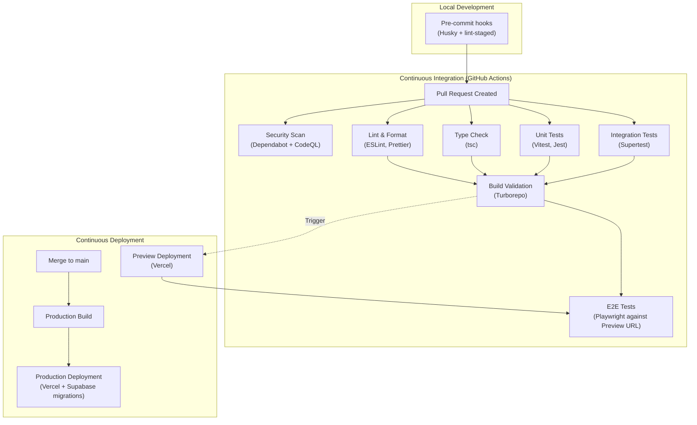
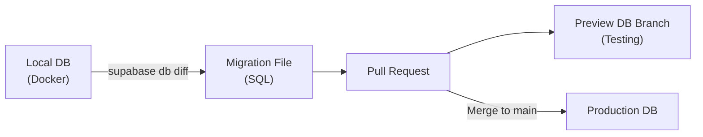

# CI/CD Pipeline — Enterprise Delivery Automation

> **Document:** `53-CI-CD-PIPELINE.md` | **Version:** 1.1 | **Last Updated:** June 2026  
> **Status:** ✅ Active | **Owner:** Principal DevOps Engineer | **Review Cadence:** Quarterly  
> **Related:** [DeploymentGuide.md](./DeploymentGuide.md) | [52-TESTING-STRATEGY.md](./52-TESTING-STRATEGY.md)

---

## Executive Summary

The CI/CD pipeline uses GitHub Actions for continuous integration with four-stage quality gates (lint, typecheck, test, build) gated by Turborepo remote caching, and Vercel/Docker for continuous deployment. Three workflows orchestrate delivery: PR validation (lint → typecheck → test → build in <7 min), E2E testing against ephemeral Vercel preview URLs, and production deployment (Supabase migrations → Vercel deploy → cache warmup → notification). Database migrations follow strict backward-compatibility rules with rollback strategies. Pre-commit hooks enforce code quality before CI. Security scanning runs at every stage via Dependabot, CodeQL, and GitHub Advanced Security. Secrets are managed per-environment (local .env.local, GitHub Secrets, Vercel env vars).

---

## 1. Pipeline Architecture

### 1.1 Overview

Our CI/CD architecture is built on GitHub Actions for Continuous Integration and Vercel/Docker for Continuous Deployment. The pipeline enforces rigorous quality gates before any code reaches production.



---

## 2. CI/CD Workflows

### 2.1 Workflow: Pull Request (CI Gate)

**File:** `.github/workflows/pr-validation.yml`
**Trigger:** `pull_request` against `main` branch.

| Stage     | Action                                        | Failure Result | Time Target |
| --------- | --------------------------------------------- | -------------- | :---------: |
| **Setup** | Checkout, setup Node.js, restore Turbo cache  | Fails run      |    < 30s    |
| **Lint**  | `turbo lint` (ESLint across all workspaces)   | Blocks PR      |    < 1m     |
| **Types** | `turbo typecheck` (tsc across all workspaces) | Blocks PR      |    < 1m     |
| **Test**  | `turbo test` (Unit/Integration tests)         | Blocks PR      |    < 2m     |
| **Build** | `turbo build` (Dry run production build)      | Blocks PR      |    < 3m     |

### 2.2 Workflow: E2E Testing (Post-Preview)

**File:** `.github/workflows/e2e-tests.yml`
**Trigger:** `deployment_status` (Vercel preview ready).

- Playwright runs against the ephemeral Vercel preview URL.
- Database is pointed to an ephemeral Supabase branch (or local Docker for isolation).
- Failure posts a comment on the PR with the Playwright HTML report link.

### 2.3 Workflow: Production Deployment (CD)

**File:** `.github/workflows/production-deploy.yml`
**Trigger:** `push` to `main`.

| Stage             | Action                                    |
| ----------------- | ----------------------------------------- |
| **DB Migrations** | `supabase db push` to production database |
| **Vercel Deploy** | Automatic via Vercel GitHub integration   |
| **Post-Deploy**   | Cache warmup script                       |
| **Notification**  | Telegram/Email alert on success/failure   |
| **Release Note**  | GitHub release creation                   |

---

## 3. Database Migration Pipeline

### 3.1 Branching Strategy



### 3.2 Migration Rules

1. **No manual schema changes in production.** All changes must be codified in a migration file (`supabase/migrations/...`).
2. **Backward compatibility.** Migrations must not break the current production frontend until the new frontend is fully deployed (e.g., don't rename a column; add a new column, deploy, migrate data, drop old column in a later release).
3. **Rollback strategy.** Every complex migration must have a documented rollback plan in the PR description.
4. **Zero-downtime migrations.** Heavy alterations (like adding an index to a 1M row table) must use `CONCURRENTLY`.

---

## 4. Turborepo Optimization

### 4.1 Remote Caching

We utilize Vercel Remote Caching for Turborepo. This allows CI to skip previously completed tasks if the inputs haven't changed.

**`turbo.json` Configuration:**

```json
{
  "$schema": "https://turbo.build/schema.json",
  "pipeline": {
    "build": {
      "dependsOn": ["^build"],
      "outputs": [".next/**", "dist/**"]
    },
    "lint": {
      "outputs": []
    },
    "typecheck": {
      "outputs": []
    },
    "test": {
      "dependsOn": ["^build"],
      "outputs": ["coverage/**"]
    }
  }
}
```

### 4.2 Caching Strategy Impact

- **Cold CI Run:** ~8-10 minutes.
- **Warm CI Run (only 1 app changed):** ~2-3 minutes.
- **Hot CI Run (markdown/docs change):** < 30 seconds.

---

## 5. Security & Secret Management

### 5.1 Secret Injection

| Environment | Secret Store    | Method                                          |
| ----------- | --------------- | ----------------------------------------------- |
| Local Dev   | `.env.local`    | Ignored by Git, managed via 1Password/Bitwarden |
| GitHub CI   | GitHub Secrets  | `secrets.XXX` in Action YAML                    |
| Vercel Prev | Vercel Env Vars | Preview environment scope                       |
| Vercel Prod | Vercel Env Vars | Production environment scope                    |

### 5.2 Secret Scanning

- **Pre-commit:** GitHooks check for accidental `.env` commits.
- **GitHub Actions:** GitHub Advanced Security scans every push for exposed API keys or tokens.

---

## 6. Monitoring & Observability in CI/CD

### 6.1 Pipeline Metrics

| Metric                  | Target   | Collection        | Alert Threshold   |
| ----------------------- | -------- | ----------------- | ----------------- |
| CI Pass Rate            | > 95%    | GitHub Actions    | < 90% over 7 days |
| CI Duration (cold)      | < 10 min | GitHub Actions    | > 15 min          |
| CI Duration (warm)      | < 3 min  | GitHub Actions    | > 5 min           |
| E2E Flakiness Rate      | < 5%     | Playwright        | > 10% over 7 days |
| Deployment Frequency    | ≥ 5/week | GitHub Releases   | < 2/week          |
| Deployment Failure Rate | < 2%     | GitHub Actions    | > 5% over 30 days |
| MTTR (deploy fix)       | < 30 min | Incident tracking | > 1 hour          |

### 6.2 Observability Hooks

Each workflow emits structured logs and metrics to aid debugging:

```yaml
# Workflow telemetry step (added to each job)
- name: Emit telemetry
  if: always()
  run: |
    echo "status=${{ job.status }}" >> $GITHUB_OUTPUT
    echo "duration=$(($(date +%s) - $(date -d '${{ steps.start.outputs.time }}' +%s)))" >> $GITHUB_OUTPUT
```

## 7. Release Management

### 7.1 Semantic Versioning

| Component      | Version Source                   | Bump Triggers                                     |
| -------------- | -------------------------------- | ------------------------------------------------- |
| **Frontend**   | `apps/web/package.json`          | Feature PR → minor; Breaking change → major       |
| **API**        | `apps/api/package.json`          | New endpoint → minor; Breaking contract → major   |
| **AI Service** | `apps/ai/pyproject.toml`         | New agent → minor; Breaking prompt change → major |
| **Database**   | `supabase/migrations/` timestamp | Each migration is versioned by timestamp          |

### 7.2 Release Cadence

```
Daily: Automated deployments to production (merges to main)
Weekly: Release notes published to GitHub Releases
Monthly: Dependency audit & upgrade PR
Quarterly: Infrastructure review & cost optimization
```

## 8. Concurrency & Matrix Strategy

```yaml
# Prevent duplicate CI runs on the same PR
concurrency:
  group: ${{ github.workflow }}-${{ github.ref }}
  cancel-in-progress: true

# Matrix across Node.js versions (if applicable)
strategy:
  matrix:
    node-version: [20.x]
    # Add 22.x when Next.js supports it
```

## 9. Rollback Procedures

### 9.1 Frontend Rollback

1. **Revert PR** that introduced the issue.
2. **Merge revert** to main (triggers production deployment).
3. **Verify** health checks and error rates return to baseline.
4. **Expected time:** ~5 minutes from revert merge.

### 9.2 Database Rollback

1. Identify the migration to roll back: `supabase migration list`.
2. Run the down migration: `supabase db diff --use-migra` to generate reverse SQL.
3. Apply reverse migration: `supabase db push`.
4. Verify schema integrity and data consistency.
5. **Expected time:** ~10 minutes for simple rollbacks.

### 9.3 AI Service Rollback

1. Revert the Docker image tag in `docker-compose.yml` or deployment config.
2. Trigger redeployment on Render/Fly.io.
3. Verify AI chatbot responses.
4. **Expected time:** ~3 minutes.

---

## Change Log

| Version | Date     | Changes                                                                       | Author                    |
| ------- | -------- | ----------------------------------------------------------------------------- | ------------------------- |
| 1.1     | Jun 2026 | Added Executive Summary, Decision Log, Risk Register, Glossary                | Chief Architect           |
| 1.0     | Jun 2026 | Initial CI/CD pipeline architecture — workflows, migrations, caching, secrets | Principal DevOps Engineer |

---

## Decision Log

| ID         | Decision                                                                                       | Rationale                                                                                                                        | Alternatives Considered                                                                                                                                            | Date     | Approver                  |
| ---------- | ---------------------------------------------------------------------------------------------- | -------------------------------------------------------------------------------------------------------------------------------- | ------------------------------------------------------------------------------------------------------------------------------------------------------------------ | -------- | ------------------------- |
| D-CICD-001 | Use GitHub Actions for CI with Turborepo remote caching                                        | Native GitHub integration (no separate CI service); Turborepo cache provides sub-minute runs for unchanged code (hot runs < 30s) | Jenkins (rejected — self-hosted overhead); CircleCI (rejected — separate platform, less integration); GitLab CI (rejected — not on GitHub)                         | Jun 2026 | Principal DevOps Engineer |
| D-CICD-002 | Use Vercel for CD with automatic preview deployments on PR                                     | Ephemeral preview URLs per PR enable E2E testing against production-like environment before merge                                | Manual staging environment (rejected — stale, not PR-specific); Railway automatic deploys (rejected — no preview URL per PR)                                       | Jun 2026 | Principal DevOps Engineer |
| D-CICD-003 | Enforce four-stage CI gate (lint → typecheck → test → build) in sequential order, all blocking | Catches errors at earliest stage with fastest feedback (lint < 1m catches syntax before 3m build runs)                           | Parallel all stages (rejected — wastes compute when lint fails); only build (rejected — misses type errors caught by tsc)                                          | Jun 2026 | Principal DevOps Engineer |
| D-CICD-004 | Use Supabase branching for preview database environments                                       | Matches Vercel preview workflow; per-branch databases with full schema isolation                                                 | Single shared staging DB (rejected — PR state conflicts); local Docker for every PR (rejected — setup overhead, not ephemeral)                                     | Jun 2026 | Principal DevOps Engineer |
| D-CICD-005 | Enforce backward-compatible migrations with documented rollback plans                          | Eliminates production downtime from schema changes; rollback plan ensures forward/backward safety                                | Forward-only migrations (rejected — no rollback path, risky); downtime window migrations (rejected — conflicts with 99.9% SLA)                                     | Jun 2026 | Principal DevOps Engineer |
| D-CICD-006 | Manage secrets per-environment (local/GitHub/Vercel) rather than single shared secret set      | Least-privilege principle: preview env secrets differ from production; local dev uses separate keys                              | Single .env checked into repo (rejected — security violation); all secrets in GitHub Actions (rejected — Vercel deploy cannot access GitHub secrets at build time) | Jun 2026 | Principal DevOps Engineer |

## Risk Register

| ID         | Risk                                                                                           | Likelihood | Impact   | Mitigation                                                                                                                                                               |
| ---------- | ---------------------------------------------------------------------------------------------- | ---------- | -------- | ------------------------------------------------------------------------------------------------------------------------------------------------------------------------ |
| R-CICD-001 | Vercel Preview URL not ready when E2E workflow triggers, causing false-negative E2E failures   | Medium     | Medium   | Add 60s polling with 5s interval for preview URL readiness check before running Playwright                                                                               |
| R-CICD-002 | GitHub Actions runner capacity exhausted during peak development (multiple PRs simultaneously) | Low        | Medium   | Use larger hosted runners if queue exceeds 5min; migrate to self-hosted runner if sustained usage exceeds free tier limits                                               |
| R-CICD-003 | Database migration backward-compatibility violated by uncoordinated schema changes             | Low        | High     | Enforce migration review requirement in PR template; add CI check that validates backward compatibility (no DROP COLUMN unless preceded by migration adding replacement) |
| R-CICD-004 | Turborepo remote cache misses due to hash mismatch, causing unnecessary full rebuilds          | Medium     | Low      | Pin turbo.json outputs explicitly; verify cache key calculation when dependencies change; monitor cache hit rate                                                         |
| R-CICD-005 | Secrets leak via Vercel build logs or CI debug output                                          | Low        | Critical | Redact secrets in CI output; audit Vercel build logs quarterly; use ephemeral secret scoping where possible                                                              |

## Glossary

| Term                          | Definition                                                                                                           |
| ----------------------------- | -------------------------------------------------------------------------------------------------------------------- |
| **CI/CD**                     | Continuous Integration / Continuous Deployment — automated pipeline that builds, tests, and deploys code changes     |
| **GitHub Actions**            | GitHub's built-in CI/CD platform using YAML workflows triggered by repository events                                 |
| **Turborepo Remote Caching**  | A cloud-based build cache that shares completed task outputs across CI runs and developers, skipping redundant work  |
| **Supabase Branching**        | A Supabase feature that creates an isolated database copy for each Git branch, used for preview environments         |
| **Migration**                 | A versioned SQL file that codifies database schema changes (create/alter/drop tables, indexes, etc.)                 |
| **CONCURRENTLY**              | A PostgreSQL option for building indexes without locking the table against writes, enabling zero-downtime migrations |
| **Husky**                     | A Git hooks tool that runs pre-commit and pre-push scripts to enforce code quality before CI                         |
| **lint-staged**               | A tool that runs linters only on staged (changed) files in Git, keeping pre-commit checks fast                       |
| **Vercel Preview Deployment** | An ephemeral deployment per PR that provides a unique URL for testing before merging to production                   |
| **Playwright**                | A browser automation framework for E2E testing that supports Chromium, Firefox, and WebKit                           |
| **Ephemeral Environment**     | A short-lived, disposable environment created for a specific PR or branch and destroyed after merge                  |
| **Cache Warmup**              | Pre-loading production cache entries immediately after deployment to prevent cold-start latency for early visitors   |

---

_Document Version: 1.1 — Enterprise Edition_

---

## Cross-References

| Reference           | Description                                            |
| ------------------- | ------------------------------------------------------ |
| See MASTER-INDEX.md | Full document dependency graph and cross-reference map |

---

## Cross-References

| Reference            | Description                                            |
| -------------------- | ------------------------------------------------------ |
| docs/MASTER-INDEX.md | Full document dependency graph and cross-reference map |
