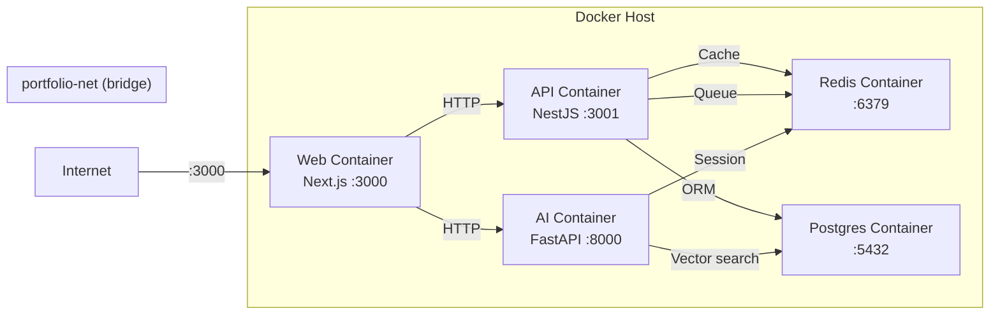

# Container Strategy

## Overview

Docker container strategy for the Portfolio platform.

## Container Images

| Service       | Base Image       | Size   | Registry | Build Time |
| ------------- | ---------------- | ------ | -------- | ---------- |
| API (NestJS)  | node:22-alpine   | ~250MB | ghcr.io  | 90s        |
| Web (Next.js) | node:22-alpine   | ~300MB | ghcr.io  | 120s       |
| AI (FastAPI)  | python:3.12-slim | ~500MB | ghcr.io  | 180s       |

## Dockerfiles

### API (`apps/api/Dockerfile`)

- Multi-stage build
- Stage 1: Install deps, build TypeScript
- Stage 2: Copy dist + production deps only
- Non-root user
- Health check configured

### Web (`apps/web/Dockerfile`)

- Multi-stage build using standalone output
- Stage 1: Install deps, build Next.js
- Stage 2: Copy `.next/standalone` only
- Non-root user
- Includes public assets, static files

## Docker Compose (`infrastructure/docker/docker-compose.yml`)

Three services + dependencies:

- `api` — NestJS on port 3001 (mapped to 4000)
- `web` — Next.js on port 3000
- `ai` — FastAPI on port 8000
- `postgres` — PostgreSQL (dev only)
- `redis` — Redis (dev only)

## Best Practices

- Multi-stage builds for minimal image size
- `.dockerignore` files for both web and api
- Use of specific version tags (not `latest`)
- Non-root user execution
- Health check endpoints
- Dependency caching for faster builds

## Image Registry

Images are built and pushed to GitHub Container Registry (ghcr.io) via GitHub Actions CI.

Tags follow the pattern `ghcr.io/<repo>/<service>:<tag>` where tag is either `latest` or the commit SHA.

## Build Pipeline (CI)

Docker images are built in CI (`.github/workflows/ci.yml`) only on `main`/`master` branches or version tags (`v*`). Pipeline dependencies:

1. `quality` job (lint + typecheck + test): runs for `apps/api` and `apps/web`
2. `prisma-validate` job: validates Prisma schema
3. `docker-api` / `docker-web` jobs: depend on both above, build and push to ghcr.io

## Security Scanning

Recommended: Integrate Trivy or Snyk scan into CI pipeline.

---

## Diagram

### Container Architecture

## Cross-References

- [../MASTER-INDEX.md](../MASTER-INDEX.md) — Documentation master index
- [../26-reference/CROSS-REFERENCE-INDEX.md](../26-reference/CROSS-REFERENCE-INDEX.md) — Cross-reference system
