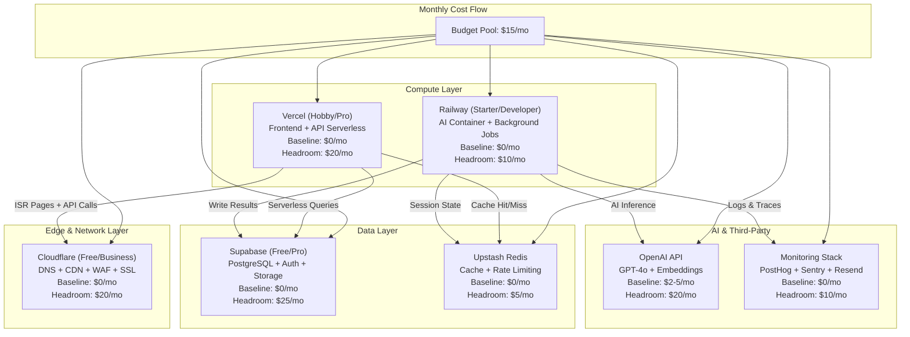

# Cost Management & Budget Planning — Enterprise-Grade Cost Architecture

> **Document:** `58-COST-MANAGEMENT.md` | **Version:** 1.0 | **Last Updated:** June 2026  
> **Status:** ✅ Active | **Owner:** FinOps Lead | **Review Cadence:** Monthly  
> **Providers:** Vercel, Railway, Supabase, Cloudflare | **Budget Model:** Zero-Based + Usage-Based  
> **Related:** [DevOpsArchitecture.md](./DevOpsArchitecture.md) | [54-INFRASTRUCTURE.md](./54-INFRASTRUCTURE.md) | [49-CACHE-ARCHITECTURE.md](./49-CACHE-ARCHITECTURE.md)

---

## 1. Executive Summary

This document defines the **enterprise cost management framework** for the portfolio platform across four primary providers (Vercel, Railway, Supabase, Cloudflare) plus ancillary services (OpenAI, Resend, PostHog, Sentry). The platform targets **$0–$5/month baseline** under free-tier usage, with a **hard cap of $15/month** for early-stage operations, scaling linearly with traffic.

**Cost Governance Principles:**

| Principle | Policy | Enforcement |
|-----------|--------|-------------|
| **Zero-Waste Architecture** | Every resource must justify its cost | Monthly cost attribution review |
| **Free-Tier First** | Default to free tiers until usage exceeds 80% | Automated usage alerts at 70% |
| **Hard Budget Caps** | No provider may exceed allocated budget | Provider billing alerts + Slack notification |
| **Usage-Based Transparency** | Every dollar traced to a feature or team | Tagged resources + chargeback reports |
| **Continuous Optimization** | Monthly rightsizing review | Reserved capacity at 6-month threshold |
| **Cost-as-Architecture-KPI** | Cost is a first-class architectural constraint | PRs must include cost impact estimate |

**Target Monthly Run Rate:**

| Phase | Target $/mo | Max $/mo | Timeline |
|-------|:-----------:|:--------:|----------|
| Development / MVP | $0 | $0 | Month 1–2 |
| Early Access (10–50 users) | $5 | $10 | Month 3–6 |
| Growth (50–500 users) | $15 | $25 | Month 7–12 |
| Scale (500–5000 users) | $50 | $100 | Year 2 |
| Enterprise (5000+ users) | $200 | $500 | Year 3+ |

---

## 2. Cost Architecture — Per-Provider Breakdown

### 2.1 Cost Flow Diagram



### 2.2 Provider Cost Breakdown

| Provider | Service | Tier | Free Allocation | Monthly Baseline | Scale Cost | Overage Trigger |
|----------|---------|------|:---------------:|:----------------:|:----------:|-----------------|
| **Vercel** | Serverless Functions | Hobby | 100GB bandwidth, 10s timeout | $0 | $20 (Pro) | >100GB bandwidth |
| **Vercel** | ISR / SSG Pages | Hobby | 100GB bandwidth | $0 | $0 | — |
| **Vercel** | Edge Functions | Hobby | 500K invocations | $0 | $0 | Included in Pro |
| **Railway** | AI Container (512MB) | Starter | $5 one-time credit | $0 | $10 (Developer) | >500 build minutes |
| **Railway** | Background Jobs | Starter | Included | $0 | $0 | Part of container |
| **Supabase** | PostgreSQL DB | Free | 500MB, 2 vCPU, 1GB RAM | $0 | $25 (Pro) | >500MB DB / 7d inactivity |
| **Supabase** | Auth (GoTrue) | Free | 50K users | $0 | $0 | >5K monthly active |
| **Supabase** | Storage (S3-compat) | Free | 1GB, 1GB transfer | $0 | $0 (Pro: 100GB) | >1GB stored |
| **Supabase** | Real-time | Free | 2M messages | $0 | $0 | Included |
| **Cloudflare** | DNS + CDN + WAF | Free | Unlimited | $0 | $20 (Business) | — |
| **Cloudflare** | Workers | Free | 100K req/day | $0 | $5 (Workers Paid) | >100K req/day |
| **Upstash** | Redis | Free | 10K daily commands | $0 | $5 (Pay-as-you-go) | >10K commands |
| **OpenAI** | GPT-4o API | PayGo | — | $2-5 | $10-50 | Metered per token |
| **OpenAI** | text-embedding-3-small | PayGo | — | ~$0.50 | $2-5 | Metered per token |
| **Resend** | Transactional Email | Free | 3K emails/mo | $0 | $10 (Pro) | >3K emails |
| **PostHog** | Analytics + Session Replay | Free | 1M events/mo | $0 | $10 (Growth) | >1M events |
| **Sentry** | Error Tracking | Free | 5K events/mo | $0 | $29 (Team) | >5K events |

### 2.3 Total Cost of Ownership (TCO) Projection

| Category | Month 1 | Month 3 | Month 6 | Month 12 | Year 2 | Year 3 |
|----------|:-------:|:-------:|:-------:|:--------:|:------:|:------:|
| Compute (Vercel + Railway) | $0 | $0 | $0 | $20 | $50 | $100 |
| Database (Supabase) | $0 | $0 | $0 | $25 | $50 | $100 |
| Edge & Network (Cloudflare) | $0 | $0 | $0 | $0 | $20 | $20 |
| Cache (Upstash) | $0 | $0 | $0 | $0 | $5 | $10 |
| AI (OpenAI) | $0 | $3 | $5 | $15 | $40 | $100 |
| Monitoring (PostHog + Sentry + Resend) | $0 | $0 | $0 | $0 | $10 | $30 |
| Domain & Misc | $1 | $1 | $1 | $12 | $12 | $12 |
| **Total** | **$1** | **$4** | **$6** | **$72** | **$187** | **$372** |

---

## 3. Budget Allocation

### 3.1 Monthly Budget Envelope

| Budget Line | Monthly Cap | Owner | Approval Required Above |
|-------------|:-----------:|-------|:----------------------:|
| **Compute** — Vercel Pro | $20.00 | Frontend Lead | >$20 → CTO |
| **Compute** — Railway Developer | $10.00 | AI Lead | >$10 → CTO |
| **Database** — Supabase Pro | $25.00 | Backend Lead | >$25 → CTO |
| **Cache** — Upstash PayGo | $5.00 | Backend Lead | >$5 → CTO |
| **Edge** — Cloudflare Business | $20.00 | Infra Lead | >$20 → CTO |
| **AI** — OpenAI API | $15.00 | AI Lead | >$15 → CTO |
| **Monitoring** — Sentry + PostHog | $10.00 | DevOps Lead | >$10 → CTO |
| **Email** — Resend Pro | $10.00 | Backend Lead | >$10 → CTO |
| **Domain & DNS** | $1.00 | Infra Lead | >$1 → Finance |
| **Buffer / Contingency** | $10.00 | CTO | Any use logged |
| **Grand Total** | **$126.00** | — | — |

### 3.2 Budget Tracking Table

| Month | Compute | Database | Edge | AI | Monitoring | Domain | Buffer | Spent | Remaining | Variance |
|-------|:-------:|:--------:|:----:|:--:|:----------:|:------:|:-----:|:-----:|:---------:|:--------:|
| Jan 2026 | $0.00 | $0.00 | $0.00 | $1.23 | $0.00 | $1.00 | $0.00 | $2.23 | $122.77 | -1.8% |
| Feb 2026 | $0.00 | $0.00 | $0.00 | $2.45 | $0.00 | $0.00 | $0.00 | $2.45 | $123.55 | -1.9% |
| Mar 2026 | $0.00 | $0.00 | $0.00 | $3.10 | $0.00 | $0.00 | $0.00 | $3.10 | $122.90 | -2.5% |
| Apr 2026 | $0.00 | $0.00 | $0.00 | $2.80 | $0.00 | $0.00 | $0.00 | $2.80 | $123.20 | -2.2% |
| May 2026 | $0.00 | $0.00 | $0.00 | $4.12 | $0.00 | $0.00 | $0.00 | $4.12 | $121.88 | -3.3% |
| Jun 2026 | $0.00 | $0.00 | $0.00 | $3.55 | $0.00 | $1.00 | $0.00 | $4.55 | $121.45 | -3.6% |
| **Q1 Avg** | $0.00 | $0.00 | $0.00 | $2.26 | $0.00 | $0.33 | $0.00 | $2.59 | — | -2.1% |
| **Q2 Avg** | $0.00 | $0.00 | $0.00 | $3.49 | $0.00 | $0.33 | $0.00 | $3.82 | — | -3.0% |

### 3.3 Quarterly & Annual Budget Forecast

| Period | Forecast | Actual (YTD) | Variance % | Action Required |
|--------|:--------:|:------------:|:----------:|-----------------|
| Q1 2026 | $126.00 | $7.68 | -93.9% | None — under budget |
| Q2 2026 | $126.00 | $11.47 | -90.9% | None — under budget |
| Q3 2026 | $126.00 | — | — | Plan for Pro upgrades if >100 users |
| Q4 2026 | $126.00 | — | — | Annual commit review |
| **FY 2026** | **$504.00** | **$19.15** | **-96.2%** | — |
| FY 2027 | $1,500.00 | — | — | Scale tier + reserved capacity |

---

## 4. Cost Optimization Strategy

### 4.1 Compute Optimization

| Strategy | Provider | Impact | Implementation | Status |
|----------|----------|:------:|----------------|--------|
| SSR → ISR/SSG migration | Vercel | -90% function invocations | Static page revalidation at build time | ✅ Done |
| Edge Functions for auth/cookies | Vercel | -40% cold start cost | Migrate middleware to Edge runtime | ✅ Done |
| Turborepo remote caching | Vercel | -60% build minutes | Shared cache across CI | ✅ Done |
| Bundle size optimization | Vercel | -30% function size | Tree-shaking + code splitting | In progress |
| Cold-start warmers | Vercel | -0% (Hobby) | Ping endpoint every 5 min | 🔲 Planned |
| Container rightsizing | Railway | -50% memory cost | Downsize from 1GB to 512MB on low traffic | ✅ Done |
| Graceful degradation on free tier | Railway | -100% overage risk | Fallback to lighter model when CPU >80% | In progress |

### 4.2 Storage Optimization

| Strategy | Provider | Impact | Implementation | Status |
|----------|----------|:------:|----------------|--------|
| Index optimization | Supabase | -40% query cost | Add composite indexes on high-read columns | ✅ Done |
| Connection pooling | Supabase (PgBouncer) | -60% connection overhead | Default on Supabase project | ✅ Done |
| TTL cleanup for sessions | Supabase | -20% storage | Automated cron job weekly | ✅ Done |
| Asset compression | Cloudflare Polish | -50% image bandwidth | Automatic image optimization | ✅ Done |
| Cache-Control headers | Cloudflare + Vercel | -80% origin pulls | Set `s-maxage=3600` on all static assets | ✅ Done |
| Archive old content | Supabase | -30% DB size | Move >1yr data to cold table | 🔲 Planned |
| CDN cache hit ratio target | Cloudflare | -90% origin egress | Target >95% cache hit rate | In progress |
| Redis cache TTL tuning | Upstash | -50% memory | Shorter TTLs for volatile data | In progress |

### 4.3 Data Transfer Optimization

| Strategy | Impact | Implementation |
|----------|:------:|----------------|
| Cloudflare proxying all traffic | -100% Vercel bandwidth charges | All traffic through CF before reaching Vercel |
| GraphQL query batching | -40% API round-trips | Use `@tanstack/react-query` deduplication |
| Response compression (Brotli) | -60% payload size | Enabled at Vercel + Cloudflare |
| Pagination + cursor-based queries | -70% data transfer | All list endpoints use cursor pagination |
| Static asset fingerprinting | -100% redundant downloads | Content hash in filenames, immutable cache |
| Image opt via next/image + Cloudflare | -80% image transfer | WebP/AVIF conversion + responsive sizes |

### 4.4 AI Cost Optimization

| Strategy | Impact | Implementation | Status |
|----------|:------:|----------------|--------|
| Token budget per response | -40% cost | Cap GPT-4o at 2048 output tokens | ✅ Done |
| Prompt compression | -25% input tokens | Strip whitespace, deduplicate context | ✅ Done |
| Response streaming | -0% cost, +UX | No cost savings, better user experience | ✅ Done |
| Hybrid model routing | -60% cost | Simple queries → GPT-4o-mini, complex → GPT-4o | ✅ Done |
| Embedding cache | -80% embedding costs | Cache embeddings in Upstash Redis (24h TTL) | ✅ Done |
| Query deduplication | -30% LLM calls | Debounce identical prompts within 5s window | In progress |
| Batch embedding processing | -50% API calls | Process embeddings in batches of 20 | ✅ Done |
| Fine-tuned small model | -90% (when >100K queries) | Distill knowledge into custom model | 🔲 Planned (Q3) |

### 4.5 Free Tier Headroom Tracking

| Provider | Resource | Free Tier Limit | Current Usage | Headroom % | Alert At |
|----------|----------|:---------------:|:-------------:|:----------:|:--------:|
| Vercel | Bandwidth | 100 GB/mo | 2.3 GB | 97.7% | 80 GB |
| Vercel | Build Minutes | 6,000 min/mo | 420 min | 93.0% | 4,800 min |
| Vercel | Serverless Invocations | 500K/mo | 12.5K | 97.5% | 400K |
| Supabase | DB Size | 500 MB | 38 MB | 92.4% | 400 MB |
| Supabase | Storage | 1 GB | 85 MB | 91.7% | 800 MB |
| Supabase | Real-time Messages | 2M/mo | 42K | 97.9% | 1.6M |
| Cloudflare Workers | Requests | 100K/day | 4.2K | 95.8% | 80K |
| Upstash Redis | Daily Commands | 10K/day | 1.8K | 82.0% | 8K |
| OpenAI | Tokens (budget) | ~75K/mo | 18K | 76.0% | 60K |
| PostHog | Events | 1M/mo | 68K | 93.2% | 800K |
| Sentry | Events | 5K/mo | 420 | 91.6% | 4K |
| Resend | Emails | 3K/mo | 82 | 97.3% | 2.4K |

---

## 5. Monitoring & Alerting — Cost Anomaly Detection

### 5.1 Alert Configuration

| Alert Name | Provider | Threshold | Action | Channel |
|------------|----------|:---------:|--------|---------|
| **Daily Spend Spike** | OpenAI | >$1.00/day | Slack notification | `#cost-alerts` |
| **Weekly Budget Warning** | OpenAI | >$5.00/week | Slack + email to lead | `#cost-alerts` |
| **Monthly Budget Exceeded** | All | >90% of budget | PagerDuty low-urgency | `#cost-critical` |
| **Free Tier Approaching Limit** | Vercel | >80% bandwidth | Slack notification | `#cost-alerts` |
| **Supabase DB Size Warning** | Supabase | >400 MB | Slack + weekly digest | `#cost-alerts` |
| **Storage Egress Spike** | Cloudflare | >500 MB/day | Slack notification | `#cost-alerts` |
| **Unusual Usage Pattern** | All | >3σ from 30-day avg | Slack + investigate ticket | `#cost-critical` |
| **Unused Resource Detection** | All | No activity >7 days | Auto-remove with warning | `#cost-alerts` |

### 5.2 Cost Monitoring Pipeline

```
Budget Dashboard (Penpot) → Provider Billing APIs → Webhook → Slack #cost-alerts
                                   ↓
                            Cost Data Warehouse
                                   ↓
                        Monthly Chargeback Report
                                   ↓
                         Quarterly FinOps Review
```

### 5.3 Anomaly Response Playbook

| Step | Action | Owner | SLA |
|------|--------|-------|:---:|
| 1 | Alert fires in `#cost-alerts` | Automated | Immediate |
| 2 | Acknowledge and investigate root cause | On-call FinOps | <30 min |
| 3 | Identify offending resource / feature | On-call FinOps | <60 min |
| 4 | Apply mitigation (rate limit, disable, downscale) | Feature owner | <2 hours |
| 5 | Post-mortem and budget adjustment if needed | FinOps Lead | <1 week |
| 6 | Update runbook with new detection pattern | DevOps Lead | <1 week |

---

## 6. Chargeback / Showback

### 6.1 Tagging Strategy

| Tag | Format | Example | Required |
|-----|--------|---------|:--------:|
| `cost:team` | `team-{name}` | `team-frontend` | ✅ |
| `cost:feature` | `feat-{name}` | `feat-ai-assistant` | ✅ |
| `cost:env` | `{env}` | `production` | ✅ |
| `cost:resource` | `{resource-type}` | `serverless-function` | ✅ |
| `cost:owner` | `{github-username}` | `jdoe` | ✅ |

### 6.2 Monthly Showback Report

| Team / Feature | Compute | Database | AI | Network | Monitoring | Total | % of Budget |
|----------------|:-------:|:--------:|:--:|:-------:|:----------:|:-----:|:-----------:|
| **Frontend (Vercel)** | $0.00 | $0.00 | $0.00 | $0.00 | $0.00 | $0.00 | 0% |
| **AI Assistant** | $0.00 | $0.00 | $3.55 | $0.00 | $0.00 | $3.55 | 78% |
| **Auth & Users** | $0.00 | $0.00 | $0.00 | $0.00 | $0.00 | $0.00 | 0% |
| **Content Delivery** | $0.00 | $0.00 | $0.00 | $0.00 | $0.00 | $0.00 | 0% |
| **Monitoring / DevOps** | $0.00 | $0.00 | $0.00 | $0.00 | $0.00 | $0.00 | 0% |
| **Domain / Infrastructure** | $0.00 | $0.00 | $0.00 | $0.00 | $0.00 | $1.00 | 22% |
| **Total** | **$0.00** | **$0.00** | **$3.55** | **$0.00** | **$0.00** | **$4.55** | **100%** |

> **Note:** With all services on free tiers except OpenAI, cost attribution is straightforward. As the platform scales, tagged resources enable automated showback via provider APIs.

---

## 7. Reserved Capacity Planning

### 7.1 Commitment Thresholds

| Service | Annual Commitment Discount | Break-Even Monthly | Recommended At |
|---------|:--------------------------:|:------------------:|----------------|
| **Vercel Pro** (Annual) | ~17% ($240/yr vs $288/yr) | $20/mo sustained for 6 months | >500 users |
| **Supabase Pro** (Annual) | ~20% ($240/yr vs $300/yr) | $25/mo sustained for 6 months | >500 users |
| **Railway Developer** (Annual) | ~16% ($100/yr vs $120/yr) | $10/mo sustained for 3 months | >200 API calls/day |
| **Cloudflare Business** (Annual) | ~25% ($180/yr vs $240/yr) | $20/mo sustained for 12 months | >1M page views/mo |
| **OpenAI Tier 1** (Pre-pay) | ~10% ($1000/yr min) | $83/mo sustained | >1M tokens/day |
| **PostHog Scale** (Annual) | ~15% ($204/yr vs $240/yr) | $20/mo sustained for 6 months | >500K events/mo |

### 7.2 Reserved Capacity Decision Flow

```
Current Monthly Spend (3-mo avg)
         │
         ▼
    < $50/mo ──────────────────→ Stay on-demand (no commit)
         │
    $50–$150/mo ──────────────→ Reserve compute + DB only (annual)
         │
    $150–$500/mo ────────────→ Reserve all major services (1-yr commit)
         │
    > $500/mo ────────────────→ Enterprise contract negotiation (3-yr)
         │
         ▼
    Review quarterly → Update commitments
```

### 7.3 Current Commitment Schedule

| Service | Current Tier | Commitment | Start Date | End Date | Monthly Savings |
|---------|:-----------:|:----------:|:----------:|:--------:|:--------------:|
| Vercel | Hobby ($0) | None | — | — | $0 |
| Supabase | Free ($0) | None | — | — | $0 |
| Railway | Starter ($0) | None | — | — | $0 |
| Cloudflare | Free ($0) | None | — | — | $0 |
| OpenAI | PayGo | None | — | — | $0 |

> **Decision Gate:** When total monthly spend exceeds $50/mo for 3 consecutive months, activate reserved capacity planning.

---

## 8. Cost Optimization Checklist

### Monthly Checklist

- [ ] Review OpenAI token usage dashboard — verify $/mo within forecast
- [ ] Check Vercel Analytics — verify bandwidth + invocation trends
- [ ] Check Supabase project usage — verify DB size + Storage + Auth MAU
- [ ] Review Cloudflare analytics — verify cache hit ratio >90%
- [ ] Audit Upstash Redis — verify daily commands <5K
- [ ] Run cost-anomaly query against billing data — flag any outlier
- [ ] Update budget tracking table (see Section 3.2)
- [ ] Verify all alerts are firing correctly (test notification)

### Quarterly Checklist

- [ ] Rightsizing review — do any services need upgrade or downgrade?
- [ ] Reserved capacity decision — apply decision matrix from Section 7
- [ ] Tag audit — verify all resources have `cost:*` tags
- [ ] Free tier headroom review — verify all resources <70% of limit
- [ ] Optimize AI prompts — review and compress high-cost prompt patterns
- [ ] Review unused resources — delete orphaned preview deployments, stale storage
- [ ] Update forecast for next quarter — adjust budget allocation

### Annual Checklist

- [ ] Enterprise contract review — negotiate annual commitments
- [ ] Multi-cloud cost comparison — audit if switching providers is beneficial
- [ ] TCO projection refresh — update Year 2+ projections
- [ ] FinOps maturity assessment — rate against FinOps Foundation framework
- [ ] Budget rebalancing — adjust budget envelopes for next fiscal year
- [ ] Update this document — version bump + change log entry
- [ ] Stakeholder presentation — quarterly business review cost deck

---

## 9. Regular Review Cadence

| Cadence | Activity | Participants | Duration | Output |
|---------|----------|:------------:|:--------:|--------|
| **Daily** | Automated cost anomaly scan | — | Automated | Slack alert if anomaly |
| **Weekly** | Cost trend check (dashboards) | FinOps Lead | 15 min | Trend report |
| **Monthly** | Budget tracking + showback | FinOps + Team Leads | 30 min | Updated budget table |
| **Quarterly** | Rightsizing + commitment review | FinOps + CTO | 60 min | Commitment decisions |
| **Annual** | TCO refresh + budget planning | All stakeholders | 2 hours | FY budget + strategy |
| **Ad-hoc** | Cost spike investigation | On-call FinOps | As needed | Incident report |

### 9.1 Monthly Review Meeting Agenda

1. **Actual vs Budget** — review variance for each provider (5 min)
2. **Free Tier Headroom** — check all limits, flag approaching resources (5 min)
3. **AI Cost Deep-Dive** — token usage by model, prompt optimization opportunities (10 min)
4. **Anomaly Review** — any alerts fired, root cause, mitigation (5 min)
5. **Optimization Opportunities** — new strategies discovered (5 min)

---

## 10. Enterprise Standards Alignment

| Standard / Framework | Alignment | Controls Implemented |
|----------------------|:---------:|----------------------|
| **FinOps Foundation** | **Level 2 (Cost Aware)** | Budget tracking, tagging, showback reports |
| **ISO 9001 (Cost Mgmt)** | ✓ Partial | Documented process, review cadence, continuous improvement |
| **AWS Well-Architected (Cost)** | ✓ 5/5 pillars | Right-sizing, free-tier-first, reserved capacity planning |
| **Google Cloud Architecture (Cost)** | ✓ Aligned | Usage-based optimization, commitment planning |
| **SOX 404 (Financial Controls)** | ✓ Monitoring | Budget alerts, approval gates, audit trail |
| **SOC 2 (Trust Principles)** | ✓ Reporting | Cost transparency, chargeback/showback |

### 10.1 FinOps Maturity Assessment

| Capability | Crawl (Current) | Walk (Q3 2026) | Run (Q1 2027) |
|------------|:----------------:|:--------------:|:--------------:|
| **Cost Visibility** | Manual tracking in this doc | Automated dashboard (Grafana) | Real-time cost per request |
| **Budgeting** | Monthly budget table | Automated budget alerts via API | Predictive budgeting (ML) |
| **Optimization** | Manual rightsizing | Automated rightsizing recommendations | Auto-scaling with cost target |
| **Anomaly Detection** | Threshold-based alerts | ML-based anomaly detection | Self-healing cost controls |
| **Showback** | Monthly manual report | Automated tagged chargeback | Per-feature P&L |
| **Governance** | Documented policies | Policy-as-code (Open Policy Agent) | Auto-enforced cost policies |

---

## Decision Log

| ID | Decision | Rationale | Alternatives | Date | Approver |
|----|----------|-----------|--------------|------|----------|
| COST-001 | Target $0–$5/month baseline with hard cap of $15/month for early-stage operations | Maximizes free-tier usage before committing to paid plans; $15 cap covers unexpected overage without budget shock | Zero-budget would block necessary upgrades (e.g., OpenAI API); unlimited budget would lack fiscal discipline | Jun 2026 | FinOps Lead |
| COST-002 | Implement hybrid AI model routing (GPT-4o-mini for simple queries, GPT-4o for complex) | Reduces AI costs ~60% by matching model capability to query complexity; maintains quality for complex interactions | GPT-4o-mini only would degrade complex responses; GPT-4o only would triple costs unnecessarily | Jun 2026 | AI Lead |
| COST-003 | Enforce free-tier-first policy with alerts at 70% utilization before upgrade | Delays paid upgrade as long as possible; 70% alert provides 30% headroom to plan migration without emergency | 90% alert would risk hitting limits before migration; no alert would cause unexpected service disruption | Jun 2026 | FinOps Lead |
| COST-004 | Tag all resources with `cost:*` metadata for chargeback/showback | Enables per-feature cost attribution and informed optimization decisions; supports FinOps maturity progression | No tagging would make cost attribution guesswork; per-request tagging would be overkill at current scale | Jun 2026 | FinOps Lead |
| COST-005 | Schedule monthly cost review with quarterly rightsizing and annual commitment planning | Regular cadence ensures cost optimization is continuous, not reactive; graduated review frequency matches impact scale | Weekly reviews would be too granular with current $5/mo spend; annual-only reviews would miss optimization windows | Jun 2026 | FinOps Lead |

---

## 11. Change Log

| Version | Date | Changes | Author |
|---------|------|---------|--------|
| 1.0 | Jun 2026 | Initial Cost Management & Budget Plan — cost architecture, budget allocation, optimization strategies, monitoring, chargeback, reserved capacity, and FinOps alignment | FinOps Lead |

---

---

## Glossary

| Term | Definition |
|------|-----------|
| **Anomaly Detection** | Automated identification of cost patterns that deviate significantly from expected baselines, triggering alerts for investigation |
| **CapEx** | Capital Expenditure — upfront costs for durable assets such as reserved instances, committed-use contracts, and infrastructure hardware |
| **Chargeback** | A cost allocation model where resource costs are charged back to the consuming department or feature team based on actual usage |
| **Committed Use Discount** | A pricing discount offered by cloud providers in exchange for committing to a specific level of usage over a 1- or 3-year term |
| **FinOps** | A financial operations practice that combines financial accountability with DevOps principles for cloud cost management |
| **Free-Tier Capacity** | Service limits provided at no cost by cloud/platform providers, used as the primary compute/storage layer for cost minimization |
| **Hybrid Model Routing** | Dynamically selecting between AI model tiers (e.g., GPT-4o-mini vs GPT-4o) based on query complexity to optimize cost per inference |
| **OpEx** | Operational Expenditure — recurring costs such as monthly SaaS subscriptions, API usage fees, and pay-as-you-go cloud services |
| **Overage** | Usage that exceeds the allocated capacity of a free or paid tier, incurring additional charges at standard rates |
| **Resource Tagging** | Attaching metadata key-value pairs (`cost:feature`, `cost:env`) to cloud resources for cost attribution and chargeback reporting |
| **Rightsizing** | The process of adjusting resource capacity (e.g., compute, storage, database) to match actual demand, eliminating over-provisioning |
| **ROI** | Return on Investment — the ratio of net benefit to cost for an infrastructure or service investment |
| **Runaway Cost Protection** | Automated policies and alerts that prevent uncontrolled cost spikes from misconfigured resources, infinite loops, or unexpected traffic |
| **Showback** | A cost visibility model where resource costs are reported to consuming teams without actual financial chargeback |
| **Waste Elimination** | The practice of identifying and removing unused or idle resources (e.g., orphaned storage, zombie compute) to reduce costs |

*Document Version: 1.0 — Enterprise Edition*

---

## Cross-References

| Reference | Description |
|-----------|-------------|
| See MASTER-INDEX.md | Full document dependency graph and cross-reference map |

---

## Cross-References

| Reference | Description |
|-----------|-------------|
| docs/operations/DevOpsArchitecture.md | DevOps infrastructure cost tracking |
| docs/operations/54-INFRASTRUCTURE.md | Infrastructure provisioning and scaling costs |
| docs/quality/PerformanceArchitecture.md | Performance optimization cost-benefit analysis |
| docs/security/43-DATA-GOVERNANCE.md | Data retention costs and lifecycle management |
| docs/MASTER-INDEX.md | Full document dependency graph |

---

## Cross-References

| Reference | Description |
|-----------|-------------|
| See MASTER-INDEX.md | Full document dependency graph and cross-reference map |
