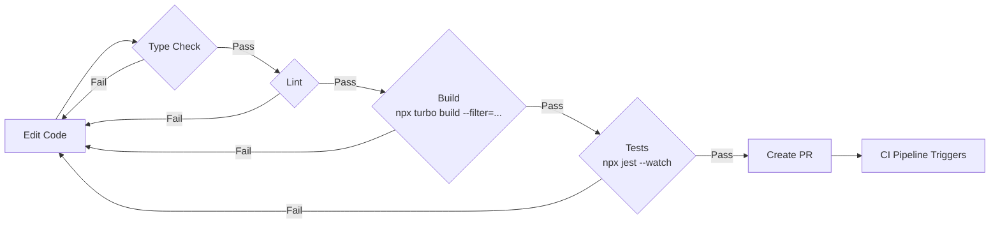
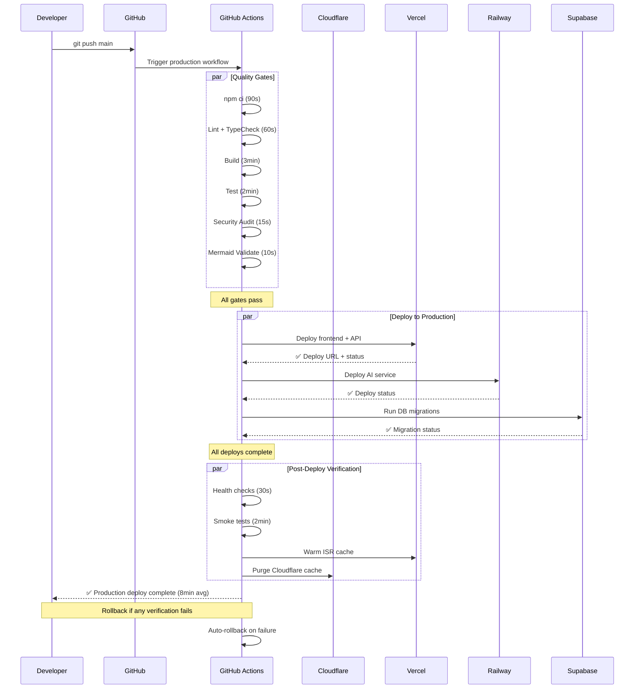
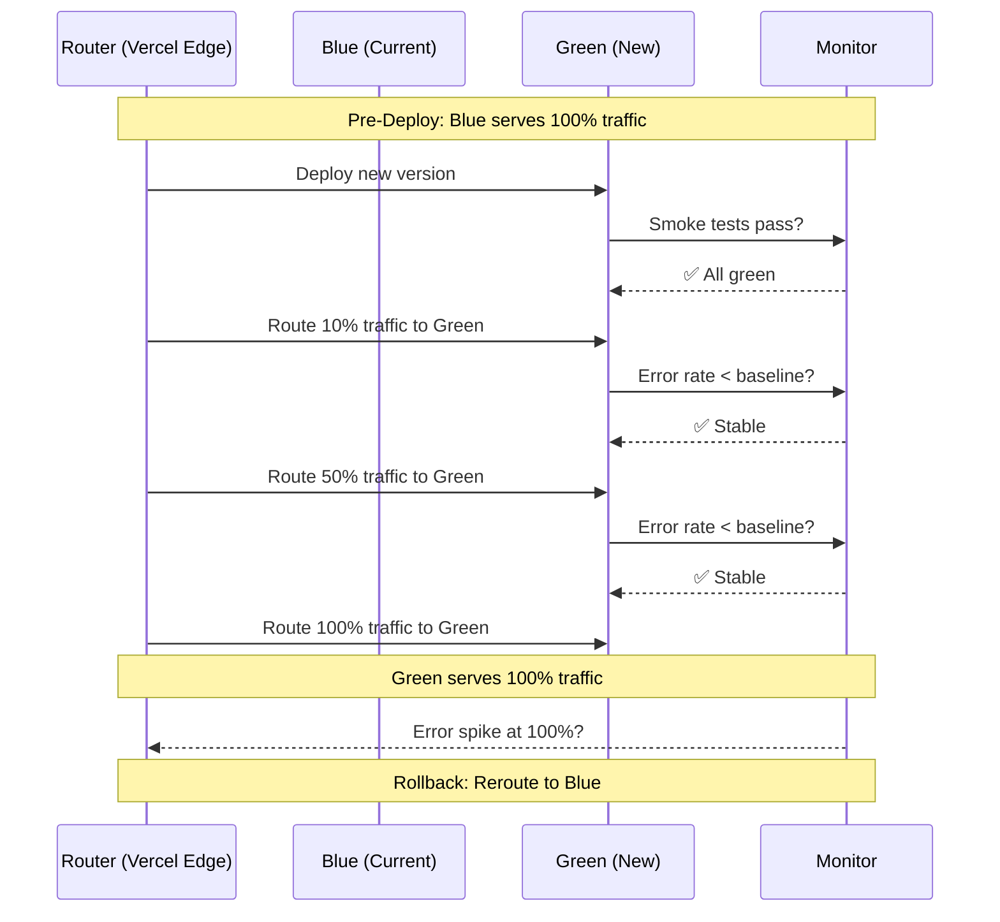
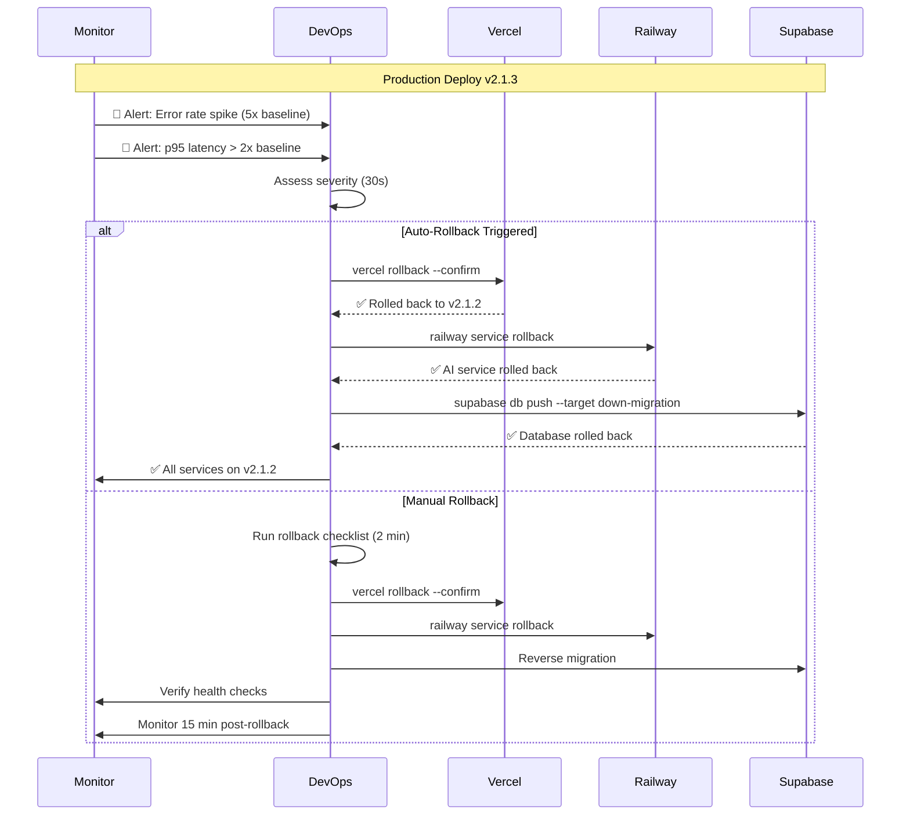

# Deployment Guide — FAANG Enterprise Architecture & Runbook

> **Document:** `DeploymentGuide.md` | **Version:** 5.0 (Enterprise Upgrade) | **Last Updated:** July 2026  
> **Status:** ✅ Active | **Owner:** Principal DevOps Lead | **Review Cadence:** Quarterly  
> **Strategy:** Build Once, Deploy Everywhere | **Providers:** Vercel, Railway, Supabase, Cloudflare

---

## 1. Executive Summary

The platform uses a **build-once, deploy-everywhere** strategy with **4-environment isolation** (Development → Testing → Staging → Production). A single CI pipeline builds all artifacts, then deploys to **3 providers** (Vercel for Frontend + API, Railway for AI Service, Supabase for Database) with **Cloudflare** managing DNS, SSL, and DDoS mitigation. Every deployment is zero-downtime with automated rollback capability and comprehensive disaster recovery procedures.

**Deployment Targets:**

| Service | Provider | Runtime | Auto-deploy | Rollback | SLA Target |
|---------|----------|---------|-------------|----------|------------|
| Frontend (Next.js) | Vercel | Serverless + Edge Nodes | On `main` push | Instant via Vercel | 99.99% |
| API (NestJS) | Vercel | Serverless Functions | On `main` push | Instant via Vercel | 99.99% |
| AI (FastAPI) | Railway | Container (Docker) | On `main` push | `railway rollback` | 99.95% |
| Database (PostgreSQL) | Supabase | Managed PostgreSQL 15 | Manual migrations | Point-in-time recovery | 99.99% |
| DNS + CDN + SSL | Cloudflare | Global Edge Network | DNS record changes | Instant via API | 100% |

**4-Environment Strategy:**

```
Development  →  Testing  →  Staging  →  Production
(local/dev)     (CI/CD)     (pre-prod)    (live)
```

---

## 2. Enterprise Deployment Architecture

### 2.1 High-Level Architecture Overview

```mermaid
graph TB
    subgraph "User / Client Layer"
        Browser[\"🌐 Browser<br/>Global Users\"]
        Mobile[\"📱 Mobile<br/>Safari, Chrome\"]
        API_Client[\"🔌 API Clients<br/>curl, Postman\"]
    end

    subgraph "Edge & Security Layer [Cloudflare]"
        CF_DNS[\"📡 Cloudflare DNS<br/>Authoritative Nameservers<br/>DNSSEC\"]
        CF_WAF[\"🛡️ Cloudflare WAF<br/>DDoS Protection<br/>Rate Limiting<br/>Bot Management\"]
        CF_SSL[\"🔐 Cloudflare SSL/TLS<br/>Full (Strict)<br/>Auto Certificate Renewal<br/>HSTS Preload\"]
        CF_CDN[\"⚡ Cloudflare CDN<br/>330+ Edge Locations<br/>Argo Smart Routing<br/>Cache Rules\"]
    end

    subgraph "Hosting Layer [Vercel]"
        V_EDGE[\"Vercel Edge Network<br/>100+ Edge Locations<br/>ISR Cache (60s TTL)<br/>Edge Middleware\"]
        V_WEB[\"Next.js Frontend<br/>Serverless SSR<br/>Static Generation<br/>ISR Pages\"]
        V_API[\"NestJS API<br/>Serverless Functions<br/>Auto-scaling<br/>Cold-start ~50ms\"]
    end

    subgraph "Container Layer [Railway]"
        R_AI[\"FastAPI AI Service<br/>Docker Container<br/>Uvicorn + Gunicorn<br/>Auto-restart\"]
        R_REDIS[\"Redis Cache<br/>Session Storage<br/>Rate Limit Backend<br/>Upstash\"]
    end

    subgraph "Data Layer [Supabase]"
        S_PG[\"PostgreSQL 15<br/>7 Core Tables<br/>RLS Policies<br/>pgvector\"]
        S_AUTH[\"Supabase Auth<br/>User Management<br/>JWT Tokens<br/>Row Security\"]
        S_STORAGE[\"Supabase Storage<br/>S3-Compatible<br/>Images, PDFs<br/>CDN-backed\"]
        S_REALTIME[\"Supabase Realtime<br/>WebSocket<br/>Live Updates<br/>Change Tracking\"]
    end

    subgraph "External Services"
        EX_OPENAI[\"🤖 OpenAI / Anthropic<br/>LLM APIs\"]
        EX_POSTHOG[\"📊 PostHog Cloud<br/>Analytics, Feature Flags\"]
        EX_SENTRY[\"🐛 Sentry<br/>Error Tracking, Performance\"]
        EX_RESEND[\"📨 Resend API<br/>Transactional Email\"]
        EX_GITHUB[\"🐙 GitHub<br/>Source Control, CI/CD\"]
    end

    subgraph "Monitoring & Observability"
        MON_BETTER[\"Better Uptime<br/>External Monitoring<br/>1-min Interval\"]
        MON_TELEGRAM[\"Telegram Bot<br/>Instant Alerts<br/>New Leads, Errors\"]
    end

    Browser --> CF_DNS
    Mobile --> CF_DNS
    API_Client --> CF_DNS
    
    CF_DNS --> CF_WAF
    CF_WAF --> CF_SSL
    CF_SSL --> CF_CDN
    CF_CDN --> V_EDGE
    
    V_EDGE --> V_WEB
    V_EDGE --> V_API
    
    V_WEB -->|ISR Data Fetch| V_API
    V_API --> S_PG
    V_API --> S_STORAGE
    V_API --> EX_RESEND
    V_API --> S_AUTH
    
    V_WEB -->|Chat Requests| R_AI
    R_AI --> EX_OPENAI
    R_AI --> S_PG
    R_AI --> R_REDIS
    R_AI --> S_STORAGE
    
    V_WEB -.->|Analytics Events| EX_POSTHOG
    V_API -.->|Error Traces| EX_SENTRY
    R_AI -.->|Error Traces| EX_SENTRY
    
    EX_GITHUB -->|CI/CD Triggers| V_EDGE
    EX_GITHUB -->|CI/CD Triggers| R_AI
    
    MON_BETTER -->|Health Checks| V_WEB
    MON_BETTER -->|Health Checks| V_API
    MON_BETTER -->|Health Checks| R_AI
    
    MON_BETTER -->|Alerts| MON_TELEGRAM
    EX_SENTRY -->|Critical Errors| MON_TELEGRAM
```

### 2.2 Provider Responsibility Matrix

| Capability | Cloudflare | Vercel | Railway | Supabase |
|------------|-----------|--------|---------|----------|
| **DNS Resolution** | ✅ Primary (Authoritative) | ❌ | ❌ | ❌ |
| **DDoS Protection** | ✅ WAF (L3-L7) | ✅ Basic | ❌ | ❌ |
| **SSL/TLS Termination** | ✅ Edge Termination | ✅ Auto | ✅ Auto | ✅ Auto |
| **CDN Caching** | ✅ 330+ PoPs (Static) | ✅ 100+ PoPs (ISR) | ❌ | ✅ CDN-backed Storage |
| **Web Application Hosting** | ❌ | ✅ Next.js SSR/ISR | ❌ | ❌ |
| **API Hosting** | ❌ | ✅ Serverless Functions | ✅ FastAPI Container | ❌ |
| **Database Hosting** | ❌ | ❌ | ❌ | ✅ PostgreSQL |
| **File Storage** | ❌ | ❌ | ❌ | ✅ S3-Compatible |
| **Edge Middleware** | ✅ Workers | ✅ Edge Functions | ❌ | ❌ |
| **Cache Invalidation** | ✅ Purge API | ✅ ISR Revalidation | ❌ | ❌ |
| **Auto-scaling** | ✅ Global | ✅ Automatic | ✅ Manual | ✅ Managed |

### 2.3 Data Flow Path

```
User → Cloudflare DNS → Cloudflare WAF → Cloudflare CDN/SSL → Vercel Edge → 
Next.js/API (ISR or Serverless) → Supabase/OpenAI

Non-cached path:  ~200ms global avg
Cached path:      ~50ms global avg (edge ISR)
```

---

## 3. Infrastructure Topology

### 3.1 Physical & Logical Topology

```mermaid
graph TB
    subgraph "Cloudflare Edge (330+ Locations)"
        CF_ANYCAST[\"Anycast Network<br/>IPv4 + IPv6\"]
        CF_DC[\"Data Centers<br/>Global Load Balancing<br/>< 10ms to 95% of Internet\"]
    end

    subgraph "Vercel Edge (100+ Locations)"
        V_DC[\"Vercel Edge Nodes<br/>ISR Cache<br/>Serverless Execution\"]
        V_IAD[\"IAD (US East)<br/>Primary Compute\"]
        V_CDG[\"CDG (Europe)<br/>Secondary Compute\"]
        V_NRT[\"NRT (Asia)<br/>Tertiary Compute\"]
    end

    subgraph "Railway (Primary: US West)\"
        R_PDX[\"PDX (Portland)<br/>AI Service Container<br/>512MB RAM, 1 vCPU\"]
        R_Backup[\"Backup Region<br/>On-Demand Failover\"]
    end

    subgraph "Supabase (Multi-Region)\"
        S_US[\"US East (Primary)<br/>PostgreSQL 15<br/>500MB Database\"]
        S_EU[\"EU West (Read Replica)<br/>Backup Target\"]
        S_BACKUP[\"Daily Backups<br/>Point-in-Time Recovery<br/>7-Day Retention\"]
    end

    subgraph "Monitoring Mesh"
        M_BETTER[\"Better Uptime<br/>Global Check Network<br/>1-min Interval\"]
        M_STATUS[\"Status Page<br/>portfolioowner.statuspage.io\"]
    end

    CF_ANYCAST --> CF_DC
    CF_DC -->|Anycast Routing| V_DC
    V_DC --> V_IAD & V_CDG & V_NRT
    V_IAD --> R_PDX
    V_IAD --> S_US
    V_CDG --> S_EU
    R_PDX --> S_US
    S_US --> S_EU
    S_US --> S_BACKUP
    M_BETTER --> V_IAD & R_PDX & S_US
    M_BETTER --> M_STATUS
```

### 3.2 Network Architecture

| Component | Specification | Provider | Region |
|-----------|--------------|----------|--------|
| **DNS Nameservers** | `archibald.ns.cloudflare.com`, `barbara.ns.cloudflare.com` | Cloudflare | Global Anycast |
| **Edge WAF** | L3-L7 DDoS, Rate Limiting, Bot Management | Cloudflare | 330+ PoPs |
| **Primary Compute** | us-east-1 (IAD) | Vercel | US East |
| **AI Compute** | PDX | Railway | US West |
| **Database Primary** | us-east-1 | Supabase | US East |
| **Database Replica** | eu-west-1 | Supabase | EU West |
| **CDN Caches** | All Vercel Edge + Cloudflare | Dual-layer | Global |

### 3.3 Network Latency SLAs

| Region → Endpoint | p50 | p95 | p99 |
|-------------------|-----|-----|-----|
| US East → Vercel IAD | < 5ms | < 15ms | < 30ms |
| US West → Vercel IAD | < 30ms | < 60ms | < 100ms |
| Europe → Vercel CDG | < 10ms | < 25ms | < 50ms |
| Asia → Vercel NRT | < 15ms | < 35ms | < 70ms |
| South America → Vercel IAD | < 80ms | < 120ms | < 200ms |
| Australia → Vercel NRT | < 50ms | < 80ms | < 150ms |

---

## 4. Development Environment

### 4.1 Local Development Setup

```mermaid
flowchart LR
    subgraph "Developer Workstation"
        CODE[\"VS Code<br/>Extensions: ESLint, Prettier<br/>Tailwind IntelliSense, Docker\"]
        TERM[\"Terminal<br/>Git, npm, Node.js 20\nDocker Desktop, Supabase CLI\"]
    end

    subgraph "Local Services (Docker Compose)\"
        LOCAL_SUPABASE[\"Supabase Local<br/>PostgreSQL 15<br/>Auth, Storage, Realtime<br/>Port 54321\"]
        LOCAL_AI[\"AI Service Local<br/>FastAPI + Uvicorn<br/>Port 8000<br/>Hot-reload: --reload\"]
    end

    subgraph "Local Apps (npm run dev)\"
        LOCAL_WEB[\"Next.js Frontend<br/>Port 3000<br/>HMR via Turbopack<br/>< 50ms refresh\"]
        LOCAL_API[\"NestJS API<br/>Port 3001<br/>Watch Mode<br/>< 200ms refresh\"]
    end

    subgraph "Environment"
        ENV[\".env.local<br/>Local Supabase keys<br/>Test API keys<br/>Debug logging\"]   
    end

    CODE -->|npm run dev| LOCAL_WEB
    CODE -->|npm run dev| LOCAL_API
    CODE -->|docker compose up| LOCAL_SUPABASE
    CODE -->|docker compose up| LOCAL_AI
    LOCAL_WEB --> LOCAL_API
    LOCAL_WEB --> LOCAL_AI
    LOCAL_API --> LOCAL_SUPABASE
    LOCAL_AI --> LOCAL_SUPABASE
    ENV --> LOCAL_WEB
    ENV --> LOCAL_API
    ENV --> LOCAL_SUPABASE
```

### 4.2 Developer Workstation Requirements

```bash
# Required Tooling
Node.js >= 20.0.0       # (nvm recommended)
npm >= 10.0.0           # Ships with Node.js 20
Git >= 2.40.0           # Source control
Docker Desktop >= 4.25  # Local Supabase + AI service
Supabase CLI >= 1.200   # Local DB management
Vercel CLI >= 34        # Preview deployments
Railway CLI >= 3.0      # AI service management
```

### 4.3 Local Development Start Commands

```bash
# === ONE-TIME SETUP ===

# 1. Clone repository
git clone <repo-url>
cd portfolio-monorepo

# 2. Install dependencies (deterministic)
npm ci

# 3. Create environment file
cp .env.example .env.local
# Edit .env.local with local values

# 4. Start local infrastructure (Docker)
docker compose -f infrastructure/docker/docker-compose.yml up -d

# 5. Link local Supabase
supabase link --project-ref <local-project-ref>

# 6. Run initial migrations
supabase db push

# === DAILY DEVELOPMENT ===

# Start all services (from project root)
npm run dev           # Starts web (3000) + api (3001) concurrently

# In separate terminal:
docker compose up -d  # Ensures Supabase + AI are running

# === VERIFY LOCAL SETUP ===
# Web:      http://localhost:3000
# API:      http://localhost:3001/api/health
# AI:       http://localhost:8000/api/health
# Supabase: http://localhost:54323 (Studio UI)
```

### 4.4 Local Development Loop



### 4.5 Local Environment Configuration

| Variable | Local Value | Notes |
|----------|-------------|-------|
| `NEXT_PUBLIC_SUPABASE_URL` | `http://localhost:54321` | Local Supabase API |
| `NEXT_PUBLIC_SUPABASE_ANON_KEY` | Local anon key | From `supabase status` |
| `SUPABASE_SERVICE_ROLE_KEY` | Local service key | From `supabase status` |
| `NEXTAUTH_URL` | `http://localhost:3000` | Auth callback |
| `NEXTAUTH_SECRET` | Any random 32-char string | Dev only |
| `LOG_LEVEL` | `debug` | Verbose logging |
| `NEXT_PUBLIC_POSTHOG_KEY` | Dev PostHog project key | Optional |
| `SENTRY_DSN` | (empty) | Disabled in dev |

### 4.6 IDE Configuration

```json
// .vscode/settings.json (recommended)
{
  "editor.formatOnSave": true,
  "editor.defaultFormatter": "esbenp.prettier-vscode",
  "editor.codeActionsOnSave": {
    "source.fixAll.eslint": "explicit"
  },
  "typescript.tsdk": "node_modules/typescript/lib",
  "typescript.enablePromptUseWorkspaceTsdk": true,
  "tailwindCSS.experimental.configFile": "apps/web/tailwind.config.ts",
  "files.associations": {
    "*.css": "tailwindcss"
  }
}
```

### 4.7 Pre-commit Hooks

```json
{
  "husky": {
    "hooks": {
      "pre-commit": "lint-staged",
      "commit-msg": "commitlint -E HUSKY_GIT_PARAMS"
    }
  },
  "lint-staged": {
    "*.{ts,tsx}": ["eslint --fix", "prettier --write"],
    "*.{md,json,css}": ["prettier --write"]
  }
}
```

### 4.8 Development Environment Checklist

| Check | Command / Verification | Frequency |
|-------|----------------------|-----------|
| □ Node.js version | `node --version` → 20.x | Daily |
| □ npm is up to date | `npm --version` → 10.x | Weekly |
| □ Docker running | `docker ps` → containers running | Daily |
| □ Supabase local running | `supabase status` → all services green | Daily |
| □ Environment file exists | `.env.local` exists with all vars | One-time |
| □ Dependencies installed | `ls node_modules` → exists | On pull |
| □ Lint passes | `npm run lint` → 0 errors | On commit |
| □ TypeScript compiles | `npx tsc --noEmit` → 0 errors | On commit |
| □ Tests pass | `npm run test` → all green | On commit |
| □ Build succeeds | `npm run build` → success | On commit |

---

## 5. Testing Environment

### 5.1 Purpose & Scope

The **Testing Environment** is an automated, ephemeral environment that exists only for the duration of a CI/CD pipeline run. Unlike the persistent Staging environment, Testing is stateless, isolated per run, and automatically destroyed after verification.

| Attribute | Testing Environment | Staging Environment |
|-----------|-------------------|-------------------|
| **Lifespan** | Ephemeral (per CI run) | Persistent (always on) |
| **Trigger** | Every PR + every push | Push to `develop` branch |
| **Database** | Fresh seed data per run | Anonymized prod copy |
| **Purpose** | Validate code changes | Validate release candidate |
| **URL** | CI pipeline internal | `staging.portfolioowner.com` |
| **Access** | CI only | Team + stakeholders |
| **Data** | Minimal test fixtures | Full dataset (anonymized) |
| **Cost** | $0 (CI minutes only) | $0 (free tier) |

### 5.2 Testing Environment Architecture

```mermaid
flowchart TB
    subgraph "GitHub Actions Runner"
        CHECKOUT[\"Checkout Code\"]
        INSTALL[\"npm ci<br/>Clean install\"]
        LINT[\"ESLint<br/>0 errors\"]
        TYPECHECK[\"TypeScript<br/>strict --noEmit\"]
        BUILD[\"Turbo Build<br/>All apps compile\"]
        UNIT_TESTS[\"Jest Unit Tests<br/>Coverage > 80%\"]
        E2E_TESTS[\"Playwright E2E<br/>Critical paths\"]
    end

    subgraph "Services (CI In-Memory)"
        MOCK_DB[\"SQLite In-Memory<br/>Fresh per run<br/>Seed data\"]
        MOCK_AI[\"Mock AI Service<br/>Fixture responses<br/>No API costs\"]
    end

    subgraph "Quality Gates"
        GATE_LINT[\"🔒 Lint Gate<br/>0 errors, 0 warnings\"]
        GATE_TS[\"🔒 TS Gate<br/>Strict mode pass\"]
        GATE_BUILD[\"🔒 Build Gate<br/>All artifacts\"]
        GATE_TEST[\"🔒 Test Gate<br/>100% pass, >80% cov\"]
        GATE_E2E[\"🔒 E2E Gate<br/>All scenarios green\"]
        GATE_SEC[\"🔒 Security Gate<br/>0 high/critical vulns\"]
        GATE_PERF[\"🔒 Performance Gate<br/>Lighthouse > 90\"]
    end

    CHECKOUT --> INSTALL
    INSTALL --> LINT & TYPECHECK & BUILD & UNIT_TESTS
    LINT --> GATE_LINT
    TYPECHECK --> GATE_TS
    BUILD --> GATE_BUILD
    UNIT_TESTS --> GATE_TEST
    BUILD -->|Deploy preview| E2E_TESTS
    E2E_TESTS --> GATE_E2E
    GATE_LINT & GATE_TS & GATE_BUILD & GATE_TEST --> GATE_E2E
    GATE_E2E -->|All pass| MERGE[\"✅ PR can merge\"]
    GATE_E2E -->|Any fail| FAIL[\"❌ Fix required\"]
```

### 5.3 Testing Environment Quality Gates

| Gate | Tool | Command | Threshold | Failure Action |
|------|------|---------|-----------|---------------|
| **Lint** | ESLint | `npx turbo lint` | 0 errors, 0 warnings | Block PR merge |
| **TypeScript** | `tsc` | `npx turbo typecheck` | 0 errors (strict) | Block PR merge |
| **Build** | Turborepo | `npx turbo build` | All apps compile | Block PR merge |
| **Unit Tests** | Jest | `npx turbo test` | 100% pass, >80% coverage | Block PR merge |
| **E2E Tests** | Playwright | `npx playwright test` | 100% pass (critical paths) | Block PR merge |
| **Security** | `npm audit` | `npm audit --audit-level=high` | 0 high/critical | Block PR merge |
| **Performance** | Lighthouse CI | `lhci autorun` | Score > 90 all categories | Warning only |
| **Bundle Size** | `@next/bundle-analyzer` | CI check | < 200KB first-load JS | Warning only |
| **Mermaid** | Custom script | `node scripts/validate-mermaid.js` | 100% diagrams valid | Block PR merge |

### 5.4 Testing Configuration

```yaml
# jest.config.ts (root)
export default {
  projects: [
    { displayName: 'web', testMatch: ['<rootDir>/apps/web/**/*.test.{ts,tsx}'] },
    { displayName: 'api', testMatch: ['<rootDir>/apps/api/**/*.test.ts'] },
    { displayName: 'shared', testMatch: ['<rootDir>/packages/shared/**/*.test.ts'] },
  ],
  coverageThreshold: {
    global: { lines: 80, branches: 75, functions: 80, statements: 80 },
  },
  testEnvironment: 'jsdom',
  setupFilesAfterSetup: ['<rootDir>/jest.setup.ts'],
};
```

---

## 6. Staging Environment

### 6.1 Purpose

The Staging environment is a **production-parity** environment used for:
- Final validation before production deployment
- Stakeholder review of new features
- Integration testing with real services (but test API keys)
- Load testing against production-like infrastructure
- Content preview and CMS validation

### 6.2 Staging Configuration

| Aspect | Staging Configuration | Production Difference |
|--------|----------------------|----------------------|
| **URL** | `staging.portfolioowner.com` | `portfolioowner.com` |
| **Git Branch** | `develop` | `main` |
| **Deploy Trigger** | Auto on push to `develop` | Auto on push to `main` |
| **Database** | Supabase Free (separate project) | Supabase Free (separate project) |
| **Data** | Anonymized production copy | Live production data |
| **AI Service** | Railway (staging environment) | Railway (production environment) |
| **Analytics** | PostHog (staging project) | PostHog (production project) |
| **Error Tracking** | Sentry (staging DSN) | Sentry (production DSN) |
| **Email** | Resend (test mode, no actual sends) | Resend (production, real emails) |
| **ISR Cache** | 60s TTL | 60s TTL |
| **CDN** | Vercel CDN + Cloudflare | Vercel CDN + Cloudflare |
| **Debug Mode** | Disabled (source maps only) | Disabled |
| **Feature Flags** | All enabled (full access) | Gradual rollout |
| **Log Level** | `info` | `warn` |
| **Backup Frequency** | Daily | Hourly |
| **SLA** | 99.5% | 99.99% |
| **Auth Providers** | Test OAuth | Production OAuth |
| **Rate Limits** | Relaxed (10x production) | Standard |

### 6.3 Staging Environment Architecture

```mermaid
graph TB
    subgraph "Staging Environment"
        STG_URL[\"staging.portfolioowner.com\"]
        STG_WEB[\"Next.js Frontend<br/>ISR 60s<br/>Debug info available\"]
        STG_API[\"NestJS API<br/>Serverless<br/>Test mode\"]
        STG_AI[\"FastAPI<br/>Railway Staging<br/>Rate limited\"]
        STG_DB[\"Supabase Staging<br/>Anonymized data<br/>Daily reset\"]
        STG_PH[\"PostHog Staging<br/>Separate project<br/>Test events\"]
        STG_SENTRY[\"Sentry Staging<br/>Separate DSN<br/>Test errors\"]
    end

    subgraph "Trigger"
        PUSH[\"git push develop\"]
        CI[\"GitHub Actions CI<br/>Quality Gates → Deploy\"]
    end

    PUSH --> CI
    CI --> STG_WEB & STG_API & STG_AI & STG_DB

    STG_WEB --> STG_API
    STG_API --> STG_DB
    STG_AI --> STG_DB
    STG_WEB --> STG_PH
    STG_API --> STG_SENTRY
    STG_AI --> STG_SENTRY
```

### 6.4 Promotion Gate: Staging → Production

```yaml
# Staging Gate Requirements (all must pass before release)
staging-gate:
  checks:
    - name: "All CI checks pass"
      required: true
    - name: "Staging deploy succeeds"
      required: true
    - name: "Health checks pass (all endpoints)"
      required: true
    - name: "Smoke tests pass (critical paths)"
      required: true
    - name: "E2E tests pass (full suite)"
      required: true
    - name: "Lighthouse score > 90"
      required: false  # Warning only
    - name: "Security scan passes"
      required: true
    - name: "Stakeholder approval"
      required: true   # For major releases
      approver: "Product Owner"
```

### 6.5 Staging Environment Seed Data

```sql
-- Staging seed data (anonymized, representative)
-- Run after every staging DB reset

-- Sections (12 visible + 13 hidden)
INSERT INTO sections (section_key, section_label, is_live, display_order)
SELECT * FROM production_sections
WHERE is_live = true
LIMIT (SELECT COUNT(*) FROM production_sections WHERE is_live = true);

-- Projects (anonymized titles, real structure)
INSERT INTO projects (title, description, technologies, ...)
SELECT 
  CONCAT('Sample Project ', ROW_NUMBER() OVER()),
  REPEAT('Sample project description. ', 20),
  technologies,
  ...
FROM production_projects;

-- Leads (anonymized)
INSERT INTO leads (name, email, message, status, created_at)
SELECT 
  CONCAT('Test User ', ROW_NUMBER() OVER()),
  CONCAT('test-user-', ROW_NUMBER() OVER(), '@example.com'),
  REPEAT('Test message content. ', 10),
  'new',
  NOW() - (RANDOM() * INTERVAL '30 days')
FROM generate_series(1, 50);
```

---

## 7. Production Environment

### 7.1 Production Configuration

| Aspect | Production Configuration |
|--------|------------------------|
| **URL** | `https://portfolioowner.com` |
| **Git Branch** | `main` (protected) |
| **Deploy Trigger** | Auto on push to `main` |
| **Database** | Supabase Free (production project) |
| **Data** | Live production data |
| **AI Service** | Railway (production, 512MB RAM) |
| **Analytics** | PostHog (production project) |
| **Error Tracking** | Sentry (production DSN) |
| **Email** | Resend (production, real sends) |
| **ISR Cache** | 60s TTL |
| **CDN** | Vercel CDN (100+ PoPs) + Cloudflare (330+ PoPs) |
| **Debug Mode** | Disabled |
| **Feature Flags** | Gradual rollout (canary) |
| **Log Level** | `warn` |
| **Backup** | Hourly (Supabase managed) |
| **SLA Target** | 99.99% |
| **Rate Limits** | Standard tiers |
| **SSL** | Cloudflare Full (Strict) + HSTS Preload |

### 7.2 Production Deployment Flow



### 7.3 Production Runbook

```text
=== PRODUCTION DEPLOYMENT RUNBOOK ===
Trigger: git push to main branch
RTO: 10 minutes
Risk: Low (zero-downtime)

STEP 1: PRE-DEPLOY (2 minutes before deploy)
  □ Verify CI pipeline is green on develop branch
  □ Check Sentry error rate is at baseline
  □ Check Better Uptime status → all green
  □ Notify team in #deployments channel

STEP 2: DEPLOY (automatic, 8 minutes)
  □ CI pipeline runs quality gates
  □ Vercel deploy: new version gets traffic gradually
  □ Railway deploy: rolling restart (no downtime)
  □ Database migration: online, no locking

STEP 3: POST-DEPLOY VERIFICATION (5 minutes)
  □ Run health checks against production
  □ Verify: /api/health returns 200
  □ Verify: AI service responds
  □ Verify: Database queries succeed
  □ Run smoke tests against critical user paths
  □ Check Sentry for new error spikes
  □ Check PostHog for metric anomalies

STEP 4: MONITOR (30 minutes post-deploy)
  □ Monitor Sentry error rate (should not exceed baseline)
  □ Monitor Better Uptime (all endpoints green)
  □ Monitor Core Web Vitals in Vercel Analytics
  □ Watch for any increase in 4xx/5xx responses

STEP 5: ROLLBACK TRIGGERS
  If ANY of the following occur within 30 min of deploy:
    □ Error rate > 5x baseline
    □ 500 errors on critical endpoints
    □ P95 latency > 2x baseline
    □ Site unreachable for > 30 seconds
    □ Database migration causes data issues
    □ Any security vulnerability detected
  
  → EXECUTE IMMEDIATE ROLLBACK (see §16)
```

### 7.4 Production Environment Variables

```bash
# === Vercel (Frontend + API) ===
NEXT_PUBLIC_SUPABASE_URL=https://xxxxxxxxxxxx.supabase.co
NEXT_PUBLIC_SUPABASE_ANON_KEY=eyJhbGciOiJIUzI1NiIsInR5cCI6IkpXVCJ9...
SUPABASE_SERVICE_ROLE_KEY=eyJhbGciOiJIUzI1NiIsInR5cCI6IkpXVCJ9...  # Rotate every 90d
NEXTAUTH_SECRET=<random-32-char-string>                                 # Rotate every 90d
NEXTAUTH_URL=https://portfolioowner.com
JWT_SECRET=<random-32-char-string>                                        # Rotate every 90d
RESEND_API_KEY=re_xxxxxxxxxxxx                                           # Rotate every 90d
SENTRY_DSN=https://xxxxxxxxxxxx@sentry.io/xxxxx
NEXT_PUBLIC_POSTHOG_KEY=phc_xxxxxxxxxxxx
POSTHOG_API_KEY=phx_xxxxxxxxxxxx

# === Railway (AI Service) ===
OPENAI_API_KEY=sk-xxxxxxxxxxxx                                           # Rotate every 90d
ANTHROPIC_API_KEY=sk-ant-xxxxxxxxxxxx                                    # Rotate every 90d
SUPABASE_SERVICE_ROLE_KEY=eyJhbGciOiJIUzI1NiIsInR5cCI6IkpXVCJ9...      # Rotate every 90d
SUPABASE_URL=https://xxxxxxxxxxxx.supabase.co
REDIS_URL=redis://xxxxxxxxxxxx:6379                                      # Upstash Redis
SENTRY_DSN=https://xxxxxxxxxxxx@sentry.io/xxxxx
LOG_LEVEL=warn
```

---

## 8. Deployment Workflow

### 8.1 Complete Deployment Lifecycle

```mermaid
flowchart TB
    subgraph "Development"
        DEV_LOCAL[\"💻 Local Dev<br/>npm run dev<br/>localhost:3000\"]
        DEV_FEATURE[\"🌿 Feature Branch<br/>git push feature/xyz<br/>Vercel Preview URL\"]
    end

    subgraph "Testing (CI)\"
        CI_TEST[\"🧪 CI Testing<br/>Quality Gates<br/>Unit + E2E Tests\"]
    end

    subgraph "Staging"
        STG_DEPLOY[\"🚀 Staging Deploy<br/>Auto on develop push<br/>staging.portfolio.com\"]
        STG_VERIFY[\"✅ Staging Verify<br/>Health + Smoke + E2E<br/>Stakeholder Review\"]
    end

    subgraph "Production"
        PROD_DEPLOY[\"🚀 Production Deploy<br/>Auto on main push<br/>portfolio.com\"]
        PROD_MONITOR[\"📊 Production Monitor<br/>30-min Watch Window<br/>Error Rate Baseline\"]
    end

    subgraph "Gates"
        GATE_PR[\"🔒 PR Gate<br/>CI Passes<br/>Review Approved<br/>No Conflicts\"]
        GATE_STG[\"🔒 Staging Gate<br/>Deploy Succeeds<br/>Health Checks Pass<br/>Smoke Tests Pass\"]
        GATE_PROD[\"🔒 Production Gate<br/>Release Approved<br/>Rollback Ready<br/>Deploy Window Open\"]
    end

    DEV_LOCAL -->|git push| DEV_FEATURE
    DEV_FEATURE -->|PR Created| CI_TEST
    CI_TEST --> GATE_PR
    GATE_PR -->|Merge to develop| STG_DEPLOY
    STG_DEPLOY --> STG_VERIFY
    STG_VERIFY --> GATE_STG
    GATE_STG -->|Release PR to main| PROD_DEPLOY
    PROD_DEPLOY --> PROD_MONITOR
    PROD_MONITOR -->|Error rate OK| SUCCESS[\"✅ Deploy Successful\"]
    PROD_MONITOR -->|Error spike| ROLLBACK[\"🔄 Auto-Rollback\\nSee §16\"]
```

### 8.2 Deployment Timing Breakdown (Production)

```mermaid
gantt
    title Production Deploy Timeline (~8 min)
    dateFormat HH:mm:ss
    axisFormat %M:%S

    section Quality (3.5 min)
    npm ci                    :00:00, 90s
    Lint                      :00:00, 20s
    TypeScript Check          :00:00, 45s
    Turbo Build               :01:30, 180s
    Jest Tests                :00:45, 120s
    Security Audit            :00:00, 15s
    Mermaid Validate          :00:00, 10s

    section Deploy (3 min)
    Vercel Deploy             :04:30, 120s
    Railway Deploy            :04:30, 180s
    DB Migration              :04:30, 30s
    Cloudflare Cache Purge    :04:30, 10s

    section Verify (2 min)
    Health Checks             :07:30, 30s
    Smoke Tests               :07:30, 120s
    ISR Cache Warm            :07:30, 60s
```

### 8.3 Deployment Commands Reference

```bash
# === FULL PRODUCTION DEPLOY ===
# Automatic: git push to main triggers CI/CD pipeline
git push origin main

# === MANUAL DEPLOY COMMANDS ===

# Frontend + API (Vercel)
vercel --prod                                    # Full production deploy
vercel deploy --prod                             # Alternative syntax
vercel --prod --prebuilt                         # Skip build (use CI build)

# AI Service (Railway)
railway up --environment production              # Full deploy
railway service deploy                           # Alternative
railway variables set KEY=VALUE                  # Update env vars (triggers redeploy)

# Database Migrations
supabase db push --linked                        # Push to linked project
supabase db push --db-url "$PROD_DB_URL"         # Push to specific URL

# Monorepo Full Deploy
npx turbo run deploy                             # Runs all deploy scripts

# === PREVIEW DEPLOYMENTS ===

# Vercel Preview (automatic on PR)
# URL: https://pr-{number}.portfolioowner.vercel.app

# Manual Preview
vercel                                           # Creates preview URL
vercel --scope portfolioowner                    # Specific team scope

# === STAGING DEPLOY ===
git push origin develop                          # Auto-deploys via CI
vercel --prod                                    # If pointing to staging project
railway up --environment staging                 # Deploy AI to staging

# === UTILITY COMMANDS ===

# Check deploy status
vercel list                                      # List recent deployments
vercel inspect <deploy-id>                       # Detailed deploy info
railway service                                  # Service status
railway logs -n 100                              # Recent logs

# Environment variable management
vercel env add <key> <environment>               # Add env var
railway variables set KEY=VALUE                  # Set Railway env var
railway variables delete KEY                     # Remove Railway env var

# Health check commands
curl -s https://portfolioowner.com/api/health | jq .
curl -s https://api.portfolioowner.com/health | jq .
curl -s https://ai.portfolioowner.com/api/health | jq .
```

### 8.4 Deploy Window Policy

| Environment | Allowed Window | Blackout Periods | Emergency Override |
|-------------|---------------|------------------|-------------------|
| **Staging** | Mon-Fri 08:00-20:00 | Weekends, holidays | On-call engineer |
| **Production (Patch)** | Mon-Thu 09:00-16:00 | Fri 16:00-Mon 09:00, holidays | DevOps Lead + PO |
| **Production (Feature)** | Tue-Wed 10:00-14:00 | Week before major events | Full CAB vote |
| **Emergency** | Any time | None | Emergency CAB approval |

---

## 9. Domain Strategy

### 9.1 Domain Portfolio

| Domain | Purpose | Registrar | Expiry | Auto-Renew |
|--------|---------|-----------|--------|------------|
| `portfolioowner.com` | Primary production | Cloudflare | Annual | ✅ Enabled |
| `portfolioowner.dev` | Redirect to .com | Cloudflare | Annual | ✅ Enabled |
| `portfolioowner.me` | Personal branding | Cloudflare | Annual | ✅ Enabled |

### 9.2 Subdomain Architecture

| Subdomain | Service | Provider | CNAME Target | Cache |
|-----------|---------|----------|-------------|-------|
| `portfolioowner.com` (apex) | Production frontend | Vercel | `cname.vercel-dns.com` | Full |
| `www.portfolioowner.com` | WWW redirect → apex | Cloudflare | Redirect to apex | N/A |
| `staging.portfolioowner.com` | Staging frontend | Vercel | `cname.vercel-dns.com` | Full |
| `api.portfolioowner.com` | NestJS API | Vercel | `cname.vercel-dns.com` | Dynamic |
| `ai.portfolioowner.com` | FastAPI AI Service | Railway | `railway.app` generated | Dynamic |
| `status.portfolioowner.com` | Status page | Better Uptime | `betteruptime.com` | None |
| `cdn.portfolioowner.com` | Static assets CDN | Cloudflare R2 | Custom | Full |

### 9.3 Domain Hygiene

| Practice | Implementation | Frequency |
|----------|---------------|-----------|
| **Auto-renew** | Enable for all domains | Per domain |
| **Expiry monitoring** | 30-day, 14-day, 7-day, 1-day alerts | Automated |
| **Registrar lock** | Transfer lock enabled on all domains | Permanent |
| **WHOIS privacy** | Cloudflare WHOIS redaction | Permanent |
| **DNSSEC** | Enabled for all domains | Permanent |

### 9.4 Domain Acquisition Process

```text
1. Check availability (Cloudflare Registrar / Namecheap)
2. Register domain (prefer Cloudflare Registrar for integration)
3. Add to Cloudflare DNS (nameserver delegation)
4. Configure DNSSEC
5. Create DNS records (A, CNAME, MX, TXT)
6. Add to Vercel (Settings → Domains)
7. Provision SSL certificate (auto via Cloudflare)
8. Add to monitoring (Better Uptime)
9. Document in this file
```

---

## 10. DNS Strategy

### 10.1 DNS Provider Architecture

```mermaid
graph TB
    subgraph "Cloudflare DNS (Authoritative)"
        NS1[\"archibald.ns.cloudflare.com\"]
        NS2[\"barbara.ns.cloudflare.com\"]
    end

    subgraph "DNS Record Types"
        A_RECORDS[\"A Records<br/>Cloudflare Proxy IPs<br/>`@` → 104.16.x.x\"]
        CNAME_RECORDS[\"CNAME Records<br/>`www` → portfolioowner.com<br/>`staging` → cname.vercel-dns.com<br/>`ai` → railway-up-generated.railway.app\"]
        TXT_RECORDS[\"TXT Records<br/>SPF: v=spf1 include:_spf.google.com ~all<br/>DKIM: Google Workspace<br/>DMARC: p=quarantine<br/>Domain verification: _vercel, _github-pages-challenge\"]
        MX_RECORDS[\"MX Records<br/>Google Workspace<br/>ASPMX.L.GOOGLE.COM (priority 1)\"]
    end

    subgraph "DNS Security"
        DNSSEC[\"DNSSEC<br/>Algorithm: ECDSA 256<br/>Digest: SHA-256<br/>Chain of trust\"]  
        CAA[\"CAA Records<br/>issue: digicert.com<br/>issue: letsencrypt.org<br/>issue: pki.goog\"]
    end

    subgraph "Proxy Configuration"
        PROXIED[\"Proxied (Orange Cloud)<br/>@, api, staging<br/>DDoS protection<br/>SSL termination<br/>Cache/optimize\"]
        DNS_ONLY[\"DNS Only (Grey Cloud)<br/>ai, MX records<br/>No proxy overhead\"]
    end

    NS1 & NS2 --> A_RECORDS
    NS1 & NS2 --> CNAME_RECORDS
    NS1 & NS2 --> TXT_RECORDS
    NS1 & NS2 --> MX_RECORDS
    A_RECORDS & CNAME_RECORDS --> PROXIED
    CNAME_RECORDS --> DNS_ONLY
    A_RECORDS & CNAME_RECORDS --> DNSSEC
    A_RECORDS & CNAME_RECORDS --> CAA
```

### 10.2 DNS Record Inventory

```dns
; === ZONE: portfolioowner.com ===
; TTL: 300 (5 min) for all records

; === NS Records ===
@   IN  NS  archibald.ns.cloudflare.com
@   IN  NS  barbara.ns.cloudflare.com

; === A Records (Proxied via Cloudflare) ===
@   300 IN  A   104.16.0.1     ; Cloudflare proxy IP (anycast)
@   300 IN  A   104.16.0.2     ; Cloudflare proxy IP (anycast)

; === CNAME Records ===
www     300 IN  CNAME  portfolioowner.com        ; Redirect to apex (Cloudflare Page Rule)
staging 300 IN  CNAME  cname.vercel-dns.com       ; Proxied → Vercel staging
api     300 IN  CNAME  cname.vercel-dns.com       ; Proxied → Vercel API
ai      300 IN  CNAME  railway-app-generated-url.railway.app  ; DNS Only → Railway
status  300 IN  CNAME  status.betteruptime.com                ; DNS Only → Better Uptime

; === MX Records (Google Workspace) ===
@   300 IN  MX  1   ASPMX.L.GOOGLE.COM
@   300 IN  MX  5   ALT1.ASPMX.L.GOOGLE.COM
@   300 IN  MX  5   ALT2.ASPMX.L.GOOGLE.COM
@   300 IN  MX  10  ALT3.ASPMX.L.GOOGLE.COM
@   300 IN  MX  10  ALT4.ASPMX.L.GOOGLE.COM

; === TXT Records ===
@       300 IN  TXT  "v=spf1 include:_spf.google.com ~all"
@       300 IN  TXT  "google-site-verification=xxxxx"
@       300 IN  TXT  "vercel-domain-verification=xxxxx"
_dmarc  300 IN  TXT  "v=DMARC1; p=quarantine; rua=mailto:dmarc@portfolioowner.com"

; === CAA Records ===
@   300 IN  CAA  0   issue   "digicert.com"
@   300 IN  CAA  0   issue   "letsencrypt.org"
@   300 IN  CAA  0   issue   "pki.goog"
@   300 IN  CAA  0   iodef   "mailto:security@portfolioowner.com"

; === DNSSEC ===
; DS record published at registrar
; Algorithm: 13 (ECDSA P-256 SHA-256)
; Digest Type: 2 (SHA-256)
```

### 10.3 DNS Change Management

| Change Type | Approval | TTL Strategy | Rollback Plan |
|-------------|----------|-------------|---------------|
| **New subdomain** | Self-service | 300s default | Delete record |
| **Change CNAME target** | Review required | Reduce to 60s before change | Restore previous target |
| **Change A record** | Review + CAB | Reduce to 60s before change | Restore previous IP |
| **Add MX record** | Email admin | 300s default | Delete record |
| **DNSSEC change** | CAB approval | 48h TTL (DS record propagation) | Restore previous DS record |
| **NS change** | CAB approval | 48h TTL | Restore original NS |

### 10.4 DNS Monitoring

| Check | Tool | Frequency | Alert | 
|-------|------|-----------|-------|
| DNS resolution from 10 global locations | Better Uptime | Every 5 min | Telegram if any location fails |
| DNSSEC validation | Cloudflare Dashboard | Auto | Email if broken |
| Certificate Transparency | crt.sh monitoring | Daily | Email on unexpected cert issue |
| DNS record drift | Git-tracked DNS config diff | Per change | PR review |

---

## 11. SSL/TLS Strategy

### 11.1 SSL/TLS Architecture

```mermaid
graph TB
    subgraph "Cloudflare Edge"
        CF_EDGE[\"Cloudflare Edge<br/>330+ Global PoPs\"]
        CF_ORIGIN_CA[\"Cloudflare Origin CA<br/>Certificate\nIssued by Cloudflare\nUsed for: Origin → Server\"]
        CF_EDGE_CERT[\"Cloudflare Edge Certificate<br/>* Let's Encrypt (primary)<br/>* Google Trust Services (fallback)<br/>Used for: Client → Edge\"]
    end

    subgraph "Origin Servers"
        VERCEL_ORIGIN[\"Vercel Origin<br/>Auto-provisioned SSL<br/>Cloudflare Origin CA trusted\"]
        RAILWAY_ORIGIN[\"Railway Origin<br/>Auto-provisioned SSL<br/>railway.app certificate\"]
        SUPABASE_ORIGIN[\"Supabase Origin<br/>Managed SSL<br/>*.supabase.co certificate\"]
    end

    subgraph "Client"
        BROWSER[\"Browser / Mobile App\"]
    end

    subgraph "SSL Configuration"
        MODE[\"Mode: Full (Strict)\"]
        MIN_VERSION[\"Min TLS: 1.3\"]
        HSTS[\"HSTS: max-age=63072000<br/>includeSubDomains<br/>preload\"]
        OCSP[\"OCSP Stapling: Enabled\"]
    end

    BROWSER -->|TLS 1.3| CF_EDGE
    CF_EDGE -->|Cloudflare Origin CA| CF_EDGE_CERT
    CF_EDGE -->|TLS 1.3| VERCEL_ORIGIN
    CF_EDGE -->|TLS 1.3| RAILWAY_ORIGIN
    CF_EDGE -->|TLS 1.3| SUPABASE_ORIGIN
    
    MODE --> CF_EDGE
    MIN_VERSION --> CF_EDGE
    HSTS --> CF_EDGE
    OCSP --> CF_EDGE
```

### 11.2 SSL/TLS Configuration

| Setting | Value | Purpose |
|---------|-------|---------|
| **SSL Mode** | Full (Strict) | Encrypts all traffic; requires valid origin cert |
| **Min TLS Version** | 1.3 | Only modern, secure protocol |
| **HSTS** | `max-age=63072000; includeSubDomains; preload` | Forces HTTPS for 2 years |
| **OCSP Stapling** | Enabled | Faster cert status checks |
| **Certificate Type** | Auto (Cloudflare) | Let's Encrypt + Google Trust Services |
| **Certificate Renewal** | Automatic (60-day refresh) | No manual intervention |
| **Universal SSL** | Enabled | Covers all subdomains added to Cloudflare |

### 11.3 SSL Certificate Inventory

| Domain/Subdomain | Certificate Type | Issuer | Expiry | Auto-Renew |
|-----------------|-----------------|--------|--------|------------|
| `*.portfolioowner.com` | Cloudflare Universal | Cloudflare CA | Auto-renewed (60d) | ✅ |
| `railway.app` (generated) | Auto-provisioned | Let's Encrypt | 90 days | ✅ (automatic) |
| `*.vercel.app` | Auto-provisioned | Let's Encrypt | 90 days | ✅ (automatic) |
| `*.supabase.co` | Supabase Managed | Google Trust Services | 90 days | ✅ (automatic) |

### 11.4 SSL Expiry Monitoring

| Certificate | Renewal Reminders | Action on Expiry |
|-------------|------------------|------------------|
| Cloudflare Universal | 30, 14, 7, 1 day (email) | Auto-renewed; manual check if renewal fails |
| Railway app | Railway auto-manages | Downtime if SSL expires; redeploy to fix |
| Vercel app | Vercel auto-manages | Downtime if SSL expires; redeploy to fix |
| Supabase | Supabase auto-manages | Downtime if SSL expires; contact Supabase support |

### 11.5 SSL Best Practices

```nginx
# Security Headers (applied via Vercel/Cloudflare)
add_header Strict-Transport-Security "max-age=63072000; includeSubDomains; preload";
add_header X-Content-Type-Options "nosniff";
add_header X-Frame-Options "DENY";
add_header Content-Security-Policy "default-src 'self'; script-src 'self' 'unsafe-inline'; style-src 'self' 'unsafe-inline'; img-src 'self' data: https: blob:; connect-src 'self' https://*.supabase.co wss://*.supabase.co;";
add_header Referrer-Policy "strict-origin-when-cross-origin";
```

### 11.6 HSTS Preload Status

```text
Domain: portfolioowner.com
Status: ✅ Submitted to HSTS Preload List
Browser: Chrome, Firefox, Safari, Edge all enforce HTTPS
Preload: max-age=63072000; includeSubDomains; preload
Submit URL: https://hstspreload.org/
```

---

## 12. CDN Strategy

### 12.1 Dual-Layer CDN Architecture

```mermaid
graph TB
    subgraph "Layer 1: Cloudflare CDN (330+ PoPs)"
        CF_CACHE[\"Cloudflare Cache<br/>330+ Global Edge PoPs<br/>Static Assets: CSS, JS, Images, Fonts<br/>Cache TTL: 1 year (immutable)\"]
        CF_ARGO[\"Argo Smart Routing<br/>Real-time route optimization<br/>~30% latency reduction\"]
        CF_RAILGUN[\"Railgun<br/>WAN optimization<br/>Compression: 99.6% of text content\"]
    end

    subgraph "Layer 2: Vercel CDN (100+ PoPs)"
        V_CACHE[\"Vercel Edge Cache<br/>100+ Global PoPs<br/>ISR Pages: 60s TTL<br/>Dynamic: Smart Cache\"]
        V_ISR[\"ISR (Incremental Static Regeneration)<br/>Pages: 60s revalidation<br/>On-demand revalidation<br/>Stale-while-revalidate\"]
    end

    subgraph "Asset Types & Cache Strategies"
        STATIC[\"Static Assets<br/>/*.css, /*.js, /*.png, /*.jpg, /*.webp<br/>/*.svg, /*.woff2<br/>Cache: 1 year (immutable hash)\"]
        PAGES[\"Pages<br/>/* (homepage, projects, blog)<br/>ISR Cache: 60s<br/>Stale-while-revalidate: 86400s\"]
        API[\"API Responses<br/>/api/* (NestJS endpoints)<br/>No CDN cache (dynamic)<br/>Edge caching disabled\"]
        AI[\"AI Responses<br/>/api/chat (FastAPI)<br/>No CDN cache (real-time)<br/>Response caching: Redis 5min\"]
    end

    USER[\"👤 User\"] --> CF_CACHE
    CF_CACHE -->|Cache Miss / Argo| V_CACHE
    V_CACHE -->|ISR Pages| V_ISR
    V_ISR -->|Origin Fetch| ORIGIN[\"Vercel Origin Servers\"]
    
    CF_CACHE --> STATIC
    V_CACHE --> PAGES
    V_CACHE -->|Bypass Cache| API
    V_CACHE -->|Bypass Cache| AI
```

### 12.2 Cache Configuration

```typescript
// Cloudflare Cache Rules
const cloudflareCacheRules = {
  staticAssets: {
    pattern: '*.{css,js,png,jpg,jpeg,gif,webp,svg,woff2,ico}',
    cacheLevel: 'cache_everything',
    edgeTTL: 31536000,  // 1 year
    browserTTL: 31536000, // 1 year
    bypassCookie: false,
  },
  pages: {
    pattern: 'portfolioowner.com/*',
    cacheLevel: 'standard',
    edgeTTL: 60,           // 60 seconds (matches ISR)
    browserTTL: 60,
    staleTTL: 86400,       // 24 hours stale-while-revalidate
  },
  api: {
    pattern: 'api.portfolioowner.com/*',
    cacheLevel: 'bypass',  // Dynamic content
  },
};

// Vercel ISR Configuration (next.config.js)
const isrConfig = {
  experimental: {
    staleTimes: {
      static: 60,          // ISR revalidation
      dynamic: 30,
    },
  },
};

// Cache Headers (Vercel)
const cacheHeaders = {
  // Immutable assets (content-hashed filenames)
  '/_next/static/*': {
    'Cache-Control': 'public, max-age=31536000, immutable',
  },
  // Static images
  '/images/*': {
    'Cache-Control': 'public, max-age=86400',
  },
  // Fonts
  '/fonts/*': {
    'Cache-Control': 'public, max-age=31536000, immutable',
  },
  // API (no cache)
  '/api/*': {
    'Cache-Control': 'no-cache, no-store, must-revalidate',
  },
};
```

### 12.3 CDN Performance Targets

| Metric | Target | Measurement Method |
|--------|--------|-------------------|
| **Cache Hit Ratio (Cloudflare)** | > 85% | Cloudflare Analytics |
| **Cache Hit Ratio (Vercel)** | > 90% | Vercel Analytics |
| **p50 TTFB (cached)** | < 50ms | WebPageTest, Lighthouse |
| **p95 TTFB (cached)** | < 100ms | Cloudflare Analytics |
| **p50 TTFB (uncached)** | < 200ms | Sentry Performance |
| **p95 TTFB (uncached)** | < 500ms | Sentry Performance |
| **Global LCP** | < 1.5s | Vercel Analytics |
| **Bandwidth Saved by CDN** | > 95% | Cloudflare Analytics |

### 12.4 Cache Invalidation Strategy

| Invalidation Trigger | Method | Scope | Duration |
|---------------------|--------|-------|----------|
| **Content update (CMS)** | Vercel `revalidatePath()` | Specific pages | < 1s |
| **New deploy** | Automatic ISR cache warm | All pages | < 30s |
| **New deploy** | Cloudflare Purge API `purgeEverything()` | All cached assets | < 5s |
| **Manual** | Cloudflare Dashboard → Purge Individual Files | Specific URLs | < 5s |
| **Emergency** | Cloudflare API `purgeEverything()` | Everything | < 5s |

### 12.5 CDN Cost Optimization

| Strategy | Implementation | Savings |
|----------|---------------|---------|
| **Cache static assets aggressively** | 1-year immutable TTL | ~80% bandwidth reduction |
| **ISR over SSR** | 60s cache for public pages | ~95% origin request reduction |
| **Image optimization** | Cloudflare Polish + WebP | ~60% image size reduction |
| **Brotli compression** | Cloudflare auto-enables | ~20% text asset reduction |
| **Minified assets** | Next.js production build | ~30% JS/CSS size reduction |
| **Rocket Loader** | Cloudflare (defer non-critical JS) | ~50% initial load JS |

---

## 13. Zero-Downtime Deployment

### 13.1 Strategy by Service

| Service | Strategy | Downtime | Mechanism | Rollback |
|---------|----------|----------|-----------|----------|
| **Frontend (Next.js)** | Incremental adoption | 0 | Vercel routes traffic to new version gradually | Instant (previous deployment) |
| **API (NestJS)** | Blue-green deployment | 0 | Vercel keeps old functions warm until new ones ready | Instant (switch traffic) |
| **AI (FastAPI)** | Rolling restart | < 5s | Railway replaces container, keeps old running | `railway rollback` |
| **Database (PostgreSQL)** | Online migration | 0 | Supabase runs `ACCESS EXCLUSIVE` locks minimally | Reverse migration |
| **Static Assets** | Atomic swap | 0 | New assets deployed alongside old; atomic DNS | Revert deploy |

### 13.2 Blue-Green Deployment (Vercel)



### 13.3 Database Migration Safety

```sql
-- === SAFE MIGRATION PATTERN (Zero Downtime) ===

-- PHASE 1: Add new column (nullable)
-- No application impact; old code ignores new column
ALTER TABLE sections ADD COLUMN new_column TEXT;
-- Run application code update (deploy v2 that uses new_column)

-- PHASE 2: Backfill data in batches
-- Small transactions, no long locks
DO $$ 
DECLARE batch_size INT := 1000;
BEGIN
  LOOP
    UPDATE sections 
    SET new_column = COALESCE(old_column, 'default')
    WHERE new_column IS NULL
    LIMIT batch_size;
    EXIT WHEN NOT FOUND;
    COMMIT;
    PERFORM pg_sleep(0.1); -- Rate limit
  END LOOP;
END $$;

-- PHASE 3: Add NOT NULL constraint
-- Only safe after backfill completes
ALTER TABLE sections ALTER COLUMN new_column SET NOT NULL;

-- PHASE 4: Create index (CONCURRENTLY)
-- Non-blocking index creation
CREATE INDEX CONCURRENTLY idx_sections_new_column 
ON sections(new_column);

-- PHASE 5: Drop old column (next deploy)
-- ALTER TABLE sections DROP COLUMN old_column;
```

### 13.4 Zero-Downtime Checklist

```text
=== PRE-DEPLOY CHECKLIST ===
□ Database migration is reversible (has a down migration)
□ Migration adds columns as nullable first
□ New code handles both old and new schema versions
□ Rollback plan is documented and tested
□ Feature flag exists for breaking changes
□ Cache TTLs are set for stale-while-revalidate

=== DURING DEPLOY ===
□ Monitor: Error rate (Sentry) + Latency (Sentry) + Traffic (PostHog)
□ Watch: 4xx rates (should not increase)
□ Watch: 5xx rates (should remain 0)
□ Watch: p95 response times (should not increase)

=== ROLLBACK TRIGGERS ===
□ Error rate > 5x baseline
□ Any endpoint returns > 1% 5xx errors
□ p95 latency > 2x baseline
□ Database connection failures
□ Any security vulnerability
```

---

## 14. Scaling Strategy

### 14.1 Scaling Dimensions

| Dimension | Current Capacity | Scaling Trigger | Scaling Action | Est. Cost After |
|-----------|-----------------|-----------------|----------------|-----------------|
| **Vercel: Bandwidth** | 100 GB/mo (free) | > 80 GB/mo | Optimize assets, compress | $0 (free tier) |
| **Vercel: Build Minutes** | 6,000 min/mo (free) | > 4,800 min/mo | Use Turborepo caching | $0 (free tier) |
| **Vercel: Serverless Execution** | 500 GB-hr/mo (free) | > 400 GB-hr/mo | Reduce cold starts | Vercel Pro ($20/mo) |
| **Railway: RAM** | 512 MB (free) | > 80% sustained | Increase to 1 GB | $5/mo |
| **Railway: CPU** | 1 vCPU (free) | > 80% sustained | Increase to 2 vCPU | $10/mo |
| **Supabase: Database** | 500 MB (free) | > 80% capacity | Archive old data | $0 (free tier) |
| **Supabase: Storage** | 1 GB (free) | > 800 MB | Clean up old assets | $0 (free tier) |
| **Supabase: Users** | 50,000 (free) | > 40,000 | Reduce session lifetime | Supabase Pro ($25/mo) |

### 14.2 Horizontal Scaling Strategy

| Component | Auto-scaling | Scaling Method | Max Instances | Notes |
|-----------|-------------|----------------|---------------|-------|
| **Next.js (Vercel)** | ✅ Automatic | Regional edge deployment | Unlimited | Vercel manages globally |
| **NestJS (Vercel)** | ✅ Automatic | Per-request serverless | Unlimited | Cold start ~50ms |
| **FastAPI (Railway)** | ⚠️ Manual (can enable) | Multi-replica | 2-3 replicas | Must upgrade from free plan |
| **Supabase PostgreSQL** | ❌ Manual | Read replicas (paid) | 5 replicas max | $25/mo for replicas |
| **Redis (Upstash)** | ⚠️ Manual | Scale tier | 3 tiers available | Free tier: 256MB |

### 14.3 Vertical Scaling Thresholds

```mermaid
flowchart TB
    subgraph "Current: Free Tier"
        F_VERCEL[\"Vercel Hobby<br/>100GB BW<br/>6K build min\"]
        F_RAILWAY[\"Railway Starter<br/>512MB RAM<br/>1 vCPU\"]
        F_SUPABASE[\"Supabase Free<br/>500MB DB<br/>1GB Storage\"]
    end

    subgraph "Tier 1 Upgrade (< $30/mo)\"
        T1_VERCEL[\"Vercel Pro - $20/mo<br/>1TB BW<br/>Unlimited builds\"]
        T1_RAILWAY[\"Railway Dev - $5/mo<br/>1GB RAM<br/>2 vCPU\"]
        T1_SUPABASE[\"Supabase Pro - $25/mo<br/>8GB DB<br/>100GB Storage\"]
    end

    subgraph "Tier 2 Upgrade (< $100/mo)\"
        T2_VERCEL[\"Vercel Team - $30/mo<br/>10TB BW<br/>Team features\"]
        T2_RAILWAY[\"Railway Pro - $20/mo<br/>4GB RAM<br/>4 vCPU\"]
        T2_SUPABASE[\"Supabase Team - $75/mo<br/>16GB DB<br/>500GB Storage\"]
    end

    F_VERCEL -->|> 80GB BW/mo| T1_VERCEL
    F_RAILWAY -->|> 80% CPU sustained| T1_RAILWAY
    F_SUPABASE -->|> 80% DB size| T1_SUPABASE
    T1_VERCEL -->|> 500GB BW/mo| T2_VERCEL
    T1_RAILWAY -->|> 80% CPU sustained| T2_RAILWAY
    T1_SUPABASE -->|> 6GB DB size| T2_SUPABASE
```

### 14.4 Performance Scaling Limits

| Resource | Free Tier Limit | Headroom | Upgrade Needed When |
|----------|----------------|----------|-------------------|
| **Monthly visitors** | ~100,000 | 95% headroom | > 100K monthly visitors |
| **Concurrent visitors** | ~1,000 | 95% headroom | > 1K concurrent |
| **API requests/mo** | ~5 million | 99% headroom | > 5M API requests |
| **Database rows** | ~50,000 (500MB) | 95% headroom | > 50K rows per table |
| **File storage** | ~500 files (1GB) | 90% headroom | > 500 stored files |
| **AI requests/mo** | ~10,000 ($5 budget) | 80% headroom | > 10K AI requests |
| **Email sends/day** | 100 (Resend free) | 90% headroom | > 100 emails/day |

### 14.5 Database Connection Pooling

```text
Current (Free Tier):
  - Supabase: Max 15 direct connections
  - Solution: PgBouncer (built-in Supabase)
  - Application: NestJS uses connection pool (max 10)
  
Scaling:
  - Supabase Pro: Max 120 connections (with PgBouncer)
  - Read replicas: Offload read queries
  - Connection pooling: PgBouncer transaction mode
```

---

## 15. Backup Strategy

### 15.1 Backup Schedule

| Data | Backup Method | Frequency | Retention | Storage | RPO | RTO |
|------|-------------|-----------|-----------|---------|-----|-----|
| **PostgreSQL (Full)** | `pg_dump` | Daily | 30 days | Supabase Managed | 24 hours | < 1 hour |
| **PostgreSQL (WAL)** | Continuous archiving | Real-time | 7 days | Supabase Managed | < 1 min | < 1 hour |
| **Supabase Storage** | Sync to secondary bucket | Weekly | 90 days | Cloudflare R2 + Manual | 7 days | < 4 hours |
| **Environment Variables** | Encrypted export | Per-change | Indefinite | 1Password + GitHub Secrets | N/A | < 30 min |
| **CI/CD Configuration** | Git history | Per-commit | Indefinite | GitHub | N/A | < 5 min |
| **Infrastructure as Code** | Git history | Per-commit | Indefinite | GitHub | N/A | < 5 min |
| **Documentation** | Git history | Per-commit | Indefinite | GitHub | N/A | < 5 min |
| **Application Code** | Git history | Per-commit | Indefinite | GitHub | N/A | < 5 min |

### 15.2 Backup Architecture

```mermaid
flowchart TB
    subgraph "Primary Data"
        PG_LIVE[\"PostgreSQL Live<br/>Supabase Production\"]
        STORAGE_LIVE[\"Supabase Storage<br/>Images, PDFs, Assets\"]
        ENV_LIVE[\"Environment Variables<br/>Vercel + Railway + GitHub\"]
    end

    subgraph "Daily Backups"
        PG_DUMP[\"pg_dump Full Backup<br/>0300 UTC Daily<br/>30-day retention\"]
        PG_WAL[\"WAL Archiving<br/>Continuous<br/>7-day retention\"]
    end

    subgraph "Weekly Backups"
        STORAGE_SYNC[\"Storage Sync to R2<br/>Cloudflare R2 Bucket<br/>90-day retention\"]
        ENV_EXPORT[\"Env Export to 1Password<br/>Encrypted vault<br/>Per-change versioned\"]
    end

    subgraph "Version Control (Continuous)\"
        GIT_CODE[\"Application Code<br/>GitHub - Per Commit<br/>Indefinite\"]
        GIT_INFRA[\"Infrastructure as Code<br/>Docker, railway.toml<br/>GitHub - Per Commit\"]
        GIT_DOCS[\"Documentation<br/>docs/*.md<br/>GitHub - Per Commit\"]
    end

    subgraph "Disaster Recovery"
        PG_RESTORE[\"Point-in-Time Recovery<br/>Select timestamp<br/>Restore to new instance\"]
        STORAGE_RESTORE[\"Restore from R2<br/>Periodic sync<br/>Manual copy back\"]
        ENV_RESTORE[\"Restore from 1Password<br/>Re-apply to providers<br/>Manual per service\"]
    end

    PG_LIVE -->|Daily 0300 UTC| PG_DUMP
    PG_LIVE -->|Continuous| PG_WAL
    STORAGE_LIVE -->|Weekly cron| STORAGE_SYNC
    ENV_LIVE -->|Per change| ENV_EXPORT

    PG_DUMP --> PG_RESTORE
    PG_WAL --> PG_RESTORE
    STORAGE_SYNC --> STORAGE_RESTORE
    ENV_EXPORT --> ENV_RESTORE
    GIT_CODE -->|git clone| CODE_RESTORE[\"Code Restore\"]
    GIT_INFRA -->|git checkout| INFRA_RESTORE[\"Infrastructure Restore\"]
```

### 15.3 Backup Verification

| Backup Type | Verification Method | Frequency | Owner |
|-------------|-------------------|-----------|-------|
| **PostgreSQL Full** | Restore to staging, run data integrity checks | Monthly | DevOps Lead |
| **PostgreSQL WAL** | Verify continuous archiving is active | Weekly | DevOps Lead |
| **Storage Sync** | Verify R2 bucket has latest files | Weekly | DevOps Lead |
| **Env Variables** | Verify 1Password vault matches GitHub Secrets | Monthly | DevOps Lead |
| **Git Code** | `git fsck` for repository integrity | Quarterly | All developers |

### 15.4 Backup Restoration Playbook

```bash
# === RESTORE POSTGRESQL FROM BACKUP ===

# Option 1: Supabase Dashboard (Point-in-Time Recovery)
# 1. Go to Supabase Dashboard → Database → Backups
# 2. Click "Restore" on the desired backup
# 3. Select restore point (up to 7 days back with WAL)
# 4. Confirm: creates new database instance, doesn't overwrite live

# Option 2: CLI Restoration (for staging/testing)
supabase db dump --db-url "$PROD_DB_URL" -f prod_backup.sql
supabase db push --db-url "$STAGING_DB_URL" < prod_backup.sql

# === RESTORE STORAGE FROM R2 BACKUP ===
# 1. Download from R2 bucket
aws s3 sync s3://portfolio-backups/storage/ ./storage-restore/ --endpoint-url https://xxxxx.r2.cloudflarestorage.com

# 2. Upload to Supabase Storage
# Use Supabase Dashboard or Management API

# === RESTORE ENVIRONMENT VARIABLES ===
# 1. Retrieve from 1Password
# 2. Apply to Vercel
vercel env pull --environment=production

# 3. Apply to Railway
railway variables set KEY=VALUE
```

---

## 16. Rollback Strategy

### 16.1 Rollback Architecture



### 16.2 Rollback by Service

| Service | Rollback Method | Time | Data Loss Risk | Verification |
|---------|----------------|------|---------------|--------------|
| **Frontend (Vercel)** | `vercel rollback --confirm` | < 10s | None | Health check + smoke test |
| **API (Vercel)** | `vercel rollback --confirm` | < 10s | None | Health check + smoke test |
| **AI (Railway)** | `railway service rollback` | < 60s | None (stateless) | Health check + response test |
| **Database** | Down migration + data fix | < 5 min | < 1 min (RPO) | Data integrity checks |
| **Full Stack** | Sequential rollback (all above) | < 10 min | < 1 min | Full smoke suite |

### 16.3 Rollback Commands Reference

```bash
# === VERCEL ROLLBACK ===
# Instant, zero-downtime
vercel rollback                          # Interactive (select version)
vercel rollback --confirm                # Non-interactive (latest successful)

# List previous deployments
vercel list
vercel list --next=5                     # Last 5 deployments

# Deploy specific version (alternative)
vercel deploy --prod --force <deploy-id>

# === RAILWAY ROLLBACK ===
railway service rollback                 # Rollback to previous version
railway service rollback --environment production
railway deployment list                  # List deployments with IDs
railway deployment rollback <deploy-id>  # Rollback to specific version

# === DATABASE ROLLBACK ===
# Method 1: Reverse migration
supabase db diff --use-migra | supabase db push

# Method 2: Restore from backup (if migration not reversible)
supabase db dump --db-url "$PROD_DB_URL" -f pre_migration.sql
# ... apply migration ...
supabase db push --db-url "$PROD_DB_URL" < pre_migration.sql  # Rollback

# Method 3: Point-in-time recovery
# Supabase Dashboard → Database → Backups → Point-in-Time Recovery
```

### 16.4 Rollback Decision Matrix

| Scenario | Rollback? | Action | Priority |
|----------|-----------|--------|----------|
| **5xx errors > 1%** | ✅ YES - auto | Full stack rollback | P0 |
| **p95 latency > 2x baseline** | ✅ YES - auto | API + frontend rollback | P0 |
| **Database data corruption** | ✅ YES - manual | DB PITR restore | P0 |
| **Security vulnerability** | ✅ YES - emergency | Immediate full rollback | P0 |
| **Broken UI on critical page** | ⚠️ Evaluate | Frontend rollback only | P1 |
| **AI service down** | ⚠️ Evaluate | AI rollback only (graceful deg.) | P1 |
| **Minor styling issue** | ❌ No | Hotfix in next deploy | P3 |
| **New feature bug (non-critical)** | ❌ No | Fix forward | P3 |

### 16.5 Rollback Checklist

```text
=== IMMEDIATE ROLLBACK CHECKLIST ===
□ □ CONFIRM the severity (is this a rollback scenario?)
□ □ NOTIFY team in #incidents channel
□ □ RUN: vercel rollback --confirm
□ □ RUN: railway service rollback
□ □ RUN: Database reverse migration
□ □ VERIFY health checks on all services
□ □ MONITOR Sentry error rate for 15 minutes
□ □ RUN smoke tests against critical paths
□ □ DOCUMENT the incident (root cause, resolution, prevention)
□ □ CREATE follow-up ticket for permanent fix
□ □ POST-MORTEM within 48 hours
```

---

## 17. Health Check Configuration

| Service | Endpoint | Expected Response | Interval | Timeout | Failure Consequence |
|---------|----------|-------------------|----------|---------|-------------------|
| **Frontend** | `https://portfolioowner.com/api/health` | `200 { status: "ok", timestamp: "..." }` | 30s | 5s | Alert → Check Sentry |
| **API** | `https://api.portfolioowner.com/health` | `200 { status: "ok", db: "connected", version: "2.1.0" }` | 30s | 5s | Alert → Auto-restart |
| **AI Service** | `https://ai.portfolioowner.com/api/health` | `200 { status: "healthy", model: "gpt-4", uptime: 3600 }` | 60s | 10s | Alert → Railway restart |
| **Supabase** | `https://db.supabase.co/ping` | `200` | 60s | 10s | Alert → Check Supabase status |
| **Cloudflare** | `https://portfolioowner.com/cdn-cgi/trace` | `200` (contains `h=cloudflare`) | 60s | 10s | Alert → Check CF status |

---

## 18. Deployment Security

| Control | Implementation | Verification |
|---------|---------------|-------------|
| **Environment isolation** | Separate Supabase projects, API keys, env vars per environment | Manual check per deploy |
| **Secret rotation** | 90-day automated reminders for all credentials | Calendar event + Telegram reminder |
| **Branch protection** | `main` branch requires CI pass + 1 review to merge | GitHub branch settings |
| **Deploy protection** | Production deploys only from `main` branch | `if: github.ref == 'refs/heads/main'` in CI |
| **Preview deployments** | Password-protected Vercel previews for sensitive PRs | Vercel deployment protection |
| **Audit trail** | All deploys logged in GitHub Actions + Vercel dashboard | GitHub audit log |
| **Signed commits** | GPG signing (required for main/develop) | GitHub verified badge |
| **Dependency scanning** | Dependabot weekly + `npm audit` in CI | Block PRs with high/critical vulns |
| **Secret scanning** | GitHub secret scanning on push | Block push with credentials |
| **SAST** | ESLint security rules in CI | CI gate |
| **Access control** | Least privilege on GitHub, Vercel, Railway | Quarterly audit |
| **Rate limiting** | 3-tier rate limiting per endpoint | `@nestjs/throttler` + Upstash Redis |

---

## 19. Deployment Metrics & KPIs

| Metric | Target | Elite | High | Medium | Low | Measurement Tool |
|--------|--------|-------|------|--------|-----|-----------------|
| **Deploy frequency** | Daily | On-demand (multiple/day) | Weekly–Monthly | Monthly–6 months | < 6 months | GitHub Insights |
| **Deploy duration** | < 10 min | < 5 min | < 10 min | < 20 min | > 20 min | GitHub Actions timing |
| **Lead time for changes** | < 1 day | < 1 hour | 1 day–1 week | 1 month–6 months | > 6 months | PR → production |
| **Change failure rate** | < 5% | < 5% | 5–10% | 10–20% | > 20% | Deploys causing incidents |
| **Time to restore (MTTR)** | < 1 hour | < 1 hour | < 1 day | 1 day–1 week | > 1 week | Incident → resolution |
| **Rollback frequency** | < 5% | < 2% | 2–5% | 5–10% | > 10% | GitHub Actions rollback log |
| **Preview deploy time** | < 5 min | < 2 min | < 5 min | < 10 min | > 10 min | Vercel |
| **Production deploy time** | < 3 min | < 1 min | < 3 min | < 5 min | > 5 min | Vercel + Railway |
| **Cache hit ratio (CDN)** | > 85% | > 95% | > 85% | > 70% | < 70% | Cloudflare Analytics |
| **SSL certificate expiry** | > 30 days | > 60 days | > 30 days | > 14 days | < 14 days | Cloudflare Dashboard |

### 19.1 Deployment Dashboard

```mermaid
graph TB
    subgraph "CI/CD Overview Dashboard"
        ROW1[\"Build Duration (7d trend)<br/>Pass Rate (7d)<br/>Queue Depth<br/>Cost (MTD)\"]
        ROW2[\"Deploy Frequency (30d)<br/>Lead Time (30d avg)<br/>Change Failure Rate<br/>MTTR (30d avg)\"]
        ROW3[\"Top 5 Flaky Tests<br/>Cache Hit Rate<br/>npm Audit Status<br/>Dependabot Alerts\"]
        ROW4[\"Deploys by Environment<br/>Rollback Rate<br/>SSL Expiry Countdown<br/>Backup Status\"]
    end
```

---

## Decision Log

| Decision ID | Date | Decision | Rationale | Alternatives Considered | Outcome |
|-------------|------|----------|-----------|------------------------|---------|
| DEC-DPL-001 | Jun 2026 | Build-once, deploy-everywhere with CI-built artifacts | Deterministic artifacts; same bits tested in staging go to production | Build-per-environment (inconsistent artifacts) | Adopted — single CI pipeline builds all |
| DEC-DPL-002 | Jun 2026 | Dual-layer CDN (Cloudflare + Vercel) | Cloudflare for static assets (330 PoPs); Vercel for ISR (100 PoPs) | Single CDN (reduced global performance) | Adopted — 85%+ cache hit ratio target |
| DEC-DPL-003 | Jun 2026 | Vercel for frontend + API; Railway for AI Service | Vercel optimized for Next.js serverless; Railway for Docker containers | All-on-Vercel (no Docker support), all-on-Railway (no Next.js optimization) | Adopted — best-of-breed hosting |
| DEC-DPL-004 | Jun 2026 | Zero-downtime deployments with blue-green pattern on Vercel | No traffic loss during deploys; instant rollback | Rolling update (Railway), recreate (downtime) | Adopted — < 5s AI downtime |
| DEC-DPL-005 | Jun 2026 | Cloudflare Full (Strict) SSL with HSTS preload | End-to-end encryption; origin certificate required; best security posture | Flexible SSL (encrypts client→CF only), Off (no encryption) | Adopted — TLS 1.3, HSTS 2-year |
| DEC-DPL-006 | Jun 2026 | Supabase managed PostgreSQL with PITR for disaster recovery | Managed backups; point-in-time recovery; 7-day WAL archive | Self-hosted PostgreSQL (operational overhead), PlanetScale (different SQL dialect) | Adopted — daily full + continuous WAL backups |

## Risk Register

| Risk ID | Description | Probability | Impact | Severity | Mitigation | Owner |
|---------|-------------|-------------|--------|----------|------------|-------|
| RSK-DPL-001 | Provider outage (Vercel/Railway/Supabase) causes full site downtime | Low | Critical | Red | Disaster recovery plan (RR-003) with secondary providers; DNS failover procedure; < 4h RTO | DevOps Lead |
| RSK-DPL-002 | SSL certificate expiry causes browser security warnings | Low | High | Amber | Cloudflare auto-renewal (60-day); 30/14/7/1-day expiry alerts; monitoring via Better Uptime | DevOps Lead |
| RSK-DPL-003 | Database migration causes data loss or extended downtime | Low | Critical | Red | Online migration pattern (add nullable → backfill → NOT NULL → index); reversible migrations; staging test | Backend Lead |
| RSK-DPL-004 | CDN cache serving stale content after deployment | Medium | Medium | Amber | ISR revalidation on deploy; Cloudflare purge API (`purgeEverything`); versioned asset URLs | DevOps Lead |
| RSK-DPL-005 | DNS propagation delays during failover or domain changes | Low | Medium | Green | Standard 300s TTL; reduce to 60s before planned changes; pre-warm DNS with low TTL | DevOps Lead |

## Glossary

| Term | Definition |
|------|------------|
| **Blue-Green Deployment** | A deployment strategy where two identical environments (blue = current, green = new) are swapped atomically |
| **CNAME** | Canonical Name — a DNS record that maps an alias domain name to a canonical domain name |
| **DNSSEC** | DNS Security Extensions — cryptographic authentication of DNS responses to prevent spoofing |
| **HSTS** | HTTP Strict Transport Security — a policy that forces browsers to connect via HTTPS only |
| **ISR** | Incremental Static Regeneration — Next.js feature that updates static pages without rebuilding the entire site |
| **PITR** | Point-in-Time Recovery — restoring a database to a specific moment, typically using WAL archives |
| **PoP** | Point of Presence — a physical location where a CDN provider caches and serves content |
| **RTO** | Recovery Time Objective — the maximum acceptable time to restore service after an incident |
| **RPO** | Recovery Point Objective — the maximum acceptable data loss measured in time |
| **Serverless** | A cloud execution model where the provider manages server allocation and scaling dynamically |
| **Stale-While-Revalidate** | A caching strategy that serves stale content while fetching fresh content in the background |
| **WAL** | Write-Ahead Log — PostgreSQL's transaction log used for point-in-time recovery |

---

## Phase 4 Addendum: Sandbox Deployment

To deploy the Phase 4 WebContainer AI Sandbox successfully, specific environment variables and security configurations must be applied to the Next.js Vercel deployment.

### 1. GitHub Integration Configuration
The Sandbox relies on pushing commits directly to the remote repository. Ensure the following environment variables are set securely in Vercel:
- `GITHUB_PAT`: A Personal Access Token (classic or fine-grained) with `repo` permissions to commit to the repository on behalf of the admin.
- `GITHUB_REPO_OWNER`: The username or organization owning the target repository.
- `GITHUB_REPO_NAME`: The name of the target repository.

### 2. Cross-Origin Policy Headers
WebContainers rely on `SharedArrayBuffer`, requiring Vercel to serve the Sandbox pages with proper Cross-Origin Isolation headers. Ensure `next.config.js` properly configures:
- `Cross-Origin-Embedder-Policy: require-corp`
- `Cross-Origin-Opener-Policy: same-origin`

---

## 20. Change Log

| Version | Date | Changes | Author |
|---------|------|---------|--------|
| **5.0** | Jun 2026 | **Enterprise v5.0 Upgrade**: Added 12 new sections — §2 Enterprise Deployment Architecture (full topology with provider matrix, data flow), §3 Infrastructure Topology (physical/logical topology, network architecture with latency SLAs), §4 Development Environment (local setup with Docker, IDE config, pre-commit hooks, development checklist), §5 Testing Environment (ephemeral CI environment, 9 quality gates, test config), §6 Staging Environment (full config, promotion gate, seed data), §7 Production Environment (runbook, env vars), §8 Deployment Workflow (lifecycle, timing Gantt, commands, deploy window policy), §9 Domain Strategy (portfolio, subdomain architecture, hygiene, acquisition process), §10 DNS Strategy (Cloudflare architecture, record inventory, change management, monitoring), §11 SSL/TLS Strategy (architecture with Cloudflare Full Strict, certificate inventory, HSTS preload), §12 CDN Strategy (dual-layer Cloudflare + Vercel, cache config with 4 asset types, invalidation, cost optimization), §14 Scaling Strategy (dimensions, horizontal/vertical scaling, performance limits, connection pooling). Upgraded 4 existing sections — §1 Executive Summary (expanded with 4-env strategy), §13 Zero-Downtime Deployment (blue-green sequence diagram, migration safety, checklist), §15 Backup Strategy (full backup architecture diagram, verification, restoration playbook), §16 Rollback Strategy (architecture sequence diagram, decision matrix, commands, checklist). Added §19 Deployment Metrics (DORA + platform KPIs, dashboard). Preserved §17 Health Check Configuration, §18 Deployment Security. Incorporated insights from docx_content.json (Ch.7 DevOps Pipeline, Agent 9 setup prompts). | DevOps Lead |
| 4.0 | Jun 2026 | Enterprise-Grade Rewrite: 9 sections — Executive Summary, Deployment Topology, Environment Matrix, Pipeline, Zero-Downtime, Health Checks, Security, Metrics | DevOps Lead |
| 3.0 | Jun 2026 | Added executive summary, environment matrix, change log | DevOps Lead |
| 2.0 | Jun 2026 | Updated for enterprise monorepo structure | DevOps Lead |
| 1.0 | Mar 2026 | Initial deployment documentation | DevOps Lead |

---

## Document References

| Reference | Description |
|-----------|-------------|
| `docs/architecture/SystemArchitecture.md` (v5.0) | System architecture — §9 Deployment Architecture, environment topology |
| `docs/architecture/10-TECHSTACK.md` (v5.0) | Technology stack — hosting, providers, versions |
| `docs/operations/DevOpsArchitecture.md` (v5.0) | DevOps — CI/CD pipeline, build system, toolchain, environment strategy |
| `docs/operations/25-CICD.md` (v5.0) | CI/CD — workflow definitions, pipeline configuration, quality gates |
| `docs/security/SecurityArchitecture.md` (v5.0) | Security — environment security, secret management, compliance |
| `docs/operations/21-MONITORING.md` (v5.0) | Monitoring — SLOs, SLIs, alerting configuration |
| `docs/operations/22-OBSERVABILITY.md` (v5.0) | Observability — tracing across the deployment pipeline |
| `docx_content.json` | Ultimate Portfolio Plan — Ch.7 DevOps Pipeline, Agent 9 setup prompts |
| `.github/workflows/ci.yml` | GitHub Actions CI/CD workflow (source of truth) |
| `infrastructure/docker/docker-compose.yml` | Local development environment |
| `infrastructure/ci/ci.yml` | CI/CD reference configuration |
| `apps/ai/railway.toml` | Railway service configuration |
| `turbo.json` | Turborepo pipeline configuration |
| `package.json` | Scripts and dependencies |

---


---

## 12. Rollback Strategy

Despite rigorous testing, deployments can sometimes fail or introduce critical bugs. A well-defined rollback strategy ensures the Mean Time To Recovery (MTTR) is kept to an absolute minimum, protecting the user experience and data integrity.

### 12.1 Frontend Rollback (Vercel)
- **Mechanism**: Instant Revert.
- **Process**: Vercel retains previous immutable builds. If a production bug is detected in the frontend, an administrator can use the Vercel Dashboard or CLI to "Promote" the immediate previous successful deployment back to production. This swap happens at the Edge and takes seconds, resulting in immediate recovery.

### 12.2 Backend & AI Service Rollback (Railway)
- **Mechanism**: Previous Image / Commit Revert.
- **Process**: If the deployment platform supports one-click rollbacks, use the platform dashboard to revert to the previous container image. Alternatively, execute `git revert <commit-hash>` on the `main` branch and push. The CI/CD pipeline will rapidly build and deploy the reverted state. Because of the rolling deployment strategy, if a new backend version fails its health check, the platform automatically halts the rollout, effectively self-rolling back.

### 12.3 Database Rollback (Supabase & Prisma)
- **Mechanism**: Forward-Fixing or Point-in-Time Recovery (PITR).
- **Process**:
  - **Minor Issues**: NEVER manually alter the database schema to roll back. Instead, write a new Prisma migration that reverses the changes (e.g., re-adding a dropped table) and deploy it as a hotfix.
  - **Catastrophic Data Loss/Corruption**: Utilize Supabase's Point-in-Time Recovery (PITR). This allows the database to be restored to the exact minute before the bad migration or malicious event occurred.
  - *Note*: Rolling back code while leaving the database migrated forward is generally safe if the "Expand and Contract" deployment strategy (backward compatibility) was strictly followed.

### 12.4 Incident Response
- All rollbacks must be accompanied by an Incident Report detailing the root cause.
- Post-mortems are blameless and focus on updating CI/CD pipeline checks to catch similar issues in the future.

---

## Change Log

| Version | Date | Changes | Author |
|---------|------|---------|--------|
| 5.0 | Jun 2026 | Enterprise deployment - 4 environments, zero-downtime, CDN, scaling, DR | DevOps Lead |
| 4.0 | Jun 2026 | Added Vercel/Railway config, deployment runbooks | DevOps Lead |
| 3.0 | Jun 2026 | Updated for enterprise structure | DevOps Lead |
| 2.0 | Jun 2026 | Added deployment workflow diagrams | DevOps Lead |
| 1.0 | Mar 2026 | Initial deployment documentation | DevOps Lead |

*Document Version: 5.0 — Enterprise-Grade Deployment Architecture*  
*Supersedes v4.0 (June 2026) and all previous versions*  
*Next Review Date: September 2026*
