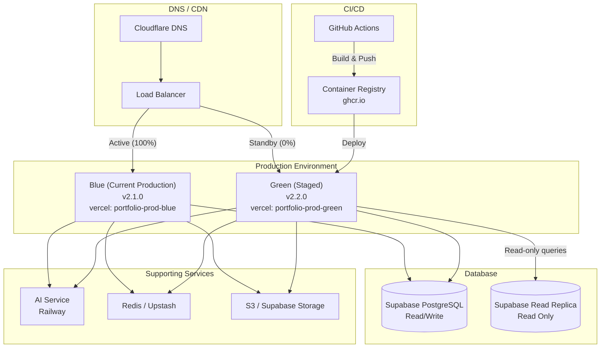

# Blue/Green Deployment Strategy — Zero-Downtime Deployments

> **Document:** `deployment-strategy-blue-green.md` | **Version:** 1.0 | **Last Updated:** July 2026
> **Status:** Proposed | **Owner:** DevOps Lead | **Review Cadence:** Quarterly
> **Related:** [25-CICD.md](./25-CICD.md) | [rollback-playbook.md](../playbooks/rollback-playbook.md) | [60-FEATURE-FLAGS.md](./60-FEATURE-FLAGS.md) | [54-INFRASTRUCTURE.md](./54-INFRASTRUCTURE.md)

---

## 1. Current State

### 1.1 Existing Deployment Architecture

The Portfolio platform currently uses **Vercel's default deployment model**: every push to `main` triggers a CI/CD pipeline that builds and deploys directly to production. During deployment:

- Vercel builds the Next.js application (web + API)
- Railway redeploys the AI service
- Supabase migrations run via CI/CD job
- Traffic cuts over when the new deployment is ready

**Limitations of the current approach:**

| Issue | Impact |
|-------|--------|
| No zero-downtime guarantee | Brief 503 during deployment cutover |
| No traffic splitting | Cannot canary-roll new versions |
| Rollback = redeploy old version | 3–5 minute rollback window |
| No pre-production validation on live infra | Bugs discovered post-deploy |
| Database migrations risk downtime | Schema changes may lock tables |

### 1.2 Why Blue/Green?

Blue/green deployment addresses these limitations by maintaining two identical production environments and switching traffic atomically:

- **Zero downtime** — traffic switches in under 30 seconds
- **Instant rollback** — switch back to the previous environment
- **Pre-production validation** — verify the new version on production infrastructure before serving traffic
- **Canary releases** — route a percentage of traffic to the new version before full switch

---

## 2. Target Architecture

### 2.1 Blue/Green Topology



### 2.2 Environment Definitions

| Property | Blue | Green |
|----------|------|-------|
| **Role** | Current production | Staged replacement |
| **Traffic** | 100% live traffic | 0% (verification only) |
| **Vercel Project** | `portfolio-prod-blue` | `portfolio-prod-green` |
| **Domain** | `portfolio.dev` | `green.portfolio.dev` |
| **Database** | Read/write access | Read/write access (same primary) |
| **AI Service** | Production instance | Production instance (shared) |
| **Redis** | Production instance | Production instance (shared) |

### 2.3 Database Strategy

Both environments share the same primary database. Read replicas are used during verification:

```
Blue ──► Primary DB (read/write)
Green ──► Primary DB (read/write, migrations only)
       ──► Read Replica (read-heavy verification queries)
```

**Critical rule:** Green runs database migrations *before* traffic switch, but only backward-compatible migrations are allowed (see §6).

---

## 3. Blue/Green Process

### 3.1 Standard Switch

```
    ┌──────────┐    ┌──────────┐    ┌──────────┐    ┌──────────┐
    │  Blue    │    │  Blue    │    │  Blue    │    │  Green   │
    │  Active  │    │  Active  │    │ Draining │    │  Active  │
    │  (live)  │    │  (live)  │    │  (0%)    │    │  (100%)  │
    └──────────┘    └──────────┘    └──────────┘    └──────────┘
    ┌──────────┐    ┌──────────┐    ┌──────────┐    ┌──────────┐
    │  Green   │    │  Green   │    │  Green   │    │  Blue    │
    │  Idle    │    │  Verify  │    │  Active  │    │  Standby │
    │          │    │  (5%)    │    │  (100%)  │    │          │
    └──────────┘    └──────────┘    └──────────┘    └──────────┘
    Phase 1         Phase 2         Phase 3         Phase 4
    Deploy Green    Canary verify   Full switch     Blue drained
```

### 3.2 Rollback Switch

```
    ┌──────────┐    ┌──────────┐
    │  Green   │    │  Blue    │
    │  Active  │    │  Active  │
    │  (live)  │    │  (100%)  │
    └──────────┘    └──────────┘
    ┌──────────┐    ┌──────────┐
    │  Blue    │    │  Green   │
    │  Standby │    │ Draining │
    └──────────┘    └──────────┘
    Phase 1         Phase 2
    Issue detected  Traffic switched back
    Rollback        Blue restored
    triggered
```

---

## 4. Deployment Flow

### 4.1 Complete Deployment Pipeline

```
1. Code Push
   │
   â–¼
2. CI Pipeline (GitHub Actions)
   ├── Lint & Typecheck ──► fail fast if quality gates fail
   ├── Unit & Integration Tests
   ├── Build Blue Docker Image (tag: blue-{sha})
   ├── Build Green Docker Image (tag: green-{sha})
   └── Push to ghcr.io
   │
   â–¼
3. Deploy Green Environment
   ├── Deploy web + API to Vercel project `portfolio-prod-green`
   ├── Run backward-compatible DB migrations
   ├── Deploy AI service (Railway, if changed)
   └── Run smoke tests against `green.portfolio.dev`
   │
   â–¼
4. Verification (Green)
   ├── Health check: all /health endpoints return 200
   ├── Smoke test: critical user flows pass
   ├── Canary: route 5% traffic to Green for 5 minutes
   ├── Metrics check: error rate, latency, throughput
   └── Manual approval gate (optional for non-critical releases)
   │
   â–¼
5. Traffic Switch
   ├── Update Cloudflare load balancer: Green = 100%
   └── Total switch time: <30 seconds (DNS TTL + LB propagation)
   │
   â–¼
6. Post-Switch Verification
   ├── Health check against production domain
   ├── Monitor error rates for 15 minutes
   ├── Run smoke tests against production
   └── Confirm alerting is functioning
   │
   â–¼
7. Drain Blue
   ├── Keep Blue running for 24 hours (rollback window)
   ├── After 24 hours, scale Blue to 0
   └── Blue becomes next deployment target
```

### 4.2 Switch Timing

| Step | Duration | Cumulative |
|------|----------|------------|
| CI pipeline | ~8 min | ~8 min |
| Deploy Green | ~3 min | ~11 min |
| Verification | ~10 min | ~21 min |
| Traffic switch | <30 sec | ~21.5 min |
| Post-switch monitoring | 15 min | ~36.5 min |
| **Total (no issues)** | **~37 min** | |

### 4.3 Key Properties

- **Total switch time:** <30 seconds (limited by Cloudflare TTL + load balancer propagation)
- **Rollback time:** <30 seconds (switch traffic back to Blue)
- **Zero-downtime guarantee:** Established when both environments are verified healthy
- **Observability:** All metrics, logs, and traces flow regardless of which environment is active

---

## 5. Vercel Implementation

### 5.1 Project Configuration

Vercel does not natively support blue/green deployments. We implement it using **two Vercel projects** and **Cloudflare load balancing**:

| Resource | Blue | Green |
|----------|------|-------|
| Vercel Project | `portfolio-prod-blue` | `portfolio-prod-green` |
| Production Domain | `blue.portfolio.dev` | `green.portfolio.dev` |
| Vercel Environment | Production | Production |
| Build Command | `npm run build` | `npm run build` |
| Output Dir | `.next` | `.next` |

### 5.2 Cloudflare Configuration

```
Load Balancer:
  - Hostname: portfolio.dev
  - Pool: Blue Pool (blue.portfolio.dev, weight 100)
          Green Pool (green.portfolio.dev, weight 0)
  - Health check: GET /api/health/liveness (interval: 30s, threshold: 3)
  - Steering: Random
  - TTL: 120s

During switch:
  1. API call: Update pool weights to 50/50
  2. Wait 30s for propagation
  3. API call: Update pool weights to 0/100
  4. Wait 30s for propagation
```

### 5.3 Vercel CLI Commands

```bash
# Deploy to Green
cd apps/web
vercel --prod --scope portfolio --project portfolio-prod-green

# Promote Green deployment to production
vercel promote <deployment-id> --scope portfolio

# List deployments
vercel list --scope portfolio --project portfolio-prod-green
```

---

## 6. Database Migrations

### 6.1 Backward-Compatible Migration Rule

**All database migrations must be backward-compatible.** This means the schema at any point must work with both the old (Blue) and new (Green) application code.

| ✅ Allowed | ❌ Not Allowed |
|-----------|---------------|
| Adding a nullable column | Dropping a column |
| Adding a table | Renaming a column |
| Creating an index | Adding a NOT NULL column without default |
| Adding an enum value | Removing an enum value |
| Expanding a column type | Contracting a column type |

### 6.2 Expand-Contract Pattern

For non-trivial schema changes, use the expand-contract pattern across multiple deployments:

```
Deploy 1 (Expand):
  - Add new column `display_name` (nullable)
  - Backfill `display_name` from `name`
  - Update application to prefer `display_name`
  - Deploy to Green → verify → switch to Green

Deploy 2 (Contract):
  - Remove reads from `name`
  - Drop `name` column
  - Deploy to Green → verify → switch to Green
```

### 6.3 Migration Execution Order

```
1. Run schema migrations on the shared database
   (Green and Blue both connect to the same primary DB)

2. Green starts using new schema features
   Blue continues using old schema (must be compatible)

3. After traffic switch, Blue is drained
   Blue still references old columns — they must still exist

4. After 24h (rollback window), Blue is torn down
   Only then can cleanup migrations run (contract phase)
```

### 6.4 Read Replica for Green Verification

During the verification phase, Green uses a Supabase read replica for heavy read queries to avoid impacting Blue's production traffic:

```bash
# Configure Green to use read replica for SELECT queries
DATABASE_URL=<primary-db-url>          # writes
DATABASE_REPLICA_URL=<read-replica-url> # reads

# Verify replica lag
psql "$DATABASE_REPLICA_URL" -c "SELECT now() - pg_last_xact_replay_timestamp() AS replica_lag;"
```

---

## 7. Feature Flags

### 7.1 Gating New Features During Switch

Use the existing `FeatureFlagService` (defined in `apps/api/src/modules/feature-flags/`) to gate functionality that should only activate after a successful switch:

| Flag | Purpose | Auto-enabled on switch |
|------|---------|----------------------|
| `blue-green-migration-complete` | Gates new code paths that depend on migration | Yes |
| `new-homepage-layout` | Experimental layout in new build | Manual |
| `ai-chat-v2` | Updated AI chat implementation | Manual |

### 7.2 Automated Flag Toggle

The deployment pipeline can toggle flags automatically after traffic switch:

```typescript
// After successful switch, enable the migration flag
POST /api/admin/feature-flags/blue-green-migration-complete
{
  "isEnabled": true,
  "rolloutPercentage": 100,
  "description": "Blue/green switch completed. New code paths active."
}
```

### 7.3 Kill Switch Pattern

If the new version has a bug that wasn't caught during verification, use feature flags to disable specific features without rolling back:

```typescript
// In application code
if (await this.featureFlagsService.isEnabled('ai-chat-v2')) {
  // new AI chat implementation
} else {
  // fall back to v1 implementation
}
```

---

## 8. Verification Steps

### 8.1 Pre-Switch Verification Checklist

The following checks run automatically after Green is deployed:

```
Phase 1: Health Checks
  [ ] API liveness: GET /api/health/liveness → 200
  [ ] API readiness: GET /api/health/readiness → 200 (db: true, redis: true)
  [ ] Web homepage: GET / → 200 HTML
  [ ] AI health: GET /health → 200
  [ ] Database connectivity: Prisma migration status → up-to-date

Phase 2: Smoke Tests
  [ ] User login flow — OAuth redirect + JWT issuance
  [ ] Portfolio page render — project listing + detail
  [ ] Contact form submission — POST + DB verification
  [ ] Blog search — full-text query returns results
  [ ] AI chat — message send + response receive
  [ ] 3D scene — WebGL context loads without error

Phase 3: Canary Verification (5% traffic for 5 minutes)
  [ ] Error rate: < 0.1% increase from baseline
  [ ] P95 latency: < 200ms increase from baseline
  [ ] Throughput: no degradation in requests/sec
  [ ] Active users: no drop in concurrent sessions
  [ ] Revenue events: no drop in conversion rate

Phase 4: Post-Switch Verification
  [ ] Production domain resolves to Green
  [ ] All health checks pass on production domain
  [ ] Error rate stable for 5 minutes post-switch
  [ ] Alerting is still firing correctly
```

### 8.2 Canary Metric Thresholds

| Metric | Warning | Fail | Action |
|--------|---------|------|--------|
| Error rate increase | >0.5% | >2% | Abort switch |
| P95 latency increase | >500ms | >1000ms | Abort switch |
| 5xx rate | >1% | >5% | Abort switch |
| Throughput drop | >10% | >25% | Abort switch |
| Active users | Drop >5% | Drop >15% | Abort switch |

---

## 9. Rollback Procedure

### 9.1 When to Roll Back

| Trigger | Action |
|---------|--------|
| Error rate increase > 2% during canary | Stop canary, do not switch |
| Error rate increase > 2% after switch | Roll back immediately |
| Database migration failure | Stop deployment, fix migration |
| Security vulnerability discovered | Roll back immediately |
| Critical feature broken in smoke tests | Do not switch |

### 9.2 Rollback Steps

```bash
# Step 1: Switch traffic back to Blue
# Update Cloudflare load balancer pool weights
# Green → 0%, Blue → 100%

# Step 2: Revert database migration (if applied)
cd apps/api
npx prisma migrate resolve --rolled-back <migration-name>

# Step 3: Verify Blue is healthy
curl https://portfolio.dev/api/health/liveness
curl https://portfolio.dev/api/health/readiness

# Step 4: Notify team
# Post in #ops-incident
```

### 9.3 Rollback Timing

| Step | Duration |
|------|----------|
| Cloudflare LB update | <30 seconds |
| DB migration revert | 1–5 minutes |
| Health verification | 1 minute |
| **Total rollback time** | **<6 minutes** |

### 9.4 Blue Retention Policy

| Duration | Retention |
|----------|-----------|
| 0–24 hours | Full environment running |
| 24–72 hours | Environment paused, container images retained |
| 72+ hours | Environment destroyed, images in registry |

---

## 10. Monitoring During Switch

### 10.1 Real-Time Dashboard

During the traffic switch, the on-call engineer monitors the following:

```
┌─────────────────────────────────────────────────────────────┐
│                    DEPLOYMENT DASHBOARD                      │
├──────────────┬──────────────┬──────────────┬────────────────┤
│ Error Rate   │ P95 Latency  │ Throughput   │ Active Users   │
│ Current: 0.2%│ Current: 180 │ Current: 42  │ Current: 127   │
│ Baseline:0.1%│ Baseline:150 │ Baseline: 38 │ Baseline: 121  │
│ Status: ✅   │ Status: ✅   │ Status: ✅   │ Status: ✅     │
├──────────────┴──────────────┴──────────────┴────────────────┤
│ Alert Log                                                    │
│ [12:00] Green deployed                                       │
│ [12:02] Smoke tests passed                                   │
│ [12:05] Canary started (5% traffic)                          │
│ [12:10] Canary metrics healthy → proceeding                  │
│ [12:11] Traffic switch initiated                             │
│ [12:12] Switch complete                                      │
│ [12:27] Post-switch monitoring: all clear                    │
└──────────────────────────────────────────────────────────────┘
```

### 10.2 Key Metrics

| Metric | Source | Expected | Action Threshold |
|--------|--------|----------|------------------|
| Error rate (5xx) | Vercel Analytics | <0.1% | >2% |
| API response time (P95) | Sentry Performance | <200ms | >1000ms |
| Requests per second | Cloudflare Analytics | Baseline ±10% | >25% drop |
| Active WebSocket connections | Railway | Baseline ±5% | >15% drop |
| Database CPU | Supabase Dashboard | <60% | >80% |
| Database connection count | Supabase Dashboard | <50 | >80 |
| Memory usage (Green) | Vercel Dashboard | <512MB | >1GB |

### 10.3 Alert Rules During Switch

| Condition | Action |
|-----------|--------|
| Error rate > 2% for 30 seconds | Auto-abort switch, roll back |
| P95 latency > 1s for 60 seconds | Notify on-call |
| Database CPU > 80% for 120 seconds | Notify on-call |
| Any health check fails | Auto-abort switch |

---

## 11. Operational Runbook

### 11.1 Performing a Blue/Green Deploy

```bash
# 1. Trigger deployment
git push origin main

# 2. Monitor CI pipeline (GitHub Actions)
# Wait for: Build → Test → Deploy to Green

# 3. Verify Green
curl -s https://green.portfolio.dev/api/health/liveness | jq .
curl -s https://green.portfolio.dev/api/health/readiness | jq .

# 4. Run smoke tests
npm run test:smoke -- --base-url https://green.portfolio.dev

# 5. Initiate canary (5% traffic)
# Cloudflare Dashboard → Load Balancer → Update pool weights
# Green: 5, Blue: 95

# 6. Monitor canary metrics (5 minutes)
# Dashboards: Vercel Analytics, Sentry, Better Uptime

# 7. Full switch
# Cloudflare Dashboard → Load Balancer → Update pool weights
# Green: 100, Blue: 0

# 8. Post-switch monitoring (15 minutes)
# Verify all dashboards show green metrics

# 9. Announce deployment
# Post in #ops-deployments
```

### 11.2 Rollback a Blue/Green Deploy

```bash
# 1. Switch traffic back to Blue
# Cloudflare Dashboard → Load Balancer → Update pool weights
# Blue: 100, Green: 0

# 2. Revert database migration (if needed)
cd apps/api
npx prisma migrate resolve --rolled-back <migration-name>

# 3. Verify Blue is healthy
curl -s https://portfolio.dev/api/health/liveness | jq .
curl -s https://portfolio.dev/api/health/readiness | jq .

# 4. Post-mortem
# Create incident, document root cause
```

---

## 12. Risk Analysis

| Risk | Likelihood | Impact | Mitigation |
|------|-----------|--------|------------|
| Database migration incompatible | Low | Critical | Expand-contract pattern, automated compatibility checks |
| Traffic switch partial failure | Low | High | Automated rollback on failed health check |
| Green environment misconfigured | Medium | Medium | Infrastructure-as-code, environment parity |
| Canary metrics misleading | Low | Low | 5-minute canary window, multiple metric thresholds |
| Cloudflare LB propagation delay | Low | Low | 120s TTL, verify propagation before Green drain |

---

## 13. Phased Rollout Plan

| Phase | Scope | Timeline |
|-------|-------|----------|
| **Phase 1** | Manual blue/green with Cloudflare LB | Month 1 |
| **Phase 2** | Automated pipeline integration | Month 2 |
| **Phase 3** | Canary releases with automatic rollback | Month 3 |
| **Phase 4** | Multi-region blue/green | Month 6 |

---

*Document Version: 1.0 — Blue/Green Deployment Strategy*
*Last Updated: July 2026*
*Next Review Date: October 2026*

## Cross-References
- [../MASTER-INDEX.md](../MASTER-INDEX.md) — Documentation master index
- [../26-reference/CROSS-REFERENCE-INDEX.md](../26-reference/CROSS-REFERENCE-INDEX.md) — Cross-reference system