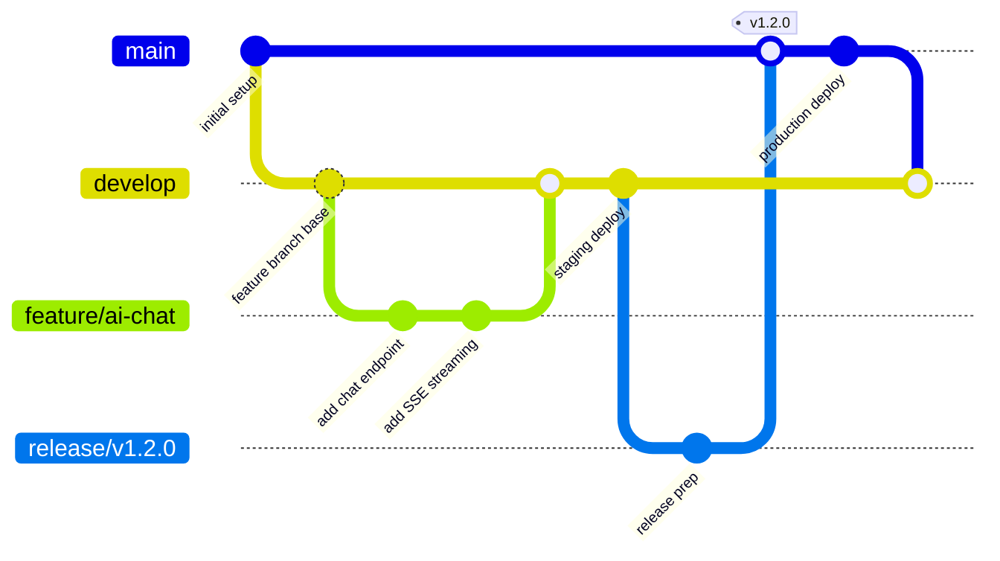
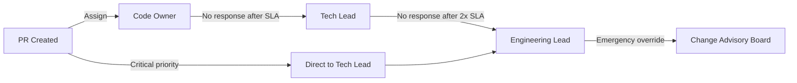
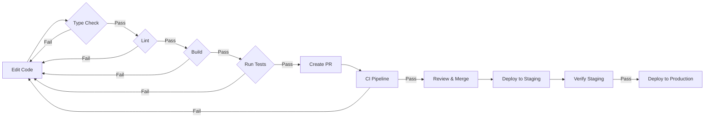
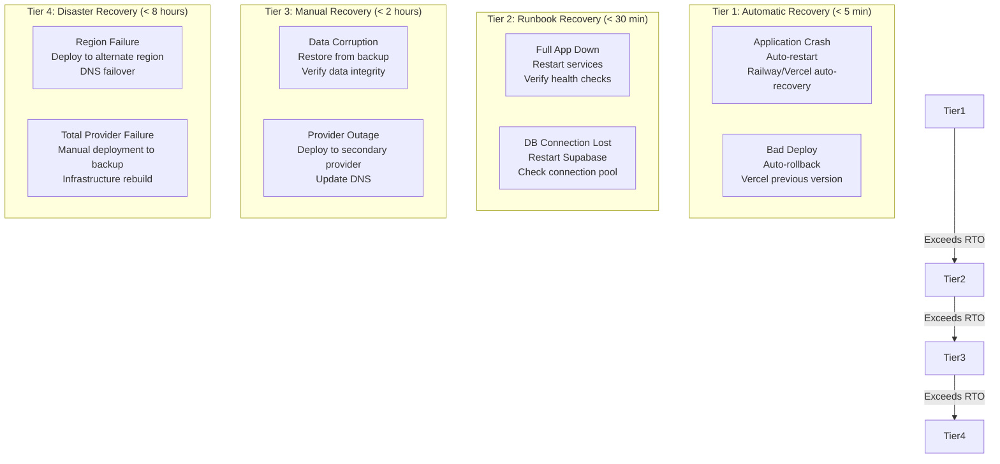
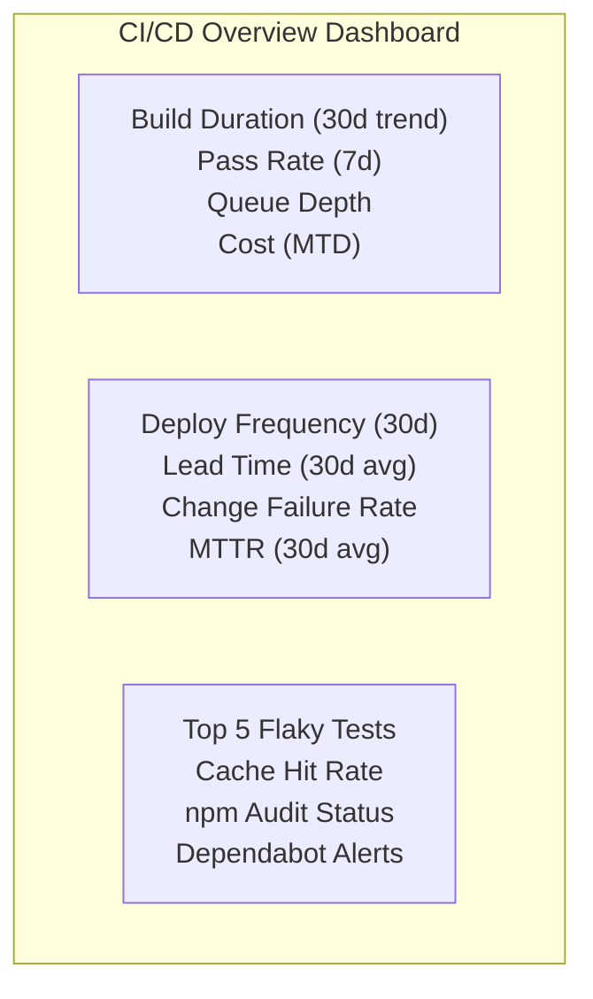

# DevOps Architecture — FAANG Enterprise-Grade DevOps Strategy

> **Document:** `DevOpsArchitecture.md` | **Version:** 5.0 (Enterprise Upgrade) | **Last Updated:** July 2026  
> **Status:** ✅ Active | **Owner:** Principal DevOps Architect | **Review Cadence:** Quarterly  
> **Standard:** GitOps | **Build System:** Turborepo v2 | **CI/CD:** GitHub Actions | **Infra as Code:** Docker Compose
> **Providers:** Vercel, Railway, Supabase, Cloudflare | **Environment Model:** 4-Tier (Dev → Testing → Staging → Production)

---

## 1. Executive Summary

The platform follows **GitOps-driven DevOps** — every push to `main` triggers automated quality gates and deployment. The monorepo (Turborepo + npm workspaces) orchestrates **3 apps across 4 hosting providers** (Vercel, Railway, Supabase, **Cloudflare**) with zero-touch deployment, using a **4-environment model** (Development → Testing → Staging → Production).

**13 Key DevOps Capabilities:**

| #   | Capability                   | Tool                                  | SLA                       |
| --- | ---------------------------- | ------------------------------------- | ------------------------- |
| 1   | Monorepo build orchestration | Turborepo w/ remote caching           | < 5 min full build        |
| 2   | Dependency management        | npm workspaces + lockfile             | 100% deterministic        |
| 3   | Quality gates                | ESLint + TypeScript + Tests           | Gates block deploy        |
| 4   | CI automation                | GitHub Actions                        | < 10 min pipeline         |
| 5   | CD automation                | Vercel + Railway auto-deploy          | < 3 min deploy            |
| 6   | Infrastructure as Code       | Docker Compose + railway.toml         | Local ↔ Prod parity |
| 7   | Secret management            | Vercel/Railway env vars               | 90-day rotation           |
| 8   | Environment management       | 4-tier (dev/test/staging/prod)        | Isolated per environment  |
| 9   | Release management           | Semantic versioning + release notes   | Every main merge          |
| 10  | Monitoring & alerting        | Sentry + Better Uptime + Telegram     | < 15 min response         |
| 11  | Edge security & CDN          | Cloudflare (DNS, WAF, SSL, CDN)       | 100% uptime               |
| 12  | Cost tracking                | Provider dashboards + custom tracking | < $15/mo                  |
| 13  | Incident response            | Runbooks + automated recovery         | < 1 hour RTO              |

---

## 2. DevOps Principles

| Principle                         | Description                               | Implementation                            |
| --------------------------------- | ----------------------------------------- | ----------------------------------------- |
| **Automate everything**           | No manual steps from commit to production | GitHub Actions automated pipeline         |
| **Build once, deploy everywhere** | Deterministic builds from lockfile        | `npm ci` + Turborepo caching              |
| **Environment parity**            | Dev/staging/prod as identical as possible | Docker Compose local = Railway production |
| **Fail fast**                     | Break the build on lint/type errors       | CI gates block PR merge                   |
| **Observable by default**         | Every deploy is logged and monitored      | Sentry + Better Uptime + Telegram         |
| **Recovery > Prevention**         | Automated recovery runbooks               | Railway auto-restart, Vercel rollback     |
| **Cost-conscious**                | Every tool has a free tier or budget      | $10/mo hard cap on all services           |
| **Security-first**                | Secrets never in code, least privilege    | Vaulted secrets, scoped tokens            |

---

## 3. Toolchain

### 3.1 DevOps Tool Inventory

| Category             | Tool                   | Version | Purpose                               | Free Tier Limit               |
| -------------------- | ---------------------- | ------- | ------------------------------------- | ----------------------------- |
| **Version Control**  | GitHub                 | — | Source control, PRs, code review      | Unlimited (public)            |
| **Package Manager**  | npm                    | 10.x    | Dependency management                 | —                       |
| **Build System**     | Turborepo              | 2.x     | Monorepo build orchestration, caching | Unlimited                     |
| **Linter**           | ESLint                 | 8.x     | Code quality, security rules          | —                       |
| **Formatter**        | Prettier               | 3.x     | Code formatting                       | —                       |
| **Type Checker**     | TypeScript             | 5.x     | Static type checking                  | —                       |
| **CI/CD**            | GitHub Actions         | — | Pipeline automation                   | 2,000 min/mo (public)         |
| **CD (Frontend)**    | Vercel                 | — | Serverless deployment                 | 100GB bandwidth, 6K build min |
| **CD (AI)**          | Railway                | — | Container deployment                  | $5 credit                     |
| **DNS**              | Cloudflare             | — | Authoritative DNS, DNSSEC             | Unlimited                     |
| **CDN**              | Cloudflare             | — | Global CDN, 330+ PoPs                 | Unlimited bandwidth           |
| **DDoS Protection**  | Cloudflare WAF         | — | L3-L7 DDoS, bot management            | Unlimited                     |
| **SSL/TLS**          | Cloudflare             | — | Auto cert management, Full Strict     | Unlimited                     |
| **Edge Workers**     | Cloudflare Workers     | — | Edge compute, URL rewrites            | 100K req/day                  |
| **Containerization** | Docker Compose         | 3.x     | Local dev parity                      | Unlimited                     |
| **Dependency Audit** | Dependabot             | — | Automated vulnerability PRs           | Unlimited                     |
| **Secret Scanning**  | GitHub Secret Scanning | — | Credential leak detection             | Unlimited                     |
| **Feature Flags**    | PostHog                | — | Gradual rollouts, A/B testing         | 1M events/mo                  |
| **Release Notes**    | Release Please         | — | Auto-generated changelogs             | Unlimited                     |
| **Monitoring**       | Better Uptime          | — | External uptime monitoring            | 5-min checks free             |
| **Error Tracking**   | Sentry                 | — | Error aggregation, performance traces | 5K events/mo                  |
| **Analytics**        | PostHog                | — | Product analytics, session replay     | 1M events/mo                  |

### 3.2 Developer Workstation Requirements

```bash
# Minimum requirements
Node.js >= 20.0.0
npm >= 10.0.0
Git >= 2.40
Docker Desktop >= 4.25 (for local Supabase + AI service)
Visual Studio Code (recommended)
  - Extensions: ESLint, Prettier, Tailwind CSS IntelliSense, Docker
```

---

## 4. Environment Strategy

### 4.1 Four-Tier Environment Architecture

The platform uses a strict **4-tier environment model** with clear promotion gates between tiers. Each environment is fully isolated with its own database, secrets, and configuration. The **Testing** tier is an ephemeral CI environment that validates code before it reaches the persistent Staging environment.

```mermaid
graph TB
    subgraph "Development"
        Local["💻 Local Dev<br/>localhost:3000<br/>Docker Compose"]
        Feature["🌿 Feature Branch<br/>Vercel Preview<br/>Ephemeral DB"]
    end

    subgraph "Testing (CI)"
        Test["🧪 Testing Environment<br/>Ephemeral per CI run<br/>Quality Gates<br/>SQLite in-memory DB"]
    end

    subgraph "Staging"
        Staging["🧪 Staging<br/>staging.portfolio.com<br/>Staging DB (anonymized)"]
    end

    subgraph "Production"
        Prod["🚀 Production<br/>portfolio.com<br/>Production DB<br/>Cloudflare Edge"]
    end

    Local -->|git push feature| Feature
    Feature -->|PR Created| Test
    Test -->|CI passes| Gate1
    Gate1 -->|Merge to develop| Staging
    Staging -->|Release PR to main| Prod

    subgraph "Gates"
        Gate1["🔒 PR Gate<br/>CI passes<br/>Review approved<br/>No conflicts"]
        Gate2["🔒 Staging Gate<br/>Deploy succeeds<br/>Health checks pass<br/>Smoke tests pass"]
        Gate3["🔒 Production Gate<br/>Release approved<br/>Deploy window open<br/>Rollback ready"]
    end

    Feature --> Gate1
    Staging --> Gate2
    Gate2 -->|Auto-promote| Gate3
    Gate3 --> Prod
```

### 4.2 Environment Matrix

| Aspect               | Development             | Testing (CI)             | Staging                        | Production                     |
| -------------------- | ----------------------- | ------------------------ | ------------------------------ | ------------------------------ |
| **URL**              | `localhost:3000`        | CI pipeline internal     | `staging.portfolioowner.com`   | `portfolioowner.com`           |
| **Lifespan**         | Persistent              | Ephemeral (per CI run)   | Persistent                     | Persistent                     |
| **Git Branch**       | Feature/develop         | PR branches              | `develop`                      | `main`                         |
| **Deploy Trigger**   | Manual / git push       | PR creation              | Auto on push to `develop`      | Auto on push to `main`         |
| **Database**         | Local Supabase (Docker) | SQLite in-memory         | Supabase separate project      | Supabase separate project      |
| **Data**             | Seed data (10 records)  | Fresh seed per run       | Anonymized production copy     | Live data                      |
| **AI Service**       | Docker local            | Mock (fixture responses) | Railway staging                | Railway production             |
| **DNS + CDN + SSL**  | None                    | None                     | Cloudflare (full stack)        | Cloudflare (full stack)        |
| **Analytics**        | PostHog dev project     | Disabled                 | PostHog staging                | PostHog production             |
| **Error Tracking**   | Sentry (disabled)       | Disabled                 | Sentry (staging DSN)           | Sentry (production DSN)        |
| **Email**            | Resend (test mode)      | Mock (no sends)          | Resend (test mode)             | Resend (production)            |
| **ISR Cache**        | Disabled                | Disabled                 | 60s TTL                        | 60s TTL                        |
| **CDN**              | None                    | None                     | Cloudflare + Vercel dual-layer | Cloudflare + Vercel dual-layer |
| **Debug Mode**       | Enabled                 | Enabled (verbose)        | Disabled                       | Disabled                       |
| **Feature Flags**    | All enabled             | All enabled              | All enabled                    | Gradual rollout                |
| **Log Level**        | `debug`                 | `debug`                  | `info`                         | `warn`                         |
| **Backup Frequency** | None                    | None (ephemeral)         | Daily                          | Hourly + WAL continuous        |
| **SLA**              | None                    | None                     | 99.5%                          | 99.99%                         |

### 4.3 Environment Parity Requirements

| Dimension                 | Parity Target                    | Enforcement                                       | Exception                  |
| ------------------------- | -------------------------------- | ------------------------------------------------- | -------------------------- |
| **Node.js version**       | 100%                             | `.nvmrc` + CI `actions/setup-node`                | None                       |
| **npm version**           | 100%                             | `engines` field in `package.json`                 | None                       |
| **OS**                    | Linux (Ubuntu) for all non-local | Docker + GitHub Actions `ubuntu-latest`           | Local (macOS/Windows)      |
| **PostgreSQL version**    | 100%                             | Docker image `supabase/postgres:15`               | None                       |
| **Environment variables** | Complete                         | `.env.example` + CI secret injection              | Values differ per env      |
| **File system**           | Near-identical                   | Docker volumes + Supabase Storage abstraction     | Local temp files           |
| **DNS/CDN/SSL**           | 100%                             | Cloudflare across staging + production            | None (both use Cloudflare) |
| **Cloudflare config**     | 100%                             | Same WAF rules, cache rules across staging + prod | None                       |

### 4.4 Ephemeral Preview Environments

Every pull request automatically generates an **ephemeral preview environment** via Vercel:

| Feature                 | Capability                                  |
| ----------------------- | ------------------------------------------- |
| **Trigger**             | Automatic on PR creation                    |
| **URL**                 | `pr-{number}.portfolioowner.vercel.app`     |
| **Database**            | Shared staging DB (read) + local seed data  |
| **AI Service**          | Shared staging AI (rate-limited)            |
| **Lifetime**            | Auto-destroyed on PR close/merge            |
| **Password Protection** | Optional (enabled for sensitive features)   |
| **Commit Comments**     | Vercel bot posts preview URL on each commit |

---

## 5. Git Workflow

### 5.1 Branch Strategy



### 5.2 Branch Naming Convention

| Branch Pattern      | Example                   | Purpose               | Protected                  | Auto-Deploy            |
| ------------------- | ------------------------- | --------------------- | -------------------------- | ---------------------- |
| `main`              | `main`                    | Production-ready code | ✅ Required reviews   | ✅ To production  |
| `develop`           | `develop`                 | Integration branch    | ✅ Required reviews   | ✅ To staging     |
| `feature/<name>`    | `feature/ai-chat`         | New features          | ❌                      | ❌ (preview only)   |
| `fix/<name>`        | `fix/rate-limit-typo`     | Bug fixes             | ❌                      | ❌ (preview only)   |
| `chore/<name>`      | `chore/update-deps`       | Maintenance           | ❌                      | ❌ (preview only)   |
| `docs/<name>`       | `docs/mermaid-validation` | Documentation         | ❌                      | ❌                  |
| `release/<version>` | `release/v1.2.0`          | Release preparation   | ✅ Required reviews   | Preview only           |
| `hotfix/<name>`     | `hotfix/security-fix`     | Urgent production fix | ✅ Emergency approval | ✅ Direct to prod |

### 5.3 Commit Convention

```
<type>(<scope>): <description>

[optional body]

[optional footer: BREAKING CHANGE, Closes #123, etc.]
```

| Type       | Scope Examples               | Usage            | Included in Changelog |
| ---------- | ---------------------------- | ---------------- | --------------------- |
| `feat`     | `web`, `api`, `ai`, `shared` | New feature      | ✅ Yes           |
| `fix`      | `api`, `ai`                  | Bug fix          | ✅ Yes           |
| `chore`    | `deps`, `config`, `ci`       | Maintenance      | ❌ No              |
| `docs`     | `docs`                       | Documentation    | ❌ No              |
| `refactor` | `web`, `api`                 | Code restructure | ❌ No              |
| `style`    | `ui`                         | Formatting       | ❌ No              |
| `test`     | `web`, `api`                 | Tests            | ❌ No              |
| `perf`     | `web`, `api`                 | Performance      | ✅ Yes           |

### 5.4 Code Review Process

#### 5.4.1 PR Requirements

| Requirement                           | Automated Gate          | Approver   | SLA        |
| ------------------------------------- | ----------------------- | ---------- | ---------- |
| ✅ All CI checks pass            | Required (blocks merge) | —    | < 10 min   |
| ✅ No merge conflicts            | Required (blocks merge) | —    | Auto-check |
| ✅ At least 1 review             | Required                | Code owner | < 4 hours  |
| ✅ Linear history (squash merge) | Recommended             | —    | —    |
| ✅ Branch up to date with `main` | Required                | —    | Auto-check |
| ✅ No unresolved threads         | Required                | Reviewer   | < 24 hours |

#### 5.4.2 Reviewer Assignment Policy

| PR Type           | Primary Reviewer  | Secondary Reviewer | Fallback           |
| ----------------- | ----------------- | ------------------ | ------------------ |
| Frontend (`web/`) | Frontend Lead     | Senior Developer   | @team-frontend     |
| Backend (`api/`)  | Backend Lead      | Senior Developer   | @team-backend      |
| AI (`ai/`)        | AI Lead           | DevOps Lead        | @team-ai           |
| Infrastructure    | DevOps Lead       | Architecture Lead  | @devops-team       |
| Documentation     | Any team member   | Tech Writer        | @docs-team         |
| Cross-cutting     | Architecture Lead | All leads          | @engineering-leads |

#### 5.4.3 Review SLAs

| Priority                               | Response Time (First Review) | Approval Time (Total) | Escalation After |
| -------------------------------------- | ---------------------------- | --------------------- | ---------------- |
| 🔴 Critical (security, downtime) | < 1 hour                     | < 2 hours             | 2 hours          |
| 🟡 High (feature, bug fix)       | < 4 hours                    | < 8 hours             | 8 hours          |
| 🟢 Normal (chore, docs)          | < 24 hours                   | < 48 hours            | 48 hours         |
| ⚪ Low (cosmetic, minor)           | < 72 hours                   | < 1 week              | 1 week           |

#### 5.4.4 Escalation Path



---

## 6. Development Workflow

### 6.1 Local Development Setup

```bash
# 1. Clone and install
git clone <repo-url>
cd portfolio-monorepo
npm ci

# 2. Set up environment
cp .env.example .env.local
# Edit .env.local with your values

# 3. Start development
npm run dev --workspace=apps/web   # Frontend on :3000
npm run dev --workspace=apps/api   # API on :3001

# 4. Start AI service (Docker)
docker compose -f infrastructure/docker/docker-compose.yml up -d
```

### 6.2 Development Loop



### 6.3 Pre-commit Hooks

Configured via `husky` + `lint-staged`:

```json
{
  "husky": {
    "hooks": {
      "pre-commit": "lint-staged",
      "commit-msg": "commitlint -E HUSKY_GIT_PARAMS"
    }
  },
  "lint-staged": {
    "*.{ts,tsx}": ["eslint --fix", "prettier --write"],
    "*.{md,json}": ["prettier --write"]
  }
}
```

### 6.4 Dev Loop Performance

| Operation            | Target  | Tool                 |
| -------------------- | ------- | -------------------- |
| Hot reload (Next.js) | < 50ms  | Turbopack            |
| Hot reload (NestJS)  | < 200ms | `--watch` mode       |
| Hot reload (FastAPI) | < 1s    | Uvicorn `--reload`   |
| Test watch mode      | < 500ms | Jest `--watch`       |
| Lint on save         | < 100ms | ESLint editor plugin |

---

## 7. CI Strategy & Quality Gates

### 7.1 Pipeline Architecture

```mermaid
flowchart TB
    subgraph "Trigger"
        Push["git push"]
        PR["Pull Request"]
    end

    subgraph "Stage 1: Quality Gates"
        Install["npm ci<br/>2 min"]
        Lint["ESLint<br/>30s"]
        TypeCheck["TypeScript<br/>1 min"]
        Build["Turbo Build<br/>5 min"]
        Test["Jest Tests<br/>3 min"]
        Security["Security Scan<br/>npm audit<br/>30s"]
        Mermaid["Validate Mermaid<br/>30s"]
    end

    subgraph "Stage 2: Deploy"
        Vercel["Vercel Deploy<br/>Frontend + API"]
        Railway["Railway Deploy<br/>AI Service"]
        Supabase["DB Migrations<br/>supabase db push"]
    end

    subgraph "Stage 3: Verify"
        Health["Health Checks<br/>1 min"]
        Smoke["Smoke Tests<br/>3 min"]
        E2E["E2E Tests<br/>3 min"]
        Perf["Lighthouse CI<br/>2 min"]
    end

    Push --> Install
    PR --> Install
    Install --> Lint & TypeCheck & Build & Test & Security & Mermaid
    Lint & TypeCheck & Build & Test & Security & Mermaid -->|All Pass| Vercel & Railway & Supabase
    Lint & TypeCheck & Build & Test & Security & Mermaid -->|Any Fail| Fail["❌ Blocked - Fix Required"]
    Vercel & Railway & Supabase --> Health & Smoke & E2E & Perf
```



### 7.2 Quality Gate Matrix

| Gate            | Tool                    | Threshold                | Failure Action | Severity          | Scope        |
| --------------- | ----------------------- | ------------------------ | -------------- | ----------------- | ------------ |
| **Lint**        | ESLint                  | 0 errors, 0 warnings     | Block PR merge | 🔴 Critical | All apps     |
| **TypeScript**  | `tsc --noEmit`          | 0 errors (strict mode)   | Block PR merge | 🔴 Critical | All apps     |
| **Build**       | Turborepo               | All apps compile         | Block PR merge | 🔴 Critical | All apps     |
| **Tests**       | Jest                    | 100% pass, >80% coverage | Block PR merge | 🔴 Critical | Changed apps |
| **Security**    | `npm audit`             | 0 high/critical vulns    | Block PR merge | 🔴 Critical | Root         |
| **Mermaid**     | Custom script           | 100% diagrams valid      | Block PR merge | 🟡 Warning  | Docs         |
| **Bundle Size** | `@next/bundle-analyzer` | < 200KB first load JS    | Warning only   | 🟢 Info     | Web          |
| **Performance** | Lighthouse CI           | Score >= 90              | Warning only   | 🟢 Info     | Web          |
| **E2E**         | Playwright              | 100% pass                | Block deploy   | 🔴 Critical | All apps     |
| **Secrets**     | GitHub secret scanning  | 0 leaks detected         | Block push     | 🔴 Critical | Root         |

### 7.3 CI Pipeline Timing

| Stage     | Job              | Avg Time  | Parallel                       | Dependencies     |
| --------- | ---------------- | --------- | ------------------------------ | ---------------- |
| Setup     | `npm ci`         | 90s       | —                        | —          |
| Quality   | Lint             | 20s       | ✅ With all quality gates | Setup            |
| Quality   | TypeScript       | 45s       | ✅ With all quality gates | Setup            |
| Quality   | Build            | 3min      | —                        | Lint + TypeCheck |
| Quality   | Tests            | 2min      | ✅ With build             | Setup            |
| Quality   | Security audit   | 15s       | ✅ With build             | Setup            |
| Quality   | Mermaid validate | 10s       | ✅ With build             | Setup            |
| Deploy    | Vercel           | 2min      | ✅ With Railway           | Build            |
| Deploy    | Railway          | 3min      | ✅ With Vercel            | Build            |
| Deploy    | DB migration     | 30s       | ✅ With Vercel            | Build            |
| Verify    | Health checks    | 30s       | ✅ Smoke + E2E            | Deploy           |
| Verify    | Smoke tests      | 2min      | ✅ With health            | Deploy           |
| Verify    | E2E tests        | 3min      | ✅ With health            | Deploy           |
| **Total** |                  | **~8min** |                                |                  |

### 7.4 CI/CD Metrics Dashboard

| Metric                    | Target   | Instrumentation           | Visualization         |
| ------------------------- | -------- | ------------------------- | --------------------- |
| Pipeline pass rate        | > 95%    | GitHub Actions API        | Weekly trend chart    |
| Pipeline duration (p95)   | < 10 min | GitHub Actions timing     | 30-day rolling avg    |
| Build time (cached)       | < 30s    | Turborepo cache stats     | Per-branch comparison |
| Flaky test rate           | < 1%     | Jest `--flaky-detector`   | Trending dashboard    |
| Queue wait time           | < 30s    | GitHub Actions queue      | Peak hour analysis    |
| Deploy success rate       | > 99%    | Health check logging      | Per-service breakdown |
| Rollback frequency        | < 5%     | GitHub Actions deploy log | Per-release tracking  |
| Time from merge to deploy | < 5 min  | Pipeline timestamps       | Histogram             |

### 7.5 Pipeline Optimization History

| Date     | Change                             | Before            | After         | Impact                 |
| -------- | ---------------------------------- | ----------------- | ------------- | ---------------------- |
| Jun 2026 | Added Mermaid validation gate      | —           | +10s          | Documentation quality  |
| Jun 2026 | Parallelized lint, typecheck, test | 10 min            | 8 min         | -20% pipeline time     |
| Jun 2026 | Added npm caching                  | 11 min            | 10 min        | -9% pipeline time      |
| Jun 2026 | Added CI metrics dashboard         | —           | —       | Visibility into trends |
| Apr 2026 | Switched to `npm ci`               | Non-deterministic | Deterministic | Reproducible builds    |
| Mar 2026 | Initial GitHub Actions setup       | —           | 15 min        | Baseline               |

---

## 8. CD & Release Strategy

### 8.1 Semantic Versioning

The project follows **Semantic Versioning 2.0.0**:

```
vMAJOR.MINOR.PATCH
```

| Component      | Increment When                              | Example         | Release Type            |
| -------------- | ------------------------------------------- | --------------- | ----------------------- |
| **MAJOR**      | Breaking API/DB changes, framework upgrades | `v2.0.0`        | 🚀 Major release |
| **MINOR**      | New features, non-breaking additions        | `v1.3.0`        | ✨ Feature release  |
| **PATCH**      | Bug fixes, performance improvements         | `v1.2.1`        | 🐛 Patch release  |
| **PRERELEASE** | Alpha/beta/rc builds                        | `v1.3.0-beta.1` | 🧪 Pre-release    |

### 8.2 Release Cadence

| Release Type       | Frequency                     | Process                                                        | Approval       |
| ------------------ | ----------------------------- | -------------------------------------------------------------- | -------------- |
| 🐛 Patch     | As needed (avg 1-2/week)      | Automated hotfix → main                                 | Single review  |
| ✨ Feature     | Weekly (Friday deploy freeze) | Release branch → staging → main                  | Tech lead + QA |
| 🚀 Major    | Monthly                       | Feature freeze → RC → staging (3d) → prod | Full CAB       |
| 🔴 Emergency | Immediate                     | Hotfix branch → expedited review → deploy        | Emergency CAB  |

### 8.3 Release Process Flow

```mermaid
flowchart TB
    subgraph "Feature Complete"
        Develop["develop branch<br/>All features merged"]
    end

    subgraph "Release Preparation"
        Branch["Create release/vX.Y.Z"]
        Notes["Generate Release Notes<br/>Release Please"]
        Staging["Deploy to Staging"]
        Verify["Verify in Staging<br/>Smoke + E2E tests"]
    end

    subgraph "Release Approval"
        QA["QA Review<br/>Regression testing"]
        PO["Product Owner Approval"]
        CAB["Change Advisory Board<br/>(Major releases only)"]
    end

    subgraph "Deployment"
        Tag["Create Git Tag<br/>git tag vX.Y.Z"]
        Prod["Deploy to Production"]
        Monitor["Monitor (30 min)<br/>Error rate < baseline"]
    end

    subgraph "Post-Release"
        NotesPub["Publish Release Notes"]
        Announce["Announce in #releases"]
        MergeBack["Merge release → develop"]
    end

    Develop --> Branch
    Branch --> Notes --> Staging --> Verify
    Verify --> QA --> PO
    PO -->|Major?| CAB
    PO -->|Minor/Patch| Tag
    CAB -->|Approved| Tag
    CAB -->|Rejected| Branch
    Tag --> Prod --> Monitor
    Monitor -->|Pass| NotesPub & Announce & MergeBack
    Monitor -->|Fail| Rollback["Rollback Procedure<br/>§10.2"]
```



### 8.4 Release Notes Automation

Release notes are auto-generated using **Release Please** (Google's automated release tooling):

```yaml
# .github/workflows/release-please.yml
name: Release Please
on:
  push:
    branches: [main]

jobs:
  release-please:
    runs-on: ubuntu-latest
    steps:
      - uses: google-github-actions/release-please-action@v4
        with:
          release-type: node
          package-name: portfolio-monorepo
          changelog-types: >
            [{"type":"feat","section":"Features","hidden":false},
             {"type":"fix","section":"Bug Fixes","hidden":false},
             {"type":"perf","section":"Performance Improvements","hidden":false},
             {"type":"chore","section":"Miscellaneous","hidden":true}]
```

Generated release notes include:

- **Features** (from `feat:` commits)
- **Bug Fixes** (from `fix:` commits)
- **Performance Improvements** (from `perf:` commits)
- **Breaking Changes** (from commits with `BREAKING CHANGE:` footer)
- **Full Changelog** link to compare view

### 8.5 Feature Flags / Toggles

| Flag Name                  | Purpose                  | Owner           | Rollout Strategy                            | Max Duration |
| -------------------------- | ------------------------ | --------------- | ------------------------------------------- | ------------ |
| `hero-cta-variant`         | A/B test CTA button text | Frontend Lead   | 50/50 split                                 | 14 days      |
| `ai-chat-v2`               | New chat model           | AI Lead         | 10% → 25% → 50% → 100% | 7 days       |
| `admin-dashboard-redesign` | New admin layout         | Full-stack Lead | Internal only → 10% → 100%    | 14 days      |
| `new-contact-form`         | Updated form validation  | Backend Lead    | 5% → 50% → 100%               | 7 days       |

**Flag Lifecycle:**

```
Create → Enable (internal) → Enable (canary) → Enable (gradual) → Full rollout → Remove flag
```

### 8.6 Canary Releases

For high-risk changes, a **canary release** strategy is used:

| Stage        | Audience      | Duration | Success Criteria                     | Rollback Trigger      |
| ------------ | ------------- | -------- | ------------------------------------ | --------------------- |
| **Internal** | Dev team only | 1 hour   | No errors, all features work         | Any error             |
| **5%**       | 5% of users   | 2 hours  | Error rate < 0.1%, no p95 regression | Error rate > 0.5%     |
| **25%**      | 25% of users  | 4 hours  | Error rate < baseline                | Error rate > baseline |
| **50%**      | 50% of users  | 4 hours  | All metrics stable                   | Any metric degrades   |
| **100%**     | All users     | —  | —                              | —               |

---

## 9. Deployment Approval Process

### 9.1 Approval Gates by Environment

| Environment            | Gate Type             | Approver(s)     | Automatic?                          | Conditions                        |
| ---------------------- | --------------------- | --------------- | ----------------------------------- | --------------------------------- |
| **Preview**            | None                  | —         | ✅ Auto                        | CI passes                         |
| **Staging**            | Code review           | Code owner      | ✅ Auto after merge to develop | CI passes + review approved       |
| **Production**         | Release approval      | Tech Lead + PO  | 🟡 Semi-auto                  | CI passes + all tests pass        |
| **Production (Major)** | Change Advisory Board | CAB (3 members) | ❌ Manual                        | Full regression + security review |

### 9.2 Change Advisory Board (CAB)

| Role         | Member            | Voting Power          |
| ------------ | ----------------- | --------------------- |
| **Chair**    | DevOps Lead       | Tiebreaker            |
| **Member**   | Architecture Lead | 1 vote                |
| **Member**   | Product Owner     | 1 vote                |
| **Convener** | Release Manager   | Non-voting            |
| **Optional** | QA Lead           | Non-voting (advisory) |

**CAB convened for:** Major releases, infrastructure changes, security-sensitive deployments, database schema changes requiring migration.

### 9.3 Deployment Windows

| Environment            | Window              | Blackout Periods              | Emergency Override |
| ---------------------- | ------------------- | ----------------------------- | ------------------ |
| **Staging**            | Mon-Fri 08:00-20:00 | Weekends, holidays            | On-call engineer   |
| **Production**         | Mon-Thu 09:00-16:00 | Fri 16:00-Mon 09:00, holidays | DevOps Lead + PO   |
| **Production (Major)** | Tue-Wed 10:00-14:00 | Week before major events      | Full CAB vote      |

### 9.4 Change Types & Approval Paths

| Change Type   | Definition                             | Approval Path                             | Deploy Window        |
| ------------- | -------------------------------------- | ----------------------------------------- | -------------------- |
| **Standard**  | Bug fixes, routine updates             | Code review → auto-deploy          | Any window           |
| **Normal**    | New features, minor improvements       | Code review → PO approval          | Production window    |
| **Major**     | Architecture changes, breaking changes | Code review → CAB approval         | Major release window |
| **Emergency** | Security patches, outage fixes         | Emergency CAB → post-deploy review | Any time             |
| **Trivial**   | Documentation, CI config, dependencies | Single review → auto-deploy        | Any window           |

### 9.5 Emergency Change Process

```mermaid
flowchart TB
    Incident["🚨 Incident Detected<br/>Production outage / Security vuln"]

    EMG["Emergency Change Request<br/>Filed within 15 min"]

    Approval{"Emergency CAB<br/>Available?"}

    Deploy["Deploy Fix Immediately<br/>Hotfix branch → main"]

    Post["Post-Deploy Review<br/>Within 24 hours"]

    Incident --> EMG
    EMG -->|Contact CAB chair| Approval
    Approval -->|Yes - verbal approval| Deploy
    Approval -->|No - assume approval| Deploy
    Deploy --> Post
    Post --> Remediate["Remediate Root Cause<br/>Update runbooks"]
```



---

## 10. Infrastructure as Code

### 10.1 Docker Compose (Local Development)

```yaml
# infrastructure/docker/docker-compose.yml
version: '3.8'
services:
  supabase:
    image: supabase/supabase-local:v1.0
    ports:
      - '54321:54321' # PostgreSQL
      - '54323:54323' # Studio
    volumes:
      - supabase-data:/var/lib/postgresql/data

  ai-service:
    build:
      context: ../../apps/ai
      dockerfile: Dockerfile
    ports:
      - '8000:8000'
    env_file: ../../apps/ai/.env.local
    depends_on:
      - supabase

volumes:
  supabase-data:
```

### 10.2 Railway Configuration

```toml
# apps/ai/railway.toml
[service]
name = "ai-service"
healthcheckPath = "/api/health"
healthcheckTimeout = 30
restartPolicy = "always"

[deploy]
restartPolicyType = "on-failure"
restartPolicyMaxRetries = 5

[resources]
memory = 512  # MB
cpu = 1       # vCPU

[autoscaling]
minReplicas = 1
maxReplicas = 2
cpuThreshold = 80
```

### 10.3 Vercel Configuration

```json
// vercel.json (at root)
{
  "buildCommand": "npx turbo run build --filter=apps/web...",
  "outputDirectory": "apps/web/.next",
  "installCommand": "npm ci",
  "framework": "nextjs",
  "functions": {
    "apps/api/src/**/*.ts": {
      "memory": 256,
      "maxDuration": 10
    }
  }
}
```

---

## 11. Secrets Strategy

### 11.1 Secret Inventory

| Secret                      | Provider           | Rotation       | Access Scope            | Environment     |
| --------------------------- | ------------------ | -------------- | ----------------------- | --------------- |
| `VERCEL_TOKEN`              | GitHub Secrets     | 90 days        | CI/CD                   | All             |
| `VERCEL_ORG_ID`             | GitHub Secrets     | Never (static) | CI/CD                   | All             |
| `VERCEL_PROJECT_ID`         | GitHub Secrets     | Never (static) | CI/CD                   | All             |
| `RAILWAY_TOKEN`             | GitHub Secrets     | 90 days        | CI/CD                   | All             |
| `SUPABASE_ACCESS_TOKEN`     | GitHub Secrets     | 90 days        | CI/CD                   | All             |
| `JWT_SECRET`                | Vercel/Railway Env | 90 days        | API + Auth              | All             |
| `NEXTAUTH_SECRET`           | Vercel Env         | 90 days        | Frontend                | All             |
| `OPENAI_API_KEY`            | Railway Env        | 90 days        | AI Service              | Staging + Prod  |
| `ANTHROPIC_API_KEY`         | Railway Env        | 90 days        | AI Service              | Staging + Prod  |
| `RESEND_API_KEY`            | Vercel Env         | 90 days        | API                     | Prod only       |
| `SENTRY_DSN`                | Vercel/Railway Env | Never          | All apps                | Staging + Prod  |
| `POSTHOG_API_KEY`           | Vercel Env         | Never          | Frontend                | All             |
| `NEXT_PUBLIC_SUPABASE_URL`  | Vercel Env         | Never          | Frontend                | Per environment |
| `SUPABASE_SERVICE_ROLE_KEY` | Vercel/Railway Env | 90 days        | Backend only            | Per environment |
| `CLOUDFLARE_API_TOKEN`      | GitHub Secrets     | 90 days        | CI/CD (cache purge)     | Staging + Prod  |
| `CLOUDFLARE_ZONE_ID`        | GitHub Secrets     | Static         | CI/CD (cache purge)     | Staging + Prod  |
| `REDIS_URL`                 | Railway Env        | 90 days        | AI Service (rate limit) | Staging + Prod  |
| `UPSTASH_REDIS_TOKEN`       | Railway Env        | 90 days        | AI Service (rate limit) | Staging + Prod  |
| `R2_ACCESS_KEY_ID`          | GitHub Secrets     | 90 days        | CI/CD (backup sync)     | Prod only       |
| `R2_SECRET_ACCESS_KEY`      | GitHub Secrets     | 90 days        | CI/CD (backup sync)     | Prod only       |

### 11.2 Secret Rotation Schedule

| Rotation Period | Secrets                       | Method                                  | Reminder                           |
| --------------- | ----------------------------- | --------------------------------------- | ---------------------------------- |
| **90 days**     | API keys, tokens, JWT secrets | GitHub Secrets UI + provider dashboards | Calendar event + Telegram reminder |
| **180 days**    | Long-lived credentials        | Manual review                           | Quarterly audit                    |
| **Immediate**   | Compromised secrets           | Rotate + revoke + audit logs            | Incident response                  |

### 11.3 Secret Access Principles

| Principle                  | Implementation                                                     |
| -------------------------- | ------------------------------------------------------------------ |
| **Least privilege**        | Each token scoped to minimum permissions (e.g., deploy-only token) |
| **Never in code**          | No secrets in source files, env examples, or documentation         |
| **Environment isolation**  | Staging secrets cannot access production resources                 |
| **Audit trail**            | All secret access logged by provider (GitHub, Vercel, Railway)     |
| **No client-side secrets** | `NEXT_PUBLIC_` prefix only for truly public values (anon keys)     |

---

## 12. Monitoring & Observability Strategy

### 12.1 SLOs & SLIs

| Service                     | SLI                     | SLO Target | Measurement        | Window  |
| --------------------------- | ----------------------- | ---------- | ------------------ | ------- |
| **Frontend availability**   | HTTP 200 response rate  | 99.99%     | Better Uptime      | 30 days |
| **API availability**        | HTTP 200 response rate  | 99.99%     | Better Uptime      | 30 days |
| **API latency (p95)**       | Response time           | < 200ms    | Sentry Performance | 7 days  |
| **AI Service availability** | Health check pass rate  | 99.5%      | Railway monitoring | 30 days |
| **AI Chat response time**   | End-to-end latency      | < 3s (p95) | Custom logging     | 7 days  |
| **Database availability**   | Connection success rate | 99.95%     | Supabase status    | 30 days |
| **Page load (p75)**         | LCP                     | < 2.5s     | Vercel Analytics   | 7 days  |
| **Deploy success rate**     | Pipeline completion     | > 95%      | GitHub Actions     | 30 days |

### 12.2 Error Budgets

| Service     | SLO    | Monthly Error Budget | Burn Rate Alert              |
| ----------- | ------ | -------------------- | ---------------------------- |
| Frontend    | 99.99% | 4.3 min downtime     | > 10% budget consumed in 24h |
| API         | 99.99% | 4.3 min downtime     | > 10% budget consumed in 24h |
| AI Service  | 99.95% | 21.9 min downtime    | > 15% budget consumed in 24h |
| DNS/CDN/SSL | 100%   | 0 downtime           | N/A (Cloudflare SLA)         |

### 12.3 Alert Routing & Escalation

| Alert Type                    | Severity          | Channel                | First Responder       | Escalation (15 min)        |
| ----------------------------- | ----------------- | ---------------------- | --------------------- | -------------------------- |
| Site down                     | 🔴 Critical | Telegram + SMS + Email | On-call DevOps        | DevOps Lead                |
| API 500 rate > 5%             | 🔴 Critical | Telegram + Email       | On-call Backend       | Backend Lead               |
| AI service unreachable        | 🟡 High     | Telegram               | On-call AI            | AI Lead                    |
| DB connection failures        | 🔴 Critical | Telegram + SMS         | On-call DevOps        | Architecture Lead          |
| CDN cache miss ratio > 15%    | 🟡 High     | Telegram               | DevOps Lead           | Cloudflare analytics check |
| SSL cert expiring (14d)       | 🟢 Warning  | Email                  | DevOps Lead           | —                    |
| DNS resolution failure        | 🔴 Critical | Telegram + SMS         | On-call DevOps        | Cloudflare status check    |
| Cloudflare WAF blockage spike | 🟡 High     | Telegram               | DevOps Lead           | Review WAF rules           |
| Performance regression        | 🟡 High     | Telegram               | Frontend/Backend Lead | Tech Lead                  |
| Deploy failure                | 🟡 High     | Telegram               | DevOps Lead           | Engineering Lead           |
| Cost anomaly (>20% budget)    | 🟢 Warning  | Telegram + Email       | DevOps Lead           | —                    |

### 12.4 Monitoring Dashboard Specifications

| Dashboard           | Service                | Metrics                                       | Refresh Rate |
| ------------------- | ---------------------- | --------------------------------------------- | ------------ |
| **Frontend Health** | Vercel + Better Uptime | Status, latency, error rate, Web Vitals       | 30s          |
| **API Health**      | Better Uptime + Sentry | Status, p50/p95/p99 latency, error count      | 30s          |
| **AI Service**      | Railway + Sentry       | CPU, memory, request count, response time     | 60s          |
| **Database**        | Supabase               | Connections, query time, storage, IOPS        | 60s          |
| **CI/CD Pipeline**  | GitHub Actions         | Pass rate, duration, queue depth, flaky tests | 60s          |
| **Cost Overview**   | Provider APIs          | Monthly spend per service, trend, forecast    | 1 hour       |

---

## 13. Disaster Recovery & Business Continuity

### 13.1 RTO & RPO Targets

| Scenario                      | RTO (Recovery Time Objective) | RPO (Recovery Point Objective) | Priority |
| ----------------------------- | ----------------------------- | ------------------------------ | -------- |
| **Single service crash**      | < 5 min                       | N/A (auto-restart)             | P0       |
| **Full application outage**   | < 30 min                      | < 5 min                        | P0       |
| **Database corruption**       | < 1 hour                      | < 15 min                       | P0       |
| **Data loss**                 | < 2 hours                     | < 1 hour                       | P0       |
| **Cloud provider outage**     | < 4 hours                     | < 1 hour                       | P1       |
| **Security breach**           | < 1 hour (containment)        | < 24 hours (restore)           | P0       |
| **Disaster (region failure)** | < 8 hours                     | < 4 hours                      | P1       |

### 13.2 DR Plan Tiers



### 13.3 Backup Strategy

| Data                       | Backup Method         | Frequency        | Retention  | Storage                    | RPO      | RTO       |
| -------------------------- | --------------------- | ---------------- | ---------- | -------------------------- | -------- | --------- |
| **PostgreSQL (full)**      | `pg_dump`             | Daily (0300 UTC) | 30 days    | Supabase Managed           | 24 hours | < 1 hour  |
| **PostgreSQL (WAL)**       | Continuous archiving  | Real-time        | 7 days     | Supabase Managed           | < 1 min  | < 1 hour  |
| **Supabase Storage**       | Sync to Cloudflare R2 | Weekly           | 90 days    | Cloudflare R2              | 7 days   | < 4 hours |
| **Environment variables**  | Encrypted export      | Per-change       | Indefinite | 1Password + GitHub Secrets | N/A      | < 30 min  |
| **CI/CD configuration**    | Git history           | Per-commit       | Indefinite | GitHub                     | N/A      | < 5 min   |
| **Infrastructure as Code** | Git history           | Per-commit       | Indefinite | GitHub                     | N/A      | < 5 min   |
| **Documentation**          | Git history           | Per-commit       | Indefinite | GitHub                     | N/A      | < 5 min   |
| **Cloudflare config**      | Git-tracked export    | Per-change       | Indefinite | GitHub                     | N/A      | < 15 min  |

### 13.4 Recovery Runbooks

#### RR-001: Application Crash Recovery

```text
=== RECOVERY RUNBOOK RR-001: APPLICATION CRASH ===
Trigger: Service returns 5xx or unreachable
RTO: 5 minutes

STEP 1: DETECT (automated)
  â–¡ Better Uptime alert received (Telegram + SMS)
  â–¡ OR: Sentry error spike alert received

STEP 2: DIAGNOSE (1 minute)
  â–¡ Check Better Uptime dashboard: which service is down?
  â–¡ Check Sentry: recent error spike?
  â–¡ Check provider dashboards: Vercel, Railway, Supabase status pages

STEP 3: AUTO-RECOVERY (2 minutes)
  â–¡ Railway: Service auto-restarts (check railway logs)
  â–¡ Vercel: Previous deployment is still cached
  â–¡ Supabase: Auto-failover (if applicable)

STEP 4: MANUAL RECOVERY (5 minutes) [if auto-recovery fails]
  □ Vercel: Trigger rollback → vercel rollback --confirm
  □ Railway: Trigger restart → railway service restart
  â–¡ Database: Check Supabase dashboard for connection pool status

STEP 5: VERIFY (2 minutes)
  â–¡ Run health checks against all services
  â–¡ Verify error rates returning to baseline in Sentry
  â–¡ Run smoke tests against critical paths

STEP 6: DOCUMENT (10 minutes)
  â–¡ Create incident report in GitHub Issues
  â–¡ Update runbook with lessons learned
  â–¡ Notify team in #incidents channel
```

#### RR-002: Database Recovery

```text
=== RECOVERY RUNBOOK RR-002: DATABASE RECOVERY ===
Trigger: Data corruption, accidental data loss, migration failure
RTO: 1 hour (data restore), 2 hours (full recovery)

STEP 1: ASSESS DAMAGE (5 minutes)
  â–¡ Identify affected tables and data
  â–¡ Determine scope: single table vs full database
  â–¡ Check if migration was the cause (rollback migration first)

STEP 2: STOP THE BLEEDING (2 minutes)
  □ If migration failure → rollback: supabase db push --target rollback
  □ If data corruption → stop write operations
  □ If security breach → rotate all credentials immediately

STEP 3: RESTORE FROM BACKUP (15-45 minutes)
  â–¡ Latest automated backup: Restore from Supabase dashboard
  â–¡ Point-in-time recovery: Choose recovery time (within RPO)
  â–¡ Verify backup integrity before restore

STEP 4: VERIFY DATA INTEGRITY (10 minutes)
  â–¡ Run data integrity checks (referential integrity, row counts)
  â–¡ Verify application functionality against restored data
  â–¡ Check for any data loss vs RPO target

STEP 5: RESUME SERVICE (2 minutes)
  â–¡ Re-enable write operations
  â–¡ Run health checks
  â–¡ Monitor error rates for 30 minutes

STEP 6: POST-MORTEM (30 minutes)
  â–¡ Root cause analysis
  â–¡ Preventive measures (additional backups, migration safeguards)
  â–¡ Update runbook
```

#### RR-003: Full Provider Outage

```text
=== RECOVERY RUNBOOK RR-003: PROVIDER OUTAGE ===
Trigger: Vercel, Railway, or Supabase becomes unavailable
RTO: 4 hours (alternative deployment)

STEP 1: CONFIRM OUTAGE (2 minutes)
  â–¡ Check provider status page (status.vercel.com, status.railway.app, status.supabase.com)
  â–¡ Check third-party monitors (Better Uptime)
  â–¡ Confirm it's not a local/network issue

STEP 2: ASSESS IMPACT (5 minutes)
  â–¡ Which services are affected?
  â–¡ Is there a published ETA for resolution?
  â–¡ Can we wait it out, or must we failover?

STEP 3: DECISION GATE (2 minutes)
  □ If provider ETA < 1 hour → WAIT (monitor status page)
  □ If provider ETA > 1 hour → BEGIN FAILOVER

STEP 4: FAILOVER (2-4 hours) [if ETA > 1 hour]
  â–¡ Vercel outage: Deploy static export to Netlify/Cloudflare Pages
    - Run: npm run build && npx netlify deploy --prod
    - Update DNS: Change CNAME to Netlify
  â–¡ Railway outage: Deploy AI service to Render/Fly.io
    - Push Docker image to alternate container registry
    - Deploy and update health check monitoring
  â–¡ Supabase outage: Restore from backup to alternate PostgreSQL
    - Provision new PostgreSQL (Neon/PlanetScale free tier)
    - Restore latest backup
    - Update connection strings
  â–¡ DNS: Update TTL to 60s temporarily for fast failover

STEP 5: VERIFY (10 minutes)
  â–¡ Run health checks against all failover services
  â–¡ Verify critical user flows
  â–¡ Update status page

STEP 6: RECOVER (post-outage)
  â–¡ Switch back to primary provider once service restored
  â–¡ Restore any data generated during failover period
  â–¡ Document lessons learned and update DR plan
```

### 13.5 Business Continuity Checklist

| Check                                   | Frequency    | Owner             | Verification                              |
| --------------------------------------- | ------------ | ----------------- | ----------------------------------------- |
| â–¡ Test backup restoration         | Monthly      | DevOps Lead       | Restore to staging, verify data integrity |
| â–¡ Review RTO/RPO targets          | Quarterly    | Architecture Lead | SLA review with stakeholders              |
| â–¡ Practice DR drill (tabletop)    | Quarterly    | DevOps Lead       | Walk through RR-001, RR-002, RR-003       |
| â–¡ Full DR drill (actual failover) | Bi-annual    | DevOps Lead       | Actual failover to backup provider        |
| â–¡ Update runbooks                 | Per-incident | On-call engineer  | Incorporate lessons learned               |
| â–¡ Audit backup retention          | Monthly      | DevOps Lead       | Verify backup files exist and are valid   |

---

## 14. DevOps Metrics & Dashboards

### 14.1 DORA Metrics

| Metric                      | Target   | Elite                    | High                  | Medium                        | Low        | Measurement                  |
| --------------------------- | -------- | ------------------------ | --------------------- | ----------------------------- | ---------- | ---------------------------- |
| **Deployment frequency**    | Daily    | On-demand (multiple/day) | Weekly–Monthly | Monthly–Every 6 months | < 6 months | GitHub Actions deploys       |
| **Lead time for changes**   | < 1 day  | < 1 hour                 | 1 day–1 week   | 1 month–6 months       | > 6 months | PR → production       |
| **Change failure rate**     | < 5%     | < 5%                     | 5–10%          | 10–20%                 | > 20%      | Deploys causing incidents    |
| **Time to restore service** | < 1 hour | < 1 hour                 | < 1 day               | 1 day–1 week           | > 1 week   | Incident → resolution |

### 14.2 Platform Metrics

| Metric                   | Target  | Current | Measurement                  | Tool                  |
| ------------------------ | ------- | ------- | ---------------------------- | --------------------- |
| **Build time (full)**    | < 5 min | — | `turbo run build`            | GitHub Actions timing |
| **Build time (cached)**  | < 30s   | — | Turbo cache hit              | Turborepo logs        |
| **CI pass rate**         | > 95%   | — | Pipeline success rate        | GitHub Actions        |
| **Test coverage**        | > 80%   | — | Line coverage                | Jest `--coverage`     |
| **Dependency freshness** | < 30d   | — | Days since last `npm audit`  | Dependabot            |
| **Cost per deployment**  | < $0.01 | — | Total CI/CD costs            | Provider billing      |
| **Deploy success rate**  | > 99%   | — | Successful vs failed deploys | GitHub Actions        |
| **Rollback rate**        | < 5%    | — | Deployments rolled back      | GitHub Actions        |

### 14.3 Dashboard Composition



---

## 15. Incident Response

### 15.1 Incident Severity Matrix

| Severity  | Definition                                       | Response Time | Escalation                     | Examples                        |
| --------- | ------------------------------------------------ | ------------- | ------------------------------ | ------------------------------- |
| **SEV-1** | Complete site outage, data loss, security breach | < 15 min      | DevOps Lead → CTO       | Site down, DB corrupted         |
| **SEV-2** | Major feature broken, degraded performance       | < 1 hour      | Tech Lead → DevOps Lead | AI chat down, slow page loads   |
| **SEV-3** | Minor feature broken, cosmetic issues            | < 24 hours    | Team lead                      | Styling issue, non-critical bug |
| **SEV-4** | Low-priority bug, enhancement request            | Next sprint   | Product owner                  | Minor UI glitch, typo           |

### 15.2 Build Failure Runbook

```text
=== BUILD FAILURE RUNBOOK ===

TRIGGER: CI pipeline fails

STEP 1: DIAGNOSE (2 minutes)
  â–¡ Check which job failed (Lint / TypeScript / Build / Test / Security / Mermaid)
  â–¡ Click "Details" in GitHub Actions to view logs
  â–¡ Identify the specific error message

STEP 2: LINT/TYPE FAILURE (5 minutes)
  â–¡ Fix the reported error locally
  â–¡ Run `npx turbo lint` and `npx turbo typecheck` locally
  â–¡ Push fix and re-trigger CI

STEP 3: BUILD FAILURE (10 minutes)
  â–¡ Check for missing dependencies
  â–¡ Check for TypeScript compilation errors
  â–¡ Run `npx turbo build --dry` to see dependency graph
  â–¡ Clear cache: `npx turbo clean && rm -rf node_modules && npm ci`

STEP 4: TEST FAILURE (10 minutes)
  â–¡ Check which test failed
  â–¡ Run specific test: `npx jest --testPathPattern=<test-name>`
  â–¡ Fix test or code, re-run

STEP 5: SECURITY FAILURE (5 minutes)
  â–¡ Check `npm audit` report for vulnerable packages
  â–¡ Update vulnerable package: `npm update <package>`
  â–¡ If no patch available, add override in `package.json`

STEP 6: DEPLOY FAILURE (15 minutes)
  â–¡ Check Vercel/Railway deploy logs
  â–¡ Verify environment variables are set
  â–¡ Check for build size limits
  â–¡ Previous build is still live (no downtime)
```

### 15.3 Deploy Failure Rollback Procedure

```bash
# Vercel Rollback
vercel rollback --confirm

# Railway Rollback
railway service rollback

# Database Migration Rollback
supabase db diff --use-migra | supabase db push
```

---

## 16. Cost Management

| Resource       | Monthly Budget | Free Tier Coverage            | Overage Mitigation                      |
| -------------- | -------------- | ----------------------------- | --------------------------------------- |
| GitHub Actions | $0             | 2,000 min/mo (public repo)    | Minimize CI time; cache aggressively    |
| Vercel         | $0             | 100GB bandwidth, 6K build min | Optimize builds; ISR caching            |
| Railway        | $5             | $5 credit/mo                  | Single replica for AI service           |
| Supabase       | $0             | 500MB DB, 50K users           | Clean old analytics data                |
| Cloudflare     | $0             | Unlimited DNS, DDoS, CDN      | Free plan covers all needs              |
| Cloudflare R2  | $0             | 10GB storage, 1M reads/mo     | Free plan for backups                   |
| npm registry   | $0             | Unlimited                     | Use `npm ci` for deterministic installs |
| Docker Hub     | $0             | Unlimited public pulls        | Minimal image size (FastAPI Alpine)     |
| PostHog        | $0             | 1M events/mo                  | Sample events if approaching limit      |
| Sentry         | $0             | 5K events/mo                  | Filter noise; set rate limits           |
| Resend         | $0             | 100 emails/day                | Only send on new leads                  |
| Better Uptime  | $0             | 5-min check intervals         | Single monitor at free tier             |

---

## 17. Security & Compliance

| Practice                  | Implementation                               | Verification                       |
| ------------------------- | -------------------------------------------- | ---------------------------------- |
| **Dependency scanning**   | Dependabot (weekly) + `npm audit` (CI gate)  | Block PRs with high/critical vulns |
| **Secret scanning**       | GitHub secret scanning                       | Block push with credentials        |
| **SAST**                  | ESLint security rules                        | CI gate                            |
| **Signed commits**        | GPG signing (recommended)                    | GitHub verified badge              |
| **Branch protection**     | Require CI + reviews on `main` and `develop` | GitHub settings (both branches)    |
| **Access control**        | Least privilege on GitHub, Vercel, Railway   | Quarterly audit                    |
| **Environment isolation** | Separate secrets per environment             | Manual verification per deploy     |
| **Audit trail**           | All CI/CD actions logged                     | GitHub Audit log                   |

---

## Decision Log

| Decision ID | Date     | Decision                                                                                             | Rationale                                                                         | Alternatives Considered                                                      | Outcome                                           |
| ----------- | -------- | ---------------------------------------------------------------------------------------------------- | --------------------------------------------------------------------------------- | ---------------------------------------------------------------------------- | ------------------------------------------------- |
| DEC-DEV-001 | Jun 2026 | GitOps-driven DevOps with GitHub Actions as single CI/CD orchestrator                                | Unified pipeline; no provider lock-in; free tier for public repos                 | Jenkins (self-hosted cost), GitLab CI (migration cost)                       | Adopted — 8-min pipeline, 3-stage flow      |
| DEC-DEV-002 | Jun 2026 | 4-environment model (Dev → Testing → Staging → Production) with promotion gates | Isolation per stage; catch issues before production; ephemeral CI environment     | 2-env (dev+prod — too risky), 3-env (missing CI isolation)             | Adopted — full parity matrix                |
| DEC-DEV-003 | Jun 2026 | Turborepo with npm workspaces for monorepo orchestration                                             | Deterministic builds; remote caching; parallel task execution                     | Nx (vendor lock-in), Lerna (maintenance mode), pnpm workspaces (less mature) | Adopted — sub-5-min builds                  |
| DEC-DEV-004 | Jun 2026 | Cloudflare as single DNS + CDN + DDoS + SSL provider                                                 | Unified edge control; free tier covers all needs; global anycast network          | AWS CloudFront + Route53 (cost), Fastly (cost)                               | Adopted — full-stack Cloudflare integration |
| DEC-DEV-005 | Jun 2026 | Feature flags via PostHog for gradual rollouts                                                       | Integrated with existing analytics; no extra infrastructure; A/B testing built in | LaunchDarkly (cost), custom solution (maintenance)                           | Adopted — canary release strategy           |
| DEC-DEV-006 | Jun 2026 | Secret management via provider env vars + GitHub Secrets; 90-day rotation                            | No secrets in code; auditable rotation; least-privilege tokens                    | HashiCorp Vault (overhead), Doppler (cost)                                   | Adopted — 20+ secrets in inventory          |

## Risk Register

| Risk ID     | Description                                                        | Probability | Impact | Severity | Mitigation                                                                                    | Owner       |
| ----------- | ------------------------------------------------------------------ | ----------- | ------ | -------- | --------------------------------------------------------------------------------------------- | ----------- |
| RSK-DEV-001 | CI pipeline timeout or resource exhaustion blocks deploys          | Medium      | High   | Amber    | Turborepo caching reduces build time; parallel job execution; 10-min P95 target               | DevOps Lead |
| RSK-DEV-002 | Environment drift between Dev/Testing/Staging/Production           | Medium      | Medium | Amber    | Docker Compose for local parity; same Node/npm versions across environments; CI uses `npm ci` | DevOps Lead |
| RSK-DEV-003 | GitHub Actions free tier minutes (2,000/mo) exhausted              | Low         | Medium | Green    | Optimize workflow triggers; cache aggressively; self-hosted runner as fallback                | DevOps Lead |
| RSK-DEV-004 | Secret rotation missed causing expired credentials                 | Medium      | High   | Amber    | 90-day rotation reminders via calendar + Telegram; quarterly secret audit                     | DevOps Lead |
| RSK-DEV-005 | Dependency vulnerability in supply chain (Dependabot discoverable) | Medium      | High   | Amber    | Dependabot weekly scans; npm audit in CI gate; patch within 48h for critical                  | DevOps Lead |

## Glossary

| Term                    | Definition                                                                                                        |
| ----------------------- | ----------------------------------------------------------------------------------------------------------------- |
| **CAB**                 | Change Advisory Board — a group that reviews and approves major production changes                          |
| **Canary Release**      | A deployment strategy that gradually rolls out changes to a small subset of users                                 |
| **DORA Metrics**        | DevOps Research and Assessment — four key metrics measuring software delivery performance                   |
| **GitOps**              | An operational model where Git is the single source of truth for infrastructure and deployment                    |
| **IaC**                 | Infrastructure as Code — managing and provisioning infrastructure through machine-readable definition files |
| **Monorepo**            | A single repository containing multiple distinct projects with shared tooling                                     |
| **Semantic Versioning** | A versioning scheme (MAJOR.MINOR.PATCH) that communicates change impact                                           |
| **Turbo Cache**         | Turborepo's remote caching mechanism that skips unchanged task executions                                         |
| **Quality Gate**        | An automated check in the CI pipeline that must pass before deployment proceeds                                   |
| **Rollback**            | The process of reverting a deployment to a previous known-good version                                            |
| **SSR**                 | Server-Side Rendering — generating HTML on the server for each request                                      |
| **WAF**                 | Web Application Firewall — security layer that filters malicious traffic at the edge                        |

---

## 18. Change Log

| Version | Date     | Changes                                                                                                                                                                                                                                                                                                                                                                                                                                                                                                                                                                                                                                                                                                                                                                                                                                                                                                                                                                                                                                                                      | Author      |
| ------- | -------- | ---------------------------------------------------------------------------------------------------------------------------------------------------------------------------------------------------------------------------------------------------------------------------------------------------------------------------------------------------------------------------------------------------------------------------------------------------------------------------------------------------------------------------------------------------------------------------------------------------------------------------------------------------------------------------------------------------------------------------------------------------------------------------------------------------------------------------------------------------------------------------------------------------------------------------------------------------------------------------------------------------------------------------------------------------------------------------- | ----------- |
| **5.1** | Jun 2026 | **Aligned with DEPLOYMENT.md v5.0**: Upgraded to 4-environment model (added Testing tier between Dev and Staging) across §1 Executive Summary, §4 Environment Strategy (new 4-tier diagram, expanded matrix with Testing column, parity requirements). Added Cloudflare as 4th provider in header, §3 Toolchain (6 new Cloudflare services), §11 Secrets (9 new Cloudflare/R2/Redis secrets), §12 Monitoring (aligned SLAs to 99.99%, added CDN/DNS/DNS alerts). Updated §13 Backup Strategy (RPO/RTO columns, Cloudflare R2 storage). Added Cloudflare to §16 Cost Management. Updated document references to point to DEPLOYMENT v5.0.                                                                                                                                                                                                                                                                                                                                                                                                                | DevOps Lead |
| 5.0     | Jun 2026 | **Enterprise v5.0 Upgrade**: Added 4 new sections — §4 Environment Strategy (3-tier matrix, promotion gates, parity requirements, ephemeral previews), §8 CD & Release Strategy (semver, release cadence, release notes automation, feature flags, canary releases), §9 Deployment Approval Process (approval gates, CAB, deploy windows, emergency change), §13 Disaster Recovery & Business Continuity (RTO/RPO targets, 4-tier DR plan, backup strategy, 3 recovery runbooks, continuity checklist). Upgraded 3 sections — §5 Git Workflow → added §5.4 Code Review Process with review SLAs, reviewer assignment policy, escalation paths; §7 CI Strategy & Quality Gates → added formal quality gate matrix (10 gates), CI/CD metrics dashboard, optimization history; §12 Monitoring & Observability Strategy → added SLOs/SLIs (8 services), error budgets, alert routing matrix, monitoring dashboards. Added DORA metrics (14.1). Integrated insights from Ultimate Portfolio Plan docx (Ch. 7 & Agent 9). | DevOps Lead |
| 4.0     | Jun 2026 | **Enterprise-Grade Rewrite**: Added 13 sections — Executive Summary (10 capabilities), DevOps Principles, Toolchain Inventory, Build System Architecture, Git Workflow, Development Workflow, CI/CD Pipeline, Infrastructure as Code, DevOps Metrics, Incident Response, Cost Management, Security & Compliance.                                                                                                                                                                                                                                                                                                                                                                                                                                                                                                                                                                                                                                                                                                                                                       | DevOps Lead |
| 3.0     | Jun 2026 | Added executive summary, DevOps metrics, change log                                                                                                                                                                                                                                                                                                                                                                                                                                                                                                                                                                                                                                                                                                                                                                                                                                                                                                                                                                                                                          | DevOps Lead |
| 2.0     | Jun 2026 | Updated for enterprise structure; added Mermaid git graph, PR checklist                                                                                                                                                                                                                                                                                                                                                                                                                                                                                                                                                                                                                                                                                                                                                                                                                                                                                                                                                                                                      | DevOps Lead |
| 1.0     | Mar 2026 | Initial DevOps documentation                                                                                                                                                                                                                                                                                                                                                                                                                                                                                                                                                                                                                                                                                                                                                                                                                                                                                                                                                                                                                                                 | DevOps Lead |

---

## Document References

| Reference                                           | Description                                                                                                                                      |
| --------------------------------------------------- | ------------------------------------------------------------------------------------------------------------------------------------------------ |
| `docs/05-architecture/SystemArchitecture.md` (v5.0) | System architecture — §9 Deployment Architecture, §13 Dependency Architecture                                                        |
| `docs/05-architecture/10-TECHSTACK.md` (v5.0)       | Technology stack — dev tooling details                                                                                                     |
| `docs/11-security/SecurityArchitecture.md` (v5.0)   | Security — CI/CD security gates, secret management                                                                                         |
| `docs/21-operations/21-MONITORING.md` (v5.0)        | Monitoring — SLOs, SLIs, alerting configuration                                                                                            |
| `docs/21-operations/22-OBSERVABILITY.md` (v5.0)     | Observability — tracing across the pipeline                                                                                                |
| `docs/21-operations/DeploymentGuide.md` (v5.0)      | Deployment — enterprise deployment architecture, 4-environment model, domain/DNS/SSL/CDN strategy, backup/rollback, zero-downtime, scaling |
| `docs/21-operations/25-CICD.md` (v5.0)              | CI/CD — complete workflow YAML, pipeline configuration                                                                                     |
| `docx_content.json`                                 | Ultimate Portfolio Plan — Ch. 7 DevOps Pipeline, Agent 9 setup prompts                                                                     |
| `.github/workflows/ci.yml`                          | CI/CD workflow definition                                                                                                                        |
| `turbo.json`                                        | Turborepo pipeline configuration                                                                                                                 |
| `infrastructure/docker/docker-compose.yml`          | Local development environment                                                                                                                    |

---

## Change Log

| Version | Date     | Changes                                                                             | Author      |
| ------- | -------- | ----------------------------------------------------------------------------------- | ----------- |
| 5.1     | Jun 2026 | 4-environment model, Cloudflare integration, DR plan, backup strategy, DORA metrics | DevOps Lead |
| 5.0     | Jun 2026 | Enterprise v5.0 - environment strategy, CD/release, DR, code review process         | DevOps Lead |
| 4.0     | Jun 2026 | Enterprise-grade rewrite - 13 sections, toolchain, CI/CD, IaC, incident response    | DevOps Lead |
| 3.0     | Jun 2026 | Added executive summary, DevOps metrics, change log                                 | DevOps Lead |
| 2.0     | Jun 2026 | Updated for enterprise structure; added Mermaid git graph, PR checklist             | DevOps Lead |
| 1.0     | Mar 2026 | Initial DevOps documentation                                                        | DevOps Lead |

_Document Version: 5.0 — Enterprise-Grade DevOps_  
_Supersedes v4.0 (June 2026) and all previous versions_  
_Next Review Date: September 2026_

## Cross-References

- [../MASTER-INDEX.md](../MASTER-INDEX.md) — Documentation master index
- [../26-reference/CROSS-REFERENCE-INDEX.md](../26-reference/CROSS-REFERENCE-INDEX.md) — Cross-reference system
