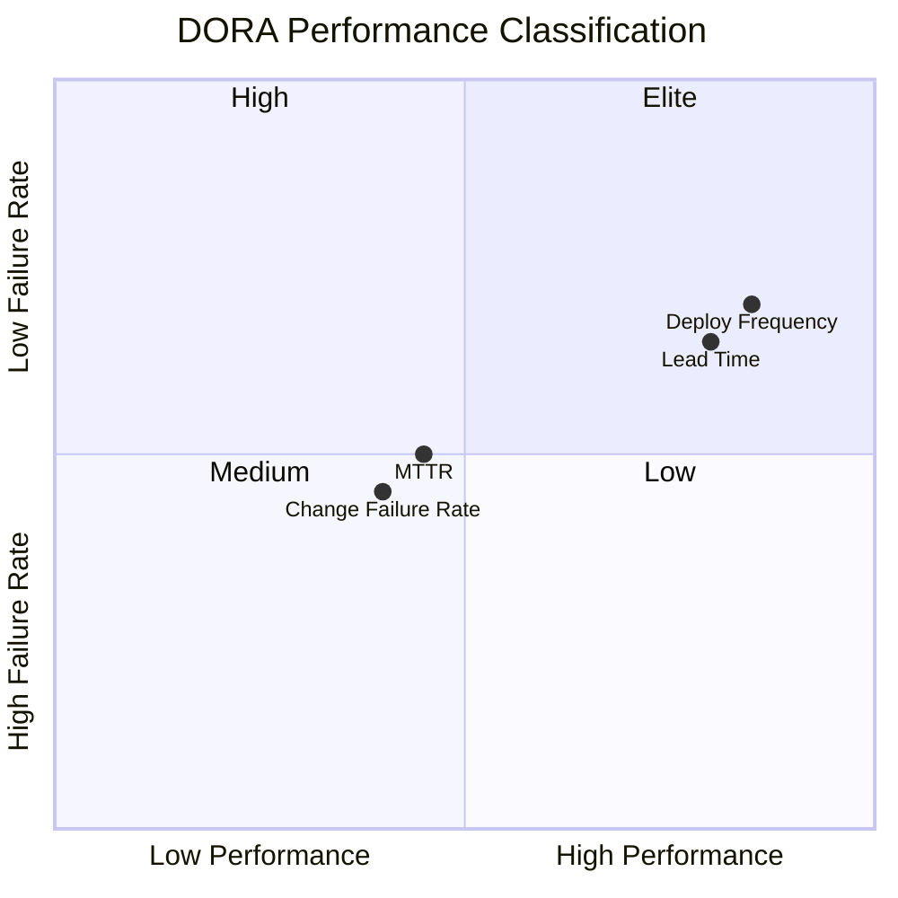

# DORA Metrics

## Overview
Tracking the four key DevOps Research and Assessment (DORA) metrics to measure engineering performance. These metrics are defined in the book "Accelerate" by Nicole Forsgren, Jez Humble, and Gene Kim.

## The Four Key Metrics

### Baseline Targets

| Metric | Elite | High | Medium | Low | Current Target |
|--------|:-----:|:----:|:------:|:---:|:--------------:|
| Deployment Frequency | On-demand | Daily - Weekly | Weekly - Monthly | Less than monthly | Daily |
| Lead Time for Changes | < 1 hour | 1 day - 1 week | 1 week - 1 month | > 1 month | < 1 week |
| Mean Time to Recovery (MTTR) | < 1 hour | < 1 day | < 1 day | < 1 week | < 2 hours |
| Change Failure Rate | 0-5% | 5-10% | 10-20% | > 20% | < 10% |

### Current State

| Metric | Current Value | Target | Elite Benchmark | Status |
|--------|:-------------:|:------:|:---------------:|:------:|
| Deployment Frequency | Per-merge (on CI success) | Daily | On-demand | 🟢 |
| Lead Time for Changes | < 1 hour (CI pipeline) | < 1 week | < 1 hour | 🟢 |
| MTTR | TBD (no incidents yet) | < 2 hours | < 1 hour | 🟡 |
| Change Failure Rate | TBD (no failures yet) | < 10% | 0-5% | 🟡 |

### How to Measure

**Deployment Frequency:**
- Count deployments to production per time period
- Tool: Vercel deployment log, GitHub deployments API

**Lead Time for Changes:**
- Time from commit → production deployment
- Tool: GitHub + Vercel integrations

**MTTR:**
- Time from incident detection → full recovery
- Tool: Incident management system, post-incident reviews

**Change Failure Rate:**
- Percentage of deployments causing a failure
- Tool: Deployment tracking, Sentry error rate monitoring

## Measurement Setup

### GitHub Deployments API
Enable deployment tracking in GitHub repository settings.

### Automated Collection
```bash
# Deployment frequency (last 30 days)
gh run list --workflow ci.yml --branch main --limit 50 --json conclusion,createdAt

# Lead time
# Track commit -> deploy time via GitHub API
```

## Review Cadence
- **Weekly:** Quick check during standup
- **Monthly:** Full metric review with team
- **Quarterly:** Trend analysis and improvement planning

## Improvement Targets

| Quarter | Deployment Frequency | Lead Time | MTTR | Change Failure Rate |
|---------|:-------------------:|:---------:|:----:|:-------------------:|
| Q3 2026 | Daily | < 1 day | < 4 hours | < 15% |
| Q4 2026 | Multiple daily | < 4 hours | < 2 hours | < 10% |
| Q1 2027 | On-demand | < 1 hour | < 1 hour | < 5% |

## Related Documents
- `docs/operations/56-SLA-SLO.md` — Service level objectives
- `docs/operations/25-CICD.md` — CI/CD pipeline
- `docs/operations/DevOpsArchitecture.md` — DevOps architecture

---

## Diagrams

### DORA Metrics Dashboard

```mermaid
graph
    subgraph DORA["DORA Metrics Dashboard"]
        DF["Deploy Frequency<br/>Current: Per-merge<br/>Target: On-demand"]
        LT["Lead Time for Change<br/>Current: < 1 hour<br/>Target: < 1 hour"]
        MTTR["MTTR<br/>Current: TBD<br/>Target: < 2 hours"]
        CFR["Change Failure Rate<br/>Current: TBD<br/>Target: < 10%"]
    end

    DF --> Status1["Status: 🟢 Elite"]
    LT --> Status2["Status: 🟢 Elite"]
    MTTR --> Status3["Status: 🟡 Unknown"]
    CFR --> Status4["Status: 🟡 Unknown"]

    subgraph Targets["Quarterly Targets"]
        Q3["Q3 2026<br/>Daily deploys<br/>MTTR < 4h"]
        Q4["Q4 2026<br/>Multi-daily<br/>MTTR < 2h"]
        Q1["Q1 2027<br/>On-demand<br/>MTTR < 1h"]
    end
```



### DORA Four Quadrants



## Cross-References
- [../MASTER-INDEX.md](../MASTER-INDEX.md) — Documentation master index
- [../26-reference/CROSS-REFERENCE-INDEX.md](../26-reference/CROSS-REFERENCE-INDEX.md) — Cross-reference system