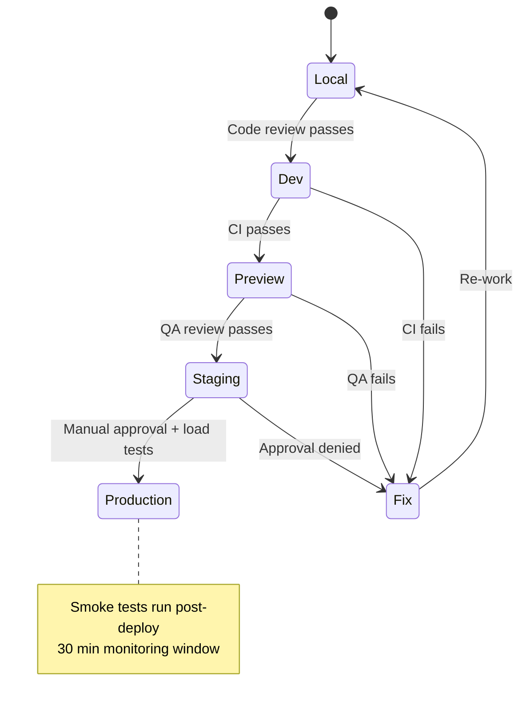
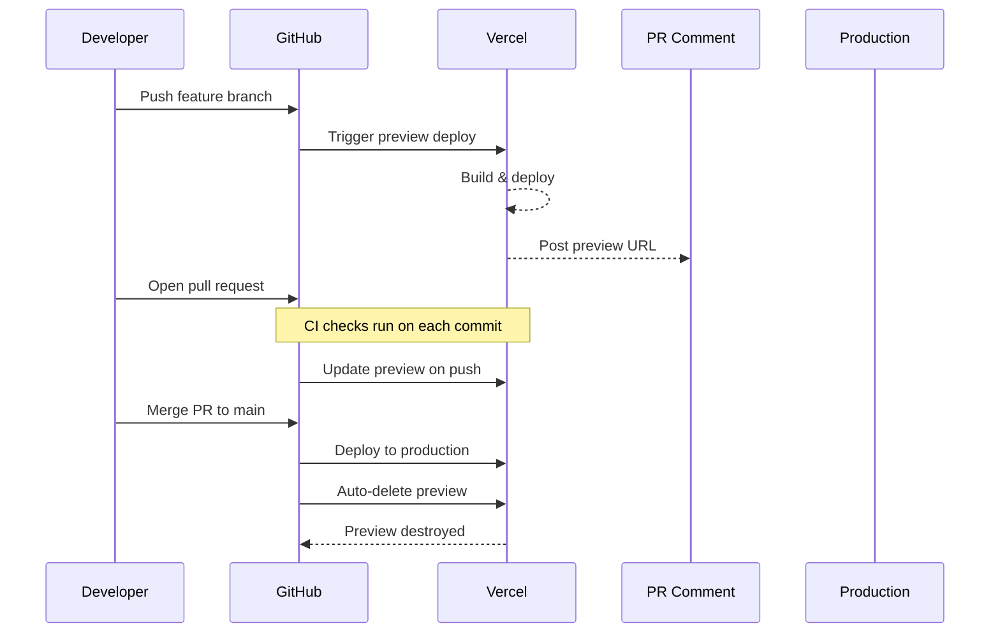

# Environment Strategy

> **Document:** `EnvironmentStrategy.md` | **Version:** 2.0 | **Last Updated:** July 2026  
> **Status:** ✅ Active | **Owner:** Engineering Lead | **Review Cadence:** Quarterly  
> **Related:** [ReleaseManagement.md](./ReleaseManagement.md) | `docs/12-devops/environment-matrix.md` | `docs/12-devops/container-strategy.md`

---

## 1. Overview

The environment strategy defines the five tiers of environments used in the development lifecycle, how they are provisioned, what data they contain, and the promotion gates between them. The goal is to provide isolated, reproducible environments that catch issues as early as possible while keeping overhead minimal.

## 2. Environment Matrix

| #   | Environment    | Purpose                 | Provisioning            | URL                   | Data                     |
| --- | -------------- | ----------------------- | ----------------------- | --------------------- | ------------------------ |
| 1   | **Local**      | Development & debugging | Docker Compose          | localhost:3000        | Seed data                |
| 2   | **Preview**    | Per-PR validation       | Vercel (auto)           | `<pr>.vercel.app`     | Shared staging DB        |
| 3   | **Staging**    | Pre-production QA       | Vercel (auto)           | staging.portfolio.dev | Anonymized prod snapshot |
| 4   | **Production** | Live site               | Vercel (manual promote) | portfolio.dev         | Real data                |
| 5   | **CI**         | Ephemeral test runner   | GitHub Actions runner   | N/A                   | Fresh test DB            |

## 3. Environment Details

### 3.1 Local Development

| Property         | Detail                                                              |
| ---------------- | ------------------------------------------------------------------- |
| **Provisioning** | `docker compose up` (infrastructure/docker/)                        |
| **Services**     | API (port 3001), Web (port 3000), AI (port 8000), PostgreSQL, Redis |
| **Database**     | Local Postgres via Docker, seeded with `prisma db seed`             |
| **AI Service**   | Local Python venv + `uvicorn`                                       |
| **Env vars**     | `.env.local` (copied from `.env.example`)                           |
| **Teardown**     | `docker compose down`                                               |

**Local setup steps:**

1. Copy `config/.env.example` → `config/.env`
2. `docker compose -f infrastructure/docker/docker-compose.yml up -d`
3. `npm run prisma:generate && npm run prisma:migrate:dev && npm run prisma:seed`
4. `npm run dev` (Turborepo starts all services)

### 3.2 Preview / PR Environment

| Property         | Detail                                                                 |
| ---------------- | ---------------------------------------------------------------------- |
| **Provisioning** | Automatic on PR open (Vercel GitHub integration)                       |
| **Trigger**      | PR opened, synchronized, or reopened                                   |
| **Frontend**     | Vercel Preview Deployment — unique URL per commit                |
| **Backend**      | Points to shared staging API instance                                  |
| **Database**     | Shared Supabase staging project (logical isolation for schema changes) |
| **Lifetime**     | Ephemeral; destroyed when PR is closed or merged                       |
| **URL pattern**  | `https://<project>-<id>-<slug>.vercel.app`                             |

**Preview use cases:**

- Visual QA of 3D scenes and animations
- Content preview for blog posts and projects
- Cross-browser testing
- Stakeholder review before merge

### 3.3 Staging Environment

| Property           | Detail                                              |
| ------------------ | --------------------------------------------------- |
| **Provisioning**   | Automatic deploy from `main` branch                 |
| **Services**       | All three services deployed                         |
| **Database**       | Dedicated Supabase staging project                  |
| **Data freshness** | Anonymized snapshot restored weekly from production |
| **URL**            | `https://staging.portfolio.dev`                     |
| **Access**         | Team only (IP-restricted or auth-gated)             |

**Staging use cases:**

- Final QA before scheduled releases
- Load testing
- Database migration validation
- Integration testing across all three services
- User acceptance testing (UAT)

### 3.4 Production Environment

| Property         | Detail                                                  |
| ---------------- | ------------------------------------------------------- |
| **Provisioning** | Manual promote from staging (or deploy from `main` tag) |
| **Services**     | All three services — production-optimized config  |
| **Database**     | Dedicated Supabase production project with PITR backups |
| **URL**          | `https://portfolio.dev`                                 |
| **Access**       | Public                                                  |
| **Scaling**      | Automatic (Vercel Edge + Supabase auto-scale)           |

**Production safeguards:**

- CI/CD pipeline is the only deployment mechanism (no manual dashboard deploys)
- Feature flags gate all new functionality
- Automated smoke tests run post-deploy
- 30-minute monitoring window after every deploy
- Rollback automated if error rate > 1% or p95 latency > 2s

### 3.5 CI Environment

| Property         | Detail                                                  |
| ---------------- | ------------------------------------------------------- |
| **Provisioning** | Ephemeral GitHub Actions runner per workflow            |
| **Database**     | Fresh Postgres via `services.postgres` in workflow YAML |
| **Teardown**     | Automatic on workflow completion                        |
| **Purpose**      | Run unit tests, integration tests, e2e tests            |

**CI database:**

- Created fresh for each workflow run
- Migrations applied from Prisma
- Seed data loaded if needed
- Destroyed when workflow completes

## 4. Database Strategy per Environment

| Environment | Provider             | Instance               | Backup              | Schema sync                  |
| ----------- | -------------------- | ---------------------- | ------------------- | ---------------------------- |
| Local       | Docker Postgres      | `postgres:16-alpine`   | None (ephemeral)    | `prisma migrate dev`         |
| Preview     | Supabase staging     | Shared staging project | None                | Migrations applied on deploy |
| Staging     | Supabase (dedicated) | Staging project        | Weekly snapshot     | `prisma migrate deploy`      |
| Production  | Supabase (dedicated) | Production project     | PITR (7-day), daily | `prisma migrate deploy`      |
| CI          | GitHub Actions       | `services.postgres`    | None                | `prisma migrate deploy`      |

## 5. Environment Variable Management

| Stage      | Storage                      | Access                 |
| ---------- | ---------------------------- | ---------------------- |
| Local      | `.env` file (gitignored)     | Developer machine      |
| Preview    | Vercel Environment Variables | Vercel dashboard / CLI |
| Staging    | Vercel + GitHub Secrets      | CI/CD pipeline         |
| Production | Vercel + GitHub Secrets      | CI/CD pipeline         |
| CI         | GitHub Secrets               | GitHub Actions         |

**Promotion of env vars:** When promoting from staging → production, env var values are manually reviewed and copied via Vercel dashboard. This ensures production secrets are never exposed in lower environments.

**Rotation policy:** Production secrets are rotated every 90 days or immediately after a security incident.

## 6. Promotion Gates

```
┌─────────┐    ┌──────────┐    ┌───────────┐    ┌────────────┐
│  Local  │───>│  Preview │───>│  Staging  │───>│ Production │
│         │    │  (PR)    │    │  (main)   │    │  (tagged)  │
└─────────┘    └──────────┘    └───────────┘    └────────────┘
     │              │               │                  │
     │ Code Review  │ CI Passes     │ Manual Approval  │ Smoke Tests
     │              │ QA Review     │ Load Tests       │ Monitor (30m)
     └──────────────┴───────────────┴──────────────────┘
```

| Gate                | From         | To                 | Requirements                                                |
| ------------------- | ------------ | ------------------ | ----------------------------------------------------------- |
| **Code Review**     | Local        | Preview (PR)       | 1+ approval, lint + typecheck + test pass                   |
| **CI + QA**         | Preview      | Staging            | All CI checks pass, visual QA for 3D/UI changes             |
| **Manual Approval** | Staging      | Production         | Engineering Lead approval, changelog reviewed, load test ok |
| **Smoke + Monitor** | After deploy | Stay in production | Health checks pass, no anomalies in 30-min window           |

## 7. Environment Naming Convention

All environment identifiers follow this pattern:

- `local` — Developer machine
- `preview-<pr-number>` — Per-PR preview (Vercel)
- `staging` — Staging environment
- `production` — Production environment
- `ci-<workflow-run-id>` — CI runner (ephemeral)

Used in:

- Sentry environment tags
- Logging context
- Monitoring dashboard filters
- Feature flag targeting

---

## Diagrams

### Environment Promotion Flow



### PR Preview Lifecycle



## Cross-References

- [../MASTER-INDEX.md](../MASTER-INDEX.md) — Documentation master index
- [../26-reference/CROSS-REFERENCE-INDEX.md](../26-reference/CROSS-REFERENCE-INDEX.md) — Cross-reference system
