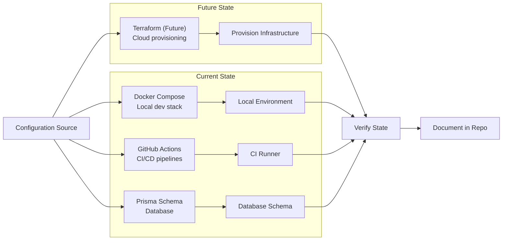
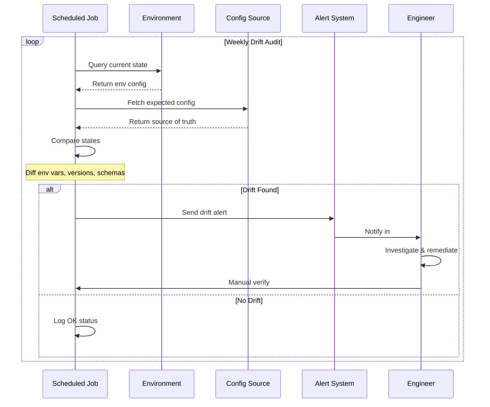

# Infrastructure as Code (IaC)

> **Document:** `InfrastructureAsCode.md` | **Version:** 2.0 | **Last Updated:** July 2026  
> **Status:** ✅ Active | **Owner:** Engineering Lead | **Review Cadence:** Quarterly  
> **Related:** [EnvironmentStrategy.md](./EnvironmentStrategy.md) | `docs/12-devops/container-strategy.md` | `docs/12-devops/environment-matrix.md`

---

## 1. Overview

Infrastructure as Code ensures every piece of infrastructure — from Docker containers to deployment pipelines — is defined in version-controlled, reviewable files. Manual configuration via web dashboards is discouraged for all production and staging resources. This document catalogs what is currently codified and what should be codified next.

## 2. IaC Philosophy

| Principle                 | Practice                                                                 |
| ------------------------- | ------------------------------------------------------------------------ |
| **Everything in Git**     | Every config file, pipeline definition, and schema lives in the monorepo |
| **Reproducible**          | Any environment can be recreated from scratch using committed IaC        |
| **Immutable deployments** | Infrastructure is replaced, not modified in-place                        |
| **Least privilege**       | Provisioned resources have minimum required permissions                  |
| **Secret-free code**      | No secrets in configuration files; always injected at deploy time        |

## 3. Current IaC Scope

### 3.1 Docker Compose (Local Development)

**File:** `infrastructure/docker/docker-compose.yml`

Defines the full local development stack:

- `api` — NestJS on port 3001 (mapped to 4000)
- `web` — Next.js on port 3000
- `ai` — FastAPI on port 8000
- `postgres` — PostgreSQL 16 (dev database)
- `redis` — Redis 7 (caching and BullMQ)

**Controls:** Service definitions, port mappings, volume mounts, environment variable references, network configuration, health checks.

### 3.2 Dockerfiles (Container Images)

| Service | File                  | Base Image         | Strategy                               |
| ------- | --------------------- | ------------------ | -------------------------------------- |
| API     | `apps/api/Dockerfile` | `node:22-alpine`   | Multi-stage (build → prod deps) |
| Web     | `apps/web/Dockerfile` | `node:22-alpine`   | Multi-stage (standalone output)        |
| AI      | `apps/ai/Dockerfile`  | `python:3.12-slim` | Multi-stage                            |

**Best practices enforced:**

- Multi-stage builds for minimal image size (API ~250MB, Web ~300MB, AI ~500MB)
- Non-root user execution
- Health check endpoints
- `.dockerignore` files per service
- Specific version tags (never `latest`)
- Dependency layer caching

### 3.3 GitHub Actions Workflows

**Directory:** `.github/workflows/`

| Workflow            | File                                         | Trigger                   |
| ------------------- | -------------------------------------------- | ------------------------- |
| CI (Quality + Test) | `ci.yml`                                     | PR and push to `main`     |
| Docker Build & Push | `docker.yml`                                 | Push to `main`, tags `v*` |
| Deploy (Vercel)     | Vercel integration (separate from workflows) | Push to `main`            |

**Pipeline stages defined in code:**

1. `quality` — lint + typecheck + test (api + web)
2. `prisma-validate` — Prisma schema validation
3. `docker-api` / `docker-web` — build + push to ghcr.io (depends on quality + prisma-validate)

### 3.4 Vercel Configuration

**File:** `vercel.json` (root or per-app)

Defines:

- Route rewrites and redirects
- Headers (CORS, security, COOP/COEP for Sandbox)
- Caching behavior (Cache-Control policies)
- Function regions and memory allocation
- Build command and output directory

**Note:** Environment variables are still configured via Vercel dashboard. Migration to `vc env` CLI or `.vercel/.env` files is planned.

### 3.5 Prisma Schema

**File:** `apps/api/prisma/schema.prisma`

The complete database schema as code:

- Tables, enums, relations, indexes
- Custom SQL functions (pgvector similarity search)
- Row Level Security (RLS) policies as raw SQL migrations
- All changes tracked via Prisma migrations in `prisma/migrations/`

## 4. Configuration Management

### 4.1 How Configuration Is Managed

| Resource              | Tool                     | Where Defined                                         |
| --------------------- | ------------------------ | ----------------------------------------------------- |
| Local dev environment | Docker Compose           | `infrastructure/docker/docker-compose.yml`            |
| Local env vars        | `.env` files             | `config/.env` (gitignored template at `.env.example`) |
| CI secrets            | GitHub Secrets           | GitHub repo settings                                  |
| Vercel deploy vars    | Vercel dashboard + CLI   | Per-project env var section                           |
| Supabase config       | Supabase dashboard + CLI | Per-project settings                                  |
| Database schema       | Prisma                   | `apps/api/prisma/schema.prisma`                       |

### 4.2 Configuration Drift Management

| Risk                  | Detection Method                           | Remediation                                 |
| --------------------- | ------------------------------------------ | ------------------------------------------- |
| Env var mismatch      | Compare .env.example vs actual env lists   | Run `vc env list` and diff against template |
| DB schema drift       | `prisma validate` + `prisma migrate diff`  | Run `prisma migrate deploy`                 |
| Docker image drift    | Compare local vs CI builds                 | Rebuild from `docker-compose.yml`           |
| Pipeline config drift | Review `.github/workflows/` for stale jobs | Update workflows in PR                      |

**Monthly drift audit:** First week of each month, run automated comparison scripts between documented config and actual config. Document any drift in GitHub Issue.

## 5. Desired Future State

### Short-term (Q3 2026)

| Goal                                                                              | Status      |
| --------------------------------------------------------------------------------- | ----------- |
| Migrate env vars from Vercel dashboard to `vc env` CLI commands committed to repo | Planned     |
| Add `docker-compose.ci.yml` for consistent CI database setup                      | Not started |
| Document all Supabase project settings in code (SQL scripts)                      | Not started |

### Medium-term (Q4 2026 – Q1 2027)

| Goal                              | Tool                         | Scope                                   |
| --------------------------------- | ---------------------------- | --------------------------------------- |
| Cloud infrastructure provisioning | Terraform (or Pulumi)        | Supabase projects, Vercel projects, DNS |
| Container orchestration           | Kubernetes (or Nomad)        | API + AI services for scaling           |
| Config packaging                  | Helm charts                  | K8s config for all stateless services   |
| Secret management                 | HashiCorp Vault (or Doppler) | Centralized, audited secret injection   |

### Long-term Vision

```
┌───────────────────────────────────────────────────────────────┐
│                    Terraform / Pulumi                          │
│  ┌──────────┐  ┌──────────┐  ┌──────────┐  ┌──────────────┐ │
│  │ Supabase │  │ Vercel   │  │  DNS     │  │  Docker      │ │
│  │ Projects │  │ Projects │  │ Records  │  │  Registry    │ │
│  └──────────┘  └──────────┘  └──────────┘  └──────────────┘ │
├───────────────────────────────────────────────────────────────┤
│                    Kubernetes / Nomad                          │
│  ┌──────────┐  ┌──────────┐  ┌──────────┐  ┌──────────────┐ │
│  │ API Pods │  │ AI Pods  │  │ Workers  │  │  Sidecars    │ │
│  └──────────┘  └──────────┘  └──────────┘  └──────────────┘ │
├───────────────────────────────────────────────────────────────┤
│                    Helm Charts                                 │
│  ConfigMaps, Secrets, Ingress, Service, HPA, PDB              │
└───────────────────────────────────────────────────────────────┘
```

## 6. Secret Management

### 6.1 Rules

- **Never commit secrets** to version control (`.env` is in `.gitignore`)
- **Never log secrets** (Pino redaction, Sentry scrubbing)
- **Minimum scope** — each service only has access to its own secrets
- **Rotate regularly** — production secrets rotated every 90 days
- **Audit trail** — secret access logged via platform audit logs

### 6.2 Secret Storage by Type

| Secret Type                          | Storage                          | Rotation             |
| ------------------------------------ | -------------------------------- | -------------------- |
| API keys (OpenAI, Anthropic, Resend) | GitHub Secrets + Vercel env vars | 90 days              |
| Database URLs                        | GitHub Secrets + Vercel env vars | On credential change |
| JWT signing keys                     | GitHub Secrets+ Vercel env vars  | 90 days              |
| OAuth client secrets                 | GitHub Secrets + Vercel env vars | On provider change   |
| Supabase service keys                | GitHub Secrets + Vercel env vars | 90 days              |

### 6.3 Secret Injection Flow

```
GitHub Secrets ──> GitHub Actions ──> Build / Test
                         │
                    Vercel Deploy Hook
                         │
                    Vercel Environment ──> Runtime (process.env)
```

## 7. Disaster Recovery from IaC

In case of complete environment loss, recovery process:

1. **Docker Compose** restores local dev: `docker compose up`
2. **Terraform** (future) provisions cloud infra: `terraform apply`
3. **Prisma** restores DB schema: `prisma migrate deploy`
4. **GitHub Actions** restores CI/CD: workflows in `.github/`
5. **Docker images** pulled from ghcr.io: `docker pull`

Estimated recovery time using current IaC: **4 hours** (largely manual provisioning). Target with full Terraform adoption: **30 minutes** (one `terraform apply`).

---

## Diagrams

### IaC Provisioning Flow



### Configuration Drift Detection



## Cross-References

- [../MASTER-INDEX.md](../MASTER-INDEX.md) — Documentation master index
- [../26-reference/CROSS-REFERENCE-INDEX.md](../26-reference/CROSS-REFERENCE-INDEX.md) — Cross-reference system
