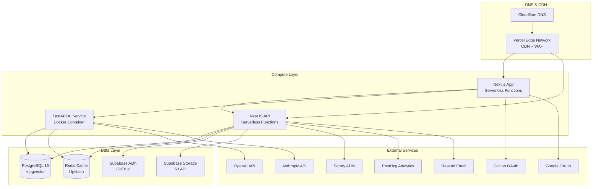

# Infrastructure Architecture Diagram

## Architecture Overview

## Network Flow

### Request Flow (Public Visitor)
1. DNS: Cloudflare → Vercel edge
2. Vercel edge: Serve static assets (CDN cached), WAF filtering
3. Next.js: Render page (ISR if cached, SSR/SSG if not)
4. API calls: Web → NestJS API on Vercel (serverless)
5. Data: API → Supabase (PostgreSQL via PgBouncer pool)
6. Cache: API → Redis (Upstash)

### Request Flow (Admin)
1-3 same as public flow
4. Auth: JWT token verified by Passport.js guards (JwtAuthGuard)
5. RBAC: Role-based access enforced by RolesGuard (@Roles decorator)
6. Audit: All mutations logged via @Audit decorator
7. Cache: Admin routes bypass CDN cache; server-side caching via @CacheTTL

### Request Flow (AI Chat)
1. Web → FastAPI (SSE streaming)
2. FastAPI → OpenAI/Anthropic API (model inference)
3. RAG: FastAPI → pgvector for embedding similarity search
4. Cache: FastAPI → Redis for conversation context

## Deployment Architecture

### Compute Hosting
| Service | Platform | Runtime | Region | Scaling |
|---------|----------|---------|--------|---------|
| Web (Next.js) | Vercel (Hobby) | Serverless (AWS Lambda) | iad1 (us-east-1) | Auto (1000 concurrent) |
| API (NestJS) | Vercel (Hobby) | Serverless (AWS Lambda) | iad1 (us-east-1) | Auto (1000 concurrent) |
| AI (FastAPI) | Render / Fly.io (Free) | Docker container | us-east | Single instance |

### Data Tier
| Service | Platform | Tier | Limits |
|---------|----------|------|--------|
| PostgreSQL + pgvector | Supabase | Free | 500MB, 2 vCPU, 1GB RAM |
| Auth (GoTrue) | Supabase | Free | Built-in |
| Object Storage | Supabase | Free | 1GB |
| Redis + Queue | Upstash | Free | 10K req/day |

### Vercel Projects
| Property | Web | API |
|----------|-----|-----|
| Framework Preset | Next.js | Node.js (Serverless) |
| Root Directory | apps/web | apps/api |
| Build Command | npm run build | npm run build |
| Output Directory | .next | dist |
| Install Command | npm ci | npm ci |

### Vercel Environments
| Environment | Branch | Auto-deploy | Domains |
|-------------|--------|-------------|---------|
| Production | main | ✅ | portfolio.dev, www.portfolio.dev |
| Preview | feature/* | ✅ | *.vercel.app (ephemeral) |
| Staging | develop | ✅ | staging.portfolio.dev |

## Security Boundaries

| Layer | Technology | Protection |
|-------|-----------|------------|
| L1: Edge | Vercel WAF | DDoS, SQL injection, XSS, rate limiting |
| L2: Transport | HTTPS (TLS 1.3) | Man-in-the-middle, eavesdropping |
| L3: API Gateway | NestJS Guards (JwtAuthGuard, RolesGuard, ThrottlerGuard) | JWT validation, role-based access, rate limiting |
| L4: Database | Supabase RLS | Row-level access control per user |
| L5: Application | Zod validation, input sanitization | Injection attacks, XSS, CSRF |
| L6: Auth | OAuth 2.0 (Google, GitHub) | Delegated identity, no password storage |

### Network Segmentation
| Network | Components | Access Control |
|---------|-----------|----------------|
| Public Internet | Vercel Edge, CDN | Cloudflare DNS + WAF |
| API Network | NestJS, Next.js (server-side) | CORS, JWT, API keys |
| Private Data | Supabase, Redis | Connection pooling, TLS, IP allowlist |
| AI Network | FastAPI container | PSK / internal JWT |
| External | OpenAI, Resend, Sentry, PostHog | API keys, HTTPS |

## Disaster Recovery

| Scenario | RTO | RPO | Mitigation |
|----------|-----|-----|------------|
| Vercel outage | 4h | N/A | Repoint DNS to fallback Netlify deployment |
| Supabase outage | 4h | 24h | ISR cached pages remain visible; restore from nightly pg_dump |
| OpenAI outage | N/A | N/A | Chatbot shows "Maintenance Mode"; fallback to contact form |
| Data corruption | 4h | 24h | Restore from nightly pg_dump in separate S3 bucket |
| Container OOM | 10min | N/A | Auto-restart; vertical scale if recurring |

## Cost Breakdown

| Service | Tier | Monthly Cost |
|---------|------|:------------:|
| Vercel | Hobby | $0 |
| Supabase | Free | $0 |
| Upstash Redis | Free | $0 |
| Render / Fly.io | Free | $0 |
| Resend | Free | $0 |
| OpenAI | Pay-as-you-go | ~$2–$5 |
| Domain | Registrar | ~$1/mo |
| **Total** | | **$3–$6/mo** |

## Cross-References
- [../MASTER-INDEX.md](../MASTER-INDEX.md) — Documentation master index
- [../26-reference/CROSS-REFERENCE-INDEX.md](../26-reference/CROSS-REFERENCE-INDEX.md) — Cross-reference system