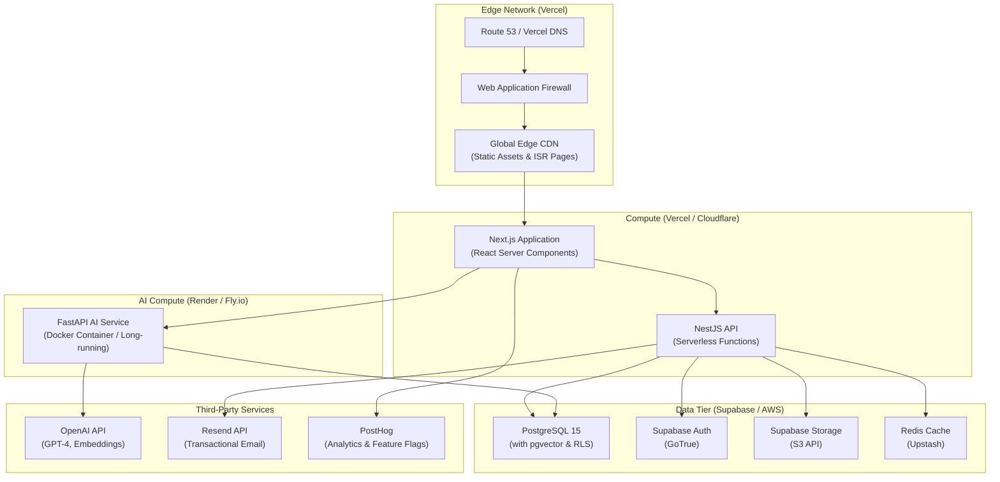

# Infrastructure Architecture — Cloud Topologies & Scalability

> **Document:** `54-INFRASTRUCTURE.md` | **Version:** 1.1 | **Last Updated:** June 2026  
> **Status:** ✅ Active | **Owner:** Enterprise Cloud Architect | **Review Cadence:** Quarterly  
> **Related:** [SystemArchitecture.md](./SystemArchitecture.md) | [DeploymentGuide.md](./DeploymentGuide.md) | [53-CI-CD-PIPELINE.md](./53-CI-CD-PIPELINE.md)

---

## Executive Summary

The infrastructure uses a multi-cloud, serverless-first topology optimized for cost ($0-$5/mo operating cost) while maintaining enterprise-grade performance. Traffic flows through Vercel Edge Network (CDN + WAF) to serverless Next.js frontend and NestJS API functions in AWS us-east-1, with a FastAPI AI service on Render/Fly.io for long-lived LLM connections. Supabase provides PostgreSQL 15 (with pgvector and RLS), Auth, and Storage. Third-party services include OpenAI, Resend (email), and PostHog (analytics). Target RTO is 4 hours with 24-hour RPO via nightly pg_dump backups. The primary failure scenarios (Vercel outage, Supabase outage, OpenAI outage, data corruption) each have documented mitigation strategies.

---

## 1. Cloud Topology

Our infrastructure follows a multi-cloud serverless and managed services architecture, optimized for high availability, edge delivery, and zero maintenance overhead while adhering to strict cost constraints.



---

## 2. Component Specifications

### 2.1 Frontend & API Compute (Vercel)

| Aspect           | Specification               | Scaling Strategy                                        |
| ---------------- | --------------------------- | ------------------------------------------------------- |
| **Compute Type** | AWS Lambda (under the hood) | Auto-scaling to 1000 concurrent executions              |
| **Region**       | `iad1` (Washington, D.C.)   | Centralized near DB to minimize latency                 |
| **Memory Limit** | 1024 MB (Hobby tier limit)  | Optimized via Turbopack and Edge runtime where possible |
| **Timeout**      | 10s (Hobby) / 60s (Pro)     | Async background jobs utilized for slow tasks           |
| **Cold Starts**  | ~500ms - 1s                 | Mitigated via frequent pings (Health checks)            |

### 2.2 Database & Auth (Supabase)

| Aspect           | Specification                      | Resilience & Backup                                     |
| ---------------- | ---------------------------------- | ------------------------------------------------------- |
| **Compute Size** | Micro (Free Tier: 2 vCPU, 1GB RAM) | Connection pooling via PgBouncer                        |
| **Storage**      | SSD (500MB Limit)                  | Daily logical backups via pg_dump                       |
| **Availability** | Single AZ (Free Tier)              | Point-in-Time Recovery (PITR) requires Pro tier upgrade |
| **Auth**         | GoTrue Service                     | JWT generation with 1-hour expiry                       |

### 2.3 AI Compute (Docker Container)

_Rationale: Serverless functions time out too quickly for complex LLM orchestrations. A lightweight container provides WebSocket/SSE support._

| Aspect           | Specification                | Auto-scaling                                 |
| ---------------- | ---------------------------- | -------------------------------------------- |
| **Platform**     | Render or Fly.io (Free Tier) | 1 instance (scale to 0 on idle if supported) |
| **Compute Size** | 512MB RAM, shared CPU        | Vertical scaling manual if OOM occurs        |
| **Network**      | Internal private networking  | Exposed via HTTPS API Gateway                |

---

## 3. Network Architecture

### 3.1 Traffic Routing

1. **User Request** → hits nearest Vercel Edge Node.
2. **Cache Hit** → returns ISR/Static content in < 50ms.
3. **Cache Miss** → routed to Vercel Serverless Function in `iad1`.
4. **Data Fetch** → Serverless Function connects to Supabase in AWS `us-east-1` via PgBouncer pool.
5. **Response** → returned to Edge, cached, and sent to user.

### 3.2 Security Boundaries

- **Public Web Traffic:** Terminated at Vercel Edge. HTTPS enforced. HTTP/2 and HTTP/3 supported.
- **Database Access:** Database is exposed to the internet but secured by Row Level Security (RLS). Connection pooler port (6543) used for API connections.
- **API to AI Service:** Secured via shared pre-shared key (PSK) or internal JWT validation.

---

## 4. Disaster Recovery & Availability

### 4.1 RTO and RPO Targets

- **RTO (Recovery Time Objective):** 4 Hours (time to redeploy entire stack if cloud provider fails).
- **RPO (Recovery Point Objective):** 24 Hours (time since last database backup).

### 4.2 Failure Scenarios & Mitigations

| Scenario            | Impact                            | Mitigation Strategy                                                                            |
| ------------------- | --------------------------------- | ---------------------------------------------------------------------------------------------- |
| **Vercel Outage**   | Site goes offline                 | Repoint DNS to fallback Netlify deployment (manual trigger via GitHub Actions).                |
| **Supabase Outage** | APIs fail, dynamic content breaks | ISR cached pages remain visible. Contact forms queue locally in browser or degrade gracefully. |
| **OpenAI Outage**   | AI Chatbot breaks                 | Chatbot UI shows "Maintenance Mode" gracefully. Fallback to contact form.                      |
| **Data Corruption** | Database invalid state            | Restore from nightly `pg_dump` backup stored in separate AWS S3 bucket.                        |

---

## 5. Cost Optimization Strategy

The infrastructure is designed to operate as close to **$0/month** as possible while maintaining enterprise-grade performance.

| Service             | Tier          | Monthly Cost | Limitations                                           |
| ------------------- | ------------- | :----------: | ----------------------------------------------------- |
| **Vercel**          | Hobby         |      $0      | 100GB bandwidth, 10s function timeout                 |
| **Supabase**        | Free          |      $0      | 500MB DB, 1GB Storage, pauses after 7 days inactivity |
| **Upstash (Redis)** | Free          |      $0      | 10K requests/day                                      |
| **Resend (Email)**  | Free          |      $0      | 3,000 emails/month                                    |
| **OpenAI**          | Pay-as-you-go |    ~$2-$5    | Metered by token usage                                |
| **Domain Name**     | Registrar     |    ~$1/mo    | Annual fee                                            |

_If traffic exceeds free tiers, the upgrade path involves moving Vercel to Pro ($20/mo) and Supabase to Pro ($25/mo), enabling massive scale._

---

## 6. Monitoring & Observability

### 6.1 Service Health Checks

| Service             | Check Type               | Interval | Expected Status        | Alert    |
| ------------------- | ------------------------ | -------- | ---------------------- | -------- |
| **Vercel Frontend** | HTTP GET `/api/health`   | 5 min    | 200 OK                 | Telegram |
| **NestJS API**      | HTTP GET `/api/health`   | 5 min    | 200 OK                 | Telegram |
| **FastAPI AI**      | HTTP GET `/health`       | 5 min    | 200 OK                 | Telegram |
| **Supabase DB**     | Connection pool query    | 1 min    | < 5 active connections | Telegram |
| **OpenAI API**      | Token usage & error rate | 1 min    | Error rate < 1%        | Telegram |

### 6.2 Key Metrics Dashboard

| Category         | Metric               | Source             | Warning   | Critical  |
| ---------------- | -------------------- | ------------------ | --------- | --------- |
| **Performance**  | LCP (P75)            | RUM (PostHog)      | > 2.0s    | > 2.5s    |
| **Performance**  | API Latency (P95)    | Custom monitoring  | > 200ms   | > 500ms   |
| **Availability** | Uptime (30d rolling) | Uptime monitor     | < 99.5%   | < 99.0%   |
| **Database**     | Connection count     | Supabase dashboard | > 10      | > 15      |
| **Cost**         | Monthly spend        | Manual review      | > $10     | > $15     |
| **Security**     | Failed auth attempts | Supabase logs      | > 100/day | > 500/day |

## 7. Scaling Strategy & Upgrade Path

### 7.1 Growth Tiers

| Tier                    | Monthly Cost | Triggers                | Changes                                               |
| ----------------------- | :----------: | ----------------------- | ----------------------------------------------------- |
| **Tier 0 (Free)**       |    $0–$5     | Initial development     | Free tiers: Vercel Hobby, Supabase Free, Upstash Free |
| **Tier 1 (Growth)**     |   $25–$50    | > 10K monthly visitors  | Vercel Pro ($20), Supabase Pro ($25), custom domain   |
| **Tier 2 (Scale)**      |   $50–$100   | > 100K monthly visitors | Multi-AZ Supabase, CDN analytics, Redis upgrade       |
| **Tier 3 (Enterprise)** |    $100+     | > 1M monthly visitors   | Dedicated DB, multi-region, SLA guarantees            |

### 7.2 Vertical Scaling Actions

| Bottleneck            | Detection                | Tier 0 Action                       | Tier 1+ Action                        |
| --------------------- | ------------------------ | ----------------------------------- | ------------------------------------- |
| **Function timeout**  | API returns 504          | Optimize query performance          | Upgrade to Vercel Pro (60s timeout)   |
| **DB memory**         | Slow queries, OOM        | Add indexes, optimize queries       | Upgrade to Supabase Pro (8GB RAM)     |
| **AI service memory** | Container OOM kill       | Reduce batch size, stream responses | Increase container to 1GB RAM         |
| **Bandwidth limit**   | Vercel Hobby cap (100GB) | Compress images, optimize bundles   | Upgrade to Vercel Pro (1TB bandwidth) |

## 8. Security Architecture

### 8.1 Network Security Layers

| Layer               | Technology         | Protection                              |
| ------------------- | ------------------ | --------------------------------------- |
| **L1: Edge**        | Vercel WAF         | DDoS, SQL injection, XSS, rate limiting |
| **L2: Transport**   | HTTPS (TLS 1.3)    | Man-in-the-middle, eavesdropping        |
| **L3: API Gateway** | NestJS Guards      | JWT validation, role-based access       |
| **L4: Database**    | Supabase RLS       | Row-level access control per user       |
| **L5: Application** | Input sanitization | Injection attacks, XSS, CSRF            |

### 8.2 Secret Management Flow

```text
Developer → 1Password (local secrets) → .env.local (gitignored)
GitHub → GitHub Secrets (CI env vars) → GitHub Actions
Vercel → Vercel Environment Variables → Serverless functions
Render/Fly → Dashboard env vars → AI service containers
All secrets → Never in code, never in logs, never in build output
```

## 9. Infrastructure as Code & Environment Parity

### 9.1 Environment Matrix

| Aspect         | Local Dev         | Preview          | Staging          | Production          |
| -------------- | ----------------- | ---------------- | ---------------- | ------------------- |
| **Frontend**   | `next dev`        | Vercel Preview   | Vercel Staging   | Vercel Production   |
| **API**        | `nest start`      | Vercel Preview   | Vercel Staging   | Vercel Production   |
| **AI Service** | `uvicorn`         | Render PR        | Render Staging   | Render Production   |
| **Database**   | Docker PostgreSQL | Supabase Branch  | Supabase Staging | Supabase Production |
| **Auth**       | Local GoTrue      | Supabase Branch  | Supabase Staging | Supabase Production |
| **Storage**    | Local filesystem  | Supabase Branch  | Supabase Staging | Supabase Production |
| **Email**      | Resend test mode  | Resend test mode | Resend test mode | Resend production   |
| **Analytics**  | PostHog local     | PostHog test     | PostHog test     | PostHog production  |

### 9.2 Environment Sync

To refresh a preview/staging environment with production-like data:

```bash
# Sanitized dump (no PII) from production
pg_dump --data-only --exclude-table=leads prod_db | psql staging_db
```

## 10. Performance Optimization

### 10.1 Caching Strategy

| Cache Layer           | Content                     |            TTL             | Invalidation           |
| --------------------- | --------------------------- | :------------------------: | ---------------------- |
| **Vercel Edge (CDN)** | Static assets, ISR pages    | 1 year (assets), 60s (ISR) | On-demand revalidation |
| **Supabase**          | Query results (pgvector)    |          Session           | On data mutation       |
| **Upstash (Redis)**   | API responses, session data |           5 min            | TTL expiry             |
| **Browser**           | Static assets               |           1 year           | Cache-busted filenames |

### 10.2 Bundle Optimization

```text
Minimum Viable Page: /about
  - Initial JS: < 85KB gzipped (target)
  - No 3rd-party scripts on landing pages
  - Dynamic imports for heavy components (Three.js, charts)
  - Font subsetting for Google Fonts
```

---

## Change Log

| Version | Date     | Changes                                                                                             | Author                     |
| ------- | -------- | --------------------------------------------------------------------------------------------------- | -------------------------- |
| 1.1     | Jun 2026 | Added Executive Summary, Decision Log, Risk Register, Glossary                                      | Chief Architect            |
| 1.0     | Jun 2026 | Initial Infrastructure Architecture — topologies, components, networking, DR, and cost optimization | Enterprise Cloud Architect |

---

## Decision Log

| ID          | Decision                                                                             | Rationale                                                                                                              | Alternatives Considered                                                                                                                                                                                          | Date     | Approver                   |
| ----------- | ------------------------------------------------------------------------------------ | ---------------------------------------------------------------------------------------------------------------------- | ---------------------------------------------------------------------------------------------------------------------------------------------------------------------------------------------------------------- | -------- | -------------------------- |
| D-INFRA-001 | Use Vercel for frontend compute (Next.js + NestJS serverless)                        | Auto-scaling, global CDN included, zero ops overhead; Hobby tier is free; native Next.js support                       | AWS EC2 (rejected — manual scaling, ops overhead); Netlify (rejected — weaker Next.js support); Cloudflare Pages (rejected — limited function runtime)                                                           | Jun 2026 | Enterprise Cloud Architect |
| D-INFRA-002 | Use Supabase for database, auth, and storage                                         | PostgreSQL with pgvector, RLS, and GoTrue in single platform; generous free tier; managed backups                      | AWS RDS (rejected — $15/mo minimum, manual backups); Firebase (rejected — Firestore not SQL, no pgvector); PlanetScale (rejected — no pgvector, no auth)                                                         | Jun 2026 | Enterprise Cloud Architect |
| D-INFRA-003 | Use dedicated Docker container (Render/Fly.io) for AI service rather than serverless | LLM chat requires WebSocket/SSE streaming and >30s execution; serverless functions timeout at 10s (Hobby) or 60s (Pro) | Vercel serverless functions (rejected — 10s/60s timeout insufficient for streaming LLM); Railway serverless (rejected — same timeout issues); AWS Lambda (rejected — 15min max but cold start overhead for chat) | Jun 2026 | Enterprise Cloud Architect |
| D-INFRA-004 | Centralize compute in `iad1` (AWS US East) colocated with Supabase                   | Minimizes inter-region latency between serverless functions and database; Supabase default region                      | Multi-region deployment (rejected — cost prohibitive, unnecessary for portfolio traffic levels); edge-first with distributed DB (rejected — Supabase is single-region)                                           | Jun 2026 | Enterprise Cloud Architect |
| D-INFRA-005 | Accept 4-hour RTO / 24-hour RPO with nightly pg_dump backups                         | Aligns with hobby/indie project budget; data loss of at most 24 hours acceptable for portfolio content                 | Multi-AZ database with PITR (rejected — Supabase Pro $25/mo); hourly backups (rejected — storage cost); streaming replication (rejected — infrastructure complexity)                                             | Jun 2026 | Enterprise Cloud Architect |
| D-INFRA-006 | Design for $0-$5/mo operating cost with explicit upgrade path                        | Keeps project sustainable during development phase; documented upgrade path prevents dead-end architecture decisions   | Target $0/mo with no upgrade path (rejected — scales poorly); target $50/mo from start (rejected — unnecessary for development)                                                                                  | Jun 2026 | Enterprise Cloud Architect |

## Risk Register

| ID          | Risk                                                                                                    | Likelihood | Impact   | Mitigation                                                                                                                                           |
| ----------- | ------------------------------------------------------------------------------------------------------- | ---------- | -------- | ---------------------------------------------------------------------------------------------------------------------------------------------------- |
| R-INFRA-001 | Supabase free tier pauses database after 7 days of inactivity, causing data loss or extended cold start | High       | Medium   | Implement automated weekly keep-alive query; document wake-up procedure (takes 30-60s); upgrade to Pro if pause frequency unacceptable               |
| R-INFRA-002 | Vercel Hobby tier bandwidth limit (100GB) exceeded by traffic spike                                     | Low        | High     | Monitor bandwidth usage monthly; compress images and assets; upgrade to Pro ($20/mo) if consistently over 80GB                                       |
| R-INFRA-003 | OpenAI API key exposed in client bundle or Vercel build logs                                            | Low        | Critical | Never use OpenAI keys in frontend code; restrict API key to FastAPI AI service environment; audit build logs quarterly; use API key rotation         |
| R-INFRA-004 | Single-AZ Supabase database goes down (AZ failure in us-east-1)                                         | Low        | High     | Acceptable within 4-hour RTO; restore from nightly backup to new Supabase instance; update DNS/connection strings                                    |
| R-INFRA-005 | Docker container AI service runs out of memory (512MB) during complex LLM streaming                     | Medium     | Medium   | Monitor memory usage with health checks; implement response streaming to reduce memory pressure; vertical scale to 1GB RAM if needed; add swap space |

## Glossary

| Term             | Definition                                                                                                                      |
| ---------------- | ------------------------------------------------------------------------------------------------------------------------------- |
| **Serverless**   | A cloud computing model where the provider dynamically manages resource allocation, scaling functions automatically per request |
| **Edge Network** | A globally distributed network of servers that cache and serve content from locations closest to the user                       |
| **WAF**          | Web Application Firewall — filters and monitors HTTP traffic to block common web exploits                                       |
| **PgBouncer**    | A PostgreSQL connection pooler that manages database connections efficiently, reducing connection overhead                      |
| **Pgvector**     | A PostgreSQL extension for vector similarity search, used for AI embedding storage and retrieval                                |
| **RLS**          | Row-Level Security — a PostgreSQL feature allowing row-level access control based on user authentication                        |
| **GoTrue**       | Supabase's built-in authentication service implementing JWT-based auth with support for multiple providers                      |
| **PITR**         | Point-in-Time Recovery — a database recovery method that allows restoring to any moment within a retention window               |
| **RTO**          | Recovery Time Objective — the maximum acceptable time to restore service after a failure                                        |
| **RPO**          | Recovery Point Objective — the maximum acceptable data loss measured in time since the last backup                              |
| **pg_dump**      | PostgreSQL's native backup utility that creates a logical dump of the database                                                  |
| **Cold Start**   | The initial latency incurred when a serverless function or container starts from an idle state after being scaled to zero       |

---

_Document Version: 1.1 — Enterprise Edition_

---

## Cross-References

| Reference           | Description                                            |
| ------------------- | ------------------------------------------------------ |
| See MASTER-INDEX.md | Full document dependency graph and cross-reference map |

---

## Cross-References

| Reference            | Description                                            |
| -------------------- | ------------------------------------------------------ |
| docs/MASTER-INDEX.md | Full document dependency graph and cross-reference map |
