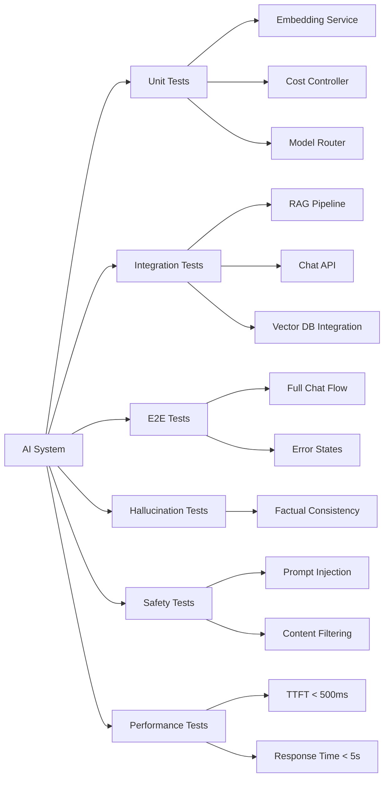

# AI Testing Strategy

> **Document:** `AI-TESTING.md` | **Version:** 1.0 | **Last Updated:** July 2026  
> **Status:** 🔄 Draft | **Owner:** AI Architect | **Review Cadence:** Monthly  
> **Related:** [TestingArchitecture.md](./TestingArchitecture.md) | [AI Requirements (PRD §18)](../01-product/ProductRequirements.md#18-ai-requirements)

---

## Current State Assessment

The AI service (`apps/ai/`) is a FastAPI application that is **partially implemented**. The following reflects actual (not aspirational) capabilities:

| Component            | Status                | Notes                                     |
| -------------------- | --------------------- | ----------------------------------------- |
| FastAPI app skeleton | ✅ Implemented   | `app/main.py` with basic health endpoint  |
| Embedding service    | ❌ Not implemented | Design exists in docs only                |
| RAG pipeline         | ❌ Not implemented | Retrieval + generation not wired          |
| Chat API             | ❌ Not implemented | No chat endpoint deployed                 |
| Cost controller      | ❌ Not implemented | No budget enforcement                     |
| Model router         | ❌ Not implemented | Single-model direct call only             |
| LLM integration      | 🟡 Partial      | OpenAI SDK installed, no production usage |

**This strategy defines the testing approach for each component as it is built.** Sections marked "[PLANNED]" are not yet implemented.

---

## AI Test Types



## Testing Layers for AI Features

### 1. Unit Testing (AI Service)

Test individual components of the FastAPI service in isolation.

| Component             | Test Coverage                                                   | Priority | Status               |
| --------------------- | --------------------------------------------------------------- | -------- | -------------------- |
| **Embedding service** | Vector generation correctness, batch processing, error handling | High     | 🔴 Not started |
| **RAG service**       | Retrieval accuracy, chunking logic, context window management   | High     | 🔴 Not started |
| **Cost controller**   | Budget enforcement at limits, spend tracking accuracy           | Medium   | 🔴 Not started |
| **Model router**      | Model selection by prompt type, fallback on failure             | Medium   | 🔴 Not started |
| **Health endpoint**   | Returns 200, reflects dependency status                         | Low      | 🟢 Existing    |

**Framework:** pytest with pytest-asyncio for async endpoint tests.  
**Location:** `apps/ai/tests/unit/`  
**CI trigger:** Every PR touching `apps/ai/`

### 2. Integration Testing (AI Pipeline) [PLANNED]

Test components working together with real dependencies.

| Test Suite            | What It Covers                                                                 | Status               |
| --------------------- | ------------------------------------------------------------------------------ | -------------------- |
| RAG pipeline          | End-to-end: embed query → retrieve chunks → generate answer      | 🔴 Not started |
| Chat API              | Request/response cycle: validate input → process → format output | 🔴 Not started |
| Context assembly      | Verify context window management with variable-length inputs                   | 🔴 Not started |
| Vector DB integration | Embed → store → search → verify results                   | 🔴 Not started |

**Framework:** pytest + httpx (async HTTP client).  
**Location:** `apps/ai/tests/integration/`  
**CI trigger:** Nightly (not on PR — too slow).

### 3. End-to-End Testing (AI Chat) [PLANNED]

Test the full user-facing flow through the web application.

| Test Case               | What It Verifies                                                       | Status               |
| ----------------------- | ---------------------------------------------------------------------- | -------------------- |
| Full chat flow          | Message typed → AI responds → response displayed in UI   | 🔴 Not started |
| Error: API down         | AI service unavailable → friendly error message shown           | 🔴 Not started |
| Error: timeout          | Slow LLM response → timeout handling → retry or fallback | 🔴 Not started |
| Error: invalid response | Malformed LLM output → graceful degradation                     | 🔴 Not started |
| Rate limiting           | User exceeds limit → 429 displayed correctly                    | 🔴 Not started |
| Empty state             | No messages yet → welcome prompt displayed                      | 🔴 Not started |

**Framework:** Playwright (via existing `apps/web` E2E setup).  
**Location:** `apps/web/e2e/ai-chat.spec.ts`  
**CI trigger:** Nightly.

### 4. Evaluation Testing [PLANNED]

Measure quality and performance metrics — distinct from pass/fail unit tests.

| Metric                         | Target        | Measurement Method                          | Status               |
| ------------------------------ | ------------- | ------------------------------------------- | -------------------- |
| **Precision@K**                | > 0.8         | Retrieved relevant chunks / total retrieved | 🔴 Not started |
| **Recall@K**                   | > 0.7         | Retrieved relevant chunks / total relevant  | 🔴 Not started |
| **Mean Reciprocal Rank (MRR)** | > 0.85        | Rank position of first relevant result      | 🔴 Not started |
| **Response relevance**         | > 4/5 avg     | Human eval or LLM-as-judge scoring          | 🔴 Not started |
| **Hallucination rate**         | < 5%          | Factual consistency checks against source   | 🔴 Not started |
| **TTFT (time to first token)** | < 500ms (P95) | Instrumented in middleware                  | 🔴 Not started |
| **Total response time**        | < 5s (P95)    | Instrumented in middleware                  | 🔴 Not started |
| **Monthly LLM cost**           | < budget      | Cost controller logs                        | 🔴 Not started |

**Eval framework:** Custom pytest suite in `apps/ai/tests/eval/`.  
**CI trigger:** Weekly (Sundays). Results posted to Slack.

---

## Test Data Management

### Embeddings Test Dataset [PLANNED]

- Curated set of 50 portfolio-relevant Q&A pairs
- Mix of factual (project details), conceptual (architecture decisions), and edge cases
- Stored in `apps/ai/tests/fixtures/qa-pairs.json`
- Each pair has: `question`, `expected_answer`, `source_chunks`, `difficulty`

### LLM Response Mocking

- Use `pytest-recording` (vcr.py) to record/replay LLM API responses
- Recorded cassettes stored in `apps/ai/tests/cassettes/`
- Redact API keys from recorded responses before committing
- Re-record cassettes when prompts or models change

### Factories

| Factory            | Purpose                                               | Status               |
| ------------------ | ----------------------------------------------------- | -------------------- |
| `EmbeddingFactory` | Generate deterministic embedding vectors for tests    | 🔴 Not started |
| `ChunkFactory`     | Create document chunks with controlled overlap        | 🔴 Not started |
| `ContextFactory`   | Build test context windows with specific token counts | 🔴 Not started |

---

## CI/CD Integration

| Gate                  | Frequency                    | What Runs                     | Blocking?              |
| --------------------- | ---------------------------- | ----------------------------- | ---------------------- |
| **Unit tests**        | Every PR touching `apps/ai/` | pytest unit suite             | ✅ Yes            |
| **Type checking**     | Every PR                     | mypy on `apps/ai/`            | ✅ Yes            |
| **Integration tests** | Nightly                      | pytest integration suite      | ❌ No (report only) |
| **Eval suite**        | Weekly (Sun)                 | pytest eval suite             | ❌ No (report only) |
| **Cost monitoring**   | Daily (cron)                 | Budget check script           | ❌ Alert on overage |
| **Contract tests**    | Every PR                     | Verify AI API response schema | ✅ Yes            |

### CI Steps (to be added to `.github/workflows/`)

```yaml
# ai-tests.yml (proposed)
# - Run: pytest apps/ai/tests/unit -v
# - Run: mypy apps/ai/
# - Run: pytest apps/ai/tests/contract/
```

---

## What We Have vs. What We Need

| Capability        | Currently            | Target (Q4 2026)            |
| ----------------- | -------------------- | --------------------------- |
| Unit tests        | Health endpoint only | All 5 components covered    |
| Integration tests | None                 | RAG + Chat full pipeline    |
| E2E tests         | None                 | 6 Playwright test cases     |
| Eval framework    | None                 | Automated weekly scoring    |
| Test data         | None                 | Curated dataset + factories |
| CI integration    | None                 | PR gate + nightly + weekly  |
| Cost tracking     | Manual               | Automated daily             |

---

## Risks & Mitigations

| Risk                                            | Likelihood | Impact | Mitigation                                                                              |
| ----------------------------------------------- | ---------- | ------ | --------------------------------------------------------------------------------------- |
| LLM API costs for test suite too high           | Medium     | High   | Use mock/record-replay for unit tests; eval runs limited to weekly                      |
| Non-deterministic LLM output causes flaky tests | High       | Medium | Use semantic similarity assertions, not exact match; record/replay for deterministic CI |
| Staging AI service unavailable                  | Low        | Medium | Tests should handle connection errors gracefully; mock by default                       |
| Embedding drift after model update              | Medium     | Medium | Re-record eval baselines on model change; track eval scores over time                   |

---

## AI Evaluation Flow

```mermaid
sequenceDiagram
    participant U as User
    participant C as Chat API
    participant M as LLM Model
    participant E as Evaluator
    participant DB as Results DB

    U->>C: Send Message
    C->>M: Forward Prompt
    M-->>C: Generate Response
    C-->>U: Stream Response
    C->>E: Send Response for Evaluation
    E->>E: Score Response
    E->>DB: Store Score
    DB-->>E: Historical Avg
    E-->>C: Pass / Fail
    alt Pass
        C-->>U: ✅ Response Approved
    else Fail
        C-->>U: ⚠️ Response Flagged
        U->>C: Request Alternative
    end
```



_Document Version: 1.0 — AI Testing Strategy_  
_Status: 🔄 Draft — not yet implemented. This document defines the testing strategy to be built alongside the AI service._  
_Last Updated: July 2026_  
_Next Review Date: August 2026_

## Cross-References

- [../MASTER-INDEX.md](../MASTER-INDEX.md) — Documentation master index
- [../26-reference/CROSS-REFERENCE-INDEX.md](../26-reference/CROSS-REFERENCE-INDEX.md) — Cross-reference system
