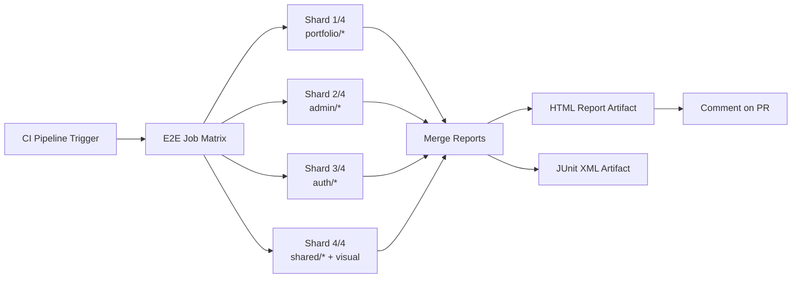
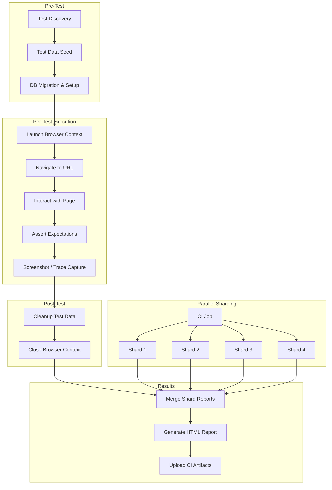

# End-to-End (E2E) Testing Strategy

> **Document:** `E2EStrategy.md` | **Version:** 2.0 | **Last Updated:** July 2026
> **Status:** ✅ Active | **Owner:** QA Lead

## 1. Purpose

End-to-End testing simulates real user scenarios across the entire stack of the Ultimate Portfolio. Our primary tool for E2E testing is Playwright. This document defines the scope, organization, data strategy, CI integration, and coverage targets.

## 2. Tooling & Browser Coverage

### 2.1 Current

- **Tool:** Playwright test runner configured in `apps/web` workspace
- **Browsers:** Chromium (Desktop Chrome)
- **Configuration:** See `apps/web/playwright.config.ts`
  - `testDir: './e2e'`
  - `reporter: ['html', 'list']`
  - `trace: 'on-first-retry'`, `screenshot: 'only-on-failure'`
  - `retries: 2` in CI, `fullyParallel: true`
  - `workers: 1` in CI to reduce contention

### 2.2 Planned Expansion (Q3 2026)

- **Firefox:** Enable Firefox project in Playwright config for cross-browser smoke tests on critical user journeys.
- **WebKit:** Enable WebKit for Safari-specific layout and rendering checks.
- **Mobile viewports:** Simulate iPhone 12 (390px) and iPad (768px) for responsive regression testing.

### 2.3 Browser Matrix

| Browser  | Status            | Scope               | Run Frequency      |
| -------- | ----------------- | ------------------- | ------------------ |
| Chromium | ✅ Active    | All E2E tests       | Every PR + nightly |
| Firefox  | 🔄 Planned | Critical paths only | Nightly            |
| WebKit   | 🔄 Planned | Critical paths only | Nightly            |

## 3. Test Organization

### 3.1 Directory Structure

Tests live in `apps/web/e2e/` organized by domain:

```
e2e/
  portfolio/
    homepage.spec.ts
    projects.spec.ts
    blog.spec.ts
    contact.spec.ts
    ai-chat.spec.ts
  admin/
    auth.spec.ts
    projects-crud.spec.ts
    blog-crud.spec.ts
    dashboard.spec.ts
    users.spec.ts
  auth/
    login.spec.ts
    logout.spec.ts
    oauth.spec.ts
  shared/
    navigation.spec.ts
    footer.spec.ts
```

### 3.2 Naming Convention

- Files: `kebab-case.spec.ts`
- Test blocks: `describe('[Page/Feature] - [Scenario]')`
- Individual tests: `should [expected behavior] when [condition]`

## 4. Scope of E2E Tests

### 4.1 Portfolio Visitor — Critical Journeys (P0)

- **Homepage:** Page load, 3D scene initialization, hero content visible, navigation links functional.
- **Project detail:** Navigate from project grid to detail view, verify content loads, verify route.
- **Blog:** List posts, filter by category, open individual post, verify markdown rendering.
- **Contact form:** Fill and submit form, verify validation errors, verify success state.
- **AI Chatbot:** Open chat panel, send message, receive streamed response, verify history persists.

### 4.2 Admin User — CRUD Flows (P1)

- **Authentication:** Login with valid credentials, redirect to dashboard, persist JWT across page loads.
- **Projects CRUD:** Create new project with all fields, update existing project, delete project, verify changes reflected on portfolio.
- **Blog CRUD:** Create, edit, delete blog posts. Verify markdown editor works, image uploads.
- **Dashboard:** View analytics data, filter by date range, verify charts render.
- **User management:** View users, change roles, verify RBAC enforcement.

### 4.3 Auth Flows (P1)

- **Login:** Email/password login, error states (wrong password, non-existent user).
- **Logout:** Clear session, redirect to login, verify protected routes inaccessible.
- **OAuth:** Google OAuth flow, GitHub OAuth flow, first-time vs returning user.
- **Token refresh:** Verify access token refresh, handle expired token gracefully.

## 5. Data Management Strategy

### 5.1 Test Data Seeding

- Prisma seed scripts (`npm run prisma:seed`) initialize a known state before each E2E run.
- Seed data includes: 5 portfolio projects, 3 blog posts, 2 admin users (admin + editor roles), 1 visitor user.
- AI chat fixtures use mocked LLM responses to ensure deterministic results.

### 5.2 Isolation & Cleanup

- Tests that mutate data (Admin CRUD) use isolated test records identified by a test run UUID.
- AfterEach hook removes records created during the test.
- Tests that only read data can run in parallel; tests that write run serially.

### 5.3 Database Strategy

- **Local:** SQLite or local Postgres via Docker.
- **CI:** Supabase test branch (ephemeral) created per pipeline run, destroyed after completion.
- **Production:** No E2E tests run against production data. Smoke tests use read-only endpoints.

## 6. CI/CD Integration

### 6.1 Pipeline Triggers

- **On every PR targeting `main`:** Full Chromium suite runs. Blocking gate for merge.
- **Nightly:** Full cross-browser suite (Chromium + Firefox + WebKit) on `main`.

### 6.2 CI Setup

Postgres service container configured in GitHub Actions. Steps: npm ci, Playwright install, Prisma generate + migrate + seed, then `npx playwright test --shard=${{ matrix.shard }}/${{ strategy.job-total }}`.

### 6.3 Sharding

- E2E tests are sharded across 4 parallel CI jobs to reduce runtime.
- Shards are distributed evenly by test file count.
- Target total E2E execution time: < 15 minutes.

### Playwright Sharding



### 6.4 Web Server

- Playwright starts the Next.js dev server automatically (`npm run dev`).
- In CI, the app is pre-built and served with `next start` for faster startup.
- Health check pings `http://localhost:3000` before tests begin.

### E2E Test Execution Flow



## 7. Reporting & Debugging

### 7.1 Report Artifacts

- **HTML report:** Full interactive report with test timings, traces, and screenshots. Uploaded as CI artifact.
- **Trace viewer:** Playwright trace (`trace.zip`) captured on test failure. Includes network requests, DOM snapshots, and console logs.
- **Screenshots:** Captured on every test failure. Named by test title and timestamp.
- **Video:** Recorded for all tests in CI (optional, enabled per run).

### 7.2 Triage Workflow

1. Developer reviews failed tests in the Playwright HTML report.
2. For flaky tests, examine trace to distinguish real regression vs. race condition.
3. Flaky tests are quarantined to a separate CI job and investigated within 1 sprint.
4. Tests that remain flaky after 2 sprints are rewritten or removed.

## 8. Visual Regression Testing

Given the highly visual nature of the portfolio (Framer Motion, React Three Fiber):

- Screenshot comparisons (`expect(page).toHaveScreenshot()`) on key pages.
- Snapshots stored in `e2e/snapshots/`, reviewed on PR.
- 3D canvas rendering uses specialized thresholds (0.5 maxDiffPixels) due to non-deterministic WebGL output.
- Visual tests run on Chromium only; cross-browser visual differences are tracked separately.

## 9. Coverage Targets

| Category            | Target                | Current | Measurement                               |
| ------------------- | --------------------- | ------- | ----------------------------------------- |
| Critical paths (P0) | 100%                  | ~85%    | Test files covering each critical journey |
| Admin flows (P1)    | 50%                   | ~30%    | CRUD operations for each entity           |
| Auth flows          | 90%                   | ~60%    | Login, logout, OAuth, token refresh       |
| Cross-browser       | 50% of critical paths | 0%      | Firefox + WebKit enabled                  |
| Visual regression   | Key pages only        | ~20%    | Screenshot comparison count               |

## Cross-References

- [../MASTER-INDEX.md](../MASTER-INDEX.md) — Documentation master index
- [../26-reference/CROSS-REFERENCE-INDEX.md](../26-reference/CROSS-REFERENCE-INDEX.md) — Cross-reference system
