# Load Test Specification

## Test Objectives

- Verify the platform can handle target traffic
- Identify performance bottlenecks
- Validate scaling behavior
- Establish performance baseline

## Load Test Scenario

```mermaid
flowchart LR
    A[Warm-up<br/>0→50 VUs<br/>2 min] --> B[Ramp-up<br/>50→500 VUs<br/>5 min]
    B --> C[Steady State<br/>500 VUs<br/>10 min]
    C --> D[Stress Peak<br/>500→1000 VUs<br/>3 min]
    D --> E[Sustained Peak<br/>1000 VUs<br/>5 min]
    E --> F[Ramp-down<br/>1000→0 VUs<br/>3 min]
    F --> G[Cool-down<br/>0 VUs<br/>1 min]

    style A fill:#2563eb,color:#fff
    style C fill:#16a34a,color:#fff
    style D fill:#ea580c,color:#fff
    style E fill:#dc2626,color:#fff
    style G fill:#6b7280,color:#fff
```

## Target Metrics

| Metric                | Target  | Method         |
| --------------------- | ------- | -------------- |
| Concurrent users      | 500     | k6 / Artillery |
| Requests per second   | 100     | k6             |
| P95 API response time | < 200ms | k6             |
| P99 API response time | < 500ms | k6             |
| Error rate            | < 0.1%  | k6             |
| Page load (LCP)       | < 2.5s  | Lighthouse CI  |

## Test Scenarios

### Scenario 1: Public Portfolio Traffic

Simulate visitor browsing the public portfolio:

- Landing page (30% of traffic)
- Project listing + detail (25%)
- Blog listing + detail (20%)
- About page (15%)
- Contact form submission (10%)

### Scenario 2: Admin Dashboard

Simulate admin user operations:

- Dashboard load (20%)
- Content CRUD operations (50%)
- Media upload (10%)
- Analytics view (20%)

### Scenario 3: AI Chat

Simulate AI assistant usage:

- Chat initiation (30%)
- Message exchange (50%)
- File analysis (20%)

## Test Data

- Use seeded database with realistic content
- Automated test data generation
- Cleanup after test execution

## Test Environment

- Staging environment (mirrors production)
- Dedicated test database
- No external rate limiting

## Reporting

- Pass/fail per scenario
- Latency distribution (p50, p95, p99)
- Error breakdown
- Resource utilization
- Comparison with previous runs

## Schedule

- Full load test: Monthly
- Smoke test: Per release
- Continuous: Subset in CI (nightly)

## Cross-References

- [../MASTER-INDEX.md](../MASTER-INDEX.md) — Documentation master index
- [../26-reference/CROSS-REFERENCE-INDEX.md](../26-reference/CROSS-REFERENCE-INDEX.md) — Cross-reference system
