# Mobile Testing Strategy

## Overview

Testing approach for mobile and tablet form factors.

## Mobile Test Matrix

```mermaid
flowchart TB
    subgraph Devices[Device Types]
        D1[Smartphone]
        D2[Tablet]
        D3[Foldable]
    end

    subgraph OS[OS Versions]
        O1[iOS 16/17/18]
        O2[Android 13/14/15]
    end

    subgraph Screens[Screen Sizes]
        S1[375×667]
        S2[390×844]
        S3[414×896]
        S4[768×1024]
        S5[1024×1366]
    end

    subgraph Network[Network Conditions]
        N1[Wi-Fi]
        N2[4G LTE]
        N3[3G]
        N4[Offline]
    end

    D1 --> OS
    D2 --> OS
    D3 --> OS
    OS --> Screens
    Screens --> Network
```

## Device Coverage

| Category | Devices                              | Screen Sizes                          |
| -------- | ------------------------------------ | ------------------------------------- |
| Phone    | iPhone 14/15, Pixel 7/8, Samsung S23 | 375x667, 390x844, 414x896             |
| Tablet   | iPad Air, iPad Pro, Samsung Tab      | 768x1024, 834x1194, 1024x1366         |
| Foldable | Galaxy Fold                          | 717x512 (folded), 717x1024 (unfolded) |

## Test Scenarios

### Responsive Layout

- All pages render at each breakpoint
- No horizontal scroll
- Images scale correctly
- Text is readable (no truncation)
- Touch targets are at least 44x44px

### Navigation

- Mobile hamburger menu opens/closes
- Bottom navigation if applicable
- Back button behavior
- Search functionality

### Touch Interactions

- Tap, swipe, pinch-to-zoom
- Long press for context menus
- Drag and drop on mobile admin
- Hover state equivalents

### Performance

- 3G/4G network throttling
- CPU throttling (slow devices)
- Memory constraints
- Battery impact

### Native Features

- Camera (if applicable)
- File upload from phone gallery
- Copy/paste
- Share sheet integration
- Deep linking

## Testing Tools

- Playwright device emulation
- BrowserStack / Sauce Labs for real devices
- Chrome DevTools device emulation for quick checks

## Automation

- Responsive layout checks: Automated (Playwright)
- Touch interactions: Manual
- Real device testing: Manual (weekly)
- Performance: Automated (Lighthouse)

## Cross-References
- [../MASTER-INDEX.md](../MASTER-INDEX.md) — Documentation master index
- [../26-reference/CROSS-REFERENCE-INDEX.md](../26-reference/CROSS-REFERENCE-INDEX.md) — Cross-reference system