# Performance Testing Strategy

> **Document:** `PerformanceTesting.md` | **Version:** 2.0 | **Last Updated:** July 2026
> **Status:** ✅ Active | **Owner:** Performance Lead

## 1. Objective

The Ultimate Portfolio must deliver a premium, high-performance experience. Web metrics must meet Google's Core Web Vitals standards, 3D experiences must maintain high frame rates, and API/AI responses must be snappy. Performance budgets are enforced in CI — failing the build if exceeded.

## 2. Performance Budgets

| Metric                       | Target            | Measurement Tool      | CI Enforcement      |
| ---------------------------- | ----------------- | --------------------- | ------------------- |
| LCP                          | < 2.5s            | Lighthouse CI         | ✅ Fail build  |
| FID / INP                    | < 100ms / < 200ms | Lighthouse CI + RUM   | ✅ Fail build  |
| CLS                          | < 0.1             | Lighthouse CI         | ✅ Fail build  |
| TTFB                         | < 200ms           | Lighthouse CI         | ⚠️ Warning |
| First Contentful Paint       | < 1.8s            | Lighthouse CI         | ✅ Fail build  |
| Time to Interactive          | < 3.5s            | Lighthouse CI         | ✅ Fail build  |
| Lighthouse Performance       | >= 90             | Lighthouse CI         | ✅ Fail build  |
| Lighthouse Accessibility     | >= 95             | Lighthouse CI         | ✅ Fail build  |
| Lighthouse Best Practices    | >= 90             | Lighthouse CI         | ✅ Fail build  |
| Lighthouse SEO               | >= 95             | Lighthouse CI         | ✅ Fail build  |
| Bundle size (critical route) | < 150KB gzipped   | @next/bundle-analyzer | ✅ Fail build  |
| API P95 latency              | < 150ms           | k6                    | ⚠️ Warning |
| AI TTFT                      | < 1.0s            | k6                    | ✅ Fail build  |

## 3. Frontend Performance (Web — Next.js)

### 3.1 Lighthouse CI

- **Run on every PR:** Lighthouse CI runs against the preview deployment.
- **Budget enforcement:** If any metric exceeds budget, CI fails. PR cannot merge.
- **Budgets defined in:** `.lighthouserc.js` at the repo root.

### Lighthouse CI Flow

```mermaid
flowchart LR
    PR[PR Opened / Updated] --> Trigger[Trigger Lighthouse CI]

    Trigger --> Build[Build Preview Deployment]

    Build --> Audit["Audit Pages<br/>/ , /blog , /projects"]
    Audit --> Scores[Collect Metrics<br/>LCP / CLS / INP / TBT]

    Scores --> Compare[Compare vs Baselines]

    Compare --> Pass{"All Budgets Met?"}

    Pass -->|Yes| Success["✅ Pass<br/>Comment on PR"]
    Pass -->|No / Unknown| Baseline{New Baseline?}

    Baseline -->|Yes| SetBaseline["Set New Baseline<br/>Tag as 'pass'"]
    Baseline -->|No| Fail["❌ Fail<br/>Block Merge"]

    Success --> Upload[Upload Report<br/>to temporary storage]
    Fail --> Upload

    SetBaseline --> Success
```

### 3.2 Core Web Vitals Monitoring

- **Real User Monitoring (RUM):** Vercel Analytics captures real user CWV data.
- **Dashboard:** Weekly review dashboard in Sentry Performance.
- **Alerting:** If LCP > 3.0s for > 5% of users over 1 hour, SEV-3 alert fires.

### 3.3 3D / WebGL Performance (React Three Fiber)

- **Target:** 60 FPS on desktop, 30+ FPS on mid-tier mobile.
- **Monitoring:** stats.js during development for draw calls and FPS. GPU tiering for progressive enhancement.
- **Budget:** < 200 draw calls per scene, < 500k vertices total.

### 3.4 Animation Performance

- Framer Motion animations target 60 FPS; `will-change` transform hints applied.
- GSAP animations prefer transforms and opacity (GPU-composited properties).
- Heavy scroll animations delegate to Lenis for smooth, efficient scrolling.
- `requestAnimationFrame` throttling for non-visible elements.

## 4. Bundle Analysis

### 4.1 Tooling

- **@next/bundle-analyzer:** Generates interactive treemap of bundle composition.
- Run manually: `ANALYZE=true npm run build`
- Automated on nightly pipeline, report uploaded as CI artifact.

### 4.2 Size Regression Check

- PRs with new dependencies must include bundle size comparison screenshots.
- Automated check compares `next build` output size against `main` baseline.
- Threshold: +5% or +50KB (whichever is lower) triggers warning; +10% fails.

### 4.3 Bundle Optimization Rules

- UI libraries imported via path (not barrel index) to enable tree-shaking.
- Three.js imported as `@react-three/fiber` (no direct Three.js import when possible).
- Chart libraries (if added) must use dynamic import with `next/dynamic`.
- Moment.js prohibited; use `date-fns` or native `Intl` instead.

## 5. API Performance (NestJS)

### 5.1 Latency Targets

| Endpoint Group              | P95 Target  | Caching Strategy              |
| --------------------------- | ----------- | ----------------------------- |
| Portfolio (public, read)    | < 100ms     | `@CacheTTL` (Redis, 5 min)    |
| Admin CRUD                  | < 200ms     | Redis cache with invalidation |
| Auth (login, token refresh) | < 300ms     | No caching                    |
| AI Chat (stream)            | < 1.0s TTFT | No caching                    |

### 5.2 k6 Load Test Scenarios

- **Scenario 1 — Peak Traffic:** Simulate 100 concurrent users hitting portfolio endpoints for 5 minutes.
- **Scenario 2 — Sustained Load:** 50 concurrent users, 30-minute steady state. Measure memory leak indicators.
- **Scenario 3 — Stress Test:** Ramp from 0 to 500 concurrent users over 10 minutes. Identify breaking point.
- **Scenario 4 — Spike Test:** Sudden jump from 10 to 200 users. Measure recovery time.

### k6 Load Test Pipeline

```mermaid
sequenceDiagram
    participant Dev as Developer
    participant Script as k6 Script
    participant Runner as k6 Runner
    participant Influx as InfluxDB
    participant Grafana as Grafana

    Dev->>Script: Write test scenario
    Dev->>Runner: Execute: k6 run script.js

    rect rgb(200, 230, 255)
        Note over Runner: Stage 1: Ramp-Up
        Runner->>Runner: 0 → 100 VUs over 2 min
    end

    rect rgb(200, 255, 200)
        Note over Runner: Stage 2: Steady State
        Runner->>Runner: 100 VUs for 5 min
    end

    rect rgb(255, 230, 200)
        Note over Runner: Stage 3: Ramp-Down
        Runner->>Runner: 100 → 0 VUs over 1 min
    end

    Runner->>Influx: Stream metrics<br/>(p50/p95/p99, RPS, errors)
    Influx->>Grafana: Query time-series data
    Grafana->>Dev: Real-time dashboard<br/>Latency / Throughput / Error Rate

    Runner->>Dev: End-of-test summary report
```

### 5.3 Critical Endpoints to Load Test

- GET `/api/portfolio/projects` — Portfolio project listing (most requested).
- GET `/api/portfolio/projects/:slug` — Project detail.
- GET `/api/portfolio/blog` — Blog post listing.
- POST `/api/portfolio/contact` — Contact form submission.
- POST `/api/admin/auth/login` — Authentication endpoint.
- GET `/api/portfolio/ai/chat` — AI chat streaming.

## 6. AI Service Performance (FastAPI)

### 6.1 Targets

- **TTFT (Time to First Token):** < 1.0s for streaming AI chat responses.
- **Total response time:** < 5s for average query.
- **RAG retrieval time:** < 200ms for vector search (pgvector).
- **LLM provider latency:** p95 < 3s (including network).

### 6.2 Monitoring

- End-to-end latency tracked per request.
- LLM provider latency isolated (OpenAI vs Anthropic).
- RAG query time monitored separately.
- Token consumption tracked per session and per user.

### 6.3 Optimization

- Vector embeddings cached in Redis for frequent queries.
- Streaming response to minimize user-perceived latency.
- Prompt caching used for system prompts and common prefixes.
- Rate limiting at 10 requests/minute for unauthenticated users.

## 7. Backend Performance (General)

### 7.1 Database Performance

- **Connection pooling:** Prisma via pgBouncer or Supabase pooler.
- **Query optimization:** Prisma query logging in development. N+1 detection via PrismaClient middleware.
- **Indexing:** All foreign keys and frequently queried columns indexed. Review query plans for new joins.
- **Migration impact:** Every migration includes a performance impact assessment.

### 7.2 Caching Architecture

- **NestJS @CacheTTL:** In-memory cache for public portfolio endpoints (5 min TTL).
- **Redis (BullMQ):** Background job processing. Cache for API responses (optional, advanced).
- **Next.js ISR:** Static pages revalidated every 60s for portfolio content.
- **Browser caching:** Static assets (images, fonts, JS bundles) with 1-year TTL.

## 8. Continuous Profiling & Monitoring

### 8.1 Tools

- **Sentry Performance:** Traces for every API request and page load.
- **Vercel Analytics:** Real User Monitoring for Core Web Vitals.
- **k6:** Scheduled load tests on staging environment (weekly).

### 8.2 Profiling Schedule

| Activity             | Frequency          | Environment       |
| -------------------- | ------------------ | ----------------- |
| Lighthouse CI        | Every PR + nightly | Preview + Staging |
| k6 benchmark         | Weekly             | Staging           |
| Bundle analysis      | Weekly             | Production build  |
| RUM review           | Weekly             | Production        |
| Database query audit | Monthly            | Staging           |

## 9. Performance Regression Process

1. **Detection:** Alert fires or CI fails due to budget exceedance.
2. **Diagnosis:** Developer identifies the source (new dependency, unoptimized query, missing cache).
3. **Fix:** Performance fix is prioritized as P1 (blocks release).
4. **Verification:** Run Lighthouse or k6 again to confirm metric returns to budget.
5. **Documentation:** Root cause and fix recorded in PR description.

## Cross-References

- [../MASTER-INDEX.md](../MASTER-INDEX.md) — Documentation master index
- [../26-reference/CROSS-REFERENCE-INDEX.md](../26-reference/CROSS-REFERENCE-INDEX.md) — Cross-reference system
