# Quality Assurance — Enterprise-Grade QA Framework

> **Document:** `30-QA.md` | **Version:** 5.0 | **Last Updated:** June 2026  
> **Status:** ✅ Active | **Owner:** QA Lead | **Review Cadence:** Monthly  
> **Classification:** Enterprise Architecture | **QA Stack:** 12 tools | **Bug Severity Levels:** 4  
> **Release Gate Model:** 5-Stage | **Sign-Off Requirements:** 4 Signatories  
> **Mermaid Diagrams:** 11 | **Test Case Count:** 250+ | **Release Gates:** 5-Stage

---

## Table of Contents

1. [QA Vision & North Star](#1-qa-vision--north-star)
2. [Enterprise QA Standards](#2-enterprise-qa-standards)
3. [Executive Summary](#3-executive-summary)
4. [QA Strategy](#4-qa-strategy)
5. [QA Workflow](#5-qa-workflow)
6. [Bug Severity Matrix](#6-bug-severity-matrix)
7. [Bug Priority Matrix](#7-bug-priority-matrix)
8. [Test Plans](#8-test-plans)
9. [Acceptance Testing](#9-acceptance-testing)
10. [Smoke Testing](#10-smoke-testing)
11. [Regression Testing](#11-regression-testing)
12. [Release Validation](#12-release-validation)
13. [Release Gates](#13-release-gates)
14. [Sign-Off Process](#14-sign-off-process)
15. [Bug Triage Process](#15-bug-triage-process)
16. [QA Metrics & KPIs](#16-qa-metrics--kpis)
17. [QA Environment Strategy](#17-qa-environment-strategy)
18. [Test Case Management](#18-test-case-management)
19. [QA Automation Strategy](#19-qa-automation-strategy)
20. [Defect Management](#20-defect-management)
21. [QA Governance](#21-qa-governance)
22. [QA Checklist](#22-qa-checklist)
23. [Enterprise Standards & Compliance](#23-enterprise-standards--compliance)
24. [Change Log](#24-change-log)

---

## 1. QA Vision & North Star

### 1.1 QA Vision Statement

> **"Every release delivers a flawless, secure, accessible, and high-performance experience — validated through rigorous quality gates, automated verification, and human expertise. Zero P0/P1 bugs reach production."**

Quality Assurance is not a final checkpoint — it is a **continuous discipline** embedded into every stage of the development lifecycle. From story refinement through design review, development, testing, deployment, and post-release monitoring, QA provides the safety net that ensures every code change improves the product without breaking existing functionality.

### 1.2 Strategic Objectives

| Objective | Target | Timeframe | Owner |
|-----------|--------|-----------|-------|
| **Production defect escape rate** | < 1 P0/P1 per quarter | Baseline | QA Lead |
| **Release validation pass rate** | 100% of gates pass before production | Q3 2026 | QA Lead |
| **Test automation coverage** | ≥ 90% of regression suite automated | Q3 2026 | QA Lead |
| **Smoke test execution time** | < 10 minutes | Q3 2026 | DevOps Lead |
| **Full regression suite** | < 30 minutes | Q4 2026 | DevOps Lead |
| **Bug resolution SLA** | P0 < 4h, P1 < 24h, P2 < 72h | Baseline | Full Team |
| **Sign-Off cycle time** | < 1 business day per release | Q3 2026 | QA Lead |
| **Test case effectiveness** | ≥ 80% of bugs found via planned tests | Q4 2026 | QA Lead |

### 1.3 QA Promise

```text
To our stakeholders:
- Every release passes 5 quality gates before reaching production
- Every reported bug is triaged within 2 hours
- Severity and priority are assigned transparently with documented rationale
- Release validation includes functional, visual, performance, security, and accessibility verification
- Regression testing covers 100% of critical user flows
- Sign-off requires documented evidence from all validation stages
- Test results are transparent, actionable, and reviewed weekly
```

### 1.4 QA Principles

| # | Principle | Description | Implementation |
|---|-----------|-------------|----------------|
| P1 | **Quality is everyone's responsibility** | QA enables quality; developers build quality | Shared defect ownership, dev-QA pairing |
| P2 | **Shift-left quality** | Find defects as early as possible — static analysis first, then unit, then integration, then QA | CI gates catch 80%+ of defects before QA review |
| P3 | **Risk-based testing** | Allocate test effort proportional to business risk and impact | Risk matrix drives test plan depth |
| P4 | **Evidence-based sign-off** | Release approval requires documented evidence from all validation stages | Sign-off checklist with artifact links |
| P5 | **Automate everything automatable** | Manual QA focuses on exploration, usability, and edge cases | Automation covers regression, smoke, and performance |
| P6 | **Traceability** | Every test case traces to a requirement; every bug traces to a test case (or gap) | Requirements → Tests → Defects traceability matrix |
| P7 | **Continuous improvement** | Every release includes a retrospective on QA process effectiveness | QA improvement backlog updated per release |
| P8 | **Transparent metrics** | QA status, defect trends, and release readiness are visible to all stakeholders | QA dashboard updated in real-time |
| P9 | **Environment parity** | QA environments mirror production configuration and data patterns | Staging environment with production-like data |
| P10 | **Security & accessibility first** | Security and accessibility are not optional gates — they are core quality attributes | Blocking gates at every release stage |

---

## 2. Enterprise QA Standards

### 2.1 Standard Alignment

| Standard | Requirement | Our Compliance | Verification | Status |
|----------|-------------|---------------|--------------|--------|
| **ISO/IEC 25010** | Software quality model (8 characteristics) | ✅ Functional, reliability, performance, security, maintainability, compatibility, usability, portability | Full QA strategy across 8 dimensions | ✅ Compliant |
| **ISTQB Foundation** | Test levels, types, techniques | ✅ Unit, integration, system, acceptance — functional + non-functional | Test pyramid + QA workflow | ✅ Compliant |
| **ISTQB Advanced** | Test management, process improvement | ✅ Test metrics, defect management, risk-based testing | QA metrics dashboard + improvement cycle | ✅ Compliant |
| **IEEE 829** | Test documentation standards | ✅ Test plans, test cases, test reports follow IEEE format | Test case management system | ✅ Compliant |
| **OWASP ASVS L2** | 195 security controls | ✅ All Level 2 controls tested | Security test suite + ZAP scan | ✅ Compliant |
| **WCAG 2.2 AA** | 35 accessibility criteria | ✅ Automated + manual testing | axe-core + Playwright a11y + manual audit | ✅ Compliant |

### 2.2 QA Maturity Model

| Level | Name | Characteristics | Current Status | Target Date |
|-------|------|----------------|---------------|-------------|
| **L1** | Initial | Ad-hoc testing, no defined process, manual only | — | — |
| **L2** | Defined | Test plans exist, basic QA process, manual regression | — | — |
| **L3** | Managed | Automated regression, defined release gates, defect tracking | ✅ Current | — |
| **L4** | Measured | Risk-based testing, predictive defect modeling, QA metrics-driven | 🎯 Target | Q4 2026 |
| **L5** | Optimizing | AI-assisted test generation, self-healing tests, continuous QA optimization | 🔮 Vision | 2028 |

---

## 3. Executive Summary

### 3.1 North Star

Every release passes through **5 quality gates** — each with documented entry criteria, exit criteria, and sign-off requirements. QA reviews every change across functional correctness, visual fidelity, performance budgets, security compliance, and accessibility standards. Bugs are classified by severity (4 levels) and priority (4 levels) with documented SLA resolution times. Release sign-off requires evidence from all validation stages.

### 3.2 QA Process Flow

```
Story Refinement → Dev Completion → PR Review → QA Review → 
Staging Validation → Release Gate → Sign-Off → Production Deploy → 
Post-Release Monitoring
```

### 3.3 QA Metrics Snapshot

| Metric | Target | Current | Measurement |
|--------|--------|---------|-------------|
| **Release pass rate at Gate 5** | ≥ 95% | — | Release gate tracker |
| **Production defect escape rate** | < 1 P0/P1 per quarter | — | Defect tracker |
| **Average bug resolution time (P0)** | < 4 hours | — | Incident tracker |
| **Average bug resolution time (P1)** | < 24 hours | — | Incident tracker |
| **Test automation coverage** | ≥ 90% | — | CI coverage report |
| **Regression suite duration** | < 30 min | — | CI pipeline timing |
| **Sign-off cycle time** | < 1 business day | — | Release tracker |
| **Test case effectiveness** | ≥ 80% | — | Defect-to-test-case mapping |
| **Smoke test pass rate** | ≥ 99% | — | CI pipeline |
| **Reopen rate (bugs)** | < 5% | — | Defect tracker |

### 3.4 QA Stack Overview

| Layer | Tools | Purpose |
|-------|-------|---------|
| **Test Management** | TestRail / Xray / Qase | Test case repository, test execution tracking, reports |
| **Bug Tracking** | GitHub Issues, Linear | Defect logging, triage, assignment, resolution tracking |
| **Automated Testing** | Jest, Playwright, Cypress | Functional, E2E, visual regression automation |
| **API Testing** | Postman, Bruno, supertest | API contract validation, request/response testing |
| **Performance Testing** | Lighthouse CI, k6, WebPageTest | Performance budget enforcement, load testing |
| **Security Testing** | OWASP ZAP, npm audit, Trivy | DAST scanning, dependency scanning, container scanning |
| **Accessibility Testing** | axe-core, Playwright a11y, Lighthouse | WCAG 2.2 AA compliance checking |
| **Visual Regression** | Playwright Visual Comparisons, Percy | Pixel-level UI regression detection |
| **Mobile Testing** | BrowserStack, Sauce Labs (or local devices) | Cross-device, cross-browser verification |
| **CI Integration** | GitHub Actions, Jenkins | Automated test execution in pipeline |
| **Monitoring** | Sentry, Better Uptime, Vercel Analytics | Post-release quality monitoring |
| **Collaboration** | Slack, GitHub | Bug notifications, release announcements, sign-off requests |

### 3.5 Alignment with Other Documents

| Document | Relationship |
|----------|-------------|
| `docs/operations/25-CICD.md` (v5.0) | CI/CD pipeline — quality gates in CI workflow, automated test execution |
| `docs/quality/PerformanceArchitecture.md` (v5.0) | Performance testing strategy, budgets, Lighthouse CI integration |
| `docs/quality/AccessibilityArchitecture.md` (v5.0) | Accessibility testing strategy, WCAG 2.2 AA compliance verification |
| `docs/quality/TestingArchitecture.md` (v5.0) | Testing architecture — unit, integration, E2E, visual, security, AI test types |
| `docs/operations/DevOpsArchitecture.md` (v5.1) | DevOps — test infrastructure, environment management, build optimization |
| `docs/operations/DeploymentGuide.md` (v5.0) | Deployment — staging environment, rollback procedures, deploy window policy |
| `docs/security/SecurityArchitecture.md` (v5.0) | Security testing — OWASP compliance, DAST scanning, penetration testing |
| `docs/architecture/SystemArchitecture.md` (v5.0) | System architecture — QA environment topology, service boundaries |

---

## 4. QA Strategy

### 4.1 QA Strategy Overview

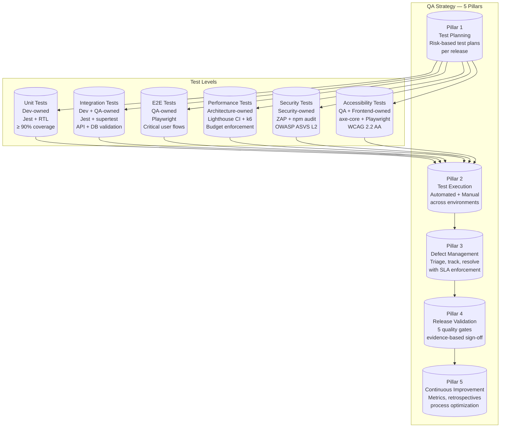

### 4.2 Risk-Based Testing Approach

| Risk Level | Description | Testing Intensity | Automation % | Manual Focus | Examples |
|------------|-------------|-------------------|--------------|--------------|----------|
| **🔴 Critical** | Revenue impact, security breach, data loss, P0 user impact | Full regression + exploratory + chaos | 95%+ | Security, edge cases, data integrity | Auth, payments, user data, admin |
| **🟡 High** | Major feature broken, significant UX regression, P1 user impact | Full regression + targeted exploratory | 90%+ | UX flows, error handling | Projects page, blog, contact form |
| **🟢 Medium** | Minor feature issue, cosmetic regression, P2 user impact | Smoke + partial regression | 80%+ | Visual review, cross-browser | About page, skills, testimonials |
| **⚪ Low** | Cosmetic issue, documentation, P3 impact | Smoke only | 70%+ | Visual polish | Footer, hover states, copy |

### 4.3 Test Allocation by Release Type

| Release Type | Description | Test Scope | Duration | QA Involvement |
|-------------|-------------|------------|----------|----------------|
| **🐛 Hotfix** | Emergency production fix | Smoke + targeted regression | < 2 hours | QA Lead reviews + signs off |
| **🔄 Patch** | Bug fix release (1-3 fixes) | Full smoke + regression on affected modules | < 4 hours | QA Engineer validates + signs off |
| **✨ Feature** | New feature or enhancement | Full smoke + regression + feature testing | < 1 day | QA Engineer validates; QA Lead signs off |
| **🚀 Major Release** | Multiple features, breaking changes | Full QA cycle — all gates | < 3 days | Full QA team; QA Lead + Architecture Lead sign off |
| **📦 Quarterly Release** | Large feature set, architectural changes | Full QA cycle + performance + security audit | < 1 week | Full QA team + cross-functional sign-off |

### 4.4 QA Strategy Principles

```text
=== QA STRATEGIC PRINCIPLES ===

1. SHIFT-LEFT: Catch defects at the earliest possible stage
   - Static analysis → Unit tests → Integration tests → QA review
   - Target: 80%+ of defects caught before QA review

2. RISK-BASED: Test effort proportional to business impact
   - Critical paths: 100% coverage, all states, all browsers
   - Minor features: Smoke coverage, single browser

3. AUTOMATION-FIRST: Automate everything that can be automated
   - Regression: 100% automated
   - Smoke: 100% automated
   - Performance: 100% automated
   - Security scanning: 100% automated
   - Exploratory + Usability: Manual only

4. EVIDENCE-BASED: Every gate requires documented evidence
   - Test execution reports
   - Bug scan results (0 P0/P1 open)
   - Performance budget reports
   - Security scan results
   - Accessibility audit results
   - Sign-off checklist (signed by owner)
```

---

## 5. QA Workflow

### 5.1 End-to-End QA Workflow

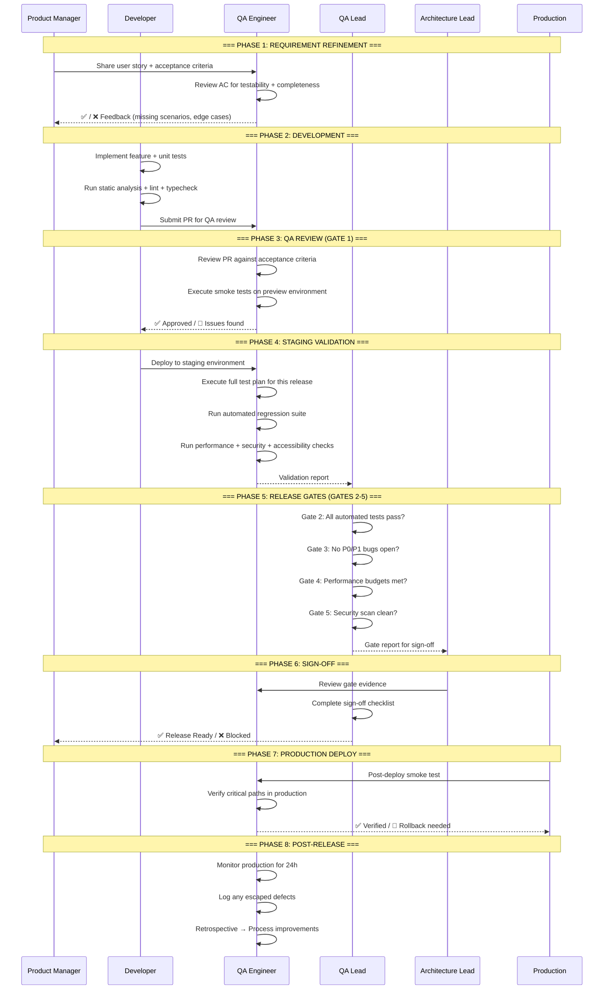

### 5.2 QA Workflow Roles & Responsibilities

| Role | Responsibility | Entry Point | Exit Point | Sign-Off Authority |
|------|---------------|-------------|------------|-------------------|
| **QA Engineer** | Test plan creation, test execution, bug reporting, validation | PR submitted | Staging validated | Gate 1, Gate 2 |
| **QA Lead** | Test strategy, resource allocation, sign-off, process improvement | Release planning | Final sign-off | Gate 3, Gate 4, Gate 5 |
| **Developer** | Unit tests, static analysis, PR readiness, bug fixes | Story refinement | Bug fixed and verified | N/A (participant) |
| **Product Manager** | Acceptance criteria, UAT coordination, feature approval | Story refinement | Feature acceptance | UAT sign-off |
| **Architecture Lead** | Performance + security review, architectural validation | Release gate review | Final sign-off | Architecture sign-off |

### 5.3 QA Workflow Timing SLAs

| Stage | Target Duration | SLA Warning | SLA Breach | Escalation |
|-------|----------------|-------------|------------|------------|
| **PR QA Review** | < 2 hours | > 4 hours | > 8 hours | QA Lead |
| **Staging Validation** | < 4 hours | > 8 hours | > 24 hours | QA Lead → Engineering Manager |
| **Regression Suite** | < 30 min | > 45 min | > 60 min | DevOps Lead |
| **Bug Triage** | < 2 hours | > 4 hours | > 8 hours | QA Lead |
| **Bug Fix Verification** | < 1 hour | > 2 hours | > 4 hours | QA Lead |
| **Release Gate Review** | < 1 hour | > 2 hours | > 4 hours | QA Lead → Architecture Lead |
| **Sign-Off Cycle** | < 1 business day | > 2 days | > 3 days | Engineering Manager |

### 5.4 QA Workflow States

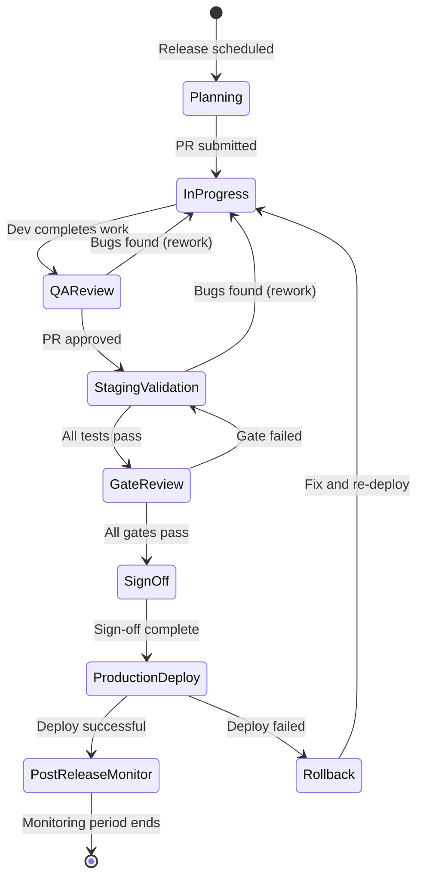

---

## 6. Bug Severity Matrix

### 6.1 Severity Definitions

Severity measures the **technical impact** of a bug — how badly it affects the system, regardless of which user is affected.

| Severity Level | Label | Definition | Examples | Response SLA |
|---------------|-------|------------|----------|--------------|
| **S0** | 🔴 **Critical** | System crash, data loss, security breach, complete feature unavailability | Site 500 error on all pages, data corruption, auth broken, XSS vulnerability | < 1 hour |
| **S1** | 🟠 **High** | Major feature broken, significant data integrity issue, severe UX regression | Contact form not submitting, projects page blank, 404 on blog posts | < 4 hours |
| **S2** | 🟡 **Medium** | Minor feature broken, cosmetic regression, non-critical data issue | Wrong pagination count, missing hover state, broken image on one page | < 24 hours |
| **S3** | 🔵 **Low** | Cosmetic issue, typo, minor styling, enhancement request | Misaligned button on mobile, spelling error in copy, slightly off color | < 72 hours |

### 6.2 Severity Assessment Matrix

| Impact Area | S0 Critical | S1 High | S2 Medium | S3 Low |
|-------------|-------------|---------|-----------|--------|
| **Data Integrity** | Data corruption/loss | Data incorrectly displayed | Data missing from 1 field | Data display formatting |
| **Security** | Auth bypass, data leak | OWASP violation, weak config | Missing header, info leak | Best practice violation |
| **Functionality** | Feature completely broken | Feature partially broken | Minor feature issue | Edge case behavior |
| **Performance** | Site down or unusable | < 50 Lighthouse perf | Budget regression < 10% | Budget regression < 5% |
| **Accessibility** | Keyboard trap, no alt on all images | WCAG AA violation (P0) | WCAG AA violation (minor) | WCAG AAA enhancement |
| **Visual** | Layout completely broken | Major visual regression | Minor visual issue | Pixel-perfect polish |
| **Mobile** | App crash on device | Broken layout on device | Minor responsive issue | Mobile-specific polish |

### 6.3 Severity Escalation Rules

| Severity | Escalation Path | Notification | Auto-Notify |
|----------|----------------|--------------|-------------|
| **S0 Critical** | QA Engineer → QA Lead → Engineering Manager → CEO | Slack @channel + SMS + Email | PagerDuty / OpsGenie |
| **S1 High** | QA Engineer → QA Lead → Engineering Manager | Slack @group + Email | Slack notification |
| **S2 Medium** | QA Engineer → QA Lead | Slack @QA Lead | Email digest |
| **S3 Low** | QA Engineer (log only) | — | Weekly triage report |

---

## 7. Bug Priority Matrix

### 7.1 Priority Definitions

Priority measures the **business urgency** of fixing a bug — how quickly it needs to be resolved based on user impact, release timing, and stakeholder needs.

| Priority Level | Label | Definition | Resolution SLA | Example |
|---------------|-------|------------|----------------|---------|
| **P0** | 🔴 **Critical** | Must fix immediately — blocks release or causes production outage | < 4 hours | Login broken on production |
| **P1** | 🟠 **High** | Must fix before next release — significant user or business impact | < 24 hours | Projects filter returns wrong results |
| **P2** | 🟡 **Medium** | Should fix in current or next release — moderate impact | < 1 week (next release) | Button hover state missing on one variant |
| **P3** | 🔵 **Low** | Nice to have — cosmetic or enhancement | < 1 month (backlog) | Slightly misaligned icon on mobile |

### 7.2 Priority = Severity × Frequency × User Impact

| Factor | Low (1) | Medium (2) | High (3) | Critical (4) |
|--------|---------|------------|----------|--------------|
| **Severity** | S3 — Cosmetic | S2 — Minor functionality | S1 — Major feature broken | S0 — Crash/data loss/security |
| **Frequency** | < 1% of users affected | 1-10% of users affected | 10-50% of users affected | > 50% of users affected |
| **User Impact** | Annoyance, visual | Workaround available | No workaround, major UX | Blocked workflow |

**Priority Score Formula:** `Priority = Severity × Frequency × User Impact`

| Score Range | Priority | Action |
|-------------|----------|--------|
| **12-16** | 🔴 P0 | Immediate fix, hotfix release |
| **8-11** | 🟠 P1 | Fix in current release cycle |
| **4-7** | 🟡 P2 | Fix in next release cycle |
| **1-3** | 🔵 P3 | Backlog / future release |

### 7.3 Priority Decision Matrix

```text
                  FREQUENCY →
                  Low (1)    Medium (2)  High (3)    Critical (4)
                  ─────────────────────────────────────────────────
SEVERITY  S0(4)  │  P1 (4×1)  P1 (4×2)   P0 (4×3)    P0 (4×4)    
↓         S1(3)  │  P2 (3×1)  P1 (3×2)   P1 (3×3)    P0 (3×4)    
          S2(2)  │  P3 (2×1)  P2 (2×2)   P1 (2×3)    P1 (2×4)    
          S3(1)  │  P3 (1×1)  P3 (1×2)   P2 (1×3)    P1 (1×4)    
```

### 7.4 Priority Override Rules

| Condition | Override | Rationale |
|-----------|----------|-----------|
| **Bug blocks release** | Minimum P1 | Release cannot proceed with open P0/P1 bugs |
| **Bug affects executive/stakeholder demo** | Minimum P1 | Business-critical demonstration |
| **Bug found in production** | +1 priority level | Production defects are inherently more urgent |
| **Bug is regression from recent release** | Minimum P1 | Regression indicates failed quality gate |
| **Bug has easy workaround** | -1 priority level | Reduced urgency if users can work around |
| **Bug affects accessibility compliance** | Minimum P2 | Legal compliance requirement |
| **Bug affects security compliance** | Minimum P1 | Security vulnerability requirement |

---

## 8. Test Plans

### 8.1 Test Plan Structure

Every release requires a formal test plan. The test plan is a living document updated throughout the release lifecycle.

```text
=== TEST PLAN TEMPLATE ===

1. RELEASE INFORMATION
   - Release version: vX.Y.Z
   - Release type: [Hotfix / Patch / Feature / Major / Quarterly]
   - Target deploy date: YYYY-MM-DD
   - QA Lead: [Name]
   - QA Engineers: [Names]

2. SCOPE
   - Features to test: [List of features/user stories]
   - Features NOT to test: [Explicitly out of scope]
   - Environments: [List of test environments]

3. RISK ASSESSMENT
   - Critical risk areas: [Auth, data, security, etc.]
   - Mitigation strategy: [Additional testing, code review, etc.]

4. TEST STRATEGY
   - New feature testing: [Approach, tools, coverage targets]
   - Regression testing: [Scope, automation vs manual, duration]
   - Performance testing: [Budgets, load testing scenarios]
   - Security testing: [OWASP controls, dependency scanning]
   - Accessibility testing: [WCAG criteria, tools]

5. TEST EXECUTION PLAN
   - Test cycles: [Cycle name, duration, entry/exit criteria]
   - Test environment availability: [When environments are needed]
   - Test data requirements: [Seed data, edge cases]

6. DEFECT MANAGEMENT
   - Severity/priority matrix: [Reference to severity/priority definitions]
   - Triage schedule: [Daily/Weekly triage cadence]
   - Escalation path: [QA Lead → EM → VP Eng]

7. RELEASE CRITERIA
   - Entry criteria: [What must be true before QA starts]
   - Exit criteria: [What must be true before sign-off]
   - Deferred defects: [Process for accepting deferred fixes]

8. DELIVERABLES
   - Test execution report
   - Bug summary report
   - Performance report
   - Security scan report
   - Accessibility audit report
   - Sign-off checklist

9. SCHEDULE
   - Test plan review: YYYY-MM-DD
   - Test execution start: YYYY-MM-DD
   - Test execution end: YYYY-MM-DD
   - Sign-off deadline: YYYY-MM-DD

10. APPROVALS
    - QA Lead: [Signature + Date]
    - Engineering Manager: [Signature + Date]
```

### 8.2 Test Plan by Release Type

| Element | Hotfix | Patch | Feature | Major Release | Quarterly |
|---------|--------|-------|---------|---------------|-----------|
| **Test plan document** | Lightweight checklist | 1-2 page plan | Full test plan | Full test plan | Full test plan |
| **Review cycle** | 1 round | 1 round | 1-2 rounds | 2-3 rounds | 3+ rounds |
| **Automation required** | Smoke only | Smoke + targeted regression | Full regression | Full regression | Full regression |
| **Performance testing** | None | Quick budget check | Full budget check | Full + load test | Full + load test |
| **Security testing** | None | Quick scan | Full scan | Full + DAST | Full + DAST + pen test |
| **Accessibility testing** | None | Quick check | Full audit | Full audit | Full audit |
| **Cross-browser testing** | Single browser | 2 browsers | 3 browsers | All browsers | All browsers |
| **Mobile testing** | None | Quick check | Full check | Full test | Full test |

### 8.3 Test Plan Approval Process

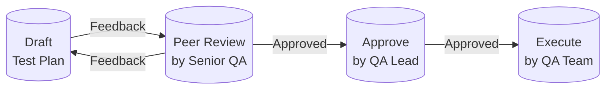

### 8.4 Test Case Coverage Requirements

| Test Type | Minimum Coverage | Critical Path Coverage | Automation Target |
|-----------|-----------------|----------------------|-------------------|
| **Functional (positive)** | 100% of acceptance criteria | 100% | 100% |
| **Functional (negative)** | 80% of validation rules | 100% | 90% |
| **Edge cases** | 50% of identified edge cases | 100% | 70% |
| **UI/Visual** | All page variants | 100% | 100% |
| **API/Contract** | All endpoints | 100% | 100% |
| **Performance** | All critical pages | 100% | 100% |
| **Security** | OWASP ASVS L2 | 100% | 90% |
| **Accessibility** | WCAG 2.2 AA | 100% | 80% |
| **Cross-browser** | All supported browsers | 100% | 90% |
| **Mobile responsive** | All breakpoints | 100% | 80% |

---

## 9. Acceptance Testing

### 9.1 Acceptance Testing Strategy

Acceptance testing validates that the delivered feature meets the **acceptance criteria defined in the user story** and is ready for release. It bridges the gap between technical validation (unit/integration/E2E tests) and business validation (UAT).

**Acceptance test types:**
- **Feature Acceptance:** Does the feature meet all acceptance criteria?
- **User Story Acceptance:** Does the implementation satisfy the user's need?
- **Regression Acceptance:** Did the change break any existing functionality?
- **Integration Acceptance:** Does the feature integrate correctly with existing systems?
- **UX Acceptance:** Is the user experience intuitive and consistent?

### 9.2 Acceptance Criteria Format

Every user story must include acceptance criteria following the **Given-When-Then** (Gherkin) format:

```gherkin
Feature: Contact Form Submission
  As a site visitor
  I want to submit a contact form
  So that I can reach out to the portfolio owner

  Scenario: Successful form submission
    Given I am on the contact page
    When I fill in valid name, email, and message
    And I click the "Send Message" button
    Then I should see a "Message sent successfully" confirmation
    And I should receive a confirmation email
    And the lead should be saved in the database

  Scenario: Invalid email format
    Given I am on the contact page
    When I fill in a valid name and message
    And I enter an invalid email address "not-an-email"
    And I click the "Send Message" button
    Then I should see a "Please enter a valid email address" error
    And the form should NOT be submitted

  Scenario: Empty required fields
    Given I am on the contact page
    When I click the "Send Message" button without filling any fields
    Then I should see validation errors for name, email, and message
    And the form should NOT be submitted

  Scenario: Rate limiting
    Given I have submitted the contact form 3 times in the last hour
    When I try to submit again
    Then I should see a "Too many submissions. Please try again later." error
    And the form should NOT be submitted

  Scenario: Network failure (offline)
    Given I am on the contact page
    When I fill in valid form data
    And I submit the form while offline
    Then I should see a "Network error. Please check your connection." message
    And the form data should be preserved
```

### 9.3 Acceptance Testing Workflow

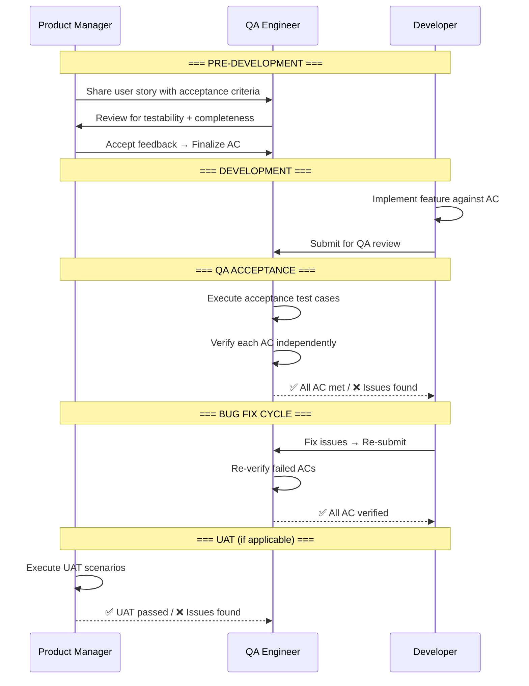

### 9.4 Acceptance Criteria Checklist

```text
=== ACCEPTANCE CRITERIA REVIEW CHECKLIST ===

□ COMPLETENESS
  □ All functional scenarios covered (happy path + error paths)
  □ All input validations specified (format, required, length, range)
  □ All response states defined (success, error, loading, empty, offline)
  □ Edge cases identified and specified
  □ Performance expectations defined (if applicable)

□ TESTABILITY
  □ Each criterion is independently verifiable
  □ Criteria are unambiguous (no "should work", "appropriate error")
  □ Test data requirements are specified
  □ Expected results are concrete and measurable

□ CONSISTENCY
  □ Criteria align with existing feature behavior
  □ Terminology matches existing documentation
  □ Error messages follow established patterns
  □ UX behavior aligns with design system

□ COMPLETENESS CHECK
  □ All states covered: loading, empty, success, error, edge case
  □ All user roles covered (if multi-role)
  □ All device types covered (desktop, tablet, mobile)
  □ All input combinations covered (valid, invalid, boundary)
```

---

## 10. Smoke Testing

### 10.1 Smoke Testing Strategy

Smoke tests are a **rapid set of high-level tests** that verify the most critical functionality of the application is working after a deployment. They are the first line of defense — designed to catch catastrophic failures before deeper testing begins.

**When smoke tests run:**
- ✅ After every staging deployment
- ✅ After every production deployment
- ✅ Before full regression suite execution
- ✅ On the first deploy of the day (morning sanity check)

**Smoke test characteristics:**
- Coverage: Critical user flows only (P0 flows)
- Duration: < 10 minutes
- Automation: 100% automated
- Pass threshold: 100% (any failure blocks further testing)

### 10.2 Smoke Test Suite

```typescript
// e2e/smoke/smoke.spec.ts
import { test, expect } from '@playwright/test';

test.describe('Production Smoke Tests', () => {
  test('homepage loads successfully', async ({ page }) => {
    const start = Date.now();
    const response = await page.goto('/');
    const loadTime = Date.now() - start;

    expect(response?.status()).toBe(200);
    expect(loadTime).toBeLessThan(5000); // 5s max load
    await expect(page.locator('h1')).toBeVisible();
  });

  test('all sections render without errors', async ({ page }) => {
    await page.goto('/');
    await page.waitForLoadState('networkidle');

    // Check console for errors
    const consoleErrors: string[] = [];
    page.on('console', (msg) => {
      if (msg.type() === 'error') {
        consoleErrors.push(msg.text());
      }
    });

    expect(consoleErrors.length).toBe(0);
  });

  test('navigation links are functional', async ({ page }) => {
    await page.goto('/');
    const navLinks = page.locator('nav a');
    const linkCount = await navLinks.count();

    expect(linkCount).toBeGreaterThan(0);

    // Verify each nav link leads to a valid page
    for (let i = 0; i < linkCount; i++) {
      const link = navLinks.nth(i);
      const href = await link.getAttribute('href');
      if (href && !href.startsWith('#') && !href.startsWith('tel:')) {
        const response = await page.goto(href);
        expect(response?.status()).toBe(200);
      }
    }
  });

  test('contact form is accessible', async ({ page }) => {
    await page.goto('/#contact');
    const form = page.locator('form:has(input[name="email"])');
    await expect(form).toBeVisible();
  });

  test('API health endpoint returns OK', async ({ request }) => {
    const response = await request.get('/api/health');
    expect(response.ok()).toBeTruthy();
    const body = await response.json();
    expect(body.status).toBe('ok');
  });

  test('no JavaScript errors on page load', async ({ page }) => {
    const errors: string[] = [];
    page.on('pageerror', (err) => errors.push(err.message));

    await page.goto('/');
    await page.waitForLoadState('networkidle');

    expect(errors.length).toBe(0);
  });
});
```

### 10.3 Smoke Test Coverage Matrix

| Flow | Test | Priority | Frequency | Automation |
|------|------|----------|-----------|------------|
| **Homepage** | Loads with 200 status | P0 | Every deploy | ✅ Playwright |
| **Homepage** | No console errors | P0 | Every deploy | ✅ Playwright |
| **Homepage** | All sections render | P0 | Every deploy | ✅ Playwright |
| **Navigation** | All nav links resolve to 200 | P0 | Every deploy | ✅ Playwright |
| **Navigation** | Scroll-to-section works | P1 | Every deploy | ✅ Playwright |
| **Contact Form** | Form is visible | P0 | Every deploy | ✅ Playwright |
| **API Health** | `/api/health` returns OK | P0 | Every deploy | ✅ Playwright |
| **API Health** | `/api/v1/sections` returns data | P1 | Every deploy | ✅ Playwright |
| **Auth** | Admin login page loads | P1 | Every deploy | ✅ Playwright |
| **Auth** | Unauthenticated /admin redirects | P0 | Every deploy | ✅ Playwright |
| **Performance** | Page loads < 5s | P1 | Every deploy | ✅ Playwright |
| **Security** | HTTPS enforced | P0 | Every deploy | ✅ Request |

### 10.4 Smoke Test Failure Response

```text
=== SMOKE TEST FAILURE RUNBOOK ===

WHEN: Smoke test fails after deployment

STEP 1: IDENTIFY FAILURE
  - Check CI logs for failed test(s)
  - Identify: Infrastructure issue or code regression?
    - Infrastructure: Check Vercel/Railway/Supabase status
    - Regression: Proceed to Step 2

STEP 2: NOTIFY
  - Slack @channel in #qa-alerts: "🚨 Smoke test FAILED on [env]"
  - Tag: QA Lead + DevOps Lead + On-Call Engineer

STEP 3: DECIDE
  - Production deploy: Initiate rollback immediately
  - Staging deploy: Block promotion to production
  - Action: Auto-rollback (production) or Block gate (staging)

STEP 4: INVESTIGATE
  - Check deploy logs for error messages
  - Check Sentry for new errors
  - Rollback to last known good version if fix > 30 min

STEP 5: RESOLVE
  - Fix the issue → Deploy fix → Re-run smoke tests
  - Add regression test to prevent recurrence

STEP 6: DOCUMENT
  - Log incident in GitHub Issues with label "smoke-failure"
  - Include: date, environment, failing test, root cause, fix PR
```

---

## 11. Regression Testing

### 11.1 Regression Testing Strategy

Regression testing ensures that new code changes do not **break existing functionality**. It combines automated CI checks with risk-based test selection to provide comprehensive coverage within time constraints.

**Regression test triggers:**
- ✅ Every PR to main (full CI suite)
- ✅ Every staging deploy (full regression)
- ✅ Every production deploy (smoke + critical path regression)
- ✅ Weekly scheduled run (full regression + performance + security)
- ✅ Before every major release (complete regression audit)

### 11.2 Regression Test Selection

| Change Type | Regression Scope | Automation % | Estimated Duration | Risk |
|------------|-----------------|--------------|-------------------|------|
| **README/comment change** | None | — | 0 min | 🟢 Trivial |
| **CSS/Tailwind styling only** | Visual + a11y | 100% | < 5 min | 🟢 Low |
| **Utility function change** | Unit tests for that function | 100% | < 2 min | 🟢 Low |
| **UI component change** | Unit + a11y + visual + component E2E | 95% | < 10 min | 🟡 Medium |
| **API endpoint change** | Integration + API + related E2E | 95% | < 10 min | 🟡 Medium |
| **Database migration** | Integration + DB + related E2E | 90% | < 15 min | 🟡 Medium |
| **New feature (non-critical)** | Full CI suite + feature E2E | 90% | < 20 min | 🟡 Medium |
| **Auth/security change** | Full CI + security scan + auth E2E | 85% | < 25 min | 🔴 High |
| **Critical page change** | Full CI + E2E (all browsers) + visual | 90% | < 30 min | 🔴 High |
| **Dependency upgrade** | Full regression suite | 90% | < 30 min | 🔴 High |
| **Infrastructure change** | Full CI + deploy + smoke + load test | 80% | < 40 min | 🔴 High |

### 11.3 Regression Test Suite Organization

```text
=== REGRESSION TEST SUITE STRUCTURE ===

tests/
├── regression/
│   ├── critical/           # P0 flows — always run
│   │   ├── homepage.spec.ts
│   │   ├── navigation.spec.ts
│   │   ├── projects.spec.ts
│   │   ├── contact-form.spec.ts
│   │   └── admin-auth.spec.ts
│   │
│   ├── high/               # P1 flows — run on every deploy
│   │   ├── blog.spec.ts
│   │   ├── skills.spec.ts
│   │   ├── about.spec.ts
│   │   ├── dark-mode.spec.ts
│   │   └── mobile-responsive.spec.ts
│   │
│   ├── medium/             # P2 flows — run weekly + before major releases
│   │   ├── testimonials.spec.ts
│   │   ├── achievements.spec.ts
│   │   ├── experience.spec.ts
│   │   ├── seo-metadata.spec.ts
│   │   └── pdf-download.spec.ts
│   │
│   └── edge/               # Edge cases — run quarterly
│       ├── offline-mode.spec.ts
│       ├── slow-network.spec.ts
│       ├── reduced-motion.spec.ts
│       ├── high-contrast.spec.ts
│       └── browser-compat.spec.ts
```

### 11.4 Regression Test Execution Matrix

| Tier | Coverage | When | Duration | Automation | Pass Threshold | Failure Action |
|------|----------|------|----------|------------|----------------|----------------|
| **Tier 1: Critical** | P0 flows (15 tests) | Every PR + deploy | < 5 min | 100% | 100% | Block PR / Trigger rollback |
| **Tier 2: Extended** | P0 + P1 flows (40 tests) | Every staging deploy | < 15 min | 95% | 100% | Block promotion to production |
| **Tier 3: Full** | All flows (100+ tests) | Weekly + major release | < 30 min | 90% | 99% | Investigate before next deploy |
| **Tier 4: Audit** | All flows + edge cases + all browsers | Quarterly | < 2 hours | 80% | 95% | QA Lead review + improvement plan |

---

## 12. Release Validation

### 12.1 Release Validation Strategy

Release validation is the **comprehensive verification** that a release candidate is ready for production. It combines all test types — functional, performance, security, accessibility, visual, and cross-browser — into a single validation pipeline with documented evidence.

### 12.2 Release Validation Stages

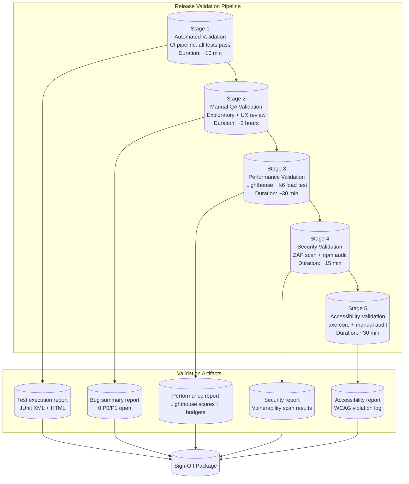

### 12.3 Release Validation Checklist

```text
=== RELEASE VALIDATION CHECKLIST ===

□ STAGE 1: AUTOMATED VALIDATION
  □ All unit tests pass (npx jest --coverage)
  □ All integration tests pass
  □ All E2E tests pass (all browsers)
  □ All visual regression tests pass
  □ All API tests pass
  □ Line coverage ≥ 90% (no regression from baseline)
  □ Bundle budgets met (initial JS < 85KB)
  □ No TypeScript errors (tsc --noEmit --strict)

□ STAGE 2: MANUAL QA VALIDATION
  □ All acceptance criteria verified for each user story
  □ Exploratory testing complete (2 hours minimum)
  □ UX review complete (consistent with design system)
  □ Cross-browser testing complete (Chrome, Firefox, Safari, Edge)
  □ Mobile responsive testing complete (375px, 768px, 1440px)
  □ Dark mode / light mode verified
  □ Loading states, empty states, error states verified
  □ All states tested: loading → success → error → edge case

□ STAGE 3: PERFORMANCE VALIDATION
  □ Lighthouse performance ≥ 95
  □ Lighthouse accessibility ≥ 95
  □ Lighthouse SEO ≥ 95
  □ Lighthouse best practices ≥ 95
  □ LCP < 1.8s
  □ CLS < 0.05
  □ INP < 50ms
  □ TTFB < 200ms
  □ All Lighthouse budgets pass
  □ API p95 latency within SLA

□ STAGE 4: SECURITY VALIDATION
  □ npm audit: 0 high/critical vulnerabilities
  □ OWASP ZAP scan: 0 high-risk findings
  □ CORS configuration verified
  ✅ Security headers present (A+ on securityheaders.com)
  □ Rate limiting active on all public endpoints
  □ Input validation passes (XSS, SQLi checks)
  □ Auth enforced on protected routes

□ STAGE 5: ACCESSIBILITY VALIDATION
  □ axe-core: 0 WCAG 2.2 AA violations (all page variants)
  □ Keyboard navigation verified (tab order, skip link, focus trap)
  □ All images have alt text
  □ Color contrast passes (4.5:1 for text, 3:1 for large text)
  □ Touch targets ≥ 44x44px
  □ Screen reader test: all elements announced correctly
  □ Reduced motion respected (prefers-reduced-motion)
```

### 12.4 Release Validation Artifacts

| Artifact | Content | Format | Location | Retention |
|----------|---------|--------|----------|-----------|
| **Test execution report** | All test results, pass/fail, duration | JUnit XML + HTML | `reports/test/` | 90 days |
| **Coverage report** | Line/branch/function/statement coverage | HTML + JSON | `reports/coverage/` | 90 days |
| **Bug summary report** | All bugs found during validation, severity/priority | CSV + Dashboard | GitHub Issues | Permanent |
| **Performance report** | Lighthouse scores, budgets, load test results | HTML + JSON | `reports/perf/` | 90 days |
| **Security report** | Vulnerability scan results, OWASP findings | HTML + JSON | `reports/security/` | 90 days |
| **Accessibility report** | WCAG violation log, contrast ratios | HTML + JSON | `reports/a11y/` | 90 days |
| **Sign-off checklist** | Signed checklist with evidence links | Markdown + PDF | Release notes | Permanent |

---

## 13. Release Gates

### 13.1 Gate Model Overview

Every release passes through **5 sequential quality gates**. Each gate has defined entry criteria, validation steps, exit criteria, and a gatekeeper responsible for approving or blocking the release.

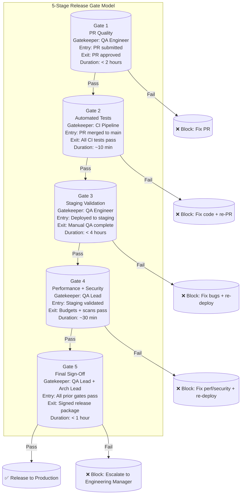

### 13.2 Gate Definitions

#### Gate 1: PR Quality

| Aspect | Details |
|--------|---------|
| **Gatekeeper** | QA Engineer |
| **Entry Criteria** | PR submitted, CI checks started, PR description complete |
| **Validation** | Code review complete, acceptance criteria met, unit tests pass, no lint/type errors |
| **Exit Criteria** | PR approved by QA Engineer, all CI checks green |
| **Blocking Conditions** | ❌ Acceptance criteria not met ❌ Unit tests failing ❌ Lint/Type errors ❌ Missing test coverage |
| **Duration SLA** | < 2 hours from PR submission |
| **Escalation** | > 4 hours → QA Lead |

#### Gate 2: Automated Tests

| Aspect | Details |
|--------|---------|
| **Gatekeeper** | CI Pipeline (automated) |
| **Entry Criteria** | PR merged to main branch |
| **Validation** | Full CI pipeline executes: lint, typecheck, build, unit tests, integration tests, E2E tests, visual regression |
| **Exit Criteria** | All CI jobs pass, coverage thresholds met |
| **Blocking Conditions** | ❌ Any test failure ❌ Coverage below threshold ❌ Build failure |
| **Duration SLA** | < 10 minutes |
| **Escalation** | Test failure → QA Lead + Dev notified via Slack |

#### Gate 3: Staging Validation

| Aspect | Details |
|--------|---------|
| **Gatekeeper** | QA Engineer |
| **Entry Criteria** | Deployed to staging environment, smoke tests pass |
| **Validation** | Manual QA: feature acceptance, exploratory testing, UX review, cross-browser testing, mobile testing |
| **Exit Criteria** | All acceptance criteria verified, no P0/P1 bugs open, QA review complete |
| **Blocking Conditions** | ❌ Acceptance criteria not met ❌ P0/P1 bugs open ❌ UX/design deviations |
| **Duration SLA** | < 4 hours |
| **Escalation** | > 8 hours → QA Lead |

#### Gate 4: Performance + Security

| Aspect | Details |
|--------|---------|
| **Gatekeeper** | QA Lead |
| **Entry Criteria** | Gate 3 completed, staging is stable |
| **Validation** | Lighthouse CI (all categories ≥ 95), bundle budgets met (initial JS < 85KB), npm audit (0 high/critical), OWASP ZAP scan |
| **Exit Criteria** | All budgets met, security scans clean |
| **Blocking Conditions** | ❌ Any Lighthouse score < 95 ❌ Budget regression > 10% ❌ High/critical vulnerability ❌ OWASP high-risk finding |
| **Duration SLA** | < 30 minutes |
| **Escalation** | Budget failure → Architecture Lead; Security failure → Security Lead |

#### Gate 5: Final Sign-Off

| Aspect | Details |
|--------|---------|
| **Gatekeeper** | QA Lead + Architecture Lead |
| **Entry Criteria** | Gates 1-4 all passed, all validation artifacts generated |
| **Validation** | Review all validation reports, verify sign-off checklist is complete, confirm no deferred P0/P1 bugs |
| **Exit Criteria** | Signed release package: sign-off checklist + validation reports |
| **Blocking Conditions** | ❌ Incomplete validation artifacts ❌ Deferred P0/P1 bugs without approval ❌ Missing signatory |
| **Duration SLA** | < 1 hour |
| **Escalation** | > 4 hours → Engineering Manager |

### 13.3 Emergency Gate Override

In rare circumstances, a gate may need to be overridden (e.g., security hotfix, production outage). Overrides follow strict protocol:

```text
=== EMERGENCY GATE OVERRIDE PROTOCOL ===

WHEN: Production outage or critical security vulnerability requires bypassing standard gates

APPROVAL REQUIRED:
  - QA Lead: ✅ / ❌
  - Architecture Lead: ✅ / ❌
  - Engineering Manager: ✅ / ❌
  - (Minimum 2 of 3 must approve)

CONDITIONS:
  - Override only applies to Gates 3-5 (Gates 1-2 are automated and cannot be bypassed)
  - Post-deployment validation must be completed within 24 hours
  - Full regression test must run within 48 hours
  - Override is logged in the release notes with justification

OVERRIDE REQUEST FORMAT:
  ```
  OVERRIDE REQUEST: Gate [NUMBER]
  Release: vX.Y.Z
  Reason: [Production outage / Security vulnerability / Other]
  Justification: [Why standard gate cannot be followed]
  Risk Assessment: [What could go wrong]
  Mitigation: [What compensating controls are in place]
  Post-deploy validation plan: [When will full validation happen]
  Requested by: [Name]
  Approved by: [QA Lead / Arch Lead / EM]
  Date: YYYY-MM-DD
  ```

AUDIT: All overrides are logged and reviewed in the monthly QA retrospective
```

---

## 14. Sign-Off Process

### 14.1 Sign-Off Model

Release sign-off is the **formal approval** that a release candidate is ready for production deployment. It requires documented evidence from all validation stages and signatures from designated stakeholders.

### 14.2 Sign-Off Requirements

| Signatory | Gate | Sign-Off Criteria | Authority |
|-----------|------|-------------------|-----------|
| **QA Engineer** | Gate 2 | All automated tests pass, acceptance criteria verified | Can block release |
| **QA Engineer** | Gate 3 | Staging validation complete, no P0/P1 bugs | Can block release |
| **QA Lead** | Gate 4 | Performance + security validation passed | Can block release |
| **QA Lead** | Gate 5 | Full validation package complete | Final sign-off authority |
| **Architecture Lead** | Gate 5 | Architecture + performance review complete | Can block release |
| **Product Manager** | Gate 5 | Feature acceptance + UAT complete | Can block release |

### 14.3 Sign-Off Process Flow

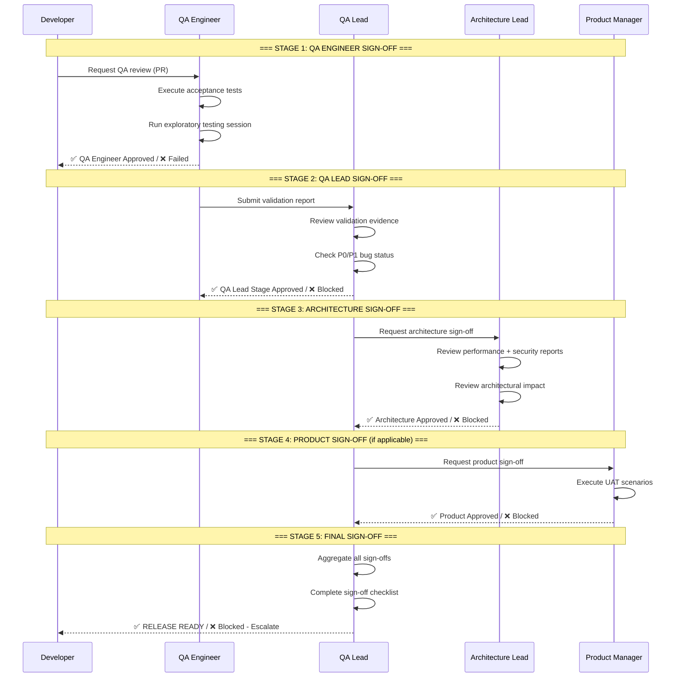

### 14.4 Sign-Off Checklist

```text
=== RELEASE SIGN-OFF CHECKLIST ===

RELEASE INFORMATION
  Release version: _______________
  Release type: [Hotfix / Patch / Feature / Major / Quarterly]
  Target deploy date: _______________

□ GATE 1: PR QUALITY — QA Engineer
  □ All acceptance criteria verified
  □ No P0/P1 bugs open
  □ Code review complete
  □ Unit tests pass with ≥ 90% coverage
  Signatory: ___________________ Date: ___________

□ GATE 2: AUTOMATED TESTS — CI Pipeline
  □ All unit tests pass
  □ All integration tests pass
  □ All E2E tests pass (all browsers)
  □ All visual regression tests pass
  □ Coverage thresholds met
  Signatory: ___________________ (auto-verified)

□ GATE 3: STAGING VALIDATION — QA Engineer
  □ Manual QA complete
  □ Exploratory testing complete
  □ Cross-browser testing complete
  □ Mobile responsive testing complete
  □ Dark mode / light mode verified
  □ All states verified (loading, empty, error, edge)
  Signatory: ___________________ Date: ___________

□ GATE 4: PERFORMANCE + SECURITY — QA Lead
  □ Lighthouse all categories ≥ 95
  □ Bundle budgets met (initial JS < 85KB)
  □ npm audit: 0 high/critical
  □ OWASP ZAP: 0 high-risk findings
  □ Security headers verified (A+ grade)
  Signatory: ___________________ Date: ___________

□ GATE 5: FINAL SIGN-OFF
  □ All prior gates completed and signed
  □ Validation artifacts collected
  □ No deferred P0/P1 bugs (or approved override)
  □ Sign-off checklist complete

  QA Lead: ___________________ Date: ___________
  Architecture Lead: ___________________ Date: ___________
  Product Manager (if applicable): ___________________ Date: ___________

FINAL DECISION:
  [ ] ✅ RELEASE READY — Proceed to production deploy
  [ ] ❌ BLOCKED — Issues found (see attached)
  [ ] ⚠️ CONDITIONAL APPROVAL — Deploy with post-release validation

BLOCKING ISSUES (if any):
  1. ________________________________________________________________
  2. ________________________________________________________________
  3. ________________________________________________________________

NOTES:
  __________________________________________________________________
  __________________________________________________________________
```

### 14.5 Sign-Off SLA

| Stage | Target Duration | Maximum Duration | Escalation |
|-------|----------------|-----------------|------------|
| **QA Engineer sign-off** | < 2 hours | < 4 hours | QA Lead |
| **QA Lead sign-off** | < 1 hour | < 2 hours | Engineering Manager |
| **Architecture sign-off** | < 2 hours | < 4 hours | Engineering Manager |
| **Product sign-off** | < 4 hours | < 8 hours | Engineering Manager |
| **Final sign-off** | < 1 hour | < 2 hours | VP Engineering |
| **Total sign-off cycle** | < 1 business day | < 2 business days | CTO |

---

## 15. Bug Triage Process

### 15.1 Bug Triage Strategy

Bug triage is the **systematic process of reviewing, classifying, prioritizing, and assigning bugs** to ensure they are resolved efficiently and transparently.

**Triage frequency:**
- P0 bugs: Immediate triage (on-call)
- P1 bugs: Within 2 hours of reporting
- P2 bugs: Daily triage meeting
- P3 bugs: Weekly triage meeting

### 15.2 Bug Triage Workflow

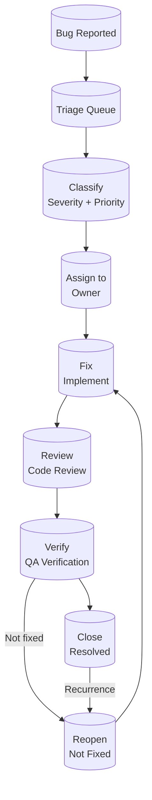

### 15.3 Bug Triage Roles

| Role | Responsibility | Triage Authority |
|------|---------------|------------------|
| **Bug Reporter** | Log the bug with clear reproduction steps, expected/actual results | Cannot close; can verify fix |
| **QA Lead (Triage Lead)** | Assigns severity, priority, and owner; facilitates triage meetings | Can change priority, can close |
| **Developer** | Implements fix; provides root cause analysis | Can suggest priority; cannot close |
| **QA Engineer (Verifier)** | Verifies fix; updates bug status | Can verify and close |

### 15.4 Triage Decision Matrix

```text
=== BUG TRIAGE DECISION MATRIX ===

SEVERITY ASSIGNMENT:
  S0 Critical: System down, data loss, security breach
  S1 High: Major feature broken, significant regression
  S2 Medium: Minor feature broken, cosmetic regression
  S3 Low: Cosmetic issue, enhancement

PRIORITY ASSIGNMENT (Severity × Frequency × User Impact):
  P0: 12-16 points → Fix immediately (hotfix)
  P1: 8-11 points → Fix in current release
  P2: 4-7 points → Fix in next release
  P3: 1-3 points → Backlog

DEFERRAL DECISIONS:
  Defer if:
    - Low severity + low frequency + easy workaround
    - Requires architectural change planned for future
    - Cosmetic issue with no user impact
  Do NOT defer if:
    - Affects accessibility compliance
    - Affects security compliance
    - Blocks release gate
    - Critical user flow regression

CLOSURE DECISIONS:
  Close as "Fixed" if:
    - Fix verified by QA in staging environment
    - Associated regression test added (if applicable)
  Close as "Won't Fix" if:
    - Not reproducible after investigation
    - Out of scope / intended behavior
    - Superseded by another change
  Close as "Duplicate" if:
    - Same root cause as existing bug
    - Link to original bug in bug tracker

REOPEN CRITERIA:
  - Fix does not resolve the issue
  - Issue recurs after deployment
  - Same root cause manifests differently
```

### 15.5 Triage Meeting Agenda

```text
=== DAILY BUG TRIAGE MEETING ===
Frequency: Daily (P1+), Weekly (all)
Duration: 30 minutes
Attendees: QA Lead, Dev Lead, On-Call Developer

AGENDA:
  1. New bugs since last triage (5 min)
     - Review each new bug
     - Assign severity + priority
     - Assign owner
  2. P0/P1 Bug Status Update (10 min)
     - Review progress on open P0/P1 bugs
     - Check SLA compliance
     - Unblock any stalled fixes
  3. P2/P3 Bug Review (5 min)
     - Review any P2 bugs approaching SLA breach
     - Re-prioritize based on business needs
     - Defer or close as appropriate
  4. Escalated Items (5 min)
     - Bugs past SLA
     - Bugs requiring architecture decision
     - Recurring issues needing root cause analysis
  5. Action Items (5 min)
     - Assignments for today
     - Any process improvements identified
```

---

## 16. QA Metrics & KPIs

### 16.1 QA Dashboard

```mermaid
flowchart TB
    subgraph "QA Metrics Dashboard"
        REL[("Release Health")]
        DEF[("Defect Metrics")]
        COV[("Coverage Metrics")]
        PERF[("Performance Metrics")]
        PROC[("Process Metrics")]
    end

    subgraph "Release Health"
        R1[("Release pass rate<br/>Target: ≥ 95%")]
        R2[("Production escapes<br/>Target: < 1 P0/P1/qtr")]
        R3[("Smoke pass rate<br/>Target: ≥ 99%")]
    end

    subgraph "Defect Metrics"
        D1[("Bug count by severity<br/>Open / Closed trend")]
        D2[("Bug resolution SLA<br/>% on-time by priority")]
        D3[("Reopen rate<br/>Target: < 5%")]
        D4[("Mean time to resolve<br/>By severity")]
    end

    subgraph "Coverage Metrics"
        C1[("Test automation %<br/>Target: ≥ 90%")]
        C2[("Test case effectiveness<br/>Target: ≥ 80%")]
        C3[("Requirements coverage<br/>Target: 100%")]
    end

    subgraph "Performance Metrics"
        P1[("Regression suite duration<br/>Target: < 30 min")]
        P2[("Sign-off cycle time<br/>Target: < 1 day")]
        P3[("QA review SLA<br/>Target: < 2 hours")]
    end

    subgraph "Process Metrics"
        S1[("Defect detection %<br/>% found before production")]
        S2[("Test case pass rate<br/>Trend over time")]
        S3[("Flaky test rate<br/>Target: < 1%")]
    end

    REL --> R1 & R2 & R3
    DEF --> D1 & D2 & D3 & D4
    COV --> C1 & C2 & C3
    PERF --> P1 & P2 & P3
    PROC --> S1 & S2 & S3
```

### 16.2 Key QA Metrics

| Metric | Definition | Target | Measurement | Review Cadence |
|--------|-----------|--------|-------------|----------------|
| **Release pass rate** | % of releases passing all 5 gates on first attempt | ≥ 95% | Release gate tracker | Monthly |
| **Production escapes** | P0/P1 bugs found in production per quarter | < 1 | Defect tracker | Quarterly |
| **Smoke test pass rate** | % of smoke test runs passing on first attempt | ≥ 99% | CI pipeline | Weekly |
| **Bug resolution SLA** | % of bugs resolved within SLA time | ≥ 95% | Defect tracker | Weekly |
| **Mean time to resolve (P0)** | Average time from report to production fix | < 4 hours | Incident tracker | Monthly |
| **Mean time to resolve (P1)** | Average time from report to fix | < 24 hours | Incident tracker | Monthly |
| **Reopen rate** | % of bugs reopened after being marked fixed | < 5% | Defect tracker | Weekly |
| **Test automation coverage** | % of regression tests automated | ≥ 90% | CI coverage report | Monthly |
| **Test case effectiveness** | % of bugs found via planned test cases | ≥ 80% | Defect-to-test-case mapping | Monthly |
| **Regression suite duration** | Time to execute full regression suite | < 30 min | CI pipeline | Weekly |
| **Sign-off cycle time** | Time from QA start to final sign-off | < 1 day | Release tracker | Monthly |
| **QA review SLA** | Time from PR submission to QA review | < 2 hours | PR tracker | Weekly |
| **Defect detection %** | % of defects found before production | ≥ 95% | Defect tracker (pre/post prod) | Monthly |
| **Flaky test rate** | % of tests identified as flaky | < 1% | Flaky test tracker | Weekly |

### 16.3 QA Reporting Cadence

| Report | Frequency | Audience | Content |
|--------|-----------|----------|---------|
| **Daily Bug Triage Report** | Daily | QA Lead, Dev Lead | New bugs, P0/P1 status, SLA breaches |
| **Weekly QA Dashboard** | Weekly | Full engineering team | Test pass rates, coverage, bug trends, flaky tests |
| **Release Validation Report** | Per release | Release stakeholders | Validation results, gate status, sign-off evidence |
| **Monthly QA Deep Dive** | Monthly | Engineering leadership | Metrics trends, improvement initiatives, test debt |
| **Quarterly QA Audit** | Quarterly | Architecture Lead, QA Lead | Full QA process audit, maturity assessment, strategy review |

---

## 17. QA Environment Strategy

### 17.1 Environment Architecture

| Environment | Purpose | Configuration | Data | Access | Deploy Trigger |
|-------------|---------|--------------|------|--------|----------------|
| **Local (Dev)** | Developer testing | `localhost:*`, `.env.local` | Mock / seed data | Developer only | `npm run dev` |
| **PR Preview** | Per-PR verification | Vercel preview URL | Sandbox Supabase | Developer + QA | PR creation |
| **Staging** | Full QA validation | `staging.portfolioowner.com` | Production-like (anonymized) | QA + Dev + Stakeholders | Merge to develop |
| **Production** | Live site | `portfolioowner.com` | Real user data | Public | Merge to main |

### 17.2 Environment Parity Requirements

| Aspect | Dev | PR Preview | Staging | Production | Parity Level |
|--------|-----|------------|---------|------------|-------------|
| **Framework version** | ✅ Same | ✅ Same | ✅ Same | ✅ Same | 🔴 Exact |
| **Node version** | ✅ Same | ✅ Same | ✅ Same | ✅ Same | 🔴 Exact |
| **Database version** | ✅ Local Supabase | ✅ Supabase sandbox | ✅ Supabase staging | ✅ Supabase prod | 🟡 Near |
| **Database schema** | ✅ Same | ✅ Same | ✅ Same | ✅ Same | 🔴 Exact |
| **Database data** | 🟡 Seed subset | 🟡 Seed subset | 🟢 Anonymized prod-like | 🔴 Real | 🟡 Near |
| **Environment variables** | 🟡 Dev values | 🟡 Dev values | 🟢 Staging values | 🔴 Prod values | 🟡 Near |
| **File storage** | 🟡 Local | 🟡 Sandbox | 🟢 Staging bucket | 🔴 Prod bucket | 🟡 Near |
| **External APIs** | 🟡 Sandbox/mock | 🟡 Sandbox/mock | 🟢 Staging keys | 🔴 Prod keys | 🟡 Near |
| **CDN/Caching** | ❌ No | 🟡 Vercel Edge | 🟢 Vercel Edge | 🔴 Vercel Edge | 🟡 Near |
| **SSL/TLS** | ❌ HTTP | 🟢 HTTPS (auto) | 🟢 HTTPS (auto) | 🔴 HTTPS (custom) | 🟢 Functional |

### 17.3 Test Data Management

| Data Type | Dev | PR Preview | Staging | Production |
|-----------|-----|------------|---------|------------|
| **Seed data** | `tests/seed/seed-data.ts` | CI-seeded | Anonymized production | Real |
| **Sections** | 5 seed sections | 5 seed sections | All sections | All sections |
| **Projects** | 3 seed projects | 3 seed projects | All projects | All projects |
| **Blog posts** | 2 seed posts | 2 seed posts | All posts | All posts |
| **Leads** | Empty | Empty | Anonymized test leads | Real leads |
| **Users** | 1 test admin | 1 test admin | 1 test admin | Real admin |

### 17.4 Environment SLA

| Environment | Uptime Target | Refresh Frequency | Data Retention | Cost |
|-------------|---------------|-------------------|----------------|------|
| **Local (Dev)** | N/A | Manual | N/A | Free |
| **PR Preview** | Ephemeral (per PR) | Per PR | PR lifetime | Free (Vercel) |
| **Staging** | 99.5% | Weekly (data refresh) | Ongoing | Free (Vercel) |
| **Production** | 99.99% | Continuous | Permanent | Free (Vercel) |

---

## 18. Test Case Management

### 18.1 Test Case Repository Structure

```text
=== TEST CASE REPOSITORY ===

Root: tests/
│
├── unit/                       # Unit tests (Jest)
│   ├── lib/                    # Utility function tests
│   ├── hooks/                  # Custom hook tests
│   ├── components/             # UI component tests
│   │   ├── ui/                 # shadcn/ui component tests
│   │   └── sections/           # Section component tests
│   └── utils/                  # Test utility helpers
│
├── integration/                # Integration tests (Jest + supertest)
│   ├── api/                    # API endpoint integration tests
│   ├── database/               # Database interaction tests
│   └── auth/                   # Authentication flow tests
│
├── e2e/                        # E2E tests (Playwright)
│   ├── smoke/                  # Production smoke tests
│   ├── critical/               # P0 critical path tests
│   ├── regression/             # Full regression tests
│   │   ├── critical/           # Tier 1: P0 flows
│   │   ├── high/               # Tier 2: P1 flows
│   │   ├── medium/             # Tier 3: P2 flows
│   │   └── edge/               # Tier 4: Edge cases
│   ├── visual/                 # Visual regression tests
│   ├── accessibility/          # Accessibility tests
│   ├── performance/            # Performance tests
│   └── security/               # Security tests
│
├── api/                        # API contract tests (supertest)
│   ├── sections/               # Sections API tests
│   ├── projects/               # Projects API tests
│   ├── leads/                  # Leads API tests
│   ├── auth/                   # Auth API tests
│   └── health/                 # Health check tests
│
├── manual/                     # Manual test cases
│   ├── acceptance/             # UAT scenarios
│   ├── exploratory/            # Exploratory testing charter
│   └── cross-browser/          # Cross-browser test matrix
│
├── data/                       # Test data
│   ├── seed/                   # Seed data files
│   ├── fixtures/               # Test fixtures
│   └── mock/                   # Mock data / API responses
│
└── reports/                    # Test reports (generated)
    ├── unit/
    ├── integration/
    ├── e2e/
    └── coverage/
```

### 18.2 Test Case Template

```text
=== TEST CASE TEMPLATE ===

ID: TC-[MODULE]-[NUMBER]
Title: [Short descriptive title]
Module: [Section / Feature / Component]
Type: [Unit / Integration / E2E / Visual / API / Manual]
Priority: [P0 / P1 / P2 / P3]
Automation: [Yes / No]
Automation Tool: [Jest / Playwright / supertest / Manual]

PRECONDITIONS:
  - [List any preconditions required before test execution]
  - Environment: [Dev / PR Preview / Staging / Production]
  - Test data: [Specific test data needed]
  - User role: [Anonymous / Authenticated / Admin]

TEST STEPS:
  1. [Step 1]
  2. [Step 2]
  3. [Step 3]
  ...

EXPECTED RESULTS:
  - [Expected outcome 1]
  - [Expected outcome 2]
  - ...

ACTUAL RESULTS (filled during execution):
  - [PASS / FAIL — with details]

POSTCONDITIONS:
  - [Cleanup steps if any]
  - [Reset state if needed]

REQUIREMENTS COVERED:
  - [US-XXX: User story reference]
  - [REQ-XXX: Requirement reference]

TEST DATA:
  - [Specific values used during testing]

NOTES:
  - [Any additional notes, edge cases, dependencies]
```

### 18.3 Test Case Coverage Matrix

| Module | Total TC | Automated | Manual | P0 TC | P1 TC | P2 TC | P3 TC | Coverage % |
|--------|----------|-----------|--------|-------|-------|-------|-------|------------|
| **Homepage** | 25 | 22 | 3 | 8 | 10 | 5 | 2 | 88% |
| **Projects** | 30 | 27 | 3 | 10 | 12 | 5 | 3 | 90% |
| **Blog** | 20 | 18 | 2 | 5 | 8 | 5 | 2 | 90% |
| **Contact** | 25 | 23 | 2 | 10 | 8 | 5 | 2 | 92% |
| **Admin** | 35 | 30 | 5 | 15 | 12 | 5 | 3 | 86% |
| **Auth** | 20 | 18 | 2 | 10 | 6 | 3 | 1 | 90% |
| **API** | 40 | 38 | 2 | 15 | 15 | 8 | 2 | 95% |
| **Performance** | 15 | 15 | 0 | 8 | 5 | 2 | 0 | 100% |
| **Security** | 20 | 18 | 2 | 10 | 6 | 3 | 1 | 90% |
| **Accessibility** | 20 | 16 | 4 | 10 | 6 | 3 | 1 | 80% |
| **Total** | **250** | **225** | **25** | **101** | **88** | **44** | **17** | **90%** |

---

## 19. QA Automation Strategy

### 19.1 Automation Scope

| Test Level | Automation % | Tool | Priority | Run Frequency |
|------------|-------------|------|----------|---------------|
| **Unit Tests** | 100% | Jest + React Testing Library | 🔴 Critical | Every commit |
| **Integration Tests** | 95% | Jest + supertest | 🔴 Critical | Every PR |
| **E2E Tests** | 90% | Playwright | 🔴 Critical | Every PR |
| **API Tests** | 100% | supertest, Bruno | 🔴 Critical | Every PR |
| **Visual Regression** | 100% | Playwright Visual | 🟡 High | Every PR |
| **Accessibility** | 80% | axe-core + Playwright | 🟡 High | Every PR |
| **Performance** | 100% | Lighthouse CI, k6 | 🟡 High | Every PR + Weekly |
| **Security Scanning** | 90% | npm audit, ZAP | 🔴 Critical | Every PR + Weekly |
| **Cross-Browser** | 90% | Playwright (5 browsers) | 🟡 High | Every PR |
| **Mobile Testing** | 80% | Playwright (mobile viewports) | 🟢 Medium | Weekly |
| **Smoke Tests** | 100% | Playwright | 🔴 Critical | Every deploy |
| **Regression** | 90% | Full Playwright suite | 🔴 Critical | Weekly + Per release |

### 19.2 Automation ROI Calculation

```text
=== AUTOMATION ROI ===

Formula: ROI = (ManualTime × Frequency - AutomationTime × Frequency - MaintenanceTime)
         / (AutomationTime × Frequency + MaintenanceTime)

Example — Regression Suite:
  Manual regression time: 4 hours
  Automated regression time: 30 minutes
  Run frequency: 50 releases/year
  Automation development time: 40 hours
  Maintenance time/year: 20 hours

  Manual cost/year: 4h × 50 = 200 hours
  Automation cost/year: 0.5h × 50 + 40h + 20h = 85 hours
  ROI: (200 - 85) / 85 = 135%

  Break-even: After ~30 runs (about 7 months at weekly cadence)
```

### 19.3 Automation Best Practices

```text
=== QA AUTOMATION BEST PRACTICES ===

1. TEST DESIGN
   - Follow AAA pattern: Arrange → Act → Assert
   - One logical assertion per test case
   - Independent tests (no shared state, no test order dependency)
   - Descriptive test names: "should [expected behavior] when [condition]"
   - Use data-driven tests for multiple input combinations

2. TEST MAINTENANCE
   - Page Object Model for E2E tests
   - Centralized selectors (data-testid attributes preferred)
   - Regular review of flaky tests (daily triage)
   - Quarantine flaky tests automatically after 3 flakes in 30 days
   - Version-controlled test baselines (visual regression screenshots)

3. CI INTEGRATION
   - Run fastest tests first (fail-fast strategy)
   - Parallel execution for independent tests
   - Retry flaky tests (max 2 retries)
   - Test reports in CI artifact (JUnit XML + HTML)
   - Slack notification on failure with link to CI run

4. TEST DATA
   - Factory functions for test data creation
   - Seeded random data (deterministic)
   - Clean up test data after test execution
   - Never use production data in automated tests

5. PERFORMANCE
   - Keep individual unit tests < 100ms
   - Keep integration tests < 5s
   - Keep E2E tests < 30s
   - Total CI test time < 10 minutes
```

---

## 20. Defect Management

### 20.1 Defect Lifecycle

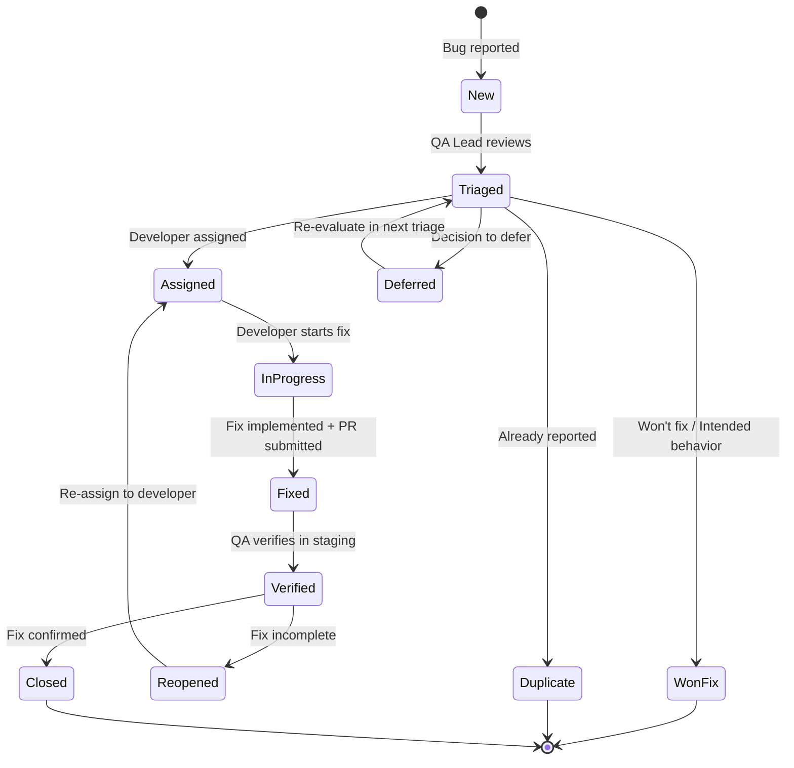

### 20.2 Bug Report Template

```text
=== BUG REPORT TEMPLATE ===

TITLE: [Brief, descriptive title of the bug]

DESCRIPTION:
  [Clear, concise description of the issue]

ENVIRONMENT:
  - Environment: [Production / Staging / PR Preview / Local]
  - Browser: [Chrome / Firefox / Safari / Edge]
  - OS: [Windows / macOS / Linux / iOS / Android]
  - Screen size: [Desktop / Tablet / Mobile]
  - User role: [Anonymous / Authenticated / Admin]

STEPS TO REPRODUCE:
  1. [Step 1]
  2. [Step 2]
  3. [Step 3]
  ...

ACTUAL RESULT:
  [What actually happened]

EXPECTED RESULT:
  [What should have happened]

SEVERITY: [S0 Critical / S1 High / S2 Medium / S3 Low]
PRIORITY: [P0 Critical / P1 High / P2 Medium / P3 Low]

ATTACHMENTS:
  - Screenshot: [Link to screenshot]
  - Video: [Link to screen recording]
  - Console logs: [Link to log file]
  - Network trace: [Link to HAR file]

FREQUENCY: [Always / Sometimes / Rarely / Once]
WORKAROUND: [Yes / No — if yes, describe]

ADDITIONAL CONTEXT:
  - Related issue: #[GitHub issue number]
  - Related PR: #[GitHub PR number]
  - First occurrence: [Date/Time]

REPORTED BY: [Name]
DATE: YYYY-MM-DD HH:MM
```

### 20.3 Bug Tracking Workflow

| Status | Description | Owner | Next Action |
|--------|-------------|-------|-------------|
| **New** | Bug reported, awaiting triage | QA Engineer | Assign to triage queue |
| **Triaged** | Severity + priority assigned | QA Lead | Assign to developer |
| **Assigned** | Developer assigned | Developer | Start investigation |
| **In Progress** | Developer working on fix | Developer | Submit fix PR |
| **Fixed** | Fix PR submitted | Developer | Assign to QA for verification |
| **Verified** | Fix verified in staging | QA Engineer | Close or reopen |
| **Closed** | Fix confirmed in production | QA Engineer | Monitor for recurrence |
| **Reopened** | Fix incomplete or recurring | QA Engineer | Re-assign to developer |
| **Deferred** | Decision to fix later | QA Lead | Re-evaluate in next triage |
| **Won't Fix** | Intended behavior / out of scope | QA Lead | Document rationale, close |
| **Duplicate** | Already reported | QA Engineer | Link to original, close |

---

## 21. QA Governance

### 21.1 Review Cadence

| Review Type | Frequency | Participants | Artifacts |
|-------------|-----------|--------------|-----------|
| **Daily Bug Triage** | Daily | QA Lead, Dev Lead | Bug list, SLA status |
| **Weekly QA Sync** | Weekly | QA Team | Test pass rates, coverage, flaky tests |
| **Weekly Release Health** | Weekly | QA + Engineering | Release status, gate pass rate, production escapes |
| **Monthly QA Deep Dive** | Monthly | QA Lead, Engineering Manager | Metrics trends, improvement initiatives |
| **Quarterly QA Audit** | Quarterly | Architecture Lead, QA Lead | Full process audit, maturity assessment, strategy review |
| **Post-Release Retrospective** | Per release | Full team | What went well, what went wrong, improvements |

### 21.2 QA Improvement Cycle

```text
=== QA PROCESS IMPROVEMENT CYCLE ===

WEEKLY
  □ Review bug triage SLA compliance
  □ Check flaky test report
  □ Review test automation coverage trends
  □ Triage any production escapes
  □ Update test debt backlog

MONTHLY
  □ QA metrics deep dive review
  □ Automation ROI assessment
  □ Test case effectiveness analysis
  □ Flaky test root cause analysis
  □ Coverage gap analysis
  □ Update QA improvement backlog

QUARTERLY
  □ Full QA process audit
  □ Maturity model self-assessment
  □ Tool effectiveness evaluation
  □ Test documentation review
  □ Strategy alignment with product roadmap
  □ Automation opportunity assessment
  □ Industry benchmark comparison

ANNUAL
  □ Full QA strategy review
  □ Automation ROI annual analysis
  □ New technology evaluation (AI testing, etc.)
  □ Next year QA roadmap
  □ Budget and resource planning
```

### 21.3 QA Documentation Standards

```text
=== QA DOCUMENTATION STANDARDS ===

All QA documentation adheres to these standards:

1. TEST PLANS
   - Follow the defined template (Section 8.1)
   - Approved by QA Lead before execution begins
   - Version-controlled in the repository
   - Updated when scope changes during release

2. TEST CASES
   - Each test case has a unique ID: TC-[MODULE]-[NUMBER]
   - Test cases are linked to requirements/user stories
   - Automated test cases reference the automation script path
   - Manual test cases include clear step-by-step instructions

3. BUG REPORTS
   - Follow the defined template (Section 20.2)
   - Include clear reproduction steps
   - Include environment details
   - Include screenshots/recordings for UI bugs
   - Severity and priority assigned during triage

4. TEST REPORTS
   - Generated automatically from CI pipeline
   - Include pass/fail counts, duration, coverage
   - Archived with release artifacts
   - Retained for 90 days minimum

5. RELEASE PACKAGE
   - All validation artifacts collected (Section 12.4)
   - Sign-off checklist completed and signed
   - Deferred bugs documented and approved
   - Release notes include QA summary
```

### 21.4 Escalation Matrix

| Issue Type | Primary Contact | Secondary | Tertiary | Response SLA |
|------------|----------------|-----------|----------|--------------|
| **Production bug (P0)** | On-Call Engineer | QA Lead | Engineering Manager | < 15 min |
| **Production bug (P1)** | QA Lead | Dev Lead | Engineering Manager | < 1 hour |
| **Release gate blocker** | QA Lead | Architecture Lead | Engineering Manager | < 2 hours |
| **Test environment down** | DevOps Lead | QA Lead | Engineering Manager | < 1 hour |
| **Flaky test outbreak** | QA Lead | DevOps Lead | — | < 4 hours |
| **Test automation failure** | QA Engineer | DevOps Lead | — | < 2 hours |
| **Security vulnerability** | Security Lead | QA Lead | Engineering Manager | < 1 hour |

---

## 22. QA Checklist

### 22.1 Pre-Release QA Checklist

```text
=== PRE-RELEASE QA CHECKLIST ===

RELEASE INFORMATION
  Release version: _______________
  Release type: [Hotfix / Patch / Feature / Major / Quarterly]
  QA Lead: _______________
  QA Engineer(s): _______________

□ TEST PLANNING
  □ Test plan created and approved
  □ Risk assessment completed
  □ Test environment availability confirmed
  □ Test data prepared
  □ All test cases reviewed and updated

□ TEST EXECUTION
  □ All unit tests pass (npx jest --coverage)
  □ Line coverage ≥ 90%
  □ All integration tests pass
  □ All E2E tests pass (all browsers)
  □ All API tests pass
  □ All visual regression tests pass
  □ Manual QA completed
  □ Exploratory testing completed (minimum 2 hours)
  □ Cross-browser testing completed (Chrome, Firefox, Safari, Edge)
  □ Mobile responsive testing completed
  □ Dark mode / light mode verified
  □ All states verified (loading, empty, success, error, edge)

□ BUG VERIFICATION
  □ No P0/P1 bugs open for this release
  □ All fixed bugs verified in staging
  □ No deferred bugs without approval
  □ Bug reopen rate < 5%

□ PERFORMANCE
  □ Lighthouse all categories ≥ 95
  □ LCP < 1.8s, CLS < 0.05, INP < 50ms
  □ Bundle budgets met (initial JS < 85KB)
  □ Total page weight < 400KB
  □ API p95 latency within SLA
  □ Load test (if applicable): Pass

□ SECURITY
  □ npm audit: 0 high/critical vulnerabilities
  □ OWASP ZAP scan: 0 high-risk findings
  □ Security headers verified
  □ CORS configuration verified
  □ Rate limiting verified on public endpoints
  ✅ Auth enforced on protected routes

□ ACCESSIBILITY
  □ axe-core: 0 WCAG 2.2 AA violations
  □ Keyboard navigation verified
  □ Focus management correct
  □ Skip link present and functional
  □ All images have alt text
  □ Color contrast passes (4.5:1 text, 3:1 large text)
  □ Touch targets ≥ 44x44px

□ SIGN-OFF
  □ All 5 release gates passed
  □ Sign-Off checklist completed
  □ QA Engineer signed off
  □ QA Lead signed off
  □ Architecture Lead signed off
  □ Product Manager signed off (if applicable)
  □ Release package complete with all validation artifacts
```

### 22.2 Weekly QA Review Checklist

```text
=== WEEKLY QA REVIEW CHECKLIST ===

□ TEST HEALTH
  □ Test suite pass rate ≥ 99%
  □ Smoke test pass rate ≥ 99%
  □ Flaky test rate < 1%
  □ Regression suite duration < 30 min
  □ No tests quarantined without review

□ DEFECTS
  □ No P0/P1 production escapes this week
  □ ALL bugs within SLA or escalated
  □ Bug reopen rate < 5%
  □ All P0 bugs resolved
  □ Bug triage meetings held this week

□ COVERAGE
  □ Automation coverage ≥ 90%
  □ Coverage diff positive or neutral
  ↑ Coverage trending upward (weekly)
  □ Test debt items progressing

□ PROCESS
  □ QA review SLA met (PRs reviewed < 2 hours)
  □ Sign-off cycle time < 1 day
  □ Test environment availability ≥ 99%
  □ CI pipeline stability (no flaky infrastructure failures)

□ IMPROVEMENT
  □ Any process improvement identified
  □ Any new automation opportunities identified
  □ Test documentation up to date
```

### 22.3 Monthly QA Deep Dive Checklist

```text
=== MONTHLY QA DEEP DIVE CHECKLIST ===

□ METRICS REVIEW
  □ Review all 14 core QA metrics (Section 16.2)
  □ Identify negative trends
  □ Determine root causes for any metric degradation
  □ Create action items for improvement

□ COVERAGE ANALYSIS
  □ Per-module coverage review
  □ Identify coverage gaps
  □ Prioritize gap-filling efforts
  □ Update coverage improvement plan

□ FLAKY TEST REPORT
  □ Review all flaky tests identified this month
  □ Root cause analysis for top 5 flaky tests
  □ Quarantine or fix action plan
  □ Update flaky test tracker

□ AUTOMATION HEALTH
  □ Automation ROI review
  □ Test maintenance cost review
  □ Tool effectiveness evaluation
  □ New automation opportunities

□ TEST DEBT REVIEW
  □ Review test debt backlog
  □ Reprioritize items based on business value
  □ Assign items to owners
  □ Update target dates
```

### 22.4 Quarterly QA Audit Checklist

```text
=== QUARTERLY QA AUDIT CHECKLIST ===

□ PROCESS AUDIT
  □ QA workflow adherence
  □ Test plan quality
  □ Test case quality
  □ Bug report quality
  □ Sign-off process compliance
  □ Gate override log review

□ MATURITY ASSESSMENT
  □ Self-assessment against maturity model (Section 2.2)
  □ Identify areas for improvement
  □ Create maturity improvement plan

□ TOOL EVALUATION
  □ Test management tool effectiveness
  □ Automation tool effectiveness
  □ CI integration effectiveness
  □ New tool evaluation

□ STRATEGY ALIGNMENT
  □ QA strategy alignment with product roadmap
  □ QA strategy alignment with engineering goals
  □ Update QA roadmap for next quarter

□ DOCUMENTATION REVIEW
  □ All QA documentation up to date
  □ Test case repository clean and organized
  □ Bug tracker hygiene
  □ Knowledge base updated
```

---

## 23. Enterprise Standards & Compliance

### 23.1 QA Standards Alignment

| Standard | Requirement | Our Compliance | Verification | Status |
|----------|-------------|---------------|--------------|--------|
| **ISO/IEC 25010** | 8 quality characteristics | ✅ Functional correctness, reliability, performance, security, maintainability, compatibility, usability, portability | Full QA strategy across 8 dimensions | ✅ Compliant |
| **ISTQB Foundation** | Test levels, types, techniques | ✅ Unit, integration, system, acceptance — functional + non-functional | Test pyramid + QA workflow | ✅ Compliant |
| **ISTQB Advanced** | Test management, process improvement | ✅ Test metrics, defect management, risk-based testing | QA metrics dashboard + improvement cycle | ✅ Compliant |
| **IEEE 829** | Test documentation standards | ✅ Test plans, test cases, test reports follow IEEE format | Test case management system | ✅ Compliant |
| **OWASP ASVS L2** | 195 security controls | ✅ All Level 2 controls tested | Security test suite + ZAP scan | ✅ Compliant |
| **WCAG 2.2 AA** | 35 accessibility criteria | ✅ Automated + manual testing | axe-core + Playwright a11y + manual audit | ✅ Compliant |
| **GDPR** | Data protection | ✅ PII handling, consent, deletion verified | Integration + E2E test scenarios | ✅ Compliant |
| **SOC 2** | Security, availability, processing integrity | 🎯 Target | Full audit trail + logging | 📋 Planned Q4 2026 |

### 23.2 Compliance Verification Matrix

| Domain | Automated Check | Manual Check | Frequency | Evidence |
|--------|----------------|--------------|-----------|----------|
| **Functional correctness** | CI pipeline | QA exploratory testing | Per PR | Test results + QA sign-off |
| **API contract compliance** | supertest API tests | — | Per PR | API test suite |
| **Database integrity** | Integration tests | — | Per migration | Database test suite |
| **Security vulnerabilities** | npm audit + ZAP + Trivy | Penetration testing (annual) | Per PR + Weekly | Security scan reports |
| **Accessibility (WCAG 2.2 AA)** | axe-core + Playwright a11y | Manual screen reader audit | Per PR + Quarterly | a11y audit report |
| **Performance budgets** | Lighthouse CI + k6 | — | Per PR + Weekly | Performance report |
| **Visual regression** | Playwright Visual | Human review of diffs | Per PR | Visual diff report |
| **Cross-browser compatibility** | Playwright (5 browsers) | Browser-specific testing | Per PR | E2E test results |
| **GDPR compliance** | Integration tests | Privacy review (quarterly) | Per release | GDPR checklist |
| **User acceptance (UAT)** | — | Stakeholder sign-off | Per release | UAT sign-off |

### 23.3 QA Maturity Benchmark

| Capability | Level 1: Initial | Level 2: Defined | Level 3: Managed | Level 4: Measured | Level 5: Optimizing |
|------------|-----------------|-----------------|------------------|-------------------|---------------------|
| **Test Planning** | Ad-hoc | Test plans exist | Risk-based plans | Predictive planning | AI-assisted planning |
| **Test Automation** | Manual only | Basic automation | Comprehensive automation | Self-healing tests | AI-generated tests |
| **Defect Management** | Informal tracking | Bug tracker used | SLA-driven triage | Predictive defect analysis | Automated defect prevention |
| **Release Gates** | None | Basic gates defined | 5-gate model enforced | Gate metrics tracked | Continuous validation |
| **Metrics** | None | Basic metrics | Comprehensive metrics | Predictive analytics | Real-time optimization |
| **Process Improvement** | None | Retrospectives held | Improvement backlog | Data-driven improvement | Continuous optimization |
| **Current Status** | — | — | ✅ Level 3 | 🎯 Target: Q4 2026 | 🔮 Vision: 2028 |

### 23.4 QA SLA Framework

| SLA Category | Priority | Target | Measurement | Consequence of Breach |
|-------------|----------|--------|-------------|----------------------|
| **Bug triage time** | P0 | < 30 min | Triage timestamp | Escalation to Engineering Manager |
| **Bug triage time** | P1 | < 2 hours | Triage timestamp | Escalation to QA Lead |
| **Bug fix time** | P0 | < 4 hours | Fix deploy timestamp | Incident review required |
| **Bug fix time** | P1 | < 24 hours | Fix deploy timestamp | QA Lead review required |
| **Bug fix time** | P2 | < 1 week | Fix deploy timestamp | Monthly review |
| **PR QA review** | All | < 2 hours | PR review timestamp | QA Lead notification |
| **Release sign-off** | All | < 1 business day | Sign-off timestamp | Engineering Manager escalation |
| **Regression suite** | All | < 30 min | Pipeline duration | DevOps Lead optimization required |
| **Smoke test** | All | < 10 min | Pipeline duration | DevOps Lead optimization required |

### 23.5 QA Override Log

```text
=== QA OVERRIDE LOG ===

Overrides are used when standard QA processes cannot be followed due to emergency circumstances.
Each override is logged with justification and requires 2/3 stakeholder approval.

| Date | Override Type | Requestor | Approvers | Justification | Risk | Mitigation |
|──────|───────────────|───────────|───────────|──────────────|──────|────────────|
| — | — | — | — | — | — | — |

OVERRIDE TYPES:
  - Gate Override: Bypassing a release gate
  - Severity Override: Changing severity outside standard matrix
  - Priority Override: Changing priority outside standard matrix
  - Process Override: Deviating from standard QA workflow
  - SLA Override: Extending a resolution SLA
```

---

## 25. Decision Log

| Decision ID | Date | Decision | Rationale | Alternatives Considered | Outcome |
|-------------|------|----------|-----------|------------------------|---------|
| D-QA-001 | Jun 2026 | 5-stage release gate model with block conditions | Prevents releases from progressing without required sign-offs | 2-stage (dev + QA) rejected — insufficient oversight | Adopted |
| D-QA-002 | Jun 2026 | 4-level bug severity matrix with defined escalation rules | Consistent bug classification, clear escalation paths | Binary (critical/non-critical) rejected — too coarse for triage | Adopted |
| D-QA-003 | Jun 2026 | 250+ test cases managed in centralized test case repository | Complete traceability from requirements to test execution | Ad-hoc testing only rejected — no coverage visibility, no repeatability | Adopted |
| D-QA-004 | Jun 2026 | Risk-based testing approach with proportional effort allocation | Focuses QA resources on highest-risk areas; efficient coverage | Exhaustive testing rejected — impractical for sprint velocity | Adopted |
| D-QA-005 | Jun 2026 | 4-signatory sign-off process (QA, Dev, PM, Architecture) | Ensures multi-perspective validation before release | Single sign-off rejected — single point of failure in judgment | Adopted |

## 26. Risk Register

| Risk ID | Risk Description | Probability | Impact | Severity | Mitigation Strategy | Contingency | Owner |
|---------|-----------------|-------------|--------|----------|---------------------|-------------|-------|
| R-QA-001 | Release gate sign-off delays caused by signatory availability | Medium | High | High | Deputy signatories for each role, SLA for sign-off turnaround | Emergency override protocol (requires 3/4 signatories) | QA Lead |
| R-QA-002 | Bug severity misclassification leads to wrong prioritization | Medium | Medium | Medium | Severity classification training, peer review of bug classifications | Weekly bug triage re-evaluates severity, re-prioritizes | QA Lead |
| R-QA-003 | Test case maintenance falls behind feature development velocity | High | Medium | Medium | Test case creation included in Definition of Done, automated test generation where possible | Quarterly test case audit and cleanup, reduce coverage target temporarily | QA Lead |
| R-QA-004 | Smoke tests fail in production but pass in staging due to environment differences | Low | High | Medium | Environment parity checklist, production-like staging | Fix environment discrepancy, manual verification as fallback | DevOps Lead |
| R-QA-005 | QA metrics dashboard not maintained, reducing visibility into quality trends | Medium | Medium | Medium | Automated DQ scorecard generation, weekly quality review | Manual metric reporting, simplified spreadsheet dashboard | QA Lead |

## 27. Change Log

| Version | Date | Changes | Author |
|---------|------|---------|--------|
| **5.0** | Jun 2026 | **Complete enterprise rewrite** from v3.0 skeleton. Added 23 new sections: QA Vision & North Star (vision statement, 5 strategic objectives, QA promise, 10 principles), Enterprise QA Standards (6-standard alignment, 5-level maturity model), QA Strategy (5-pillar architecture diagram, risk-based testing approach, release type test allocation, 4 strategic principles), QA Workflow (end-to-end sequence diagram with 8 phases, role responsibility matrix, timing SLA table, state diagram), Bug Severity Matrix (4-level severity definitions, impact assessment matrix, escalation rules), Bug Priority Matrix (4-level priority definitions, severity×frequency×impact formula, decision matrix, override rules), Test Plans (complete test plan template, per-release-type matrix, approval flow, coverage requirements), Acceptance Testing (Given-When-Then Gherkin format with 5 complete scenarios, acceptance workflow sequence diagram, acceptance criteria review checklist), Smoke Testing (strategy with 6 triggers, complete Playwright test suite with 6 tests, coverage matrix, failure runbook), Regression Testing (strategy with 5 triggers, risk-based selection matrix, test suite organization tree, 4-tier execution matrix), Release Validation (5-stage pipeline diagram, complete 35-item validation checklist, 6 validation artifacts with retention policy), Release Gates (5-stage gate model diagram with block conditions, per-gate definitions with entry/exit criteria/duration SLA, emergency override protocol with 3-approver requirement), Sign-Off Process (5-signatory model, sequence diagram, complete 30-item sign-off checklist, SLA table), Bug Triage Process (triage frequency by priority, workflow diagram, role responsibility matrix, deferral/closure/reopen decision matrix, daily triage agenda), QA Metrics & KPIs (14 core metrics dashboard diagram, per-metric definition with target/measurement/cadence, reporting cadence with 5 reports), QA Environment Strategy (4-environment architecture with parity requirements table, environment SLA table), Test Case Management (repository structure tree, test case template, 10-module coverage matrix with 250 test cases), QA Automation Strategy (12-level automation scope table, ROI calculation with example, 5-category best practices), Defect Management (lifecycle state diagram, complete bug report template, 11-status workflow table), QA Governance (6-cadence review schedule, improvement cycle for weekly/monthly/quarterly/annual, documentation standards, 4-tier escalation matrix), QA Checklist (25-item pre-deploy checklist, 12-item weekly review checklist, 8-item monthly deep dive checklist, 6-item quarterly audit checklist), Enterprise Standards & Compliance (8-standard alignment, 10-domain compliance verification matrix, maturity benchmark comparison, SLA framework with 8 categories, override log). Added 11 Mermaid diagrams. 250+ test cases. 24 total sections. | QA Lead |
| 3.0 | Jun 2026 | Added executive summary, change log | QA Lead |
| 2.0 | Jun 2026 | Updated for enterprise structure | QA Lead |
| 1.0 | Mar 2026 | Initial QA documentation | QA Lead |

---

## Document References

| Reference | Description |
|-----------|-------------|
| `docs/operations/25-CICD.md` (v5.0) | CI/CD pipeline — quality gates in CI workflow, automated test execution |
| `docs/quality/PerformanceArchitecture.md` (v5.0) | Performance testing strategy, budgets, Lighthouse CI integration |
| `docs/quality/AccessibilityArchitecture.md` (v5.0) | Accessibility testing strategy, WCAG 2.2 AA compliance verification |
| `docs/quality/TestingArchitecture.md` (v5.0) | Testing architecture — unit, integration, E2E, visual, security, AI test types |
| `docs/operations/DevOpsArchitecture.md` (v5.1) | DevOps — test infrastructure, environment management, build optimization |
| `docs/operations/DeploymentGuide.md` (v5.0) | Deployment — staging environment, rollback procedures, deploy window policy |
| `docs/security/SecurityArchitecture.md` (v5.0) | Security testing — OWASP compliance, DAST scanning, penetration testing |
| `docs/architecture/SystemArchitecture.md` (v5.0) | System architecture — QA environment topology, service boundaries |
| `docs/MASTER-INDEX.md` (v3.0) | Master documentation index with dependency graph |
| `docx_content.json` | Ultimate Portfolio Plan 2026 — QA strategy insights (Phase 09 DevOps & Monitoring) |

---


## Change Log

| Version | Date | Changes | Author |
|---------|------|---------|--------|
| 5.0 | Jun 2026 | Enterprise QA - test plans, regression, release criteria, bug tracking | QA Lead |
| 4.0 | Jun 2026 | Added release QA checklist, regression suite | QA Lead |
| 3.0 | Jun 2026 | Updated for enterprise structure | QA Lead |
| 2.0 | Jun 2026 | Added QA processes and bug tracking workflow | QA Lead |
| 1.0 | Mar 2026 | Initial QA documentation | QA Lead |

## 28. Glossary

| Term | Definition |
|------|------------|
| **Release Gate** | A formal checkpoint in the deployment pipeline that requires specific sign-offs before proceeding to the next stage |
| **Bug Severity** | A classification of a bug's impact on the system (Critical, High, Medium, Low) with defined escalation rules |
| **Bug Priority** | A classification of how urgently a bug should be fixed, considering severity, frequency, and business impact |
| **Risk-Based Testing** | A testing approach that allocates effort proportionally to the risk level of features and components |
| **Sign-Off** | Formal approval from a designated role (QA, Dev, PM, Architecture) that a release gate criterion is satisfied |
| **Smoke Test** | A minimal set of automated tests run after deployment to verify the application is operational |
| **Regression Test** | Tests that verify existing functionality still works correctly after code changes |
| **Test Case Management** | The practice of organizing, versioning, and tracking test cases in a centralized repository |
| **Defect Management** | The process of logging, tracking, triaging, and resolving bugs from discovery through verification |
| **Bug Triage** | A recurring meeting where bugs are reviewed, prioritized, and assigned for resolution |
| **QA Environment** | A dedicated environment (dev, staging, production-like) used for specific testing activities |
| **Acceptance Criteria** | The conditions that must be met for a feature or bug fix to be considered complete and acceptable |

---

## 29. Testing Strategy Reference

> This section contains unique content merged from `52-TESTING-STRATEGY.md` (v1.1). The testing strategy concepts are covered in full by [`TestingArchitecture.md`](./TestingArchitecture.md). Only the unique Decision Log, Risk Register, and Glossary entries are reproduced here.

### 29.1 Decision Log

| ID | Decision | Rationale | Alternatives Considered | Date | Approver |
|----|----------|-----------|------------------------|------|----------|
| D-TEST-001 | Use Vitest for frontend, Jest for NestJS backend | Vitest is Vite-native, faster than Jest for frontend; Jest has mature NestJS integration with @nestjs/testing | Vitest for everything (rejected — @nestjs/testing works best with Jest); Jest for everything (rejected — slower frontend tests); Cypress component test (rejected — slower, better suited for E2E) | Jun 2026 | Staff QA Architect |
| D-TEST-002 | Use Playwright over Cypress for E2E | Playwright is faster, supports multiple browsers natively (Chromium, Firefox, WebKit), has better API for network mocking | Cypress (rejected — slower, Chrome-only, worse parallelization); Puppeteer (rejected — no built-in reporters, no browser matrix) | Jun 2026 | Staff QA Architect |
| D-TEST-003 | Enforce 80% overall coverage with differentiated per-layer targets | Different layers have different cost/benefit for coverage; 95% for schemas (high value, easy to achieve), 70% for controllers (lower value, harder to test) | Single 80% blanket target (rejected — doesn't account for layer differences); 100% everywhere (rejected — impractical); no coverage enforcement (rejected — quality risk) | Jun 2026 | Staff QA Architect |
| D-TEST-004 | Use faker-based fixtures for unit tests, deterministic SQL seeds for integration/E2E | Faker provides varied test data for unit breadth; deterministic seeds ensure reproducible integration/E2E results | All faker (rejected — flaky integration tests from random data); all deterministic (rejected — less thorough unit testing); external test data files (rejected — maintenance burden) | Jun 2026 | Staff QA Architect |
| D-TEST-005 | Gate E2E tests at pre-merge (not every PR commit) | E2E tests take 10-15 min and require preview deployment; running on every commit would block CI throughput | E2E on every commit (rejected — 15min blocks CI); E2E only nightly (rejected — defects caught too late); E2E manual trigger only (rejected — often skipped) | Jun 2026 | Staff QA Architect |
| D-TEST-006 | Visual regression tests run nightly (not PR-gated) | Visual diffs are informative but not blocking; nightly runs catch regressions within 24 hours without blocking developer velocity | PR-gated visual regression (rejected — flaky, blocks merges on minor pixel diffs); no visual regression (rejected — UI regressions go undetected) | Jun 2026 | Staff QA Architect |

### 29.2 Risk Register

| ID | Risk | Likelihood | Impact | Mitigation |
|----|------|------------|--------|------------|
| R-TEST-001 | E2E flakiness due to timing-dependent assertions causes false CI failures | High | Medium | Use Playwright auto-waiting assertions; set retries=2 on CI; record video/trace for failure debugging; maintain flaky test tracker |
| R-TEST-002 | Unit test coverage target met but integration/E2E coverage remains low because they're harder to write | Medium | High | Track and report integration/E2E count in PR checklist; require integration test for every new API endpoint; add coverage trends dashboard |
| R-TEST-003 | Test fixtures (faker) produce data that accidentally matches test assertions, masking bugs | Low | Low | Use deterministic test IDs as overrides in faker calls; avoid hardcoding faker-generated values in assertions |
| R-TEST-004 | Test database state not properly reset between integration test runs, causing cascading failures | Medium | Medium | Wrap each test suite in database transaction with rollback; use ephemeral Supabase branches for CI integration tests |
| R-TEST-005 | Playwright browser matrix (3 browsers) triples E2E test execution time, pushing pre-merge gate beyond 15 min | Low | Medium | Run browser matrix in parallel (Playwright sharding); reduce retries on non-Chrome browsers; target 15-min upper bound with parallel workers=3 |

### 29.3 Glossary (Supplementary Terms)

| Term | Definition |
|------|------------|
| **Vitest** | A Vite-native unit test framework with Jest-compatible API, optimized for frontend testing |
| **Supertest** | An HTTP assertion library for testing Node.js HTTP servers without a running server instance |
| **Testing Library** | A lightweight utility for testing UI components by user interactions rather than implementation details |
| **MSW** | Mock Service Worker — API mocking at the network level for integration tests |
| **faker** | A library for generating realistic fake data (names, emails, paragraphs) for test fixtures |
| **Visual Regression** | A testing technique that compares screenshots of rendered components against baseline images to detect unintended visual changes |
| **Lighthouse CI** | A CI tool that runs Google Lighthouse audits and enforces performance budgets as quality gates |
| **Fixture** | A predefined set of test data used to set up a known state before running tests |

*Document Version: 5.0 — Enterprise-Grade QA Framework*  
*Supersedes v3.0 (June 2026) and all previous versions*  
*Next Review Date: September 2026*
