# Storybook Architecture — Enterprise-Grade Component Development & Documentation

> **Document:** `Storybook.md` | **Version:** 1.0 | **Last Updated:** June 2026  
> **Status:** ✅ Active | **Owner:** Frontend Lead | **Review Cadence:** Monthly  
> **Classification:** Enterprise Architecture | **Standards:** Component-Driven Development (CDD), Atomic Design  
> **Related:** [TestingArchitecture.md](./TestingArchitecture.md) | [30-QA.md](./30-QA.md) | [05-DESIGN-SYSTEM.md](./05-DESIGN-SYSTEM.md) | [TestingImplementation.md](./TestingImplementation.md)

---

## Table of Contents

1. [Executive Summary](#1-executive-summary)
2. [Storybook Architecture](#2-storybook-architecture)
3. [Component Stories Structure](#3-component-stories-structure)
4. [Documentation Standards](#4-documentation-standards)
5. [Visual Testing](#5-visual-testing)
6. [Interaction Testing](#6-interaction-testing)
7. [Accessibility Testing](#7-accessibility-testing)
8. [Review Workflow](#8-review-workflow)
9. [Story Composition](#9-story-composition)
10. [Theming & Modes](#10-theming--modes)
11. [CI Integration](#11-ci-integration)
12. [Enterprise Standards Alignment](#12-enterprise-standards-alignment)
13. [Change Log](#13-change-log)

---

## 1. Executive Summary

This document defines the **Storybook architecture** for the portfolio platform. Storybook serves as the single source of truth for UI component development, documentation, and visual testing. It follows **Atomic Design methodology** organizing components from atoms through pages, with comprehensive stories covering every component state, theme variant, and viewport.

### 1.1 Storybook Implementation Maturity

| Level | Name | Current | Target | Key Metrics |
|-------|------|---------|--------|-------------|
| **L1** | Initial | — | — | Components exist in code only |
| **L2** | Documented | — | — | Basic stories for all public components |
| **L3** | Tested | — | — | Interaction + visual tests integrated |
| **L4** | Comprehensive | ✅ Current | — | Full stories, docs, visual tests, a11y audits |
| **L5** | CI-Governed | 🎯 Target | Q3 2026 | Visual diff gates, story composition automation |

### 1.2 Storybook Configuration

- **Framework:** Storybook 8.x with Next.js framework support
- **Addons:** 15+ production addons for testing, docs, accessibility, theming
- **Build:** `storybook-static` output deployed alongside the app
- **URL:** `https://storybook.portfolio.dev` (staging), local `http://localhost:6006`

### 1.3 Strategic Objectives

| Objective | Target | Timeframe | Owner |
|-----------|--------|-----------|-------|
| **100% component coverage** | Every public component has stories | Q3 2026 | Frontend Lead |
| **Visual regression gating** | Zero unexpected visual diffs in CI | Q3 2026 | Frontend Lead |
| **Interaction test coverage** | Every component interaction tested | Q3 2026 | Frontend Lead |
| **Accessibility audit coverage** | A11y audit in every story | Q3 2026 | Frontend Lead |
| **Documentation parity** | Usage docs updated with every component change | Baseline | Full Team |
| **Story build time** | Full build < 60s | Q3 2026 | DevOps Lead |

---

## 2. Storybook Architecture

### 2.1 Project Structure

```
.storybook/
├── main.ts                  # Storybook configuration (addons, webpack, stories)
├── preview.ts               # Global decorators, parameters, themes
├── preview-head.html        # Global head injection (fonts, scripts)
└── manager.ts               # UI customization (branding, sidebar)

src/
├── components/
│   ├── ui/                  # Atom-level components
│   │   ├── Button/
│   │   │   ├── Button.tsx
│   │   │   ├── Button.stories.tsx
│   │   │   ├── Button.test.tsx
│   │   │   └── Button.docs.mdx
│   │   └── ...
│   ├── sections/            # Molecule/organism-level components
│   │   ├── HeroSection/
│   │   │   ├── HeroSection.tsx
│   │   │   ├── HeroSection.stories.tsx
│   │   │   ├── HeroSection.test.tsx
│   │   │   └── HeroSection.docs.mdx
│   │   └── ...
│   └── templates/           # Page-level templates
│       ├── HomePage/
│       │   ├── HomePage.tsx
│       │   ├── HomePage.stories.tsx
│       │   └── HomePage.test.tsx
│       └── ...
└── styles/
    ├── design-tokens.ts     # Design token definitions
    └── theme.ts             # Theme provider configuration
```

### 2.2 Architecture Diagram

```mermaid
graph TB
    subgraph "Storybook Application"
        SB["📕 Storybook 8.x<br/>React + Next.js"]
        UI["🖥️ UI Manager<br/>Sidebar, Toolbar, Canvas"]
        API["🔌 Story Index API<br/>CSF 3.0 Stories"]
    end

    subgraph "Addon Ecosystem"
        A11Y["♿ a11y Addon<br/>Axe Core Integration"]
        CT["🧪 Test Runner<br/>Jest + Playwright"]
        CH["📸 Chromatic<br/>Visual Regression"]
        INT["🔄 Interaction<br/>Play Functions"]
        DOCS["📝 Docs Addon<br/>Auto-generated MDX"]
        THEME["🎨 Theme Addon<br/>Dark/Light Modes"]
        VIEW["📐 Viewport Addon<br/>Responsive Testing"]
        CONT["🧩 Controls Addon<br/>Prop Exploration"]
        SOURCE["📄 Source Addon<br/>Code Preview"]
        MEAS["📏 Measure Addon<br/>Layout Inspection"]
    end

    subgraph "Component Hierarchy"
        ATOMS["🧩 Atoms<br/>Button, Input, Badge<br/>Basic UI Primitives"]
        MOL["🔬 Molecules<br/>SearchBar, NavItem<br/>Composite Patterns"]
        ORG["🧬 Organisms<br/>HeroSection, Footer<br/>Complex UI Blocks"]
        TEMP["📋 Templates<br/>PageLayout, BlogLayout<br/>Page Structures"]
    end

    subgraph "Testing Pipeline"
        UNIT["✅ Unit Tests<br/>Jest + RTL"]
        INTER["🔄 Interaction Tests<br/>Playwright"]
        VISUAL["📸 Visual Diff<br/>Chromatic"]
        A11Y_T["♿ A11y Tests<br/>Axe"]
        BUILD["🏗️ Build Tests<br/>storybook build"]
    end

    SB --> UI
    SB --> API
    UI --> A11Y & CT & CH & INT & DOCS & THEME & VIEW & CONT & SOURCE & MEAS
    API --> ATOMS & MOL & ORG & TEMP
    ATOMS --> UNIT & INTER & VISUAL & A11Y_T
    MOL --> UNIT & INTER & VISUAL & A11Y_T
    ORG --> UNIT & INTER & VISUAL & A11Y_T
    TEMP --> UNIT & INTER & VISUAL & A11Y_T
    UNIT & INTER & VISUAL & A11Y_T --> BUILD
```



### 2.3 Configuration (`main.ts`)

```typescript
import type { StorybookConfig } from '@storybook/nextjs';

const config: StorybookConfig = {
  stories: [
    '../src/**/*.stories.@(ts|tsx)',
    '../src/**/*.docs.mdx',
  ],
  addons: [
    '@storybook/addon-a11y',
    '@storybook/addon-essentials',
    '@storybook/addon-interactions',
    '@storybook/addon-links',
    '@storybook/addon-viewport',
    '@storybook/addon-measure',
    'storybook-dark-mode',
    '@chromatic-com/storybook',
  ],
  framework: {
    name: '@storybook/nextjs',
    options: {},
  },
  staticDirs: ['../public'],
  docs: {
    autodocs: 'tag',
    defaultName: 'Documentation',
  },
  typescript: {
    reactDocgen: 'react-docgen-typescript',
    reactDocgenTypescriptOptions: {
      propFilter: (prop) =>
        prop.parent ? !/node_modules/.test(prop.parent.fileName) : true,
    },
  },
  core: {
    builder: '@storybook/builder-webpack5',
  },
};

export default config;
```

### 2.4 Preview Configuration (`preview.ts`)

```typescript
import type { Preview } from '@storybook/react';
import { themes } from '@storybook/theming';
import { ThemeProvider } from '../src/styles/ThemeProvider';

const preview: Preview = {
  parameters: {
    actions: { argTypesRegex: '^on[A-Z].*' },
    controls: {
      matchers: {
        color: /(background|color)$/i,
        date: /Date$/,
      },
    },
    viewport: {
      viewports: {
        mobile: { name: 'Mobile 375', styles: { width: '375px', height: '812px' } },
        tablet: { name: 'Tablet 768', styles: { width: '768px', height: '1024px' } },
        desktop: { name: 'Desktop 1280', styles: { width: '1280px', height: '800px' } },
        wide: { name: 'Wide 1920', styles: { width: '1920px', height: '1080px' } },
      },
    },
    a11y: {
      config: { runOnly: ['wcag2a', 'wcag2aa', 'wcag21a', 'wcag21aa', 'wcag22aa'] },
      options: { restoreScroll: true },
    },
    darkMode: {
      current: 'light',
      dark: { ...themes.dark, brandTitle: 'Portfolio (Dark)' },
      light: { ...themes.normal, brandTitle: 'Portfolio (Light)' },
    },
    chromatic: { viewports: [375, 768, 1280] },
  },
  decorators: [
    (Story) => (
      <ThemeProvider>
        <Story />
      </ThemeProvider>
    ),
  ],
  tags: ['autodocs'],
};

export default preview;
```

---

## 3. Component Stories Structure

### 3.1 Atomic Design Story Hierarchy

| Level | Components | Story Pattern | Test Requirements |
|-------|-----------|---------------|-------------------|
| **Atoms** | Button, Input, Badge, Icon, Avatar, Spinner | `src/components/ui/ComponentName/` | Unit + interaction + a11y |
| **Molecules** | SearchBar, NavItem, Card, TagList, FormField | `src/components/sections/ComponentName/` | Unit + interaction + visual + a11y |
| **Organisms** | HeroSection, Footer, ProjectCard, ContactForm | `src/components/sections/ComponentName/` | Interaction + visual + a11y |
| **Templates** | PageLayout, BlogLayout, DashboardLayout | `src/components/templates/ComponentName/` | Visual + a11y |
| **Pages** | HomePage, AboutPage, BlogPage, PortfolioPage | `src/components/templates/ComponentName/` | E2E (via Playwright) |

### 3.2 Story File Convention (CSF 3.0)

```typescript
import type { Meta, StoryObj } from '@storybook/react';
import { Button } from './Button';

const meta: Meta<typeof Button> = {
  title: 'UI/Button',
  component: Button,
  tags: ['autodocs'],
  argTypes: {
    variant: {
      control: 'select',
      options: ['primary', 'secondary', 'ghost', 'danger'],
    },
    size: {
      control: 'select',
      options: ['sm', 'md', 'lg'],
    },
    onClick: { action: 'clicked' },
  },
  parameters: {
    docs: {
      description: {
        component: 'Primary action button with multiple variants and sizes.',
      },
    },
  },
};

export default meta;
type Story = StoryObj<typeof Button>;

// Default state
export const Primary: Story = {
  args: {
    variant: 'primary',
    size: 'md',
    children: 'Click Me',
  },
};

// All variants
export const Variants: Story = {
  render: (args) => (
    <div style={{ display: 'flex', gap: '16px', alignItems: 'center' }}>
      <Button {...args} variant="primary">Primary</Button>
      <Button {...args} variant="secondary">Secondary</Button>
      <Button {...args} variant="ghost">Ghost</Button>
      <Button {...args} variant="danger">Danger</Button>
    </div>
  ),
};

// Loading state
export const Loading: Story = {
  args: {
    variant: 'primary',
    size: 'md',
    loading: true,
    children: 'Saving...',
  },
};

// Disabled state
export const Disabled: Story = {
  args: {
    variant: 'primary',
    size: 'md',
    disabled: true,
    children: 'Disabled',
  },
};

// Icon with text
export const WithIcon: Story = {
  args: {
    variant: 'primary',
    size: 'md',
    icon: 'arrow-right',
    children: 'Continue',
  },
};
```

### 3.3 Story Coverage Requirements

| Component Type | Minimum Stories | Required States | Required Viewports |
|---------------|-----------------|-----------------|-------------------|
| **Atoms** | 5+ | Default, hover, focus, disabled, loading, error | 1 (desktop 1280) |
| **Molecules** | 4+ | Default, with data, empty, error, loading | 2 (mobile 375, desktop 1280) |
| **Organisms** | 3+ | Default, with data, empty, error | 3 (mobile, tablet, desktop) |
| **Templates** | 2+ | Default, with content, loading | 3 (mobile, tablet, desktop) |
| **Pages** | 1+ | Loaded state | 3 (mobile, tablet, desktop) |

---

## 4. Documentation Standards

### 4.1 MDX Documentation Structure

Every component has a corresponding `.docs.mdx` file alongside its stories:

```mdx
import { Meta, Canvas, Story, ArgsTable, Source } from '@storybook/blocks';
import { Button } from './Button';
import * as ButtonStories from './Button.stories';

<Meta of={ButtonStories} title="UI/Button/Documentation" />

# Button Component

## Overview

The **Button** component renders a styled `<button>` element with support for
multiple variants, sizes, loading state, and icon integration. It follows the
design system's interaction guidelines from `05-DESIGN-SYSTEM.md`.

## Usage

```tsx
import { Button } from '@/components/ui/Button';

<Button variant="primary" size="md" onClick={handleClick}>
  Submit
</Button>
```

## Props

<ArgsTable of={Button} />

## Variants

<Canvas>
  <Story of={ButtonStories.Variants} />
</Canvas>

## States

### Loading State

When `loading` is `true`, the button disables interaction and shows a spinner:

<Canvas>
  <Story of={ButtonStories.Loading} />
</Canvas>

### Disabled State

<Canvas>
  <Story of={ButtonStories.Disabled} />
</Canvas>

## Accessibility

- Uses native `<button>` element for semantic HTML
- Loading state uses `aria-busy="true"`
- Disabled state uses `aria-disabled="true"`
- Supports `aria-label` for icon-only buttons
- Focus visible ring for keyboard navigation
- Minimum touch target 44×44px on mobile

## Design Guidelines

| Property | Primary | Secondary | Ghost | Danger |
|----------|---------|-----------|-------|--------|
| Background | `$accent` | Transparent | Transparent | `$error` |
| Text Color | `$on-accent` | `$accent` | `$text` | `$on-error` |
| Border | None | `1px solid $accent` | None | None |
| Hover | Darken 10% | Lighten bg 5% | Lighten bg 5% | Darken 10% |
| Focus Ring | `$accent` 2px | `$accent` 2px | `$accent` 2px | `$error` 2px |

## Related Components

- [`IconButton`](/docs/ui-iconbutton--documentation) — Icon-only variant
- [`LinkButton`](/docs/ui-linkbutton--documentation) — Button-styled link
- [`ButtonGroup`](/docs/ui-buttongroup--documentation) — Grouped buttons
```

### 4.2 JSDoc Annotations

```typescript
export interface ButtonProps extends React.ButtonHTMLAttributes<HTMLButtonElement> {
  /** Visual variant of the button */
  variant?: 'primary' | 'secondary' | 'ghost' | 'danger';
  /** Size preset */
  size?: 'sm' | 'md' | 'lg';
  /** Show loading spinner and disable interaction */
  loading?: boolean;
  /** Icon name to render before children */
  icon?: string;
  /** Accessible label for icon-only buttons */
  'aria-label'?: string;
}
```

### 4.3 Design Token Documentation

All design tokens are documented as a centralized Storybook page:

```typescript
// src/styles/design-tokens.stories.tsx
import type { Meta, StoryObj } from '@storybook/react';

const meta: Meta = {
  title: 'Design System/Tokens',
  parameters: {
    docs: {
      page: () => (
        <>
          <h1>Design Tokens</h1>
          <h2>Color Palette</h2>
          <ColorPalette />
          <h2>Typography Scale</h2>
          <TypographyScale />
          <h2>Spacing System</h2>
          <SpacingSystem />
        </>
      ),
    },
  },
};

export default meta;
```

---

## 5. Visual Testing

### 5.1 Chromatic Configuration

```typescript
// .chromatic/config.json
{
  "projectId": "Project:xxxxxxxx",
  "autoAcceptChanges": false,
  "exitOnceUploaded": true,
  "onlyChanged": true,
  "skip": ["dependabot/**"],
  "viewports": [375, 768, 1280, 1920],
  "storybookConfigDir": ".storybook",
  "buildScriptName": "build-storybook"
}
```

### 5.2 Visual Testing Strategy

| Testing Layer | Tool | Triggers | Threshold | Action on Failure |
|---------------|------|----------|-----------|-------------------|
| **UI Review** | Chromatic | Every PR | 0% unexpected changes | Block PR — manual review required |
| **Build Check** | Chromatic CLI | `storybook build` | Build success | Block CI pipeline |
| **Catch-up Tour** | Chromatic TurboSnap | Every `main` push | Auto-accept known changes | Notify UI team of changes |
| **Cross-browser** | Chromatic + Playwright | Weekly | 0 visual diffs | Log issue in tracking system |

### 5.3 Chromatic CI Integration

```yaml
# .github/workflows/chromatic.yml
name: Chromatic Visual Tests

on:
  push:
    branches: [main, develop]
  pull_request:
    branches: [main]

jobs:
  chromatic:
    runs-on: ubuntu-latest
    steps:
      - uses: actions/checkout@v4
        with:
          fetch-depth: 0
      - uses: actions/setup-node@v4
        with:
          node-version: 20
          cache: 'npm'
      - run: npm ci
      - name: Publish to Chromatic
        uses: chromaui/action@latest
        with:
          projectToken: ${{ secrets.CHROMATIC_PROJECT_TOKEN }}
          token: ${{ secrets.GITHUB_TOKEN }}
          onlyChanged: true
          exitOnceUploaded: true
          exitZeroOnChanges: true
```

### 5.4 Visual Review Flow

```mermaid
flowchart LR
    PR["📝 PR Created"] --> BUILD["🏗️ Storybook Build"]
    BUILD --> CHROM["📸 Chromatic Publish"]
    CHROM --> DIFF{"Visual Diffs?"}
    DIFF -->|"No Diffs"| PASS["✅ Auto-pass"]
    DIFF -->|"Diffs Found"| REVIEW["👀 UI Review Required"]
    REVIEW --> APPROVE{"Approved?"}
    APPROVE -->|"Accept Changes"| PASS
    APPROVE -->|"Reject / Capture Bug"| FIX["🐛 Fix Component"]
    FIX --> BUILD
    PASS --> MERGE["🔀 Merge PR"]
```



---

## 6. Interaction Testing

### 6.1 Play Function Testing

```typescript
// Button.stories.tsx — Interaction tests
import { userEvent, within, expect } from '@storybook/test';

export const ClickInteraction: Story = {
  args: {
    variant: 'primary',
    children: 'Submit',
  },
  play: async ({ canvasElement }) => {
    const canvas = within(canvasElement);
    const button = canvas.getByRole('button', { name: /submit/i });

    // Verify initial state
    await expect(button).toBeEnabled();
    await expect(button).toHaveTextContent('Submit');

    // Simulate click
    await userEvent.click(button);

    // Verify focus state after click
    await expect(button).toHaveFocus();
  },
};

export const KeyboardNavigation: Story = {
  play: async ({ canvasElement }) => {
    const canvas = within(canvasElement);
    const button = canvas.getByRole('button', { name: /submit/i });

    // Focus via keyboard
    await userEvent.tab();
    await expect(button).toHaveFocus();

    // Activate via keyboard
    await userEvent.keyboard('{Enter}');
    await expect(button).toHaveFocus();
  },
};
```

### 6.2 Interaction Test Coverage Matrix

| Component | Interaction Type | Play Function | Assertions |
|-----------|-----------------|---------------|------------|
| **Button** | Click, focus, keyboard Enter/Space | `play: async` | Enabled, disabled, loading, focus ring |
| **Input** | Typing, focus, blur, clear | `play: async` | Value changes, placeholder, error state |
| **Form** | Submit with valid/invalid data | `play: async` | Validation messages, submit handler |
| **Dropdown** | Open, select, close, keyboard nav | `play: async` | Options visible, selection, aria-expanded |
| **Modal** | Open via trigger, close via overlay/Esc | `play: async` | Visibility, focus trap, aria-hidden |
| **Tabs** | Tab click, keyboard arrow navigation | `play: async` | Active tab, panel visibility, aria-selected |
| **Accordion** | Expand, collapse, keyboard | `play: async` | Expanded state, aria-expanded, content visible |
| **Toast** | Trigger, auto-dismiss, manual close | `play: async` | Visibility timer, close animation |
| **SearchBar** | Type, debounce, clear, submit | `play: async` | Suggestions visible, query value, onSubmit |

### 6.3 Test Runner Configuration

```typescript
// .storybook/test-runner.ts
import type { TestRunnerConfig } from '@storybook/test-runner';
import { checkA11y, injectAxe } from 'axe-playwright';

const config: TestRunnerConfig = {
  async preVisit(page) {
    await injectAxe(page);
  },
  async postVisit(page) {
    await checkA11y(page, 'body', {
      detailedReport: true,
      detailedReportOptions: { html: true },
    });
  },
  tags: {
    exclude: ['skip-test'],
  },
  async postRender(page, context) {
    // Verify no console errors
    const logs: string[] = [];
    page.on('console', (msg) => {
      if (msg.type() === 'error') logs.push(msg.text());
    });
    if (logs.length > 0) {
      throw new Error(`Console errors found in ${context.id}: ${logs.join(', ')}`);
    }
  },
};

export default config;
```

### 6.4 Test Runner CI Job

```yaml
# .github/workflows/storybook-tests.yml
name: Storybook Interaction Tests

on:
  push:
    branches: [main, develop]
  pull_request:
    branches: [main]

jobs:
  test-runner:
    runs-on: ubuntu-latest
    steps:
      - uses: actions/checkout@v4
      - uses: actions/setup-node@v4
        with:
          node-version: 20
      - run: npm ci
      - run: npx playwright install --with-deps
      - name: Build Storybook
        run: npm run build-storybook
      - name: Serve & Test
        run: |
          npx concurrently -k -s first -n "SB,TEST" \
            "npx http-server storybook-static --port 6006 --silent" \
            "npx wait-on http://localhost:6006 && npx test-storybook --maxWorkers 4"
```

---

## 7. Accessibility Testing

### 7.1 Automated Accessibility Checks

Every story runs through axe-core automated checks via the a11y addon:

| Rule Category | Axe Rules | Threshold | Action |
|---------------|-----------|-----------|--------|
| **WCAG 2.2 A** | 30 rules | 0 violations | CI block |
| **WCAG 2.2 AA** | 20 rules | 0 violations | CI block |
| **Best Practices** | 10 rules | 0 violations | Warning |
| **Experimental** | 5 rules | Informational | Logged |

### 7.2 Manual Accessibility Tests

```typescript
// Button.a11y.test.ts
import { test, expect } from '@playwright/test';
import { injectAxe, checkA11y } from 'axe-playwright';

test.describe('Button accessibility', () => {
  test.beforeEach(async ({ page }) => {
    await page.goto('/iframe.html?id=ui-button--primary&viewMode=story');
    await injectAxe(page);
  });

  test('should have no WCAG violations', async ({ page }) => {
    const results = await checkA11y(page, 'body', {
      includedImpacts: ['critical', 'serious'],
    });
    expect(results.violations.length).toBe(0);
  });

  test('should be keyboard navigable', async ({ page }) => {
    await page.keyboard.press('Tab');
    const focused = await page.locator('button:focus');
    await expect(focused).toBeVisible();
  });

  test('should have sufficient color contrast', async ({ page }) => {
    const results = await checkA11y(page, 'button', {
      runOnly: ['color-contrast'],
    });
    expect(results.violations.length).toBe(0);
  });
});
```

### 7.3 Accessibility Violation Severity Matrix

| Severity | Violation Type | Example | Response Time | Action |
|----------|---------------|---------|---------------|--------|
| **Critical** | Missing labels, keyboard trap, focus order | `aria-label` missing | Immediate | Block CI, hotfix |
| **Serious** | Color contrast, missing alt text, ARIA misuse | Contrast < 4.5:1 | < 24 hours | Block PR, fix before merge |
| **Moderate** | Landmark structure, heading order | Skipped heading levels | < 1 week | Log issue, schedule fix |
| **Minor** | Best practices, suggested improvements | Autocomplete missing | Next sprint | Add to backlog |

---

## 8. Review Workflow

### 8.1 UI Review Workflow

```mermaid
flowchart TB
    PR["📝 Pull Request"] --> SB_BUILD["🏗️ Build Storybook"]
    SB_BUILD --> CHROM_PUB["📸 Publish to Chromatic"]
    CHROM_PUB --> UI_REVIEW["👀 UI Review (Chromatic)"]
    
    subgraph "Review Gates"
        AUTO["🤖 Automated Checks<br/>Interaction Tests<br/>A11y Tests<br/>Visual Diff"]
        CODE_REVIEW["👨‍💻 Code Review<br/>Component API<br/>Best Practices"]
        DESIGN_REVIEW["🎨 Design Review<br/>Visual Fidelity<br/>Responsive Behavior"]
    end
    
    UI_REVIEW --> AUTO
    AUTO --> CODE_REVIEW
    CODE_REVIEW --> DESIGN_REVIEW
    
    DESIGN_REVIEW --> VERDICT{"All Gates Passed?"}
    VERDICT -->|"Yes"| APPROVED["✅ Changes Approved"]
    VERDICT -->|"No"| FEEDBACK["📝 Feedback / Changes"]
    FEEDBACK --> PR
    APPROVED --> MERGE["🔀 Merge to Main"]
```



### 8.2 Design Review Checklist

| Check | Criteria | Verification Method | Owner |
|-------|----------|-------------------|-------|
| **Visual fidelity** | Matches Figma spec pixel-perfect | Chromatic diff, screenshot comparison | Designer |
| **Responsive behavior** | Correct layout at 375, 768, 1280, 1920 | Viewport addon, Chromatic viewports | Designer |
| **Dark mode** | Colors invert correctly | Theme addon toggle | Designer |
| **Interaction states** | Hover, focus, active, disabled all styled | Play functions, manual check | Designer |
| **Animation** | Transitions match duration/easing specs | Storybook interaction recording | Designer |
| **Typography** | Font size, weight, line height match tokens | Measure addon | Designer |
| **Spacing** | Margin/padding follows 8px grid | Measure addon | Designer |
| **Iconography** | Icons correctly sized and aligned | Visual inspection | Designer |

### 8.3 Component Approval Gates

| Gate | Criteria | Blocking? | Approver |
|------|----------|-----------|----------|
| **G1: Lint** | No lint errors | ✅ Yes | CI |
| **G2: TypeScript** | No type errors | ✅ Yes | CI |
| **G3: Unit tests** | 100% pass | ✅ Yes | CI |
| **G4: Interaction tests** | 100% pass | ✅ Yes | CI |
| **G5: Visual diff** | 0 unexpected diffs | ✅ Yes | Developer + Designer |
| **G6: A11y audit** | 0 critical/serious violations | ✅ Yes | CI + A11y Specialist |
| **G7: Code review** | Approved by peer | ✅ Yes | Developer |
| **G8: Design review** | Visual sign-off | ✅ Yes | Designer |
| **G9: Accessibility review** | Manual a11y validation | ✅ Yes | A11y Specialist |
| **G10: Storybook build** | Build succeeds | ✅ Yes | CI |

---

## 9. Story Composition

### 9.1 Complex Story Composition

```typescript
// HeroSection.stories.tsx
export const Default: Story = {
  args: {
    title: 'Full-Stack Developer',
    subtitle: 'Building elegant solutions for complex problems',
    ctaText: 'View My Work',
    backgroundImage: '/images/hero-bg.jpg',
  },
};

export const WithCustomCTA: Story = {
  args: {
    ...Default.args,
    ctaText: 'Get in Touch',
    secondaryCtaText: 'Learn More',
    secondaryCtaVariant: 'ghost',
  },
};

export const Loading: Story = {
  args: {
    ...Default.args,
    loading: true,
  },
  parameters: {
    chromatic: { disableSnapshot: true },
  },
};

export const Error: Story = {
  args: {
    ...Default.args,
    error: 'Failed to load background image',
  },
};

export const Empty: Story = {
  args: {
    title: '',
    subtitle: '',
    ctaText: '',
  },
};

export const Mobile: Story = {
  args: Default.args,
  parameters: {
    viewport: { defaultViewport: 'mobile' },
    chromatic: { viewports: [375] },
  },
};
```

### 9.2 Decorator Patterns

```typescript
// Global decorators in preview.ts
export const decorators = [
  (Story) => (
    <ThemeProvider>
      <Story />
    </ThemeProvider>
  ),
];

// Story-specific decorators
export const WithPadding: Story = {
  decorators: [
    (Story) => (
      <div style={{ padding: '24px' }}>
        <Story />
      </div>
    ),
  ],
};

// State management decorator
export const WithStore: Story = {
  decorators: [
    (Story) => (
      <StoreProvider>
        <Story />
      </StoreProvider>
    ),
  ],
};
```

### 9.3 Parameter Inheritance

```mermaid
flowchart LR
    GLOBAL["🌐 Global Parameters<br/>preview.ts"] --> COMPONENT["📦 Component Meta<br/>meta.parameters"]
    COMPONENT --> STORY["📝 Story Parameters<br/>story.parameters"]
    GLOBAL --> STORY
```



---

## 10. Theming & Modes

### 10.1 Theme Support

| Theme Mode | CSS Class | Token Prefix | Chromatic Snapshot | Test Runner |
|------------|-----------|-------------|-------------------|-------------|
| **Light** | `.light` | `--color-*` | Always | Full suite |
| **Dark** | `.dark` | `--color-dark-*` | Critical stories | Reduced suite |
| **High Contrast** | `.high-contrast` | `--color-hc-*` | Key stories | A11y tests only |
| **Reduced Motion** | `.reduced-motion` | `--motion-*` | Not snapshot | A11y tests only |

### 10.2 Themed Stories

```typescript
export const DarkMode: Story = {
  args: Primary.args,
  parameters: {
    darkMode: { current: 'dark' },
    backgrounds: { default: 'dark' },
  },
};

export const HighContrast: Story = {
  args: Primary.args,
  parameters: {
    themes: { themeOverride: 'high-contrast' },
  },
};

export const ReducedMotion: Story = {
  args: Primary.args,
  parameters: {
    preferences: { prefersReducedMotion: true },
  },
};
```

### 10.3 Theming Decorator

```typescript
// .storybook/preview.ts
import { withThemeFromJSXProvider } from '@storybook/addon-themes';
import { ThemeProvider, themes } from '../src/styles';

export const decorators = [
  withThemeFromJSXProvider({
    themes: {
      light: themes.light,
      dark: themes.dark,
    },
    defaultTheme: 'light',
    Provider: ThemeProvider,
  }),
];
```

---

## 11. CI Integration

### 11.1 CI Jobs Overview

| Job | Tool | Duration | Triggers | Gates |
|-----|------|----------|----------|-------|
| **Storybook Build** | `storybook build` | 30-60s | Every PR + `main` push | Build must succeed |
| **Interaction Tests** | `test-storybook` | 2-3 min | Every PR + `main` push | 100% pass rate |
| **Visual Regression** | Chromatic | 1-2 min | Every PR | 0 unexpected diffs |
| **A11y Tests** | axe + test-runner | 1-2 min | Every PR + `main` push | 0 critical/serious |
| **Docs Validation** | Custom check | 10s | Every PR | All MDX files valid |

### 11.2 Combined CI Pipeline

```yaml
# .github/workflows/storybook.yml
name: Storybook CI

on:
  pull_request:
    branches: [main]
  push:
    branches: [main]

jobs:
  build:
    runs-on: ubuntu-latest
    steps:
      - uses: actions/checkout@v4
      - uses: actions/setup-node@v4
        with:
          node-version: 20
      - run: npm ci
      - run: npm run build-storybook
      - uses: actions/upload-artifact@v4
        with:
          name: storybook-static
          path: storybook-static

  test:
    needs: build
    runs-on: ubuntu-latest
    steps:
      - uses: actions/checkout@v4
      - uses: actions/setup-node@v4
        with:
          node-version: 20
      - run: npm ci
      - uses: actions/download-artifact@v4
        with:
          name: storybook-static
          path: storybook-static
      - run: npx concurrently -k -s first "npx http-server storybook-static --port 6006 --silent" "npx wait-on http://localhost:6006 && npx test-storybook --maxWorkers 4"

  visual:
    needs: build
    runs-on: ubuntu-latest
    steps:
      - uses: actions/checkout@v4
        with:
          fetch-depth: 0
      - uses: actions/setup-node@v4
        with:
          node-version: 20
      - run: npm ci
      - uses: chromaui/action@latest
        with:
          projectToken: ${{ secrets.CHROMATIC_PROJECT_TOKEN }}
          token: ${{ secrets.GITHUB_TOKEN }}
```

### 11.3 Performance Budgets for Storybook

| Metric | Budget | Measurement |
|--------|--------|-------------|
| **Build time** | < 60s | CI timing |
| **Bundle size** | < 5 MB (gzip) | `storybook build` output |
| **Story load time** | < 500ms | Lighthouse on SB |
| **Addon count** | < 20 | `main.ts` addons list |
| **Component coverage** | ≥ 90% | Story count / component count |
| **Docs coverage** | 100% of public APIs | JSDoc + MDX validation |

---

## 12. Enterprise Standards Alignment

### 12.1 Standards Mapping

| Standard | Requirement | Implementation | Verification |
|----------|-------------|----------------|--------------|
| **ISO/IEC 25010** | Product quality — usability, reliability | Storybook tests verify component reliability | Interaction tests pass rate ≥ 99% |
| **WCAG 2.2 AA** | Accessibility compliance | a11y addon + axe rules in every story | 0 violations in CI |
| **Atomic Design** | Component hierarchy methodology | Atoms → Molecules → Organisms → Templates → Pages | Story structure audit |
| **CDD (Component-Driven Dev)** | Component-first development | All components have stories before integration | Coverage reports |
| **IEEE 829** | Test documentation standards | MDX documentation per component | Docs validation |
| **ISO 9241-11** | Usability — effectiveness, efficiency, satisfaction | Interaction tests validate user flows | Pass rate ≥ 99% |

### 12.2 Storybook Quality Gates

| Gate | Criteria | Blocking | Owner |
|------|----------|----------|-------|
| **Story completeness** | ≥ 5 stories per atom, ≥ 3 per organism | ✅ Yes | Frontend Lead |
| **Documentation completeness** | Every story has MDX docs | ✅ Yes | Frontend Lead |
| **A11y audit** | 0 critical, 0 serious violations | ✅ Yes | A11y Specialist |
| **Visual regression** | 0 unexpected visual diffs | ✅ Yes | Designer |
| **Interaction tests** | 100% pass rate | ✅ Yes | QA Lead |
| **Build time** | < 60s | Warning | DevOps Lead |
| **Coverage** | ≥ 90% of components in Storybook | ✅ Yes (target) | Frontend Lead |

---

## 14. Decision Log

| Decision ID | Date | Decision | Rationale | Alternatives Considered | Outcome |
|-------------|------|----------|-----------|------------------------|---------|
| D-SB-001 | Jun 2026 | Storybook 8.x with Next.js framework support as component development environment | Native Next.js integration, latest features, active community | Docz, Styleguidist rejected — less ecosystem support and fewer addons | Adopted |
| D-SB-002 | Jun 2026 | Atomic Design methodology for component organization | Clear hierarchy from atoms to pages; shared vocabulary | Feature-based organization rejected — no clear component granularity | Adopted |
| D-SB-003 | Jun 2026 | 15+ production addons including a11y, visual, interaction testing | Single tool covers documentation, testing, and review | Minimal addon setup rejected — misses a11y and visual testing capabilities | Adopted |
| D-SB-004 | Jun 2026 | Chromatic for visual regression testing and review workflow | Built for Storybook, provides UI review interface, cloud-based baselines | Percy, Applitools rejected — less native Storybook integration | Adopted |
| D-SB-005 | Jun 2026 | Storybook deployed to staging alongside app (storybook.portfolio.dev) | Accessible to whole team for review without local setup | Local-only Storybook rejected — reviewers can't easily access | Adopted |

## 15. Risk Register

| Risk ID | Risk Description | Probability | Impact | Severity | Mitigation Strategy | Contingency | Owner |
|---------|-----------------|-------------|--------|----------|---------------------|-------------|-------|
| R-SB-001 | Storybook build time becomes bottleneck in CI pipeline (feature additions) | Medium | Medium | Medium | Lazy compilation, MDX optimization, story splitting | Move Storybook build to separate workflow, run on schedule not every push | Frontend Lead |
| R-SB-002 | Chromatic visual diff noise increases as components become more dynamic | High | Medium | High | Dynamic content stabilization, data-testid attributes for stable selectors | Increase diff threshold, manual review of high-noise components | Frontend Lead |
| R-SB-003 | Story coverage drops below 90% as new components added without stories | Medium | Medium | Medium | CI check for story coverage per component, PR template includes story requirement | Quarterly story addition sprint, automated coverage reporting | Frontend Lead |
| R-SB-004 | Storybook version drift from app dependencies causes compatibility issues | Low | Medium | Low | Dependabot updates for Storybook, compatibility test in CI | Pin Storybook version, documentation of known compat issues | Frontend Lead |
| R-SB-005 | Design team can't use Storybook effectively without development context | Low | Medium | Low | Design-focused documentation view, visual-only story mode | Training session for design team, Figma → Storybook sync workflow | Design Lead |

## 16. Change Log

| Version | Date | Author | Changes |
|---------|------|--------|---------|
| 1.0 | June 2026 | Frontend Lead | Initial Storybook architecture, component stories structure, documentation standards, visual/interaction/a11y testing, review workflows, CI integration, enterprise standards alignment |

## 17. Glossary

| Term | Definition |
|------|------------|
| **Atomic Design** | A methodology for creating design systems with five distinct levels: atoms, molecules, organisms, templates, and pages |
| **Story** | A captured rendered state of a UI component in Storybook, documenting a specific variant or configuration |
| **Visual Regression** | A testing technique that captures screenshots of stories and compares them against approved baselines |
| **Interaction Testing** | Testing user interactions (clicks, inputs, hover) within Storybook using Playwright-based test functions |
| **Chromatic** | A cloud service for visual regression testing that integrates natively with Storybook |
| **Component-Driven Development (CDD)** | A development methodology where components are built in isolation before being composed into pages |
| **Addon** | A Storybook plugin that extends functionality (accessibility checks, viewport switching, documentation, theming) |
| **Story Composition** | Combining multiple component stories into a single composite story representing a page or section |
| **Baseline** | An approved reference screenshot used for visual regression comparison |
| **Controls Addon** | A Storybook addon that generates interactive property controls for exploring component variants |
| **Docs Addon** | A Storybook addon that generates documentation pages from stories, comments, and MDX files |
| **A11y Addon** | A Storybook addon that runs automated accessibility audits against component stories using axe-core |

*Document Version: 1.0 — Enterprise-Grade Component Development & Documentation*  
*Next Review Date: September 2026*

## Cross-References
- [../MASTER-INDEX.md](../MASTER-INDEX.md) — Documentation master index
- [../26-reference/CROSS-REFERENCE-INDEX.md](../26-reference/CROSS-REFERENCE-INDEX.md) — Cross-reference system