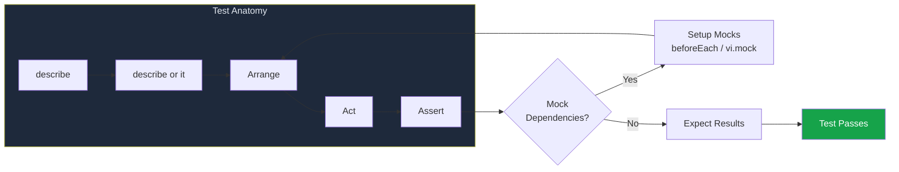

# Unit Testing Guide

> **Document:** `13-testing/UNIT-TESTING-GUIDE.md` | **Version:** 1.0 | **Last Updated:** July 2026
> **Status:** ✅ Active | **Owner:** QA Lead | **Related:** E2EStrategy.md, FrontendTestingStrategy.md, TestingImplementation.md

---

## 1. Unit Test Structure



## 2. Jest Configuration (apps/api)

```typescript
// apps/api/jest.config.ts
import type { Config } from 'jest';
const config: Config = {
  rootDir: '.',
  testMatch: ['**/*.spec.ts'],
  transform: { '^.+\\.(ts)$': ['ts-jest', { tsconfig: 'tsconfig.test.json' }] },
  testEnvironment: 'node',
  moduleNameMapper: { '^@/(.*)$': '<rootDir>/src/$1' },
  coverageThreshold: {
    global: { lines: 70, branches: 60, functions: 70, statements: 70 },
    'src/modules/**/*.service.ts': { lines: 80 },
    'src/**/*.controller.ts': { lines: 50 },
  },
};
export default config;
```

- **Naming convention:** `*.spec.ts` for API tests
- **Test runner:** Jest 29 with ts-jest transformer
- **Coverage targets:** Services 70%, Controllers 50%

## 2. Vitest Configuration (apps/web)

```typescript
// apps/web/vitest.config.ts
import { defineConfig } from 'vitest/config';
import react from '@vitejs/plugin-react';
import path from 'path';
export default defineConfig({
  plugins: [react()],
  test: {
    environment: 'jsdom',
    globals: true,
    setupFiles: ['./src/test/setup.ts'],
    include: ['src/**/*.test.{ts,tsx}'],
    coverage: {
      provider: 'v8',
      thresholds: { lines: 60, branches: 50, functions: 60, statements: 60 },
    },
  },
  resolve: { alias: { '@': path.resolve(__dirname, './src') } },
});
```

- **Naming convention:** `*.test.tsx` for web tests
- **Test runner:** Vitest with `@vitejs/plugin-react` and jsdom environment
- **Coverage targets:** Components 60%, Hooks 80%, Utilities 90%

## 3. Writing Tests by Layer

### NestJS Services

```typescript
import { Test, TestingModule } from '@nestjs/testing';
import { SectionsService } from './sections.service';
import { PrismaService } from '../../common/database/prisma.service';

describe('SectionsService', () => {
  let service: SectionsService;
  let prisma: jest.Mocked<PrismaService>; // auto-mocked by @nestjs/testing

  beforeEach(async () => {
    const module: TestingModule = await Test.createTestingModule({
      providers: [
        SectionsService,
        {
          provide: PrismaService,
          useValue: { section: { findMany: jest.fn(), findUnique: jest.fn() } },
        },
      ],
    }).compile();
    service = module.get(SectionsService);
    prisma = module.get(PrismaService);
  });

  it('should return published sections', async () => {
    prisma.section.findMany.mockResolvedValue([{ id: '1', isLive: true }]);
    const result = await service.findAllPublished();
    expect(result).toHaveLength(1);
    expect(prisma.section.findMany).toHaveBeenCalledWith({ where: { isLive: true } });
  });
});
```

### NestJS Controllers (supertest)

```typescript
import * as request from 'supertest';
import { Test, TestingModule } from '@nestjs/testing';
import { INestApplication } from '@nestjs/common';
import { PortfolioSectionsController } from './sections.controller';
import { SectionsService } from '../../modules/sections/sections.service';

describe('PortfolioSectionsController', () => {
  let app: INestApplication;
  let service: jest.Mocked<SectionsService>;

  beforeAll(async () => {
    const module: TestingModule = await Test.createTestingModule({
      controllers: [PortfolioSectionsController],
      providers: [{ provide: SectionsService, useValue: { findAllPublished: jest.fn() } }],
    }).compile();
    app = module.createNestApplication();
    await app.init();
    service = module.get(SectionsService);
  });

  it('GET /portfolio/sections returns 200 with data', async () => {
    service.findAllPublished.mockResolvedValue([{ id: '1', sectionKey: 'hero' }]);
    return request(app.getHttpServer()).get('/portfolio/sections').expect(200);
  });
});
```

### React Components (testing-library)

```typescript
import { render, screen } from '@testing-library/react';
import userEvent from '@testing-library/user-event';
import { Button } from '@/components/ui/Button';
import { describe, it, expect, vi } from 'vitest';

describe('Button', () => {
  it('renders children and fires onClick', async () => {
    const onClick = vi.fn();
    render(<Button onClick={onClick}>Submit</Button>);
    await userEvent.click(screen.getByText('Submit'));
    expect(onClick).toHaveBeenCalledOnce();
  });

  it('shows loading state', () => {
    render(<Button loading>Saving...</Button>);
    expect(screen.getByText('Saving...')).toBeDisabled();
  });
});
```

### Custom Hooks (renderHook)

```typescript
import { renderHook, act } from '@testing-library/react';
import { useDebounce } from '@/hooks/useDebounce';

describe('useDebounce', () => {
  it('returns initial value immediately', () => {
    const { result } = renderHook(() => useDebounce('hello', 500));
    expect(result.current).toBe('hello');
  });

  it('updates after delay', async () => {
    vi.useFakeTimers();
    const { result, rerender } = renderHook(({ value }) => useDebounce(value, 500), {
      initialProps: { value: 'hello' },
    });
    rerender({ value: 'world' });
    expect(result.current).toBe('hello'); // not debounced yet
    act(() => {
      vi.advanceTimersByTime(500);
    });
    expect(result.current).toBe('world');
    vi.useRealTimers();
  });
});
```

## 4. Mocking Strategies

| Scenario       | API (Jest)                  | Web (Vitest)                    |
| -------------- | --------------------------- | ------------------------------- |
| Module mock    | `jest.mock('module-name')`  | `vi.mock('module-name')`        |
| Function spy   | `jest.spyOn(obj, 'method')` | `vi.spyOn(obj, 'method')`       |
| Timer mock     | `jest.useFakeTimers()`      | `vi.useFakeTimers()`            |
| Fetch mock     | Not needed (supertest)      | MSW handlers or `vi.fn()`       |
| Router mock    | N/A                         | `vi.mock('next/navigation')`    |
| 3D canvas mock | N/A                         | `vi.mock('@react-three/fiber')` |

## 5. Running Tests

```bash
# API (from apps/api)
npm test                        # All tests
npm run test:watch              # Watch mode
npm test -- sections.service.spec  # Single file

# Web (from apps/web)
npm test                        # All tests (Vitest)
npm run test:watch              # Watch mode
npm test -- src/hooks/useDebounce.test.ts  # Single file
```

## 6. Coverage Enforcement

| Layer           | Lines | Branches | Functions | Statements |
| --------------- | ----- | -------- | --------- | ---------- |
| API Services    | 80%   | 75%      | 85%       | 80%        |
| API Controllers | 50%   | 40%      | 50%       | 50%        |
| Web Components  | 60%   | 50%      | 60%       | 60%        |
| Web Hooks       | 80%   | 75%      | 85%       | 80%        |
| Web Utilities   | 90%   | 85%      | 95%       | 90%        |
| Shared packages | 95%   | 90%      | 95%       | 95%        |

Coverage is enforced in CI via `coverage.thresholds` in Jest/Vitest config. The pipeline fails if any threshold is not met.

---

_Document Version: 1.0 | Last Updated: July 2026_

## Cross-References

- [../MASTER-INDEX.md](../MASTER-INDEX.md) — Documentation master index
- [../26-reference/CROSS-REFERENCE-INDEX.md](../26-reference/CROSS-REFERENCE-INDEX.md) — Cross-reference system
