# Visual Regression Testing Strategy

## Overview

Visual regression testing ensures UI changes don't introduce unintended visual differences.

## Visual Regression Flow

```mermaid
sequenceDiagram
    participant Dev as Developer
    participant Git as Git
    participant CI as CI Pipeline
    participant PW as Playwright
    participant BS as Baseline Store
    participant Rev as Reviewer

    Dev->>Git: git push
    Git->>CI: Trigger CI
    CI->>PW: Run Screenshot Tests
    PW->>BS: Fetch Baselines
    PW->>PW: Capture Screenshots
    PW->>BS: Compare with Baseline
    alt No Diff
        BS-->>PW: ✅ Match
        PW-->>CI: Pass
        CI-->>Dev: ✅ All Good
    else Diff Detected
        BS-->>PW: ❌ Mismatch
        PW-->>CI: Diff Report
        CI-->>Rev: Request Review
        Rev->>Rev: Review Changes
        alt Approve
            Rev-->>CI: ✅ Approve
            CI->>BS: Update Baseline
        else Reject
            Rev-->>Dev: ❌ Reject
            Dev->>Dev: Fix UI
        end
    end
```

## Approach

- **Tool:** Playwright with screenshot comparison
- **Baseline:** Captured from main branch
- **Threshold:** 0.1% pixel difference tolerance
- **Scope:** All public pages + key admin pages

## Test Coverage

### Desktop (1280x720)

- Homepage (all sections visible)
- Project listing + detail
- Blog listing + detail
- About page
- Contact page
- Admin dashboard load
- Admin CRUD forms

### Mobile (375x667)

- Homepage responsive layout
- Navigation menu (hamburger)
- Project card layout
- Form responsive behavior

### Component-Level

- All variant combinations in packages/ui/src/
- States: default, hover, focus, active, disabled, error
- Theme: light + dark mode

## CI Integration

- Run on PR to main
- Notify on visual changes
- Manual approval required for baseline updates
- Flaky test handling: 2 retries, then fail

## Maintenance

- Review baselines monthly
- Re-baseline after intentional design changes
- Archive old baselines (keep last 3 months)

## Cross-References

- [../MASTER-INDEX.md](../MASTER-INDEX.md) — Documentation master index
- [../26-reference/CROSS-REFERENCE-INDEX.md](../26-reference/CROSS-REFERENCE-INDEX.md) — Cross-reference system
