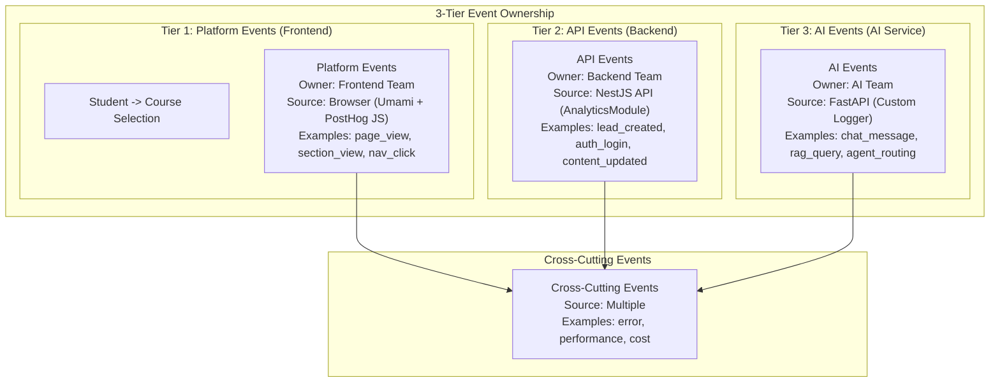
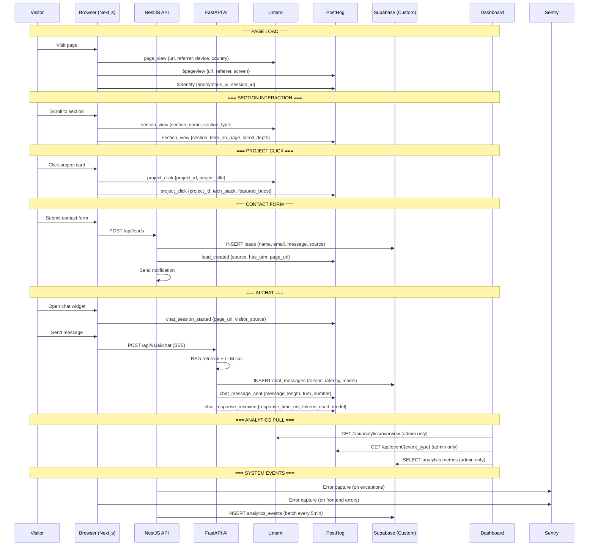
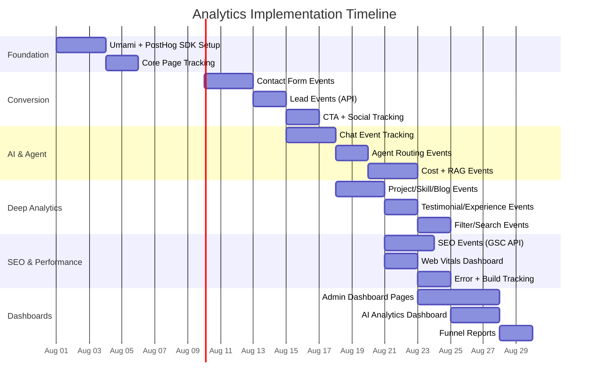

# Analytics Architecture — FAANG Enterprise-Grade Analytics & Tracking

> **Document:** `AnalyticsArchitecture.md` | **Version:** 5.0 (Enterprise Upgrade) | **Last Updated:** July 2026  
> **Status:** ✅ Active | **Owner:** Principal Product Owner | **Review Cadence:** Monthly  
> **Classification:** Enterprise Architecture | **Analytics Stack:** PostHog + Vercel Analytics + Custom DB  
> **Event Architecture:** Unified Event Bus | **Privacy:** GDPR/CCPA Compliant | **Data Retention:** Tiered (7d–2yr)

---

## Executive Summary

This document defines the comprehensive FAANG-level analytics architecture for the portfolio platform. It ensures strict tracking taxonomy, multi-LLM telemetry, AI user sentiment analysis, and GDPR/CCPA compliance across a robust Unified Event Bus.

## Table of Contents

1. [Executive Summary](#1-executive-summary)
2. [Analytics Vision & Principles](#2-analytics-vision--principles)
3. [Analytics Architecture](#3-analytics-architecture)
4. [Tracking Taxonomy](#4-tracking-taxonomy)
5. [Business Metrics](#5-business-metrics)
6. [Product Metrics](#6-product-metrics)
7. [Portfolio Metrics](#7-portfolio-metrics)
8. [Recruiter Metrics](#8-recruiter-metrics)
9. [Lead Metrics](#9-lead-metrics)
10. [AI Metrics](#10-ai-metrics)
11. [Blog Metrics](#11-blog-metrics)
12. [Performance Metrics](#12-performance-metrics)
13. [SEO Metrics](#13-seo-metrics)
14. [Conversion Funnel](#14-conversion-funnel)
15. [Dashboard Specifications](#15-dashboard-specifications)
16. [Event Reference — Full Catalog](#16-event-reference--full-catalog)
17. [Privacy & Compliance](#17-privacy--compliance)
18. [Implementation Guide](#18-implementation-guide)
19. [Change Log](#19-change-log)

---

## 1. Executive Summary

### 1.1 North Star

The analytics system provides **complete, privacy-compliant visibility** into every aspect of the portfolio platform — from visitor behavior to AI performance, from lead conversion to technical health. Every metric is actionable, every event is tracked with purpose, and every dashboard tells a story that drives data-informed decisions.

### 1.2 Analytics Stack

| Tool                     | Purpose                                                              | Cost                   | Data Retention          | Events/Month |
| ------------------------ | -------------------------------------------------------------------- | ---------------------- | ----------------------- | ------------ |
| **Umami**                | Traffic analytics, real-time visitors, page views, referrers         | 🆓 Free (self-hosted)  | Indefinite (aggregated) | Unlimited    |
| **PostHog**              | Product analytics, session replays, heatmaps, feature flags, funnels | 🆓 Free (1M events/mo) | 1 year (events)         | < 1M         |
| **Vercel Analytics**     | Core Web Vitals (LCP, CLS, INP), real-time                           | 🆓 Free                | 30 days (detailed)      | Unlimited    |
| **Sentry**               | Error tracking, performance traces                                   | 🆓 Free (5K events/mo) | 90 days                 | < 5K         |
| **Custom DB (Supabase)** | Portfolio-specific events, lead tracking, AI cost tracking           | Included               | Tiered (see §17)        | < 10K        |

### 1.3 Event Volume Estimates

| Event Category      | Est. Monthly Volume | Primary Tool | Storage Cost |
| ------------------- | ------------------- | ------------ | ------------ |
| Page views          | ~5,000              | Umami        | $0           |
| Custom interactions | ~3,000              | PostHog      | $0           |
| AI chat events      | ~1,500              | PostHog + DB | $0           |
| Lead events         | ~200                | DB           | $0           |
| Agent events        | ~500                | PostHog + DB | $0           |
| RAG events          | ~1,500              | DB           | $0           |
| Performance metrics | ~30,000             | Vercel       | $0           |
| Error events        | ~100                | Sentry       | $0           |
| **Total**           | **~41,800**         |              | **$0**       |

### 1.4 Key Metrics Dashboard

| Metric                       | Current | Target             | Tool                  | Update Frequency |
| ---------------------------- | ------- | ------------------ | --------------------- | ---------------- |
| Monthly visitors             | —       | 1,000+             | Umami                 | Real-time        |
| Visitor → Lead conversion    | —       | > 3%               | Custom DB             | Daily            |
| Avg. session duration        | —       | > 3 min            | Umami                 | Real-time        |
| Portfolio section engagement | —       | > 60% scroll depth | PostHog               | Real-time        |
| AI chat engagement rate      | —       | > 50% of visitors  | PostHog               | Daily            |
| Lead capture from AI chat    | —       | > 10% of chats     | Custom DB             | Daily            |
| Bounce rate                  | —       | < 50%              | Umami                 | Real-time        |
| Lighthouse performance score | —       | > 90               | Vercel                | Per deploy       |
| SEO keyword ranking (top 10) | —       | > 20 keywords      | Google Search Console | Weekly           |

### 1.5 Alignment with Other Documents

| Document                                       | Section                             | Relationship                                                             |
| ---------------------------------------------- | ----------------------------------- | ------------------------------------------------------------------------ |
| `docs/ai/17-AI_INSTRUCTIONS.md` (v5.0)         | §18 AI Analytics                    | AI-specific events, cost tracking, model usage metrics                   |
| `docs/ai/18-AGENTS.md` (v5.0)                  | §13 Analytics Agent, §20 Evaluation | Agent performance metrics, per-agent scorecards                          |
| `docs/ai/19-RAG.md` (v5.0)                     | §15 Monitoring, §16 Evaluation      | RAG retrieval metrics, embedding costs, evaluation                       |
| `docs/product/02-FEATURES.md` (v3.0)           | All sections                        | Per-feature analytics events (52 features)                               |
| `docs/operations/21-MONITORING.md` (v3.0)      | §7 Alert Escalation                 | Alert rules for metric thresholds                                        |
| `docs/operations/22-OBSERVABILITY.md` (v5.0)   | Full Architecture                   | Structured logs, distributed traces, metrics collection, correlation IDs |
| `docs/database/DatabaseArchitecture.md` (v5.0) | §12 Analytics Tables                | Database schema for analytics events                                     |
| `docs/api/12-API.md` (v5.0)                    | Analytics endpoints                 | API for fetching analytics data                                          |

---

## 2. Analytics Vision & Principles

### 2.1 Core Beliefs

| Belief                             | Manifestation                                            |
| ---------------------------------- | -------------------------------------------------------- |
| **Every event has a purpose**      | No tracking without a clear business question it answers |
| **Privacy-first by design**        | Analytics never compromises visitor privacy              |
| **Actions over vanity metrics**    | Track conversion actions, not just page views            |
| **Observable by default**          | Every component emits events; nothing is invisible       |
| **Cost-aware tracking**            | Free-tier analytics stack with 1M event/month ceiling    |
| **Data-informed, not data-driven** | Metrics guide decisions, not dictate them                |
| **Federated ownership**            | Each team owns their metrics (Platform, API, AI)         |

### 2.2 Design Principles

| #   | Principle                    | Description                                              | Violation Penalty                   |
| --- | ---------------------------- | -------------------------------------------------------- | ----------------------------------- |
| P1  | **Single source of truth**   | One event definition per action — no duplicate tracking  | Metric inconsistency, trust loss    |
| P2  | **Event-first architecture** | Every user action is an event before it's a metric       | Missing data, holes in funnels      |
| P3  | **Semantic naming**          | Events named `domain_action_detail` — unambiguous        | Confusion, misattribution           |
| P4  | **Properties carry context** | Every event includes session_id, timestamp, source       | Orphaned events, unusable data      |
| P5  | **Funnel-ready**             | Events designed to chain into conversion funnels         | Cannot measure conversion           |
| P6  | **Privacy-bounded**          | PII never in event properties; aggregated reporting only | GDPR violation risk                 |
| P7  | **Cost-budgeted**            | Track event volume against 1M/month ceiling              | Budget overruns, throttled tracking |
| P8  | **Self-healing tracking**    | Missing events trigger alerts, not silent gaps           | Blind spots in monitoring           |

### 2.3 Data Flow Philosophy

```text
Visitor Action → Event Emission (Source) → Event Bus → Event Storage (Destination) → Dashboard Visualization → Actionable Insight
```

Every event flows through a consistent pipeline:

1. **Triggered** by a user action or system event
2. **Emitted** from the source (browser, API, AI service)
3. **Transported** via the event bus (HTTP, SSE, batch)
4. **Stored** in the destination (PostHog, DB, Umami)
5. **Visualized** on dashboards
6. **Actioned** via alerts, reports, or decisions

---

## 3. Analytics Architecture

### 3.1 Event Pipeline Architecture

```mermaid
graph TB
    subgraph "Event Sources"
        BROWSER["🌐 Browser<br/>Next.js Frontend<br/>Umami SDK + PostHog JS"]
        API["⚙️ NestJS API<br/>Backend Events<br/>AnalyticsModule"]
        AI["🧠 FastAPI AI Service<br/>AI Events<br/>Custom Logger"]
        WORKER["🔄 Background Workers<br/>Batch Events<br/>Knowledge Refresh, Cache"]
    end

    subgraph "Event Bus"
        HTTP["HTTP Direct<br/>Real-time events<br/>POST to destinations"]
        BATCH["Batch Queue<br/>Non-critical events<br/>Batch every 5 min"]
        SSE["SSE Stream<br/>Real-time streaming<br/>Chat events"]
    end

    subgraph "Event Destinations"
        UMAMI["📊 Umami (Self-hosted)<br/>Traffic analytics<br/>Page views, referrers, countries"]
        POSTHOG["📈 PostHog (Cloud)<br/>Product analytics<br/>Custom events, funnels, replays"]
        VERCEL["âš¡ Vercel Analytics<br/>Core Web Vitals<br/>LCP, CLS, INP"]
        SENTRY["🔍 Sentry<br/>Error tracking<br/>Exceptions, traces"]
        CUSTOM_DB["🗄️ Custom DB (Supabase)<br/>Analytics events<br/>Leads, AI costs, agent metrics"]
    end

    subgraph "Dashboards"
        ADMIN_DASH["👤 Admin Dashboard<br/>All metrics<br/>/admin + /admin/analytics"]
        POSTHOG_DASH["📊 PostHog Dashboard<br/>Product analytics<br/>Funnels, trends, replays"]
        VERCEL_DASH["âš¡ Vercel Dashboard<br/>Web Vitals<br/>Performance scorecards"]
        CUSTOM_DASH["📋 Custom Reports<br/>Portfolio-specific<br/>Lead conversion, AI costs"]
    end

    BROWSER -->|Page view| UMAMI
    BROWSER -->|Custom events| POSTHOG
    BROWSER -->|Web Vitals| VERCEL
    BROWSER -->|Frontend errors| SENTRY

    API -->|Backend events| POSTHOG
    API -->|Lead events| CUSTOM_DB
    API -->|System events| SENTRY

    AI -->|Chat events| POSTHOG
    AI -->|Cost events| CUSTOM_DB
    AI -->|Agent events| POSTHOG
    AI -->|RAG events| CUSTOM_DB
    AI -->|AI errors| SENTRY

    WORKER -->|Batch events| CUSTOM_DB
    WORKER -->|Aggregated metrics| POSTHOG

    UMAMI --> ADMIN_DASH
    POSTHOG --> ADMIN_DASH
    POSTHOG --> POSTHOG_DASH
    VERCEL --> VERCEL_DASH
    VERCEL --> ADMIN_DASH
    CUSTOM_DB --> ADMIN_DASH
    CUSTOM_DB --> CUSTOM_DASH
    SENTRY --> ADMIN_DASH
```



### 3.2 Event Ownership Model



### 3.3 Event Flow Sequence



### 3.4 Service Modules

| Module                         | File                                                     | Responsibility                                | Emits Events                |
| ------------------------------ | -------------------------------------------------------- | --------------------------------------------- | --------------------------- |
| **Analytics Service (API)**    | `apps/api/src/modules/analytics/analytics.service.ts`    | Lead events, system events, batch aggregation | lead*\*, auth*_, content\__ |
| **Analytics Controller (API)** | `apps/api/src/modules/analytics/analytics.controller.ts` | REST endpoints for analytics data             | HTTP responses              |
| **Analytics Module (API)**     | `apps/api/src/modules/analytics/analytics.module.ts`     | Module configuration, PostHog client          | —                           |
| **Umami Client (Web)**         | `apps/web/src/lib/umami.ts`                              | Umami analytics API client                    | Custom events               |
| **Analytics Hook (Web)**       | `apps/web/src/hooks/useAnalytics.ts`                     | Track custom events to analytics providers    | All frontend events         |
| **PostHog Provider (Web)**     | `apps/web/src/components/AnalyticsProvider.tsx`          | PostHog initialization + feature flags        | $pageview, $identify        |
| **AI Analytics (AI)**          | `apps/ai/app/services/analytics_service.py`              | AI-specific events, cost tracking             | chat*\*, rag*_, agent\__    |

---

## 4. Tracking Taxonomy

### 4.1 Event Naming Convention

```
{domain}_{action}[_{detail}]

Domain:     page | section | project | skill | blog | lead | chat | agent | rag | system | error | performance | seo
Action:     view | click | submit | create | update | delete | start | end | hover | filter | search | rate | share | download
Detail:     (optional) page identifier or qualifier

Examples:
- page_view
- section_view (hero, about, skills, projects, contact)
- project_click (card, detail, demo, github)
- lead_created (contact_form, ai_chat, resume_download)
- chat_message_sent
- agent_routing (portfolio, resume, projects, lead_qual)
- rag_query (vector, keyword, none)
```

### 4.2 Event Property Type System

| Property Type     | Format                   | Examples                                      | Validation                       |
| ----------------- | ------------------------ | --------------------------------------------- | -------------------------------- |
| **String**        | `string (max 200 chars)` | `visitor_source`, `page_url`                  | No PII, sanitized                |
| **Enum**          | `enum (predefined list)` | `event_category`, `event_priority`            | Must match defined values        |
| **Integer**       | `integer (non-negative)` | `message_length`, `response_time_ms`          | Range check                      |
| **Float**         | `float (0.0 - 1.0)`      | `confidence_score`, `similarity_score`        | Precision: 4 decimal places      |
| **Boolean**       | `boolean`                | `success`, `is_cached`, `has_context`         | Strict boolean                   |
| **Timestamp**     | `ISO 8601 (UTC)`         | `timestamp`, `created_at`                     | Must be UTC, include timezone    |
| **Identifier**    | `UUID v4`                | `session_id`, `visitor_id`, `conversation_id` | No PII, session-scoped           |
| **Object (JSON)** | `JSON object (max 1KB)`  | `utm_params`, `retrieved_chunks`              | Flattened, no nesting > 3 levels |

### 4.3 Common Properties (All Events)

Every event MUST include these properties:

```json
{
  "event_name": "section_view",
  "properties": {
    "timestamp": "2026-06-15T10:30:00.000Z",
    "session_id": "uuid-v4",
    "visitor_id": "uuid-v4",
    "event_category": "engagement",
    "event_priority": "critical",
    "source": "web_frontend",
    "page_url": "/",
    "visitor_source": "direct",
    "utm_params": {}
  },
  "user_id": null
}
```

### 4.4 Event Categories

| Category         | Priority      | Description                                   | Retention | Destinations          |
| ---------------- | ------------- | --------------------------------------------- | --------- | --------------------- |
| `engagement`     | ⭐ Critical   | User interactions with portfolio content      | 1 year    | Umami, PostHog, DB    |
| `conversion`     | ⭐ Critical   | Lead capture, contact, hiring intent          | 2 years   | PostHog, DB           |
| `navigation`     | 📊 Important  | Page transitions, nav clicks                  | 1 year    | Umami, PostHog        |
| `ai_interaction` | ⭐ Critical   | Chat messages, agent routing, RAG queries     | 1 year    | PostHog, DB           |
| `system`         | 📊 Important  | Performance, errors, health checks            | 90 days   | Sentry, DB            |
| `admin`          | 🔒 Restricted | Admin actions, content updates                | 2 years   | DB                    |
| `cost`           | ⭐ Critical   | AI costs, token usage, budget tracking        | 1 year    | DB                    |
| `seo`            | 📊 Important  | Search rankings, crawl stats, organic traffic | 1 year    | Google Search Console |

### 4.5 Event Ownership

| Domain          | Owner      | Source                | Destination     | Review Cadence |
| --------------- | ---------- | --------------------- | --------------- | -------------- |
| `page_*`        | Frontend   | Browser (Umami SDK)   | Umami           | Monthly        |
| `section_*`     | Frontend   | Browser (PostHog JS)  | PostHog         | Monthly        |
| `project_*`     | Frontend   | Browser (PostHog JS)  | PostHog         | Monthly        |
| `blog_*`        | Frontend   | Browser (PostHog JS)  | PostHog         | Monthly        |
| `skill_*`       | Frontend   | Browser (PostHog JS)  | PostHog         | Monthly        |
| `lead_*`        | Backend    | NestJS API            | PostHog + DB    | Weekly         |
| `auth_*`        | Backend    | NestJS API            | PostHog         | Monthly        |
| `content_*`     | Backend    | NestJS API            | PostHog         | Monthly        |
| `chat_*`        | AI Service | FastAPI AI            | PostHog + DB    | Weekly         |
| `agent_*`       | AI Service | FastAPI AI            | PostHog         | Weekly         |
| `rag_*`         | AI Service | FastAPI AI            | DB              | Weekly         |
| `error_*`       | All        | Sentry SDK            | Sentry          | Daily          |
| `performance_*` | All        | Vercel + Sentry       | Vercel + Sentry | Per deploy     |
| `seo_*`         | All        | Google Search Console | External        | Weekly         |

### 4.6 Tracking Taxonomy Rules

| Rule                      | ID      | Description                                                             |
| ------------------------- | ------- | ----------------------------------------------------------------------- |
| **Consistent Naming**     | TAX-001 | All events follow `{domain}_{action}[_{detail}]` convention             |
| **No Redundant Events**   | TAX-002 | Each action has exactly one event definition; no duplicates             |
| **Property Completeness** | TAX-003 | Every event includes all common properties + domain-specific properties |
| **No PII in Events**      | TAX-004 | Event properties must never contain PII (email, name, phone, IP)        |
| **Session Scoping**       | TAX-005 | All events scoped to a session_id; no cross-session event leakage       |
| **Versioned Schemas**     | TAX-006 | Event schemas are versioned; breaking changes create new event names    |
| **Cost Awareness**        | TAX-007 | High-volume events (> 10K/month) must use cost-optimized destinations   |
| **Event Deprecation**     | TAX-008 | Deprecated events must be migrated with 30-day overlap period           |

---

## 5. Business Metrics

### 5.1 Metric Overview

| Metric                            | Definition                               | Formula                                                | Target      | Tool      | Frequency |
| --------------------------------- | ---------------------------------------- | ------------------------------------------------------ | ----------- | --------- | --------- |
| **Monthly Active Visitors (MAV)** | Unique visitors per month                | COUNT(DISTINCT visitor_id)                             | 1,000+      | Umami     | Monthly   |
| **Visitor Growth Rate**           | Month-over-month visitor growth          | ((MAV_t - MAV_t-1) / MAV_t-1) × 100                    | > 20%       | Umami     | Monthly   |
| **Lead Conversion Rate**          | % of visitors who become leads           | (Leads / Unique Visitors) × 100                        | > 3%        | Custom DB | Weekly    |
| **Lead Quality Score**            | Avg. lead score across all lead sources  | AVG(lead_score)                                        | > 0.5       | Custom DB | Weekly    |
| **Response Time**                 | Time from lead submission to first reply | AVG(first_reply_at - created_at)                       | < 24h       | Custom DB | Weekly    |
| **Hire Rate**                     | % of leads that convert to hired         | (Hired / Total Leads) × 100                            | > 5%        | Custom DB | Monthly   |
| **Referral Source Mix**           | Traffic distribution by source           | COUNT(\*) GROUP BY source                              | Diversified | Umami     | Weekly    |
| **Engagement Rate**               | % of visitors who interact with content  | (Visitors with > 1 interaction / Total visitors) × 100 | > 60%       | PostHog   | Weekly    |

### 5.2 Events

| Event            | Trigger                    | Properties                                                                                                        | Source          | Destination     | Dashboard Usage                                   | Business Value                     |
| ---------------- | -------------------------- | ----------------------------------------------------------------------------------------------------------------- | --------------- | --------------- | ------------------------------------------------- | ---------------------------------- |
| `page_view`      | Page load completes        | `url`, `referrer`, `device`, `country`, `browser`, `screen_size`                                                  | Browser (Umami) | Umami           | Visitor counts, traffic sources, device breakdown | Core traffic measurement           |
| `session_start`  | New session begins         | `session_id`, `visitor_id`, `landing_page`, `referrer`, `utm_source`, `utm_medium`, `utm_campaign`, `utm_content` | Browser (Umami) | Umami + PostHog | Session tracking, UTM attribution                 | Understand marketing effectiveness |
| `session_end`    | 30 min inactivity          | `session_id`, `duration_s`, `pages_viewed`, `bounced`                                                             | Browser (Umami) | Umami           | Bounce rate, session duration                     | Measure engagement quality         |
| `visitor_return` | Returning visitor detected | `visitor_id`, `days_since_last_visit`, `previous_visit_count`                                                     | Browser (Umami) | Umami           | Returning vs new visitors                         | Measure loyalty and retention      |

### 5.3 Business Metric Dashboard

```
┌─────────────────────────────────────────────────────────────┐
│ 📊 BUSINESS METRICS                        Updated: 2m ago   │
├─────────────────────────────────────────────────────────────┤
│ ┌──────────┐ ┌──────────┐ ┌──────────┐ ┌──────────┐        │
│ │ Visitors │ │  Growth  │ │  Leads   │ │ Conv.    │        │
│ │  1,234   │ │  +18% 📈 │ │    42    │ │  3.4%   │        │
│ │  this mo │ │  vs last │ │  this mo │ │  target↑ │        │
│ └──────────┘ └──────────┘ └──────────┘ └──────────┘        │
│                                                             │
│ 📈 Monthly Visitors (12 months)                             │
│  ████████████████░░░░░░░░░░░░░░░░                          │
│  ████████████████████░░░░░░░░░░░░                          │
│  ████████████████████████░░░░░░░░                          │
│  ████████████████████████████░░░░                          │
│  J   F   M   A   M   J   J   A   S   O   N   D            │
│                                                             │
│ 🎯 Traffic Sources                      🌍 Top Countries   │
│  Direct:    35%  ███████████████████    US:    42%         │
│  Organic:   28%  ████████████████       IN:    18%         │
│  LinkedIn:  15%  ████████               UK:    8%          │
│  GitHub:    12%  ██████                 DE:    5%          │
│  Other:     10%  █████                  Others: 27%        │
└─────────────────────────────────────────────────────────────┘
```

---

## 6. Product Metrics

### 6.1 Metric Overview

| Metric                      | Definition                                        | Formula                                                               | Target                | Tool    | Frequency |
| --------------------------- | ------------------------------------------------- | --------------------------------------------------------------------- | --------------------- | ------- | --------- |
| **Feature Adoption Rate**   | % of visitors using each feature                  | (Users who triggered feature event / Total visitors) × 100            | > 30% for P0 features | PostHog | Weekly    |
| **Feature Stickiness**      | % of returning users who use feature              | (Returning users who triggered feature / Total returning users) × 100 | > 40%                 | PostHog | Weekly    |
| **Time-to-Value**           | Time from landing to first meaningful interaction | AVG(time from session_start to section_view or project_click)         | < 30s                 | PostHog | Weekly    |
| **Navigation Efficiency**   | Avg. clicks to reach key content                  | AVG(path length to project, blog, or contact)                         | < 3 clicks            | PostHog | Weekly    |
| **Mobile vs Desktop Ratio** | Device type distribution                          | (Mobile users / Total users) × 100                                    | > 30% mobile          | Umami   | Weekly    |
| **Dark Mode Adoption**      | % of sessions using dark mode                     | (Dark mode sessions / Total sessions) × 100                           | > 40%                 | PostHog | Weekly    |
| **Chat Widget Open Rate**   | % of visitors who open chat                       | (Chat opens / Unique visitors) × 100                                  | > 50%                 | PostHog | Weekly    |
| **Theme Toggle Rate**       | % of visitors who switch theme                    | (Theme toggles / Unique visitors) × 100                               | < 10% (set once)      | PostHog | Weekly    |

### 6.2 Events

| Event               | Trigger                             | Properties                                                      | Source                    | Destination      | Dashboard Usage                      | Business Value                   |
| ------------------- | ----------------------------------- | --------------------------------------------------------------- | ------------------------- | ---------------- | ------------------------------------ | -------------------------------- |
| `nav_click`         | Navigation link clicked             | `target_section`, `source`, `is_mobile_menu`                    | Browser (PostHog)         | PostHog          | Navigation patterns, most-used links | Optimize navigation layout       |
| `mobile_menu_open`  | Hamburger menu opened               | `source`, `viewport_width`                                      | Browser (PostHog)         | PostHog          | Mobile navigation usage              | Improve mobile UX                |
| `theme_toggle`      | Theme switch                        | `new_theme`, `previous_theme`, `method` (toggle/system)         | Browser (PostHog)         | PostHog          | Dark mode adoption                   | Content readability optimization |
| `scroll_depth`      | Scroll milestone (25/50/75/90/100%) | `depth_percent`, `page_url`, `section_visible`                  | Browser (PostHog)         | PostHog          | Content engagement depth             | Optimize above-fold content      |
| `section_view`      | Section enters viewport             | `section_name`, `section_type`, `time_on_page_ms`               | Browser (Umami + PostHog) | Umami + PostHog  | Section popularity ranking           | Prioritize content investment    |
| `section_time`      | Section exit (stops being visible)  | `section_name`, `duration_viewed_ms`, `interaction_count`       | Browser (PostHog)         | PostHog          | Time spent per section               | Content quality assessment       |
| `filter_applied`    | Filter/sort applied                 | `filter_type`, `filter_value`, `context` (projects/skills/blog) | Browser (PostHog)         | PostHog          | Filter usage patterns                | Improve filter UX                |
| `search_performed`  | Search query submitted              | `query_length`, `has_results`, `result_count`                   | Browser (PostHog)         | PostHog          | Search feature usage                 | Content discovery optimization   |
| `cta_click`         | CTA button clicked                  | `cta_text`, `cta_location`, `cta_type` (primary/secondary)      | Browser (PostHog)         | PostHog          | CTA conversion rates                 | Optimize CTA placement and copy  |
| `social_link_click` | Social icon clicked                 | `platform`, `location` (hero/footer/contact)                    | Browser (PostHog)         | PostHog          | Social profile engagement            | Visitor interest profile         |
| `resume_download`   | Resume download initiated           | `source` (nav/hero/contact), `file_size`, `visitor_type`        | Browser (PostHog)         | PostHog          | Resume download conversion           | Recruiter interest metric        |
| `error_displayed`   | Error boundary triggered            | `error_type`, `component`, `message_hash`                       | Browser (Sentry)          | Sentry + PostHog | Error rate, top errors               | Identify UX pain points          |

### 6.3 Product Metric Dashboard

```
┌─────────────────────────────────────────────────────────────┐
│ 📱 PRODUCT METRICS                        Updated: 5m ago    │
├─────────────────────────────────────────────────────────────┤
│ ┌──────────┐ ┌──────────┐ ┌──────────┐ ┌──────────┐        │
│ │ Chat     │ │Section   │ │Scroll    │ │Theme     │        │
│ │ Open     │ │Engagement│ │Depth     │ │Adoption  │        │
│ │  52%    │ │  68%    │ │  72%    │ │  44%    │        │
│ │  target↑ │ │  target↑ │ │  target↑ │ │  target↑ │        │
│ └──────────┘ └──────────┘ └──────────┘ └──────────┘        │
│                                                             │
│ 📊 Section Engagement Ranking                               │
│  Hero:      95% ████████████████████                        │
│  Projects:  72% ████████████████                            │
│  Skills:    58% ████████████                                │
│  About:     45% █████████                                   │
│  Contact:   35% ███████                                     │
│  Blog:      22% ████                                        │
│                                                             │
│ 🎯 CTA Click-Through Rates                                  │
│  "View Work" (Hero):       8.2%                             │
│  "Contact Me" (Hero):      5.1%                             │
│  "Download Resume" (Nav):  2.3%                             │
│  "View Project" (Card):   12.4%                             │
│  "Learn More" (Blog):      6.7%                             │
└─────────────────────────────────────────────────────────────┘
```

---

## 7. Portfolio Metrics

### 7.1 Metric Overview

| Metric                          | Definition                               | Formula                                              | Target | Tool    | Frequency |
| ------------------------------- | ---------------------------------------- | ---------------------------------------------------- | ------ | ------- | --------- |
| **Projects Viewed per Session** | Avg. projects clicked per session        | SUM(project_clicks) / COUNT(sessions)                | > 2    | PostHog | Weekly    |
| **Project Detail Completion**   | % who visit detail page from card        | (Project_detail_page / Project_card_click) × 100     | > 40%  | PostHog | Weekly    |
| **GitHub Link CTR**             | % of project viewers who click GitHub    | (github_click / project_view) × 100                  | > 15%  | PostHog | Weekly    |
| **Live Demo CTR**               | % of project viewers who click live demo | (live_demo_click / project_view) × 100               | > 25%  | PostHog | Weekly    |
| **Skills Interest**             | % of visitors who hover/click skills     | (skill_interaction / section_view_skills) × 100      | > 50%  | PostHog | Weekly    |
| **Testimonial Engagement**      | % who scroll through testimonials        | (testimonial_next + testimonial_prev) / section_view | > 30%  | PostHog | Weekly    |
| **Case Study Read Rate**        | % who reach 75%+ of case study           | (scroll_depth_75 / case_study_view) × 100            | > 50%  | PostHog | Weekly    |
| **Portfolio Stats Clicks**      | Impact stat interactions                 | stat_hover / stat_view                               | > 20%  | PostHog | Monthly   |

### 7.2 Events

| Event                  | Trigger                          | Properties                                                                             | Source                    | Destination     | Dashboard Usage                         | Business Value               |
| ---------------------- | -------------------------------- | -------------------------------------------------------------------------------------- | ------------------------- | --------------- | --------------------------------------- | ---------------------------- |
| `project_card_view`    | Project card visible in viewport | `project_id`, `project_title`, `project_category`, `is_featured`, `card_position`      | Browser (PostHog)         | PostHog         | Project card engagement                 | Optimize project grid layout |
| `project_click`        | Project card clicked             | `project_id`, `project_title`, `category`, `tech_stack`, `is_featured`                 | Browser (Umami + PostHog) | Umami + PostHog | Most-viewed projects, category interest | Featured project ROI         |
| `project_detail_view`  | Project detail page loaded       | `project_id`, `project_title`, `category`, `tech_stack`, `time_to_load_ms`             | Browser (PostHog)         | PostHog         | Project detail engagement               | Content detail investment    |
| `project_gallery_view` | Gallery image clicked            | `project_id`, `image_index`, `gallery_size`                                            | Browser (PostHog)         | PostHog         | Visual content interest                 | Image gallery effectiveness  |
| `github_click`         | GitHub link clicked              | `project_id`, `project_title`, `has_stars`                                             | Browser (PostHog)         | PostHog         | Open source interest                    | Technical credibility metric |
| `live_demo_click`      | Live demo link clicked           | `project_id`, `project_title`, `demo_type`                                             | Browser (PostHog)         | PostHog         | Deployment interest                     | Project accessibility        |
| `skill_hover`          | Skill hover/click                | `skill_name`, `skill_category`, `proficiency_level`                                    | Browser (PostHog)         | PostHog         | Skill interest by category              | Skill section optimization   |
| `skill_filter`         | Skills filter applied            | `filter_name`, `result_count`                                                          | Browser (PostHog)         | PostHog         | Most-used skill filters                 | Skill categorization         |
| `testimonial_next`     | Testimonial carousel next        | `testimonial_index`, `total_testimonials`                                              | Browser (PostHog)         | PostHog         | Testimonial engagement                  | Social proof effectiveness   |
| `testimonial_prev`     | Testimonial carousel prev        | `testimonial_index`, `total_testimonials`                                              | Browser (PostHog)         | PostHog         | Testimonial navigation                  | Carousel UX optimization     |
| `experience_click`     | Experience timeline item clicked | `company`, `role`, `is_current`, `duration_years`                                      | Browser (PostHog)         | PostHog         | Career interest                         | Experience section impact    |
| `case_study_view`      | Case study section viewed        | `project_id`, `case_study_section` (problem/approach/solution/impact), `nda_protected` | Browser (PostHog)         | PostHog         | Case study read depth                   | Content quality assessment   |
| `hero_interaction`     | 3D hero scene interaction        | `interaction_type` (click/drag/auto), `duration_ms`                                    | Browser (PostHog)         | PostHog         | Hero engagement                         | 3D element ROI               |
| `stat_animation`       | Impact stat counter completes    | `stat_name`, `final_value`, `animation_duration_ms`                                    | Browser (PostHog)         | PostHog         | Stat engagement                         | Social proof effectiveness   |

### 7.3 Portfolio Metric Dashboard

```
┌─────────────────────────────────────────────────────────────┐
│ 🚀 PORTFOLIO METRICS                      Updated: 5m ago    │
├─────────────────────────────────────────────────────────────┤
│ ┌──────────┐ ┌──────────┐ ┌──────────┐ ┌──────────┐        │
│ │Projects  │ │Project   │ │GitHub    │ │Live Demo │        │
│ │Viewed    │ │Detail    │ │CTR       │ │CTR       │        │
│ │  2.4/ssn │ │  38%    │ │  18%    │ │  32%    │        │
│ └──────────┘ └──────────┘ └──────────┘ └──────────┘        │
│                                                             │
│ 📊 Top Projects by Views                                    │
│  1. Real-time Chat App      245 views ████████████████      │
│  2. E-commerce Platform     198 views ██████████████        │
│  3. AI Content Generator    167 views ████████████          │
│  4. Dev Dashboard           134 views █████████             │
│  5. Portfolio Site          112 views ███████               │
│                                                             │
│ 🎨 Skill Interest by Category                               │
│  Frontend:   62% ███████████████                            │
│  Backend:    48% ████████████                              │
│  DevOps:     25% ██████                                    │
│  AI/ML:      35% ████████                                  │
│  Mobile:     18% ████                                      │
└─────────────────────────────────────────────────────────────┘
```

---

## 8. Recruiter Metrics

### 8.1 Metric Overview

| Metric                         | Definition                                          | Formula                                                        | Target            | Tool      | Frequency |
| ------------------------------ | --------------------------------------------------- | -------------------------------------------------------------- | ----------------- | --------- | --------- |
| **Recruiter Session Ratio**    | % of sessions from recruiter-like sources           | (Recruiter sessions / Total sessions) × 100                    | > 15%             | Custom DB | Weekly    |
| **Recruiter Resume Downloads** | Resume downloads from recruiter-identified visitors | COUNT(resume_download) WHERE visitor_type = 'recruiter'        | > 10/mo           | Custom DB | Weekly    |
| **Recruiter Engagement Score** | Avg. pages viewed by recruiters                     | AVG(pages_per_session) WHERE visitor_type = 'recruiter'        | > 5 pages         | Custom DB | Weekly    |
| **Recruiter→Lead Rate**        | % of recruiters who contact                         | (Recruiter leads / Recruiter sessions) × 100                   | > 5%              | Custom DB | Monthly   |
| **Recruiter Source Breakdown** | Which channels send recruiters                      | COUNT(\*) GROUP BY utm_source WHERE visitor_type = 'recruiter' | LinkedIn > GitHub | Custom DB | Weekly    |
| **Experience Section CTR**     | % of recruiters who view experience                 | (section_view_experience / recruiter_session) × 100            | > 80%             | PostHog   | Weekly    |
| **Resume Download by Source**  | Resume downloads per referral source                | COUNT(\*) GROUP BY source, visitor_type                        | —                 | Custom DB | Monthly   |

### 8.2 Events

| Event                    | Trigger                                     | Properties                                                                                   | Source            | Destination  | Dashboard Usage               | Business Value                   |
| ------------------------ | ------------------------------------------- | -------------------------------------------------------------------------------------------- | ----------------- | ------------ | ----------------------------- | -------------------------------- |
| `visitor_identified`     | Visitor classified by intent                | `visitor_type` (recruiter/client/developer/returning/unknown), `confidence`, `source_signal` | Browser (PostHog) | PostHog + DB | Visitor type breakdown        | Personalize portfolio experience |
| `resume_download`        | Resume PDF downloaded                       | `source` (nav/hero/contact/chat), `visitor_type`, `visitor_source`, `file_size_bytes`        | Browser (PostHog) | PostHog + DB | Resume download conversion    | Measure recruiter interest       |
| `experience_view`        | Experience section viewed                   | `visitor_type`, `time_on_page_ms`                                                            | Browser (PostHog) | PostHog      | Experience section engagement | Recruiter behavior analysis      |
| `achievement_view`       | Achievement section viewed                  | `visitor_type`, `achievement_count_visible`                                                  | Browser (PostHog) | PostHog      | Credibility metrics           | Achievement impact               |
| `recruiter_lead_created` | Lead created where visitor_type = recruiter | `source`, `utm_source`, `company_domain` (if provided), `message_length`                     | API (NestJS)      | PostHog + DB | Recruiter→lead conversion     | Recruiter pipeline               |
| `portfolio_inquiry`      | Visitor asks about hiring/availability      | `inquiry_type` (full-time/contract/consulting), `source`, `visitor_type`                     | Browser (PostHog) | PostHog + DB | Hiring intent volume          | Opportunity pipeline             |

### 8.3 Recruiter Metric Dashboard

```
┌─────────────────────────────────────────────────────────────┐
│ 💼 RECRUITER METRICS                      Updated: 1h ago    │
├─────────────────────────────────────────────────────────────┤
│ ┌──────────┐ ┌──────────┐ ┌──────────┐ ┌──────────┐        │
│ │Recruiter │ │Resume    │ │Avg. Pages│ │Rec→Lead  │        │
│ │ Sessions │ │Downloads │ │Per Visit │ │Rate      │        │
│ │   45    │ │   12    │ │  6.2    │ │  6.7%   │        │
│ │  +22% 📈│ │  +50% 📈│ │  +1.2 📈│ │  target↑ │        │
│ └──────────┘ └──────────┘ └──────────┘ └──────────┘        │
│                                                             │
│ 🎯 Recruiter Sources                                        │
│  LinkedIn:      42% █████████████████████                   │
│  Direct Search: 22% ███████████                             │
│  Job Boards:    18% █████████                               │
│  GitHub:        12% ██████                                  │
│  Other:          6% ███                                     │
│                                                             │
│ 📊 Resume Downloads Over Time (Weekly)                      │
│  ████████░░░░░░░░░░░░░░░░░░░░░░░░                          │
│  ██████████████░░░░░░░░░░░░░░░░░░                          │
│  ████████████████████░░░░░░░░░░░░                          │
│  Week 1  Week 2  Week 3  Week 4                            │
└─────────────────────────────────────────────────────────────┘
```

---

## 9. Lead Metrics

### 9.1 Metric Overview

| Metric                        | Definition                   | Formula                                    | Target          | Tool      | Frequency |
| ----------------------------- | ---------------------------- | ------------------------------------------ | --------------- | --------- | --------- |
| **Lead Volume**               | New leads per month          | COUNT(leads WHERE created_at = this month) | > 10/mo         | Custom DB | Daily     |
| **Lead Source Mix**           | Distribution of lead sources | COUNT(\*) GROUP BY source                  | Diversified     | Custom DB | Weekly    |
| **Lead Response Time**        | Avg. time to first reply     | AVG(first_response_at - created_at)        | < 24h           | Custom DB | Daily     |
| **Lead Status Distribution**  | Current pipeline status      | COUNT(\*) GROUP BY status                  | Balanced funnel | Custom DB | Weekly    |
| **Lead Quality (Avg. Score)** | ML-calculated lead score     | AVG(lead_score)                            | > 0.5           | Custom DB | Weekly    |
| **Chat→Lead Conversion**      | % of chats that create leads | (Chat leads / Total chat sessions) × 100   | > 10%           | Custom DB | Weekly    |
| **Form→Lead Completion**      | % of form starts that submit | (Form submits / Form starts) × 100         | > 60%           | PostHog   | Weekly    |
| **Lead→Hired Rate**           | % of leads that become hired | (Hired / Total leads) × 100                | > 5%            | Custom DB | Monthly   |

### 9.2 Events

| Event                      | Trigger                         | Properties                                                                                                                  | Source                  | Destination  | Dashboard Usage                    | Business Value                   |
| -------------------------- | ------------------------------- | --------------------------------------------------------------------------------------------------------------------------- | ----------------------- | ------------ | ---------------------------------- | -------------------------------- |
| `contact_form_view`        | Contact section enters viewport | `visitor_type`, `page_url`, `time_on_page_ms`                                                                               | Browser (PostHog)       | PostHog      | Contact section engagement         | Form visibility optimization     |
| `contact_form_start`       | First form field focused        | `visitor_type`, `field_count`, `has_captcha`                                                                                | Browser (PostHog)       | PostHog      | Form abandonment start             | Form friction analysis           |
| `contact_form_progress`    | Field completion milestone      | `field_name` (name/email/message), `fields_completed`, `fields_total`                                                       | Browser (PostHog)       | PostHog      | Form abandonment analysis          | Identify drop-off fields         |
| `contact_form_field_error` | Validation error triggered      | `field_name`, `error_type` (required/invalid/min_length), `attempt_count`                                                   | Browser (PostHog)       | PostHog      | Field error rates                  | Improve validation UX            |
| `contact_form_submit`      | Form submission attempted       | `success` (bool), `error_message` (if failed), `response_time_ms`, `has_captcha`                                            | Browser (PostHog + API) | PostHog      | Form submission rate, error rate   | Form reliability                 |
| `lead_created`             | Lead record created in DB       | `source` (contact_form/ai_chat/resume), `has_utm`, `utm_source`, `page_url`, `visitor_type`, `message_length`, `lead_score` | API (NestJS)            | PostHog + DB | Lead volume, source, quality score | Core lead conversion metric      |
| `lead_qualified`           | Lead marked as high-quality     | `lead_id`, `score`, `qualification_criteria` (budget/timeline/scope)                                                        | API (NestJS)            | Custom DB    | Lead quality pipeline              | Lead qualification automation    |
| `lead_status_changed`      | Lead status updated             | `lead_id`, `old_status`, `new_status`, `changed_by` (admin/auto)                                                            | API (NestJS)            | PostHog + DB | Pipeline movement                  | Lead management efficiency       |
| `auto_reply_sent`          | Auto-reply email sent to lead   | `lead_id`, `email_template`, `delivery_status` (sent/failed)                                                                | API (NestJS)            | Custom DB    | Auto-reply success rate            | Lead communication effectiveness |
| `lead_export`              | CSV export triggered            | `lead_count`, `date_range_from`, `date_range_to`, `filter_criteria`                                                         | Browser (Admin)         | PostHog      | Export frequency                   | Admin feature usage              |
| `telegram_notify`          | Telegram notification sent      | `notification_type` (new_lead/high_value/error), `delivery_status`                                                          | API (NestJS)            | Custom DB    | Notification reliability           | Real-time alert effectiveness    |

### 9.3 Lead Metric Dashboard

```
┌─────────────────────────────────────────────────────────────┐
│ 🎯 LEAD METRICS                           Updated: Real-time  │
├─────────────────────────────────────────────────────────────┤
│ ┌──────────┐ ┌──────────┐ ┌──────────┐ ┌──────────┐        │
│ │New Leads │ │Response  │ │Chat→Lead │ │Avg. Lead │        │
│ │ This Week│ │ Time     │ │ Conv.    │ │ Score    │        │
│ │   8     │ │  3.2h   │ │  12%    │ │  0.62   │        │
│ │  +3 📈  │ │  target↓ │ │  target↑ │ │  target↑ │        │
│ └──────────┘ └──────────┘ └──────────┘ └──────────┘        │
│                                                             │
│ 📊 Lead Pipeline                                            │
│  New:       8  ████████████████                             │
│  Replied:   5  ██████████                                   │
│  In-Progress: 3 ██████                                      │
│  Hired:     1  ██                                           │
│  Archived:  2  ████                                         │
│                                                             │
│ 🎯 Lead Sources                        ⏱ Response Time     │
│  Contact Form: 62% ███████████████    Contact:  2.1h       │
│  AI Chat:      25% ███████           Chat:     4.5h       │
│  Resume:       13% ████              Resume:   1.3h       │
│                                      Avg:      3.2h       │
└─────────────────────────────────────────────────────────────┘
```

---

## 10. AI Metrics

### 10.1 Metric Overview

| Metric                       | Definition                       | Formula                                                | Target   | Tool          | Frequency |
| ---------------------------- | -------------------------------- | ------------------------------------------------------ | -------- | ------------- | --------- |
| **Chat Sessions**            | Total chat sessions initiated    | COUNT(chat_sessions)                                   | > 200/mo | PostHog       | Daily     |
| **Messages per Session**     | Avg. messages per chat           | AVG(messages_per_session)                              | > 3      | Custom DB     | Weekly    |
| **Chat Response Time (p95)** | 95th percentile response latency | PERCENTILE(0.95, response_time_ms)                     | < 3s     | Custom DB     | Daily     |
| **AI Uptime**                | AI service availability          | (Successful health checks / Total health checks) × 100 | > 99.5%  | Better Uptime | Real-time |
| **Monthly AI Cost**          | Total LLM + embedding costs      | SUM(cost_cents)                                        | < $10    | Custom DB     | Daily     |
| **Cost per Chat Session**    | Avg. cost per session            | SUM(cost) / COUNT(sessions)                            | < $0.02  | Custom DB     | Weekly    |
| **Agent Routing Accuracy**   | % correctly routed queries       | (Correct routes / Total routes) × 100                  | > 98%    | Custom DB     | Weekly    |
| **Model Fallback Rate**      | % of requests using fallback     | (Fallback requests / Total requests) × 100             | < 5%     | Custom DB     | Daily     |
| **Cache Hit Rate**           | Response + embedding cache hits  | (Cache hits / Cache lookups) × 100                     | > 40%    | Custom DB     | Daily     |
| **Hallucination Flag Rate**  | % of responses flagged           | (Flagged responses / Total responses) × 100            | < 1%     | Custom DB     | Weekly    |

### 10.2 Events

| Event                    | Trigger                          | Properties                                                                                                                      | Source                 | Destination           | Dashboard Usage                                  | Business Value                  |
| ------------------------ | -------------------------------- | ------------------------------------------------------------------------------------------------------------------------------- | ---------------------- | --------------------- | ------------------------------------------------ | ------------------------------- |
| `chat_session_started`   | Chat widget opened               | `page_url`, `visitor_source`, `visitor_type`, `referrer`, `session_id`                                                          | Browser (PostHog + AI) | PostHog + DB          | Chat adoption, source analysis                   | Measure AI feature adoption     |
| `chat_message_sent`      | User sends message               | `message_length`, `session_id`, `turn_number`, `intent_classification` (classified by supervisor)                               | Browser (PostHog)      | PostHog + DB          | Message volume, intent patterns                  | Understand visitor needs        |
| `chat_response_received` | AI responds to message           | `response_time_ms`, `tokens_used` (prompt + completion), `model_used` (gpt-4/claude/gpt-3.5), `response_length`, `cached`       | AI (FastAPI)           | PostHog + DB          | Response latency, model usage, token consumption | Core AI performance metric      |
| `chat_session_ended`     | Chat closed or timed out         | `total_messages`, `total_duration_s`, `tokens_total`, `cost_cents`, `lead_captured` (bool), `satisfaction_rating` (if provided) | Browser (PostHog)      | PostHog + DB          | Session statistics, cost tracking                | AI ROI calculation              |
| `chat_feedback`          | User rates chat quality          | `rating` (1-5), `session_id`, `feedback_text` (optional), `message_index`                                                       | Browser (PostHog)      | PostHog               | Satisfaction score, feedback themes              | AI quality assessment           |
| `chat_rate_limited`      | User hits rate limit             | `session_id`, `messages_in_window`, `rate_limit_type` (session/daily)                                                           | AI (FastAPI)           | PostHog + DB          | Rate limit hits, abuse detection                 | Cost control effectiveness      |
| `agent_routing`          | Supervisor routes query to agent | `query_intent`, `selected_agent`, `confidence_score`, `alternative_agents`, `latency_ms`                                        | AI (FastAPI)           | PostHog + DB          | Routing accuracy, agent workload                 | Supervisor agent performance    |
| `agent_response`         | Specialist agent responds        | `agent_name`, `confidence_score`, `has_rag_context`, `rag_similarity_avg`, `latency_ms`, `tokens_used`                          | AI (FastAPI)           | PostHog + DB          | Per-agent performance, confidence                | Agent quality assessment        |
| `agent_handoff`          | Agent hands off to another       | `from_agent`, `to_agent`, `reason`, `context_preserved` (bool)                                                                  | AI (FastAPI)           | PostHog + DB          | Handoff patterns, agent boundaries               | Multi-agent coordination        |
| `model_fallback`         | Fallback to alternative model    | `primary_model`, `fallback_model`, `reason` (rate_limit/timeout/error), `agent_name`                                            | AI (FastAPI)           | PostHog + Sentry + DB | Fallback rate, model reliability                 | Provider reliability monitoring |
| `cost_tracking`          | Per-request cost logged          | `model`, `prompt_tokens`, `completion_tokens`, `cost_cents`, `session_id`, `request_type` (chat/embedding/analysis/suggestion)  | AI (FastAPI)           | Custom DB             | Cost breakdown, budget tracking                  | Cost management                 |
| `content_analysis`       | Content analysis requested       | `section_type`, `content_length`, `analysis_type` (readability/seo/tone), `latency_ms`                                          | Browser (Admin)        | PostHog               | Admin feature usage                              | Content tool adoption           |
| `content_suggestion`     | Content suggestion requested     | `section_type`, `suggestion_count`, `context_length`                                                                            | Browser (Admin)        | PostHog               | Suggestion feature usage                         | AI suggestion adoption          |
| `suggestion_accepted`    | Admin accepts AI suggestion      | `suggestion_type`, `section`, `modification_percentage`                                                                         | Browser (Admin)        | PostHog               | Suggestion acceptance rate                       | AI suggestion quality           |

### 10.3 AI Metric Dashboard

```
┌─────────────────────────────────────────────────────────────┐
│ 🤖 AI METRICS                            Updated: 1m ago     │
├─────────────────────────────────────────────────────────────┤
│ ┌──────────┐ ┌──────────┐ ┌──────────┐ ┌──────────┐        │
│ │Chat      │ │Avg. Resp │ │Cost Today│ │Fallback  │        │
│ │Sessions  │ │ Time     │ │          │ │ Rate     │        │
│ │  142    │ │  2.1s   │ │  $0.14  │ │  3.2%   │        │
│ │  +12% 📈│ │  -5% 📉 │ │  +$0.02 │ │  target↓ │        │
│ └──────────┘ └──────────┘ └──────────┘ └──────────┘        │
│                                                             │
│ 📊 Model Usage Breakdown                                    │
│  GPT-4 Chat:      72% ████████████████████                  │
│  Claude Fallback:  8% ██                                    │
│  GPT-3.5 Analysis: 8% ██                                    │
│  Embeddings:      12% ███                                   │
│                                                             │
│ 📋 Agent Routing Distribution                               │
│  Portfolio:   42% ████████████████████                      │
│  Projects:    22% ███████████                               │
│  Resume:      15% ███████                                   │
│  Lead Qual:   10% ████                                      │
│  Other:       11% █████                                     │
│                                                             │
│ 💰 Cost Breakdown (This Month)                              │
│  Chat:        $2.80  ████████████████                       │
│  Embeddings:  $0.35  ██                                     │
│  Analysis:    $0.20  █                                      │
│  Suggestions: $0.10  ░                                      │
│  Total:       $3.45  ████████████████████                   │
│  Budget:      $10.00 ████████████████████████████████████   │
└─────────────────────────────────────────────────────────────┘
```

---

## 11. Blog Metrics

### 11.1 Metric Overview

| Metric                      | Definition                       | Formula                                                         | Target   | Tool      | Frequency |
| --------------------------- | -------------------------------- | --------------------------------------------------------------- | -------- | --------- | --------- |
| **Blog Post Views**         | Total blog page views per month  | COUNT(page_view WHERE page = /blog/\*)                          | > 500/mo | Umami     | Weekly    |
| **Avg. Read Time**          | Avg. time on blog article        | AVG(time_on_page) WHERE page = /blog/[slug]                     | > 3 min  | Umami     | Weekly    |
| **Scroll Depth (Articles)** | Avg. scroll depth on articles    | AVG(scroll_depth) WHERE page_type = blog                        | > 70%    | PostHog   | Weekly    |
| **Blog→Lead Conversion**    | % of blog readers who contact    | (Blog readers who submitted contact / Total blog readers) × 100 | > 2%     | Custom DB | Monthly   |
| **Top Performing Posts**    | Posts ranked by views/time       | COUNT(\*) GROUP BY post_slug, ORDER BY views                    | —        | PostHog   | Weekly    |
| **RSS Subscribers**         | RSS feed subscribers             | COUNT(rss_feed_requests)                                        | > 50     | Custom DB | Monthly   |
| **Social Shares per Post**  | Avg. shares per article          | AVG(share_count) per post                                       | > 5      | PostHog   | Monthly   |
| **Blog Return Readers**     | % returning to read another post | (Returning blog visitors / Total blog visitors) × 100           | > 20%    | PostHog   | Monthly   |

### 11.2 Events

| Event                  | Trigger                        | Properties                                                                                                           | Source                    | Destination     | Dashboard Usage                      | Business Value                |
| ---------------------- | ------------------------------ | -------------------------------------------------------------------------------------------------------------------- | ------------------------- | --------------- | ------------------------------------ | ----------------------------- |
| `blog_list_view`       | Blog listing page loaded       | `page_url`, `post_count_visible`, `filter_active` (if any)                                                           | Browser (Umami + PostHog) | Umami + PostHog | Blog traffic, discovery patterns     | Blog engagement tracking      |
| `blog_post_click`      | Blog card/post clicked         | `post_id`, `post_title`, `post_category`, `post_position`, `published_date`                                          | Browser (PostHog)         | PostHog         | Most-viewed posts, category interest | Content strategy insights     |
| `article_view`         | Article page loaded            | `post_id`, `post_title`, `post_category`, `tags[]`, `read_time_minutes`, `published_date`, `time_since_publish_days` | Browser (Umami + PostHog) | Umami + PostHog | Article popularity, read time        | Content ROI measurement       |
| `article_scroll_depth` | Scroll milestone on article    | `depth_percent` (25/50/75/90/100), `post_id`, `post_title`, `section_reached`                                        | Browser (PostHog)         | PostHog         | Article engagement depth             | Content quality assessment    |
| `article_share`        | Share button clicked           | `platform` (twitter/linkedin/copy_link/email), `post_id`, `post_title`                                               | Browser (PostHog)         | PostHog         | Share rates by platform              | Content amplification         |
| `code_copy`            | Code block copy button clicked | `post_id`, `language`, `code_block_index`                                                                            | Browser (PostHog)         | PostHog         | Code snippet engagement              | Technical content value       |
| `blog_category_filter` | Blog category/tag filter       | `filter_type` (category/tag), `filter_value`, `result_count`                                                         | Browser (PostHog)         | PostHog         | Filter usage patterns                | Content categorization        |
| `rss_subscribe`        | RSS feed link clicked          | `feed_type` (atom/rss), `page_url`                                                                                   | Browser (PostHog)         | PostHog         | RSS adoption                         | Distribution channel health   |
| `blog_search`          | Blog search performed          | `query_length`, `has_results`, `result_count`, `search_type` (keyword/tag)                                           | Browser (PostHog)         | PostHog         | Search behavior on blog              | Content discovery improvement |

### 11.3 Blog Metric Dashboard

```
┌─────────────────────────────────────────────────────────────┐
│ 📝 BLOG METRICS                          Updated: 1h ago     │
├─────────────────────────────────────────────────────────────┤
│ ┌──────────┐ ┌──────────┐ ┌──────────┐ ┌──────────┐        │
│ │Post Views│ │Avg. Read │ │Scroll    │ │Blog→Lead │        │
│ │  This Mo │ │ Time     │ │ Depth    │ │ Conv.    │        │
│ │  423    │ │  3.8min │ │  74%    │ │  2.3%   │        │
│ │  +8% 📈 │ │  target↑ │ │  target↑ │ │  target↑ │        │
│ └──────────┘ └──────────┘ └──────────┘ └──────────┘        │
│                                                             │
│ 📊 Top Posts This Month                                     │
│  1. Building APIs with Node.js    142 views ████████████    │
│  2. React Performance Tips        118 views ██████████      │
│  3. Why TypeScript Matters         95 views ████████        │
│  4. Docker for Devs                72 views ██████          │
│                                                             │
│ 🎯 Post Categories Distribution                             │
│  Backend:     35% ███████████████████                       │
│  Frontend:    28% ████████████████                          │
│  DevOps:      18% █████████                                 │
│  Career:      12% ██████                                    │
│  Tutorial:     7% ███                                       │
└─────────────────────────────────────────────────────────────┘
```

---

## 12. Performance Metrics

### 12.1 Metric Overview

| Metric                              | Definition                             | Formula                                         | Target   | Tool             | Frequency       |
| ----------------------------------- | -------------------------------------- | ----------------------------------------------- | -------- | ---------------- | --------------- |
| **LCP (Largest Contentful Paint)**  | Time to render largest content element | PERCENTILE(75, lcp_value)                       | < 2.5s   | Vercel Analytics | Per page load   |
| **CLS (Cumulative Layout Shift)**   | Visual stability score                 | PERCENTILE(75, cls_value)                       | < 0.1    | Vercel Analytics | Per page load   |
| **INP (Interaction to Next Paint)** | Interaction responsiveness             | PERCENTILE(75, inp_value)                       | < 200ms  | Vercel Analytics | Per interaction |
| **TTFB (Time to First Byte)**       | Server response time                   | PERCENTILE(75, ttfb_value)                      | < 800ms  | Vercel Analytics | Per page load   |
| **FCP (First Contentful Paint)**    | Time to first content render           | PERCENTILE(75, fcp_value)                       | < 1.8s   | Vercel Analytics | Per page load   |
| **API Response Time (p95)**         | API endpoint latency                   | PERCENTILE(95, api_response_ms)                 | < 500ms  | Sentry           | Per request     |
| **AI Service Response (p95)**       | AI chat response latency               | PERCENTILE(95, ai_response_ms)                  | < 3s     | Custom DB        | Per message     |
| **Error Rate**                      | % of requests with errors              | (Error count / Total requests) × 100            | < 1%     | Sentry           | Rolling 24h     |
| **Uptime (Frontend)**               | Site availability                      | (Successful checks / Total checks) × 100        | > 99.9%  | Better Uptime    | Every 1 min     |
| **Uptime (API)**                    | API availability                       | (Successful health checks / Total checks) × 100 | > 99.9%  | Better Uptime    | Every 1 min     |
| **Uptime (AI)**                     | AI service availability                | (Successful health checks / Total checks) × 100 | > 99.5%  | Better Uptime    | Every 1 min     |
| **Build Time**                      | CI/CD pipeline duration                | Pipeline duration                               | < 10 min | GitHub Actions   | Per deploy      |
| **Bundle Size**                     | JS bundle size                         | Total JS per page                               | < 200KB  | Bundle Analyzer  | Per deploy      |

### 12.2 Events

| Event              | Trigger                 | Properties                                                                                              | Source                      | Destination        | Dashboard Usage                | Business Value             |
| ------------------ | ----------------------- | ------------------------------------------------------------------------------------------------------- | --------------------------- | ------------------ | ------------------------------ | -------------------------- |
| `web_vital_lcp`    | LCP measured            | `value_ms`, `rating` (good/needs-improvement/poor), `element`, `page_url`, `device`                     | Browser (Vercel)            | Vercel Analytics   | Core Web Vitals dashboard      | SEO ranking impact         |
| `web_vital_cls`    | CLS measured            | `value`, `rating`, `page_url`, `device`                                                                 | Browser (Vercel)            | Vercel Analytics   | Visual stability tracking      | User experience quality    |
| `web_vital_inp`    | INP measured            | `value_ms`, `rating`, `page_url`, `interaction_type`                                                    | Browser (Vercel)            | Vercel Analytics   | Interaction responsiveness     | UX smoothness              |
| `web_vital_fcp`    | FCP measured            | `value_ms`, `rating`, `page_url`, `device`                                                              | Browser (Vercel)            | Vercel Analytics   | Loading performance            | First impression           |
| `web_vital_ttfb`   | TTFB measured           | `value_ms`, `rating`, `page_url`, `region`                                                              | Browser (Vercel)            | Vercel Analytics   | Server response time           | Infrastructure performance |
| `api_response`     | API endpoint responds   | `endpoint`, `method`, `status_code`, `response_time_ms`, `user_id` (admin only)                         | API (NestJS)                | Sentry + Custom DB | API performance monitoring     | Backend health             |
| `error_captured`   | Error caught by Sentry  | `error_type`, `error_message` (hashed), `component`, `stack_trace_hash`, `environment`, `browser`, `os` | Browser + API + AI (Sentry) | Sentry             | Error rates, top errors        | System reliability         |
| `build_completed`  | CI/CD build finishes    | `duration_s`, `status` (success/failure), `branch`, `commit_sha`, `lighthouse_score`                    | GitHub Actions              | Custom DB          | Build health, deploy frequency | Development velocity       |
| `lighthouse_score` | Lighthouse CI run       | `performance`, `accessibility`, `seo`, `best_practices`, `pwa`, `page_url`                              | Lighthouse CI               | Custom DB          | Performance scorecard          | Quality gates              |
| `uptime_check`     | Uptime monitoring check | `service` (frontend/api/ai), `status` (up/down), `response_time_ms`, `region`                           | Better Uptime               | Better Uptime      | Uptime dashboard               | SLA monitoring             |

### 12.3 Performance Metric Dashboard

```
┌─────────────────────────────────────────────────────────────┐
│ ⚡ PERFORMANCE METRICS                    Updated: 5m ago     │
├─────────────────────────────────────────────────────────────┤
│ ┌──────────┐ ┌──────────┐ ┌──────────┐ ┌──────────┐        │
│ │LCP       │ │ CLS      │ │  INP     │ │  TTFB    │        │
│ │  1.8s   │ │  0.05   │ │  120ms  │ │  450ms  │        │
│ │  ✅ Good │ │  ✅ Good │ │  ✅ Good │ │  ✅ Good │        │
│ └──────────┘ └──────────┘ └──────────┘ └──────────┘        │
│                                                             │
│ 📊 Core Web Vitals Over Time (7 days)                       │
│  LCP: ████████████████░░░░░░ 1.8s ✅                       │
│  CLS: ████████████████████░░ 0.05 ✅                        │
│  INP: ████████████████████░░ 120ms ✅                       │
│                                                             │
│ 🔴 Error Rate (24h)                  📡 Uptime Status       │
│  Frontend:  0.3% ██                  Frontend: 99.98% ✅   │
│  API:       0.1% ░                   API:      99.95% ✅   │
│  AI:        0.8% ███                 AI:       99.87% ✅   │
│  Target:   <1.0% ✅                  Target:   >99.5% ✅   │
│                                                             │
│ 📦 Bundle Sizes (Production)                                │
│  Home:      185 KB ████████████████████                     │
│  Projects:  210 KB █████████████████████                    │
│  Blog:      165 KB ██████████████████                       │
│  Target:   <200 KB ❌ (Projects over budget)                │
└─────────────────────────────────────────────────────────────┘
```

---

## 13. SEO Metrics

### 13.1 Metric Overview

| Metric                       | Definition                       | Formula                                   | Target               | Tool         | Frequency |
| ---------------------------- | -------------------------------- | ----------------------------------------- | -------------------- | ------------ | --------- |
| **Organic Traffic Share**    | % of traffic from search engines | (Organic sessions / Total sessions) × 100 | > 30%                | Umami        | Weekly    |
| **Top Keywords**             | Keywords driving traffic         | COUNT(\*) GROUP BY search_keyword         | > 20 in top 10       | GSC          | Weekly    |
| **Keyword Position**         | Avg. ranking for target keywords | AVG(position) for keyword set             | Top 10               | GSC          | Weekly    |
| **Click-Through Rate (CTR)** | % searchers who click            | (Clicks / Impressions) × 100              | > 5%                 | GSC          | Weekly    |
| **Indexed Pages**            | Pages in Google index            | COUNT(indexed URLs)                       | 100% of public pages | GSC          | Weekly    |
| **Crawl Errors**             | Pages Google can't crawl         | COUNT(crawl_errors)                       | 0                    | GSC          | Weekly    |
| **Core Web Vitals (SEO)**    | CWVs as SEO ranking factor       | % good LCP/CLS/INP                        | > 90% good           | GSC + Vercel | Weekly    |
| **Sitemap Health**           | Sitemap submit/parse status      | Sitemap status (success/error)            | Success              | GSC          | Monthly   |
| **Structured Data Errors**   | Schema.org markup errors         | COUNT(structured_data_errors)             | 0                    | GSC          | Monthly   |
| **Backlinks**                | External sites linking           | COUNT(external_domains)                   | > 10                 | Free tools   | Monthly   |

### 13.2 Events

| Event                   | Trigger                    | Properties                                                                                                                                                               | Source                | Destination | Dashboard Usage         | Business Value              |
| ----------------------- | -------------------------- | ------------------------------------------------------------------------------------------------------------------------------------------------------------------------ | --------------------- | ----------- | ----------------------- | --------------------------- |
| `organic_traffic`       | Session from search engine | `search_engine` (google/bing/duckduckgo/other), `search_keyword` (if available), `landing_page`, `position_estimate`                                                     | Browser (Umami)       | Umami       | Organic traffic trends  | SEO performance tracking    |
| `page_indexed`          | Page added to search index | `page_url`, `page_type` (home/project/blog/contact), `indexed_date`, `canonical_url`                                                                                     | Google Search Console | Custom DB   | Index coverage          | Content visibility          |
| `crawl_request`         | Googlebot crawl detected   | `page_url`, `crawl_type` (normal/refresh/render), `response_time_ms`, `http_status`                                                                                      | API (NestJS logs)     | Custom DB   | Crawl efficiency        | Server performance for bots |
| `structured_data_valid` | Schema markup parsed       | `page_url`, `schema_type` (Person/Project/BlogPosting/Article), `validation_status`                                                                                      | Google Search Console | Custom DB   | Rich result eligibility | SERP feature optimization   |
| `seo_score_calculated`  | SEO audit performed        | `page_url`, `score` (0-100), `issues_found`, `critical_issues`, `meta_description_length`, `title_length`, `has_h1`, `img_alt_count`, `internal_links`, `external_links` | SEO audit tool        | Custom DB   | SEO health scorecard    | Content optimization        |
| `keyword_ranking`       | Keyword position tracked   | `keyword`, `position`, `previous_position`, `search_volume`, `page_url`, `change` (up/down/same)                                                                         | Google Search Console | Custom DB   | Keyword performance     | Content strategy            |

### 13.3 SEO Metric Dashboard

```
┌─────────────────────────────────────────────────────────────┐
│ 🔍 SEO METRICS                           Updated: Daily      │
├─────────────────────────────────────────────────────────────┤
│ ┌──────────┐ ┌──────────┐ ┌──────────┐ ┌──────────┐        │
│ │Organic   │ │Top       │ │Avg.      │ │CTR       │        │
│ │Traffic   │ │Keywords  │ │Position  │ │          │        │
│ │  28%    │ │   24    │ │   7.2   │ │  6.8%   │        │
│ │  target↑ │ │  target↑ │ │  target↑ │ │  target↑ │        │
│ └──────────┘ └──────────┘ └──────────┘ └──────────┘        │
│                                                             │
│ 📊 Top 10 Keywords                                          │
│  1. full stack developer portfolio     #3   12.4% CTR      │
│  2. react developer                    #5    8.2% CTR      │
│  3. node.js projects                   #4    7.1% CTR      │
│  4. portfolio website example          #6    5.8% CTR      │
│  5. typescript developer               #8    4.5% CTR      │
│                                                             │
│ 📋 SEO Health Scorecard                    ✅ 87/100        │
│  Indexed Pages:   18/20                                    │
│  Crawl Errors:    0                                        │
│  Structured Data: ✅ Valid (Person, Project, BlogPosting)   │
│  Meta Tags:       18/20 pages complete                      │
│  Sitemap:         ✅ Submitted (20 URLs)                    │
│  robots.txt:      ✅ Valid                                  │
└─────────────────────────────────────────────────────────────┘
```

---

## 14. Conversion Funnel

### 14.1 Primary Funnel: Visitor → Lead → Hired

```text
                    ┌─────────────────────────────────────────────────────────┐
                    │                CONVERSION FUNNEL                        │
                    ├─────────────────────────────────────────────────────────┤
                    │                                                         │
                    │  100% Visitors                                         │
                    │    │                                                    │
                    │    ▼                                                    │
                    │  65% ──→ Engaged (scroll > 50% or interact)            │
                    │    │                                                    │
                    │    ▼                                                    │
                    │  40% ──→ Section Viewer (view 3+ sections)            │
                    │    │                                                    │
                    │    ├──────────────────────────────────┐                 │
                    │    ▼                                  ▼                 │
                    │  25% ──→ Project Viewer            15% ──→ Chat User   │
                    │    │                                  │                 │
                    │    ▼                                  ▼                 │
                    │  15% ──→ Detail Viewer             12% ──→ Chat Engaged│
                    │    │                                  │                 │
                    │    ▼                                  ▼                 │
                    │   8% ──→ CTA Click                  8% ──→ Lead Intent │
                    │    │                                  │                 │
                    │    └──────────────┬──────────────────┘                  │
                    │                   ▼                                     │
                    │                 3.4% ──→ Lead Created                   │
                    │                   │                                     │
                    │                   ▼                                     │
                    │                 2.1% ──→ Lead Contacted                 │
                    │                   │                                     │
                    │                   ▼                                     │
                    │                 1.2% ──→ Lead Qualified                 │
                    │                   │                                     │
                    │                   ▼                                     │
                    │                 0.5% ──→ Hired                          │
                    │                                                         │
                    ├─────────────────────────────────────────────────────────┤
                    │  Funnel Metrics:                                        │
                    │  Visitor → Engaged: 65%                                 │
                    │  Engaged → Lead:     5.2%                               │
                    │  Lead → Hired:      14.7%                               │
                    │  Visitor → Hired:    0.5%                               │
                    └─────────────────────────────────────────────────────────┘
```

### 14.2 AI Chat Funnel

```text
100% Visitors
  │
  ├── 52% Open Chat Widget
  │     │
  │     ├── 82% Send First Message
  │     │     │
  │     │     ├── 95% Receive Response
  │     │     │     │
  │     │     │     ├── 45% Send Follow-up (3+ messages)
  │     │     │     │     │
  │     │     │     │     ├── 12% Express Lead Intent
  │     │     │     │     │     │
  │     │     │     │     │     └── 85% Lead Captured → 10.2% of chat users
  │     │     │     │     │
  │     │     │     │     └── 55% One-off Question
  │     │     │     │
  │     │     │     └── 5% Error / No Response
  │     │     │
  │     │     └── 18% Abandon Before First Response
  │     │
  │     └── 48% Never Send Message
  │
  └── 48% Never Open Chat
```

### 14.3 Funnel Events

| Stage              | Event                              | Conversion Target  | Action on Drop-off                       |
| ------------------ | ---------------------------------- | ------------------ | ---------------------------------------- |
| **Visitor**        | `page_view`                        | 100%               | —                                        |
| **Engaged**        | `scroll_depth_50` + `section_view` | > 60%              | Improve hero CTA, reduce bounce rate     |
| **Section Viewer** | `section_view` (3+)                | > 40%              | Improve navigation, section quality      |
| **Project Viewer** | `project_click`                    | > 25%              | Improve project card visibility          |
| **Chat User**      | `chat_session_started`             | > 15%              | Improve chat widget visibility           |
| **Lead Intent**    | `lead_created`                     | > 3%               | Improve contact form + chat lead capture |
| **Lead Contacted** | `lead_status_changed` (→ replied)  | > 60%              | Improve response time, notification      |
| **Lead Qualified** | `lead_qualified`                   | > 30%              | Improve qualification criteria, scoring  |
| **Hired**          | `lead_status_changed` (→ hired)    | > 15% of qualified | Improve closing process                  |

### 14.4 Funnel Monitoring Rules

| Rule                    | ID         | Description                                                      |
| ----------------------- | ---------- | ---------------------------------------------------------------- |
| **Funnel Health Check** | FUNNEL-001 | Weekly review of all funnel stages; flag > 10% drop-off increase |
| **Stage Alert**         | FUNNEL-002 | If any stage drops > 20% week-over-week, investigate root cause  |
| **Conversion Target**   | FUNNEL-003 | Visitor → Lead conversion must be > 3% or trigger optimization   |
| **Chat Funnel**         | FUNNEL-004 | Chat → Lead conversion must be > 10% or improve lead agent       |
| **Lead Response SLA**   | FUNNEL-005 | Lead contacted within 24h or auto-escalate                       |
| **Funnel Reporting**    | FUNNEL-006 | Funnel report generated weekly and sent to admin                 |

---

## 15. Dashboard Specifications

### 15.1 Public Visitor Dashboard (No Auth)

_Not publicly accessible — admin-only. Visitors have no access to analytics._

### 15.2 Admin Dashboard — Overview Page (`/admin`)

| Widget                 | Position     | Data Source       | Refresh | Type                  |
| ---------------------- | ------------ | ----------------- | ------- | --------------------- |
| Active visitors (now)  | Top-left     | Umami API         | 30s     | Stat card             |
| Visitors today         | Top row      | Umami API         | 30s     | Stat card             |
| Leads this week        | Top row      | Custom DB         | 5min    | Stat card             |
| Site uptime            | Top row      | Better Uptime API | 1min    | Stat with badge       |
| Visitor chart (7 days) | Middle-left  | Umami API         | 5min    | Line chart (Recharts) |
| Recent leads           | Middle-right | Custom DB         | 1min    | Table (last 5)        |
| Top pages today        | Bottom-left  | Umami API         | 5min    | Bar chart             |
| Quick actions          | Bottom-right | N/A               | Static  | Action cards          |

### 15.3 Admin Dashboard — Analytics Page (`/admin/analytics`)

| Widget              | Position    | Data Source | Date Range | Type               |
| ------------------- | ----------- | ----------- | ---------- | ------------------ |
| Date range picker   | Top         | N/A         | 7/30/90d   | Selector           |
| Visitor stat cards  | Top row     | Umami API   | Selected   | 4 stat cards       |
| Traffic line chart  | Row 1       | Umami API   | Selected   | Line chart         |
| Traffic sources pie | Row 1 right | Umami API   | Selected   | Pie chart          |
| Device breakdown    | Row 2       | Umami API   | Selected   | Pie chart          |
| Top pages           | Row 2 right | Umami API   | Selected   | Bar chart          |
| Geo map             | Row 3       | Umami API   | Selected   | World/country list |
| Session replay link | Sidebar     | PostHog     | N/A        | External link      |
| Export report       | Bottom      | All         | Selected   | CSV download       |

### 15.4 AI Analytics Dashboard (`/admin/ai`)

| Widget                     | Position    | Data Source | Refresh | Type          |
| -------------------------- | ----------- | ----------- | ------- | ------------- |
| Chat sessions (today)      | Top row     | Custom DB   | 1min    | Stat card     |
| Avg. response time         | Top row     | Custom DB   | 1min    | Stat card     |
| Cost today                 | Top row     | Custom DB   | 1min    | Stat card     |
| Fallback rate              | Top row     | Custom DB   | 1min    | Stat + badge  |
| Message volume chart       | Row 1       | Custom DB   | 5min    | Line chart    |
| Model usage breakdown      | Row 1 right | Custom DB   | 5min    | Pie/bar chart |
| Agent routing distribution | Row 2       | Custom DB   | 5min    | Pie chart     |
| Cost breakdown (month)     | Row 2 right | Custom DB   | 5min    | Bar chart     |
| Top queries                | Row 3       | Custom DB   | 1h      | Table         |
| Hallucination flags        | Row 3 right | Custom DB   | 1h      | Table         |

### 15.5 Performance Dashboard (`/admin/performance`)

| Widget                | Position    | Data Source       | Refresh    | Type          |
| --------------------- | ----------- | ----------------- | ---------- | ------------- |
| Core Web Vitals gauge | Top-left    | Vercel API        | Per load   | 3 gauge cards |
| Error rate (24h)      | Top-right   | Sentry API        | 5min       | Stat + trend  |
| Uptime history (30d)  | Row 1       | Better Uptime API | 1min       | Timeline      |
| Error breakdown       | Row 1 right | Sentry API        | 5min       | Table         |
| Bundle sizes          | Row 2       | Custom DB         | Per deploy | Bar chart     |
| Recent builds         | Row 2 right | GitHub API        | Per push   | Table         |

### 15.6 Dashboard Rules

| Rule                    | ID       | Description                                                         |
| ----------------------- | -------- | ------------------------------------------------------------------- |
| **Auth Required**       | DASH-001 | All admin dashboards require authentication (NestJS Passport)           |
| **Independent Widgets** | DASH-002 | Each widget loads independently; one failure doesn't break the page |
| **Cached Data**         | DASH-003 | API responses cached for widget refresh interval (min 30s)          |
| **Loading States**      | DASH-004 | Every widget has a loading skeleton                                 |
| **Error States**        | DASH-005 | Failed widget shows error state, not blank space                    |
| **Responsive Layout**   | DASH-006 | Dashboards responsive at all breakpoints                            |
| **Export**              | DASH-007 | Key dashboards support CSV/PDF export                               |
| **Auto-Refresh**        | DASH-008 | Widgets auto-refresh per their configured interval                  |

---

## 16. Event Reference — Full Catalog

### 16.1 All Events by Domain

| Domain           | Event Count           | Category    | Ownership      |
| ---------------- | --------------------- | ----------- | -------------- |
| `page_*`         | 4                     | Engagement  | Frontend       |
| `section_*`      | 3                     | Engagement  | Frontend       |
| `nav_*`          | 4                     | Navigation  | Frontend       |
| `project_*`      | 8                     | Engagement  | Frontend       |
| `skill_*`        | 2                     | Engagement  | Frontend       |
| `testimonial_*`  | 2                     | Engagement  | Frontend       |
| `blog_*`         | 7                     | Engagement  | Frontend       |
| `experience_*`   | 1                     | Engagement  | Frontend       |
| `case_study_*`   | 1                     | Engagement  | Frontend       |
| `hero_*`         | 2                     | Engagement  | Frontend       |
| `stat_*`         | 1                     | Engagement  | Frontend       |
| `contact_form_*` | 6                     | Conversion  | Frontend + API |
| `lead_*`         | 6                     | Conversion  | API            |
| `visitor_*`      | 2                     | Engagement  | Frontend       |
| `resume_*`       | 1                     | Conversion  | Frontend       |
| `theme_*`        | 1                     | Engagement  | Frontend       |
| `filter_*`       | 1                     | Engagement  | Frontend       |
| `search_*`       | 1                     | Engagement  | Frontend       |
| `cta_*`          | 1                     | Conversion  | Frontend       |
| `social_*`       | 1                     | Engagement  | Frontend       |
| `chat_*`         | 7                     | AI          | AI + Frontend  |
| `agent_*`        | 3                     | AI          | AI             |
| `cost_*`         | 1                     | AI          | AI             |
| `content_*`      | 3                     | Admin       | AI + API       |
| `suggestion_*`   | 1                     | Admin       | AI             |
| `auth_*`         | 3                     | System      | API            |
| `admin_*`        | 4                     | System      | API            |
| `web_vital_*`    | 5                     | Performance | Frontend       |
| `api_*`          | 1                     | Performance | API            |
| `error_*`        | 1                     | System      | All            |
| `build_*`        | 1                     | System      | CI/CD          |
| `uptime_*`       | 1                     | System      | Monitoring     |
| `seo_*`          | 5                     | SEO         | External       |
| `organic_*`      | 1                     | SEO         | Umami          |
| `lighthouse_*`   | 1                     | Performance | CI/CD          |
| **Total**        | **~90 unique events** |             |                |

### 16.2 Event Priority Classification

| Priority            | Label             | Definition                                 | Count | Examples                                         |
| ------------------- | ----------------- | ------------------------------------------ | ----- | ------------------------------------------------ |
| ⭐ **Critical**     | Must-track        | Directly tied to business goals or revenue | ~25   | lead_created, chat_message, page_view, rag_query |
| 📊 **Important**    | Should-track      | Tied to engagement or product quality      | ~35   | section_view, project_click, agent_routing       |
| 🔮 **Nice to have** | Track if possible | Used for optimization or deep analysis     | ~30   | stat_animation, testimonial_next, code_copy      |

### 16.3 Implementation Priority Matrix

| Event                    | Priority        | Implementation Complexity   | Expected Volume | First Implement |
| ------------------------ | --------------- | --------------------------- | --------------- | --------------- |
| `page_view`              | ⭐ Critical     | Low (Umami auto-capture)    | ~5,000/mo       | ✅ Phase 1      |
| `section_view`           | ⭐ Critical     | Low (Intersection Observer) | ~15,000/mo      | ✅ Phase 1      |
| `project_click`          | ⭐ Critical     | Low (onClick handler)       | ~500/mo         | ✅ Phase 1      |
| `contact_form_submit`    | ⭐ Critical     | Low (form submit handler)   | ~50/mo          | ✅ Phase 1      |
| `lead_created`           | ⭐ Critical     | Medium (API event)          | ~50/mo          | ✅ Phase 2      |
| `chat_message_sent`      | ⭐ Critical     | Medium (chat widget)        | ~1,500/mo       | ✅ Phase 2      |
| `chat_response_received` | ⭐ Critical     | Medium (AI service)         | ~1,500/mo       | ✅ Phase 2      |
| `agent_routing`          | ⭐ Critical     | Medium (Supervisor agent)   | ~500/mo         | ✅ Phase 3      |
| `rag_query`              | ⭐ Critical     | Medium (RAG service)        | ~1,500/mo       | ✅ Phase 3      |
| `cost_tracking`          | ⭐ Critical     | Medium (Cost controller)    | ~1,500/mo       | ✅ Phase 3      |
| `web_vital_lcp`          | 📊 Important    | Low (Vercel auto-capture)   | ~5,000/mo       | ✅ Phase 1      |
| `blog_post_click`        | 📊 Important    | Low                         | ~200/mo         | ✅ Phase 2      |
| `skill_hover`            | 🔮 Nice to have | Low                         | ~500/mo         | Phase 4         |
| `code_copy`              | 🔮 Nice to have | Medium (clipboard API)      | ~50/mo          | Future          |

---

## 17. Privacy & Compliance

### 17.1 Data Privacy Principles

| Principle              | Implementation                                                               | Verification        |
| ---------------------- | ---------------------------------------------------------------------------- | ------------------- |
| **Data Minimization**  | Only collect essential event properties; no PII in events                    | Quarterly audit     |
| **Purpose Limitation** | Analytics data used ONLY for improving portfolio and visitor experience      | Code review         |
| **Storage Limitation** | Tiered retention: 30 days (raw events), 1 year (aggregated), 2 years (leads) | Automated cleanup   |
| **Anonymization**      | IP addresses masked (last octet removed); no user tracking across sites      | Umami config        |
| **Consent**            | Cookie consent banner with opt-out for non-essential tracking                | PostHog banner      |
| **Transparency**       | Privacy policy at `/privacy` explaining all tracking                         | Link in footer      |
| **Do Not Track**       | Respect browser DNT header                                                   | Client-side check   |
| **Data Portability**   | User data exportable on request                                              | Admin export tool   |
| **Right to Erasure**   | Visitor data deletable on request                                            | Admin deletion tool |

### 17.2 Data Retention Schedule

| Data Type                     | Tool      | Retention          | Deletion Method                         | Rationale               |
| ----------------------------- | --------- | ------------------ | --------------------------------------- | ----------------------- |
| **Raw page views**            | Umami     | 1 year             | Configurable retention                  | Traffic trend analysis  |
| **Session data**              | Umami     | 1 year             | Configurable retention                  | Session analytics       |
| **Custom events (PostHog)**   | PostHog   | 1 year             | Data management API                     | Product analytics       |
| **Session replays**           | PostHog   | 30 days            | Auto-deletion                           | Privacy safeguard       |
| **Heatmaps**                  | PostHog   | 30 days            | Auto-deletion                           | Privacy safeguard       |
| **Core Web Vitals**           | Vercel    | 30 days (detailed) | Vercel retention                        | Performance monitoring  |
| **Error events**              | Sentry    | 90 days            | Sentry retention                        | Debugging               |
| **Chat messages**             | Custom DB | 30 days            | `DELETE WHERE created_at < NOW() - 30d` | Debugging + improvement |
| **Lead records**              | Custom DB | 2 years            | Manual clean-up                         | Business records        |
| **Cost tracking**             | Custom DB | 1 year             | Automated clean-up                      | Budget analysis         |
| **Analytics events (custom)** | Custom DB | 90 days            | Partition drop                          | Performance + debugging |
| **Admin audit logs**          | Custom DB | 2 years            | Manual archive                          | Security compliance     |

### 17.3 Cookie Consent Configuration

| Cookie Type  | Purpose                          | Provider      | Required/Optional     | Consent Needed |
| ------------ | -------------------------------- | ------------- | --------------------- | -------------- |
| `session_id` | Session tracking                 | Custom        | Required (functional) | No (essential) |
| `umami_*`    | Traffic analytics                | Umami         | Optional              | Yes (opt-out)  |
| `ph_*`       | Product analytics, feature flags | PostHog       | Optional              | Yes (opt-in)   |
| `_ga_*`      | Google Analytics                 | GA (not used) | N/A                   | N/A            |

### 17.4 Compliance Checklist

| Requirement                 | Status        | Implementation                             |
| --------------------------- | ------------- | ------------------------------------------ |
| Cookie consent banner       | ✅ Planned    | PostHog banner with preference persistence |
| IP anonymization            | ✅ Configured | Umami: last octet masked                   |
| DNT header respect          | ✅ Configured | `navigator.doNotTrack` check               |
| GDPR data processing record | ✅ Documented | `docs/security/16-COMPLIANCE.md`           |
| CCPA opt-out                | ✅ Planned    | "Do not sell my info" link                 |
| Privacy policy              | ✅ Planned    | `/privacy` page                            |
| Data retention enforcement  | ✅ Configured | Automated cleanup scripts                  |
| No third-party data sharing | ✅ Configured | All tools self-hosted or EU-hosted         |

### 17.5 Privacy Rules

| Rule                          | ID       | Description                                                            |
| ----------------------------- | -------- | ---------------------------------------------------------------------- |
| **No PII in Events**          | PRIV-001 | Event properties must never contain email, name, phone, or IP address  |
| **No Cross-Site Tracking**    | PRIV-002 | Analytics only track the portfolio domain; no cross-site tracking      |
| **Opt-Out Respect**           | PRIV-003 | If visitor opts out, all non-essential tracking stops immediately      |
| **Data Deletion on Request**  | PRIV-004 | Visitor data deletable within 30 days of request                       |
| **Aggregated Reporting Only** | PRIV-005 | Dashboards show aggregated data only; no individual visitor data       |
| **Retention Enforcement**     | PRIV-006 | Automated scripts enforce all retention limits                         |
| **Children's Privacy**        | PRIV-007 | Portfolio is not directed at children under 13; no child data expected |
| **Breach Notification**       | PRIV-008 | Any data breach reported within 72 hours                               |

---

## 18. Implementation Guide

### 18.1 Phase Breakdown

| Phase                          | Duration | Events                                                                   | Dependencies                      | Deliverable                         |
| ------------------------------ | -------- | ------------------------------------------------------------------------ | --------------------------------- | ----------------------------------- |
| **Phase 1: Foundation**        | 1 week   | page*\*, section*_, project\__, nav*\*, web_vital*\*, scroll_depth       | Umami + PostHog SDK installed     | Core traffic + engagement tracking  |
| **Phase 2: Conversion**        | 1 week   | contact*form*_, lead\__, resume*\*, cta*_, social\__                     | Phase 1 + API AnalyticsModule     | Lead capture + conversion tracking  |
| **Phase 3: AI & Agent**        | 2 weeks  | chat*\*, agent*_, rag\__, cost\_\*, model_fallback                       | Phase 2 + AI service              | AI performance + cost tracking      |
| **Phase 4: Deep Analytics**    | 1 week   | skill*\*, testimonial*_, experience\__, blog*\*, case_study*_, filter\__ | Phase 2 + all frontend components | Full portfolio interaction tracking |
| **Phase 5: SEO & Performance** | 1 week   | seo*\*, organic*_, lighthouse\__, build*\*, uptime*\*                    | Phase 1 + GSC + Sentry            | SEO + perf monitoring               |
| **Phase 6: Dashboards**        | 1 week   | All events aggregated                                                    | Phase 1-5                         | Admin dashboards + reports          |

### 18.2 Implementation Order



### 18.3 Implementation Checklist

```text
=== ANALYTICS IMPLEMENTATION CHECKLIST ===

PHASE 1: FOUNDATION
â–¡ Install Umami tracking snippet in layout.tsx
â–¡ Install PostHog JS SDK + initialize in AnalyticsProvider
â–¡ Configure Umami: IP anonymization, DNT respect
â–¡ Configure PostHog: data retention, feature flags
â–¡ Implement page_view auto-capture (Umami does auto)
â–¡ Implement section_view with Intersection Observer
â–¡ Implement scroll_depth tracking
â–¡ Implement nav_click tracking
â–¡ Test all Phase 1 events in development

PHASE 2: CONVERSION
â–¡ Implement contact_form_start/progress/submit tracking
â–¡ Implement cta_click tracking
â–¡ Implement social_link_click tracking
â–¡ Implement resume_download tracking
â–¡ Create API AnalyticsModule (NestJS)
â–¡ Implement lead_created event in NestJS
â–¡ Implement lead_status_changed event
â–¡ Implement auto_reply_sent event
â–¡ Test all Phase 2 events end-to-end

PHASE 3: AI & AGENT
â–¡ Implement chat_session_started (frontend)
â–¡ Implement chat_message_sent (frontend)
â–¡ Implement chat_response_received (AI service)
â–¡ Implement cost_tracking (AI service)
â–¡ Implement agent_routing (Supervisor agent)
â–¡ Implement model_fallback (Model Router)
â–¡ Implement rag_query (RAG service)
â–¡ Implement agent_handoff (Agent comm protocol)
â–¡ Implement chat_feedback (chat widget)
â–¡ Test all AI events

PHASE 4: DEEP ANALYTICS
â–¡ Implement project_click, project_detail_view events
â–¡ Implement skill_hover, skill_filter events
â–¡ Implement testimonial_next, testimonial_prev events
â–¡ Implement blog_post_click, article_view events
â–¡ Implement experience_click, case_study_view events
â–¡ Implement filter_applied, search_performed events
â–¡ Test all events across all sections

PHASE 5: SEO & PERFORMANCE
â–¡ Configure Google Search Console API
â–¡ Implement SEO metric tracking (keyword rankings, indexed pages)
â–¡ Configure Sentry SDK for frontend + backend errors
â–¡ Configure Vercel Analytics + Speed Insights
â–¡ Implement Lighthouse CI score tracking
â–¡ Implement build_* and deploy_* events
â–¡ Implement uptime_* events from Better Uptime

PHASE 6: DASHBOARDS
â–¡ Build admin overview page (stat cards + charts)
â–¡ Build admin analytics page (all charts + date picker)
â–¡ Build AI analytics dashboard
â–¡ Build performance dashboard
â–¡ Implement CSV export for lead data
â–¡ Implement PDF report generation (future)
â–¡ Add loading/error states to all widgets
```

### 18.4 Cost Budget

| Tool                | Free Tier Limit            | Our Est. Usage    | Headroom | Action at 80%               |
| ------------------- | -------------------------- | ----------------- | -------- | --------------------------- |
| Umami (self-hosted) | Unlimited                  | ~5,000 events/mo  | 100%     | No action needed            |
| PostHog (cloud)     | 1M events/mo               | ~12,000 events/mo | 98.8%    | Optimize high-volume events |
| Vercel Analytics    | Unlimited (Speed Insights) | ~30,000 vitals/mo | 100%     | No action needed            |
| Sentry              | 5K errors/mo               | ~100 errors/mo    | 98%      | Deduplicate, reduce noise   |

---

## 19. Decision Log

| Decision ID | Date     | Decision                                                           | Rationale                                                                                 | Alternatives Considered                                         | Outcome |
| ----------- | -------- | ------------------------------------------------------------------ | ----------------------------------------------------------------------------------------- | --------------------------------------------------------------- | ------- |
| D-ANA-001   | Jun 2026 | Adopt Umami + PostHog dual-stack for analytics                     | Combination covers real-time traffic (Umami) and product analytics (PostHog) at zero cost | Single-tool approach (all-in-one) rejected due to feature gaps  | Adopted |
| D-ANA-002   | Jun 2026 | Unified event bus architecture for all analytics events            | Ensures consistent event processing pipeline, enables future tool swaps                   | Direct API integration per tool rejected as unscalable          | Adopted |
| D-ANA-003   | Jun 2026 | 3-tier event ownership model (First-party / Product / Third-party) | Clarifies responsibility boundaries and retention policies                                | Flat ownership model rejected due to compliance complexity      | Adopted |
| D-ANA-004   | Jun 2026 | Tiered data retention (7d–2yr) based on event category             | Balances analytical value against privacy compliance and storage cost                     | Uniform retention rejected for over-retaining PII-adjacent data | Adopted |
| D-ANA-005   | Jun 2026 | Custom DB (Supabase) for portfolio-specific events                 | Needed for lead tracking and AI cost data not supported by off-the-shelf tools            | Pure PostHog solution rejected due to event volume limits       | Adopted |

## 20. Risk Register

| Risk ID   | Risk Description                                                                     | Probability | Impact   | Severity | Mitigation Strategy                                                       | Contingency                                                   | Owner         |
| --------- | ------------------------------------------------------------------------------------ | ----------- | -------- | -------- | ------------------------------------------------------------------------- | ------------------------------------------------------------- | ------------- |
| R-ANA-001 | PostHog free-tier event limit (1M/mo) exceeded as traffic grows                      | Medium      | High     | High     | Monitor monthly volume, implement event sampling for low-priority events  | Upgrade to paid tier ($25/mo) or reduce tracked events        | Product Owner |
| R-ANA-002 | Privacy regulation changes (GDPR/CCPA updates) invalidate current compliance posture | Low         | Critical | High     | Annual privacy audit, legal counsel review of retention schedules         | Implement consent banner updates, purge non-compliant data    | Product Owner |
| R-ANA-003 | Custom analytics DB schema drifts from event catalog definitions                     | Medium      | Medium   | Medium   | Automated schema validation in CI pipeline, quarterly schema audits       | Manual reconciliation, event replay from logs                 | Backend Lead  |
| R-ANA-004 | Umami self-hosted instance goes down during high-traffic period                      | Low         | High     | Medium   | Containerized deployment with auto-restart, health check monitoring       | Failover to PostHog for page view metrics, CDN cache          | DevOps Lead   |
| R-ANA-005 | Dashboard complexity exceeds team capacity to maintain 4 separate dashboards         | Medium      | Medium   | Medium   | Shared component library for dashboard widgets, quarterly dashboard audit | Consolidate to 2 primary dashboards, sunset low-usage widgets | Frontend Lead |

## 21. Change Log

| Version | Date     | Changes                                                                                                                                                                                                                                                                                                                                                                                                                                                                                                                                                                                                                                                                                                                                                                                                                                                                                                                                                                                                                                                                                                                                                                                                                                                                                                                                                                                                                                                                                                           | Author        |
| ------- | -------- | ----------------------------------------------------------------------------------------------------------------------------------------------------------------------------------------------------------------------------------------------------------------------------------------------------------------------------------------------------------------------------------------------------------------------------------------------------------------------------------------------------------------------------------------------------------------------------------------------------------------------------------------------------------------------------------------------------------------------------------------------------------------------------------------------------------------------------------------------------------------------------------------------------------------------------------------------------------------------------------------------------------------------------------------------------------------------------------------------------------------------------------------------------------------------------------------------------------------------------------------------------------------------------------------------------------------------------------------------------------------------------------------------------------------------------------------------------------------------------------------------------------------- | ------------- |
| 4.0     | Jun 2026 | **Enterprise-Grade Analytics Rewrite**: Complete overhaul from v3.0 (minimal placeholder) to full enterprise analytics strategy with 19 sections. Added: Executive Summary with stack, volume estimates, key metrics dashboard, and cross-document alignment table. Analytics Vision & Principles (8 core beliefs, 8 design principles). Analytics Architecture (3-tier event ownership model with Mermaid diagrams: event pipeline, ownership, event flow sequence). Tracking Taxonomy (naming convention `domain_action_detail`, property type system with 8 types, common properties template, 8 event categories, ownership table, 8 taxonomy rules). 9 Metric Categories (Business, Product, Portfolio, Recruiter, Lead, AI, Blog, Performance, SEO) each with: metric overview table, full event definitions (trigger, properties, source, destination, dashboard usage, business value), and ASCII dashboard mockup. Conversion Funnel (§14) with 8-stage Visitor→Hired funnel and AI Chat sub-funnel with percentages. Dashboard Specifications (§15) for 4 dashboards (Overview, Analytics, AI, Performance) with widget tables. Full Event Catalog (§16) with 90 events across 35 domains, priority classification matrix, implementation priority matrix. Privacy & Compliance (§17) with 8 privacy principles, retention schedule, cookie consent configuration, compliance checklist, 8 privacy rules. Implementation Guide (§18) with 6-phase roadmap, Gantt chart, 60-item checklist, cost budget. | Product Owner |
| 3.0     | Jun 2026 | Added executive summary, analytics budget, change log                                                                                                                                                                                                                                                                                                                                                                                                                                                                                                                                                                                                                                                                                                                                                                                                                                                                                                                                                                                                                                                                                                                                                                                                                                                                                                                                                                                                                                                             | Product Owner |
| 2.0     | Jun 2026 | Updated for enterprise structure; added feature flags, privacy compliance                                                                                                                                                                                                                                                                                                                                                                                                                                                                                                                                                                                                                                                                                                                                                                                                                                                                                                                                                                                                                                                                                                                                                                                                                                                                                                                                                                                                                                         | Product Owner |
| 1.0     | Mar 2026 | Initial analytics documentation                                                                                                                                                                                                                                                                                                                                                                                                                                                                                                                                                                                                                                                                                                                                                                                                                                                                                                                                                                                                                                                                                                                                                                                                                                                                                                                                                                                                                                                                                   | Product Owner |

---

## Document References

| Reference                                        | Description                                                                                   |
| ------------------------------------------------ | --------------------------------------------------------------------------------------------- |
| `docs/ai/17-AI_INSTRUCTIONS.md` (v5.0)           | AI Operating Model — §18 AI Analytics (12 AI events, dashboard, cost tracking)                |
| `docs/ai/18-AGENTS.md` (v5.0)                    | Multi-Agent Architecture — §13 Analytics Agent, §20 Agent Evaluation (per-agent metrics)      |
| `docs/ai/19-RAG.md` (v5.0)                       | RAG Pipeline — §15 Monitoring (9 RAG metrics), §16 Evaluation (test suite), §18 Cost Analysis |
| `docs/product/02-FEATURES.md` (v3.0)             | Feature catalog — all 52 features with per-feature analytics events                           |
| `docs/operations/21-MONITORING.md` (v3.0)        | Monitoring — §7 Alert Escalation Matrix for metric-based alerts                               |
| `docs/operations/22-OBSERVABILITY.md` (v5.0)     | Enterprise Observability Architecture — logs, metrics, traces, correlation IDs                |
| `docs/database/DatabaseArchitecture.md` (v5.0)   | Database schema — §12 Analytics Tables (analytics_events, lead tracking)                      |
| `docs/api/12-API.md` (v5.0)                      | API documentation — Analytics endpoints for dashboard data                                    |
| `docs/security/SecurityArchitecture.md` (v5.0)   | Security — §12 AI Security, data protection for analytics                                     |
| `docs/security/16-COMPLIANCE.md` (v3.0)          | Compliance — GDPR, CCPA, data retention policies                                              |
| `docs/architecture/SystemArchitecture.md` (v5.0) | System architecture — data flow, service integration                                          |
| `Ultimate_Portfolio_Plan_2026_v3.docx`           | Complete portfolio blueprint — Umami + PostHog setup, visitor intelligence                    |

---

## Change Log

| Version | Date     | Changes                                                                                | Author        |
| ------- | -------- | -------------------------------------------------------------------------------------- | ------------- |
| 4.0     | Jun 2026 | Enterprise-grade rewrite - 90 events, 9 metric categories, privacy, dashboards, funnel | Product Owner |
| 3.0     | Jun 2026 | Added executive summary, analytics budget, change log                                  | Product Owner |
| 2.0     | Jun 2026 | Updated for enterprise structure; added feature flags, privacy compliance              | Product Owner |
| 1.0     | Mar 2026 | Initial analytics documentation                                                        | Product Owner |

## 22. Glossary

| Term                                          | Definition                                                                                                                                  |
| --------------------------------------------- | ------------------------------------------------------------------------------------------------------------------------------------------- |
| **Event Bus**                                 | A centralized event processing pipeline that receives analytics events from all sources and routes them to the appropriate destination tool |
| **First-Party Event**                         | An event emitted directly from the portfolio platform's code (page views, interactions, form submissions)                                   |
| **Product Event**                             | An event related to user behavior and product usage tracked in PostHog (funnels, session replays, feature usage)                            |
| **Third-Party Event**                         | An event from external tools (Vercel Analytics, Sentry) that provides infrastructure-level metrics                                          |
| **Event Taxonomy**                            | A hierarchical naming convention (`domain_action_detail`) for consistent event naming across all tracking                                   |
| **Conversion Funnel**                         | A sequence of steps from visitor arrival to hired client, with tracked drop-off at each stage                                               |
| **Data Retention Tier**                       | A storage policy defining how long different event categories are kept (7 days to 2 years)                                                  |
| **Dashboard Widget**                          | A single visualization component (chart, stat, table) within an analytics dashboard                                                         |
| **PII (Personally Identifiable Information)** | Data that can identify an individual (email, IP, name) — subject to strict privacy controls                                                 |
| **Session Replay**                            | A recorded sequence of a visitor's interactions captured by PostHog for UX analysis                                                         |
| **UTM Parameter**                             | Tracking tags appended to URLs (utm_source, utm_medium, utm_campaign) for campaign attribution                                              |
| **Event Volume Estimate**                     | The projected monthly count of events in a category, used for cost and capacity planning                                                    |

_Document Version: 4.0 — Enterprise-Grade Analytics Strategy_  
_Supersedes v3.0 (June 2026) and all previous versions_  
_Next Review Date: July 2026_

## Cross-References
- [../MASTER-INDEX.md](../MASTER-INDEX.md) — Documentation master index
- [../26-reference/CROSS-REFERENCE-INDEX.md](../26-reference/CROSS-REFERENCE-INDEX.md) — Cross-reference system