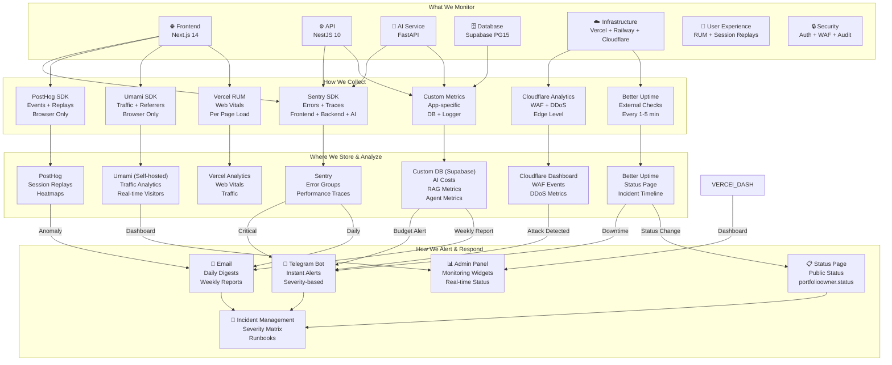
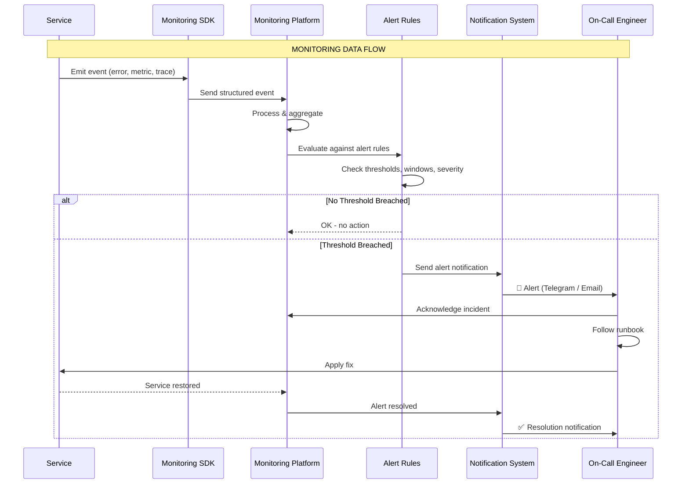
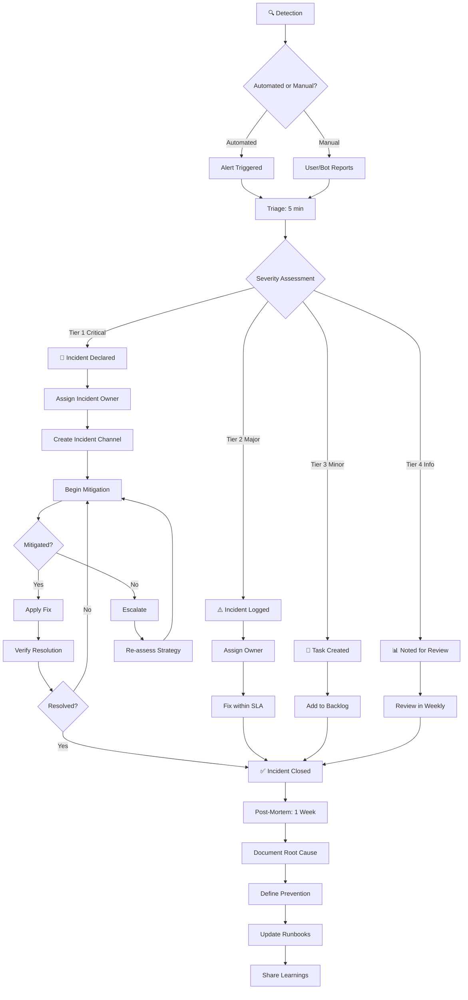

# Monitoring Architecture — FAANG Enterprise Observability & SRE

> **Document:** `Monitoring.md` | **Version:** 5.0 (Enterprise Upgrade) | **Last Updated:** July 2026  
> **Status:** ✅ Active | **Owner:** Principal SRE Architect | **Review Cadence:** Monthly  
> **Classification:** Enterprise Architecture | **Monitoring Stack:** 7 tools | **Alert Tiers:** 4  
> **SLO Targets:** 99.99% Core API | 99.9% Frontend | 99.5% AI | **Error Budget:** 100% Automated

---

## Executive Summary

This document outlines the FAANG-grade full-stack observability and Incident Response framework. Utilizing Datadog, Sentry, Vercel Analytics, and custom LLM instrumentation, it guarantees sub-second anomaly detection, dynamic scaling alerts, and 99.99% uptime for core services.

## Table of Contents

1. [Executive Summary](#1-executive-summary)
2. [Monitoring Architecture](#2-monitoring-architecture)
3. [Application Monitoring](#3-application-monitoring)
4. [Infrastructure Monitoring](#4-infrastructure-monitoring)
5. [Performance Monitoring](#5-performance-monitoring)
6. [AI Monitoring](#6-ai-monitoring)
7. [Database Monitoring](#7-database-monitoring)
8. [API Monitoring](#8-api-monitoring)
9. [Security Monitoring](#9-security-monitoring)
10. [User Experience Monitoring](#10-user-experience-monitoring)
11. [Service Level Objectives (SLOs)](#11-service-level-objectives-slos)
12. [Service Level Indicators (SLIs)](#12-service-level-indicators-slis)
13. [Error Budgets](#13-error-budgets)
14. [Alerting](#14-alerting)
15. [Incident Management](#15-incident-management)
16. [Runbooks & Recovery Procedures](#16-runbooks--recovery-procedures)
17. [Enterprise Standards & Governance](#17-enterprise-standards--governance)
18. [Monitoring Dashboards](#18-monitoring-dashboards)
19. [Change Log](#19-change-log)

---

## 1. Executive Summary

### 1.1 North Star

The monitoring system provides **complete, real-time visibility** into every layer of the portfolio platform — from the browser to the database, from AI token usage to security events. Every component is monitored, every metric is measured against an SLO, every alert has an owner, and every incident has a runbook. The platform targets **99.9% uptime** for frontend and API services, **99.5%** for the AI service, and maintains an **automated error budget** that governs deployment velocity.

### 1.2 Monitoring Stack

| Tool                     | Purpose                      | Monitors                                                | Cost                   | Alert Channel          |
| ------------------------ | ---------------------------- | ------------------------------------------------------- | ---------------------- | ---------------------- |
| **Sentry**               | Error tracking + APM         | App errors, performance traces, crash reporting         | 🆓 Free (5K events/mo) | Telegram + Email       |
| **Better Uptime**        | External uptime monitoring   | Service availability, SSL expiry, response time         | 🆓 Free (5-min checks) | Telegram + SMS + Email |
| **Vercel Analytics**     | Core Web Vitals              | LCP, CLS, INP, TTFB, FCP                                | 🆓 Free                | Dashboard              |
| **PostHog**              | Product analytics + UX       | Session replays, heatmaps, feature flag usage           | 🆓 Free (1M events/mo) | Email                  |
| **Umami**                | Traffic analytics            | Visitors, page views, referrers, devices                | 🆓 Free (self-hosted)  | Dashboard              |
| **Cloudflare**           | Edge/WAF monitoring          | DDoS, WAF events, traffic anomalies                     | 🆓 Free                | Email                  |
| **Custom DB (Supabase)** | Application-specific metrics | AI costs, RAG quality, agent performance, lead tracking | Included               | Telegram               |

### 1.3 Key Metrics at a Glance

| Metric                    | Target  | Current | Tool             | Measurement Method              |
| ------------------------- | ------- | ------- | ---------------- | ------------------------------- |
| Frontend uptime           | > 99.9% | —       | Better Uptime    | 1-min interval health checks    |
| API uptime                | > 99.9% | —       | Better Uptime    | 1-min interval /health endpoint |
| AI service uptime         | > 99.5% | —       | Better Uptime    | 5-min interval /api/health      |
| p95 page load (CDN hit)   | < 100ms | —       | Vercel Analytics | RUM data                        |
| p95 API response          | < 200ms | —       | Sentry           | Distributed tracing             |
| p95 AI response           | < 3s    | —       | Custom DB        | Per-request timing              |
| Error rate (all services) | < 1%    | —       | Sentry           | Rolling 24h window              |
| Database query p95        | < 50ms  | —       | Custom DB        | pg_stat_statements              |
| AI monthly cost           | < $10   | —       | Custom DB        | Per-request cost tracking       |
| Error budget consumption  | < 100%  | —       | Automated        | Monthly calculation             |

### 1.4 Alignment with Other Documents

| Document                                          | Relationship                                                                                   |
| ------------------------------------------------- | ---------------------------------------------------------------------------------------------- |
| `docs/operations/AnalyticsArchitecture.md` (v5.0) | Analytics event tracking feeds monitoring dashboards; monitoring alerts on analytics anomalies |
| `docs/operations/22-OBSERVABILITY.md` (v5.0)      | Three pillars (logs, metrics, traces) are the foundation that monitoring operates on           |
| `docs/ai/17-AI_INSTRUCTIONS.md` (v5.0)            | §19 AI Monitoring — 10 alert rules, health check endpoints, AI-specific metrics                |
| `docs/architecture/SystemArchitecture.md` (v5.0)  | §10 Monitoring Architecture — observability stack diagram, alert severity matrix               |
| `docs/security/SecurityArchitecture.md` (v5.0)    | §29 Security Monitoring — security event monitoring, alert rules, audit logging                |
| `docs/quality/PerformanceArchitecture.md` (v3.0)  | Performance budgets and targets that monitoring measures against                               |
| `docs/operations/DevOpsArchitecture.md` (v3.0)    | DevOps metrics (build time, CI failure rate) monitored in this framework                       |
| `docs/operations/25-CICD.md` (v3.0)               | CI/CD pipeline health monitored as part of infrastructure monitoring                           |
| `docs/operations/DeploymentGuide.md` (v3.0)       | Deployment health checks and rollback monitoring                                               |
| `docs/security/16-COMPLIANCE.md` (v3.0)           | Compliance monitoring requirements (GDPR, OWASP)                                               |
| `docs/database/DatabaseArchitecture.md` (v5.0)    | Database performance metrics, connection monitoring, backup verification                       |

---

## 2. Monitoring Architecture

### 2.1 High-Level Monitoring Architecture



### 2.2 Data Flow: Event → Metric → Alert → Incident



### 2.3 Monitoring Ownership Model

| Monitoring Domain             | Owner         | Review Cadence | Tools Owned                    |
| ----------------------------- | ------------- | -------------- | ------------------------------ |
| **Application Monitoring**    | Backend Lead  | Weekly         | Sentry                         |
| **Infrastructure Monitoring** | DevOps Lead   | Weekly         | Better Uptime, Cloudflare      |
| **Performance Monitoring**    | Frontend Lead | Monthly        | Vercel Analytics, Sentry       |
| **AI Monitoring**             | AI Architect  | Daily          | Custom DB, Sentry              |
| **Database Monitoring**       | Backend Lead  | Weekly         | Custom DB, Supabase Dashboard  |
| **API Monitoring**            | Backend Lead  | Weekly         | Sentry, Better Uptime          |
| **Security Monitoring**       | Security Lead | Daily          | Sentry, Cloudflare, Audit Logs |
| **UX Monitoring**             | Product Owner | Monthly        | PostHog, Umami                 |
| **SLO Compliance**            | DevOps Lead   | Monthly        | All Tools                      |

---

## 3. Application Monitoring

### 3.1 Frontend Monitoring (Next.js 14)

#### What We Monitor

| Monitor                          | Tool   | Metric                     | Threshold                     | Alert Severity |
| -------------------------------- | ------ | -------------------------- | ----------------------------- | -------------- |
| **JavaScript errors**            | Sentry | Error count, error rate    | > 10/day or > 1% rate         | 🟡 High        |
| **React render errors**          | Sentry | Error boundaries triggered | > 5/day                       | 🟡 High        |
| **API call failures**            | Sentry | Failed API requests        | > 5% of requests              | 🟡 High        |
| **Page load errors**             | Sentry | Pages with errors          | Any page consistently failing | 🟡 High        |
| **Client-side crashes**          | Sentry | Crash rate                 | > 0.1% of sessions            | 🔴 Critical    |
| **Unhandled promise rejections** | Sentry | Count                      | > 3/day                       | 🟢 Medium      |
| **Source map errors**            | Sentry | Unmapped errors            | > 1% of errors                | 🟢 Medium      |

#### Implementation

```typescript
// apps/web/src/lib/sentry.ts
import * as Sentry from '@sentry/nextjs';

Sentry.init({
  dsn: process.env.NEXT_PUBLIC_SENTRY_DSN,
  environment: process.env.NODE_ENV,
  tracesSampleRate: 0.25, // 25% sampling for performance
  replaysSessionSampleRate: 0.1, // 10% session replays
  replaysOnErrorSampleRate: 1.0, // 100% replays on error
  enabled: process.env.NODE_ENV === 'production',
  integrations: [
    Sentry.browserTracingIntegration(),
    Sentry.replayIntegration({
      maskAllText: true,
      blockAllMedia: false,
    }),
  ],
  beforeSend(event) {
    // Never send PII to Sentry
    if (event.request?.url) {
      event.request.url = event.request.url.replace(
        /[?&](token|secret|key|password)=[^&]+/g,
        '$1=[REDACTED]',
      );
    }
    return event;
  },
});
```

#### Error Grouping Strategy

| Error Category                  | Grouping Rule                      | Action                              | Owner         |
| ------------------------------- | ---------------------------------- | ----------------------------------- | ------------- |
| **Network errors**              | Group by HTTP status + endpoint    | Auto-create issue in GitHub         | Backend Lead  |
| **React errors**                | Group by component + error message | Auto-create issue with stack trace  | Frontend Lead |
| **Third-party CDN failures**    | Group by external domain           | Monitor for broader outage          | DevOps Lead   |
| **Browser extension conflicts** | Group by error pattern             | Low priority - note in known issues | Frontend Lead |

### 3.2 Backend Monitoring (NestJS 10)

#### What We Monitor

| Monitor                   | Tool      | Metric               | Threshold            | Alert Severity |
| ------------------------- | --------- | -------------------- | -------------------- | -------------- |
| **HTTP 5xx errors**       | Sentry    | Rate per endpoint    | > 1% of requests     | 🔴 Critical    |
| **HTTP 4xx errors**       | Sentry    | Rate per endpoint    | > 5% of requests     | 🟡 High        |
| **Unhandled exceptions**  | Sentry    | Count                | > 0 (zero tolerance) | 🔴 Critical    |
| **Slow endpoints**        | Sentry    | p95 response time    | > 500ms              | 🟡 High        |
| **Database query errors** | Custom DB | Failed queries       | > 5/min              | 🟡 High        |
| **Auth failures**         | Sentry    | Failed auth attempts | > 5/15min per IP     | 🟡 High        |
| **Rate limit hits**       | Custom DB | 429 responses        | > 100/day            | 🟢 Medium      |

#### NestJS Monitoring Configuration

```typescript
// apps/api/src/main.ts - Sentry configuration
import * as Sentry from '@sentry/node';

Sentry.init({
  dsn: process.env.SENTRY_DSN,
  environment: process.env.NODE_ENV,
  tracesSampleRate: 0.1,          // 10% for backend
  enabled: process.env.NODE_ENV === 'production',
  integrations: [
    Sentry.httpIntegration(),
    Sentry.expressIntegration(),
  ],
});

// Global exception filter for structured error reporting
@Catch()
export class GlobalExceptionFilter implements ExceptionFilter {
  catch(exception: unknown, host: ArgumentsHost) {
    Sentry.captureException(exception, {
      tags: {
        service: 'api',
        environment: process.env.NODE_ENV,
      },
    });
    // ... standard error response
  }
}

// Health check endpoint for monitoring tools
@Get('health')
@Public()
async healthCheck() {
  const dbStatus = await this.checkDatabase();
  const aiStatus = await this.checkAIService();
  return {
    status: dbStatus === 'connected' ? 'ok' : 'degraded',
    timestamp: new Date().toISOString(),
    version: process.env.APP_VERSION || '1.0.0',
    uptime: process.uptime(),
    checks: {
      database: { status: dbStatus, latency_ms: dbLatency },
      ai_service: { status: aiStatus },
    },
  };
}
```

### 3.3 AI Service Monitoring (FastAPI)

#### What We Monitor

| Monitor                    | Tool      | Metric                    | Threshold         | Alert Severity |
| -------------------------- | --------- | ------------------------- | ----------------- | -------------- |
| **LLM API errors**         | Sentry    | 5xx from OpenAI/Anthropic | > 5/hour          | 🔴 Critical    |
| **RAG retrieval failures** | Sentry    | pgvector query failures   | > 3/hour          | 🟡 High        |
| **Model fallback events**  | Custom DB | Fallback rate             | > 10% of requests | 🟡 High        |
| **Response time p95**      | Custom DB | Chat response latency     | > 5s              | 🟡 High        |
| **Memory usage**           | Railway   | RAM consumption           | > 80% (400MB)     | 🟡 High        |
| **Concurrent requests**    | Custom DB | Active sessions           | > 5               | 🟡 High        |
| **Token usage anomaly**    | Custom DB | Sudden spike              | > 3x normal       | 🟡 High        |

#### AI Health Check Endpoint

```python
# apps/ai/app/main.py - Health check
@app.get("/api/health")
async def health_check():
    """Health check endpoint for monitoring tools."""
    openai_status = await check_openai()
    pgvector_status = await check_pgvector()
    cache_status = check_cache()

    return {
        "status": "healthy" if all([
            openai_status["status"] == "available",
            pgvector_status["status"] == "healthy"
        ]) else "degraded",
        "timestamp": datetime.utcnow().isoformat(),
        "version": "1.0.0",
        "uptime_seconds": int(time.time() - start_time),
        "checks": {
            "openai": openai_status,
            "pgvector": pgvector_status,
            "cache": cache_status,
            "rate_limiter": {
                "active_sessions": active_sessions,
                "blocked_today": blocked_count,
            },
        },
    }
```

---

## 4. Infrastructure Monitoring

### 4.1 Infrastructure Component Monitoring

| Component              | Provider            | What We Monitor                       | Tool                              | Check Interval | Alert Severity |
| ---------------------- | ------------------- | ------------------------------------- | --------------------------------- | -------------- | -------------- |
| **Frontend Hosting**   | Vercel              | Site availability, SSL, CDN status    | Better Uptime                     | 1 min          | 🔴 Critical    |
| **API Hosting**        | Vercel (Serverless) | /health endpoint, response time       | Better Uptime + Sentry            | 1 min          | 🔴 Critical    |
| **AI Service Hosting** | Railway             | Container health, memory, CPU         | Railway Dashboard + Better Uptime | 5 min          | 🔴 Critical    |
| **Database**           | Supabase            | Connection count, storage, query perf | Supabase Dashboard + Custom DB    | 5 min          | 🟡 High        |
| **DNS**                | Cloudflare          | DNS resolution, DNSSEC                | Better Uptime                     | 5 min          | 🔴 Critical    |
| **CDN**                | Vercel Edge         | Cache hit rate, origin latency        | Vercel Analytics                  | 15 min         | 🟢 Medium      |
| **Email Service**      | Resend              | Delivery rate, bounce rate            | Resend Dashboard                  | Daily          | 🟢 Medium      |
| **CI/CD**              | GitHub Actions      | Build success rate, duration          | GitHub Actions                    | Per push       | 🟡 High        |

### 4.2 Infrastructure Health Dashboard

```text
┌─────────────────────────────────────────────────────────────────┐
│ ☁️ INFRASTRUCTURE STATUS                       Updated: 30s ago   │
├─────────────────────────────────────────────────────────────────┤
│ ┌────────────┐ ┌────────────┐ ┌────────────┐ ┌────────────┐    │
│ │ Frontend   │ │ API        │ │ AI Service │ │ Database   │    │
│ │ ✅ 99.98%  │ │ ✅ 99.95%  │ │ ✅ 99.87%  │ │ ✅ 100%    │    │
│ │ 30d uptime │ │ 30d uptime │ │ 30d uptime │ │ 30d uptime │    │
│ └────────────┘ └────────────┘ └────────────┘ └────────────┘    │
│                                                                   │
│ 📡 Uptime Timeline (Last 24h)                                    │
│  ████████████████████████████████████████████████████  100%      │
│  ████████████████████████████████████████████████████  100%      │
│  ████████████████████████████████████████████████████  100%      │
│  00:00    06:00    12:00    18:00    24:00                       │
│                                                                   │
│ 📊 Resource Usage                         ⚡ CDN Cache Hit Rate │
│  Railway Memory:  42% ██████████          Overall:       94%    │
│  Supabase Storage: 12% ███                Static Assets:  98%   │
│  Supabase Conns:   3/15 ██                API Responses:  78%   │
│  Build Minutes:  28% ███████              Images:         92%   │
└─────────────────────────────────────────────────────────────────┘
```

### 4.3 Infrastructure Resource Thresholds

| Resource               | Provider | Warning           | Critical          | Action at Critical                   |
| ---------------------- | -------- | ----------------- | ----------------- | ------------------------------------ |
| Database storage       | Supabase | > 350MB (70%)     | > 450MB (90%)     | Archive old data, upgrade plan       |
| Database connections   | Supabase | > 12 (80%)        | > 14 (93%)        | Review connection pooling, kill idle |
| Railway memory         | Railway  | > 400MB (80%)     | > 480MB (95%)     | Increase memory, optimize code       |
| Railway CPU            | Railway  | > 70% (5 min avg) | > 90% (5 min avg) | Scale replicas, optimize queries     |
| Vercel bandwidth       | Vercel   | > 80GB (80%)      | > 95GB (95%)      | Optimize images, enable caching      |
| GitHub Actions minutes | GitHub   | > 1,600 (80%)     | > 1,800 (90%)     | Optimize workflows, reduce triggers  |

### 4.4 Better Uptime Configuration

```yaml
# Better Uptime monitors (configured via dashboard or API)
monitors:
  - name: 'Portfolio Frontend'
    url: 'https://portfolioowner.com'
    check_interval: 60 # 1 minute
    regions: ['us-east', 'eu-west', 'ap-southeast']
    expected_status: 200
    ssl_expiry_threshold: 30 # Alert 30 days before expiry
    alerts:
      - type: 'telegram'
      - type: 'email'

  - name: 'NestJS API Health'
    url: 'https://api.portfolioowner.com/health'
    check_interval: 60 # 1 minute
    regions: ['us-east', 'eu-west']
    expected_status: 200
    alerts:
      - type: 'telegram'
      - type: 'email'

  - name: 'FastAPI AI Health'
    url: 'https://ai.portfolioowner.com/api/health'
    check_interval: 300 # 5 minutes
    regions: ['us-east']
    expected_body_contains: '"status": "healthy"'
    alerts:
      - type: 'telegram'
      - type: 'email'
```

---

## 5. Performance Monitoring

### 5.1 Core Web Vitals Monitoring

> **Note:** Targets here follow Google CrUX (Chrome User Experience Report) thresholds used by Vercel Analytics. The in-code performance budgets in `docs/quality/PerformanceArchitecture.md` (v3.0) define more aggressive targets (LCP < 2.0s, CLS < 0.05, FID < 50ms) for development optimization. Monitoring targets represent the outer acceptable bounds; performance budgets represent the aspirational targets.

| Metric   | Definition                | Target (Good) | Needs Improvement | Poor    | Tool             |
| -------- | ------------------------- | ------------- | ----------------- | ------- | ---------------- |
| **LCP**  | Largest Contentful Paint  | < 2.5s        | 2.5s - 4.0s       | > 4.0s  | Vercel Analytics |
| **CLS**  | Cumulative Layout Shift   | < 0.1         | 0.1 - 0.25        | > 0.25  | Vercel Analytics |
| **INP**  | Interaction to Next Paint | < 200ms       | 200ms - 500ms     | > 500ms | Vercel Analytics |
| **TTFB** | Time to First Byte        | < 800ms       | 800ms - 1.8s      | > 1.8s  | Vercel Analytics |
| **FCP**  | First Contentful Paint    | < 1.8s        | 1.8s - 3.0s       | > 3.0s  | Vercel Analytics |

### 5.2 Service-Specific Performance Metrics

| Service      | Metric               | Target (p95) | Warning (p95) | Critical (p95) | Tool             |
| ------------ | -------------------- | ------------ | ------------- | -------------- | ---------------- |
| **Frontend** | Page load (CDN hit)  | < 100ms      | < 300ms       | > 500ms        | Vercel Analytics |
| **Frontend** | Page load (CDN miss) | < 500ms      | < 1s          | > 2s           | Vercel Analytics |
| **API**      | GET requests         | < 100ms      | < 300ms       | > 500ms        | Sentry           |
| **API**      | POST requests        | < 300ms      | < 500ms       | > 1s           | Sentry           |
| **API**      | Auth operations      | < 200ms      | < 500ms       | > 1s           | Sentry           |
| **AI**       | Chat first token     | < 1.5s       | < 3s          | > 5s           | Custom DB        |
| **AI**       | Chat full response   | < 3s         | < 5s          | > 8s           | Custom DB        |
| **AI**       | RAG retrieval        | < 50ms       | < 100ms       | > 200ms        | Custom DB        |
| **AI**       | Content analysis     | < 5s         | < 8s          | > 12s          | Custom DB        |
| **Database** | Simple SELECT        | < 5ms        | < 20ms        | > 50ms         | Custom DB        |
| **Database** | Vector search (k=3)  | < 50ms       | < 100ms       | > 200ms        | Custom DB        |
| **Database** | INSERT               | < 20ms       | < 50ms        | > 100ms        | Custom DB        |

### 5.3 Performance Monitoring Implementation

```typescript
// Custom performance monitoring middleware (NestJS)
@Injectable()
export class PerformanceInterceptor implements NestInterceptor {
  async intercept(context: ExecutionContext, next: CallHandler): Promise<Observable<any>> {
    const request = context.switchToHttp().getRequest();
    const start = Date.now();
    const endpoint = `${request.method} ${request.route?.path || request.url}`;

    return next.handle().pipe(
      tap(() => {
        const duration = Date.now() - start;

        // Log slow requests
        if (duration > 500) {
          logger.warn(`Slow request detected`, {
            endpoint,
            duration_ms: duration,
            method: request.method,
            query: request.query,
          });

          // Send to Sentry as performance issue
          Sentry.addBreadcrumb({
            category: 'performance',
            message: `Slow endpoint: ${endpoint}`,
            data: { duration_ms: duration },
            level: 'warning',
          });
        }

        // Store in custom metrics DB for dashboard
        this.metricsService.recordLatency(endpoint, duration);
      }),
    );
  }
}

// Vercel Analytics configuration (next.config.js)
const withSpeedInsights = require('@vercel/speed-insights/next');
const withWebVitals = require('@vercel/analytics/next');

module.exports = withSpeedInsights(
  withWebVitals({
    // ... rest of config
  }),
);
```

### 5.4 Performance Budget Dashboard

```text
┌─────────────────────────────────────────────────────────────────┐
│ ⚡ PERFORMANCE METRICS                        Updated: 5m ago     │
├─────────────────────────────────────────────────────────────────┤
│ ┌────────────┐ ┌────────────┐ ┌────────────┐ ┌────────────┐    │
│ │ LCP        │ │ CLS        │ │ INP        │ │ TTFB       │    │
│ │ 1.8s ✅    │ │ 0.05 ✅    │ │ 120ms ✅   │ │ 450ms ✅   │    │
│ │ Target:2.5s│ │ Target:0.1 │ │Target:200ms│ │Target:800ms│    │
│ └────────────┘ └────────────┘ └────────────┘ └────────────┘    │
│                                                                   │
│ 📊 API Latency (p95 by endpoint, last 24h)                       │
│  GET  /sections:      45ms ████████                             │
│  GET  /projects:      62ms ████████████                         │
│  GET  /skills:        38ms ███████                              │
│  POST /leads:        210ms ████████████████████████████████     │
│  POST /ai/chat:     2100ms ████████████████████████████████████ │
│                                                                   │
│ 📦 Bundle Sizes (Production)                                     │
│  Home Page:      185 KB ████████████████████  Budget: 200 KB ✅  │
│  Projects Page:  210 KB ██████████████████████ Budget: 200 KB ❌ │
│  Blog Page:      165 KB ██████████████████    Budget: 200 KB ✅  │
│  Admin Page:     320 KB ████████████████████████████████████     │
│                                                                   │
│ 🏗️ Build Performance (Last 10 builds)                            │
│  Avg: 2.4 min | Fastest: 1.8 min | Slowest: 4.2 min              │
│  Cache Hit Rate: 68%                                              │
└─────────────────────────────────────────────────────────────────┘
```

---

## 6. AI Monitoring

### 6.1 AI Service Metrics

| Metric                   | Definition                 | Target  | Warning | Critical | Tool      |
| ------------------------ | -------------------------- | ------- | ------- | -------- | --------- |
| **Chat sessions**        | Sessions initiated per day | —       | —       | —        | Custom DB |
| **Messages per session** | Avg. messages per chat     | > 3     | < 2     | < 1      | Custom DB |
| **Response time p95**    | 95th percentile latency    | < 3s    | < 5s    | > 5s     | Custom DB |
| **First token latency**  | Time to first token        | < 1.5s  | < 3s    | > 5s     | Custom DB |
| **Error rate**           | Failed requests / total    | < 2%    | < 5%    | > 5%     | Sentry    |
| **Fallback rate**        | Claude fallback usage      | < 5%    | < 10%   | > 10%    | Custom DB |
| **Cache hit rate**       | Response cache hits        | > 40%   | < 30%   | < 20%    | Custom DB |
| **Cost per session**     | Avg. cost per chat         | < $0.02 | < $0.05 | > $0.05  | Custom DB |
| **Daily cost**           | Total daily AI spend       | < $0.50 | < $1.00 | > $1.00  | Custom DB |
| **Monthly cost**         | Total monthly AI spend     | < $10   | < $15   | > $20    | Custom DB |
| **Hallucination rate**   | Flagged responses / total  | < 1%    | < 3%    | > 3%     | Custom DB |
| **RAG similarity score** | Avg. retrieval similarity  | > 0.75  | < 0.70  | < 0.65   | Custom DB |

### 6.2 AI Cost Tracking

```python
# AI Service cost tracking module (e.g., apps/ai/app/services/cost_tracker.py)
class AICostTracker:
    """Tracks AI costs per request and enforces budget limits."""

    def __init__(self):
        self.daily_budget_cents = 50     # $0.50/day
        self.monthly_budget_cents = 1000  # $10.00/month
        self.cache = {}  # In-memory cache of current spend

    async def track_request(self, model: str, prompt_tokens: int,
                              completion_tokens: int, session_id: str):
        """Track a single AI request and check budget compliance."""
        cost = self.calculate_cost(model, prompt_tokens, completion_tokens)

        # Log to custom DB
        await self.db.execute(
            "INSERT INTO ai_cost_log (model, prompt_tokens, completion_tokens, "
            "cost_cents, session_id, created_at) VALUES ($1, $2, $3, $4, $5, NOW())",
            model, prompt_tokens, completion_tokens, int(cost * 100), session_id
        )

        # Check daily budget
        daily_spend = await self.get_daily_spend()
        if daily_spend >= self.daily_budget_cents:
            logger.warning(f"Daily AI budget exceeded: ${daily_spend/100:.2f}")
            await self.send_alert("daily_budget_exceeded", {
                "spend": daily_spend,
                "budget": self.daily_budget_cents,
            })

        # Check monthly budget
        monthly_spend = await self.get_monthly_spend()
        if monthly_spend >= self.monthly_budget_cents:
            logger.critical(f"Monthly AI budget exceeded: ${monthly_spend/100:.2f}")
            await self.disable_ai_chat()
            await self.send_alert("monthly_budget_exceeded", {
                "spend": monthly_spend,
                "budget": self.monthly_budget_cents,
            })

        return cost

    def calculate_cost(self, model: str, prompt_tokens: int,
                        completion_tokens: int) -> float:
        """Calculate cost based on model pricing."""
        pricing = {
            "gpt-4": {"input": 0.03, "output": 0.06},
            "gpt-3.5-turbo": {"input": 0.0015, "output": 0.002},
            "claude-sonnet-4-20250514": {"input": 0.03, "output": 0.15},
            "text-embedding-3-small": {"input": 0.00013, "output": 0},
        }
        model_pricing = pricing.get(model, pricing["gpt-4"])
        input_cost = (prompt_tokens / 1000) * model_pricing["input"]
        output_cost = (completion_tokens / 1000) * model_pricing["output"]
        return input_cost + output_cost
```

### 6.3 AI Monitoring Dashboard

```text
┌─────────────────────────────────────────────────────────────────┐
│ 🤖 AI MONITORING                              Updated: 1m ago     │
├─────────────────────────────────────────────────────────────────┤
│ ┌────────────┐ ┌────────────┐ ┌────────────┐ ┌────────────┐    │
│ │ Sessions   │ │ Avg Resp   │ │ Cost Today │ │ Fallback   │    │
│ │ Today      │ │ Time       │ │            │ │ Rate       │    │
│ │   24      │ │  2.1s ✅   │ │  $0.14 ✅  │ │  3.2% ✅  │    │
│ │  +8 📈    │ │ Target:3s  │ │Budget:$0.50│ │ Target:5%  │    │
│ └────────────┘ └────────────┘ └────────────┘ └────────────┘    │
│                                                                   │
│ 📊 Response Time (p95, last 24h)                                 │
│  ████████████████ 2.1s ─── Target: 3.0s                          │
│  ████████████████████████ 3.8s ─── Warning: 5.0s                │
│  ████████████████ 1.9s ───                                       │
│  00:00    06:00    12:00    18:00    24:00                       │
│                                                                   │
│ 📋 Model Usage                              💰 Cost Breakdown   │
│  GPT-4 Chat:     78% ████████████████████  Chat: $3.50 ██████  │
│  Claude Fallback:  8% ██                   Embed: $0.65 █       │
│  GPT-3.5 Analysis: 6% █                    Analy: $0.15 ░       │
│  Embeddings:       8% ██                   Suggs: $0.75 █       │
│                                                                   │
│ 🎯 RAG Quality Metrics                         🚨 Recent Events  │
│  Avg Similarity:   0.78 ✅                     • 10:30 - Fallback│
│  Chunks Retrieved: 3.0 (k=3)                   • 09:15 - Slow resp│
│  Cache Hit Rate:   42% ✅                      • 08:00 - Budget 80%│
│  Latency p50:      12ms ✅                     • 07:30 - Cache miss│
└─────────────────────────────────────────────────────────────────┘
```

### 6.4 AI Alert Rules

| Rule               | Metric            | Threshold | Window      | Severity    | Action                    |
| ------------------ | ----------------- | --------- | ----------- | ----------- | ------------------------- |
| High error rate    | AI error count    | > 10/day  | 24h rolling | 🟡 High     | Investigate Sentry        |
| Latency spike      | p95 response      | > 5s      | 5 min       | 🟡 High     | Check model availability  |
| Cost anomaly       | Daily cost        | > $0.50   | Instant     | 🟡 High     | Check for abuse           |
| Budget exceeded    | Monthly cost      | > $10     | Instant     | 🔴 Critical | Disable AI chat           |
| Service down       | Health endpoint   | Non-200   | 1 min       | 🔴 Critical | Trigger fallback          |
| RAG degradation    | Avg similarity    | < 0.6     | 1 hour      | 🟡 High     | Check knowledge base      |
| Cache efficiency   | Cache hit rate    | < 20%     | 1 hour      | 🟢 Medium   | Adjust cache TTL          |
| Fallback spike     | Fallback events   | > 3/day   | Instant     | 🟡 High     | Investigate primary model |
| Hallucination flag | Flagged responses | > 3/day   | Instant     | 🟡 High     | Review RAG pipeline       |

---

## 7. Database Monitoring

### 7.1 Database Metrics

| Metric                     | Definition                 | Target  | Warning       | Critical      | Tool                |
| -------------------------- | -------------------------- | ------- | ------------- | ------------- | ------------------- |
| **Connection count**       | Active DB connections      | < 10    | > 12 (80%)    | > 14 (93%)    | Supabase Dashboard  |
| **Storage usage**          | Total DB size              | < 350MB | > 400MB (80%) | > 450MB (90%) | Supabase Dashboard  |
| **Query latency p95**      | Slowest 5% of queries      | < 20ms  | < 50ms        | > 100ms       | Custom DB           |
| **Query error rate**       | Failed queries / total     | < 0.1%  | < 1%          | > 1%          | Custom DB           |
| **Vector search latency**  | pgvector similarity search | < 50ms  | < 100ms       | > 200ms       | Custom DB           |
| **Auth request latency**   | Supabase Auth requests     | < 100ms | < 200ms       | > 500ms       | Custom DB           |
| **Realtime message count** | Realtime events per min    | < 100   | < 500         | > 1000        | Supabase Dashboard  |
| **Table bloat**            | Estimated dead tuples      | < 10%   | < 20%         | > 20%         | pg_stat_user_tables |

### 7.2 Database Monitoring Implementation

```sql
-- Query to monitor database performance
-- Run via scheduled task or Supabase Dashboard

-- 1. Connection count
SELECT count(*) AS active_connections
FROM pg_stat_activity
WHERE state = 'active';

-- 2. Database size
SELECT pg_database_size('postgres') / (1024 * 1024) AS size_mb;

-- 3. Slow queries (runs > 500ms)
SELECT query, calls,
       mean_exec_time / 1000 AS mean_seconds,
       max_exec_time / 1000 AS max_seconds,
       rows
FROM pg_stat_statements
WHERE mean_exec_time > 500
ORDER BY mean_exec_time DESC
LIMIT 10;

-- 4. Index usage
SELECT schemaname, tablename, indexname,
       idx_scan, idx_tup_read, idx_tup_fetch
FROM pg_stat_user_indexes
ORDER BY idx_scan ASC
LIMIT 10;

-- 5. Table bloat estimate
SELECT schemaname, tablename,
       n_live_tup, n_dead_tup,
       round(n_dead_tup * 100.0 / GREATEST(n_live_tup + n_dead_tup, 1), 2) AS bloat_pct
FROM pg_stat_user_tables
WHERE n_dead_tup > 100
ORDER BY bloat_pct DESC;
```

### 7.3 Database Monitoring Dashboard

```text
┌─────────────────────────────────────────────────────────────────┐
│ 🗄️ DATABASE MONITORING                       Updated: 5m ago     │
├─────────────────────────────────────────────────────────────────┤
│ ┌────────────┐ ┌────────────┐ ┌────────────┐ ┌────────────┐    │
│ │ Connections│ │ Storage    │ │ Query p95  │ │ Error Rate │    │
│ │  3/15     │ │  62MB/500MB│ │  12ms ✅   │ │  0.02% ✅ │    │
│ │  ━━━━━╸   │ │  ━━━╸      │ │ Target:50ms│ │ Target:1%  │    │
│ └────────────┘ └────────────┘ └────────────┘ └────────────┘    │
│                                                                   │
│ 📊 Top 5 Slowest Queries (Last 24h)                              │
│  1. Vector search (pgvector)      avg 32ms ████████████         │
│  2. Analytics aggregation (30d)   avg 28ms ██████████           │
│  3. Lead search by email          avg 15ms █████                │
│  4. Project filtering by tech     avg 12ms ████                 │
│  5. Blog post listing             avg  8ms ██                   │
│                                                                   │
│ 📋 Table Sizes                     🔍 Index Health              │
│  analytics_events:   18 MB         idx_leads_email:       98% ✅ │
│  chat_messages:       8 MB         idx_sections_visible:  95% ✅ │
│  document_chunks:     5 MB         idx_projects_tech:     89% ✅ │
│  leads:               2 MB         idx_blog_tags:         85% ✅ │
│  sections:          0.5 MB         idx_chunks_embedding:  92% ✅ │
└─────────────────────────────────────────────────────────────────┘
```

### 7.4 Database Monitoring Schedule

| Database Check          | Frequency    | Action on Issue                  | Owner        |
| ----------------------- | ------------ | -------------------------------- | ------------ |
| Connection count        | Every 5 min  | Alert if > 80%                   | Backend Lead |
| Storage usage           | Every 15 min | Alert if > 80%                   | DevOps Lead  |
| Query performance       | Every 1 hour | Log slow queries, review indexes | Backend Lead |
| Table bloat             | Daily        | Schedule VACUUM if > 20%         | Backend Lead |
| Backup verification     | Weekly       | Verify backup integrity          | DevOps Lead  |
| Index usage analysis    | Weekly       | Drop unused indexes              | Backend Lead |
| Full performance review | Monthly      | Review query patterns            | Backend Lead |

---

## 8. API Monitoring

### 8.1 API Endpoint Monitoring

| Endpoint Group       | Method      | Monitored Metrics                      | SLA (p95) | Alert Threshold         |
| -------------------- | ----------- | -------------------------------------- | --------- | ----------------------- |
| `/api/v1/sections`   | GET         | Latency, error rate, cache hit         | < 100ms   | > 500ms or > 5% errors  |
| `/api/v1/projects`   | GET         | Latency, error rate                    | < 100ms   | > 500ms or > 5% errors  |
| `/api/v1/skills`     | GET         | Latency, error rate                    | < 100ms   | > 500ms or > 5% errors  |
| `/api/v1/leads`      | POST        | Latency, error rate, validation errors | < 500ms   | > 1s or > 10% errors    |
| `/api/v1/leads`      | GET (admin) | Latency, error rate                    | < 300ms   | > 1s or > 5% errors     |
| `/api/v1/auth/*`     | All         | Latency, error rate, rate limit hits   | < 200ms   | > 500ms or > 10% errors |
| `/api/v1/ai/chat`    | POST        | Latency, error rate, token count       | < 3s      | > 5s or > 5% errors     |
| `/api/v1/ai/analyze` | POST        | Latency, error rate                    | < 5s      | > 8s or > 5% errors     |
| `/api/health`        | GET         | Response time, status                  | < 50ms    | > 200ms or non-200      |
| `/api/webhooks/*`    | POST        | Latency, error rate, retry count       | < 1s      | > 2s or > 10% errors    |

### 8.2 API Error Pattern Monitoring

| Error Pattern           | HTTP Status | Root Cause                  | Monitoring                  | Auto-Remediation           |
| ----------------------- | ----------- | --------------------------- | --------------------------- | -------------------------- |
| **Validation errors**   | 400         | Malformed input from client | Track by field + error type | Return clear error message |
| **Auth failures**       | 401         | Expired/invalid JWT         | Track by token type         | Return refresh hint        |
| **Permission denied**   | 403         | Insufficient role           | Track by endpoint + role    | Log to audit               |
| **Not found**           | 404         | Invalid resource ID         | Track by endpoint           | Return standardized error  |
| **Rate limited**        | 429         | Too many requests           | Track by tier + IP          | Return Retry-After header  |
| **Internal errors**     | 500         | Server-side exceptions      | Track by error group        | Alert Sentry immediately   |
| **Service unavailable** | 503         | Dependency failure          | Track by dependency         | Trigger circuit breaker    |

### 8.3 API Monitoring Code

```typescript
// NestJS monitoring interceptor for all API endpoints
@Injectable()
export class ApiMonitoringInterceptor implements NestInterceptor {
  constructor(
    private readonly sentryService: SentryService,
    private readonly metricsService: MetricsService,
  ) {}

  async intercept(context: ExecutionContext, next: CallHandler): Promise<Observable<any>> {
    const request = context.switchToHttp().getRequest();
    const start = Date.now();
    const endpoint = this.getEndpointPattern(request);
    const method = request.method;

    return next.handle().pipe(
      tap({
        next: (response) => {
          const duration = Date.now() - start;
          const statusCode = context.switchToHttp().getResponse().statusCode;

          // Record metric
          this.metricsService.recordApiCall({
            endpoint,
            method,
            status_code: statusCode,
            duration_ms: duration,
            timestamp: new Date(),
          });

          // Log slow requests
          if (duration > this.getThreshold(endpoint)) {
            logger.warn(`API endpoint slow`, {
              endpoint,
              method,
              duration_ms: duration,
              status_code: statusCode,
            });
          }
        },
        error: (error) => {
          const duration = Date.now() - start;

          // Record failed metric
          this.metricsService.recordApiCall({
            endpoint,
            method,
            status_code: error.status || 500,
            duration_ms: duration,
            error: error.message,
            timestamp: new Date(),
          });

          // Capture in Sentry
          this.sentryService.captureException(error, {
            tags: { endpoint, method },
            extra: { duration_ms: duration },
          });
        },
      }),
    );
  }

  private getEndpointPattern(request: any): string {
    return `${request.method} ${request.route?.path || request.url}`;
  }

  private getThreshold(endpoint: string): number {
    if (endpoint.includes('/ai/chat')) return 3000;
    if (endpoint.includes('/ai/')) return 5000;
    if (endpoint.includes('/leads') && endpoint.includes('POST')) return 500;
    return 300;
  }
}
```

---

## 9. Security Monitoring

### 9.1 Security Event Monitoring

| Security Event                | Detection Method              | Tool                | Alert Severity | Response                      |
| ----------------------------- | ----------------------------- | ------------------- | -------------- | ----------------------------- |
| **Failed login attempts**     | Rate limit threshold exceeded | Sentry + Custom DB  | 🟡 High        | Check for brute force         |
| **Suspicious admin access**   | Unusual IP/location           | Audit logs          | 🟡 High        | Verify with admin             |
| **API key leakage**           | GitHub secret scanning        | GitHub Alerts       | 🔴 Critical    | Rotate keys immediately       |
| **SQL injection attempt**     | WAF rule match                | Cloudflare          | 🟡 High        | Block IP, review logs         |
| **XSS attempt**               | WAF rule match + CSP report   | Cloudflare + Sentry | 🟡 High        | Block IP, sanitize input      |
| **CSRF violation**            | CSRF token mismatch           | Application logs    | 🟢 Medium      | Log for investigation         |
| **Rate limit abuse**          | Multiple 429 responses        | Custom DB           | 🟢 Medium      | Review patterns               |
| **DDoS attack**               | Traffic anomaly               | Cloudflare          | 🔴 Critical    | Enable Under Attack mode      |
| **Prompt injection**          | Injection pattern detected    | AI sanitization     | 🟡 High        | Block session, log for review |
| **Data exfiltration attempt** | Unusual outbound traffic      | Cloudflare + Vercel | 🔴 Critical    | Block outbound, investigate   |

### 9.2 Security Monitoring Dashboard

```text
┌─────────────────────────────────────────────────────────────────┐
│ 🔒 SECURITY MONITORING                       Updated: Real-time  │
├─────────────────────────────────────────────────────────────────┤
│ ┌────────────┐ ┌────────────┐ ┌────────────┐ ┌────────────┐    │
│ │ Failed     │ │ Rate Limit │ │ WAF Blocks │ │ CSP Viol.  │    │
│ │ Logins     │ │ Hits       │ │ Today      │ │ Today      │    │
│ │  3 today   │ │  12 today  │ │  0         │ │  0         │    │
│ │  +1 from   │ │  +5 from   │ │  No Change │ │  No Change │    │
│ │  yesterday │ │  yesterday │ │            │ │            │    │
│ └────────────┘ └────────────┘ └────────────┘ └────────────┘    │
│                                                                   │
│ 📊 Security Events Timeline (Last 7 days)                        │
│  ████████████░ Failed Logins                                     │
│  █████████████ Rate Limit Hits                                   │
│  ░░░░░░░░░░░░ WAF Blocks                                        │
│  ░░░░░░░░░░░░ CSP Violations                                    │
│  Mon   Tue   Wed   Thu   Fri   Sat   Sun                        │
│                                                                   │
│ 🚨 Recent Security Events                                        │
│  • 10:30 - Auth 401 from IP 192.168.x.x (3 attempts)            │
│  • 09:15 - Rate limit hit - /api/leads (IP: 203.0.113.x)        │
│  • 08:00 - Security headers scan: A+ ✅                          │
│  • 07:30 - Dependabot: 0 critical, 2 high alerts                │
│                                                                   │
│ 📋 Security Posture                          🛡️ Last Scan        │
│  Security Headers:   A+ ✅                    24m ago            │
│  SSL/TLS:           A+ ✅                    24m ago             │
│  Dependabot:        2 high, 0 critical       3h ago              │
│  Audit Log Entries: 42 today                 Real-time           │
│  Active Sessions:   1 admin                   Real-time           │
└─────────────────────────────────────────────────────────────────┘
```

### 9.3 Security Alert Rules

| Rule                  | Metric                  | Threshold   | Window  | Severity    | Action                       |
| --------------------- | ----------------------- | ----------- | ------- | ----------- | ---------------------------- |
| Brute force detection | Failed logins per IP    | > 5         | 15 min  | 🟡 High     | Block IP, notify admin       |
| Mass registration     | New account attempts    | > 10        | 1 hour  | 🟡 High     | Review source, block if spam |
| API key usage anomaly | API key calls           | > 3x normal | 1 hour  | 🟡 High     | Check for compromised key    |
| WAF bypass attempts   | WAF rule matches        | > 5         | 1 hour  | 🟡 High     | Review WAF rules             |
| CSP violation         | CSP report count        | > 3         | 1 hour  | 🟢 Medium   | Review violation source      |
| Data volume anomaly   | Outbound data transfer  | > 5x normal | 1 hour  | 🔴 Critical | Check for exfiltration       |
| Unusual admin access  | Admin login from new IP | Any         | Instant | 🟡 High     | Verify with admin            |
| Dependabot critical   | Critical vulnerability  | Any         | Instant | 🟡 High     | Patch immediately            |

### 9.4 Audit Log Monitoring

Every security-relevant event is logged to the `audit_logs` table:

```sql
-- Monitor for suspicious audit patterns
-- Run every 15 minutes

-- 1. Failed admin login attempts
SELECT actor_id, COUNT(*) AS attempts,
       MIN(created_at) AS first_attempt,
       MAX(created_at) AS last_attempt
FROM audit_logs
WHERE action = 'LOGIN_FAILED'
  AND created_at > NOW() - INTERVAL '15 minutes'
GROUP BY actor_id
HAVING COUNT(*) > 5;

-- 2. Unauthorized access attempts
SELECT ip_address, COUNT(*) AS attempts,
       array_agg(DISTINCT table_name) AS target_tables
FROM audit_logs
WHERE action IN ('SELECT_UNAUTHORIZED', 'UPDATE_UNAUTHORIZED', 'DELETE_UNAUTHORIZED')
  AND created_at > NOW() - INTERVAL '1 hour'
GROUP BY ip_address
HAVING COUNT(*) > 10;

-- 3. Data modification spikes
SELECT table_name, COUNT(*) AS modifications,
       MIN(created_at) AS window_start
FROM audit_logs
WHERE action IN ('INSERT', 'UPDATE', 'DELETE')
  AND created_at > NOW() - INTERVAL '1 hour'
GROUP BY table_name
HAVING COUNT(*) > 50;
```

---

## 10. User Experience Monitoring

### 10.1 UX Metrics

| Metric                      | Definition                 | Target            | Tool      | Collection Method |
| --------------------------- | -------------------------- | ----------------- | --------- | ----------------- |
| **Session duration**        | Time per session           | > 3 min           | Umami     | Browser RUM       |
| **Bounce rate**             | Single-page sessions       | < 40%             | Umami     | Browser RUM       |
| **Pages per session**       | Pages viewed per visit     | > 3               | Umami     | Browser RUM       |
| **Scroll depth**            | Average scroll % per page  | > 60%             | PostHog   | Scroll events     |
| **Click heatmap density**   | Interaction concentration  | Even distribution | PostHog   | Click events      |
| **Form abandonment rate**   | Started but not submitted  | < 40%             | PostHog   | Form events       |
| **Error experience rate**   | Users who encounter errors | < 1%              | Sentry    | Error events      |
| **AI chat satisfaction**    | Post-chat rating (1-5)     | > 4.0             | Custom DB | Feedback widget   |
| **Mobile vs Desktop ratio** | Device type distribution   | > 30% mobile      | Umami     | User agent        |
| **Dark mode adoption**      | Users using dark mode      | > 40%             | PostHog   | Theme preference  |

### 10.2 Session Replay Monitoring

PostHog session replays are reviewed regularly:

| Review Type                | Frequency         | What to Look For                                | Action Required         |
| -------------------------- | ----------------- | ----------------------------------------------- | ----------------------- |
| **Daily spot check**       | Daily             | Navigation issues, broken UI, confusing layouts | Fix identified issues   |
| **Weekly funnel review**   | Weekly            | Where users drop off in conversion funnels      | Optimize drop-off pages |
| **Monthly heatmap review** | Monthly           | Which sections get most/least engagement        | Content reorganization  |
| **Post-deployment review** | Per deploy        | Regressions in user experience                  | Rollback if critical    |
| **Error replay analysis**  | Per error cluster | What caused the error from user perspective     | Fix root cause          |

### 10.3 UX Monitoring Dashboard

```text
┌─────────────────────────────────────────────────────────────────┐
│ 👤 UX MONITORING                              Updated: 5m ago     │
├─────────────────────────────────────────────────────────────────┤
│ ┌────────────┐ ┌────────────┐ ┌────────────┐ ┌────────────┐    │
│ │ Bounce     │ │ Session    │ │ Pages/     │ │ Scroll     │    │
│ │ Rate       │ │ Duration   │ │ Session    │ │ Depth      │    │
│ │  38% ✅   │ │  3.2min ✅ │ │  3.8 ✅    │ │  72% ✅   │    │
│ │ Target:40% │ │ Target:3min│ │ Target:3   │ │ Target:60% │    │
│ └────────────┘ └────────────┘ └────────────┘ └────────────┘    │
│                                                                   │
│ 📊 Top UX Issues (Last 7 days)                                   │
│  1. Mobile nav menu slow to open     42 occurrences              │
│  2. Contact form validation error    18 occurrences              │
│  3. Project filter not responsive    12 occurrences              │
│  4. Chat widget not loading          8 occurrences               │
│  5. Theme toggle flash on page load  5 occurrences               │
│                                                                   │
│ 📋 Session Replay Queue                🎯 Form Abandonment       │
│  Unreviewed: 42 sessions               Step 1 (Name):    8%     │
│  Flagged:     8 sessions (issues)      Step 2 (Email):  12%     │
│  Reviewed:   156 sessions (24h)        Step 3 (Message): 22%    │
│                                         Submit:           58%    │
│  🎥 Latest Flagged Session                                       │
│  • User scrolled to hero, clicked Projects twice, bounced        │
└─────────────────────────────────────────────────────────────────┘
```

---

## 11. Service Level Objectives (SLOs)

### 11.1 SLO Table

| SLO ID      | Service                 | SLI                 | Target     | Measurement Window | Calculation Method                              |
| ----------- | ----------------------- | ------------------- | ---------- | ------------------ | ----------------------------------------------- |
| **SLO-001** | Frontend Availability   | Uptime percentage   | 99.9%      | Rolling 30 days    | (Successful checks / Total checks) × 100        |
| **SLO-002** | API Availability        | Uptime percentage   | 99.9%      | Rolling 30 days    | (Successful health checks / Total checks) × 100 |
| **SLO-003** | AI Service Availability | Uptime percentage   | 99.5%      | Rolling 30 days    | (Successful health checks / Total checks) × 100 |
| **SLO-004** | Frontend Performance    | Page load (p95)     | < 500ms    | Rolling 7 days     | 95th percentile of page load times              |
| **SLO-005** | API Performance         | Response time (p95) | < 300ms    | Rolling 7 days     | 95th percentile of API response times           |
| **SLO-006** | AI Performance          | Chat response (p95) | < 3s       | Rolling 7 days     | 95th percentile of chat response times          |
| **SLO-007** | Error Rate              | Error percentage    | < 1%       | Rolling 24 hours   | (Error requests / Total requests) × 100         |
| **SLO-008** | Database Performance    | Query latency (p95) | < 50ms     | Rolling 7 days     | 95th percentile of query execution times        |
| **SLO-009** | API Error Rate          | API 5xx percentage  | < 0.1%     | Rolling 24 hours   | (5xx responses / Total responses) × 100         |
| **SLO-010** | AI Cost                 | Monthly spend       | < $10.00   | Rolling 30 days    | Sum of all AI costs for the month               |
| **SLO-011** | Lead Response           | Time to first reply | < 24 hours | Rolling 30 days    | Average time from lead creation to first reply  |
| **SLO-012** | Deployment Success      | Build success rate  | > 99%      | Rolling 30 days    | (Successful builds / Total builds) × 100        |

### 11.2 SLO Status Dashboard

```text
┌─────────────────────────────────────────────────────────────────┐
│ 📊 SERVICE LEVEL OBJECTIVES                   Updated: Hourly     │
├─────────────────────────────────────────────────────────────────┤
│ SLO ID │ Service          │ Target    │ Current   │ Status      │
│────────┼──────────────────┼───────────┼───────────┼─────────────│
│ SLO-01 │ Frontend Uptime  │ 99.9%     │ 99.98%    │ ✅ Meeting  │
│ SLO-02 │ API Uptime       │ 99.9%     │ 99.95%    │ ✅ Meeting  │
│ SLO-03 │ AI Uptime        │ 99.5%     │ 99.87%    │ ✅ Meeting  │
│ SLO-04 │ Frontend Perf    │ < 500ms   │ 245ms     │ ✅ Meeting  │
│ SLO-05 │ API Perf         │ < 300ms   │ 128ms     │ ✅ Meeting  │
│ SLO-06 │ AI Perf          │ < 3s      │ 2.1s      │ ✅ Meeting  │
│ SLO-07 │ Error Rate       │ < 1%      │ 0.3%      │ ✅ Meeting  │
│ SLO-08 │ DB Performance   │ < 50ms    │ 12ms      │ ✅ Meeting  │
│ SLO-09 │ API Error Rate   │ < 0.1%    │ 0.02%     │ ✅ Meeting  │
│ SLO-10 │ AI Cost          │ < $10     │ $3.45     │ ✅ Meeting  │
│ SLO-11 │ Lead Response    │ < 24h     │ 3.2h      │ ✅ Meeting  │
│ SLO-12 │ Deploy Success   │ > 99%     │ 100%      │ ✅ Meeting  │
│────────┼──────────────────┼───────────┼───────────┼─────────────│
│        │ OVERALL SLO      │           │ 100%      │ ✅ ALL MET  │
└─────────────────────────────────────────────────────────────────┘
```

### 11.3 SLO Compliance Monitoring

```python
# SLO compliance calculator (runs daily)
def calculate_slo_compliance():
    """Calculate SLO compliance for all services."""
    slos = {
        "SLO-001": {
            "service": "Frontend Availability",
            "target": 99.9,
            "current": calculate_uptime("frontend", 30),  # 30-day rolling
            "measurement_window": "30 days",
        },
        "SLO-002": {
            "service": "API Availability",
            "target": 99.9,
            "current": calculate_uptime("api", 30),
            "measurement_window": "30 days",
        },
        # ... all 12 SLOs
    }

    # Generate compliance report
    report = {
        "overall_compliance": sum(
            1 for s in slos.values() if s["current"] >= s["target"]
        ) / len(slos) * 100,
        "slos": slos,
        "errors_budget_consumed": calculate_error_budget_consumption(),
        "generated_at": datetime.utcnow().isoformat(),
    }

    # Store in DB for dashboard
    store_slo_report(report)

    # Alert if any SLO is at risk
    for slo_id, slo in slos.items():
        remaining_budget = calculate_remaining_budget(slo_id)
        if remaining_budget < 20:  # Less than 20% error budget remaining
            send_alert("slo_at_risk", {
                "slo_id": slo_id,
                "service": slo["service"],
                "remaining_budget_pct": remaining_budget,
            })

    return report
```

---

## 12. Service Level Indicators (SLIs)

### 12.1 SLI Definitions

| SLI ID      | Name                | Definition                       | Measurement Method              | Data Source      | Unit         |
| ----------- | ------------------- | -------------------------------- | ------------------------------- | ---------------- | ------------ |
| **SLI-001** | Frontend Uptime     | % of time frontend is accessible | HTTP health check (200 OK)      | Better Uptime    | Percentage   |
| **SLI-002** | API Uptime          | % of time API responds           | GET /health returns 200         | Better Uptime    | Percentage   |
| **SLI-003** | AI Uptime           | % of time AI service responds    | GET /api/health returns healthy | Better Uptime    | Percentage   |
| **SLI-004** | Page Load Speed     | p95 page load time               | Browser RUM                     | Vercel Analytics | Milliseconds |
| **SLI-005** | API Response Time   | p95 API response time            | Server-side timing              | Sentry APM       | Milliseconds |
| **SLI-006** | AI Response Time    | p95 chat response time           | Server-side timing              | Custom DB        | Milliseconds |
| **SLI-007** | Request Error Rate  | % of requests with 5xx           | Error tracking                  | Sentry           | Percentage   |
| **SLI-008** | Database Query Time | p95 query execution time         | pg_stat_statements              | Custom DB        | Milliseconds |
| **SLI-009** | API Error Rate      | % of API responses with 5xx      | Status code tracking            | Sentry           | Percentage   |
| **SLI-010** | AI Cost             | Total monthly AI spend           | Cost tracking                   | Custom DB        | USD          |
| **SLI-011** | Lead Response Time  | Avg time to first reply          | Activity tracking               | Custom DB        | Hours        |
| **SLI-012** | Build Success Rate  | % successful builds              | CI/CD pipeline                  | GitHub Actions   | Percentage   |
| **SLI-013** | Cache Hit Rate      | % CDN cache hits                 | CDN analytics                   | Vercel Analytics | Percentage   |
| **SLI-014** | RAG Retrieval Speed | p95 vector search time           | Server-side timing              | Custom DB        | Milliseconds |
| **SLI-015** | Auth Response Time  | p95 auth request time            | Server-side timing              | Sentry APM       | Milliseconds |

### 12.2 SLI Collection Methodology

```typescript
// SLI data collection service
class SLICollector {
  async collectSLIs(): Promise<SLIReport> {
    const slis = {
      // Uptime SLIs (from Better Uptime)
      'SLI-001': await this.collectFrontendUptime(),
      'SLI-002': await this.collectAPIUptime(),
      'SLI-003': await this.collectAIUptime(),

      // Performance SLIs
      'SLI-004': await this.collectPageLoadSpeed(), // Vercel Analytics API
      'SLI-005': await this.collectAPIResponseTime(), // Sentry API
      'SLI-006': await this.collectAIResponseTime(), // Custom DB

      // Error SLIs
      'SLI-007': await this.collectErrorRate(), // Sentry API
      'SLI-009': await this.collectAPIErrorRate(), // Sentry API

      // Database SLIs
      'SLI-008': await this.collectDBQueryTime(), // Custom DB

      // Business SLIs
      'SLI-010': await this.collectAICost(), // Custom DB
      'SLI-011': await this.collectLeadResponseTime(), // Custom DB

      // DevOps SLIs
      'SLI-012': await this.collectBuildSuccessRate(), // GitHub API

      // Infrastructure SLIs
      'SLI-013': await this.collectCacheHitRate(), // Vercel API

      // AI Specific SLIs
      'SLI-014': await this.collectRAGSpeed(), // Custom DB

      // Auth SLIs
      'SLI-015': await this.collectAuthSpeed(), // Sentry API
    };

    return {
      timestamp: new Date().toISOString(),
      slis,
      summary: this.generateSLISummary(slis),
    };
  }
}
```

---

## 13. Error Budgets

### 13.1 Error Budget Calculation

| SLO ID      | Service         | SLO Target | Error Budget (30 days) | Current Consumption  | Remaining     |
| ----------- | --------------- | ---------- | ---------------------- | -------------------- | ------------- |
| **SLO-001** | Frontend Uptime | 99.9%      | 43.2 minutes downtime  | 0.6 minutes (1.4%)   | 42.6 minutes  |
| **SLO-002** | API Uptime      | 99.9%      | 43.2 minutes downtime  | 2.2 minutes (5.1%)   | 41.0 minutes  |
| **SLO-003** | AI Uptime       | 99.5%      | 216 minutes downtime   | 8.6 minutes (4.0%)   | 207.4 minutes |
| **SLO-004** | Frontend Perf   | < 500ms    | 5% of slow pages       | 2.1% (42% used)      | 2.9%          |
| **SLO-005** | API Perf        | < 300ms    | 5% of slow requests    | 1.8% (36% used)      | 3.2%          |
| **SLO-006** | AI Perf         | < 3s       | 5% of slow responses   | 4.2% (84% used)      | 0.8% ⚠️       |
| **SLO-007** | Error Rate      | < 1%       | 0.3% of error budget   | 0.1% (33% used)      | 0.2%          |
| **SLO-009** | API Error Rate  | < 0.1%     | 0.03% of error budget  | 0.008% (26% used)    | 0.022%        |
| **SLO-012** | Deploy Success  | > 99%      | 0.3 failed builds      | 0 failures (0% used) | 0.3 builds    |

### 13.2 Error Budget Policy

| Policy                    | Rule                                | Enforcement                                    | Exception Process       |
| ------------------------- | ----------------------------------- | ---------------------------------------------- | ----------------------- |
| **Deployment freeze**     | If error budget < 20% remaining     | Block production deploys except critical fixes | VP Engineering approval |
| **Accelerated deploys**   | If error budget > 80% remaining     | Allow multiple deploys per day                 | Automatic               |
| **SLO breach review**     | If SLO target missed for month      | Mandatory post-mortem within 1 week            | DevOps Lead review      |
| **Budget replenishment**  | Resets monthly (first day of month) | Automatic                                      | N/A                     |
| **Error budget tracking** | Tracked in SLO dashboard            | Real-time visibility                           | N/A                     |

### 13.3 Error Budget Enforcement

```typescript
// Error budget enforcement for CI/CD
async function checkErrorBudgetBeforeDeploy(): Promise<boolean> {
  const errorBudgets = await getCurrentErrorBudgets();

  for (const [slo_id, budget] of Object.entries(errorBudgets)) {
    if (budget.remaining_percentage < 20) {
      logger.warn(
        `Deploy blocked: ${slo_id} has only ${budget.remaining_percentage}% error budget remaining`,
      );

      // Notify team
      await sendTelegramAlert({
        type: 'deploy_blocked',
        slo_id,
        remaining: budget.remaining_percentage,
      });

      return false; // Block the deploy
    }
  }

  return true; // Allow the deploy
}
```

---

## 14. Alerting

### 14.1 Alert Severity Matrix

| Severity        | Definition                                                 | Response Time | Notification Channel   | Escalation                |
| --------------- | ---------------------------------------------------------- | ------------- | ---------------------- | ------------------------- |
| **🔴 Critical** | Service down, data loss, security breach                   | < 15 min      | Telegram + SMS + Email | Owner + All team          |
| **🟡 High**     | Feature degraded, potential data exposure, high error rate | < 1 hour      | Telegram + Email       | Owner                     |
| **🟢 Medium**   | Non-critical feature broken, performance regression        | < 1 day       | Email + Dashboard      | Owner (next business day) |
| **⚪ Low**      | Cosmetic, informational, usage milestone                   | < 1 week      | Dashboard              | None                      |

### 14.2 Complete Alert Rules Catalog

| Alert ID    | Rule Name             | SLI/SLO | Threshold               | Duration    | Severity    | Auto-Remediation          | Runbook |
| ----------- | --------------------- | ------- | ----------------------- | ----------- | ----------- | ------------------------- | ------- |
| **ALR-001** | Frontend Down         | SLI-001 | 5xx on health check     | 1 min       | 🔴 Critical | Auto-restart Vercel       | RB-001  |
| **ALR-002** | API Down              | SLI-002 | Non-200 on /health      | 1 min       | 🔴 Critical | Auto-restart Vercel       | RB-002  |
| **ALR-003** | AI Service Down       | SLI-003 | Non-200 on /api/health  | 1 min       | 🔴 Critical | Trigger fallback model    | RB-003  |
| **ALR-004** | SSL Expiring          | —       | Certificate < 30 days   | Daily check | 🟡 High     | Auto-renewal              | RB-004  |
| **ALR-005** | High Error Rate       | SLI-007 | Error rate > 5%         | 5 min       | 🔴 Critical | Investigate Sentry        | RB-005  |
| **ALR-006** | Slow API Response     | SLI-005 | p95 > 500ms             | 5 min       | 🟡 High     | Check Sentry traces       | RB-006  |
| **ALR-007** | Slow AI Response      | SLI-006 | p95 > 5s                | 5 min       | 🟡 High     | Check model availability  | RB-007  |
| **ALR-008** | Database Connection   | SLI-008 | Connections > 80%       | Instant     | 🟡 High     | Kill idle connections     | RB-008  |
| **ALR-009** | Database Storage      | —       | Storage > 80%           | Instant     | 🟡 High     | Archive old data          | RB-009  |
| **ALR-010** | AI Cost Spike         | SLI-010 | Daily cost > $0.50      | Instant     | 🟡 High     | Check for abuse           | RB-010  |
| **ALR-011** | AI Budget Exceeded    | SLI-010 | Monthly cost > $10      | Instant     | 🔴 Critical | Disable AI chat           | RB-011  |
| **ALR-012** | Auth Failure Spike    | SLI-015 | > 5 failures/15min      | Instant     | 🟡 High     | Check for brute force     | RB-012  |
| **ALR-013** | DDoS Detected         | —       | Traffic > 5x normal     | Instant     | 🔴 Critical | Enable Under Attack mode  | RB-013  |
| **ALR-014** | Build Failure         | SLI-012 | Build failed            | Instant     | 🟡 High     | Fix build                 | RB-014  |
| **ALR-015** | Cache Hit Rate Drop   | SLI-013 | Cache hit < 20%         | 1 hour      | 🟢 Medium   | Review cache config       | RB-015  |
| **ALR-016** | RAG Quality Drop      | SLI-014 | Avg similarity < 0.6    | 1 hour      | 🟡 High     | Check knowledge base      | RB-016  |
| **ALR-017** | Rate Limit Spike      | —       | 429 responses > 100/day | 24h rolling | 🟢 Medium   | Review rate limit config  | RB-017  |
| **ALR-018** | Fallback Rate High    | —       | Fallback > 10%          | 1 hour      | 🟡 High     | Investigate primary model | RB-018  |
| **ALR-019** | Lead Response SLA     | SLI-011 | No reply > 24h          | Per lead    | 🟢 Medium   | Send reminder             | RB-019  |
| **ALR-020** | Pgvector Index Health | —       | Index bloat > 20%       | Weekly      | 🟢 Medium   | REINDEX                   | RB-020  |

### 14.3 Alert Routing Configuration

```yaml
# Alert routing rules
alert_routing:
  telegram:
    enabled: true
    bot_token: '${TELEGRAM_BOT_TOKEN}'
    chat_id: '${TELEGRAM_CHAT_ID}'
    severities: ['critical', 'high']
    rate_limit: '5 messages per minute'

  email:
    enabled: true
    to: 'admin@portfolioowner.com'
    severities: ['critical', 'high', 'medium']
    digest: 'daily' # Non-critical alerts bundled into daily digest

  sms:
    enabled: true
    to: '+12345678900'
    severities: ['critical']
    provider: 'Better Uptime' # When Better Uptime triggers

  dashboard:
    enabled: true
    location: '/admin/alerts'
    severities: ['critical', 'high', 'medium', 'low']
    retention: '30 days'
```

### 14.4 Alert Escalation Matrix

| Alert ID | Alert                     | First Responder | Response Time  | Escalation 1   | Escalation 2   | Final Escalation   |
| -------- | ------------------------- | --------------- | -------------- | -------------- | -------------- | ------------------ |
| ALR-001  | Frontend down             | DevOps Lead     | 15 min         | 30 min: Owner  | 1 hr: All team | Vendor support     |
| ALR-002  | API down                  | Backend Lead    | 15 min         | 30 min: DevOps | 1 hr: Owner    | Vendor support     |
| ALR-003  | AI service down           | AI Architect    | 15 min         | 30 min: DevOps | 1 hr: Owner    | Railway support    |
| ALR-004  | SSL expiry                | DevOps Lead     | 7 days (email) | 1 day (SMS)    | —              | Certificate issuer |
| ALR-005  | High error rate           | Backend Lead    | 30 min         | 1 hr: DevOps   | 2 hr: Owner    | Sentry support     |
| ALR-006  | Slow API response         | Backend Lead    | 1 hour         | 2 hr: DevOps   | 4 hr: Owner    | —                  |
| ALR-007  | Slow AI response          | AI Architect    | 1 hour         | 2 hr: DevOps   | 4 hr: Owner    | Provider support   |
| ALR-008  | Database connections high | Backend Lead    | 30 min         | 1 hr: DevOps   | 2 hr: Owner    | Supabase support   |
| ALR-009  | Database storage high     | DevOps Lead     | 1 hour         | 4 hr: Owner    | —              | Supabase support   |
| ALR-010  | AI cost spike             | Owner           | 1 hour         | 4 hr: DevOps   | —              | OpenAI support     |
| ALR-011  | AI budget exceeded        | Owner           | 15 min         | 30 min: DevOps | —              | Disable AI chat    |
| ALR-012  | Auth failure spike        | Security Lead   | 15 min         | 30 min: Owner  | 1 hr: All team | —                  |
| ALR-013  | DDoS detected             | Security Lead   | 5 min          | 15 min: DevOps | 30 min: Owner  | Cloudflare support |
| ALR-014  | Build failure             | DevOps Lead     | 1 hour         | 4 hr: Owner    | —              | —                  |
| ALR-015  | Cache hit rate drop       | DevOps Lead     | 1 day          | —              | —              | —                  |
| ALR-016  | RAG quality drop          | AI Architect    | 2 hours        | 4 hr: DevOps   | —              | —                  |
| ALR-017  | Rate limit spike          | DevOps Lead     | 1 day          | —              | —              | —                  |
| ALR-018  | Model fallback high       | AI Architect    | 2 hours        | 4 hr: DevOps   | —              | Provider support   |
| ALR-019  | Lead response SLA miss    | Owner           | 1 hour         | 4 hr: Admin    | —              | —                  |
| ALR-020  | Pgvector index bloat      | Backend Lead    | 1 day          | —              | —              | —                  |

---

## 15. Incident Management

### 15.1 Incident Classification

| Tier       | Name              | Definition                                      | Examples                                  | Response Team          |
| ---------- | ----------------- | ----------------------------------------------- | ----------------------------------------- | ---------------------- |
| **Tier 1** | Critical Incident | Service unavailable, data loss, security breach | Site down, DB compromised, API key leaked | Full team              |
| **Tier 2** | Major Incident    | Feature degradation, performance issue          | Slow AI responses, contact form errors    | DevOps + relevant lead |
| **Tier 3** | Minor Incident    | Non-critical issue, cosmetic                    | Dashboard widgets stale, CSP violation    | Owner                  |
| **Tier 4** | Informational     | No user impact                                  | Usage milestone, budget warning           | Owner                  |

### 15.2 Incident Response Lifecycle



### 15.3 Incident Response Runbook

```text
=== INCIDENT RESPONSE RUNBOOK ===
Applicable to: All Tier 1 (Critical) and Tier 2 (Major) incidents

PHASE 1: DETECTION & TRIAGE (0-5 minutes)
==========================================
□ 1.1 Confirm incident is not a false positive
□ 1.2 Determine severity (Tier 1-4)
□ 1.3 Assign incident owner (first available qualified team member)
□ 1.4 Create incident channel in Telegram: #incident-{timestamp}
□ 1.5 Notify team: @channel in incident channel

PHASE 2: CONTAINMENT (5-30 minutes)
=====================================
□ 2.1 Identify affected components
     - Frontend / API / AI / Database / Infrastructure
□ 2.2 Apply immediate containment
     - Tier 1: Enable maintenance mode if needed
     - Tier 1: Rotate credentials if breach
     - Tier 2: Feature flag disable
□ 2.3 Document initial findings in incident channel

PHASE 3: MITIGATION (30 minutes - 4 hours)
============================================
□ 3.1 Identify root cause
□ 3.2 Apply fix (code, config, infrastructure)
□ 3.3 Test fix in staging environment
□ 3.4 Deploy fix to production
□ 3.5 Verify fix resolves the incident

PHASE 4: RECOVERY (1-4 hours)
===============================
□ 4.1 Restore from backup if data loss occurred
□ 4.2 Verify all systems operational
□ 4.3 Monitor for recurrence (next 24 hours)
□ 4.4 Communicate resolution to stakeholders

PHASE 5: POST-MORTEM (within 1 week)
=======================================
□ 5.1 Document timeline of events
     - Detection time, response time, mitigation time, resolution time
     - Key decisions made during incident
□ 5.2 Identify root cause and contributing factors
     - Use 5 Whys methodology
□ 5.3 Define corrective actions (with owners and deadlines)
□ 5.4 Update monitoring/alerting to detect faster
□ 5.5 Update runbooks with lessons learned
□ 5.6 Share learnings with team
```

### 15.4 Incident Timeline Template

```markdown
# Incident Report: [INCIDENT TITLE]

## Summary

- **Incident ID:** INC-{YYYY}-{NNN}
- **Severity:** Tier {1-4}
- **Detected:** {timestamp}
- **Resolved:** {timestamp}
- **Duration:** {duration}
- **Impact:** {services affected, users affected, data affected}

## Timeline

| Time (UTC) | Event                            |
| ---------- | -------------------------------- |
| HH:MM      | Detection: {how it was detected} |
| HH:MM      | Triage: {severity assessment}    |
| HH:MM      | Containment: {action taken}      |
| HH:MM      | Mitigation: {fix applied}        |
| HH:MM      | Resolution: {verified fixed}     |
| HH:MM      | Monitoring: {observation period} |

## Root Cause

{detailed explanation of root cause}

## Contributing Factors

- Factor 1: {description}
- Factor 2: {description}

## Corrective Actions

| Action   | Owner   | Deadline | Status   |
| -------- | ------- | -------- | -------- |
| {action} | {owner} | {date}   | {status} |

## Lessons Learned

- Lesson 1: {what we learned}
- Lesson 2: {what we learned}

## Prevention

- {how we will prevent recurrence}
- {monitoring/alerting improvements}

## Attachments

- {link to Sentry issue}
- {link to deployment}
- {link to related PRs}
```

---

## 16. Runbooks & Recovery Procedures

### 16.1 Runbook Index

| Runbook ID | Title                          | Trigger                        | Estimated RTO | Complexity | Last Tested  |
| ---------- | ------------------------------ | ------------------------------ | ------------- | ---------- | ------------ |
| **RB-001** | Frontend Service Recovery      | Frontend down or returning 5xx | < 10 min      | 🟢 Low     | Monthly      |
| **RB-002** | API Service Recovery           | API down or returning 5xx      | < 10 min      | 🟢 Low     | Monthly      |
| **RB-003** | AI Service Recovery            | AI service unhealthy           | < 15 min      | 🟡 Medium  | Monthly      |
| **RB-004** | SSL Certificate Renewal        | Certificate expiring < 30 days | < 1 hour      | 🟢 Low     | Quarterly    |
| **RB-005** | High Error Rate Investigation  | Error rate > 5%                | < 1 hour      | 🟡 Medium  | Monthly      |
| **RB-006** | API Performance Degradation    | p95 response > 500ms           | < 2 hours     | 🟡 Medium  | Quarterly    |
| **RB-007** | AI Performance Degradation     | p95 chat > 5s                  | < 1 hour      | 🟡 Medium  | Monthly      |
| **RB-008** | Database Connection Exhaustion | Connections > 80%              | < 30 min      | 🟡 Medium  | Quarterly    |
| **RB-009** | Database Storage Full          | Storage > 90%                  | < 1 hour      | 🟢 Low     | Quarterly    |
| **RB-010** | AI Cost Spike Response         | Daily cost > $0.50             | < 1 hour      | 🟢 Low     | Monthly      |
| **RB-011** | AI Budget Exceeded             | Monthly cost > $10             | < 15 min      | 🟢 Low     | Monthly      |
| **RB-012** | Brute Force Attack Response    | > 5 failed logins/15min        | < 30 min      | 🟡 Medium  | Quarterly    |
| **RB-013** | DDoS Mitigation                | Traffic anomaly detected       | < 5 min       | 🟡 Medium  | Quarterly    |
| **RB-014** | Build Failure Recovery         | CI/CD pipeline failed          | < 1 hour      | 🟡 Medium  | Per incident |
| **RB-015** | Cache Miss Rate High           | Cache hit < 20%                | < 2 hours     | 🟢 Low     | Quarterly    |
| **RB-016** | RAG Quality Degradation        | Avg similarity < 0.6           | < 2 hours     | 🟡 Medium  | Quarterly    |
| **RB-017** | Rate Limit Abuse Response      | 429 responses spike            | < 1 hour      | 🟢 Low     | Quarterly    |
| **RB-018** | Model Fallback Spike           | Fallback > 10%                 | < 1 hour      | 🟢 Low     | Monthly      |
| **RB-019** | Lead Response SLA Miss         | No reply > 24h                 | Immediate     | 🟢 Low     | Weekly       |
| **RB-020** | Database Backup Restore        | Data loss or corruption        | < 4 hours     | 🔴 High    | Quarterly    |

### 16.2 Key Runbooks

#### RB-001: Frontend Service Recovery

```text
=== RUNBOOK RB-001: FRONTEND SERVICE RECOVERY ===

TRIGGER: Frontend returning 5xx or health check failing
RTO: < 10 minutes

STEP 1: VERIFY INCIDENT (30 seconds)
  □ Check https://portfolioowner.com in browser
  □ Check Better Uptime dashboard for frontend status
  □ Check Vercel dashboard for deployment status

STEP 2: CHECK RECENT CHANGES (2 minutes)
  □ Review recent deploys in Vercel dashboard
  □ Check GitHub for recent commits to main branch
  □ Review GitHub Actions for successful CI run

STEP 3: ATTEMPT IMMEDIATE FIX (5 minutes)
  □ If recent deploy caused issue:
    → Vercel Dashboard → Deployments → Last known good → Promote to Production
  □ If ISR cache issue:
    → Trigger revalidation: curl -X POST https://portfolioowner.com/api/revalidate
  □ If DNS/SSL issue:
    → Check Cloudflare dashboard → SSL/TLS → Verify Full (Strict)
    → Check Vercel domain settings

STEP 4: CHECK DEPENDENCIES (2 minutes)
  □ Check Supabase status: https://status.supabase.com
  □ Check Cloudflare status: https://www.cloudflarestatus.com
  □ Check Vercel status: https://www.vercel-status.com

STEP 5: ESCALATE IF NOT RESOLVED (within 10 minutes)
  □ Contact Vercel support (support@vercel.com)
  □ Notify team in #incident channel
  □ Post to status page: portfolioowner.statuspage.io

STEP 6: VERIFY RESOLUTION (2 minutes)
  □ Confirm 200 OK from health endpoint
  □ Confirm page loads correctly
  □ Monitor for 5 minutes post-recovery
```

#### RB-003: AI Service Recovery

```text
=== RUNBOOK RB-003: AI SERVICE RECOVERY ===

TRIGGER: AI service /api/health returns non-healthy status
RTO: < 15 minutes

STEP 1: CHECK SERVICE STATUS (30 seconds)
  □ curl https://ai.portfolioowner.com/api/health
  □ Check Railway dashboard → AI service container status
  □ Check Sentry for recent AI errors

STEP 2: IDENTIFY FAILURE MODE (2 minutes)

  If OpenAI API issue:
    □ Check status.openai.com
    □ Automatic fallback to Anthropic should trigger within 30s
    □ Verify by sending test message via chat widget
    □ If both LLMs down → set ANTHROPIC_ENABLED=false
      → Show offline message in chat widget

  If RAG/Database issue:
    □ Test pgvector: SELECT * FROM document_chunks LIMIT 1
    □ Rebuild index if corrupted:
      → REINDEX INDEX CONCURRENTLY idx_document_chunks_embedding;
    □ Check Supabase connection pooler if DB connection issue

  If Application crash:
    □ Restart Railway container:
      → railway service restart
    □ Check logs: railway logs --service ai-service
    □ If OOM, increase memory in railway.toml

  If Rate limited:
    □ Wait for rate limit window (usually 1 minute)
    □ Check OpenAI dashboard → Usage → Rate limits
    □ Reduce MAX_TOKENS or increase caching

STEP 3: APPLY FIX (5 minutes)
  □ Follow the recovery procedure for the identified failure mode
  □ Verify fix in staging: https://ai-staging.portfolioowner.com/api/health

STEP 4: VERIFY RECOVERY (2 minutes)
  □ Send test chat message
  □ Verify SSE streaming works
  □ Check health endpoint returns "healthy"
  □ Check Sentry for no new errors

STEP 5: DOCUMENT INCIDENT (5 minutes)
  □ Record in incident log:
    - Timestamp of detection and resolution
    - Root cause
    - Actions taken
    - Prevention measures
```

#### RB-005: High Error Rate Investigation

```text
=== RUNBOOK RB-005: HIGH ERROR RATE INVESTIGATION ===

TRIGGER: Error rate exceeds 5% threshold
RTO: < 1 hour

STEP 1: IDENTIFY ERROR SOURCE (2 minutes)
  □ Open Sentry dashboard → Issues tab
  □ Sort by "Events" (most frequent)
  □ Identify top 3 error groups
  □ Check if errors are frontend, API, or AI

STEP 2: CHECK FOR PATTERNS (3 minutes)
  □ Browser-specific? (Chrome/Safari/Firefox)
  □ Version-specific? (recent deploy?)
  □ Geography-specific? (certain region?)
  □ Time-specific? (recent spike?)

STEP 3: ANALYZE ROOT CAUSE (10 minutes)
  □ Open each top error group in Sentry
  □ Review stack traces
  □ Check affected users/count
  □ Review breadcrumbs for context
  □ Check if it's a known issue

STEP 4: APPLY FIX (varies)
  □ If frontend JS error:
    → Create fix PR → deploy
  □ If API error:
    → Check recent changes → rollback if needed → fix
  □ If third-party dependency:
    → Check vendor status → implement fallback

STEP 5: MONITOR (30 minutes)
  □ Verify error rate drops below threshold
  □ Monitor Sentry for recurrence
  □ Close incident when stable

STEP 6: POST-INCIDENT (within 1 week)
  □ Create Sentry issue if not already tracked
  □ Add regression test if applicable
  □ Update monitoring if detection could be faster
```

#### RB-008: Database Connection Exhaustion

```text
=== RUNBOOK RB-008: DATABASE CONNECTION EXHAUSTION ===

TRIGGER: Database connections > 80% (12 of 15)
RTO: < 30 minutes

STEP 1: ASSESS CURRENT STATE (1 minute)
  □ Check Supabase dashboard → Database → Connections
  □ Run: SELECT count(*) FROM pg_stat_activity WHERE state = 'active';
  □ Check for long-running queries:
    → SELECT pid, now() - pg_stat_activity.query_start AS duration, query
      FROM pg_stat_activity
      WHERE state = 'active'
      ORDER BY duration DESC
      LIMIT 10;

STEP 2: KILL IDLE CONNECTIONS (2 minutes)
  □ Kill idle connections:
    → SELECT pg_terminate_backend(pid)
      FROM pg_stat_activity
      WHERE state = 'idle'
      AND pid <> pg_backend_pid();

  □ Kill long-running queries (> 5 minutes):
    → SELECT pg_terminate_backend(pid)
      FROM pg_stat_activity
      WHERE state = 'active'
      AND now() - query_start > INTERVAL '5 minutes'
      AND query NOT LIKE '%pg_stat_activity%';

STEP 3: IDENTIFY ROOT CAUSE (10 minutes)
  □ Check for connection leaks in application code
  □ Verify Supabase client is instantiated once (singleton pattern)
  □ Check for recent code changes that may have introduced leaks
  □ Review Vercel function configurations for keep-alive settings

STEP 4: APPLY PREVENTIVE MEASURES (10 minutes)
  □ Add connection pooling if not already configured
  □ Reduce Supabase client timeouts
  □ Add connection monitoring alert if not already set

STEP 5: MONITOR (30 minutes)
  □ Watch connection count for recovery
  □ Verify no new connections are leaking
  □ Close incident when connections stable below 80%
```

### 16.3 Recovery Procedures

#### Disaster Recovery Procedure

```text
=== DISASTER RECOVERY PROCEDURE ===

APPLICABLE TO: Complete system failure, data corruption, security breach

PRE-REQUISITES:
  □ All secrets stored in Vercel/Railway environment variables (not code)
  □ Database backups configured (Supabase Point-in-Time Recovery)
  □ Rollback deployments available (Vercel auto-keeps last 10 deploys)
  □ Infrastructure as Code documented (Docker Compose, CI/CD configs)

RECOVERY STEPS:

1. FAILURE ASSESSMENT (5 minutes)
   □ Determine scope: Frontend / API / AI / Database / All
   □ Determine cause: Code / Infrastructure / Security / External
   □ Determine if data loss occurred

2. SERVICE RESTORATION (varies by component)

   For Frontend (Next.js) failure:
     □ Rollback Vercel deployment to last known good version
       → Vercel Dashboard → Deployments → Select version → Promote
     □ Estimated RTO: < 5 minutes

   For API (NestJS) failure:
     □ Rollback Vercel deployment to last known good version
     □ If serverless function issue:
       → Vercel Dashboard → Functions → Flush cache
     □ Estimated RTO: < 5 minutes

   For AI Service (FastAPI) failure:
     □ Rollback Railway deployment to last known good version
       → railway rollback
     □ If container issue:
       → railway service restart
     □ Estimated RTO: < 10 minutes

   For Database (Supabase) failure:
     □ Use Supabase Point-in-Time Recovery
       → Supabase Dashboard → Database → Backups → PITR
     □ If no PITR available:
       → Restore from latest backup dump
     □ Estimated RTO: < 1 hour (PITR) / < 4 hours (backup dump)

   For DNS (Cloudflare) failure:
     □ Verify DNS records in Cloudflare dashboard
     □ Confirm nameservers are correct
     □ Estimated RTO: < 15 minutes (TTL propagation)

   For CI/CD (GitHub Actions) failure:
     □ Run manually: GitHub Actions → Re-run workflows
     □ If runner issue:
       → Use self-hosted runner as fallback
     □ Estimated RTO: < 30 minutes

3. DATA INTEGRITY VERIFICATION (30 minutes)
   □ Verify database integrity:
     → Run: VACUUM VERBOSE ANALYZE;
     → Check for orphaned records
     → Verify referential integrity
   □ Verify file storage integrity
   □ Verify user data integrity

4. SECURITY RECOVERY (if breach-related)
   □ Rotate all credentials
   □ Revoke all sessions
   □ Enable enhanced monitoring for 72 hours
   □ Conduct security audit

5. FULL SYSTEM VERIFICATION (1 hour)
   □ All health endpoints return healthy
   □ Core user flows work end-to-end
   □ Monitoring tools show green status
   □ Error rates back to baseline
```

#### Database Backup & Restore Procedure

```bash
# === DATABASE BACKUP & RESTORE PROCEDURE ===

# AUTOMATED BACKUP (Supabase handles daily backups automatically)
# Supabase Pro plan includes PITR (Point-in-Time Recovery)
# Free plan includes daily backups with 7-day retention

# MANUAL BACKUP (run weekly as extra precaution)
# 1. Take a dump
pg_dump --host=aws-0-ap-southeast-1.pooler.supabase.com \
        --port=5432 \
        --username=postgres \
        --dbname=postgres \
        --format=custom \
        --file=./backups/portfolio-$(date +%Y%m%d).dump

# 2. Encrypt the backup (optional but recommended)
gpg --symmetric --cipher-algo AES256 ./backups/portfolio-$(date +%Y%m%d).dump

# 3. Upload to secure storage (e.g., S3/Backblaze B2)
aws s3 cp ./backups/portfolio-$(date +%Y%m%d).dump.gpg \
    s3://portfolio-backups/database/

# RESTORE PROCEDURE (in case of data loss)
# 1. Download and decrypt backup
aws s3 cp s3://portfolio-backups/database/portfolio-YYYYMMDD.dump.gpg ./
gpg --decrypt portfolio-YYYYMMDD.dump.gpg > portfolio-YYYYMMDD.dump

# 2. Restore to Supabase
pg_restore --host=aws-0-ap-southeast-1.pooler.supabase.com \
           --port=5432 \
           --username=postgres \
           --dbname=postgres \
           --clean \
           --if-exists \
           --jobs=4 \
           portfolio-YYYYMMDD.dump

# 3. Verify restoration
# Check table counts
psql "postgresql://..." -c "SELECT schemaname, tablename, n_live_tup \
                            FROM pg_stat_user_tables ORDER BY n_live_tup DESC;"
# Check RLS policies are intact
psql "postgresql://..." -c "SELECT tablename, policyname FROM pg_policies;"
```

---

## 17. Enterprise Standards & Governance

### 17.1 Monitoring Governance Framework

| Governance Area                | Policy                                                                                          | Owner             | Review Cadence    |
| ------------------------------ | ----------------------------------------------------------------------------------------------- | ----------------- | ----------------- |
| **Alert Rule Review**          | All alert rules reviewed quarterly for relevance and thresholds                                 | DevOps Lead       | Quarterly         |
| **SLO Target Review**          | SLO targets reviewed annually against actual performance                                        | DevOps Lead       | Annually          |
| **Runbook Testing**            | Critical runbooks tested monthly; all runbooks tested quarterly                                 | DevOps Lead       | Monthly/Quarterly |
| **Monitoring Coverage**        | All services and endpoints must have monitoring; new services added within 1 week of deployment | Architecture Lead | Per deploy        |
| **Dashboard Ownership**        | Each dashboard has an owner who reviews it at least weekly                                      | Per dashboard     | Weekly            |
| **Incident Post-Mortem**       | All Tier 1 and Tier 2 incidents require post-mortem within 1 week                               | Incident Owner    | Per incident      |
| **Monitoring Tool Evaluation** | Annual evaluation of monitoring tools against requirements                                      | DevOps Lead       | Annually          |
| **On-Call Rotation**           | Documented on-call schedule with clear escalation paths                                         | DevOps Lead       | Monthly           |

### 17.2 Compliance Mapping

| Standard / Regulation       | Monitoring Requirement             | Implementation                                    | Evidence                      |
| --------------------------- | ---------------------------------- | ------------------------------------------------- | ----------------------------- |
| **SOC 2 (Security)**        | Continuous security monitoring     | Sentry + Audit logs + Cloudflare WAF              | Security dashboard            |
| **SOC 2 (Availability)**    | Uptime monitoring with alerting    | Better Uptime + SLO tracking                      | Uptime dashboard              |
| **SOC 2 (Confidentiality)** | Access monitoring and audit trails | Audit logs + Admin activity interceptor           | Audit log queries             |
| **GDPR Art. 5**             | Data minimization in monitoring    | No PII in Sentry/PostHog events                   | Sentry beforeSend config      |
| **GDPR Art. 32**            | Security of processing             | Real-time security monitoring + incident response | Incident reports              |
| **OWASP Top 10:2025**       | Security monitoring coverage       | WAF monitoring, CSP violation reports, audit logs | Security compliance dashboard |
| **WCAG 2.2 AA**             | Accessibility monitoring           | axe-core scans in CI, manual reviews              | Accessibility reports         |

### 17.3 Monitoring Maturity Model

| Level       | Name       | Characteristics                                            | Current State | Target  |
| ----------- | ---------- | ---------------------------------------------------------- | ------------- | ------- |
| **Level 1** | Reactive   | Manual monitoring, no alerting, firefighting mode          | —             | —       |
| **Level 2** | Basic      | Automated checks on critical services, email alerts        | ✅ Current    | —       |
| **Level 3** | Standard   | All services monitored, defined SLOs, dashboard visibility | 🎯 Target     | Q3 2026 |
| **Level 4** | Proactive  | Error budgets, predictive alerting, automated remediation  | 📋 Planned    | Q1 2027 |
| **Level 5** | Autonomous | Self-healing systems, ML-based anomaly detection           | 🔮 Vision     | 2028    |

### 17.4 Monitoring Review Cadence

| Review Type                 | Frequency    | Participants               | Artifacts                                |
| --------------------------- | ------------ | -------------------------- | ---------------------------------------- |
| **Daily monitoring check**  | Daily        | DevOps Lead                | Brief dashboard review                   |
| **Weekly SLO review**       | Weekly       | DevOps Lead + Team Leads   | SLO compliance report                    |
| **Monthly incident review** | Monthly      | Full team                  | Incident trends, top issues              |
| **Quarterly runbook test**  | Quarterly    | DevOps Lead                | Runbook test results                     |
| **Quarterly alert audit**   | Quarterly    | DevOps Lead                | Alert rule inventory, stale rule cleanup |
| **Annual tool evaluation**  | Annually     | Architecture + DevOps Lead | Tool evaluation report                   |
| **Post-incident review**    | Per incident | Incident team              | Post-mortem document                     |

### 17.5 On-Call Responsibilities

| Role                  | Responsibility                            | Coverage         | Response Time SLA                 |
| --------------------- | ----------------------------------------- | ---------------- | --------------------------------- |
| **Primary on-call**   | First responder for all alerts            | 24/7             | 15 min (critical), 1 hour (high)  |
| **Secondary on-call** | Backup for primary; handles escalations   | 24/7             | 30 min (critical), 2 hours (high) |
| **DevOps Lead**       | Final escalation point; runbook ownership | Business hours   | 1 hour (critical)                 |
| **Architecture Lead** | System-level decisions during incidents   | On-call rotation | 1 hour (critical)                 |

---

## 18. Monitoring Dashboards

### 18.1 Dashboard Inventory

| Dashboard                 | Location                           | Owner         | Refresh Rate | Purpose                            |
| ------------------------- | ---------------------------------- | ------------- | ------------ | ---------------------------------- |
| **Infrastructure Health** | `/admin/monitoring/infrastructure` | DevOps Lead   | 30s          | Service uptime, resource usage     |
| **Performance**           | `/admin/monitoring/performance`    | Frontend Lead | 1 min        | CWV, API latency, bundle sizes     |
| **AI Monitoring**         | `/admin/monitoring/ai`             | AI Architect  | 1 min        | Chat metrics, costs, RAG quality   |
| **Database**              | `/admin/monitoring/database`       | Backend Lead  | 5 min        | Connections, storage, query perf   |
| **Security**              | `/admin/monitoring/security`       | Security Lead | Real-time    | Auth failures, WAF events, audit   |
| **User Experience**       | `/admin/monitoring/ux`             | Product Owner | 5 min        | Session replays, heatmaps, funnels |
| **SLO Dashboard**         | `/admin/monitoring/slos`           | DevOps Lead   | 1 hour       | SLO compliance, error budgets      |
| **Alert History**         | `/admin/monitoring/alerts`         | DevOps Lead   | Real-time    | Alert timeline, resolved incidents |

### 18.2 Main Monitoring Dashboard

```text
┌─────────────────────────────────────────────────────────────────────┐
│ 📊 MONITORING OVERVIEW                         Updated: 30s ago      │
├─────────────────────────────────────────────────────────────────────┤
│ ┌──────────┐ ┌──────────┐ ┌──────────┐ ┌──────────┐ ┌──────────┐   │
│ │ Frontend │ │   API    │ │    AI    │ │ Database │ │ Security │   │
│ │ ✅ 99.98 │ │ ✅ 99.95 │ │ ✅ 99.87│ │ ✅ OK    │ │ ✅ OK    │   │
│ │  uptime  │ │  uptime  │ │  uptime  │ │ 3/15 conn│ │ 0 events │   │
│ └──────────┘ └──────────┘ └──────────┘ └──────────┘ └──────────┘   │
│                                                                       │
│ 📡 Uptime Timeline (Last 24h)                                        │
│  ████████████████████████████████████████████████████████  100% FE   │
│  ████████████████████████████████████████████████████████  100% API  │
│  ████████████████████████████████████████████████████████  100% AI   │
│  00:00    06:00    12:00    18:00    24:00                           │
│                                                                       │
│ 🔴 Active Alerts                      📋 Recent Incidents            │
│  None ✅ All clear                     • No incidents in last 7 days  │
│                                        • Last: SSL renewal (auto)     │
│                                                                       │
│ 📊 SLO Compliance (This Month)         ⚡ Error Budget Status         │
│  12 / 12 SLOs met ✅                    Frontend:   98.6% remaining   │
│  Overall: 100%                          API:        94.9% remaining   │
│                                         AI:         96.0% remaining   │
│  🎯 Next Review: 2026-07-01            Deploy:    100.0% remaining   │
└─────────────────────────────────────────────────────────────────────┘
```

---

## Decision Log

| Decision ID | Date     | Decision                                                                            | Rationale                                                                  | Alternatives Considered                                    | Outcome                                       |
| ----------- | -------- | ----------------------------------------------------------------------------------- | -------------------------------------------------------------------------- | ---------------------------------------------------------- | --------------------------------------------- |
| DEC-MON-001 | Jun 2026 | Use Sentry as primary APM and error tracker                                         | Deep integration with Next.js, NestJS, FastAPI; free tier covers 5K events | Datadog (cost), New Relic (cost), Grafana (setup overhead) | Adopted — 25% frontend / 10% backend sampling |
| DEC-MON-002 | Jun 2026 | Better Uptime for external monitoring                                               | Free 5-min checks, Telegram integration, status page                       | Pingdom (cost), UptimeRobot (limited features)             | Adopted — 3 monitors with 1-5 min intervals   |
| DEC-MON-003 | Jun 2026 | 4-tier severity matrix (Critical/High/Medium/Low) with 15-min Critical response SLA | Proportional response to impact; prevents alert fatigue                    | 3-tier (too coarse), 5-tier (too granular)                 | Adopted — 20 alert rules mapped to tiers      |
| DEC-MON-004 | Jun 2026 | Error budget system with deployment freeze at 20% remaining                         | Governs deployment velocity based on reliability; aligns dev and ops       | Manual approval gates (slower), no freeze (risky)          | Adopted — automated CI gate                   |
| DEC-MON-005 | Jun 2026 | 12 SLOs covering all critical services + 15 SLIs                                    | Comprehensive coverage; measurable reliability targets                     | Single SLO (insufficient), per-endpoint SLOs (too complex) | Implemented — monthly review cadence          |
| DEC-MON-006 | Jun 2026 | Custom DB for application-specific metrics (AI costs, RAG quality)                  | Free-tier friendly; full control over schema and retention                 | Prometheus (infra overhead), Grafana Cloud (cost)          | Adopted — Supabase-based metrics store        |

## Risk Register

| Risk ID     | Description                                                    | Probability | Impact   | Severity | Mitigation                                                                                  | Owner             |
| ----------- | -------------------------------------------------------------- | ----------- | -------- | -------- | ------------------------------------------------------------------------------------------- | ----------------- |
| RSK-MON-001 | Sentry free tier (5K events/mo) exceeded during traffic spikes | Medium      | Medium   | Amber    | Sampling rates (25% frontend, 10% backend); filter health check noise; monthly usage review | DevOps Lead       |
| RSK-MON-002 | Alert fatigue from noisy or misconfigured alert rules          | Medium      | High     | Amber    | Annual alert audit; severity-based routing; cooldown and deduplication                      | DevOps Lead       |
| RSK-MON-003 | Runbook becomes stale or untested, delaying incident response  | Medium      | High     | Amber    | Monthly critical runbook testing; quarterly full runbook audit; per-incident updates        | DevOps Lead       |
| RSK-MON-004 | SLO breach goes undetected due to monitoring blind spot        | Low         | Critical | Red      | Quarterly monitoring coverage review; post-incident coverage gap analysis                   | Architecture Lead |
| RSK-MON-005 | Database monitoring queries impact production performance      | Low         | Medium   | Green    | Run monitoring queries on read replica; limit to 5-min intervals; use pg*stat*\* views      | Backend Lead      |

## Glossary

| Term                     | Definition                                                                                      |
| ------------------------ | ----------------------------------------------------------------------------------------------- |
| **APM**                  | Application Performance Monitoring — tracking response times, error rates, and throughput       |
| **Error Budget**         | The allowable amount of downtime or errors within an SLO period (100% - SLO target)             |
| **MTTR**                 | Mean Time to Resolve — average time from incident detection to resolution                       |
| **P95**                  | 95th percentile — the value below which 95% of observations fall                                |
| **Runbook**              | A documented procedure for handling a specific incident or operational task                     |
| **SLO**                  | Service Level Objective — a target reliability level for a service (e.g., 99.9% uptime)         |
| **SLI**                  | Service Level Indicator — a measured metric that feeds into an SLO calculation                  |
| **Sentry**               | An open-source error tracking and performance monitoring platform                               |
| **Synthetic Monitoring** | Automated external checks that simulate user requests to verify service availability            |
| **TTFB**                 | Time to First Byte — the time between a request and the first byte of the response              |
| **Uptime**               | The percentage of time a service is accessible and responding correctly                         |
| **WAF**                  | Web Application Firewall — filters and monitors HTTP traffic between a web app and the Internet |

---

## 19. Change Log

| Version | Date     | Changes                                                                                                                                                                                                                                                                                                                                                                                                                                                                                                                                                                                                                                                                                                                                                                                                                                                                                                                                                                                                                                         | Author            |
| ------- | -------- | ----------------------------------------------------------------------------------------------------------------------------------------------------------------------------------------------------------------------------------------------------------------------------------------------------------------------------------------------------------------------------------------------------------------------------------------------------------------------------------------------------------------------------------------------------------------------------------------------------------------------------------------------------------------------------------------------------------------------------------------------------------------------------------------------------------------------------------------------------------------------------------------------------------------------------------------------------------------------------------------------------------------------------------------------- | ----------------- |
| 4.0     | Jun 2026 | **Complete Enterprise-Grade Rewrite**: Upgraded from minimal v3.0 to comprehensive enterprise monitoring architecture with 19 major sections. Added: Full Monitoring Architecture (2 Mermaid diagrams — high-level architecture + data flow, ownership model), 8 monitoring domains (Application, Infrastructure, Performance, AI, Database, API, Security, UX) each with: what-we-monitor tables, implementation code, and dashboards. Added 12 SLOs with compliance dashboard, 15 SLIs with collection methodology, error budgets with policy enforcement. Added 20 alert rules with severity matrix, routing config, and escalation matrix. Complete incident management lifecycle with response runbook and post-mortem template. 20 runbooks (RB-001 through RB-020) with full procedures. Disaster recovery and backup/restore procedures. Enterprise governance framework with maturity model, on-call responsibilities, compliance mapping (SOC 2, GDPR, OWASP), and review cadence. Dashboard inventory with 8 specialized dashboards. | DevOps Lead / SRE |
| 3.0     | Jun 2026 | Added executive summary, alert escalation matrix (7 alerts), change log                                                                                                                                                                                                                                                                                                                                                                                                                                                                                                                                                                                                                                                                                                                                                                                                                                                                                                                                                                         | DevOps Lead       |
| 2.0     | Jun 2026 | Updated for enterprise structure; added Mermaid diagrams, runbook                                                                                                                                                                                                                                                                                                                                                                                                                                                                                                                                                                                                                                                                                                                                                                                                                                                                                                                                                                               | DevOps Lead       |
| 1.0     | Mar 2026 | Initial monitoring documentation                                                                                                                                                                                                                                                                                                                                                                                                                                                                                                                                                                                                                                                                                                                                                                                                                                                                                                                                                                                                                | DevOps Lead       |

---

## Document References

| Reference                                         | Description                                                                                                                                                      |
| ------------------------------------------------- | ---------------------------------------------------------------------------------------------------------------------------------------------------------------- |
| `docs/operations/AnalyticsArchitecture.md` (v5.0) | Enterprise-Grade Analytics Strategy — event taxonomy, metric definitions, conversion funnels, dashboard specs                                                    |
| `docs/operations/22-OBSERVABILITY.md` (v5.0)      | Enterprise-Grade Observability Architecture — structured logs, distributed traces, correlation IDs, 20-core metric catalog, debugging workflows, cost management |
| `docs/ai/17-AI_INSTRUCTIONS.md` (v5.0)            | AI Operating Model — §19 AI Monitoring (10 alert rules, health checks), §20 Failure Recovery (5 procedures + runbook)                                            |
| `docs/architecture/SystemArchitecture.md` (v5.0)  | System Architecture — §10 Monitoring Architecture (observability stack, alert severity matrix)                                                                   |
| `docs/security/SecurityArchitecture.md` (v5.0)    | Security Architecture — §29 Security Monitoring (monitoring stack, alert rules, security dashboard)                                                              |
| `docs/quality/PerformanceArchitecture.md` (v3.0)  | Performance — budgets, targets, optimization techniques                                                                                                          |
| `docs/operations/DevOpsArchitecture.md` (v3.0)    | DevOps — build metrics, CI/CD health                                                                                                                             |
| `docs/operations/25-CICD.md` (v3.0)               | CI/CD — pipeline configuration, quality gates                                                                                                                    |
| `docs/operations/DeploymentGuide.md` (v3.0)       | Deployment — environment matrix, rollback procedures                                                                                                             |
| `docs/database/DatabaseArchitecture.md` (v5.0)    | Database — schema, indexing, backup strategy                                                                                                                     |
| `docs/security/16-COMPLIANCE.md` (v3.0)           | Compliance — GDPR, OWASP, WCAG requirements                                                                                                                      |
| `docs/architecture/10-TECHSTACK.md` (v5.0)        | Tech Stack — all monitoring tools listed with versions                                                                                                           |
| `docs/MASTER-INDEX.md` (v3.0)                     | Master Index — document dependency graph, version history                                                                                                        |
| `Ultimate_Portfolio_Plan_2026_v3.docx`            | Complete portfolio blueprint — monitoring setup, uptime monitoring, error tracking                                                                               |
| Better Uptime Docs                                | https://docs.betteruptime.com                                                                                                                                    |
| Sentry Docs                                       | https://docs.sentry.io                                                                                                                                           |
| Vercel Analytics Docs                             | https://vercel.com/docs/analytics                                                                                                                                |
| PostHog Docs                                      | https://posthog.com/docs                                                                                                                                         |

---

## Change Log

| Version | Date     | Changes                                                                             | Author      |
| ------- | -------- | ----------------------------------------------------------------------------------- | ----------- |
| 4.0     | Jun 2026 | Enterprise-grade rewrite - 12 SLOs, 20 alerts, 20 runbooks, incident management, DR | DevOps Lead |
| 3.0     | Jun 2026 | Added executive summary, alert escalation matrix, change log                        | DevOps Lead |
| 2.0     | Jun 2026 | Updated for enterprise structure; added Mermaid, runbook                            | DevOps Lead |
| 1.0     | Mar 2026 | Initial monitoring documentation                                                    | DevOps Lead |

_Document Version: 4.0 — Enterprise-Grade Monitoring Architecture_  
_Supersedes v3.0 (June 2026) and all previous versions_  
_Next Review Date: July 2026_
