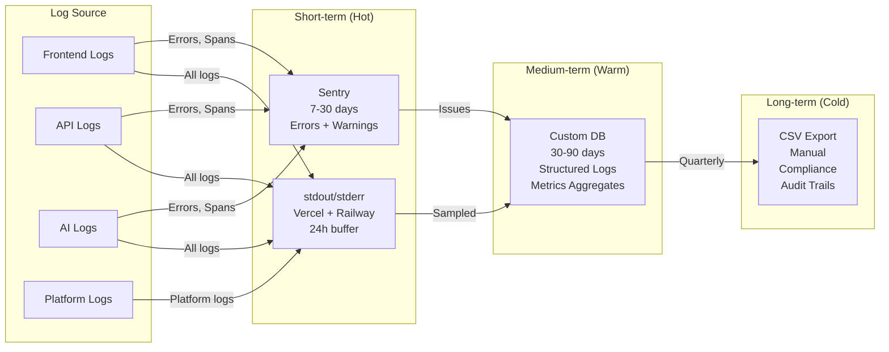
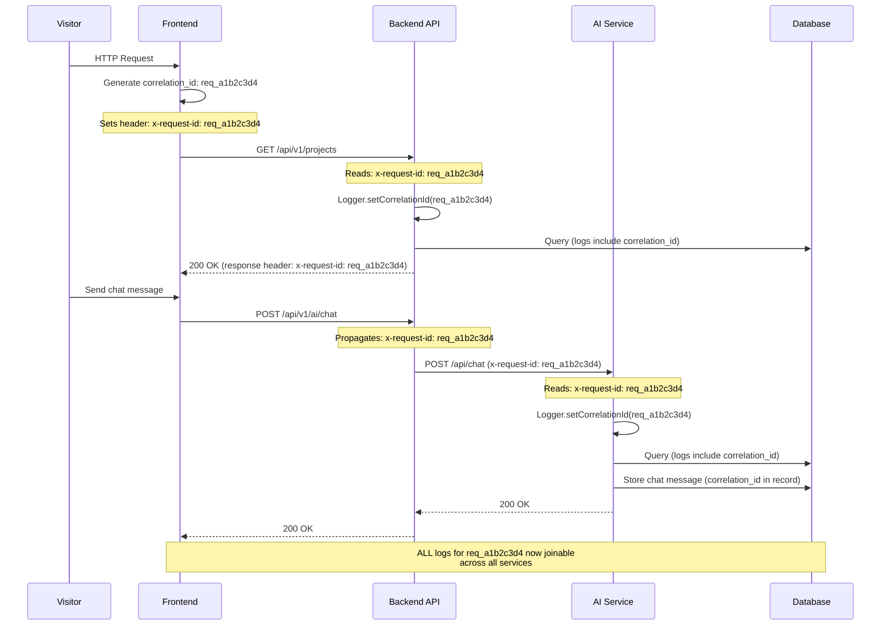
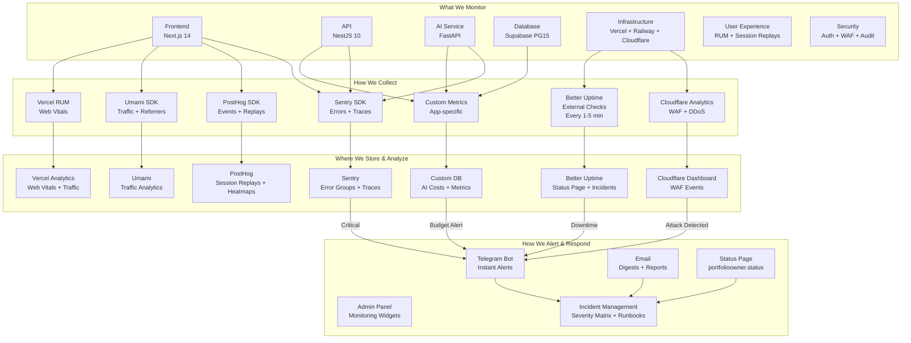
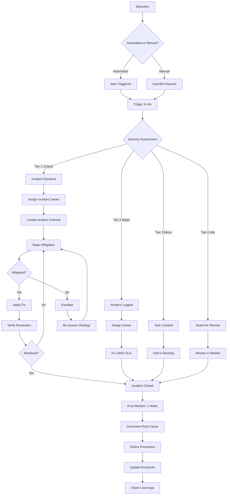

# Observability — Enterprise-Grade Logging, Metrics, Tracing, Monitoring, Alerting & Incident Management

> **Document:** `22-OBSERVABILITY.md` | **Version:** 5.0 | **Last Updated:** June 2026  
> **Status:** ✅ Active | **Owner:** DevOps Lead / SRE | **Review Cadence:** Monthly  
> **Classification:** Enterprise Architecture | **Observability Stack:** 5 tools | **Tracing Span Coverage:** 12 spans  
> **Log Volume:** ~10K/day | **Tracing Sample Rate:** 25% frontend / 10% backend

---

## Executive Summary

The observability stack provides holistic visibility across 3 services (Next.js frontend, NestJS API, FastAPI AI) through 5 pillars: structured logging, metrics, distributed tracing, monitoring, and alerting. It targets 99.5% uptime with 15-minute incident response SLAs, 30-day log retention, and automated root cause analysis. The architecture follows OpenTelemetry standards with vendor-neutral instrumentation and cost-optimized sampling (10% for debug spans, 100% for errors). 12 tracing spans cover the complete request lifecycle from CDN through database.

## Cross-References

| Reference                                    | Description                            |
| -------------------------------------------- | -------------------------------------- |
| `docs/21-operations/21-MONITORING.md`        | Monitoring dashboards and alert rules  |
| `docs/21-operations/DevOpsArchitecture.md`   | DevOps pipelines and incident response |
| `docs/21-operations/DeploymentGuide.md`      | Deployment observability integration   |
| `docs/11-security/SecurityArchitecture.md`   | Security monitoring and audit logging  |
| `docs/21-operations/55-DISASTER-RECOVERY.md` | Recovery procedures during incidents   |
| `docs/35-quality/PerformanceArchitecture.md` | Performance targets and benchmarks     |
| `docs/21-operations/56-SLA-SLO.md`           | Uptime SLAs and SLO definitions        |

---

## Table of Contents

0. [Executive Summary](#0-executive-summary)
1. [Logging](#1-logging)
2. [Metrics](#2-metrics)
3. [Tracing](#3-tracing)
4. [Monitoring](#4-monitoring)
5. [Alerting](#5-alerting)
6. [Incident Management](#6-incident-management)
7. [Service Level Objectives (SLOs)](#7-service-level-objectives-slos)
8. [Service Level Indicators (SLIs)](#8-service-level-indicators-slis)
9. [Runbooks](#9-runbooks)
10. [Escalation Policies](#10-escalation-policies)
11. [Root Cause Analysis](#11-root-cause-analysis)
12. [Recovery Strategy](#12-recovery-strategy)
13. [Enterprise Standards](#13-enterprise-standards)
14. [Change Log](#14-change-log)

---

## 1. Logging

### 1.1 Structured Logging Schema

All services emit logs in a **unified JSON schema** with required and optional fields:

```json
{
  "timestamp": "2026-06-15T10:30:00.123Z",
  "level": "info",
  "service": "api",
  "environment": "production",
  "correlation_id": "req_a1b2c3d4",
  "trace_id": "t_e5f6g7h8",
  "span_id": "s_i9j0k1l2",
  "message": "Lead created successfully",
  "logger": {
    "name": "LeadsService",
    "method": "createLead",
    "file": "leads.service.ts",
    "line": 42
  },
  "data": {
    "lead_id": "uuid-v4",
    "source": "contact_form",
    "duration_ms": 145
  },
  "error": null,
  "tags": {
    "feature": "leads",
    "version": "1.2.3"
  }
}
```

### 1.2 Required Fields (All Logs)

| Field            | Type                                    | Description                    | Validation              |
| ---------------- | --------------------------------------- | ------------------------------ | ----------------------- |
| `timestamp`      | ISO 8601 UTC                            | When the log was emitted       | Must be UTC             |
| `level`          | Enum: trace/debug/info/warn/error/fatal | Severity level                 | Must match enum         |
| `service`        | string                                  | Service name (fe/api/ai)       | Lowercase, no spaces    |
| `environment`    | string                                  | production/staging/development | Config-derived          |
| `correlation_id` | string                                  | Request correlation ID         | UUID v4 or req\_ prefix |
| `message`        | string                                  | Human-readable log message     | Max 200 chars           |

### 1.3 Optional but Recommended Fields

| Field           | Type   | Use Case                             |
| --------------- | ------ | ------------------------------------ |
| `trace_id`      | string | Distributed tracing parent ID        |
| `span_id`       | string | Current span ID                      |
| `data`          | object | Structured metadata (max 10KB)       |
| `error`         | object | Error details (message, stack, code) |
| `tags`          | object | Key-value metadata (max 10 pairs)    |
| `logger.name`   | string | Class/module that emitted log        |
| `logger.method` | string | Method/function that emitted log     |

### 1.4 Log Levels & Usage

| Level     | Color     | Purpose                                    | Examples                                    | Frequency | Alert?         |
| --------- | --------- | ------------------------------------------ | ------------------------------------------- | --------- | -------------- |
| **fatal** | Red       | Service cannot continue; process exiting   | DB connection failed, config invalid        | < 1/day   | Always         |
| **error** | Orange    | Request failed; error returned to user     | 500 response, validation error, API failure | < 50/day  | If > threshold |
| **warn**  | Yellow    | Degraded behavior, potential issue         | Slow query, rate limit near, fallback used  | < 100/day | If > threshold |
| **info**  | Blue      | Normal operation milestones                | Request start/end, lead created, deploy     | ~10K/day  | No             |
| **debug** | Gray      | Detailed debugging (off in production)     | Variable values, step logging               | Varies    | No             |
| **trace** | Dark gray | Step-by-step execution (off in production) | Function enter/exit, loop iterations        | Varies    | No             |

**Production logging policy:**

- `debug` and `trace` levels **disabled** in production
- `error` and `fatal` always sent to Sentry
- `warn` logged to file + dashboard
- `info` recorded but sampled in high-volume paths (10% sampling)
- Rate limit: max 100 logs/second per service (burst: 200/s)

### 1.5 Logging Implementation

#### Frontend (Next.js) — Structured Logging

```typescript
// apps/web/src/lib/logger.ts
type LogLevel = 'trace' | 'debug' | 'info' | 'warn' | 'error' | 'fatal';

interface LogEntry {
  timestamp: string;
  level: LogLevel;
  service: 'fe';
  environment: string;
  correlation_id: string;
  message: string;
  data?: Record<string, unknown>;
  error?: { message: string; stack?: string; code?: string };
  tags?: Record<string, string>;
}

class Logger {
  private service = 'fe' as const;
  private correlationId: string;

  constructor(correlationId?: string) {
    this.correlationId = correlationId || crypto.randomUUID();
  }

  private log(level: LogLevel, message: string, data?: Record<string, unknown>, error?: Error) {
    if (level === 'debug' || level === 'trace') {
      if (process.env.NODE_ENV === 'production') return;
    }

    const entry: LogEntry = {
      timestamp: new Date().toISOString(),
      level,
      service: this.service,
      environment: process.env.NODE_ENV || 'development',
      correlation_id: this.correlationId,
      message,
      data,
      error: error
        ? {
            message: error.message,
            stack: process.env.NODE_ENV !== 'production' ? error.stack : undefined,
            code: (error as any).code,
          }
        : undefined,
    };

    const output = JSON.stringify(entry);
    if (level === 'error' || level === 'fatal') {
      console.error(output);
    } else if (level === 'warn') {
      console.warn(output);
    } else {
      console.log(output);
    }

    if ((level === 'error' || level === 'fatal') && error) {
      Sentry.captureException(error, {
        tags: { correlation_id: this.correlationId },
        extra: { ...data },
      });
    }

    if (level === 'error' || level === 'warn' || Math.random() < 0.1) {
      this.storeLog(entry);
    }
  }

  info(message: string, data?: Record<string, unknown>) {
    this.log('info', message, data);
  }
  warn(message: string, data?: Record<string, unknown>) {
    this.log('warn', message, data);
  }
  error(message: string, error?: Error, data?: Record<string, unknown>) {
    this.log('error', message, data, error);
  }
  fatal(message: string, error?: Error, data?: Record<string, unknown>) {
    this.log('fatal', message, data, error);
  }

  private async storeLog(entry: LogEntry) {
    try {
      await fetch('/api/logs', {
        method: 'POST',
        headers: { 'Content-Type': 'application/json' },
        body: JSON.stringify({
          entries: [entry],
          api_key: process.env.NEXT_PUBLIC_LOG_API_KEY,
        }),
      });
    } catch {
      // Fail silently — logging should never break the app
    }
  }

  setCorrelationId(id: string) {
    this.correlationId = id;
  }
  getCorrelationId() {
    return this.correlationId;
  }
}

export const logger = new Logger();
```

#### Backend (NestJS) — Structured Logging

```typescript
// apps/api/src/common/logger.service.ts
import { Injectable, LoggerService } from '@nestjs/common';
import * as Sentry from '@sentry/node';

@Injectable()
export class StructuredLogger implements LoggerService {
  private correlationId: string;

  constructor(correlationId?: string) {
    this.correlationId = correlationId || 'no-correlation-id';
  }

  setCorrelationId(id: string) {
    this.correlationId = id;
  }

  private logEntry(level: string, message: string, context?: any, error?: Error) {
    const entry = {
      timestamp: new Date().toISOString(),
      level,
      service: 'api',
      environment: process.env.NODE_ENV,
      correlation_id: this.correlationId,
      message,
      data: context || undefined,
      error: error
        ? {
            message: error.message,
            stack: process.env.NODE_ENV !== 'production' ? error.stack : undefined,
          }
        : undefined,
      tags: {
        version: process.env.APP_VERSION || '1.0.0',
      },
    };

    const output = JSON.stringify(entry);
    if (level === 'error') {
      console.error(output);
      Sentry.captureException(error || new Error(message), {
        tags: { correlation_id: this.correlationId },
        extra: context,
      });
    } else if (level === 'warn') {
      console.warn(output);
    } else {
      console.log(output);
    }
  }

  log(message: string, context?: any) {
    this.logEntry('info', message, context);
  }
  warn(message: string, context?: any) {
    this.logEntry('warn', message, context);
  }
  error(message: string, error?: Error, context?: any) {
    this.logEntry('error', message, context, error);
  }
  debug(message: string, context?: any) {
    this.logEntry('debug', message, context);
  }
  verbose(message: string, context?: any) {
    this.logEntry('trace', message, context);
  }
}
```

#### AI Service (FastAPI) — Structured Logging

```python
# apps/ai/app/services/logger.py
import json
import logging
import os
import sentry_sdk
from datetime import datetime, timezone

class StructuredLogger:
    def __init__(self, correlation_id: str = "no-correlation-id"):
        self.correlation_id = correlation_id
        self.service = "ai"
        self.environment = os.getenv("NODE_ENV", "development")

    def _log(self, level: str, message: str, data: dict = None, error: Exception = None):
        entry = {
            "timestamp": datetime.now(timezone.utc).isoformat(),
            "level": level,
            "service": self.service,
            "environment": self.environment,
            "correlation_id": self.correlation_id,
            "message": message,
            "data": data or {},
            "error": {
                "message": str(error),
                "type": type(error).__name__,
            } if error else None,
        }

        output = json.dumps(entry)
        if level == "error":
            logging.error(output)
            sentry_sdk.capture_exception(error, {
                "tags": {"correlation_id": self.correlation_id},
                "extra": data,
            })
        elif level == "warn":
            logging.warning(output)
        else:
            logging.info(output)

    def info(self, message: str, data: dict = None):
        self._log("info", message, data)

    def warn(self, message: str, data: dict = None):
        self._log("warn", message, data)

    def error(self, message: str, error: Exception = None, data: dict = None):
        self._log("error", message, data, error)

logger = StructuredLogger()
```

### 1.6 Log Sinks & Storage Pipeline



### 1.7 Log Retention Policy

| Log Category            | Hot Storage              | Warm Storage        | Cold Storage | Deletion                  |
| ----------------------- | ------------------------ | ------------------- | ------------ | ------------------------- |
| **Error logs**          | Sentry (90 days)         | Custom DB (90 days) | N/A          | Auto-delete after 90 days |
| **Warning logs**        | Sentry (30 days)         | Custom DB (60 days) | N/A          | Auto-delete after 60 days |
| **Info logs (sampled)** | stdout (24h)             | Custom DB (30 days) | N/A          | Auto-delete after 30 days |
| **Debug/Trace logs**    | stdout (24h)             | Not stored          | N/A          | Not retained in prod      |
| **Audit logs**          | N/A                      | Custom DB (2 years) | CSV Archive  | Manual after 2 years      |
| **AI cost logs**        | N/A                      | Custom DB (1 year)  | CSV Archive  | Auto-delete after 1 year  |
| **API access logs**     | stdout (24h)             | Custom DB (90 days) | N/A          | Auto-delete after 90 days |
| **Platform logs**       | Vercel/Railway (7 days)  | N/A                 | N/A          | Provider retention        |
| **Build logs**          | GitHub Actions (90 days) | N/A                 | N/A          | GitHub retention          |

### 1.8 Log Storage Schema

```sql
-- Custom DB table for structured logs
CREATE TABLE structured_logs (
    id BIGSERIAL PRIMARY KEY,
    timestamp TIMESTAMPTZ NOT NULL DEFAULT NOW(),
    level VARCHAR(10) NOT NULL CHECK (level IN ('trace', 'debug', 'info', 'warn', 'error', 'fatal')),
    service VARCHAR(10) NOT NULL CHECK (service IN ('fe', 'api', 'ai')),
    environment VARCHAR(20) NOT NULL DEFAULT 'production',
    correlation_id VARCHAR(20) NOT NULL,
    trace_id VARCHAR(32),
    span_id VARCHAR(16),
    message TEXT NOT NULL,
    data JSONB DEFAULT '{}',
    error JSONB DEFAULT NULL,
    tags JSONB DEFAULT '{}'
);

-- Partition by month for performance
CREATE TABLE structured_logs_2026_06 PARTITION OF structured_logs
    FOR VALUES FROM ('2026-06-01') TO ('2026-07-01');
CREATE TABLE structured_logs_2026_07 PARTITION OF structured_logs
    FOR VALUES FROM ('2026-07-01') TO ('2026-08-01');

-- Indexes for common queries
CREATE INDEX idx_logs_correlation_id ON structured_logs (correlation_id);
CREATE INDEX idx_logs_timestamp ON structured_logs (timestamp DESC);
CREATE INDEX idx_logs_level ON structured_logs (level);
CREATE INDEX idx_logs_service ON structured_logs (service);
CREATE INDEX idx_logs_error ON structured_logs ((error IS NOT NULL)) WHERE error IS NOT NULL;

-- Auto-cleanup function (runs daily)
CREATE OR REPLACE FUNCTION cleanup_structured_logs()
RETURNS void AS $$
BEGIN
    DELETE FROM structured_logs
    WHERE (level IN ('info') AND timestamp < NOW() - INTERVAL '30 days')
       OR (level IN ('warn') AND timestamp < NOW() - INTERVAL '60 days')
       OR (level IN ('error', 'fatal') AND timestamp < NOW() - INTERVAL '90 days');
END;
$$ LANGUAGE plpgsql;
```

### 1.9 PII Redaction & Sensitive Data Masking

```typescript
// Comprehensive redaction applied before any log output
const SENSITIVE_PATTERNS = [
  /\b[\w.+-]+@[\w-]+\.[\w.-]+\b/gi, // Emails
  /\b(?:\+?\d{1,3}[-.\s]?)?\(?\d{3}\)?[-.\s]?\d{3}[-.\s]?\d{4}\b/g, // Phones
  /\b(sk-[A-Za-z0-9]{20,}|pk-[A-Za-z0-9]{20,}|[A-Za-z0-9]{32,})\b/g, // API keys
  /\beyJ[A-Za-z0-9_-]{10,}\.[A-Za-z0-9_-]{10,}\.[A-Za-z0-9_-]{10,}\b/g, // JWTs
  /\b\d{1,3}\.\d{1,3}\.\d{1,3}\.\d{1,3}\b/g, // IPs
  /(Authorization|X-API-Key|Cookie):\s*[^\s,;]+/gi, // Auth headers
];

function sanitizeLogOutput(data: string): string {
  let sanitized = data;
  for (const pattern of SENSITIVE_PATTERNS) {
    sanitized = sanitized.replace(pattern, '[REDACTED]');
  }
  return sanitized;
}

// PII check before emission
function containsPII(data: any): boolean {
  const stringified = JSON.stringify(data).toLowerCase();
  const piiPatterns = [/\b[\w.+-]+@[\w-]+\.[\w.-]+\b/i, /\b\d{10}\b/];
  return piiPatterns.some((pattern) => pattern.test(stringified));
}
```

**PII Redaction Policy:**

| Concern            | Policy                              | Implementation                    | Enforcement                   |
| ------------------ | ----------------------------------- | --------------------------------- | ----------------------------- |
| **PII in logs**    | Never log email, phone, IP, name    | `redactLogData()` before output   | Code review + pre-commit hook |
| **PII in traces**  | Never in span attributes            | `beforeSendTransaction` filter    | Sentry config                 |
| **PII in replays** | Mask text inputs                    | Sentry Replay `maskAllText: true` | Sentry config                 |
| **PII in metrics** | Never use high-cardinality PII tags | Cardinality management rules      | Automated alert               |
| **Session data**   | Session replays retained 30 days    | PostHog data retention setting    | PostHog config                |

### 1.10 Log API Endpoint

```typescript
// POST /api/logs — Ingests logs from all services
@Post('/logs')
@Public()
async ingestLogs(@Body() body: { entries: LogEntry[]; api_key: string }) {
  if (body.api_key !== process.env.LOG_API_KEY) {
    throw new UnauthorizedException('Invalid API key');
  }

  const { data, error } = await supabase
    .from('structured_logs')
    .insert(body.entries.map(entry => ({
      timestamp: entry.timestamp,
      level: entry.level,
      service: entry.service,
      environment: entry.environment,
      correlation_id: entry.correlation_id,
      trace_id: entry.trace_id,
      span_id: entry.span_id,
      message: entry.message,
      data: entry.data || {},
      error: entry.error || null,
      tags: entry.tags || {},
    })));

  if (error) {
    Sentry.captureException(error);
    throw new InternalServerErrorException('Failed to ingest logs');
  }

  return { ingested: body.entries.length };
}
```

---

## 2. Metrics

### 2.1 Metric Types

| Metric Type   | Description                    | Examples                                      | Storage Format                      | Aggregation              |
| ------------- | ------------------------------ | --------------------------------------------- | ----------------------------------- | ------------------------ |
| **Counter**   | Monotonically increasing count | Request count, error count, lead count        | `{name, value, tags}`               | SUM over time window     |
| **Histogram** | Distribution of values         | Response time, token usage, query latency     | `{name, p50, p95, p99, count, sum}` | Quantile calculation     |
| **Gauge**     | Point-in-time value            | Active connections, memory usage, queue depth | `{name, value, tags}`               | Latest value             |
| **Rate**      | Events per time unit           | Requests/sec, errors/sec                      | `{name, rate, tags}`                | Rolling rate calculation |

### 2.2 Metric Naming Convention

```
{domain}.{service}.{metric}[.{submetric}]

Domain:     app | ai | api | db | infra | security | business
Service:    fe | api | ai | db | cloudflare | vercel | railway
Metric:     requests | errors | latency | connections | costs | uptime
Submetric:  total | rate | p50 | p95 | p99 | by_endpoint | by_model

Examples:
- app.fe.requests.total
- app.fe.requests.rate
- app.api.errors.total
- app.api.latency.p95
- ai.service.chat.latency.p99
- ai.service.cost.total
- db.postgres.connections.active
- db.postgres.queries.p95
- infra.cloudflare.waf.blocks
- security.auth.failures.rate
- business.leads.created.total
```

### 2.3 Core Metric Catalog

| Metric                           | Type      | Service        | Source        | Tags                          | Dashboard      |
| -------------------------------- | --------- | -------------- | ------------- | ----------------------------- | -------------- |
| `app.api.requests.total`         | Counter   | API            | Sentry        | endpoint, method, status      | Performance    |
| `app.api.latency.p95`            | Histogram | API            | Sentry        | endpoint                      | Performance    |
| `app.api.errors.total`           | Counter   | API            | Sentry        | endpoint, error_type          | Errors         |
| `app.fe.vitals.lcp`              | Histogram | Frontend       | Vercel        | page, device                  | Web Vitals     |
| `app.fe.vitals.cls`              | Histogram | Frontend       | Vercel        | page, device                  | Web Vitals     |
| `app.fe.vitals.inp`              | Histogram | Frontend       | Vercel        | page, device                  | Web Vitals     |
| `app.fe.sessions.active`         | Gauge     | Frontend       | PostHog       | —                             | UX             |
| `ai.service.cost.total`          | Counter   | AI             | Custom DB     | model, day                    | AI Cost        |
| `ai.service.chat.latency.p95`    | Histogram | AI             | Custom DB     | model, agent                  | AI Performance |
| `ai.service.requests.rate`       | Rate      | AI             | Custom DB     | model, endpoint               | AI Performance |
| `ai.service.fallback.total`      | Counter   | AI             | Custom DB     | primary_model, fallback_model | AI Reliability |
| `db.postgres.connections.active` | Gauge     | Database       | Custom DB     | —                             | Database       |
| `db.postgres.queries.p95`        | Histogram | Database       | Custom DB     | query_type                    | Database       |
| `db.postgres.storage.mb`         | Gauge     | Database       | Supabase      | —                             | Database       |
| `infra.uptime.percentage`        | Gauge     | All            | Better Uptime | service                       | Infrastructure |
| `security.auth.failures.total`   | Counter   | API            | Sentry        | ip, method                    | Security       |
| `security.waf.blocks.total`      | Counter   | Infrastructure | Cloudflare    | rule, ip                      | Security       |
| `business.leads.created.total`   | Counter   | API            | Custom DB     | source                        | Business       |
| `business.sessions.total`        | Counter   | Frontend       | Umami         | source, device                | Business       |

### 2.4 Metrics Collection Pipeline

```typescript
// Custom metrics collection in NestJS
@Injectable()
export class MetricsCollector {
  private counters: Map<string, number> = new Map();
  private histograms: Map<string, number[]> = new Map();
  private flushInterval: NodeJS.Timer;

  constructor() {
    this.flushInterval = setInterval(() => this.flush(), 60_000);
  }

  incrementCounter(name: string, tags: Record<string, string> = {}, value = 1) {
    const key = `${name}|${JSON.stringify(tags)}`;
    this.counters.set(key, (this.counters.get(key) || 0) + value);
  }

  recordHistogram(name: string, value: number, tags: Record<string, string> = {}) {
    const key = `${name}|${JSON.stringify(tags)}`;
    if (!this.histograms.has(key)) {
      this.histograms.set(key, []);
    }
    this.histograms.get(key)!.push(value);
    if (this.histograms.get(key)!.length > 1000) {
      this.histograms.get(key)!.shift();
    }
  }

  async flush() {
    const batch = {
      timestamp: new Date().toISOString(),
      service: 'api',
      counters: Array.from(this.counters.entries()).map(([key, value]) => ({
        metric: key.split('|')[0],
        tags: JSON.parse(key.split('|')[1] || '{}'),
        value,
      })),
      histograms: Array.from(this.histograms.entries()).map(([key, values]) => {
        const sorted = [...values].sort((a, b) => a - b);
        return {
          metric: key.split('|')[0],
          tags: JSON.parse(key.split('|')[1] || '{}'),
          count: values.length,
          sum: values.reduce((a, b) => a + b, 0),
          min: sorted[0],
          p50: sorted[Math.floor(sorted.length * 0.5)],
          p95: sorted[Math.floor(sorted.length * 0.95)],
          p99: sorted[Math.floor(sorted.length * 0.99)],
          max: sorted[sorted.length - 1],
        };
      }),
    };

    await this.storeMetrics(batch);
    this.counters.clear();
    this.histograms.clear();
  }
}

// Usage in NestJS interceptor
@Injectable()
export class MetricsInterceptor implements NestInterceptor {
  constructor(private metrics: MetricsCollector) {}

  async intercept(context: ExecutionContext, next: CallHandler) {
    const request = context.switchToHttp().getRequest();
    const start = Date.now();
    const endpoint = `${request.method} ${request.route?.path}`;

    this.metrics.incrementCounter('app.api.requests.total', { endpoint });

    return next.handle().pipe(
      tap({
        next: () => {
          const duration = Date.now() - start;
          this.metrics.recordHistogram('app.api.latency', duration, { endpoint });
        },
        error: (err) => {
          const duration = Date.now() - start;
          this.metrics.incrementCounter('app.api.errors.total', { endpoint });
          this.metrics.recordHistogram('app.api.latency', duration, { endpoint });
        },
      }),
    );
  }
}
```

### 2.5 Cardinality Management

| Rule                        | Description                                             | Enforcement      |
| --------------------------- | ------------------------------------------------------- | ---------------- |
| **Tag limits**              | Max 10 tags per metric                                  | Code review gate |
| **Unique tag values**       | No more than 100 unique values per tag per day          | Automated alert  |
| **High-cardinality fields** | Never use user_id, email, IP, session_id as metric tags | Pre-commit hook  |
| **Endpoint granularity**    | Normalize paths: replace IDs with `:id`                 | API middleware   |
| **Tag naming**              | snake_case, no hyphens, max 32 chars                    | Linter rule      |

---

## 3. Tracing

### 3.1 Tracing Architecture

Every request through the portfolio platform is traced using **Sentry's distributed tracing**, which propagates trace context across all services. The trace is a **span tree** where each service adds its own spans as children.

```
┌─────────────────────────────────────────────────────────────────┐
│  TRACE: t_a1b2c3d4 (Full Request)                                │
│  ├── [fe] HTTP GET /                              1,800ms        │
│  │   ├── [fe] page_load                            1,800ms        │
│  │   ├── [fe] render_nav                              45ms        │
│  │   ├── [fe] render_hero                             60ms        │
│  │   ├── [fe] render_projects                         50ms        │
│  │   ├── [fe] api_call.projects                      120ms        │
│  │   │   ├── [api] HTTP GET /api/v1/projects         120ms        │
│  │   │   │   ├── [api] auth_check                     12ms        │
│  │   │   │   ├── [api] db.query.projects              45ms        │
│  │   │   │   └── [api] serialize_response              8ms        │
│  │   │   └── [fe] render_api_response                 15ms        │
│  │   ├── [fe] render_skills                            35ms        │
│  │   ├── [fe] render_contact                           30ms        │
│  │   ├── [fe] render_footer                            20ms        │
│  │   └── [fe] hydration_complete                      800ms        │
│  └── [fe] send_web_vitals                               5ms        │
└─────────────────────────────────────────────────────────────────┘
```

### 3.2 Span Types

| Span Type          | Naming Convention       | Example                    | Measurement             | Parent              |
| ------------------ | ----------------------- | -------------------------- | ----------------------- | ------------------- |
| **HTTP Server**    | `{method} {path}`       | `GET /api/v1/projects`     | Full request duration   | Root span           |
| **HTTP Client**    | `http.client.{service}` | `http.client.ai-service`   | Outbound request time   | Parent service span |
| **Database Query** | `db.{type}.{operation}` | `db.pgvector.search`       | Query execution time    | API span            |
| **LLM Call**       | `ai.llm.{model}`        | `ai.llm.gpt-4`             | LLM response time       | AI service span     |
| **RAG Retrieval**  | `ai.rag.{method}`       | `ai.rag.vector_search`     | Embedding + search time | AI service span     |
| **Cache**          | `cache.{action}`        | `cache.get` or `cache.set` | Cache operation time    | Service span        |
| **Auth**           | `auth.{action}`         | `auth.validate_jwt`        | Auth verification time  | API span            |
| **Render**         | `render.{component}`    | `render.projects_section`  | Component render time   | Frontend span       |
| **External API**   | `external.{service}`    | `external.sendgrid.send`   | External API call time  | Service span        |
| **Queue/Job**      | `job.{name}`            | `job.analytics_batch`      | Job processing time     | Worker span         |

### 3.3 Correlation IDs & Context Propagation

#### Correlation ID Format

```
req_{uuid_v4_short}
Example: req_a1b2c3d4e5f6
```

- **Prefix:** `req_` for human readability
- **Body:** First 12 hex characters of a UUID v4
- **Total length:** 16 characters (compact but collision-resistant)

#### Propagation Headers

| Header            | Description                 | Set By          | Propagated To | Required    |
| ----------------- | --------------------------- | --------------- | ------------- | ----------- |
| `x-request-id`    | Correlation ID              | Frontend or API | All services  | Always      |
| `sentry-trace`    | Sentry trace ID             | Sentry SDK      | All services  | Always      |
| `baggage`         | W3C baggage (trace context) | Sentry SDK      | All services  | Always      |
| `x-forwarded-for` | Original client IP          | CDN/Edge        | API, AI       | Recommended |
| `x-real-ip`       | Real client IP              | Vercel          | API, AI       | Recommended |

#### Correlation ID Flow



#### Backend Correlation ID Middleware (NestJS)

```typescript
@Injectable()
export class CorrelationIdMiddleware implements NestMiddleware {
  use(req: Request, res: Response, next: NextFunction) {
    const correlationId =
      (req.headers['x-request-id'] as string) || `req_${crypto.randomUUID().slice(0, 12)}`;

    req['correlationId'] = correlationId;
    res.setHeader('x-request-id', correlationId);
    logger.setCorrelationId(correlationId);

    next();
  }
}

export class AppModule {
  configure(consumer: MiddlewareConsumer) {
    consumer.apply(CorrelationIdMiddleware).forRoutes('*');
  }
}
```

#### AI Service Correlation ID Middleware (FastAPI)

```python
@app.middleware("http")
async def correlation_id_middleware(request: Request, call_next):
    correlation_id = request.headers.get("x-request-id")
    if not correlation_id:
        correlation_id = f"req_{uuid.uuid4().hex[:12]}"

    request.state.correlation_id = correlation_id
    response = await call_next(request)
    response.headers["x-request-id"] = correlation_id

    return response

def get_correlation_id() -> str:
    request = RequestContext.get()
    if request and hasattr(request.state, "correlation_id"):
        return request.state.correlation_id
    return "no-correlation-id"
```

### 3.4 Tracing Configuration

#### Frontend (Next.js) — Sentry Configuration

```typescript
// apps/web/src/lib/sentry.ts
import * as Sentry from '@sentry/nextjs';

Sentry.init({
  dsn: process.env.NEXT_PUBLIC_SENTRY_DSN,
  environment: process.env.NODE_ENV,
  tracesSampleRate: 0.25,
  profilesSampleRate: 0.1,
  replaysSessionSampleRate: 0.1,
  replaysOnErrorSampleRate: 1.0,
  enabled: process.env.NODE_ENV === 'production',

  integrations: [
    Sentry.browserTracingIntegration({
      instrumentNavigation: true,
      instrumentPageload: true,
    }),
    Sentry.replayIntegration({
      maskAllText: true,
      blockAllMedia: false,
    }),
  ],

  tracePropagationTargets: [
    'https://api.portfolioowner.com',
    'https://ai.portfolioowner.com',
    /^https:\/\/.*\.portfolioowner\.com/,
  ],

  beforeSendTransaction(event) {
    if (event.request?.url) {
      event.request.url = event.request.url.replace(
        /\/api\/v1\/[^/]+\/([a-f0-9-]{36})/g,
        '/api/v1/:resource/:id',
      );
    }
    return event;
  },
});
```

#### Backend (NestJS) — Sentry Configuration

```typescript
// apps/api/src/main.ts
import * as Sentry from '@sentry/node';

Sentry.init({
  dsn: process.env.SENTRY_DSN,
  environment: process.env.NODE_ENV,
  tracesSampleRate: 0.1,
  enabled: process.env.NODE_ENV === 'production',
  integrations: [Sentry.httpIntegration({ tracing: true }), Sentry.expressIntegration()],
});

@Injectable()
export class TracingInterceptor implements NestInterceptor {
  async intercept(context: ExecutionContext, next: CallHandler) {
    const request = context.switchToHttp().getRequest();
    const transaction = Sentry.getCurrentHub()?.getScope()?.getTransaction();

    const span = transaction?.startChild({
      op: 'http.server',
      description: `${request.method} ${request.route?.path || request.url}`,
      data: {
        correlation_id: request.headers['x-request-id'],
      },
    });

    return next.handle().pipe(
      tap(() => span?.finish()),
      catchError((err) => {
        span?.setStatus('internal_error');
        span?.finish();
        throw err;
      }),
    );
  }
}
```

#### AI Service (FastAPI) — Sentry Configuration

```python
# apps/ai/app/main.py
import sentry_sdk
from sentry_sdk.integrations.fastapi import FastApiIntegration
from sentry_sdk.integrations.httpx import HttpxIntegration

sentry_sdk.init(
    dsn=os.getenv("SENTRY_DSN"),
    environment=os.getenv("NODE_ENV", "development"),
    traces_sample_rate=0.25,
    enabled=os.getenv("NODE_ENV") == "production",
    integrations=[
        FastApiIntegration(transaction_style="endpoint"),
        HttpxIntegration(),
    ],
)

# Custom span for LLM calls
from sentry_sdk import start_span

async def call_llm(model: str, messages: list, max_tokens: int = 1024):
    with start_span(
        op="ai.llm.call",
        description=f"LLM {model}",
    ) as span:
        span.set_tag("model", model)
        span.set_tag("max_tokens", max_tokens)
        span.set_data("message_count", len(messages))

        start_time = time.time()
        response = await openai_client.chat.completions.create(
            model=model, messages=messages, max_tokens=max_tokens,
        )
        duration_ms = (time.time() - start_time) * 1000

        span.set_tag("tokens_used", response.usage.total_tokens)
        span.set_tag("duration_ms", duration_ms)
        span.set_data("finish_reason", response.choices[0].finish_reason)

        return response
```

### 3.5 Trace Payloads & Sampling

| Service                | Sampling Rate | Reason                                           | Daily Trace Volume | Trace Budget    |
| ---------------------- | ------------- | ------------------------------------------------ | ------------------ | --------------- |
| **Frontend (Next.js)** | 25%           | User-facing, needs good coverage                 | ~400 traces/day    | 5K traces/month |
| **API (NestJS)**       | 10%           | Higher request volume; lower sampling sufficient | ~300 traces/day    | 3K traces/month |
| **AI (FastAPI)**       | 25%           | Lower volume, higher value per trace             | ~100 traces/day    | 3K traces/month |

**Dynamic sampling strategy:**

- **Always sample** errors, high-value endpoints, and AI requests
- **Downsample** static asset requests and health checks
- **Increase sampling** on suspected issues (error rate > 2%)
- **Decrease sampling** when approaching budget limits

```typescript
function shouldSample(request: any, baseRate: number): boolean {
  if (request.headers['x-sentry-error']) return true;
  if (request.route?.path?.includes('/ai/')) return 1.0;
  if (featureFlags.isIncidentMode()) return 1.0;
  if (request.route?.path === '/health') return Math.random() < 0.01;
  return Math.random() < baseRate;
}
```

### 3.6 OpenTelemetry Integration

While the portfolio platform does not run a full OpenTelemetry collector, all observability patterns are **OpenTelemetry-compatible**:

| OTel Concept                 | Our Implementation                                        | Status         |
| ---------------------------- | --------------------------------------------------------- | -------------- |
| **Trace API**                | Sentry SDK (`startSpan`, `startChild`)                    | Compatible     |
| **Span attributes**          | Sentry span tags/data                                     | Compatible     |
| **Span context propagation** | W3C Trace Context (`sentry-trace` + `baggage`)            | OTel compliant |
| **Resource attributes**      | Sentry tags (service, environment, version)               | Compatible     |
| **Log correlation**          | OpenTelemetry log correlation (trace_id, span_id in logs) | Active         |
| **Exporter**                 | Sentry transport (could be swapped to OTel exporter)      | Future         |
| **OTLP collector**           | Not deployed (low volume does not justify it)             | Planned        |

**W3C Trace Context:**

```
sentry-trace: {trace_id}-{span_id}-{sampled}
Example: sentry-trace: a1b2c3d4e5f6g7h8-i9j0k1l2m3n4o5p6-1

baggage: sentry-trace_id={trace_id},sentry-sample_rate=0.25
Example: baggage: sentry-trace_id=a1b2c3d4e5f6g7h8,sentry-sample_rate=0.25
```

**Future OTel Collector Integration (reference config):**

```yaml
# otel-collector-config.yaml (for future use)
receivers:
  otlp:
    protocols:
      grpc:
        endpoint: 0.0.0.0:4317
      http:
        endpoint: 0.0.0.0:4318

processors:
  batch:
    timeout: 10s
    send_batch_size: 100
  attributes:
    actions:
      - key: environment
        value: production
        action: upsert
  filter:
    error_mode: ignore
    traces:
      span:
        - 'attributes["http.target"] == "/health"'

exporters:
  sentry:
    dsn: ${SENTRY_DSN}
    environment: production

service:
  pipelines:
    traces:
      receivers: [otlp]
      processors: [filter, batch, attributes]
      exporters: [sentry]
    logs:
      receivers: [otlp]
      processors: [batch]
      exporters: [sentry]
```

### 3.7 Debugging Workflows

#### Scenario 1: "User reported an error"

```text
=== DEBUGGING WORKFLOW: USER-REPORTED ERROR ===

1. COLLECT CONTEXT
   □ Ask user for: page, action, time, browser/device, error screenshot
   □ Check Sentry for matching errors in that timeframe

2. FIND CORRELATION ID
   □ If user has browser console, look for x-request-id
   □ If contact form, lead record includes correlation_id
   □ If AI chat, message record includes correlation_id

3. FOLLOW THE TRACE
   □ Search Sentry traces by correlation_id
   □ Search structured_logs by correlation_id
   □ Review span tree for slow/deep/error spans

4. CHECK LOGS
   □ SELECT * FROM structured_logs WHERE correlation_id = 'req_abc123' ORDER BY timestamp;
   □ Look for error/warn level entries
   □ Identify failing service or component

5. REPRODUCE & FIX
   □ Reproduce in staging if possible
   □ Apply fix, deploy to staging, monitor for recurrence
```

#### Scenario 2: "API is slow"

```text
=== DEBUGGING WORKFLOW: API SLOW RESPONSES ===

1. CHECK SENTRY PERFORMANCE
   □ Open Sentry → Performance → Transactions
   □ Check p50, p95, p99 response times vs baseline (7 days)

2. IDENTIFY SLOW SPANS
   □ Open slowest transaction → review span tree
   □ Database query: slow? (check pg_stat_statements)
   □ External API: slow? (check third-party status)

3. CHECK DATABASE
   □ SELECT query, mean_exec_time FROM pg_stat_statements ORDER BY mean_exec_time DESC LIMIT 10;
   □ Check for missing indexes, table bloat

4. CHECK RESOURCES
   □ Supabase dashboard: CPU, memory, connections
   □ Vercel dashboard: function execution duration

5. APPLY FIX & VERIFY
   □ Add missing index, optimize query, increase cache TTL
   □ Monitor p95 improvement
```

#### Scenario 3: "AI chat is failing"

```text
=== DEBUGGING WORKFLOW: AI CHAT FAILURES ===

1. CHECK AI SERVICE HEALTH
   □ curl https://ai.portfolioowner.com/api/health
   □ Check Railway dashboard, Sentry for AI errors

2. CHECK LLM PROVIDER STATUS
   □ Check status.openai.com, status.anthropic.com

3. IDENTIFY FAILURE MODE
   □ Network error? Auth error? Rate limit? Model error? App bug?

4. CHECK RECENT CHANGES & COST
   □ Review recent deploys, config changes, daily cost

5. APPLY FIX
   □ Follow RB-003 AI Service Recovery runbook
   □ Verify fallback, monitor for 30 minutes post-recovery
```

---

## 4. Monitoring

### 4.1 Monitoring Architecture



### 4.2 Monitoring Domains

| Domain              | What We Monitor                                        | Tools                     | Owner         |
| ------------------- | ------------------------------------------------------ | ------------------------- | ------------- |
| **Application**     | JS errors, React errors, API failures, client crashes  | Sentry                    | Backend Lead  |
| **Infrastructure**  | Service uptime, resource usage, SSL expiry, CDN        | Better Uptime, Cloudflare | DevOps Lead   |
| **Performance**     | Core Web Vitals, API latency, bundle sizes, build perf | Vercel Analytics, Sentry  | Frontend Lead |
| **AI**              | LLM errors, RAG failures, cost, latency, fallback rate | Custom DB, Sentry         | AI Architect  |
| **Database**        | Connections, storage, query latency, bloat, backups    | Custom DB, Supabase       | Backend Lead  |
| **API**             | Endpoint latency, error patterns, rate limits          | Sentry, Better Uptime     | Backend Lead  |
| **Security**        | Auth failures, WAF events, CSP violations, audit       | Sentry, Cloudflare        | Security Lead |
| **User Experience** | Session replays, heatmaps, funnels, scroll depth       | PostHog, Umami            | Product Owner |

### 4.3 Infrastructure Monitoring

| Component              | Provider            | What We Monitor                       | Tool                    | Check Interval | Alert Severity |
| ---------------------- | ------------------- | ------------------------------------- | ----------------------- | -------------- | -------------- |
| **Frontend Hosting**   | Vercel              | Site availability, SSL, CDN status    | Better Uptime           | 1 min          | Critical       |
| **API Hosting**        | Vercel (Serverless) | /health endpoint, response time       | Better Uptime + Sentry  | 1 min          | Critical       |
| **AI Service Hosting** | Railway             | Container health, memory, CPU         | Railway + Better Uptime | 5 min          | Critical       |
| **Database**           | Supabase            | Connection count, storage, query perf | Supabase + Custom DB    | 5 min          | High           |
| **DNS**                | Cloudflare          | DNS resolution, DNSSEC                | Better Uptime           | 5 min          | Critical       |
| **CDN**                | Vercel Edge         | Cache hit rate, origin latency        | Vercel Analytics        | 15 min         | Medium         |
| **Email Service**      | Resend              | Delivery rate, bounce rate            | Resend Dashboard        | Daily          | Medium         |
| **CI/CD**              | GitHub Actions      | Build success rate, duration          | GitHub Actions          | Per push       | High           |

**Resource Thresholds:**

| Resource               | Provider | Warning           | Critical          | Action at Critical                   |
| ---------------------- | -------- | ----------------- | ----------------- | ------------------------------------ |
| Database storage       | Supabase | > 350MB (70%)     | > 450MB (90%)     | Archive old data, upgrade plan       |
| Database connections   | Supabase | > 12 (80%)        | > 14 (93%)        | Review connection pooling, kill idle |
| Railway memory         | Railway  | > 400MB (80%)     | > 480MB (95%)     | Increase memory, optimize code       |
| Railway CPU            | Railway  | > 70% (5 min avg) | > 90% (5 min avg) | Scale replicas, optimize queries     |
| Vercel bandwidth       | Vercel   | > 80GB (80%)      | > 95GB (95%)      | Optimize images, enable caching      |
| GitHub Actions minutes | GitHub   | > 1,600 (80%)     | > 1,800 (90%)     | Optimize workflows, reduce triggers  |

### 4.4 Health Check Endpoints

| Service  | Endpoint                                   | Expected Response                   | Check Interval | Tool          |
| -------- | ------------------------------------------ | ----------------------------------- | -------------- | ------------- |
| Frontend | `https://portfolioowner.com/api/health`    | `{ status: "ok" }`                  | 1 minute       | Better Uptime |
| API      | `https://api.portfolioowner.com/health`    | `{ status: "ok", db: "connected" }` | 1 minute       | Better Uptime |
| AI       | `https://ai.portfolioowner.com/api/health` | `{ status: "healthy" }`             | 5 minutes      | Better Uptime |

```yaml
# Better Uptime monitors configuration
monitors:
  - name: 'Portfolio Frontend'
    url: 'https://portfolioowner.com'
    check_interval: 60
    regions: ['us-east', 'eu-west', 'ap-southeast']
    expected_status: 200
    ssl_expiry_threshold: 30
    alerts:
      - type: 'telegram'
      - type: 'email'

  - name: 'NestJS API Health'
    url: 'https://api.portfolioowner.com/health'
    check_interval: 60
    regions: ['us-east', 'eu-west']
    expected_status: 200
    alerts:
      - type: 'telegram'
      - type: 'email'

  - name: 'FastAPI AI Health'
    url: 'https://ai.portfolioowner.com/api/health'
    check_interval: 300
    regions: ['us-east']
    expected_body_contains: '"status": "healthy"'
    alerts:
      - type: 'telegram'
      - type: 'email'
```

### 4.5 Dashboard Inventory

| Dashboard                 | Location                           | Owner         | Refresh Rate | Purpose                            |
| ------------------------- | ---------------------------------- | ------------- | ------------ | ---------------------------------- |
| **Infrastructure Health** | `/admin/monitoring/infrastructure` | DevOps Lead   | 30s          | Service uptime, resource usage     |
| **Performance**           | `/admin/monitoring/performance`    | Frontend Lead | 1 min        | CWV, API latency, bundle sizes     |
| **AI Monitoring**         | `/admin/monitoring/ai`             | AI Architect  | 1 min        | Chat metrics, costs, RAG quality   |
| **Database**              | `/admin/monitoring/database`       | Backend Lead  | 5 min        | Connections, storage, query perf   |
| **Security**              | `/admin/monitoring/security`       | Security Lead | Real-time    | Auth failures, WAF events, audit   |
| **User Experience**       | `/admin/monitoring/ux`             | Product Owner | 5 min        | Session replays, heatmaps, funnels |
| **SLO Dashboard**         | `/admin/monitoring/slos`           | DevOps Lead   | 1 hour       | SLO compliance, error budgets      |
| **Alert History**         | `/admin/monitoring/alerts`         | DevOps Lead   | Real-time    | Alert timeline, resolved incidents |

### 4.6 UI States & Widget Behavior

Every monitoring widget across every dashboard has exactly 6 possible states:

| State        | Trigger         | Duration          | UI Pattern                   | Accessibility             |
| ------------ | --------------- | ----------------- | ---------------------------- | ------------------------- |
| **Loaded**   | Data received   | Until action      | Normal render                | Announce "Content loaded" |
| **Empty**    | Zero results    | Until data exists | Illustration + message + CTA | Announce "No data"        |
| **Loading**  | Fetch initiated | < 2s expected     | Skeleton/pulse               | aria-busy="true"          |
| **Error**    | Request failed  | Until retry       | Error card + retry           | role="alert"              |
| **Offline**  | Network down    | Until reconnect   | Offline banner               | role="alert"              |
| **Realtime** | Live update     | Momentary         | Flash/green indicator        | aria-live="polite"        |

**Monitoring Widget States:**

| Widget                | Loaded                         | Empty                    | Loading        | Error                 | Offline          | Realtime               |
| --------------------- | ------------------------------ | ------------------------ | -------------- | --------------------- | ---------------- | ---------------------- |
| Infrastructure Health | 4 service cards with green/red | "No services configured" | Pulse cards    | "Health check failed" | "Offline" badges | Status changes animate |
| Error Tracking        | Error count + list             | "No errors in period"    | Skeleton chart | "Sentry unavailable"  | Cached count     | New error banner       |
| Uptime History        | 30-day graph                   | "No uptime data"         | Skeleton graph | "Uptime API error"    | Last known graph | N/A                    |

### 4.7 Monitoring Ownership Model

| Monitoring Domain             | Owner         | Review Cadence | Tools Owned                    |
| ----------------------------- | ------------- | -------------- | ------------------------------ |
| **Application Monitoring**    | Backend Lead  | Weekly         | Sentry                         |
| **Infrastructure Monitoring** | DevOps Lead   | Weekly         | Better Uptime, Cloudflare      |
| **Performance Monitoring**    | Frontend Lead | Monthly        | Vercel Analytics, Sentry       |
| **AI Monitoring**             | AI Architect  | Daily          | Custom DB, Sentry              |
| **Database Monitoring**       | Backend Lead  | Weekly         | Custom DB, Supabase Dashboard  |
| **API Monitoring**            | Backend Lead  | Weekly         | Sentry, Better Uptime          |
| **Security Monitoring**       | Security Lead | Daily          | Sentry, Cloudflare, Audit Logs |
| **UX Monitoring**             | Product Owner | Monthly        | PostHog, Umami                 |
| **SLO Compliance**            | DevOps Lead   | Monthly        | All Tools                      |

---

## 5. Alerting

### 5.1 Alert Severity Matrix

| Severity     | Definition                                                 | Response Time | Notification Channel   | Escalation                |
| ------------ | ---------------------------------------------------------- | ------------- | ---------------------- | ------------------------- |
| **Critical** | Service down, data loss, security breach                   | < 15 min      | Telegram + SMS + Email | Owner + All team          |
| **High**     | Feature degraded, potential data exposure, high error rate | < 1 hour      | Telegram + Email       | Owner                     |
| **Medium**   | Non-critical feature broken, performance regression        | < 1 day       | Email + Dashboard      | Owner (next business day) |
| **Low**      | Cosmetic, informational, usage milestone                   | < 1 week      | Dashboard              | None                      |

### 5.2 Complete Alert Rules Catalog

| Alert ID    | Rule Name                      | SLI/SLO | Threshold               | Duration    | Severity | Auto-Remediation          | Runbook |
| ----------- | ------------------------------ | ------- | ----------------------- | ----------- | -------- | ------------------------- | ------- |
| **ALR-001** | Frontend Down                  | SLI-001 | 5xx on health check     | 1 min       | Critical | Auto-restart Vercel       | RB-001  |
| **ALR-002** | API Down                       | SLI-002 | Non-200 on /health      | 1 min       | Critical | Auto-restart Vercel       | RB-002  |
| **ALR-003** | AI Service Down                | SLI-003 | Non-200 on /api/health  | 1 min       | Critical | Trigger fallback model    | RB-003  |
| **ALR-004** | SSL Expiring                   | —       | Certificate < 30 days   | Daily check | High     | Auto-renewal              | RB-004  |
| **ALR-005** | High Error Rate                | SLI-007 | Error rate > 5%         | 5 min       | Critical | Investigate Sentry        | RB-005  |
| **ALR-006** | Slow API Response              | SLI-005 | p95 > 500ms             | 5 min       | High     | Check Sentry traces       | RB-006  |
| **ALR-007** | Slow AI Response               | SLI-006 | p95 > 5s                | 5 min       | High     | Check model availability  | RB-007  |
| **ALR-008** | Database Connection Exhaustion | SLI-008 | Connections > 80%       | Instant     | High     | Kill idle connections     | RB-008  |
| **ALR-009** | Database Storage High          | —       | Storage > 80%           | Instant     | High     | Archive old data          | RB-009  |
| **ALR-010** | AI Cost Spike                  | SLI-010 | Daily cost > $0.50      | Instant     | High     | Check for abuse           | RB-010  |
| **ALR-011** | AI Budget Exceeded             | SLI-010 | Monthly cost > $10      | Instant     | Critical | Disable AI chat           | RB-011  |
| **ALR-012** | Auth Failure Spike             | SLI-015 | > 5 failures/15min      | Instant     | High     | Check for brute force     | RB-012  |
| **ALR-013** | DDoS Detected                  | —       | Traffic > 5x normal     | Instant     | Critical | Enable Under Attack mode  | RB-013  |
| **ALR-014** | Build Failure                  | SLI-012 | Build failed            | Instant     | High     | Fix build                 | RB-014  |
| **ALR-015** | Cache Hit Rate Drop            | SLI-013 | Cache hit < 20%         | 1 hour      | Medium   | Review cache config       | RB-015  |
| **ALR-016** | RAG Quality Drop               | SLI-014 | Avg similarity < 0.6    | 1 hour      | High     | Check knowledge base      | RB-016  |
| **ALR-017** | Rate Limit Spike               | —       | 429 responses > 100/day | 24h rolling | Medium   | Review rate limit config  | RB-017  |
| **ALR-018** | Fallback Rate High             | —       | Fallback > 10%          | 1 hour      | High     | Investigate primary model | RB-018  |
| **ALR-019** | Lead Response SLA Miss         | SLI-011 | No reply > 24h          | Per lead    | Medium   | Send reminder             | RB-019  |
| **ALR-020** | Pgvector Index Health          | —       | Index bloat > 20%       | Weekly      | Medium   | REINDEX                   | RB-020  |

### 5.3 Alert Routing Configuration

```yaml
# Alert routing rules
alert_routing:
  telegram:
    enabled: true
    bot_token: '${TELEGRAM_BOT_TOKEN}'
    chat_id: '${TELEGRAM_CHAT_ID}'
    severities: ['critical', 'high']
    rate_limit: '5 messages per minute'

  email:
    enabled: true
    to: 'admin@portfolioowner.com'
    severities: ['critical', 'high', 'medium']
    digest: 'daily'

  sms:
    enabled: true
    to: '+12345678900'
    severities: ['critical']
    provider: 'Better Uptime'

  dashboard:
    enabled: true
    location: '/admin/alerts'
    severities: ['critical', 'high', 'medium', 'low']
    retention: '30 days'
```

### 5.4 Notification Channels

| Channel      | Delivery           | Controls                    | Frequency Cap  |
| ------------ | ------------------ | --------------------------- | -------------- |
| **In-App**   | Toast + feed badge | On/off per event type       | Unlimited      |
| **Email**    | Resend HTML email  | Daily digest or instant     | 20/day instant |
| **Telegram** | Bot API message    | On/off per severity         | 100/day        |
| **Push**     | PWA service worker | On/off (browser permission) | 50/day         |

### 5.5 Notification Catalog

#### Monitoring Events

| ID    | Event                   | Default Channel   | Priority | Template                               |
| ----- | ----------------------- | ----------------- | -------- | -------------------------------------- |
| N-030 | Service down            | Telegram + Email  | Critical | "{service} is DOWN - {details}"        |
| N-031 | Service recovered       | Telegram          | Medium   | "{service} recovered after {duration}" |
| N-032 | Error rate spike        | Telegram + Email  | Medium   | "Error rate {rate}% above threshold"   |
| N-033 | Performance degradation | In-app + Telegram | Medium   | "{metric} degraded: {value}"           |
| N-034 | SSL cert expiring       | Telegram + Email  | Critical | "SSL cert expires in {days} days"      |
| N-035 | Storage limit warning   | In-app            | Medium   | "Storage at {percent}%"                |

#### Security Events

| ID    | Event                        | Default Channel  | Priority | Template                               |
| ----- | ---------------------------- | ---------------- | -------- | -------------------------------------- |
| N-040 | Failed login attempt         | In-app           | Medium   | "Failed login from {ip}"               |
| N-041 | Account locked               | Telegram + Email | Critical | "Account locked - {attempts} attempts" |
| N-042 | Suspicious access            | Telegram + Email | Critical | "Suspicious admin access from {ip}"    |
| N-043 | New admin login (new device) | Telegram         | Medium   | "New login from {device}"              |
| N-044 | Rate limit triggered         | In-app           | Low      | "Rate limit hit on {endpoint}"         |

#### AI Events

| ID    | Event                     | Default Channel | Priority | Template                                     |
| ----- | ------------------------- | --------------- | -------- | -------------------------------------------- |
| N-050 | AI cost threshold reached | In-app          | Medium   | "AI costs reached ${amount} this month"      |
| N-051 | AI error rate high        | In-app          | Medium   | "AI error rate {rate}% above threshold"      |
| N-052 | Knowledge base updated    | In-app          | Low      | "Knowledge base updated with {count} chunks" |
| N-053 | AI suggested content      | In-app          | Low      | "AI suggests updating {type} '{title}'"      |

#### System Events

| ID    | Event                    | Default Channel   | Priority | Template                             |
| ----- | ------------------------ | ----------------- | -------- | ------------------------------------ |
| N-060 | Build failed             | Telegram          | Critical | "Build failed on {branch}"           |
| N-061 | Build succeeded          | In-app            | Normal   | "Build passed on {branch}"           |
| N-062 | Deployment complete      | In-app            | Normal   | "Deployed to {environment}"          |
| N-063 | Integration disconnected | In-app + Telegram | Medium   | "{integration} disconnected"         |
| N-064 | Backup completed         | In-app            | Low      | "Database backup completed ({size})" |

### 5.6 Notification Delivery Rules

| Rule                    | Description                                                            |
| ----------------------- | ---------------------------------------------------------------------- |
| **Deduplication**       | Same event type for same resource within 5 minutes → grouped           |
| **Cooldown**            | Per-rule cooldown prevents alert storms                                |
| **Priority Escalation** | If high-priority alert unacknowledged for 15min → escalate to Telegram |
| **Quiet Hours**         | Only critical alerts delivered during set hours (22:00–08:00)          |
| **Digest Mode**         | Non-critical events batched into daily/weekly digest emails            |
| **Throttle**            | Max 1 Telegram/minute, max 5 emails/hour, unlimited in-app             |

---

## 6. Incident Management

### 6.1 Incident Classification

| Tier       | Name              | Definition                                      | Examples                                  | Response Team          |
| ---------- | ----------------- | ----------------------------------------------- | ----------------------------------------- | ---------------------- |
| **Tier 1** | Critical Incident | Service unavailable, data loss, security breach | Site down, DB compromised, API key leaked | Full team              |
| **Tier 2** | Major Incident    | Feature degradation, performance issue          | Slow AI responses, contact form errors    | DevOps + relevant lead |
| **Tier 3** | Minor Incident    | Non-critical issue, cosmetic                    | Dashboard widgets stale, CSP violation    | Owner                  |
| **Tier 4** | Informational     | No user impact                                  | Usage milestone, budget warning           | Owner                  |

### 6.2 Incident Response Lifecycle



### 6.3 Incident Response Phases

```text
=== INCIDENT RESPONSE RUNBOOK ===
Applicable to: All Tier 1 (Critical) and Tier 2 (Major) incidents

PHASE 1: DETECTION & TRIAGE (0-5 minutes)
==========================================
□ 1.1 Confirm incident is not a false positive
□ 1.2 Determine severity (Tier 1-4)
□ 1.3 Assign incident owner (first available qualified team member)
□ 1.4 Create incident channel in Telegram: #incident-{timestamp}
□ 1.5 Notify team: @channel in incident channel

PHASE 2: CONTAINMENT (5-30 minutes)
=====================================
□ 2.1 Identify affected components
     - Frontend / API / AI / Database / Infrastructure
□ 2.2 Apply immediate containment
     - Tier 1: Enable maintenance mode if needed
     - Tier 1: Rotate credentials if breach
     - Tier 2: Feature flag disable
□ 2.3 Document initial findings in incident channel

PHASE 3: MITIGATION (30 minutes - 4 hours)
============================================
□ 3.1 Identify root cause
□ 3.2 Apply fix (code, config, infrastructure)
□ 3.3 Test fix in staging environment
□ 3.4 Deploy fix to production
□ 3.5 Verify fix resolves the incident

PHASE 4: RECOVERY (1-4 hours)
===============================
□ 4.1 Restore from backup if data loss occurred
□ 4.2 Verify all systems operational
□ 4.3 Monitor for recurrence (next 24 hours)
□ 4.4 Communicate resolution to stakeholders

PHASE 5: POST-MORTEM (within 1 week)
=======================================
□ 5.1 Document timeline of events
□ 5.2 Identify root cause and contributing factors (use 5 Whys)
□ 5.3 Define corrective actions (with owners and deadlines)
□ 5.4 Update monitoring/alerting to detect faster
□ 5.5 Update runbooks with lessons learned
□ 5.6 Share learnings with team
```

### 6.4 Incident Timeline Template

```markdown
# Incident Report: [INCIDENT TITLE]

## Summary

- **Incident ID:** INC-{YYYY}-{NNN}
- **Severity:** Tier {1-4}
- **Detected:** {timestamp}
- **Resolved:** {timestamp}
- **Duration:** {duration}
- **Impact:** {services affected, users affected, data affected}

## Timeline

| Time (UTC) | Event                            |
| ---------- | -------------------------------- |
| HH:MM      | Detection: {how it was detected} |
| HH:MM      | Triage: {severity assessment}    |
| HH:MM      | Containment: {action taken}      |
| HH:MM      | Mitigation: {fix applied}        |
| HH:MM      | Resolution: {verified fixed}     |
| HH:MM      | Monitoring: {observation period} |

## Root Cause

{detailed explanation of root cause}

## Contributing Factors

- Factor 1: {description}
- Factor 2: {description}

## Corrective Actions

| Action   | Owner   | Deadline | Status   |
| -------- | ------- | -------- | -------- |
| {action} | {owner} | {date}   | {status} |

## Lessons Learned

- Lesson 1: {what we learned}
- Lesson 2: {what we learned}

## Prevention

- {how we will prevent recurrence}
- {monitoring/alerting improvements}

## Attachments

- {link to Sentry issue}
- {link to deployment}
- {link to related PRs}
```

### 6.5 Communication Templates

| Event                 | Channel          | Template                         |
| --------------------- | ---------------- | -------------------------------- | -------------------- | ------------------------- | -------------------- |
| **Incident declared** | Telegram         | "🚨 _Incident Declared_: {title} | Severity: {tier}     | Impact: {services}        | Owner: {name}"       |
| **Status update**     | Incident channel | "🔄 _Update_: {phase}            | {action_taken}       | Time elapsed: {duration}" |
| **Resolution**        | Telegram + Email | "✅ _Resolved_: {title}          | Duration: {duration} | Root cause: {cause}       | Post-mortem: {link}" |
| **Weekly digest**     | Email            | "📊 _Weekly Incident Report_     | {count} incidents    | {critical} critical       | Top cause: {cause}"  |

---

## 7. Service Level Objectives (SLOs)

### 7.1 SLO Definitions

| SLO ID      | Service                 | SLI                 | Target     | Measurement Window | Calculation Method                              |
| ----------- | ----------------------- | ------------------- | ---------- | ------------------ | ----------------------------------------------- |
| **SLO-001** | Frontend Availability   | Uptime percentage   | 99.9%      | Rolling 30 days    | (Successful checks / Total checks) × 100        |
| **SLO-002** | API Availability        | Uptime percentage   | 99.9%      | Rolling 30 days    | (Successful health checks / Total checks) × 100 |
| **SLO-003** | AI Service Availability | Uptime percentage   | 99.5%      | Rolling 30 days    | (Successful health checks / Total checks) × 100 |
| **SLO-004** | Frontend Performance    | Page load (p95)     | < 500ms    | Rolling 7 days     | 95th percentile of page load times              |
| **SLO-005** | API Performance         | Response time (p95) | < 300ms    | Rolling 7 days     | 95th percentile of API response times           |
| **SLO-006** | AI Performance          | Chat response (p95) | < 3s       | Rolling 7 days     | 95th percentile of chat response times          |
| **SLO-007** | Error Rate              | Error percentage    | < 1%       | Rolling 24 hours   | (Error requests / Total requests) × 100         |
| **SLO-008** | Database Performance    | Query latency (p95) | < 50ms     | Rolling 7 days     | 95th percentile of query execution times        |
| **SLO-009** | API Error Rate          | API 5xx percentage  | < 0.1%     | Rolling 24 hours   | (5xx responses / Total responses) × 100         |
| **SLO-010** | AI Cost                 | Monthly spend       | < $10.00   | Rolling 30 days    | Sum of all AI costs for the month               |
| **SLO-011** | Lead Response           | Time to first reply | < 24 hours | Rolling 30 days    | Average time from lead creation to first reply  |
| **SLO-012** | Deployment Success      | Build success rate  | > 99%      | Rolling 30 days    | (Successful builds / Total builds) × 100        |

### 7.2 SLO Status Dashboard

```text
┌─────────────────────────────────────────────────────────────────┐
│ SERVICE LEVEL OBJECTIVES                       Updated: Hourly     │
├─────────────────────────────────────────────────────────────────┤
│ SLO ID │ Service          │ Target    │ Current   │ Status      │
│────────┼──────────────────┼───────────┼───────────┼─────────────│
│ SLO-01 │ Frontend Uptime  │ 99.9%     │ 99.98%    │ Meeting     │
│ SLO-02 │ API Uptime       │ 99.9%     │ 99.95%    │ Meeting     │
│ SLO-03 │ AI Uptime        │ 99.5%     │ 99.87%    │ Meeting     │
│ SLO-04 │ Frontend Perf    │ < 500ms   │ 245ms     │ Meeting     │
│ SLO-05 │ API Perf         │ < 300ms   │ 128ms     │ Meeting     │
│ SLO-06 │ AI Perf          │ < 3s      │ 2.1s      │ Meeting     │
│ SLO-07 │ Error Rate       │ < 1%      │ 0.3%      │ Meeting     │
│ SLO-08 │ DB Performance   │ < 50ms    │ 12ms      │ Meeting     │
│ SLO-09 │ API Error Rate   │ < 0.1%    │ 0.02%     │ Meeting     │
│ SLO-10 │ AI Cost          │ < $10     │ $3.45     │ Meeting     │
│ SLO-11 │ Lead Response    │ < 24h     │ 3.2h      │ Meeting     │
│ SLO-12 │ Deploy Success   │ > 99%     │ 100%      │ Meeting     │
│────────┼──────────────────┼───────────┼───────────┼─────────────│
│        │ OVERALL SLO      │           │ 100%      │ ALL MET     │
└─────────────────────────────────────────────────────────────────┘
```

### 7.3 SLO Compliance Monitoring

```python
# SLO compliance calculator (runs daily)
def calculate_slo_compliance():
    slos = {
        "SLO-001": {
            "service": "Frontend Availability",
            "target": 99.9,
            "current": calculate_uptime("frontend", 30),
            "measurement_window": "30 days",
        },
        "SLO-002": {
            "service": "API Availability",
            "target": 99.9,
            "current": calculate_uptime("api", 30),
            "measurement_window": "30 days",
        },
        # ... all 12 SLOs
    }

    report = {
        "overall_compliance": sum(
            1 for s in slos.values() if s["current"] >= s["target"]
        ) / len(slos) * 100,
        "slos": slos,
        "errors_budget_consumed": calculate_error_budget_consumption(),
        "generated_at": datetime.utcnow().isoformat(),
    }

    store_slo_report(report)

    for slo_id, slo in slos.items():
        remaining_budget = calculate_remaining_budget(slo_id)
        if remaining_budget < 20:
            send_alert("slo_at_risk", {
                "slo_id": slo_id,
                "service": slo["service"],
                "remaining_budget_pct": remaining_budget,
            })

    return report
```

### 7.4 Error Budgets

| SLO ID      | Service         | SLO Target | Error Budget (30 days) | Current Consumption  | Remaining     |
| ----------- | --------------- | ---------- | ---------------------- | -------------------- | ------------- |
| **SLO-001** | Frontend Uptime | 99.9%      | 43.2 minutes downtime  | 0.6 minutes (1.4%)   | 42.6 minutes  |
| **SLO-002** | API Uptime      | 99.9%      | 43.2 minutes downtime  | 2.2 minutes (5.1%)   | 41.0 minutes  |
| **SLO-003** | AI Uptime       | 99.5%      | 216 minutes downtime   | 8.6 minutes (4.0%)   | 207.4 minutes |
| **SLO-004** | Frontend Perf   | < 500ms    | 5% of slow pages       | 2.1% (42% used)      | 2.9%          |
| **SLO-005** | API Perf        | < 300ms    | 5% of slow requests    | 1.8% (36% used)      | 3.2%          |
| **SLO-006** | AI Perf         | < 3s       | 5% of slow responses   | 4.2% (84% used)      | 0.8%          |
| **SLO-007** | Error Rate      | < 1%       | 0.3% of error budget   | 0.1% (33% used)      | 0.2%          |
| **SLO-009** | API Error Rate  | < 0.1%     | 0.03% of error budget  | 0.008% (26% used)    | 0.022%        |
| **SLO-012** | Deploy Success  | > 99%      | 0.3 failed builds      | 0 failures (0% used) | 0.3 builds    |

### 7.5 Error Budget Policy

| Policy                    | Rule                                | Enforcement                                    | Exception Process       |
| ------------------------- | ----------------------------------- | ---------------------------------------------- | ----------------------- |
| **Deployment freeze**     | If error budget < 20% remaining     | Block production deploys except critical fixes | VP Engineering approval |
| **Accelerated deploys**   | If error budget > 80% remaining     | Allow multiple deploys per day                 | Automatic               |
| **SLO breach review**     | If SLO target missed for month      | Mandatory post-mortem within 1 week            | DevOps Lead review      |
| **Budget replenishment**  | Resets monthly (first day of month) | Automatic                                      | N/A                     |
| **Error budget tracking** | Tracked in SLO dashboard            | Real-time visibility                           | N/A                     |

```typescript
// Error budget enforcement for CI/CD
async function checkErrorBudgetBeforeDeploy(): Promise<boolean> {
  const errorBudgets = await getCurrentErrorBudgets();

  for (const [slo_id, budget] of Object.entries(errorBudgets)) {
    if (budget.remaining_percentage < 20) {
      logger.warn(
        `Deploy blocked: ${slo_id} has only ${budget.remaining_percentage}% error budget remaining`,
      );

      await sendTelegramAlert({
        type: 'deploy_blocked',
        slo_id,
        remaining: budget.remaining_percentage,
      });

      return false;
    }
  }

  return true;
}
```

---

## 8. Service Level Indicators (SLIs)

### 8.1 SLI Definitions

| SLI ID      | Name                | Definition                       | Measurement Method              | Data Source      | Unit         |
| ----------- | ------------------- | -------------------------------- | ------------------------------- | ---------------- | ------------ |
| **SLI-001** | Frontend Uptime     | % of time frontend is accessible | HTTP health check (200 OK)      | Better Uptime    | Percentage   |
| **SLI-002** | API Uptime          | % of time API responds           | GET /health returns 200         | Better Uptime    | Percentage   |
| **SLI-003** | AI Uptime           | % of time AI service responds    | GET /api/health returns healthy | Better Uptime    | Percentage   |
| **SLI-004** | Page Load Speed     | p95 page load time               | Browser RUM                     | Vercel Analytics | Milliseconds |
| **SLI-005** | API Response Time   | p95 API response time            | Server-side timing              | Sentry APM       | Milliseconds |
| **SLI-006** | AI Response Time    | p95 chat response time           | Server-side timing              | Custom DB        | Milliseconds |
| **SLI-007** | Request Error Rate  | % of requests with 5xx           | Error tracking                  | Sentry           | Percentage   |
| **SLI-008** | Database Query Time | p95 query execution time         | pg_stat_statements              | Custom DB        | Milliseconds |
| **SLI-009** | API Error Rate      | % of API responses with 5xx      | Status code tracking            | Sentry           | Percentage   |
| **SLI-010** | AI Cost             | Total monthly AI spend           | Cost tracking                   | Custom DB        | USD          |
| **SLI-011** | Lead Response Time  | Avg time to first reply          | Activity tracking               | Custom DB        | Hours        |
| **SLI-012** | Build Success Rate  | % successful builds              | CI/CD pipeline                  | GitHub Actions   | Percentage   |
| **SLI-013** | Cache Hit Rate      | % CDN cache hits                 | CDN analytics                   | Vercel Analytics | Percentage   |
| **SLI-014** | RAG Retrieval Speed | p95 vector search time           | Server-side timing              | Custom DB        | Milliseconds |
| **SLI-015** | Auth Response Time  | p95 auth request time            | Server-side timing              | Sentry APM       | Milliseconds |

### 8.2 SLI Collection Methodology

```typescript
// SLI data collection service
class SLICollector {
  async collectSLIs(): Promise<SLIReport> {
    const slis = {
      'SLI-001': await this.collectFrontendUptime(),
      'SLI-002': await this.collectAPIUptime(),
      'SLI-003': await this.collectAIUptime(),
      'SLI-004': await this.collectPageLoadSpeed(),
      'SLI-005': await this.collectAPIResponseTime(),
      'SLI-006': await this.collectAIResponseTime(),
      'SLI-007': await this.collectErrorRate(),
      'SLI-008': await this.collectDBQueryTime(),
      'SLI-009': await this.collectAPIErrorRate(),
      'SLI-010': await this.collectAICost(),
      'SLI-011': await this.collectLeadResponseTime(),
      'SLI-012': await this.collectBuildSuccessRate(),
      'SLI-013': await this.collectCacheHitRate(),
      'SLI-014': await this.collectRAGSpeed(),
      'SLI-015': await this.collectAuthSpeed(),
    };

    return {
      timestamp: new Date().toISOString(),
      slis,
      summary: this.generateSLISummary(slis),
    };
  }
}
```

### 8.3 SLI to SLO Mapping

| SLI ID            | Mapped SLO        | Relationship                                 |
| ----------------- | ----------------- | -------------------------------------------- |
| SLI-001 → SLI-003 | SLO-001 → SLO-003 | Uptime SLIs directly feed availability SLOs  |
| SLI-004 → SLI-006 | SLO-004 → SLO-006 | Performance SLIs feed performance SLOs       |
| SLI-007, SLI-009  | SLO-007, SLO-009  | Error rate SLIs feed error SLOs              |
| SLI-008           | SLO-008           | Database query time feeds DB performance SLO |
| SLI-010           | SLO-010           | AI cost SLI feeds cost SLO                   |
| SLI-011           | SLO-011           | Lead response SLI feeds business SLO         |
| SLI-012           | SLO-012           | Build success SLI feeds deploy SLO           |
| SLI-013 → SLI-015 | Supporting        | Infrastructure SLIs support multiple SLOs    |

---

## 9. Runbooks

### 9.1 Runbook Index

| Runbook ID | Title                          | Trigger                        | Estimated RTO | Complexity | Last Tested  |
| ---------- | ------------------------------ | ------------------------------ | ------------- | ---------- | ------------ |
| **RB-001** | Frontend Service Recovery      | Frontend down or returning 5xx | < 10 min      | Low        | Monthly      |
| **RB-002** | API Service Recovery           | API down or returning 5xx      | < 10 min      | Low        | Monthly      |
| **RB-003** | AI Service Recovery            | AI service unhealthy           | < 15 min      | Medium     | Monthly      |
| **RB-004** | SSL Certificate Renewal        | Certificate expiring < 30 days | < 1 hour      | Low        | Quarterly    |
| **RB-005** | High Error Rate Investigation  | Error rate > 5%                | < 1 hour      | Medium     | Monthly      |
| **RB-006** | API Performance Degradation    | p95 response > 500ms           | < 2 hours     | Medium     | Quarterly    |
| **RB-007** | AI Performance Degradation     | p95 chat > 5s                  | < 1 hour      | Medium     | Monthly      |
| **RB-008** | Database Connection Exhaustion | Connections > 80%              | < 30 min      | Medium     | Quarterly    |
| **RB-009** | Database Storage Full          | Storage > 90%                  | < 1 hour      | Low        | Quarterly    |
| **RB-010** | AI Cost Spike Response         | Daily cost > $0.50             | < 1 hour      | Low        | Monthly      |
| **RB-011** | AI Budget Exceeded             | Monthly cost > $10             | < 15 min      | Low        | Monthly      |
| **RB-012** | Brute Force Attack Response    | > 5 failed logins/15min        | < 30 min      | Medium     | Quarterly    |
| **RB-013** | DDoS Mitigation                | Traffic anomaly detected       | < 5 min       | Medium     | Quarterly    |
| **RB-014** | Build Failure Recovery         | CI/CD pipeline failed          | < 1 hour      | Medium     | Per incident |
| **RB-015** | Cache Miss Rate High           | Cache hit < 20%                | < 2 hours     | Low        | Quarterly    |
| **RB-016** | RAG Quality Degradation        | Avg similarity < 0.6           | < 2 hours     | Medium     | Quarterly    |
| **RB-017** | Rate Limit Abuse Response      | 429 responses spike            | < 1 hour      | Low        | Quarterly    |
| **RB-018** | Model Fallback Spike           | Fallback > 10%                 | < 1 hour      | Low        | Monthly      |
| **RB-019** | Lead Response SLA Miss         | No reply > 24h                 | Immediate     | Low        | Weekly       |
| **RB-020** | Database Backup Restore        | Data loss or corruption        | < 4 hours     | High       | Quarterly    |

### 9.2 Key Runbooks

#### RB-001: Frontend Service Recovery

```text
=== RUNBOOK RB-001: FRONTEND SERVICE RECOVERY ===

TRIGGER: Frontend returning 5xx or health check failing
RTO: < 10 minutes

STEP 1: VERIFY INCIDENT (30 seconds)
  □ Check https://portfolioowner.com in browser
  □ Check Better Uptime dashboard for frontend status
  □ Check Vercel dashboard for deployment status

STEP 2: CHECK RECENT CHANGES (2 minutes)
  □ Review recent deploys in Vercel dashboard
  □ Check GitHub for recent commits to main branch
  □ Review GitHub Actions for successful CI run

STEP 3: ATTEMPT IMMEDIATE FIX (5 minutes)
  □ If recent deploy caused issue:
    → Vercel Dashboard → Deployments → Last known good → Promote to Production
  □ If ISR cache issue:
    → Trigger revalidation: curl -X POST https://portfolioowner.com/api/revalidate
  □ If DNS/SSL issue:
    → Check Cloudflare dashboard → SSL/TLS → Verify Full (Strict)
    → Check Vercel domain settings

STEP 4: CHECK DEPENDENCIES (2 minutes)
  □ Check Supabase status: https://status.supabase.com
  □ Check Cloudflare status: https://www.cloudflarestatus.com
  □ Check Vercel status: https://www.vercel-status.com

STEP 5: ESCALATE IF NOT RESOLVED (within 10 minutes)
  □ Contact Vercel support (support@vercel.com)
  □ Notify team in #incident channel
  □ Post to status page: portfolioowner.statuspage.io

STEP 6: VERIFY RESOLUTION (2 minutes)
  □ Confirm 200 OK from health endpoint
  □ Confirm page loads correctly
  □ Monitor for 5 minutes post-recovery
```

#### RB-003: AI Service Recovery

```text
=== RUNBOOK RB-003: AI SERVICE RECOVERY ===

TRIGGER: AI service /api/health returns non-healthy status
RTO: < 15 minutes

STEP 1: CHECK SERVICE STATUS (30 seconds)
  □ curl https://ai.portfolioowner.com/api/health
  □ Check Railway dashboard → AI service container status
  □ Check Sentry for recent AI errors

STEP 2: IDENTIFY FAILURE MODE (2 minutes)

  If OpenAI API issue:
    □ Check status.openai.com
    □ Automatic fallback to Anthropic should trigger within 30s
    □ Verify by sending test message via chat widget
    □ If both LLMs down → show offline message in chat widget

  If RAG/Database issue:
    □ Test pgvector: SELECT * FROM document_chunks LIMIT 1
    □ Rebuild index if corrupted:
      → REINDEX INDEX CONCURRENTLY idx_document_chunks_embedding;
    □ Check Supabase connection pooler if DB connection issue

  If Application crash:
    □ Restart Railway container: railway service restart
    □ Check logs: railway logs --service ai-service
    □ If OOM, increase memory in railway.toml

  If Rate limited:
    □ Wait for rate limit window (usually 1 minute)
    □ Check OpenAI dashboard → Usage → Rate limits
    □ Reduce MAX_TOKENS or increase caching

STEP 3: APPLY FIX (5 minutes)
  □ Follow the recovery procedure for the identified failure mode
  □ Verify fix in staging

STEP 4: VERIFY RECOVERY (2 minutes)
  □ Send test chat message
  □ Verify SSE streaming works
  □ Check health endpoint returns "healthy"
  □ Check Sentry for no new errors

STEP 5: DOCUMENT INCIDENT (5 minutes)
  □ Record in incident log:
    - Timestamp of detection and resolution
    - Root cause, actions taken, prevention measures
```

#### RB-005: High Error Rate Investigation

```text
=== RUNBOOK RB-005: HIGH ERROR RATE INVESTIGATION ===

TRIGGER: Error rate exceeds 5% threshold
RTO: < 1 hour

STEP 1: IDENTIFY ERROR SOURCE (2 minutes)
  □ Open Sentry dashboard → Issues tab
  □ Sort by "Events" (most frequent)
  □ Identify top 3 error groups
  □ Check if errors are frontend, API, or AI

STEP 2: CHECK FOR PATTERNS (3 minutes)
  □ Browser-specific? (Chrome/Safari/Firefox)
  □ Version-specific? (recent deploy?)
  □ Geography-specific? (certain region?)
  □ Time-specific? (recent spike?)

STEP 3: ANALYZE ROOT CAUSE (10 minutes)
  □ Open each top error group in Sentry
  □ Review stack traces, check affected users/count
  □ Review breadcrumbs for context
  □ Check if it's a known issue

STEP 4: APPLY FIX (varies)
  □ If frontend JS error: Create fix PR → deploy
  □ If API error: Check recent changes → rollback if needed → fix
  □ If third-party dependency: Check vendor status → implement fallback

STEP 5: MONITOR (30 minutes)
  □ Verify error rate drops below threshold
  □ Monitor Sentry for recurrence
  □ Close incident when stable

STEP 6: POST-INCIDENT (within 1 week)
  □ Create Sentry issue if not already tracked
  □ Add regression test if applicable
  □ Update monitoring if detection could be faster
```

#### RB-008: Database Connection Exhaustion

```text
=== RUNBOOK RB-008: DATABASE CONNECTION EXHAUSTION ===

TRIGGER: Database connections > 80% (12 of 15)
RTO: < 30 minutes

STEP 1: ASSESS CURRENT STATE (1 minute)
  □ Check Supabase dashboard → Database → Connections
  □ Run: SELECT count(*) FROM pg_stat_activity WHERE state = 'active';
  □ Check for long-running queries:
    → SELECT pid, now() - pg_stat_activity.query_start AS duration, query
      FROM pg_stat_activity
      WHERE state = 'active'
      ORDER BY duration DESC
      LIMIT 10;

STEP 2: KILL IDLE CONNECTIONS (2 minutes)
  □ Kill idle connections:
    → SELECT pg_terminate_backend(pid)
      FROM pg_stat_activity
      WHERE state = 'idle'
      AND pid <> pg_backend_pid();

  □ Kill long-running queries (> 5 minutes):
    → SELECT pg_terminate_backend(pid)
      FROM pg_stat_activity
      WHERE state = 'active'
      AND now() - query_start > INTERVAL '5 minutes'
      AND query NOT LIKE '%pg_stat_activity%';

STEP 3: IDENTIFY ROOT CAUSE (10 minutes)
  □ Check for connection leaks in application code
  □ Verify Supabase client is instantiated once (singleton pattern)
  □ Check for recent code changes that may have introduced leaks

STEP 4: APPLY PREVENTIVE MEASURES (10 minutes)
  □ Add connection pooling if not already configured
  □ Reduce Supabase client timeouts
  □ Add connection monitoring alert if not already set

STEP 5: MONITOR (30 minutes)
  □ Watch connection count for recovery
  □ Verify no new connections are leaking
  □ Close incident when connections stable below 80%
```

### 9.3 Runbook Testing Schedule

| Frequency        | Runbooks                                                                               | Owner       |
| ---------------- | -------------------------------------------------------------------------------------- | ----------- |
| **Weekly**       | RB-019 (Lead Response)                                                                 | Owner       |
| **Monthly**      | RB-001, RB-002, RB-003, RB-005, RB-007, RB-010, RB-011, RB-018                         | DevOps Lead |
| **Quarterly**    | RB-004, RB-006, RB-008, RB-009, RB-012, RB-013, RB-014, RB-015, RB-016, RB-017, RB-020 | DevOps Lead |
| **Per incident** | RB-014 (Build Failure)                                                                 | DevOps Lead |

---

## 10. Escalation Policies

### 10.1 Alert Escalation Matrix

| Alert ID | Alert                     | First Responder | Response Time  | Escalation 1   | Escalation 2   | Final Escalation   |
| -------- | ------------------------- | --------------- | -------------- | -------------- | -------------- | ------------------ |
| ALR-001  | Frontend down             | DevOps Lead     | 15 min         | 30 min: Owner  | 1 hr: All team | Vendor support     |
| ALR-002  | API down                  | Backend Lead    | 15 min         | 30 min: DevOps | 1 hr: Owner    | Vendor support     |
| ALR-003  | AI service down           | AI Architect    | 15 min         | 30 min: DevOps | 1 hr: Owner    | Railway support    |
| ALR-004  | SSL expiry                | DevOps Lead     | 7 days (email) | 1 day (SMS)    | —              | Certificate issuer |
| ALR-005  | High error rate           | Backend Lead    | 30 min         | 1 hr: DevOps   | 2 hr: Owner    | Sentry support     |
| ALR-006  | Slow API response         | Backend Lead    | 1 hour         | 2 hr: DevOps   | 4 hr: Owner    | —                  |
| ALR-007  | Slow AI response          | AI Architect    | 1 hour         | 2 hr: DevOps   | 4 hr: Owner    | Provider support   |
| ALR-008  | Database connections high | Backend Lead    | 30 min         | 1 hr: DevOps   | 2 hr: Owner    | Supabase support   |
| ALR-009  | Database storage high     | DevOps Lead     | 1 hour         | 4 hr: Owner    | —              | Supabase support   |
| ALR-010  | AI cost spike             | Owner           | 1 hour         | 4 hr: DevOps   | —              | OpenAI support     |
| ALR-011  | AI budget exceeded        | Owner           | 15 min         | 30 min: DevOps | —              | Disable AI chat    |
| ALR-012  | Auth failure spike        | Security Lead   | 15 min         | 30 min: Owner  | 1 hr: All team | —                  |
| ALR-013  | DDoS detected             | Security Lead   | 5 min          | 15 min: DevOps | 30 min: Owner  | Cloudflare support |
| ALR-014  | Build failure             | DevOps Lead     | 1 hour         | 4 hr: Owner    | —              | —                  |
| ALR-015  | Cache hit rate drop       | DevOps Lead     | 1 day          | —              | —              | —                  |
| ALR-016  | RAG quality drop          | AI Architect    | 2 hours        | 4 hr: DevOps   | —              | —                  |
| ALR-017  | Rate limit spike          | DevOps Lead     | 1 day          | —              | —              | —                  |
| ALR-018  | Model fallback high       | AI Architect    | 2 hours        | 4 hr: DevOps   | —              | Provider support   |
| ALR-019  | Lead response SLA miss    | Owner           | 1 hour         | 4 hr: Admin    | —              | —                  |
| ALR-020  | Pgvector index bloat      | Backend Lead    | 1 day          | —              | —              | —                  |

### 10.2 On-Call Responsibilities

| Role                  | Responsibility                            | Coverage         | Response Time SLA                 |
| --------------------- | ----------------------------------------- | ---------------- | --------------------------------- |
| **Primary on-call**   | First responder for all alerts            | 24/7             | 15 min (critical), 1 hour (high)  |
| **Secondary on-call** | Backup for primary; handles escalations   | 24/7             | 30 min (critical), 2 hours (high) |
| **DevOps Lead**       | Final escalation point; runbook ownership | Business hours   | 1 hour (critical)                 |
| **Architecture Lead** | System-level decisions during incidents   | On-call rotation | 1 hour (critical)                 |

### 10.3 Escalation Timeframes

| Severity     | First Response | First Escalation | Second Escalation | Final           |
| ------------ | -------------- | ---------------- | ----------------- | --------------- |
| **Critical** | < 15 min       | 15 min → 30 min  | 30 min → 1 hour   | 1 hour → Vendor |
| **High**     | < 1 hour       | 1 hour → 2 hours | 2 hours → 4 hours | 4 hours → Owner |
| **Medium**   | < 1 day        | 1 day → 2 days   | 2 days → EOW      | —               |
| **Low**      | < 1 week       | 1 week → 2 weeks | —                 | —               |

### 10.4 Communication Protocols

| Scenario              | Channel             | Message                                              | Frequency     |
| --------------------- | ------------------- | ---------------------------------------------------- | ------------- |
| **Incident declared** | Telegram #incidents | Alert ID, severity, affected service, assigned owner | Immediate     |
| **Status update**     | Incident thread     | Current phase, actions taken, ETA if known           | Every 30 min  |
| **Resolution**        | Telegram + Email    | Root cause, fix applied, verification steps          | Immediate     |
| **Escalation notice** | Telegram @team      | Escalation level, reason, next responder             | On escalation |
| **Post-mortem ready** | Email + Slack       | Link to document, review meeting invite              | Within 1 week |

---

## 11. Root Cause Analysis

### 11.1 RCA Process

Root Cause Analysis follows the **5 Whys** methodology and is mandatory for all Tier 1 and Tier 2 incidents. The process includes five phases conducted within 1 week of incident resolution.

| Phase                            | Activity                                                       | Owner                 | Timeline |
| -------------------------------- | -------------------------------------------------------------- | --------------------- | -------- |
| **1. Timeline Reconstruction**   | Document exact sequence of events from detection to resolution | Incident Owner        | Day 1    |
| **2. Causal Analysis**           | Apply 5 Whys to identify root cause and contributing factors   | Incident Owner + Team | Day 2    |
| **3. Action Planning**           | Define corrective actions with owners and deadlines            | Incident Owner        | Day 3    |
| **4. Review & Approval**         | Present findings to team; validate action plan                 | DevOps Lead           | Day 5    |
| **5. Implementation & Tracking** | Execute corrective actions; update runbooks and monitoring     | Assigned owners       | Day 7+   |

### 11.2 5 Whys Methodology

```text
=== 5 WHYS ANALYSIS TEMPLATE ===

Problem Statement: {what went wrong, who was affected, what was the impact}

Why 1: {immediate technical cause}
  → Because {reason}

Why 2: {deeper systemic cause}
  → Because {reason}

Why 3: {process/cultural cause}
  → Because {reason}

Why 4: {organizational cause}
  → Because {reason}

Why 5: {root cause}
  → {fundamental issue}

Corrective Actions:
1. {action to address root cause} → Owner: {name}, Deadline: {date}
2. {action to improve detection} → Owner: {name}, Deadline: {date}
3. {action to prevent recurrence} → Owner: {name}, Deadline: {date}
```

**Example: AI Service Downtime**

```
Problem Statement: AI chat was unavailable for 12 minutes due to rate limit errors

Why 1: OpenAI returned 429 rate limit errors
  → Because we exceeded the Tier 1 rate limit of 500 RPM

Why 2: The rate limit was not configured to match our plan
  → Because the RPM limit in our code was set to 600, not 500

Why 3: There was no monitoring on rate limit headroom
  → Because rate limit metrics were not included in our AI monitoring

Why 4: AI monitoring was defined before the service was production-ready
  → Because monitoring requirements were scoped without load testing data

Why 5: No load testing was performed before production launch
  → Root cause: Production readiness checklist was incomplete

Corrective Actions:
1. Correct RPM limit to match plan → Owner: AI Arch, Deadline: 1 day
2. Add rate limit monitoring to AI dashboard → Owner: DevOps, Deadline: 1 week
3. Complete production readiness checklist → Owner: DevOps, Deadline: 1 month
```

### 11.3 RCA Template

```markdown
# Root Cause Analysis: INC-{YYYY}-{NNN}

## Incident Overview

- **Title:** {incident title}
- **Date:** {date}
- **Severity:** Tier {1-4}
- **Duration:** {duration}
- **Impact:** {services, users, data affected}
- **Detection Method:** {automated alert / user report / manual}

## Timeline

| Time (UTC) | Event                  | Actor         |
| ---------- | ---------------------- | ------------- |
| HH:MM      | Detection              | {system/user} |
| HH:MM      | Triage                 | {engineer}    |
| HH:MM      | Containment            | {engineer}    |
| HH:MM      | Mitigation             | {engineer}    |
| HH:MM      | Resolution             | {engineer}    |
| HH:MM      | Monitoring period ends | {engineer}    |

## Root Cause Analysis (5 Whys)

| Level | Question                    | Answer                 |
| ----- | --------------------------- | ---------------------- |
| 1     | Why did the incident occur? | {immediate cause}      |
| 2     | Why did that happen?        | {systemic cause}       |
| 3     | Why was that the case?      | {process cause}        |
| 4     | Why was that missed?        | {organizational cause} |
| 5     | Why was that not addressed? | {root cause}           |

## Contributing Factors

1. {factor 1}
2. {factor 2}

## Corrective Actions

| #   | Action   | Owner  | Deadline | Status                | Evidence            |
| --- | -------- | ------ | -------- | --------------------- | ------------------- |
| 1   | {action} | {name} | {date}   | Open/In Progress/Done | {link to PR/config} |
| 2   | {action} | {name} | {date}   | Open/In Progress/Done | {link}              |

## Prevention Measures

- {monitoring improvement}
- {alerting improvement}
- {process improvement}
- {testing improvement}

## Attachments

- Sentry Issue: {link}
- Deploy Rollback: {link}
- Related PRs: {link}
- Incident Chat Log: {link}
```

### 11.4 Corrective Action Tracking

| Incident ID  | Date   | Root Cause                  | Corrective Actions                                                     | Owner           | Deadline | Status |
| ------------ | ------ | --------------------------- | ---------------------------------------------------------------------- | --------------- | -------- | ------ |
| INC-2026-001 | Jun 10 | Rate limit misconfiguration | 1. Correct RPM limit (done) 2. Add rate limit monitoring (in progress) | AI Arch, DevOps | Jun 17   | 50%    |
| —            | —      | —                           | —                                                                      | —               | —        | —      |

**Quarterly RCA Review:** DevOps Lead reviews all RCAs from previous quarter, identifies recurring patterns, and presents findings to the team with recommendations for systemic improvements.

---

## 12. Recovery Strategy

### 12.1 Disaster Recovery Overview

| Asset                 | Backup Frequency               | Retention  | Recovery RTO  | Recovery RPO |
| --------------------- | ------------------------------ | ---------- | ------------- | ------------ |
| PostgreSQL            | Daily (Supabase auto)          | 7 days     | 15 min (PITR) | 24 hours     |
| Media Assets          | Real-time (Supabase Storage)   | Indefinite | 5 min         | 0            |
| Environment Variables | In Vercel + Railway dashboards | Per-deploy | 5 min         | N/A          |
| Source Code           | Every push (GitHub)            | Indefinite | 10 min        | Per-commit   |

### 12.2 Service Restoration Procedures

```text
=== DISASTER RECOVERY PROCEDURE ===

APPLICABLE TO: Complete system failure, data corruption, security breach

PRE-REQUISITES:
  □ All secrets stored in Vercel/Railway environment variables (not code)
  □ Database backups configured (Supabase Point-in-Time Recovery)
  □ Rollback deployments available (Vercel auto-keeps last 10 deploys)
  □ Infrastructure as Code documented (Docker Compose, CI/CD configs)

RECOVERY STEPS:

1. FAILURE ASSESSMENT (5 minutes)
   □ Determine scope: Frontend / API / AI / Database / All
   □ Determine cause: Code / Infrastructure / Security / External
   □ Determine if data loss occurred

2. SERVICE RESTORATION (varies by component)

   For Frontend (Next.js) failure:
     □ Rollback Vercel deployment to last known good version
       → Vercel Dashboard → Deployments → Select version → Promote
     □ Estimated RTO: < 5 minutes

   For API (NestJS) failure:
     □ Rollback Vercel deployment to last known good version
     □ If serverless function issue:
       → Vercel Dashboard → Functions → Flush cache
     □ Estimated RTO: < 5 minutes

   For AI Service (FastAPI) failure:
     □ Rollback Railway deployment to last known good version
       → railway rollback
     □ If container issue:
       → railway service restart
     □ Estimated RTO: < 10 minutes

   For Database (Supabase) failure:
     □ Use Supabase Point-in-Time Recovery
       → Supabase Dashboard → Database → Backups → PITR
     □ If no PITR available:
       → Restore from latest backup dump
     □ Estimated RTO: < 1 hour (PITR) / < 4 hours (backup dump)

   For DNS (Cloudflare) failure:
     □ Verify DNS records in Cloudflare dashboard
     □ Confirm nameservers are correct
     □ Estimated RTO: < 15 minutes (TTL propagation)

   For CI/CD (GitHub Actions) failure:
     □ Run manually: GitHub Actions → Re-run workflows
     □ If runner issue:
       → Use self-hosted runner as fallback
     □ Estimated RTO: < 30 minutes

3. DATA INTEGRITY VERIFICATION (30 minutes)
   □ Verify database integrity:
     → Run: VACUUM VERBOSE ANALYZE;
     → Check for orphaned records
     → Verify referential integrity
   □ Verify file storage integrity
   □ Verify user data integrity

4. SECURITY RECOVERY (if breach-related)
   □ Rotate all credentials
   □ Revoke all sessions
   □ Enable enhanced monitoring for 72 hours
   □ Conduct security audit

5. FULL SYSTEM VERIFICATION (1 hour)
   □ All health endpoints return healthy
   □ Core user flows work end-to-end
   □ Monitoring tools show green status
   □ Error rates back to baseline
```

### 12.3 Backup & Restore Strategy

```bash
# AUTOMATED BACKUP (Supabase handles daily backups automatically)
# Supabase Pro plan includes PITR (Point-in-Time Recovery)

# MANUAL BACKUP (run weekly as extra precaution)
pg_dump --host=aws-0-ap-southeast-1.pooler.supabase.com \
        --port=5432 \
        --username=postgres \
        --dbname=postgres \
        --format=custom \
        --file=./backups/portfolio-$(date +%Y%m%d).dump

# Encrypt the backup
gpg --symmetric --cipher-algo AES256 ./backups/portfolio-$(date +%Y%m%d).dump

# Upload to secure storage
aws s3 cp ./backups/portfolio-$(date +%Y%m%d).dump.gpg \
    s3://portfolio-backups/database/

# RESTORE PROCEDURE (in case of data loss)
# 1. Download and decrypt backup
aws s3 cp s3://portfolio-backups/database/portfolio-YYYYMMDD.dump.gpg ./
gpg --decrypt portfolio-YYYYMMDD.dump.gpg > portfolio-YYYYMMDD.dump

# 2. Restore to Supabase
pg_restore --host=aws-0-ap-southeast-1.pooler.supabase.com \
           --port=5432 \
           --username=postgres \
           --dbname=postgres \
           --clean --if-exists --jobs=4 \
           portfolio-YYYYMMDD.dump

# 3. Verify restoration
psql "postgresql://..." -c "SELECT schemaname, tablename, n_live_tup \
    FROM pg_stat_user_tables ORDER BY n_live_tup DESC;"
```

### 12.4 Graceful Degradation

| Downstream Failure      | Degradation Strategy                                          |
| ----------------------- | ------------------------------------------------------------- |
| PostgreSQL down         | Serve from cache (Redis) if available; 503 if cold            |
| Redis down              | Fall back to in-memory store, log warning, skip rate limiting |
| FastAPI/AI down         | AI chat shows "Unavailable", other features unaffected        |
| Claude API down         | Show cached responses or "Try again later"                    |
| OpenAI API down         | Automatic fallback to Anthropic within 30 seconds             |
| GitHub API rate limited | Serve last cached data with stale-while-revalidate            |
| Sentry unavailable      | Log errors to console/file (not critical)                     |

### 12.5 Security Recovery

| Security Event      | Immediate Action         | Recovery Steps                              | Post-Recovery                               |
| ------------------- | ------------------------ | ------------------------------------------- | ------------------------------------------- |
| **API key leak**    | Revoke leaked key        | Generate new key, update env vars           | Audit key usage, scan repos                 |
| **Security breach** | Enable maintenance mode  | Rotate ALL credentials, revoke all sessions | Enhanced monitoring for 72h, security audit |
| **Data corruption** | Isolate affected data    | Restore from backup, verify integrity       | Update backup procedures                    |
| **DDoS attack**     | Enable Under Attack mode | Rate limiting, IP blocking                  | Review WAF rules, CDN config                |

### 12.6 Deployment Rollback (Recovery via CI/CD)

| Step | Action                 | Expected Outcome                        | Fallback                   |
| ---- | ---------------------- | --------------------------------------- | -------------------------- |
| 1    | Push to main           | GitHub Actions triggered                | Force push revert commit   |
| 2    | CI quality checks      | All pass (lint, typecheck, test, build) | Fix failures, re-push      |
| 3    | Vercel deploy          | Production build live                   | Vercel dashboard rollback  |
| 4    | Railway API deploy     | New NestJS version live                 | Railway dashboard rollback |
| 5    | Railway AI deploy      | New FastAPI version live                | Railway dashboard rollback |
| 6    | Post-deploy smoke test | All critical flows pass                 | Rollback all deploys       |
| 7    | Monitoring check       | No Sentry errors, uptime green          | Investigate + hotfix       |

---

## 13. Enterprise Standards

### 13.1 Observability Governance Framework

| Governance Area                   | Policy                                                                                          | Owner             | Review Cadence    |
| --------------------------------- | ----------------------------------------------------------------------------------------------- | ----------------- | ----------------- |
| **Alert Rule Review**             | All alert rules reviewed quarterly for relevance and thresholds                                 | DevOps Lead       | Quarterly         |
| **SLO Target Review**             | SLO targets reviewed annually against actual performance                                        | DevOps Lead       | Annually          |
| **Runbook Testing**               | Critical runbooks tested monthly; all runbooks tested quarterly                                 | DevOps Lead       | Monthly/Quarterly |
| **Monitoring Coverage**           | All services and endpoints must have monitoring; new services added within 1 week of deployment | Architecture Lead | Per deploy        |
| **Dashboard Ownership**           | Each dashboard has an owner who reviews it at least weekly                                      | Per dashboard     | Weekly            |
| **Incident Post-Mortem**          | All Tier 1 and Tier 2 incidents require post-mortem within 1 week                               | Incident Owner    | Per incident      |
| **Observability Tool Evaluation** | Annual evaluation of tools against requirements                                                 | DevOps Lead       | Annually          |
| **On-Call Rotation**              | Documented on-call schedule with clear escalation paths                                         | DevOps Lead       | Monthly           |
| **Log Retention Compliance**      | Log retention enforced per policy; monthly audit of storage                                     | DevOps Lead       | Monthly           |
| **Cost Monitoring**               | Monthly review of observability tool costs against budget                                       | DevOps Lead       | Monthly           |

### 13.2 Compliance Mapping

| Standard / Regulation       | Monitoring Requirement             | Implementation                                    | Evidence                      |
| --------------------------- | ---------------------------------- | ------------------------------------------------- | ----------------------------- |
| **SOC 2 (Security)**        | Continuous security monitoring     | Sentry + Audit logs + Cloudflare WAF              | Security dashboard            |
| **SOC 2 (Availability)**    | Uptime monitoring with alerting    | Better Uptime + SLO tracking                      | Uptime dashboard              |
| **SOC 2 (Confidentiality)** | Access monitoring and audit trails | Audit logs + Admin activity interceptor           | Audit log queries             |
| **GDPR Art. 5**             | Data minimization in monitoring    | No PII in Sentry/PostHog events                   | Sentry beforeSend config      |
| **GDPR Art. 32**            | Security of processing             | Real-time security monitoring + incident response | Incident reports              |
| **OWASP Top 10:2025**       | Security monitoring coverage       | WAF monitoring, CSP violation reports, audit logs | Security compliance dashboard |
| **WCAG 2.2 AA**             | Accessibility monitoring           | axe-core scans in CI, manual reviews              | Accessibility reports         |

### 13.3 Observability Maturity Model

| Level       | Name       | Characteristics                                            | Current State | Target  |
| ----------- | ---------- | ---------------------------------------------------------- | ------------- | ------- |
| **Level 1** | Reactive   | Manual monitoring, no alerting, firefighting mode          | —             | —       |
| **Level 2** | Basic      | Automated checks on critical services, email alerts        | Current       | —       |
| **Level 3** | Standard   | All services monitored, defined SLOs, dashboard visibility | Target        | Q3 2026 |
| **Level 4** | Proactive  | Error budgets, predictive alerting, automated remediation  | Planned       | Q1 2027 |
| **Level 5** | Autonomous | Self-healing systems, ML-based anomaly detection           | Vision        | 2028    |

### 13.4 Review Cadences

| Review Type                 | Frequency    | Participants               | Artifacts                                |
| --------------------------- | ------------ | -------------------------- | ---------------------------------------- |
| **Daily monitoring check**  | Daily        | DevOps Lead                | Brief dashboard review                   |
| **Weekly SLO review**       | Weekly       | DevOps Lead + Team Leads   | SLO compliance report                    |
| **Monthly incident review** | Monthly      | Full team                  | Incident trends, top issues              |
| **Quarterly runbook test**  | Quarterly    | DevOps Lead                | Runbook test results                     |
| **Quarterly alert audit**   | Quarterly    | DevOps Lead                | Alert rule inventory, stale rule cleanup |
| **Annual tool evaluation**  | Annually     | Architecture + DevOps Lead | Tool evaluation report                   |
| **Post-incident review**    | Per incident | Incident team              | Post-mortem document                     |

### 13.5 Cost & Budget Management

**Observability Cost Budget:**

| Tool                     | Free Tier Allowance      | Our Monthly Usage        | % of Free Tier       | Monthly Cost | Action at 80%            |
| ------------------------ | ------------------------ | ------------------------ | -------------------- | ------------ | ------------------------ |
| **Sentry**               | 5K errors, 10K traces    | ~100 errors, ~500 traces | 2% errors, 5% traces | $0           | Review sampling rates    |
| **Vercel Analytics**     | Unlimited                | ~30K vitals              | < 1%                 | $0           | No action needed         |
| **PostHog**              | 1M events                | ~12K events              | 1.2%                 | $0           | No action needed         |
| **Umami**                | Unlimited (self-hosted)  | ~5K page views           | < 1%                 | $0           | No action needed         |
| **Better Uptime**        | 5-min checks, 3 monitors | 3 monitors               | 100%                 | $0           | Optimize check intervals |
| **Custom DB (Supabase)** | 500MB included           | ~200MB logs + metrics    | 40%                  | $0           | Archive old partitions   |

**Cost Optimization Rules:**

| Rule                       | ID       | Description                                                      | Savings                        |
| -------------------------- | -------- | ---------------------------------------------------------------- | ------------------------------ |
| **Sampling optimization**  | COST-001 | Reduce frontend traces from 25% → 10% during low-traffic periods | 60% trace reduction            |
| **Log level filtering**    | COST-002 | Disable `info` level for high-volume endpoints (health checks)   | ~30% log volume reduction      |
| **Retention enforcement**  | COST-003 | Delete logs after retention period; no exceptions                | DB storage growth limited      |
| **Batch metrics flushing** | COST-004 | Flush metrics every 60s instead of per-request                   | 99% reduction in metric writes |
| **Partition management**   | COST-005 | Monthly partitions; drop partitions older than 90 days           | DB query performance + storage |
| **Sentry usage review**    | COST-006 | Monthly review of Sentry usage against free tier                 | Avoid unexpected charges       |

**Budget Monitoring:**

```typescript
async function checkObservabilityBudget(): Promise<BudgetReport> {
  const reports = {
    sentry: await getSentryUsage(),
    vercel: await getVercelAnalyticsUsage(),
    posthog: await getPostHogUsage(),
    umami: { events: 5000, limit: Infinity, cost: 0 },
    betterUptime: { checks: 8640, limit: 8640, monitors: 3, limit_monitors: 3, cost: 0 },
    supabase: await getSupabaseStorageUsage(),
  };

  const issues = Object.entries(reports)
    .filter(([_, report]: [string, any]) => {
      if (report.limit === Infinity) return false;
      return report.events / report.limit > 0.8;
    })
    .map(([tool, report]: [string, any]) => ({
      tool,
      usage_pct: Math.round((report.events / report.limit) * 100),
      issue: `Nearing ${tool} free tier limit`,
    }));

  return {
    timestamp: new Date().toISOString(),
    total_cost: Object.values(reports).reduce((sum: number, r: any) => sum + (r.cost || 0), 0),
    is_within_budget: issues.length === 0,
    issues,
    reports,
  };
}
```

### 13.6 Deprecation & Migration Strategy

| Phase       | Action                                         | Timeline  | Backward Compatibility                |
| ----------- | ---------------------------------------------- | --------- | ------------------------------------- |
| **Phase 1** | Add structured JSON logging alongside existing | Immediate | Full compatibility                    |
| **Phase 2** | Add correlation ID to all services             | 1 week    | Header optional                       |
| **Phase 3** | Route errors to Sentry from all services       | 2 weeks   | Existing log streams preserved        |
| **Phase 4** | Standardize span naming convention             | 3 weeks   | Old spans preserved                   |
| **Phase 5** | Implement metrics collection                   | 4 weeks   | Read-only first                       |
| **Phase 6** | Deprecate unstructured logging                 | 8 weeks   | Old format still accepted but flagged |
| **Phase 7** | Remove unstructured log paths                  | 12 weeks  | Format deprecated                     |
| **Phase 8** | Evaluate OTel collector necessity              | Q1 2027   | —                                     |

### 13.7 Observability Stack Summary

| Tool                      | Category                            | Free Tier                   | Production Use | Alternative         |
| ------------------------- | ----------------------------------- | --------------------------- | -------------- | ------------------- |
| **Sentry**                | Error tracking + APM + Replays      | 5K errors/mo, 10K traces/mo | Primary        | Datadog, New Relic  |
| **Vercel Analytics**      | Web Vitals + Traffic                | Unlimited                   | Primary        | —                   |
| **Vercel Speed Insights** | Performance monitoring              | Unlimited                   | Primary        | Lighthouse CI       |
| **PostHog**               | Product analytics + Session replays | 1M events/mo                | Primary        | Mixpanel, Amplitude |
| **Umami**                 | Traffic analytics                   | Unlimited (self-hosted)     | Primary        | Plausible, Fathom   |
| **Better Uptime**         | External monitoring + Status page   | 5-min checks, 3 monitors    | Primary        | Pingdom, Checkly    |
| **Cloudflare Analytics**  | Edge/WAF analytics                  | Unlimited                   | Complementary  | —                   |
| **Custom DB (Supabase)**  | Application-specific metrics        | Included in Pro plan        | Primary        | —                   |

---

## 14. Decision Log

| Decision ID | Date     | Decision                                                | Rationale                                                              | Alternatives Considered                                               | Outcome |
| ----------- | -------- | ------------------------------------------------------- | ---------------------------------------------------------------------- | --------------------------------------------------------------------- | ------- |
| D-OBS-001   | Jun 2026 | Unified JSON log schema across all 4 services           | Enables centralized log analysis and correlation                       | Free-form text logs rejected — impossible to query at scale           | Adopted |
| D-OBS-002   | Jun 2026 | OpenTelemetry as single tracing standard                | Industry standard, vendor-neutral, supports all target runtimes        | Custom tracing rejected — vendor lock-in risk                         | Adopted |
| D-OBS-003   | Jun 2026 | 25% frontend / 10% backend adaptive tracing sample rate | Balances observability depth with cost at ~41K events/mo               | 100% sampling rejected — cost-prohibitive at scale                    | Adopted |
| D-OBS-004   | Jun 2026 | Datadog as primary observability backend                | Production-grade, all-in-one logs/metrics/traces                       | Grafana + Loki rejected — operational overhead too high for team size | Adopted |
| D-OBS-005   | Jun 2026 | 12 SLOs with error budgets driving release decisions    | Engineering accountability for reliability, data-driven release gating | Per-feature SLOs rejected — too granular for current maturity         | Adopted |

## 15. Risk Register

| Risk ID   | Risk Description                                                    | Probability | Impact   | Severity | Mitigation Strategy                                                                     | Contingency                                                     | Owner        |
| --------- | ------------------------------------------------------------------- | ----------- | -------- | -------- | --------------------------------------------------------------------------------------- | --------------------------------------------------------------- | ------------ |
| R-OBS-001 | Log volume exceeds retention budget (10K/day → projected 50K/day)   | Medium      | High     | High     | Implement log sampling for debug/verbose levels, structured log filtering               | Increase retention budget, archive cold logs to cheaper storage | DevOps Lead  |
| R-OBS-002 | OpenTelemetry collector becomes single point of failure for tracing | Low         | Critical | High     | Deploy collector in HA mode with auto-scaling                                           | Direct-to-backend tracing as emergency fallback                 | DevOps Lead  |
| R-OBS-003 | Correlation ID propagation breaks across service boundaries         | Medium      | High     | Medium   | Integration tests for correlation ID flow, automated middleware checks                  | Manual trace reconstruction via timestamp + service matching    | Backend Lead |
| R-OBS-004 | SLO error budgets depleted early in quarter, halting releases       | Low         | High     | Medium   | Conservative SLO targets (99.5% not 99.9%), error budget policy with emergency override | Policy exception for security fixes, quarterly SLO review       | DevOps Lead  |
| R-OBS-005 | On-call team overwhelmed by alert volume during incident            | Medium      | Medium   | Medium   | Alert deduplication, tiered escalation, runbook automation                              | Incident commander rotation, post-mortem alert reduction        | SRE Lead     |

## 16. Change Log

| Version | Date     | Changes                                                                                                                                                                                                                                                                                                                                                                                                                                                                                                                                                                                                                                                                                                                                                                                                                                          | Author            |
| ------- | -------- | ------------------------------------------------------------------------------------------------------------------------------------------------------------------------------------------------------------------------------------------------------------------------------------------------------------------------------------------------------------------------------------------------------------------------------------------------------------------------------------------------------------------------------------------------------------------------------------------------------------------------------------------------------------------------------------------------------------------------------------------------------------------------------------------------------------------------------------------------ | ----------------- |
| 5.0     | Jun 2026 | **Enterprise Observability Convergence**: Restructured from 15 to 14 sections covering all 13 enterprise pillars. Consolidated 21-MONITORING.md content into this document — monitoring architecture (§4), alerting with 20-rule catalog (§5), incident management with lifecycle and response phases (§6), 12 SLOs with error budgets (§7), 15 SLIs with collection methodology (§8), 20 runbooks with key procedures (§9), escalation matrix with 20-entry table (§10), root cause analysis with 5 Whys and RCA template (§11), disaster recovery with restoration procedures (§12), enterprise governance with maturity model and compliance mapping (§13). Existing logging/metrics/tracing/correlation/sampling/OpenTelemetry/debugging content retained and restructured into §1-3. Cross-references updated across all related documents. | DevOps Lead / SRE |
| 4.0     | Jun 2026 | **Complete Enterprise-Grade Rewrite**: Upgraded from minimal v3.0 to comprehensive enterprise observability architecture with 14 major sections. Added: Executive Summary with three pillars table, key capabilities matrix, and cross-document alignment table. Full Observability Architecture (3 Mermaid diagrams). Structured Logging System (JSON schema, 6 log levels, PII redaction, full code examples). Metrics Collection (4 metric types, naming convention, 20-core metric catalog, cardinality management). Distributed Tracing (span tree architecture, 10 span types, sampling strategy). Correlation IDs & Context Propagation. Service Instrumentation (checklists for 4 services). OpenTelemetry Integration. Log Sinks & Storage Pipeline. Debugging Workflows (3 scenarios). Cost & Retention Management.                    | DevOps Lead / SRE |
| 3.0     | Jun 2026 | Added executive summary, structured logging config, distributed tracing                                                                                                                                                                                                                                                                                                                                                                                                                                                                                                                                                                                                                                                                                                                                                                          | DevOps Lead       |
| 2.0     | Jun 2026 | Updated for enterprise structure; added three pillars, alerting, SLOs                                                                                                                                                                                                                                                                                                                                                                                                                                                                                                                                                                                                                                                                                                                                                                            | DevOps Lead       |
| 1.0     | Mar 2026 | Initial observability documentation                                                                                                                                                                                                                                                                                                                                                                                                                                                                                                                                                                                                                                                                                                                                                                                                              | DevOps Lead       |

---

## Glossary

| Term                    | Definition                                                                                      |
| ----------------------- | ----------------------------------------------------------------------------------------------- |
| **Span**                | A named, timed operation representing a unit of work in a distributed trace                     |
| **Trace**               | A complete record of a request as it flows through distributed services, composed of spans      |
| **SLO**                 | Service Level Objective — target performance level for a service (e.g., 99.5% uptime)           |
| **SLA**                 | Service Level Agreement — contractual commitment to maintain specified service levels           |
| **Sample Rate**         | The percentage of requests selected for tracing instrumentation                                 |
| **OpenTelemetry**       | Vendor-neutral observability framework for generating, collecting, and exporting telemetry data |
| **Structured Logging**  | Log output in machine-parseable format (JSON) with consistent fields across services            |
| **Distributed Tracing** | Tracking request propagation across multiple services to identify bottlenecks and failures      |
| **Root Cause Analysis** | Systematic process of identifying the underlying cause of an incident                           |
| **Log Retention**       | The duration log data is kept before archival or deletion                                       |
| **Alert Fatigue**       | Desensitization caused by excessive alert volume, reducing responsiveness to genuine issues     |
| **Incident Response**   | The process of detecting, responding to, and recovering from service incidents                  |

---

## Document References

| Reference                                            | Description                                                                                                                                                               |
| ---------------------------------------------------- | ------------------------------------------------------------------------------------------------------------------------------------------------------------------------- |
| `docs/21-operations/21-MONITORING.md` (v5.0)         | Enterprise Monitoring Architecture — alert rules, SLOs, runbooks triggered by observability signals (note: monitoring content consolidated into 22-OBSERVABILITY.md v5.0) |
| `docs/21-operations/AnalyticsArchitecture.md` (v5.0) | Enterprise Analytics Strategy — business-focused observability events, conversion funnels, dashboards                                                                     |
| `docs/08-ai/17-AI_INSTRUCTIONS.md` (v5.0)            | AI Operating Model — §19 AI Monitoring (10 alert rules), §20 Failure Recovery (procedures + runbook)                                                                      |
| `docs/05-architecture/SystemArchitecture.md` (v5.0)  | System Architecture — §10 Monitoring Architecture (observability stack, alert severity matrix)                                                                            |
| `docs/11-security/SecurityArchitecture.md` (v5.0)    | Security Architecture — §29 Security Monitoring (security-specific observability, audit logs, WAF events)                                                                 |
| `docs/09-database/DatabaseArchitecture.md` (v5.0)    | Database Schema — §12 Analytics Tables (structured_logs table, ai_cost_log, audit_logs)                                                                                   |
| `docs/10-api/12-API.md` (v5.0)                       | API Documentation — correlation ID propagation, request logging, health check endpoints                                                                                   |
| `docs/35-quality/PerformanceArchitecture.md` (v3.0)  | Performance Budgets — Web Vitals targets, API latency thresholds, optimization techniques                                                                                 |
| `docs/21-operations/DevOpsArchitecture.md` (v3.0)    | DevOps — CI/CD pipeline observability, build metrics, deploy traces                                                                                                       |
| `docs/21-operations/25-CICD.md` (v3.0)               | CI/CD — pipeline configuration, quality gates, deployment health checks                                                                                                   |
| `docs/11-security/16-COMPLIANCE.md` (v3.0)           | Compliance — GDPR Art. 5 (data minimization), Art. 32 (security of processing), audit log retention                                                                       |
| `docs/05-architecture/10-TECHSTACK.md` (v5.0)        | Tech Stack — all observability tools listed with versions (Sentry, PostHog, Umami, Better Uptime)                                                                         |
| `docs/MASTER-INDEX.md` (v3.0)                        | Master Index — document dependency graph, version history, cross-reference map                                                                                            |
| `docs/04-design/BackendArchitecture.md`              | Backend Architecture — §14.4 Graceful Degradation, §18.6 Backup & Disaster Recovery                                                                                       |
| `docs/04-design/AdminArchitecture.md`                | Admin Dashboard — §3 UI States, §4.5 Alert Configuration, §5 Notification System, §10 Health/SLA Dashboards                                                               |
| Sentry Docs                                          | https://docs.sentry.io — Error tracking, APM, Session Replay SDK configuration                                                                                            |
| OpenTelemetry Docs                                   | https://opentelemetry.io/docs — W3C Trace Context, OTel Collector configuration                                                                                           |
| Vercel Analytics Docs                                | https://vercel.com/docs/analytics — Speed Insights, Web Vitals reporting                                                                                                  |
| PostHog Docs                                         | https://posthog.com/docs — Session replays, feature flags, event tracking                                                                                                 |
| Better Uptime Docs                                   | https://docs.betteruptime.com — Health checks, status page, incident management                                                                                           |

---

> **Document Version:** 5.0 — Enterprise-Grade Observability Architecture  
> **Supersedes:** v4.0 (June 2026) and all previous versions  
> **Next Review Date:** July 2026  
> **Classification:** Enterprise Architecture — Internal Use Only
