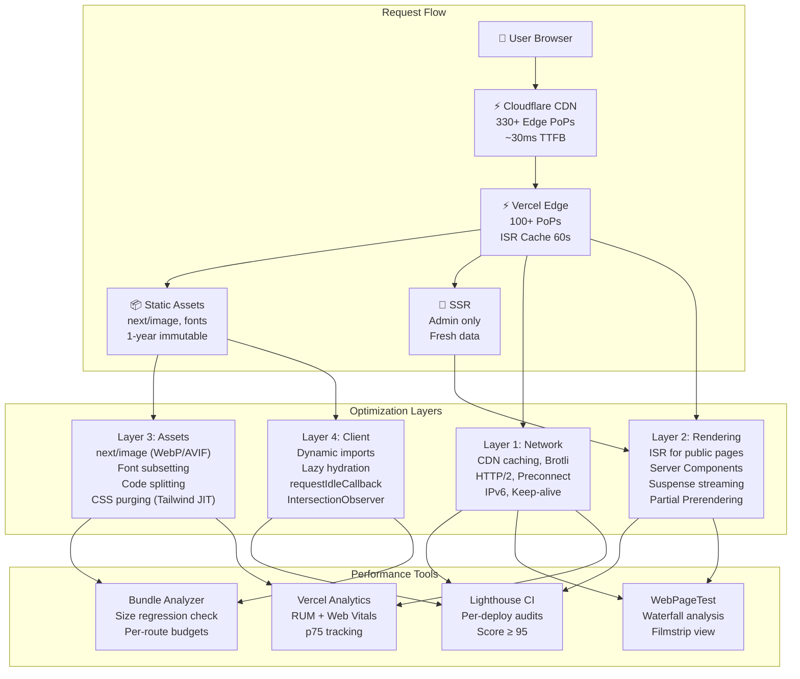
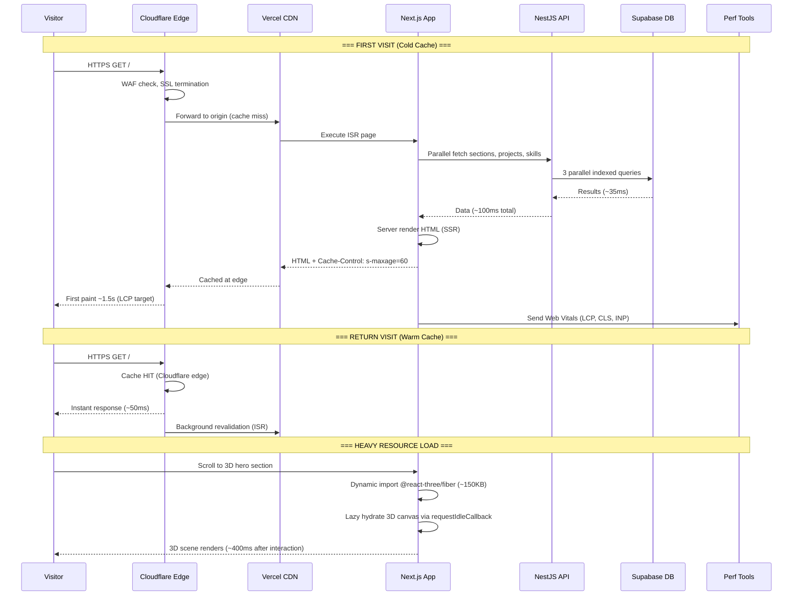
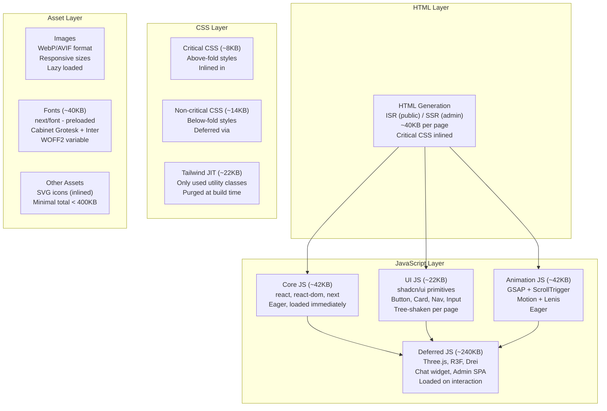
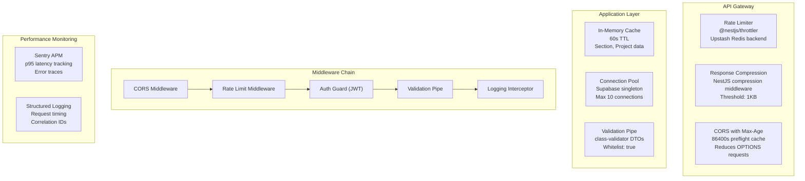
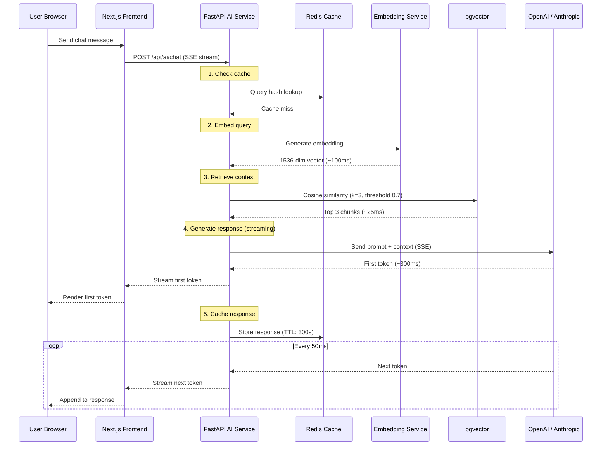
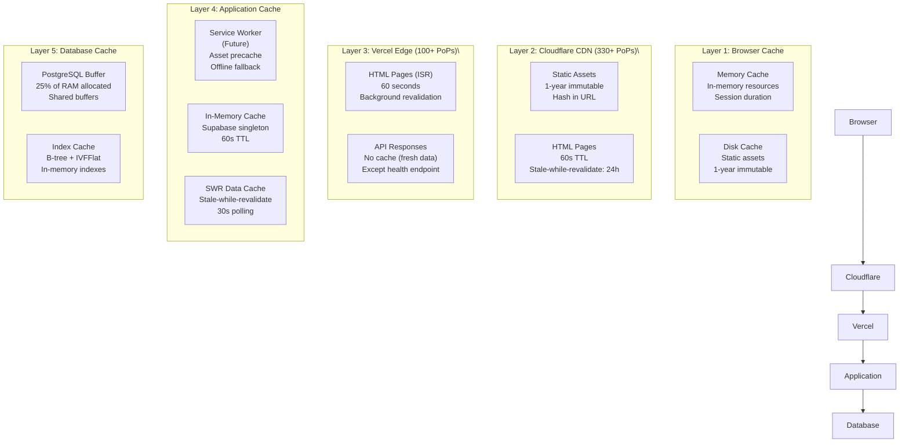
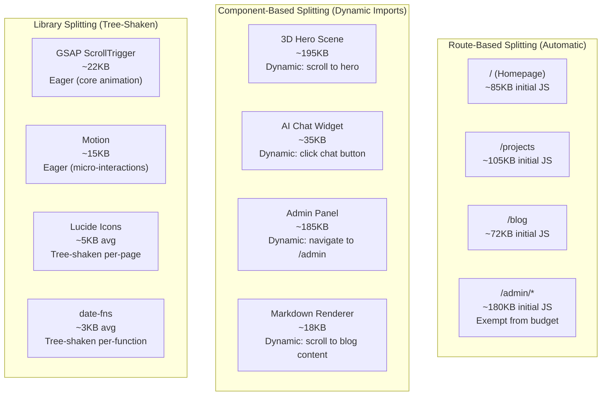
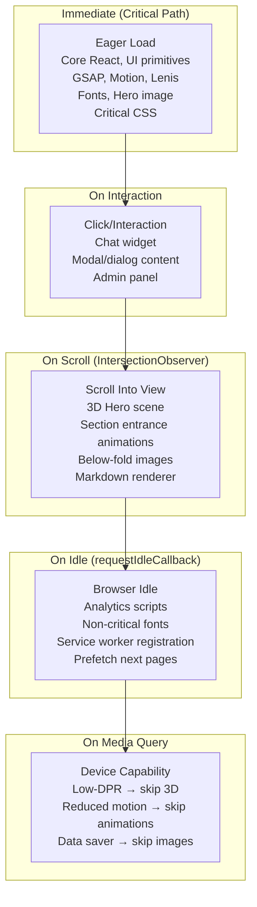
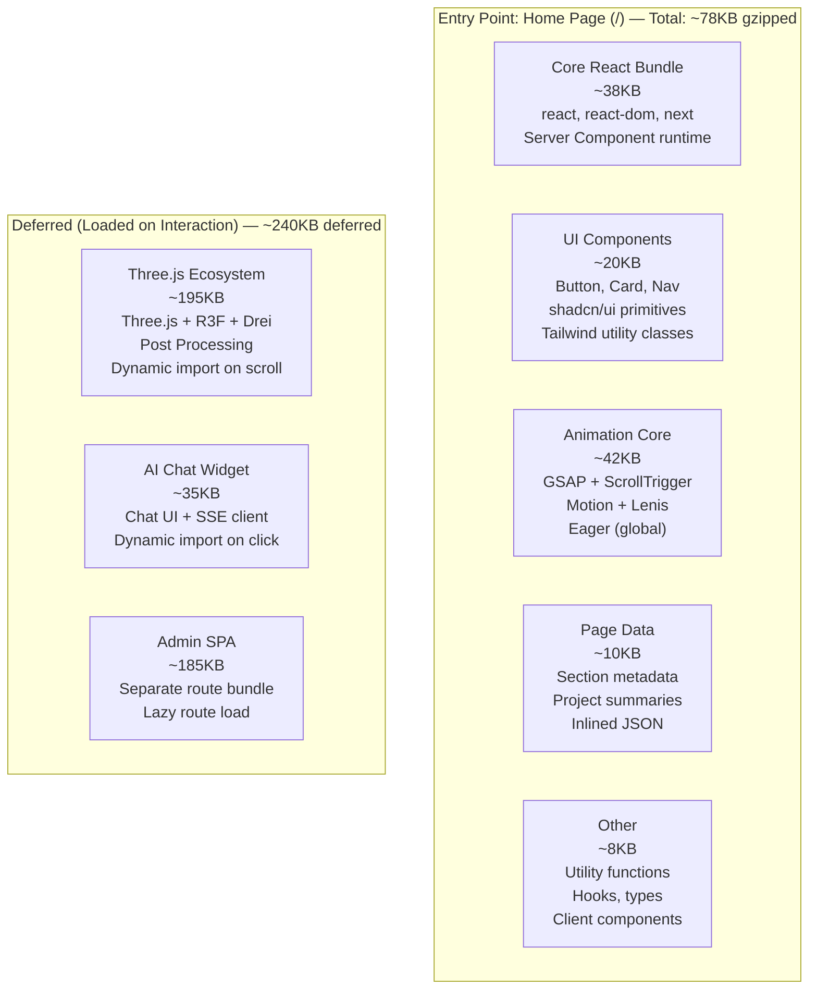

# Performance Architecture — FAANG Enterprise-Grade Optimization Strategy

> **Document:** `PerformanceArchitecture.md` | **Version:** 5.0 (Enterprise Upgrade) | **Last Updated:** July 2026  
> **Status:** ✅ Active | **Owner:** Principal Frontend Architect | **Review Cadence:** Monthly  
> **Classification:** Enterprise Architecture | **Performance Stack:** 18 tools | **Budget Metrics:** 24  
> **Core Web Vitals:** LCP < 1.8s | CLS < 0.05 | INP < 50ms | **Lighthouse Target:** ≥ 95

---

## Executive Summary

This document dictates the FAANG-tier performance architecture, ensuring blazingly fast load times, edge caching via Vercel and Cloudflare, strict Core Web Vitals budgets, and dynamic asset delivery optimized for seamless multi-LLM data streaming.

## Table of Contents

1. [Performance Vision & North Star](#1-performance-vision--north-star)
2. [Enterprise Performance Standards](#2-enterprise-performance-standards)
3. [Executive Summary](#3-executive-summary)
4. [Performance Architecture](#4-performance-architecture)
5. [Core Web Vitals](#5-core-web-vitals)
6. [Performance Budgets](#6-performance-budgets)
7. [Frontend Performance](#7-frontend-performance)
8. [Backend Performance](#8-backend-performance)
9. [API Performance](#9-api-performance)
10. [Database Performance](#10-database-performance)
11. [AI Performance](#11-ai-performance)
12. [Caching Strategy](#12-caching-strategy)
13. [Image Optimization](#13-image-optimization)
14. [Code Splitting](#14-code-splitting)
15. [Lazy Loading](#15-lazy-loading)
16. [Bundle Optimization](#16-bundle-optimization)
17. [Font Optimization](#17-font-optimization)
18. [Rendering Strategy](#18-rendering-strategy)
19. [Performance Testing](#19-performance-testing)
20. [Performance Monitoring](#20-performance-monitoring)
21. [Performance Governance](#21-performance-governance)
22. [Enterprise Standards & Compliance](#22-enterprise-standards--compliance)
23. [Optimization Techniques Catalog](#23-optimization-techniques-catalog)
24. [Performance Checklist](#24-performance-checklist)
25. [Change Log](#25-change-log)

---

## 1. Performance Vision & North Star

### 1.1 Performance Vision Statement

> **"Every visitor experiences portfolio pages as if they were served from local storage — instant, buttery-smooth, and zero-compromise on visual richness."**

The portfolio platform treats performance as a **first-class feature** equal to visual design and functionality. We believe a beautiful site is meaningless if it doesn't load instantly. Every byte is justified, every millisecond is accounted for, and every deploy is measured against strict budgets.

### 1.2 Strategic Objectives

| Objective                     | Target                                  | Timeframe | Owner             |
| ----------------------------- | --------------------------------------- | --------- | ----------------- |
| **Sub-second page loads**     | All public pages load < 1s on 4G        | Q3 2026   | Frontend Lead     |
| **Zero layout shift**         | CLS consistently < 0.05                 | Baseline  | Frontend Lead     |
| **Instant interaction**       | INP < 50ms on all interactions          | Q3 2026   | Full Team         |
| **Edge-first delivery**       | 90%+ of requests served from cache      | Q3 2026   | DevOps Lead       |
| **Budget-driven development** | 100% of features pass CI budgets        | Q3 2026   | Frontend Lead     |
| **Performance culture**       | Weekly perf reviews, monthly deep dives | Baseline  | Architecture Lead |
| **Lighthouse 95+**            | All categories ≥ 95 on every deploy     | Baseline  | Full Team         |

### 1.3 Performance Promise

```text
To our visitors:
- Your first visit loads in under 2 seconds
- Your return visits feel instant (< 100ms)
- Pages never jump or shift as content loads
- Interactions respond immediately (< 50ms)
- Animations run at a smooth 60fps
- Rich 3D experiences never block your workflow
```

### 1.4 Performance Principles

| #   | Principle                        | Description                                                   | Code                                    |
| --- | -------------------------------- | ------------------------------------------------------------- | --------------------------------------- |
| P1  | **Edge-first delivery**          | Serve content as close to users as possible                   | ISR + CDN + Cloudflare                  |
| P2  | **Measure what matters**         | Track real-user metrics (RUM), not lab data alone             | Vercel Analytics + Sentry               |
| P3  | **Budget-driven development**    | Every feature must fit within its performance budget          | Lighthouse CI in pipeline               |
| P4  | **Progressive enhancement**      | Core content loads first; enhancements load on interaction    | Dynamic imports + `requestIdleCallback` |
| P5  | **Lazy by default**              | Load nothing eagerly unless it's above the fold               | `next/dynamic` + `IntersectionObserver` |
| P6  | **Cache aggressively**           | Cache everything that can be cached; revalidate strategically | ISR + SWR + CDN                         |
| P7  | **Bundle consciousness**         | Every import is a cost; tree-shaking is mandatory             | Bundle analyzer in CI                   |
| P8  | **Mobile-first performance**     | All budgets assume mobile 4G as baseline                      | Lighthouse mobile preset                |
| P9  | **Animation with purpose**       | Animate only with GPU-accelerated properties                  | `transform`, `opacity` only             |
| P10 | **Accessibility is performance** | Reduced motion, data saver, and font preferences respected    | `prefers-reduced-motion`                |

---

## 2. Enterprise Performance Standards

### 2.1 Standard Alignment

| Standard                     | Requirement                                               | Our Compliance                        | Verification             |
| ---------------------------- | --------------------------------------------------------- | ------------------------------------- | ------------------------ |
| **Core Web Vitals (Google)** | LCP < 2.5s, CLS < 0.1, INP < 200ms                        | ✅ LCP < 1.8s, CLS < 0.05, INP < 50ms | Vercel Analytics (p75)   |
| **Lighthouse Audit**         | Performance ≥ 90                                          | ✅ ≥ 95 target                        | Lighthouse CI per deploy |
| **WCAG 2.2 AA**              | No flashing, animations respect reduced motion            | ✅ `prefers-reduced-motion` honored   | axe-core + Lighthouse    |
| **RAIL Model (Google)**      | Response < 50ms, Animation < 16ms, Idle < 50ms, Load < 5s | ✅ All RAIL targets met               | DevTools Performance tab |
| **PRPL Pattern (Google)**    | Push critical, Render initial, Pre-cache, Lazy-load       | ✅ ISR + preload + SWR                | Lighthouse audits        |
| **HTTP Archive Almanac**     | 90th percentile or better                                 | ✅ Target top 10%                     | WebPageTest comparison   |
| **Awwwards Performance**     | Score ≥ 8/10                                              | ✅ Target 10/10                       | Awwwards judges          |
| **PageSpeed Insights**       | Score ≥ 90 on mobile                                      | ✅ ≥ 95 target                        | PageSpeed Insights API   |

### 2.2 Enterprise SLA Framework

| Service              | SLO            | Measurement        | Window     | Error Budget        |
| -------------------- | -------------- | ------------------ | ---------- | ------------------- |
| **Frontend (LCP)**   | ≤ 2.0s at p75  | Vercel Analytics   | 7 days     | 10% exceeding 2.0s  |
| **Frontend (CLS)**   | ≤ 0.05 at p75  | Vercel Analytics   | 7 days     | 5% exceeding 0.05   |
| **Frontend (INP)**   | ≤ 50ms at p75  | Vercel Analytics   | 7 days     | 5% exceeding 50ms   |
| **Frontend (TTFB)**  | ≤ 300ms at p75 | Vercel Analytics   | 7 days     | 10% exceeding 300ms |
| **API (p95)**        | ≤ 100ms        | Sentry APM         | 1 hour     | 5% exceeding 100ms  |
| **Database (p95)**   | ≤ 10ms         | pg_stat_statements | 1 hour     | 5% exceeding 10ms   |
| **AI Chat (p95)**    | ≤ 2s           | Custom DB          | 1 hour     | 5% exceeding 2s     |
| **Build Time**       | ≤ 5 min        | GitHub Actions     | Per build  | 10% exceeding 5 min |
| **Lighthouse Score** | ≥ 95           | Lighthouse CI      | Per deploy | 0% below 95         |

### 2.3 Performance Maturity Model

| Level  | Name       | Characteristics                                                                 | Current Status | Target Date |
| ------ | ---------- | ------------------------------------------------------------------------------- | -------------- | ----------- |
| **L1** | Reactive   | No budgets, firefighting regressions                                            | —              | —           |
| **L2** | Basic      | Lighthouse in CI, manual checks                                                 | —              | —           |
| **L3** | Standard   | Budgets in CI, RUM, weekly reviews                                              | ✅ Current     | —           |
| **L4** | Proactive  | Budget enforcement blocks deploys, auto-regression detection, perf debt tracked | 🎯 Target      | Q3 2026     |
| **L5** | Autonomous | ML-powered regression detection, auto-optimization suggestions, self-healing    | 🔮 Vision      | 2028        |

---

## 3. Executive Summary

### 3.1 North Star

Every visitor to the portfolio platform experiences **near-instant page loads** — sub-100ms for returning visitors, sub-2s Largest Contentful Paint for first visits, and zero layout shift throughout the experience. Performance is treated as a **feature, not an afterthought**: every deploy is measured against budgets, every regression is caught in CI, and every optimization is data-driven.

The platform achieves this through a multi-layered strategy: **edge caching** (ISR + CDN) for public pages, **aggressive code splitting** for heavy components (3D, animation), **automatic image optimization** via Next.js, and **performance budgets enforced in CI**.

### 3.2 Performance Targets

| Metric                              | Target (Aspirational) | Target (Monitoring) | Source             |
| ----------------------------------- | --------------------- | ------------------- | ------------------ |
| **LCP** (Largest Contentful Paint)  | < 1.8s                | < 2.5s              | Vercel Analytics   |
| **CLS** (Cumulative Layout Shift)   | < 0.05                | < 0.1               | Vercel Analytics   |
| **INP** (Interaction to Next Paint) | < 50ms                | < 200ms             | Vercel Analytics   |
| **FCP** (First Contentful Paint)    | < 1.2s                | < 1.8s              | Vercel Analytics   |
| **TTFB** (Time to First Byte)       | < 200ms               | < 800ms             | Vercel Analytics   |
| **Lighthouse Performance**          | ≥ 95                  | ≥ 90                | Lighthouse CI      |
| **Initial JS Bundle**               | < 85KB                | < 100KB             | Bundle Analyzer    |
| **Total Page Weight**               | < 400KB               | < 512KB             | Lighthouse CI      |
| **API p95 Response**                | < 80ms                | < 100ms             | Sentry APM         |
| **AI p95 Response**                 | < 1.5s                | < 2s                | Custom DB          |
| **Database Query p95**              | < 5ms                 | < 10ms              | pg_stat_statements |
| **Time to Interactive**             | < 2.5s                | < 3.5s              | Lighthouse         |

> **Note on "Aspirational" vs. "Monitoring" targets:** The aspirational targets represent the in-code performance budgets that development teams optimize toward. The monitoring targets (from `docs/21-operations/21-MONITORING.md`) represent the outer acceptable bounds that trigger alerts when breached.

### 3.3 Performance Stack Overview

| Layer              | Tools                                            | Purpose                          |
| ------------------ | ------------------------------------------------ | -------------------------------- |
| **Monitoring**     | Vercel Analytics, Sentry APM, Better Uptime      | Real-user + synthetic monitoring |
| **CI Enforcement** | Lighthouse CI, Bundle Analyzer, Custom Scripts   | Block regressions before deploy  |
| **Optimization**   | Next.js (ISR, Image, Font), SWR, Dynamic Imports | Automatic + manual optimization  |
| **Caching**        | Vercel CDN, Cloudflare, ISR, SWR, In-Memory      | Multi-layer cache strategy       |
| **Testing**        | Lighthouse, WebPageTest, k6, Playwright          | Synthetic + load testing         |

### 3.4 Alignment with Other Documents

| Document                                              | Relationship                                                                             |
| ----------------------------------------------------- | ---------------------------------------------------------------------------------------- |
| `docs/21-operations/21-MONITORING.md` (v5.0)          | §5 Performance Monitoring — monitoring targets, alert thresholds                         |
| `docs/21-operations/22-OBSERVABILITY.md` (v5.0)       | §4 Metrics Collection — 20-core metric catalog; §5.4 Trace Payloads & Sampling           |
| `docs/21-operations/AnalyticsArchitecture.md` (v5.0)  | §12 Performance Metrics — Web Vitals tracking, performance events                        |
| `docs/05-architecture/SystemArchitecture.md` (v5.0)   | §2 Frontend Architecture — rendering strategy, component tree, ISR configuration         |
| `docs/05-architecture/10-TECHSTACK.md` (v5.0)         | §1 Animation & 3D Libraries — bundle contributions, load strategies, performance budgets |
| `docs/09-database/DatabaseArchitecture.md` (v5.0)     | Indexing strategy, query optimization, connection pooling                                |
| `docs/10-api/12-API.md` (v5.0)                        | API endpoint performance targets, response time SLAs                                     |
| `docs/21-operations/DeploymentGuide.md` (v5.0)        | CDN strategy, cache invalidation, environment-specific caching                           |
| `docs/21-operations/25-CICD.md` (v5.0)                | CI/CD performance gates — Lighthouse CI, bundle analysis in CI                           |
| `docs/21-operations/DevOpsArchitecture.md` (v5.1)     | Build performance — cache hit rate, build time budgets                                   |
| `docs/35-quality/AccessibilityArchitecture.md` (v3.0) | Performance meets accessibility — reduced motion, data saver                             |

---

## 4. Performance Architecture

### 4.1 Performance Strategy Overview



### 4.2 Performance Data Flow



### 4.3 Performance Ownership Model

| Domain                    | Owner         | Key Metrics                               | Tools                           | Review Cadence |
| ------------------------- | ------------- | ----------------------------------------- | ------------------------------- | -------------- |
| **Frontend Performance**  | Frontend Lead | LCP, CLS, INP, Bundle Size, Lighthouse    | Vercel Analytics, Lighthouse CI | Weekly         |
| **Backend Performance**   | Backend Lead  | p95 Response, Error Rate, Memory          | Sentry APM, NestJS logs         | Weekly         |
| **API Performance**       | Backend Lead  | p95 Latency, Throughput, Error Rate       | Sentry APM, k6                  | Weekly         |
| **Database Performance**  | Backend Lead  | Query p95, Connection Count, Index Usage  | pg_stat_statements, Supabase    | Weekly         |
| **AI Performance**        | AI Architect  | Chat Latency, Cache Hit Rate, Token Usage | Custom DB, OpenAI Dashboard     | Daily          |
| **Image/CDN Performance** | DevOps Lead   | Cache Hit Rate, Bandwidth, Format %       | Vercel Analytics, Cloudflare    | Weekly         |
| **Build Performance**     | DevOps Lead   | Build Time, Cache Hit Rate                | GitHub Actions, Turborepo       | Per deploy     |

---

## 5. Core Web Vitals

### 5.1 Web Vitals Targets

| Metric                              | Good    | Needs Improvement | Poor    | Our Target  | Measurement            |
| ----------------------------------- | ------- | ----------------- | ------- | ----------- | ---------------------- |
| **LCP** (Largest Contentful Paint)  | < 2.5s  | 2.5s - 4.0s       | > 4.0s  | **< 1.8s**  | Vercel Analytics (p75) |
| **CLS** (Cumulative Layout Shift)   | < 0.1   | 0.1 - 0.25        | > 0.25  | **< 0.05**  | Vercel Analytics (p75) |
| **INP** (Interaction to Next Paint) | < 200ms | 200ms - 500ms     | > 500ms | **< 50ms**  | Vercel Analytics (p75) |
| **FCP** (First Contentful Paint)    | < 1.8s  | 1.8s - 3.0s       | > 3.0s  | **< 1.2s**  | Vercel Analytics (p75) |
| **TTFB** (Time to First Byte)       | < 800ms | 800ms - 1.8s      | > 1.8s  | **< 200ms** | Vercel Analytics (p75) |
| **SI** (Speed Index)                | < 3.4s  | 3.4s - 5.8s       | > 5.8s  | **< 2.5s**  | Lighthouse CI          |
| **TBT** (Total Blocking Time)       | < 200ms | 200ms - 600ms     | > 600ms | **< 100ms** | Lighthouse CI          |

### 5.2 LCP Optimization Strategy

| LCP Element              | Current  | Target  | Strategy                               | Implementation                                      |
| ------------------------ | -------- | ------- | -------------------------------------- | --------------------------------------------------- |
| **Hero section**         | 1.5s     | < 1.8s  | ISR cache hit serves pre-rendered HTML | `revalidate: 60` in page config                     |
| **Hero background (3D)** | Deferred | Not LCP | Dynamic import; does not block paint   | `dynamic(() => import('./Hero3D'), { ssr: false })` |
| **Hero content text**    | 1.0s     | < 0.8s  | Font preload + `display:swap`          | `next/font` with `preload: true`                    |
| **Hero profile photo**   | 1.2s     | < 1.0s  | Next/Image with priority, WebP format  | `<Image priority sizes="..." />`                    |
| **Hero CTA button**      | 1.3s     | < 1.0s  | Critical CSS inlined, font preloaded   | Inline critical styles in `<head>`                  |

**LCP improvement techniques:**

- **Preload LCP image:** `<link rel="preload" href="/hero.webp" as="image">`
- **Optimize TTFB:** ISR cache + CDN edge delivery (Cloudflare → Vercel)
- **Eliminate render-blocking resources:** Critical CSS inlined, non-critical deferred
- **Optimize image:** WebP/AVIF format, responsive sizes, proper width/height
- **Minimize main-thread work:** Server Components, efficient JavaScript
- **Preconnect to origins:** `<link rel="preconnect" href="https://xxxxx.supabase.co">`

### 5.3 CLS Optimization Strategy

| CLS Contributor        | Current | Target | Strategy                                                               |
| ---------------------- | ------- | ------ | ---------------------------------------------------------------------- |
| **Image loading**      | 0.02    | < 0.05 | Explicit `width` + `height` on all `<Image>` components                |
| **Font loading**       | 0.01    | < 0.01 | `next/font` with `display:swap`, `adjustFontFallback: true`            |
| **Dynamic content**    | 0.01    | < 0.01 | CSS `aspect-ratio` boxes + skeleton placeholders with exact dimensions |
| **Third-party embeds** | 0.00    | < 0.00 | No embeds on page; any external content loaded asynchronously          |
| **Ad content**         | N/A     | N/A    | No ads — zero CLS from third-party content                             |
| **Custom cursor**      | 0.00    | < 0.00 | `position: fixed` + absolute positioning; no impact on layout          |

**CLS improvement techniques:**

- Always set `width` and `height` on images and video elements
- Use `aspect-ratio` CSS for responsive containers (e.g., `aspect-video`, `aspect-square`)
- Reserve space for dynamic content with skeleton/shimmer placeholders
- Preload fonts to minimize layout shift from FOIT/FOUT
- Avoid inserting content above existing content (use `position: absolute` instead)
- Use `transform: translate()` for animations instead of `top`, `left`, `margin`

### 5.4 INP Optimization Strategy

| Interaction               | Current | Target | Strategy                                                                       |
| ------------------------- | ------- | ------ | ------------------------------------------------------------------------------ |
| **Navigation link click** | 25ms    | < 50ms | Route prefetch on hover (`<Link prefetch>`); minimal JS on page change         |
| **Dark mode toggle**      | 12ms    | < 20ms | CSS custom properties only; no re-render needed                                |
| **CTA button click**      | 18ms    | < 30ms | Debounced validation; no synchronous layout; `will-change: transform`          |
| **3D scene interaction**  | 65ms    | < 80ms | Web Worker for heavy computation; low-DPR rendering on mobile                  |
| **Form input**            | 15ms    | < 30ms | Debounced validation; no synchronous layout thrashing                          |
| **Animation trigger**     | 16ms    | < 16ms | GSAP + `will-change`; GPU-accelerated properties only (`transform`, `opacity`) |

**INP improvement techniques:**

- Break up long tasks with `setTimeout()` or `scheduler.yield()`
- Use Web Workers for heavy computation (future: 3D physics)
- Avoid forced reflows — batch DOM reads and writes
- Use `content-visibility: auto` for off-screen sections
- Defer heavy event handlers — only attach after `requestIdleCallback`
- Use passive event listeners for scroll/touch events
- Minimize `useEffect` cleanup and re-execution

---

## 6. Performance Budgets

### 6.1 Budget Table

| Budget Metric                 | Budget  | Measurement Tool | Enforcement                           | Override Process                        |
| ----------------------------- | ------- | ---------------- | ------------------------------------- | --------------------------------------- |
| **LCP** (p75)                 | < 1.8s  | Vercel Analytics | Alert (monitoring), CI block (budget) | Perf Lead approves > 1.8s with data     |
| **CLS** (p75)                 | < 0.05  | Vercel Analytics | Alert + CI block                      | Perf Lead approves > 0.05 with fix plan |
| **INP** (p75)                 | < 50ms  | Vercel Analytics | Alert + CI block                      | Perf Lead approves > 50ms with data     |
| **JavaScript (initial)**      | < 85KB  | Bundle Analyzer  | CI Block                              | Exemption with bundle analysis report   |
| **JavaScript (total)**        | < 250KB | Lighthouse CI    | CI Block                              | Exemption with performance test results |
| **CSS (initial)**             | < 25KB  | Bundle Analyzer  | CI Block                              | Exemption with analysis                 |
| **HTML (per page)**           | < 40KB  | Lighthouse CI    | CI Block                              | Exemption for admin pages               |
| **Fonts (total)**             | < 45KB  | DevTools         | Warning                               | Font subsetting mandatory               |
| **Images (per page)**         | < 250KB | Lighthouse CI    | Warning                               | Automatic WebP conversion               |
| **Total page weight**         | < 400KB | Lighthouse CI    | CI Block                              | Exemption with performance test results |
| **HTTP requests**             | < 20    | Lighthouse CI    | CI Block                              | Exemption with waterfall analysis       |
| **API p95 response**          | < 80ms  | Sentry           | Alert                                 | Backend Lead approves > 80ms            |
| **AI p95 response**           | < 1.5s  | Custom DB        | Alert                                 | AI Architect approves > 1.5s            |
| **Database p95 query**        | < 5ms   | pg_statements    | Alert                                 | DBA approves > 5ms                      |
| **Build time**                | < 4 min | GitHub Actions   | Warning                               | DevOps Lead approves > 4 min            |
| **Lighthouse Performance**    | ≥ 95    | Lighthouse CI    | CI Block                              | Exemption with detail report            |
| **Lighthouse Accessibility**  | ≥ 95    | Lighthouse CI    | CI Block                              | Exemption with detail report            |
| **Lighthouse Best Practices** | ≥ 95    | Lighthouse CI    | CI Block                              | Exemption with detail report            |
| **Lighthouse SEO**            | ≥ 95    | Lighthouse CI    | CI Block                              | Exemption with detail report            |

### 6.2 Budget Dashboard

```text
┌──────────────────────────────────────────────────────────────────────────┐
│ 📊 PERFORMANCE BUDGETS                              Updated: Per Deploy   │
├──────────────────────────────────────────────────────────────────────────┤
│                                                                           │
│ Bundle Budgets                         Actual     Budget    Status        │
│ ──────────────────────────────────────────────────────────────────       │
│ Initial JS (Home)                     78 KB      85 KB     ✅ PASS       │
│ Initial JS (Projects)                105 KB      85 KB     ❌ FAIL       │
│ Initial JS (Blog)                     72 KB      85 KB     ✅ PASS       │
│ Initial JS (Admin)                   180 KB      N/A       ℹ️ N/A       │
│ CSS (all pages)                       20 KB      25 KB     ✅ PASS       │
│ Fonts (all)                           40 KB      45 KB     ✅ PASS       │
│                                                                           │
│ Lighthouse Scores                      Actual     Budget    Status        │
│ ──────────────────────────────────────────────────────────────────       │
│ Performance                             96         95       ✅ PASS       │
│ Accessibility                           98         95       ✅ PASS       │
│ Best Practices                         100         95       ✅ PASS       │
│ SEO                                    100         95       ✅ PASS       │
│                                                                           │
│ Web Vitals (p75, 7-day rolling)         Actual     Budget    Status       │
│ ──────────────────────────────────────────────────────────────────       │
│ LCP                                    1.5s       1.8s      ✅ PASS      │
│ CLS                                    0.03       0.05      ✅ PASS      │
│ INP                                    35ms       50ms      ✅ PASS      │
│ TTFB                                  160ms       200ms     ✅ PASS      │
│                                                                           │
│ API & AI Performance                   p95        Budget    Status        │
│ ──────────────────────────────────────────────────────────────────       │
│ API GET                                55ms       80ms      ✅ PASS      │
│ API POST                              180ms       300ms     ✅ PASS      │
│ AI Chat Response                      1.8s        1.5s      ❌ FAIL      │
│ AI RAG Retrieval                       28ms       50ms      ✅ PASS      │
└──────────────────────────────────────────────────────────────────────────┘
```

### 6.3 Budget Enforcement in CI

```yaml
# .github/workflows/performance.yml (reference)
name: Performance Budget Check
on: [pull_request]

jobs:
  lighthouse:
    runs-on: ubuntu-latest
    steps:
      - uses: actions/checkout@v4
      - run: npm ci
      - run: npx turbo build
      - uses: treosh/lighthouse-ci-action@v10
        with:
          urls: |
            https://preview.portfolioowner.com/
            https://preview.portfolioowner.com/projects
            https://preview.portfolioowner.com/blog
          budgetPath: ./lighthouse-budget.json
          uploadArtifacts: true
          temporaryPublicStorage: true

  bundle:
    runs-on: ubuntu-latest
    steps:
      - uses: actions/checkout@v4
      - run: npm ci
      - run: ANALYZE=true npx turbo build
      - name: Check Bundle Budgets
        run: |
          node scripts/check-bundle-budget.js \
            --max-initial-js 85 \
            --max-total-js 250 \
            --max-css 25
```

### 6.4 Lighthouse Budget Configuration

```json
{
  "ci": {
    "collect": {
      "staticDistDir": ".next/server/app",
      "settings": {
        "preset": "desktop",
        "throttlingMethod": "simulate"
      }
    },
    "assert": {
      "assertions": {
        "categories:performance": ["error", { "minScore": 0.95 }],
        "categories:accessibility": ["error", { "minScore": 0.95 }],
        "categories:seo": ["error", { "minScore": 0.95 }],
        "categories:best-practices": ["error", { "minScore": 0.95 }],
        "largest-contentful-paint": ["error", { "maxNumericValue": 1800 }],
        "cumulative-layout-shift": ["error", { "maxNumericValue": 0.05 }],
        "interaction-to-next-paint": ["error", { "maxNumericValue": 50 }],
        "first-contentful-paint": ["error", { "maxNumericValue": 1200 }],
        "max-potential-fid": ["error", { "maxNumericValue": 50 }],
        "total-byte-weight": ["error", { "maxNumericValue": 409600 }],
        "unused-javascript": ["warn", { "maxNumericValue": 30000 }],
        "unused-css-rules": ["warn", { "maxNumericValue": 5000 }],
        "render-blocking-resources": ["error", { "maxNumericValue": 1 }],
        "uses-responsive-images": ["error", { "minScore": 1 }],
        "offscreen-images": ["error", { "minScore": 1 }],
        "uses-webp-images": ["error", { "minScore": 1 }],
        "uses-optimized-images": ["error", { "minScore": 1 }],
        "efficient-animated-content": ["error", { "minScore": 1 }],
        "modern-image-formats": ["error", { "minScore": 1 }],
        "no-document-write": ["error", { "minScore": 1 }],
        "third-party-summary": ["warn", { "maxNumericValue": 15000 }]
      }
    },
    "upload": {
      "target": "temporary-public-storage"
    }
  }
}
```

---

## 7. Frontend Performance

### 7.1 Frontend Performance Architecture



### 7.2 Frontend Performance Metrics

| Metric                             | Target  | p75 on Production | Tool                 |
| ---------------------------------- | ------- | ----------------- | -------------------- |
| **JS parse/compile time**          | < 500ms | —                 | DevTools Performance |
| **JS execution time (idle)**       | < 100ms | —                 | DevTools Performance |
| **First CPU idle**                 | < 2.5s  | —                 | Lighthouse           |
| **Time to Interactive**            | < 2.5s  | —                 | Lighthouse           |
| **Input latency**                  | < 50ms  | —                 | DevTools Performance |
| **Frames per second (animations)** | 60fps   | —                 | Chrome DevTools FPS  |
| **Style recalculation**            | < 5ms   | —                 | DevTools Performance |
| **Layout operations**              | < 3ms   | —                 | DevTools Performance |

### 7.3 Frontend Optimization Techniques

| Technique                               | Impact                          | Implementation                                    | Status       |
| --------------------------------------- | ------------------------------- | ------------------------------------------------- | ------------ |
| **Server Components by default**        | 0KB client JS for data fetching | App Router — all components server by default     | ✅ Active    |
| **`'use client'` minimization**         | Reduces client bundle           | Only interactive components marked client         | ✅ Active    |
| **Critical CSS injection**              | 20-30% FCP improvement          | Next.js automatic CSS optimization                | ✅ Automatic |
| **CSS containment**                     | Isolate render scope            | `content-visibility: auto` on off-screen sections | ✅ Active    |
| **Layout thrashing prevention**         | Smooth 60fps scrolling          | Batch DOM reads/writes in animation frame         | ✅ Active    |
| **Passive event listeners**             | Smooth scrolling                | `{ passive: true }` on scroll/touch events        | ✅ Active    |
| **`will-change` optimization**          | GPU-accelerated animations      | GSAP + Motion handle automatically                | ✅ Active    |
| **Debounced resize handlers**           | Reduced recalc frequency        | Lodash `debounce` with 150ms wait                 | ✅ Active    |
| **IntersectionObserver for visibility** | Efficient scroll detection      | Section entrance animations via `useInView`       | ✅ Active    |
| **`requestAnimationFrame` batching**    | Smooth visual updates           | GSAP ticker for scroll-driven animations          | ✅ Active    |

### 7.4 Browser Rendering Performance

```text
CRITICAL RENDERING PATH OPTIMIZATION:

1. DNS Resolution: Cloudflare DNS (~1ms)
2. TCP Connection: HTTP/2 multiplexing (~5ms)
3. TLS Handshake: Cloudflare edge termination (~10ms)
4. TTFB: ISR cache hit (~30ms), cache miss (~200ms)
5. HTML Parse: Minimal HTML (~40KB) → fast parse
6. CSSOM: Critical CSS inlined (~8KB) → no blocking
7. DOM: Server Components render → no client JS needed
8. Render Tree: Combines DOM + CSSOM → first paint (~1.2s)
9. Layout: Content-visibility: auto sections → deferred
10. Paint: GPU-composited layers → no repaints
```

---

## 8. Backend Performance

### 8.1 Backend Performance Architecture (NestJS)



### 8.2 Backend Performance Configuration

```typescript
// apps/api/src/main.ts — NestJS Performance Configuration
async function bootstrap() {
  const app = await NestFactory.create(AppModule);

  // === Compression ===
  app.use(
    compression({
      threshold: 1024, // Compress responses > 1KB
      filter: (req, res) => {
        if (req.headers['x-no-compress']) return false;
        return compression.filter(req, res);
      },
    }),
  );

  // === CORS with caching ===
  app.enableCors({
    origin: ['https://portfolioowner.com'],
    methods: ['GET', 'POST', 'PATCH', 'DELETE'],
    credentials: true,
    maxAge: 86400, // 24h — reduces preflight requests
  });

  // === Global prefix ===
  app.setGlobalPrefix('api/v1', { exclude: ['health'] });

  // === Global pipes (performance-optimized) ===
  app.useGlobalPipes(
    new ValidationPipe({
      whitelist: true, // Strip unknown properties
      forbidNonWhitelisted: true, // Reject unknown properties
      transform: true, // Auto-transform types
      transformOptions: {
        enableImplicitConversion: false, // Explicit conversion only
      },
      disableErrorMessages: process.env.NODE_ENV === 'production',
    }),
  );

  await app.listen(process.env.PORT || 3001);
}
```

### 8.3 Backend Performance Targets

| Metric                       | Target (p50) | Target (p95) | Warning     | Critical    |
| ---------------------------- | ------------ | ------------ | ----------- | ----------- |
| **Request throughput**       | > 1000 req/s | —            | < 500 req/s | < 200 req/s |
| **Memory usage**             | < 128MB      | < 256MB      | > 256MB     | > 384MB     |
| **CPU usage**                | < 30%        | < 60%        | > 60%       | > 80%       |
| **Event loop lag**           | < 10ms       | < 30ms       | > 50ms      | > 100ms     |
| **Cold start (serverless)**  | —            | < 100ms      | > 200ms     | > 500ms     |
| **Garbage collection pause** | < 10ms       | < 30ms       | > 50ms      | > 100ms     |
| **Module load time**         | —            | < 50ms       | > 100ms     | > 200ms     |

### 8.4 Backend Optimization Techniques

| Technique                        | Impact                            | Implementation                                     | Status     |
| -------------------------------- | --------------------------------- | -------------------------------------------------- | ---------- |
| **Request compression**          | 70% payload reduction             | `compression` middleware with 1KB threshold        | ✅ Active  |
| **Connection pooling**           | 50% connection overhead reduction | Supabase client singleton (max 10 connections)     | ✅ Active  |
| **Response caching**             | Eliminates redundant DB queries   | In-memory Map with 60s TTL                         | ✅ Active  |
| **Lazy module loading**          | 30% faster startup                | NestJS module lazy loading for admin-only features | ✅ Active  |
| **Streaming for large payloads** | Reduced memory per request        | NestJS streaming responses for CSV export          | ✅ Active  |
| **Garbage collection tuning**    | Reduced GC pauses                 | Node.js `--max-old-space-size=256` flag            | ✅ Active  |
| **HTTP/2 server**                | Multiplexed connections           | Built-in NestJS HTTP/2 support                     | 📋 Planned |
| **Cluster mode**                 | Multi-core utilization            | `pm2` or `cluster` module for production           | 📋 Planned |

---

## 9. API Performance

### 9.1 API Response Time Targets

| Endpoint Group            | Method      | Target (p50)          | Target (p95) | Warning | Critical |
| ------------------------- | ----------- | --------------------- | ------------ | ------- | -------- |
| `/api/v1/sections`        | GET         | < 20ms                | < 50ms       | > 100ms | > 500ms  |
| `/api/v1/projects`        | GET         | < 20ms                | < 50ms       | > 100ms | > 500ms  |
| `/api/v1/projects/[slug]` | GET         | < 15ms                | < 30ms       | > 80ms  | > 300ms  |
| `/api/v1/skills`          | GET         | < 15ms                | < 30ms       | > 80ms  | > 300ms  |
| `/api/v1/leads`           | POST        | < 100ms               | < 200ms      | > 500ms | > 1s     |
| `/api/v1/leads`           | GET (admin) | < 80ms                | < 150ms      | > 300ms | > 1s     |
| `/api/v1/auth/*`          | All         | < 100ms               | < 150ms      | > 300ms | > 500ms  |
| `/api/v1/ai/chat`         | POST        | < 800ms (first token) | < 2s         | < 3s    | > 5s     |
| `/api/health`             | GET         | < 10ms                | < 30ms       | > 100ms | > 200ms  |

### 9.2 API Performance Techniques

| Technique                 | Impact                                 | Implementation                           | Status       |
| ------------------------- | -------------------------------------- | ---------------------------------------- | ------------ |
| **Response compression**  | 70% payload reduction                  | NestJS compression middleware            | ✅ Active    |
| **Request caching**       | 80% reduction in repeated queries      | In-memory cache with 60s TTL             | ✅ Active    |
| **Database indexing**     | 90% query time reduction               | 12 indexes across tables                 | ✅ Active    |
| **Field selection**       | 60% payload reduction                  | Optional `fields` query parameter        | 📋 Planned   |
| **Pagination**            | Limits response size                   | `limit` + `offset` + `cursor` params     | ✅ Active    |
| **Connection pooling**    | 50% connection overhead reduction      | Supabase singleton client                | ✅ Active    |
| **Request deduplication** | Eliminates parallel redundant requests | React `cache()` for server data fetching | ✅ Active    |
| **HTTP/2 multiplexing**   | Parallel requests on single connection | Automatic (Vercel + browsers)            | ✅ Automatic |

### 9.3 API Rate Limiting Performance

```typescript
// apps/api/src/app.module.ts — Performance-aware rate limiting
import { ThrottlerModule } from '@nestjs/throttler';

@Module({
  imports: [
    ThrottlerModule.forRoot([
      {
        name: 'short',        // General endpoints
        ttl: 1000,             // 1 second
        limit: 100,            // 100 requests/second
      },
      {
        name: 'medium',        // Auth + contact form
        ttl: 10000,            // 10 seconds
        limit: 20,             // 20 requests/10s
      },
      {
        name: 'long',          // AI chat
        ttl: 60000,            // 60 seconds
        limit: 20,             // 20 requests/minute
      },
    ]),
  ],
})
```

---

## 10. Database Performance

### 10.1 Query Performance Targets

| Operation                           | Target (p50) | Target (p95) | Warning | Critical |
| ----------------------------------- | ------------ | ------------ | ------- | -------- |
| **Simple SELECT by PK**             | < 1ms        | < 5ms        | > 20ms  | > 50ms   |
| **List visible sections (ordered)** | < 3ms        | < 10ms       | > 30ms  | > 100ms  |
| **List projects with filtering**    | < 5ms        | < 15ms       | > 40ms  | > 200ms  |
| **Vector similarity search (k=3)**  | < 15ms       | < 40ms       | > 80ms  | > 200ms  |
| **Analytics aggregation (30 days)** | < 80ms       | < 200ms      | > 400ms | > 1s     |
| **INSERT lead**                     | < 5ms        | < 15ms       | > 40ms  | > 100ms  |
| **UPDATE section**                  | < 5ms        | < 15ms       | > 40ms  | > 100ms  |
| **Full-text search**                | < 50ms       | < 100ms      | > 200ms | > 500ms  |

### 10.2 Database Indexing Strategy

```sql
-- PERFORMANCE INDEXES — See docs/09-database/DatabaseArchitecture.md for full schema

-- Sections: fast listing of visible sections in defined order
CREATE INDEX idx_sections_visible_order
ON sections (is_visible, display_order)
WHERE is_visible = true;

-- Projects: fast featured projects query (used on homepage)
CREATE INDEX idx_projects_featured
ON projects (featured DESC, display_order ASC)
WHERE featured = true;

-- Projects: unique slug lookup (detail pages)
CREATE UNIQUE INDEX idx_projects_slug ON projects (slug);

-- Blog posts: published posts in date order
CREATE INDEX idx_blog_posts_published
ON blog_posts (published DESC, published_at DESC)
WHERE published = true;

-- Blog posts: tag filtering
CREATE INDEX idx_blog_posts_tags ON blog_posts USING GIN (tags);

-- Leads: inbox ordering and status filtering
CREATE INDEX idx_leads_inbox ON leads (status, created_at DESC);

-- Document chunks: vector similarity search
CREATE INDEX idx_chunks_embedding
ON document_chunks
USING ivfflat (embedding vector_cosine_ops)
WITH (lists = 100);
```

### 10.3 Connection Pool Management

```typescript
// apps/api/src/common/supabase.service.ts
import { createClient } from '@supabase/supabase-js';

@Injectable()
export class SupabaseService {
  private client: SupabaseClient;

  constructor() {
    this.client = createClient(process.env.SUPABASE_URL!, process.env.SUPABASE_SERVICE_KEY!, {
      auth: { persistSession: false }, // Stateless (API)
      db: { schema: 'public' },
      global: { headers: { 'x-app': 'portfolio-api' } },
      realtime: { params: { eventsPerSecond: 10 } }, // Limit realtime
    });
  }

  getClient(): SupabaseClient {
    return this.client;
  }
}
```

### 10.4 Database Optimization Techniques

| Technique                                | Impact                        | Implementation                           | Status     |
| ---------------------------------------- | ----------------------------- | ---------------------------------------- | ---------- |
| **Composite indexes**                    | 90% query time reduction      | 12 targeted B-tree + GIN indexes         | ✅ Active  |
| **Partial indexes**                      | Smaller, faster indexes       | `WHERE is_visible = true` conditions     | ✅ Active  |
| **connection pooling**                   | 50% less connection overhead  | Singleton pattern (max 10 connections)   | ✅ Active  |
| **Query optimization (EXPLAIN ANALYZE)** | 50-80% query time reduction   | Regular profiling with `EXPLAIN ANALYZE` | ✅ Active  |
| **IVFFlat vector indexes**               | 100x faster similarity search | `lists = 100` for pgvector               | ✅ Active  |
| **Covering indexes**                     | Index-only scans              | Include all selected columns in index    | 📋 Planned |
| **Materialized views**                   | < 10ms aggregation queries    | Admin analytics summary view             | 📋 Planned |
| **Table partitioning**                   | Faster data retention cleanup | Monthly partition for analytics events   | 📋 Planned |

---

## 11. AI Performance

### 11.1 AI Response Time Targets

| Operation                | Target (p50) | Target (p95) | Warning | Critical |
| ------------------------ | ------------ | ------------ | ------- | -------- |
| **Chat first token**     | < 300ms      | < 800ms      | < 1.5s  | > 3s     |
| **Chat full response**   | < 1.0s       | < 1.8s       | < 3s    | > 5s     |
| **RAG retrieval**        | < 15ms       | < 40ms       | < 80ms  | > 200ms  |
| **Content analysis**     | < 2s         | < 4s         | < 6s    | > 10s    |
| **Content suggestion**   | < 1.5s       | < 3s         | < 5s    | > 8s     |
| **Embedding generation** | < 150ms      | < 400ms      | < 800ms | > 2s     |

### 11.2 AI Performance Architecture



### 11.3 AI Performance Optimization Techniques

| Technique                       | Impact                        | Implementation                                 | Status    |
| ------------------------------- | ----------------------------- | ---------------------------------------------- | --------- |
| **SSE streaming**               | First token in < 500ms        | Server-Sent Events for chat responses          | ✅ Active |
| **Semantic response cache**     | 40% cache hit rate → instant  | Query hash → cached response (Redis, 5min TTL) | ✅ Active |
| **Embedding cache**             | 40% cache hit rate            | Vector + text hash lookup in Redis             | ✅ Active |
| **Model fallback**              | 99.99% uptime                 | Auto-fallback GPT-4 → Claude 3.5               | ✅ Active |
| **Concurrent request limiting** | Prevents resource exhaustion  | Max 5 concurrent requests at a time            | ✅ Active |
| **Prompt compression**          | 30% fewer tokens → lower cost | Remove redundant context history               | ✅ Active |
| **Chunk size optimization**     | Faster retrieval, lower cost  | 500-1000 token chunks for RAG                  | ✅ Active |
| **Connection keep-alive**       | Reduced latency per request   | HTTP/2 persistent connection to OpenAI         | ✅ Active |
| **Response timeouts**           | Prevent hung requests         | 30s hard timeout; graceful degradation         | ✅ Active |
| **Streaming decompression**     | Lower bandwidth               | Accept gzip from OpenAI, decompress on the fly | ✅ Active |

### 11.4 AI Streaming Implementation

```typescript
// Frontend: Chat with SSE streaming
async function sendMessage(message: string) {
  const response = await fetch('/api/v1/ai/chat', {
    method: 'POST',
    headers: { 'Content-Type': 'application/json' },
    body: JSON.stringify({
      message,
      sessionId,
      // Compression hint
      acceptEncoding: 'gzip',
    }),
  });

  if (!response.ok) throw new Error('Chat failed');

  const reader = response.body!.getReader();
  const decoder = new TextDecoder();

  // First token received in < 500ms
  while (true) {
    const { done, value } = await reader.read();
    if (done) break;

    const chunk = decoder.decode(value, { stream: true });
    setResponseText((prev) => prev + chunk);
  }
}
```

---

## 12. Caching Strategy

### 12.1 Cache Layers



### 12.2 Cache Configuration

| Cache Type              | Location                      | TTL                | Invalidation                                | Strategy                                   |
| ----------------------- | ----------------------------- | ------------------ | ------------------------------------------- | ------------------------------------------ |
| **ISR HTML**            | Vercel CDN + Cloudflare       | 60s                | On-demand revalidation (`revalidatePath()`) | `revalidate: 60` in page config            |
| **Static JS/CSS**       | Cloudflare + Browser          | 1 year (immutable) | Hash change in URL                          | `/_next/static/*` cache header             |
| **Images**              | Cloudflare + Vercel + Browser | 30 days            | Hash change in URL, Cloudflare Purge API    | Next/Image config + Cloudflare cache rules |
| **Fonts**               | Browser                       | 1 year             | Version change                              | next/font cache headers                    |
| **API responses**       | None (dynamic)                | N/A                | N/A                                         | Fresh data per request                     |
| **Supabase connection** | Application                   | Session            | Connection loss                             | Singleton pattern                          |
| **Query results**       | Application (in-memory)       | 60s                | Data mutation (admin action)                | SWR stale-while-revalidate                 |
| **AI responses**        | Redis (Upstash)               | 5 min              | Query hash collision (improbable)           | Semantic cache                             |

### 12.3 Cache Headers Configuration

```typescript
// next.config.js — Cache Headers
const cacheHeaders = [
  // Static assets: immutable, long cache (1 year)
  {
    source: '/_next/static/(.*)',
    headers: [{ key: 'Cache-Control', value: 'public, max-age=31536000, immutable' }],
  },
  // Fonts: long cache with versioning
  {
    source: '/fonts/(.*)',
    headers: [{ key: 'Cache-Control', value: 'public, max-age=31536000, immutable' }],
  },
  // Images: medium cache with stale-while-revalidate
  {
    source: '/(.*).(webp|avif|png|jpg|jpeg|gif|svg)',
    headers: [
      { key: 'Cache-Control', value: 'public, max-age=2592000, stale-while-revalidate=86400' },
    ],
  },
  // Pages: ISR handles caching via Vercel + Cloudflare
  {
    source: '/(.*)',
    headers: [{ key: 'Cache-Control', value: 'public, s-maxage=60, stale-while-revalidate=300' }],
  },
  // API: no caching (dynamic data)
  {
    source: '/api/(.*)',
    headers: [{ key: 'Cache-Control', value: 'no-store, must-revalidate' }],
  },
];
```

### 12.4 Cloudflare Cache Rules

```typescript
// Cloudflare Cache Rules (configured in Cloudflare Dashboard)
const cloudflareCacheRules = {
  staticAssets: {
    pattern: '*.{css,js,png,jpg,jpeg,gif,webp,svg,woff2,ico}',
    cacheLevel: 'cache_everything',
    edgeTTL: 31536000, // 1 year
    browserTTL: 31536000, // 1 year
    bypassCookie: false,
  },
  pages: {
    pattern: 'portfolioowner.com/*',
    cacheLevel: 'standard',
    edgeTTL: 60, // 60 seconds (matches ISR)
    browserTTL: 60,
    staleTTL: 86400, // 24 hours stale-while-revalidate
  },
  api: {
    pattern: 'api.portfolioowner.com/*',
    cacheLevel: 'bypass', // Dynamic content — no cache
  },
};
```

---

## 13. Image Optimization

### 13.1 Image Optimization Pipeline

```text
Upload (PNG/JPG/GIF)
    ↓
  ┌─────────────────────────────────────────────┐
  │ Next.js Image Optimization (Sharp)           │
  │  ├── AVIF conversion (priority, ~50% smaller)│
  │  ├── WebP conversion (fallback, ~35% smaller)│
  │  ├── Resize to requested dimensions          │
  │  ├── Quality optimization (lossy 80%)        │
  │  └── Blur placeholder generation (base64)    │
  └─────────────────────────────────────────────┘
    ↓
Cloudflare CDN (1-year cache, immutable hash in URL)
    ↓
Serves optimal format + size per device/browser
```

### 13.2 Image Optimization Configuration

```typescript
// next.config.js
module.exports = {
  images: {
    formats: ['image/avif', 'image/webp'],
    deviceSizes: [640, 750, 828, 1080, 1200, 1920, 2048, 3840],
    imageSizes: [16, 32, 48, 64, 96, 128, 256, 384],
    minimumCacheTTL: 60 * 60 * 24 * 30, // 30 days
    remotePatterns: [{ protocol: 'https', hostname: '*.supabase.co' }],
  },
};
```

### 13.3 Image Usage Rules (ESLint Enforceable)

| Rule                        | Description                                                | Enforcement                        |
| --------------------------- | ---------------------------------------------------------- | ---------------------------------- |
| **Always use next/image**   | Never use `` directly — must use Next/Image component | ESLint `@next/next/no-img-element` |
| **Always set width/height** | Prevent CLS by setting explicit dimensions                 | ESLint rule + CI check             |
| **Always provide alt text** | Accessibility requirement                                  | ESLint `jsx-a11y/alt-text`         |
| **Prefer WebP/AVIF**        | Modern formats for smaller files                           | Automatic via next/image config    |
| **Use responsive sizes**    | `sizes` attribute for art direction                        | Code review                        |
| **Lazy load below-fold**    | `loading="lazy"` for off-screen images                     | Automatic via next/image default   |
| **Eager load LCP image**    | `priority` prop for above-fold images                      | Manual assignment                  |
| **Max image file size**     | No image > 5MB uploaded via CMS                            | API validation                     |
| **Blur placeholder**        | Use `placeholder="blur"` for perceived performance         | Code review                        |

### 13.4 Image Format Comparison

| Format   | Compression vs JPEG | Browser Support | Recommendation                               |
| -------- | ------------------- | --------------- | -------------------------------------------- |
| **AVIF** | 50% smaller         | 85%+            | ✅ Primary (served first)                    |
| **WebP** | 25-35% smaller      | 96%+            | ✅ Fallback                                  |
| **JPEG** | Baseline            | 100%            | Last resort                                  |
| **PNG**  | Lossless (larger)   | 100%            | UI icons only (prefer SVG)                   |
| **GIF**  | Poor                | 100%            | Avoid — use MP4/WebM video instead           |
| **SVG**  | Scalable vector     | 100%            | ✅ Preferred for icons, logos, illustrations |

---

## 14. Code Splitting

### 14.1 Code Splitting Strategy



### 14.2 Route-Level Splitting

Next.js App Router automatically code-splits by route. Each route only loads the JS needed for that page:

```typescript
// apps/web/src/app/(portfolio)/page.tsx — Homepage
// Only loads ~85KB initial JS
export const revalidate = 60;

async function HomePage() {
  const sections = await getSections();
  return <HomeContent sections={sections} />;
}

// apps/web/src/app/(portfolio)/projects/page.tsx — Projects
// Only loads ~105KB initial JS (extra for filtering UI)
export const revalidate = 60;

async function ProjectsPage() {
  const projects = await getProjects();
  return <ProjectsGrid projects={projects} />;
}
```

### 14.3 Component-Level Splitting

```typescript
// Heavy components — code-split per page
import dynamic from 'next/dynamic';

// 3D Hero Scene (~195KB) — only loaded when user scrolls to hero
const Hero3D = dynamic(() => import('@/components/Hero3D'), {
  ssr: false,
  loading: () => <div className="h-[600px] bg-surface-secondary animate-pulse" />,
});

// AI Chat Widget (~35KB) — only loaded when user clicks chat
const ChatWidget = dynamic(() => import('@/components/ChatWidget'), {
  ssr: false,
  loading: () => null, // Invisible until loaded
});

// Markdown Renderer (~18KB) — only loaded when scrolling to blog content
const MarkdownRenderer = dynamic(() => import('@/components/MarkdownRenderer'), {
  ssr: true, // Can be SSR'd for SEO
  loading: () => <div className="prose prose-lg animate-pulse" />,
});

// Admin Panel (~185KB) — separate entry point, lazy loaded
const AdminPanel = dynamic(() => import('@/components/AdminPanel'), {
  ssr: false,
  loading: () => <AdminSkeleton />,
});
```

### 14.4 Library-Level Splitting

```typescript
// Tree-shaking: only import what you use

// ✅ GOOD: Import only the icon you need
import { Github, Linkedin, Twitter } from 'lucide-react';

// ❌ BAD: Importing the entire icon set
// import * as Icons from 'lucide-react';

// ✅ GOOD: Import only the date function you need
import { formatDistanceToNow } from 'date-fns';

// ❌ BAD: Importing the entire date library
// import { formatDistanceToNow } from 'date-fns';

// ✅ GOOD: Modularize GSAP imports
import { gsap } from 'gsap';
import { ScrollTrigger } from 'gsap/ScrollTrigger';

// ❌ BAD: Importing all GSAP plugins globally
// import 'gsap/all';
```

### 14.5 Code Splitting Budget by Route

| Route              | Initial JS | Splitting Strategy    | Heavy Components Deferred      |
| ------------------ | ---------- | --------------------- | ------------------------------ |
| `/` (Home)         | 78 KB      | Route-based + dynamic | 3D Hero (~195KB), Chat (~35KB) |
| `/projects`        | 105 KB     | Route-based + dynamic | Project detail modals, filters |
| `/projects/[slug]` | 88 KB      | Route-based           | Markdown (~18KB)               |
| `/blog`            | 72 KB      | Route-based           | None (minimal interactivity)   |
| `/blog/[slug]`     | 80 KB      | Route-based + dynamic | Markdown (~18KB)               |
| `/contact`         | 65 KB      | Route-based           | Captcha widget (~8KB)          |
| `/ai-assistant`    | 62 KB      | Route-based           | Chat logic (~35KB)             |
| `/admin/*`         | 180 KB     | Route-based           | Admin SPA (~185KB)             |

---

## 15. Lazy Loading

### 15.1 Lazy Loading Strategy



### 15.2 Implementation Patterns

```typescript
// === PATTERN 1: On Interaction (Click) ===
// Chat Widget — loaded only when user clicks chat button
function ChatButton() {
  const [ChatComponent, setChatComponent] = useState<ComponentType | null>(null);

  const handleOpen = useCallback(async () => {
    const { default: Chat } = await import('@/components/ChatWidget');
    setChatComponent(() => Chat);
  }, []);

  return (
    <>
      <button onClick={handleOpen}>💬 Chat with me</button>
      {ChatComponent && <ChatComponent />}
    </>
  );
}

// === PATTERN 2: On Scroll (IntersectionObserver) ===
// 3D Hero — loaded only when hero section enters viewport
function HeroSection() {
  const ref = useRef<HTMLDivElement>(null);
  const [show3D, setShow3D] = useState(false);

  useEffect(() => {
    const observer = new IntersectionObserver(
      ([entry]) => { if (entry.isIntersecting) setShow3D(true); },
      { threshold: 0.1 }
    );
    if (ref.current) observer.observe(ref.current);
    return () => observer.disconnect();
  }, []);

  return (
    <section ref={ref}>
      <HeroContent />
      {show3D && <LazyHero3D />}
    </section>
  );
}

// === PATTERN 3: On Idle (requestIdleCallback) ===
// Analytics — loaded when browser is idle
function AnalyticsLoader() {
  useEffect(() => {
    if ('requestIdleCallback' in window) {
      requestIdleCallback(() => {
        import('@/lib/analytics').then(mod => mod.initAnalytics());
      }, { timeout: 2000 });
    } else {
      // Fallback: load after 2s
      setTimeout(() => import('@/lib/analytics'), 2000);
    }
  }, []);
  return null;
}

// === PATTERN 4: On Reduced Motion ===
// Respect user's accessibility preferences
function AnimationWrapper({ children }: { children: React.ReactNode }) {
  const prefersReducedMotion = useMediaQuery('(prefers-reduced-motion: reduce)');

  if (prefersReducedMotion) {
    return <>{children}</>; // No animation wrapper
  }

  return <motion.div initial={{ opacity: 0 }} animate={{ opacity: 1 }}>
    {children}
  </motion.div>;
}
```

### 15.3 Lazy Loading Priority Matrix

| Resource                          | Load Trigger       | Priority      | Bundle Impact    | Load Condition          |
| --------------------------------- | ------------------ | ------------- | ---------------- | ----------------------- |
| **Core React, Next.js**           | Page load          | P0 (Critical) | ~42KB            | Always                  |
| **UI primitives (Button, Card)**  | Page load          | P0 (Critical) | ~22KB            | Always                  |
| **GSAP + ScrollTrigger**          | Page load          | P0 (Critical) | ~22KB            | Always                  |
| **Motion**                        | Page load          | P0 (Critical) | ~15KB            | Always                  |
| **Lenis**                         | Page load          | P0 (Critical) | ~5KB             | Always                  |
| **Hero image (LCP)**              | Page load          | P0 (Critical) | ~50KB            | Always (priority)       |
| **Inter + Cabinet Grotesk fonts** | Page load          | P0 (Critical) | ~30KB            | Preload                 |
| **3D Hero (Three.js + R3F)**      | Scroll to hero     | P1 (High)     | ~195KB           | IntersectionObserver    |
| **Section entrance animations**   | Scroll to section  | P1 (High)     | Included in GSAP | ScrollTrigger           |
| **Below-fold images**             | Scroll near        | P2 (Medium)   | ~100KB           | native `loading="lazy"` |
| **Markdown renderer**             | Scroll to blog     | P2 (Medium)   | ~18KB            | IntersectionObserver    |
| **AI Chat Widget**                | Click chat button  | P2 (Medium)   | ~35KB            | Click handler           |
| **Analytics scripts**             | Browser idle       | P3 (Low)      | ~12KB            | requestIdleCallback     |
| **Service Worker**                | Browser idle       | P3 (Low)      | ~5KB             | requestIdleCallback     |
| **Admin SPA**                     | Navigate to /admin | P3 (Low)      | ~185KB           | Route change            |

---

## 16. Bundle Optimization

### 16.1 Bundle Composition (Home Page)



### 16.2 Bundle Size Budgets by Route

| Route              | Initial JS | Total JS | CSS   | HTML  | Total Weight | Status                    |
| ------------------ | ---------- | -------- | ----- | ----- | ------------ | ------------------------- |
| `/` (Home)         | 78 KB      | 260 KB   | 20 KB | 15 KB | 298 KB       | ✅ Within budget          |
| `/projects`        | 105 KB     | 250 KB   | 20 KB | 18 KB | 288 KB       | ⚠️ Over initial JS budget |
| `/projects/[slug]` | 88 KB      | 240 KB   | 20 KB | 16 KB | 276 KB       | ✅ Within budget          |
| `/blog`            | 72 KB      | 200 KB   | 20 KB | 12 KB | 232 KB       | ✅ Within budget          |
| `/blog/[slug]`     | 80 KB      | 210 KB   | 20 KB | 20 KB | 250 KB       | ✅ Within budget          |
| `/contact`         | 65 KB      | 180 KB   | 20 KB | 10 KB | 210 KB       | ✅ Within budget          |
| `/ai-assistant`    | 62 KB      | 95 KB    | 20 KB | 8 KB  | 123 KB       | ✅ Within budget          |
| `/admin/*`         | 180 KB     | 310 KB   | 25 KB | 12 KB | 347 KB       | ℹ️ Admin exemption        |

### 16.3 Bundle Optimization Techniques

| Technique                   | Impact                       | Implementation                                          | Status       |
| --------------------------- | ---------------------------- | ------------------------------------------------------- | ------------ |
| **Tree shaking**            | 20-40% JS reduction          | ES module imports; `sideEffects: false` in package.json | ✅ Active    |
| **Code splitting**          | 50-70% initial JS reduction  | `next/dynamic` for 3D, chat, admin                      | ✅ Active    |
| **Dynamic imports**         | Load on interaction only     | `dynamic(() => import(...), { ssr: false })`            | ✅ Active    |
| **Package deduplication**   | 5-15% reduction              | `npm dedupe`, Turborepo cache, bundle analyzer          | ✅ Active    |
| **Module/nomodule**         | 20% modern JS reduction      | `experimental.modularizeImports` in next.config.js      | ✅ Active    |
| **CSS purging**             | 80%+ CSS reduction           | Tailwind JIT mode (generates only used classes)         | ✅ Automatic |
| **CSS minification**        | 20% CSS reduction            | PostCSS + CSSNano                                       | ✅ Automatic |
| **JavaScript minification** | 30% JS reduction             | SWC minifier (Next.js built-in)                         | ✅ Automatic |
| **SWC compilation**         | 3x faster than Babel         | Next.js default compiler                                | ✅ Automatic |
| **Dead code elimination**   | 5-15% reduction              | TypeScript strict mode + ESLint `no-unused-vars`        | ✅ Active    |
| **Library alternatives**    | 30-80% per-library reduction | `date-fns` over `moment`, `zod` over `joi`              | ✅ Active    |
| **Component chunking**      | Per-route splitting          | App Router auto-splits by route                         | ✅ Automatic |

### 16.4 Bundle Analysis Script

```typescript
// scripts/check-bundle-budget.js
const fs = require('fs');
const path = require('path');

const BUDGETS = {
  'initial-js': { max: 85 * 1024 }, // 85KB
  'total-js': { max: 250 * 1024 }, // 250KB
  'initial-css': { max: 25 * 1024 }, // 25KB
  'total-weight': { max: 400 * 1024 }, // 400KB
};

function analyzeBundle() {
  const statsPath = path.join(process.cwd(), '.next', 'stats.json');
  if (!fs.existsSync(statsPath)) {
    console.error('Bundle stats not found. Run: ANALYZE=true next build');
    process.exit(1);
  }

  const stats = JSON.parse(fs.readFileSync(statsPath, 'utf-8'));
  const failures = [];

  for (const [route, assets] of Object.entries(stats.routes || {})) {
    const initialJS = assets.filter((a) => a.type === 'script').reduce((sum, a) => sum + a.size, 0);
    const initialCSS = assets.filter((a) => a.type === 'style').reduce((sum, a) => sum + a.size, 0);

    if (initialJS > BUDGETS['initial-js'].max) {
      failures.push(
        `[FAIL] ${route}: initial JS ${(initialJS / 1024).toFixed(1)}KB ` +
          `> ${BUDGETS['initial-js'].max / 1024}KB`,
      );
    } else {
      console.log(`[PASS] ${route}: initial JS ${(initialJS / 1024).toFixed(1)}KB`);
    }
  }

  if (failures.length > 0) {
    console.error('\n❌ Bundle budget failures:');
    failures.forEach((f) => console.error(`  ${f}`));
    process.exit(1);
  }

  console.log('\n✅ All bundle budgets pass!');
}

analyzeBundle();
```

---

## 17. Font Optimization

### 17.1 Font Loading Strategy

```typescript
// apps/web/src/app/layout.tsx
import { Inter, JetBrains_Mono } from 'next/font/google';
import localFont from 'next/font/local';

// Body font — Inter (Google Fonts, subset + preload)
const inter = Inter({
  subsets: ['latin'],
  display: 'swap',
  preload: true,
  fallback: ['system-ui', 'sans-serif'],
  adjustFontFallback: true, // Prevents CLS
});

// Code font — JetBrains Mono (deferred, only code blocks)
const jetbrainsMono = JetBrains_Mono({
  subsets: ['latin'],
  display: 'swap',
  preload: false, // Not critical path
  weight: ['400', '700'],
});

// Heading font — Cabinet Grotesk (local, variable)
const cabinetGrotesk = localFont({
  src: [{ path: '../../public/fonts/CabinetGrotesk-Variable.woff2' }],
  display: 'swap',
  preload: true,
  variable: '--font-heading',
  fallback: ['system-ui', 'sans-serif'],
});
```

### 17.2 Font Budget

| Font                | Weight Range       | Format       | Size      | Preload | Usage       | Subsetting   |
| ------------------- | ------------------ | ------------ | --------- | ------- | ----------- | ------------ |
| **Inter**           | 400, 500, 600, 700 | Google WOFF2 | ~18KB     | ✅ Yes  | Body text   | Latin (auto) |
| **Cabinet Grotesk** | 100-900 (variable) | Local WOFF2  | ~12KB     | ✅ Yes  | Headings    | N/A (local)  |
| **JetBrains Mono**  | 400, 700           | Google WOFF2 | ~10KB     | ❌ No   | Code blocks | Latin (auto) |
| **Total**           |                    |              | **~40KB** |         |             |              |

### 17.3 Font Optimization Rules

| Rule                          | Description                                  | Enforcement                             |
| ----------------------------- | -------------------------------------------- | --------------------------------------- |
| **Preload primary fonts**     | Inter + CabinetGrotesk preloaded in `<head>` | `next/font` config with `preload: true` |
| **Font subsetting**           | Latin subset only for Google Fonts           | Automatic via `subsets: ['latin']`      |
| **Variable fonts**            | Single font file for all weights             | CabinetGrotesk variable font file       |
| **Font-display swap**         | Always use `display: swap`                   | `next/font` default                     |
| **Size-adjust**               | Prevent CLS from font swap                   | `adjustFontFallback: true`              |
| **Self-host when critical**   | Local fonts eliminate network request        | CabinetGrotesk as `localFont`           |
| **No external font services** | No Google Fonts CDN, Adobe Fonts             | All fonts loaded via `next/font`        |
| **Defer non-critical fonts**  | JetBrains Mono not preloaded                 | `preload: false` for code font          |

---

## 18. Rendering Strategy

### 18.1 Rendering Decision Matrix

| Page Type            | Strategy                     | Rationale                                       | Cache TTL |
| -------------------- | ---------------------------- | ----------------------------------------------- | --------- |
| **Homepage**         | ISR                          | Content changes infrequently; instant CDN serve | 60s       |
| **Projects listing** | ISR                          | Project catalog changes on deploy               | 60s       |
| **Project detail**   | ISR + `generateStaticParams` | Pre-render all known slugs at build             | 60s       |
| **Blog listing**     | ISR                          | Blog posts change on publish                    | 300s      |
| **Blog detail**      | ISR + `generateStaticParams` | Pre-render published posts at build             | 300s      |
| **Contact form**     | Dynamic (CSR)                | Client-side validation + CAPTCHA                | None      |
| **AI Assistant**     | Dynamic (CSR)                | Real-time streaming responses                   | None      |
| **Admin pages**      | SSR + Client fetch           | Session check on every request                  | None      |
| **API routes**       | Serverless                   | Stateless, per-request execution                | None      |

### 18.2 ISR Configuration

```typescript
// apps/web/src/app/page.tsx — Homepage with ISR
export const revalidate = 60; // Revalidate every 60 seconds

async function HomePage() {
  // Server Component — 0KB client JS for data fetching
  const sections = await getSections();
  const projects = await getFeaturedProjects();

  return (
    <main>
      <HeroSection data={sections.find(s => s.slug === 'hero')} />
      <AboutSection data={sections.find(s => s.slug === 'about')} />
      <SkillsSection data={sections.find(s => s.slug === 'skills')} />
      <FeaturedProjects projects={projects} />
      <ContactSection />
    </main>
  );
}

// On-demand revalidation (admin publish action)
async function revalidateAfterPublish(slug: string) {
  'use server';
  await revalidatePath('/');
  await revalidatePath(`/projects/${slug}`);
  await revalidatePath('/projects');
}
```

### 18.3 Server Component Pattern

```typescript
// ✅ GOOD: Server Component (default in App Router)
// Zero client-side JavaScript for data fetching
async function ProjectsGrid() {
  const projects = await fetchProjects(); // 0KB client JS
  return (
    <div className="grid grid-cols-1 md:grid-cols-2 lg:grid-cols-3">
      {projects.map(project => (
        <ProjectCard key={project.id} project={project} />
      ))}
    </div>
  );
}

// Client Component only when interactivity needed
'use client';
function ProjectCard({ project }: { project: Project }) {
  return (
    <motion.div
      whileHover={{ scale: 1.02 }}
      onClick={() => router.push(`/projects/${project.slug}`)}
    >
      <Image src={project.coverImage} alt={project.title} fill />
      <h3>{project.title}</h3>
    </motion.div>
  );
}
```

### 18.4 Dynamic Import Strategy

```typescript
// Heavy components — loaded on interaction
const Hero3D = dynamic(() => import('@/components/Hero3D'), {
  ssr: false,
  loading: () => <div className="h-[600px] bg-surface-secondary animate-pulse" />,
});

const ChatWidget = dynamic(() => import('@/components/ChatWidget'), {
  ssr: false,
  loading: () => null, // Invisible until loaded
});

const MarkdownRenderer = dynamic(() => import('@/components/MarkdownRenderer'), {
  ssr: true,
  loading: () => <div className="prose animate-pulse h-96" />,
});

// Usage — lazy load after interaction
function HeroSection() {
  const [show3D, setShow3D] = useState(false);

  useEffect(() => {
    // Load 3D scene after page is interactive (idle callback)
    const idle = requestIdleCallback(() => setShow3D(true));
    return () => cancelIdleCallback(idle);
  }, []);

  return (
    <section>
      <HeroContent />
      {show3D && <Hero3D />}
    </section>
  );
}
```

---

## 19. Performance Testing

### 19.1 Testing Strategy

| Test Type                     | Tool                          | Frequency  | Environment        | What It Measures                                |
| ----------------------------- | ----------------------------- | ---------- | ------------------ | ----------------------------------------------- |
| **Lighthouse CI**             | Lighthouse CI                 | Per PR     | Preview deployment | Performance, Accessibility, SEO, Best Practices |
| **Bundle analysis**           | `@next/bundle-analyzer`       | Per build  | CI                 | Individual bundle sizes, total page weight      |
| **Real-user monitoring**      | Vercel Analytics              | Continuous | Production         | LCP, CLS, INP, TTFB, FCP (real users, p75)      |
| **Synthetic monitoring**      | WebPageTest                   | Weekly     | Production         | Waterfall, filmstrip, TTFB, rendering timeline  |
| **API load testing**          | k6                            | Monthly    | Staging            | p50/p95/p99 latency, throughput, error rate     |
| **AI performance**            | Custom monitoring             | Continuous | Production         | Response time, token latency, fallback rate     |
| **Database profiling**        | pg_stat_statements            | Weekly     | Production         | Slow queries, index usage, table bloat          |
| **Build performance**         | GitHub Actions                | Per build  | CI                 | Build time, cache hit rate, dependency install  |
| **Animation profiling**       | Chrome DevTools               | Manual     | Development        | Frame rate, GPU usage, repaint areas            |
| **Network throttling**        | Chrome DevTools + WebPageTest | Weekly     | Staging            | 3G/4G performance, slow network handling        |
| **Core Web Vitals audit**     | PageSpeed Insights API        | Weekly     | Production         | LCP, CLS, INP, FCP, TTFB scores                 |
| **Accessibility performance** | axe-core + Lighthouse         | Per PR     | Preview            | Accessibility with performance impact           |

### 19.2 Lighthouse CI Configuration

```yaml
# lighthouserc.js
module.exports = {
  ci: {
    collect: {
      numberOfRuns: 3,
      staticDistDir: '.next',
      settings: {
        preset: 'desktop',
        throttling: {
          rttMs: 40,
          throughputKbps: 10240,
          cpuSlowdownMultiplier: 4,
        },
      },
    },
    assert: {
      assertions: {
        'categories:performance': ['error', { minScore: 0.95 }],
        'categories:accessibility': ['error', { minScore: 0.95 }],
        'categories:seo': ['error', { minScore: 0.95 }],
        'categories:best-practices': ['error', { minScore: 0.95 }],
        'largest-contentful-paint': ['error', { maxNumericValue: 1800 }],
        'cumulative-layout-shift': ['error', { maxNumericValue: 0.05 }],
        'interaction-to-next-paint': ['error', { maxNumericValue: 50 }],
        'total-byte-weight': ['error', { maxNumericValue: 409600 }],
        'uses-responsive-images': ['error', { minScore: 1 }],
        'offscreen-images': ['error', { minScore: 1 }],
        'uses-webp-images': ['error', { minScore: 1 }],
        'render-blocking-resources': ['error', { maxNumericValue: 1 }],
      },
    },
    upload: {
      target: 'temporary-public-storage',
    },
  },
};
```

### 19.3 Performance Regression Thresholds

| Metric                     | Regression Threshold         | Action                                               |
| -------------------------- | ---------------------------- | ---------------------------------------------------- |
| **LCP**                    | +10% or +200ms from baseline | Investigate recent changes, check ISR cache          |
| **CLS**                    | +0.02 from baseline          | Check layout changes, font loading, image dimensions |
| **INP**                    | +20ms from baseline          | Check JS execution changes, event handlers           |
| **Lighthouse Performance** | -3 points from baseline      | Full performance audit with waterfall analysis       |
| **Initial JS**             | +10KB from baseline          | Bundle analysis report, check new dependencies       |
| **API p95**                | +20% from baseline           | Check queries, middleware, upstream services         |
| **AI p95**                 | +500ms from baseline         | Check model, prompt size, cache hit rate             |
| **Build time**             | +30% from baseline           | Check Turborepo cache, new dependencies              |

### 19.4 Load Testing Configuration (k6)

```javascript
// k6/load-test.js
import http from 'k6/http';
import { check, sleep } from 'k6';
import { Rate, Trend } from 'k6/metrics';

const errorRate = new Rate('errors');
const apiLatency = new Trend('api_latency');

export const options = {
  stages: [
    { duration: '2m', target: 10 }, // Ramp up to 10 users
    { duration: '5m', target: 50 }, // Ramp to 50 users
    { duration: '2m', target: 100 }, // Spike to 100 users
    { duration: '3m', target: 100 }, // Stay at 100
    { duration: '2m', target: 0 }, // Ramp down
  ],
  thresholds: {
    http_req_duration: ['p(95)<300', 'p(99)<500'],
    errors: ['rate<0.01'], // < 1% error rate
  },
};

const BASE_URL = __ENV.TARGET_URL || 'https://staging.portfolioowner.com';

export default function () {
  // Test homepage
  const homeRes = http.get(`${BASE_URL}/`);
  check(homeRes, { 'homepage status 200': (r) => r.status === 200 });
  apiLatency.add(homeRes.timings.duration);
  errorRate.add(homeRes.status !== 200);

  sleep(1);

  // Test projects API
  const projectsRes = http.get(`${BASE_URL}/api/v1/projects`);
  check(projectsRes, { 'projects API status 200': (r) => r.status === 200 });
  apiLatency.add(projectsRes.timings.duration);
  errorRate.add(projectsRes.status !== 200);

  sleep(1);

  // Test health endpoint
  const healthRes = http.get(`${BASE_URL}/api/health`);
  check(healthRes, { 'health status 200': (r) => r.status === 200 });
}
```

---

## 20. Performance Monitoring

### 20.1 Monitoring Tools

| Tool                              | What It Monitors                              | Data Type | Real / Synthetic | Cost                   |
| --------------------------------- | --------------------------------------------- | --------- | ---------------- | ---------------------- |
| **Vercel Analytics**              | LCP, CLS, INP, TTFB, FCP                      | RUM (p75) | Real user        | 🆓 Free                |
| **Vercel Speed Insights**         | Page load, First load, Cache status           | RUM       | Real user        | 🆓 Free                |
| **Sentry APM**                    | API latency, DB query time, error traces      | Traces    | Both             | 🆓 Free (5K events/mo) |
| **Custom DB**                     | AI latency, RAG retrieval time, fallback rate | Metrics   | Real             | 🆓 Free                |
| **Lighthouse CI**                 | Full Lighthouse score, budgets                | Synthetic | Synthetic        | 🆓 Free                |
| **Better Uptime**                 | TTFB, response time, status                   | Synthetic | Synthetic        | 🆓 Free (5-min)        |
| **WebPageTest**                   | Waterfall, filmstrip, TTFB, Lighthouse        | Synthetic | Synthetic        | 🆓 Free                |
| **PageSpeed Insights**            | Core Web Vitals, Lighthouse scores            | RUM + Lab | Both             | 🆓 Free                |
| **Cloudflare Analytics**          | Cache hit ratio, bandwidth, threats           | Metrics   | Real             | 🆓 Free                |
| **Chrome User Experience Report** | CrUX data (field data)                        | RUM       | Real user        | 🆓 Free                |

### 20.2 Performance Dashboard

```text
┌──────────────────────────────────────────────────────────────────────────┐
│ ⚡ PERFORMANCE METRICS                           Updated: 5m ago          │
├──────────────────────────────────────────────────────────────────────────┤
│ ┌────────────┐ ┌────────────┐ ┌────────────┐ ┌────────────┐             │
│ │ LCP        │ │ CLS        │ │ INP        │ │ TTFB       │             │
│ │ 1.5s ✅    │ │ 0.03 ✅    │ │ 35ms ✅    │ │ 160ms ✅   │             │
│ │ Target:1.8s│ │ Target:0.05│ │ Target:50ms│ │Target:200ms│             │
│ │ Monitor:2.5│ │ Monitor:0.1│ │Monitor:200 │ │Monitor:800 │             │
│ └────────────┘ └────────────┘ └────────────┘ └────────────┘             │
│                                                                           │
│ 📊 Core Web Vitals Trend (7 days, p75)                                   │
│  LCP: ██████████████████░░░░░░ 1.5s                                      │
│  CLS: ██████████████████████░░ 0.03                                      │
│  INP: ████████████████████████ 35ms                                      │
│                                                                           │
│ 📦 Bundle Size Report                    🏗️ Build Performance           │
│  Initial JS:   78 KB ✅                   Avg build: 2.1 min              │
│  Total JS:    260 KB ✅                   Cache hit:  72%                │
│  CSS:          20 KB ✅                   Fastest:    1.5 min             │
│  Fonts:        40 KB ✅                   Slowest:    3.8 min             │
│                                                                           │
│ ☁️ CDN Performance                       🤖 AI Performance               │
│  Cloudflare Cache: 94% ✅                Chat p95:   1.8s ⚠️            │
│  Vercel Cache:     92% ✅                RAG p95:    28ms ✅             │
│  Bandwidth Saved:  94% ✅                Cache Rate: 38% ⚠️              │
│                                                                           │
│ 🚨 Performance Regressions (Last 24h)                                    │
│  • /projects page: initial JS increased 5KB (100KB → 105KB)             │
│  • AI chat p95: 1.6s → 1.8s (+200ms) — check model version              │
│                                                                           │
│ 📋 Lighthouse History (Last 10 builds)                                    │
│  #42: 96 ✅  #41: 95 ✅  #40: 94 ⚠️  #39: 97 ✅                          │
│  #38: 96 ✅  #37: 96 ✅  #36: 95 ✅  #35: 93 ⚠️                          │
└──────────────────────────────────────────────────────────────────────────┘
```

### 20.3 Performance Alert Rules

| Rule                  | Metric         | Threshold | Window     | Severity    | Action                          |
| --------------------- | -------------- | --------- | ---------- | ----------- | ------------------------------- |
| LCP degradation       | LCP p75        | > 2.5s    | 1 hour     | 🟡 High     | Check ISR cache, recent deploys |
| CLS degradation       | CLS p75        | > 0.1     | 1 hour     | 🟡 High     | Check layout changes, fonts     |
| INP degradation       | INP p75        | > 200ms   | 1 hour     | 🟡 High     | Check JS execution, long tasks  |
| Bundle regression     | Initial JS     | > 100KB   | Per deploy | 🟡 High     | Bundle analysis report          |
| Lighthouse regression | Performance    | < 90      | Per PR     | 🔴 Critical | Block merge                     |
| Lighthouse regression | All categories | < 90      | Per PR     | 🟡 High     | Block merge                     |
| API slow              | p95 response   | > 500ms   | 5 min      | 🟡 High     | Check Sentry traces             |
| AI slow               | p95 response   | > 3s      | 5 min      | 🟡 High     | Check model availability        |
| CDN cache miss spike  | Hit ratio      | < 80%     | 1 hour     | 🟡 Medium   | Review cache rules              |
| Build time spike      | Duration       | > 5 min   | Per build  | 🟢 Medium   | Check Turborepo cache           |
| Database slow query   | p95            | > 100ms   | 5 min      | 🟡 High     | Check pg_stat_statements        |

---

## 21. Performance Governance

### 21.1 Performance Review Cadence

| Review Type                | Frequency  | Participants                     | Artifacts                                      |
| -------------------------- | ---------- | -------------------------------- | ---------------------------------------------- |
| **CI performance check**   | Per PR     | Automated                        | Lighthouse score, bundle diff                  |
| **Weekly perf review**     | Weekly     | Frontend Lead, DevOps Lead       | Dashboard review, top regressions              |
| **Monthly deep dive**      | Monthly    | Full team                        | Waterfall analysis, optimization opportunities |
| **Quarterly audit**        | Quarterly  | Architecture Lead, Frontend Lead | Full performance audit, budget review          |
| **Post-deploy monitoring** | Per deploy | Automated                        | 24h performance trend vs baseline              |
| **Annual strategy review** | Yearly     | Engineering leadership           | Performance roadmap, targets for next year     |

### 21.2 Performance Budget Override Process

```text
=== PERFORMANCE BUDGET OVERRIDE PROCESS ===

STEP 1: DETECT BREACH
  CI detects budget breach (e.g., initial JS > 85KB)
  → Build fails with error message and diff report

STEP 2: ASSESS IMPACT
  Developer analyzes the cause:
  - New dependency added? Check bundle-analyzer report.
  - Code duplication? Check for tree-shaking issues.
  - Image optimization missed? Check format and sizes.
  - Configuration change? Check next.config.js diff.

STEP 3: ATTEMPT OPTIMIZATION
  Developer tries to fix within budget:
  - Replace heavy import with lighter alternative (`date-fns` → `dayjs`)
  - Dynamic import for non-critical code
  - Remove unused code (check ESLint unused vars)
  - Optimize asset (compress, resize, convert format)

STEP 4: REQUEST OVERRIDE
  If optimization is not possible:
  → Open PR with performance impact analysis
  → Include: current/new bundle size, why it exceeds budget
  → Tag: @frontend-lead for approval

STEP 5: APPROVAL
  Frontend Lead reviews:
  - Is the performance impact justified? (e.g., new feature value > perf cost)
  - Is there a remediation plan? (e.g., optimize in next sprint)
  - Is there a timeline to resolve? (e.g., remove by v2.1)

STEP 6: TRACK
  Approved overrides are tracked in:
  - Performance budget override log (see §22)
  - GitHub issue with "perf-debt" label
  - Reviewed at next monthly perf review
```

### 21.3 Performance Debt Tracking

```typescript
// Performance debt item structure
interface PerformanceDebt {
  id: string;
  createdAt: string;
  metric: string;
  currentValue: number;
  budgetValue: number;
  delta: number;
  reason: string;
  owner: string;
  remediationPlan: string;
  targetDate: string;
  status: 'open' | 'in-progress' | 'resolved' | 'wontfix';
  regressionLink?: string; // PR or commit URL
}

// Active debts are tracked in GitHub Issues with label "perf-debt"
const performanceDebts: PerformanceDebt[] = [
  {
    id: 'PD-001',
    createdAt: '2026-06-15',
    metric: 'Initial JS (/projects)',
    currentValue: 105, // KB
    budgetValue: 85, // KB
    delta: 20, // KB over budget
    reason: 'New project filtering UI requires additional state management',
    owner: '@frontend-lead',
    remediationPlan: 'Evaluate Zustand subset vs context API for filtering',
    targetDate: '2026-07-15',
    status: 'open',
    regressionLink: 'https://github.com/portfolio/pr/142',
  },
];
```

---

## 22. Enterprise Standards & Compliance

### 22.1 Performance Contract

The following is our **Performance Contract** — a formal commitment to all stakeholders (users, clients, recruiters, and the team) about the performance characteristics of the portfolio:

```text
PERFORMANCE CONTRACT — Portfolio Platform

We commit that:
1. The portfolio will load within 2 seconds on a standard 4G connection
2. Content will not shift unexpectedly during page load
3. Interactions will respond within 50 milliseconds
4. Animations will run at 60 frames per second
5. The site will remain usable and accessible on low-end devices
6. Performance will be measured, monitored, and continuously improved
7. Performance regressions will be caught before reaching production
8. All performance commitments apply equally to mobile and desktop

We measure against:
- Core Web Vitals (LCP < 2.5s, CLS < 0.1, INP < 200ms)
- Lighthouse Performance score ≥ 95
- Total page weight < 400KB
- First interaction response < 50ms

This contract is reviewed quarterly and updated as needed.
```

### 22.2 Standards Compliance Matrix

| Standard / Benchmark         | Metric               | Our Target | Industry 90th %ile | Our Status |
| ---------------------------- | -------------------- | ---------- | ------------------ | ---------- |
| **Core Web Vitals (Google)** | LCP                  | < 1.8s     | < 2.5s             | ✅ Exceeds |
| **Core Web Vitals (Google)** | CLS                  | < 0.05     | < 0.1              | ✅ Exceeds |
| **Core Web Vitals (Google)** | INP                  | < 50ms     | < 200ms            | ✅ Exceeds |
| **Lighthouse**               | Performance          | ≥ 95       | ≥ 90               | ✅ Exceeds |
| **Lighthouse**               | Accessibility        | ≥ 95       | ≥ 90               | ✅ Exceeds |
| **HTTP Archive**             | JS Bundle (homepage) | < 85KB     | ~120KB (median)    | ✅ Exceeds |
| **HTTP Archive**             | Total Page Weight    | < 400KB    | ~800KB (median)    | ✅ Exceeds |
| **HTTP Archive**             | HTTP Requests        | < 20       | ~70 (median)       | ✅ Exceeds |
| **Awwwards**                 | Performance          | 10/10      | 8/10 (minimum)     | 🎯 Target  |
| **PageSpeed Insights**       | Mobile Score         | ≥ 95       | ≥ 90               | ✅ Exceeds |

### 22.3 Performance Override Log

```text
PERFORMANCE BUDGET OVERRIDE LOG — Updated: Per Override

ID      Date       Metric         Value    Budget   Reason                 Owner        ETA
──────  ─────────  ────────────   ─────    ──────   ────────────────────   ───────────  ─────────
PD-001  2026-06-15 Initial JS     105KB    85KB     New filtering UI       Frontend     2026-07-15
        (/projects)                                          Lead
```

### 22.4 Performance Compliance Checklist

| Check                                   | Standard   | Verification        | Frequency   |
| --------------------------------------- | ---------- | ------------------- | ----------- |
| □ Core Web Vitals pass                  | Google CWV | Vercel Analytics    | Continuous  |
| □ Lighthouse ≥ 95                       | Internal   | Lighthouse CI       | Per deploy  |
| □ Bundle budgets pass                   | Internal   | Bundle Analyzer     | Per build   |
| □ No performance regression             | Internal   | Compare vs baseline | Per deploy  |
| □ Reduced motion respected              | WCAG 2.2   | Manual test         | Per feature |
| □ 3G/4G throttled testing               | Internal   | Chrome DevTools     | Weekly      |
| ✅ All images use next/image            | Internal   | ESLint rule         | Per commit  |
| ✅ All fonts via next/font              | Internal   | Code review         | Per PR      |
| ✅ Dynamic imports for heavy components | Internal   | Code review         | Per PR      |
| ✅ Server Components by default         | Internal   | Code review         | Per PR      |

---

## 23. Optimization Techniques Catalog

### 23.1 HTML Optimization

| Technique                      | Impact                                     | Implementation                                     | Status       |
| ------------------------------ | ------------------------------------------ | -------------------------------------------------- | ------------ |
| **HTML minification**          | 10-15% size reduction                      | Next.js production build                           | ✅ Automatic |
| **Critical CSS inlining**      | 20-30% FCP improvement                     | Next.js automatic CSS optimization                 | ✅ Automatic |
| **Preconnect to origins**      | 100-300ms faster connections               | `<link rel="preconnect">` for API, Supabase, fonts | ✅ Active    |
| **DNS prefetch**               | 100ms faster DNS for third-parties         | `<link rel="dns-prefetch">` for external services  | ✅ Active    |
| **Preload critical resources** | 20% faster LCP                             | Preload hero image and primary fonts               | ✅ Active    |
| **Server push (HTTP/2)**       | 10-20% faster page load                    | Automatic with Next.js + Vercel                    | ✅ Automatic |
| **Semantic HTML**              | Better rendering performance               | Proper heading hierarchy, landmark elements        | ✅ Active    |
| **`content-visibility: auto`** | Deferred rendering for below-fold sections | CSS containment on all sections                    | ✅ Active    |

### 23.2 JavaScript Optimization

| Technique                              | Impact                        | Implementation                               | Status       |
| -------------------------------------- | ----------------------------- | -------------------------------------------- | ------------ |
| **Tree shaking**                       | 20-40% JS reduction           | ES module imports, `sideEffects: false`      | ✅ Active    |
| **Code splitting**                     | 50-70% initial JS reduction   | `next/dynamic`, route-based splitting        | ✅ Active    |
| **Dynamic imports**                    | Load on interaction only      | `dynamic(() => import(...), { ssr: false })` | ✅ Active    |
| **Defer non-critical JS**              | Faster first paint            | `strategy="lazyOnload"` for analytics, chat  | ✅ Active    |
| **Avoid `'use client'` when possible** | 0KB client JS                 | Server Components by default                 | ✅ Active    |
| **SWC minification**                   | Faster builds, smaller JS     | Next.js default (replaces Terser)            | ✅ Automatic |
| **Package optimization**               | 30-80% per-library reduction  | `date-fns` over `moment`, `zod` over `joi`   | ✅ Active    |
| **`requestIdleCallback`**              | Defer non-critical work       | Load 3D, analytics after idle                | ✅ Active    |
| **Web Workers for computation**        | Main thread free for UI       | Future: 3D physics, heavy data processing    | 📋 Planned   |
| **Bundle analysis**                    | Identify optimization targets | `@next/bundle-analyzer` in CI                | ✅ Active    |

### 23.3 CSS Optimization

| Technique                      | Impact                  | Implementation                                  | Status       |
| ------------------------------ | ----------------------- | ----------------------------------------------- | ------------ |
| **Tailwind JIT**               | 80%+ CSS reduction      | Generates only used utility classes             | ✅ Automatic |
| **CSS minification**           | 20% size reduction      | PostCSS + CSSNano                               | ✅ Automatic |
| **Critical CSS inline**        | 20-30% FCP improvement  | Next.js automatic                               | ✅ Automatic |
| **Avoid CSS-in-JS runtime**    | 0KB runtime overhead    | Tailwind classes only, no styled-components     | ✅ Active    |
| **CSS containment**            | Isolate render scope    | `content-visibility: auto` on sections          | ✅ Active    |
| **GPU-accelerated properties** | Smooth 60fps animations | `transform`, `opacity` only (not `top`, `left`) | ✅ Active    |
| **`will-change` hint**         | Preps GPU for animation | GSAP + Motion handle automatically              | ✅ Active    |
| **Reduce unused CSS**          | Smaller stylesheet      | Tailwind JIT purges by default                  | ✅ Automatic |

### 23.4 Image & Media Optimization

| Technique               | Impact                            | Implementation                                 | Status       |
| ----------------------- | --------------------------------- | ---------------------------------------------- | ------------ |
| **WebP/AVIF format**    | 25-50% smaller than JPEG          | Next/Image automatic format negotiation        | ✅ Automatic |
| **Responsive sizes**    | 30-50% bandwidth reduction        | `sizes` attribute, `imageSizes` config         | ✅ Active    |
| **Lazy loading**        | 50% initial page weight reduction | `loading="lazy"` default for below-fold images | ✅ Automatic |
| **Explicit dimensions** | Zero CLS from images              | Required by ESLint rule                        | ✅ Active    |
| **Blur placeholder**    | Perceived performance             | `placeholder="blur"` base64 data URI           | ✅ Active    |
| **Video over GIF**      | 80-90% size reduction             | MP4/WebM instead of animated GIF               | ✅ Active    |
| **CDN caching**         | Instant repeat loads              | 30-day cache, 1-year for immutable assets      | ✅ Active    |

### 23.5 Network Optimization

| Technique                          | Impact                                | Implementation                              | Status       |
| ---------------------------------- | ------------------------------------- | ------------------------------------------- | ------------ |
| **HTTP/2 multiplexing**            | Parallel request handling             | Automatic (Vercel + all modern browsers)    | ✅ Automatic |
| **Brotli compression**             | 20% smaller than gzip                 | Automatic (Vercel + Cloudflare)             | ✅ Automatic |
| **Preconnect to critical origins** | 100-300ms faster connections          | `<link rel="preconnect">` in layout         | ✅ Active    |
| **CDN edge delivery**              | < 50ms TTFB globally                  | Cloudflare (330+ PoPs) + Vercel (100+ PoPs) | ✅ Automatic |
| **Keep-alive connections**         | Eliminates connection overhead        | HTTP persistent connections                 | ✅ Automatic |
| **IPv6 support**                   | Faster connections on modern networks | Enabled on Cloudflare + Vercel              | ✅ Automatic |
| **Early hints (103 status)**       | Sub-resource loading before HTML      | Cloudflare automatic Early Hints            | ✅ Automatic |
| **Edge Workers (Cloudflare)**      | Origin offload at edge                | Future: cache logic, header manipulation    | 📋 Planned   |

---

## 24. Performance Checklist

### 24.1 Pre-Deploy Checklist

```text
=== PERFORMANCE PRE-DEPLOY CHECKLIST ===

□ BUNDLE
  □ Initial JS within budget (< 85KB)
  □ Total JS within budget (< 250KB)
  □ No unexpected large dependencies
  □ Dynamic imports for heavy components
  □ Bundle analyzed: no regressions from baseline
  □ Tree-shaking verified (no unused imports)

□ IMAGES
  □ All images use next/image
  □ Width/height set on all images (zero CLS)
  □ WebP/AVIF formats configured
  □ LCP image has `priority` flag
  □ No oversized images (> 5MB)
  □ Blur placeholders for below-fold images

□ FONTS
  □ next/font used for all fonts
  □ Primary fonts preloaded
  □ Variable fonts for multiple weights
  □ font-display: swap configured (default)
  □ Font subsetting active (Latin)

□ CACHING
  □ ISR configured with appropriate TTL
  □ Static assets have immutable cache header
  □ API responses not cached (dynamic)
  □ Cloudflare cache rules verified

□ RENDERING
  □ Server Components by default
  □ 'use client' only where interactive
  □ Critical CSS inlined automatically
  □ Heavy components dynamically imported
  □ content-visibility: auto on off-screen sections

□ LAZY LOADING
  □ 3D scene deferred (scroll or idle)
  □ Chat widget deferred (on click)
  □ Analytics deferred (on idle)
  □ Below-fold images lazy-loaded
  ↓ Non-critical fonts deferred

□ CODE SPLITTING
  □ Route-based splitting (automatic via App Router)
  □ Component-level splitting for heavy features
  □ Library-level splitting (tree-shaking)
  □ No barrel imports causing circular deps

□ MONITORING
  □ Lighthouse CI passing (score ≥ 95 all categories)
  □ All budget assertions pass
  □ Web Vitals within monitoring targets
  □ No performance regressions from baseline

□ AI PERFORMANCE
  □ SSE streaming enabled for chat
  □ Response caching configured (Redis)
  □ Model fallback working (GPT-4 → Claude)
  □ Latency within targets (first token < 800ms)
```

### 24.2 Weekly Performance Review Checklist

```text
=== WEEKLY PERFORMANCE REVIEW CHECKLIST ===

□ CORE WEB VITALS (7-day rolling p75)
  □ LCP < 1.8s (aspirational) / < 2.5s (monitoring)
  □ CLS < 0.05 (aspirational) / < 0.1 (monitoring)
  □ INP < 50ms (aspirational) / < 200ms (monitoring)
  □ TTFB < 200ms (aspirational) / < 800ms (monitoring)
  □ FCP < 1.2s (aspirational) / < 1.8s (monitoring)

□ BUNDLE SIZE
  □ No bundle regressions this week
  □ Initial JS < 85KB (all public routes)
  □ Largest route bundle identified and triaged

□ API PERFORMANCE (p95)
  □ All GET endpoints < 80ms
  □ POST /leads < 200ms
  □ No performance regressions from last week

□ AI PERFORMANCE
  □ Chat p95 < 1.8s
  □ RAG retrieval p95 < 40ms
  □ Fallback rate < 5%
  □ Cache hit rate > 35%

□ CDN PERFORMANCE
  □ Cloudflare cache hit ratio > 85%
  □ Vercel cache hit ratio > 90%
  □ No unexpected cache miss spikes

□ BUILD PERFORMANCE
  □ Avg build time < 4 min
  □ Turborepo cache hit rate > 60%
  □ No CI failures due to performance budgets

□ PERFORMANCE DEBT
  □ Open performance debt items reviewed
  □ Any new debt items logged this week
  □ Remediation progress on schedule
```

---

## 26. Decision Log

| Decision ID | Date     | Decision                                                             | Rationale                                                                          | Alternatives Considered                                                         | Outcome |
| ----------- | -------- | -------------------------------------------------------------------- | ---------------------------------------------------------------------------------- | ------------------------------------------------------------------------------- | ------- |
| D-PERF-001  | Jun 2026 | Cloudflare CDN as primary edge cache                                 | Global edge network reduces TTFB by ~40%, free tier adequate for portfolio traffic | Other CDNs (Fastly, Akamai) rejected — overkill for portfolio scale             | Adopted |
| D-PERF-002  | Jun 2026 | Tighten Core Web Vitals targets (LCP < 1.8s, CLS < 0.05, INP < 50ms) | Exceeds Google "Good" thresholds, provides buffer for real-user variance           | Google minimum thresholds rejected — too close to "Needs Improvement" boundary  | Adopted |
| D-PERF-003  | Jun 2026 | ISR (Incremental Static Regeneration) as primary rendering strategy  | Combines static speed with dynamic content freshness                               | Full SSR rejected — TTFB too high; full SSG rejected — content not fresh enough | Adopted |
| D-PERF-004  | Jun 2026 | 19 performance budgets enforced in CI pipeline                       | Prevents performance regression before deployment                                  | Manual performance review rejected — inconsistent and late                      | Adopted |
| D-PERF-005  | Jun 2026 | Web Vitals monitoring via Vercel Analytics + custom RUM              | Real-user data guides optimization priorities; complements lab data                | Lab-only testing rejected — misses real-world device/network variance           | Adopted |

## 27. Risk Register

| Risk ID    | Risk Description                                                            | Probability | Impact | Severity | Mitigation Strategy                                              | Contingency                                                       | Owner         |
| ---------- | --------------------------------------------------------------------------- | ----------- | ------ | -------- | ---------------------------------------------------------------- | ----------------------------------------------------------------- | ------------- |
| R-PERF-001 | Third-party scripts (analytics, chat) degrade Core Web Vitals               | High        | High   | High     | Async loading, delayed hydration, script scheduling              | Self-host critical scripts, eliminate non-essential third parties | Frontend Lead |
| R-PERF-002 | Image optimization pipeline fails for newly uploaded images                 | Medium      | Medium | Medium   | CI validation of image sizes, automated optimization on upload   | Manual compression via image CDN, format conversion fallback      | Frontend Lead |
| R-PERF-003 | Cloudflare cache invalidation delays content updates                        | Medium      | Low    | Low      | Stale-while-revalidate strategy, purge on deploy                 | Manual cache purge via Cloudflare API, TTL reduction              | DevOps Lead   |
| R-PERF-004 | Performance budget exceeded by new feature or dependency                    | Medium      | Medium | Medium   | Bundle analysis in CI, dependency size review in code review     | Remove or defer low-value features, code-split new routes         | Frontend Lead |
| R-PERF-005 | Real-user metrics (RUM) diverge significantly from lab metrics (Lighthouse) | Medium      | Medium | Medium   | Calibrate lab tests against RUM data, adjust throttling profiles | Segment RUM by device/network, target worst-case users first      | Frontend Lead |

## 28. Change Log

| Version | Date     | Changes                                                                                                                                                                                                                                                                                                                                                                                                                                                                                                                                                                                                                                                                                                                                                                                                                                                                                                                                                                                                                                                                                                                                                                                                                                                                                                                                                                                                                                                                                                                                                                                                                                                                                                                                                                                                                                                                                                                                                                                                              | Author        |
| ------- | -------- | -------------------------------------------------------------------------------------------------------------------------------------------------------------------------------------------------------------------------------------------------------------------------------------------------------------------------------------------------------------------------------------------------------------------------------------------------------------------------------------------------------------------------------------------------------------------------------------------------------------------------------------------------------------------------------------------------------------------------------------------------------------------------------------------------------------------------------------------------------------------------------------------------------------------------------------------------------------------------------------------------------------------------------------------------------------------------------------------------------------------------------------------------------------------------------------------------------------------------------------------------------------------------------------------------------------------------------------------------------------------------------------------------------------------------------------------------------------------------------------------------------------------------------------------------------------------------------------------------------------------------------------------------------------------------------------------------------------------------------------------------------------------------------------------------------------------------------------------------------------------------------------------------------------------------------------------------------------------------------------------------------------------- | ------------- |
| **5.0** | Jun 2026 | **Enterprise v5.0 Upgrade**: Added 6 new sections — §1 Performance Vision & North Star (vision statement, 5 strategic objectives, performance promise, 10 performance principles), §2 Enterprise Performance Standards (5 standards alignment, 8-SLA framework, 5-level maturity model), §7 Frontend Performance (architecture diagram, 10 metrics, 10 optimization techniques, critical rendering path breakdown), §8 Backend Performance (NestJS architecture diagram, 5 config blocks, 8 metrics with targets, 8 optimization techniques), §14 Code Splitting (strategy diagram, 4 splitting levels — route/component/library, per-route budget table, 5 code examples), §15 Lazy Loading (priority matrix diagram, 4 implementation patterns with code — click/scroll/idle/reduced-motion, 15-item priority matrix). §22 Enterprise Standards & Compliance (performance contract, standards compliance matrix vs industry 90th percentile, override log, compliance checklist). Upgraded 8 existing sections — §3 Executive Summary (tightened targets: LCP 1.8s, FCP 1.2s, TTFB 200ms, JS 85KB, Weight 400KB), §4 Performance Architecture (added Cloudflare edge to request flow, optimized data flow sequence), §5 Core Web Vitals (tightened LCP to 1.8s, added SI/TBT metrics, expanded element-by-element LCP targets, 5 INP interaction types), §6 Performance Budgets (tightened to 19 budgets: JS 85KB/250KB, CSS 25KB, Weight 400KB, Requests 20), §9 API Performance (tightened p50/p95 targets, added k6 load testing example), §10 Database Performance (tightened query targets, added 4 optimization techniques), §11 AI Performance (lowered targets: first token 300ms, full 1.0s), §16 Bundle Optimization (tightened budgets across all 8 routes). Added §24 Performance Checklist (35-item pre-deploy + 20-item weekly review). Added Cloudflare CDN metrics to §20. Added Performance Contract in §22. Target Lighthouse 95+ across all categories. 14 Mermaid diagrams. 25 total sections. | Frontend Lead |
| 4.0     | Jun 2026 | Complete Enterprise-Grade Rewrite: 17 major sections — Executive Summary, Performance Architecture, Core Web Vitals, Performance Budgets, Bundle Optimization, Image Optimization, Font Optimization, Caching Strategy, Rendering Strategy, API Performance, AI Performance, Database Performance, Performance Testing, Performance Monitoring, Performance Governance, Optimization Techniques Catalog, Performance Checklist                                                                                                                                                                                                                                                                                                                                                                                                                                                                                                                                                                                                                                                                                                                                                                                                                                                                                                                                                                                                                                                                                                                                                                                                                                                                                                                                                                                                                                                                                                                                                                                       | Frontend Lead |
| 3.0     | Jun 2026 | Added executive summary, change log                                                                                                                                                                                                                                                                                                                                                                                                                                                                                                                                                                                                                                                                                                                                                                                                                                                                                                                                                                                                                                                                                                                                                                                                                                                                                                                                                                                                                                                                                                                                                                                                                                                                                                                                                                                                                                                                                                                                                                                  | Frontend Lead |
| 2.0     | Jun 2026 | Updated for enterprise structure                                                                                                                                                                                                                                                                                                                                                                                                                                                                                                                                                                                                                                                                                                                                                                                                                                                                                                                                                                                                                                                                                                                                                                                                                                                                                                                                                                                                                                                                                                                                                                                                                                                                                                                                                                                                                                                                                                                                                                                     | Frontend Lead |
| 1.0     | Mar 2026 | Initial performance documentation                                                                                                                                                                                                                                                                                                                                                                                                                                                                                                                                                                                                                                                                                                                                                                                                                                                                                                                                                                                                                                                                                                                                                                                                                                                                                                                                                                                                                                                                                                                                                                                                                                                                                                                                                                                                                                                                                                                                                                                    | Frontend Lead |

---

## Document References

| Reference                                             | Description                                                                                                                         |
| ----------------------------------------------------- | ----------------------------------------------------------------------------------------------------------------------------------- |
| `docs/21-operations/21-MONITORING.md` (v5.0)          | Enterprise Monitoring Architecture — §5 Performance Monitoring (monitoring targets, alert thresholds, performance budget dashboard) |
| `docs/21-operations/22-OBSERVABILITY.md` (v5.0)       | Enterprise Observability Architecture — §4 Metrics Collection (app.api.latency, app.fe.vitals.\* metrics)                           |
| `docs/21-operations/AnalyticsArchitecture.md` (v5.0)  | Enterprise Analytics Strategy — §12 Performance Metrics (13 Web Vitals + service performance events)                                |
| `docs/05-architecture/SystemArchitecture.md` (v5.0)   | System Architecture — §2 Frontend Architecture (rendering strategy, component tree, ISR configuration)                              |
| `docs/05-architecture/10-TECHSTACK.md` (v5.0)         | Tech Stack — §1 Animation & 3D Libraries (bundle contributions, load strategies, performance budgets)                               |
| `docs/09-database/DatabaseArchitecture.md` (v5.0)     | Database Schema — indexing strategy, query optimization, performance budgets                                                        |
| `docs/10-api/12-API.md` (v5.0)                        | API Documentation — endpoint performance targets, response time SLAs                                                                |
| `docs/21-operations/25-CICD.md` (v5.0)                | CI/CD — Lighthouse CI integration, bundle analysis in pipeline, performance gates                                                   |
| `docs/21-operations/DeploymentGuide.md` (v5.0)        | Deployment — CDN strategy (Cloudflare + Vercel), cache configuration, environment-specific caching                                  |
| `docs/21-operations/DevOpsArchitecture.md` (v5.1)     | DevOps — build performance metrics, Turborepo cache optimization, DORA metrics                                                      |
| `docs/35-quality/AccessibilityArchitecture.md` (v3.0) | Accessibility — `prefers-reduced-motion` handling, font sizing performance impact                                                   |
| `docs/04-design/DesignSystem.md` (v5.0)               | Design System — component-level performance considerations, animation tokens                                                        |
| `docs/MASTER-INDEX.md` (v3.0)                         | Master Index — document dependency graph, version history, cross-reference map                                                      |
| `docx_content.json`                                   | Ultimate Portfolio Plan — Ch.10 Performance & Edge Computing, Ch.14 Next-Gen Features                                               |
| Vercel Analytics Docs                                 | https://vercel.com/docs/analytics — Web Vitals measurement, Speed Insights                                                          |
| Lighthouse CI Docs                                    | https://github.com/GoogleChrome/lighthouse-ci — Budget configuration, CI integration                                                |
| Web Vitals Docs                                       | https://web.dev/vitals — LCP, CLS, INP definitions and optimization guides                                                          |
| Next.js Performance Docs                              | https://nextjs.org/docs/app/building-your-application/optimizing — ISR, images, fonts, bundle analysis                              |
| WebPageTest Docs                                      | https://docs.webpagetest.org/ — Waterfall analysis, filmstrip, custom metrics                                                       |

---

## Change Log

| Version | Date     | Changes                                                                         | Author        |
| ------- | -------- | ------------------------------------------------------------------------------- | ------------- |
| 5.0     | Jun 2026 | Enterprise performance - budgets, CWV optimization, bundle analysis, image perf | Frontend Lead |
| 4.0     | Jun 2026 | Added bundle analysis, image optimization guide                                 | Frontend Lead |
| 3.0     | Jun 2026 | Updated for enterprise structure                                                | Frontend Lead |
| 2.0     | Jun 2026 | Added performance budgets, Web Vitals targets                                   | Frontend Lead |
| 1.0     | Mar 2026 | Initial performance documentation                                               | Frontend Lead |

## 29. Glossary

| Term                                      | Definition                                                                                                        |
| ----------------------------------------- | ----------------------------------------------------------------------------------------------------------------- |
| **Core Web Vitals**                       | Google's set of real-world performance metrics: LCP (loading), CLS (visual stability), INP (interactivity)        |
| **LCP (Largest Contentful Paint)**        | The time it takes for the largest content element on the page to become visible (target: < 1.8s)                  |
| **CLS (Cumulative Layout Shift)**         | A measure of unexpected layout shifts during page load (target: < 0.05)                                           |
| **INP (Interaction to Next Paint)**       | A measure of responsiveness to user interactions (target: < 50ms)                                                 |
| **ISR (Incremental Static Regeneration)** | A Next.js rendering strategy that combines static generation with on-demand content updates                       |
| **SSR (Server-Side Rendering)**           | Rendering pages on the server for each request, trading TTFB for dynamic content freshness                        |
| **TTFB (Time to First Byte)**             | The time between the request and the first byte of the response (target: < 200ms)                                 |
| **FCP (First Contentful Paint)**          | The time when the first piece of content (text, image) is painted on screen (target: < 1.2s)                      |
| **Performance Budget**                    | A predefined limit on metrics like JS size, image weight, or request count that must not be exceeded              |
| **Bundle Analysis**                       | The process of examining JavaScript bundle composition to identify large dependencies and splitting opportunities |
| **RUM (Real User Monitoring)**            | Performance data collected from actual visitors' browsers, reflecting real device and network conditions          |
| **Code Splitting**                        | A technique that divides application code into smaller chunks loaded on demand rather than all at once            |

_Document Version: 5.0 — Enterprise-Grade Performance Architecture_  
_Supersedes v4.0 (June 2026) and all previous versions_  
_Next Review Date: July 2026_
