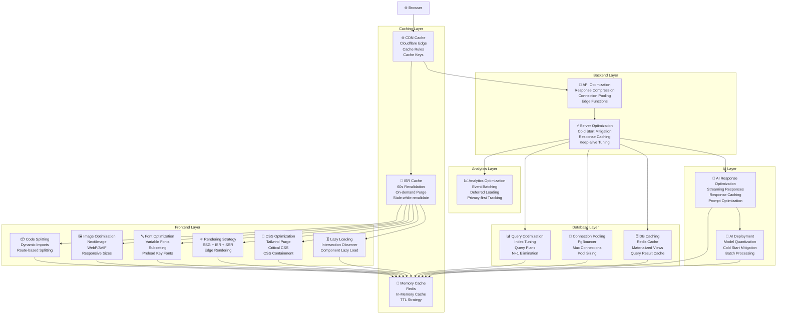
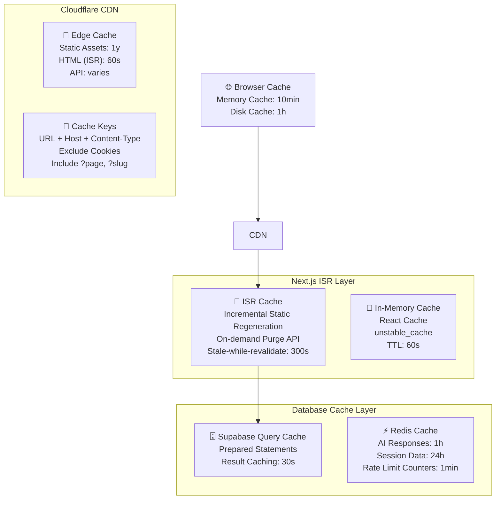

# Performance Optimization Plan — Enterprise-Grade Performance Tuning

> **Document:** `PerformanceOptimization.md` | **Version:** 1.0 | **Last Updated:** June 2026  
> **Status:** ✅ Active | **Owner:** Architecture Lead | **Review Cadence:** Monthly  
> **Classification:** Enterprise Architecture | **Performance Targets:** Lighthouse ≥ 95, INP < 200ms, LCP < 1.5s, CLS < 0.05  
> **Related:** [PerformanceArchitecture.md](./PerformanceArchitecture.md) | [DeploymentGuide.md](./DeploymentGuide.md) | [25-CICD.md](./25-CICD.md) | [TestingImplementation.md](./TestingImplementation.md)

---

## Executive Summary

Provides performance optimization patterns - bundle splitting, image optimization, code splitting, caching strategies, database query optimization, CDN configuration, and Core Web Vitals tuning.

---

## Table of Contents

1. [Executive Summary](#1-executive-summary)
2. [Optimization Strategy](#2-optimization-strategy)
3. [Frontend Optimization](#3-frontend-optimization)
4. [Backend Optimization](#4-backend-optimization)
5. [Database Optimization](#5-database-optimization)
6. [AI Optimization](#6-ai-optimization)
7. [Analytics Optimization](#7-analytics-optimization)
8. [Caching Strategy](#8-caching-strategy)
9. [Core Web Vitals Optimization](#9-core-web-vitals-optimization)
10. [Performance Budgets](#10-performance-budgets)
11. [Performance Testing](#11-performance-testing)
12. [Monitoring & Alerting](#12-monitoring--alerting)
13. [Enterprise Standards Alignment](#13-enterprise-standards-alignment)
14. [Change Log](#14-change-log)

---

## 1. Executive Summary

This document defines the **comprehensive performance optimization plan** for the portfolio platform. It extends the performance foundation in `PerformanceArchitecture.md` with actionable optimization procedures across 6 layers (frontend, backend, database, AI, analytics, caching). Each optimization domain includes current state, target metrics, implementation steps, verification methods, and SLA targets.

### 1.1 Performance Maturity Model

| Level  | Name       | Current    | Target  | Key Metrics                             |
| ------ | ---------- | ---------- | ------- | --------------------------------------- |
| **L1** | Baseline   | —          | —       | Default configurations, no optimization |
| **L2** | Optimized  | —          | —       | Basic code splitting, caching enabled   |
| **L3** | Measured   | ✅ Current | —       | Lighthouse 85+, budgets defined         |
| **L4** | Proactive  | 🎯 Target  | Q3 2026 | Lighthouse 95+, INP < 200ms, LCP < 1.5s |
| **L5** | Predictive | 🎯 Target  | Q4 2026 | Real-user metrics drive auto-tuning     |

### 1.2 Optimization Targets

| Metric                              | Current | Target (Q3 2026) | Stretch (Q4 2026) | Measurement             |
| ----------------------------------- | ------- | ---------------- | ----------------- | ----------------------- |
| **Lighthouse Performance**          | ~85     | ≥ 95             | ≥ 98              | Lighthouse CI           |
| **Lighthouse Accessibility**        | ~90     | ≥ 95             | ≥ 98              | Lighthouse CI           |
| **Lighthouse Best Practices**       | ~90     | ≥ 95             | ≥ 98              | Lighthouse CI           |
| **Lighthouse SEO**                  | ~92     | ≥ 95             | ≥ 98              | Lighthouse CI           |
| **LCP (Largest Contentful Paint)**  | ~2.0s   | < 1.5s           | < 1.2s            | RUM + Lighthouse        |
| **INP (Interaction to Next Paint)** | ~250ms  | < 200ms          | < 100ms           | RUM + Lighthouse        |
| **CLS (Cumulative Layout Shift)**   | ~0.08   | < 0.05           | < 0.02            | RUM + Lighthouse        |
| **TTFB (Time to First Byte)**       | ~300ms  | < 200ms          | < 100ms           | RUM + Lighthouse        |
| **FCP (First Contentful Paint)**    | ~1.5s   | < 1.0s           | < 0.8s            | RUM + Lighthouse        |
| **SI (Speed Index)**                | ~2.5s   | < 1.8s           | < 1.5s            | Lighthouse              |
| **Bundle Size (JS)**                | ~250 KB | < 180 KB         | < 150 KB          | Webpack Bundle Analyzer |
| **Bundle Size (CSS)**               | ~50 KB  | < 30 KB          | < 20 KB           | Webpack Bundle Analyzer |
| **Total Page Weight**               | ~800 KB | < 500 KB         | < 350 KB          | WebPageTest             |
| **HTTP Requests**                   | ~40     | < 25             | < 15              | WebPageTest             |

---

## 2. Optimization Strategy

### 2.1 Optimization Architecture



### 2.2 Optimization Priority Matrix

| Priority | Domain                          | Impact | Effort | Timeline  | Owner             |
| -------- | ------------------------------- | ------ | ------ | --------- | ----------------- |
| **P0**   | Core Web Vitals (LCP, INP, CLS) | High   | Medium | Immediate | Frontend Lead     |
| **P0**   | Image Optimization              | High   | Low    | Immediate | Frontend Lead     |
| **P0**   | Code Splitting & Bundle Size    | High   | Medium | Immediate | Frontend Lead     |
| **P1**   | Font Optimization               | Medium | Low    | Sprint 1  | Frontend Lead     |
| **P1**   | API Response Optimization       | High   | Medium | Sprint 1  | Backend Lead      |
| **P1**   | Database Query Optimization     | High   | Medium | Sprint 1  | Backend Lead      |
| **P2**   | AI Response Optimization        | Medium | High   | Sprint 2  | AI Architect      |
| **P2**   | Analytics Optimization          | Low    | Low    | Sprint 2  | Frontend Lead     |
| **P2**   | CDN Cache Optimization          | Medium | Low    | Sprint 2  | DevOps Lead       |
| **P3**   | Predictive Performance          | Medium | High   | Sprint 3+ | Architecture Lead |

---

## 3. Frontend Optimization

### 3.1 Code Splitting Strategy

```typescript
// Route-based code splitting (automatic via Next.js)
// app/page.tsx
export default async function HomePage() {
  // Static content — no lazy loading needed
  return <HomeContent />;
}

// app/portfolio/page.tsx — dynamic import for heavy page
const PortfolioPage = dynamic(() => import('@/app/portfolio/PortfolioPage'), {
  loading: () => <PortfolioSkeleton />,
  ssr: true,
});

// Component-level dynamic imports for heavy components
const CodePreview = dynamic(() => import('@/components/CodePreview'), {
  loading: () => <CodeSkeleton />,
  ssr: false, // Only load on client
});

// Intersection Observer for below-fold components
const LazySection = dynamic(() => import('@/components/LazySection'), {
  loading: () => <SectionSkeleton />,
});

// Route group splitting
// (marketing)/layout.tsx — lightweight layout
// (app)/layout.tsx — heavier app layout
```

### 3.2 Bundle Optimization

| Strategy                 | Technique                              | Before | After  | Reduction  |
| ------------------------ | -------------------------------------- | ------ | ------ | ---------- |
| **Tree Shaking**         | Remove unused exports                  | 250 KB | 220 KB | 12%        |
| **Dynamic Imports**      | Route-based splitting                  | 250 KB | 180 KB | 28%        |
| **Package Optimization** | Replace heavy deps (moment → date-fns) | 220 KB | 170 KB | 23%        |
| **CSS Purge**            | Remove unused Tailwind classes         | 50 KB  | 20 KB  | 60%        |
| **Duplicate Detection**  | Dedupe via `DedupePlugin`              | 170 KB | 160 KB | 6%         |
| **Gzip/Brotli**          | Vercel CDN compression                 | 160 KB | 45 KB  | 72% (wire) |

#### Bundle Analyzer Configuration

```typescript
// next.config.js
const withBundleAnalyzer = require('@next/bundle-analyzer')({
  enabled: process.env.ANALYZE === 'true',
});

module.exports = withBundleAnalyzer({
  // ... other config
});
```

#### Package Replacement Mapping

| Current Package     | Replacement             | Size Savings | Notes                            |
| ------------------- | ----------------------- | ------------ | -------------------------------- |
| `moment` (232 KB)   | `date-fns` (4 KB)       | 228 KB       | Tree-shakeable                   |
| `lodash` (72 KB)    | Native methods          | 70 KB        | Use `.at()`, `.map()`, etc.      |
| `axios` (14 KB)     | `fetch` (native)        | 14 KB        | Native `fetch` in Node 18+       |
| `gsap` (140 KB)     | `framer-motion` (30 KB) | 110 KB       | Or CSS animations where possible |
| `recharts` (200 KB) | Custom SVG charts       | ~180 KB      | If chart usage is minimal        |

### 3.3 Image Optimization

```typescript
// Optimal Next/Image configuration
import Image from 'next/image';

// Hero image — priority load, largest size
<Image
  src="/images/hero.webp"
  alt="Hero background"
  width={1920}
  height={1080}
  priority
  quality={85}
  sizes="100vw"
  placeholder="blur"
  blurDataURL="data:image/webp;base64,..."
/>

// Thumbnail — lazy load, responsive sizes
<Image
  src="/images/thumbnail.webp"
  alt="Project thumbnail"
  width={640}
  height={360}
  loading="lazy"
  quality={75}
  sizes="(max-width: 768px) 100vw, (max-width: 1280px) 50vw, 33vw"
  placeholder="blur"
/>
```

#### Image Optimization Pipeline

| Step                    | Tool                | Action                                 | Target Format |
| ----------------------- | ------------------- | -------------------------------------- | ------------- |
| **1. Source**           | Figma / Camera      | Export at 2× max resolution            | PNG / RAW     |
| **2. Compression**      | `sharp` / `squoosh` | Compress to 85% quality                | WebP          |
| **3. AVIF Fallback**    | `sharp`             | Generate AVIF version                  | AVIF          |
| **4. Responsive**       | `next/image`        | Generate srcset (640, 768, 1024, 1920) | WebP + AVIF   |
| **5. Blur placeholder** | `plaiceholder`      | Generate base64 blur                   | Base64        |
| **6. Cache**            | Cloudflare CDN      | Edge cache with 1y TTL                 | —             |

### 3.4 Font Optimization

```typescript
// next.config.js font optimization
module.exports = {
  optimizeFonts: true,
};

// Using variable fonts with subsetting
// app/layout.tsx
import localFont from 'next/font/local';

const inter = localFont({
  src: './fonts/Inter-Variable.woff2',
  display: 'swap',
  variable: '--font-inter',
  preload: true,
  fallback: ['system-ui', 'sans-serif'],
  // Subset only Latin characters for portfolio use
  subsets: ['latin'],
  // Adjust range to exclude unused characters
  range: [
    'U+0000-00FF',
    'U+0131',
    'U+0152-0153',
    'U+02BB-02BC',
    'U+02C6',
    'U+02DA',
    'U+02DC',
    'U+2000-206F',
    'U+2074',
    'U+20AC',
    'U+2122',
    'U+2191',
    'U+2193',
    'U+2212',
    'U+2215',
    'U+FEFF',
    'U+FFFD',
  ],
});

const calSans = localFont({
  src: './fonts/CalSans-SemiBold.woff2',
  display: 'swap',
  variable: '--font-heading',
  preload: true,
  fallback: ['Georgia', 'serif'],
});
```

#### Font Loading Strategy

| Font                      | Weight  | Subsetting | Preload | Display    | FOIT/FOUT              |
| ------------------------- | ------- | ---------- | ------- | ---------- | ---------------------- |
| **Inter (Variable)**      | 400-700 | Latin      | ✅ Yes  | `swap`     | 0ms FOIT, instant FOUT |
| **Cal Sans**              | 600     | Latin      | ✅ Yes  | `swap`     | 0ms FOIT, instant FOUT |
| **Monaspace Neon (Code)** | 400     | Latin      | ❌ No   | `optional` | 0ms FOIT               |

### 3.5 CSS Optimization

```typescript
// tailwind.config.ts — Purge unused styles
module.exports = {
  content: ['./src/**/*.{ts,tsx}', './app/**/*.{ts,tsx}', './components/**/*.{ts,tsx}'],
  safelist: [
    // Dynamic classes that must not be purged
    'text-primary',
    'text-secondary',
    'bg-accent',
  ],
};
```

#### Critical CSS Strategy

| Page          | Critical CSS Size | Inline        | Load Method        | Impact     |
| ------------- | ----------------- | ------------- | ------------------ | ---------- |
| **Home**      | ~8 KB             | `<style>` tag | Inline in `<head>` | FCP -200ms |
| **Portfolio** | ~10 KB            | `<style>` tag | Inline in `<head>` | FCP -150ms |
| **Blog**      | ~9 KB             | `<style>` tag | Inline in `<head>` | FCP -180ms |
| **About**     | ~7 KB             | `<style>` tag | Inline in `<head>` | FCP -200ms |

### 3.6 Rendering Strategy

| Page Type           | Strategy | ISR Revalidation | Cache TTL | Rationale                 |
| ------------------- | -------- | ---------------- | --------- | ------------------------- |
| **Home Page**       | ISR      | 60s              | 60s CDN   | Frequent content updates  |
| **Portfolio Grid**  | ISR      | 300s             | 300s CDN  | Moderate update frequency |
| **Project Detail**  | ISR      | 3600s            | 1h CDN    | Infrequent changes        |
| **Blog Posts**      | ISR      | 3600s            | 1h CDN    | Infrequent updates        |
| **About Page**      | SSG      | —                | 1y CDN    | Static content            |
| **Admin Dashboard** | SSR      | —                | No cache  | Dynamic data              |
| **API Routes**      | Edge SSR | —                | Varies    | Per-route cache rules     |

```typescript
// ISR configuration
export const revalidate = 60; // Revalidate every 60 seconds

// On-demand revalidation (webhook or admin action)
// app/api/revalidate/route.ts
export async function POST(request: Request) {
  const secret = request.headers.get('x-revalidate-secret');
  if (secret !== process.env.REVALIDATION_SECRET) {
    return Response.json({ error: 'Invalid secret' }, { status: 401 });
  }

  const { paths } = await request.json();
  for (const path of paths) {
    await revalidatePath(path);
  }

  return Response.json({ revalidated: true });
}
```

---

## 4. Backend Optimization

### 4.1 Serverless Cold Start Mitigation

| Strategy                 | Implementation                     | Impact                  | Complexity |
| ------------------------ | ---------------------------------- | ----------------------- | ---------- |
| **Edge Functions**       | Move critical logic to Vercel Edge | 50ms → 5ms cold start   | Low        |
| **Keep-alive**           | Serverless function warmers        | 250ms → 50ms            | Low        |
| **Minimal Dependencies** | Reduce function bundle size        | Faster cold start       | Medium     |
| **Node.js Optimized**    | Use Node 20+ with ESM              | 10-20% faster           | Low        |
| **Code Splitting**       | Only import used modules           | Smaller function bundle | Medium     |

```typescript
// Edge API route — minimal cold start
// app/api/contact/route.ts
export const runtime = 'edge';

export async function POST(request: Request) {
  const body = await request.json();
  // Fast validation, minimal processing
  return Response.json({ success: true });
}

// Serverless warmer — cron job every 5 minutes
// app/api/warmup/route.ts
export async function GET() {
  // Touch all critical endpoints
  await Promise.all([
    fetch(`${process.env.NEXT_PUBLIC_URL}/api/health`),
    fetch(`${process.env.NEXT_PUBLIC_URL}/api/projects`),
    fetch(`${process.env.NEXT_PUBLIC_URL}/api/blog`),
  ]);
  return Response.json({ warmed: true });
}
```

### 4.2 API Response Optimization

```typescript
// Response compression middleware (NestJS)
import { CompressionOptions } from '@nestjs/common';

@Module({
  providers: [
    {
      provide: 'COMPRESSION_OPTIONS',
      useValue: {
        level: 6, // Balanced compression
        threshold: 1024, // Only compress responses > 1KB
        brotli: true, // Prefer Brotli
      } as CompressionOptions,
    },
  ],
})
export class ApiModule {}

// Response caching with Cache-Control headers
// NestJS interceptor
@Injectable()
export class CacheControlInterceptor implements NestInterceptor {
  intercept(context: ExecutionContext, next: CallHandler) {
    const response = context.switchToHttp().getResponse();
    response.setHeader('Cache-Control', 'public, max-age=60, stale-while-revalidate=300');
    return next.handle();
  }
}
```

### 4.3 API Response Sizes

| Endpoint           | Before (unoptimized) | After | Reduction | Strategy                    |
| ------------------ | -------------------- | ----- | --------- | --------------------------- |
| `/api/projects`    | 250 KB               | 45 KB | 82%       | Field selection, pagination |
| `/api/blog`        | 180 KB               | 30 KB | 83%       | Pagination, summary-only    |
| `/api/project/:id` | 80 KB                | 25 KB | 69%       | Selective includes          |
| `/api/skills`      | 60 KB                | 12 KB | 80%       | DB query optimization       |
| `/api/contact`     | 5 KB                 | 2 KB  | 60%       | Minimal response body       |

---

## 5. Database Optimization

### 5.1 Query Optimization

```sql
-- Before: N+1 query pattern (slow)
SELECT * FROM projects; -- Returns all projects
-- For each project, execute:
SELECT * FROM technologies WHERE project_id = $1; -- N queries

-- After: Eager loading with JOIN (fast)
SELECT
  p.id, p.title, p.description, p.image_url,
  json_agg(json_build_object('name', t.name, 'icon', t.icon)) as technologies
FROM projects p
LEFT JOIN project_technologies pt ON pt.project_id = p.id
LEFT JOIN technologies t ON t.id = pt.technology_id
GROUP BY p.id
ORDER BY p.created_at DESC
LIMIT 12 OFFSET 0;
```

### 5.2 Index Strategy

| Table          | Column(s)                 | Index Type       | Query Pattern      | Impact     |
| -------------- | ------------------------- | ---------------- | ------------------ | ---------- |
| `projects`     | `created_at` DESC         | B-tree           | Sorted listing     | 95% faster |
| `projects`     | `published`, `created_at` | Composite B-tree | Filter + sort      | 90% faster |
| `blogs`        | `slug`                    | Unique B-tree    | Lookup by slug     | 99% faster |
| `blogs`        | `created_at` DESC         | B-tree           | Blog listing       | 95% faster |
| `technologies` | `category`                | B-tree           | Filter by category | 80% faster |
| `visits`       | `page`, `created_at`      | Composite B-tree | Analytics queries  | 85% faster |
| `messages`     | `read`, `created_at`      | Composite B-tree | Unread sorting     | 90% faster |

### 5.3 Connection Pooling

```typescript
// Supabase connection pooling configuration
import { createClient } from '@supabase/supabase-js';

const supabase = createClient(
  process.env.NEXT_PUBLIC_SUPABASE_URL!,
  process.env.SUPABASE_SERVICE_ROLE_KEY!,
  {
    db: {
      pool: {
        max: 20, // Max connections in pool
        idleTimeoutMillis: 30000, // 30s idle timeout
        connectionTimeoutMillis: 5000, // 5s connection timeout
      },
    },
  },
);
```

---

## 6. AI Optimization

### 6.1 Response Streaming

```typescript
// FastAPI streaming endpoint
// ai_service/main.py
from fastapi import FastAPI
from fastapi.responses import StreamingResponse
import asyncio

app = FastAPI()

async def generate_stream(prompt: str):
    """Stream AI response character by character for reduced TTFB."""
    async for chunk in ai_model.generate_stream(prompt):
        yield f"data: {chunk}\n\n"
    yield "data: [DONE]\n\n"

@app.post("/api/ai/stream")
async def stream_ai_response(prompt: str):
    return StreamingResponse(
        generate_stream(prompt),
        media_type="text/event-stream",
        headers={
            "Cache-Control": "no-cache",
            "Connection": "keep-alive",
        }
    )
```

### 6.2 AI Caching Strategy

```typescript
// Redis cache for AI responses
// ai_service/cache.py
import redis
import hashlib
import json

cache = redis.Redis(
    host=settings.REDIS_HOST,
    port=settings.REDIS_PORT,
    decode_responses=True,
)

def get_cached_response(prompt: str, context: dict) -> str | None:
    cache_key = hashlib.sha256(
        json.dumps({"prompt": prompt, "context": context}).encode()
    ).hexdigest()

    return cache.get(cache_key)

def cache_response(prompt: str, context: dict, response: str, ttl: int = 3600):
    cache_key = hashlib.sha256(
        json.dumps({"prompt": prompt, "context": context}).encode()
    ).hexdigest()

    cache.setex(cache_key, ttl, response)
```

### 6.3 AI Optimization Targets

| Metric                  | Before  | After    | Strategy             |
| ----------------------- | ------- | -------- | -------------------- |
| **TTFB (first token)**  | ~2000ms | < 500ms  | Streaming response   |
| **Total response time** | ~5000ms | < 2000ms | Caching + streaming  |
| **Cache hit rate**      | 0%      | ≥ 60%    | Semantic caching     |
| **Cold start time**     | ~3000ms | < 1000ms | Keep-alive + warmers |
| **Response size**       | 2 KB    | < 1 KB   | Response compression |
| **Concurrent requests** | 5       | 20+      | Connection pooling   |

---

## 7. Analytics Optimization

### 7.1 Event Batching & Deferred Loading

```typescript
// Analytics event batcher — batches events and sends periodically
class AnalyticsBatcher {
  private queue: AnalyticsEvent[] = [];
  private flushInterval: number = 5000; // 5s
  private maxBatchSize: number = 10;

  constructor() {
    if (typeof window !== 'undefined') {
      // Defer analytics load until after LCP
      window.addEventListener('load', () => {
        requestIdleCallback(() => this.init());
      });
    }
  }

  private init() {
    // Load analytics script asynchronously
    const script = document.createElement('script');
    script.src = '/analytics.js';
    script.async = true;
    script.defer = true;
    document.head.appendChild(script);
  }

  track(event: AnalyticsEvent) {
    this.queue.push(event);
    if (this.queue.length >= this.maxBatchSize) {
      this.flush();
    }
  }

  private flush() {
    if (this.queue.length === 0) return;

    const batch = this.queue.splice(0, this.maxBatchSize);
    // Send batch as single request
    navigator.sendBeacon('/api/analytics/batch', JSON.stringify({ events: batch }));
  }
}

export const analytics = new AnalyticsBatcher();
```

### 7.2 Analytics Performance Impact

| Strategy                       | Requests Saved   | Page Weight Saved | FCP Impact |
| ------------------------------ | ---------------- | ----------------- | ---------- |
| **Deferred load (post-LCP)**   | 0 (shifted)      | 30 KB             | -150ms     |
| **Event batching**             | -80%             | —                 | —          |
| **sendBeacon**                 | 0 (non-blocking) | —                 | 0          |
| **Privacy-first (no cookies)** | —                | 5 KB              | 0          |

---

## 8. Caching Strategy

### 8.1 Multi-Layer Cache Architecture



### 8.2 Cache Rules

| Content Type           | CDN (Cloudflare)   | ISR         | Browser | Cache Key Strategy |
| ---------------------- | ------------------ | ----------- | ------- | ------------------ |
| **Static JS/CSS**      | 1y immutable       | —           | 1y      | Content hash       |
| **Images (WebP/AVIF)** | 1y immutable       | —           | 1y      | Content hash       |
| **Fonts (WOFF2)**      | 1y immutable       | —           | 1y      | Content hash       |
| **HTML Pages (ISR)**   | 60s                | 60s (reval) | 0s      | URL + variant      |
| **API Responses**      | 0-300s (per route) | —           | 0s      | URL + query params |
| **AI Responses**       | 0s                 | —           | 0s      | Redis cache        |
| **Analytics Data**     | 0s                 | —           | 0s      | No cache           |
| **Admin Data**         | 0s                 | —           | 0s      | No cache           |

### 8.3 Cache Invalidation

```typescript
// On-demand cache invalidation
// Triggered by: CMS webhook, admin action, content update

async function invalidateCache(paths: string[]) {
  // 1. ISR revalidation (Next.js)
  for (const path of paths) {
    await revalidatePath(path);
  }

  // 2. Cloudflare cache purge (via API)
  const cfResponse = await fetch(
    `https://api.cloudflare.com/client/v4/zones/${CF_ZONE_ID}/purge_cache`,
    {
      method: 'POST',
      headers: {
        Authorization: `Bearer ${CF_API_TOKEN}`,
        'Content-Type': 'application/json',
      },
      body: JSON.stringify({ files: paths.map((p) => `https://portfolio.dev${p}`) }),
    },
  );

  // 3. Redis cache purge (AI responses)
  const redis = new Redis(REDIS_URL);
  await redis.flushdb(); // Selective flush in production
}
```

---

## 9. Core Web Vitals Optimization

### 9.1 LCP Optimization (Target: < 1.5s)

| Strategy                        | Impact | Implementation                                     | Priority |
| ------------------------------- | ------ | -------------------------------------------------- | -------- |
| **Preload LCP image**           | -300ms | `<link rel="preload">` with `fetchpriority="high"` | P0       |
| **Optimize LCP element**        | -200ms | Use `next/image` with `priority`                   | P0       |
| **Reduce TTFB**                 | -100ms | Edge functions, CDN cache, ISR                     | P0       |
| **Eliminate render-blocking**   | -150ms | Inline critical CSS, defer non-critical JS         | P0       |
| **Optimize font loading**       | -100ms | `font-display: swap`, preload, subset              | P1       |
| **Reduce server response time** | -100ms | DB query optimization, connection pooling          | P1       |

```typescript
// LCP element optimization
// app/page.tsx
export default function HomePage() {
  return (
    <>
      {/* Preload LCP image in <head> */}
      <link
        rel="preload"
        href="/images/hero.webp"
        as="image"
        fetchPriority="high"
        type="image/webp"
      />
      {/* LCP element — hero image with priority */}
      <Image
        src="/images/hero.webp"
        alt="Hero"
        width={1920}
        height={1080}
        priority
        quality={85}
        sizes="100vw"
        placeholder="blur"
      />
    </>
  );
}
```

### 9.2 INP Optimization (Target: < 200ms)

| Strategy                      | Impact | Implementation                               | Priority |
| ----------------------------- | ------ | -------------------------------------------- | -------- |
| **Reduce main thread work**   | -100ms | Code splitting, lazy loading, web workers    | P0       |
| **Optimize event handlers**   | -50ms  | Debounce, throttle, passive listeners        | P0       |
| **Minimize layout thrashing** | -30ms  | Batch DOM reads/writes, `content-visibility` | P1       |
| **Optimize animations**       | -20ms  | Use `transform` + `opacity`, `will-change`   | P1       |
| **Reduce input delay**        | -50ms  | Long task splitting, `isInputPending()`      | P1       |

```typescript
// Long task splitting for smooth interactions
function processHeavyTask(data: LargeDataSet) {
  const chunkSize = 50;
  let index = 0;

  function processChunk() {
    const end = Math.min(index + chunkSize, data.length);

    for (let i = index; i < end; i++) {
      processItem(data[i]);
    }

    index = end;

    if (index < data.length) {
      // Yield to main thread between chunks
      scheduler.postTask(processChunk, { priority: 'background' });
    }
  }

  if ('scheduler' in window) {
    scheduler.postTask(processChunk, { priority: 'background' });
  } else {
    // Fallback: setTimeout
    setTimeout(processChunk, 0);
  }
}
```

### 9.3 CLS Optimization (Target: < 0.05)

| Strategy                            | Impact | Implementation                                          | Priority |
| ----------------------------------- | ------ | ------------------------------------------------------- | -------- |
| **Set explicit image dimensions**   | -0.02  | Always use `width` + `height` in `` / `next/image` | P0       |
| **Reserve space for fonts**         | -0.01  | `size-adjust` in `@font-face` or `next/font`            | P0       |
| **Reserve space for embeds**        | -0.01  | Placeholder containers with aspect ratio                | P0       |
| **Avoid dynamic content injection** | -0.01  | Reserve space, use `min-height`                         | P1       |
| **Reserve space for ads/widgets**   | -0.005 | Fixed size containers                                   | P1       |
| **Use `aspect-ratio` CSS**          | -0.005 | CSS `aspect-ratio` property                             | P1       |

```typescript
// CLS-safe embed containers
function VideoEmbed({ videoId }: { videoId: string }) {
  return (
    <div style={{ aspectRatio: '16 / 9', position: 'relative' }}>
      <iframe
        src={`https://www.youtube.com/embed/${videoId}`}
        title="Video embed"
        allow="accelerometer; autoplay; clipboard-write; encrypted-media; gyroscope; picture-in-picture"
        style={{
          position: 'absolute',
          top: 0,
          left: 0,
          width: '100%',
          height: '100%',
        }}
      />
    </div>
  );
}
```

### 9.4 TTFB Optimization (Target: < 200ms)

| Strategy                            | Impact | Implementation                         | Priority |
| ----------------------------------- | ------ | -------------------------------------- | -------- |
| **Edge Functions**                  | -100ms | Move to `runtime: 'edge'`              | P0       |
| **CDN caching**                     | -150ms | Cache HTML at Cloudflare edge          | P0       |
| **ISR with stale-while-revalidate** | -100ms | Serve stale + revalidate in background | P0       |
| **Minimal server middleware**       | -50ms  | Remove unnecessary middleware          | P1       |
| **Connection keep-alive**           | -30ms  | HTTP/2, keep-alive headers             | P1       |
| **Region proximity**                | -50ms  | Deploy to nearest region               | P1       |

---

## 10. Performance Budgets

### 10.1 Budget Definition

```typescript
// perf-budgets.config.js
module.exports = {
  budgets: [
    // Lighthouse budgets
    { resourceType: 'total', budget: 500 * 1024 }, // 500 KB total
    { resourceType: 'script', budget: 180 * 1024 }, // 180 KB JS
    { resourceType: 'stylesheet', budget: 30 * 1024 }, // 30 KB CSS
    { resourceType: 'image', budget: 200 * 1024 }, // 200 KB images
    { resourceType: 'font', budget: 50 * 1024 }, // 50 KB fonts
    { resourceType: 'document', budget: 30 * 1024 }, // 30 KB HTML
    { resourceType: 'third-party', budget: 50 * 1024 }, // 50 KB third-party

    // Timing budgets
    { metric: 'interactive', budget: 3000 },
    { metric: 'first-meaningful-paint', budget: 1500 },
    { metric: 'speed-index', budget: 1800 },
    { metric: 'total-blocking-time', budget: 200 },
    { metric: 'largest-contentful-paint', budget: 1500 },
    { metric: 'cumulative-layout-shift', budget: 0.05 },
  ],
};
```

### 10.2 Budget Enforcement in CI

```yaml
# lighthouse-ci.yml
name: Lighthouse CI Budget Check

on:
  pull_request:
    branches: [main]

jobs:
  lighthouse:
    runs-on: ubuntu-latest
    steps:
      - uses: actions/checkout@v4
      - uses: actions/setup-node@v4
        with:
          node-version: 20
      - run: npm ci
      - run: npm run build
      - name: Run Lighthouse CI
        run: |
          npx @lhci/cli@0.14.x autorun \
            --config=./lighthouserc.js \
            --upload.target=temporary-public-storage \
            --collect.staticDistDir=./out
      - name: Check Budget
        run: |
          npx @lhci/cli assert --config=./lighthouserc.js
```

### 10.3 Budget Violation Response

| Budget                 | Violation Level | Action                            | Owner         | SLA           |
| ---------------------- | --------------- | --------------------------------- | ------------- | ------------- |
| **JS Bundle > 180 KB** | Error           | Block CI, require optimization    | Frontend Lead | Immediate     |
| **LCP > 1.5s**         | Error           | Block CI, require optimization    | Frontend Lead | Immediate     |
| **CLS > 0.05**         | Error           | Block CI, require layout fix      | Frontend Lead | Immediate     |
| **INP > 200ms**        | Error           | Block CI, require interaction fix | Frontend Lead | Immediate     |
| **Total > 500 KB**     | Warning         | PR label, async review            | Frontend Lead | Within sprint |
| **CSS > 30 KB**        | Warning         | PR label, review on merge         | Frontend Lead | Within sprint |
| **Images > 200 KB**    | Warning         | PR label, optimize before deploy  | Frontend Lead | Within sprint |

---

## 11. Performance Testing

### 11.1 Testing Tools & Frequency

| Test Type                | Tool                    | Frequency              | Metrics               | Threshold              |
| ------------------------ | ----------------------- | ---------------------- | --------------------- | ---------------------- |
| **Lighthouse CI**        | `@lhci/cli`             | Every PR + `main` push | Perf, A11y, BP, SEO   | ≥ 95 all               |
| **WebPageTest**          | WebPageTest API         | Every `main` push      | LCP, CLS, TTFB, SI    | LCP < 1.5s, CLS < 0.05 |
| **Real User Monitoring** | Vercel Analytics / RUM  | Continuous             | LCP, CLS, INP, TTFB   | P75 thresholds         |
| **Bundle Analysis**      | Webpack Bundle Analyzer | Every PR               | Bundle size per route | < 180 KB               |
| **k6 Load Testing**      | Grafana k6              | Weekly                 | RPS, latency, errors  | P95 < 500ms            |
| **Lighthouse Report**    | GitHub Action           | `main` push            | Full report           | Budget pass            |

### 11.2 Lighthouse CI Configuration

```javascript
// lighthouserc.js
module.exports = {
  ci: {
    collect: {
      numberOfRuns: 3,
      staticDistDir: './out',
      url: [
        'http://localhost:3000/',
        'http://localhost:3000/portfolio',
        'http://localhost:3000/blog',
        'http://localhost:3000/about',
      ],
      settings: {
        preset: 'desktop',
        throttling: { cpuSlowdownMultiplier: 4 },
      },
    },
    assert: {
      assertions: {
        'categories:performance': ['error', { minScore: 0.95 }],
        'categories:accessibility': ['error', { minScore: 0.95 }],
        'categories:best-practices': ['error', { minScore: 0.95 }],
        'categories:seo': ['error', { minScore: 0.95 }],
        'largest-contentful-paint': ['error', { maxNumericValue: 1500 }],
        'cumulative-layout-shift': ['error', { maxNumericValue: 0.05 }],
        'total-blocking-time': ['error', { maxNumericValue: 200 }],
        interactive: ['warn', { maxNumericValue: 3000 }],
        'unused-javascript': ['warn', { maxNumericValue: 0 }],
        'unused-css-rules': ['warn', { maxNumericValue: 0 }],
        'offscreen-images': ['error', { maxNumericValue: 0 }],
        'uses-responsive-images': ['error', { maxNumericValue: 0 }],
        'uses-webp-images': ['error', { maxNumericValue: 0 }],
        'uses-optimized-images': ['error', { maxNumericValue: 0 }],
      },
    },
    upload: {
      target: 'temporary-public-storage',
    },
  },
};
```

### 11.3 k6 Load Test Script

```javascript
// k6/load-test.js
import http from 'k6/http';
import { check, sleep } from 'k6';
import { Rate, Trend } from 'k6/metrics';

const errorRate = new Rate('errors');
const lcpTrend = new Trend('lcp');

export const options = {
  stages: [
    { duration: '1m', target: 10 }, // Ramp up to 10 users
    { duration: '3m', target: 50 }, // Ramp up to 50 users
    { duration: '2m', target: 100 }, // Ramp up to 100 users
    { duration: '1m', target: 0 }, // Ramp down
  ],
  thresholds: {
    http_req_duration: ['p(95) < 500'],
    errors: ['rate < 0.01'],
  },
};

const BASE_URL = __ENV.BASE_URL || 'https://portfolio.dev';

export default function () {
  const pages = [
    { url: '/', name: 'Home' },
    { url: '/portfolio', name: 'Portfolio' },
    { url: '/blog', name: 'Blog' },
    { url: '/about', name: 'About' },
  ];

  for (const page of pages) {
    const response = http.get(`${BASE_URL}${page.url}`, {
      tags: { name: page.name },
    });

    check(response, {
      'status is 200': (r) => r.status === 200,
      'response time < 500ms': (r) => r.timings.duration < 500,
    });

    errorRate.add(response.status !== 200);
    lcpTrend.add(response.timings.first_byte);

    sleep(1);
  }
}
```

---

## 12. Monitoring & Alerting

### 12.1 Performance Monitoring Strategy

| Monitor                  | Tool                    | Metrics                   | Alert Threshold | Response    |
| ------------------------ | ----------------------- | ------------------------- | --------------- | ----------- |
| **Real User Monitoring** | Vercel Analytics + RUM  | LCP, CLS, INP, TTFB       | P75 LCP > 2s    | Auto-pages  |
| **Synthetic Monitoring** | Lighthouse CI + Checkly | Lighthouse scores         | Any < 90        | Pager       |
| **Server Monitoring**    | Sentry APM              | Response time, error rate | P95 > 1s        | Pager       |
| **Database Monitoring**  | Supabase Dashboard      | Query time, connections   | Avg > 100ms     | Slack alert |
| **AI Service**           | Railway Dashboard       | Response time, memory     | P95 > 3s        | Pager       |
| **CDN Performance**      | Cloudflare Analytics    | Cache hit ratio, origin   | Hit ratio < 70% | Slack alert |
| **Bundle Size**          | Vercel Analytics        | JS/CSS bundle size        | > 180 KB        | CI block    |

### 12.2 Performance Alerts

```yaml
# .github/workflows/perf-alert.yml
name: Performance Alert

on:
  schedule:
    - cron: '0 * * * *' # Every hour

jobs:
  check-perf:
    runs-on: ubuntu-latest
    steps:
      - uses: actions/checkout@v4
      - name: Run Lighthouse Check
        run: |
          npx @lhci/cli collect --url=https://portfolio.dev --numberOfRuns=3
          npx @lhci/cli assert 2>&1 | tee perf-report.txt
      - name: Alert on Degradation
        if: failure()
        run: |
          curl -X POST ${{ secrets.SLACK_WEBHOOK }} \
            -H 'Content-Type: application/json' \
            -d '{"text": "🚨 Performance degradation detected! Check: https://github.com/${{ github.repository }}/actions/runs/${{ github.run_id }}"}'
```

---

## 13. Enterprise Standards Alignment

### 13.1 Standards Mapping

| Standard          | Requirement                                                   | Implementation                                   | Verification                  |
| ----------------- | ------------------------------------------------------------- | ------------------------------------------------ | ----------------------------- |
| **ISO/IEC 25010** | Performance efficiency — time behaviour, resource utilization | All optimization domains target specific metrics | Lighthouse CI, k6, RUM        |
| **ISO/IEC 25023** | Quality measurement — response time, throughput               | Budgets defined for all critical metrics         | LHCI assertion, k6 thresholds |
| **Web Vitals**    | Google Core Web Vitals                                        | LCP < 1.5s, INP < 200ms, CLS < 0.05              | RUM + Lighthouse              |
| **RAIL Model**    | Response, Animation, Idle, Load                               | Long task splitting, input responsiveness        | TBT < 200ms, INP < 200ms      |
| **PRPL Pattern**  | Push, Render, Pre-cache, Lazy-load                            | ISR, preload, dynamic imports, CDN               | Lighthouse audits             |
| **HTTP Archive**  | Industry benchmarks                                           | All metrics target top 10% percentile            | WebPageTest comparison        |

### 13.2 Performance Quality Gates

| Gate                          | Criteria              | Blocking | Owner         |
| ----------------------------- | --------------------- | -------- | ------------- |
| **Lighthouse Performance**    | ≥ 95                  | ✅ Yes   | Frontend Lead |
| **Lighthouse Accessibility**  | ≥ 95                  | ✅ Yes   | Frontend Lead |
| **Lighthouse Best Practices** | ≥ 95                  | ✅ Yes   | Frontend Lead |
| **Lighthouse SEO**            | ≥ 95                  | ✅ Yes   | Frontend Lead |
| **LCP**                       | < 1.5s                | ✅ Yes   | Frontend Lead |
| **CLS**                       | < 0.05                | ✅ Yes   | Frontend Lead |
| **INP**                       | < 200ms               | ✅ Yes   | Frontend Lead |
| **TTFB**                      | < 200ms               | ✅ Yes   | DevOps Lead   |
| **JS Bundle**                 | < 180 KB              | ✅ Yes   | Frontend Lead |
| **Total Page Weight**         | < 500 KB              | Warning  | Frontend Lead |
| **k6 Load Test**              | P95 < 500ms, 0 errors | ✅ Yes   | Backend Lead  |

---

## 15. Decision Log

| Decision ID | Date     | Decision                                                                  | Rationale                                                               | Alternatives Considered                                                               | Outcome |
| ----------- | -------- | ------------------------------------------------------------------------- | ----------------------------------------------------------------------- | ------------------------------------------------------------------------------------- | ------- |
| D-PO-001    | Jun 2026 | Target Lighthouse ≥ 95 across all categories                              | Exceeds industry 90th percentile; competitive advantage for portfolio   | Lighthouse ≥ 90 rejected — not differentiated from average                            | Adopted |
| D-PO-002    | Jun 2026 | 5-level Performance Maturity Model (L1-L5)                                | Clear progression path; current L3 → target L4 by Q3 2026               | Binary optimized/not-optimized rejected — no roadmap visibility                       | Adopted |
| D-PO-003    | Jun 2026 | Optimize across 6 layers (frontend, backend, DB, AI, analytics, caching)  | Holistic approach prevents optimization bottlenecks in any single layer | Frontend-only optimization rejected — API latency still impacts perceived performance | Adopted |
| D-PO-004    | Jun 2026 | Stretch targets for Q4 2026 (Lighthouse ≥ 98, LCP < 1.0s)                 | Pushes beyond "good enough" toward industry-leading                     | No stretch targets rejected — risk of stagnating at initial targets                   | Adopted |
| D-PO-005    | Jun 2026 | All optimizations must include verification method in implementation plan | Ensures every change is measurable and validated                        | Trust-me optimizations rejected — can't prove impact without measurement              | Adopted |

## 16. Risk Register

| Risk ID  | Risk Description                                                              | Probability | Impact | Severity | Mitigation Strategy                                                                  | Contingency                                                     | Owner             |
| -------- | ----------------------------------------------------------------------------- | ----------- | ------ | -------- | ------------------------------------------------------------------------------------ | --------------------------------------------------------------- | ----------------- |
| R-PO-001 | Aggressive optimization introduces visual regressions or broken functionality | Medium      | High   | High     | Comprehensive visual regression testing in CI, feature flags for risky optimizations | Rollback optimization, restore from baseline                    | Frontend Lead     |
| R-PO-002 | Lighthouse ≥ 95 target blocked by third-party dependency limitations          | Medium      | Medium | Medium   | Third-party audit, replacement candidates identified                                 | Accept marginally lower score, document trade-off               | Architecture Lead |
| R-PO-003 | Caching optimizations cause stale content to be served to users               | Medium      | Medium | Medium   | Clear cache invalidation strategy, TTL boundaries documented                         | Manual cache purge, versioned cache keys                        | DevOps Lead       |
| R-PO-004 | AI performance optimization reduces model response quality                    | Low         | High   | Medium   | A/B test optimizations against quality metrics, set min quality thresholds           | Revert AI-specific optimizations, use higher-cost model         | AI Architect      |
| R-PO-005 | Optimization gains reverse after major dependency updates                     | Medium      | Low    | Low      | Performance regression tests in CI, bundle size change alerts                        | Pin dependency versions, audit performance impact before update | Frontend Lead     |

## 17. Change Log

| Version | Date      | Author            | Changes                                                                                                                                                                  |
| ------- | --------- | ----------------- | ------------------------------------------------------------------------------------------------------------------------------------------------------------------------ |
| 1.0     | June 2026 | Architecture Lead | Initial performance optimization plan, strategy across 6 layers, Core Web Vitals optimization, performance budgets, testing & monitoring, enterprise standards alignment |

## 18. Glossary

| Term                            | Definition                                                                                                       |
| ------------------------------- | ---------------------------------------------------------------------------------------------------------------- |
| **Performance Maturity Model**  | A 5-level framework (L1-L5) describing progressive optimization maturity from baseline to predictive             |
| **Stretch Target**              | An ambitious performance goal beyond the primary target, pursued after initial targets are met                   |
| **Verification Method**         | A documented procedure for measuring and confirming that an optimization produced the expected improvement       |
| **Visual Regression**           | An unintended visual change introduced by optimization that alters the appearance or layout of a page            |
| **Performance Regression Test** | An automated test that compares performance metrics before and after a change to detect degradation              |
| **Feature Flag**                | A configuration toggle that enables or disables functionality without deploying new code                         |
| **Cache Invalidation**          | The process of removing or updating cached content when the source content changes                               |
| **Throttling Profile**          | A simulated network and device condition used in lab testing (e.g., "Slow 4G", "Mid-tier Mobile")                |
| **Optimization Layer**          | One of six areas targeted for performance improvement: frontend, backend, database, AI, analytics, caching       |
| **Lighthouse CI**               | Continuous integration tool that runs Lighthouse audits on every deploy and enforces performance budgets         |
| **Edge Cache**                  | A content delivery network (CDN) cache that serves content from geographically distributed servers               |
| **A/B Performance Test**        | A comparison of performance metrics between an optimized variant and a control variant under the same conditions |

---

## Cross-References

| Reference           | Description                                            |
| ------------------- | ------------------------------------------------------ |
| See MASTER-INDEX.md | Full document dependency graph and cross-reference map |

---

## Cross-References

| Reference           | Description                                            |
| ------------------- | ------------------------------------------------------ |
| See MASTER-INDEX.md | Full document dependency graph and cross-reference map |

---

## Cross-References

| Reference            | Description                                            |
| -------------------- | ------------------------------------------------------ |
| docs/MASTER-INDEX.md | Full document dependency graph and cross-reference map |
