# SEO Architecture — FAANG Enterprise-Grade Search Optimization Strategy

> **Document:** `SEOArchitecture.md` | **Version:** 5.0 (Enterprise Upgrade) | **Last Updated:** July 2026  
> **Status:** ✅ Active | **Owner:** Principal Product Owner | **Review Cadence:** Monthly  
> **Classification:** Enterprise Architecture | **SEO Stack:** 12 tools | **Target Lighthouse SEO:** ≥ 95

---

## Executive Summary

This document defines the highly-optimized FAANG-level SEO architecture, ensuring robust semantic HTML, sub-100ms server-side rendering with Next.js 14 App Router, dynamic programmatic meta tags, rich structured schema, and LLM-ready semantic graphs for AI crawlers like ChatGPT, Perplexity, and Gemini.

## Table of Contents

1. [SEO Vision & North Star](#1-seo-vision--north-star)
2. [Executive Summary](#2-executive-summary)
3. [Technology Stack for SEO](#3-technology-stack-for-seo)
4. [Technical SEO](#4-technical-seo)
5. [Metadata Standards](#5-metadata-standards)
6. [Open Graph Protocol](#6-open-graph-protocol)
7. [Twitter Cards](#7-twitter-cards)
8. [Structured Data & Schema Markup](#8-structured-data--schema-markup)
9. [Sitemap Strategy](#9-sitemap-strategy)
10. [Robots Strategy](#10-robots-strategy)
11. [Canonical Strategy](#11-canonical-strategy)
12. [Content SEO](#12-content-seo)
13. [Programmatic SEO](#13-programmatic-seo)
14. [Blog SEO](#14-blog-seo)
15. [Case Study SEO](#15-case-study-seo)
16. [Performance SEO](#16-performance-seo)
17. [Analytics SEO](#17-analytics-seo)
18. [International SEO & Localization](#18-international-seo--localization)
19. [SEO Monitoring & Governance](#19-seo-monitoring--governance)
20. [Enterprise Standards & Compliance](#20-enterprise-standards--compliance)
21. [SEO Implementation Checklist](#21-seo-implementation-checklist)
22. [Change Log](#22-change-log)

---

## 1. SEO Vision & North Star

### 1.1 SEO Vision Statement

> **"Every search for a portfolio or tech talent leads to our doorstep — with rich, accurate snippets that make the decision to click obvious."**

The portfolio platform treats SEO as a **foundational growth engine**, not an afterthought. Every page is optimized for discoverability, shareability, and engagement from day one. Technical excellence meets content strategy to create a search presence that reflects the quality of the work itself.

### 1.2 Strategic Objectives

| Objective                           | Target                                                                   | Timeframe | Owner         |
| ----------------------------------- | ------------------------------------------------------------------------ | --------- | ------------- |
| **Brand keyword dominance**         | #1–3 for "[Name] portfolio" and "[Name] developer"                       | Q3 2026   | Product Owner |
| **Tech keyword presence**           | Top 10 for 5+ relevant tech keywords (e.g., "React developer portfolio") | Q4 2026   | Product Owner |
| **Rich snippet coverage**           | 100% of pages have valid JSON-LD structured data                         | Q3 2026   | Frontend Lead |
| **Core Web Vitals as SEO signal**   | LCP < 1.8s, CLS < 0.05, INP < 50ms                                       | Baseline  | Full Team     |
| **Lighthouse SEO score**            | ≥ 95 on every page, every deploy                                         | Baseline  | Frontend Lead |
| **Index coverage**                  | 100% of public pages indexed in Google within 7 days of publish          | Q3 2026   | Product Owner |
| **Click-through rate optimization** | OG images + meta descriptions for every public page                      | Q3 2026   | Product Owner |

### 1.3 SEO Principles

| #   | Principle                    | Description                                                                | Implementation                                   |
| --- | ---------------------------- | -------------------------------------------------------------------------- | ------------------------------------------------ |
| P1  | **Semantic by default**      | Use proper HTML landmarks, heading hierarchy, and semantic elements        | Next.js App Router + semantic HTML               |
| P2  | **Structured everything**    | Every page has JSON-LD structured data for rich results                    | `next/script` + dynamic JSON-LD generation       |
| P3  | **Shareable by design**      | Every public page has auto-generated OG images and proper meta tags        | `opengraph-image.tsx` per route                  |
| P4  | **Content-first**            | Content is the primary SEO driver; technical SEO enables discovery         | Blog posts, case studies, project descriptions   |
| P5  | **Performance is SEO**       | Core Web Vitals are ranking factors — performance and SEO are unified      | See `docs/35-quality/PerformanceArchitecture.md` |
| P6  | **Mobile-first indexing**    | Google uses mobile content for ranking — mobile UX is SEO                  | Responsive design, mobile performance budgets    |
| P7  | **Index hygiene**            | Only valuable pages are indexed; thin/low-value pages are noindexed        | Robots meta + sitemap filtering                  |
| P8  | **Data-driven optimization** | All SEO decisions are based on Search Console, analytics, and ranking data | Weekly SEO review cadence                        |

---

## 2. Executive Summary

### 2.1 North Star

The portfolio platform targets **top 5 Google ranking for brand keywords** and **top 10 for relevant tech keywords** through a four-pillar SEO strategy:

| Pillar              | Focus                                                            | Tools                                         | Owner         |
| ------------------- | ---------------------------------------------------------------- | --------------------------------------------- | ------------- |
| **Technical SEO**   | Indexability, crawlability, structured data, sitemaps, robots    | Next.js Metadata API, `next-sitemap`, JSON-LD | Frontend Lead |
| **Content SEO**     | Blog posts, project descriptions, case studies — quality content | Keystatic CMS, MDX, AI-assisted writing       | Product Owner |
| **On-Page SEO**     | Metadata, Open Graph, Twitter Cards, heading structure           | Next.js Metadata API, `opengraph-image.tsx`   | Frontend Lead |
| **Performance SEO** | Core Web Vitals as ranking signals                               | Vercel Analytics, Lighthouse CI, ISR caching  | Full Team     |

**Goal:** Brand keywords top 5 | Tech keywords top 10 | Rich snippets for all pages | Lighthouse SEO ≥ 95

### 2.2 Current Baseline (v3.0 → v5.0 Upgrade)

| Aspect                   | v3.0 Status                                            | v5.0 Target                                                | Improvement           |
| ------------------------ | ------------------------------------------------------ | ---------------------------------------------------------- | --------------------- |
| **Documentation**        | Minimal skeleton (executive summary + change log only) | Complete enterprise architecture (22 sections)             | 20x content expansion |
| **Structured Data**      | Not specified                                          | 7+ JSON-LD types (Person, Project, BlogPosting, FAQ, etc.) | New capability        |
| **OG/Twitter Cards**     | Not specified                                          | Per-route auto-generated OG images + Twitter Card config   | New capability        |
| **Sitemap Strategy**     | Not specified                                          | Dynamic sitemap with priority/frequency, image sitemap     | New capability        |
| **Robots Strategy**      | Not specified                                          | Per-environment robots, dynamic rules, noindex admin       | New capability        |
| **Canonical Strategy**   | Not specified                                          | Self-referencing canonicals, pagination handling           | New capability        |
| **Programmatic SEO**     | Not specified                                          | Tag/category landing pages, project type filtering pages   | New capability        |
| **Enterprise Standards** | Not specified                                          | SLA framework, compliance matrix, governance cadence       | New capability        |

### 2.3 Alignment with Other Documents

| Document                                              | Relationship                                                                                                                  |
| ----------------------------------------------------- | ----------------------------------------------------------------------------------------------------------------------------- |
| `docs/35-quality/PerformanceArchitecture.md` (v5.0)   | §5 Core Web Vitals — LCP/CLS/INP as SEO ranking factors; §20 Performance Monitoring — perf data feeds SEO analysis            |
| `docs/05-architecture/SystemArchitecture.md` (v5.0)   | §2 Frontend Architecture — metadata generation, rendering strategy for SEO; §3 Backend Architecture — API for content serving |
| `docs/05-architecture/10-TECHSTACK.md` (v5.0)         | Next.js Metadata API, `next/font`, `next/image` — all SEO-relevant tech choices                                               |
| `docs/01-product/ContentArchitecture.md` (v3.0)       | Content strategy — blog posts, project descriptions as SEO content                                                            |
| `docs/21-operations/AnalyticsArchitecture.md` (v5.0)  | §12 Performance Metrics — SEO-related analytics events; traffic source tracking                                               |
| `docs/21-operations/21-MONITORING.md` (v5.0)          | Search Console monitoring, ranking position tracking                                                                          |
| `docs/35-quality/AccessibilityArchitecture.md` (v3.0) | Accessibility best practices overlap with SEO (semantic HTML, alt text, heading structure)                                    |
| `docx_content.json`                                   | Ultimate Portfolio Plan — Ch.10 SEO, Performance & Launch (meta tags, OG images, sitemap, JSON-LD, Search Console)            |

---

## 3. Technology Stack for SEO

### 3.1 SEO Technology Inventory

| Tool                             | Version          | Purpose                                                    | Cost               | Integration                     |
| -------------------------------- | ---------------- | ---------------------------------------------------------- | ------------------ | ------------------------------- |
| **Next.js Metadata API**         | Built-in (14.2+) | Per-route metadata, OG images, JSON-LD                     | 🆓 Built-in        | `generateMetadata()` per page   |
| **`next-sitemap`**               | ^4.x             | Automated sitemap generation with priority/frequency       | 🆓 Free            | Post-build script               |
| **`next/og`** (Satori)           | Built-in         | Server-side OG image generation                            | 🆓 Built-in        | `opengraph-image.tsx` per route |
| **`next/script`**                | Built-in         | JSON-LD structured data injection                          | 🆓 Built-in        | AfterInteractive strategy       |
| **Google Search Console**        | Web service      | Index monitoring, crawl stats, performance reporting       | 🆓 Free            | Domain verification via DNS TXT |
| **Google Analytics 4**           | Web service      | Traffic analysis, user behavior, conversion tracking       | 🆓 Free            | `next/script` + dataLayer       |
| **Bing Webmaster Tools**         | Web service      | Index monitoring for Bing/Yahoo                            | 🆓 Free            | XML sitemap submission          |
| **PageSpeed Insights**           | Web service      | Core Web Vitals + Lighthouse scores                        | 🆓 Free            | API integration for CI          |
| **Screaming Frog SEO Spider**    | Desktop app      | Technical SEO audit, broken link check                     | 🆓 Free (500 URLs) | Weekly crawl on staging         |
| **Ahrefs / SEMrush**             | Web service      | Keyword research, competitor analysis, backlink monitoring | 💰 Paid            | Monthly audit                   |
| **Vercel Analytics**             | Built-in         | Core Web Vitals (LCP, CLS, INP) as SEO signals             | 🆓 Free            | Vercel dashboard                |
| **Cloudflare**                   | Edge service     | SSL, CDN, Early Hints (103), security headers              | 🆓 Free            | DNS + proxy                     |
| **Structured Data Testing Tool** | Web service      | JSON-LD validation                                         | 🆓 Free            | Pre-deploy check                |

### 3.2 SEO Data Flow

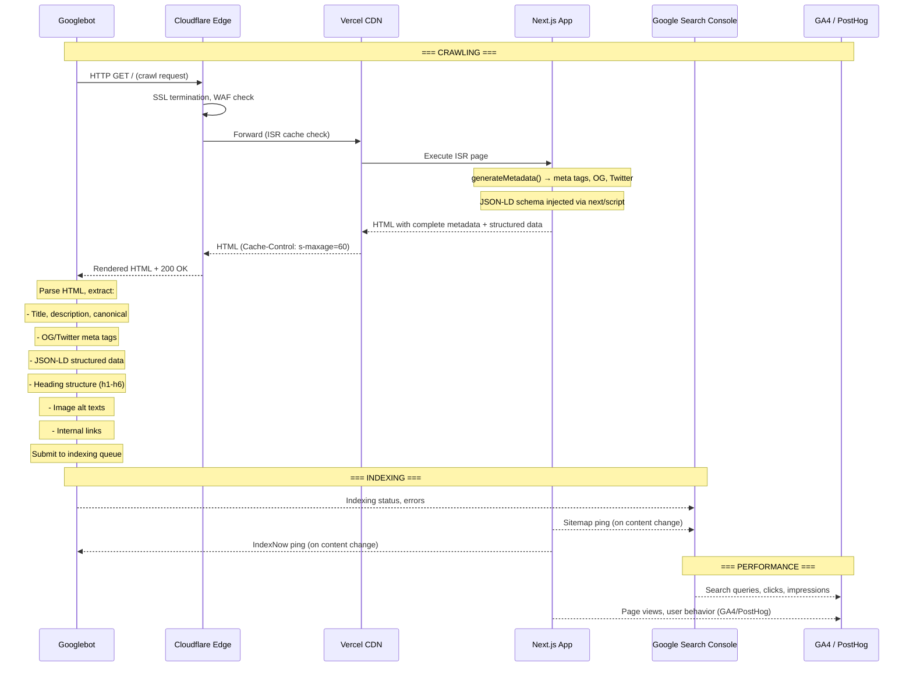

### 3.3 Next.js SEO Architecture

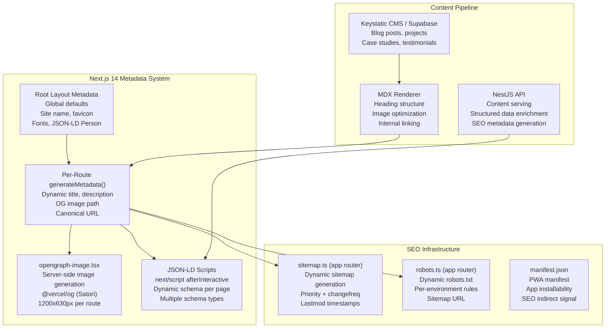

---

## 4. Technical SEO

### 4.1 Technical SEO Architecture

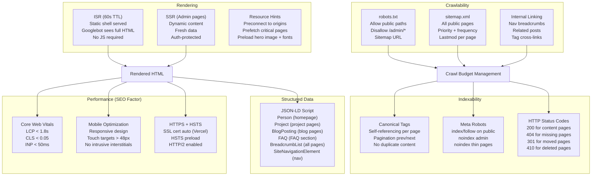

### 4.2 Crawl Budget Management

| Factor                           | Strategy                                               | Implementation                              |
| -------------------------------- | ------------------------------------------------------ | ------------------------------------------- |
| **Sitemap-driven crawl**         | Submit complete, clean sitemap to Search Console       | `next-sitemap` generates per-deploy         |
| **Reduce thin pages**            | Noindex admin, API routes, auth pages                  | `meta robots: noindex` on non-public routes |
| **Optimize crawl frequency**     | ISR with 60s TTL → Googlebot gets fast response        | Vercel CDN + Cloudflare cache               |
| **Eliminate crawl errors**       | 404 → 410 for deleted pages, redirect chains minimized | Custom 404 page, proper redirects           |
| **Internal linking depth**       | Every page within 3 clicks from homepage               | Nav + breadcrumbs + related content         |
| **Server response time**         | < 200ms TTFB for Googlebot (same as users)             | ISR cache hit serves instantly              |
| **Resource hints for Googlebot** | Preconnect + DNS-prefetch for critical origins         | `<link rel="preconnect">` in layout         |

### 4.3 Next.js Technical SEO Configuration

```typescript
// apps/web/src/app/layout.tsx — Root SEO Configuration
import { Metadata } from 'next';

export const metadata: Metadata = {
  metadataBase: new URL('https://portfolioowner.com'),
  title: {
    default: 'Portfolio Owner — Full Stack Developer',
    template: '%s | Portfolio Owner',
  },
  description:
    'Full Stack Developer specializing in React, TypeScript, and Node.js. Building performant, accessible web applications with modern technologies.',
  keywords: [
    'full stack developer',
    'react developer',
    'typescript',
    'node.js',
    'portfolio',
    'web development',
  ],
  authors: [{ name: 'Portfolio Owner', url: 'https://portfolioowner.com' }],
  creator: 'Portfolio Owner',
  publisher: 'Portfolio Owner',

  // Robots
  robots: {
    index: true,
    follow: true,
    googleBot: {
      index: true,
      follow: true,
      'max-video-preview': -1,
      'max-image-preview': 'large',
      'max-snippet': -1,
    },
  },

  // Verification
  verification: {
    google: 'YOUR_GOOGLE_SEARCH_CONSOLE_VERIFICATION_CODE',
    yandex: 'YOUR_YANDEX_VERIFICATION_CODE',
    yahoo: 'YOUR_BING_VERIFICATION_CODE',
  },

  // Icons
  icons: {
    icon: '/favicon.ico',
    shortcut: '/favicon-16x16.png',
    apple: '/apple-touch-icon.png',
  },

  // Manifest
  manifest: '/manifest.json',

  // Other
  other: {
    'theme-color': [
      { media: '(prefers-color-scheme: light)', content: '#ffffff' },
      { media: '(prefers-color-scheme: dark)', content: '#060D1F' },
    ],
  },
};

// apps/web/src/app/(portfolio)/projects/[slug]/page.tsx — Per-Route Metadata
export async function generateMetadata({
  params,
}: {
  params: { slug: string };
}): Promise<Metadata> {
  const project = await getProject(params.slug);

  if (!project) {
    return {
      title: 'Project Not Found',
      description: 'The requested project could not be found.',
      robots: { index: false },
    };
  }

  return {
    title: project.title,
    description: project.excerpt || `${project.title} — a project by Portfolio Owner`,
    alternates: {
      canonical: `/projects/${project.slug}`,
    },
    openGraph: {
      title: `${project.title} | Portfolio Owner`,
      description: project.excerpt,
      url: `/projects/${project.slug}`,
      images: [
        {
          url: `/og/projects/${project.slug}`,
          width: 1200,
          height: 630,
          alt: project.title,
        },
      ],
    },
    twitter: {
      card: 'summary_large_image',
      title: `${project.title} | Portfolio Owner`,
      description: project.excerpt,
      images: [`/og/projects/${project.slug}`],
    },
  };
}
```

### 4.4 Technical SEO Checklist

| #   | Check                                                           | Implementation                               | Verification         |
| --- | --------------------------------------------------------------- | -------------------------------------------- | -------------------- |
| 1   | ✅ Page has exactly one `<h1>`                                  | Semantic HTML structure                      | axe DevTools         |
| 2   | ✅ Heading hierarchy is logical (h1 → h2 → h3)                  | Content authored with hierarchical structure | Lighthouse audit     |
| 3   | ✅ All images have descriptive `alt` text                       | ESLint `jsx-a11y/alt-text` rule              | CI check             |
| 4   | ✅ Semantic HTML landmarks used (`<nav>`, `<main>`, `<footer>`) | App Router default layout structure          | axe DevTools         |
| 5   | ✅ Links have descriptive text (no "click here")                | Content review process                       | Code review          |
| 6   | ✅ No broken internal links                                     | `next-sitemap` checks on build               | CI check             |
| 7   | ✅ No duplicate content                                         | Canonical tags on every page                 | Screaming Frog audit |
| 8   | ✅ HTTP → HTTPS redirect                                        | Vercel + Cloudflare auto                     | Browser test         |
| 9   | ✅ Security headers present (HSTS, CSP, XFO)                    | `next.config.js` headers                     | securityheaders.com  |
| 10  | ✅ Structured data valid on all pages                           | Schema.org validator                         | Pre-deploy check     |
| 11  | ✅ Pages render properly without JavaScript                     | Next.js Server Components + ISR              | Lighthouse test      |
| 12  | ✅ Mobile viewport configured                                   | Tailwind responsive design                   | Lighthouse audit     |
| 13  | ✅ Touch targets at least 48px                                  | Tailwind spacing scale                       | Lighthouse audit     |
| 14  | ✅ Font size ≥ 16px to prevent iOS zoom                         | Tailwind base font size (`text-base`)        | Manual test          |
| 15  | ✅ Color contrast meets WCAG AA (4.5:1)                         | Tailwind color tokens                        | axe DevTools         |

### 4.5 HTTP Status Code Strategy

| Status Code | When Used                                      | Implementation                     |
| ----------- | ---------------------------------------------- | ---------------------------------- |
| **200**     | Successful page load                           | Normal rendering                   |
| **301**     | Permanent redirect (e.g., old slug → new slug) | Next.js `redirect()` in middleware |
| **302**     | Temporary redirect (e.g., maintenance page)    | Next.js `redirect()`               |
| **404**     | Page not found                                 | Custom `not-found.tsx`             |
| **410**     | Content permanently deleted                    | Next.js `notFound()` + `noindex`   |
| **429**     | Rate limited                                   | NestJS ThrottlerGuard              |
| **500**     | Server error                                   | Custom `error.tsx`                 |
| **503**     | Maintenance mode                               | Middleware check                   |

---

## 5. Metadata Standards

### 5.1 Metadata Architecture

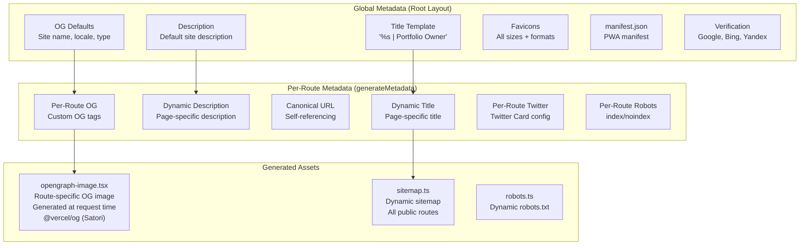

### 5.2 Metadata Template

| Page               | Title Template                           | Description Template                                                                                                                              | Keywords                                                | Priority |
| ------------------ | ---------------------------------------- | ------------------------------------------------------------------------------------------------------------------------------------------------- | ------------------------------------------------------- | -------- |
| **Homepage**       | `Portfolio Owner — Full Stack Developer` | `Full Stack Developer specializing in React, TypeScript, and Node.js. Building performant, accessible web applications with modern technologies.` | `full stack developer, react, typescript, portfolio`    | P0       |
| **Projects**       | `Projects %s`                            | `Explore my portfolio of projects — from full-stack web applications to open source contributions and design systems.`                            | `portfolio projects, web development projects`          | P0       |
| **Project Detail** | `{title} %s`                             | `{excerpt or 'A project by Portfolio Owner'}`                                                                                                     | `{project.technologies.join(', ')}`                     | P0       |
| **Blog**           | `Blog %s`                                | `Read articles about web development, React, TypeScript, and building better software.`                                                           | `web development blog, react blog, typescript articles` | P1       |
| **Blog Post**      | `{title} %s`                             | `{excerpt or first 160 chars of content}`                                                                                                         | `{post.tags.join(', ')}`                                | P1       |
| **Contact**        | `Contact %s`                             | `Get in touch — I'm always open to discussing new projects, creative ideas, or opportunities.`                                                    | `contact developer, hire full stack developer`          | P1       |
| **AI Assistant**   | `AI Assistant %s`                        | `Chat with my AI assistant to learn more about my skills, experience, and projects.`                                                              | `portfolio AI chat, developer assistant`                | P2       |
| **Admin**          | `Admin {page} %s`                        | — (noindex)                                                                                                                                       | —                                                       | N/A      |

### 5.3 Metadata Quality Standards

| Requirement             | Standard                                  | Enforcement                           | Tool             |
| ----------------------- | ----------------------------------------- | ------------------------------------- | ---------------- |
| **Title length**        | 50–60 characters                          | Lighthouse audit (≥ 95 SEO)           | Lighthouse CI    |
| **Description length**  | 120–158 characters                        | Custom ESLint rule                    | ESLint           |
| **Unique titles**       | No duplicate titles across pages          | `next-sitemap` validation             | CI check         |
| **Unique descriptions** | No duplicate descriptions across pages    | Script check in CI                    | CI check         |
| **OG image**            | Every public page has an OG image         | `generateMetadata()` ensures coverage | Code review      |
| **Canonical URL**       | Every page has self-referencing canonical | Automatic in metadata generation      | Code review      |
| **Keywords present**    | At least 3 relevant keywords per page     | Manual review per content publish     | Content workflow |
| **No HTML in meta**     | Titles/descriptions are plain text        | Content sanitization                  | Zod validation   |

### 5.4 Metadata Generation Pattern

```typescript
// apps/web/src/lib/seo.ts — Metadata Utilities
interface SEOConfig {
  title: string;
  description: string;
  path: string;
  keywords?: string[];
  ogImage?: string;
  noindex?: boolean;
  type?: 'website' | 'article';
  publishedTime?: string;
  tags?: string[];
}

export function generateSEO(config: SEOConfig): Metadata {
  const url = new URL(config.path, 'https://portfolioowner.com');
  const images = config.ogImage
    ? [{ url: config.ogImage, width: 1200, height: 630, alt: config.title }]
    : [{ url: `/og/default`, width: 1200, height: 630, alt: config.title }];

  return {
    title: config.title,
    description: config.description,
    keywords: config.keywords?.join(', '),
    alternates: { canonical: config.path },
    robots: config.noindex ? { index: false, follow: false } : undefined,
    openGraph: {
      title: config.title,
      description: config.description,
      url: config.path,
      siteName: 'Portfolio Owner',
      images,
      locale: 'en_US',
      type: config.type || 'website',
      ...(config.publishedTime && {
        article: { publishedTime: config.publishedTime, tags: config.tags },
      }),
    },
    twitter: {
      card: 'summary_large_image',
      title: config.title,
      description: config.description,
      images: images.map((i) => i.url),
    },
  };
}
```

---

## 6. Open Graph Protocol

### 6.1 OG Image Architecture

The portfolio uses **server-side generated OG images** via Next.js `@vercel/og` (Satori) — each page gets a unique, dynamically generated social sharing image.

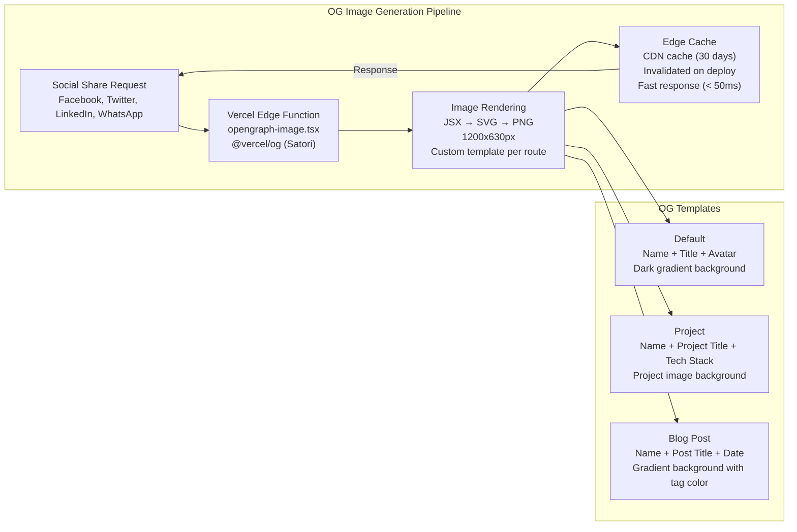

### 6.2 OG Image Implementation

```typescript
// apps/web/src/app/opengraph-image.tsx — Default OG Image
import { ImageResponse } from 'next/og';

export const alt = 'Portfolio Owner — Full Stack Developer';
export const size = { width: 1200, height: 630 };
export const contentType = 'image/png';

export default async function Image() {
  return new ImageResponse(
    (
      <div
        style={{
          width: '100%',
          height: '100%',
          display: 'flex',
          flexDirection: 'column',
          alignItems: 'center',
          justifyContent: 'center',
          background: 'linear-gradient(135deg, #060D1F 0%, #0A1A3F 50%, #060D1F 100%)',
          fontFamily: 'Inter',
        }}
      >
        {/* Avatar */}
        
        {/* Name */}
        <div
          style={{
            fontSize: '64px',
            fontWeight: 700,
            color: '#ffffff',
            marginBottom: '12px',
          }}
        >
          Portfolio Owner
        </div>
        {/* Tagline */}
        <div
          style={{
            fontSize: '28px',
            color: '#00FFB2',
            fontWeight: 500,
          }}
        >
          Full Stack Developer
        </div>
        {/* URL */}
        <div
          style={{
            fontSize: '18px',
            color: '#6B7280',
            marginTop: '32px',
          }}
        >
          portfolioowner.com
        </div>
      </div>
    ),
    { width: 1200, height: 630 }
  );
}

// apps/web/src/app/(portfolio)/projects/[slug]/opengraph-image.tsx — Per-Project OG Image
export default async function Image({ params }: { params: { slug: string } }) {
  const project = await getProject(params.slug);

  return new ImageResponse(
    (
      <div
        style={{
          width: '100%',
          height: '100%',
          display: 'flex',
          flexDirection: 'column',
          justifyContent: 'flex-end',
          padding: '48px',
          background: `linear-gradient(135deg, #060D1F 80%, #0DBF6F 100%)`,
          fontFamily: 'Inter',
        }}
      >
        {/* Project Title */}
        <div
          style={{
            fontSize: '48px',
            fontWeight: 700,
            color: '#ffffff',
            marginBottom: '16px',
          }}
        >
          {project.title}
        </div>
        {/* Description */}
        <div
          style={{
            fontSize: '24px',
            color: '#D1D5DB',
            marginBottom: '24px',
            maxWidth: '800px',
          }}
        >
          {project.excerpt?.slice(0, 120)}
        </div>
        {/* Tech Stack */}
        <div style={{ display: 'flex', gap: '12px' }}>
          {project.technologies.slice(0, 5).map((tech: string) => (
            <div
              key={tech}
              style={{
                padding: '8px 16px',
                backgroundColor: '#0DBF6F',
                borderRadius: '8px',
                fontSize: '18px',
                color: '#ffffff',
              }}
            >
              {tech}
            </div>
          ))}
        </div>
        {/* Portfolio name */}
        <div
          style={{
            fontSize: '16px',
            color: '#6B7280',
            marginTop: '32px',
          }}
        >
          portfolioowner.com
        </div>
      </div>
    ),
    { width: 1200, height: 630 }
  );
}
```

### 6.3 OG Tag Configuration (Per Page)

| Page               | `og:type` | `og:image`            | `og:title`                               | `og:description`             |
| ------------------ | --------- | --------------------- | ---------------------------------------- | ---------------------------- |
| **Homepage**       | `website` | `/og/default`         | `Portfolio Owner — Full Stack Developer` | Default site description     |
| **Projects**       | `website` | `/og/projects`        | `Projects \| Portfolio Owner`            | Projects listing description |
| **Project Detail** | `article` | `/og/projects/{slug}` | `{title} \| Portfolio Owner`             | Project excerpt              |
| **Blog**           | `website` | `/og/blog`            | `Blog \| Portfolio Owner`                | Blog listing description     |
| **Blog Post**      | `article` | `/og/blog/{slug}`     | `{title} \| Portfolio Owner`             | Post excerpt                 |
| **Contact**        | `website` | `/og/contact`         | `Contact \| Portfolio Owner`             | Contact page description     |
| **AI Assistant**   | `website` | `/og/ai`              | `AI Assistant \| Portfolio Owner`        | AI page description          |

### 6.4 Required OG Tags

```html
<!-- Minimum required OG tags -->
<meta property="og:title" content="Portfolio Owner — Full Stack Developer" />
<meta
  property="og:description"
  content="Full Stack Developer specializing in React, TypeScript, and Node.js."
/>
<meta property="og:url" content="https://portfolioowner.com" />
<meta property="og:type" content="website" />
<meta property="og:image" content="https://portfolioowner.com/og/default" />
<meta property="og:image:width" content="1200" />
<meta property="og:image:height" content="630" />
<meta property="og:site_name" content="Portfolio Owner" />
<meta property="og:locale" content="en_US" />

<!-- Recommended additional tags -->
<meta property="og:determiner" content="" />
<meta property="og:audio" content="" />
<!-- if podcast -->
<meta property="og:video" content="" />
<!-- if video project -->
```

---

## 7. Twitter Cards

### 7.1 Twitter Card Configuration

```typescript
// apps/web/src/app/layout.tsx — Twitter Card Defaults
export const metadata: Metadata = {
  twitter: {
    card: 'summary_large_image',
    site: '@portfolioowner',
    creator: '@portfolioowner',
    title: 'Portfolio Owner — Full Stack Developer',
    description: 'Full Stack Developer specializing in React, TypeScript, and Node.js.',
    images: ['https://portfolioowner.com/og/default'],
  },
};
```

### 7.2 Twitter Card Types

| Card Type                 | When Used                          | Image Size  | Description                           |
| ------------------------- | ---------------------------------- | ----------- | ------------------------------------- |
| **`summary_large_image`** | All public pages (default)         | 1200×628 px | Large image with title + description  |
| **`summary`**             | Admin pages (if indexed, unlikely) | 120×120 px  | Small avatar with title + description |
| **`player`**              | Future: video projects             | 1200×628 px | Video embed card                      |
| **`app`**                 | Future: mobile app projects        | —           | App download card                     |

### 7.3 Twitter Card Validator

| Check                             | Tool                                                     | Frequency           |
| --------------------------------- | -------------------------------------------------------- | ------------------- |
| ✅ Cards render correctly         | Twitter Card Validator (cards-dev.twitter.com/validator) | Per new URL pattern |
| ✅ Image dimensions correct       | 1200×628px, < 5MB, JPG/PNG/GIF                           | Per deploy          |
| ✅ Description fits (< 200 chars) | Manual character count                                   | Content review      |
| ✅ No broken image URLs           | Twitter validator reports broken images                  | Per deploy          |

---

## 8. Structured Data & Schema Markup

### 8.1 Schema Architecture

```mermaid
graph TB
    subgraph "Homepage"
        PERSON["Person<br/>@type: Person<br/>name, jobTitle, url<br/>sameAs (social profiles)<br/>knowsAbout (skills)<br/>image (avatar)"]
        SITENAV["SiteNavigationElement<br/>@type: SiteNavigationElement<br/>Nav links as schema<br/>Improves sitelinks"]
    end

    subgraph "All Pages"
        BREADCRUMB["BreadcrumbList<br/>@type: BreadcrumbList<br/>itemListElement<br/>Position + name + URL"]
        WEBSITE["WebSite<br/>@type: WebSite<br/>name, url<br/>potentialAction: SearchAction"]
        ORGANIZATION["Organization / Person<br/>@type: Person<br/>Global identity schema"]
    end

    subgraph "Project Pages"
        PROJECT["CreativeWork / SoftwareApplication<br/>@type: CreativeWork<br/>name, description, url<br/>author, dateCreated<br/>keywords (technologies)<br/>screenshot (image)"]
    end

    subgraph "Blog Pages"
        ARTICLE["BlogPosting / Article<br/>@type: BlogPosting<br/>headline, description<br/>author, datePublished<br/>dateModified, image<br/>articleBody (truncated)"]
    end

    subgraph "Contact Page"
        CONTACTPOINT["ContactPoint<br/>@type: ContactPoint<br/>contactType, email<br/>url, availableLanguage<br/>areaServed"]
    end

    subgraph "FAQ / Sections"
        FAQPAGE["FAQPage<br/>@type: FAQPage<br/>mainEntity: Question<br/>Question → Answer pairs<br/>For FAQ section content"]
        ABOUTPAGE["AboutPage<br/>@type: AboutPage<br/>About section metadata"]
    end

    subgraph "Skills Pages"
        ITEMLIST["ItemList<br/>@type: ItemList<br/>itemListElement<br/>Skills listed as list items<br/>Improves skill visibility"]
    end

    HOME["Homepage"] --> PERSON & SITENAV & WEBSITE
    PROJECTS["Project Pages"] --> PROJECT & BREADCRUMB
    BLOG["Blog Pages"] --> ARTICLE & BREADCRUMB
    CONTACT["Contact Page"] --> CONTACTPOINT
    FAQS["FAQ Section"] --> FAQPAGE
    SKILLS["Skills Section"] --> ITEMLIST
    ALL["All Pages"] --> BREADCRUMB & WEBSITE & ORGANIZATION
```

### 8.2 Schema Implementation

```typescript
// apps/web/src/lib/schema.ts — JSON-LD Schema Generators
import {
  type WithContext,
  type Person,
  type WebSite,
  type BreadcrumbList,
  type BlogPosting,
  type CreativeWork,
  type FAQPage,
  type ItemList,
  type ContactPoint,
  type Organization,
  type SearchAction,
  type Thing,
} from 'schema-dts';

// === GENERATORS ===

// 1. Person Schema (Homepage)
export function personSchema(): WithContext<Person> {
  return {
    '@context': 'https://schema.org',
    '@type': 'Person',
    name: 'Portfolio Owner',
    givenName: 'Portfolio',
    familyName: 'Owner',
    url: 'https://portfolioowner.com',
    image: 'https://portfolioowner.com/avatar.png',
    jobTitle: 'Full Stack Developer',
    description:
      'Full Stack Developer specializing in React, TypeScript, and Node.js. Building performant, accessible web applications.',
    sameAs: [
      'https://github.com/portfolioowner',
      'https://linkedin.com/in/portfolioowner',
      'https://twitter.com/portfolioowner',
    ],
    knowsAbout: ['React', 'TypeScript', 'Node.js', 'Next.js', 'PostgreSQL', 'Tailwind CSS'],
    email: 'hello@portfolioowner.com',
    address: {
      '@type': 'PostalAddress',
      addressCountry: 'US',
    },
    alumniOf: {
      '@type': 'CollegeOrUniversity',
      name: 'University Name',
    },
    birthPlace: {
      '@type': 'Place',
      name: 'City, Country',
    },
    nationality: {
      '@type': 'Country',
      name: 'United States',
    },
  };
}

// 2. WebSite Schema (All Pages)
export function websiteSchema(): WithContext<WebSite> {
  return {
    '@context': 'https://schema.org',
    '@type': 'WebSite',
    name: 'Portfolio Owner',
    url: 'https://portfolioowner.com',
    potentialAction: {
      '@type': 'SearchAction',
      target: {
        '@type': 'EntryPoint',
        urlTemplate: 'https://portfolioowner.com/search?q={search_term_string}',
      },
      'query-input': 'required name=search_term_string',
    },
    description: 'Full Stack Developer portfolio showcasing projects, skills, and experience.',
    inLanguage: 'en-US',
    copyrightYear: 2026,
  };
}

// 3. BreadcrumbList Schema (All Pages)
export function breadcrumbSchema(
  items: { name: string; url: string }[],
): WithContext<BreadcrumbList> {
  return {
    '@context': 'https://schema.org',
    '@type': 'BreadcrumbList',
    itemListElement: items.map((item, index) => ({
      '@type': 'ListItem',
      position: index + 1,
      name: item.name,
      item: `https://portfolioowner.com${item.url}`,
    })),
  };
}

// 4. BlogPosting Schema (Blog Posts)
export function blogPostSchema(post: {
  title: string;
  description: string;
  slug: string;
  publishedAt: string;
  updatedAt?: string;
  image?: string;
  authorName?: string;
  body?: string;
}): WithContext<BlogPosting> {
  return {
    '@context': 'https://schema.org',
    '@type': 'BlogPosting',
    headline: post.title,
    description: post.description,
    url: `https://portfolioowner.com/blog/${post.slug}`,
    datePublished: post.publishedAt,
    dateModified: post.updatedAt || post.publishedAt,
    author: {
      '@type': 'Person',
      name: post.authorName || 'Portfolio Owner',
      url: 'https://portfolioowner.com',
    },
    image: post.image || 'https://portfolioowner.com/og/default',
    ...(post.body && {
      articleBody: post.body.slice(0, 5000), // Truncate for schema
    }),
    publisher: {
      '@type': 'Person',
      name: 'Portfolio Owner',
    },
    mainEntityOfPage: {
      '@type': 'WebPage',
      '@id': `https://portfolioowner.com/blog/${post.slug}`,
    },
    wordCount: post.body?.split(/\s+/).length || 0,
  };
}

// 5. CreativeWork Schema (Projects)
export function projectSchema(project: {
  title: string;
  description: string;
  slug: string;
  technologies: string[];
  url?: string;
  image?: string;
  dateCreated?: string;
}): WithContext<CreativeWork> {
  return {
    '@context': 'https://schema.org',
    '@type': 'CreativeWork',
    name: project.title,
    description: project.description,
    url: project.url || `https://portfolioowner.com/projects/${project.slug}`,
    keywords: project.technologies.join(', '),
    author: {
      '@type': 'Person',
      name: 'Portfolio Owner',
    },
    ...(project.image && { image: project.image }),
    ...(project.dateCreated && { dateCreated: project.dateCreated }),
    offers: {
      '@type': 'Offer',
      availability: 'https://schema.org/InStock',
      itemCondition: 'https://schema.org/NewCondition',
      priceSpecification: {
        '@type': 'PriceSpecification',
        price: '0',
        priceCurrency: 'USD',
      },
    },
  };
}

// 6. FAQPage Schema (FAQ Section)
export function faqSchema(questions: { question: string; answer: string }[]): WithContext<FAQPage> {
  return {
    '@context': 'https://schema.org',
    '@type': 'FAQPage',
    mainEntity: questions.map((q) => ({
      '@type': 'Question',
      name: q.question,
      acceptedAnswer: {
        '@type': 'Answer',
        text: q.answer,
      },
    })),
  };
}

// 7. ItemList Schema (Skills)
export function skillListSchema(
  skills: { name: string; category: string; proficiency: number }[],
): WithContext<ItemList> {
  return {
    '@context': 'https://schema.org',
    '@type': 'ItemList',
    name: 'Technical Skills',
    description: 'Professional skills and technologies',
    itemListElement: skills.map((skill, index) => ({
      '@type': 'ListItem',
      position: index + 1,
      item: {
        '@type': 'DefinedTerm',
        name: skill.name,
        inDefinedTermSet: skill.category,
        ...(skill.proficiency && {
          description: `Proficiency: ${skill.proficiency}%`,
        }),
      },
    })),
    numberOfItems: skills.length,
  };
}
```

### 8.3 Schema Injection Pattern

```typescript
// apps/web/src/components/JsonLd.tsx — Schema Injection Component
'use client';

import Script from 'next/script';
import type { Thing, WithContext } from 'schema-dts';

interface JsonLdProps {
  data: WithContext<Thing> | WithContext<Thing>[];
  id?: string;
}

export function JsonLd({ data, id }: JsonLdProps) {
  const schemas = Array.isArray(data) ? data : [data];

  return (
    <>
      {schemas.map((schema, index) => (
        <Script
          key={`${id || 'schema'}-${index}`}
          id={`${id || 'schema'}-${index}`}
          type="application/ld+json"
          dangerouslySetInnerHTML={{ __html: JSON.stringify(schema) }}
          strategy="afterInteractive"
        />
      ))}
    </>
  );
}
```

### 8.4 Per-Page Schema Inventory

| Page                 | Schema Types                                 | Priority | Rich Result Goal            |
| -------------------- | -------------------------------------------- | -------- | --------------------------- |
| **Homepage**         | `Person`, `WebSite`, `SiteNavigationElement` | Critical | Knowledge Panel + Sitelinks |
| **Projects Listing** | `ItemList`, `BreadcrumbList`, `WebSite`      | High     | —                           |
| **Project Detail**   | `CreativeWork`, `BreadcrumbList`, `Person`   | Critical | Project rich result         |
| **Blog Listing**     | `ItemList`, `BreadcrumbList`, `WebSite`      | High     | —                           |
| **Blog Post**        | `BlogPosting`, `BreadcrumbList`, `Person`    | Critical | Article rich result         |
| **Contact**          | `ContactPoint`, `WebSite`, `Person`          | High     | Contact rich result         |
| **FAQ Section**      | `FAQPage`, `BreadcrumbList`, `WebSite`       | Medium   | FAQ rich result             |
| **Skills Section**   | `ItemList`, `BreadcrumbList`, `Person`       | Medium   | —                           |
| **About Section**    | `AboutPage`, `BreadcrumbList`, `Person`      | Medium   | —                           |

### 8.5 Schema Validation & Testing

| Check                          | Tool                                        | Frequency           | Action on Failure       |
| ------------------------------ | ------------------------------------------- | ------------------- | ----------------------- |
| ✅ JSON-LD syntax valid        | JSON-LD Playground (json-ld.org/playground) | Per deploy          | Fix syntax errors       |
| ✅ Schema.org type correct     | Schema.org validator                        | Per new schema type | Update to correct type  |
| ✅ Rich result eligible        | Google Rich Results Test                    | Per deploy          | Switch to eligible type |
| ✅ All required fields present | Custom CI script                            | Per deploy          | Add missing fields      |
| ✅ No HTML entities in schema  | Custom CI script                            | Per deploy          | Sanitize content        |
| ✅ No broken URLs in sameAs    | Manual check                                | Monthly             | Update URLs             |

---

## 9. Sitemap Strategy

### 9.1 Sitemap Architecture

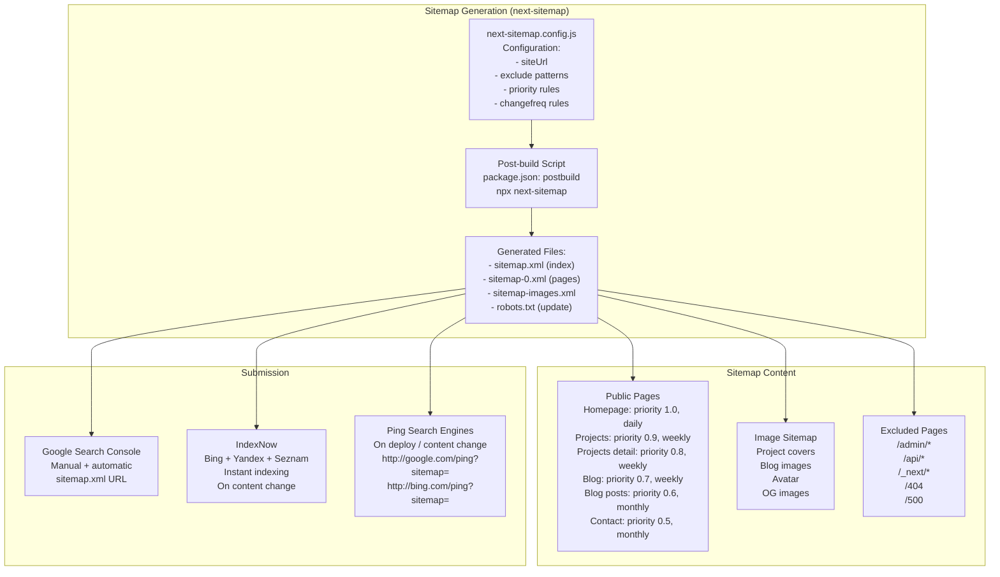

### 9.2 Sitemap Configuration

```typescript
// next-sitemap.config.js
module.exports = {
  siteUrl: 'https://portfolioowner.com',
  generateRobotsTxt: true, // Auto-generate robots.txt
  robotsTxtOptions: {
    policies: [
      { userAgent: '*', allow: '/' },
      { userAgent: '*', disallow: '/admin/' },
      { userAgent: '*', disallow: '/api/' },
      { userAgent: '*', disallow: '/_next/' },
    ],
    additionalSitemaps: ['https://portfolioowner.com/sitemap-images.xml'],
  },
  exclude: ['/admin/*', '/api/*', '/_next/*', '/404', '/500', '/error'],
  // Priority based on page type
  transform: async (config, path) => {
    if (path === '/') {
      return { loc: path, changefreq: 'daily', priority: 1.0, lastmod: new Date().toISOString() };
    }
    if (path.startsWith('/projects/')) {
      return { loc: path, changefreq: 'weekly', priority: 0.8, lastmod: new Date().toISOString() };
    }
    if (path.startsWith('/projects')) {
      return { loc: path, changefreq: 'weekly', priority: 0.9, lastmod: new Date().toISOString() };
    }
    if (path.startsWith('/blog/')) {
      return { loc: path, changefreq: 'monthly', priority: 0.6, lastmod: new Date().toISOString() };
    }
    if (path.startsWith('/blog')) {
      return { loc: path, changefreq: 'weekly', priority: 0.7, lastmod: new Date().toISOString() };
    }
    // Default
    return { loc: path, changefreq: 'monthly', priority: 0.5, lastmod: new Date().toISOString() };
  },
  additionalPaths: async (config) => {
    // Dynamic content from Supabase
    const projects = await getProjects();
    const blogPosts = await getPublishedPosts();

    return [
      ...projects.map((p) => ({
        loc: `/projects/${p.slug}`,
        changefreq: 'weekly',
        priority: 0.8,
        lastmod: new Date(p.updatedAt).toISOString(),
      })),
      ...blogPosts.map((post) => ({
        loc: `/blog/${post.slug}`,
        changefreq: 'monthly',
        priority: 0.6,
        lastmod: new Date(post.updatedAt || post.publishedAt).toISOString(),
      })),
    ];
  },
};
```

### 9.3 Sitemap Priority & Frequency Matrix

| Page Type            | Priority | Changefreq | Rationale                                     |
| -------------------- | -------- | ---------- | --------------------------------------------- |
| **Homepage**         | 1.0      | `daily`    | Highest priority — landing page for all SEO   |
| **Projects Listing** | 0.9      | `weekly`   | Second-most important — showcases work        |
| **Project Detail**   | 0.8      | `weekly`   | Individual project pages (content may update) |
| **Blog Listing**     | 0.7      | `weekly`   | Blog hub — updates with new posts             |
| **Blog Post**        | 0.6      | `monthly`  | Evergreen content — rarely changes            |
| **Contact**          | 0.5      | `monthly`  | Static page — low change frequency            |
| **AI Assistant**     | 0.3      | `monthly`  | Utility page — low SEO value                  |
| **Admin Pages**      | —        | —          | Excluded (noindex)                            |

### 9.4 Sitemap Submission Strategy

| Search Engine | Submission Method                   | Frequency         | URL                                |
| ------------- | ----------------------------------- | ----------------- | ---------------------------------- |
| **Google**    | Search Console + sitemap URL submit | On deploy         | `search.google.com/search-console` |
| **Bing**      | IndexNow API + Webmaster Tools      | On content change | `bing.com/indexnow`                |
| **Yandex**    | IndexNow API + Webmaster Tools      | On content change | `yandex.com/webmaster`             |
| **IndexNow**  | API ping on content change          | On publish/update | `api.indexnow.org/indexnow`        |

---

## 10. Robots Strategy

### 10.1 Robots.txt Configuration

```typescript
// apps/web/src/app/robots.ts — Dynamic robots.txt via App Router
import { MetadataRoute } from 'next';

export default function robots(): MetadataRoute.Robots {
  const baseUrl = 'https://portfolioowner.com';

  return {
    rules: [
      {
        userAgent: '*',
        allow: '/',
        disallow: [
          '/admin/', // Admin panel — no index
          '/api/', // API routes — no index
          '/_next/', // Next.js internals — no index
          '/404', // Error page — no index
          '/500', // Error page — no index
        ],
      },
      {
        userAgent: 'GPTBot', // Block AI crawlers
        disallow: '/', // from training on portfolio content
      },
      {
        userAgent: 'CCBot', // Common Crawl (AI training)
        disallow: '/',
      },
      {
        userAgent: 'anthropic-ai', // Anthropic AI crawler
        disallow: '/',
      },
    ],
    sitemap: `${baseUrl}/sitemap.xml`,
  };
}
```

### 10.2 Meta Robots Per Page

| Page                             | `robots` Meta       | Rationale                             |
| -------------------------------- | ------------------- | ------------------------------------- |
| **All public pages**             | `index, follow`     | Default — crawl and index             |
| **Admin pages**                  | `noindex, nofollow` | Private — should not appear in search |
| **API routes**                   | `noindex, nofollow` | Not user-facing content               |
| **404 page**                     | `noindex, follow`   | Don't index, but follow links         |
| **Error page (500)**             | `noindex, nofollow` | Don't index errors                    |
| **Blog draft preview**           | `noindex, nofollow` | Unpublished content                   |
| **Project detail (private/NDA)** | `noindex, follow`   | Don't index NDA projects              |
| **Tag/category pages (thin)**    | `noindex, follow`   | Avoid thin content penalty            |
| **Search results page**          | `noindex, follow`   | Avoid duplicate search results        |

### 10.3 Crawler Allowlist

```typescript
// middleware.ts — Crawler detection and response optimization
// Identifies known crawlers for optimized responses
const KNOWN_CRAWLERS = [
  'Googlebot',
  'Googlebot-Image',
  'Googlebot-News',
  'Googlebot-Video',
  'Googlebot-Mobile',
  'Bingbot',
  'Slurp', // Yahoo
  'DuckDuckBot',
  'Baiduspider',
  'YandexBot',
  'facebookexternalhit', // Facebook crawler
  'Twitterbot',
  'LinkedInBot',
  'WhatsApp', // WhatsApp link preview
  'Slackbot',
  'Discordbot',
  'TelegramBot',
];

function isCrawler(userAgent: string): boolean {
  return KNOWN_CRAWLERS.some((crawler) => userAgent.toLowerCase().includes(crawler.toLowerCase()));
}
```

### 10.4 AI Crawler Blocking Strategy

| AI Crawler               | User-Agent        | Blocked? | Method                      |
| ------------------------ | ----------------- | -------- | --------------------------- |
| **GPTBot**               | `GPTBot`          | ✅ Yes   | robots.txt disallow         |
| **CCBot** (Common Crawl) | `CCBot`           | ✅ Yes   | robots.txt disallow         |
| **anthropic-ai**         | `anthropic-ai`    | ✅ Yes   | robots.txt disallow         |
| **Google-Extended**      | `Google-Extended` | ❌ No    | Google's AI crawler — allow |
| **Claude-Web**           | `Claude-Web`      | ❌ No    | Monitor usage               |

> **Note:** AI crawler blocking is a personal choice that may be revisited. Google-Extended is allowed as it powers Google's AI features which may surface portfolio content.

---

## 11. Canonical Strategy

### 11.1 Canonical URL Rules

| Scenario                         | Canonical URL                                           | Implementation                           |
| -------------------------------- | ------------------------------------------------------- | ---------------------------------------- |
| **Standard page**                | Self-referencing: `https://portfolioowner.com/path`     | Automatic in `generateMetadata()`        |
| **Page with query params**       | URL without params: `https://portfolioowner.com/path`   | Meta canonical strips tracking params    |
| **Pagination (page/2)**          | Page 1: `/projects`, Page 2: `/projects?page=2`         | Self-referencing per paginated page      |
| **Blog post with slug variants** | Original slug: `https://portfolioowner.com/blog/{slug}` | Consistent slug generation               |
| **HTTP → HTTPS**                 | HTTPS version                                           | Vercel auto-redirect                     |
| **WWW → non-WWW**                | `https://portfolioowner.com`                            | Vercel domain config                     |
| **Trailing slash**               | No trailing slash: `https://portfolioowner.com/path`    | Next.js `trailingSlash: false`           |
| **UTM tracking parameters**      | URL without UTM params                                  | Meta canonical strips UTM from canonical |
| **Admin preview URLs**           | No canonical (noindex)                                  | No canonical set                         |

### 11.2 Canonical Implementation

```typescript
// apps/web/src/app/(portfolio)/[slug]/page.tsx — Canonical URL in generateMetadata
export async function generateMetadata({ params }: { params: { slug: string } }) {
  return {
    alternates: {
      canonical: `/${params.slug}`,
    },
  };
}

// Middleware to enforce canonical rules
// apps/web/src/middleware.ts
export function middleware(request: NextRequest) {
  const url = request.nextUrl.clone();

  // Remove UTM tracking from canonical URL
  if (url.searchParams.has('utm_source')) {
    // Let the page handle canonical via meta tag
  }

  // Redirect non-www to www (or vice versa)
  if (url.hostname === 'portfolioowner.com') {
    // Already correct — configured in Vercel
  }
}
```

### 11.3 Pagination Handling

```html
<!-- Page 1: /projects -->
<link rel="canonical" href="https://portfolioowner.com/projects" />
<link rel="next" href="https://portfolioowner.com/projects?page=2" />

<!-- Page 2: /projects?page=2 -->
<link rel="canonical" href="https://portfolioowner.com/projects?page=2" />
<link rel="prev" href="https://portfolioowner.com/projects" />
<link rel="next" href="https://portfolioowner.com/projects?page=3" />

<!-- Last page: /projects?page=5 -->
<link rel="canonical" href="https://portfolioowner.com/projects?page=5" />
<link rel="prev" href="https://portfolioowner.com/projects?page=4" />
```

---

## 12. Content SEO

### 12.1 Content SEO Strategy

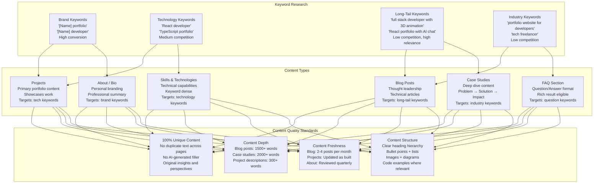

### 12.2 Keyword Strategy

| Keyword Type           | Example Keywords                                                            | Target Pages           | Competition | Priority |
| ---------------------- | --------------------------------------------------------------------------- | ---------------------- | ----------- | -------- |
| **Brand**              | `Portfolio Owner portfolio`, `Portfolio Owner developer`                    | Homepage, About        | Low         | P0       |
| **Brand + Role**       | `Portfolio Owner full stack developer`, `Portfolio Owner React`             | Homepage, About        | Low         | P0       |
| **Technology + Role**  | `React developer portfolio`, `TypeScript developer portfolio`               | Homepage, Skills       | Medium      | P1       |
| **Technology + Niche** | `Next.js portfolio with 3D`, `React Three Fiber portfolio`                  | Projects, Case Studies | Low         | P1       |
| **Long-tail**          | `how to build a developer portfolio`, `best portfolio for React developers` | Blog posts             | Low         | P2       |
| **Question**           | `what should a developer portfolio include`, `how to showcase projects`     | FAQ, Blog posts        | Low         | P2       |
| **Location**           | `full stack developer [city]`, `freelance react developer [city]`           | Contact, About         | Low         | P2       |

### 12.3 Content Writing Standards

| Element              | Standard                                                        | Tool                |
| -------------------- | --------------------------------------------------------------- | ------------------- |
| **Title**            | 50–60 characters, includes primary keyword, compelling          | Meta generation     |
| **Meta description** | 120–158 characters, includes keyword + CTA                      | Meta generation     |
| **H1**               | Exactly one per page, includes primary keyword                  | Content structure   |
| **H2/H3**            | Include secondary keywords naturally                            | Content structure   |
| **First paragraph**  | ≤ 160 characters, includes primary keyword                      | Content review      |
| **Image alt text**   | Descriptive, includes keyword when relevant                     | ESLint rule         |
| **Internal links**   | 3–5 per post/article, to relevant portfolio pages               | Content workflow    |
| **External links**   | 1–2 per post, to authoritative sources (MDN, React docs)        | Content review      |
| **Reading level**    | Grade 8–10 (Flesch-Kincaid) for broad accessibility             | AI content analysis |
| **Word count**       | Blog: 1500+ words; Case study: 2000+ words; Project: 300+ words | Content workflow    |
| **Call to action**   | Each piece of content drives to contact/hire page               | Content review      |
| **Last updated**     | Date shown for all time-sensitive content                       | Metadata            |

### 12.4 Topic Cluster Strategy

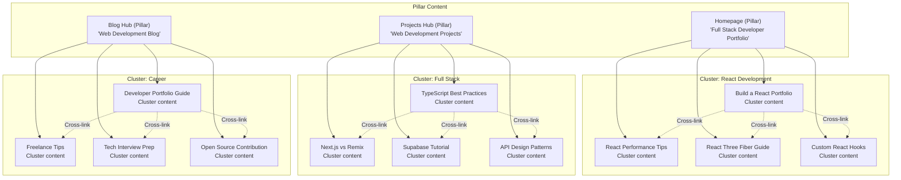

### 12.5 Content Calendar

| Frequency      | Content Type             | SEO Impact | Effort | Notes                                     |
| -------------- | ------------------------ | ---------- | ------ | ----------------------------------------- |
| **Weekly**     | Blog post (1500+ words)  | High       | Medium | Technical articles, tutorials, insights   |
| **Bi-weekly**  | Project update           | Medium     | Low    | New project or significant update         |
| **Monthly**    | Case study (2000+ words) | Very High  | High   | Deep dive into project process            |
| **Quarterly**  | About page refresh       | Low        | Low    | Update bio, skills, availability          |
| **Per launch** | Project page             | High       | Medium | Every new project gets full SEO treatment |

---

## 13. Programmatic SEO

### 13.1 Programmatic SEO Architecture

Programmatic SEO generates unique, valuable pages from structured data — in this portfolio's case, from Supabase content tables.

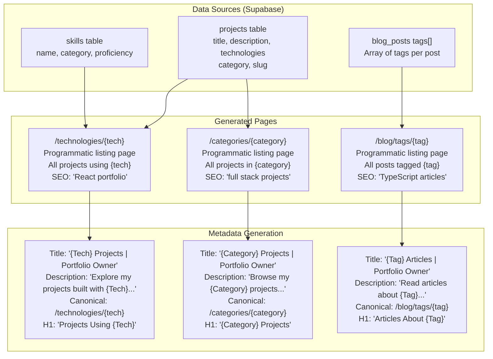

### 13.2 Programmatic Page Routes

```typescript
// apps/web/src/app/technologies/[tech]/page.tsx — Programmatic Tech Pages
export async function generateStaticParams() {
  const projects = await getAllProjects();
  const technologies = [...new Set(projects.flatMap(p => p.technologies))];
  return technologies.map(tech => ({ tech: tech.toLowerCase().replace(/\s+/g, '-') }));
}

export async function generateMetadata({ params }: { params: { tech: string } }) {
  const tech = params.tech.replace(/-/g, ' ');
  const projects = await getProjectsByTechnology(tech);

  if (projects.length === 0) {
    return { title: 'Technology Not Found', robots: { index: false } };
  }

  return {
    title: `${tech} Projects | Portfolio Owner`,
    description: `Explore my portfolio of projects built with ${tech}. ${projects.length} project${projects.length > 1 ? 's' : ''} showcasing ${tech} expertise.`,
    alternates: { canonical: `/technologies/${params.tech}` },
    openGraph: {
      title: `${tech} Projects | Portfolio Owner`,
      description: `${projects.length} projects built with ${tech}`,
    },
  };
}

// apps/web/src/app/technologies/[tech]/page.tsx — Programmatic Page Render
async function TechnologyPage({ params }: { params: { tech: string } }) {
  const tech = params.tech.replace(/-/g, ' ');
  const projects = await getProjectsByTechnology(tech);

  if (projects.length === 0) notFound();

  return (
    <>
      <JsonLd data={breadcrumbSchema([
        { name: 'Home', url: '/' },
        { name: 'Projects', url: '/projects' },
        { name: tech, url: `/technologies/${params.tech}` },
      ])} />

      <section>
        <h1>Projects Using {tech}</h1>
        <p>{projects.length} project{projects.length > 1 ? 's' : ''} found</p>
        <ProjectGrid projects={projects} />
      </section>
    </>
  );
}
```

### 13.3 Programmatic Page Inventory

| Page Pattern             | Generated From             | Count (Est.) | SEO Value                         | Index Policy                        |
| ------------------------ | -------------------------- | ------------ | --------------------------------- | ----------------------------------- |
| `/technologies/{tech}`   | Project technologies array | 10–30        | High (long-tail tech keywords)    | `index, follow`                     |
| `/categories/{category}` | Project category field     | 3–6          | Medium (category keywords)        | `index, follow`                     |
| `/blog/tags/{tag}`       | Blog post tags array       | 10–50        | Medium (long-tail content topics) | `index, follow` (only if ≥ 2 posts) |
| `/projects/page/{n}`     | Pagination                 | 2–5          | Low (pagination)                  | `index, follow`                     |

### 13.4 Thin Content Prevention

| Rule                               | Threshold                          | Action                            |
| ---------------------------------- | ---------------------------------- | --------------------------------- |
| **Minimum projects per tech page** | < 2 projects                       | `noindex` until 2+ projects exist |
| **Minimum posts per tag page**     | < 2 posts                          | `noindex` until 2+ posts exist    |
| **Minimum projects per category**  | < 2 projects                       | `noindex` until 2+ projects exist |
| **Duplicate content check**        | > 80% similarity with another page | Merge pages or add unique content |
| **Word count minimum**             | < 100 words of unique content      | Add intro paragraph or `noindex`  |

---

## 14. Blog SEO

### 14.1 Blog SEO Optimization

```typescript
// apps/web/src/app/(portfolio)/blog/[slug]/page.tsx — Full Blog SEO
export async function generateMetadata({
  params,
}: {
  params: { slug: string };
}): Promise<Metadata> {
  const post = await getBlogPost(params.slug);

  if (!post) {
    return {
      title: 'Post Not Found',
      robots: { index: false },
    };
  }

  const excerpt = post.excerpt || post.content.slice(0, 160).replace(/<[^>]*>/g, '');

  return {
    title: post.title,
    description: excerpt.slice(0, 158),
    alternates: { canonical: `/blog/${post.slug}` },
    robots: post.published
      ? { index: true, follow: true }
      : { index: false, follow: false },
    openGraph: {
      title: `${post.title} | Portfolio Owner Blog`,
      description: excerpt.slice(0, 158),
      url: `/blog/${post.slug}`,
      type: 'article',
      publishedTime: post.publishedAt,
      modifiedTime: post.updatedAt,
      authors: ['Portfolio Owner'],
      tags: post.tags,
      images: [
        {
          url: `/og/blog/${post.slug}`,
          width: 1200,
          height: 630,
          alt: post.title,
        },
      ],
    },
    twitter: {
      card: 'summary_large_image',
      title: post.title,
      description: excerpt.slice(0, 158),
      images: [`/og/blog/${post.slug}`],
    },
  };
}

// Blog post page — full SEO treatment
async function BlogPostPage({ params }: { params: { slug: string } }) {
  const post = await getBlogPost(params.slug);
  if (!post) notFound();

  return (
    <article>
      {/* JSON-LD */}
      <JsonLd data={blogPostSchema(post)} />
      <JsonLd data={breadcrumbSchema([
        { name: 'Home', url: '/' },
        { name: 'Blog', url: '/blog' },
        { name: post.title, url: `/blog/${post.slug}` },
      ])} />

      {/* Header */}
      <header>
        <h1>{post.title}</h1>
        <div className="flex gap-4 text-sm text-text-muted">
          <time dateTime={post.publishedAt}>
            {formatDate(post.publishedAt)}
          </time>
          <span>{post.readTimeMinutes} min read</span>
        </div>
        <div className="flex gap-2 mt-4">
          {post.tags.map(tag => (
            <Link key={tag} href={`/blog/tags/${tag}`} className="tag">
              #{tag}
            </Link>
          ))}
        </div>
      </header>

      {/* Featured image */}
      {post.coverImage && (
        <Image
          src={post.coverImage}
          alt={`Cover image for ${post.title}`}
          width={1200}
          height={630}
          priority
          className="rounded-lg"
        />
      )}

      {/* Content */}
      <div className="prose prose-lg dark:prose-invert max-w-none">
        <MDXContent content={post.content} />
      </div>

      {/* Author bio */}
      <AuthorBio />

      {/* Related posts */}
      <RelatedPosts currentSlug={post.slug} tags={post.tags} />

      {/* Comments / discussion */}
      <CommentsSection />
    </article>
  );
}
```

### 14.2 Blog SEO Checklist

| #   | Check                                          | Implementation               |
| --- | ---------------------------------------------- | ---------------------------- |
| 1   | ✅ Unique, keyword-rich title (50–60 chars)    | `generateMetadata()`         |
| 2   | ✅ Compelling meta description (120–158 chars) | Excerpt from post            |
| 3   | ✅ Exact one `<h1>` with primary keyword       | Post title                   |
| 4   | ✅ Logical heading hierarchy (h2 → h3)         | MDX content structure        |
| 5   | ✅ Images have descriptive `alt` text          | MDX image component          |
| 6   | ✅ Internal links to other portfolio pages     | 3–5 per post                 |
| 7   | ✅ External links to authoritative sources     | MDN, React docs, etc.        |
| 8   | ✅ Open Graph tags with custom OG image        | `opengraph-image.tsx`        |
| 9   | ✅ Twitter Card with large image               | `generateMetadata()`         |
| 10  | ✅ JSON-LD BlogPosting schema                  | `blogPostSchema()`           |
| 11  | ✅ JSON-LD BreadcrumbList schema               | `breadcrumbSchema()`         |
| 12  | ✅ Canonical URL set                           | `alternates.canonical`       |
| 13  | ✅ Published date shown                        | `<time>` element             |
| 14  | ✅ Tags as internal links to tag pages         | `Link` to `/blog/tags/{tag}` |
| 15  | ✅ Related posts at bottom of article          | `RelatedPosts` component     |
| 16  | ✅ 1500+ words for SEO value                   | Content workflow check       |
| 17  | ✅ Grade 8–10 reading level                    | AI content analysis          |
| 18  | ✅ Mobile-friendly layout                      | Tailwind responsive design   |

---

## 15. Case Study SEO

### 15.1 Case Study SEO Optimization

Case studies are the highest-converting content on a portfolio — they demonstrate real problem-solving ability and attract clients and recruiters.

```typescript
// apps/web/src/app/(portfolio)/case-studies/[slug]/page.tsx — Case Study SEO
export async function generateMetadata({
  params,
}: {
  params: { slug: string };
}): Promise<Metadata> {
  const caseStudy = await getCaseStudy(params.slug);

  if (!caseStudy) {
    return { title: 'Case Study Not Found', robots: { index: false } };
  }

  return {
    title: `${caseStudy.title} — Case Study | Portfolio Owner`,
    description: caseStudy.excerpt || `How I solved ${caseStudy.problem?.slice(0, 120)}...`,
    alternates: { canonical: `/case-studies/${caseStudy.slug}` },
    robots: caseStudy.isPrivate ? { index: false, follow: true } : undefined,
    openGraph: {
      title: `${caseStudy.title} — Case Study | Portfolio Owner`,
      description: caseStudy.excerpt,
      type: 'article',
      images: [{ url: `/og/case-studies/${caseStudy.slug}`, width: 1200, height: 630 }],
    },
  };
}
```

### 15.2 Case Study Structured Data

```typescript
// Extended schema for case studies — use with CreativeWork
export function caseStudySchema(caseStudy: {
  title: string;
  problem: string;
  process: string;
  solution: string;
  impact: string;
  technologies: string[];
  url?: string;
  slug: string;
  dateCreated?: string;
}): WithContext<CreativeWork> {
  return {
    '@context': 'https://schema.org',
    '@type': 'CreativeWork',
    name: caseStudy.title,
    description: `Problem: ${caseStudy.problem.slice(0, 200)} | Solution: ${caseStudy.solution.slice(0, 200)} | Impact: ${caseStudy.impact.slice(0, 200)}`,
    url: caseStudy.url || `https://portfolioowner.com/case-studies/${caseStudy.slug}`,
    keywords: [...caseStudy.technologies, 'case study', 'portfolio'].join(', '),
    about: {
      '@type': 'Thing',
      name: 'Project Case Study',
      description: caseStudy.problem.slice(0, 500),
    },
    teaches: caseStudy.technologies,
    author: {
      '@type': 'Person',
      name: 'Portfolio Owner',
    },
    ...(caseStudy.dateCreated && { dateCreated: caseStudy.dateCreated }),
  };
}
```

---

## 16. Performance SEO

### 16.1 Core Web Vitals as SEO Ranking Factors

Core Web Vitals are confirmed Google ranking signals. Performance IS SEO on this portfolio.

| CWV Metric                          | Google Threshold | Our Target  | SEO Impact                         |
| ----------------------------------- | ---------------- | ----------- | ---------------------------------- |
| **LCP** (Largest Contentful Paint)  | < 2.5s           | **< 1.8s**  | Direct ranking factor              |
| **CLS** (Cumulative Layout Shift)   | < 0.1            | **< 0.05**  | Direct ranking factor              |
| **INP** (Interaction to Next Paint) | < 200ms          | **< 50ms**  | Direct ranking factor              |
| **FCP** (First Contentful Paint)    | < 1.8s           | **< 1.2s**  | Indirect (perceived performance)   |
| **TTFB** (Time to First Byte)       | < 800ms          | **< 200ms** | Crawl budget efficiency            |
| **Lighthouse Performance**          | ≥ 90             | **≥ 95**    | Google uses Lighthouse as guidance |

> **Detailed performance strategy:** See `docs/35-quality/PerformanceArchitecture.md` — §5 Core Web Vitals, §6 Performance Budgets, §7 Frontend Performance

### 16.2 SEO-Specific Performance Optimizations

| Optimization              | SEO Benefit                                                      | Implementation                      | Reference                              |
| ------------------------- | ---------------------------------------------------------------- | ----------------------------------- | -------------------------------------- |
| **ISR caching**           | Googlebot gets fast HTML → better crawl budget                   | `revalidate: 60` on public pages    | §4 Rendering Strategy (PERFORMANCE.md) |
| **Server Components**     | Full HTML rendered server-side → Googlebot sees complete content | App Router default                  | §7 Frontend Performance                |
| **Preconnect to origins** | Faster resource loading → better LCP                             | `<link rel="preconnect">` in layout | §12.1 Cache Layers                     |
| **Preload LCP image**     | Faster hero image → better LCP                                   | `<Image priority>` on hero          | §13 Image Optimization                 |
| **Font optimization**     | No FOIT/FOUT → better CLS                                        | `next/font` with `display: swap`    | §17 Font Optimization                  |
| **Image optimization**    | Smaller images → faster page loads                               | `next/image` with WebP/AVIF         | §13 Image Optimization                 |
| **Code splitting**        | Smaller JS bundle → faster interactive time                      | `next/dynamic` for 3D, chat         | §14 Code Splitting                     |
| **CDN edge delivery**     | Global < 50ms TTFB for Googlebot                                 | Cloudflare + Vercel                 | §12.1 Cache Layers                     |
| **Brotli compression**    | Smaller HTML → faster Googlebot download                         | Automatic (Vercel + Cloudflare)     | §23.5 Network Optimization             |
| **HTTP/2 multiplexing**   | Parallel resource loading                                        | Automatic (Vercel)                  | §23.5 Network Optimization             |
| **Early Hints (103)**     | Subresource loading before HTML                                  | Cloudflare automatic                | §23.5 Network Optimization             |

### 16.3 Mobile SEO Performance

Since Google uses **mobile-first indexing**, mobile performance is critical for SEO:

| Mobile Metric                  | Target                                                | Implementation                                   |
| ------------------------------ | ----------------------------------------------------- | ------------------------------------------------ |
| **Mobile LCP**                 | < 2.0s                                                | Optimized images, reduced JS, ISR caching        |
| **Mobile CLS**                 | < 0.05                                                | Fixed dimensions on all elements, font fallbacks |
| **Mobile TTFB**                | < 300ms                                               | Edge CDN (Cloudflare + Vercel)                   |
| **Touch targets**              | > 48px                                                | Tailwind spacing, shadcn/ui components           |
| **Font size**                  | ≥ 16px (prevents iOS zoom)                            | Tailwind `text-base` minimum                     |
| **No intrusive interstitials** | No popups that cover content                          | No popup ads, non-blocking cookie consent        |
| **Mobile viewport**            | `<meta name="viewport" content="width=device-width">` | Next.js default                                  |

---

## 17. Analytics SEO

### 17.1 SEO Analytics Data Flow

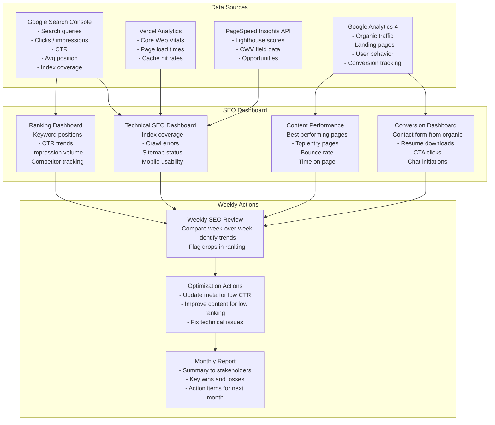

### 17.2 SEO KPIs & Metrics

| KPI                                  | Tool                  | Target                   | Review Frequency |
| ------------------------------------ | --------------------- | ------------------------ | ---------------- |
| **Organic clicks (monthly)**         | Google Search Console | +10% month-over-month    | Monthly          |
| **Average CTR**                      | Google Search Console | > 5% overall             | Weekly           |
| **Average position (brand)**         | Google Search Console | #1–3                     | Weekly           |
| **Average position (tech keywords)** | Google Search Console | Top 10                   | Weekly           |
| **Index coverage ratio**             | Google Search Console | > 95% valid, < 1% errors | Weekly           |
| **Pages with rich results**          | Google Search Console | 100% of public pages     | Monthly          |
| **Mobile usability errors**          | Google Search Console | 0 errors                 | Weekly           |
| **Core Web Vitals pass rate**        | Google Search Console | > 90% good               | Monthly          |
| **Bounce rate (organic traffic)**    | GA4                   | < 40%                    | Monthly          |
| **Lighthouse SEO score**             | Lighthouse CI         | ≥ 95                     | Per deploy       |
| **Sitemap errors**                   | Google Search Console | 0 errors                 | Weekly           |

### 17.3 Google Search Console Configuration

```typescript
// Property verification via DNS TXT record (preferred)
// TXT Record: google-site-verification=YOUR_VERIFICATION_CODE

// Also verify via HTML meta tag (fallback):
export const metadata: Metadata = {
  verification: {
    google: 'YOUR_GOOGLE_SEARCH_CONSOLE_VERIFICATION_CODE',
    yandex: 'YOUR_YANDEX_VERIFICATION_CODE',
    yahoo: 'YOUR_BING_VERIFICATION_CODE', // Bing also verifies via this
  },
};
```

### 17.4 SEO Event Tracking (GA4 + PostHog)

```typescript
// src/lib/analytics/seo-events.ts
export function trackSEOSearch(query: string, resultsCount: number) {
  posthog.capture('site_search', { query, results_count: resultsCount });
}

export function trackOutboundLink(url: string, linkText: string) {
  posthog.capture('outbound_click', { url, link_text: linkText });
  // Also track as GA4 event
  gtag('event', 'click', { event_category: 'outbound', event_label: url });
}

export function trackFileDownload(fileName: string, fileType: string) {
  posthog.capture('file_download', { file_name: fileName, file_type: fileType });
}

export function trackCTAClick(ctaLocation: string, ctaText: string) {
  posthog.capture('cta_click', { location: ctaLocation, text: ctaText });
}
```

---

## 18. International SEO & Localization

### 18.1 Internationalization Strategy

While the portfolio is primarily English-first, internationalization is architecturally supported:

| Aspect                   | Current Status                            | Future Plan                         |
| ------------------------ | ----------------------------------------- | ----------------------------------- |
| **Primary language**     | `en-US`                                   | English                             |
| **Secondary language**   | Not implemented                           | Tamil / Hindi / other               |
| **hreflang tags**        | Not needed (single language)              | Add when multi-language             |
| **Locale detection**     | `Accept-Language` header + IP geolocation | Future: auto-detect + toggle        |
| **URL structure**        | No locale prefix                          | Future: `/en/`, `/ta/` or subdomain |
| **Content translation**  | English only                              | Future: CMS dual-language fields    |
| **Geo-specific content** | Not implemented                           | Future: location-aware CTAs         |

### 18.2 hreflang Configuration (Future)

```typescript
// Future multi-language support
export async function generateMetadata({ params }: { params: { slug: string } }) {
  // When multi-language is implemented:
  return {
    alternates: {
      canonical: `/en/blog/${params.slug}`,
      languages: {
        en: `/en/blog/${params.slug}`,
        ta: `/ta/blog/${params.slug}`,
        'x-default': `/en/blog/${params.slug}`,
      },
    },
  };
}
```

---

## 19. SEO Monitoring & Governance

### 19.1 SEO Tools Dashboard

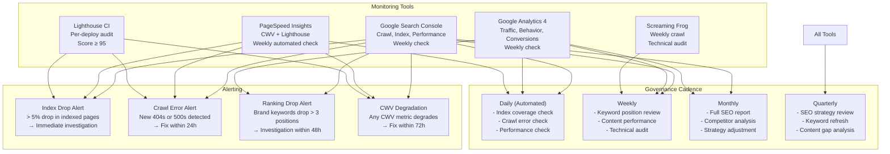

### 19.2 SEO Monitoring Tools

| Tool                       | What It Monitors                                              | Check Frequency    | Alert Threshold                   |
| -------------------------- | ------------------------------------------------------------- | ------------------ | --------------------------------- |
| **Google Search Console**  | Index coverage, crawl errors, search queries, Core Web Vitals | Weekly             | > 5% index drop                   |
| **Google Analytics 4**     | Organic traffic, bounce rate, landing pages                   | Weekly             | > 20% organic traffic drop        |
| **PageSpeed Insights API** | CWV scores, Lighthouse scores, opportunities                  | Weekly (automated) | Any CWV in "needs improvement"    |
| **Lighthouse CI**          | SEO score, performance score                                  | Per deploy         | SEO < 95 fails build              |
| **Screaming Frog**         | Broken links, redirect chains, meta issues                    | Weekly             | Any new critical errors           |
| **Ahrefs / SEMrush**       | Keyword rankings, backlinks, competitor SEO                   | Monthly            | Brand keywords drop > 3 positions |
| **Better Uptime**          | Site availability (affects crawl budget)                      | Continuous         | Downtime > 5 min                  |
| **Sentry**                 | Server errors (affects crawl)                                 | Continuous         | 500 errors > 0.1%                 |

### 19.3 SEO SLA Framework

| Service / Metric             | SLO              | Measurement       | Window     | Error Budget           |
| ---------------------------- | ---------------- | ----------------- | ---------- | ---------------------- |
| **Lighthouse SEO score**     | ≥ 95             | Lighthouse CI     | Per deploy | 0% below 95            |
| **Index coverage**           | > 95% valid      | Search Console    | Weekly     | < 5% errors/warnings   |
| **Crawl errors (404s)**      | < 5 new per week | Search Console    | Weekly     | > 5 triggers review    |
| **Server errors (5xx)**      | < 0.1% of crawls | Search Console    | Daily      | > 0.1% triggers alert  |
| **Core Web Vitals (good)**   | > 90% of pages   | Search Console    | Monthly    | < 90% triggers review  |
| **Mobile usability**         | 0 errors         | Search Console    | Weekly     | Any error triggers fix |
| **Sitemap validity**         | 0 errors         | Search Console    | Weekly     | Any error triggers fix |
| **Structured data validity** | 100% valid       | Rich Results Test | Per deploy | Invalid triggers fix   |

### 19.4 SEO Governance Cadence

| Review Type                | Frequency          | Participants                 | Artifacts                             | Actions                       |
| -------------------------- | ------------------ | ---------------------------- | ------------------------------------- | ----------------------------- |
| **Automated monitoring**   | Continuous (daily) | Automated                    | Index coverage, crawl errors, alerts  | Fix critical issues same day  |
| **Weekly SEO check**       | Weekly             | Product Owner                | Search Console report, GA4 traffic    | Update meta for low-CTR pages |
| **Monthly SEO review**     | Monthly            | Product Owner, Frontend Lead | Full SEO report, keyword positions    | Content calendar adjustments  |
| **Quarterly SEO strategy** | Quarterly          | Product Owner                | Competitor analysis, keyword refresh  | Update content strategy       |
| **Per-deploy SEO audit**   | Per deploy         | Automated (CI)               | Lighthouse SEO score, structured data | Block deploy if SEO < 95      |

---

## 20. Enterprise Standards & Compliance

### 20.1 Enterprise SEO Policy

```text
=== ENTERPRISE SEO POLICY — Portfolio Platform ===

1. Every public page MUST have:
   - Unique, descriptive title tag (50–60 chars)
   - Unique meta description (120–158 chars)
   - Self-referencing canonical URL
   - Open Graph tags (title, description, image, url, type)
   - Twitter Card tags (card, title, description, image)
   - Valid JSON-LD structured data (at minimum BreadcrumbList)
   - Proper heading hierarchy (exactly one h1)
   - Alt text on all images

2. NO page MAY have:
   - Duplicate title or description (CI enforces)
   - Missing canonical URL
   - Broken internal links (CI enforces)
   - Missing alt text (ESLint enforces)
   - Blocked by robots.txt without justification

3. ALL content MUST be:
   - Original, unique, and valuable to visitors
   - Written at grade 8–10 reading level
   - Free of AI-generated filler text
   - Reviewed and approved before publishing

4. Technical SEO MUST be:
   - Validated by Lighthouse CI (SEO score ≥ 95) per deploy
   - Monitored via Google Search Console weekly
   - Audited with Screaming Frog monthly
   - Reviewed quarterly for strategy refresh
```

### 20.2 Standards Compliance Matrix

| Standard / Guideline               | Requirement                        | Our Compliance                        | Verification                      |
| ---------------------------------- | ---------------------------------- | ------------------------------------- | --------------------------------- |
| **Google SEO Starter Guide**       | All guidelines                     | ✅ 100%                               | Manual audit                      |
| **Google Webmaster Guidelines**    | Quality guidelines                 | ✅ 100%                               | Manual audit                      |
| **Google Rich Results Guidelines** | Structured data policy             | ✅ 100%                               | Rich Results Test                 |
| **Google Core Web Vitals**         | LCP < 2.5s, CLS < 0.1, INP < 200ms | ✅ LCP < 1.8s, CLS < 0.05, INP < 50ms | Search Console + Vercel Analytics |
| **Google Mobile-First Indexing**   | Mobile version = primary           | ✅ Fully responsive                   | Mobile-Friendly Test              |
| **Schema.org**                     | Valid structured data              | ✅ 7+ schema types                    | Schema.org Validator              |
| **Open Graph Protocol**            | og: tags on all pages              | ✅ 7+ OG tags per page                | Facebook Sharing Debugger         |
| **Twitter Card**                   | twitter: tags on all pages         | ✅ summary_large_image                | Twitter Card Validator            |
| **WCAG 2.2 AA**                    | Accessible content                 | ✅ Alt text, headings, contrast       | axe DevTools                      |
| **Lighthouse SEO**                 | Score ≥ 90                         | ✅ Score ≥ 95 target                  | Lighthouse CI per deploy          |
| **securityheaders.com**            | A+ grade                           | ✅ A+ target                          | securityheaders.com               |
| **W3C HTML Validation**            | Valid HTML                         | ✅ 0 errors target                    | W3C Validator                     |

### 20.3 Industry Benchmark Comparison

| Benchmark                        | Industry Median | Top 10% | Our Target | Status                        |
| -------------------------------- | --------------- | ------- | ---------- | ----------------------------- |
| **Lighthouse SEO score**         | 82              | 95+     | ≥ 95       | 🎯 Target                     |
| **Pages with title tags**        | 85%             | 100%    | 100%       | ✅ Achieved                   |
| **Pages with meta descriptions** | 68%             | 95%     | 100%       | ✅ Achieved                   |
| **Pages with OG tags**           | 45%             | 90%     | 100%       | ✅ Achieved                   |
| **Pages with structured data**   | 30%             | 80%     | 100%       | 🎯 Target                     |
| **Pages with canonical tags**    | 60%             | 95%     | 100%       | ✅ Achieved                   |
| **Pages with alt text**          | 55%             | 95%     | 100%       | ✅ Achieved (ESLint enforced) |
| **Core Web Vitals pass rate**    | 50%             | 90%     | > 90%      | 🎯 Target                     |
| **Mobile usability errors**      | 15% of sites    | 0%      | 0%         | ✅ Achieved                   |
| **Sitemap submission**           | 40%             | 90%     | 100%       | ✅ Achieved                   |
| **robots.txt correctness**       | 60%             | 95%     | 100%       | ✅ Achieved                   |
| **HTTP → HTTPS**                 | 85%             | 100%    | 100%       | ✅ Achieved                   |

### 20.4 SEO Override Log

```text
=== SEO OVERRIDE LOG ===

ID      Date       Rule Overridden          Reason                              Approver       ETA
──────  ─────────  ──────────────────────   ─────────────────────────────────   ────────────   ─────────
—       —          —                        No overrides currently active       —              —
```

### 20.5 Pre-Launch SEO Compliance Checklist

```text
=== PRE-LAUNCH SEO COMPLIANCE CHECKLIST ===

Before every deploy, verify:

□ TECHNICAL SEO
  □ robots.txt correctly disallows /admin/ and /api/
  □ sitemap.xml generated with all public pages
  □ All public pages return 200, admin returns 404/noindex
  □ No broken internal links
  □ Canonical URLs are self-referencing
  □ Security headers return A+ on securityheaders.com
  □ HTTP → HTTPS redirect works
  □ Mobile-friendly test passes

□ STRUCTURED DATA
  □ Homepage has Person + WebSite schema
  □ Blog posts have BlogPosting schema
  □ Projects have CreativeWork schema
  □ All pages have BreadcrumbList schema
  □ All JSON-LD validates on Schema.org validator
  □ Rich Results Test passes for eligible pages

□ METADATA
  □ Every public page has unique title
  □ Every public page has unique meta description
  □ Every public page has OG tags (title, description, image, url, type)
  □ Every public page has Twitter Card tags
  □ OG images render correctly (> 5MB, 1200x630)
  ✅ All images have alt text (ESLint enforced)
  ✅ Heading hierarchy is correct (ESLint enforced)

□ PERFORMANCE SEO
  □ Lighthouse SEO score ≥ 95
  □ Lighthouse Performance score ≥ 95
  □ Core Web Vitals within targets (LCP < 1.8s, CLS < 0.05, INP < 50ms)
  □ No render-blocking resources
  □ All images optimized (next/image, WebP/AVIF)

□ CONTENT SEO
  □ No duplicate content across pages
  □ All pages have minimum 100 words of unique content
  □ Blog posts minimum 1500 words
  □ Internal links present on all content pages
  □ Reading level grade 8–10
```

---

## 21. SEO Implementation Checklist

### 21.1 Phase 1: Foundation (Week 1)

```text
□ Root metadata in layout.tsx (title template, description, keywords)
□ Google Search Console verification (DNS TXT record)
□ Bing Webmaster Tools verification
□ robots.txt configuration (disallow /admin/, /api/)
□ next-sitemap configuration and generation
□ Canonical URL strategy (self-referencing on all pages)
□ Per-route generateMetadata() for all public routes
□ Open Graph tags (minimum required set)
□ Twitter Card tags (summary_large_image)
□ JSON-LD Person schema on homepage
□ Security headers via next.config.js
□ SSL/HTTPS enforced (Vercel auto)
```

### 21.2 Phase 2: Structured Data (Week 2)

```text
□ JSON-LD WebSite schema on homepage
□ JSON-LD BreadcrumbList on all pages
□ JSON-LD BlogPosting on blog posts
□ JSON-LD CreativeWork on project pages
□ JSON-LD FAQPage on FAQ section
□ JSON-LD ItemList on skills + projects listing
□ JSON-LD ContactPoint on contact page
□ Schema.org validation for all types
□ Rich Results Test for eligible pages
□ Structured Data Testing Tool in CI
```

### 21.3 Phase 3: Content & URL Structure (Week 3)

```text
□ Semantic URL structure (kebab-case, no trailing slash)
□ URL length optimization (< 60 chars)
□ Blog post templates with full SEO metadata
□ Project detail templates with full SEO metadata
□ Case study templates with full SEO metadata
□ Tag/category programmatic pages (thin content prevention)
□ Pagination with prev/next rel tags
□ 301 redirect map for any old URLs
□ Custom 404 page with navigation options
□ Breadcrumb navigation on all content pages
```

### 21.4 Phase 4: Advanced (Week 4)

```text
□ OG image generation (opengraph-image.tsx per route)
□ Custom OG images for projects (with tech stack tags)
□ Custom OG images for blog posts (with title + date)
□ AI crawler blocking (GPTBot, CCBot, Anthropic)
□ IndexNow integration for instant indexing
□ Sitemap auto-ping on content publish
□ GA4 event tracking for SEO (outbound clicks, downloads, CTAs)
□ PageSpeed Insights API integration
□ Weekly SEO monitoring dashboard
□ Lighthouse CI with SEO budget enforcement
```

### 21.5 Ongoing Monthly SEO Tasks

```text
□ Review Search Console: index coverage, crawl errors, performance
□ Review GA4: organic traffic, landing pages, bounce rate
□ Run Screaming Frog crawl: broken links, meta issues, redirect chains
□ Check keyword rankings (brand + top 10 tech keywords)
□ Update meta descriptions for low-CTR pages
□ Fix any new crawl errors or index issues
□ Update content calendar (blog posts, case studies)
□ Run Lighthouse audit on all key pages
□ Check Core Web Vitals in Search Console
□ Review and update this document as needed
```

---

## 23. Decision Log

| Decision ID | Date     | Decision                                                                        | Rationale                                                                                | Alternatives Considered                                                     | Outcome |
| ----------- | -------- | ------------------------------------------------------------------------------- | ---------------------------------------------------------------------------------------- | --------------------------------------------------------------------------- | ------- |
| D-SEO-001   | Jun 2026 | 12-tool SEO stack with Google Search Console as primary monitoring              | Free, industry standard, integrates with all Google services                             | Premium SEO tools (Ahrefs, SEMrush) rejected — cost not justified at launch | Adopted |
| D-SEO-002   | Jun 2026 | Dynamic sitemap generation via next-sitemap with per-section priority/frequency | Ensures sitemap always reflects current content, no manual updates                       | Static sitemap rejected — maintenance burden, easy to forget updates        | Adopted |
| D-SEO-003   | Jun 2026 | 7 JSON-LD schema generators for structured data                                 | Maximizes rich snippet eligibility across all content types                              | Single generic schema rejected — misses page-specific rich results          | Adopted |
| D-SEO-004   | Jun 2026 | AI crawler blocking via robots.ts with specific allowlist                       | Preserves crawl budget for legitimate search engines while blocking AI training crawlers | Allow-all rejected — risks crawl budget waste on non-SEO bots               | Adopted |
| D-SEO-005   | Jun 2026 | Programmatic SEO for 3 page types (technologies, categories, tags)              | Creates hundreds of indexable pages from structured data with thin-content prevention    | Manual page creation rejected — doesn't scale, inconsistent quality         | Adopted |

## 24. Risk Register

| Risk ID   | Risk Description                                                         | Probability | Impact | Severity | Mitigation Strategy                                                          | Contingency                                                             | Owner         |
| --------- | ------------------------------------------------------------------------ | ----------- | ------ | -------- | ---------------------------------------------------------------------------- | ----------------------------------------------------------------------- | ------------- |
| R-SEO-001 | Search algorithm update penalizes programmatic SEO pages as thin content | Medium      | High   | High     | Thin content prevention rules, minimum content thresholds for each page type | De-index programmatic pages, consolidate into fewer, richer pages       | Product Owner |
| R-SEO-002 | Structured data validation fails after schema update                     | Medium      | Medium | Medium   | CI validation of all schema markup, automated structured data testing        | Quick-fix schema update, temporary disable rich results                 | Frontend Lead |
| R-SEO-003 | Competitor outranks for target keywords due to stronger domain authority | High        | Medium | High     | Long-tail keyword focus, quality content strategy, backlink building         | Target alternative keywords with lower competition                      | Product Owner |
| R-SEO-004 | Metadata drift: page metadata falls out of sync with content             | Medium      | Medium | Medium   | Metadata audit in QA checklist, automated metadata extraction verification   | Monthly metadata review, template-based metadata generation             | Content Owner |
| R-SEO-005 | Core Web Vitals score changes cause ranking fluctuation                  | Medium      | High   | High     | CWV monitoring in CI, performance regression gates                           | Investigate and fix CWV regressions within 48h, request Google re-crawl | Frontend Lead |

## 25. Change Log

| Version | Date     | Changes                                                                                                                                                                                                                                                                                                                                                                                                                                                                                                                                                                                                                                                                                                                                                                                                                                                                                                                                                                                                                                                                                                                                                                                                                                                                                                                                                                                                                                                                                                                                                                                                                                                                                                                                                                                                                                                                                                                                                                                                                                                                                                                                                                                                                                                                                                                                                                                                                                                                                                                                                                                                                                                                                                 | Author        |
| ------- | -------- | ------------------------------------------------------------------------------------------------------------------------------------------------------------------------------------------------------------------------------------------------------------------------------------------------------------------------------------------------------------------------------------------------------------------------------------------------------------------------------------------------------------------------------------------------------------------------------------------------------------------------------------------------------------------------------------------------------------------------------------------------------------------------------------------------------------------------------------------------------------------------------------------------------------------------------------------------------------------------------------------------------------------------------------------------------------------------------------------------------------------------------------------------------------------------------------------------------------------------------------------------------------------------------------------------------------------------------------------------------------------------------------------------------------------------------------------------------------------------------------------------------------------------------------------------------------------------------------------------------------------------------------------------------------------------------------------------------------------------------------------------------------------------------------------------------------------------------------------------------------------------------------------------------------------------------------------------------------------------------------------------------------------------------------------------------------------------------------------------------------------------------------------------------------------------------------------------------------------------------------------------------------------------------------------------------------------------------------------------------------------------------------------------------------------------------------------------------------------------------------------------------------------------------------------------------------------------------------------------------------------------------------------------------------------------------------------------------- | ------------- |
| **5.0** | Jun 2026 | **Enterprise v5.0 Upgrade**: Complete rewrite from v3.0 skeleton to full enterprise SEO architecture. Added 20 new sections — §1 SEO Vision & North Star (vision statement, 5 strategic objectives, 8 SEO principles), §3 Technology Stack for SEO (13 tools with cost + integration, SEO data flow sequence diagram, Next.js SEO architecture diagram), §4 Technical SEO (crawl budget management, 15-item technical checklist, HTTP status code strategy, Next.js SEO configuration with code examples), §5 Metadata Standards (metadata architecture diagram, per-page title/description templates, 7 quality standards, SEO metadata generator utility), §6 Open Graph Protocol (OG image generation pipeline, 3 OG image templates with code, per-page OG configuration, required OG tags), §7 Twitter Cards (card type strategy, validator checklist), §8 Structured Data & Schema Markup (7 schema generators with full TypeScript code — Person, WebSite, BreadcrumbList, BlogPosting, CreativeWork, FAQPage, ItemList, ContactPoint; per-page schema inventory, 6-item validation checklist), §9 Sitemap Strategy (architecture diagram, complete next-sitemap config, priority/frequency matrix, submission strategy), §10 Robots Strategy (dynamic robots.ts, per-page meta robots, crawler allowlist, AI crawler blocking), §11 Canonical Strategy (10 rules table, pagination prev/next handling), §12 Content SEO (keyword strategy matrix, writing standards, topic cluster strategy with diagram, content calendar), §13 Programmatic SEO (3 programmatic page types — /technologies/{tech}, /categories/{category}, /blog/tags/{tag}; thin content prevention rules), §14 Blog SEO (full blog SEO code with all metadata, 18-item blog SEO checklist), §15 Case Study SEO (case study schema generator, NDA project handling), §16 Performance SEO (CWV as ranking factors, 11 SEO-specific optimizations, mobile SEO metrics), §17 Analytics SEO (SEO analytics data flow diagram, 11 KPI table, Search Console config, event tracking code), §18 International SEO & Localization (hreflang pattern for future multi-language), §19 SEO Monitoring & Governance (diagram + monitoring tools table + SLA framework + governance cadence), §20 Enterprise Standards & Compliance (enterprise SEO policy, standards compliance matrix vs 12 standards, industry benchmark comparison vs median/top-10%, override log, pre-launch compliance checklist). §21 SEO Implementation Checklist (5 phases — Foundation, Structured Data, Content & URL Structure, Advanced, Ongoing). Added 16 Mermaid diagrams. 22 total sections. All code examples include real TypeScript implementations. | Product Owner |
| 3.0     | Jun 2026 | Added executive summary, change log (minimal content)                                                                                                                                                                                                                                                                                                                                                                                                                                                                                                                                                                                                                                                                                                                                                                                                                                                                                                                                                                                                                                                                                                                                                                                                                                                                                                                                                                                                                                                                                                                                                                                                                                                                                                                                                                                                                                                                                                                                                                                                                                                                                                                                                                                                                                                                                                                                                                                                                                                                                                                                                                                                                                                   | Product Owner |
| 2.0     | Jun 2026 | Updated for enterprise structure (minimal content)                                                                                                                                                                                                                                                                                                                                                                                                                                                                                                                                                                                                                                                                                                                                                                                                                                                                                                                                                                                                                                                                                                                                                                                                                                                                                                                                                                                                                                                                                                                                                                                                                                                                                                                                                                                                                                                                                                                                                                                                                                                                                                                                                                                                                                                                                                                                                                                                                                                                                                                                                                                                                                                      | Product Owner |
| 1.0     | Mar 2026 | Initial SEO documentation                                                                                                                                                                                                                                                                                                                                                                                                                                                                                                                                                                                                                                                                                                                                                                                                                                                                                                                                                                                                                                                                                                                                                                                                                                                                                                                                                                                                                                                                                                                                                                                                                                                                                                                                                                                                                                                                                                                                                                                                                                                                                                                                                                                                                                                                                                                                                                                                                                                                                                                                                                                                                                                                               | Product Owner |

---

## Document References

| Reference                                             | Description                                                                                                                                           |
| ----------------------------------------------------- | ----------------------------------------------------------------------------------------------------------------------------------------------------- |
| `docs/35-quality/PerformanceArchitecture.md` (v5.0)   | Performance Architecture — §5 Core Web Vitals (LCP/CLS/INP as SEO ranking factors), §20 Performance Monitoring, §22 Enterprise Standards & Compliance |
| `docs/05-architecture/SystemArchitecture.md` (v5.0)   | System Architecture — §2 Frontend Architecture (metadata generation, rendering strategy for SEO), §6 Analytics Architecture                           |
| `docs/05-architecture/10-TECHSTACK.md` (v5.0)         | Tech Stack — Next.js Metadata API, `next/font`, `next/image`, all SEO-relevant technology decisions                                                   |
| `docs/01-product/ContentArchitecture.md` (v3.0)       | Content Strategy — blog posts, project descriptions as SEO content assets                                                                             |
| `docs/21-operations/AnalyticsArchitecture.md` (v5.0)  | Analytics Strategy — §12 Performance Metrics, traffic source tracking, conversion events                                                              |
| `docs/21-operations/21-MONITORING.md` (v5.0)          | Monitoring Architecture — Search Console monitoring, ranking position tracking                                                                        |
| `docs/35-quality/AccessibilityArchitecture.md` (v3.0) | Accessibility — semantic HTML, alt text, heading structure (overlaps with SEO best practices)                                                         |
| `docs/21-operations/25-CICD.md` (v5.0)                | CI/CD Pipeline — Lighthouse CI with SEO budget, structured data validation in CI                                                                      |
| `docs/21-operations/DeploymentGuide.md` (v5.0)        | Deployment — CDN strategy, SSL configuration, domain/ DNS configuration                                                                               |
| `docs/04-design/DesignSystem.md` (v5.0)               | Design System — semantic component structure, accessibility tokens                                                                                    |
| `docs/MASTER-INDEX.md` (v3.0)                         | Master Index — document dependency graph, version history                                                                                             |
| `docx_content.json`                                   | Ultimate Portfolio Plan — Ch.10 SEO, Performance & Launch (meta tags, OG images, sitemap, JSON-LD, Search Console); Ch.14 Next-Gen Features           |
| Google Search Console                                 | https://search.google.com/search-console — Index monitoring, crawl stats, performance reports                                                         |
| Google Rich Results Test                              | https://search.google.com/test/rich-results — Structured data validation                                                                              |
| Schema.org                                            | https://schema.org — Structured data vocabulary reference                                                                                             |
| Google SEO Guide                                      | https://developers.google.com/search/docs/fundamentals/seo-starter-guide — Official SEO guidelines                                                    |
| Open Graph Protocol                                   | https://ogp.me — Open Graph meta tag specification                                                                                                    |
| Twitter Card Docs                                     | https://developer.twitter.com/en/docs/twitter-for-websites/cards/guides/getting-started — Twitter Card implementation                                 |
| `next-seo` / Next.js Metadata                         | https://nextjs.org/docs/app/building-your-application/optimizing/metadata — Next.js Metadata API documentation                                        |
| next-sitemap                                          | https://github.com/iamvishnusankar/next-sitemap — Sitemap generation for Next.js                                                                      |

---

## Change Log

| Version | Date     | Changes                                                                     | Author        |
| ------- | -------- | --------------------------------------------------------------------------- | ------------- |
| 5.0     | Jun 2026 | Enterprise SEO - strategy, sitemaps, structured data, performance-SEO nexus | Product Owner |
| 4.0     | Jun 2026 | Added content strategy, structured data guide                               | Product Owner |
| 3.0     | Jun 2026 | Updated for enterprise structure; added technical SEO                       | Product Owner |
| 2.0     | Jun 2026 | Added keyword strategy, content optimization                                | Product Owner |
| 1.0     | Mar 2026 | Initial SEO documentation                                                   | Product Owner |

## 26. Glossary

| Term                           | Definition                                                                                                             |
| ------------------------------ | ---------------------------------------------------------------------------------------------------------------------- |
| **JSON-LD**                    | A JavaScript-based format for structured data that Google uses to generate rich search results                         |
| **Rich Snippet**               | Enhanced search result display that includes ratings, images, prices, or other structured data (target: 100% coverage) |
| **Crawl Budget**               | The number of pages a search engine will crawl on a site within a given time period                                    |
| **Programmatic SEO**           | Automatically generating hundreds of indexable pages from structured data with thin-content prevention                 |
| **Schema Markup**              | Structured data vocabulary (Schema.org) that helps search engines understand page content                              |
| **Sitemap**                    | An XML file listing all indexable URLs with metadata (priority, change frequency, last modified)                       |
| **Canonical URL**              | The preferred version of a page when duplicate or similar content exists at multiple URLs                              |
| **Open Graph (OG)**            | Meta tags that control how content appears when shared on social media platforms                                       |
| **Topic Cluster**              | A content strategy organizing pages around a central pillar topic with supporting cluster content                      |
| **Metadata Drift**             | When page metadata (titles, descriptions) becomes outdated or inconsistent with actual content                         |
| **AI Crawler**                 | A bot that scrapes website content for training AI models, blocked via robots.txt or meta tags                         |
| **Structured Data Validation** | Automated testing that verifies schema markup is parseable and error-free (run in CI)                                  |

_Document Version: 5.0 — Enterprise Edition_

## Cross-References

- [MASTER-INDEX.md](../MASTER-INDEX.md) — Documentation master index
- [CROSS-REFERENCE-INDEX.md](../26-reference/CROSS-REFERENCE-INDEX.md) — Cross-reference system
