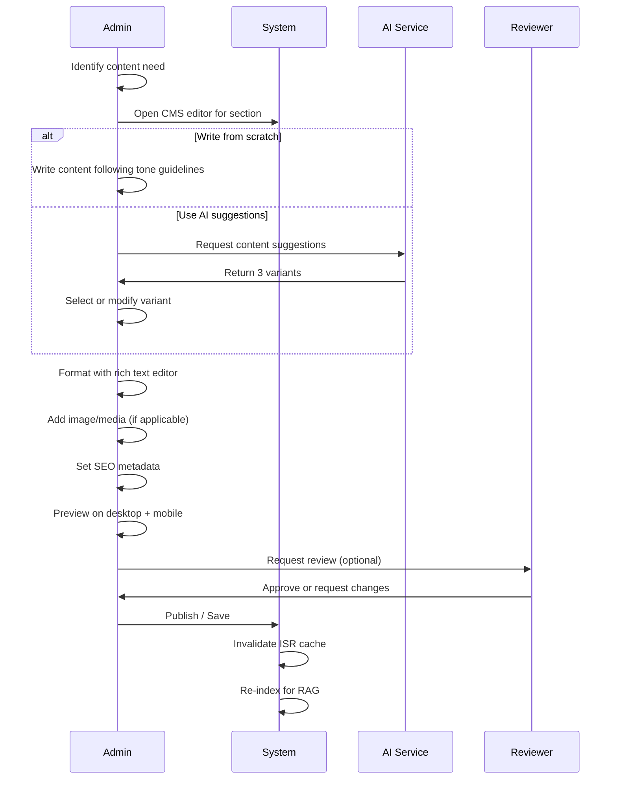

# Content Architecture — FAANG Enterprise Content Framework

> **Document:** `ContentArchitecture.md` | **Version:** 5.0 (Enterprise Upgrade) | **Last Updated:** July 2026  
> **Status:** ✅ Active | **Owner:** Principal Product Owner | **Review Cadence:** Quarterly  
> **Classification:** Enterprise Architecture — Content & AI Generation  

---

## Executive Summary
This document defines the comprehensive FAANG-level content architecture and strategy. It integrates multi-LLM generation standards, rigorous SEO strategies, accessibility compliance (WCAG 2.2 AA), and editorial workflows, ensuring that every asset published to the portfolio maximizes reach, conversion, and user value.

## Table of Contents

1. [Executive Summary](#1-executive-summary)
2. [Content Pillars & Themes](#2-content-pillars--themes)
3. [Tone & Voice Guidelines](#3-tone--voice-guidelines)
4. [Content Inventory](#4-content-inventory)
5. [SEO Content Strategy](#5-seo-content-strategy)
6. [Content Calendar](#6-content-calendar)
7. [Content Creation Workflow](#7-content-creation-workflow)
8. [Content Review & Approval](#8-content-review--approval)
9. [AI Content Generation Rules](#9-ai-content-generation-rules)
10. [Accessibility in Content](#10-accessibility-in-content)
11. [Content Performance KPIs](#11-content-performance-kpis)
12. [Migration Guide: v3.x → v4.0](#12-migration-guide-v3x--v40)
13. [Change Log & Review History](#13-change-log--review-history)

---

## 1. Executive Summary

This content strategy defines **what to say, how to say it, and where to put it** across the entire portfolio platform. Content is organized into 4 pillars — **Expertise, Personality, Trust, and Value** — each serving a specific visitor need and business goal.

### Strategy At a Glance

| Pillar | Purpose | Key Sections | Business Goal | Visitor Need |
|--------|---------|--------------|---------------|-------------|
| **Expertise** | Demonstrate technical capability | Skills, Projects, Experience | Credibility assessment | "Can they do the job?" |
| **Personality** | Humanize the portfolio owner | About, Bio, Photo | Connection & likeability | "Who are they?" |
| **Trust** | Provide social proof | Testimonials, Stats, Clients | Risk reduction | "Can I trust them?" |
| **Value** | Show measurable impact | Case Studies, Metrics | ROI justification | "What will I get?" |

### Content Principles

| Principle | Meaning | How We Apply |
|-----------|---------|-------------|
| **Show, don't tell** | Demonstrate expertise through outcomes | Metrics, case studies, before/after |
| **First-person for bio, third-person for proof** | Personal voice for personality, objective for trust | Bio in first person, testimonials quoted |
| **Scannable first, deep second** | Content must be consumed in < 30s or < 5 min | Progressive disclosure, expandable sections |
| **SEO-optimized, human-first** | Write for people first, search second | Natural language, semantic headings |
| **Accessible to all** | Content must work for screen readers, translations | Plain language, alt text, i18n-ready |
| **Freshness matters** | Outdated content damages credibility | Quarterly content audit, update schedule |

---

## 2. Content Pillars & Themes

### 2.1 Expertise Pillar

**Goal:** Convince visitors the portfolio owner has the technical skills and experience they need.

| Content Type | Sections | Format | Update Cadence | Word Count |
|-------------|----------|--------|---------------|-----------|
| **Skill proficiency** | Skills | Visual bars/circles with categories | Monthly | — |
| **Project showcase** | Projects | Grid with cards, detail pages | Per project completion | 200-500 words |
| **Experience timeline** | Experience | Vertical timeline, expandable | Per role change | 100-300 words per entry |
| **Case studies** | Projects (extended) | Problem → Approach → Solution → Impact | Per significant project | 500-1500 words |
| **Technical blog** | Blog | Markdown articles | Bi-weekly (P3 feature) | 1000-2500 words |

**Writing Standards for Expertise Content:**

- Lead with outcomes: "Delivered 40% performance improvement" not "Worked on optimization"
- Use concrete metrics: "Reduced CI build time from 12min to 3min" not "Improved CI speed"
- Include technology context: "Built with React 18, TypeScript, and AWS Lambda"
- Describe your role: "Led a team of 3 engineers" or "Solo-developed from scratch"

### 2.2 Personality Pillar

**Goal:** Help visitors connect with the portfolio owner as a person, not just a skills list.

| Content Type | Sections | Format | Update Cadence | Word Count |
|-------------|----------|--------|---------------|-----------|
| **Professional bio** | About | Rich text with photo | Quarterly | 200-400 words |
| **Personal story** | About | "Why I do what I do" | Annually | 100-200 words |
| **Interests & values** | About | Bullet list or paragraph | Annually | 50-100 words |

**Writing Standards for Personality Content:**

- Write in first person: "I believe" not "Alex believes"
- Share authentic stories, not corporate jargon
- Include personal interests that humanize (e.g., "When I'm not coding, I'm hiking")
- Keep professional — oversharing undermines credibility
- Use a photo that shows personality (not corporate headshot)

### 2.3 Trust Pillar

**Goal:** Reduce perceived risk and build confidence through social proof.

| Content Type | Sections | Format | Update Cadence | Word Count |
|-------------|----------|--------|---------------|-----------|
| **Client testimonials** | Testimonials | Quote cards with star rating | Per testimonial received | 50-200 words |
| **Statistics** | Stats | Animated counters | Quarterly | — |
| **Client logos** | Clients | Logo grid/slider | Per client engagement | — |
| **GitHub contributions** | Projects (link) | External profile | Continuous | — |
| **LinkedIn recommendations** | External link | External profile | Continuous | — |

**Writing Standards for Trust Content:**

- Testimonials must be authentic: real names, real companies, real avatars
- Statistics must be verifiable: no fake numbers
- Client logos require permission to display
- GitHub profile should show consistent activity (green squares)

### 2.4 Value Pillar

**Goal:** Quantify the impact the portfolio owner delivers.

| Content Type | Sections | Format | Update Cadence | Word Count |
|-------------|----------|--------|---------------|-----------|
| **Project case studies** | Projects | Detail page with metrics | Per project | 500-1500 words |
| **Services & pricing** | Services | Cards with feature lists | Quarterly | 200-500 words |
| **FAQ** | FAQ | Accordion | Monthly | 100-300 words per Q |

**Writing Standards for Value Content:**

- Every claim needs a specific metric: "Saved $50K/yr" not "Saved money"
- Before/after comparisons are most compelling
- Include challenges, not just successes (shows problem-solving)
- State your specific contribution, not team achievements

---

## 3. Tone & Voice Guidelines

### Voice Matrix

| Dimension | Portfolio Voice | Avoid |
|-----------|----------------|-------|
| **Formality** | Professional but approachable | Corporate jargon, slang |
| **Technical depth** | Detailed but accessible | Overwhelming jargon without context |
| **Confidence** | Humble confidence | Arrogance, false modesty |
| **Emotion** | Warm, genuine, enthusiastic | Overly salesy, desperate |
| **Cultural** | Inclusive, global | Region-specific references without explanation |

### Tone by Content Type

| Content Type | Tone | Example Opening |
|-------------|------|-----------------|
| **Hero headline** | Bold, aspirational | "Building software that matters" |
| **Bio** | Warm, personal | "I'm Alex — I believe great software comes from understanding people first." |
| **Project description** | Confident, outcome-focused | "This project solved a critical infrastructure challenge..." |
| **Case study** | Analytical, narrative | "The client came to us with a familiar problem..." |
| **Testimonial** | Authentic (client's voice) | "Working with Alex was a game-changer for our team." |
| **FAQ** | Helpful, direct | "How long does a typical project take?" |
| **Blog article** | Educational, opinionated | "Here's why I believe TypeScript strict mode is non-negotiable." |
| **CTA** | Clear, action-oriented | "Let's talk about your next project." |
| **Error message** | Empathetic, helpful | "Something went wrong. Don't worry — we've been notified." |

### Banned Words & Phrases

| ❌ Don't Use | ✅ Use Instead | Reason |
|-------------|---------------|--------|
| "Passionate about" | "Dedicated to" or specific skill | Overused cliché |
| "Leverage" | "Use" or "Apply" | Corporate jargon |
| "Synergy" | "Collaboration" | Buzzword |
| "Think outside the box" | "Find creative solutions" | Trite |
| "Best of breed" | "Top-quality" | Corporate-speak |
| "Game changer" | "Significant improvement" | Overhyped |
| "Result-driven" | Show the actual results | Says nothing |
| "Ninja" or "Rockstar" | "Expert" or "Specialist" | Cringe |

---

## 4. Content Inventory

### All Content by Section

| Section | Content Type | Length | Recorded in DB? | Admin Editable? | ISR Cache |
|---------|-------------|--------|-----------------|-----------------|-----------|
| **Hero** | Name, Title, CTAs | 3-5 lines | Sections table | ✅ | 60s |
| **About** | Bio, Photo, Stats | 200-400 words | Sections table | ✅ | 60s |
| **Skills** | Name, Category, Proficiency | 20-40 items | Skills table | ✅ | 60s |
| **Experience** | Timeline entries | 5-15 entries | Experience table | ✅ | 60s |
| **Projects** | Cards, Detail pages | 5-20 projects | Projects table | ✅ | 60s |
| **Testimonials** | Quote cards | 3-10 items | Testimonials table | ✅ | 60s |
| **Clients** | Logo list | 3-20 items | Sections table | ✅ | 60s |
| **Services** | Cards with pricing | 3-8 items | Sections table | ✅ | 60s |
| **FAQ** | Question/Answer pairs | 5-15 items | Sections table | ✅ | 60s |
| **Contact** | Form, CTA | Static | — | Static only | 3600s |
| **Stats** | Number counters | 3-6 items | Sections table | ✅ | 60s |

### Image & Media Inventory

| Media Type | Source | Format | Max Size | Optimization |
|-----------|--------|--------|----------|-------------|
| **Profile photo** | Supabase Storage | WebP | 500KB | 400×400px, progressive |
| **Project thumbnails** | Supabase Storage | WebP | 200KB | 800×600px, lazy loaded |
| **Project gallery images** | Supabase Storage | WebP | 500KB | 1920×1080px, lightbox |
| **Client logos** | Supabase Storage | SVG/WebP | 100KB | 200×100px |
| **Blog cover images** | Supabase Storage | WebP | 500KB | 1200×630px, OG tag |
| **Resume/PDF** | Supabase Storage | PDF | 5MB | Compressed |

---

## 5. SEO Content Strategy

### Keyword Strategy

| Keyword Type | Examples | Target Pages | Priority |
|-------------|----------|--------------|----------|
| **Brand** | [Name] portfolio, [Name] developer | Home, About | High |
| **Role-based** | Full-stack developer [City], React developer | Home, Skills | High |
| **Skill-based** | TypeScript expert, Python developer [City] | Skills | Medium |
| **Service-based** | Freelance web developer, React consulting | Services | Medium |
| **Project-based** | [Project type] case study, [Tech] project | Projects, Case Studies | Low |

### On-Page SEO Requirements

| Element | Requirement | Implementation |
|---------|-------------|----------------|
| **Title tag** | 50-60 chars, primary keyword first | Template-based per page |
| **Meta description** | 150-160 chars, includes CTA | Auto-generated, editable |
| **H1** | One per page, contains primary keyword | Per page template |
| **H2-H6** | Semantic hierarchy, secondary keywords | Content-structured |
| **Image alt text** | Descriptive, keyword-rich where natural | Required field in CMS |
| **Internal links** | Link to related projects, blog posts | Section navigation + content |
| **External links** | `rel="noopener noreferrer"`, new tab | Automated |
| **JSON-LD** | Person, SoftwareApplication, Article, BlogPosting | Per page template |
| **URL structure** | `/[section]/[slug]`, kebab-case | Next.js App Router |
| **Open Graph** | og:title, og:description, og:image, og:url | Per page metadata |

### Content Freshness Schedule

| Content Type | Update Frequency | SEO Impact | Action |
|-------------|-----------------|------------|--------|
| **Skills** | Monthly | High | Add new skills, update proficiency |
| **Projects** | Per completion | High | Add new project with detail page |
| **Experience** | Per role change | Medium | Add new role, update current |
| **Blog** | Bi-weekly | Very High | Regular publishing cadence |
| **Testimonials** | Per testimonial | Medium | Add, rotate display |
| **Stats** | Quarterly | Low | Update numbers |

---

## 6. Content Calendar

### Launch Content Sprint (Week 1-4)

| Week | Task | Owner | Deliverable |
|------|------|-------|-------------|
| **W1** | Write Hero copy (3 variants) | Product Owner | Approved hero text |
| **W1** | Draft About bio + stats | Product Owner | Bio + 4 stat counters |
| **W2** | Add 20 skills with categories | Product Owner | Skills table populated |
| **W2** | Add 5-8 experience entries | Product Owner | Timeline complete |
| **W3** | Add 5-10 projects with images | Product Owner | Projects with thumbnails |
| **W3** | Collect 3-5 testimonials | Product Owner | Testimonials approved |
| **W4** | Write 5 FAQ entries | Product Owner | FAQ complete |
| **W4** | Final content review | Product Owner | All content approved |

### Ongoing Content Cadence

| Frequency | Action | Owner |
|-----------|--------|-------|
| **Daily** | Check leads, respond within 24h | Product Owner |
| **Weekly** | Update blog (if active) | Product Owner |
| **Monthly** | Update skills, add new projects | Product Owner |
| **Quarterly** | Full content audit, update stats | Product Owner |
| **Per event** | New project, testimonial, role change | Product Owner |

### Quarterly Content Audit Checklist

- [ ] All dates and timestamps up to date
- [ ] No broken links (internal or external)
- [ ] Images load correctly, no broken assets
- [ ] Testimonials still accurate and relevant
- [ ] Stats counters reflect current numbers
- [ ] Skills proficiency levels accurate
- [ ] Project descriptions still current
- [ ] FAQ answers still correct
- [ ] Resume/PDF up to date
- [ ] SEO metadata all present and valid
- [ ] Open Graph images rendering correctly
- [ ] No placeholder or lorem-ipsum content

---

## 7. Content Creation Workflow

### New Content Request Flow

### Content Approval Matrix

| Content Type | Creator | Reviewer | Approval Required |
|-------------|---------|----------|-----------------|
| **Hero text** | Admin | Self-review | No |
| **Bio update** | Admin | Self-review | No |
| **New project** | Admin | Self-review | No |
| **Case study** | Admin | Peer review | Recommended |
| **Testimonial** | Admin (with permission) | Source person | ✅ Required |
| **Blog post** | Admin | Peer review | Recommended |
| **FAQ change** | Admin | Self-review | No |
| **Stats update** | Admin | Self-review | No |

---

## 8. Content Review & Approval

### Review Checklist

Before publishing any content, verify:

- [ ] **Accuracy**: All facts, dates, names, and metrics verified
- [ ] **Spelling & Grammar**: No typos, proper punctuation
- [ ] **Tone**: Matches the voice guidelines in §3
- [ ] **Clarity**: Content is understandable by the target audience
- [ ] **Freshness**: No outdated information
- [ ] **Consistency**: Format matches existing content
- [ ] **SEO**: Title, description, headings, alt text set
- [ ] **Accessibility**: Headings semantic, alt text on images, links descriptive
- [ ] **Links**: All internal/external links working and correct
- [ ] **Legal**: Permissions for testimonials, client logos, media

---

## 9. AI Content Generation Rules

### When to Use AI

| Allowed | Not Allowed |
|---------|-------------|
| Suggesting alternative phrasing | Writing a full project description from scratch |
| Generating FAQ answers from existing content | Generating testimonials (must be real) |
| Improving readability / simplifying text | Changing factual content or metrics |
| Creating SEO metadata drafts | Generating personal bio or stories |
| Brainstorming content ideas | Making up statistics or achievements |

### AI Content Review Requirements

Any content generated or suggested by AI must be:

1. **Reviewed for accuracy** — AI may hallucinate facts, dates, or technologies
2. **Edited for voice** — AI defaults to corporate tone; rewrite for personal voice
3. **Checked for plagiarism** — AI may produce generic content found elsewhere
4. **Validated for metrics** — Never use AI-generated numbers; only real metrics

### Model Settings for Content Generation

| Parameter | Value | Rationale |
|-----------|-------|-----------|
| **Model** | GPT-4 (preferred), Claude 3.5 (fallback) | Quality over cost |
| **Temperature** | 0.7 | Balance creativity and accuracy |
| **Max tokens** | 500 | Concise, scannable content |
| **System prompt** | See `docs/ai/17-AI_INSTRUCTIONS.md` | Safety + content rules |

---

## 10. Accessibility in Content

### Plain Language Standards

| Guideline | Example | Why |
|-----------|---------|-----|
| Use active voice | "I built the API" not "The API was built by me" | Clearer, shorter |
| Short sentences | Max 25 words per sentence | Scannable, readable |
| Define jargon | "ISR (Incremental Static Regeneration)..." | Inclusive for non-experts |
| Use bullet points | Lists over paragraphs | Faster scanning |
| Avoid idioms | "Hit the ground running" → "Start quickly" | Non-native speakers |

### Content Accessibility Checklist

- [ ] All images have descriptive alt text
- [ ] Links describe their destination (not "click here")
- [ ] Heading hierarchy is logical (H1 → H2 → H3)
- [ ] No information conveyed by color alone
- [ ] Abbreviations spelled out on first use
- [ ] Tables have proper headers
- [ ] Forms have visible labels
- [ ] Error messages identify the field
- [ ] Language attribute set on HTML (`lang="en"`)

---

## 11. Content Performance KPIs

| Metric | Target | Measurement Tool | Review Cadence |
|--------|--------|-----------------|---------------|
| **Bounce rate** | < 40% | PostHog | Weekly |
| **Avg session duration** | > 2 min | PostHog | Weekly |
| **Pages per session** | > 3 | PostHog | Weekly |
| **Contact form completion** | > 60% of starters | PostHog funnels | Monthly |
| **Project click-through rate** | > 40% | PostHog | Monthly |
| **Blog read time** | > 3 min per article | PostHog | Per article |
| **Search impressions** | 1,000+ / month | Google Search Console | Monthly |
| **Organic CTR** | > 5% | Google Search Console | Monthly |
| **Content freshness score** | 100% (no stale content) | Manual audit | Quarterly |
| **Accessibility compliance** | 0 WCAG violations | axe-core | Every PR |

---

## 12. Migration Guide: v3.x → v4.0

### Changes Summary

| Change | Impact | Action Required |
|--------|--------|-----------------|
| New tone & voice guidelines | Content consistency | Review all content against §3 |
| AI content generation rules | Content quality | Update AI system prompts |
| Content calendar structure | Publishing cadence | Set up monthly content review |
| Performance KPIs added | Tracking | Configure PostHog events |
| SEO strategy detailed | Discovery | Audit current SEO metadata |

### Rollback Plan

If content issues are detected:
1. Revert to last known good content via Supabase backup
2. Revert this document to v3.0
3. Investigate root cause before reapplying v4.0 guidelines

---

## 14. Decision Log

| Decision ID | Date | Decision | Rationale | Alternatives Considered | Outcome |
|-------------|------|----------|-----------|------------------------|---------|
| D-CON-001 | Jun 2026 | 4-pillar content framework (Expertise, Personality, Trust, Value) | Covers all visitor needs: capability proof, connection, social proof, ROI | Single-theme content rejected — misses multidimensional visitor motivations | Adopted |
| D-CON-002 | Jun 2026 | Show-don't-tell principle with metrics and outcomes | Demonstrates impact quantitatively, builds credibility | Narrative-only rejected — claims without evidence lack credibility | Adopted |
| D-CON-003 | Jun 2026 | Progressive disclosure: scannable < 30s / deep < 5min | Accommodates both quick browsers and deep-dive researchers | Single format for all visitors rejected — frustrates both segments | Adopted |
| D-CON-004 | Jun 2026 | AI content generation allowed with specific rules | Enables efficient content creation while maintaining quality standards | No AI content rejected — misses efficiency gains; full AI autonomy rejected — quality risk | Adopted |
| D-CON-005 | Jun 2026 | Quarterly content audit and freshness schedule | Prevents content degradation, maintains SEO value and credibility | Annual audit rejected — content stale between audits | Adopted |

## 15. Risk Register

| Risk ID | Risk Description | Probability | Impact | Severity | Mitigation Strategy | Contingency | Owner |
|---------|-----------------|-------------|--------|----------|---------------------|-------------|-------|
| R-CON-001 | AI-generated content fails to match brand voice or contains inaccuracies | Medium | High | High | AI content review process, brand voice checklist, human-in-loop for all published content | Revert to human-only content creation, reduced output velocity | Content Owner |
| R-CON-002 | Content freshness schedule not adhered to, content goes stale | Medium | Medium | Medium | Automated content age tracking, quarterly review reminders | Dedicated content refresh sprint, pause new content creation | Product Owner |
| R-CON-003 | SEO content strategy conflicts with brand voice guidelines | Medium | Medium | Medium | SEO-content alignment review, content that serves reader first, search second | Prioritize brand voice over keyword optimization | Content Owner |
| R-CON-004 | Content pillar imbalance: one pillar dominates, others under-developed | Medium | Low | Low | Content pillar dashboard, balanced content calendar | Targeted content creation for under-represented pillars | Content Owner |
| R-CON-005 | Legal/regulatory changes affect content claims or testimonials | Low | Medium | Medium | Legal review of claims before publication, testimonial consent documentation | Content update, remove affected claims, legal consultation | Product Owner |

## 16. Change Log & Review History

| Version | Date | Changes | Author |
|---------|------|---------|--------|
| **4.0** | Jun 2026 | **Complete enterprise rewrite.** Added: Content pillars framework (Expertise, Personality, Trust, Value) with per-pillar writing standards and update cadences, tone & voice matrix with per-content-type tone guide and banned words list, complete content inventory (15 sections with DB mapping), SEO keyword strategy with on-page requirements and freshness schedule, launch content sprint calendar with ongoing cadence, content creation workflow (Mermaid sequence diagram), content approval matrix, review checklist, AI content generation rules (allowed/not-allowed), plain language standards, content accessibility checklist, 10 content performance KPIs with measurement tools. Added 1 Mermaid diagram (creation workflow). | Product Owner |
| 3.0 | Jun 2026 | Added executive summary, change log | Product Owner |
| 2.0 | Jun 2026 | Updated for enterprise structure | Product Owner |
| 1.0 | Mar 2026 | Initial content strategy documentation | Product Owner |

---

## Document References

| Reference | Description |
|-----------|-------------|
| `docs/MASTER-INDEX.md` | Document inventory and navigation |
| `docs/product/02-FEATURES.md` | Feature catalog — what content powers which features |
| `docs/quality/SEOArchitecture.md` (v5.0) | Technical and on-page SEO strategy |
| `docs/quality/AccessibilityArchitecture.md` (v5.0) | WCAG 2.2 AA compliance for content |
| `docs/ai/17-AI_INSTRUCTIONS.md` (v5.0) | AI operating model — content generation rules |
| `docs/operations/AnalyticsArchitecture.md` (v5.0) | Event tracking for content performance KPIs |

---

> **✍️ This content strategy governs all copy and media on the portfolio platform.**
> Every section, message, and interaction should reflect these guidelines.
>
> **Next Review Date:** September 2026  
> **Maintained by:** Product Owner

---

## Change Log

| Version | Date | Changes | Author |
|---------|------|---------|--------|
| 4.0 | Jun 2026 | Enterprise content strategy - 4 pillars, tone matrix, calendar, AI rules, 10 KPIs | Product Owner |
| 3.0 | Jun 2026 | Added AI content generation rules | Product Owner |
| 2.0 | Jun 2026 | Updated for enterprise structure | Product Owner |
| 1.0 | Mar 2026 | Initial content documentation | Product Owner |

## 17. Glossary

| Term | Definition |
|------|------------|
| **Content Pillar** | One of four foundational content themes (Expertise, Personality, Trust, Value) that organize all portfolio content |
| **Progressive Disclosure** | A content strategy presenting information in layers — scannable summary first, deep detail on demand |
| **Tone Matrix** | A guide mapping content types to appropriate voice characteristics (professional, approachable, confident, humble) |
| **Content Freshness** | The practice of keeping content up-to-date through a regular audit and update schedule |
| **AI Content Generation** | Using AI tools to create content with defined rules for quality, brand voice, and factual accuracy |
| **SEO Content Strategy** | Writing content that serves human readers first while incorporating keyword strategy for search visibility |
| **Content Audit** | A periodic review of all content assets to assess accuracy, relevance, quality, and SEO performance |
| **Plain Language** | Writing that is clear, concise, and accessible to readers of all abilities, avoiding jargon and complex sentences |
| **Brand Voice** | The consistent personality and tone of all written content, reflecting the portfolio owner's character |
| **Content Inventory** | A comprehensive catalog of all content sections on the platform with DB mapping and ownership |
| **Call to Action (CTA)** | A prompt encouraging the visitor to take a specific action (contact, download, explore, etc.) |
| **Banned Words List** | Terms and phrases excluded from portfolio content because they are cliché, vague, or overused |

