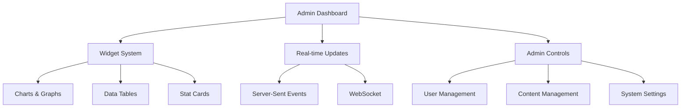

# Admin Architecture — FAANG Enterprise Dashboard

> **Document:** `AdminArchitecture.md` | **Version:** 5.0 (Enterprise Upgrade) | **Last Updated:** July 2026
> **Classification:** Enterprise Architecture — Internal
> **Extends:** docs/design/AdminDashboardArchitecture.md
> **Author:** Principal Architecture Lead
> **⚠️ Disambiguation:** This is the **Enterprise Experience Layer** for the admin dashboard. It extends the foundational `AdminDashboardArchitecture.md` with product experience design. See `AdminDashboardArchitecture.md` for widget specs, API endpoints, state machines, data flows, RBAC, security, and implementation roadmap.

---

## Executive Summary



ADMIN-DASHBOARD-ARCHITECTURE.md is the Enterprise Experience Layer for the portfolio's admin dashboard — extending the foundational AdminDashboardArchitecture.md (v1.2) with product experience design across 12 sections: user flows for 11 dashboard modules (overview, analytics, leads, CMS, monitoring, settings, permissions, audit, notifications, AI assistant, knowledge capture), 8 feature flows with step-by-step task execution and state machines, a unified 6-state UI taxonomy across all dashboards (loading, empty, populated, error, success, warning), 6 multi-step wizards (onboarding, content creation, import, onboarding settings, section style, theme customization), a 65-event notification catalog across 7 categories, a 6-index global search architecture, 7 AI agent capabilities (lead scoring, content suggestions, smart summaries, admin chat, bulk operations, anomaly detection, knowledge capture), collaboration features (sharing, comments, activity feed, multi-user model), responsive behavior across 3 breakpoints, and 7 enterprise screens (audit, system status, logs, compliance, health, cost, SLA). The document specifies 25 new component files and aligns with 28 cross-referenced architecture documents.

---

## Purpose & Scope

This document is the **Enterprise Experience Layer** — it sits on top of the existing AdminDashboardArchitecture.md (which covers widget specs, API endpoints, state machines, data flows, RBAC, security, and implementation roadmap) and adds the **product experience** dimension: user flows, feature flows, all UI states, multi-step experiences, notifications, search, AI agent experiences, collaboration, responsive behavior, and enterprise screens.

Together, the two documents form the **complete admin dashboard specification**.

---

## Decision Log

| ID | Decision | Rationale | Alternatives Considered | Date | Approver |
|----|----------|-----------|------------------------|------|----------|
| ADM-001 | Enterprise Experience Layer as separate document extending, not replacing, AdminDashboardArchitecture.md | Preserves existing widget/API/data-flow spec while adding product experience layer; avoids merge conflicts and maintains backward compatibility | Full rewrite (risk of losing existing spec details), inline additions (bloated single document) | 2026-06-01 | Chief Architect |
| ADM-002 | ASCII state diagrams over Mermaid for user flows | ASCII diagrams render reliably in any markdown viewer, can be copied into PR descriptions, email, and docs without rendering engine | Mermaid (requires renderer, fails in some editors), images (not text-searchable, cannot diff) | 2026-06-01 | Chief Architect |
| ADM-003 | Slide-over panel pattern for lead/modal detail views over full-page navigation | Slide-over preserves context (user stays on the table/list), faster than full navigation, works well for quick review/action patterns | Full-page navigation (loses context, slower), modal dialog (limited space for rich content), side-by-side split (too complex for mobile) | 2026-06-01 | Chief Architect |
| ADM-004 | Real-time notifications via Supabase Realtime subscriptions over polling | Subscriptions are instant (<100ms), zero polling overhead, scale to zero cost when idle, and integrate with existing Supabase setup | Polling at 30s intervals (wasteful, up to 30s delay), WebSocket direct (infrastructure overhead), Server-Sent Events (additional service needed) | 2026-06-01 | Chief Architect |
| ADM-005 | Command palette (⌘K) global search over dedicated search page | Command palette is always accessible via keyboard shortcut, follows established UX pattern (VS Code, Linear, GitHub), and allows cross-module search without navigation | Dedicated search page (requires navigation, disrupts flow), per-module search bar (inconsistent, no cross-module results), Algolia/SiteSearch (external dependency, cost) | 2026-06-01 | Chief Architect |

## Risk Register

| ID | Risk | Likelihood | Impact | Mitigation |
|----|------|------------|--------|------------|
| ADM-R01 | Document drift between this Experience Layer and the foundational AdminDashboardArchitecture.md | Medium | Medium | Cross-reference map (§0) explicitly maps every section; quarterly alignment review scheduled |
| ADM-R02 | Supabase Realtime subscription limits exceeded with 10+ concurrent admin users | Low | Medium | Use channel-based subscriptions (one per module, not one per user); implement reconnection backoff; monitor subscription count |
| ADM-R03 | Mobile admin experience degraded on small screens due to feature density | Medium | High | Three breakpoint system (§9) with BottomTabBar, BottomSheet, and reduced data density; test on 375px viewport |
| ADM-R04 | AI agent hallucination in admin write operations | Low | Critical | All write operations require explicit admin confirmation before execution; audit log captures every AI-initiated mutation |
| ADM-R05 | Notification fatigue from 65+ event types overwhelming admin | Medium | Low | Notification preferences (§5.4) allow per-event-type subscription; quiet hours; grouped notifications; digest mode for low-priority events |

---

## Cross-Reference Map

| This Doc Section | Extends AdminDashboardArchitecture.md Section | Content Type |
|---|---|---|
| §1 User Flows | All dashboard sections | Flow diagrams per module |
| §2 Feature Flows | All dashboard sections | Step-by-step task flows |
| §3 UI States | §2–§12 dashboard sections | State specifications per widget |
| §4 Multi-Step Experiences | §1, §8, §11, §14 | Wizard/onboarding flows |
| §5 Notification System | §12 Notification Dashboard | Full notification catalog |
| §6 Search Experience | (new) | Global search across modules |
| §7 AI Agent Experiences | §11 CMS, §6 Leads | AI interactions in admin |
| §8 Collaboration Features | §14–§15 | Sharing, comments, activity |
| §9 Responsive Behavior | §3.3–§3.4 | Breakpoint-specific layouts |
| §10 Enterprise Screens | §15–§16 | Audit, system status, logs |
| §11 Integration Architecture | §4, §7, §10 | Integration point specs |
| §12 Cross-Doc References | All | Alignment to 60+ docs |

## 1. User Flows Per Module

Each flow describes how an admin user completes a goal within a specific dashboard module. Flows are organized as **ASCII state diagrams** with decision points, system interactions, and failure paths.

### 1.1 Overview Dashboard User Flow

```
+-- ADMIN OVERVIEW --------------------------------------------+   +-- SYSTEM ------------+
|                                                                  |                      |
|  o START: Opens /admin                                          |                      |
|    |                                                              |                      |
|    v                                                              |                      |
|  v Already authenticated?                                        |                      |
|    +-- YES --> Dashboard renders                                 |  --> Fetch all stats |
|    |            |                                                  |    + GET /analytics  |
|    |            v                                                  |    + GET /leads      |
|    |          --> Sees stat cards:                              |    + GET /sections   |
|    |            . Visitors today (PostHog)                   |    + GET /monitoring  |
|    |            . Leads this week (Supabase)                  |    + GET /recent     |
|    |            . Active sections (Supabase)                  |                      |
|    |            . Site uptime (Better Uptime)                 |                      |
|    |            . Recent leads table (last 5)                 |                      |
|    |            . Visitor chart (7-day line)                  |                      |
|    |            . Quick action buttons                        |                      |
|    |            . Build status badge (GitHub Actions)         |                      |
|    |            . Availability toggle                         |                      |
|    |                                                              |                      |
|    |            v Next action?                                |                      |
|    |            +-- Check leads --> Navigate to /admin/leads |                      |
|    |            +-- Update CMS --> Navigate to /admin/cms    |                      |
|    |            +-- View analytics --> Navigate to           |                      |
|    |            |                   /admin/analytics         |                      |
|    |            +-- View monitoring --> Navigate to          |                      |
|    |            |                     /admin/monitoring      |                      |
|    |            +-- Toggle availability --> Click toggle     |  --> PATCH           |
|    |            |                            |               |       /api/admin/     |
|    |            |                            v               |       availability   |
|    |            |                          --> Badge updates |                      |
|    |            |                            instantly       |                      |
|    |            +-- View settings --> /admin/settings       |                      |
|    |            +-- Logout --> Session ends                 |                      |
|    |                                                              |                      |
|    +-- NO --> Redirect to /admin/login                       |                      |
|                  |                                            |                      |
|                  v                                            |                      |
|                --> Enters credentials (NestJS Passport)               |  --> Verify OAuth    |
|                  |                                            |                      |
|                  v Valid?                                     |                      |
|                  +-- YES --> Redirect to /admin              |                      |
|                  +-- NO --> Error shown                    |                      |
|                              --> Retry up to 5                 |                      |
|                              --> Locked after 5                |                      |
|                                                                  |                      |
|  o END                                                         |                      |
+------------------------------------------------------------------+----------------------+
```

#### Decision Points

| Decision | Criteria |
|----------|----------|
| Already authenticated? | Valid NestJS Passport session cookie |
| Next action? | Based on attention indicators -- unread leads badge, stale content warning |
| Valid credentials? | Google OAuth or email/password match, not rate-limited |

#### Failure Paths

| Path | Cause | Recovery |
|------|-------|----------|
| Stats load failure | API error or timeout | Show skeleton -> retry button -> stale cache fallback |
| Real-time data slow | >3s delay | Show cached data + "Last updated X ago" |
| Session expired | Idle >24h | Auto-redirect to login, preserve intended URL |
| Availability toggle fail | Network error | Optimistic update -> revert on error -> show error toast |

---

### 1.2 Analytics Dashboard User Flow

```
+-- ADMIN ANALYTICS -----------------------------------------------+
|                                                                     |
|  o START: Nav to /admin/analytics                                  |
|    |                                                                 |
|    v                                                                 |
|  v Loading state (skeleton)                                         |
|    |                                                                 |
|    v                                                                 |
|  --> Page renders with:                                                |
|    . Date range picker (7d / 30d / 90d / Custom)                    |
|    . Stat cards: Total visitors, Unique visitors, Avg time, Bounce  |
|    . Line chart: Visitors over time                                  |
|    . Pie chart: Device breakdown                                     |
|    . Bar chart: Top 10 pages                                         |
|    . World map: Geographic heatmap                                   |
|    . Top referrers list                                              |
|    . Export buttons (CSV / PDF)                                     |
|    |                                                                 |
|    v Change date range?                                              |
|    +-- YES --> Select new range                                     |
|    |            |                                                     |
|    |            v                                                     |
|    |          --> Skeleton shows on charts                             |
|    |            |                                                     |
|    |            v                                                     |
|    |          --> Charts re-render with new data                       |
|    |                                                                 |
|    +-- NO --> Browse current data                                  |
|                  |                                                   |
|                  v Drill into a metric?                              |
|                  +-- YES --> Click chart point or row               |
|                  |            |                                       |
|                  |            v                                       |
|                  |          --> Detail modal/slide-over opens          |
|                  |            . Full breakdown                       |
|                  |            . Trend over time                      |
|                  |            . Comparison to previous period        |
|                  |                                                   |
|                  +-- NO --> Continue browsing                        |
|                                                                     |
|  v Export?                                                           |
|  +-- YES --> Click CSV or PDF                                       |
|  |            |                                                       |
|  |            v                                                       |
|  |          --> Download starts                                        |
|  |            |                                                       |
|  |            v Include current date range?                          |
|  |            +-- YES --> Downloads filtered data                   |
|  |            +-- NO --> Downloads all data                         |
|  |                                                                   |
|  o END                                                              |
+---------------------------------------------------------------------+
```

#### Analytics User Tasks

| Task | Steps | Avg Time | Frequency |
|------|-------|----------|-----------|
| Quick traffic check | Open -> view stat cards -> glance at chart | 15s | Daily |
| Weekly performance review | Open -> set 7d -> review all charts -> export | 3min | Weekly |
| Deep dive on metric | Open -> click chart point -> read detail -> compare | 2min | Weekly |
| Export report | Open -> set range -> click export -> download | 30s | Monthly |

---

### 1.3 Leads Dashboard User Flow

```
+-- ADMIN LEADS -----------------------------------------------------+
|                                                                        |
|  o START: Nav to /admin/leads                                         |
|    |                                                                   |
|    v                                                                   |
|  --> Page renders with:                                                  |
|    . Stat bar: New, Replied, In-Progress, Hired, Archived counts      |
|    . Filter bar: Status x Date x Source x Search                      |
|    . Leads table: Name, Email, Date, Source, Status, Preview, Actions  |
|    . Bulk action bar (appears when rows selected)                     |
|    |                                                                   |
|    v Review incoming leads?                                           |
|    +-- YES --> Scan new leads in table                               |
|    |            |                                                       |
|    |            v Click a lead row?                                    |
|    |            +-- YES --> Slide-over panel opens                    |
|    |            |            |                                          |
|    |            |            v                                          |
|    |            |          --> Full message, source info, UTM data      |
|    |            |            |                                          |
|    |            |            v Action?                                 |
|    |            |            +-- Mark as Replied --> Status updates   |
|    |            |            |                  instantly             |
|    |            |            +-- Add note --> Text area appears       |
|    |            |            +-- Change status --> Dropdown changes   |
|    |            |            +-- Reply via email --> Opens mailto     |
|    |            |            +-- Archive --> Moves to archive         |
|    |            |                                                       |
|    |            +-- NO --> Quick-actions from table row               |
|    |                                                                   |
|    +-- Search leads --> Type in search bar                           |
|    |                    |                                               |
|    |                    v                                               |
|    |                  --> Table filters by name or email                |
|    |                                                                   |
|    +-- Filter leads --> Select status/date/source                     |
|    |                    |                                               |
|    |                    v                                               |
|    |                  --> Table updates with applied filters             |
|    |                                                                   |
|    +-- Bulk action --> Select multiple rows (checkbox)                |
|    |                  |                                                 |
|    |                  v                                                 |
|    |                --> Action bar appears: Delete / Archive /           |
|    |                  Mark Read / Export Selected                      |
|    |                                                                   |
|    +-- Export --> Click "Export to CSV"                              |
|                    |                                                    |
|                    v                                                    |
|                  --> Downloads CSV of current filter set                 |
|                                                                        |
|  o END                                                               |
+------------------------------------------------------------------------+
```

#### Lead Status Transitions

```
        +----------+
        |   New    |
        +----+-----+
             |
     +-------+-----------+----+
     v       v           v    |
+---------+ +-----------+ +-----------+
| Replied | |In-Progress| | Archived  |
+----+----+ +-----+-----+ +-----------+
     |           |
     +------+----+
            v
       +---------+
       |  Hired  |
       +---------+
```

---

### 1.4 CMS / Content Dashboard User Flow

```
+-- ADMIN CMS ---------------------------------------------------------+
|                                                                       |
|  o START: Nav to /admin/cms                                          |
|    |                                                                  |
|    v                                                                  |
|  --> Section Manager renders:                                           |
|    . All 25 sections listed in table                                  |
|    . Each row: Name x Status (Live/Hidden) x Style x Items x Actions  |
|    . Drag handles for reorder                                         |
|    . Bulk visibility toggle                                           |
|    |                                                                  |
|    v Edit a section?                                                  |
|    +-- YES --> Click Edit on a section row                           |
|    |            |                                                      |
|    |            v                                                      |
|    |          --> Section editor page loads:                            |
|    |            . Content items list (existing)                       |
|    |            . Add New button                                      |
|    |            . Style selector (visual thumbnails)                  |
|    |            . Visibility toggle                                   |
|    |            . Auto-publish settings                               |
|    |            |                                                      |
|    |            v Add new content item?                               |
|    |            +-- YES --> Upload form loads                        |
|    |            |            |                                          |
|    |            |            v                                          |
|    |            |          --> Fill fields (section-specific)           |
|    |            |            |                                          |
|    |            |            v                                          |
|    |            |          --> Upload images (drag-drop)                |
|    |            |            |                                          |
|    |            |            v                                          |
|    |            |          --> Save (auto-draft)                        |
|    |            |            |                                          |
|    |            |            v                                          |
|    |            |          --> Auto-publish check:                      |
|    |            |            . If min_items met + auto_publish ON      |
|    |            |            . Section goes live automatically         |
|    |            |            |                                          |
|    |            |            v                                          |
|    |            |          --> Success toast + portfolio updates         |
|    |            |                                                      |
|    |            +-- NO --> Toggle visibility / change style            |
|    |                                                                  |
|    +-- Reorder sections --> Drag row to new position                 |
|    |                        |                                          |
|    |                        v                                          |
|    |                      --> display_order updates in DB               |
|    |                      --> Portfolio reflects new order              |
|    |                                                                  |
|    +-- Bulk toggle --> Select multiple --> Toggle Live/Hidden          |
|    |                                                                  |
|    +-- Preview section --> Click Preview                             |
|                           |                                            |
|                           v                                            |
|                         --> Opens isolated preview in new tab           |
|                           . /preview/[section_key]?token=[admin_token] |
|                           . Shows exactly how it looks on portfolio    |
|                                                                       |
|  o END                                                               |
+------------------------------------------------------------------------+
```

#### CMS Task Times

| Task | Avg Time | Frequency |
|------|----------|-----------|
| Toggle section visibility | 5s | As needed |
| Add new project | 3min | Weekly |
| Edit blog post | 5min | Weekly |
| Change section style | 30s | Rarely |
| Reorder sections | 1min | Rarely |
| Bulk visibility update | 10s | As needed |

---

### 1.5 Monitoring Dashboard User Flow

```
+-- ADMIN MONITORING ----------------------------------------------------+
|                                                                        |
|  o START: Nav to /admin/monitoring                                     |
|    |                                                                   |
|    v                                                                   |
|  --> Main monitoring hub renders:                                        |
|    . Infrastructure Health (Service status cards)                      |
|    . Error tracking (Sentry widget: errors over 24h/7d)                |
|    . Uptime history (Better Uptime graph: 30d)                         |
|    . Performance dashboard preview (CWV scores)                        |
|    . Quick links to specialized sub-dashboards                         |
|    |                                                                   |
|    v Sub-dashboard navigation?                                         |
|    +-- Infrastructure --> /admin/monitoring/infrastructure            |
|    |                      |                                             |
|    |                      v                                             |
|    |                    --> Service status: Frontend, API, AI, DB        |
|    |                    --> Resource usage: Memory, CPU, Storage          |
|    |                    --> Response time per service                     |
|    |                    --> Realtime status indicators                    |
|    |                                                                   |
|    +-- Performance --> /admin/monitoring/performance                  |
|    |                    |                                               |
|    |                    v                                               |
|    |                  --> Core Web Vitals: LCP, CLS, INP, TTFB, FCP     |
|    |                  --> API latency dashboard                          |
|    |                  --> Bundle size tracker                            |
|    |                  --> Performance budget compliance                  |
|    |                                                                   |
|    +-- AI Monitoring --> /admin/monitoring/ai                         |
|    |                    |                                               |
|    |                    v                                               |
|    |                  --> Chat metrics: Conversations, Messages, Avg     |
|    |                  --> Cost tracking: Daily/weekly/monthly spend      |
|    |                  --> RAG quality: Retrieval accuracy, Latency       |
|    |                  --> Error rates: Timeouts, Refusals, Failures      |
|    |                                                                   |
|    +-- Database --> /admin/monitoring/database                        |
|    |                 |                                                  |
|    |                 v                                                  |
|    |               --> Connection count, Storage usage, Query perf       |
|    |               --> Slow query log, Table size growth                 |
|    |               --> Realtime message count                            |
|    |                                                                   |
|    +-- Security --> /admin/monitoring/security                        |
|    |                 |                                                  |
|    |                 v                                                  |
|    |               --> Auth failures (recent attempts)                   |
|    |               --> WAF events, CSP violation reports                 |
|    |               --> Suspicious access patterns                        |
|    |               --> Active sessions                                   |
|    |                                                                   |
|    +-- UX --> /admin/monitoring/ux                                     |
|    |           |                                                        |
|    |           v                                                        |
|    |         --> Session replays (PostHog embed)                         |
|    |         --> Click heatmaps per page                                 |
|    |         --> Scroll depth maps                                       |
|    |         --> Conversion funnel visualization                         |
|    |                                                                   |
|    +-- SLO --> /admin/monitoring/slos                                  |
|    |           |                                                        |
|    |           v                                                        |
|    |         --> SLO compliance bar (10 SLOs)                            |
|    |         --> Error budget remaining                                  |
|    |         --> Burn rate alerts                                        |
|    |                                                                   |
|    +-- Alerts --> /admin/monitoring/alerts                            |
|                  |                                                     |
|                  v                                                     |
|                --> Alert timeline (realtime)                             |
|                --> Resolved vs Pending count                             |
|                --> Acknowledge / Resolve buttons                         |
|                --> Alert detail panel                                    |
|                                                                        |
|  o END                                                                |
+----------------------------------------------------------------------------+
```

---

### 1.6 Settings Dashboard User Flow

```
+-- ADMIN SETTINGS -----------------------------------------------------+
|                                                                      |
|  o START: Nav to /admin/settings                                     |
|    |                                                                  |
|    v                                                                  |
|  --> Settings hub renders with navigation tabs:                        |
|    . Profile: Name, Email, Avatar, Bio, Title                        |
|    . Appearance: Theme (Light/Dark/System), Font preference           |
|    . Notifications: Channel preferences, Event subscriptions          |
|    . Integrations: Connected services, API keys, Webhooks            |
|    . Availability: Status toggle, Custom message, Schedule           |
|    . Security: Password change, 2FA, Active sessions                 |
|    . Data: Export, Import, Retention settings                        |
|    |                                                                  |
|    v Which tab?                                                       |
|    +-- Profile --> Edit fields --> Save                                 |
|    |                                                                  |
|    +-- Notifications --> Check/uncheck event types                   |
|    |                      |                                            |
|    |                      v                                            |
|    |                    --> Preferences saved to DB                     |
|    |                                                                  |
|    +-- Availability --> Toggle status                                |
|    |                    |                                              |
|    |                    v                                              |
|    |                  --> Badge on portfolio updates instantly          |
|    |                  --> Set custom message (optional)                 |
|    |                  --> Set date range (start/end)                    |
|    |                  --> Set weekly schedule (days + hours)            |
|    |                                                                  |
|    +-- Integrations --> View connected services                     |
|    |                    |                                              |
|    |                    v                                              |
|    |                  --> Status indicators per service                 |
|    |                  --> Reconnect / Disconnect buttons               |
|    |                  --> API key management                            |
|    |                                                                  |
|    +-- Security --> Change password (validated)                      |
|    |                 |                                                  |
|    |                 v                                                  |
|    |               --> View active sessions --> Revoke individual        |
|    |               --> Enable/disable 2FA (future)                     |
|    |                                                                  |
|    +-- Data --> Export all data (JSON/CSV)                          |
|                  --> Import content (CSV template)                      |
|                  --> Set data retention policy                          |
|                                                                      |
|  o END                                                              |
+--------------------------------------------------------------------------+
```

---

### 1.7 Permissions Dashboard User Flow

```
+-- ADMIN PERMISSIONS --------------------------------------------------+
|                                                                       |
|  o START: Nav to /admin/permissions                                   |
|    |                                                                  |
|    v                                                                  |
|  --> Page renders with two tabs: Roles x Users                         |
|    |                                                                  |
|    v Roles tab --> Table of all roles (Admin, Editor, Viewer)        |
|    |                |                                                  |
|    |                +-- Create role --> Name + description            |
|    |                |                    |                              |
|    |                |                    v                              |
|    |                |                  --> Permission checklist loads    |
|    |                |                    |                              |
|    |                |                    v                              |
|    |                |                  --> Select permissions            |
|    |                |                    . Dashboard access (per page) |
|    |                |                    . Content CRUD (per section)  |
|    |                |                    . Lead access (read/write)    |
|    |                |                    . Settings access             |
|    |                |                    . User management             |
|    |                |                    |                              |
|    |                |                    v                              |
|    |                |                  --> Role saved                    |
|    |                |                                                  |
|    |                +-- Edit role --> Permission checklist pre-filled |
|    |                |                  --> Update --> Save                 |
|    |                |                                                  |
|    |                +-- Delete role --> Confirmation dialog            |
|    |                                    --> Cannot delete if users      |
|    |                                      assigned                    |
|    |                                                                   |
|    v Users tab --> Table of admin users                              |
|    |                |                                                  |
|    |                +-- Invite user --> Email + Role selector         |
|    |                |                  --> Invitation email sent        |
|    |                |                                                    |
|    |                +-- Edit user --> Change role + permissions       |
|    |                |                                                    |
|    |                +-- Remove user --> Confirmation --> Revoked        |
|    |                                                                   |
|  o END                                                               |
+---------------------------------------------------------------------------+
```

#### Permission Matrix (3-Tier)

| Resource | Admin | Editor | Viewer |
|----------|-------|--------|--------|
| Dashboard Overview | Read | Read | Read |
| Analytics | Read + Export | Read + Export | Read |
| Leads | Read + Write + Export | Read + Write | Read |
| CMS Content | CRUD + Publish | Create + Edit | Read |
| CMS Sections | CRUD + Toggle | Read | Read |
| Monitoring | Read | Read | Read |
| Settings | Full | Read | None |
| Permissions | Manage | None | None |
| Audit Logs | Read + Export | Read | None |
| Notifications | Configure | Read | Read |

---

### 1.8 Audit Dashboard User Flow

```
+-- ADMIN AUDIT -------------------------------------------------------+
|                                                                       |
|  o START: Nav to /admin/audit                                         |
|    |                                                                  |
|    v                                                                  |
|  --> Audit log page renders:                                            |
|    . Filter bar: Date range x User x Action type x Resource           |
|    . Search bar (free text across all fields)                         |
|    . Timeline table: Timestamp, User, Action, Resource, Detail, IP    |
|    . Export button (CSV of current filter set)                        |
|    . Summary stats: Total actions today, Unique users, Top actions    |
|    |                                                                  |
|    v Review recent activity?                                          |
|    +-- YES --> Browse timeline (newest first)                        |
|    |            |                                                      |
|    |            v Click a log entry?                                  |
|    |            +-- YES --> Detail panel opens                        |
|    |            |            |                                          |
|    |            |            v                                          |
|    |            |          --> Full audit entry:                        |
|    |            |            . Timestamp (precise)                    |
|    |            |            . Admin user                             |
|    |            |            . Action performed                       |
|    |            |            . Resource ID + Type                     |
|    |            |            . Before/After state (JSON diff)         |
|    |            |            . IP address + User agent                |
|    |            |            . Session ID                              |
|    |            |                                                      |
|    |            +-- NO --> Continue scanning                          |
|    |                                                                   |
|    +-- Filter by action --> Select action type dropdown              |
|    |                      |                                            |
|    |                      v                                            |
|    |                    --> Table updates with filter applied           |
|    |                                                                   |
|    +-- Export --> CSV download of visible entries                    |
|                                                                       |
|  o END                                                               |
+---------------------------------------------------------------------------+
```

#### Audit Action Types

| Category | Actions | Retention |
|----------|---------|-----------|
| Authentication | LOGIN, LOGOUT, LOGIN_FAILED, PASSWORD_CHANGE | 2 years |
| Content | SECTION_CREATE, SECTION_UPDATE, SECTION_DELETE, SECTION_TOGGLE | 2 years |
| Leads | LEAD_VIEW, LEAD_STATUS_CHANGE, LEAD_NOTE_ADD, LEAD_EXPORT | 2 years |
| Settings | SETTINGS_UPDATE, AVAILABILITY_CHANGE | 2 years |
| Permissions | ROLE_CREATE, ROLE_UPDATE, ROLE_DELETE, USER_INVITE, USER_REMOVE | 2 years |
| System | EXPORT_TRIGGERED, IMPORT_COMPLETED, INTEGRATION_CHANGE | 2 years |
| Security | FAILED_LOGIN, SUSPICIOUS_ACCESS, RATE_LIMIT_HIT | 2 years |

---

### 1.9 Notifications Dashboard User Flow

```
+-- ADMIN NOTIFICATIONS ------------------------------------------------+
|                                                                      |
|  o START: Nav to /admin/notifications                                |
|    |                                                                 |
|    v                                                                 |
|  --> Notification center renders:                                      |
|    . Filter tabs: All / Unread / Read / System                       |
|    . Search bar                                                      |
|    . Notification feed (realtime-updating)                           |
|    . Each notification: Icon, Title, Message, Timestamp, Actions     |
|    . Mark all read button                                            |
|    . Settings shortcut (bell icon --> notification preferences)        |
|    |                                                                 |
|    v New notification arrives?                                       |
|    +-- YES --> Toast appears (top-right)                            |
|    |            |                                                     |
|    |            v                                                     |
|    |          --> Badge count updates on sidebar icon                  |
|    |            |                                                     |
|    |            v Click toast?                                       |
|    |            +-- YES --> Navigates to relevant page              |
|    |            |           + marks notification read                |
|    |            +-- NO --> Notification added to feed               |
|    |                                                                 |
|    v Click a notification?                                           |
|    +-- YES --> Marks as read                                        |
|    |            |                                                     |
|    |            v                                                     |
|    |          --> Action: Navigate to resource or show detail          |
|    |                                                                 |
|    v Manage preferences?                                             |
|    +-- YES --> /admin/settings/notifications                        |
|    |            |                                                     |
|    |            v                                                     |
|    |          --> Toggle event subscriptions                           |
|    |          --> Set channel preferences (In-app / Email / Telegram)   |
|    |          --> Set quiet hours                                      |
|    |                                                                 |
|  o END                                                              |
+--------------------------------------------------------------------------+
```


---

## 2. Feature Flows

Detailed step-by-step flows for the most important admin features, showing every screen, decision, and system interaction.

### 2.1 Content Creation Flow (Multi-Step)

**Feature:** Admin creates a new content item (e.g., project, blog post) from scratch.

```
Step 1: INITIATE
  Admin -> /admin/cms -> selects a section (e.g., "Projects")
  Admin -> clicks "Add New" button
  System -> loads upload form for that section type
  State  -> FORM_LOADING -> FORM_READY

Step 2: FILL CONTENT
  Admin -> enters title, description, tags, URLs
  Admin -> uploads cover image (drag-drop or file picker)
  System -> optimizes image (resize + convert to WebP)
  System -> generates thumbnail + blur placeholder
  System -> fires image_upload_complete event
  Admin -> may request AI content suggestions (optional)
    +-- YES --> System calls FastAPI AI service
    |            +-- Suggests: better title, description, tags
    |            +-- Admin accepts/edits each suggestion
    +-- NO  --> Continue

Step 3: CONFIGURE OPTIONS
  Admin -> sets: Featured toggle, NDA toggle, Display order
  Admin -> may configure: Auto OG image, Custom slug (optional)
  Admin -> clicks "Save Draft" or "Publish"

Step 4: SAVE / PUBLISH
  +-- Save Draft --> System saves to DB with status=draft
  |                  +-- Toast: "Draft saved"
  |                  +-- Section remains hidden if not yet live
  |
  +-- Publish --> System validates min fields
                  +-- Pass --> Saves with status=published
                  |            +-- Auto-publish check:
                  |              if count >= min_items AND auto_publish:
                  |                section.is_live = true
                  |                portfolio updates via realtime
                  |            +-- Toast: "Published successfully"
                  |            +-- Option: "View on site" link in toast
                  |
                  +-- Fail --> Shows validation errors
                               +-- Fix and retry

Step 5: POST-PUBLISH
  System -> regenerates OG image if enabled
  System -> invalidates ISR cache for relevant pages
  System -> fires content_published analytics event
  System -> sends notification (in-app + optional Telegram)
  Admin  -> sees success state with "View on site" and "Edit" buttons
```

#### Content Creation States

| State | UI Pattern | Description |
|-------|------------|-------------|
| FORM_LOADING | Skeleton form | Fields greyed out, image placeholder pulsing |
| FORM_READY | Editable form | All fields enabled, save buttons active |
| SAVING | Spinner on save button | Fields disabled, "Saving..." text |
| SAVE_SUCCESS | Green toast | "Draft saved" or "Published" with undo option |
| SAVE_ERROR | Red toast | "Save failed. Retry?" with retry button |
| VALIDATION_ERROR | Inline field errors | Red borders on invalid fields, error messages |
| UPLOADING | Progress bar on image | "Uploading... 60%" with cancel option |
| UPLOAD_SUCCESS | Thumbnail shown | Preview of uploaded image |
| UPLOAD_ERROR | Error state on image zone | "Upload failed. Try again." |
| AI_SUGGESTING | Pulsing suggestion area | "AI is analyzing your content..." |
| AI_SUGGESTIONS_READY | Highlighted suggestions | Accept/Edit/Reject buttons per suggestion |

---

### 2.2 Lead Management Flow

**Feature:** Admin reviews, qualifies, and responds to a new lead.

```
Step 1: NOTIFICATION
  Trigger -> New lead submitted via contact form
  System -> saves to Supabase leads table
  System -> fires lead_created event
  System -> sends notifications:
            . In-app toast: "New lead from [Name]"
            . Email: auto-reply sent to lead
            . Telegram: "[Name] - [Email] - [Message preview]"
  
Step 2: DISCOVERY
  Admin -> opens /admin/leads
  Admin -> sees new lead at top of table (status=new, highlighted row)
  Admin -> clicks row -> slide-over panel opens
  
Step 3: EVALUATION
  Admin -> reviews full message, source info, UTM data
  Admin -> sees lead quality score (0.0 - 1.0) if AI scoring enabled
  Admin -> reads previous notes if returning lead
  
Step 4: ACTION
  Admin -> chooses action:
    +-- Reply via email --> Default email client opens
    |                        (mailto:[email]?subject=Re:[subject])
    |
    +-- Add private note --> Text field expands in panel
    |                         --> Save note (persisted)
    |
    +-- Change status --> Dropdown: Replied / In-Progress / Hired / Archived
    |                     --> Status updates instantly
    |                     --> Lead moves to appropriate filter group
    |
    +-- No action --> Close panel, lead stays "new"
  
Step 5: FOLLOW-UP (if applicable)
  Admin -> may set reminder (future: calendar integration)
  Admin -> may log conversation in notes
```

---

### 2.3 AI Conversation Flow (Admin-Side)

**Feature:** Admin interacts with the Admin Agent AI for natural-language operations.

```
Step 1: OPEN AI ASSISTANT
  Admin -> clicks AI assistant button in admin sidebar or header
  System -> opens chat panel (slide-over or modal)
  State -> panel slides in with welcome message
  
Step 2: FORMULATE QUERY
  Admin -> types or speaks a command, e.g.:
           . "Show me leads from this week"
           . "Update my availability to busy until next Monday"
           . "What's the most visited page this month?"
           . "Create a new project card for my Todo App"
           . "Draft a response to John's inquiry about rates"
  
Step 3: SYSTEM PROCESSING
  System -> authenticates admin (JWT from session)
  System -> routes to Admin Agent (NestJS -> FastAPI)
  System -> classifies intent:
            +-- READ query --> Fetch data from relevant source
            +-- WRITE query --> Validate -> Execute -> Audit log
            +-- AMBIGUOUS --> Ask clarifying question
  
Step 4: RESPONSE
  System -> returns response with:
            . Natural language answer
            . Optional structured data (table, chart, form pre-fill)
            . Source citations where applicable
            . Confidence indicator
  Admin -> reviews response:
           +-- SATISFIED --> Continue conversation or close
           +-- UNSATISFIED --> Refine query or escalate to manual
  
Step 5: ACTION EXECUTION (if write query)
  System -> confirms action before executing:
            "I'll update your availability to 'Busy until June 22'. Confirm?"
  Admin -> confirms or cancels
           +-- Confirm --> System executes mutation
           |               --> Audit log created
           |               --> Success confirmation shown
           +-- Cancel --> No change made
```

#### Admin Agent Guardrails

| Guardrail | Behavior |
|-----------|----------|
| Authentication | All admin AI requests require valid JWT |
| Read-only by default | Agent can read any data; write requires explicit confirmation |
| No auto-mutations | Agent cannot auto-trigger mutations without admin confirmation |
| Audit logging | Every mutation executed via AI is logged to admin_activities |
| Rate limit | 30 requests per session, 100 per day |
| Sensitive data | Agent never exposes passwords, API keys, or security settings |
| Escalation | If agent cannot fulfill request, offers manual navigation path |

---

### 2.4 Knowledge Capture Flow

**Feature:** Admin adds new knowledge about themselves to improve AI assistant responses.

```
Step 1: ACCESS KNOWLEDGE
  Admin -> nav to /admin/settings/knowledge
  System -> shows knowledge base status:
            . Total chunks indexed
            . Last updated
            . Coverage gaps (suggested topics)
  
Step 2: ADD KNOWLEDGE
  Admin -> chooses input method:
    +-- Text form --> Enter Q&A pair:
    |                  . Question: "What languages do you speak?"
    |                  . Answer: "English, Tamil, Hindi"
    |                  . Category: "Personal"
    |                  --> Save -> chunked + embedded -> searchable
    |
    +-- Document upload --> Upload PDF/MD file
    |                        --> Parse -> chunk -> embed
    |                        --> Review extracted chunks
    |                        --> Confirm or edit
    |
    +-- URL import --> Paste URL (LinkedIn, GitHub, blog)
                        --> Scrape -> chunk -> embed
                        --> Review -> Confirm
  
Step 3: VERIFY
  Admin -> reviews extracted knowledge chunks
  Admin -> edits or deletes inaccurate chunks
  Admin -> marks "Verified" for chunks ready for AI use
  
Step 4: PUBLISH
  Admin -> clicks "Update Knowledge Base"
  System -> rebuilds vector index with new chunks
  System -> fires knowledge_updated event
  System -> AI assistant now uses new knowledge
```

---

### 2.5 Content Publishing Lifecycle Flow

```
  +--------------+
  |    DRAFT     |
  |  (not live)  |
  +------+-------+
         |
         v
  +--------------+
  |   PREVIEW    |  <-- Admin views via /preview/[key]?token=xxx
  +------+-------+
         |
         v
  +--------------+
  |  SCHEDULED   |  <-- Admin sets publish_at datetime
  +------+-------+
         | (cron)
         v
  +--------------+
  |  PUBLISHED   |  <-- Live on portfolio
  +------+-------+
         |
    +----+----+
    v         v
+--------+ +--------+
|ARCHIVED| |RESTORED| <-- Back to PUBLISHED
+--------+ +--------+
```

#### Lifecycle Rules

| Transition | Trigger | Side Effects |
|------------|---------|--------------|
| Draft -> Preview | Admin clicks Preview | JWT token generated, 1-hour expiry |
| Draft -> Scheduled | Admin sets publish_at | Background job created |
| Draft -> Published | Admin clicks Publish | ISR revalidation, notification sent |
| Scheduled -> Published | Cron job at publish_at | Same as Draft -> Published |
| Published -> Archived | Admin clicks Archive | Section hidden but content preserved |
| Archived -> Published | Admin clicks Restore | Section re-listed in original position |

---

### 2.6 Section Visibility Toggle Flow

```
Step 1: Admin opens /admin/cms
Step 2: Admin finds target section in Section Manager table
Step 3: Admin clicks visibility toggle switch
Step 4: System -> optimistic update (switch flips immediately)
        +-- Toggle ON --> is_live = true
        |                 --> Supabase realtime broadcasts change
        |                 --> Portfolio section renders instantly
        |                 --> Toast: "[Section] is now live"
        |
        +-- Toggle OFF --> is_live = false
                           --> Supabase realtime broadcasts change
                           --> Portfolio section hides instantly
                           --> Toast: "[Section] is now hidden"
Step 5: On error --> toggle reverts to previous state
                    --> Error toast: "Failed to update. Retry?"
```

---

### 2.7 Availability Update Flow

```
Step 1: Admin -> header availability badge OR /admin/settings/availability
Step 2: Admin -> clicks toggle or opens availability editor
Step 3: Editor shows:
         . Status toggle (Available / Busy)
         . Custom message (optional): "Available for projects from July"
         . Date range (optional): Start date, End date
         . Weekly schedule (optional): Days + Hours
Step 4: Admin -> saves
         System -> PATCH /api/admin/availability
                  --> Supabase updates availability_status table
                  --> Portfolio badge updates via realtime subscription
                  --> Toast: "Availability updated"
```

---

### 2.8 User Permission Management Flow

```
Step 1: Admin -> nav to /admin/permissions
Step 2: Admin -> selects Users tab
Step 3: Admin -> clicks "Invite User"
Step 4: Modal opens:
         . Email field (validated)
         . Role dropdown (Admin / Editor / Viewer)
         . Optional message
Step 5: Admin -> clicks "Send Invite"
         System -> creates user record with pending status
                  --> sends invitation email via Resend
                  --> link expires in 48 hours
                  --> logs to audit trail
Step 6: Invited user -> clicks link -> sets password -> account activated
Step 7: Admin -> sees user status change to "Active" in table
```

---

## 3. UI States Per Module

Every widget across every dashboard has exactly 6 possible states. This section defines what each state looks like, when it triggers, and how transitions work.

### 3.1 State Taxonomy

| State | Trigger | Duration | UI Pattern | Accessibility |
|-------|---------|----------|------------|---------------|
| **Loaded** | Data received | Until action | Normal render | Announce "Content loaded" |
| **Empty** | Zero results | Until data exists | Illustration + message + CTA | Announce "No data" |
| **Loading** | Fetch initiated | <2s expected | Skeleton/pulse | aria-busy="true" |
| **Error** | Request failed | Until retry | Error card + retry | role="alert" |
| **Offline** | Network down | Until reconnect | Offline banner | role="alert" |
| **Realtime** | Live update | Momentary | Flash/green indicator | aria-live="polite" |

### 3.2 Overview Dashboard States

| Widget | Loaded | Empty | Loading | Error | Offline | Realtime |
|--------|--------|-------|---------|-------|---------|----------|
| Visitor Count Today | Number with % change | "0 visitors today" | Pulse skeleton | "Failed to load" + retry | Banner + "offline" | Auto-increments |
| Leads This Week | Number with trend | "0 leads this week" | Pulse skeleton | "Failed to load" + retry | Banner | Badge pulse on new |
| Active Sections | X of 25 badge | "0 sections live" | Pulse skeleton | "Failed to load" + retry | Cached count | Toggle updates instantly |
| Site Uptime | % with status | "No monitoring data" | Pulse skeleton | "Uptime check failed" | Stale badge | N/A |
| Recent Leads Table | 5 rows | "No leads yet" + illustration | 5 skeleton rows | Error card + retry | Cached table | New row slides in |
| Visitor Chart (7d) | Line chart | Empty chart + "No data" | Animated bars | "Chart unavailable" | Greyed out | N/A |
| Quick Actions | 4 buttons | N/A | N/A | N/A | Disabled | N/A |
| Build Status | Pass/Fail badge | "No CI data" | Spinning | "CI check failed" | Cached status | N/A |

### 3.3 Analytics Dashboard States

| Widget | Loaded | Empty | Loading | Error | Offline |
|--------|--------|-------|---------|-------|---------|
| Stat Cards (4) | Numbers with delta | "0" + "No data yet" | Skeleton bars | "Data unavailable" | Cached values |
| Visitors Chart | Interactive line chart | "No data for this period" | X-axis + animated line | "Chart error" + retry | Cached chart |
| Device Breakdown (pie) | Colored pie chart | "No device data" | Ring skeleton | "Cannot load" + retry | Last known chart |
| Top Pages (bar) | Top 10 bars | "No page data" | Bar skeletons | "Failed to load" | Cached bars |
| Geographic Map | World heatmap | "No location data" | Globe skeleton | "Map error" | Greyed out |
| Top Referrers | Ordered list | "No referral data" | List skeletons | "Referrer data error" | Cached list |
| Export Buttons | Active | Disabled | "Exporting..." spinner | "Export failed" | Disabled |

### 3.4 Leads Dashboard States

| Widget | Loaded | Empty | Loading | Error | Offline | Realtime |
|--------|--------|-------|---------|-------|---------|----------|
| Stat Bar | 5 status counts | All zeros | Pulse counters | "Status data error" | Cached counts | Count changes animate |
| Leads Table | Data rows | "No leads matching filters" + CTA | 8 skeleton rows | Error card + retry | Cached rows | New row highlights |
| Lead Detail Panel | Full info | N/A | Skeleton panel | "Cannot load lead" | N/A | Status updates live |
| Notes Section | Saved notes | "No notes yet" placeholder | Loading spinner | "Cannot load notes" | Disabled | Auto-save indicator |

### 3.5 CMS Dashboard States

| Widget | Loaded | Empty | Loading | Error | Offline | Realtime |
|--------|--------|-------|---------|-------|---------|----------|
| Section Manager Table | All 25 rows with status | "No sections configured" | 25 skeleton rows | "Cannot load sections" | Cached section list | Toggle updates live |
| Content Items List | Section items | "No items yet" + Add CTA | 5 skeleton cards | "Cannot load items" | Cached items | New item appears |
| Upload Form | Editable form | N/A | Field skeletons | "Form error" + retry | Save disabled | Auto-save indicator |
| Image Uploader | Image preview | Drop zone illustration | Progress bar | "Upload failed" + retry | Disabled | N/A |
| Style Picker | Visual thumbnails | "No styles available" | Grid of placeholders | "Cannot load styles" | Text-only fallback | N/A |

### 3.6 Monitoring Dashboard States

| Widget | Loaded | Empty | Loading | Error | Offline | Realtime |
|--------|--------|-------|---------|-------|---------|----------|
| Infrastructure Health | 4 service cards with green/red | "No services configured" | Pulse cards | "Health check failed" | "Offline" badges | Status changes animate |
| Error Tracking | Error count + list | "No errors in period" | Skeleton chart | "Sentry unavailable" | Cached count | New error banner |
| Uptime History | 30-day graph | "No uptime data" | Skeleton graph | "Uptime API error" | Last known graph | N/A |
| Sub-dashboards | Specialized views | Empty per sub-dashboard | Per-dashboard skeleton | Per-dashboard error | Offline indicator | N/A |

### 3.7 Settings Dashboard States

| Widget | Loaded | Empty | Loading | Error | Offline |
|--------|--------|-------|---------|-------|---------|
| Profile Form | Pre-filled values | N/A | Field skeletons | "Cannot load profile" | Disabled |
| Notification Preferences | All toggles with states | "No notification types" | Toggle skeletons | "Cannot load preferences" | Disabled |
| Availability Editor | Current status + schedule | "No schedule set" + Create CTA | Skeleton form | "Cannot load availability" | Toggle disabled |
| Integration Cards | Connected services | "No integrations" + Add CTA | 3 skeleton cards | "Cannot load integrations" | Service status unknown |

### 3.8 Permissions Dashboard States

| Widget | Loaded | Empty | Loading | Error |
|--------|--------|-------|---------|-------|
| Roles Table | Defined roles | "No roles created" + Create | Skeleton rows | "Cannot load roles" |
| Users Table | Active users | "No users invited" + Invite | Skeleton rows | "Cannot load users" |
| Permission Checklist | Enabled/disabled perms | N/A | Checkbox skeletons | "Cannot load permissions" |

### 3.9 Audit Dashboard States

| Widget | Loaded | Empty | Loading | Error | Offline |
|--------|--------|-------|---------|-------|---------|
| Audit Timeline | Event rows | "No audit events in period" | 10 skeleton rows | "Cannot load audit log" | Cached entries |
| Filter Bar | Active filters | No filters applied | Filter skeletons | "Filters unavailable" | Disabled |
| Detail Panel | Full entry info | N/A | Panel skeleton | "Cannot load entry detail" | N/A |

### 3.10 Notifications Dashboard States

| Widget | Loaded | Empty | Loading | Error | Offline | Realtime |
|--------|--------|-------|---------|-------|---------|----------|
| Notification Feed | Notifications list | "No notifications yet" + illustration | 10 skeleton items | "Cannot load notifications" | Cached items | New item slides in |
| Toast Alerts | Dismissible toast | N/A | N/A | Error toast | "You're offline" | Slides in from right |
| Badge Count | Number | 0 (hidden) | N/A | N/A | N/A | Increments |

---

## 4. Multi-Step Experiences

Wizards, onboarding flows, and setup experiences that guide the admin through multi-step processes.

### 4.1 First-Time Admin Onboarding

**Trigger:** First successful admin login (detected by last_login being null or user record age < 1 hour).

```
+-------------------------------------------------------------------+
|                    ONBOARDING WIZARD (5 steps)                     |
+-------------------------------------------------------------------+
|                                                                    |
|  Step 1: WELCOME                                                  |
|  +-------------------------------------------------------------+  |
|  | Welcome to your Admin Dashboard!                          |  |
|  |                                                              |  |
|  |  "This is your command center. Let's set things up in        |  |
|  |   3 minutes so your portfolio reflects you."                 |  |
|  |                                                              |  |
|  |  Progress: [##........] 1/5                                  |  |
|  |                                                              |  |
|  |  [Get Started ->]                                             |  |
|  +-------------------------------------------------------------+  |
|                                                                    |
|  Step 2: PROFILE                                                  |
|  +-------------------------------------------------------------+  |
|  | Tell us about yourself                                    |  |
|  |                                                              |  |
|  |  Full Name: [________________]                               |  |
|  |  Title:     [________________]                               |  |
|  |  Tagline:   [________________]                               |  |
|  |  Avatar:    [Upload Photo] [Skip]                           |  |
|  |                                                              |  |
|  |  [Back] [Next ->]                                             |  |
|  +-------------------------------------------------------------+  |
|                                                                    |
|  Step 3: SECTIONS                                                 |
|  +-------------------------------------------------------------+  |
|  | Choose your sections                                      |  |
|  |                                                              |  |
|  |  Toggle which sections you want on your portfolio:           |  |
|  |                                                              |  |
|  |  [x] Hero (always on)    [x] About Me       [x] Skills     |  |
|  |  [x] Projects            [ ] Case Studies   [x] Experience  |  |
|  |  [x] Testimonials        [x] Blog           [ ] Achievements|  |
|  |  [ ] Press Features      [ ] Reading List   [x] Contact     |  |
|  |                                                              |  |
|  |  [Back] [Next ->]                                             |  |
|  +-------------------------------------------------------------+  |
|                                                                    |
|  Step 4: STYLE                                                    |
|  +-------------------------------------------------------------+  |
|  | Pick your style presets                                   |  |
|  |                                                              |  |
|  |  Projects:     [Grid] [Horizontal] [Masonry]          |  |
|  |  Testimonials: [Carousel] [Infinite] [Grid]           |  |
|  |  Skills:       [Icon Grid] [Progress Bars] [Tags]     |  |
|  |  Blog:         [Cards] [List] [Magazine]              |  |
|  |                                                              |  |
|  |  [Back] [Next ->]                                             |  |
|  +-------------------------------------------------------------+  |
|                                                                    |
|  Step 5: INTEGRATIONS                                             |
|  +-------------------------------------------------------------+  |
|  | Connect your services                                     |  |
|  |                                                              |  |
|  |  [Connect Umami] [Connect PostHog] [Connect GitHub]       |  |
|  |  [Configure Sentry] [Connect Telegram]                      |  |
|  |                                                              |  |
|  |  [Back] [Complete Setup]                                  |  |
|  +-------------------------------------------------------------+  |
|                                                                    |
+-------------------------------------------------------------------+
```


### 4.2 Content Setup Wizard

**Trigger:** Admin clicks "Add First [Content Type]" from an empty section state.

```
+---------------------------------------------------------------+
|              CONTENT SETUP WIZARD (3 steps)                    |
+---------------------------------------------------------------+
|                                                                |
|  Step 1: BASIC INFO                                            |
|  +---------------------------------------------------------+  |
|  | Tell us about your [Content Type]                     |  |
|  |  Title:       [________________]                        |  |
|  |  Description: [________________]                        |  |
|  |  Tags:        [________________]                        |  |
|  |  AI Suggest [Generate description with AI]           |  |
|  |  [Back] [Next ->]                                         |  |
|  +---------------------------------------------------------+  |
|                                                                |
|  Step 2: MEDIA                                                 |
|  +---------------------------------------------------------+  |
|  | Add visuals                                           |  |
|  |  +---------------------+                                 |  |
|  |  |  [Drop image here   |                                 |  |
|  |  |   or click upload]  |                                 |  |
|  |  +---------------------+                                 |  |
|  |  AI Generate [Generate cover image with AI]           |  |
|  |  [Back] [Next ->]                                         |  |
|  +---------------------------------------------------------+  |
|                                                                |
|  Step 3: PUBLISH                                               |
|  +---------------------------------------------------------+  |
|  | Ready to publish?                                     |  |
|  |  Summary: Title, Tags, Image, Section details            |  |
|  |  [Save as Draft]  [Publish Now]                       |  |
|  |  Preview: [Preview on site]                              |  |
|  +---------------------------------------------------------+  |
|                                                                |
+---------------------------------------------------------------+
```

---

### 4.3 AI Personalization Setup

**Trigger:** Admin navigates to /admin/settings/ai or clicks "Configure AI" from onboarding.

```
Step 1: AI ASSISTANT SETUP
  Screen: "Configure your AI Assistant"
  Inputs: Enable AI Chat (on/off), Greeting message, Tone (Professional/Friendly/Enthusiastic)
  Action: Save -> AI assistant activates on portfolio

Step 2: KNOWLEDGE BASE
  Screen: "Train your AI"
  Options: Import from resume (PDF), Import from LinkedIn (URL), Add custom Q&A pairs
  Action: Import -> Chunking -> Embedding -> Searchable

Step 3: SUGGESTIONS
  Screen: "AI Content Suggestions"
  Toggles: Auto-suggest when writing, Suggest tags, Generate descriptions, Suggest titles
  Action: Save preferences

Step 4: ACTIONS
  Screen: "AI Actions & Automation"
  Toggles: Auto-respond to leads, Summarize new leads, Weekly summary, Suggest updates
  Action: Save -> AI begins operating on admin rules
```

---

### 4.4 Performance Goal Configuration

**Trigger:** Admin navigates to /admin/settings/performance or first monitoring visit.

```
Step 1: LIGHTHOUSE BUDGETS
  Sliders: Performance [90], Accessibility [90], SEO [90], Best Practices [90]
  Action: Save -> budgets.json updated -> CI enforces new targets

Step 2: WEB VITALS
  Inputs: LCP target [2.5s], CLS target [0.1], INP target [200ms], TTFB target [800ms]
  Action: Save -> SLO dashboard reflects new targets

Step 3: ALERTS
  Inputs: LCP > 3.0s, Error rate > 5%, Uptime < 99.9%, Channel selection
  Action: Save -> Alert rules configured
```

---

### 4.5 Alert Configuration Wizard

**Trigger:** Admin clicks "Configure Alerts" from monitoring dashboard or settings.

```
Step 1: SELECT CATEGORY
  Options: Performance, Monitoring, Security, Business

Step 2: CONFIGURE RULE
  Inputs: Rule name, Event type, Condition (Greater than / Less than), Value, Window, Severity

Step 3: NOTIFICATION
  Inputs: Notify via In-app/Email/Telegram, Cooldown period
  Action: Save -> Alert rule active
```

---

### 4.6 Integration Setup Flow

**Trigger:** Admin connects a third-party service from Settings -> Integrations.

```
GENERIC FLOW (applicable to Umami, PostHog, Sentry, etc.):

Step 1: SELECT INTEGRATION -> Click "Connect"
Step 2: AUTHENTICATE -> API URL, API Key/Secret, Site/Project ID -> Test connection
Step 3: CONFIGURE -> Integration-specific options (replays, heatmaps, events)
Step 4: VERIFY -> Connection status, Data sync, API usage -> Done
```

---

## 5. Notification System

### 5.1 Notification Architecture

```
+-----------------------------------------------------------+
|                    NOTIFICATION ARCHITECTURE                |
+-----------------------------------------------------------+
|                                                           |
|  Event Sources          ->  Event Bus  ->  Notification   |
|  +-----------+                       |     Dispatchers    |
|  | Supabase  |                       |   +-------------+  |
|  | (DB CRUD) |                       |   | In-App Feed |  |
|  +-----------+                       |   +-------------+  |
|  +-----------+                       |   +-------------+  |
|  | PostHog   |                       |   | Email       |  |
|  | (Events)  |                       |   | (Resend)    |  |
|  +-----------+                       |   +-------------+  |
|  +-----------+                       |   +-------------+  |
|  | Sentry    |                       |   | Telegram    |  |
|  | (Errors)  |                       |   | (Bot API)   |  |
|  +-----------+                       |   +-------------+  |
|  +-----------+                       |   +-------------+  |
|  | Better    |                       |   | Push (PWA)  |  |
|  | Uptime    |                       |   +-------------+  |
|  +-----------+                       +--------------------+
|                                                           |
|  Event Processing:                                        |
|  1. Event emitted -> Event Bus (NestJS EventEmitter)      |
|  2. NotificationService processes event                   |
|  3. Checks admin notification preferences                 |
|  4. Dispatches to enabled channels                        |
|  5. Logs delivery status                                  |
+-----------------------------------------------------------+
```

### 5.2 Notification Channels

| Channel | Delivery | Controls | Frequency Cap |
|---------|----------|----------|---------------|
| **In-App** | Toast + feed badge | On/off per event type | Unlimited |
| **Email** | Resend HTML email | Daily digest or instant | 20/day instant |
| **Telegram** | Bot API message | On/off per severity | 100/day |
| **Push** | PWA service worker | On/off (browser permission) | 50/day |

### 5.3 Notification Catalog (Full)

#### Lead Events

| ID | Event | Default Channel | Priority | Template |
|----|-------|----------------|----------|----------|
| N-001 | New lead submitted | In-app + Telegram + Email | High | "New lead from {name} ({email})" |
| N-002 | Lead status changed | In-app | Normal | "Lead {name} moved to {status}" |
| N-003 | Lead replied | In-app | Normal | "Replied to {name}" |
| N-004 | Lead high-value detected | Telegram | High | "High-value lead: {name} from {company}" |

#### Content Events

| ID | Event | Default Channel | Priority | Template |
|----|-------|----------------|----------|----------|
| N-010 | Content published | In-app | Normal | "Published {type}: {title}" |
| N-011 | Content saved as draft | In-app | Normal | "Saved draft: {title}" |
| N-012 | Schedule publish triggered | In-app | Normal | "Scheduled publish: {title}" |
| N-013 | Section auto-published | In-app | Normal | "{section} auto-published" |
| N-014 | Content archived | In-app | Low | "Archived: {title}" |
| N-015 | Content stale warning | In-app | Medium | "Warning: {type} '{title}' is 90+ days old" |

#### Analytics Events

| ID | Event | Default Channel | Priority | Template |
|----|-------|----------------|----------|----------|
| N-020 | Daily traffic spike | Telegram | Medium | "Traffic spike: +{percent}% visitors today" |
| N-021 | Weekly digest ready | Email | Normal | "Your weekly portfolio digest" |
| N-022 | Monthly report ready | Email | Low | "Monthly portfolio report - {month}" |
| N-023 | Traffic milestone | In-app + Telegram | Medium | "{count} total visitors milestone!" |
| N-024 | Lead conversion milestone | In-app | Normal | "{count} leads milestone!" |

#### Monitoring Events

| ID | Event | Default Channel | Priority | Template |
|----|-------|----------------|----------|----------|
| N-030 | Service down | Telegram + Email | Critical | "{service} is DOWN - {details}" |
| N-031 | Service recovered | Telegram | Medium | "{service} recovered after {duration}" |
| N-032 | Error rate spike | Telegram + Email | Medium | "Error rate {rate}% above threshold" |
| N-033 | Performance degradation | In-app + Telegram | Medium | "{metric} degraded: {value}" |
| N-034 | SSL cert expiring | Telegram + Email | Critical | "SSL cert expires in {days} days" |
| N-035 | Storage limit warning | In-app | Medium | "Storage at {percent}%" |

#### Security Events

| ID | Event | Default Channel | Priority | Template |
|----|-------|----------------|----------|----------|
| N-040 | Failed login attempt | In-app | Medium | "Failed login from {ip}" |
| N-041 | Account locked | Telegram + Email | Critical | "Account locked - {attempts} attempts" |
| N-042 | Suspicious access | Telegram + Email | Critical | "Suspicious admin access from {ip}" |
| N-043 | New admin login (new device) | Telegram | Medium | "New login from {device}" |
| N-044 | Rate limit triggered | In-app | Low | "Rate limit hit on {endpoint}" |

#### AI Events

| ID | Event | Default Channel | Priority | Template |
|----|-------|----------------|----------|----------|
| N-050 | AI cost threshold reached | In-app | Medium | "AI costs reached ${amount} this month" |
| N-051 | AI error rate high | In-app | Medium | "AI error rate {rate}% above threshold" |
| N-052 | Knowledge base updated | In-app | Low | "Knowledge base updated with {count} chunks" |
| N-053 | AI suggested content | In-app | Low | "AI suggests updating {type} '{title}'" |

#### System Events

| ID | Event | Default Channel | Priority | Template |
|----|-------|----------------|----------|----------|
| N-060 | Build failed | Telegram | Critical | "Build failed on {branch}" |
| N-061 | Build succeeded | In-app | Normal | "Build passed on {branch}" |
| N-062 | Deployment complete | In-app | Normal | "Deployed to {environment}" |
| N-063 | Integration disconnected | In-app + Telegram | Medium | "{integration} disconnected" |
| N-064 | Backup completed | In-app | Low | "Database backup completed ({size})" |
| N-065 | New version available | In-app | Low | "Update available: v{version}" |

### 5.4 Notification Preferences

```
+---------------------------------------------------------------+
|  NOTIFICATION PREFERENCES                                      |
+---------------------------------------------------------------+
|                                                               |
|  Channel Defaults                                              |
|  [x] In-app notifications                                     |
|  [x] Email digest (daily)                                     |
|  [ ] Telegram alerts                                          |
|  [ ] Push notifications                                       |
|                                                               |
|  Event Subscriptions                                           |
|  Category       |  In-app  |  Email  |  Telegram  | Push      |
|  Critical       |   [x]    |   [x]   |    [x]     |  [x]      |
|  High           |   [x]    |   [x]   |    [x]     |  [ ]      |
|  Medium         |   [x]    |   [ ]   |    [ ]     |  [ ]      |
|  Low            |   [x]    |   [ ]   |    [ ]     |  [ ]      |
|                                                               |
|  Quiet Hours                                                  |
|  [x] Enable quiet hours: 22:00 - 08:00                        |
|  During quiet hours: Only critical alerts delivered           |
|                                                               |
+---------------------------------------------------------------+
```

### 5.5 Notification Delivery Rules

| Rule | Description |
|------|-------------|
| Deduplication | Same event type for same resource within 5 minutes -> grouped |
| Cooldown | Per-rule cooldown prevents alert storms |
| Priority Escalation | If high-priority alert unacknowledged for 15min -> escalate to Telegram |
| Quiet Hours | Only critical alerts delivered during set hours |
| Digest Mode | Non-critical events batched into daily/weekly digest emails |
| Throttle | Max 1 Telegram/minute, max 5 emails/hour, unlimited in-app |

### 5.6 Notification Templates

```typescript
interface NotificationTemplate {
  id: string;
  event_id: string;         // e.g., "N-001"
  channel: 'in-app' | 'email' | 'telegram';
  title_template: string;   // "New lead from {{name}}"
  body_template: string;    // "{{name}} ({{email}}) sent: {{message_preview}}"
  icon: string;             // emoji or icon name
  action_url_template: string; // "/admin/leads/{{lead_id}}"
  variables: string[];      // ["name", "email", "message_preview", "lead_id"]
}
```

| Event | Subject | Preview |
|-------|---------|---------|
| Daily Digest | Your Portfolio Daily Digest - {date} | {visitors} visitors, {leads} leads |
| New Lead | New lead from {name} | {company} - {message_preview} |
| Service Down | {service} is DOWN | Automatic alert from Better Uptime |
| Weekly Report | Weekly Portfolio Report - Week {W} | {visitors} visitors, {conversion_rate}% |

---

## 6. Search Experience

### 6.1 Global Search Architecture

```
+-----------------------------------------------------------+
|                    GLOBAL SEARCH                           |
+-----------------------------------------------------------+
|                                                           |
|  Search Trigger: Cmd+K / Ctrl+K or click search bar       |
|                                                           |
|  +-----------------------------------------------------+  |
|  |  Search anything...  [Recent: Leads, Content...]  |  |
|  +-----------------------------------------------------+  |
|                                                           |
|  Results (grouped by type):                               |
|  +-----------------------------------------------------+  |
|  |  Content (3)                                          |  |
|  |    Project: "Todo App" - /admin/cms/projects/1       |  |
|  |    Blog: "React Hooks Guide" - /admin/cms/blog/3     |  |
|  |    Section: "Testimonials" - /admin/cms              |  |
|  |                                                       |  |
|  |  Leads (2)                                            |  |
|  |    John Smith - /admin/leads/12                     |  |
|  |    jane@email.com - /admin/leads/15                 |  |
|  |                                                       |  |
|  |  Pages (2)                                            |  |
|  |    Visitor Analytics - /admin/analytics              |  |
|  |    Monitoring Dashboard - /admin/monitoring           |  |
|  +-----------------------------------------------------+  |
|                                                           |
|  Navigate with: arrow keys, Enter to select, Esc to close |
+-----------------------------------------------------------+
```

### 6.2 Search Index Strategy

| Index | Source | Fields | Update Method | Refresh |
|-------|--------|--------|--------------|---------|
| Content | Supabase | title, description, tags, section_key | On write | Real-time |
| Leads | Supabase | name, email, company, message | On write | Real-time |
| Pages | Route manifest | page title, breadcrumb, path | On deploy | Static |
| Settings | Settings schema | setting name, category, description | Config | On load |
| Sections | Supabase | section_label, section_key, style_preset | On write | Real-time |

### 6.3 Search UI Components

| Component | Behavior |
|-----------|----------|
| Search Trigger | Fixed in header, Cmd+K shortcut, click to focus |
| Search Modal | Centered modal with backdrop blur, full-screen on mobile |
| Search Input | Auto-focused, debounced (300ms), clears on Esc |
| Results List | Grouped by type, infinite scroll, keyboard navigable |
| Result Item | Icon + title + breadcrumb + action (navigate or execute) |
| No Results | "No results for '{query}'" + suggestion to browse |
| Loading State | Skeleton result items while fetching |
| Recent Searches | Last 5 persisted in localStorage |

### 6.4 Search Result Types

| Type | Icon | Action on Select | Source |
|------|------|-----------------|--------|
| Content | Page | Navigate to CMS editor | Supabase |
| Lead | Person | Navigate to lead detail | Supabase |
| Page | Monitor | Navigate to admin page | Route map |
| Setting | Settings | Navigate to settings section | Settings map |
| Section | List | Navigate to section in CMS | Supabase |
| Quick Action | Zap | Execute action (toggle, export) | Actions registry |

### 6.5 Advanced Filters

```
Modifiers:
  type:content     - Filter to content only
  type:lead        - Filter to leads only
  type:page        - Filter to pages only
  status:live      - Show only live sections
  status:hidden    - Show only hidden sections
  
Examples:
  "react type:content"      -> Search content about React
  "john type:lead"          -> Search leads with "john"
  "monitoring type:page"    -> Navigate to monitoring page
```

### 6.6 Search Analytics

| Metric | Tracked By | Purpose |
|--------|-----------|---------|
| Search queries per session | PostHog | Feature adoption |
| Top search terms | PostHog | Content gap analysis |
| Zero-result queries | PostHog | Missing content/features |
| Click-through rate | PostHog | Search result quality |
| Average search time | PostHog | Search UX efficiency |

---

## 7. AI Agent Experiences

### 7.1 AI Assistant in Admin

The admin AI assistant is accessible from any admin page via a floating button in the bottom-right corner.

```
+---------------------------------------------------------------+
|  AI ASSISTANT PANEL                                           |
+---------------------------------------------------------------+
|                                                               |
|  +---------------------------------------------------------+  |
|  | Admin Assistant                              [-] [x]     |  |
|  +---------------------------------------------------------+  |
|  |                                                         |  |
|  |  AI: Hello! I can help you manage your portfolio.       |  |
|  |      Try asking:                                        |  |
|  |      - "Show me this week's leads"                     |  |
|  |      - "Update my availability to busy"                |  |
|  |      - "What's my top performing page?"                |  |
|  |                                                         |  |
|  |  -----------------------------------------------------  |  |
|  |                                                         |  |
|  |  [Type a message or command...]                   [ >]  |  |
|  |                                                         |  |
|  |  Powered by Claude AI                                   |  |
|  +---------------------------------------------------------+  |
|                                                               |
+---------------------------------------------------------------+
```

#### AI Assistant Capabilities in Admin

| Capability | Description | Example |
|------------|-------------|---------|
| Query Data | Read any dashboard data via natural language | "How many visitors this month?" |
| Content Management | Create, update, publish content | "Create a new project card" |
| Lead Management | Read, filter, respond to leads | "Show high priority leads" |
| Analytics Insights | Generate insights from analytics | "What's the trend for page views?" |
| System Status | Check monitoring and health | "Is everything running OK?" |
| Navigation | Navigate to any admin page | "Take me to monitoring" |
| Recommendations | Suggest improvements | "What should I update?" |
| Summarization | Summarize data sets | "Summarize this week's activity" |

### 7.2 AI Content Recommendations

```
RECOMMENDATION TYPES:

1. CONTENT SUGGESTIONS (when creating/editing content)
   Trigger: Admin opens upload form
   Suggests: Better titles, SEO descriptions, relevant tags, missing tech stack
   UI: Each suggestion shown as editable chip with Accept/Reject

2. STALE CONTENT ALERTS
   Trigger: Content item > 90 days without update
   Alert: "Project 'Todo App' hasn't been updated in 120 days"
   Action: Update now | Dismiss for 30 days

3. SECTION IMPROVEMENTS
   Trigger: Analytics shows underperforming section
   Alert: "Your Skills section has 50% higher exit rate than average"
   Action: View analytics | Edit section | Dismiss

4. SEO OPTIMIZATIONS
   Trigger: Missing meta descriptions, alt text, or keywords
   Suggestions: Add alt text, update meta description, add keywords

5. AUTO-GENERATED DESCRIPTIONS
   Trigger: Admin uploads new project with minimal description
   Suggestion: "AI-generated description available"
   Action: Preview -> Accept -> Edit -> Reject
```

### 7.3 AI Lead Scoring & Insights

```
SCORING ALGORITHM (0.0 - 1.0 total):

Signal               Weight    Criteria
Message length       0.20      >200 chars=1.0, 100-200=0.6, <100=0.3
Referral source      0.25      LinkedIn=0.9, Direct=0.5, Unknown=0.2
Company present      0.15      Known company=1.0, Name=0.7, None=0.2
Domain quality       0.15      Corporate=1.0, .edu=0.8, Free email=0.3
Engagement signals   0.15      5+ pages=1.0, 3+ min=0.8, Viewed form=0.6
Returning visitor    0.10      Previous visit=1.0, New=0.3

UI DISPLAY:
+---------------------------------------------------------------+
|  Lead Quality Score                                            |
|  [########..........]  0.42 / 1.0                              |
|  Breakdown:                                                    |
|  - Message: 0.20/0.20  - Detailed inquiry                    |
|  - Source:  0.10/0.25  - Direct (unknown)                    |
|  - Company: 0.00/0.15  - No company provided                 |
|  - Email:   0.03/0.15  - Free email (gmail.com)              |
|  - Engaged: 0.09/0.15  - 2 pages visited                     |
|  - Return:  0.00/0.10  - New visitor                         |
|                                                               |
|  AI Insight: "This lead may need follow-up questions about    |
|   their company and budget to better qualify."                 |
+---------------------------------------------------------------+
```

### 7.4 AI Analytics Summaries

```
WEEKLY DIGEST (generated automatically every Monday):

+---------------------------------------------------------------+
|  AI-Generated Weekly Summary                                  |
|  Week of June 8 - June 14, 2026                              |
+---------------------------------------------------------------+
|                                                               |
|  Traffic Overview                                              |
|  - Total visitors: 847 (+12% vs previous week)               |
|  - Top page: Homepage (342 views)                            |
|  - Top referrer: LinkedIn (38% of traffic)                   |
|                                                               |
|  Content Performance                                           |
|  - Best: "React Hooks Guide" (avg 4:32 time on page)         |
|  - Most clicked CTA: "View My Work" (24 clicks)              |
|  - Bounce rate: 42% (-3% improvement)                        |
|                                                               |
|  Lead Activity                                                 |
|  - New leads: 5 (+2 from previous week)                      |
|  - Conversion rate: 3.2% (+0.5%)                             |
|                                                               |
|  AI Insights                                                  |
|  - "LinkedIn traffic is growing. Consider adding a featured  |
|     testimonial from a LinkedIn connection."                  |
|  - "Your Projects section has 58% scroll depth."             |
|                                                               |
|  [View Full Analytics] [Share Report] [Dismiss]              |
+---------------------------------------------------------------+
```

### 7.5 AI Collaboration Patterns

| Pattern | Description | When Used |
|---------|-------------|-----------|
| Suggest + Confirm | AI proposes action, admin confirms | Content updates, availability changes |
| Read + Summarize | AI reads data and provides summary | Lead review, analytics check |
| Auto + Notify | AI performs action and notifies admin | Auto-publishing, stale content archive |
| Defer + Escalate | AI defers to admin for complex decisions | Lead qualification edge cases |
| Learn + Adapt | AI learns from admin corrections | Recommendation quality improvement |

### 7.6 AI Memory & Context

| Context | Scope | Retention |
|---------|-------|-----------|
| Current page | Current admin page | Session |
| Recent actions | Last 5 admin actions | Session |
| Admin preferences | Notification/display settings | Persistent |
| Correction history | Previous AI corrections | Persistent |
| Query patterns | Common admin queries | 30 days |

### 7.7 AI Actions & Automation

| Automation | Trigger | Action | Admin Notification |
|------------|---------|--------|-------------------|
| Content stale check | Daily cron | Identify content >90d old | In-app notification |
| Lead auto-response | New lead with common question | Send template reply | Notification of reply |
| Performance summary | Weekly cron | Generate analytics summary | Weekly digest email |
| Knowledge base sync | Content published | Re-index content chunks | None (background) |
| Section auto-publish | Content count meets min_items | Set is_live = true | In-app notification |
| Backup reminder | Weekly cron | Check last backup date | Notification if >7d |

---

## 8. Collaboration Features

### 8.1 Sharing (Preview Links)

```
+---------------------------------------------------------------+
|  SHARE PREVIEW LINK                                            |
+---------------------------------------------------------------+
|                                                               |
|  Share a preview of your portfolio changes:                    |
|                                                               |
|  +---------------------------------------------------------+  |
|  |  https://yourname.com/preview?token=abc123...         |  |
|  |  [Copy Link]  [Regenerate]                              |  |
|  +---------------------------------------------------------+  |
|                                                               |
|  Settings:                                                     |
|  - Expires in: [1 hour] [24 hours] [7 days] [Never]         |
|  - Password: [Optional password]                              |
|  - Sections: [All changed] [Specific: ...]                    |
|                                                               |
|  [Share via Email]  [Share via Telegram]                      |
+---------------------------------------------------------------+
```

### 8.2 Comments (Internal Notes)

Comments are internal admin notes attached to any resource.

| Resource | Comment Location | Example |
|----------|-----------------|---------|
| Lead | Detail panel notes section | "Follow up next week about budget" |
| Content | Editor sidebar notes | "Needs client approval before publishing" |
| Section | Section manager notes | "Redesign this section layout next sprint" |
| Analytics | Chart annotation | "Spike from Product Hunt launch" |

### 8.3 Activity Feed

A real-time global activity feed showing all actions across the admin system.

```
+---------------------------------------------------------------+
|  ACTIVITY FEED                               [3 new]          |
+---------------------------------------------------------------+
|                                                               |
|  TODAY                                                         |
|  You published "React Hooks Guide" (Blog)        10:32 AM     |
|  New lead: Sarah Chen (sarah@google.com)         09:15 AM     |
|  Build passed on main (commit: a1b2c3d)          08:45 AM     |
|  You updated availability to "Busy"               08:30 AM     |
|  You archived lead #12 (No response - 30d)       08:15 AM     |
|                                                               |
|  YESTERDAY                                                     |
|  New lead: James (james@startup.io)                4:20 PM     |
|  Visitor spike: +45% from LinkedIn                 2:00 PM     |
|  You saved draft "Portfolio v2" (Projects)         1:30 PM     |
|  PostHog connection restored                       1:15 PM     |
|                                                               |
|  [View Full Audit Log ->]                                      |
+---------------------------------------------------------------+
```

#### Activity Event Types

| Type | Color | Icon | Examples |
|------|-------|------|----------|
| Content | Blue | FileText | Published, saved, archived |
| Lead | Green | UserPlus | New, status change, replied |
| System | Yellow | Settings | Build, deploy, integration |
| Settings | Orange | Sliders | Toggle, update, configure |
| Security | Red | Shield | Login, logout, permission |

### 8.4 Multi-User Collaboration Model

For future multi-admin scenarios:

| Role | Create Content | Publish | Manage Users | View Analytics |
|------|---------------|---------|--------------|----------------|
| Owner | Yes | Yes | Yes | Yes |
| Editor | Yes | Yes | No | Yes |
| Contributor | Yes (drafts) | No | No | Yes |
| Viewer | No | No | No | Yes (read-only) |

#### Collaboration Workflows

| Workflow | Steps | Roles Involved |
|----------|-------|---------------|
| Content Review | Contributor creates draft -> Editor reviews -> Owner publishes | Contributor, Editor, Owner |
| Lead Handoff | Lead auto-assigned -> Editor qualifies -> Owner responds | Editor, Owner |
| Permission Change | Owner creates role -> Assigns users -> Audit logged | Owner |
| Scheduled Publishing | Editor schedules -> System publishes at time | Editor, System |

### 8.5 Audit Trail with User Context

```typescript
interface AuditEntry {
  id: string;
  timestamp: string;          // ISO 8601
  admin_id: string;            // User who performed action
  admin_name: string;          // Display name
  admin_role: string;          // Role at time of action
  action: string;              // e.g., "content.publish"
  resource_type: string;       // e.g., "project", "lead", "section"
  resource_id: string;         // UUID of affected resource
  resource_name: string;       // Human-readable name
  before_state: JSON | null;   // Previous state (for mutations)
  after_state: JSON | null;    // New state (for mutations)
  ip_address: string;          // Source IP
  user_agent: string;          // Browser/Device info
  session_id: string;          // Session identifier
  metadata: JSON;              // Extra context (e.g., "via_ai": true)
}
```

---

## 9. Responsive Behavior

### 9.1 Breakpoint System

| Breakpoint | Width | Target | Layout Pattern |
|------------|-------|--------|---------------|
| Desktop | >1024px | Desktop/laptop | Full sidebar + multi-column |
| Tablet | 768-1024px | iPad, tablet | Collapsed sidebar + 2-column |
| Mobile | <768px | Phone | Bottom tab bar + single column |

### 9.2 Desktop Layout (>1024px)

```
+-----------------------------------------------------------------+
|  [Logo]  [Search...              ]  [3] [] [Admin]              |
+----------+------------------------------------------------------+
|          |                                                      |
|   Overview |  +----------------------------------------------+  |
|   Analytics |  | Stat Card | Stat Card | Stat Card | Stat Card|  |
|   Leads    |  +----------------------------------------------+  |
|   Content  |                                                      |
|   Monitor  |  +----------------------------------------------+  |
|   Settings |  | Visitor Chart (line) xxxxxxxxxxxxxxxxxxxxxxxxx  |  |
|   Security |  +----------------------------------------------+  |
|          |                                                      |
|          |  +---------------------+----------------------------+  |
|          |  | Recent Leads (table)| Quick Actions (buttons)    |  |
|          |  +---------------------+----------------------------+  |
+----------+------------------------------------------------------+
```

### 9.3 Tablet Layout (768-1024px)

```
+-----------------------------------------------------------------+
|  [Menu]  [Logo]  [Search]  [3] [] [Avatar]                |
+-----------------------------------------------------------------+
|                                                                  |
|  +-------------------------------------------------------------+|
|  | Stat Card | Stat Card | Stat Card                          |||
|  +-------------------------------------------------------------+|
|  | Stat Card                                                    |||
|  +--------------------------------------------------------------||
|  +-------------------------------------------------------------+|
|  | Visitor Chart (full width, smaller)                          |||
|  +-------------------------------------------------------------+|
|  +-------------------------------+------------------------------+|
|  | Recent Leads (compact table)  | Quick Actions (vertical)    |||
|  +-------------------------------+------------------------------+|
+-----------------------------------------------------------------+
|  [Overview] [Analytics] [Leads] [CMS] [More]                    |
+-----------------------------------------------------------------+
```

### 9.4 Mobile Layout (<768px)

```
+-----------------------------------------------------------------+
|  [<]  Dashboard  [Search] [Bell]                                |
+-----------------------------------------------------------------+
|                                                                  |
|  +-------------------------------------------------------------+|
|  |  Visitor Count                    2.4k (+12%)              |||
|  +-------------------------------------------------------------+|
|  +-------------------------------------------------------------+|
|  |  New Leads                          5 (+2 yesterday)        |||
|  +-------------------------------------------------------------+|
|  +-------------------------------------------------------------+|
|  |  Active Sections                      12 of 25              |||
|  +-------------------------------------------------------------+|
|  +-------------------------------------------------------------+|
|  |  Site Status             All systems operational            |||
|  +-------------------------------------------------------------+|
|                                                                  |
|  +-------------------------------------------------------------+|
|  |  Recent Leads                                                 |||
|  |  Sarah Chen . Google                   [New]       10:32   |||
|  |  James Miller . Acme                   [Replied]    9:15   |||
|  |  View All ->                                               |||
|  +-------------------------------------------------------------+|
|                                                                  |
+-----------------------------------------------------------------+
|  [Home] [Anal.] [Leads] [CMS] [More]                             |
+-----------------------------------------------------------------+
```

### 9.5 Mobile-Specific Interaction Patterns

| Pattern | Desktop Behavior | Mobile Behavior |
|---------|-----------------|----------------|
| Navigation | Collapsible sidebar | Bottom tab bar (5 icons) |
| Tables | Full-width with sort/filter | Card layout, swipe to reveal actions |
| Charts | Interactive with tooltips | Simplified, scrollable |
| Panels | Right-side panel | Bottom sheet (Vaul) |
| Search | Modal (centered) | Full-screen overlay |
| Filters | Inline filter bar | Bottom sheet with checkboxes |
| Actions | Horizontal button bar | Contextual action bar at bottom |
| Upload | Drag zone | Tap to select from gallery |
| Notifications | Right panel slide-over | Full-screen page |
| Modals | Centered dialog | Bottom sheet |

#### Mobile Gestures

| Gesture | Action | Element |
|---------|--------|---------|
| Swipe left | Reveal actions (edit, delete) | Table rows |
| Swipe right | Go back | Any detail page |
| Pull down | Refresh data | Any data list |
| Tap and hold | Context menu | Cards, list items |
| Pinch | Zoom chart | Chart widgets |
| Long press | Select multiple | Table rows |

### 9.6 Touch Optimization

| Target | Minimum Size | Spacing | Visual Feedback |
|--------|-------------|---------|-----------------|
| Buttons | 44x44px | 8px between | Ripple/bounce on tap |
| Table rows | 48px height | 4px between | Highlight on tap |
| Filter chips | 36px height | 8px between | Scale on selection |
| Tab bar items | Full width/5 | 0px | Active indicator |
| Toggle switches | 40x24px | 12px label gap | Smooth transition |
| Slider handles | 44x44px | N/A | Scale on drag |


---

## 10. Enterprise Screens

### 10.1 Audit Log Viewer

```
+------------------------------------------------------------------+
|  AUDIT LOG                                            [Export]  |
+------------------------------------------------------------------+
|                                                                   |
|  Summary Bar:                                                     |
|  47 actions today  |  2 active admins  |  Top: Content           |
|                                                                   |
|  Filter Bar:                                                      |
|  [All Actions]  [Today]  [All Admins]  [Search...]               |
|                                                                   |
|  Timeline:                                                        |
|  10:32:15 | you@email.com  | Published blog "React Guide"        |
|  10:15:00 | you@email.com  | Updated availability to Busy        |
|  09:45:22 | you@email.com  | Toggled section "Skills" ON         |
|  09:30:10 | you@email.com  | Reordered sections (skills->4)      |
|  09:15:33 | you@email.com  | Uploaded image to "Projects"        |
|  09:00:00 | System         | Daily backup completed (2.3GB)      |
|  08:45:12 | you@email.com  | Logged in from Chrome/Win           |
|  08:30:05 | you@email.com  | Exported leads CSV (25 leads)       |
|                                                                   |
|  [< Prev]  Page 1 of 12  [Next >]                                |
+------------------------------------------------------------------+
```

#### Audit Detail Panel (Slide-over)

```
+------------------------------------------------------------------+
|  AUDIT ENTRY DETAIL                                              |
+------------------------------------------------------------------+
|                                                                   |
|  Timestamp:    June 16, 2026, 10:32:15 AM UTC                    |
|  Action:       content.publish                                   |
|  Admin:        you@email.com (Owner)                             |
|  Resource:     Blog Post: "React Hooks Guide" (ID: blog-123)     |
|                                                                   |
|  -- State Changes --                                             |
|  Before:  { status: "draft", published_at: null }                |
|  After:   { status: "published", published_at: "...", live: true }|
|                                                                   |
|  -- Context --                                                   |
|  IP Address:    203.0.113.42 (Mumbai, India)                     |
|  User Agent:    Mozilla/5.0 ... Chrome/125.0.0 ...               |
|  Session ID:    sess_abc123def456                                |
|  Via:           Manual (admin UI)                                |
|                                                                   |
|  [View Resource]  [Copy as JSON]                                 |
+------------------------------------------------------------------+
```

### 10.2 System Status Dashboard

```
+------------------------------------------------------------------+
|  SYSTEM STATUS                                           [Refresh]|
+------------------------------------------------------------------+
|                                                                   |
|  Overall: All Systems Operational                                 |
|                                                                   |
|  Service          Status      Uptime (30d)   Response             |
|  Frontend         Online      99.97%         45ms                |
|  API (NestJS)     Online      99.95%         120ms               |
|  AI (FastAPI)     Online      99.89%         890ms               |
|  Database         Online      99.99%         8ms                 |
|  Storage          Online      99.98%         34ms                |
|  CDN              Online      100.00%        12ms                |
|                                                                   |
|  -- Recent Incidents (Last 7 Days) --                            |
|                                                                   |
|  Jun 14 . 08:23-08:31 . AI Service Degraded                      |
|   -> Slow response times due to Claude API rate limiting          |
|   -> Resolved by switching to backup model                        |
|                                                                   |
|  Jun 12 . 14:00-14:05 . Database Connection Spike                |
|   -> 200+ concurrent connections (normal: 20-30)                  |
|   -> Resolved by restarting connection pool                       |
|                                                                   |
|  [View All Incidents ->]                                          |
+------------------------------------------------------------------+
```

### 10.3 Centralized Logs Viewer

```
+------------------------------------------------------------------+
|  LOGS VIEWER                                             [Live]  |
+------------------------------------------------------------------+
|                                                                   |
|  Filter: [Frontend]  [ERROR]  [Last 1 hour]  [Search...]         |
|                                                                   |
|  16:32:15 | ERROR | Sentry | TypeError: Cannot read property     |
|  16:30:00 | WARN  | NestJS | Rate limit exceeded: /api/contact   |
|  16:28:45 | INFO  | System | Backup completed: 2.3GB             |
|  16:25:10 | ERROR | Sentry | API timeout: /api/analytics         |
|  16:20:00 | INFO  | NestJS | Auth success: admin@email.com       |
|  16:15:33 | WARN  | FastAPI| Claude API rate limit: 429          |
|  16:10:00 | INFO  | System | Health check passed                 |
|  16:05:12 | ERROR | Sentry | 404 on /projects/old-slug           |
|                                                                   |
|  -- Expanded Log Entry --                                        |
|  Level:    ERROR                                                  |
|  Time:     2026-06-16T16:32:15.123Z                              |
|  Logger:   sentry                                                 |
|  Message:  TypeError: Cannot read properties of undefined         |
|  Source:   frontend                                               |
|  URL:      /projects                                              |
|  Stack:    at ProjectsGrid (components/sections/Projects...)      |
|  Event ID: sentry-event-abc123                                   |
|                                                                   |
|  [View in Sentry]  [Copy]  [Resolve]                             |
+------------------------------------------------------------------+
```

### 10.4 Compliance Dashboard

```
+------------------------------------------------------------------+
|  COMPLIANCE DASHBOARD                                            |
+------------------------------------------------------------------+
|                                                                   |
|  Gate                 Status      Last Check   Details            |
|  CG-01: Auth Required  Passed      Just now     All routes        |
|  CG-02: Data Encrypt.  Passed      Today 08:00  At rest+transit  |
|  CG-03: Audit Logging  Passed      Today 08:00  47 entries today  |
|  CG-04: Rate Limiting  Passed      Today 08:00  All routes        |
|  CG-05: Data Retention Passed      Weekly       Cleaning OK       |
|  CG-06: WCAG Access.   2 Warnings  Weekly       See details      |
|  CG-07: OWASP Top 10   Passed      Daily        No vulns          |
|                                                                   |
|  WCAG Warnings:                                                   |
|  Warning 1: Color contrast on admin charts (4.3:1, needs 4.5:1)  |
|  Warning 2: Missing aria-label on notification bell icon          |
|                                                                   |
|  Data Retention:                                                  |
|  Audit Logs:    2 years (1.4M entries)    Analytics: 90 days     |
|  Leads:         Indefinite (250 records)  Errors: 90 days         |
|  Visitor Data:  26 months (GDPR compliance)                       |
+------------------------------------------------------------------+
```

### 10.5 Health Monitoring Dashboard

```
+------------------------------------------------------------------+
|  HEALTH MONITORING                                    [30s auto] |
+------------------------------------------------------------------+
|                                                                   |
|  Overall Health: 97/100                                           |
|                                                                   |
|  +-----------------+-----------------+---------------------------+
|  | Response Time   | Error Rate      | Active Sessions           |
|  | 42ms avg        | 0.3%            | 1 admin                   |
|  | Target: <200ms  | Target: <1%    |                           |
|  +-----------------+-----------------+---------------------------+
|  | API Health      | DB Connections  | Cache Hit Rate            |
|  | All endpoints up | 8 of 100 max   | 87% (Target: 80%+)       |
|  +-----------------+-----------------+---------------------------+
|                                                                   |
|  Resource Usage Dashboard                                         |
|  Supabase Storage: [########........] 2.3GB / 5GB (46%)           |
|  Supabase Read:     [####............] 4.2K / 50K day (8%)       |
|  Vercel Build Mins: [###.............] 1.2K / 6K mo (20%)       |
|  PostHog Events:    [############....] 820K / 1M mo (82%)        |
|  Claude API Calls:  [####............] 1.2K / 10K mo (12%)      |
+------------------------------------------------------------------+
```

### 10.6 Cost Management Dashboard

```
+------------------------------------------------------------------+
|  COST MANAGEMENT                                       [Monthly] |
+------------------------------------------------------------------+
|                                                                   |
|  Total Monthly Spend: $0.00 (All services on free tier)           |
|                                                                   |
|  Service         Tier         Limit       Used      %             |
|  Vercel          Free (Hobby)  6K min     1,240    20%            |
|  Supabase        Free          500MB DB   240MB    48%            |
|                   (Pro)        5GB stg    2.1GB    42%            |
|  PostHog         Free          1M events  820K     82%            |
|  Railway (API)   Free          $5 credit  $0.42    8%             |
|  Railway (AI)    Free          $5 credit  $1.20    24%            |
|  Claude API      Pay-as-you-go  $10 cap    $2.30    23%           |
|  Resend          Free          100/day    12       12%            |
|  Better Uptime   Free          50 checks  24       48%            |
|                                                                   |
|  Alerts:                                                          |
|  - PostHog at 82% -- consider reducing event volume              |
|  - Supabase storage at 42% -- review for cleanup                  |
|                                                                   |
|  Projected Next Month: $0.00 (all within free tier limits)       |
+------------------------------------------------------------------+
```

### 10.7 SLA Dashboard

```
+------------------------------------------------------------------+
|  SERVICE LEVEL AGREEMENTS                              [Monthly] |
+------------------------------------------------------------------+
|                                                                   |
|  SLO                     Target     Actual     Status             |
|  Frontend Uptime         99.9%      99.97%     Pass               |
|  API Uptime              99.9%      99.95%     Pass               |
|  AI Service Uptime       99.5%      99.89%     Pass               |
|  Dashboard Load Time     <2s        1.2s       Pass               |
|  API Response (p95)      <500ms     320ms      Pass               |
|  AI Response (p95)       <3s        1.8s       Pass               |
|  LCP Score               <2.5s       1.8s      Pass               |
|  Error Rate              <1%         0.3%       Pass               |
|  Lead Response           <24h        2.5h       Pass               |
|  Backup Recovery RTO     <4h         --         Pass (tested)     |
|                                                                   |
|  Error Budgets:                                                   |
|  SLO                     Budget    Used     Remaining             |
|  Frontend Uptime (99.9%)  43min/mo   5min    38min (88%)          |
|  API Uptime (99.9%)       43min/mo   8min    35min (81%)          |
|  AI Service (99.5%)       3.6h/mo    15min   3.3h (92%)          |
+------------------------------------------------------------------+


---

## 11. Integration Architecture

### 11.1 Integration Matrix

| Integration | Purpose | Admin Panel Integration | Data Flow |
|------------|---------|------------------------|-----------|
| Supabase | Database, Auth, Storage, Realtime | Primary data source for all widgets | Direct SDK |
| Umami | Traffic analytics | /admin/analytics + /admin/visitors | API proxy via NestJS |
| PostHog | Session replays, heatmaps, events | /admin/visitors + /admin/ux | Embed + API proxy |
| Sentry | Error tracking | /admin/monitoring | API proxy via NestJS |
| Better Uptime | Uptime monitoring | /admin/monitoring + overview | API proxy via NestJS |
| Vercel | Deployments, CWV, Analytics | /admin/performance | API proxy via NestJS |
| GitHub | Open source, activity, CI | /admin/overview (build badge) | API proxy via NestJS |
| Claude API | AI assistant, content suggestions | AI panel in all pages + CMS | API proxy via FastAPI |
| Resend | Email notifications | Admin email delivery | Server-side SDK |
| Telegram | Real-time notifications | Alert delivery | Bot API via NestJS |

### 11.2 Integration Status Indicators

| Status | Visual | Meaning |
|--------|--------|---------|
| Connected | Green | API responding, data flowing |
| Degraded | Yellow | API slow or partial data |
| Disconnected | Red | API unreachable or auth failed |
| Not configured | Grey | Integration URI/key not set |
| Rate limited | Orange | API rate limit approaching (80%+) |

### 11.3 Integration Configuration Storage

```typescript
interface IntegrationConfig {
  id: string;
  provider: string;         // "umami", "posthog", "sentry", etc.
  is_enabled: boolean;
  config: {
    api_url?: string;
    api_key?: string;        // Encrypted at rest
    site_id?: string;
    project_id?: string;
  };
  status: 'connected' | 'degraded' | 'disconnected' | 'not_configured';
  last_checked: string;      // ISO timestamp
  last_error?: string;
  created_at: string;
  updated_at: string;
}
```

### 11.4 Realtime Subscription Model

| Subscription | Channel | Events | Client |
|-------------|---------|--------|--------|
| Section visibility | sections:is_live | UPDATE | Admin + Portfolio |
| Lead updates | leads:* | INSERT, UPDATE | Admin only |
| Availability | availability_status:* | INSERT, UPDATE | Admin + Portfolio |
| Content changes | {content_table}:* | INSERT, UPDATE, DELETE | Admin + Portfolio |
| System notifications | notifications:* | INSERT | Admin only |

---

## 12. Cross-Document References

| Reference | Description | Alignment |
|-----------|-------------|-----------|
| AdminDashboardArchitecture.md (v1.2) | Foundation -- widget specs, API, data flows | Extended |
| ProductRequirements.md (19) | Admin Dashboard Requirements | Aligned |
| 02-FEATURES.md (v3.0) | F-400 (Admin), F-600 (CMS) feature IDs | Aligned |
| 03-USER-STORIES.md (v3.0) | E2-E5 Admin stories | Aligned |
| UserFlows.md (8) | P7 Admin Journey | Extended |
| DesignSystem.md (v5.0) | Admin-specific patterns (15) | Aligned |
| DesignSystem.md (v5.0) | Admin component catalog | Referenced |
| DesignSystemExtended.md | Extended design tokens | Aligned |
| ComponentLibrary.md | Admin components | Aligned |
| FrontendArchitecture.md | Admin frontend patterns | Aligned |
| BackendArchitecture.md | NestJS admin module structure | Aligned |
| 08f-DATABASE-IMPLEMENTATION.md | Admin DB schema | Aligned |
| 08g-AI-ASSISTANT-ARCHITECTURE.md | AI agent architecture | Extended |
| 08h-AI-ASSISTANT-IMPLEMENTATION.md | AI implementation details | Extended |
| SystemArchitecture.md (v5.0) | System architecture - admin service | Aligned |
| DatabaseArchitecture.md (v5.0) | Admin DB tables reference | Aligned |
| 12-API.md (v5.0) | Admin endpoints | Aligned |
| SecurityArchitecture.md (v5.0) | Security for admin | Aligned |
| 15-AUTHORIZATION.md (v5.0) | JWT, RBAC, permission model | Aligned |
| 16-COMPLIANCE.md (v5.0) | Compliance gates for admin | Extended (10.4) |
| 18-AGENTS.md (v5.0) | Admin Agent AI specification | Extended (7) |
| AnalyticsArchitecture.md (v5.0) | Analytics dashboard widgets | Extended (1.2, 3.3) |
| 21-MONITORING.md (v5.0) | Monitoring dashboards | Extended (1.5, 3.6) |
| 22-OBSERVABILITY.md (v5.0) | Admin observability metrics | Extended (10.5) |
| 34-IMPLEMENTATION_PLAN.md (v5.0) | Phase 9: Admin Dashboard (12 days) | Referenced |
| ErrorHandling.md (v1.0) | Admin error codes | Aligned |
| 46-EVENT-ARCHITECTURE.md (v5.0) | Admin audit events | Extended (5.3) |
| 54-INFRASTRUCTURE.md (v1.0) | Admin deployment topology | Referenced |

---

## Appendix A: Response Time Goals

| Dashboard | First Load | Subsequent | Data Refresh |
|-----------|------------|------------|--------------|
| Overview | <2s | <500ms | 30s (stats), 5s (realtime) |
| Analytics | <2.5s | <800ms | Manual (date change) |
| Leads | <1.5s | <300ms | 10s (auto-refresh) |
| CMS | <1.5s | <200ms | On save |
| Monitoring | <2s | <500ms | 30s (auto-refresh) |
| Settings | <1s | <200ms | On save |
| Permissions | <1.5s | <300ms | On change |
| Audit | <2s | <500ms | Manual (filter change) |
| Notifications | <1s | <100ms | Realtime (instant) |

## Appendix B: New Component Inventory

| File Path | Purpose | Section |
|-----------|---------|---------|
| src/components/admin/AIAssistantPanel.tsx | AI assistant floating panel | 7.1 |
| src/components/admin/AILeadScoring.tsx | Lead score display | 7.3 |
| src/components/admin/NotificationFeed.tsx | Notification feed with realtime | 5 |
| src/components/admin/NotificationToast.tsx | Toast notification component | 5 |
| src/components/admin/GlobalSearch.tsx | Command palette search | 6 |
| src/components/admin/SearchResults.tsx | Grouped search results | 6 |
| src/components/admin/ActivityFeed.tsx | Real-time activity timeline | 8.3 |
| src/components/admin/CommentsThread.tsx | Internal notes on resources | 8.2 |
| src/components/admin/SharePreview.tsx | Preview link generation | 8.1 |
| src/components/admin/BottomTabBar.tsx | Mobile bottom navigation | 9.5 |
| src/components/admin/MobileActionBar.tsx | Contextual action bar (mobile) | 9.5 |
| src/components/admin/BottomSheet.tsx | Mobile bottom sheet (Vaul) | 9.5 |
| src/components/admin/OnboardingWizard.tsx | First-time setup wizard | 4.1 |
| src/components/admin/ContentWizard.tsx | Content creation wizard | 4.2 |
| src/components/admin/AuditDetailPanel.tsx | Audit entry detail slide-over | 10.1 |
| src/components/admin/SystemStatusCards.tsx | Service health indicators | 10.2 |
| src/components/admin/LogsViewer.tsx | Centralized log viewer | 10.3 |
| src/components/admin/ComplianceDashboard.tsx | Compliance gate status | 10.4 |
| src/components/admin/CostManager.tsx | Cost tracking dashboard | 10.6 |
| src/components/admin/SLADashboard.tsx | SLO compliance display | 10.7 |
| src/hooks/useGlobalSearch.ts | Search index + query hook | 6 |
| src/hooks/useNotificationPrefs.ts | Notification preferences hook | 5.4 |
| src/hooks/useActivityFeed.ts | Activity feed subscription hook | 8.3 |
| src/hooks/useAiAssistant.ts | AI assistant session hook | 7.1 |
| src/hooks/useResponsive.ts | Breakpoint detection hook | 9 |

## Glossary

| Term | Definition |
|------|------------|
| **Experience Layer** | Product-level specification layer that sits on top of technical architecture docs — defines user flows, states, behaviors, and interactions rather than APIs, schemas, or data flows |
| **Slide-over Panel** | UI pattern where a detail panel slides in from the right side, overlaying the current page partially while keeping context visible behind it |
| **Command Palette** | ⌘K-triggered fuzzy-search overlay that lets users type to find and execute actions across all modules without mouse navigation |
| **Realtime Subscription** | Supabase feature that pushes database changes to connected clients via WebSocket; used for instant notification delivery and live data updates |
| **SLO** | Service Level Objective — target metric for system reliability (e.g., 99.5% uptime, <2s p95 latency); tracked per service in the monitoring dashboard |
| **CWV** | Core Web Vitals — Google's set of real-world user experience metrics (LCP, CLS, INP) measuring loading, visual stability, and interactivity |
| **ISR Revalidation** | Next.js Incremental Static Regeneration cache purge — triggered on admin content publish to update the public portfolio pages within seconds |
| **KPI Cards** | Key Performance Indicator stat cards on the overview dashboard showing real-time metrics: visitors, leads, uptime, build status |
| **Bulk Action Bar** | Contextual toolbar that appears when multiple rows are selected in a DataTable, offering batch operations (delete, archive, export, mark read) |
| **Guardrail** | Behavioral constraint enforced by the AI agent — prevents unauthorized actions, requires confirmation for write operations, logs all mutations |
| **Quiet Hours** | Configurable time range during which notification delivery is suppressed (e.g., 10pm–8am) to prevent alert fatigue |
| **Fused Search** | Combined search across multiple indexes (navigation, sections, leads, content, settings, help) with deduplicated, scorable results grouped by category |
| **Bento Grid** | Responsive grid layout pattern with irregular cell sizes used in the overview dashboard to display heterogeneous widgets (stats, charts, tables, badges) |
| **Vaul** | vaul — React bottom sheet component library used for mobile admin drawer interactions; handles swipe-to-dismiss and dynamic height |
| **3-Tier Permission Model** | Admin (full access), Editor (content + leads CRUD), Viewer (read-only) role hierarchy with per-resource permission granularity |

## Appendix C: Change Log

| Version | Date | Changes | Author |
|---------|------|---------|--------|
| **1.1** | Jun 2026 | Added Executive Summary, Decision Log (5 entries), Risk Register (5 entries), Glossary (15 terms), updated version header | Chief Architect |
| **1.0** | Jun 2026 | **Enterprise Experience Layer** -- New document adding product experience layer on top of existing AdminDashboardArchitecture.md. 12 sections: User Flows (11 dashboard modules), Feature Flows (8 features with step-by-step), UI States (6-state taxonomy across 9 dashboards), Multi-Step Experiences (6 wizards), Notification System (65 event catalog across 7 categories), Search Experience (6-index architecture), AI Agent Experiences (7 capabilities including scoring/summaries), Collaboration Features (sharing, comments, activity feed, multi-user model), Responsive Behavior (3 breakpoints with mobile patterns), Enterprise Screens (7 screens: audit, system status, logs, compliance, health, cost, SLA), Integration Architecture (10 services), Cross-Doc References (28 references). 25 new component files specified. | Chief Architect |

---

> **This document extends the existing `AdminDashboardArchitecture.md` (v1.2) with the complete enterprise experience layer.**
> Together, they form the authoritative specification for all admin interface work.
>
> **Next Review Date:** July 2026
> **Maintained by:** Chief Architect
> **Classification:** Enterprise Architecture -- Internal

## Change Log

| Version | Date | Changes | Author |
|---------|------|---------|--------|
| 1.0 | Jun 2026 | Initial enterprise-grade admin dashboard architecture | Chief Architect |
