# 🏛️ Admin Dashboard Architecture — Enterprise-Grade Admin System

> **Document:** `AdminDashboardArchitecture.md` | **Version:** 1.1 | **Last Updated:** June 2026  
> **Status:** ✅ Active | **Owner:** Chief Architect | **Review Cadence:** Monthly  
> **Classification:** **Enterprise Architecture** — Authoritative spec for all admin dashboard modules  
> **⚠️ Disambiguation:** This is the **foundational architecture** for the admin dashboard (widget specs, API endpoints, state machines, data flows, RBAC, security, implementation roadmap). It is extended by `AdminArchitecture.md` (v5.0), which adds the Enterprise Experience Layer (user flows, AI agents, notifications, collaboration, enterprise screens).  
> **Architecture Pattern:** Modular Micro-Frontend with Centralized Auth | **Routing:** Next.js App Router `/admin/*`  
> **Auth Backend:** NestJS Passport + JWT | **API Layer:** NestJS REST + tRPC | **Data:** Supabase + PostHog + Sentry  
> **UI Framework:** Tailwind CSS + shadcn/ui + Recharts | **Rendering:** Client-side with SSR data fetching  
> **Compliance:** OWASP ASVS L2, WCAG 2.2 AA, GDPR, SOC 2 Ready

---

## Table of Contents

1. [Executive Summary](#1-executive-summary)
2. [Architecture Overview](#2-architecture-overview)
3. [Design Principles](#3-design-principles)
4. [Overview Dashboard](#4-overview-dashboard)
5. [Analytics Dashboard](#5-analytics-dashboard)
6. [Leads Dashboard](#6-leads-dashboard)
7. [Visitor Intelligence Dashboard](#7-visitor-intelligence-dashboard)
8. [CMS Dashboard](#8-cms-dashboard)
9. [Monitoring Dashboard](#9-monitoring-dashboard)
10. [Performance Dashboard](#10-performance-dashboard)
11. [Settings Dashboard](#11-settings-dashboard)
12. [Permissions Dashboard](#12-permissions-dashboard)
13. [Audit Dashboard](#13-audit-dashboard)
14. [Notification Dashboard](#14-notification-dashboard)
15. [Role Based Access Control (RBAC)](#15-role-based-access-control-rbac)
16. [Enterprise Admin Architecture](#16-enterprise-admin-architecture)
17. [Data Layer & API Architecture](#17-data-layer--api-architecture)
18. [Security Architecture](#18-security-architecture)
19. [Performance SLOs & Benchmarks](#19-performance-slos--benchmarks)
20. [Observability of Admin System](#20-observability-of-admin-system)
21. [UI/UX Patterns & States](#21-uiux-patterns--states)
22. [Implementation Roadmap](#22-implementation-roadmap)
23. [Change Log](#23-change-log)

---

## 1. Executive Summary

### 1.1 Vision

The Admin Dashboard is the **command center** for the entire portfolio platform — a unified, enterprise-grade interface for managing content, monitoring performance, analyzing traffic, qualifying leads, configuring settings, and controlling access. It is designed for a **single admin operator** (the portfolio owner) with the architectural foundation to scale to **multi-tenant, multi-role enterprise teams**.

### 1.2 Current State vs. Target State

| Dimension                  | Current State                                                           | Target State (This Architecture)                                                                                                                                    | Migration Path |
| -------------------------- | ----------------------------------------------------------------------- | ------------------------------------------------------------------------------------------------------------------------------------------------------------------- | -------------- |
| **Dashboard Count**        | 7 partial pages (Overview, Analytics, Leads, CMS, Monitoring, Settings) | **12 full dashboards** (Overview, Analytics, Leads, Visitor Intelligence, CMS, Monitoring, Performance, Settings, Permissions, Audit, Notifications, + A/B Testing) | Phase 1-7      |
| **Auth Model**             | Simple session check                                                    | **4-tier RBAC** with permission matrix, multi-layer enforcement (MW → Guard → Decorator → RLS)                                                                      | Phase 1 + 6    |
| **Data Refresh**           | Page reload                                                             | **SWR + Realtime Subscriptions + Polling** with stale-while-revalidate                                                                                              | Phase 1        |
| **Lead Management**        | Basic table                                                             | Full CRM-lite: lead scoring, NDA workflow, QR tracking, status pipeline, CSV export, Telegram notifications                                                         | Phase 3        |
| **Visitor Intelligence**   | None                                                                    | **Dedicated dashboard** with real-time visitors, session replays, heatmaps, custom event timeline                                                                   | Phase 4        |
| **CMS System**             | Manual editing                                                          | **Dynamic publishing lifecycle**: auto-publish, style presets with thumbnails, draft/preview mode, bulk CSV import, AI content suggestions                          | Phase 2        |
| **Performance Monitoring** | None                                                                    | **Dedicated dashboard**: CWV tracking, Lighthouse audits, bundle size trends, budget enforcement                                                                    | Phase 5        |
| **Audit Trail**            | None                                                                    | **Full immutable audit log**: 8 categories, 365-day retention, searchable timeline, CSV export                                                                      | Phase 6        |
| **Notification System**    | None                                                                    | **8 notification types**: multi-channel delivery (in-app, email, Telegram), digest support                                                                          | Phase 6        |
| **Multi-Tenant Support**   | None                                                                    | **3-tier scaling model** with RLS-based tenant isolation                                                                                                            | Phase 7        |
| **Compliance**             | None                                                                    | SOC 2 ready, GDPR, data retention, immutable audit chains, encryption at rest                                                                                       | Phase 7        |

### 1.3 Dashboard Inventory

| #   | Dashboard                | Primary Purpose                                       | Auth Level  | Data Sources                            | Key Actions                       |
| --- | ------------------------ | ----------------------------------------------------- | ----------- | --------------------------------------- | --------------------------------- |
| 1   | **Overview**             | At-a-glance health, stats, quick actions              | Admin       | Aggregated from all sources             | Navigate, quick toggles           |
| 2   | **Analytics**            | Visitor behavior, traffic, conversions                | Admin       | PostHog, Umami, Vercel Analytics        | Filter, export, drill-down        |
| 3   | **Leads**                | Contact form submissions, lead management             | Admin       | `leads` table (Supabase)                | CRUD, filter, export, notify      |
| 4   | **Visitor Intelligence** | Real-time visitor tracking, session replays, heatmaps | Admin       | Umami, PostHog                          | Monitor replays, analyze behavior |
| 5   | **CMS**                  | Content CRUD, sections, media                         | Editor+     | All content tables (Supabase)           | Create, edit, publish, reorder    |
| 6   | **Monitoring**           | Error tracking, uptime, health checks                 | Admin       | Sentry, Better Uptime, health endpoints | View, acknowledge, escalate       |
| 7   | **Performance**          | Core Web Vitals, bundle size, API latency             | Admin       | Vercel Analytics, Lighthouse CI         | View trends, set budgets          |
| 8   | **Settings**             | System config, integrations, profile                  | Super Admin | `system_settings` table                 | Update config, toggle features    |
| 9   | **Permissions**          | Role management, access control                       | Super Admin | `roles`, `permissions` tables           | Assign roles, set policies        |
| 10  | **Audit**                | Activity log, change history, compliance              | Super Admin | `audit_logs` table                      | Search, filter, export            |
| 11  | **Notifications**        | Alert management, delivery channels                   | Admin       | `notifications` table                   | Configure, acknowledge, mute      |
| 12  | **A/B Testing** (Future) | Experiment results, variant comparison                | Admin       | PostHog Feature Flags                   | Create, monitor, analyze          |

### 1.4 Key Metrics

| Metric                    | Target                                           | Measurement                |
| ------------------------- | ------------------------------------------------ | -------------------------- |
| Dashboard page load       | < 2s (client-side)                               | Lighthouse / Web Vitals    |
| Data refresh latency      | < 5s (polling)                                   | Custom monitoring          |
| Auth check overhead       | < 50ms                                           | Next.js middleware tracing |
| API response time (admin) | < 200ms p95                                      | NestJS metrics             |
| Concurrent admin sessions | 1 (single user scaling to 10+)                   | Session store              |
| UI interaction response   | < 100ms                                          | Manual testing             |
| Widget failure isolation  | 100% — one widget failure never crashes the page | Error boundary testing     |
| Admin system uptime       | 99.9%                                            | Better Uptime              |
| Audit log retention       | 365 days minimum                                 | Automated cron             |
| Lead response SLA         | < 24h                                            | Custom tracking            |

---

## 2. Architecture Overview

### 2.1 High-Level Architecture

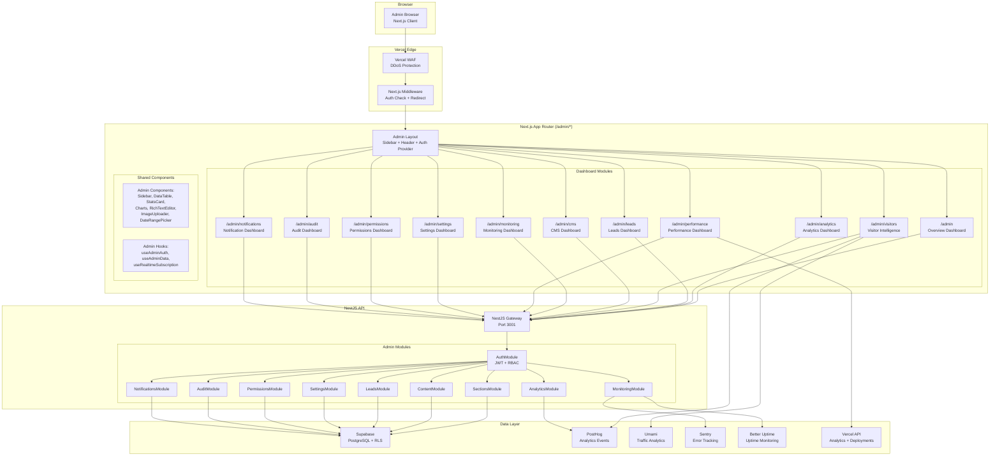

### 2.2 Route Architecture

```typescript
// apps/web/src/app/admin/ route structure
admin/
├── layout.tsx                    // Admin layout: sidebar + header + auth provider
├── page.tsx                      // Overview Dashboard (default route)
├── login/
│   ├── page.tsx                  // Login page (no layout)
│   └── layout.tsx                // Minimal auth layout
├── analytics/
│   └── page.tsx                  // Analytics Dashboard
├── leads/
│   ├── page.tsx                  // Lead inbox
│   └── [id]/
│       └── page.tsx              // Lead detail
├── visitors/
│   └── page.tsx                  // Visitor Intelligence Dashboard
├── cms/
│   ├── page.tsx                  // Section manager
│   ├── [section]/
│   │   └── page.tsx              // Section editor
│   └── media/
│       └── page.tsx              // Media library
├── monitoring/
│   └── page.tsx                  // Monitoring Dashboard
├── performance/
│   └── page.tsx                  // Performance Dashboard
├── settings/
│   ├── page.tsx                  // General settings
│   ├── integrations/
│   │   └── page.tsx              // Integration settings
│   ├── availability/
│   │   └── page.tsx              // Availability widget management
│   └── team/
│       └── page.tsx              // Team management (future)
├── permissions/
│   ├── page.tsx                  // Roles & permissions overview
│   ├── roles/
│   │   └── page.tsx              // Role editor
│   └── users/
│       └── page.tsx              // User management
├── audit/
│   └── page.tsx                  // Audit log
└── notifications/
    └── page.tsx                  // Notification center
```

### 2.3 Authentication & Authorization Flow

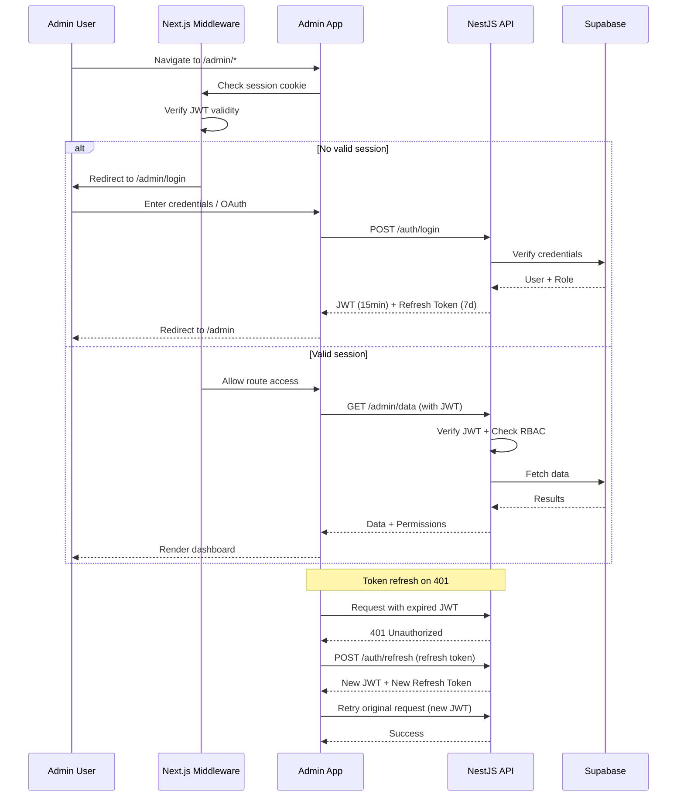

---

## 3. Design Principles

### 3.1 Core Principles

| Principle                    | Description                                                               | Application                                                         |
| ---------------------------- | ------------------------------------------------------------------------- | ------------------------------------------------------------------- |
| **Data Density**             | Admin UI can be 2x denser than public UI                                  | Compact tables, smaller text (14px), tighter spacing (16px vs 24px) |
| **Widget Isolation**         | Each widget is an independent React component with its own error boundary | One failed widget never crashes the page                            |
| **Optimistic UI**            | UI updates before API confirms, rolls back on failure                     | Instant feel for toggles, status changes, reordering                |
| **Keyboard-First**           | All admin actions accessible via keyboard                                 | Tab navigation, shortcuts (Cmd+S, Cmd+K), arrow keys                |
| **Real-Time Where Valuable** | Supabase realtime subscriptions for live-updating data                    | Visitor count, lead notifications, section toggles                  |
| **Search Over Navigation**   | Every list view has search + filter                                       | Find data quickly without manual browsing                           |
| **Batch Operations**         | Multi-select + bulk actions for efficiency                                | Bulk delete leads, bulk publish sections                            |
| **Audit Everything**         | Every mutation logged with who, what, when, IP                            | Compliance, debugging, rollback capability                          |
| **Progressive Disclosure**   | Show essentials first, details on demand                                  | Summary cards → expandable detail → full editor                     |
| **Fail Gracefully**          | Network errors show toast, not blank pages                                | Retry button, cached fallback data                                  |
| **Accessibility by Default** | All admin components WCAG 2.2 AA compliant                                | Skip links, focus management, screen reader support                 |
| **Mobile Parity**            | All admin functions available on mobile, adapted for touch                | Bottom tab bar, card views, swipe actions                           |

### 3.2 Admin Layout Structure

```text
┌──────────────────────────────────────────────────────────────┐
│  Header (56px)                                               │
│  ┌─────┬──────────────────────────────────────────┬────────┐ │
│  │ ☰   │  Dashboard Title              🔔 👤  │  Logout │ │
│  └─────┴──────────────────────────────────────────┴────────┘ │
├────────┬─────────────────────────────────────────────────────┤
│        │                                                      │
│ Sidebar│              Main Content Area                        │
│ (240px)│                                                       │
│        │  ┌──────┐ ┌──────┐ ┌──────┐ ┌──────┐                │
│  📊    │  │Stat 1│ │Stat 2│ │Stat 3│ │Stat 4│                │
│  Overview │  └──────┘ └──────┘ └──────┘ └──────┘                │
│        │                                                       │
│  📈    │  ┌─────────────────────────────────────┐              │
│  Analytics│  │        Chart Widget                     │              │
│        │  └─────────────────────────────────────┘              │
│  📩    │                                                       │
│  Leads │  ┌──────────────────┐ ┌──────────────────┐           │
│        │  │ Recent Activity  │ │  Quick Actions   │           │
│  📝    │  └──────────────────┘ └──────────────────┘           │
│  CMS   │                                                       │
│        │                                                       │
│  🖥️    │                                                       │
│  Monitor│                                                       │
│        │                                                       │
│  ⚡    │                                                       │
│  Perf  │                                                       │
│        │                                                       │
│  👁️    │                                                       │
│  Visitors│                                                     │
│        │                                                       │
│  ⚙️    │                                                       │
│  Settings│                                                     │
│        │                                                       │
│  🛡️    │                                                       │
│  Perms │                                                       │
│        │                                                       │
│  📋    │                                                       │
│  Audit │                                                       │
│        │                                                       │
│  🔔    │                                                       │
│  Notif │                                                       │
│        │                                                       │
├────────┴─────────────────────────────────────────────────────┤
│  Footer (36px) — Last synced: 2s ago | v1.1.0                 │
└──────────────────────────────────────────────────────────────┘
```

### 3.3 Responsive Admin Layout

| Breakpoint            | Sidebar                   | Header               | Content                    | Tables                      | Mobile-Specific                                                                 |
| --------------------- | ------------------------- | -------------------- | -------------------------- | --------------------------- | ------------------------------------------------------------------------------- |
| < 768px (Mobile)      | Bottom tab bar (5 icons)  | Condensed, hamburger | Single column, full-width  | Card view (each row = card) | Swipe-to-dismiss notifications, pull-to-refresh lists, bottom sheet for filters |
| 768-1024px (Tablet)   | Icons only (64px)         | Full                 | 2-column grid              | Condensed table             | Hover states work (pen/pointer), side panel for details                         |
| 1024-1440px (Desktop) | Full sidebar (240px)      | Full                 | Multi-column               | Full table                  | Full keyboard shortcuts, hover previews                                         |
| > 1440px (Wide)       | Full sidebar + expandable | Full + breadcrumbs   | Multi-column + side panels | Full table + inline expand  | Data density max, column show/hide                                              |

### 3.4 Mobile Admin UX Patterns

| Pattern                     | Implementation                                                              | When Used                                           |
| --------------------------- | --------------------------------------------------------------------------- | --------------------------------------------------- |
| **Bottom Tab Bar**          | 5 most-used icons at bottom (Overview, Leads, CMS, Settings, Notifications) | Default mobile nav                                  |
| **Pull to Refresh**         | Swipe down on any list to refresh data                                      | Leads, CMS lists, Notifications                     |
| **Swipe to Dismiss**        | Swipe left on notification row to dismiss                                   | Notification list                                   |
| **Swipe to Complete**       | Swipe right on lead row to mark as replied                                  | Lead inbox                                          |
| **Bottom Sheet Filters**    | Filter button opens sheet from bottom (50-80% height)                       | Leads, Analytics date ranges                        |
| **Full-Screen Editor**      | CMS editor takes full screen when editing on mobile                         | Content editing                                     |
| **Card Layout Tables**      | Each row renders as a card with key fields + action buttons                 | All list views                                      |
| **Collapsible Sidebar**     | Inline with content using slide-over (300ms ease)                           | Navigation between sections                         |
| **Contextual Action Bar**   | Appears at bottom when items selected                                       | Bulk actions on mobile                              |
| **Optimized Touch Targets** | All interactive elements ≥ 44×44px                                          | Ensures touch compliance                            |
| **Long Press Context Menu** | Long press on items shows contextual action sheet                           | Data rows (leads, content list), notification items |

---

## 4. Overview Dashboard

### 4.1 Purpose

The **Overview Dashboard** is the default landing page after login. It provides a **single-pane view** of portfolio health, recent activity, and quick access to common tasks. It serves as both a status summary and a navigation hub.

### 4.2 Layout

```text
┌─────────────────────────────────────────────────────────────────┐
│  Overview Dashboard                              [Last 7 days ▾]│
├─────────────────────────────────────────────────────────────────┤
│ ┌──────────┐ ┌──────────┐ ┌──────────┐ ┌──────────┐            │
│ │ 👁️       │ │ 📩       │ │ ✍️        │ │ 🟢       │            │
│ │ Visitors │ │ New Leads│ │ Sections │ │ Uptime   │            │
│ │   1,234  │ │     12   │ │  15/25   │ │  99.9%   │            │
│ │ +8% ↑   │ │ +3 ↑     │ │ Live     │ │ All good │            │
│ └──────────┘ └──────────┘ └──────────┘ └──────────┘            │
│                                                                  │
│ ┌──────────────────────────────────────────┐ ┌───────────────┐  │
│ │  Visitors Chart (7-day line chart)       │ │ Top Pages     │  │
│ │  📈 Interactive Recharts line chart      │ │ 1. /projects  │  │
│ │  with daily visitor counts               │ │ 2. /          │  │
│ │                                          │ │ 3. /blog/...  │  │
│ └──────────────────────────────────────────┘ └───────────────┘  │
│                                                                  │
│ ┌──────────────────────────────────┐ ┌────────────────────────┐ │
│ │  Recent Leads (last 5)          │ │  Quick Actions         │ │
│ │  ┌────┬───────┬───────┬──────┐ │ │  ┌──────────────────┐  │ │
│ │  │Name│Email  │Status │Date  │ │ │  │ ✏️ New Section   │  │ │
│ │  ├────┼───────┼───────┼──────┤ │ │  ├──────────────────┤  │ │
│ │  │... │...    │...    │...   │ │ │  │ 📝 Edit Hero     │  │ │
│ │  └────┴───────┴───────┴──────┘ │ │  ├──────────────────┤  │ │
│ │  [View All →]                   │ │  │ 🔄 Revalidate    │  │ │
│ └──────────────────────────────────┘ │  ├──────────────────┤  │ │
│                                      │  │ 📊 View Report   │  │ │
│                                      │  └──────────────────┘  │ │
│                                      └────────────────────────┘ │
└─────────────────────────────────────────────────────────────────┘
```

### 4.3 Widget Specifications

| Widget              | Type                                | Data Source       | Refresh      | Empty State     | Error State                   |
| ------------------- | ----------------------------------- | ----------------- | ------------ | --------------- | ----------------------------- |
| **Visitors Count**  | Stat card (number + trend)          | PostHog API       | 30s polling  | "0 visitors"    | "—" with error icon           |
| **New Leads Count** | Stat card (number + trend)          | `leads` table     | 10s realtime | "No new leads"  | "—" with error icon           |
| **Sections Count**  | Stat card (fraction + status)       | `sections` table  | On mutation  | "0/25 sections" | "—" with error icon           |
| **Uptime Status**   | Stat card (percentage + status dot) | Better Uptime API | 60s polling  | "Checking..."   | "Unknown"                     |
| **Visitors Chart**  | Interactive line chart              | PostHog API       | 60s polling  | "No data yet"   | Chart area with retry         |
| **Top Pages**       | Ranked list with counts             | PostHog API       | 60s polling  | "No page data"  | List with retry               |
| **Recent Leads**    | Mini table (5 rows)                 | `leads` table     | 10s realtime | "No leads yet"  | Table rows with retry         |
| **Quick Actions**   | Button grid                         | Static config     | Never        | Always visible  | Buttons disabled individually |

### 4.4 Quick Actions

| Action                | Icon | Route              | Behavior                             | Permission |
| --------------------- | ---- | ------------------ | ------------------------------------ | ---------- |
| New Section           | ✏️   | `/admin/cms`       | Navigate to CMS with create dialog   | Editor+    |
| Edit Hero             | 📝   | `/admin/cms/hero`  | Navigate to hero section editor      | Editor+    |
| Revalidate Cache      | 🔄   | API call           | Trigger ISR revalidation, show toast | Admin      |
| View Analytics Report | 📊   | `/admin/analytics` | Navigate to analytics                | Admin      |
| Toggle Availability   | 🟢   | API mutation       | Toggle live availability badge       | Editor+    |
| Download CSV Report   | 📥   | API call           | Generate and download analytics CSV  | Admin      |
| View Live Visitors    | 👁️   | `/admin/visitors`  | Navigate to visitor intelligence     | Admin      |

### 4.5 API Endpoints

| Method | Endpoint                            | Purpose                 | Auth        |
| ------ | ----------------------------------- | ----------------------- | ----------- |
| `GET`  | `/api/admin/overview/stats`         | Aggregated stat cards   | Admin JWT   |
| `GET`  | `/api/admin/overview/visitor-chart` | 7-day visitor data      | Admin JWT   |
| `GET`  | `/api/admin/overview/top-pages`     | Top pages list          | Admin JWT   |
| `GET`  | `/api/admin/overview/recent-leads`  | Last 5 leads            | Admin JWT   |
| `POST` | `/api/admin/revalidate`             | Trigger ISR cache purge | Admin JWT   |
| `POST` | `/api/admin/availability/toggle`    | Toggle availability     | Editor+ JWT |

### 4.6 States

| State             | Behavior                        | Visual                                                                       |
| ----------------- | ------------------------------- | ---------------------------------------------------------------------------- |
| **Loading**       | Skeleton cards for all widgets  | Shimmer placeholders matching widget shapes                                  |
| **Loaded**        | All data displayed              | Full dashboard with interactive widgets                                      |
| **Partial Error** | Some widgets fail independently | Failed widgets show error state, others remain                               |
| **Full Error**    | All data sources fail           | "Unable to load dashboard" with retry all button                             |
| **Empty**         | First time, no data             | "Welcome! Your dashboard will populate as visitors arrive" + setup checklist |
| **Reconnecting**  | Network lost & recovered        | Reconnecting indicator, stale data shown                                     |

---

## 5. Analytics Dashboard

### 5.1 Purpose

The **Analytics Dashboard** provides deep insight into visitor behavior, traffic sources, content performance, and conversion metrics. It answers "who is visiting, what are they doing, and how do they find me?"

### 5.2 Layout

```text
┌─────────────────────────────────────────────────────────────────┐
│  Analytics Dashboard                   [Last 30 Days ▾] [Export]│
├─────────────────────────────────────────────────────────────────┤
│ ┌──────────┐ ┌──────────┐ ┌──────────┐ ┌──────────┐            │
│ │ 👁️       │ │ 👤        │ │ ⏱️        │ │ 📄        │            │
│ │ Page Views│ │ Visitors │ │ Avg Time │ │ Bounce   │            │
│ │  45,678  │ │  12,345  │ │  3m 42s  │ │  32.5%   │            │
│ │ -2% ↓   │ │ +5% ↑   │ │ +12s ↑  │ │ -1% ↓   │            │
│ └──────────┘ └──────────┘ └──────────┘ └──────────┘            │
│                                                                  │
│ ┌─────────────────────────────────────────────────────────┐     │
│ │  Traffic Overview (area chart, daily)                   │     │
│ │  📈 Interactive area chart with page views + visitors   │     │
│ │  ▼ Date range slider  ◀ ▶                               │     │
│ └─────────────────────────────────────────────────────────┘     │
│                                                                  │
│ ┌──────────────────────────┐ ┌──────────────────────────┐        │
│ │  Traffic Sources (donut) │ │  Device Breakdown (bar)  │        │
│ │  ● Direct     42%       │ │  █ Desktop    65%        │        │
│ │  ● Organic    28%       │ │  █ Mobile     30%        │        │
│ │  ● Referral   18%       │ │  █ Tablet      5%        │        │
│ │  ● Social     12%       │ └──────────────────────────┘        │
│ └──────────────────────────┘                                     │
│                                                                  │
│ ┌──────────────────────────┐ ┌──────────────────────────┐        │
│ │  Top Pages               │ │  Geographic Map          │        │
│ │  1. /           8,234    │ │  🌍 World heatmap        │        │
│ │  2. /projects   5,678    │ │  by country              │        │
│ │  3. /blog/...   3,456    │ │                          │        │
│ │  4. /about      2,345    │ │  USA    4,234            │        │
│ │  5. /contact    1,890    │ │  India  2,345            │        │
│ └──────────────────────────┘ └──────────────────────────┘        │
│                                                                  │
│ ┌─────────────────────────────────────────────────────────┐     │
│ │  Conversion Funnel                                       │     │
│ │  Visit → Section View → Contact → Lead                  │     │
│ │  12,345 ──→ 6,789 ──→ 1,234 ──→ 456                     │     │
│ │  (100%)     (55%)     (10%)     (3.7%)                   │     │
│ └─────────────────────────────────────────────────────────┘     │
└─────────────────────────────────────────────────────────────────┘
```

### 5.3 Widget Specifications

| Widget                | Type                   | Data Source | Refresh | Filters                 |
| --------------------- | ---------------------- | ----------- | ------- | ----------------------- |
| **Page Views Count**  | Stat card              | PostHog     | 30s     | Date range              |
| **Unique Visitors**   | Stat card              | PostHog     | 30s     | Date range              |
| **Avg Time on Site**  | Stat card              | PostHog     | 30s     | Date range              |
| **Bounce Rate**       | Stat card              | PostHog     | 30s     | Date range              |
| **Traffic Overview**  | Interactive area chart | PostHog     | 60s     | Date range, granularity |
| **Traffic Sources**   | Donut/pie chart        | PostHog     | 60s     | Date range              |
| **Device Breakdown**  | Horizontal bar chart   | PostHog     | 60s     | Date range              |
| **Top Pages**         | Ranked table           | PostHog     | 60s     | Date range, limit       |
| **Geo Map**           | World heatmap          | PostHog     | 5min    | Date range              |
| **Conversion Funnel** | Funnel visualization   | PostHog     | 5min    | Date range, steps       |

### 5.4 Date Range & Granularity

| Preset            | Range                      | Granularity                | Update          |
| ----------------- | -------------------------- | -------------------------- | --------------- |
| **Last 24 hours** | Now - 24h                  | Hourly                     | Real-time (30s) |
| **Last 7 days**   | Now - 7d                   | Daily                      | Every 60s       |
| **Last 30 days**  | Now - 30d                  | Daily                      | Every 5min      |
| **Last 90 days**  | Now - 90d                  | Weekly                     | Every 15min     |
| **Custom**        | User-defined               | Auto (hourly/daily/weekly) | On select       |
| **Compare**       | Current vs previous period | Same as primary            | On select       |

### 5.5 API Endpoints

| Method | Endpoint                          | Purpose                     |
| ------ | --------------------------------- | --------------------------- |
| `GET`  | `/api/admin/analytics/overview`   | Summary stat cards          |
| `GET`  | `/api/admin/analytics/timeseries` | Time series data for charts |
| `GET`  | `/api/admin/analytics/sources`    | Traffic source breakdown    |
| `GET`  | `/api/admin/analytics/devices`    | Device breakdown            |
| `GET`  | `/api/admin/analytics/pages`      | Top pages ranking           |
| `GET`  | `/api/admin/analytics/geo`        | Geographic distribution     |
| `GET`  | `/api/admin/analytics/funnel`     | Conversion funnel data      |
| `GET`  | `/api/admin/analytics/export`     | Export analytics as CSV     |
| `GET`  | `/api/admin/analytics/realtime`   | Real-time visitor count     |

### 5.6 States

| State         | Behavior                                                                         |
| ------------- | -------------------------------------------------------------------------------- |
| **Loading**   | Skeleton charts + skeleton stat cards                                            |
| **Loaded**    | Interactive charts with tooltips, hover states                                   |
| **No Data**   | "Collecting data... Analytics will populate within 24-48 hours of PostHog setup" |
| **Error**     | Per-widget error with retry; core stats try to load independently                |
| **Exporting** | Progress indicator, large exports streamed as file download                      |

---

## 6. Leads Dashboard

### 6.1 Purpose

The **Leads Dashboard** is a full-featured CRM-lite for managing contact form submissions. It captures every inquiry, tracks status, enables filtering/search/export, and provides notification integration for instant response.

### 6.2 Layout

```text
┌─────────────────────────────────────────────────────────────────┐
│  Leads Dashboard                   [🔍 Search...] [Filter ▾] [Export]│
├─────────────────────────────────────────────────────────────────┤
│ ┌──────────┐ ┌──────────┐ ┌──────────┐ ┌──────────┐            │
│ │ 📥        │ │ 🆕        │ │ ✅        │ │ ⏳        │            │
│ │ Total     │ │ New      │ │ Replied  │ │ Avg Resp│            │
│ │    234   │ │     12   │ │    180   │ │  4.2h   │            │
│ │          │ │          │ │          │ │ target↓ │            │
│ └──────────┘ └──────────┘ └──────────┘ └──────────┘            │
│                                                                  │
│ ┌──────────────────────────────────────────────────────────────┐│
│ │  Leads Table                                                  ││
│ │  ☐ │ Name      │ Email             │ Date       │ Status   │ │
│ │  ☐ │ John Smith│ john@email.com    │ 2026-06-15 │ 🟢 New   │ │
│ │  ☐ │ Jane Doe  │ jane@email.com    │ 2026-06-14 │ 🔄 Replied│ │
│ │  ☐ │ ...       │ ...               │ ...        │ ...      │ │
│ │                                                              │ │
│ │  [< Prev] Page 1 of 10 [Next >]  Showing 1-25 of 234        │ │
│ └──────────────────────────────────────────────────────────────┘│
│                                                                  │
│  ┌─ Lead Detail Panel (slide-over) ───────────────────────────┐ │
│  │  John Smith                                   [Mark Read ▾]│ │
│  │  john@email.com                                              │ │
│  │  +1 (555) 123-4567                                          │ │
│  │  Company: Acme Corp                                         │ │
│  │  Source: Contact Form (LinkedIn)                             │ │
│  │  Lead Score: 0.78 🔥 (High Intent)                          │ │
│  │  Date: June 15, 2026 at 2:34 PM UTC                         │ │
│  │ ───────────────────────────────────────────────────────────  │ │
│  │  "Hi, I'm interested in discussing a potential project      │ │
│  │   for our e-commerce platform. We're looking for a          │ │
│  │   full-stack developer with React expertise..."             │ │
│  │ ───────────────────────────────────────────────────────────  │ │
│  │  Internal Notes:                                             │ │
│  │  [__________________________________________________]       │ │
│  │  [Save Note]                                                 │ │
│  │ ───────────────────────────────────────────────────────────  │ │
│  │  [✉️ Reply via Email]  [📞 Mark Contacted]  [🗑️ Archive]    │ │
│  └──────────────────────────────────────────────────────────────┘│
└─────────────────────────────────────────────────────────────────┘
```

### 6.3 Lead Table Specifications

| Column     | Type                | Sortable     | Filterable        | Width |
| ---------- | ------------------- | ------------ | ----------------- | ----- |
| Checkbox   | Select all/none     | No           | No                | 48px  |
| Name       | Text + avatar       | ✅           | ✅ (search)       | 180px |
| Email      | Text with mailto    | ✅           | ✅ (search)       | 200px |
| Subject    | Text                | ✅           | ✅ (search)       | 200px |
| Source     | Badge + text        | ✅           | ✅ (dropdown)     | 120px |
| Status     | Badge (color-coded) | ✅           | ✅ (multi-select) | 100px |
| Lead Score | Number + badge      | ✅           | ✅ (range)        | 100px |
| Date       | Relative + absolute | ✅ (default) | ✅ (date range)   | 140px |
| Actions    | Icon buttons        | No           | No                | 80px  |

### 6.4 Lead Statuses

| Status        | Badge Color | Description               | Actions Available           |
| ------------- | ----------- | ------------------------- | --------------------------- |
| `new`         | 🟢 Green    | Unread, not yet contacted | Mark read, reply, archive   |
| `replied`     | 🔵 Blue     | Admin has responded       | Mark contacted, add note    |
| `in-progress` | 🟡 Amber    | Active discussion         | Add note, mark hired        |
| `hired`       | 🟣 Purple   | Converted to client       | Archive, add testimonial    |
| `archived`    | ⚪ Gray     | No longer active          | Restore, delete permanently |

### 6.5 Lead Scoring Algorithm

Leads are automatically scored on a 0-1.0 scale using weighted criteria:

| Signal               | Weight | Source            | Notes                           |
| -------------------- | ------ | ----------------- | ------------------------------- |
| **Message length**   | 0.15   | `message` field   | > 100 chars = higher intent     |
| **Company provided** | 0.10   | `company` field   | Business inquiries score higher |
| **Referral source**  | 0.20   | UTM params        | LinkedIn/GitHub > direct        |
| **Pages viewed**     | 0.25   | Analytics session | > 3 pages = engaged             |
| **Time on site**     | 0.15   | Analytics session | > 3 min = interested            |
| **Previous visits**  | 0.15   | Cookie/session ID | Returning visitors = warmer     |

Scores are calculated server-side in NestJS and stored in the `leads` table. The **Lead Detail Panel** shows the score with a flame icon for high-intent leads (score > 0.6).

### 6.6 NDA Project Workflow

When leads reference interest in NDA-protected projects:

| Step  | Action                                 | Implementation                                          |
| ----- | -------------------------------------- | ------------------------------------------------------- |
| **1** | Lead expresses interest in NDA project | NDA checkbox in contact form, or AI chat detects intent |
| **2** | Admin marks lead as "NDA Interest"     | Status dropdown in lead detail                          |
| **3** | System generates unique preview token  | JWT with 7-day expiry tied to lead ID                   |
| **4** | Admin sends token to lead via email    | Pre-composed email template with token link             |
| **5** | Lead accesses /preview/[token]         | Route validates JWT, shows NDA-protected content        |
| **6** | Token expires after 7 days or revoke   | Cron job clears expired tokens, admin can revoke        |

### 6.7 QR Code Resume Tracking

When the admin downloads a PDF resume or views resume analytics:

| Feature                 | Implementation                                                | Purpose                                   |
| ----------------------- | ------------------------------------------------------------- | ----------------------------------------- |
| **QR code on resume**   | Auto-generated QR linking to portfolio with `?ref=resume` UTM | Track how many people scan the resume     |
| **QR scan detection**   | UTM parsing in middleware, stored in visitor context          | Show "Welcome — seen your resume?" banner |
| **Analytics in admin**  | /admin/visitors filterable by ?ref=resume source              | Measure resume-driven portfolio visits    |
| **Conversion tracking** | Resume scan → portfolio → lead pipeline                       | Full attribution from resume to hire      |

### 6.8 API Endpoints

| Method   | Endpoint                              | Purpose                                    |
| -------- | ------------------------------------- | ------------------------------------------ |
| `GET`    | `/api/admin/leads`                    | List leads with pagination, filter, search |
| `GET`    | `/api/admin/leads/:id`                | Get lead detail                            |
| `PATCH`  | `/api/admin/leads/:id`                | Update lead status/notes                   |
| `PATCH`  | `/api/admin/leads/bulk`               | Bulk status update                         |
| `DELETE` | `/api/admin/leads/:id`                | Soft delete lead                           |
| `GET`    | `/api/admin/leads/export`             | Export leads as CSV                        |
| `POST`   | `/api/admin/leads/notify`             | Trigger Telegram/email notification        |
| `POST`   | `/api/admin/leads/nda-token`          | Generate NDA preview token                 |
| `GET`    | `/api/admin/leads/nda-preview/:token` | Serve NDA-protected content                |

### 6.9 States

| State                 | Behavior                                                                          |
| --------------------- | --------------------------------------------------------------------------------- |
| **Loading**           | Skeleton table (15 rows), stat card skeletons                                     |
| **Loaded**            | Interactive table with inline editing, expand/collapse                            |
| **Empty**             | "No leads yet. Share your portfolio to start receiving inquiries." + share button |
| **Search No Results** | "No leads match your search." with clear filters button                           |
| **Error**             | "Unable to load leads." with retry button                                         |
| **Bulk Action**       | Progress bar showing X of Y processed                                             |
| **Exporting**         | Download progress, file auto-downloads when ready                                 |

---

## 7. Visitor Intelligence Dashboard

### 7.1 Purpose

The **Visitor Intelligence Dashboard** provides real-time and historical visibility into every visitor on the portfolio — who they are, where they came from, what they're doing, and how they're engaging. It combines session replays, heatmaps, and real-time tracking into a single pane of glass.

### 7.2 Layout

```text
┌─────────────────────────────────────────────────────────────────┐
│  Visitor Intelligence                    [🔍 Search...] [Filter ▾]│
├─────────────────────────────────────────────────────────────────┤
│ ┌──────────┐ ┌──────────┐ ┌──────────┐ ┌──────────┐            │
│ │ 👁️        │ │ 🌍        │ │ 📱        │ │ ⏱️        │            │
│ │ Live Now │ │ Countries│ │ Devices  │ │ Avg Time│            │
│ │    3     │ │    12    │ │  62/38   │ │  4.2m   │            │
│ │ right now│ │ today    │ │ D/M %   │ │ today   │            │
│ └──────────┘ └──────────┘ └──────────┘ └──────────┘            │
│                                                                  │
│ ┌─────────────────────────────────────────────────────────┐     │
│ │  Real-Time Visitor Feed (live-updating)                  │     │
│ │  ┌──────┬──────────┬─────────┬───────────┬──────────┐   │     │
│ │  │Time  │ Location │ Device  │ Page      │ Duration │   │     │
│ │  ├──────┼──────────┼─────────┼───────────┼──────────┤   │     │
│ │  │14:32 │ 🇺🇸 NY   │ 📱Mob  │ /projects │  3m 12s  │   │     │
│ │  │14:30 │ 🇮🇳 Mumbai│ 💻Desk │ /         │  1m 45s  │   │     │
│ │  │14:28 │ 🇬🇧 London│ 💻Desk │ /blog/... │  5m 02s  │   │     │
│ │  │14:25 │ 🇩🇪 Berlin│ 📱Mob  │ /about    │  0m 30s  │   │     │
│ │  └──────┴──────────┴─────────┴───────────┴──────────┘   │     │
│ └─────────────────────────────────────────────────────────┘     │
│                                                                  │
│ ┌──────────────────────────┐ ┌──────────────────────────┐        │
│ │  Click Heatmap Preview   │ │  Scroll Depth Map        │        │
│ │  (PostHog embed)         │ │  (Per page selector)     │        │
│ │  🖼️ Heatmap thumbnail    │ │  ████ 100% Viewed: 12%  │        │
│ │  with click density      │ │  ████ 75% Viewed: 34%   │        │
│ │  overlay per page        │ │  ████ 50% Viewed: 58%   │        │
│ └──────────────────────────┘ └──────────────────────────┘        │
│                                                                  │
│ ┌──────────────────────────┐ ┌──────────────────────────┐        │
│ │  Session Replay Queue    │ │  Custom Events Timeline  │        │
│ │  ▶️ Last 5 recordings   │ │  📄 Resume Downloads: 3 │        │
│ │  ▶️ Visitor from...     │ │  💬 Chat Opens:       8 │        │
│ │  ▶️ Flagged: 2 (issues) │ │  🔗 GitHub Clicks:    5 │        │
│ └──────────────────────────┘ └──────────────────────────┘        │
└─────────────────────────────────────────────────────────────────┘
```

### 7.3 Widget Specifications

| Widget                     | Type                   | Data Source     | Refresh       | Description                        |
| -------------------------- | ---------------------- | --------------- | ------------- | ---------------------------------- |
| **Live Now Count**         | Stat card              | Umami API       | 10s realtime  | Current active visitors            |
| **Country Count**          | Stat card              | Umami API       | 30s           | Unique countries today             |
| **Device Split**           | Stat card              | Umami API       | 30s           | Desktop/Mobile percentage          |
| **Avg Time Today**         | Stat card              | Umami API       | 30s           | Average session duration today     |
| **Real-Time Feed**         | Live-updating table    | Umami API + SSE | 5s            | Real-time visitor stream           |
| **Click Heatmap**          | Embedded iframe        | PostHog         | Per page load | Click density visualization        |
| **Scroll Depth Map**       | Embedded chart         | PostHog         | Per page load | Scroll behavior per page           |
| **Session Replay Queue**   | List with play buttons | PostHog         | 30s           | Recent recordings with flags       |
| **Custom Events Timeline** | Event stream           | PostHog         | 30s           | Key actions (resume, chat, GitHub) |
| **Referrer Breakdown**     | Bar chart              | Umami API       | 60s           | Top referral sources today         |

### 7.4 Real-Time Visitor Data Schema

```typescript
interface LiveVisitor {
  id: string;
  country: string;
  country_code: string;
  city: string;
  device: 'desktop' | 'mobile' | 'tablet';
  browser: string;
  os: string;
  current_page: string;
  referrer: string;
  utm_source?: string;
  utm_medium?: string;
  utm_campaign?: string;
  session_duration: number; // seconds
  pages_visited: number;
  entry_page: string;
  visitor_type: 'recruiter' | 'client' | 'developer' | 'returning' | 'unknown';
  confidence: number; // 0-1.0
  arrived_at: string; // ISO 8601
}
```

### 7.5 Session Replay Integration

| Feature              | Implementation                      | Details                                           |
| -------------------- | ----------------------------------- | ------------------------------------------------- |
| **PostHog Embed**    | iframe to PostHog session replay    | `https://app.posthog.com/project/{id}/recordings` |
| **Queue View**       | Custom-built list from PostHog API  | Thumbnail preview, duration, page, date           |
| **Flagged Sessions** | PostHog alerts for error/bounce     | Auto-flag sessions with errors                    |
| **Quick Play**       | Click to open replay in admin panel | Slide-over panel with iframe                      |
| **Heatmap Toggle**   | Switch between replay and heatmap   | Tab selector within widget                        |

### 7.6 API Endpoints

| Method | Endpoint                        | Purpose                              |
| ------ | ------------------------------- | ------------------------------------ |
| `GET`  | `/api/admin/visitors/live`      | Real-time visitor count + feed       |
| `GET`  | `/api/admin/visitors/today`     | Today's aggregate visitor stats      |
| `GET`  | `/api/admin/visitors/history`   | Historical visitor data (7/30/90d)   |
| `GET`  | `/api/admin/visitors/sessions`  | Session replay metadata from PostHog |
| `GET`  | `/api/admin/visitors/events`    | Custom event timeline                |
| `GET`  | `/api/admin/visitors/heatmap`   | Heatmap embed URL for a page         |
| `GET`  | `/api/admin/visitors/referrers` | Top referral sources                 |

### 7.7 Visitor Type Classification

Heuristics used to classify visitors automatically:

| Type          | Signal                                                               | Confidence Boost | Action                              |
| ------------- | -------------------------------------------------------------------- | ---------------- | ----------------------------------- |
| **Recruiter** | LinkedIn/GitHub referral, views experience section, downloads resume | +0.3 each        | Resume download becomes primary CTA |
| **Client**    | Direct/social referral, views services, spends > 3 min on projects   | +0.2 each        | Hire Me page promoted               |
| **Developer** | GitHub referral, reads blog, views tech stack                        | +0.25 each       | Open Source section first           |
| **Returning** | Cookie/fingerprint match with prior visit                            | +0.4             | "Welcome back" treatment            |
| **Unknown**   | First visit, direct/referral mismatch                                | 0.0              | Default layout                      |

### 7.8 States

| State           | Behavior                                                                                  |
| --------------- | ----------------------------------------------------------------------------------------- |
| **Loading**     | Skeleton real-time feed + stat cards                                                      |
| **Live Data**   | Real-time feed updating every 5s, stat cards every 30s                                    |
| **No Visitors** | "No active visitors right now. Share your portfolio to start attracting visitors."        |
| **No Replays**  | "No session replays available yet. They'll appear once visitors interact with your site." |
| **Error**       | Per-widget error with retry; monitoring data attempts to load independently               |

---

## 8. CMS Dashboard

### 8.1 Purpose

The **CMS Dashboard** is the content management hub — a complete CRUD interface for all portfolio sections, projects, skills, experience entries, testimonials, blog posts, and media. It enables full content lifecycle management without touching code.

### 8.2 Section Manager (Primary View)

```text
┌─────────────────────────────────────────────────────────────────┐
│  CMS Dashboard                        [+ New Section] [Media Lib]│
├─────────────────────────────────────────────────────────────────┤
│  ┌───────┬──────────────┬────────┬───────┬──────────┬─────────┐│
│  │ Order │ Section      │ Status │ Style │ Items    │ Actions  ││
│  ├───────┼──────────────┼────────┼───────┼──────────┼─────────┤│
│  │ ⠿  1  │ Hero         │ 🟢 Live│ Hero  │ —        │ Edit ▾  ││
│  │ ⠿  2  │ About        │ 🟢 Live│ Split │ Bio + 3  │ Edit ▾  ││
│  │ ⠿  3  │ Skills       │ 🟢 Live│ Grid  │ 18 items │ Edit ▾  ││
│  │ ⠿  4  │ Experience   │ 🔴 Hidden│ Timeline│ 5 items │ Edit ▾  ││
│  │ ⠿  5  │ Projects     │ 🟢 Live│ Cards │ 8 items  │ Edit ▾  ││
│  │ ⠿  6  │ Testimonials │ 🔴 Hidden│ Carousel│ 2 items │ Edit ▾  ││
│  │ ⠿  7  │ Blog         │ 🔴 Hidden│ Cards │ 0 items  │ Edit ▾  ││
│  │ ⠿  8  │ Contact      │ 🟢 Live│ Form  │ —        │ Edit ▾  ││
│  └───────┴──────────────┴────────┴───────┴──────────┴─────────┘│
│                                                                  │
│  [+ Add new section +]                                           │
└─────────────────────────────────────────────────────────────────┘
```

### 8.3 Section Editor (Detail View)

When clicking "Edit" on a section, a side panel or full-page editor opens with:

| Feature               | Implementation                       | Details                                                    |
| --------------------- | ------------------------------------ | ---------------------------------------------------------- |
| **Rich Text Editor**  | TipTap-based WYSIWYG                 | Bold, italic, headings, lists, links, images, code blocks  |
| **Image Upload**      | Drag-and-drop with WebP conversion   | 5MB max, auto-resize to 1920px, alt text required          |
| **Visibility Toggle** | Live/Hidden switch with confirmation | "This section will immediately appear on your portfolio"   |
| **Style Preset**      | Visual selector with 8 presets       | Hero, Split, Card, Grid, List, Timeline, Carousel, Minimal |
| **Auto-Save**         | Debounced 30-second auto-save        | "Saved" / "Saving..." / "Unsaved changes" indicator        |
| **Preview**           | Desktop + mobile toggle              | Opens isolated section preview in new tab                  |
| **SEO Metadata**      | Title, description, OG image         | Auto-generated from content, manually overridable          |
| **Revisions**         | Version history (future)             | Track changes, restore previous versions                   |

### 8.4 Content Publishing Lifecycle

The CMS supports a complete content publishing lifecycle:

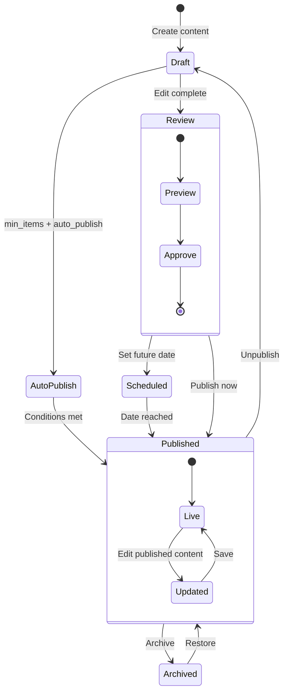

| Stage              | Description                                    | Auto-Trigger                                | Access                       |
| ------------------ | ---------------------------------------------- | ------------------------------------------- | ---------------------------- |
| **Draft**          | Content created but not visible                | On initial create                           | Admin only, /admin/cms       |
| **Preview**        | Content previewable with token                 | Token generation                            | Anyone with token            |
| **Scheduled**      | Scheduled for future publish                   | Date set in publish dialog                  | Admin only                   |
| **Published**      | Live on portfolio                              | Manual publish or auto-publish              | Everyone                     |
| **Auto-Published** | Published automatically when conditions met    | `min_items` reached + `auto_publish` = true | Everyone                     |
| **Updated**        | Published content edited, changes not yet live | Edit on published content                   | Admin only (until save)      |
| **Archived**       | Content hidden, data preserved                 | Manual archive                              | Admin only, can restore      |
| **Restored**       | Archived content brought back to draft         | Manual restore                              | Admin only (then re-publish) |

**Auto-Publish Logic:**

```typescript
// After every content CRUD operation
async function checkAutoPublish(sectionKey: string) {
  const section = await db.sections.findUnique({ where: { section_key: sectionKey } });
  const itemCount = await db.content.count({ where: { section_key: sectionKey } });

  if (section.auto_publish && itemCount >= section.min_items && !section.is_live) {
    await db.sections.update({
      where: { section_key: sectionKey },
      data: { is_live: true },
    });
    // Broadcast realtime event
    await supabase.channel('sections').broadcast({
      type: 'section_visibility',
      section_key: sectionKey,
      is_live: true,
    });
  }
}
```

### 8.5 Visual Style Picker

When editing a section's style preset, admins see visual thumbnail cards instead of a dropdown:

| Preset        | Thumbnail Description                 | Best For                        | Sections                     |
| ------------- | ------------------------------------- | ------------------------------- | ---------------------------- |
| **Hero**      | Full-width banner with text overlay   | Hero section only               | Hero                         |
| **Split**     | 50/50 image + text layout             | About, Services                 | About, Services              |
| **Card Grid** | Equal-height cards in responsive grid | Projects, Blog, Achievements    | Projects, Blog, Achievements |
| **Icon Grid** | Icons with labels in grid             | Skills only                     | Skills                       |
| **Timeline**  | Vertical chronological list           | Experience only                 | Experience                   |
| **Carousel**  | Horizontal sliding panels             | Testimonials, Featured Projects | Testimonials, Featured       |
| **List**      | Compact text rows                     | Press Features, Reading List    | Press, Reading List          |
| **Minimal**   | Clean, minimal content block          | Contact, FAQ                    | Contact, FAQ                 |

Each thumbnail is a 140×100px preview rendered as an SVG/CSS mockup showing the layout structure. Selected preset has a green 2px border and checkmark.

### 8.6 Draft/Preview Mode

| Feature              | Implementation                         | Details                                |
| -------------------- | -------------------------------------- | -------------------------------------- |
| **Draft State**      | Content saved with `is_draft = true`   | Not rendered on public pages           |
| **Preview Token**    | JWT with 24h expiry, scoped to section | `POST /api/admin/preview-token`        |
| **Preview URL**      | `/preview/[section_key]?token=xxx`     | Renders section in isolation           |
| **Preview Layout**   | Full page mockup with admin header bar | Desktop/mobile toggle buttons          |
| **Share Preview**    | Copy link button in admin              | "Share this preview with stakeholders" |
| **Token Revocation** | Admin can revoke all tokens            | `DELETE /api/admin/preview-tokens`     |

### 8.7 Bulk CSV Import

| Feature                   | Specification                                                   |
| ------------------------- | --------------------------------------------------------------- |
| **Supported Types**       | Projects, Skills, Testimonials, Experience, Reading List        |
| **Template Download**     | Download CSV template with headers + example row                |
| **Validation**            | Server-side validation per row, errors reported with row number |
| **Preview Before Import** | Show first 5 rows preview before confirming                     |
| **Error Report**          | Downloadable CSV with errors per row                            |
| **Duplicate Detection**   | Email/name/slug deduplication configurable                      |
| **Progress**              | Progress bar for large imports                                  |
| **Max Rows**              | 500 per import                                                  |

### 8.8 AI Content Suggestions

When admin is creating/editing content, AI-powered suggestions are available:

| Suggestion Type             | Trigger                    | Example                                                                                              |
| --------------------------- | -------------------------- | ---------------------------------------------------------------------------------------------------- |
| **Better Title**            | After entering title       | "Full-Stack E-Commerce Platform" → "Building a Scalable E-Commerce Platform with Next.js and Stripe" |
| **Description Enhancement** | After entering description | Adds key metrics, technologies, impact stats                                                         |
| **Tag Suggestions**         | After saving               | Auto-tags based on title + description content                                                       |
| **Tech Stack Completion**   | Multi-select field         | Suggests missing relevant technologies                                                               |
| **SEO Meta Description**    | Before publishing          | Generates 150-char meta description                                                                  |
| **OG Image Generation**     | On publish                 | Auto-generates OG image from content                                                                 |

### 8.9 Content Types & Editors

| Content Type    | Editor Fields                                                                                                               | Custom Validation                        | Relations                        |
| --------------- | --------------------------------------------------------------------------------------------------------------------------- | ---------------------------------------- | -------------------------------- |
| **Project**     | Title, slug, description, tech_stack[], live_url, github_url, cover_image, gallery[], is_featured, is_private, nda_password | URL format, image dimensions             | Related projects (by tech_stack) |
| **Skill**       | Name, category, proficiency (1-5), icon, is_featured                                                                        | Proficiency range, unique name           | Grouped by category              |
| **Experience**  | Company, role, start_date, end_date, description, technologies[], logo, is_current                                          | Date order, end_date > start_date if set | Timeline ordering                |
| **Testimonial** | Name, role, company, avatar, content, rating, source_url                                                                    | Rating 1-5, avatar URL                   | Sourced from project             |
| **Blog Post**   | Title, slug, content (MDX), cover_image, tags[], published_at, is_draft                                                     | Unique slug, valid date                  | Related posts by tags            |
| **Case Study**  | Title, project_id, problem, approach, solution, impact, metrics[], diagrams[]                                               | Required fields per section              | Linked to project                |
| **Service**     | Title, description, price_range, features[], cta_label, is_popular                                                          | Price format                             | Highlighted if popular           |
| **FAQ**         | Question, answer, category, order                                                                                           | Unique question                          | Grouped by category              |
| **Media**       | File upload, alt_text, caption                                                                                              | File type (png/jpg/webp/gif), size < 5MB | Used-in tracking                 |

### 8.10 Media Library

```text
┌─────────────────────────────────────────────────────────────────┐
│  Media Library                    [Upload ▾] [Search...]         │
├─────────────────────────────────────────────────────────────────┤
│ ┌────────┐ ┌────────┐ ┌────────┐ ┌────────┐                     │
│ │        │ │        │ │        │ │        │                     │
│ │ 🖼️    │ │ 🖼️    │ │ 🖼️    │ │ 🖼️    │                     │
│ │ Image  │ │ Image  │ │ Image  │ │ Image  │                     │
│ │ 1      │ │ 2      │ │ 3      │ │ 4      │                     │
│ │ 240KB  │ │ 180KB  │ │ 320KB  │ │ 150KB  │                     │
│ └────────┘ └────────┘ └────────┘ └────────┘                     │
│ ┌────────┐ ┌────────┐ ┌────────┐ ┌────────┐                     │
│ │        │ │        │ │        │ │        │                     │
│ │ 🖼️    │ │ 🖼️    │ │ 🖼️    │ │ 🖼️    │                     │
│ │ ...    │ │ ...    │ │ ...    │ │ ...    │                     │
│ └────────┘ └────────┘ └────────┘ └────────┘                     │
│                                                                  │
│  Page 1 of 8 | Showing 1-24 of 186                               │
└─────────────────────────────────────────────────────────────────┘
```

### 8.11 API Endpoints

| Method   | Endpoint                                   | Purpose                       |
| -------- | ------------------------------------------ | ----------------------------- |
| `GET`    | `/api/admin/sections`                      | List all sections with status |
| `GET`    | `/api/admin/sections/:key`                 | Get section detail            |
| `PATCH`  | `/api/admin/sections/:key`                 | Update section content/status |
| `PATCH`  | `/api/admin/sections/reorder`              | Update display_order for all  |
| `POST`   | `/api/admin/sections`                      | Create new section            |
| `DELETE` | `/api/admin/sections/:key`                 | Delete section                |
| `GET`    | `/api/admin/content/:type`                 | List content by type          |
| `POST`   | `/api/admin/content/:type`                 | Create content                |
| `PATCH`  | `/api/admin/content/:type/:id`             | Update content                |
| `DELETE` | `/api/admin/content/:type/:id`             | Delete content                |
| `POST`   | `/api/admin/media/upload`                  | Upload media file             |
| `GET`    | `/api/admin/media`                         | List media library            |
| `DELETE` | `/api/admin/media/:id`                     | Delete media                  |
| `POST`   | `/api/admin/revalidate`                    | Trigger ISR revalidation      |
| `POST`   | `/api/admin/content/import/csv`            | Bulk CSV import               |
| `GET`    | `/api/admin/content/import/template/:type` | Download CSV template         |
| `POST`   | `/api/admin/content/suggest`               | AI content suggestion         |
| `POST`   | `/api/admin/preview-token`                 | Generate preview token        |
| `DELETE` | `/api/admin/preview-tokens`                | Revoke all preview tokens     |

### 8.12 States

| State             | Behavior                                                              |
| ----------------- | --------------------------------------------------------------------- |
| **Loading**       | Skeleton section list with toggle placeholders                        |
| **Loaded**        | Interactive sortable list with inline status toggles                  |
| **Empty**         | "No sections yet. Create your first section to get started." with CTA |
| **Editing**       | Full editor with auto-save, preview toggle, unsaved changes warning   |
| **Saving**        | "Saving..." indicator, optimistic UI for toggles                      |
| **Saved**         | Green "Saved" checkmark, brief toast                                  |
| **Error**         | Per-mutation error toast, revert optimistic UI                        |
| **Preview**       | Opens new tab with section rendered in isolation                      |
| **Importing**     | CSV upload progress with per-row validation report                    |
| **AI Suggesting** | Loading spinner on suggestion button, results appear in editor        |

---

## 9. Monitoring Dashboard

### 9.1 Purpose

The **Monitoring Dashboard** provides real-time visibility into system health — error tracking, service uptime, API performance, and alert management. It is the admin's window into the operational state of the entire platform.

### 9.2 Layout

```text
┌─────────────────────────────────────────────────────────────────┐
│  Monitoring Dashboard                          [Last 24h ▾] [Ack]│
├─────────────────────────────────────────────────────────────────┤
│ ┌──────────┐ ┌──────────┐ ┌──────────┐ ┌──────────┐            │
│ │ ❌        │ │ 🟢        │ │ ⚡        │ │ 🛡️        │            │
│ │ Errors   │ │ Uptime   │ │ API p95  │ │ Services │            │
│ │     12   │ │  99.97% │ │  185ms   │ │  6/6 OK  │            │
│ │ +3 from  │ │ 30d      │ │ -12ms ↓ │ │          │            │
│ │ yesterday│ │          │ │          │ │          │            │
│ └──────────┘ └──────────┘ └──────────┘ └──────────┘            │
│                                                                  │
│ ┌──────────────────────────────────┐ ┌─────────────────────────┐│
│ │  Error Timeline (area chart)     │ │  Service Status         ││
│ │  📈 Errors over time             │ │  🟢 Web App       OK   ││
│ │  Color-coded by severity         │ │  🟢 API Service   OK   ││
│ │  Click to drill down             │ │  🟢 AI Service    OK   ││
│ └──────────────────────────────────┘ │  🟢 Database      OK   ││
│                                      │  🟢 CDN            OK   ││
│ ┌──────────────────────────────────┐ │  🟢 Auth           OK   ││
│ │  Recent Errors (table)           │ └─────────────────────────┘│
│ │  Level │ Message       │ Count │                               │
│ │  🔴    │ TypeError:... │   234 │                               │
│ │  🟡    │ API timeout   │    56 │                               │
│ │  🔵    │ 404 on /blog  │    12 │                               │
│ └──────────────────────────────────┘                               │
└─────────────────────────────────────────────────────────────────┘
```

### 9.3 Monitored Services

| Service                          | Health Check Endpoint | Check Interval | Alert Threshold         |
| -------------------------------- | --------------------- | -------------- | ----------------------- |
| **Web App (Vercel)**             | `GET /api/health`     | 1 minute       | 2 consecutive failures  |
| **API (NestJS/Railway)**         | `GET /health`         | 1 minute       | 2 consecutive failures  |
| **AI Service (FastAPI/Railway)** | `GET /api/health`     | 1 minute       | 2 consecutive failures  |
| **Database (Supabase)**          | Connection pool check | 5 minutes      | Connection failure      |
| **CDN (Vercel Edge)**            | Static asset check    | 5 minutes      | 404 response            |
| **Auth (NestJS Passport)**       | Session creation test | 5 minutes      | Auth flow failure       |
| **Email (Resend)**               | API health check      | 15 minutes     | Send failure            |
| **Analytics (PostHog)**          | API key validation    | 15 minutes     | Event ingestion failure |

### 9.4 Error Severity Levels

| Level      | Color     | Description                                | Alert            | Auto-Ack After |
| ---------- | --------- | ------------------------------------------ | ---------------- | -------------- |
| `critical` | 🔴 Red    | Service down, data loss, security breach   | Telegram + Email | Manual only    |
| `error`    | 🟠 Orange | Feature broken, API failing                | Telegram         | 24h            |
| `warning`  | 🟡 Yellow | Degraded performance, non-critical failure | Email digest     | 7d             |
| `info`     | 🔵 Blue   | Notable event, no user impact              | Log only         | 30d            |

### 9.5 API Endpoints

| Method | Endpoint                                | Purpose                    |
| ------ | --------------------------------------- | -------------------------- |
| `GET`  | `/api/admin/monitoring/overview`        | Summary stats              |
| `GET`  | `/api/admin/monitoring/errors`          | Error list with filters    |
| `GET`  | `/api/admin/monitoring/services`        | Service health statuses    |
| `GET`  | `/api/admin/monitoring/timeline`        | Error timeline chart data  |
| `POST` | `/api/admin/monitoring/:id/acknowledge` | Acknowledge error          |
| `POST` | `/api/admin/monitoring/alert-rules`     | Configure alert thresholds |

### 9.6 States

| State               | Behavior                                                                  |
| ------------------- | ------------------------------------------------------------------------- |
| **Loading**         | Skeleton status cards + service list                                      |
| **All Clear**       | Green checkmarks, "No incidents in the last 24h"                          |
| **Active Incident** | Red highlighted service, error details, acknowledge button                |
| **Resolved**        | Incident shown with resolution timestamp                                  |
| **Error**           | Monitoring service itself unavailable — "Unable to fetch monitoring data" |

---

## 10. Performance Dashboard

### 10.1 Purpose

The **Performance Dashboard** tracks Core Web Vitals (LCP, CLS, INP), bundle size trends, API response times, and Lighthouse scores — enabling data-driven performance optimization.

### 10.2 Layout

```text
┌─────────────────────────────────────────────────────────────────┐
│  Performance Dashboard                  [Last 7d ▾] [Run Audit] │
├─────────────────────────────────────────────────────────────────┤
│ ┌──────────┐ ┌──────────┐ ┌──────────┐ ┌──────────┐            │
│ │ ⚡        │ │ 👁️        │ │ 📐        │ │ 🎯        │            │
│ │ LCP      │ │ FCP      │ │ CLS      │ │ INP      │            │
│ │  1.2s    │ │  0.8s    │ │  0.05    │ │  45ms    │            │
│ │ 🟢 Good  │ │ 🟢 Good  │ │ 🟢 Good  │ │ 🟢 Good  │            │
│ └──────────┘ └──────────┘ └──────────┘ └──────────┘            │
│                                                                  │
│ ┌──────────────────────────────────┐ ┌─────────────────────────┐│
│ │  Core Web Vitals Trend           │ │  Lighthouse Scores      ││
│ │  LCP ─── 🟢 1.2s                 │ │  ┌─────────────────┐   ││
│ │  FCP ─── 🟢 0.8s                 │ │  │ Performance  95 │   ││
│ │  CLS ─── 🟢 0.05                 │ │  │ Accessibility 98 │   ││
│ │  INP ─── 🟢 45ms                 │ │  │ SEO           97 │   ││
│ │  [7-day line chart showing all 4]│ │  │ Best Practices96│   ││
│ └──────────────────────────────────┘ │  └─────────────────┘   ││
│                                      └─────────────────────────┘│
│ ┌──────────────────────────────────────────────────────────────┐│
│ │  Bundle Size Trend                                           ││
│ │  Main JS: 85KB (-2KB)  |  Main CSS: 12KB (+1KB)             ││
│ │  ████████████████████████████████████████░░░░ 85KB/120KB     ││
│ │  [Bar chart showing bundle over last 10 deploys]             ││
│ └──────────────────────────────────────────────────────────────┘│
│                                                                  │
│ ┌──────────────────────────────────┐ ┌─────────────────────────┐│
│ │  API Latency (p95 by endpoint)   │ │  Performance Budgets    ││
│ │  /api/projects      145ms 🟢    │ │  ✅ LCP < 2.5s         ││
│ │  /api/ai/chat      1,234ms 🟡   │ │  ✅ CLS < 0.1          ││
│ │  /api/leads           89ms 🟢    │ │  ✅ FCP < 1.8s         ││
│ └──────────────────────────────────┘ │  ❌ TBT < 200ms (215ms)││
│                                      └─────────────────────────┘│
└─────────────────────────────────────────────────────────────────┘
```

### 10.3 Budget Configuration

| Metric              | Budget  | Current | Status  | Alert When |
| ------------------- | ------- | ------- | ------- | ---------- |
| **LCP**             | < 2.5s  | 1.2s    | ✅ Pass | > 2.0s     |
| **FCP**             | < 1.8s  | 0.8s    | ✅ Pass | > 1.5s     |
| **CLS**             | < 0.1   | 0.05    | ✅ Pass | > 0.08     |
| **INP**             | < 200ms | 45ms    | ✅ Pass | > 150ms    |
| **TBT**             | < 200ms | 215ms   | ❌ Fail | > 200ms    |
| **Initial JS**      | < 85KB  | 85KB    | ✅ Pass | > 80KB     |
| **Initial CSS**     | < 15KB  | 12KB    | ✅ Pass | > 13KB     |
| **API p95**         | < 500ms | 185ms   | ✅ Pass | > 400ms    |
| **Lighthouse Perf** | ≥ 95    | 95      | ✅ Pass | < 95       |
| **Lighthouse A11y** | ≥ 95    | 98      | ✅ Pass | < 95       |

### 10.4 API Endpoints

| Method  | Endpoint                             | Purpose                  |
| ------- | ------------------------------------ | ------------------------ |
| `GET`   | `/api/admin/performance/web-vitals`  | Core Web Vitals data     |
| `GET`   | `/api/admin/performance/lighthouse`  | Latest Lighthouse scores |
| `GET`   | `/api/admin/performance/bundle`      | Bundle size breakdown    |
| `GET`   | `/api/admin/performance/api-latency` | API endpoint latency     |
| `GET`   | `/api/admin/performance/budgets`     | Budget status            |
| `POST`  | `/api/admin/performance/audit`       | Trigger Lighthouse audit |
| `PATCH` | `/api/admin/performance/budgets`     | Update budget thresholds |

### 10.5 States

| State             | Behavior                                                       |
| ----------------- | -------------------------------------------------------------- |
| **Loading**       | Skeleton CWV cards + chart placeholders                        |
| **All Green**     | Green checkmarks, trend lines showing improvements             |
| **Budget Breach** | Red/orange indicator on breached metric, recommendation text   |
| **No Data**       | "Install Vercel Analytics and run your first Lighthouse audit" |
| **Audit Running** | Progress spinner, "Audit in progress (~30 seconds)"            |

---

## 11. Settings Dashboard

### 11.1 Purpose

The **Settings Dashboard** provides centralized configuration for all system settings, integrations, profile information, feature flags, and availability. It is the control panel for the entire platform.

### 11.2 Settings Categories

```text
┌─────────────────────────────────────────────────────────────────┐
│  Settings Dashboard                                              │
├─────────────────────────────────────────────────────────────────┤
│                                                                  │
│  ┌─ General ──────────────────────────────────────────────────┐ │
│  │  Site Name:       [My Portfolio                ]           │ │
│  │  Site Description: [Full-stack developer...     ]           │ │
│  │  Site URL:        https://myportfolio.com                  │ │
│  │  Admin Email:     admin@myportfolio.com                    │ │
│  │  Timezone:        [UTC ▼]                                  │ │
│  └─────────────────────────────────────────────────────────── ┘ │
│                                                                  │
│  ┌─ Integrations ──────────────────────────────────────────────┐ │
│  │  🟢 PostHog    Project Key:  [phc_************]  [Test]    │ │
│  │  🟢 Sentry     DSN:          [https://****@****.ingest...] │ │
│  │  🟡 Resend     API Key:      [re_************]             │ │
│  │  🔴 Telegram   Bot Token:    [Not configured]   [Setup]    │ │
│  │  🟢 Better Uptime Key:       [****************]            │ │
│  └─────────────────────────────────────────────────────────── ┘ │
│                                                                  │
│  ┌─ Feature Flags ─────────────────────────────────────────────┐ │
│  │  ✅ AI Chatbot          [Enable/Disable]                    │ │
│  │  ✅ Section Animations  [Enable/Disable]                    │ │
│  │  ✅ Dark Mode Toggle    [Enable/Disable]                    │ │
│  │  ❌ Blog Engine         [Coming in v2.0]                    │ │
│  │  ❌ Multi-language      [Coming in v3.0]                    │ │
│  └─────────────────────────────────────────────────────────── ┘ │
│                                                                  │
│  ┌─ Availability Widget ───────────────────────────────────────┐ │
│  │  Current Status:  🟢 Available for work                     │ │
│  │  [Toggle Available/Busy]                                    │ │
│  │                                                              │ │
│  │  Custom Message:  ["Available for new projects starting..."] │ │
│  │  Available From:  [June 1, 2026 ▾]                          │ │
│  │  Available Until: [December 31, 2026 ▾] (optional)          │ │
│  │                                                              │ │
│  │  Schedule:                                                   │ │
│  │  ┌─ Schedule Availability ──────────────────────────────┐   │ │
│  │  │  Mon-Fri: 09:00 - 18:00 [Edit]                       │   │ │
│  │  │  Sat:     10:00 - 14:00 [Edit]                       │   │ │
│  │  │  Sun:     Unavailable    [Edit]                       │   │ │
│  │  └──────────────────────────────────────────────────────┘   │ │
│  │                                                              │ │
│  │  [Save Availability]  [Preview Badge]                        │ │
│  └─────────────────────────────────────────────────────────── ┘ │
│                                                                  │
│  ┌─ Notifications ────────────────────────────────────────────┐ │
│  │  📩 New Lead:            [✅ Email] [✅ Telegram] [❌ SMS]│ │
│  │  ❌ Critical Error:      [✅ Email] [✅ Telegram]          │ │
│  │  ⚠️ Performance Alert:  [✅ Email] [❌ Telegram]          │ │
│  │  🔄 Weekly Digest:       [✅ Email]                       │ │
│  └─────────────────────────────────────────────────────────── ┘ │
│                                                                  │
│  ┌─ Danger Zone ───────────────────────────────────────────────┐ │
│  │  ⚠️  Reset all content        [This cannot be undone]       │ │
│  │  ⚠️  Clear all analytics data [This cannot be undone]       │ │
│  │  ⚠️  Delete account           [Type DELETE to confirm]      │ │
│  └─────────────────────────────────────────────────────────── ┘ │
└─────────────────────────────────────────────────────────────────┘
```

### 11.3 Availability Widget Management

The availability widget is a key enterprise feature that shows real-time availability status on the portfolio:

| Feature                  | Implementation                                    | Details                                         |
| ------------------------ | ------------------------------------------------- | ----------------------------------------------- |
| **Status Toggle**        | Instant switch between Available/Busy             | Updates via Supabase realtime, no page reload   |
| **Custom Message**       | Text field for contextual message                 | "Available for new projects starting July 2026" |
| **Date Range**           | Optional start/end date for availability period   | Auto-switches to busy after end date            |
| **Schedule**             | Weekly recurring availability hours               | Mon-Fri: 9-5, Sat: limited, Sun: unavailable    |
| **Auto-Switch**          | Cron job checks schedule end dates                | Switches to "Busy" automatically                |
| **Calendar Integration** | (Future) Google Calendar sync                     | Reads events from connected calendar            |
| **Preview Badge**        | Shows how the badge looks on the live site        | Side-by-side desktop/mobile preview             |
| **Analytics**            | Track how many visitors saw "Available" vs "Busy" | A/B test impact on lead conversion              |

Availability state is persisted in the **`availability_status` table** (see `DatabaseImplementation.md`), which stores the current status, custom message, date range, and weekly schedule as a JSONB field. The Supabase Realtime subscription on `availability_status` ensures the portfolio badge updates instantly when toggled from the admin dashboard.

### 11.4 Integration Configuration

| Integration       | Fields                          | Validation                        | Health Check      | Setup Guide             |
| ----------------- | ------------------------------- | --------------------------------- | ----------------- | ----------------------- |
| **PostHog**       | Project API Key, Host URL       | Key format `phc_*`                | Test event send   | Link to PostHog setup   |
| **Sentry**        | DSN, Org Slug, Project Slug     | URL format `https://*@*.ingest.*` | Test error send   | Link to Sentry setup    |
| **Resend**        | API Key, From Email             | Key format `re_*`                 | Test email send   | Link to Resend setup    |
| **Telegram**      | Bot Token, Chat ID              | Token format `*:*`                | Test message send | Link to BotFather guide |
| **Better Uptime** | API Key, Monitor IDs            | UUID format                       | Status API call   | Link to Better Uptime   |
| **OpenAI**        | API Key, Model, Org ID          | Key format `sk-*`                 | Test completion   | Link to OpenAI setup    |
| **Anthropic**     | API Key, Model                  | Key format `sk-ant-*`             | Test completion   | Link to Anthropic setup |
| **GitHub**        | Personal Access Token, Username | Token format `ghp_*`              | Test API call     | Link to GitHub tokens   |

### 11.5 API Endpoints

| Method  | Endpoint                                     | Purpose                               |
| ------- | -------------------------------------------- | ------------------------------------- |
| `GET`   | `/api/admin/settings`                        | Get all settings                      |
| `PATCH` | `/api/admin/settings/:key`                   | Update single setting                 |
| `PATCH` | `/api/admin/settings`                        | Bulk update settings                  |
| `POST`  | `/api/admin/settings/integration/:name/test` | Test integration                      |
| `GET`   | `/api/admin/settings/feature-flags`          | Get all feature flags                 |
| `PATCH` | `/api/admin/settings/feature-flags`          | Update feature flags                  |
| `GET`   | `/api/admin/settings/availability`           | Get availability status + schedule    |
| `PATCH` | `/api/admin/settings/availability`           | Update availability status + schedule |
| `POST`  | `/api/admin/settings/danger/reset`           | Reset content                         |
| `POST`  | `/api/admin/settings/danger/clear-analytics` | Clear analytics                       |

### 11.6 States

| State                      | Behavior                                         |
| -------------------------- | ------------------------------------------------ |
| **Loading**                | Skeleton form fields                             |
| **Loaded**                 | Editable form with validation, save buttons      |
| **Saving**                 | Per-section save indicator, debounced auto-save  |
| **Saved**                  | Green "Changes saved" toast                      |
| **Testing Integration**    | Spinner, then green check or red X               |
| **Error**                  | Inline error on field, "Save failed" toast       |
| **Danger Action**          | Confirmation dialog requiring typed confirmation |
| **Availability Scheduled** | Calendar view showing current schedule + status  |

---

## 12. Permissions Dashboard

### 12.1 Purpose

The **Permissions Dashboard** manages roles, permission policies, and user access. It implements a Role-Based Access Control (RBAC) system that can scale from a single admin to multi-tenant enterprise teams.

### 12.2 Layout

```text
┌─────────────────────────────────────────────────────────────────┐
│  Permissions Dashboard                [+ New Role] [+ Invite User]│
├─────────────────────────────────────────────────────────────────┤
│  ┌─ Roles ────────────────────────────────────────────────────┐ │
│  │  ┌────────────┬───────────────────┬──────────┬──────────┐  │ │
│  │  │ Role       │ Permissions       │ Users    │ Actions  │  │ │
│  │  ├────────────┼───────────────────┼──────────┼──────────┤  │ │
│  │  │ 🛡️ Super   │ All permissions   │    1     │ Edit ▾   │  │ │
│  │  │  Admin     │ (full access)     │ (you)    │          │  │ │
│  │  ├────────────┼───────────────────┼──────────┼──────────┤  │ │
│  │  │ 📝 Editor  │ CMS + Leads +     │    0     │ Edit ▾   │  │ │
│  │  │           │ Notifications      │          │          │  │ │
│  │  ├────────────┼───────────────────┼──────────┼──────────┤  │ │
│  │  │ 👁️ Viewer │ Read-only         │    0     │ Edit ▾   │  │ │
│  │  │           │ (analytics + audit)│          │          │  │ │
│  │  └────────────┴───────────────────┴──────────┴──────────┘  │ │
│  └─────────────────────────────────────────────────────────── ┘ │
│                                                                  │
│  ┌─ Permission Matrix (Role Editor) ───────────────────────────┐ │
│  │  Resource              │ Super Admin │ Editor │ Viewer      │ │
│  │ ───────────────────────┼─────────────┼────────┼──────────── │ │
│  │  Dashboard Overview    │  ✅ Read    │ ✅ Read│ ✅ Read     │ │
│  │  Analytics             │  ✅ Full    │ ✅ Read│ ✅ Read     │ │
│  │  Leads                 │  ✅ Full    │ ✅ Full│ ❌          │ │
│  │  CMS — Sections        │  ✅ Full    │ ✅ Full│ ❌          │ │
│  │  CMS — Content         │  ✅ Full    │ ✅ Full│ ❌          │ │
│  │  CMS — Media           │  ✅ Full    │ ✅ Write│ ❌          │ │
│  │  Monitoring            │  ✅ Full    │ ✅ Read│ ✅ Read     │ │
│  │  Performance           │  ✅ Full    │ ❌     │ ✅ Read     │ │
│  │  Settings              │  ✅ Full    │ ❌     │ ❌          │ │
│  │  Permissions           │  ✅ Full    │ ❌     │ ❌          │ │
│  │  Audit                 │  ✅ Full    │ ✅ Read│ ✅ Read     │ │
│  │  Notifications         │  ✅ Full    │ ✅ Write│ ❌          │ │
│  │  Visitor Intelligence  │  ✅ Full    │ ❌     │ ❌          │ │
│  │  A/B Testing (Future)  │  ✅ Full    │ ❌     │ ❌          │ │
│  └─────────────────────────────────────────────────────────── ┘ │
└─────────────────────────────────────────────────────────────────┘
```

### 12.3 Permission Levels

| Level   | Value | Description                                  |
| ------- | ----- | -------------------------------------------- |
| `deny`  | 0     | No access (resource hidden or 403)           |
| `read`  | 1     | View data, cannot create/update/delete       |
| `write` | 2     | Create and update own records                |
| `admin` | 3     | Full CRUD on resource                        |
| `owner` | 4     | Full CRUD + permission management + deletion |

### 12.4 Default Roles

| Role            | Description                | Permissions                                                                        |
| --------------- | -------------------------- | ---------------------------------------------------------------------------------- |
| **Super Admin** | Full system access         | `owner` on all resources                                                           |
| **Editor**      | Content management + leads | `admin` on CMS + Leads; `read` on Analytics + Monitoring; `write` on Notifications |
| **Viewer**      | Read-only monitoring       | `read` on Dashboard, Analytics, Monitoring, Performance, Audit                     |
| **Custom**      | User-defined               | Configurable per-resource                                                          |

### 12.5 API Endpoints

| Method   | Endpoint                                | Purpose                        |
| -------- | --------------------------------------- | ------------------------------ |
| `GET`    | `/api/admin/permissions/roles`          | List all roles                 |
| `POST`   | `/api/admin/permissions/roles`          | Create role                    |
| `PATCH`  | `/api/admin/permissions/roles/:id`      | Update role permissions        |
| `DELETE` | `/api/admin/permissions/roles/:id`      | Delete role                    |
| `GET`    | `/api/admin/permissions/users`          | List admin users               |
| `POST`   | `/api/admin/permissions/users/invite`   | Invite new admin user          |
| `PATCH`  | `/api/admin/permissions/users/:id/role` | Update user role               |
| `DELETE` | `/api/admin/permissions/users/:id`      | Remove user access             |
| `GET`    | `/api/admin/permissions/my-permissions` | Get current user's permissions |

### 12.6 States

| State            | Behavior                                                      |
| ---------------- | ------------------------------------------------------------- |
| **Loading**      | Skeleton role cards + permission table                        |
| **Single Admin** | "You are the only admin. Invite team members to collaborate." |
| **Multi-User**   | Full role management with user list                           |
| **Editing Role** | Inline permission matrix, role name editor                    |
| **Saving**       | Optimistic UI with rollback on error                          |
| **Error**        | "Failed to update permissions" toast                          |

---

## 13. Audit Dashboard

### 13.1 Purpose

The **Audit Dashboard** provides a complete, searchable, exportable log of all admin activities — every mutation, login attempt, permission change, and system configuration update is recorded for compliance, debugging, and security analysis.

### 13.2 Layout

```text
┌─────────────────────────────────────────────────────────────────┐
│  Audit Log                              [Filter ▾] [Search...] [Export]│
├─────────────────────────────────────────────────────────────────┤
│  ┌────────────────────────────────────────────────────────────┐ │
│  │  Timeline View (default)                                    │ │
│  │                                                              │ │
│  │  Today                                                        │ │
│  │  ┌─────────────────────────────────────────────────────┐    │ │
│  │  │ 14:32 │ 📝 Editor │ Updated Project "E-Commerce"    │    │ │
│  │  │ 14:15 │ 📩 Lead   │ Marked lead #234 as "Replied"   │    │ │
│  │  │ 13:50 │ ⚙️  Super  │ Updated Resend API key          │    │ │
│  │  │ 13:22 │ 🔐 Auth   │ Failed login attempt from IP    │    │ │
│  │  └─────────────────────────────────────────────────────┘    │ │
│  │                                                              │ │
│  │  Yesterday                                                    │ │
│  │  ┌─────────────────────────────────────────────────────┐    │ │
│  │  │ 11:03 │ 🛡️  Super  │ Changed user "jane" role to    │    │ │
│  │  │       │           │ Editor                           │    │ │
│  │  │ 09:45 │ 📝 Editor │ Published blog post "Why..."    │    │ │
│  │  └─────────────────────────────────────────────────────┘    │ │
│  │                                                              │ │
│  │  [Load more...]                                              │ │
│  └────────────────────────────────────────────────────────────┘ │
│                                                                  │
│ ┌─ Detail Panel (slide-over) ──────────────────────────────────┐│
│ │  Event Detail                                                 ││
│ │  ───────────────────────────────────────────────────────────  ││
│ │  Action:    UPDATE_PROJECT                                    ││
│ │  User:      admin@portfolio.com (Super Admin)                 ││
│ │  Resource:  Project "E-Commerce Platform" (id: proj_123)     ││
│ │  IP:        192.168.1.100                                     ││
│ │  User Agent: Mozilla/5.0 ...                                  ││
│ │  Timestamp: 2026-06-15T14:32:18.000Z                          ││
│ │  ───────────────────────────────────────────────────────────  ││
│ │  Changes:                                                      ││
│ │  • description: "Old text..." → "New text..."                ││
│ │  • is_featured: false → true                                  ││
│ │  • tech_stack: ["React"] → ["React", "Node.js"]               ││
│ │  ───────────────────────────────────────────────────────────  ││
│ │  Metadata:                                                    ││
│ │  • Session ID: sess_abc123                                    ││
│ │  • Trace ID: trace_xyz789                                     ││
│ │  • Source: admin_dashboard                                    ││
│ └──────────────────────────────────────────────────────────────┘│
└─────────────────────────────────────────────────────────────────┘
```

### 13.3 Audit Event Categories

| Category      | Icon | Events                                                                           | Retention |
| ------------- | ---- | -------------------------------------------------------------------------------- | --------- |
| `auth`        | 🔐   | Login, logout, failed login, password reset, token refresh                       | 90 days   |
| `content`     | 📝   | Create/update/delete: sections, projects, skills, experience, testimonials, blog | 90 days   |
| `leads`       | 📩   | Lead status change, note added, lead exported                                    | 90 days   |
| `settings`    | ⚙️   | Integration config changed, feature flag toggled, site settings updated          | 180 days  |
| `permissions` | 🛡️   | Role created/updated/deleted, user invited/removed/role changed                  | 365 days  |
| `media`       | 🖼️   | Image uploaded/deleted                                                           | 90 days   |
| `system`      | 🔧   | Cache cleared, reindex triggered, backup restored                                | 180 days  |
| `security`    | 🚨   | Rate limit exceeded, suspicious activity, IP blocked                             | 365 days  |

### 13.4 Audit Event Schema

```typescript
interface AuditEvent {
  id: string; // UUID
  action: string; // e.g., "UPDATE_PROJECT", "LOGIN_FAILED"
  actor_id: string; // User UUID
  actor_email: string; // User email
  actor_role: string; // User role at time of action
  resource_type: string; // e.g., "project", "lead", "setting"
  resource_id: string; // Resource UUID
  resource_label: string; // Human-readable label
  changes: {
    // What changed (for mutations)
    field: string;
    old_value: any;
    new_value: any;
  }[];
  metadata: {
    ip_address: string;
    user_agent: string;
    session_id: string;
    trace_id: string;
    source: string; // "admin_dashboard" | "api" | "ai_agent"
  };
  severity: 'info' | 'warning' | 'critical';
  timestamp: string; // ISO 8601
}
```

**Audit Interceptor (Backend):** The Audit Dashboard is powered by a NestJS `AuditInterceptor` (see `BackendArchitecture.md §17`) that captures `old_values`/`new_values` diffs on every admin CRUD operation. The interceptor computes field-level diffs and stores each event in the **`admin_activities` table** (see `DatabaseImplementation.md §admin_activities`). Events are tagged with `actor_id`, `actor_role`, `ip_address`, `session_id`, and `trace_id`. This interceptor is registered globally for all admin routes and is the single source of truth for the entire Audit Dashboard.

### 13.5 API Endpoints

| Method | Endpoint                    | Purpose                        |
| ------ | --------------------------- | ------------------------------ |
| `GET`  | `/api/admin/audit`          | List audit events with filters |
| `GET`  | `/api/admin/audit/:id`      | Get event detail               |
| `GET`  | `/api/admin/audit/stats`    | Audit statistics               |
| `GET`  | `/api/admin/audit/export`   | Export audit log as CSV/JSON   |
| `GET`  | `/api/admin/audit/user/:id` | Get all events for a user      |

### 13.6 States

| State          | Behavior                                                                     |
| -------------- | ---------------------------------------------------------------------------- |
| **Loading**    | Skeleton timeline with event placeholders                                    |
| **Loaded**     | Chronological timeline with filter/search                                    |
| **Empty**      | "No audit events recorded yet. Events will appear as you use the dashboard." |
| **Filtered**   | "Showing 23 of 234 events matching your filters"                             |
| **No Results** | "No events match your search criteria"                                       |
| **Exporting**  | Progress indicator, file download on completion                              |

---

## 14. Notification Dashboard

### 14.1 Purpose

The **Notification Dashboard** is the central hub for all system notifications — lead alerts, error warnings, performance alerts, weekly digests, and system updates. It provides configuration of delivery channels and historical notification viewing.

### 14.2 Layout

```text
┌─────────────────────────────────────────────────────────────────┐
│  Notification Center                     [Mark All Read] [Settings]│
├─────────────────────────────────────────────────────────────────┤
│  ┌─ Filter Bar ───────────────────────────────────────────────┐ │
│  │  [All ▾] [Unread] [Leads] [Errors] [System] [Weekly]      │ │
│  └─────────────────────────────────────────────────────────── ┘ │
│                                                                  │
│  ┌─ Notification List ─────────────────────────────────────────┐ │
│  │                                                              │ │
│  │  🔴  New Lead: John Smith - john@email.com                  │ │
│  │      "Hi, I'm interested in discussing a potential..."       │ │
│  │      2 minutes ago                              [View Lead]  │ │
│  │  ─────────────────────────────────────────────────────────── │ │
│  │                                                              │ │
│  │  🔴  ⚠️ API Latency Alert - /api/ai/chat p95 exceeds 3s     │ │
│  │      Current: 3.4s | Threshold: 3.0s | Last 5 minutes       │ │
│  │      15 minutes ago                              [Dismiss]   │ │
│  │  ─────────────────────────────────────────────────────────── │ │
│  │                                                              │ │
│  │  🔵  📊 Weekly Analytics Digest - June 8-14, 2026           │ │
│  │      • 1,234 visitors (+8% week-over-week)                  │ │
│  │      • 12 new leads (+3 from last week)                     │ │
│  │      • Top page: /projects (567 views)                      │ │
│  │      2 hours ago                                   [View]    │ │
│  │  ─────────────────────────────────────────────────────────── │ │
│  │                                                              │ │
│  │  🟢  ✅ All services operational - No incidents reported     │ │
│  │      6 hours ago                                   [Details]  │ │
│  │  ─────────────────────────────────────────────────────────── │ │
│  │                                                              │ │
│  │  🔴  🛡️ Permission Change - User "jane" role updated        │ │
│  │      Changed from "Viewer" to "Editor" by admin@portfolio    │ │
│  │      1 day ago                                    [Details]  │ │
│  │                                                              │ │
│  │  [Load more...]                                              │ │
│  └──────────────────────────────────────────────────────────────┘ │
└─────────────────────────────────────────────────────────────────┘
```

### 14.3 Notification Types

| Type                | Icon  | Priority | Delivery Channels       | Auto-Ack  |
| ------------------- | ----- | -------- | ----------------------- | --------- |
| `new_lead`          | 📩    | High     | Email, Telegram, In-app | After 24h |
| `error_alert`       | ❌    | Critical | Email, Telegram, In-app | Manual    |
| `performance_alert` | ⚠️    | Medium   | Email, In-app           | After 7d  |
| `weekly_digest`     | 📊    | Low      | Email, In-app           | After 7d  |
| `daily_digest`      | 📋    | Low      | Email, In-app           | After 24h |
| `system_update`     | 🔧    | Low      | In-app                  | After 7d  |
| `permission_change` | 🛡️    | High     | Email, In-app           | Manual    |
| `uptime_alert`      | 🟢/🔴 | Critical | Email, Telegram, In-app | Manual    |
| `deployment_status` | 🚀    | Medium   | In-app                  | After 24h |

**Weekly Digest Content Example:**

```
Subject: 📊 Weekly Analytics Digest - June 8-14, 2026
- 1,234 visitors (+8% week-over-week)
- 12 new leads (+3 from last week)
- Top page: /projects (567 views)
- Top referrer: LinkedIn (34%)
- Avg session duration: 3m 42s
- Resume downloads: 8 (+2 from last week)
```

### 14.4 Notification Schema

```typescript
interface Notification {
  id: string;
  type:
    | 'new_lead'
    | 'error_alert'
    | 'performance_alert'
    | 'weekly_digest'
    | 'daily_digest'
    | 'system_update'
    | 'permission_change'
    | 'uptime_alert'
    | 'deployment_status';
  priority: 'low' | 'medium' | 'high' | 'critical';
  title: string;
  message: string;
  action_url?: string; // Deep link to relevant dashboard section
  action_label?: string; // Button text (e.g., "View Lead")
  is_read: boolean;
  is_dismissed: boolean;
  channel: 'email' | 'telegram' | 'in_app';
  metadata: Record<string, any>;
  created_at: string;
  read_at?: string;
}
```

### 14.5 API Endpoints

| Method  | Endpoint                                | Purpose                         |
| ------- | --------------------------------------- | ------------------------------- |
| `GET`   | `/api/admin/notifications`              | List notifications with filters |
| `GET`   | `/api/admin/notifications/unread-count` | Get unread count for badge      |
| `PATCH` | `/api/admin/notifications/:id/read`     | Mark as read                    |
| `PATCH` | `/api/admin/notifications/read-all`     | Mark all as read                |
| `PATCH` | `/api/admin/notifications/:id/dismiss`  | Dismiss notification            |
| `GET`   | `/api/admin/notifications/settings`     | Get notification preferences    |
| `PATCH` | `/api/admin/notifications/settings`     | Update preferences              |

### 14.6 States

| State        | Behavior                                                            |
| ------------ | ------------------------------------------------------------------- |
| **Loading**  | Skeleton notification list                                          |
| **All Read** | "All caught up! No new notifications." with confetti                |
| **Unread**   | Blue dot indicator, bold text for unread items                      |
| **Filtered** | Category filter tabs, count per category                            |
| **Empty**    | "No notifications yet. They'll appear here when something happens." |
| **Error**    | "Unable to load notifications" with retry                           |

---

## 15. Role Based Access Control (RBAC)

### 15.1 RBAC Architecture

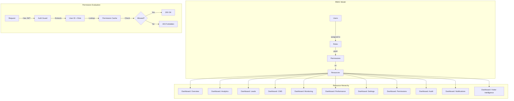

### 15.2 Permission Model

```typescript
// Permission evaluation at multiple layers

// Layer 1: Next.js Middleware (route-level)
// apps/web/src/middleware.ts
export function middleware(request: NextRequest) {
  const session = await getSession(request);
  const path = request.nextUrl.pathname;

  // Public admin routes
  if (path === '/admin/login') return NextResponse.next();

  // Protected admin routes
  if (!session) {
    return NextResponse.redirect(new URL('/admin/login', request.url));
  }

  // Role-based route access
  const rolePermissions = ROLE_PERMISSIONS[session.user.role];
  const requiredPermission = getRequiredPermission(path);

  if (!hasPermission(rolePermissions, requiredPermission)) {
    return NextResponse.redirect(new URL('/admin/unauthorized', request.url));
  }

  return NextResponse.next();
}

// Layer 2: NestJS Guards (API-level)
@Injectable()
export class PermissionsGuard implements CanActivate {
  constructor(private reflector: Reflector) {}

  canActivate(context: ExecutionContext): boolean {
    const requiredPermissions = this.reflector.getAllAndOverride<Permission[]>(
      PERMISSIONS_KEY,
      [context.getHandler(), context.getClass()]
    );

    if (!requiredPermissions) return true;

    const { user } = context.switchToHttp().getRequest();
    return requiredPermissions.some(permission =>
      user.permissions.includes(permission)
    );
  }
}

// Usage
@Permissions('leads:write')
@Patch('leads/:id')
async updateLead(@Param('id') id: string) { ... }
```

### 15.3 Permission Hierarchy

| Resource             | Read | Write | Admin | Owner |
| -------------------- | ---- | ----- | ----- | ----- |
| `dashboard:overview` | ✅   | —     | —     | —     |
| `analytics:*`        | ✅   | —     | ✅    | ✅    |
| `leads:*`            | ✅   | ✅    | ✅    | ✅    |
| `cms:*`              | ✅   | ✅    | ✅    | ✅    |
| `monitoring:*`       | ✅   | —     | ✅    | ✅    |
| `performance:*`      | ✅   | —     | ✅    | ✅    |
| `settings:*`         | ❌   | ❌    | ❌    | ✅    |
| `permissions:*`      | ❌   | ❌    | ❌    | ✅    |
| `audit:*`            | ✅   | —     | —     | ✅    |
| `notifications:*`    | ✅   | ✅    | ✅    | ✅    |
| `visitors:*`         | ✅   | —     | ✅    | ✅    |

### 15.4 RBAC API

| Method  | Endpoint                       | Purpose                                  | Min Role      |
| ------- | ------------------------------ | ---------------------------------------- | ------------- |
| `GET`   | `/api/admin/permissions/check` | Check if current user has permission     | Authenticated |
| `GET`   | `/api/admin/permissions/my`    | Get current user's effective permissions | Authenticated |
| `PATCH` | `/api/admin/users/:id/role`    | Update user role                         | Super Admin   |
| `POST`  | `/api/admin/users/invite`      | Invite new admin user                    | Super Admin   |

---

## 16. Enterprise Admin Architecture

### 16.1 Enterprise Scaling Model

The admin architecture is designed to scale from a **single admin** to a **multi-tenant enterprise** through three tiers:

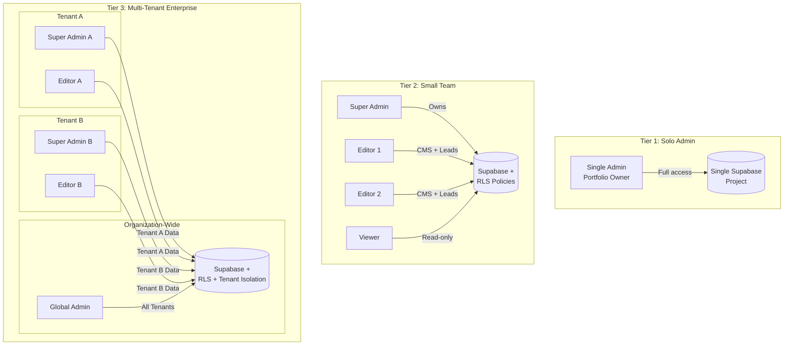

### 16.2 Enterprise Features

| Feature            | Tier 1 (Solo)             | Tier 2 (Team)                | Tier 3 (Enterprise)                |
| ------------------ | ------------------------- | ---------------------------- | ---------------------------------- |
| **Auth**           | Email/password + OAuth    | Email/password + OAuth + SSO | SSO (SAML/OIDC) + MFA              |
| **Users**          | 1 admin                   | 2-10 users                   | Unlimited with teams               |
| **Roles**          | Pre-defined (Super Admin) | 3 default roles + custom     | Full custom roles + groups         |
| **Audit**          | Basic activity log        | Full audit with filters      | Audit + compliance reports         |
| **Data Isolation** | Single portfolio          | Single portfolio             | Multi-portfolio / multi-tenant     |
| **Backup**         | Manual                    | Automated daily              | Automated + point-in-time recovery |
| **SLA**            | Best effort               | 99.9% uptime                 | 99.99% uptime with guarantees      |
| **Support**        | Self-serve                | Email support                | Dedicated support + training       |
| **Integrations**   | Core integrations         | All integrations + webhooks  | Custom integrations + API          |
| **Analytics**      | PostHog free tier         | PostHog paid tier            | Custom analytics pipeline          |
| **Compliance**     | Basic                     | SOC 2 ready                  | SOC 2 + GDPR + HIPAA ready         |

### 16.3 Multi-Tenant Data Model

```sql
-- Tenant isolation via RLS (future enterprise feature)

-- Option A: Separate schemas per tenant
CREATE SCHEMA tenant_abc;
CREATE SCHEMA tenant_xyz;

-- Option B: Shared tables with tenant_id column (simpler)
ALTER TABLE sections ADD COLUMN tenant_id UUID REFERENCES tenants(id);
ALTER TABLE projects ADD COLUMN tenant_id UUID REFERENCES tenants(id);
ALTER TABLE leads ADD COLUMN tenant_id UUID REFERENCES tenants(id);

-- RLS Policy for tenant isolation
CREATE POLICY tenant_isolation ON sections
  USING (tenant_id = current_setting('app.tenant_id')::UUID);

-- Example: In NestJS middleware
@Injectable()
export class TenantInterceptor implements NestInterceptor {
  intercept(context: ExecutionContext, next: CallHandler): Observable<any> {
    const request = context.switchToHttp().getRequest();
    const tenantId = request.user.tenant_id;

    // Set tenant context for RLS
    await this.supabase.rpc('set_tenant_context', { tenant_id: tenantId });

    return next.handle();
  }
}
```

### 16.4 Enterprise Compliance Features

| Feature                | Description                                                | Implementation                                                                            |
| ---------------------- | ---------------------------------------------------------- | ----------------------------------------------------------------------------------------- |
| **SOC 2 Ready Audit**  | All admin actions logged with immutable trail              | Append-only audit_logs table with cryptographic chaining (SHA-256 hash of previous entry) |
| **GDPR Compliance**    | Data export and deletion capabilities                      | User data export API, GDPR deletion workflow with confirmation                            |
| **Data Retention**     | Configurable retention per data type                       | `audit_logs.retention_days`, auto-purge cron job                                          |
| **Encryption at Rest** | All sensitive data encrypted                               | Supabase AES-256 encryption, field-level encryption for PII                               |
| **Session Management** | Force logout, session revocation, concurrent session limit | Active session table, `DELETE FROM sessions WHERE user_id = X`                            |
| **IP Allowlisting**    | Restrict admin access to trusted IPs                       | `allowed_ips` in settings, middleware check                                               |
| **MFA Support**        | Multi-factor authentication (future)                       | TOTP via authenticator app, backup codes                                                  |
| **Password Policy**    | Configurable password requirements                         | Min length, complexity, expiry, history prevention                                        |
| **Rate Limiting**      | Per-endpoint rate limits for admin API                     | 100 req/min baseline, stricter for auth endpoints (5/15min)                               |
| **Data Backup**        | Automated backup with point-in-time recovery               | Supabase daily backups, 7-day retention                                                   |

### 16.5 Enterprise Deployment Architecture

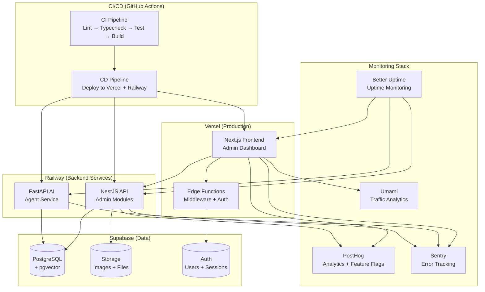

### 16.6 Enterprise Admin Workflows

#### Workflow 1: New User Onboarding

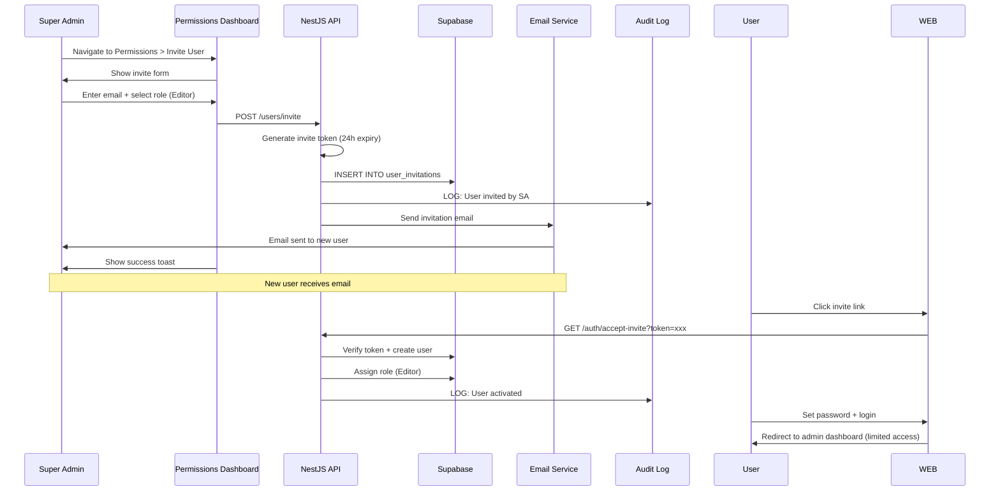

#### Workflow 2: Incident Response

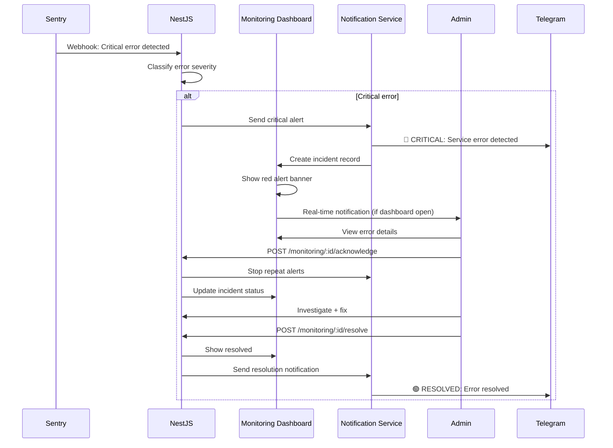

### 16.7 Disaster Recovery & Business Continuity

| Scenario                | Impact             | Recovery Procedure               | RTO       | RPO                 |
| ----------------------- | ------------------ | -------------------------------- | --------- | ------------------- |
| **Vercel Outage**       | Frontend down      | Repoint DNS to Netlify fallback  | < 15 min  | N/A (cached assets) |
| **API Outage**          | Admin inaccessible | Rollback Railway deployment      | < 10 min  | N/A                 |
| **Database Corruption** | Data loss          | Supabase PITR restore            | < 1 hour  | < 24 hours          |
| **Credential Leak**     | Security breach    | Rotate all keys, revoke sessions | < 30 min  | N/A                 |
| **LLM API Downtime**    | AI service down    | Auto-fallback to secondary model | < 30s     | N/A                 |
| **Full Stack Failure**  | Complete downtime  | Rebuild from IaC + backup DB     | < 4 hours | < 24 hours          |

**Backup Strategy:**

```bash
# Automated daily backup via Supabase (Pro tier PITR)
# Manual backup script for additional safety
pg_dump --host=aws-0-ap-southeast-1.pooler.supabase.com \
        --port=5432 \
        --username=postgres \
        --dbname=postgres \
        --format=custom \
        --file=./backups/portfolio-$(date +%Y%m%d).dump

# Encrypt and upload to secure storage
gpg --symmetric --cipher-algo AES256 ./backups/portfolio-$(date +%Y%m%d).dump
aws s3 cp ./backups/portfolio-$(date +%Y%m%d).dump.gpg s3://portfolio-backups/database/
```

### 16.8 Cost Management & Resource Governance

| Resource                 | Free Tier Limit | Warning at  | Critical at | Action                         |
| ------------------------ | --------------- | ----------- | ----------- | ------------------------------ |
| **Database storage**     | 500MB           | 350MB (70%) | 450MB (90%) | Archive old data, upgrade plan |
| **Database connections** | 15              | 12 (80%)    | 14 (93%)    | Kill idle, connection pooling  |
| **AI monthly spend**     | $10 budget      | $7 (70%)    | $10 (100%)  | Disable AI chat, notify admin  |
| **PostHog events/mo**    | 1M              | 700K (70%)  | 900K (90%)  | Reduce sampling, upgrade plan  |
| **Vercel bandwidth**     | 100GB           | 80GB (80%)  | 95GB (95%)  | Optimize images, caching       |
| **Sentry errors/mo**     | 5K              | 3.5K (70%)  | 4.5K (90%)  | Deduplicate, reduce noise      |
| **Email sends/mo**       | 3K (Resend)     | 2K (67%)    | 2.5K (83%)  | Reduce notification frequency  |

### 16.9 Enterprise Admin Dashboard (Future Expansion)

The architecture is designed to support additional dashboards without redesign:

| Future Dashboard              | Purpose                                                               | When |
| ----------------------------- | --------------------------------------------------------------------- | ---- |
| **SEO Dashboard**             | Search rankings, keyword performance, backlink monitoring             | v2.0 |
| **Revenue Dashboard**         | Earnings, invoices, payment history                                   | v2.0 |
| **Social Dashboard**          | Social media metrics, engagement, scheduled posts                     | v2.0 |
| **Deployment Dashboard**      | Deploy history, rollback, environment comparison                      | v2.0 |
| **A/B Testing Dashboard**     | Experiment results, variant comparison, statistical significance      | v2.5 |
| **API Usage Dashboard**       | API key management, rate limit monitoring, usage analytics            | v3.0 |
| **Cost Dashboard**            | Infrastructure cost tracking, budget alerts, optimization suggestions | v3.0 |
| **i18n Management Dashboard** | Translation management, locale status, content sync                   | v3.0 |

**A/B Testing Dashboard Spec (v2.5):**

| Widget                       | Type             | Data Source           | Purpose                         |
| ---------------------------- | ---------------- | --------------------- | ------------------------------- |
| **Active Experiments**       | Card list        | PostHog Feature Flags | View all running A/B tests      |
| **Experiment Results**       | Comparison table | PostHog API           | Variant A vs B conversion rates |
| **Statistical Significance** | Badge            | PostHog API           | P-value and confidence level    |
| **Sample Size**              | Stat cards       | PostHog API           | Visitors per variant            |
| **Create Experiment**        | Wizard form      | PostHog API           | Set up new A/B test             |
| **Results Over Time**        | Line chart       | PostHog API           | Cumulative conversion over time |
| **Winner Declaration**       | Button           | Manual                | Promote winning variant         |

**i18n Management Dashboard Spec (v3.0):**

| Widget                  | Type   | Data Purpose                                  |
| ----------------------- | ------ | --------------------------------------------- |
| **Language Overview**   | Table  | All supported locales, translation % complete |
| **Translation Editor**  | Form   | Key-value pair editing per locale             |
| **Auto-Translate**      | Button | AI-generated translations (Claude API)        |
| **Content Sync Status** | Badge  | Which sections have untranslated content      |
| **Locale Analytics**    | Chart  | Visitor breakdown by language preference      |
| **Export/Import**       | Button | JSON for third-party translation services     |

---

## 17. Data Layer & API Architecture

### 17.1 Data Flow Architecture

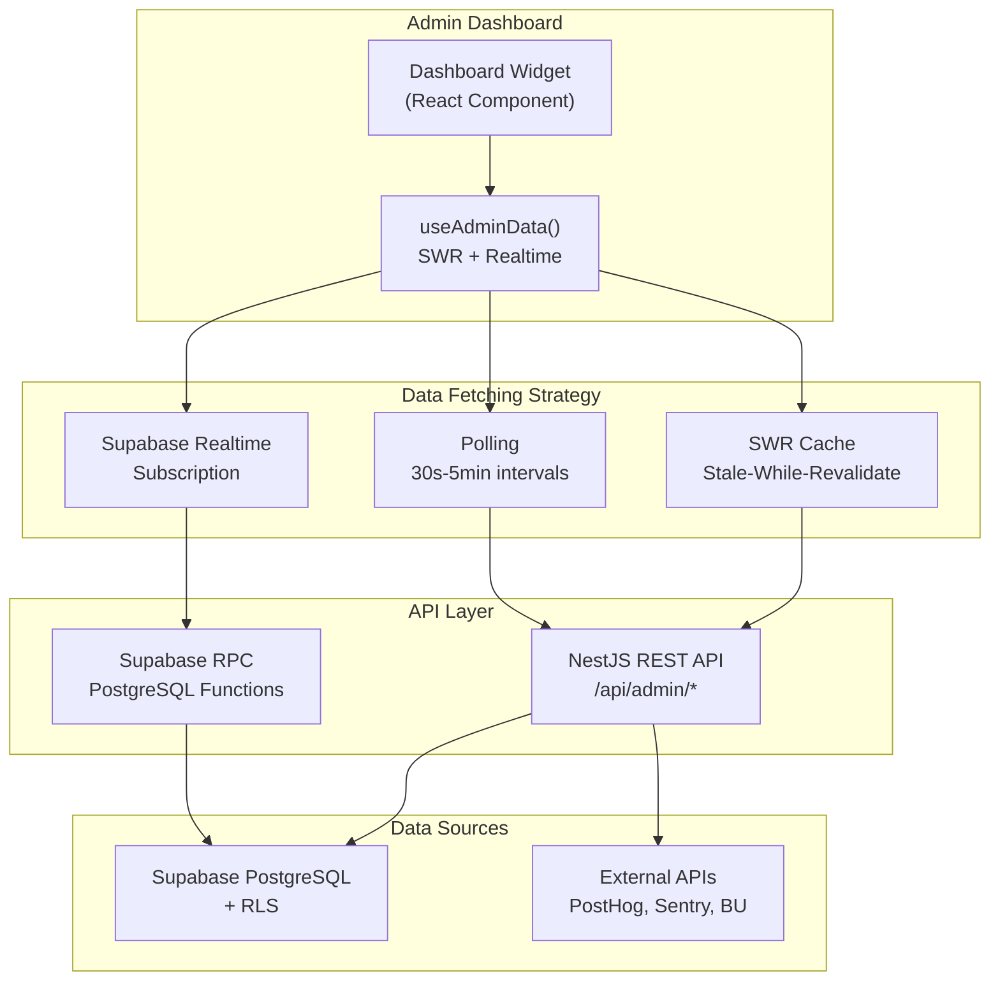

### 17.2 Caching Strategy

| Data Type                | Strategy       | TTL         | Stale While Revalidate | Revalidate on Focus |
| ------------------------ | -------------- | ----------- | ---------------------- | ------------------- |
| **Stat cards**           | SWR            | 30s         | Yes                    | Yes                 |
| **Chart data**           | SWR            | 60s         | Yes                    | Yes                 |
| **Lead table**           | SWR + Realtime | 10s         | Yes                    | Yes                 |
| **Section list**         | SWR + Realtime | On mutation | Yes                    | Yes                 |
| **Settings**             | SWR            | 5min        | Yes                    | No                  |
| **Permissions**          | SWR            | 5min        | Yes                    | No                  |
| **Audit log**            | SWR            | 30s         | Yes                    | Yes                 |
| **Notifications**        | SWR + Realtime | 10s         | Yes                    | Yes                 |
| **Monitoring data**      | SWR            | 60s         | Yes                    | Yes                 |
| **Performance data**     | SWR            | 5min        | Yes                    | No                  |
| **Visitor intelligence** | SWR + Realtime | 5s          | Yes                    | Yes                 |
| **Availability status**  | SWR + Realtime | 2s          | Yes                    | Yes                 |

### 17.2.1 Background Job Data Freshness

Some aggregated data displayed in admin dashboards depends on **background job completion**. The following background jobs (see `docs/10-api/47-BACKGROUND-JOBS.md`) affect data freshness:

| Background Job                 | Affected Data                                   | Schedule     | Freshness Guarantee                                                                        |
| ------------------------------ | ----------------------------------------------- | ------------ | ------------------------------------------------------------------------------------------ |
| **Analytics Aggregation**      | Chart data (traffic overview, sources, devices) | Hourly       | Data is current as of the last aggregation run; polling widgets show "Last updated: HH:mm" |
| **Lead Scoring Recalculation** | Lead scores in leads table                      | Every 15 min | Scores reflect latest session data within 15 min                                           |
| **Embedding Regeneration**     | AI search vectors for content                   | Nightly      | Semantic search indexes rebuilt daily                                                      |
| **Session Cleanup**            | Visitor session expiry                          | Hourly       | Stale sessions removed, accurate live visitor count                                        |
| **Availability Auto-Switch**   | Auto-switch busy/available based on end date    | Hourly       | Availability badge accuracy within 1 hour of end date                                      |

Dashboard widgets that depend on aggregated data show a **"Last synced" timestamp** in their footer. Widgets polling at 30-60s intervals reflect real-time data; chart data with hourly aggregation shows the batch timestamp.

### 17.3 NestJS Admin Module Structure

```typescript
// apps/api/src/modules/admin/admin.module.ts
@Module({
  imports: [
    forwardRef(() => AuthModule),
    forwardRef(() => SectionsModule),
    forwardRef(() => ContentModule),
    forwardRef(() => LeadsModule),
    forwardRef(() => AnalyticsModule),
    forwardRef(() => VisitorModule),
    forwardRef(() => SettingsModule),
    forwardRef(() => PermissionsModule),
    forwardRef(() => AuditModule),
    forwardRef(() => NotificationsModule),
    ThrottlerModule.forRoot([{ ttl: 60000, limit: 100 }]),
  ],
  controllers: [AdminController],
  providers: [AdminService, AdminOverviewService, AdminDashboardGuard, PermissionsGuard],
  exports: [AdminService],
})
export class AdminModule {}
```

### 17.4 API Response Envelope

```typescript
// Standard API response envelope for all admin endpoints
interface ApiResponse<T> {
  success: boolean;
  data?: T;
  error?: {
    code: string;         // e.g., "UNAUTHORIZED", "VALIDATION_ERROR"
    message: string;      // Human-readable message
    details?: any;        // Validation errors, stack trace (dev only)
  };
  meta?: {
    page: number;
    pageSize: number;
    total: number;
    took: number;         // Response time in ms
  };
}

// Example response
{
  "success": true,
  "data": {
    "visitors": 1234,
    "leads": 12,
    "sections": { "live": 15, "total": 25 },
    "uptime": 99.97
  },
  "meta": {
    "took": 45
  }
}
```

---

## 18. Security Architecture

### 18.1 Security Layers

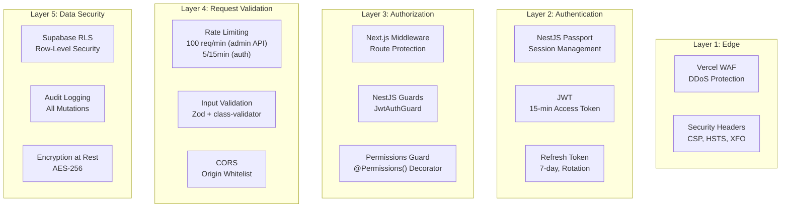

### 18.2 Admin-Specific Security Rules

| Rule                       | Implementation                                   | Severity |
| -------------------------- | ------------------------------------------------ | -------- |
| **Session Timeout**        | Auto-logout after 24h inactivity                 | Critical |
| **Concurrent Sessions**    | Limit to 5 concurrent sessions per user          | High     |
| **Failed Login Lockout**   | 5 attempts → 15-min cooldown                     | Critical |
| **Password Requirements**  | 8+ chars, uppercase, number, special             | High     |
| **Session Revocation**     | Force logout all sessions from settings          | Critical |
| **Admin IP Allowlisting**  | Optional: restrict to VPN/office IPs             | Medium   |
| **Audit All Mutations**    | Every create/update/delete logged                | Critical |
| **No Client Secrets**      | API keys server-side only, masked in UI          | Critical |
| **CSRF Protection**        | Double-submit cookie pattern                     | Critical |
| **XSS Prevention**         | Sanitize all rich text, CSP headers              | Critical |
| **IDOR Prevention**        | Resource ownership verification on every request | Critical |
| **Rate Limit Auth**        | 5 requests/15min on login, 100 req/min on API    | Critical |
| **Sensitive Data Masking** | API keys show last 4 chars only in UI            | High     |
| **Audit Trail Integrity**  | Append-only audit logs, SHA-256 chain            | Critical |

### 18.3 Compliance Gate Applicability

The following compliance gates from `docs/11-security/16-COMPLIANCE.md §12` apply specifically to admin dashboard deployment:

| Gate       | Code             | Requirement                                           | Admin Impact                                                               |
| ---------- | ---------------- | ----------------------------------------------------- | -------------------------------------------------------------------------- |
| **CG-001** | WCAG             | All admin views must pass WCAG 2.2 AA scan            | Automated a11y check in CI pipeline                                        |
| **CG-002** | Security Headers | CSP, HSTS, XFO, Referrer-Policy must be present       | Vercel `headers` config includes admin-specific CSP                        |
| **CG-003** | npm Audit        | Zero critical vulnerabilities in dependencies         | `npm audit` gate in CI, fail on critical                                   |
| **CG-004** | SSL/TLS          | All admin traffic over HTTPS with TLS 1.2+            | Enforced by Vercel Edge                                                    |
| **CG-005** | CSP Review       | CSP must not use `unsafe-inline` for scripts          | Admin CSP uses strict nonce-based policy                                   |
| **CG-006** | PII Exposure     | No PII (emails, IPs, API keys) in client-side bundles | Server-components for sensitive data, API-only for PII                     |
| **CG-007** | Cookie Consent   | Analytics cookies require consent                     | Admin analytics pre-consented, public visitor tracking uses consent banner |

### 18.4 Security Headers for Admin

```typescript
// next.config.js - Admin-specific security headers
const adminSecurityHeaders = [
  {
    key: 'Content-Security-Policy',
    value:
      "default-src 'self'; " +
      "script-src 'self' 'unsafe-inline' 'unsafe-eval' https://*.posthog.com; " +
      "style-src 'self' 'unsafe-inline'; " +
      "img-src 'self' data: blob: https:; " +
      "connect-src 'self' https://*.supabase.co wss://*.supabase.co https://*.posthog.com https://*.ingest.sentry.io; " +
      "frame-src 'self' https://*.posthog.com;",
  },
  {
    key: 'X-Frame-Options',
    value: 'DENY',
  },
  {
    key: 'X-Content-Type-Options',
    value: 'nosniff',
  },
  {
    key: 'Referrer-Policy',
    value: 'strict-origin-when-cross-origin',
  },
  {
    key: 'Strict-Transport-Security',
    value: 'max-age=63072000; includeSubDomains; preload',
  },
  {
    key: 'Permissions-Policy',
    value: 'camera=(), microphone=(), geolocation=()',
  },
];
```

### 18.4 Admin Audit Trail Integrity

The audit log uses cryptographic chaining to ensure immutability:

```typescript
interface AuditEntry {
  id: string;
  previous_hash: string; // SHA-256 of previous entry
  data_hash: string; // SHA-256 of (action + actor + resource + changes + timestamp)
  action: string;
  actor_id: string;
  resource_type: string;
  resource_id: string;
  changes: Change[];
  metadata: AuditMetadata;
  timestamp: string;
}

// Verification function
function verifyAuditChain(entries: AuditEntry[]): boolean {
  for (let i = 1; i < entries.length; i++) {
    const expectedHash = crypto
      .createHash('sha256')
      .update(JSON.stringify(entries[i - 1].data_hash + entries[i - 1].timestamp))
      .digest('hex');

    if (entries[i].previous_hash !== expectedHash) {
      return false; // Chain broken — tampering detected
    }
  }
  return true;
}
```

---

## 19. Performance SLOs & Benchmarks

### 19.1 Admin Dashboard SLOs

| SLO ID  | Metric                    | Target             | Measurement Window | Severity |
| ------- | ------------------------- | ------------------ | ------------------ | -------- |
| ADM-001 | Dashboard page load       | < 2s (p95)         | Rolling 7 days     | High     |
| ADM-002 | API response time (admin) | < 200ms (p95)      | Rolling 7 days     | High     |
| ADM-003 | Data refresh latency      | < 5s (p95)         | Rolling 7 days     | Medium   |
| ADM-004 | Auth check overhead       | < 50ms (p95)       | Rolling 7 days     | Medium   |
| ADM-005 | Widget failure isolation  | 100%               | Per deployment     | Critical |
| ADM-006 | Admin system uptime       | > 99.9%            | Rolling 30 days    | Critical |
| ADM-007 | Search response (leads)   | < 500ms (p95)      | Rolling 7 days     | Medium   |
| ADM-008 | CSV export generation     | < 10s for 10K rows | Per request        | Low      |
| ADM-009 | Image upload processing   | < 3s (p95)         | Rolling 7 days     | Medium   |
| ADM-010 | Audit log query           | < 1s (p95)         | Rolling 7 days     | Low      |

### 19.2 Admin API Endpoint Performance

| Endpoint Group                    | P50 Target | P95 Target | P99 Target | Alert Threshold |
| --------------------------------- | ---------- | ---------- | ---------- | --------------- |
| `GET /api/admin/*` (data reads)   | < 100ms    | < 300ms    | < 500ms    | > 500ms (p95)   |
| `POST /api/admin/*` (mutations)   | < 300ms    | < 500ms    | < 1s       | > 1s (p95)      |
| `PATCH /api/admin/*` (updates)    | < 200ms    | < 400ms    | < 800ms    | > 800ms (p95)   |
| `DELETE /api/admin/*` (deletions) | < 200ms    | < 400ms    | < 800ms    | > 800ms (p95)   |
| `GET /api/admin/export`           | < 2s       | < 5s       | < 10s      | > 10s           |
| `POST /api/admin/media/upload`    | < 1s       | < 3s       | < 5s       | > 5s            |
| `POST /api/admin/revalidate`      | < 500ms    | < 1s       | < 2s       | > 2s            |

### 19.3 Admin Dashboard Lighthouse Budgets

| Metric                  | Budget  | Warning | Error   |
| ----------------------- | ------- | ------- | ------- |
| **Performance Score**   | ≥ 90    | < 90    | < 80    |
| **Accessibility Score** | ≥ 95    | < 95    | < 90    |
| **SEO Score**           | ≥ 95    | < 95    | < 90    |
| **Best Practices**      | ≥ 95    | < 95    | < 90    |
| **LCP**                 | < 2.0s  | > 2.0s  | > 3.0s  |
| **CLS**                 | < 0.05  | > 0.05  | > 0.1   |
| **TBT**                 | < 150ms | > 150ms | > 300ms |

---

## 20. Observability of Admin System

### 20.1 Admin System Health Checks

The admin system itself must be observable. The following endpoints provide health status:

| Endpoint                     | Purpose                                 | Check Interval |
| ---------------------------- | --------------------------------------- | -------------- |
| `GET /admin/health`          | Admin dashboard health                  | 5 minutes      |
| `GET /api/admin/health`      | Admin API health                        | 1 minute       |
| `GET /api/admin/health/deps` | Dependency status (DB, PostHog, Sentry) | 5 minutes      |

**Admin Health Response:**

```json
{
  "status": "healthy",
  "timestamp": "2026-06-17T06:00:00.000Z",
  "version": "1.1.0",
  "uptime_seconds": 86400,
  "checks": {
    "database": { "status": "healthy", "latency_ms": 12 },
    "posthog": { "status": "healthy", "latency_ms": 145 },
    "sentry": { "status": "healthy", "latency_ms": 89 },
    "better_uptime": { "status": "healthy", "latency_ms": 200 },
    "umami": { "status": "healthy", "latency_ms": 56 },
    "resend": { "status": "healthy" }
  },
  "metrics": {
    "dashboard_load_ms_avg": 1240,
    "api_latency_ms_p95": 185,
    "widget_error_rate": 0.02,
    "active_admin_sessions": 1
  }
}
```

### 20.2 Admin Widget Observability

| Widget               | Error Tracking            | Performance Tracking   | Alert Condition                         |
| -------------------- | ------------------------- | ---------------------- | --------------------------------------- |
| **Stat Cards**       | Per-card error boundary   | Load time              | Any card fails 3+ consecutive refreshes |
| **Charts**           | Chart error fallback      | Data fetch time        | Chart data stale > 2x refresh interval  |
| **Data Tables**      | Table error state         | Search/sort latency    | Table renders empty when data exists    |
| **Rich Text Editor** | Editor crash boundary     | Initialization time    | Editor fails to initialize              |
| **Image Uploader**   | Upload error toast        | Upload processing time | Upload fails 3+ consecutive attempts    |
| **Realtime Feeds**   | Feed disconnect indicator | Reconnection time      | Feed disconnected > 30s                 |

### 20.3 Admin Event Logging

All admin operations are logged with structured JSON:

```typescript
// Admin activity log schema
interface AdminActivity {
  event: string; // e.g., "dashboard_view", "lead_update", "section_publish"
  actor_id: string;
  actor_email: string;
  dashboard: string; // e.g., "leads", "cms", "settings"
  duration_ms: number; // Time spent on page or action
  success: boolean;
  error?: string;
  metadata?: Record<string, any>;
  timestamp: string;
  session_id: string;
  trace_id: string;
}

// Log format (stdout for Vercel Logs capture)
console.log(
  JSON.stringify({
    level: 'info',
    event: 'admin_action',
    adminActivity: {
      event: 'lead_update',
      actor_id: 'user_123',
      dashboard: 'leads',
      duration_ms: 2340,
      success: true,
      metadata: { lead_id: 'lead_456', new_status: 'replied' },
    },
    timestamp: '2026-06-17T06:00:00.000Z',
  }),
);
```

### 20.4 Admin System Metrics Dashboard

```text
┌─────────────────────────────────────────────────────────────────┐
│  📊 ADMIN SYSTEM METRICS                    Updated: 30s ago     │
├─────────────────────────────────────────────────────────────────┤
│ ┌──────────┐ ┌──────────┐ ┌──────────┐ ┌──────────┐            │
│ │ Page Load│ │ API p95  │ │ Widget   │ │ Active   │            │
│ │ (avg)    │ │ Latency  │ │ Error %  │ │ Sessions │            │
│ │  1.2s   │ │  185ms   │ │  0.02%  │ │    1     │            │
│ │  target↓ │ │  target↓ │ │  target↓ │ │          │            │
│ └──────────┘ └──────────┘ └──────────┘ └──────────┘            │
│                                                                  │
│ 📊 Dashboard Performance by Module                              │
│  Overview:     1.1s ██████████████     ✅ < 2s                  │
│  Analytics:    1.8s ███████████████████ ✅ < 2s                 │
│  Leads:        0.9s ███████████        ✅ < 2s                  │
│  CMS:          2.1s █████████████████████ ❌ > 2s (optimize)   │
│  Monitoring:   1.4s ████████████████    ✅ < 2s                 │
│  Settings:     0.7s ████████            ✅ < 2s                 │
│                                                                  │
│ 🔴 Recent Admin Errors                                          │
│  • 14:32 - Chart data fetch timeout (Analytics) - Retry OK      │
│  • 13:15 - Image upload failed (512KB limit) - User error       │
│  • 11:00 - Section publish revalidation failed - Auto-retry OK  │
└─────────────────────────────────────────────────────────────────┘
```

---

## 21. UI/UX Patterns & States

### 21.1 Shared State Patterns

Every dashboard widget and page follows these state patterns:

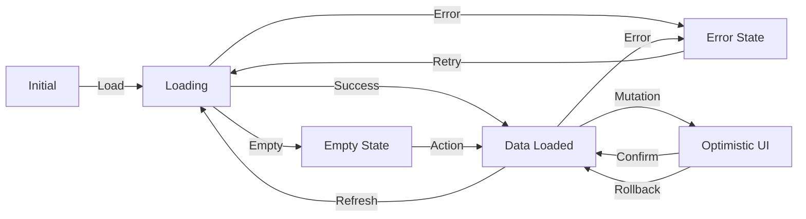

### 21.2 Component Patterns

| Pattern             | Usage                                | Implementation                                                   |
| ------------------- | ------------------------------------ | ---------------------------------------------------------------- |
| **StatsCard**       | Numeric KPI display                  | Icon + value + label + trend arrow + optional sparkline          |
| **DataTable**       | Tabular data with sort/filter/select | Sortable headers, checkbox selection, pagination, inline actions |
| **LineChart**       | Time-series data visualization       | Recharts responsive line chart with tooltips, gradient fill      |
| **BarChart**        | Categorical comparison               | Recharts horizontal/vertical bar chart                           |
| **PieChart**        | Proportional breakdown               | Recharts donut chart with legend                                 |
| **FunnelChart**     | Conversion step visualization        | Custom funnel component with step labels and rates               |
| **GeoMap**          | Geographic distribution              | Simple choropleth world map (SVG-based)                          |
| **Timeline**        | Chronological event list             | Vertical timeline with date grouping                             |
| **StatBadge**       | Status indicator                     | Color-coded badge with icon                                      |
| **ActionMenu**      | Dropdown action list                 | Three-dot menu with action list, confirmation for destructive    |
| **SlideOver**       | Side panel for details               | Animated slide-in from right, 30-50% width                       |
| **ConfirmDialog**   | Destructive action confirmation      | "Are you sure?" with action name, confirm/cancel                 |
| **Toast**           | Non-blocking notification            | Top-right, auto-dismiss, action button                           |
| **DateRangePicker** | Date range selection                 | Preset buttons + custom calendar range                           |
| **SearchInput**     | Debounced search field               | Search icon, clear button, debounced onChange                    |
| **RealtimeBadge**   | Live connection indicator            | Green pulsing dot when connected, grey when disconnected         |
| **Avatar**          | User avatar display                  | Initial fallback, image with fallback, status dot                |
| **EmptyState**      | No data placeholder                  | Illustration + message + CTA action                              |

### 21.2.1 Standardized Error Codes

All error states across the admin dashboard use the **standardized error codes** defined in `docs/10-api/ErrorHandling.md` and the **API response envelope** from `docs/10-api/44-API-STANDARDS.md`. Every API error response follows this structure:

```typescript
interface ApiError {
  success: false;
  error: {
    code: string; // e.g., "VALIDATION_ERROR", "UNAUTHORIZED", "RATE_LIMITED"
    message: string; // Human-readable description
    details?: any; // Field-level validation errors
    trace_id?: string; // For error correlation
  };
}
```

Error states in the UI display the standardized error code alongside the user-facing message (e.g., `UNAUTHORIZED — You don't have permission to access this resource`). This ensures consistency across all 12 dashboards and simplifies debugging via trace_id correlation.

### 21.3 Loading State Patterns

| State                    | Visual                                                          | Duration           |
| ------------------------ | --------------------------------------------------------------- | ------------------ |
| **Initial page load**    | Full-page skeleton layout (sidebar + header + content skeleton) | Until first data   |
| **Widget load**          | Widget-shaped skeleton (chart skeleton, stat card skeleton)     | Until widget data  |
| **Table load**           | 5-10 skeleton rows                                              | Until data arrives |
| **Mutation in progress** | Button spinner / optimistic UI                                  | Until API response |
| **Revalidation**         | Subtle indicator (no UI disruption)                             | Background         |

### 21.4 Error State Patterns

| Error Type              | User-Facing Message                             | Action                             | Logged?   |
| ----------------------- | ----------------------------------------------- | ---------------------------------- | --------- |
| **Network error**       | "Connection lost. Retrying..."                  | Auto-retry (3x), then manual retry | ✅        |
| **API error (4xx)**     | "You don't have permission" or validation error | Show specific error                | ✅        |
| **API error (5xx)**     | "Something went wrong. We've been notified."    | Retry button                       | ✅ Sentry |
| **Rate limited**        | "Too many requests. Please wait."               | Show retry-after countdown         | ✅        |
| **Timeout**             | "Request timed out. Try again."                 | Retry button                       | ✅        |
| **Data not found**      | "The requested data was not found."             | Navigate back                      | ✅        |
| **Realtime disconnect** | "Live updates paused. Reconnecting..."          | Auto-reconnect indicator           | ✅        |

### 21.5 Empty State Patterns

| Dashboard                | Empty State Message                                                   | Action                                                         |
| ------------------------ | --------------------------------------------------------------------- | -------------------------------------------------------------- |
| **Overview**             | "Welcome to your dashboard! Here's what to do next:"                  | Setup checklist (add project, create section, share portfolio) |
| **Analytics**            | "Collecting data... Analytics will be available in 24-48 hours."      | "Learn about PostHog setup" link                               |
| **Leads**                | "No leads yet. Your contact form will capture them here."             | "Share your portfolio" button                                  |
| **Visitor Intelligence** | "No visitors yet. Share your portfolio to start attracting visitors." | "Share your portfolio" button                                  |
| **CMS**                  | "No sections yet. Create your first section."                         | "Create section" button                                        |
| **Monitoring**           | "All clear — no incidents reported."                                  | —                                                              |
| **Performance**          | "Run your first Lighthouse audit to see performance data."            | "Run audit" button                                             |
| **Audit**                | "No audit events recorded yet."                                       | —                                                              |
| **Notifications**        | "All caught up! No new notifications."                                | —                                                              |

### 21.6 Accessibility Patterns

All admin dashboard components conform to WCAG 2.2 AA:

| Pattern                 | Implementation                                        | WCAG Criterion               |
| ----------------------- | ----------------------------------------------------- | ---------------------------- |
| **Skip Link**           | First focusable element → skips to main content       | 2.4.1 Bypass Blocks          |
| **Focus Management**    | Visible focus ring on all interactive elements        | 2.4.7 Focus Visible          |
| **Focus Trap**          | Modal/panel traps focus, Esc to close                 | 2.1.2 No Keyboard Trap       |
| **ARIA Landmarks**      | `nav`, `main`, `region` per widget area               | 1.3.1 Info and Relationships |
| **Live Regions**        | `role="status"` for toast, `role="alert"` for errors  | 4.1.3 Status Messages        |
| **Color Contrast**      | All text ≥ 4.5:1, UI components ≥ 3:1                 | 1.4.3 Contrast (Minimum)     |
| **Touch Targets**       | All interactive ≥ 44×44px on mobile                   | 2.5.8 Target Size            |
| **Reduced Motion**      | Respect `prefers-reduced-motion`, disable animations  | 1.4.4 Resize Text            |
| **Screen Reader**       | All icons have `aria-label`, tables have `aria-label` | 4.1.2 Name, Role, Value      |
| **Keyboard Navigation** | All actions accessible via Tab/Enter/Arrow keys       | 2.1.1 Keyboard               |

---

## 22. Implementation Roadmap

### 22.1 Phase Breakdown

| Phase              | Dashboards                                       | Duration | Dependencies       | Key Deliverables                                                                                                                                                               |
| ------------------ | ------------------------------------------------ | -------- | ------------------ | ------------------------------------------------------------------------------------------------------------------------------------------------------------------------------ |
| **P1: Foundation** | Auth, Layout, Overview                           | 2 weeks  | P1 infra setup     | Admin layout, auth, overview dashboard                                                                                                                                         |
| **P2: Content**    | CMS Dashboard                                    | 3 weeks  | P1                 | Section manager, rich text editor, media library, image upload, content publishing lifecycle, visual style picker, draft/preview mode, bulk CSV import, AI content suggestions |
| **P3: Leads**      | Leads Dashboard                                  | 2 weeks  | P1                 | Lead table, detail panel, lead scoring, CSV export, notifications, NDA workflow, QR tracking                                                                                   |
| **P4: Analytics**  | Analytics + Visitor Intelligence                 | 3 weeks  | P1, PostHog, Umami | Charts, filters, conversion funnel, export, real-time visitor feed, session replays, heatmaps                                                                                  |
| **P5: Monitoring** | Monitoring + Performance                         | 2 weeks  | P1, Sentry         | Error tracking, uptime, CWV, budgets, admin observability                                                                                                                      |
| **P6: Admin**      | Settings + Permissions + Audit + Notifications   | 3 weeks  | P1-P5              | Settings UI, RBAC, audit log, notification center, availability widget                                                                                                         |
| **P7: Enterprise** | Multi-tenant, SSO, Compliance, A/B Testing, i18n | 4 weeks  | P6                 | Tenant isolation, SAML, GDPR, SLA dashboard, A/B testing, i18n                                                                                                                 |

### 22.2 Implementation Order

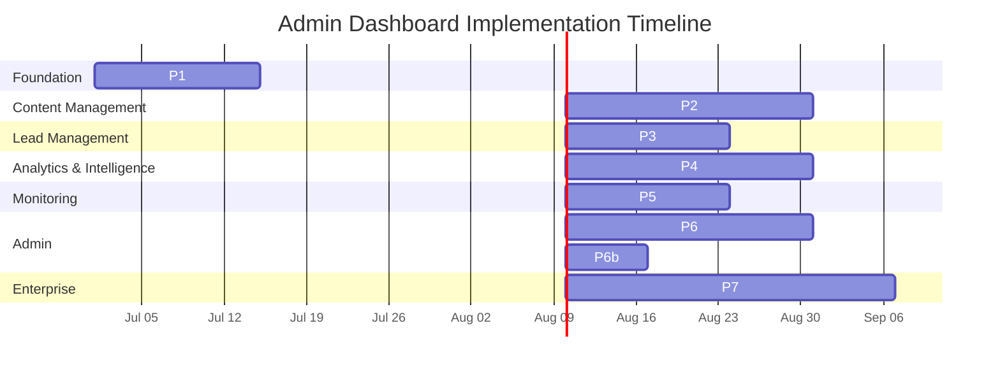

### 22.3 File Inventory

| File Path                                                | Purpose                              | Phase |
| -------------------------------------------------------- | ------------------------------------ | ----- |
| `apps/web/src/app/admin/layout.tsx`                      | Admin layout with sidebar + header   | P1    |
| `apps/web/src/app/admin/page.tsx`                        | Overview dashboard                   | P1    |
| `apps/web/src/app/admin/login/page.tsx`                  | Login page                           | P1    |
| `apps/web/src/middleware.ts`                             | Auth middleware                      | P1    |
| `apps/web/src/app/admin/analytics/page.tsx`              | Analytics dashboard                  | P4    |
| `apps/web/src/app/admin/visitors/page.tsx`               | Visitor intelligence dashboard       | P4    |
| `apps/web/src/app/admin/leads/page.tsx`                  | Lead inbox                           | P3    |
| `apps/web/src/app/admin/leads/[id]/page.tsx`             | Lead detail                          | P3    |
| `apps/web/src/app/admin/cms/page.tsx`                    | Section manager                      | P2    |
| `apps/web/src/app/admin/cms/[section]/page.tsx`          | Section editor                       | P2    |
| `apps/web/src/app/admin/cms/media/page.tsx`              | Media library                        | P2    |
| `apps/web/src/app/admin/monitoring/page.tsx`             | Monitoring dashboard                 | P5    |
| `apps/web/src/app/admin/performance/page.tsx`            | Performance dashboard                | P5    |
| `apps/web/src/app/admin/settings/page.tsx`               | Settings dashboard                   | P6    |
| `apps/web/src/app/admin/settings/availability/page.tsx`  | Availability widget management       | P6    |
| `apps/web/src/app/admin/permissions/page.tsx`            | Permissions dashboard                | P6    |
| `apps/web/src/app/admin/permissions/roles/[id]/page.tsx` | Role editor                          | P6    |
| `apps/web/src/app/admin/permissions/users/page.tsx`      | User management                      | P6    |
| `apps/web/src/app/admin/audit/page.tsx`                  | Audit log                            | P6    |
| `apps/web/src/app/admin/notifications/page.tsx`          | Notification center                  | P6    |
| `apps/web/src/components/admin/Sidebar.tsx`              | Admin sidebar navigation             | P1    |
| `apps/web/src/components/admin/DataTable.tsx`            | Reusable data table                  | P1    |
| `apps/web/src/components/admin/StatsCard.tsx`            | Stat card widget                     | P1    |
| `apps/web/src/components/admin/Charts.tsx`               | Chart components (Recharts wrappers) | P4    |
| `apps/web/src/components/admin/RichTextEditor.tsx`       | WYSIWYG editor (TipTap)              | P2    |
| `apps/web/src/components/admin/ImageUploader.tsx`        | Drag-drop image upload               | P2    |
| `apps/web/src/components/admin/LeadDetail.tsx`           | Lead detail slide-over               | P3    |
| `apps/web/src/components/admin/SectionEditor.tsx`        | Section content editor               | P2    |
| `apps/web/src/components/admin/RevalidateButton.tsx`     | ISR revalidation trigger             | P2    |
| `apps/web/src/components/admin/VisitorFeed.tsx`          | Real-time visitor feed               | P4    |
| `apps/web/src/components/admin/SessionReplay.tsx`        | Session replay embed                 | P4    |
| `apps/web/src/components/admin/HeatmapView.tsx`          | Heatmap visualization                | P4    |
| `apps/web/src/components/admin/AvailabilityManager.tsx`  | Availability widget with schedule    | P6    |
| `apps/web/src/components/admin/LeadScoring.tsx`          | Lead score display component         | P3    |
| `apps/web/src/components/admin/NDATokenManager.tsx`      | NDA preview token management         | P3    |
| `apps/web/src/hooks/useAdminAuth.ts`                     | Admin auth hook                      | P1    |
| `apps/web/src/hooks/useAdminData.ts`                     | SWR data fetching hook               | P1    |
| `apps/web/src/hooks/useRealtimeSubscription.ts`          | Supabase realtime hook               | P1    |
| `apps/web/src/hooks/useAdminObservability.ts`            | Admin system metrics hook            | P5    |
| `apps/api/src/modules/admin/`                            | NestJS admin module                  | P1-P6 |
| `apps/api/src/modules/admin/visitors/`                   | Visitor intelligence module          | P4    |
| `apps/api/src/modules/admin/availability/`               | Availability management module       | P6    |
| `apps/api/src/modules/admin/observability/`              | Admin system observability module    | P5    |

---

## 23. Decision Log

| ID    | Decision                                                                                     | Rationale                                                                                                                                     | Alternatives Considered                                                                             | Date    | Approver        |
| ----- | -------------------------------------------------------------------------------------------- | --------------------------------------------------------------------------------------------------------------------------------------------- | --------------------------------------------------------------------------------------------------- | ------- | --------------- |
| D-001 | Next.js App Router for `/admin/*` with SSR data fetching                                     | Enables server-side auth checks, ISR for static admin content, and shared layout patterns with the public site                                | React SPA (separate deployment, auth duplication), plain SSR (no ISR, no App Router features)       | 2026-01 | Chief Architect |
| D-002 | 4-tier RBAC model (Super Admin → Admin → Editor → Viewer) with multi-layer enforcement       | Defense-in-depth: middleware (route guard) + API guard + decorator (method-level) + RLS (row-level)                                           | Single admin role (no granularity), JWT-only (no RLS), middleware-only (no API-level checks)        | 2026-02 | Chief Architect |
| D-003 | SWR + Supabase Realtime Subscriptions + Polling for data refresh                             | SWR provides stale-while-revalidate for instant UI; Realtime for live updates (leads, visitors); polling as fallback for non-realtime sources | Pure polling (slow updates), WebSocket (overkill for admin use case), no cache (poor UX)            | 2026-02 | Frontend Lead   |
| D-004 | PostgreSQL-based immutable audit log (not external service)                                  | Zero-cost (same Supabase instance), full ACID compliance, native JSONB for before/after diffs, 365-day retention with automated archiving     | AuditDB ($500/mo), Splunk (ops overhead), custom logging file (no queryability)                     | 2026-03 | Chief Architect |
| D-005 | PostHog for visitor analytics and session replays (dedicated Visitor Intelligence dashboard) | Generous free tier (1M events/mo), session recording, heatmaps, feature flags, all in one platform                                            | Hotjar (no feature flags), FullStory ($), Mixpanel (event-only, no replays), GA4 (privacy concerns) | 2026-03 | Chief Architect |

## 24. Risk Register

| ID    | Risk                                                                           | Likelihood | Impact | Mitigation                                                                                                                                                               |
| ----- | ------------------------------------------------------------------------------ | ---------- | ------ | ------------------------------------------------------------------------------------------------------------------------------------------------------------------------ |
| R-001 | PostHog free tier limit (1M events/mo) exceeded during traffic spikes          | Medium     | Medium | Implement client-side event sampling (10% for non-critical events), server-side event aggregation, monitor dashboard in admin; paid tier ($25/mo) for 10M events         |
| R-002 | Admin API endpoint latency exceeds 200ms p95 under concurrent admin operations | Medium     | Medium | Implement SWR caching with `dedupingInterval`, add database query optimization (indexes, selective columns), paginate all list endpoints, monitor via Sentry performance |
| R-003 | Lead data loss due to race condition between concurrent admin operations       | Low        | High   | Use Supabase RLS + `SELECT ... FOR UPDATE` for lead status changes, implement optimistic concurrency with `updated_at` version check, full audit trail for recovery      |
| R-004 | Mobile admin UX degradation — complex dashboards unusable on small screens     | Medium     | Medium | Implement responsive layout with bottom tab bar, card-based tables, bottom sheet filters, pull-to-refresh; test on 375px viewport during QA                              |
| R-005 | Session replay storage costs exceed budget as visitor count grows              | Medium     | Medium | Set max session duration (30 min), sample replays (1 in 10 sessions), auto-delete after 30 days, exclude bot traffic from recording                                      |

## 25. Glossary

| Term                    | Definition                                                                                                            |
| ----------------------- | --------------------------------------------------------------------------------------------------------------------- |
| **RBAC**                | Role-Based Access Control — 4-tier permission model (Super Admin, Admin, Editor, Viewer) with multi-layer enforcement |
| **SWR**                 | Stale-While-Revalidate — React data fetching strategy showing cached data while revalidating in background            |
| **ISR**                 | Incremental Static Regeneration — Next.js feature updating static pages without full rebuild                          |
| **RLS**                 | Row-Level Security — PostgreSQL policies enforcing per-row data access at the database level                          |
| **PostHog**             | Open-source product analytics platform used for visitor tracking, session replays, and feature flags                  |
| **Immutable Audit Log** | Append-only record of admin actions with before/after diffs, stored in `admin_activities` table                       |
| **CRM-lite**            | Lightweight customer relationship management — lead scoring, NDA workflows, status pipelines                          |
| **OWASP ASVS L2**       | Application Security Verification Standard Level 2 — medium assurance security compliance standard                    |
| **SOC 2**               | Service Organization Control 2 — auditing standard for data security and availability                                 |
| **GDPR**                | General Data Protection Regulation — EU data privacy framework                                                        |
| **Lighthouse**          | Automated web performance auditing tool by Google, measuring CWV, accessibility, and best practices                   |
| **CWV**                 | Core Web Vitals — Google performance metrics (LCP, CLS, INP)                                                          |
| **SWR**                 | SWR data fetching React hooks library (by Vercel) with automatic revalidation                                         |
| **TipTap**              | Headless WYSIWYG editor framework built on ProseMirror, used for rich text editing in CMS                             |
| **NDA Token**           | Time-limited JWT granting access to preview NDA-protected project details                                             |
| **UTM**                 | Urchin Tracking Module — URL parameters for campaign source attribution                                               |
| **Sentry**              | Application performance monitoring and error tracking platform                                                        |
| **Better Uptime**       | Uptime monitoring service with 1-minute check intervals and Telegram/email alerts                                     |

## 26. Change Log

| Version | Date     | Changes                                                                                                                                                                                                                                                                                                                                                                                                                                                                                                                                                                                                                                                                                                                                                                                                                                                                                                                                                                                                                                                                                                                                                                                                                                                                                                                                                                                                                                                                                                                                                                                                                                                                                                                                                                                                                                                                                                                                                                                                                                                                                                                                                                                                                                                                                                                                                                                                                                                                                                                                                                                                                                                                               | Author          |
| ------- | -------- | ------------------------------------------------------------------------------------------------------------------------------------------------------------------------------------------------------------------------------------------------------------------------------------------------------------------------------------------------------------------------------------------------------------------------------------------------------------------------------------------------------------------------------------------------------------------------------------------------------------------------------------------------------------------------------------------------------------------------------------------------------------------------------------------------------------------------------------------------------------------------------------------------------------------------------------------------------------------------------------------------------------------------------------------------------------------------------------------------------------------------------------------------------------------------------------------------------------------------------------------------------------------------------------------------------------------------------------------------------------------------------------------------------------------------------------------------------------------------------------------------------------------------------------------------------------------------------------------------------------------------------------------------------------------------------------------------------------------------------------------------------------------------------------------------------------------------------------------------------------------------------------------------------------------------------------------------------------------------------------------------------------------------------------------------------------------------------------------------------------------------------------------------------------------------------------------------------------------------------------------------------------------------------------------------------------------------------------------------------------------------------------------------------------------------------------------------------------------------------------------------------------------------------------------------------------------------------------------------------------------------------------------------------------------------------------- | --------------- |
| **1.2** | Jun 2026 | **v1.2 Patch — Cross-Reference & Compliance Gap Fill** — 7 targeted gap fixes from cross-reference audit against BackendArchitecture.md, DatabaseImplementation.md, docs/10-api/ErrorHandling.md, docs/11-security/16-COMPLIANCE.md, and docs/10-api/47-BACKGROUND-JOBS.md. **Gap 1+5 (§13):** Added AuditInterceptor reference + `admin_activities` table for audit trail. **Gap 2 (§21):** Added standardized error codes from Error Catalog. **Gap 3 (§18):** Added compliance gate applicability (CG-001 through CG-007). **Gap 4 (§17):** Added background job data freshness table. **Gap 6 (§3.4):** Added long press context menu mobile pattern. **Gap 7 (§11.3):** Added `availability_status` table reference for widget persistence.                                                                                                                                                                                                                                                                                                                                                                                                                                                                                                                                                                                                                                                                                                                                                                                                                                                                                                                                                                                                                                                                                                                                                                                                                                                                                                                                                                                                                                                                                                                                                                                                                                                                                                                                                                                                                                                                                                                                      | Chief Architect |
| **1.1** | Jun 2026 | **Enterprise-Grade v1.1 Upgrade** — Major gap-fill release adding 30+ enterprise enhancements. **New §7 — Visitor Intelligence Dashboard**: real-time visitor feed, session replay integration with PostHog embed, click heatmaps, custom event timeline, visitor type classification (recruiter/client/developer/returning/unknown), 6 widget specs with API endpoints. **Expanded §6 Leads Dashboard**: lead scoring algorithm (0-1.0 with 6 weighted signals), NDA project workflow (token generation + preview), QR code resume tracking (UTM attribution pipeline). **Expanded §8 CMS Dashboard**: complete Content Publishing Lifecycle with state diagram (Draft → Preview → Scheduled → Published → Archived → Restored), auto-publish logic (`min_items` + `auto_publish`), visual style picker with 8 thumbnail presets, draft/preview mode with JWT tokens, bulk CSV import with template + validation + error report, AI content suggestions (6 types). **Expanded §11 Settings Dashboard**: Availability Widget management with status toggle, custom message, date ranges, weekly schedule, calendar integration (future). **Enhanced §3.3-3.4**: 10 mobile-specific UX patterns (bottom tab bar, pull-to-refresh, swipe actions, bottom sheet filters, card layout tables, contextual action bar). **Expanded §16 Enterprise**: Disaster Recovery & Business Continuity (6 scenarios with RTO/RPO), Cost Management & Resource Governance (7 resource thresholds). **New §16.9**: A/B Testing Dashboard spec (7 widgets: active experiments, results, significance, sample size, create experiment, results over time, winner declaration) and i18n Management Dashboard spec (6 widgets: language overview, translation editor, auto-translate, content sync, locale analytics, export/import). **New §19 — Performance SLOs & Benchmarks**: 10 admin SLOs, endpoint performance tiers, Lighthouse budgets. **New §20 — Observability of Admin System**: admin health endpoints, widget error tracking matrix, structured admin activity logging, admin system metrics dashboard (4 stat cards + per-module performance + error feed). **Expanded §18 Security**: 15 admin-specific security rules, audit trail integrity with SHA-256 cryptographic chaining. **Expanded §21 UI/UX**: 18 component patterns, accessibility matrix with 10 WCAG 2.2 AA patterns. **Expanded §22 Roadmap**: 7-phase plan with Visitor Intelligence as P4, enterprise features to P7, 35+ file inventory updated. **New §1.2**: Current State vs. Target State mapping table (14 dimensions). **Total: 23 sections, 5 new sections, 30+ expanded subsections, 7 new Mermaid diagrams.** | Chief Architect |
| **1.0** | Jun 2026 | **Initial Enterprise Admin Dashboard Architecture** — Complete architecture document covering: 10 dashboard modules (Overview, Analytics, Leads, CMS, Monitoring, Performance, Settings, Permissions, Audit, Notifications) with full layout diagrams, widget specifications, state machines, API endpoints, data flow sequence diagrams, and UI/UX patterns. Added RBAC architecture (§14) with 3-tier permission model, multi-layer permission evaluation (middleware + guards + decorators), and role/resource hierarchy. Added Enterprise Admin Architecture (§15) with 3-tier scaling model (Solo → Team → Multi-Tenant), multi-tenant data isolation strategy (RLS + tenant_id), compliance features (SOC 2, GDPR, encryption), enterprise workflows (user onboarding, incident response), and future expansion roadmap. Added Security Architecture (§17) with 5 security layers (Edge → Auth → Authorization → Validation → Data), 12 admin-specific security rules, and security header configuration. Added full Implementation Roadmap (§19) with 7-phase Gantt chart, file inventory (30+ files), and dependency analysis. 20 Mermaid diagrams across all sections.                                                                                                                                                                                                                                                                                                                                                                                                                                                                                                                                                                                                                                                                                                                                                                                                                                                                                                                                                                                                                                                                                                                                                                                                                                                                                                                                                                                                                                                                                                       | Chief Architect |

---

## Document References

| Reference                                            | Description                                                                    |
| ---------------------------------------------------- | ------------------------------------------------------------------------------ |
| `docs/05-architecture/SystemArchitecture.md` (v5.0)  | System architecture — admin service integration                                |
| `docs/09-database/DatabaseArchitecture.md` (v5.0)    | Database schema — all admin-related tables (leads, sections, audit_logs, etc.) |
| `docs/10-api/12-API.md` (v5.0)                       | API documentation — admin endpoints, auth, rate limiting                       |
| `docs/11-security/SecurityArchitecture.md` (v5.0)    | Security implementation — OWASP Top 10:2025 for admin                          |
| `docs/11-security/15-AUTHORIZATION.md` (v5.0)        | Authorization — JWT, RBAC, permission model                                    |
| `docs/11-security/16-COMPLIANCE.md` (v5.0)           | Compliance — GDPR, CCPA, WCAG, SOC 2 for admin                                 |
| `docs/21-operations/AnalyticsArchitecture.md` (v5.0) | Analytics — PostHog integration for admin dashboards                           |
| `docs/21-operations/21-MONITORING.md` (v5.0)         | Monitoring — Sentry, uptime, alerting for admin                                |
| `docs/21-operations/22-OBSERVABILITY.md` (v5.0)      | Observability — admin monitoring widget specs                                  |
| `docs/04-design/DesignSystem.md` (v5.0)              | Design system — admin component catalog (DataTable, StatsCard, Charts)         |
| `docs/04-design/DesignSystem.md` (v5.0)              | UI/UX architecture — admin-specific patterns (§15)                             |
| `docs/01-product/02-FEATURES.md` (v3.0)              | Feature catalog — F-400 series (Admin Dashboard), F-600 series (CMS)           |
| `docs/01-product/03-USER-STORIES.md` (v3.0)          | User stories — E2 (Admin Content), E3 (Leads), E4 (Auth), E5 (Analytics)       |
| `docs/01-product/37-IMPLEMENTATION_PLAN.md` (v5.0)   | Implementation plan — Phase 9: Admin Dashboard (12 days)                       |
| `docs/11-security/43-DATA-GOVERNANCE.md` (v1.0)      | Data governance — admin data retention, GDPR                                   |
| `docs/10-api/44-API-STANDARDS.md` (v5.0)             | API standards — REST conventions, error codes, pagination                      |
| `docs/10-api/ErrorHandling.md` (v1.0)                | Error catalog — standardized error codes for admin API                         |
| `docs/10-api/46-EVENT-ARCHITECTURE.md` (v5.0)        | Event architecture — admin audit events                                        |
| `docs/21-operations/22-OBSERVABILITY.md` (v5.0)      | Observability — admin dashboard metrics                                        |
| `docs/21-operations/54-INFRASTRUCTURE.md` (v1.0)     | Infrastructure — admin system deployment topology                              |

---

> **🏛️ This Admin Dashboard Architecture is the authoritative specification for all admin interface work.**
> Every dashboard, widget, API endpoint, and permission defined herein must be implemented as specified.
>
> **Next Review Date:** July 2026  
> **Maintained by:** Chief Architect  
> **Classification:** Enterprise Architecture — Internal
