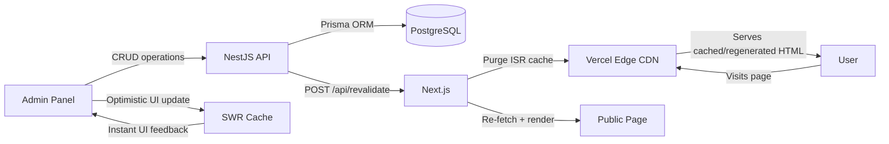
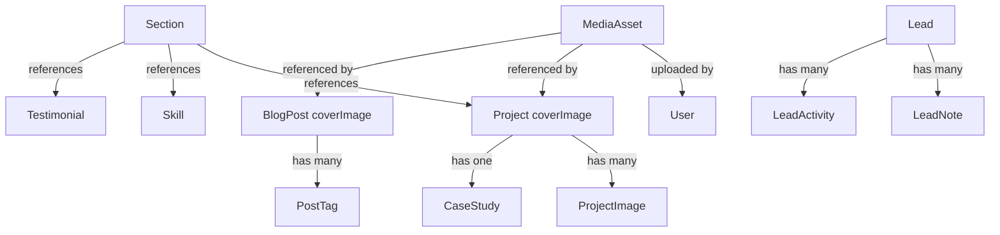

# CMS Architecture — Custom Headless Content Management System

> **Document:** `20-cms/CMS-ARCHITECTURE.md` | **Version:** 1.0 | **Last Updated:** July 2026
> **Status:** Active | **Stack:** NestJS + PostgreSQL + Next.js ISR
> **Related:** [ADMIN-ARCHITECTURE.md](../19-admin/ADMIN-ARCHITECTURE.md), [FRONTEND-ARCHITECTURE.md](../07-frontend/FRONTEND-ARCHITECTURE.md), [CONTENT-MODEL.md](../20-cms/CONTENT-MODEL.md)

---

## 1. Overview

The Portfolio CMS is a **headless content management system** built directly into the admin dashboard. There is no third-party CMS dependency (WordPress, Strapi, Sanity, etc.) — everything is custom-built on the existing stack.

Key architectural decisions:

| Decision | Choice | Rationale |
|----------|--------|-----------|
| CMS type | Headless (API-first) | Content is authored in the admin dashboard and served via API to any frontend |
| Content storage | PostgreSQL via Prisma | Single database, no external CMS database, consistent with the rest of the platform |
| Rich text storage | JSONB (Tiptap/ProseMirror JSON) | Structured editor output stored in JSONB columns, rendered as HTML on the frontend |
| Image storage | Supabase Storage + CDN | Images uploaded to Supabase Storage, served via Vercel Edge Network with CDN caching |
| Cache invalidation | On-demand ISR revalidation | Admin saves content -> API calls `revalidateTag()` -> Vercel CDN purges affected pages |
| Auth model | Same JWT as admin dashboard | No separate CMS auth — uses the existing `JwtAuthGuard` + `RolesGuard` |
| Validation | Zod + React Hook Form + NestJS ValidationPipe | Triple validation: shared Zod schemas in `packages/shared`, form validation on frontend, API validation on backend |

### 1.1 Data Flow



### 1.2 Architecture Principles

1. **Content authored once, served everywhere** — Content stored in PostgreSQL is consumed by both the public Next.js frontend and the admin dashboard
2. **ISR-first delivery** — Public pages use Incremental Static Regeneration (60s default revalidation) so content changes reflect within a minute without a full rebuild
3. **On-demand cache purge** — Publishing content triggers immediate ISR cache invalidation via a revalidation endpoint
4. **Defense in depth for validation** — Zod schemas in `packages/shared` are the source of truth; React Hook Form validates on input; NestJS `ValidationPipe` enforces on write
5. **Soft delete by default** — Deletions set `deleted_at` timestamps where the schema supports it; permanent hard delete is a separate explicit action

---

## 2. Content Model

### 2.1 Content Types

| Content Type | Prisma Model | API Endpoint (Portfolio) | API Endpoint (Admin) | Rendering Page | Cache Strategy |
|---|---|---|---|---|---|
| Section | `Section` | `GET /api/portfolio/sections` | `GET/POST/PATCH/DELETE /api/admin/sections` | Homepage (section builder) | ISR 60s |
| Project | `Project` | `GET /api/portfolio/projects` | `GET/POST/PATCH/DELETE /api/admin/projects` | Projects page + detail | ISR 60s (list), 300s (detail) |
| BlogPost | `BlogPost` | `GET /api/portfolio/blog` | `GET/POST/PATCH/DELETE /api/admin/blog` | Blog list + article | ISR 600s |
| CaseStudy | `CaseStudy` | `GET /api/portfolio/case-studies` | `GET/POST/PATCH/DELETE /api/admin/case-studies` | Project detail page | ISR 300s |
| Skill | `Skill` | `GET /api/portfolio/skills` | `GET/POST/PATCH/DELETE /api/admin/skills` | Homepage, About | ISR 60s |
| Experience | `Experience` | `GET /api/portfolio/experiences` | `GET/POST/PATCH/DELETE /api/admin/experiences` | About, Timeline | ISR 60s |
| Testimonial | `Testimonial` | `GET /api/portfolio/testimonials` | `GET/POST/PATCH/DELETE /api/admin/testimonials` | Homepage, About | ISR 60s |
| Service | `Service` | `GET /api/portfolio/services` | `GET/POST/PATCH/DELETE /api/admin/services` | Services page | ISR 60s |
| FAQ | `FAQ` | `GET /api/portfolio/faqs` | `GET/POST/PATCH/DELETE /api/admin/faqs` | Contact, About | ISR 60s |
| Lead | `Lead` | `POST /api/portfolio/leads` (public submit) | `GET/PATCH/DELETE /api/admin/leads` | Admin only | No cache (dynamic) |
| PressFeature | `PressFeature` | `GET /api/portfolio/press-features` | `GET/POST/PATCH/DELETE /api/admin/press-features` | About, Press | ISR 60s |
| GuestAppearance | `GuestAppearance` | `GET /api/portfolio/guest-appearances` | `GET/POST/PATCH/DELETE /api/admin/guest-appearances` | About, Press | ISR 60s |
| ReadingListItem | `ReadingListItem` | `GET /api/portfolio/reading-list` | `GET/POST/PATCH/DELETE /api/admin/reading-list` | About, Reading | ISR 60s |
| AvailabilityStatus | `AvailabilityStatus` | `GET /api/portfolio/availability` | `GET/PATCH /api/admin/availability` | Global (navbar/badge) | ISR 60s |

### 2.2 Content Relationships



### 2.3 JSONB Column Usage

Several content types use `Json` columns (`@db.JsonB` in PostgreSQL) for flexible, schema-less content:

| Model | JSONB Column | Purpose |
|-------|-------------|---------|
| `Section` | `style_config` | Visual styling overrides (background, padding, maxWidth, animation preset) |
| `Section` | `content` | Section-specific structured content (hero heading/CTA, about text, carousel items) |
| `Project` | `content` | Rich text project body (Tiptap JSON), feature highlights, extended description |
| `Project` | `metrics` | Key-value performance metrics (e.g., `{ "users": "10k+", "uptime": "99.9%" }`) |
| `BlogPost` | (N/A — content is plain text/String) | Blog content stored as HTML string from Tiptap |
| `MediaAsset` | `variants` | Responsive image variant URLs (e.g., `{ "thumb": "...", "medium": "...", "large": "..." }`) |
| `Lead` | `metadata` | Additional lead data (UTM params, referrer, page context) |
| `CaseStudy` | `metrics` | Impact metrics as structured data (e.g., `{ "performance_gain": "40%", "revenue": "$2M" }`) |

---

## 3. Content Authoring

### 3.1 Rich Text Editing (Tiptap)

All rich text content is authored through **Tiptap**, a ProseMirror-based WYSIWYG editor. The `RichTextEditor` component at `apps/web/src/components/admin/RichTextEditor.tsx` provides:

- **Toolbar:** Bold, Italic, Strike, Heading (H2/H3), Bullet List, Ordered List, Blockquote
- **Extensions:** StarterKit (paragraphs, headings, lists, code blocks), Link (clickable, configurable `openOnClick`), Image (inline), Placeholder
- **Output:** HTML string via `editor.getHTML()`
- **Storage:** Blog post `content` is stored as HTML text. Section content and project content use JSONB columns for structured Tiptap JSON where richer content modeling is needed.

### 3.2 Image Upload Pipeline

```
User selects file -> ImageUpload component -> POST /api/admin/media/upload (multipart)
  -> Multer middleware saves to local uploads/ with UUID filename
  -> MediaService.create() writes MediaAsset record to PostgreSQL
  -> Returns { data: { id, fileName, filePath, mimeType, fileSizeBytes } }
  -> CDN URL stored on content (cover_image, etc.)
```

The `ImageUpload` component at `apps/web/src/components/admin/ImageUpload.tsx` handles:
- Drag-and-drop or browse file selection
- Upload progress indication
- Preview of uploaded image
- Change/remove controls
- File type restriction to `image/*`

### 3.3 Section Editing

Sections are the building blocks of the homepage. Each section has:

| Field | Type | Description |
|-------|------|-------------|
| `section_key` | String (unique) | Internal identifier (e.g., `hero`, `about`, `projects`) |
| `section_label` | String | Display name shown in admin UI |
| `section_type` | String? | Categorization (e.g., `hero`, `about`, `projects`, `skills`) |
| `is_live` | Boolean | Visibility toggle |
| `style_preset` | String | Visual theme (default, minimal, bold, etc.) |
| `display_order` | Int | Position in the section sequence |
| `style_config` | JSONB | Visual overrides |
| `content` | JSONB | Section-specific content data |

Sections support drag-and-drop reordering via the `DraggableList` component and optimistic updates via SWR.

### 3.4 Form Validation Stack

Validation applies at three layers:

1. **Zod schemas** (`packages/shared/src/index.ts`) — Source of truth for field constraints. Each content type has a `Create*Schema` and `Update*Schema`.
2. **React Hook Form** (frontend) — Client-side validation using Zod resolver for immediate feedback.
3. **NestJS ValidationPipe** (backend) — Server-side validation with `whitelist: true` and `forbidNonWhitelisted: true` to strip unexpected fields.

---

## 4. Content Storage

### 4.1 Database Schema

All content is stored in PostgreSQL tables mapped through Prisma models in `apps/api/prisma/schema.prisma`. Key models for CMS content:

- **Section** — `sections` table with JSONB `style_config` and `content` columns
- **Project** — `projects` table with JSONB `content` and `metrics`, relation to `ProjectImage` and `CaseStudy`
- **BlogPost** — `blog_posts` table with HTML `content` string, GIN index on `tags` array
- **MediaAsset** — `media_assets` table with `variants` JSONB for responsive images

### 4.2 JSONB for Flexible Content

JSONB columns are used where the data shape varies per record:

- **Section content** — Each section type stores different data (hero has heading/subheading/CTA; about has bio text/image; projects has grid settings)
- **Project content/JSONB** — Stores Tiptap editor output as structured JSON, feature lists, extended descriptions
- **Project metrics** — Stores arbitrary performance/impact metrics as key-value pairs
- **MediaAsset variants** — Stores URLs for different image sizes generated during processing

### 4.3 Media Storage

Images are stored in **Supabase Storage** (bucket: `assets` by default). The `MediaAsset` model tracks:
- Original filename, path, bucket, MIME type, file size
- Image dimensions (width, height)
- Alt text
- Uploader reference
- Responsive variant URLs (stored in `variants` JSONB)
- Soft delete support via `deleted_at`

### 4.4 Soft Delete Strategy

Content types support a soft-delete pattern where applicable:

| Model | Soft Delete Field | Hard Delete Available |
|-------|-------------------|----------------------|
| `Lead` | `deleted_at` | No (privacy/compliance) |
| `MediaAsset` | `deleted_at` | Yes (admin-only) |
| `BlogPost` | No (hard delete standard) | Separate `DELETE /:id/hard` endpoint |

Soft-deleted records are excluded from portfolio (public) queries. Admin queries can optionally include deleted records for recovery purposes.

---

## 5. Content Delivery

### 5.1 ISR with On-Demand Revalidation

Public pages use Next.js **Incremental Static Regeneration (ISR)** with the following revalidation intervals:

| Page Route | ISR Revalidation | On-Demand Purge |
|------------|-----------------|-----------------|
| `/` (Homepage) | 60s | Yes — `revalidateTag('sections')` |
| `/projects` | 60s | Yes — `revalidateTag('projects')` |
| `/projects/[slug]` | 300s | Yes — `revalidateTag('projects')` |
| `/blog` | 600s | Yes — `revalidateTag('blog')` |
| `/blog/[slug]` | 600s | Yes — `revalidateTag('blog')` |

When admin saves content, the API calls the Next.js revalidation endpoint (`POST /api/revalidate`) with the affected cache tags. The revalidation endpoint:

```typescript
// POST /api/revalidate
// Headers: x-revalidate-secret
// Body: { tags: ["sections", "projects"] }
```

This triggers `revalidateTag()` for each tag, purging the Vercel Edge CDN cache for all pages using those tags.

### 5.2 API Response Envelope

All CMS API responses follow the standard envelope:

```typescript
// Single item
{ data: Section }

// Paginated list
{ data: Section[], meta: { page, per_page, total, total_pages, has_next_page, has_previous_page } }
```

### 5.3 Portfolio Controllers (Public, Cached)

Each content type has a **portfolio controller** that serves read-only, publicly cached data:

```typescript
// Pattern (from apps/api/src/portfolio/controllers/):
@Controller('portfolio/sections')
@UseInterceptors(CacheInterceptor) // Response caching
export class PortfolioSectionsController {
  @Get()
  async findAll() { return this.sectionsService.findAll(); }

  @Get(':key')
  async findOne(@Param('key') key: string) { return { data: await this.sectionsService.findByKey(key) }; }
}
```

Routes: `GET /api/portfolio/{entity}` — public, cached, no auth.

### 5.4 Admin Controllers (Authenticated, CRUD)

Each content type also has an **admin controller** that provides full CRUD with authentication:

```typescript
// Pattern (from apps/api/src/admin/controllers/):
@Controller('admin/sections')
@UseGuards(JwtAuthGuard, RolesGuard)
@ApiBearerAuth()
export class AdminSectionsController {
  @Get()     @Roles('admin', 'editor', 'viewer')
  async findAll() { ... }

  @Post()    @Roles('admin', 'editor')
  @Audit({ action: 'create', resource: 'section' })
  async create(@Body() dto: CreateSectionDto) { ... }

  @Patch(':id') @Roles('admin', 'editor')
  @Audit({ action: 'update', resource: 'section' })
  async update(@Param('id') id: string, @Body() dto: UpdateSectionDto) { ... }

  @Delete(':id') @Roles('admin')
  @Audit({ action: 'delete', resource: 'section' })
  async delete(@Param('id') id: string) { ... }
}
```

Routes: `GET/POST/PATCH/DELETE /api/admin/{entity}` — authenticated, audit-logged, role-gated.

---

## 6. Content Workflow

### 6.1 Blog Post Lifecycle

```
Draft ──> Published ──> Archived
           │
           └── Scheduled (future published_at)
```

- **Draft:** `is_published = false`, not visible on public site
- **Published:** `is_published = true` with `published_at` set. If `published_at` is in the future, the post is "Scheduled" and auto-publishes when the timestamp passes
- **Archived:** Handled via unpublish (`PATCH /:id/unpublish`) which sets `is_published = false`

Endpoints for blog lifecycle:
- `PATCH /api/admin/blog/:id/publish` — Publish immediately
- `PATCH /api/admin/blog/:id/unpublish` — Unpublish (return to draft)
- Scheduled publishing is handled by checking `published_at` in the blog service

### 6.2 Project Lifecycle

```
Draft ──> Published ──> Featured (optional)
                │
                └── Private (NDA-protected)
```

- Projects have `is_private` for NDA-protected projects — only title and NDA badge are shown publicly
- `is_featured` highlights the project on the homepage
- `nda_password` enables a password-protected view for private projects

### 6.3 Section Lifecycle

```
Inactive ──> Live (is_live = true) ──> Reorder (drag-and-drop)
```

- Sections are toggled live/inactive via the `is_live` boolean
- Display order is managed via drag-and-drop with auto-save
- Sections marked `is_always_visible` (e.g., Hero) cannot be hidden

### 6.4 Workflow Philosophy

There is **no multi-stage approval workflow**. The CMS follows a simple publish/unpublish model:

- **Admin role:** Full control — create, publish, unpublish, delete
- **Editor role:** Can create/edit content and toggle publish state, but cannot delete or manage users
- **Viewer role:** Read-only access to all content

This simplicity is intentional — the portfolio is a single-owner site; complex approval pipelines would be overengineering.

---

## 7. Admin CMS Components

The admin CMS interface is built from the following components in `apps/web/src/components/admin/`:

| Component | File | Purpose |
|-----------|------|---------|
| `RichTextEditor` | `RichTextEditor.tsx` | Tiptap-based WYSIWYG editor for blog posts and descriptions |
| `ImageUpload` | `ImageUpload.tsx` | Drag-and-drop image upload with preview |
| `FileUpload` | `FileUpload.tsx` | Generic file upload component |
| `BlogForm` | `BlogForm.tsx` | Blog post creation/editing form |
| `ProjectForm` | `ProjectForm.tsx` | Project creation/editing form with tech stack, NDA toggle |
| `SkillForm` | `SkillForm.tsx` | Skill entry form with proficiency slider |
| `TestimonialForm` | `TestimonialForm.tsx` | Testimonial form with rating and avatar |
| `DataTable` | `DataTable.tsx` | Sortable, filterable data table for content lists |
| `DraggableList` | `DraggableList.tsx` | Drag-and-drop reorderable list for sections |
| `AnalyticsCharts` | `AnalyticsCharts.tsx` | Dashboard analytics visualizations |
| `AIAnalysisPanel` | `AIAnalysisPanel.tsx` | AI-powered content analysis panel |

---

## 8. Security & Audit

### 8.1 Access Control

| Role | View Content | Create/Edit | Publish/Toggle | Delete | Manage Users |
|------|-------------|-------------|----------------|--------|-------------|
| Admin | Yes | Yes | Yes | Yes | Yes |
| Editor | Yes | Yes | Yes | No | No |
| Viewer | Yes | No | No | No | No |

Role enforcement uses `@Roles()` decorator on each admin controller route, implemented in `RolesGuard`.

### 8.2 Audit Logging

All mutation operations on CMS content are logged via the `@Audit()` decorator:

```typescript
@Audit({ action: 'create', resource: 'blog' })
@Audit({ action: 'update', resource: 'project' })
@Audit({ action: 'delete', resource: 'section' })
@Audit({ action: 'publish', resource: 'blog' })
@Audit({ action: 'upload', resource: 'media' })
```

Each audit record captures: actor ID, action, resource type, record ID, old/new values (for updates), IP address, correlation ID, and timestamp. Records are stored in the `audit_logs` table.

### 8.3 Revalidation Security

The ISR revalidation endpoint (`POST /api/revalidate`) is protected by a shared secret (`x-revalidate-secret` header), preventing external cache purging.
