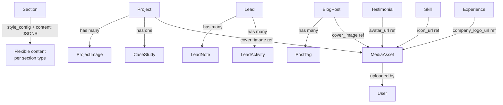

# Content Model Reference

> **Document:** `20-cms/CONTENT-MODEL.md` | **Version:** 1.0 | **Last Updated:** July 2026
> **Status:** Active
> **Related:** [CMS-ARCHITECTURE.md](CMS-ARCHITECTURE.md), [Prime schema](../../apps/api/prisma/schema.prisma)

---

## Relationship Map

---

## Content Types

### Section

| Field | Type | Required | Editable | Description |
|-------|------|----------|----------|-------------|
| `id` | UUID | Auto | No | Primary key |
| `section_key` | String (unique) | Yes | Yes | Internal identifier, snake_case (e.g. `hero`, `about_me`) |
| `section_label` | String | Yes | Yes | Display name in admin UI (e.g. "About Me") |
| `section_type` | String | No | Yes | Section category (`hero`, `about`, `projects`, `skills`, `experience`, `testimonials`, `services`, `contact`) |
| `is_live` | Boolean | Yes | Yes | Visibility toggle (public: visible when true) |
| `style_preset` | String | Yes (default: `default`) | Yes | Visual theme preset |
| `display_order` | Int | Yes (default: 0) | Yes | Position in homepage sequence |
| `min_items` | Int | Yes (default: 1) | Yes | Minimum child items required |
| `auto_publish` | Boolean | Yes (default: false) | Yes | Auto-publish child content |
| `is_always_visible` | Boolean | Yes (default: false) | Yes | Cannot be hidden (e.g. Hero) |
| `style_config` | JSONB | Yes (default: `{}`) | Yes | Visual overrides (background, padding, maxWidth, animation) |
| `content` | JSONB | Yes (default: `{}`) | Yes | Section-specific structured data |
| `created_at` | DateTime | Auto | No | Creation timestamp |
| `updated_at` | DateTime | Auto | No | Last update timestamp |

**Purpose:** Controls the building blocks of the homepage. Each section represents a distinct visual block with its own content, styling, and position.

**Rendering:** Sections are rendered in `display_order` sequence on the homepage. The section type determines which React component renders it (e.g., `HeroSection` for type `hero`).

---

### Project

| Field | Type | Required | Editable | Description |
|-------|------|----------|----------|-------------|
| `id` | UUID | Auto | No | Primary key |
| `slug` | String (unique) | Yes | Yes | URL-friendly identifier (e.g. `my-react-app`) |
| `title` | String | Yes | Yes | Project name |
| `description` | String | No | Yes | Rich text project description (Tiptap HTML or plain text) |
| `tech_stack` | String[] | Yes (default: []) | Yes | Technologies used (displayed as badges) |
| `live_url` | String | No | Yes | URL to live/deployed project |
| `github_url` | String | No | Yes | Source code repository URL |
| `cover_image` | String | No | Yes | Hero/cover image URL |
| `thumbnail_url` | String | No | Yes | Card thumbnail image URL |
| `is_featured` | Boolean | Yes (default: false) | Yes | Highlight on homepage |
| `is_private` | Boolean | Yes (default: false) | Yes | NDA-protected — only title visible publicly |
| `nda_password` | String | No | Yes | Password for NDA-protected access |
| `category` | String | No | Yes | Project category (`web`, `mobile`, `ai`, `devops`, `design`, `other`) |
| `display_order` | Int | Yes (default: 0) | Yes | Sort position |
| `content` | JSONB | Yes (default: `{}`) | Yes | Extended content (Tiptap JSON, feature list) |
| `metrics` | JSONB | Yes (default: `{}`) | Yes | Key-value impact metrics |
| `created_at` | DateTime | Auto | No | Creation timestamp |
| `updated_at` | DateTime | Auto | No | Last update timestamp |

**Relationships:** Has many `ProjectImage` (gallery images). Has one `CaseStudy`.

**Rendering:** Featured projects appear on homepage. All projects appear on `/projects` page. Individual project pages at `/projects/[slug]`.

---

### BlogPost

| Field | Type | Required | Editable | Description |
|-------|------|----------|----------|-------------|
| `id` | UUID | Auto | No | Primary key |
| `slug` | String (unique) | Yes | Yes | URL-friendly identifier |
| `title` | String | Yes | Yes | Blog post title |
| `excerpt` | String | No | Yes | Short summary for cards and SEO |
| `content` | String | Yes (default: "") | Yes | HTML content from Tiptap editor |
| `cover_image` | String | No | Yes | Featured image URL |
| `category` | String | No | Yes | Post category (e.g. "Technology", "Design") |
| `tags` | String[] | Yes (default: []) | Yes | Keywords (GIN-indexed for search) |
| `author_name` | String | Yes (default: "Admin") | Yes | Display author name |
| `read_time_minutes` | Int | Yes (default: 5) | Yes | Estimated reading time |
| `is_published` | Boolean | Yes (default: false) | Yes | Published state |
| `is_featured` | Boolean | Yes (default: false) | Yes | Featured/post highlight |
| `seo_title` | String | No | Yes | Custom SEO title (overrides page default) |
| `seo_description` | String | No | Yes | Meta description for search results |
| `published_at` | DateTime | No | Yes | Publish timestamp (future = scheduled) |
| `created_at` | DateTime | Auto | No | Creation timestamp |
| `updated_at` | DateTime | Auto | No | Last update timestamp |

**Relationships:** Has many `PostTag` (normalized tags).

**Rendering:** Published posts on `/blog` page. Individual articles at `/blog/[slug]`. ISR at 600s.

**Workflow:** Draft (`is_published: false`) → Published (`is_published: true`) → Scheduled (future `published_at`).

---

### CaseStudy

| Field | Type | Required | Editable | Description |
|-------|------|----------|----------|-------------|
| `id` | UUID | Auto | No | Primary key |
| `project_id` | UUID | Yes | No | Links to parent Project |
| `challenge` | String | No | Yes | Problem statement |
| `approach` | String | No | Yes | Methodology and process |
| `solution` | String | No | Yes | Technical solution description |
| `impact` | String | No | Yes | Results and outcomes |
| `architecture_diagrams` | String[] | Yes (default: []) | Yes | URLs to architecture diagrams |
| `code_snippets` | String[] | Yes (default: []) | Yes | URLs to code snippets/gists |
| `metrics` | JSONB | Yes (default: `{}`) | Yes | Key impact metrics (structured) |
| `created_at` | DateTime | Auto | No | Creation timestamp |
| `updated_at` | DateTime | Auto | No | Last update timestamp |

**Purpose:** In-depth technical case study attached to a project. Rendered on the project detail page.

**Relationships:** Belongs to one `Project`. Cascade-deleted with the parent project.

---

### Skill

| Field | Type | Required | Editable | Description |
|-------|------|----------|----------|-------------|
| `id` | UUID | Auto | No | Primary key |
| `name` | String | Yes | Yes | Skill name (e.g. "TypeScript") |
| `category` | String | Yes | Yes | Grouping category (e.g. "Frontend", "Backend") |
| `proficiency` | Int | Yes (default: 0) | Yes | Proficiency level 0–100 |
| `icon_url` | String | No | Yes | Icon image URL |
| `lottie_url` | String | No | Yes | Lottie animation URL |
| `display_order` | Int | Yes (default: 0) | Yes | Sort position within category |
| `is_featured` | Boolean | Yes (default: false) | Yes | Highlight on homepage |
| `created_at` | DateTime | Auto | No | Creation timestamp |
| `updated_at` | DateTime | Auto | No | Last update timestamp |

**Rendering:** Skills grouped by `category` on About/Homepage. Displayed as proficiency bars or grid items.

---

### Experience

| Field | Type | Required | Editable | Description |
|-------|------|----------|----------|-------------|
| `id` | UUID | Auto | No | Primary key |
| `company` | String | Yes | Yes | Organization name |
| `role` | String | Yes | Yes | Job title |
| `description` | String | No | Yes | Rich text description of responsibilities |
| `technologies` | String[] | Yes (default: []) | Yes | Technologies used in this role |
| `company_logo_url` | String | No | Yes | Company logo image URL |
| `company_url` | String | No | Yes | Company website URL |
| `location` | String | No | Yes | Work location (city, remote, hybrid) |
| `start_date` | DateTime | Yes | Yes | Employment start date |
| `end_date` | DateTime | No | Yes | Employment end date (null = current) |
| `is_current` | Boolean | Yes (default: false) | Yes | Currently employed here |
| `display_order` | Int | Yes (default: 0) | Yes | Sort position |
| `is_visible` | Boolean | Yes (default: true) | Yes | Show/hide on portfolio |
| `created_at` | DateTime | Auto | No | Creation timestamp |
| `updated_at` | DateTime | Auto | No | Last update timestamp |

**Rendering:** Chronological timeline on About page. Current positions appear at the top.

---

### Testimonial

| Field | Type | Required | Editable | Description |
|-------|------|----------|----------|-------------|
| `id` | UUID | Auto | No | Primary key |
| `name` | String | Yes | Yes | Person's name |
| `role` | String | Yes | Yes | Job title |
| `company` | String | Yes | Yes | Organization |
| `avatar_url` | String | No | Yes | Avatar image URL |
| `content` | String | Yes | Yes | Testimonial text |
| `rating` | Int | Yes (default: 5) | Yes | Star rating 1–5 |
| `display_order` | Int | Yes (default: 0) | Yes | Sort position |
| `is_verified` | Boolean | Yes (default: false) | Yes | Verification badge |
| `is_featured` | Boolean | Yes (default: false) | Yes | Highlight on homepage |
| `is_visible` | Boolean | Yes (default: true) | Yes | Show/hide on portfolio |
| `created_at` | DateTime | Auto | No | Creation timestamp |
| `updated_at` | DateTime | Auto | No | Last update timestamp |

**Rendering:** Carousel or grid on homepage/About page.

---

### Service

| Field | Type | Required | Editable | Description |
|-------|------|----------|----------|-------------|
| `id` | UUID | Auto | No | Primary key |
| `title` | String | Yes | Yes | Service name (e.g. "Web Development") |
| `description` | String | Yes | Yes | Service description |
| `icon` | String | Yes (default: emoji) | Yes | Icon identifier |
| `features` | String[] | Yes (default: []) | Yes | Feature bullet points |
| `pricing_tier` | String | No | Yes | Pricing tier name |
| `price_cents` | Int | No | Yes | Price in cents |
| `cta_text` | String | No | Yes | Call-to-action button text |
| `cta_url` | String | No | Yes | Call-to-action link URL |
| `display_order` | Int | Yes (default: 0) | Yes | Sort position |
| `is_active` | Boolean | Yes (default: true) | Yes | Show/hide on portfolio |
| `created_at` | DateTime | Auto | No | Creation timestamp |
| `updated_at` | DateTime | Auto | No | Last update timestamp |

**Rendering:** Service cards on Services page.

---

### FAQ

| Field | Type | Required | Editable | Description |
|-------|------|----------|----------|-------------|
| `id` | UUID | Auto | No | Primary key |
| `question` | String | Yes | Yes | FAQ question |
| `answer` | String | Yes | Yes | FAQ answer (rich text) |
| `category` | String | No | Yes | Grouping category |
| `display_order` | Int | Yes (default: 0) | Yes | Sort position |
| `is_visible` | Boolean | Yes (default: true) | Yes | Show/hide on portfolio |
| `created_at` | DateTime | Auto | No | Creation timestamp |
| `updated_at` | DateTime | Auto | No | Last update timestamp |

**Rendering:** Accordion on Contact/About page. ARIA-expanded/controls for accessibility.

---

### Lead

| Field | Type | Required | Editable | Description |
|-------|------|----------|----------|-------------|
| `id` | UUID | Auto | No | Primary key |
| `name` | String | Yes | No (user-submitted) | Sender name |
| `email` | String | Yes | No (user-submitted) | Sender email |
| `phone` | String | No | No (user-submitted) | Phone number |
| `company` | String | No | No (user-submitted) | Organization |
| `subject` | String | No | No (user-submitted) | Message subject |
| `message` | String | Yes | No (user-submitted) | Message body |
| `source` | String | Yes (default: `contact_form`) | Yes (admin) | Origin (`contact_form`, `ai_chat`, `referral`, `direct`) |
| `status` | String | Yes (default: `new`) | Yes (admin) | Pipeline status (`new`, `read`, `replied`, `converted`, `archived`) |
| `priority` | String | Yes (default: `normal`) | Yes (admin) | Priority (`low`, `normal`, `high`, `urgent`) |
| `ip_address` | String | No | No | Submitter IP (anti-spam) |
| `metadata` | JSONB | Yes (default: `{}`) | No | UTM params, referrer, page context |
| `deleted_at` | DateTime | No | Yes (admin) | Soft delete timestamp |
| `created_at` | DateTime | Auto | No | Creation timestamp |
| `updated_at` | DateTime | Auto | No | Last update timestamp |

**Relationships:** Has many `LeadNote` (admin notes), has many `LeadActivity` (status change history).

**Rendering:** Admin only — lead management dashboard.

---

### PressFeature

| Field | Type | Required | Editable | Description |
|-------|------|----------|----------|-------------|
| `id` | UUID | Auto | No | Primary key |
| `publication` | String | Yes | Yes | Publication name |
| `title` | String | Yes | Yes | Article title |
| `url` | String | No | Yes | Article URL |
| `logo_url` | String | No | Yes | Publication logo |
| `description` | String | No | Yes | Summary/quote |
| `featured_date` | DateTime | No | Yes | Date of publication |
| `display_order` | Int | Yes (default: 0) | Yes | Sort position |
| `created_at` | DateTime | Auto | No | Creation timestamp |

### GuestAppearance

| Field | Type | Required | Editable | Description |
|-------|------|----------|----------|-------------|
| `id` | UUID | Auto | No | Primary key |
| `type` | String | Yes | Yes | Podcast, interview, talk, webinar |
| `title` | String | Yes | Yes | Episode/presentation title |
| `host` | String | No | Yes | Host or organizer |
| `url` | String | No | Yes | Link to recording |
| `cover_image_url` | String | No | Yes | Episode cover art |
| `description` | String | No | Yes | Summary |
| `appearance_date` | DateTime | No | Yes | Date of appearance |
| `display_order` | Int | Yes (default: 0) | Yes | Sort position |
| `created_at` | DateTime | Auto | No | Creation timestamp |

### ReadingListItem

| Field | Type | Required | Editable | Description |
|-------|------|----------|----------|-------------|
| `id` | UUID | Auto | No | Primary key |
| `title` | String | Yes | Yes | Book/article title |
| `author` | String | No | Yes | Author name |
| `url` | String | No | Yes | Link to resource |
| `cover_image_url` | String | No | Yes | Book cover image |
| `category` | String | No | Yes | Topic category |
| `recommendation` | String | No | Yes | Personal note/recommendation |
| `display_order` | Int | Yes (default: 0) | Yes | Sort position |
| `created_at` | DateTime | Auto | No | Creation timestamp |

### AvailabilityStatus

| Field | Type | Required | Editable | Description |
|-------|------|----------|----------|-------------|
| `id` | UUID | Auto | No | Primary key |
| `is_available` | Boolean | Yes (default: true) | Yes | Available for new opportunities |
| `status_label` | String | Yes (default: "Available") | Yes | Display text (e.g. "Open to work") |
| `available_until` | String | No | Yes | Availability end date |
| `preferred_contact` | String | Yes (default: "email") | Yes | Preferred contact method |
| `updated_at` | DateTime | Auto | No | Last update timestamp |

**Rendering:** Global badge in navbar/header. Single-record table (only one active record).

---

## Field Classification Legend

| Marker | Meaning |
|--------|---------|
| **Auto** | Set by the system (UUID generation, timestamps) |
| **Yes** | Required at creation; must have a value |
| **No** | Optional field; can be null |
| **Yes (admin)** | Editable by admin users in the dashboard |
| **No (user-submitted)** | Set by the public user who submitted the data |
