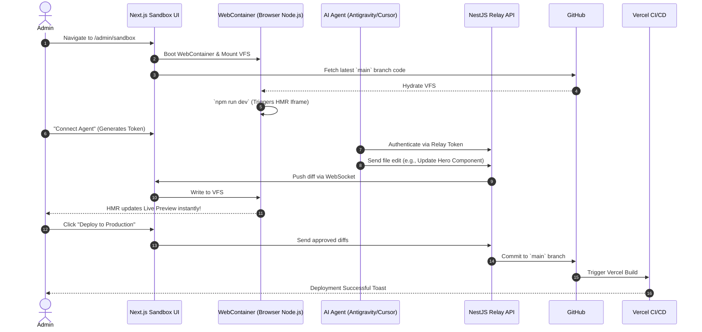

# AI-Powered Sandbox IDE & Multi-Agent Orchestration

> **Document:** `features/Sandbox-AI-IDE.md` | **Version:** 1.0 | **Phase:** 4 (Architecture Upgrade)
> **Status:** 🏗️ In Design | **Owner:** System Architect
> **Core Concept:** A "Lovable-style" in-browser development environment powered by WebContainers, allowing seamless collaboration with external AI agents (Antigravity, Cursor, Claude Code) and direct GitOps deployment.

---

## 1. Executive Summary

The Phase 4 architecture introduces a paradigm shift in how the portfolio is maintained. Instead of relying solely on local development environments or raw CMS forms, administrators have access to an **Enterprise Sandbox IDE** directly at `/admin/sandbox`.

This environment boots a full Node.js runtime inside the browser using `@webcontainer/api`. It provides a split-pane interface (Code Editor + Live Preview) and, crucially, establishes a **Multi-Agent Connectivity Bridge**. This bridge allows the admin to pair-program with advanced AI agents (like Antigravity, Claude Code, or Cursor) directly within the live portfolio, preview changes instantly via Hot Module Replacement (HMR), and deploy to production via a seamless GitHub integration.

---

## 2. Core Capabilities & Innovation

To make this truly enterprise-grade and fill the technical gaps of standard browser IDEs, the system implements the following core concepts:

### A. The Multi-Agent Orchestration Bridge

_How do external tools like Cursor or Antigravity connect to a browser?_

- **The Gap:** Browser security sandboxes prevent external desktop applications (like Cursor or Claude Code CLI) from directly editing the browser's Virtual File System (VFS).
- **The Enterprise Solution:** We introduce a **WebSocket Relay Proxy** in the NestJS backend.
  - The browser IDE connects to the NestJS WebSocket.
  - The Admin can generate a temporary "Agent Connection Token".
  - External tools (like Antigravity) can connect to this proxy API. When Antigravity proposes a file change, the proxy forwards the diff to the WebContainer VFS in real-time.

### B. Ephemeral State & IndexedDB Caching

- **The Gap:** WebContainers are ephemeral; refreshing the page destroys the `node_modules` and local edits.
- **The Enterprise Solution:**
  - **Code State:** Continuous delta-sync to browser `IndexedDB`. If the tab crashes, the unsaved state is restored instantly.
  - **Dependency Cache:** A Service Worker caches the `node_modules` installation, reducing WebContainer boot time from 40 seconds to < 5 seconds on subsequent loads.

### C. GitOps "One-Click" Deployment

- **The Concept:** The Sandbox does not deploy directly to Vercel/Railway. It treats **GitHub as the single source of truth**.
- **The Flow:** When the Admin clicks "Approve & Deploy", the system bundles the VFS diffs, uses a securely vaulted GitHub Personal Access Token (PAT) via the NestJS API, and creates a commit on the `main` branch. This triggers the standard, rigorous CI/CD pipeline, ensuring zero bypasses of production security checks.

---

## 3. End-to-End User Flow (The "Lovable" Experience)

---

## 4. Enterprise Security & Guardrails

> [!CAUTION]
> Running arbitrary Node.js code and AI-generated code in the browser introduces significant XSS and supply-chain risks.

To mitigate these risks, the architecture enforces:

1. **Strict Cross-Origin Isolation:** The `/admin/sandbox` route is heavily protected by `Cross-Origin-Embedder-Policy: require-corp` and `Cross-Origin-Opener-Policy: same-origin`.
2. **NestJS JWT Validation:** The WebSocket relay and GitHub commit endpoints require the custom NestJS Passport.js JWT (Role: `admin`).
3. **Syntax Pre-Check:** Before the "Deploy" button is enabled, the WebContainer runs a background `npm run typecheck` and `npm run lint`. The AI cannot force a broken build into GitHub.
4. **One-Click Rollback:** The UI maintains a history of the last 5 GitHub SHAs, allowing the admin to instantly revert the `main` branch if an AI-generated deployment behaves unexpectedly in production.

---

## 5. Implementation Gaps to Solve

If we are to build this tomorrow, the engineering team must resolve:

1. **Memory Constraints:** WebContainers can consume 1-2GB of RAM. We must ensure the Next.js frontend is heavily optimized and unmounts the 3D Canvas (Three.js/GSAP) while the IDE is active to prevent browser OOM (Out of Memory) crashes.
2. **Agent Context Windows:** Sending the entire Monorepo to an external AI agent via the Relay API is too large. We need to implement a **Local RAG (Retrieval-Augmented Generation)** inside the browser using a lightweight vector store (like `hnswlib-wasm`) to only send relevant files to the Agent.

---

## 6. Acceptance Criteria

- [ ] Sandbox boots in < 10 seconds using IndexedDB caching.
- [ ] External agents can connect via a Secure WebSocket Relay.
- [ ] Code changes reflect in the iframe Preview via HMR in < 1 second.
- [ ] Deployment commits directly to GitHub without exposing the PAT to the client browser.
- [ ] System automatically rejects commits that fail TypeScript compilation.

---

## Cross-References

| Reference                                                            | Description                       |
| -------------------------------------------------------------------- | --------------------------------- |
| [MASTER-INDEX.md](../MASTER-INDEX.md)                                | Documentation master index        |
| [CROSS-REFERENCE-INDEX.md](../26-reference/CROSS-REFERENCE-INDEX.md) | Cross-reference mapping           |
| [CMS-ARCHITECTURE.md](CMS-ARCHITECTURE.md)                           | CMS architecture overview         |
| [CONTENT-MODEL.md](CONTENT-MODEL.md)                                 | Content model reference           |
| [IMAGE-MANAGEMENT.md](IMAGE-MANAGEMENT.md)                           | Image management and optimization |
| [FRONTEND-ARCHITECTURE.md](../07-frontend/FRONTEND-ARCHITECTURE.md)  | Frontend architecture             |
| [17-AI_INSTRUCTIONS.md](../08-ai/17-AI_INSTRUCTIONS.md)              | AI agent instructions             |
