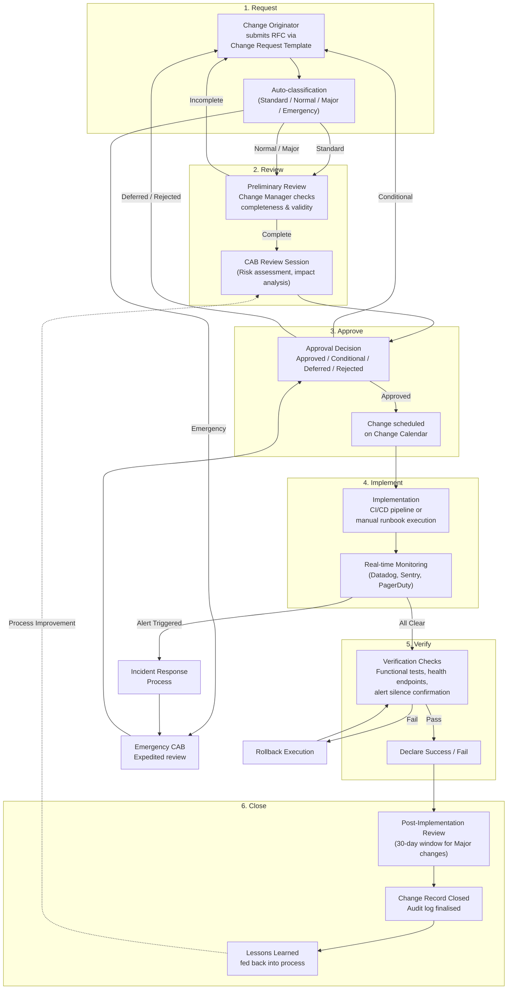
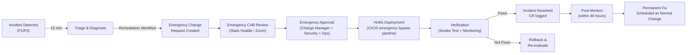

# Change Management Process — Enterprise ITIL-Aligned Framework

> **Document:** `57-CHANGE-MANAGEMENT.md` | **Version:** 1.0 | **Last Updated:** June 2026  
> **Status:** ✅ Active | **Owner:** Enterprise Change Manager | **Review Cadence:** Monthly  
> **Related:** [53-CI-CD-PIPELINE.md](./53-CI-CD-PIPELINE.md) | [54-INFRASTRUCTURE.md](./54-INFRASTRUCTURE.md) | [DeploymentGuide.md](./DeploymentGuide.md) | [52-TESTING-STRATEGY.md](./52-TESTING-STRATEGY.md)

---

## Table of Contents

1. [Executive Summary](#1-executive-summary)
2. [Change Classification](#2-change-classification)
3. [Change Advisory Board (CAB)](#3-change-advisory-board-cab)
4. [Change Process Flow](#4-change-process-flow)
5. [Change Request Template](#5-change-request-template)
6. [Emergency Change Process](#6-emergency-change-process)
7. [Change Calendar & Freeze Periods](#7-change-calendar--freeze-periods)
8. [Risk Assessment Matrix](#8-risk-assessment-matrix)
9. [Post-Implementation Review](#9-post-implementation-review)
10. [Enterprise Standards Alignment](#10-enterprise-standards-alignment)
11. [Change Log](#11-change-log)

---

## 1. Executive Summary

Change Management governs the lifecycle of all infrastructure, application, configuration, and data changes within the Portfolio Platform. This framework ensures that every change is **assessed, approved, tested, implemented, and reviewed** in a controlled manner that minimises incident risk while enabling rapid delivery.

### 1.1 Scope

| In Scope | Out of Scope |
|----------|-------------|
| Application code deployments (frontend, backend, AI services) | Routine password resets |
| Infrastructure changes (cloud resources, networking, DNS) | Standard operating procedure execution |
| Database schema migrations and data patches | User self-service profile updates |
| Configuration changes (feature flags, env vars, secrets) | Day-to-day monitoring alert tuning |
| Third-party service integrations and API version upgrades | Procurement and vendor onboarding |
| Security patches and hotfixes | Organisational restructuring |

### 1.2 Guiding Principles

1. **Risk-based decision making** — Every change is classified and approved proportionally to its risk.
2. **Automation first** — Where possible, changes are codified, tested, and deployed through CI/CD pipelines.
3. **Auditability** — Every change is logged with traceable metadata for compliance and post-mortem analysis.
4. **Zero-downtime by default** — Production changes must not degrade end-user experience except under explicit emergency circumstances.

---

## 2. Change Classification

Every change request is assigned a **category** and an **urgency** that determines the approval path, testing rigour, and implementation window.

### 2.1 Change Categories

| Category | Definition | Examples | Approval Authority | Target Lead Time |
|----------|-----------|---------|-------------------|:----------------:|
| **Standard** | Pre-approved, low-risk, repeatable changes following a documented procedure | Database migration execution, CI/CD pipeline update, env var rotation | Pre-authorized via CAB | Automated / < 1 hour |
| **Normal** | Changes requiring formal review but not urgent | Feature release, API version bump, new integration deployment | CAB Chair | 5 business days |
| **Major** | High-risk, high-impact, or cross-cutting changes affecting multiple systems | Architecture refactor, database sharding, auth provider swap, cloud region migration | Full CAB | 10 business days |
| **Emergency** | Urgent changes required to resolve a production incident or security vulnerability | Hotfix, security patch, certificate renewal, rollback | Emergency CAB (ECAB) | < 4 hours |

### 2.2 Urgency Tiers

| Tier | Definition | Response SLA | Resolution Goal |
|------|-----------|:------------:|:---------------:|
| **P1 — Critical** | Full platform outage or active data breach | Immediate | < 1 hour |
| **P2 — High** | Major feature degradation affecting > 10% of users | 15 minutes | < 4 hours |
| **P3 — Medium** | Isolated feature impairment, no data loss | 1 hour | < 24 hours |
| **P4 — Low** | Cosmetic issue, minor bug, or enhancement request | 1 business day | Next release |

---

## 3. Change Advisory Board (CAB)

The CAB provides governance and oversight for all change activity. Membership reflects a cross-functional representation of engineering, operations, security, and product.

### 3.1 CAB Roles & Responsibilities

| Role | Responsibility | Voting Power |
|------|---------------|:------------:|
| **Change Manager** (Chair) | Facilitates CAB meetings, enforces process, maintains change calendar | Tie-breaker |
| **Lead Architect** | Assesses technical impact, architecture fit, and backward compatibility | Yes |
| **Security Lead** | Reviews security implications, threat model changes, compliance requirements | Yes |
| **Operations Lead** | Evaluates operational readiness, monitoring coverage, rollback procedures | Yes |
| **Product Owner** | Represents business priority, stakeholder communication, UAT sign-off | Yes |
| **QA Lead** | Validates test coverage, regression plan, and environment strategy | Advisory |
| **Engineering Lead** | Provides implementation timeline, resource estimate, and risk mitigation | Yes |

### 3.2 Review Cadence

| Meeting Type | Frequency | Duration | Quorum | Agenda |
|-------------|-----------|:--------:|:------:|--------|
| **Regular CAB** | Every Monday & Thursday | 30 minutes | Chair + 3 voting members | Review Normal changes, approve Standard change templates, review past PIRs |
| **Major Change Review** | Bi-weekly Friday | 60 minutes | Full CAB | Deep-dive on Major changes, architecture review, dependency mapping |
| **Emergency CAB** | On-demand (P1/P2 incidents) | As needed | Chair + Security + Ops | Review and approve Emergency changes, coordinate fix-forward and rollback |

### 3.3 CAB Decision Outcomes

| Outcome | Description |
|---------|-------------|
| **Approved** | Change may proceed as planned |
| **Approved with Conditions** | Change approved contingent on specific remediations (e.g., "Add monitoring before deploy") |
| **Deferred** | Change requires further information or redesign; resubmit to next CAB |
| **Rejected** | Change denied due to risk, misalignment, or incomplete scope. Must be re-justified for reconsideration |

---

## 4. Change Process Flow

The end-to-end change lifecycle follows a six-stage pipeline: **Request → Review → Approve → Implement → Verify → Close**.

### 4.1 Gate Criteria per Stage

| Stage | Entry Criteria | Exit Criteria |
|-------|---------------|---------------|
| **Request** | Identified need for change | Complete RFC with classification |
| **Review** | Complete RFC submitted to CAB | Risk assessed, impact documented |
| **Approve** | CAB review completed | Decision recorded in CR log |
| **Implement** | Approved CR + schedule slot + rollback plan | Change deployed to target environment |
| **Verify** | Deployment completed | Test results green, metrics stable |
| **Close** | PIR completed (if Major) | All documentation updated, CR closed |

---

## 5. Change Request Template

### 5.1 RFC Form Fields

Every change must be submitted using the following structured template:

| Field | Description | Required | Classification Applicability |
|-------|-------------|:--------:|:---------------------------:|
| **CR ID** | Auto-generated unique identifier (CR-YYYY-NNNN) | Auto | All |
| **Title** | Concise, descriptive change title | Yes | All |
| **Originator** | Name, team, and contact of the requestor | Yes | All |
| **Date Submitted** | Timestamp of RFC creation | Auto | All |
| **Classification** | Standard / Normal / Major / Emergency | Yes | All |
| **Category** | Application / Infrastructure / Database / Security / Configuration / Third-Party | Yes | All |
| **Description** | Detailed description of what is changing and why | Yes | All |
| **Justification** | Business or technical rationale | Yes | All |
| **Scope** | List of systems, services, and components affected | Yes | All |
| **Implementation Plan** | Step-by-step runbook or CI/CD pipeline link | Yes | All |
| **Rollback Plan** | Specific steps to revert the change | Yes | All |
| **Test Plan** | Unit, integration, E2E, and smoke test coverage | Yes | All |
| **Risk Assessment** | Risk score (see Section 8) | Yes | All |
| **Dependencies** | Pre-requisite changes, third-party releases, or external teams | Conditional | Normal, Major |
| **Communication Plan** | Stakeholder notification strategy and timing | Conditional | Major |
| **Change Window** | Proposed implementation date/time and duration | Yes | All |
| **CAB Decision** | Approved / Conditional / Deferred / Rejected | Auto | All |

### 5.2 Submission Channels

| Channel | Applicable Types | SLA |
|---------|:----------------:|:---:|
| **GitHub Issue** (RFC template in `.github/ISSUE_TEMPLATE/change-request.md`) | Standard, Normal, Major | 24h to acknowledge |
| **PagerDuty Incident** (auto-escalation for P1/P2) | Emergency | 15 min to respond |
| **CAB Meeting Agenda** (submission via Change Manager) | Major | 48h before CAB |

---

## 6. Emergency Change Process

Emergency changes bypass the standard CAB cadence but require **retrospective approval** within 24 hours.

### 6.1 Emergency Change Trigger Criteria

- **Production outage** (P1/P2 incident) requiring immediate remediation.
- **Active security vulnerability** (CVSS >= 7.0) with exploit in the wild.
- **Data integrity issue** causing active data loss or corruption.
- **Critical compliance deadline** (e.g., certificate expiry within 24 hours).

### 6.2 Emergency Change Flow

### 6.3 Emergency CI/CD Bypass Pipeline

The emergency pipeline is an independent workflow that skips long-running quality gates:

| Feature | Standard Pipeline | Emergency Pipeline |
|---------|:-----------------:|:------------------:|
| Lint & Format | Required | Skipped |
| Type Check | Required | Skipped |
| Unit Tests | Required | Required (reduced scope) |
| Integration Tests | Required | Skipped |
| E2E Tests | Required | Skipped |
| Security Scan | Required | Required |
| Manual Approval Gate | Required | Emergency CAB approval only |
| Deployment Window | Scheduled | Immediate |
| Rollback Script | Required | Required |
| Post-Deploy Monitoring | 30 min watch | 60 min watch |

### 6.4 Retrospective Actions

Within 24 hours of an emergency change:
1. **Complete the CR record** in the Change Log with full details.
2. **Schedule a Post-Mortem** (within 48 hours of incident resolution).
3. **Create a permanent fix ticket** to replace the emergency change.
4. **Update runbooks** with lessons learned from the incident.

---

## 7. Change Calendar & Freeze Periods

### 7.1 Change Calendar

All approved changes are recorded on a shared change calendar visible to the entire engineering organization.

| Calendar Dimension | Detail |
|--------------------|--------|
| **Platform** | Shared Google Calendar / Outlook Calendar |
| **Scope** | All Normal and Major changes; Standard changes batched weekly |
| **View** | Colour-coded by environment (Dev / Staging / Prod) |
| **Notifications** | Automatic 48h and 24h reminders to Change Manager |
| **Sync** | Bi-directional with CAB meeting agenda and GitHub milestones |

### 7.2 Change Freeze Periods

No Normal or Major changes may be implemented during freeze periods. Emergency changes are exempt but require CTO-level approval.

| Freeze Period | Duration | Rationale |
|---------------|:--------:|-----------|
| **End-of-Sprint** | Last 24 hours of each sprint | Stabilize before sprint review |
| **Major Feature Release** | 48 hours before and 24 hours after any Major release | Isolate release risk |
| **Quarter-End Freeze** | Last 3 business days of each quarter | Financial reporting accuracy |
| **Year-End Freeze** | December 15 – January 5 | Holiday coverage, reduced staffing |
| **Audit Window** | As scheduled by compliance team | Ensure audit data integrity |

### 7.3 Freeze Exception Process

To request a freeze exception:
1. Submit a Normal CR with `Frozen Period Exception` classification.
2. Obtain sign-off from: **Change Manager + CTO + Product Owner**.
3. Complete a supplementary risk assessment specific to freeze-period constraints.

---

## 8. Risk Assessment Matrix

Every change is scored on **Impact × Likelihood** to determine the overall risk category.

### 8.1 Impact Criteria

| Level | User Impact | Revenue Impact | Security Impact | Recovery Time |
|-------|:-----------:|:--------------:|:---------------:|:-------------:|
| **5 — Critical** | Full platform outage > 5 minutes | > $50K/hour | Data breach with PII exposure | > 4 hours |
| **4 — High** | Major feature outage > 15 minutes | $10K–$50K/hour | Data integrity corruption | 1–4 hours |
| **3 — Moderate** | Feature impairment affecting < 10% of users | $1K–$10K/hour | Non-PII data exposed | 30–60 minutes |
| **2 — Low** | Cosmetic / non-functional issue | < $1K/hour | No data risk | 15–30 minutes |
| **1 — Negligible** | No user-facing impact | $0 | No security impact | < 15 minutes |

### 8.2 Likelihood Criteria

| Level | Probability | Historical Frequency |
|-------|:-----------:|:--------------------:|
| **5 — Almost Certain** | > 90% | Change has failed > 3 times in similar context |
| **4 — Likely** | 50–90% | Change has failed 1–3 times |
| **3 — Possible** | 10–50% | Unknown failure profile |
| **2 — Unlikely** | 1–10% | Change has succeeded in similar context |
| **1 — Rare** | < 1% | Change has succeeded repeatedly |

### 8.3 Risk Score Matrix

| Likelihood \ Impact | 1 — Negligible | 2 — Low | 3 — Moderate | 4 — High | 5 — Critical |
|:-------------------:|:--------------:|:--------:|:------------:|:--------:|:------------:|
| **5 — Almost Certain** | Medium (5) | High (10) | High (15) | Critical (20) | Critical (25) |
| **4 — Likely** | Low (4) | Medium (8) | High (12) | High (16) | Critical (20) |
| **3 — Possible** | Low (3) | Medium (6) | Medium (9) | High (12) | High (15) |
| **2 — Unlikely** | Low (2) | Low (4) | Medium (6) | Medium (8) | High (10) |
| **1 — Rare** | Low (1) | Low (2) | Low (3) | Medium (4) | Medium (5) |

### 8.4 Risk Response by Score

| Risk Tier | Score Range | Required Approval | Testing Requirement | Implementation |
|-----------|:-----------:|-------------------|--------------------|----------------|
| **Low** | 1–3 | Pre-authorized (Standard) | Automated test suite only | Any time |
| **Medium** | 4–9 | CAB Chair | Full test suite + smoke test | Scheduled window |
| **High** | 10–16 | Full CAB | Full test suite + integration + E2E + load test | Planned maintenance window |
| **Critical** | 17–25 | Full CAB + CTO | Full suite + third-party pen test if applicable | Approved freeze exception or emergency |

---

## 9. Post-Implementation Review

### 9.1 PIR Triggers

A Post-Implementation Review is required for:
- All **Major** changes.
- All **Emergency** changes (conducted as post-mortem).
- Any **Normal** change that failed initial verification or required rollback.
- Any change that caused an unexpected incident within 7 days of deployment.

### 9.2 PIR Template

| PIR Field | Description |
|-----------|-------------|
| **CR ID** | Reference to the original change request |
| **Change Summary** | What changed and why |
| **Implementation Date** | When the change was deployed |
| **Actual Outcome** | Success / Partial Success / Failure |
| **Rollback Executed?** | Yes / No — if yes, detail rollback steps taken |
| **Metrics** | Pre-change vs post-change KPIs (latency, error rate, throughput) |
| **Incidents** | Any incidents caused by or related to the change |
| **Root Cause Analysis** | For failed changes, document the root cause using 5 Whys |
| **Action Items** | Corrective actions to prevent recurrence |
| **Lessons Learned** | Process improvement suggestions |
| **Reviewed By** | CAB members who participated in the review |

### 9.3 PIR Timeline

| Change Type | PIR Deadline | Reviewer |
|-------------|:------------:|----------|
| Major Change | 30 calendar days post-implementation | Change Manager + Lead Architect |
| Emergency Change | 48 hours post-resolution | Full CAB |
| Failed Normal Change | 7 business days post-rollback | CAB Chair |
| Incident-adjacent change | 5 business days post-incident closure | Security Lead + Ops Lead |

### 9.4 PIR Outcomes & Escalation

| Outcome | Action | Escalation Path |
|---------|--------|-----------------|
| **Successful** — All metrics met, no incidents | Close CR, archive documentation | — |
| **Successful with Notes** — Change succeeded but minor issues identified | Update runbook, create follow-up tickets | Engineering Lead |
| **Partially Successful** — Change succeeded but caused measurable degradation | Schedule remediation, adjust monitoring thresholds | CAB Chair |
| **Failed** — Change rolled back or caused major incident | Full root cause analysis, process improvement, CAB re-evaluation | Full CAB + CTO |

---

## 10. Enterprise Standards Alignment

### 10.1 ITIL 4 Alignment

| ITIL 4 Practice | Our Implementation | Evidence |
|-----------------|-------------------|----------|
| **Change Enablement** | Full lifecycle from RFC to closure with classification, CAB, and PIR | Sections 2–9 of this document |
| **Incident Management** | Emergency change flow integrated with PagerDuty and 15-min response SLA | Section 6 |
| **Service Configuration Management** | Infrastructure-as-Code (Terraform, Supabase CLI) with immutability | See [54-INFRASTRUCTURE.md](./54-INFRASTRUCTURE.md) |
| **Release Management** | CI/CD pipeline with gated promotion from dev → staging → production | See [53-CI-CD-PIPELINE.md](./53-CI-CD-PIPELINE.md) |
| **Knowledge Management** | Runbooks stored in repo `/docs/runbooks/`, lessons learned captured in PIR | Section 9 |
| **Deployment Management** | Automated deployments via Vercel / Supabase pipelines with rollback capability | See [DeploymentGuide.md](./DeploymentGuide.md) |
| **Monitoring & Event Management** | Real-time observability triggers emergency change when thresholds breached | See [21-MONITORING.md](./21-MONITORING.md) |

### 10.2 ISO 20000-1 Alignment

| ISO 20000-1 Clause | Requirement | Our Coverage |
|--------------------|-------------|:------------:|
| **9.2 — Change Management Policy** | Documented policy defining scope, objectives, and commitment | Section 1 (Executive Summary & Scope) |
| **9.2.1 — Change Request Process** | Formal process for submitting, recording, reviewing, and approving changes | Sections 4 & 5 (Process Flow & RFC Template) |
| **9.2.2 — Emergency Change** | Defined emergency change process with retrospective review | Section 6 (Emergency Change Process) |
| **9.2.3 — Change Review** | Regular review of changes for effectiveness and improvement | Section 3 (CAB Cadence) & Section 9 (PIR) |
| **9.2.4 — Change Schedule** | Maintained change schedule with planned changes and resource conflicts | Section 7 (Change Calendar & Freeze Periods) |
| **10.2 — Risk Management** | Risk assessment applied to changes | Section 8 (Risk Assessment Matrix) |
| **10.5 — Continual Improvement** | Lessons learned from changes fed into process improvement | Section 9.4 (PIR Outcomes) |

### 10.3 Compliance Artifacts

| Artifact | Repository | Retention Period |
|----------|------------|:----------------:|
| Change Request Records | `docs/change-log/` + GitHub Issues | 7 years (SOX-compliant) |
| CAB Meeting Minutes | `docs/cab-minutes/` | 3 years |
| PIR Reports | `docs/pir/` | 5 years |
| Change Calendar Export | Quarterly archival to `docs/archives/` | 3 years |
| Emergency Change Records | `docs/change-log/emergency/` | 7 years |

---

## Decision Log

| ID | Decision | Rationale | Alternatives | Date | Approver |
|----|----------|-----------|--------------|------|----------|
| CM-001 | Adopt four-tier change classification (Standard, Normal, Major, Emergency) with proportional approval paths | Matches ITIL 4 best practices; risk-proportional governance ensures low-risk changes move fast while high-risk changes get scrutiny | Single-track would bottleneck simple changes; no classification would risk uncontrolled major changes | Jun 2026 | Enterprise Change Manager |
| CM-002 | Establish bi-weekly CAB meetings with on-demand Emergency CAB | Regular cadence ensures predictable review timing; on-demand ECAB enables urgent response without waiting for next meeting | Weekly would overburden team; monthly would delay time-sensitive changes; no ECAB would make emergencies ungoverned | Jun 2026 | Enterprise Change Manager |
| CM-003 | Implement year-end freeze (Dec 15–Jan 5) plus quarter-end and feature-release freezes | Protects stability during high-risk periods (holiday reduced staffing, major releases, financial reporting) | No freezes would risk untested changes during critical periods; constant freeze would block all delivery | Jun 2026 | Enterprise Change Manager |
| CM-004 | Require rollback plan as mandatory field for every change request | Ensures every change has a known revert path before execution; prevents "we'll figure it out if it breaks" scenarios | Optional rollback plan would be skipped when most needed; no rollback plan would make bad deployments catastrophic | Jun 2026 | Enterprise Change Manager |
| CM-005 | Implement 5×5 risk assessment matrix (Impact × Likelihood) for all change classification | Structured, repeatable risk scoring; 5×5 granularity provides sufficient differentiation without overcomplication | 3×3 would lack nuance (e.g., conflating moderate+likely with critical+rare); 10×10 would be overly complex for portfolio scale | Jun 2026 | Enterprise Change Manager |

---

## 11. Change Log

| Version | Date | Changes | Author |
|---------|------|---------|--------|
| 1.0 | Jun 2026 | Initial Change Management framework — classification, CAB, process flow, RFC template, emergency process, risk matrix, PIR, and standards alignment | Enterprise Change Manager |

---

---

## Glossary

| Term | Definition |
|------|-----------|
| **CAB** | Change Advisory Board — a group of stakeholders responsible for reviewing, approving, and scheduling Normal and Major change requests |
| **Change** | The addition, modification, or removal of any component that could affect IT services, infrastructure, or operations |
| **Change Authority** | The individual or group authorized to approve a change based on its classification (e.g., CAB for Major, Change Manager for Normal) |
| **Change Freeze** | A defined period during which only Emergency changes may be implemented, typically aligned with business-critical periods |
| **Change Schedule** | A forward-looking calendar showing planned changes, CAB dates, and freeze windows |
| **ECAB** | Emergency Change Advisory Board — a subset of CAB members available on-demand to review Emergency changes outside of regular meetings |
| **Emergency Change** | A change that must be implemented immediately to resolve a critical incident or service outage |
| **ITIL 4** | Information Technology Infrastructure Library version 4 — a framework of best practices for IT service management |
| **Major Change** | A high-risk, high-impact change that requires full CAB review and approval before implementation |
| **Normal Change** | A moderate-risk change that follows the standard RFC process but may require Change Manager approval rather than full CAB |
| **PIR** | Post-Implementation Review — a structured review conducted 5–10 business days after implementation to assess success and capture lessons |
| **RFC** | Request for Change — a formal document proposing a change, including justification, risk assessment, rollback plan, and implementation steps |
| **Risk Assessment Matrix** | A 5×5 grid mapping Impact (1–5, Negligible–Catastrophic) against Likelihood (1–5, Rare–Almost Certain) to determine a combined risk score |
| **Rollback Plan** | A documented procedure for reverting a change to the previous known-good state in the event of failure |
| **Standard Change** | A low-risk, pre-approved change with a documented procedure, requiring no individual approval beyond validation |

*Document Version: 1.0 — Enterprise Edition — ITIL 4 & ISO 20000 Compliant*

## Cross-References
- [MASTER-INDEX.md](../MASTER-INDEX.md) — Documentation master index
- [CROSS-REFERENCE-INDEX.md](../26-reference/CROSS-REFERENCE-INDEX.md) — Cross-reference system

