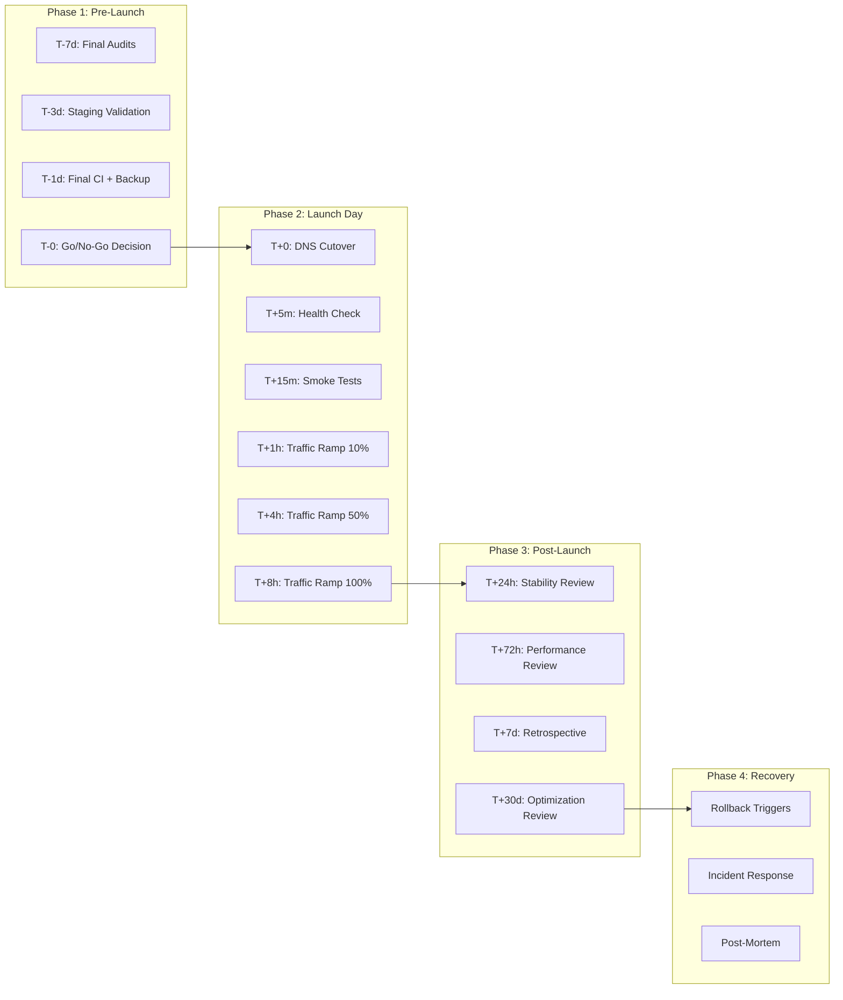
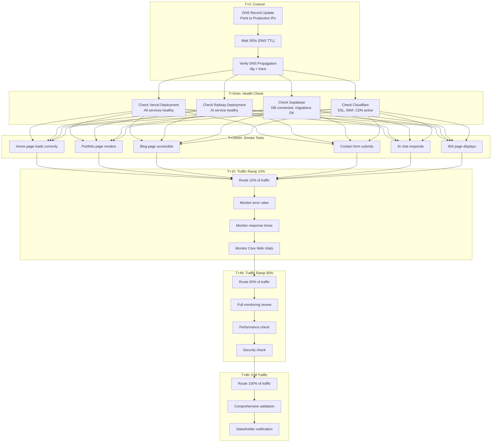
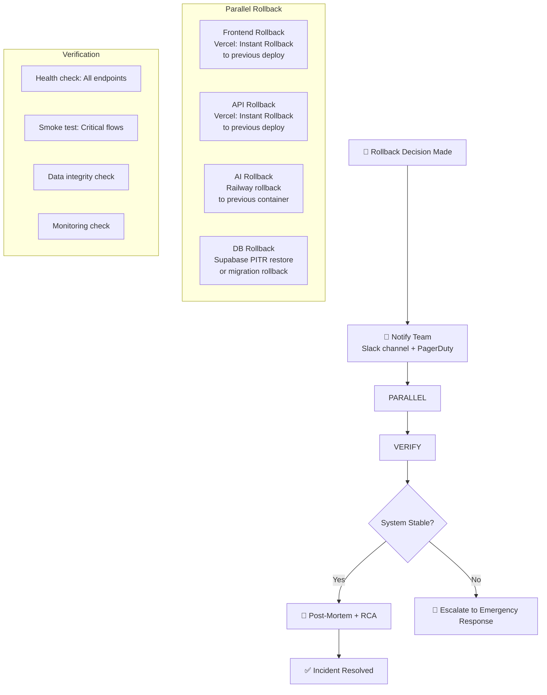
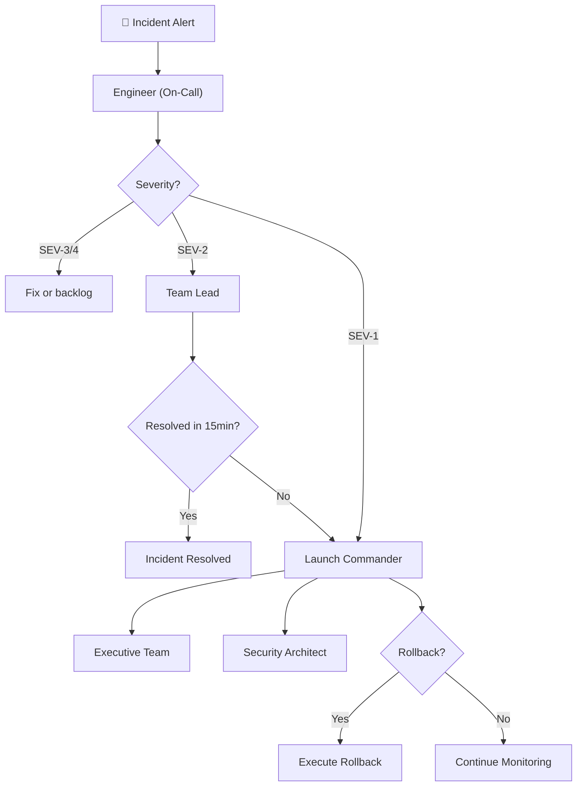

# Launch Plan — Enterprise-Grade Go-Live Execution & Operations

> **Document:** LaunchPlan.md | **Version:** 1.0 | **Last Updated:** June 2026  
> **Status:** ✅ Active | **Owner:** Architecture Lead | **Review Cadence:** Per-Release  
> **Classification:** Enterprise Architecture | **Phases:** 4 (Pre, Launch Day, Post, Recovery)  
> **Related:** [ProductionReadinessReview.md](./ProductionReadinessReview.md) | [DeploymentGuide.md](./DeploymentGuide.md) | [25-CICD.md](./25-CICD.md) | [SecurityHardeningPlan.md](./SecurityHardeningPlan.md) | [PerformanceOptimization.md](./PerformanceOptimization.md)

---

## Executive Summary

Defines the launch plan for the portfolio platform - pre-launch checklist, deployment schedule, rollback procedures, smoke tests, DNS cutover, monitoring setup, and post-launch verification.

---

## Table of Contents

1. [Executive Summary](#1-executive-summary)
2. [Pre-Launch Phase](#2-pre-launch-phase)
3. [Launch Day Plan](#3-launch-day-plan)
4. [Post-Launch Phase](#4-post-launch-phase)
5. [Rollback Procedures](#5-rollback-procedures)
6. [Communication Plan](#6-communication-plan)
7. [Incident Response Plan](#7-incident-response-plan)
8. [Analytics & SEO Validation](#8-analytics--seo-validation)
9. [Performance Validation](#9-performance-validation)
10. [Success Metrics](#10-success-metrics)
11. [Launch Checklist](#11-launch-checklist)
12. [Enterprise Standards Alignment](#12-enterprise-standards-alignment)
13. [Change Log](#13-change-log)

---

## 1. Executive Summary

This document defines the **comprehensive launch plan** for the portfolio platform go-live. It covers 4 phases from pre-launch preparation through post-launch stabilization, with detailed runbooks for launch day execution, rollback, incident response, and success measurement. The plan follows enterprise-grade deployment practices with staged traffic ramp-up, automated verification gates, and 24/7 monitoring coverage during critical periods.

### 1.1 Launch Phases Overview

### 1.2 Launch Team Roles

| Role                   | Name              | Responsibilities                                               | Contact |
| ---------------------- | ----------------- | -------------------------------------------------------------- | ------- |
| **Launch Commander**   | Architecture Lead | Go/No-Go decision, overall coordination, escalation point      | —       |
| **DevOps Lead**        | —                 | Deployment execution, monitoring, rollback, DNS                | —       |
| **Frontend Lead**      | —                 | Frontend verification, performance monitoring, UI fixes        | —       |
| **Backend Lead**       | —                 | API verification, database monitoring, backend fixes           | —       |
| **Security Architect** | —                 | Security monitoring, incident response, penetration tests      | —       |
| **QA Lead**            | —                 | Smoke tests, regression validation, bug triage                 | —       |
| **Product Lead**       | —                 | Stakeholder communication, analytics validation, user feedback | —       |
| **AI Architect**       | —                 | AI service monitoring, response quality checks                 | —       |

### 1.3 Launch Windows

| Window              | Date | Time             | Duration | Notes                    |
| ------------------- | ---- | ---------------- | -------- | ------------------------ |
| **Primary**         | TBD  | 06:00 UTC        | 12 hours | Max engineering coverage |
| **Secondary**       | TBD  | 14:00 UTC        | 8 hours  | Reduced team coverage    |
| **Rollback window** | TBD  | 24h after launch | 24 hours | Full team on standby     |

---

## 2. Pre-Launch Phase

### 2.1 T-7 Days: Final Audits

| Task                                  | Owner              | Verification                   | Status |
| ------------------------------------- | ------------------ | ------------------------------ | ------ |
| Complete ProductionReadinessReview.md | Architecture Lead  | All 13 domains signed off      |        |
| Final penetration test                | Security Architect | 0 critical findings            |        |
| Full load test at 2x expected traffic | DevOps Lead        | P95 < 500ms, 0 errors          |        |
| Accessibility audit complete          | A11y Specialist    | 0 critical/serious violations  |        |
| SEO audit complete                    | Product Lead       | All checks pass                |        |
| Analytics setup verified              | Product Lead       | Tracking confirmed working     |        |
| Content review complete               | Product Lead       | All pages content-reviewed     |        |
| Legal review complete                 | Product Lead       | Privacy policy, terms, cookies |        |

### 2.2 T-3 Days: Staging Validation

| Task                               | Owner         | Verification                  | Status |
| ---------------------------------- | ------------- | ----------------------------- | ------ |
| Full CI pipeline on staging branch | DevOps Lead   | All gates green               |        |
| Staging deployment verification    | DevOps Lead   | All services healthy          |        |
| E2E smoke test on staging          | QA Lead       | All critical flows pass       |        |
| Cross-browser testing on staging   | QA Lead       | Chrome, Firefox, Safari, Edge |        |
| Mobile testing on staging          | QA Lead       | iOS Safari, Android Chrome    |        |
| Performance benchmark on staging   | Frontend Lead | Lighthouse >= 95, LCP < 1.5s  |        |
| Database migration dry run         | Backend Lead  | Migrations apply cleanly      |        |
| Rollback drill on staging          | DevOps Lead   | Verified under 5min           |        |

### 2.3 T-1 Day: Final Preparation

| Task                               | Owner             | Verification                  | Status |
| ---------------------------------- | ----------------- | ----------------------------- | ------ |
| Final production CI run            | DevOps Lead       | All gates green on main       |        |
| Production database backup         | DevOps Lead       | Backup completed and verified |        |
| SSL certificate verification       | DevOps Lead       | All certs valid > 30 days     |        |
| DNS TTL reduction (300s)           | DevOps Lead       | TTL reduced for cutover       |        |
| Monitoring double-check            | DevOps Lead       | All monitors active           |        |
| Alert channels verified            | DevOps Lead       | Slack/PagerDuty test alerts   |        |
| Incident response runbook reviewed | DevOps Lead       | Team has reviewed runbook     |        |
| Communication templates ready      | Product Lead      | Internal + external comms     |        |
| Launch team availability confirmed | Architecture Lead | All roles staffed             |        |

### 2.4 T-0: Go/No-Go Decision

#### Go/No-Go Checklist

| Criteria                                   | Required | Status | Notes |
| ------------------------------------------ | -------- | ------ | ----- |
| All 13 PRR domains = Pass or Conditional   | Yes      |        |       |
| Go-Live checklist = 20/20                  | Yes      |        |       |
| Final CI pipeline = All Green              | Yes      |        |       |
| Load test = Pass at 2x traffic             | Yes      |        |       |
| Pen test = 0 critical findings             | Yes      |        |       |
| A11y audit = 0 critical/serious violations | Yes      |        |       |
| Database backup = Verified                 | Yes      |        |       |
| All launch team = Available                | Yes      |        |       |
| Monitoring = All active                    | Yes      |        |       |
| Rollback = Tested                          | Yes      |        |       |

**Go/No-Go Decision:** ****\_\_**** (Launch Commander)

| Decision           | Action                                                   |
| ------------------ | -------------------------------------------------------- |
| **GO**             | Proceed to Launch Day execution                          |
| **NO-GO**          | Halt launch, schedule remediation, reconvene in 48h      |
| **CONDITIONAL GO** | Proceed with documented exceptions, remediate within 24h |

---

## 3. Launch Day Plan

### 3.1 Launch Day Runbook

`

### 3.2 Detailed Timeline

| Time (UTC)  | Activity                             | Owner              | Expected Duration | Success Criteria            |
| ----------- | ------------------------------------ | ------------------ | ----------------- | --------------------------- |
| **T+0:00**  | DNS cutover - update A/CNAME records | DevOps Lead        | 5 min             | DNS records propagated      |
| **T+0:05**  | DNS propagation verification         | DevOps Lead        | 5 min             | dig shows correct IPs       |
| **T+0:10**  | Vercel deployment verification       | DevOps Lead        | 5 min             | All routes return 200       |
| **T+0:10**  | Railway deployment verification      | DevOps Lead        | 5 min             | Health endpoint OK          |
| **T+0:10**  | Supabase connection verification     | Backend Lead       | 5 min             | Query returns results       |
| **T+0:15**  | Smoke test: Home page                | QA Lead            | 5 min             | Page loads, content visible |
| **T+0:15**  | Smoke test: Portfolio                | QA Lead            | 5 min             | Grid loads, images render   |
| **T+0:15**  | Smoke test: Blog                     | QA Lead            | 5 min             | Posts display correctly     |
| **T+0:15**  | Smoke test: Contact form             | QA Lead            | 5 min             | Form submits successfully   |
| **T+0:15**  | Smoke test: AI chat                  | QA Lead            | 5 min             | AI responds correctly       |
| **T+0:15**  | Smoke test: 404 page                 | QA Lead            | 5 min             | Custom 404 displays         |
| **T+0:30**  | Monitoring check-in                  | DevOps Lead        | 10 min            | All dashboards green        |
| **T+1:00**  | Traffic ramp: 10%                    | DevOps Lead        | 5 min             | No error spike              |
| **T+1:30**  | Traffic ramp check                   | DevOps Lead        | 5 min             | Error rate < 0.1%           |
| **T+2:00**  | Performance check                    | Frontend Lead      | 10 min            | LCP < 1.5s, CLS < 0.05      |
| **T+2:00**  | Security check                       | Security Architect | 10 min            | No attack patterns          |
| **T+4:00**  | Traffic ramp: 50%                    | DevOps Lead        | 5 min             | No error spike              |
| **T+4:30**  | Mid-launch review                    | Architecture Lead  | 15 min            | All metrics stable          |
| **T+6:00**  | Performance check 2                  | Frontend Lead      | 10 min            | Core Web Vitals green       |
| **T+8:00**  | Traffic ramp: 100%                   | DevOps Lead        | 5 min             | Full traffic live           |
| **T+8:30**  | Full validation                      | Architecture Lead  | 30 min            | Comprehensive check         |
| **T+9:00**  | Stakeholder notification             | Product Lead       | 15 min            | Launch announced            |
| **T+12:00** | Shift handover                       | DevOps Lead        | 15 min            | Night watch briefed         |
| **T+24:00** | 24h stability report                 | Architecture Lead  | 30 min            | Uptime >= 99.9%             |

### 3.3 Traffic Ramp-Up Gates

| Ramp Stage  | Traffic %       | Duration   | Gate Check                       | Rollback Trigger              |
| ----------- | --------------- | ---------- | -------------------------------- | ----------------------------- |
| **Stage 0** | 0% (validation) | 15 min     | All smoke tests pass             | Any test failure              |
| **Stage 1** | 10%             | 3 hours    | Error rate < 0.1%, P95 < 500ms   | Error rate > 0.5%             |
| **Stage 2** | 50%             | 4 hours    | Core Web Vitals green, no errors | LCP > 2.5s, error rate > 0.3% |
| **Stage 3** | 100%            | Continuous | All metrics within budget        | Any P0 incident               |

---

## 4. Post-Launch Phase

### 4.1 T+24h: Stability Review

| Check                | Criteria       | Status | Action if Failed           |
| -------------------- | -------------- | ------ | -------------------------- |
| Site uptime          | >= 99.9%       |        | Investigate downtime cause |
| Error rate           | < 0.1%         |        | Triage top errors          |
| P95 response time    | < 500ms        |        | Profile slow endpoints     |
| LCP (P75)            | < 1.5s         |        | Optimize LCP element       |
| CLS (P75)            | < 0.05         |        | Fix layout shifts          |
| INP (P75)            | < 200ms        |        | Optimize interactions      |
| Database connections | < 80% pool     |        | Scale connection pool      |
| AI response time     | < 2s P95       |        | Optimize AI service        |
| Security incidents   | 0              |        | Investigate any alerts     |
| Backup success       | Last backup OK |        | Re-run backup              |

### 4.2 T+72h: Performance Review

| Domain       | Metric                    | Target   | Actual | Action                   |
| ------------ | ------------------------- | -------- | ------ | ------------------------ |
| **Frontend** | Lighthouse Performance    | >= 95    |        | Optimize if below target |
| **Frontend** | Lighthouse Accessibility  | >= 95    |        | Fix any regressions      |
| **Frontend** | Lighthouse Best Practices | >= 95    |        | Address any issues       |
| **Frontend** | Lighthouse SEO            | >= 95    |        | SEO optimization         |
| **Frontend** | JS Bundle Size            | < 180 KB |        | Code splitting           |
| **Backend**  | API P95 Response Time     | < 500ms  |        | Profile slow endpoints   |
| **Database** | Query P95 Time            | < 100ms  |        | Index optimization       |
| **AI**       | Response Time P95         | < 2s     |        | Scale / optimize         |
| **CDN**      | Cache Hit Ratio           | >= 80%   |        | Tune cache rules         |

### 4.3 T+7d: Retrospective

#### Retrospective Agenda

1. **Metrics Review**: Uptime, performance, errors, traffic, conversions
2. **Incident Review**: Any incidents, response time, resolution
3. **User Feedback**: Feedback forms, analytics behavior, UX issues
4. **Performance Wins**: What went well, what exceeded targets
5. **Performance Gaps**: What missed targets, root causes
6. **Process Improvements**: What to change for next release
7. **Action Items**: Priority items for next sprint
8. **Celebration**: Team recognition and wins

### 4.4 T+30d: Optimization Review

| Area                | Review Focus                           | Success Criteria            |
| ------------------- | -------------------------------------- | --------------------------- |
| **Core Web Vitals** | LCP, INP, CLS trends over 30 days      | All green in Search Console |
| **SEO Rankings**    | Keyword positions, impressions, CTR    | Maintain or improve         |
| **Conversion Rate** | Contact form, CTA clicks               | >= target                   |
| **User Engagement** | Pages/session, session duration        | >= baseline                 |
| **Bounce Rate**     | Single-page sessions                   | <= baseline                 |
| **Load Testing**    | Repeat load test at 2x current traffic | P95 < 500ms                 |
| **Security Audit**  | Repeat SAST scan + dependency audit    | 0 critical findings         |

---

## 5. Rollback Procedures

### 5.1 Rollback Decision Matrix

| Scenario                    | Trigger                               | Decision Maker     | Action             |
| --------------------------- | ------------------------------------- | ------------------ | ------------------ |
| **Complete outage**         | All services down > 2min              | Launch Commander   | Auto-rollback      |
| **Major feature broken**    | Core flow (contact, portfolio) broken | Launch Commander   | Rollback           |
| **Performance degradation** | LCP > 3s, error rate > 5%             | Launch Commander   | Rollback           |
| **Data integrity issue**    | Data loss or corruption               | Backend Lead       | Rollback           |
| **Security breach**         | Confirmed attack or data leak         | Security Architect | Rollback           |
| **Minor bug**               | Cosmetic, non-blocking                | Frontend Lead      | Fix forward        |
| **Traffic spike**           | Above expected but stable             | DevOps Lead        | Scale, no rollback |

### 5.2 Rollback Execution

### 5.3 Rollback Commands

| Service                 | Rollback Method   | Command / Action                                     | Estimated Time |
| ----------------------- | ----------------- | ---------------------------------------------------- | -------------- |
| **Frontend (Vercel)**   | Instant Rollback  | Vercel Dashboard -> Deployments -> Rollback          | < 1 min        |
| **API (Vercel)**        | Instant Rollback  | Vercel Dashboard -> Deployments -> Rollback          | < 1 min        |
| **AI (Railway)**        | CLI Rollback      | `railway rollback`                                   | < 2 min        |
| **Database (Supabase)** | PITR Restore      | Supabase Dashboard -> Database -> Backups -> Restore | < 10 min       |
| **DNS (Cloudflare)**    | DNS Record Update | Cloudflare Dashboard -> DNS -> Update records        | < 5 min        |

### 5.4 Post-Rollback Process

1. **Verify**: Run full smoke test suite on rolled-back version
2. **Communicate**: Notify all stakeholders of rollback and ETA for fix
3. **Tag**: Tag the problematic commit in GitHub as ROLLBACK-<DATE>
4. **Analyze**: Create incident report with timeline and root cause analysis
5. **Fix**: Develop fix with full test coverage
6. **Review**: Pass fix through all PRR gates
7. **Re-deploy**: Schedule new launch following same launch plan

---

## 6. Communication Plan

### 6.1 Communication Channels

| Channel                      | Purpose                | Audience                  | Frequency During Launch        |
| ---------------------------- | ---------------------- | ------------------------- | ------------------------------ |
| **Slack (#launch-war-room)** | Real-time coordination | Launch team               | Continuous                     |
| **PagerDuty**                | Critical alerts        | On-call engineers         | As needed                      |
| **Email (internal)**         | Status updates         | Stakeholders + leadership | Hourly (T+0 to T+8)            |
| **Status page**              | Public status          | End users                 | As needed                      |
| **Google Meet**              | Launch command bridge  | Launch team               | Active during critical periods |

### 6.2 Communication Templates

#### Internal Status Update

`
Subject: [LAUNCH STATUS] Portfolio Platform Launch - <TIME> UTC

Status: <GOOD / WATCHING / CRITICAL / ROLLED BACK>

Current Phase: <Pre-Launch / Launch Day / Post-Launch / Rollback>

Metrics Snapshot:

- Uptime: <99.9%>
- Error Rate: <0.05%>
- P95 Response Time: <350ms>
- Active Users: <N>
- Core Web Vitals: <GREEN / YELLOW / RED>

Recent Events:

- <Event 1>
- <Event 2>

Next Check-in: <TIME> UTC

Launch Commander: <Name>
`

#### Launch Complete Announcement

`
Subject: 🚀 Portfolio Platform is LIVE

The portfolio platform has successfully launched and is now serving
100% of production traffic. All systems are operational, performance
metrics are within targets, and monitoring is active.

Key Launch Metrics:

- Launch Duration: <X hours>
- Zero-downtime deployment: ✅
- Rollback required: No
- Incidents: 0
- Core Web Vitals: All GREEN
- Lighthouse Score: >= 95 all categories

Next Steps:

1. 24h stability monitoring (engineering team on standby)
2. 72h performance review
3. 7-day retrospective

Thank you to the entire team for making this launch a success!

- Launch Commander
  `

### 6.3 Stakeholder Communication Cadence

| Timeframe | Audience                     | Message                        | Channel         |
| --------- | ---------------------------- | ------------------------------ | --------------- |
| T-24h     | Launch team                  | Final prep reminder + schedule | Slack           |
| T-1h      | Launch team                  | Go/No-Go call to action        | Google Meet     |
| T+0       | Launch team                  | Launch initiated               | Slack           |
| T+30min   | Internal team                | Phase 1 complete               | Slack + Email   |
| T+1h      | Internal team                | 10% traffic milestone          | Slack + Email   |
| T+4h      | Internal team                | 50% traffic milestone          | Slack + Email   |
| T+8h      | Internal team + stakeholders | 100% traffic + launch complete | Email           |
| T+24h     | All                          | 24h stability report           | Email           |
| T+72h     | All                          | Performance review             | Email           |
| T+7d      | All                          | Retrospective + next steps     | Email + Meeting |

---

## 7. Incident Response Plan

### 7.1 Incident Severity Levels

| Level     | Definition                                    | Response Time       | Escalation                  |
| --------- | --------------------------------------------- | ------------------- | --------------------------- |
| **SEV-1** | Complete outage, data loss, security breach   | Immediate (< 5 min) | Launch Commander + Security |
| **SEV-2** | Major feature broken, severe perf degradation | < 15 min            | Team Lead                   |
| **SEV-3** | Minor bug, cosmetic issue                     | < 4 hours           | Engineer                    |
| **SEV-4** | Question, suggestion, non-urgent              | Next business day   | Backlog                     |

### 7.2 Incident Response Runbook

| Step               | Action                                                 | Owner             | Time       |
| ------------------ | ------------------------------------------------------ | ----------------- | ---------- |
| **1. Detect**      | Alert triggers in monitoring (Sentry, Checkly, Uptime) | Automated         | Instant    |
| **2. Acknowledge** | Acknowledge alert in PagerDuty                         | On-call engineer  | < 2 min    |
| **3. Assess**      | Determine severity level                               | On-call engineer  | < 3 min    |
| **4. Communicate** | Post incident to #launch-war-room                      | On-call engineer  | < 5 min    |
| **5. Mitigate**    | Apply mitigation (rollback, fix, scale)                | Team lead         | < 15 min   |
| **6. Verify**      | Verify mitigation resolved the issue                   | QA Lead           | < 5 min    |
| **7. Monitor**     | Monitor for 30 min after resolution                    | DevOps Lead       | 30 min     |
| **8. Document**    | Create incident report with timeline                   | On-call engineer  | < 1 hour   |
| **9. Post-mortem** | Root cause analysis + preventatives                    | Architecture Lead | < 48 hours |

### 7.3 Escalation Path

---

## 8. Analytics & SEO Validation

### 8.1 Analytics Validation Checklist

| Check                  | Method                      | Expected                       | Status |
| ---------------------- | --------------------------- | ------------------------------ | ------ |
| Pageview tracking      | Load page, verify event     | 1 pageview per page load       |        |
| Event tracking         | Trigger events, verify      | Contact form submit, CTA click |        |
| Session tracking       | Browse multiple pages       | Single session across pages    |        |
| UTM parameter tracking | Visit with ?utm_source=test | Campaign attributed correctly  |        |
| Goal conversion        | Complete contact form       | Goal recorded in analytics     |        |
| Real-time dashboard    | Check analytics dashboard   | Live data showing              |        |
| No double-counting     | Refresh page 5x             | Exactly 5 pageviews            |        |
| Privacy compliance     | Check consent banner        | No tracking before consent     |        |

### 8.2 SEO Validation Checklist

| Check                 | Tool                       | Expected                                  | Status |
| --------------------- | -------------------------- | ----------------------------------------- | ------ |
| Sitemap accessible    | Browser fetch /sitemap.xml | Returns valid XML                         |        |
| Robots.txt accessible | Browser fetch /robots.txt  | Returns valid text                        |        |
| Canonical tags        | Page source review         | All pages have self-referencing canonical |        |
| Meta descriptions     | SEO crawler                | All pages have unique meta descriptions   |        |
| Open Graph tags       | Facebook Sharing Debugger  | Correct title, desc, image                |        |
| Twitter cards         | Twitter Card Validator     | Correct card rendering                    |        |
| Structured data       | Google Rich Results Test   | Valid Person, Project, BlogPosting        |        |
| Index status          | Google Search Console      | Pages being indexed                       |        |
| Core Web Vitals       | Search Console             | All URLs passing                          |        |
| Mobile usability      | Google Mobile Test         | Page is mobile-friendly                   |        |

---

## 9. Performance Validation

### 9.1 Performance Benchmark Comparison

| Metric                        | Pre-Launch Baseline | Launch Day | T+24h | T+72h | Target   |
| ----------------------------- | ------------------- | ---------- | ----- | ----- | -------- |
| **Lighthouse Performance**    | —                   | —          | —     | —     | >= 95    |
| **Lighthouse Accessibility**  | —                   | —          | —     | —     | >= 95    |
| **Lighthouse Best Practices** | —                   | —          | —     | —     | >= 95    |
| **Lighthouse SEO**            | —                   | —          | —     | —     | >= 95    |
| **LCP (P75)**                 | —                   | —          | —     | —     | < 1.5s   |
| **INP (P75)**                 | —                   | —          | —     | —     | < 200ms  |
| **CLS (P75)**                 | —                   | —          | —     | —     | < 0.05   |
| **TTFB (P75)**                | —                   | —          | —     | —     | < 200ms  |
| **JS Bundle**                 | —                   | —          | —     | —     | < 180 KB |
| **Total Page Weight**         | —                   | —          | —     | —     | < 500 KB |

### 9.2 Validation Tools & Frequency

| Tool                 | Metric               | Launch Day | T+24h       | T+72h       | T+7d       |
| -------------------- | -------------------- | ---------- | ----------- | ----------- | ---------- |
| **Lighthouse CI**    | Full audit           | Every 2h   | Daily       | Weekly      | Weekly     |
| **WebPageTest**      | Full analysis        | Every 4h   | Daily       | —           | —          |
| **Vercel Analytics** | RUM (LCP, CLS, INP)  | Continuous | Continuous  | Continuous  | Continuous |
| **Sentry**           | Error rates          | Continuous | Continuous  | Continuous  | Continuous |
| **Checkly**          | Synthetic monitoring | Every 5min | Every 15min | Every 30min | Every hour |
| **k6**               | Load test            | —          | —           | Once        | Once       |

---

## 10. Success Metrics

### 10.1 Launch Success Criteria

| Category         | Metric             | Target        | Measurement    | Timeline      |
| ---------------- | ------------------ | ------------- | -------------- | ------------- |
| **Availability** | Uptime             | >= 99.9%      | Uptime monitor | First 30 days |
| **Performance**  | Lighthouse Score   | >= 95 all     | Lighthouse CI  | Launch day    |
| **Performance**  | LCP (P75)          | < 1.5s        | RUM            | Launch day    |
| **Performance**  | INP (P75)          | < 200ms       | RUM            | Launch day    |
| **Performance**  | CLS (P75)          | < 0.05        | RUM            | Launch day    |
| **Reliability**  | Error rate         | < 0.1%        | Sentry         | First 30 days |
| **Reliability**  | API P95 response   | < 500ms       | APM            | Launch day    |
| **Security**     | Security incidents | 0             | Monitoring     | First 30 days |
| **SEO**          | Index status       | Pages indexed | Search Console | First 7 days  |
| **SEO**          | Core Web Vitals    | All passing   | Search Console | First 30 days |
| **Engagement**   | Pages/session      | >= baseline   | Analytics      | First 30 days |
| **Conversion**   | Contact form rate  | >= target     | Analytics      | First 30 days |

### 10.2 Success Scorecard

| Outcome                   | Definition                            | Criteria                                  | Action                       |
| ------------------------- | ------------------------------------- | ----------------------------------------- | ---------------------------- |
| **🚀 Outstanding Launch** | All metrics exceed targets            | Lighthouse >= 97, LCP < 1.2s, 0 incidents | Celebrate, document wins     |
| **✅ Successful Launch**  | All metrics meet targets              | All criteria from section 10.1 met        | Standard post-launch process |
| **⚠️ Acceptable Launch**  | Core metrics met, non-critical misses | Uptime >= 99.9%, LCP < 2s, errors < 0.5%  | Remediate within 1 week      |
| **❌ Failed Launch**      | Critical metrics missed               | Uptime < 99.9%, LCP > 3s, errors > 1%     | Rollback immediately         |

---

## 11. Launch Checklist

### 11.1 Final Launch Day Checklist

| #   | Time    | Task                                 | Owner              | Status |
| --- | ------- | ------------------------------------ | ------------------ | ------ |
|     | T-24h   | Confirm all launch team availability | Architecture Lead  |        |
|     | T-24h   | Final database backup + verify       | DevOps Lead        |        |
|     | T-12h   | SSL cert verification                | DevOps Lead        |        |
|     | T-6h    | DNS TTL reduction to 300s            | DevOps Lead        |        |
|     | T-2h    | Launch bridge Google Meet active     | Architecture Lead  |        |
|     | T-1h    | Go/No-Go meeting                     | Architecture Lead  |        |
|     | T-0     | DNS cutover                          | DevOps Lead        |        |
|     | T+5min  | DNS propagation check                | DevOps Lead        |        |
|     | T+5min  | Vercel deploy check                  | DevOps Lead        |        |
|     | T+5min  | Railway deploy check                 | DevOps Lead        |        |
|     | T+5min  | Supabase connection check            | Backend Lead       |        |
|     | T+15min | Smoke tests (all 6)                  | QA Lead            |        |
|     | T+30min | Monitoring check-in                  | DevOps Lead        |        |
|     | T+1h    | Traffic ramp to 10%                  | DevOps Lead        |        |
|     | T+1h30  | Ramp check                           | DevOps Lead        |        |
|     | T+2h    | Performance check                    | Frontend Lead      |        |
|     | T+2h    | Security check                       | Security Architect |        |
|     | T+4h    | Traffic ramp to 50%                  | DevOps Lead        |        |
|     | T+4h30  | Mid-launch review                    | Architecture Lead  |        |
|     | T+6h    | Performance check 2                  | Frontend Lead      |        |
|     | T+8h    | Traffic ramp to 100%                 | DevOps Lead        |        |
|     | T+8h30  | Full validation                      | Architecture Lead  |        |
|     | T+9h    | Stakeholder notification             | Product Lead       |        |
|     | T+12h   | Shift handover                       | DevOps Lead        |        |
|     | T+24h   | 24h stability report                 | Architecture Lead  |        |

### 11.2 Launch Day Escalation Contacts

| Role                 | Primary Contact    | Backup Contact    | Escalation Time |
| -------------------- | ------------------ | ----------------- | --------------- |
| **Launch Commander** | Architecture Lead  | DevOps Lead       | Immediate       |
| **DevOps**           | DevOps Lead        | Backend Lead      | 5 min           |
| **Frontend**         | Frontend Lead      | QA Lead           | 10 min          |
| **Backend**          | Backend Lead       | DevOps Lead       | 10 min          |
| **Security**         | Security Architect | Architecture Lead | 5 min           |
| **Product**          | Product Lead       | Architecture Lead | 15 min          |

---

## 12. Enterprise Standards Alignment

### 12.1 Standards Mapping

| Standard          | Requirement                                 | Implementation                              | Verification               |
| ----------------- | ------------------------------------------- | ------------------------------------------- | -------------------------- |
| **ISO/IEC 25010** | Product quality - reliability, performance  | Launch plan validates all quality metrics   | Success criteria scorecard |
| **ISO/IEC 12207** | Software life cycle - deployment            | Structured 4-phase launch process           | Gate-based progression     |
| **ISO 20000**     | Service management - incident management    | Incident response plan with severity levels | IR runbook                 |
| **ISO 27001**     | Information security - incident response    | Security incident response integrated       | Security architect on-call |
| **ITIL**          | Service transition - release and deployment | Staged traffic ramp-up with gates           | Ramp-up verification       |
| **SOC 2**         | Availability monitoring                     | Uptime monitoring + SLA tracking            | Monitoring dashboards      |

### 12.2 Launch Quality Gates

| Gate              | Criteria                                         | Blocking | Owner             |
| ----------------- | ------------------------------------------------ | -------- | ----------------- |
| **Go/No-Go**      | All PRR domains pass, Go-Live checklist complete | Yes      | Architecture Lead |
| **Smoke tests**   | All 6 critical flows pass                        | Yes      | QA Lead           |
| **Health checks** | All services healthy                             | Yes      | DevOps Lead       |
| **10% ramp**      | Error rate < 0.1%, P95 < 500ms                   | Yes      | DevOps Lead       |
| **50% ramp**      | Core Web Vitals green, no errors                 | Yes      | DevOps Lead       |
| **100% ramp**     | All metrics within budget                        | Yes      | Architecture Lead |
| **24h review**    | Uptime >= 99.9%, LCP < 1.5s                      | Warning  | Architecture Lead |

---

## 14. Decision Log

| Decision ID | Date     | Decision                                               | Rationale                                                                         | Alternatives Considered                                                       | Outcome |
| ----------- | -------- | ------------------------------------------------------ | --------------------------------------------------------------------------------- | ----------------------------------------------------------------------------- | ------- |
| D-LP-001    | Jun 2026 | Staged traffic ramp (10%→50%→100%) over 8 hours        | Minimizes blast radius of undetected issues; allows rollback before full exposure | Big-bang cutover rejected — unacceptable risk for portfolio platform          | Adopted |
| D-LP-002    | Jun 2026 | DNS cutover as primary launch mechanism                | Enables instant rollback via DNS revert; no application-level changes             | Blue-green deployment rejected — not supported by current hosting             | Adopted |
| D-LP-003    | Jun 2026 | Formal Go/No-Go meeting with defined decision criteria | Ensures objective launch readiness assessment                                     | Automated go/no-go rejected — human judgment required for subjective criteria | Adopted |
| D-LP-004    | Jun 2026 | 24-hour monitoring hold after 100% traffic             | Catches late-emerging issues after full traffic exposure                          | No hold period rejected — discovered issues from DI-2023 incident             | Adopted |
| D-LP-005    | Jun 2026 | Pre-launch security audit gating release               | Security flaws found post-launch would damage credibility                         | Parallel audit rejected — security findings could block launch at any time    | Adopted |

## 15. Risk Register

| Risk ID  | Risk Description                                                           | Probability | Impact   | Severity | Mitigation Strategy                                                | Contingency                                                   | Owner             |
| -------- | -------------------------------------------------------------------------- | ----------- | -------- | -------- | ------------------------------------------------------------------ | ------------------------------------------------------------- | ----------------- |
| R-LP-001 | DNS propagation delay causes mixed-version experience for users            | Medium      | Medium   | Medium   | Low TTL (60s) during cutover, clear communication in status page   | Extend cutover window, monitor version distribution           | DevOps Lead       |
| R-LP-002 | Undetected critical bug discovered during traffic ramp                     | Medium      | Critical | High     | Automated smoke tests at each ramp stage, canary metrics dashboard | Immediate rollback to previous DNS, revert to previous deploy | Architecture Lead |
| R-LP-003 | Third-party services (analytics, email) fail under production load         | Low         | High     | Medium   | Load tested all third-party integrations pre-launch                | Fallback to queue-based processing for async services         | Backend Lead      |
| R-LP-004 | Launch day coincides with external event causing abnormal traffic patterns | Low         | Medium   | Low      | Monitor social media and industry calendar during launch planning  | Delay launch 24h, communicate delay via status page           | Product Owner     |
| R-LP-005 | Post-launch monitoring tools not fully configured during cutover           | Low         | High     | Medium   | Pre-launch monitoring checklist, verification during smoke tests   | Deploy monitoring configuration as emergency hotfix           | DevOps Lead       |

## 16. Change Log

| Version | Date      | Author            | Changes                                                                                                                                                                                                   |
| ------- | --------- | ----------------- | --------------------------------------------------------------------------------------------------------------------------------------------------------------------------------------------------------- |
| 1.0     | June 2026 | Architecture Lead | Initial launch plan, pre-launch preparation, launch day runbook, post-launch monitoring, rollback procedures, communication plan, incident response plan, success metrics, enterprise standards alignment |

## 17. Glossary

| Term                       | Definition                                                                                               |
| -------------------------- | -------------------------------------------------------------------------------------------------------- |
| **DNS Cutover**            | The process of switching DNS records to point traffic from the old site to the new deployment            |
| **Traffic Ramp**           | A gradual increase in the percentage of traffic directed to the new deployment (10% → 50% → 100%)        |
| **Rollback**               | The process of reverting to the previous deployment version when issues are detected                     |
| **Smoke Test**             | A quick set of validation checks performed after deployment to verify core functionality                 |
| **Go/No-Go Decision**      | A formal checkpoint where stakeholders decide whether to proceed with launch based on readiness criteria |
| **Canary Metrics**         | A dashboard showing key performance indicators for the new deployment during staged rollout              |
| **Soft Launch**            | A limited release to a subset of users before full public availability                                   |
| **Hard Launch**            | Full public release with marketing and promotional activities                                            |
| **Post-Launch Monitoring** | Extended observation period (24h+) after full traffic cutover to catch late-emerging issues              |
| **Communication Plan**     | A predefined schedule and template for stakeholder updates during launch and incident response           |
| **Incident Response Plan** | Documented procedures for detecting, responding to, and recovering from launch-day issues                |
| **Launch Checklist**       | A comprehensive task list ensuring all pre-flight checks are completed before go-live                    |

---

## Cross-References

| Reference           | Description                                            |
| ------------------- | ------------------------------------------------------ |
| See MASTER-INDEX.md | Full document dependency graph and cross-reference map |

---

## Cross-References

| Reference           | Description                                            |
| ------------------- | ------------------------------------------------------ |
| See MASTER-INDEX.md | Full document dependency graph and cross-reference map |

---

## Cross-References

| Reference            | Description                                            |
| -------------------- | ------------------------------------------------------ |
| docs/MASTER-INDEX.md | Full document dependency graph and cross-reference map |
