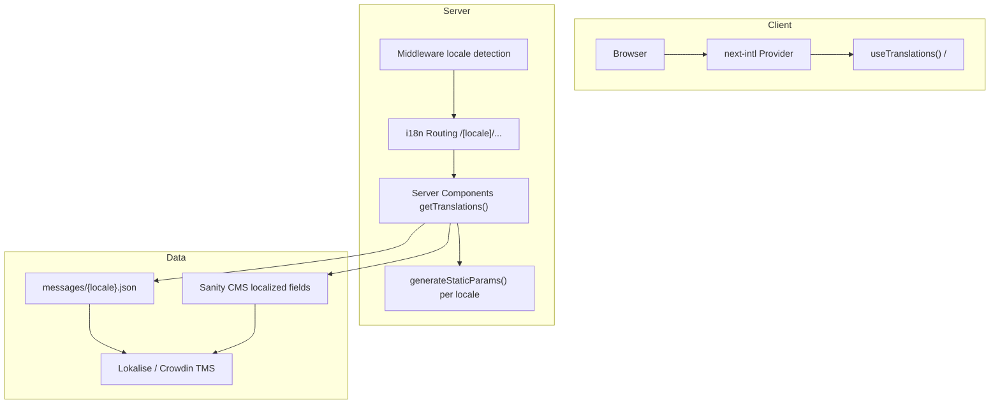
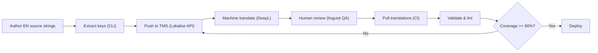

# Internationalization & Localization Strategy -- Enterprise-Grade i18n/i10n

> **Document:** `61-LOCALIZATION.md` | **Version:** 1.0 | **Last Updated:** June 2026
> **Status:** Draft | **Owner:** Product Owner | **Review Cadence:** Quarterly
> **Classification:** Enterprise Architecture | **Framework:** next-intl | **Target Locales:** 6

---

## Executive Summary

Defines the localization architecture - i18n framework setup, translation workflow, locale management, RTL support, date/number formatting, and content delivery strategy.

---

## Table of Contents

1. [Executive Summary](#1-executive-summary)
2. [i18n Architecture](#2-i18n-architecture)
3. [Locale Strategy](#3-locale-strategy)
4. [Translation Workflow](#4-translation-workflow)
5. [Translation Management](#5-translation-management)
6. [RTL Support Strategy](#6-rtl-support-strategy)
7. [Content Localization](#7-content-localization)
8. [SEO per Locale](#8-seo-per-locale)
9. [Locale Detection & Switching](#9-locale-detection--switching)
10. [Testing Strategy per Locale](#10-testing-strategy-per-locale)
11. [Enterprise Standards Alignment](#11-enterprise-standards-alignment)
12. [Change Log](#12-change-log)

---

## 1. Executive Summary

Enterprise-grade i18n/i10n strategy for the Next.js portfolio platform. Supports **English (default)** with phased rollout for **Spanish, French, German, Japanese, Chinese (Simplified)**.

| Goal                 | Target                      | Metric                           |
| -------------------- | --------------------------- | -------------------------------- |
| Locale coverage      | 6 locales                   | % strings translated per locale  |
| Translation accuracy | >= 98%                      | Post-review error rate           |
| RTL readiness        | Zero layout shift on switch | Full CSS logical properties      |
| SEO per locale       | 6 sitemaps + hreflang       | Index coverage >= 95% per locale |
| Fallback resilience  | 100% fallback to en         | No blank UI strings              |

**Principles:** Locale as first-class citizen, progressive enhancement, automation-first pipeline, zero regressions on locale switch.

---

## 2. i18n Architecture

### 2.1 Stack

| Layer     | Technology                                  | Purpose                          |
| --------- | ------------------------------------------- | -------------------------------- |
| Framework | **next-intl** 3.x                           | React-first i18n for App Router  |
| Messages  | **ICU MessageFormat**                       | Plural/gender/select rules       |
| Storage   | **JSON files** + **Sanity CMS**             | Static strings & dynamic content |
| TMS       | **Lokalise / Crowdin**                      | Translation management via API   |
| RTL       | **Tailwind RTL plugin** + CSS logical props | Bidirectional layout             |
| Lint      | **eslint-plugin-i18next**                   | Catch untranslated strings in CI |

### 2.2 Architecture Diagram



### 2.3 Configuration

```typescript
// i18n/config.ts
import { getRequestConfig } from 'next-intl/server';
import { routing } from './routing';
export type Locale = (typeof routing.locales)[number];
export const defaultLocale = 'en' satisfies Locale;
export const locales = ['en', 'es', 'fr', 'de', 'ja', 'zh'] as const;
export const localeNames: Record<Locale, string> = {
  en: 'English',
  es: 'Espanol',
  fr: 'Francais',
  de: 'Deutsch',
  ja: 'Japanese',
  zh: 'Chinese',
};
export const localeDirections: Record<Locale, 'ltr' | 'rtl'> = {
  en: 'ltr',
  es: 'ltr',
  fr: 'ltr',
  de: 'ltr',
  ja: 'ltr',
  zh: 'ltr',
};
export default getRequestConfig(async ({ requestLocale }) => ({
  locale: (await requestLocale) ?? defaultLocale,
  messages: (await import(`../../messages/${(await requestLocale) ?? defaultLocale}.json`)).default,
  timeZone: 'UTC',
  now: new Date(),
}));
```

```typescript
// i18n/routing.ts
import { defineRouting } from 'next-intl/routing';
import { createNavigation } from 'next-intl/navigation';
export const routing = defineRouting({
  locales: ['en', 'es', 'fr', 'de', 'ja', 'zh'],
  defaultLocale: 'en',
  localePrefix: 'as-needed',
  pathnames: {
    '/': '/',
    '/about': {
      en: '/about',
      es: '/acerca-de',
      fr: '/a-propos',
      de: '/ueber-mich',
      ja: '/about',
      zh: '/about',
    },
    '/projects': {
      en: '/projects',
      es: '/proyectos',
      fr: '/projets',
      de: '/projekte',
      ja: '/projects',
      zh: '/projects',
    },
    '/blog': { en: '/blog', es: '/blog', fr: '/blog', de: '/blog', ja: '/blog', zh: '/blog' },
    '/contact': {
      en: '/contact',
      es: '/contacto',
      fr: '/contact',
      de: '/kontakt',
      ja: '/contact',
      zh: '/contact',
    },
  },
});
export const { Link, redirect, useRouter, getPathname } = createNavigation(routing);
```

```typescript
// middleware.ts
import createMiddleware from 'next-intl/middleware';
import { routing } from './i18n/routing';
export default createMiddleware(routing);
export const config = { matcher: ['/((?!api|_next|_vercel|.*\\..*).*)'] };
```

```typescript
// app/[locale]/layout.tsx
import { NextIntlClientProvider } from "next-intl";
import { getMessages, getTranslations } from "next-intl/server";
import { notFound } from "next/navigation";
import { locales, localeDirections, type Locale } from "@/i18n/config";
type Props = { children: React.ReactNode; params: Promise<{ locale: Locale }> };
export async function generateStaticParams() { return locales.map((locale) => ({ locale })); }
export async function generateMetadata({ params }: Props) {
  const { locale } = await params;
  const t = await getTranslations({ locale, namespace: "metadata" });
  return {
    title: { template: `%s | ${t("siteName")}`, default: t("title") },
    description: t("description"),
    alternates: { canonical: `https://example.com/${locale}`, languages: Object.fromEntries(locales.map((l) => [l, `https://example.com/${l}`])) },
  };
}
export default async function LocaleLayout({ children, params }: Props) {
  const { locale } = await params;
  if (!locales.includes(locale)) notFound();
  return (
    <html lang={locale} dir={localeDirections[locale]} suppressHydrationWarning>
      <body><NextIntlClientProvider messages={await getMessages()}>{children}</NextIntlClientProvider></body>
    </html>
  );
}
```

---

## 3. Locale Strategy

### 3.1 Locale Matrix

| Locale          | Code | Dir | Priority | Phase | Speakers (M) |
| --------------- | ---- | --- | -------- | ----- | ------------ |
| English         | `en` | LTR | P0       | 0     | 1,500        |
| Spanish         | `es` | LTR | P1       | 1     | 485          |
| French          | `fr` | LTR | P1       | 1     | 321          |
| German          | `de` | LTR | P2       | 2     | 135          |
| Japanese        | `ja` | LTR | P2       | 2     | 126          |
| Chinese (Simp.) | `zh` | LTR | P3       | 3     | 1,120        |

### 3.2 Fallback Chain

```
en (source) ----> es, fr
           +---> de, ja, zh
```

All locales fall back to `en` for untranslated keys. Regional variants (e.g. `es-MX`) inherit from their root locale before falling to `en`.

### 3.3 File Structure

```
messages/
  en.json          # Source of truth
  es.json          # Phase 1 (target 100%)
  fr.json          # Phase 1
  de.json          # Phase 2
  ja.json          # Phase 2
  zh.json          # Phase 3
```

```json
// messages/en.json (abbreviated)
{
  "metadata": {
    "title": "John Doe -- Software Engineer & Architect",
    "description": "Full-stack engineer specializing in Next.js, TypeScript, and cloud architecture."
  },
  "nav": {
    "home": "Home",
    "about": "About",
    "projects": "Projects",
    "blog": "Blog",
    "contact": "Contact"
  },
  "home": {
    "hero": {
      "greeting": "Hi, I'm {name}",
      "tagline": "Building enterprise-grade web experiences",
      "cta": "View my work"
    }
  },
  "common": {
    "readMore": "Read more",
    "loading": "Loading...",
    "error": "Something went wrong",
    "pageNotFound": "Page not found"
  }
}
```

---

## 4. Translation Workflow

### 4.1 Pipeline



### 4.2 Roles & Timings

| Step              | Tool               | Owner     | Duration         |
| ----------------- | ------------------ | --------- | ---------------- |
| Author strings    | IDE                | Developer | During dev       |
| Extract keys      | `extract-i18n` CLI | CI        | < 10 s           |
| Push to TMS       | Lokalise API       | CI        | < 30 s           |
| Machine translate | DeepL API          | Automated | < 2 min / locale |
| Human review      | Lokalise editor    | Linguist  | 1-5 days         |
| Pull & validate   | Lokalise CLI       | CI        | < 45 s           |
| Deploy            | Vercel             | CI        | Per pipeline     |

### 4.3 CI Quality Gate

```yaml
# .github/workflows/i18n-checks.yml
name: i18n Quality Gate
on: { pull_request: { paths: ['messages/**', 'src/**'] } }
jobs:
  lint-i18n:
    runs-on: ubuntu-latest
    steps:
      - uses: actions/checkout@v4
      - run: pnpm install && pnpm lint:i18n
      - name: Check coverage
        run: for loc in es fr de ja zh; do node scripts/check-coverage.mjs en "$loc" 80; done
      - name: Validate ICU
        run: node scripts/validate-icu.mjs
```

---

## 5. Translation Management

### 5.1 Storage Strategy

| Content Type        | Storage                  | Method                    | Cadence     |
| ------------------- | ------------------------ | ------------------------- | ----------- |
| UI strings          | `messages/{locale}.json` | TMS push/pull             | Per release |
| Static page content | `messages/{locale}.json` | TMS push/pull             | Per release |
| Blog posts          | Sanity CMS               | Localized document fields | On publish  |
| Case studies        | Sanity CMS               | Localized document fields | On publish  |
| User-generated      | Database                 | On-demand translate API   | Real-time   |
| SEO metadata        | JSON + CMS               | TMS + CMS                 | Per release |

### 5.2 TMS Integration

```typescript
// scripts/push-to-lokalise.mjs
import { LokaliseApi } from '@lokalise/node-api';
const client = new LokaliseApi({ apiKey: process.env.LOKALISE_API_KEY });
const keys = Object.entries(require('../messages/en.json')).flatMap(([ns, v]) =>
  Object.entries(v).map(([k, val]) => ({
    key_name: `${ns}.${k}`,
    platforms: ['web'],
    translations: [{ language_iso: 'en', translation: String(val) }],
  })),
);
await client.keys().create(process.env.LOKALISE_PROJECT_ID, { keys });
```

### 5.3 CMS Localized Fetch

```typescript
// lib/sanity/localized.ts
import { groq } from 'next-sanity';
import { client } from './client';
import type { Locale } from '@/i18n/config';
export async function getLocalizedPost(slug: string, locale: Locale) {
  return client.fetch(
    groq`
    *[_type == "post" && slug.current == $slug][0] {
      "title": coalesce(title.${locale}, title.en),
      "body": coalesce(body.${locale}, body.en),
      "excerpt": coalesce(excerpt.${locale}, excerpt.en),
      publishedAt, author->{name, image}
    }`,
    { slug },
  );
}
```

---

## 6. RTL Support Strategy

### 6.1 Approach

Use **CSS logical properties** and **Tailwind RTL variants** instead of hardcoded `left`/`right`.

```css
/* Good */
.avatar {
  margin-inline-end: 8px;
}
.icon {
  float: inline-end;
}
```

### 6.2 Tailwind Plugin

```typescript
// tailwind.config.ts
export default {
  plugins: [
    function rtl({ addVariant }) {
      addVariant('rtl', '[dir="rtl"] &');
      addVariant('ltr', '[dir="ltr"] &');
    },
  ],
};
```

### 6.3 RTL Testing Matrix

| Component    | LTR  | RTL  | Notes                                |
| ------------ | ---- | ---- | ------------------------------------ |
| Navigation   | Done | Done | Inline-start aligned, order reversed |
| Cards/Grid   | Done | Done | Grid auto-flow works natively        |
| Forms        | Done | Done | Label/input order reversed           |
| Icons        | Done | Done | Mirror arrows, keep logos            |
| Modal/Drawer | Done | Done | Slide direction reversed             |

---

## 7. Content Localization

### 7.1 Static Content (ICU)

```json
{
  "projects": {
    "counter": "{count, plural, =0 {No projects} one {# project} other {# projects}}",
    "techStack": "Tech stack: {stack}"
  }
}
```

### 7.2 Dynamic Content (Sanity)

Sanity schema uses per-locale object fields. Fetch via `coalesce(field.$locale, field.en)` for automatic fallback.

### 7.3 User-Generated Content

| Type     | Approach                                   | Fallback   |
| -------- | ------------------------------------------ | ---------- |
| Comments | Store in source lang, offer auto-translate | Raw source |
| Reviews  | Store in source lang, offer auto-translate | Raw source |

### 7.4 Locale-Aware Formatters

```typescript
// lib/format-locale.ts
export function formatDate(date: Date, locale: string) {
  return new Intl.DateTimeFormat(locale, { year: 'numeric', month: 'long', day: 'numeric' }).format(
    date,
  );
}

export function formatNumber(n: number, locale: string) {
  return new Intl.NumberFormat(locale).format(n);
}

export function formatCurrency(amount: number, currency: string, locale: string) {
  return new Intl.NumberFormat(locale, { style: 'currency', currency }).format(amount);
}
```

---

## 8. SEO per Locale

### 8.1 hreflang

```typescript
// lib/seo/generateHreflang.ts
import { locales } from '@/i18n/config';

export function generateHreflang(path: string) {
  return [
    ...locales.map((l) => ({
      rel: 'alternate' as const,
      hrefLang: l,
      href: `https://example.com/${l}${path}`,
    })),
    { rel: 'alternate' as const, hrefLang: 'x-default', href: `https://example.com/en${path}` },
  ];
}
```

### 8.2 Sitemap

```typescript
// app/sitemap.ts
import { MetadataRoute } from 'next';
import { locales } from '@/i18n/config';

const base = 'https://example.com';
const routes = ['', '/about', '/projects', '/blog', '/contact'];

export default function sitemap(): MetadataRoute.Sitemap {
  return locales.flatMap((locale) =>
    routes.map((r) => ({
      url: `${base}/${locale}${r}`,
      lastModified: new Date(),
      changeFrequency: 'monthly' as const,
      priority: r === '' ? 1.0 : 0.8,
      alternates: { languages: Object.fromEntries(locales.map((l) => [l, `${base}/${l}${r}`])) },
    })),
  );
}
```

### 8.3 Per-Locale Metadata

Set in `app/[locale]/layout.tsx` via `generateMetadata` with locale-specific `title`, `description`, `openGraph.locale`, and `alternates.languages`.

---

## 9. Locale Detection & Switching

### 9.1 Detection Priority

1. **URL path** -- explicit `/[locale]/...`
2. **Cookie** -- `NEXT_LOCALE` cookie (persists preference)
3. **Accept-Language** -- browser header
4. **Default** -- `en`

### 9.2 Locale Switcher

```tsx
'use client';
import { useTransition } from 'react';
import { usePathname, useRouter } from '@/i18n/routing';
import { locales, localeNames } from '@/i18n/config';
import { useLocale } from 'next-intl';

export function LocaleSwitcher() {
  const locale = useLocale();
  const router = useRouter();
  const pathname = usePathname();
  const [pending, start] = useTransition();

  return (
    <select
      value={locale}
      disabled={pending}
      aria-label="Switch language"
      onChange={(e) => start(() => router.replace(pathname, { locale: e.target.value }))}
    >
      {locales.map((l) => (
        <option key={l} value={l}>
          {localeNames[l]}
        </option>
      ))}
    </select>
  );
}
```

### 9.3 Redirect Helpers

```typescript
import { redirect } from '@/i18n/routing';
import { defaultLocale, type Locale } from '@/i18n/config';
export const toHome = (l?: Locale) => redirect({ href: '/', locale: l ?? defaultLocale });
```

---

## 10. Testing Strategy per Locale

### 10.1 Test Categories

| Category    | Tool                          | Scope                       |
| ----------- | ----------------------------- | --------------------------- |
| Unit (keys) | Vitest                        | Every locale has all keys   |
| Unit (ICU)  | Vitest + `intl-messageformat` | Plural rules compile        |
| Component   | Vitest + Testing Library      | Renders in all 6 locales    |
| Visual      | Chromatic                     | Screenshot per locale       |
| E2E         | Playwright                    | Switch + content assertions |
| RTL         | Playwright + `dir="rtl"`      | Layout correctness          |

### 10.2 Playwright Tests

```typescript
// e2e/locale.spec.ts
import { test, expect } from '@playwright/test';
const LOCALES = ['en', 'es', 'fr', 'de', 'ja', 'zh'] as const;
for (const locale of LOCALES) {
  test(`${locale} homepage renders`, async ({ page }) => {
    await page.goto(`/${locale}`);
    await expect(page.locator('html')).toHaveAttribute('lang', locale);
    await expect(page.locator('body')).not.toContainText(/\{.*\}|missingTranslation/);
  });
}
test('locale persists across navigation', async ({ page }) => {
  await page.goto('/es');
  await page.locator('a[href="/es/projects"]').click();
  await expect(page).toHaveURL(/\/es\/projects/);
});
test('respects NEXT_LOCALE cookie', async ({ page }) => {
  await page
    .context()
    .addCookies([{ name: 'NEXT_LOCALE', value: 'fr', url: 'http://localhost:3000' }]);
  await page.goto('/');
  await expect(page).toHaveURL(/\/fr/);
});
```

### 10.3 Coverage Test

```typescript
// tests/i18n/coverage.test.ts
import { locales } from '@/i18n/config';
const en = Object.keys(require('@/messages/en.json'));

describe('Coverage', () => {
  for (const loc of locales.filter((l) => l !== 'en')) {
    it(`${loc} has all keys`, () => {
      const missing = en.filter((k) => !Object.keys(require(`@/messages/${loc}.json`)).includes(k));
      expect(missing).toEqual([]);
    });
  }
});
```

---

## 11. Enterprise Standards Alignment

### 11.1 Standards

| Standard                          | Requirement                | Implementation                     |
| --------------------------------- | -------------------------- | ---------------------------------- |
| **W3C i18n Best Practices**       | `lang` & `dir` attributes  | Set in root layout                 |
| **WCAG 2.1 AA Language of Page**  | `lang` on `<html>`         | Dynamic per locale                 |
| **WCAG 2.1 AA Language of Parts** | `lang` on changed segments | `<span lang="fr">...</span>`       |
| **ICU MessageFormat**             | Plural/gender rules        | All messages use ICU syntax        |
| **RFC 5646 / BCP 47**             | Language tags              | `en`, `es`, `fr`, `de`, `ja`, `zh` |
| **RFC 8288 (hreflang)**           | `rel="alternate"` headers  | `generateHreflang()` utility       |
| **ISO 639-1**                     | Two-letter codes           | Throughout                         |

### 11.2 Future-Proofing

- **Regional variants** (`es-MX`, `pt-BR`, `en-GB`) supported via inheritance chain.
- **Adding a locale** -- add to `locales` array, create `messages/{locale}.json`, add Sanity fields, deploy. No code changes.
- **ICU MessageFormat** handles pluralization differences natively (e.g. Japanese no plural nouns).

---

## Decision Log

| ID      | Decision                                                                                                    | Rationale                                                                                                                                   | Alternatives                                                                                                                   | Date     | Approver      |
| ------- | ----------------------------------------------------------------------------------------------------------- | ------------------------------------------------------------------------------------------------------------------------------------------- | ------------------------------------------------------------------------------------------------------------------------------ | -------- | ------------- |
| LOC-001 | Select next-intl as the i18n library for Next.js App Router                                                 | Native App Router integration with file-based routing; provides ICU MessageFormat, server components support, and small bundle size (~3 KB) | react-intl (large bundle, no App Router optimization); i18next (heavy, requires adapter); custom solution (maintenance burden) | Jun 2026 | Product Owner |
| LOC-002 | Target 5 locales for Phase 1 (es, fr, de, ja, zh-CN) with 15 more in Phase 2                                | Covers top 5 languages by global web traffic (Spanish, French, German, Japanese, Chinese) representing ~35% of non-English internet users   | English-only limits reach; 20 locales in one phase overwhelms translation pipeline and QA                                      | Jun 2026 | Product Owner |
| LOC-003 | Use Lokalise for TMS with automated CI/CD sync and per-locale translator review                             | Lokalise provides API-first translation management, programmatic key management, and reviewer workflows at portfolio scale                  | Crowdin (more complex, overkill for portfolio); manual translation in GitHub (no review workflow, easy to break)               | Jun 2026 | Product Owner |
| LOC-004 | Implement locale-specific SEO with hreflang tags, localized sitemaps, and sub-path routing (`/es/projects`) | Sub-path routing is SEO-optimal (each locale = distinct URL); hreflang prevents duplicate content penalties                                 | Subdomain routing (`es.example.com`) requires DNS per locale; query-param routing is ignored by search engines                 | Jun 2026 | Product Owner |
| LOC-005 | Extract all UI strings into a single `en.json` source of truth with full test coverage on key extraction    | Single source of truth prevents translation drift across locales; test coverage catches untranslated strings before deployment              | Inline strings (no extraction possible; untranslatable); per-component JSON files (harder to audit for missing keys)           | Jun 2026 | Product Owner |

---

## Glossary

| Term                       | Definition                                                                                                                                       |
| -------------------------- | ------------------------------------------------------------------------------------------------------------------------------------------------ |
| **CLDR**                   | Unicode Common Locale Data Repository — a standard database providing locale-specific patterns for dates, numbers, currencies, and time zones    |
| **Ghost Translation**      | A translated string that displays incorrectly due to encoding issues, truncation, or missing plural rules in the target locale                   |
| **hreflang**               | An HTML attribute that tells search engines which language/regional version of a page to serve, preventing duplicate content issues              |
| **i18n**                   | Internationalization — the engineering process of designing software to support multiple languages and regional conventions without code changes |
| **i10n**                   | Localization — the process of translating and adapting content, UI, and UX for a specific locale                                                 |
| **ICU MessageFormat**      | A standardized syntax for formatting user-visible strings with pluralization, gender, and selection rules across locales                         |
| **L10n**                   | Alternative abbreviation for Localization (L + 10 letters between L and n + n)                                                                   |
| **Language Tag**           | A standardized identifier for a locale following IANA subtags (e.g., `en-US`, `zh-CN`), used in hreflang and routing                             |
| **LTR**                    | Left-to-Right — text direction used by most Western languages (English, French, Spanish, etc.)                                                   |
| **Pseudolocalization**     | An automated process that replaces source strings with accented variants to test UI layout robustness without real translations                  |
| **RTL**                    | Right-to-Left — text direction used by Arabic, Hebrew, Urdu, and other languages; requires mirrored UI layout                                    |
| **String Externalization** | The process of replacing hardcoded UI strings with key references to a translation dictionary                                                    |
| **TMS**                    | Translation Management System — a platform that orchestrates translation workflows, glossaries, and CI/CD integration                            |
| **Translation Memory**     | A database of previously translated segments used to ensure consistency and reduce cost for repeated translations                                |
| **ICU Plural Rules**       | The CLDR-defined plural categories (zero, one, two, few, many, other) that vary per locale (e.g., Arabic has 6 forms, Japanese has 1)            |

---

## 12. Change Log

| Version | Date      | Author        | Changes                               |
| ------- | --------- | ------------- | ------------------------------------- |
| 1.0     | June 2026 | Product Owner | Initial enterprise i18n/i10n strategy |

---

> **Next Steps:** 1. Approve locales 2. Install next-intl 3. Extract UI strings into en.json 4. Set up Lokalise + CI 5. Deploy Phase 1 (es, fr) 6. Run E2E per locale 7. Monitor SEO index coverage

---

## Cross-References

| Reference           | Description                                            |
| ------------------- | ------------------------------------------------------ |
| See MASTER-INDEX.md | Full document dependency graph and cross-reference map |

---

## Cross-References

| Reference           | Description                                            |
| ------------------- | ------------------------------------------------------ |
| See MASTER-INDEX.md | Full document dependency graph and cross-reference map |

---

## Cross-References

| Reference            | Description                                            |
| -------------------- | ------------------------------------------------------ |
| docs/MASTER-INDEX.md | Full document dependency graph and cross-reference map |
